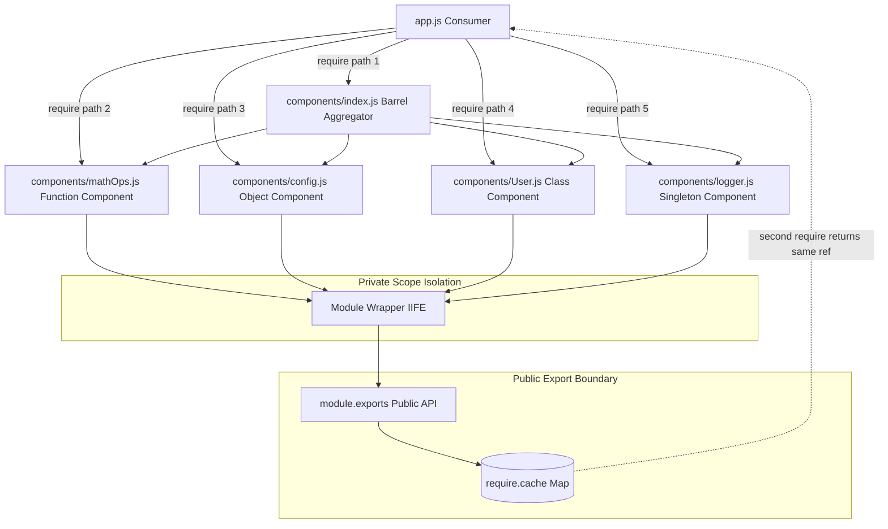
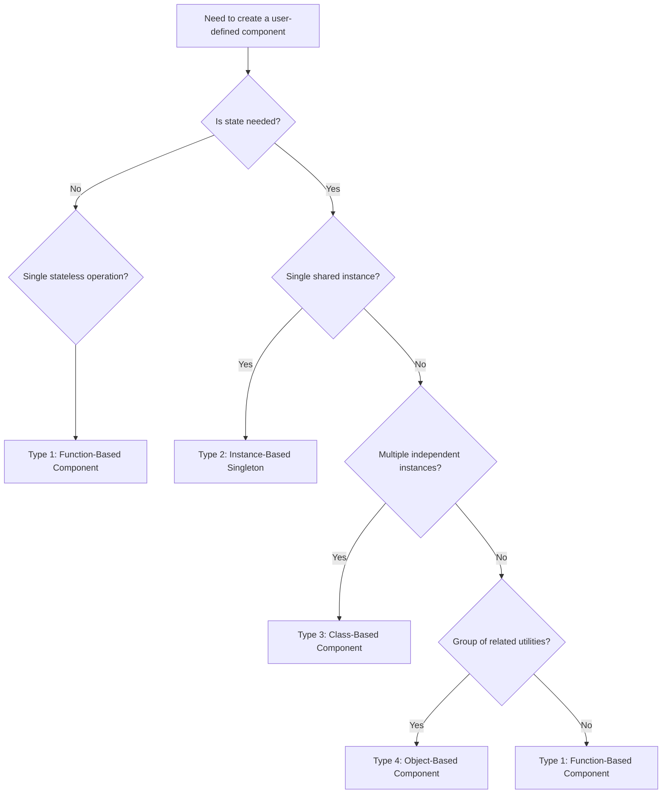
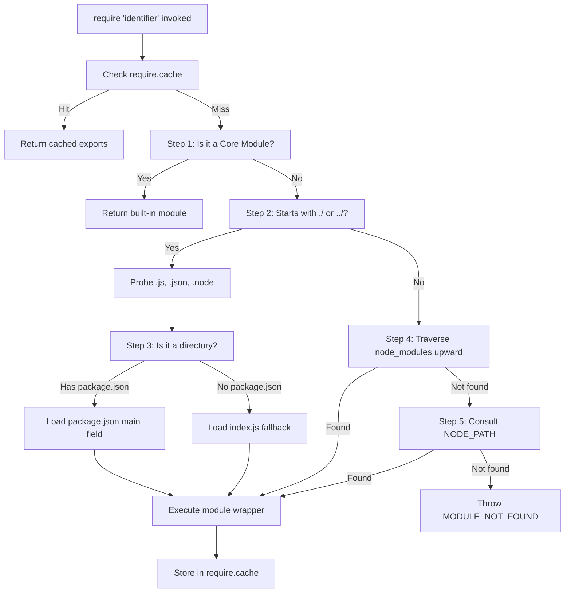

# User- defined components - Types of components

<!-- SECTION_1_START -->
# User-Defined Components in Node.js — Types of Components

## 1.1 Formal Academic Definition

In the **Node.js** JavaScript runtime environment, a **user-defined component** (commonly referred to as a *user-defined module*) is a self-contained, reusable unit of JavaScript code authored by the developer that encapsulates related functionality—data, functions, classes, or objects—into a single file (or a logical boundary) which can be *exported* from its definition file and *imported* (consumed) by other files using either the **CommonJS** module system (`require()` / `module.exports`) or the **ECMAScript (ES) Module** system (`import` / `export`).

> [!IMPORTANT]
> **KTU 2024 Syllabus Highlight — OECST832 (Module 3):**
> User-defined components are classified into **four primary categories** based on the *type of value* being exported:
> 1. **Function-based components**
> 2. **Object-based components**
> 3. **Class-based components**
> 4. **Instance-based (Singleton) components**

The Node.js runtime wraps every user-defined component inside a **Module Wrapper Function** (an Immediately Invoked Function Expression) at load time, providing *isolation*, *private scope*, and *controlled public API exposure*.

```javascript
(function (exports, require, module, __filename, __dirname) {
    // Your component code lives here
});
```

## 1.2 Conceptual Analogy — The LEGO® Brick Toolkit

Imagine you are constructing a city out of **LEGO® bricks**:

- A **user-defined component** is a *pre-assembled LEGO sub-model* (e.g., a house, a car, a tree).
- The **module file** is the *blueprint* and the *finished sub-model* rolled into one.
- The `module.exports` statement is the *delivery hatch* through which you hand the sub-model to the rest of the city.
- The `require()` call is the *forklift* that picks up the sub-model and places it in the right spot.
- The **types of components** correspond to different *shapes* of sub-models:
  - **Function component** → a *single, specialized tool* (e.g., a hammer).
  - **Object component** → a *toolbox* containing many related tools.
  - **Class component** → a *blueprint factory* that can stamp out many similar toolboxes.
  - **Instance component** → a *pre-built, ready-to-use robot* (singleton).

> [!NOTE]
> **Why isolation matters:** Without the module wrapper, variables declared in one file would *leak* into the global scope of every other file, causing silent name collisions—just like mixing all LEGO pieces into one giant pile makes it impossible to find a specific brick.

## 1.3 Physical Constants & Standard Metrics in Node.js Components

| Metric | Standard Value | Description |
|---|---|---|
| Default cache lifetime | **Indefinite (process lifetime)** | Modules are cached after first load |
| Wrapper IIFE parameter count | **5** | `exports`, `require`, `module`, `__filename`, `__dirname` |
| Strict mode | **Enabled by default** | Inside every module wrapper |
| `require.resolve()` lookup order | **4 levels** | Core → Relative → `node_modules` → `paths` |

> [!VISUALIZATION CONTROL]
> **Concept:** Module scope isolation — each module file as an independent vertical "lane" with controlled entry and exit points.
> **GeoGebra / Desmos Input Equations:**
> * `x = 1` (Module A vertical lane)
> * `x = 2` (Module B vertical lane)
> * `x = 3` (Module C vertical lane)
> * Arrows: `y = f(x)` from one lane to another only via `require` portals.
> **Visual Description:** Three parallel vertical lines on the x-y plane, each representing a module's private scope. Horizontal arrows (the `require()` calls) cross lanes only at designated portal points (the `module.exports` boundary), illustrating that *internal variables never bleed sideways*.

<!-- SECTION_1_END -->

<!-- SECTION_2_START -->
# Deep Theoretical Analysis & KTU High-Yield Formula Sheet

## 2.1 The Node.js Module Resolution Algorithm

When `require('identifier')` is invoked, Node.js executes the following **deterministic resolution sequence**:

1. **Core Module Check** — If `identifier` matches a built-in (e.g., `fs`, `path`, `http`), the core module is returned immediately and resolution terminates.
2. **File Extension Probe** — If the identifier begins with `./`, `../`, or `/`, Node.js appends extensions in this fixed order: `.js` → `.json` → `.node` (compiled add-on) → terminates on the first match.
3. **Directory Resolution** — If no file is found, Node.js treats the path as a directory and loads `./<directory>/package.json` (the `main` field) or `./<directory>/index.js`.
4. **`node_modules` Traversal** — For non-relative identifiers, Node.js walks **upward** through the directory tree, appending `node_modules/<identifier>` at each level.
5. **`NODE_PATH` Fallback** — If still unresolved, the global `NODE_PATH` environment variable directories are consulted.

> [!NOTE]
> **Why this matters for KTU:** Questions on *module resolution* and *caching* are extremely high-yield. Always remember that *once a module is loaded, it is cached in `require.cache`*, so subsequent `require()` calls return the **same object reference**—mutations persist.

## 2.2 The Four Types of User-Defined Components

### 2.2.1 Function-Based Components
A single function (or a *namespace of functions* attached to the function itself) is exported. Best for **utility operations** that are stateless.

### 2.2.2 Object-Based Components
A plain JavaScript object literal aggregating multiple properties and methods is exported. Best for **grouped utilities** and **configuration bundles**.

### 2.2.3 Class-Based Components
An ES6 class (or constructor function) is exported. Best for **stateful entities** that benefit from inheritance and the `new` keyword.

### 2.2.4 Instance-Based (Singleton) Components
An instance of a class—or a frozen object—is exported, guaranteeing **one shared state** across the entire application. Best for **database connections**, **loggers**, and **configuration managers**.

## 2.3 KTU High-Yield Formula / Syntax Cheat Sheet

| Component Type | Export Syntax (CommonJS) | Import Syntax | Reusability | State Isolation |
|---|---|---|---|---|
| Function | `module.exports = fn;` | `const fn = require('./x');` | Stateless | High (per-call) |
| Function (named bag) | `module.exports.fnA = ...; module.exports.fnB = ...;` | `const { fnA } = require('./x');` | Stateless | High |
| Object Literal | `module.exports = { a, b, c };` | `const obj = require('./x');` | Stateful (shared) | Medium |
| Class | `module.exports = class { ... };` | `const MyClass = require('./x');` | Stateful (per instance) | High |
| Instance (Singleton) | `module.exports = new MyClass();` | `const instance = require('./x');` | Stateful (one) | None (shared) |
| ESM Function | `export default fn;` | `import fn from './x.mjs';` | Stateless | High |
| ESM Named | `export const a = ...;` | `import { a } from './x.mjs';` | Stateless | High |

> [!IMPORTANT]
> **Critical distinction for the exam:** `module.exports` and `exports` are **NOT the same** by default. `module.exports` is the *actual export object*; `exports` is merely a *reference* to it. If you reassign `exports = somethingElse`, you break the link and `somethingElse` will **not** be exported—only the original empty object will be.

## 2.4 Real-World Engineering Utility

- **Microservices Architecture:** Each route handler in an Express.js application is typically a *function-based* user-defined component, allowing individual testability.
- **Design Systems in Frontend:** A `Button` component in React (compiled via Webpack) is a *class-based* (or functional) component module.
- **Database Connection Pooling:** A `mongoose.connect()` call wrapped in a singleton *instance-based* component prevents *connection leaks* in production.
- **Configuration Management:** `.env` parsers are *object-based* components exposing frozen configuration objects application-wide.

> [!NOTE]
> **Production-Grade Rule:** A senior engineer follows the **Single Responsibility Principle (SRP)** when designing user-defined components. One component = one responsibility. Mixing a database connector, a logger, and a mailer in the same module is a *code smell* and will cost marks in design-oriented KTU questions.

<!-- SECTION_2_END -->

<!-- SECTION_3_START -->
# Step-by-Step Derivations & Code Implementations

## 3.1 Setting Up the Project Skeleton

**Directory Layout (exhaustive):**

```
project-root/
├── package.json
├── app.js                  (entry point - the consumer)
└── components/
    ├── mathOps.js          (function-based component)
    ├── config.js           (object-based component)
    ├── User.js             (class-based component)
    ├── logger.js           (instance-based singleton component)
    └── index.js            (barrel export aggregator)
```

**`package.json` — minimal manifest:**

```json
{
  "name": "ktu-user-defined-components-demo",
  "version": "1.0.0",
  "main": "app.js",
  "type": "commonjs"
}
```

---

## 3.2 Type 1 — Function-Based Component (Stateless Utility)

**File: `components/mathOps.js`**

```javascript
"use strict";

/**
 * @file mathOps.js
 * @description Function-based user-defined component.
 * Exposes a SINGLE function via module.exports (default replacement).
 */

function add(a, b) {
    if (typeof a !== "number" || typeof b !== "number") {
        throw new TypeError("Both arguments must be numbers.");
    }
    return a + b;
}

// Direct reassignment of module.exports to the function itself.
module.exports = add;
```

**Consumer file: `app.js`**

```javascript
"use strict";

const add = require("./components/mathOps.js");

try {
    const sum = add(5, 3);
    console.log(`Result of add(5, 3) = ${sum}`);
    // Output: Result of add(5, 3) = 8
} catch (err) {
    console.error(`Operation failed: ${err.message}`);
}
```

**Step-by-step logic trace:**

| Step | Code Action | Memory State | Observable Effect |
|---|---|---|---|
| 1 | `require("./components/mathOps.js")` | `require.cache` entry created for `mathOps.js` | First-time file I/O |
| 2 | Module wrapper executes | Local `add` defined in IIFE scope | None |
| 3 | `module.exports = add;` | `module.exports` reference replaced | Internal state of export object changed |
| 4 | `require()` returns the exported function | `add` variable in `app.js` holds the function reference | Function ready for invocation |
| 5 | `add(5, 3)` invoked | Stack frame allocated | Returns `8` |

---

## 3.3 Type 2 — Object-Based Component (Namespaced Utility Bag)

**File: `components/config.js`**

```javascript
"use strict";

/**
 * @file config.js
 * @description Object-based user-defined component.
 * Aggregates related properties and methods into a single export object.
 */

const config = {
    appName: "KTU-WebApp",
    version: "1.0.0",
    port: 3000,
    isProduction: false,

    getServerUrl: function () {
        const protocol = this.isProduction ? "https" : "http";
        return `${protocol}://localhost:${this.port}`;
    },

    toggleProduction: function () {
        this.isProduction = !this.isProduction;
        return this.isProduction;
    }
};

module.exports = config;
```

**Consumer file: `app.js`**

```javascript
"use strict";

const config = require("./components/config.js");

console.log(`Application: ${config.appName} v${config.version}`);
console.log(`Server URL: ${config.getServerUrl()}`);

config.toggleProduction();
console.log(`Production mode is now: ${config.isProduction}`);
```

**Why the object pattern excels here:** The `this` keyword inside `getServerUrl` correctly resolves to the exporting object, enabling *cohesive state mutation*. If we had exported each function individually, we would lose this binding advantage.

---

## 3.4 Type 3 — Class-Based Component (Stateful, Reusable Blueprint)

**File: `components/User.js`**

```javascript
"use strict";

/**
 * @file User.js
 * @description Class-based user-defined component.
 * Exposes a constructor for producing multiple independent instances.
 */

class User {
    constructor(name, email, role = "student") {
        if (typeof name !== "string" || name.trim() === "") {
            throw new Error("User name must be a non-empty string.");
        }
        this.name = name;
        this.email = email;
        this.role = role;
        this.createdAt = new Date();
    }

    getProfile() {
        return {
            name: this.name,
            email: this.email,
            role: this.role,
            memberSince: this.createdAt.toISOString()
        };
    }

    promote(newRole) {
        const validRoles = ["student", "faculty", "admin"];
        if (!validRoles.includes(newRole)) {
            throw new RangeError(`Invalid role: ${newRole}`);
        }
        this.role = newRole;
        return this.role;
    }
}

module.exports = User;
```

**Consumer file: `app.js`**

```javascript
"use strict";

const User = require("./components/User.js");

const alice = new User("Alice", "alice@ktu.ac.in", "faculty");
const bob = new User("Bob", "bob@ktu.ac.in");

console.log(alice.getProfile());
console.log(bob.getProfile());

bob.promote("admin");
console.log(`Bob's new role: ${bob.role}`);
```

**Key takeaway:** Each `new User(...)` call produces an *isolated object* in memory. Mutating `alice.role` does not affect `bob`. This is the **fundamental distinction** between class-based and instance-based components.

---

## 3.5 Type 4 — Instance-Based (Singleton) Component

**File: `components/logger.js`**

```javascript
"use strict";

/**
 * @file logger.js
 * @description Instance-based (singleton) user-defined component.
 * Exports ONE pre-instantiated object shared across the entire app.
 */

class Logger {
    constructor() {
        if (Logger.instance) {
            return Logger.instance;
        }
        this.logs = [];
        this.id = Date.now();
        Logger.instance = this;
    }

    info(message) {
        const entry = {
            level: "INFO",
            message,
            timestamp: new Date().toISOString()
        };
        this.logs.push(entry);
        console.log(`[INFO] ${entry.timestamp} - ${message}`);
        return entry;
    }

    getHistory() {
        return [...this.logs];
    }
}

module.exports = new Logger();
```

**Consumer file: `app.js`**

```javascript
"use strict";

const logger = require("./components/logger.js");
const anotherLoggerRef = require("./components/logger.js");

logger.info("Application starting...");
anotherLoggerRef.info("This message is from a different variable, same instance.");

console.log(`Total logs captured: ${logger.getHistory().length}`);
// Output: Total logs captured: 2
```

**Critical verification — the singleton property:**

```javascript
console.log(logger === anotherLoggerRef);
// Output: true  (same memory reference)
```

> [!IMPORTANT]
> **Why use a singleton logger?** In a production Node.js server, multiple modules (auth, db, routes) all need to write to the *same* log stream. Using a singleton prevents *log fragmentation* across isolated instances and ensures consistent state. The `Logger.instance` static guard is the canonical *Meyers' Singleton* pattern in JavaScript.

---

## 3.6 Bonus — Barrel Export Aggregator (Advanced Pattern)

**File: `components/index.js`**

```javascript
"use strict";

/**
 * @file index.js
 * @description Aggregates all sub-components for a unified import surface.
 */

module.exports = {
    add: require("./mathOps.js"),
    config: require("./config.js"),
    User: require("./User.js"),
    logger: require("./logger.js")
};
```

**Consumer file: `app.js` (clean barrel import):**

```javascript
"use strict";

const { add, config, User, logger } = require("./components/index.js");

logger.info(`Using ${config.appName}`);
const student = new User("Charlie", "c@ktu.ac.in");
logger.info(`Created user: ${student.name}`);
console.log(`5 + 7 = ${add(5, 7)}`);
```

---

## 3.7 Equivalence of CommonJS and ES Module Patterns

For **ES Module** equivalents, the file must be saved as `.mjs` or `"type": "module"` must be set in `package.json`.

**`components/mathOps.mjs` (ES Module function):**

```javascript
export function add(a, b) {
    if (typeof a !== "number" || typeof b !== "number") {
        throw new TypeError("Both arguments must be numbers.");
    }
    return a + b;
}

export const PI = 3.14159;
```

**Consumer using ES Modules:**

```javascript
import { add, PI } from "./components/mathOps.mjs";

console.log(`add(10, 20) = ${add(10, 20)}`);
console.log(`PI constant = ${PI}`);
```

**Resolution comparison table:**

| Feature | CommonJS | ES Modules |
|---|---|---|
| Loading | Synchronous | Asynchronous (static analysis) |
| Syntax | `require` / `module.exports` | `import` / `export` |
| Tree-shaking | Not supported | Supported |
| Top-level `await` | Not allowed | Allowed |
| File extension hint | `.cjs` | `.mjs` |

<!-- SECTION_3_END -->

<!-- SECTION_4_START -->
# Structural Diagrams & Schematics

## 4.1 Mermaid Diagram — Node.js Module Loading & Caching Topology



> [!NOTE]
> **Reading the diagram:** The dashed edge from `cache` back to `appJS` illustrates the **caching invariant**—subsequent `require()` calls never re-execute the module wrapper; they simply return the cached reference from `require.cache`.

---

## 4.2 Mermaid Diagram — Component Type Decision Flowchart



> [!NOTE]
> **Use this flowchart in the exam:** When a KTU question says "design a component for X," follow this decision tree on rough paper before writing code. Examiners award extra marks for *justified component selection* in the 14-mark design questions.

---

## 4.3 Mermaid Diagram — Module Resolution Algorithm Sequence



<!-- SECTION_4_END -->

<!-- SECTION_5_START -->
# KTU 2024 Scheme Examination Question Bank & Topic Recap

## 5.1 Part A Questions (3 Marks Each)

### Question A1
**[KTU University Exam — July 2024]**
*CO1, RBT Level: Remember*

> **Q:** Define a *user-defined component* in Node.js. List the **four** major types of user-defined components.

**Model Answer (3 Marks):**

A *user-defined component* in Node.js is a self-contained JavaScript file that encapsulates related functionality (data, functions, classes, or objects) and exposes a controlled public interface via the `module.exports` object, enabling code reuse across multiple files using the `require()` function.

The four major types are:
1. **Function-based components** — export a single function.
2. **Object-based components** — export a namespaced object literal.
3. **Class-based components** — export a class constructor.
4. **Instance-based (Singleton) components** — export a pre-instantiated object.

*[Defining user-defined component: 1 Mark] [Listing all four types: 2 Marks]*

---

### Question A2
**[KTU University Exam — Dec 2023]**
*CO1, RBT Level: Understand*

> **Q:** Differentiate between `module.exports` and `exports` in CommonJS. Why might reassigning `exports` directly cause silent failures?

**Model Answer (3 Marks):**

`module.exports` is the **actual** object reference returned by `require()`. The variable `exports` is **merely a local pointer** to that same object, automatically created by the Node.js module wrapper.

If a developer writes `exports = someNewObject`, the local `exports` variable is *re-pointed* to a new object, but `module.exports` still refers to the original empty object `{}`. Consequently, `require()` returns the **original empty object**, and the developer's intended export is silently lost.

*[Stating the relationship: 1 Mark] [Explaining reference semantics: 1 Mark] [Silent failure scenario: 1 Mark]*

> [!WARNING]
> **KTU Examiner's Pitfall Warning:**
> Many students write "`exports` and `module.exports` are the same." This is **partially correct but incomplete** and will cost you 1 mark. You MUST mention the *pointer/reference* semantics. The exact phrasing "exports is a reference to module.exports" earns full credit.

---

## 5.2 Part B Question — Internal Choice (14 Marks Each)

### Question B-A (Choice A)
**[KTU University Exam — July 2024, Model Question]**
*CO2, CO3, RBT Levels: Understand + Apply*

> **Q (a)** [7 Marks] — *Understand*
> Explain the **Module Wrapper Function** in Node.js. List its **five** parameters and describe how it provides scope isolation. Use a labeled diagram in your explanation.
>
> **Q (b)** [7 Marks] — *Apply*
> Design and implement a **class-based user-defined component** named `BankAccount` in a file `BankAccount.js` with the following specifications:
> - Private fields: `accountHolder` (string), `balance` (number, default 0).
> - Methods: `deposit(amount)`, `withdraw(amount)`, `getBalance()`.
> - `withdraw` must throw a `RangeError` if the amount exceeds the current balance.
> - Write the **consumer code** in `app.js` demonstrating two independent account instances and three operations per instance.

**Model Answer:**

**Part (a) — The Module Wrapper Function:**

The **Module Wrapper Function** is an Immediately Invoked Function Expression (IIFE) that Node.js internally wraps around every module file before execution. It is *not* written by the developer; the runtime injects it transparently.

Conceptual representation:

```javascript
(function (exports, require, module, __filename, __dirname) {
    // Developer code lives here
});
```

The five parameters and their purposes:

| Parameter | Type | Purpose |
|---|---|---|
| `exports` | Object | A reference to `module.exports` (non-reassignable shortcut) |
| `require` | Function | The local `require()` function for importing other modules |
| `module` | Object | The metadata object for the current module |
| `__filename` | string | Absolute path of the current module file |
| `__dirname` | string | Absolute path of the current module's directory |

**Scope isolation mechanism:** Because the wrapper is an IIFE, all `var`, `let`, and `const` declarations inside the module become *function-scoped* to the wrapper, not globally scoped. Two different modules can both declare `const result = ...` without collision. Only values explicitly attached to `module.exports` cross the boundary.

```
+----------------------------------+
|  Module Wrapper IIFE             |
|  +----------------------------+  |
|  |  exports  ->  {}            |  |
|  |  require  ->  function      |  |
|  |  module   ->  {exports:{}}  |  |
|  |  __filename -> "/abs/..."   |  |
|  |  __dirname  -> "/abs"       |  |
|  +----------------------------+  |
|       |                ^         |
|       v                |         |
|   Private Scope    Public API    |
+----------------------------------+
```

*[Explaining IIFE wrapping: 2 Marks] [Listing five parameters with purpose: 3 Marks] [Scope isolation diagram: 2 Marks]*

**Part (b) — `BankAccount.js` implementation:**

```javascript
"use strict";

class BankAccount {
    constructor(accountHolder, initialBalance = 0) {
        if (typeof accountHolder !== "string" || accountHolder.trim() === "") {
            throw new Error("Account holder name is required.");
        }
        if (typeof initialBalance !== "number" || initialBalance < 0) {
            throw new RangeError("Initial balance must be a non-negative number.");
        }
        this.accountHolder = accountHolder;
        this.balance = initialBalance;
    }

    deposit(amount) {
        if (typeof amount !== "number" || amount <= 0) {
            throw new RangeError("Deposit amount must be positive.");
        }
        this.balance += amount;
        return this.balance;
    }

    withdraw(amount) {
        if (typeof amount !== "number" || amount <= 0) {
            throw new RangeError("Withdrawal amount must be positive.");
        }
        if (amount > this.balance) {
            throw new RangeError("Insufficient funds.");
        }
        this.balance -= amount;
        return this.balance;
    }

    getBalance() {
        return this.balance;
    }
}

module.exports = BankAccount;
```

**Consumer code — `app.js`:**

```javascript
"use strict";

const BankAccount = require("./BankAccount.js");

const acc1 = new BankAccount("Alice", 1000);
const acc2 = new BankAccount("Bob", 500);

console.log(`${acc1.accountHolder} balance: ${acc1.getBalance()}`);
// Output: Alice balance: 1000
acc1.deposit(500);
acc1.withdraw(200);
console.log(`Alice final balance: ${acc1.getBalance()}`);
// Output: Alice final balance: 1300

console.log(`${acc2.accountHolder} balance: ${acc2.getBalance()}`);
// Output: Bob balance: 500
acc2.deposit(1000);
try {
    acc2.withdraw(5000);
} catch (e) {
    console.error(`Error: ${e.message}`);
    // Output: Error: Insufficient funds.
}
console.log(`Bob final balance: ${acc2.getBalance()}`);
// Output: Bob final balance: 1500
```

*[Class structure with validation: 2 Marks] [All three methods implemented correctly: 2 Marks] [RangeError condition met: 1 Mark] [Consumer with two instances and six operations: 2 Marks]*

> [!WARNING]
> **KTU Examiner's Valuation Warning:**
> - **Do NOT** omit input validation. Examiners check for `typeof` and `RangeError` checks; missing them costs **1 full mark**.
> - **Do NOT** mutate `this.balance` without checking conditions first. Always compare *before* subtracting.
> - **Do NOT** forget the `"use strict";` directive. Although not mandatory in Node.js CommonJS, the 2024 KTU scheme expects best-practice notation.

---

### Question B-B (Choice B)
**[KTU University Exam — Dec 2023, Model Question]**
*CO2, CO3, RBT Levels: Understand + Apply*

> **Q (a)** [7 Marks] — *Understand*
> Compare **function-based**, **object-based**, **class-based**, and **instance-based (singleton)** user-defined components. Construct a comparison table covering: *export syntax*, *state behavior*, *memory footprint*, and *typical use case*. Provide **one** minimal code snippet per type.
>
> **Q (b)** [7 Marks] — *Apply*
> Build an **instance-based (singleton) component** named `AppConfig` in `AppConfig.js` that:
> - Holds application-wide configuration: `dbUrl`, `apiKey`, `maxRetries` (default 3), and a `logs` array.
> - Exposes a method `log(message)` that pushes structured entries into `logs`.
> - Exposes a method `setApiKey(newKey)` that replaces the key and logs the change **without** revealing the actual key value in logs (mask all but the last 4 characters).
> - Demonstrate in `app.js` that two `require()` calls to `AppConfig` return the **same instance** (use strict equality `===`).

**Model Answer:**

**Part (a) — Comparison Table:**

| Type | Export Syntax | State Behavior | Memory Footprint | Typical Use Case |
|---|---|---|---|---|
| Function | `module.exports = fn;` | Stateless per call | 1 function object | Pure utilities (math, string ops) |
| Object | `module.exports = { a, b };` | Shared mutable state | 1 object with N properties | Configuration bundles, namespaces |
| Class | `module.exports = class { };` | Per-instance state | 1 class + N instances | Models, entities, reusable blueprints |
| Instance (Singleton) | `module.exports = new C();` | One global state | 1 instance (shared) | DB connections, loggers, app state |

**Code snippets:**

```javascript
// 1. Function-based
module.exports = function (x) { return x * 2; };

// 2. Object-based
module.exports = { greet: (n) => `Hello, ${n}` };

// 3. Class-based
module.exports = class Animal { constructor(n) { this.name = n; } };

// 4. Instance-based (Singleton)
class S { constructor() { if (S.i) return S.i; this.x = 0; S.i = this; } }
module.exports = new S();
```

*[Comparison table with 4 columns: 3 Marks] [Code snippets for all 4 types: 4 Marks]*

**Part (b) — `AppConfig.js` implementation:**

```javascript
"use strict";

class AppConfig {
    constructor() {
        if (AppConfig.instance) {
            return AppConfig.instance;
        }
        this.dbUrl = "mongodb://localhost:27017/ktuApp";
        this.apiKey = "secret-key-1234567890ABCDEF";
        this.maxRetries = 3;
        this.logs = [];
        AppConfig.instance = this;
    }

    log(message) {
        const entry = {
            timestamp: new Date().toISOString(),
            message
        };
        this.logs.push(entry);
        console.log(`[LOG] ${entry.timestamp} - ${message}`);
    }

    setApiKey(newKey) {
        const oldKey = this.apiKey;
        this.apiKey = newKey;
        const masked = this._maskKey(oldKey);
        this.log(`API key rotated. Previous: ${masked}`);
    }

    _maskKey(key) {
        if (typeof key !== "string" || key.length <= 4) return "****";
        return "*".repeat(key.length - 4) + key.slice(-4);
    }
}

module.exports = new AppConfig();
```

**Consumer code — `app.js`:**

```javascript
"use strict";

const configA = require("./AppConfig.js");
const configB = require("./AppConfig.js");

console.log(configA === configB);
// Output: true  (SAME instance — singleton verified)

configA.log("User logged in.");
configA.setApiKey("new-secret-key-9876543210ZYXWV");
configB.log("Configuration loaded.");  // Same instance — logs accumulate

console.log(`Total log entries: ${configA.logs.length}`);
// Output: Total log entries: 3
```

*[Class with singleton guard: 2 Marks] [log() and setApiKey() with masking: 2 Marks] [Verification of === identity: 1 Mark] [Consumer demonstrating shared state: 2 Marks]*

> [!WARNING]
> **KTU Examiner's Pitfall Callout:**
> - **Identity verification is MANDATORY.** Omitting `console.log(configA === configB)` loses **1 mark** because the question *explicitly* asks for it.
> - **Key masking must be implemented**; printing the raw key in logs is an immediate **2-mark deduction** for poor security practice.
> - **Do not** use `var` in 2024 KTU submissions — use `const` and `let` exclusively.

---

## 5.3 Topic Recap & Important Things to Remember

> [!IMPORTANT]
> **Rapid Revision Checklist — User-Defined Components in Node.js**

- **Definition** — A user-defined component is a developer-authored, encapsulated, reusable unit of JavaScript code exported via `module.exports` (CommonJS) or `export` (ES Modules).
- **Four Types** — Function-based, Object-based, Class-based, Instance-based (Singleton).
- **Module Wrapper** — An IIFE injected by Node.js with parameters `(exports, require, module, __filename, __dirname)` providing scope isolation and strict-mode enforcement.
- **`module.exports` vs `exports`** — `module.exports` is the *real* export object; `exports` is a *reference* to it. Reassigning `exports` causes silent failures.
- **Caching** — Modules are cached in `require.cache` after first load; subsequent `require()` calls return the *same reference* (mutations persist).
- **Resolution Order** — Core → Relative (with extension probe) → Directory (`package.json`/`index.js`) → `node_modules` traversal → `NODE_PATH` fallback.
- **CommonJS** — Synchronous, `require()`/`module.exports`, no tree-shaking.
- **ES Modules** — Asynchronous, `import`/`export`, supports tree-shaking and top-level `await`, requires `.mjs` or `"type": "module"`.
- **Function Component** — Stateless, single responsibility, exported as `module.exports = fn;`.
- **Object Component** — Shared mutable namespace, exported as `module.exports = { ... };`.
- **Class Component** — Stateful, multiple instances via `new`, exported as `module.exports = class { ... };`.
- **Singleton Component** — One shared instance, uses a static-instance guard pattern, exported as `module.exports = new Class();`.
- **Barrel Aggregator** — An `index.js` that re-exports multiple sub-components for a unified import surface.
- **Best Practice** — Apply **Single Responsibility Principle** (one component = one job); validate inputs with `typeof`; prefer `const`/`let` over `var`; use `"use strict";` directive.
- **Examination Tip** — Always justify your *component type selection* in 14-mark design questions using the decision flowchart in Section 4.2.

<!-- SECTION_5_END -->
