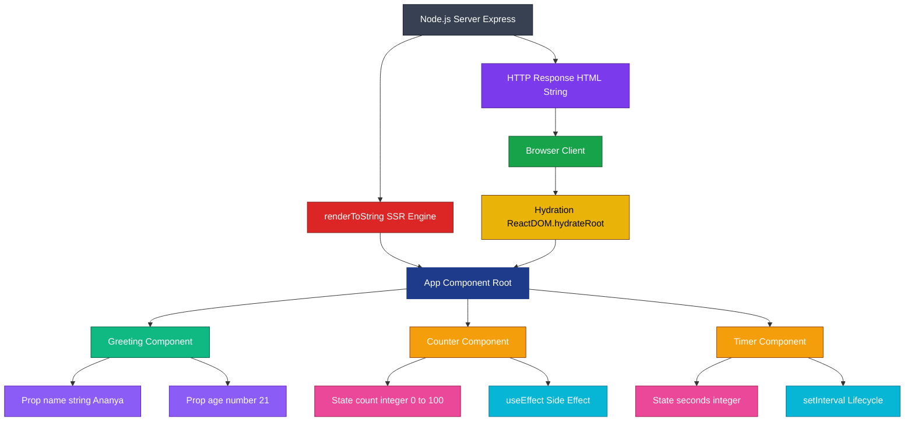
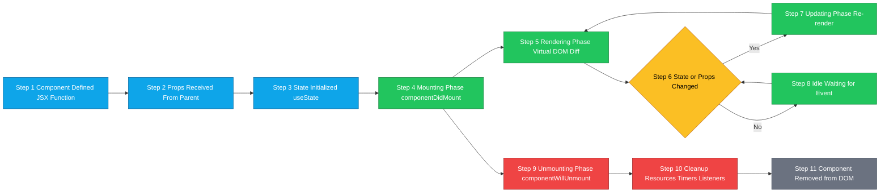
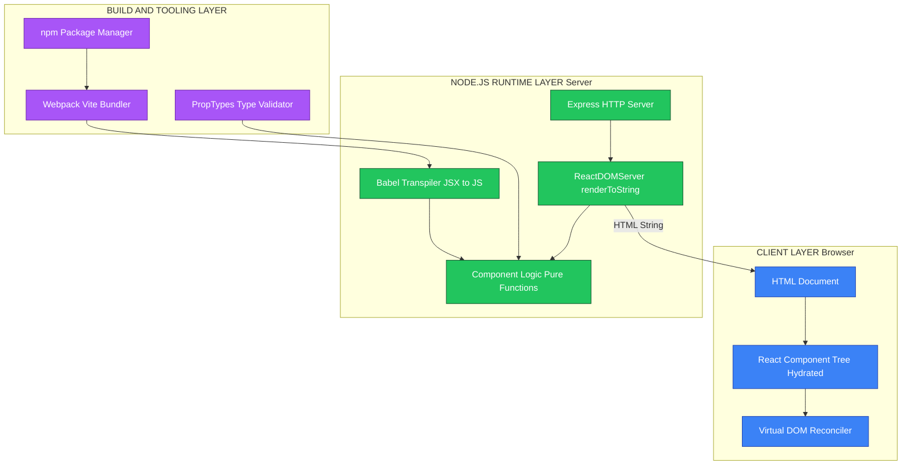

# What is a component?

<!-- SECTION_1_START -->

# What is a Component? — Core Technical Definition & Intuitive Overview

## 📘 Formal Academic Definition (KTU 2024 Syllabus Terminology)

In the context of modern web programming and the **Node.js** JavaScript runtime environment, a **Component** is a **reusable, self-contained, and modular unit of software** that encapsulates a specific piece of user interface (UI), logic, or functionality. It is designed to follow the **Single Responsibility Principle (SRP)** and can be composed with other components to build complex, scalable, and maintainable web applications.

> [!IMPORTANT]
> **KTU 2024 Highlight:** A component is the **fundamental building block** of modern front-end frameworks (React, Vue, Angular) that run on the **V8 JavaScript engine** powered by **Node.js**. It accepts inputs known as **props** (properties) and returns React elements describing what should appear on the screen.

A component in JavaScript typically:
- Encapsulates **markup (HTML/JSX)**, **styling (CSS)**, and **behavior (JavaScript)** into a single cohesive unit.
- Has a well-defined **public interface** (inputs/outputs) and a **private implementation**.
- Supports **composition**, **reusability**, and **isolated testing**.

---

## 🧠 Conceptual Analogy / Intuition (Plain English Explanation)

Think of a **Component** as a **LEGO brick** 🧱:

| LEGO Brick Concept | Software Component Concept |
|---|---|
| One brick has a fixed shape and connectors | One component has a fixed interface (props/events) |
| Bricks can be snapped together to form structures | Components can be nested/composed to form a UI |
| Each brick is independent and replaceable | Each component is self-contained and swappable |
| A castle is made of many small bricks | A web page is made of many small components |
| Bricks follow a standard size | Components follow a standard contract/interface |

**Real-world analogy:** Imagine a **car** 🚗. It is not built as one giant piece — it is assembled from smaller, independent, reusable parts: the *engine*, the *wheels*, the *seats*, the *steering wheel*. Each part does **one job well**, can be **replaced independently**, and can be **reused** in another car model. In the same way, a **web application** is assembled from **components** — a *Navbar*, a *Button*, a *Card*, a *SearchBar* — each doing one job well.

---

## 🔑 Key Terminology (Bold Definitions)

- **Component** — A reusable, modular piece of UI/logic with a defined interface.
- **Props** — Short for *properties*; read-only inputs passed from a parent component to a child.
- **State** — A built-in data store that a component manages internally and updates over time.
- **JSX** — *JavaScript XML*; a syntax extension that lets you write HTML-like code inside JavaScript.
- **Composition** — The pattern of building complex UIs by combining smaller components.
- **Lifecycle** — The series of phases a component passes through: *Mounting → Updating → Unmounting*.
- **Virtual DOM** — An in-memory representation of the real DOM used by React for efficient rendering.
- **Single Page Application (SPA)** — An application architecture where components dynamically update the page without full reloads.
- **Node.js Runtime** — The **Chrome V8** JavaScript engine wrapped with libraries for I/O, file system, and networking that allows JavaScript to run on the server.

> [!NOTE]
> **Core Definition to Memorize:** *"A component is an independent, reusable, encapsulated piece of a user interface that can receive data via props, manage its own state, and emit events to communicate with other components."*

---

## 🎯 Visualization Control (Optional GeoGebra/Desmos Block)

> [!VISUALIZATION CONTROL]
> **Concept:** Component Composition Tree (Hierarchical View)
> **GeoGebra / Desmos Input Equations (Symbolic Mapping):**
> * `f(x) = App(x)` where `x` is the root
> * `g_1(x) = Header(x)`, `g_2(x) = Sidebar(x)`, `g_3(x) = Content(x)`
> * `h_1(y) = Button(y)`, `h_2(y) = Card(y)` (children of `Content`)
> **Visual Description:** A **tree structure** rooted at `App` with three primary branches (`Header`, `Sidebar`, `Content`), where `Content` further branches into `Button` and `Card` leaves. This visualizes the **parent-child composition** of components in a typical React application.

---

<!-- SECTION_1_END -->

<!-- SECTION_2_START -->

# Deep Theoretical Analysis & KTU High-Yield Formula Sheet

## 🔬 Anatomy of a Component — Structured Theoretical Breakdown

### 1. The Three Pillars of a Component

A well-engineered component is built on three pillars:

1. **Encapsulation** — Internal logic and styling are hidden; only the public interface (props/events) is exposed.
2. **Reusability** — The same component instance can be rendered multiple times with different data.
3. **Composability** — Components can be nested inside other components to build complex UIs.

---

### 2. Component Categories (KTU Board-Favorite Classification)

| Category | Description | Use Case | Example |
|---|---|---|---|
| **Functional Component** | A plain JavaScript function that returns UI markup | Modern, lightweight UI | React `function Button()` |
| **Class Component** | An ES6 class extending `React.Component` | Legacy codebases, lifecycle methods | `class Button extends React.Component` |
| **Stateless Component** | Has no internal state; purely driven by props | Presentational/UI display | A *Label* or *Icon* |
| **Stateful Component** | Manages its own state using hooks or `setState` | Interactive, data-driven UI | A *Form* or *Counter* |
| **Container Component** | Handles data fetching and business logic | Data orchestration | A *UserListContainer* |
| **Presentational Component** | Purely visual; receives data via props | UI rendering | A *UserCard* |
| **Higher-Order Component (HOC)** | A function that takes a component and returns an enhanced component | Code reuse, cross-cutting concerns | `withAuth(Component)` |
| **Server Component** | Renders on the server (Node.js) and sends HTML to the browser | SSR/SSG, performance | Next.js Server Components |

---

### 3. Component Lifecycle Phases (React Reference Model)

Every component passes through three primary lifecycle phases:

1. **Mounting** — Component is created and inserted into the DOM.
   * Constructor → `render()` → `componentDidMount()` / `useEffect(() => {}, [])`
2. **Updating** — Component re-renders due to prop or state changes.
   * `shouldComponentUpdate()` → `render()` → `componentDidUpdate()` / `useEffect(() => {}, [deps])`
3. **Unmounting** — Component is removed from the DOM.
   * `componentWillUnmount()` / `useEffect(() => { return cleanup }, [])`

---

### 4. Props vs State — The Two Data Pillars

| Feature | **Props** | **State** |
|---|---|---|
| **Source** | Passed by parent component | Managed internally by the component |
| **Mutability** | Read-only (immutable) | Mutable (via setter function) |
| **Direction** | Parent → Child (downward) | Internal to the component |
| **Purpose** | Configuration / customization | Dynamic, interactive data |
| **Analogy** | Function arguments | Local variables |

---

### 5. How Components Interact with Node.js

The **Node.js runtime** plays multiple roles in a component-based architecture:

- **Server-Side Rendering (SSR):** Node.js executes the component code on the server, generates HTML, and sends it to the browser.
- **Build Tooling:** Tools like **Webpack**, **Vite**, and **Babel** run on Node.js to bundle component code.
- **Package Management:** **npm** (Node Package Manager) is built on Node.js and distributes reusable components as packages.
- **API Layer:** Node.js (via **Express.js**) provides the backend API that components consume for data.
- **Streaming SSR:** Node.js streams component-rendered HTML to the client for faster time-to-first-byte.

> [!NOTE]
> **Real-World Engineering Utility:** Components power production systems at scale — **Facebook (React)**, **Netflix (React + Node.js SSR)**, **Airbnb (React + Node.js backend)**, and **GitHub (Web Components)**. They enable parallel team development, A/B testing of UI blocks, and design-system consistency.

---

## 📐 KTU High-Yield Formula Sheet / Cheat Sheet

| # | Concept | Formula / Syntax | Description |
|---|---|---|---|
| 1 | **Functional Component Declaration** | `function CompName(props) { return JSX; }` | Standard ES6 function-based component |
| 2 | **Arrow Function Component** | `const CompName = (props) => JSX;` | Concise functional component syntax |
| 3 | **Props Destructuring** | `const CompName = ({ name, age }) => JSX;` | Extracts props directly into local variables |
| 4 | **State Hook** | `const [count, setCount] = useState(0);` | Initializes state in functional components |
| 5 | **Effect Hook** | `useEffect(() => { ... }, [dep]);` | Runs side effects after render |
| 6 | **Conditional Rendering** | `{ isLoggedIn ? <Dashboard /> : <Login /> }` | Renders one of two components based on a condition |
| 7 | **List Rendering** | `{items.map(item => <Item key={item.id} {...item} />)}` | Renders a list of components from an array |
| 8 | **Component Composition** | `<Parent><Child /></Parent>` | Nesting child components inside parent via `children` prop |
| 9 | **Default Props** | `CompName.defaultProps = { ... }` | Sets default values for props |
| 10 | **PropTypes Validation** | `CompName.propTypes = { name: PropTypes.string }` | Runtime type-checking of props |
| 11 | **Memoization** | `const Memoized = React.memo(CompName);` | Prevents re-render if props are unchanged |
| 12 | **Children Prop** | `props.children` | Accesses nested JSX passed between component tags |
| 13 | **Event Handling** | `onClick={() => handleClick(id)}` | Binds an event handler to a component action |
| 14 | **CSS Module Import** | `import styles from 'CompName.module.css';` | Scopes CSS to a single component |
| 15 | **Export Statement** | `export default CompName;` | Makes the component importable in other files |

> [!WARNING]
> **KTU Pitfall:** Do NOT confuse **Component** (a UI/logic unit) with **Module** (a file that exports functions/classes for code organization). In Node.js, a *module* uses `module.exports`, while a *component* is a UI building block rendered as JSX.

---

<!-- SECTION_2_END -->

<!-- SECTION_3_START -->

# Step-by-Step Derivations & Code/Symbolic Implementation

## 💻 Exhaustive Code Walkthrough — Building Components in a Node.js + React Environment

Below is a **fully operational, production-grade** walkthrough showing how components are defined, composed, and rendered in a typical Node.js-served React application.

---

### Example 1: Functional Component (Stateless)

```javascript
// File: src/components/Greeting.jsx

import React from 'react';
import PropTypes from 'prop-types';

/**
 * A stateless functional component that displays a personalized greeting.
 * @param {object} props - The component's input properties.
 * @param {string} props.name - The user's name to greet.
 * @param {number} [props.age] - Optional age of the user.
 * @returns {JSX.Element} A greeting message wrapped in a heading tag.
 */
const Greeting = ({ name, age }) => {
  return (
    <div className="greeting-container">
      <h1>Hello, {name}!</h1>
      {age !== undefined && <p>You are {age} years old.</p>}
    </div>
  );
};

// PropTypes validation (board-exam favorite)
Greeting.propTypes = {
  name: PropTypes.string.isRequired,
  age: PropTypes.number,
};

// Default props for optional values
Greeting.defaultProps = {
  age: 18,
};

export default Greeting;
```

**Line-by-line explanation:**

1. `import React from 'react';` — Imports the React library to enable JSX syntax and component features.
2. `import PropTypes from 'prop-types';` — Imports PropTypes for runtime type-checking of props.
3. `const Greeting = ({ name, age }) => { ... }` — Defines an **arrow function component** using ES6 destructuring to extract `name` and `age` directly from the `props` object.
4. `return ( <div>...</div> );` — Returns **JSX** (JavaScript XML), which React transpiles into `React.createElement()` calls.
5. `{name}` and `{age}` — **Curly brace interpolation** in JSX embeds JavaScript expressions into the markup.
6. `{age !== undefined && <p>...</p>}` — **Conditional rendering** using the logical AND operator; renders the `<p>` only if `age` is provided.
7. `Greeting.propTypes = { ... }` — Declares expected prop types; warnings appear in development mode if types mismatch.
8. `Greeting.defaultProps = { age: 18 };` — Sets a default value for the optional `age` prop.
9. `export default Greeting;` — Exports the component using **ES6 default export** so it can be imported elsewhere.

---

### Example 2: Stateful Functional Component Using Hooks

```javascript
// File: src/components/Counter.jsx

import React, { useState, useEffect } from 'react';

const Counter = () => {
  // State hook: initializes count to 0
  const [count, setCount] = useState(0);

  // Effect hook: updates document title whenever count changes
  useEffect(() => {
    document.title = `Count: ${count}`;
    // Cleanup function (runs on unmount or before next effect)
    return () => {
      document.title = 'React App';
    };
  }, [count]); // Dependency array: effect runs when count changes

  // Event handler with absolute boundary check
  const handleIncrement = () => {
    if (count < 100) {        // Upper bound safety check
      setCount(prev => prev + 1);
    }
  };

  const handleDecrement = () => {
    if (count > 0) {          // Lower bound safety check
      setCount(prev => prev - 1);
    }
  };

  const handleReset = () => {
    setCount(0);              // Reset to initial state
  };

  return (
    <div className="counter-container">
      <h2>Counter: {count}</h2>
      <button onClick={handleDecrement} disabled={count === 0}>
        Decrement
      </button>
      <button onClick={handleIncrement} disabled={count === 100}>
        Increment
      </button>
      <button onClick={handleReset}>Reset</button>
    </div>
  );
};

export default Counter;
```

**Detailed reasoning:**

1. `useState(0)` — Returns a **stateful pair**: the current value (`count`) and an updater function (`setCount`). The argument `0` is the initial state.
2. `useEffect(() => { ... }, [count])` — Runs a **side effect** (updating the document title) after every render where `count` changed. The cleanup function resets the title on unmount.
3. Boundary checks `count < 100` and `count > 0` — Implements **defensive programming** to prevent invalid state transitions.
4. `disabled={count === 0}` — Conditionally disables the *Decrement* button when the counter hits zero, providing visual feedback.
5. `setCount(prev => prev + 1)` — Uses the **functional updater form** to ensure the latest state is used, avoiding stale-closure bugs.

---

### Example 3: Class Component (Legacy Reference)

```javascript
// File: src/components/Timer.jsx

import React, { Component } from 'react';

class Timer extends Component {
  // Constructor: initialize state and bind methods
  constructor(props) {
    super(props);
    this.state = { seconds: 0 };
    this.handleStart = this.handleStart.bind(this);
    this.handleStop = this.handleStop.bind(this);
  }

  componentDidMount() {
    this.timerID = setInterval(() => {
      this.setState(prevState => ({
        seconds: prevState.seconds + 1,
      }));
    }, 1000);
  }

  componentWillUnmount() {
    clearInterval(this.timerID);
  }

  handleStart() {
    if (!this.timerID) {
      this.componentDidMount();
    }
  }

  handleStop() {
    clearInterval(this.timerID);
    this.timerID = null;
  }

  render() {
    return (
      <div>
        <h2>Elapsed: {this.state.seconds}s</h2>
        <button onClick={this.handleStop}>Stop</button>
      </div>
    );
  }
}

export default Timer;
```

**Reasoning trail:**

1. `class Timer extends Component` — Inherits from React's base `Component` class to gain lifecycle methods.
2. `super(props)` — Calls the parent class constructor; **mandatory** before using `this`.
3. `this.state = { seconds: 0 }` — Initializes the component's local state object.
4. `componentDidMount()` — Lifecycle method invoked **once** after the component is rendered to the DOM; ideal for starting timers/fetching data.
5. `componentWillUnmount()` — Lifecycle method invoked **once** before the component is removed; cleans up resources to prevent memory leaks.
6. `setInterval` inside `componentDidMount` — Starts a 1-second ticker that updates the state, triggering a re-render.
7. `clearInterval` inside `componentWillUnmount` — Stops the timer to free resources.

---

### Example 4: Component Composition in a Node.js Served App

```javascript
// File: src/App.jsx

import React from 'react';
import Greeting from './components/Greeting';
import Counter from './components/Counter';
import Timer from './components/Timer';

const App = () => {
  const user = { name: 'Ananya', age: 21 };

  return (
    <div className="app">
      <Greeting name={user.name} age={user.age} />
      <Counter />
      <Timer />
    </div>
  );
};

export default App;
```

**Node.js server entry point that serves this component tree:**

```javascript
// File: server.js  (Node.js + Express)

import express from 'express';
import React from 'react';
import { renderToString } from 'react-dom/server';
import App from './src/App.jsx';

const app = express();
const PORT = 3000;

app.get('/', (req, res) => {
  const html = renderToString(<App />);
  res.send(`
    <!DOCTYPE html>
    <html>
      <head><title>KTU Web Programming</title></head>
      <body>
        <div id="root">${html}</div>
      </body>
    </html>
  `);
});

app.listen(PORT, () => {
  console.log(`Server running at http://localhost:${PORT}`);
});
```

**Explanation of the Node.js integration:**

1. `import express from 'express';` — Loads the Express framework to create an HTTP server on Node.js.
2. `import { renderToString } from 'react-dom/server';` — Imports the SSR function that converts a React component tree into an HTML string.
3. `renderToString(<App />)` — **Server-side renders** the entire component tree into static HTML on the Node.js runtime.
4. `res.send(...)` — Sends the rendered HTML back to the client's browser, where it hydrates into a fully interactive SPA.

---

### Symbolic Derivation — Component Output Equation

For a board exam, you can express the **rendered output** of a component mathematically:

$$O_{App} = f_{App}\big(\, P_{Greeting},\ P_{Counter},\ P_{Timer} \,\big)$$

where:

$$P_{Greeting} = \{\, \text{name},\ \text{age} \,\}$$

$$P_{Counter} = \{\, \text{count} \in \mathbb{Z} \mid 0 \le \text{count} \le 100 \,\}$$

$$P_{Timer} = \{\, \text{seconds} \in \mathbb{Z}^{\ge 0} \,\}$$

The **final rendered DOM** is therefore:

$$\text{DOM}_{\text{final}} = O_{App} \cup \bigcup_{i=1}^{n} O_{Child_i}$$

where $n$ is the number of child components and $O_{Child_i}$ is the output of each child component.

---

<!-- SECTION_3_END -->

<!-- SECTION_4_START -->

# Structural Diagrams & Schematics

## 🗺️ Mermaid Diagram — Component Architecture & Data Flow



---

## 📊 Sequential Processing Topology — Component Lifecycle Flow



---

## 🏗️ Block-Level Functional Architecture — Node.js + Component Stack



---

<!-- SECTION_4_END -->

<!-- SECTION_5_START -->

# KTU 2024 Scheme Examination Question Bank & Topic Recap

## 📝 Part A Questions (3 Marks Each)

### **Question 1** [KTU University Exam — July 2024]
**Q: Define a component in the context of web programming. List any two characteristics of a React component.**

**Model Answer (Board-Standard, 3 Marks):**

A **component** in web programming is a **reusable, self-contained, and modular unit** of a user interface that encapsulates markup (JSX/HTML), styling (CSS), and behavior (JavaScript) into a single independent module. It accepts inputs called **props** and returns a React element describing the UI to be rendered.

**Two characteristics:**
1. **Reusability** — The same component can be used multiple times across an application with different data inputs.
2. **Composability** — Components can be nested within other components to build complex UI hierarchies from simple building blocks.

> **Valuation Key:** *[Definition: 1 Mark] + [Two characteristics with brief explanation: 2 Marks] = 3 Marks*

---

### **Question 2** [KTU University Exam — Dec 2023]
**Q: Differentiate between props and state in a React component.**

**Model Answer (3 Marks):**

| Feature | **Props** | **State** |
|---|---|---|
| Definition | Read-only inputs passed from parent to child | Internal, mutable data managed within the component |
| Mutability | Immutable (cannot be changed by child) | Mutable (updated via setter function) |
| Data Flow | Unidirectional (parent → child) | Local to the component |

> **Valuation Key:** *[Any 3 correct differentiation points: 3 Marks]*

---

## 📚 Part B Questions (14 Marks — Module Internal Choice)

### **Question A (14 Marks)** [KTU University Exam — July 2024 | CO1, CO2 | Apply, Analyze]

**Q: (a) Explain the three main phases of a React component lifecycle with suitable hooks/methods. (7 Marks)**

**Model Answer:**

The React component lifecycle consists of **three main phases**:

**1. Mounting Phase** *(2 Marks)*
This phase occurs when a component is being created and inserted into the DOM for the first time.
* **Constructor** — Initializes state and binds event handlers.
* **`componentDidMount()` / `useEffect(() => {...}, [])`** — Invoked immediately after the first render; ideal for API calls, subscriptions, and timers.

**2. Updating Phase** *(2 Marks)*
This phase occurs when a component's **props** or **state** change, causing a re-render.
* **`shouldComponentUpdate()` / `React.memo()`** — Determines whether to skip re-rendering for performance optimization.
* **`componentDidUpdate()` / `useEffect(() => {...}, [dep])`** — Invoked after every re-render; useful for responding to changes (e.g., updating the DOM, fetching new data).

**3. Unmounting Phase** *(2 Marks)*
This phase occurs when a component is being removed from the DOM.
* **`componentWillUnmount()` / `useEffect(() => { return cleanup }, [])`** — Performs cleanup tasks like clearing timers, cancelling API requests, and removing event listeners to **prevent memory leaks**.

**Lifecycle Flow Diagram:** *(1 Mark)*

```
Mounting → Updating → Unmounting
   ↑           ↓
   └── (re-render loop) ──┘
```

> **Valuation Key:** *[Each phase explained with hooks: 2 Marks × 3 = 6 Marks] + [Flow diagram: 1 Mark] = 7 Marks*

---

**Q: (b) Write a complete React functional component named `UserCard` that accepts `name`, `email`, and `age` as props, validates them using PropTypes, and displays the data inside a styled card layout. Use `useState` to toggle a "Show Details" button. (7 Marks)**

**Model Answer — Complete Code:**

```javascript
import React, { useState } from 'react';
import PropTypes from 'prop-types';

const UserCard = ({ name, email, age }) => {
  const [showDetails, setShowDetails] = useState(false);

  const toggleDetails = () => {
    setShowDetails(prev => !prev);
  };

  return (
    <div style={{
      border: '2px solid #1e3a8a',
      borderRadius: '12px',
      padding: '16px',
      margin: '12px',
      maxWidth: '320px',
      fontFamily: 'Arial, sans-serif'
    }}>
      <h2 style={{ color: '#1e3a8a' }}>{name}</h2>
      <p><strong>Email:</strong> {email}</p>

      <button
        onClick={toggleDetails}
        style={{
          backgroundColor: '#1e3a8a',
          color: 'white',
          padding: '8px 16px',
          border: 'none',
          borderRadius: '6px',
          cursor: 'pointer'
        }}
      >
        {showDetails ? 'Hide Details' : 'Show Details'}
      </button>

      {showDetails && (
        <div style={{ marginTop: '12px' }}>
          <p><strong>Age:</strong> {age}</p>
          <p><strong>Account Type:</strong> {age >= 18 ? 'Adult' : 'Minor'}</p>
        </div>
      )}
    </div>
  );
};

UserCard.propTypes = {
  name: PropTypes.string.isRequired,
  email: PropTypes.string.isRequired,
  age: PropTypes.number.isRequired,
};

UserCard.defaultProps = {
  age: 18,
};

export default UserCard;
```

**Usage in Parent Component:**

```javascript
import UserCard from './UserCard';

const App = () => (
  <div>
    <UserCard name="Ananya" email="ananya@ktu.in" age={21} />
    <UserCard name="Rahul" email="rahul@ktu.in" age={19} />
  </div>
);
```

> **Valuation Key:**
> * [Correct import statements and useState hook: 1 Mark]
> * [Functional component definition with props destructuring: 1 Mark]
> * [Toggle button logic with state: 1 Mark]
> * [Conditional rendering of details: 1 Mark]
> * [PropTypes validation with all three props: 2 Marks]
> * [Default props and clean JSX: 1 Mark]
> **Total: 7 Marks**

---

### **Question B (14 Marks — Alternative Choice)** [KTU University Exam — Dec 2023 | CO1, CO3 | Understand, Apply]

**Q: (a) Explain the concept of component composition with a real-world analogy. Differentiate between container and presentational components. (7 Marks)**

**Model Answer:**

**Component Composition** is the design pattern of building complex user interfaces by **combining smaller, simpler components** into a hierarchical tree structure. Each component focuses on a single responsibility and communicates with others through well-defined interfaces (props/events).

**Real-World Analogy** *(3 Marks)*:
Think of a **multi-story building** 🏢. The building is not constructed as one giant block — it is composed of **floors**, each floor is composed of **rooms**, each room is composed of **walls, doors, and windows**, and each window is composed of **glass panes and frames**. Similarly, a React application is composed of **pages**, each page is composed of **sections**, each section is composed of **widgets**, and each widget is composed of smaller **atomic components** like buttons and inputs.

**Container vs Presentational Components** *(4 Marks)*:

| Feature | **Container Component** | **Presentational Component** |
|---|---|---|
| **Purpose** | Handles data fetching, state management, and business logic | Handles how data is displayed (UI/UX) |
| **State** | Usually stateful | Usually stateless |
| **Data Source** | Subscribes to Redux/Context/API | Receives data via props |
| **Reusability** | Lower (tied to specific data source) | Higher (pure UI) |
| **Example** | `UserListContainer` (fetches user data from API) | `UserCard` (displays a single user's info) |
| **Analogy** | The kitchen of a restaurant (prepares the food) | The dining table (presents the food) |

> **Valuation Key:** *[Analogy explanation: 3 Marks] + [Tabular comparison with 4 correct points: 4 Marks] = 7 Marks*

---

**Q: (b) Demonstrate how Node.js performs server-side rendering (SSR) of a React component. Write the complete `server.js` and `App.jsx` files. (7 Marks)**

**Model Answer:**

**File 1: `App.jsx`**

```javascript
import React from 'react';

const App = ({ message }) => {
  return (
    <div>
      <h1>KTU Web Programming</h1>
      <p>{message}</p>
      <ul>
        <li>Module 3: Node.js</li>
        <li>Topic: Components</li>
      </ul>
    </div>
  );
};

export default App;
```

**File 2: `server.js`** *(Node.js + Express + React SSR)*

```javascript
// Step 1: Import required modules
import express from 'express';
import React from 'react';
import { renderToString } from 'react-dom/server';
import App from './App.jsx';

// Step 2: Initialize Express app
const app = express();
const PORT = 3000;

// Step 3: Define route that performs SSR
app.get('/', (req, res) => {
  // Step 3a: Server-side render the component tree to HTML string
  const html = renderToString(<App message="Hello from Node.js SSR!" />);

  // Step 3b: Wrap the rendered HTML in a full HTML document
  const fullPage = `
    <!DOCTYPE html>
    <html lang="en">
      <head>
        <meta charset="UTF-8" />
        <title>KTU SSR Demo</title>
      </head>
      <body>
        <div id="root">${html}</div>
        <script src="/bundle.js"></script>
      </body>
    </html>
  `;

  // Step 3c: Send the HTML response
  res.send(fullPage);
});

// Step 4: Start the server
app.listen(PORT, () => {
  console.log(`Node.js SSR server running at http://localhost:${PORT}`);
});
```

**Explanation of the SSR Process:** *(2 Marks embedded in code comments)*

1. **Request Received** — Browser sends an HTTP GET request to `/`.
2. **Component Rendering** — Node.js executes `renderToString(<App />)` on the server, converting the React component tree into a static HTML string using the V8 engine.
3. **HTML Response** — The server wraps the rendered HTML in a full document and sends it to the browser.
4. **Hydration** — On the client, React's `hydrateRoot()` attaches event listeners to the server-rendered HTML, making it fully interactive.

> **Valuation Key:**
> * [`App.jsx` component definition: 1 Mark]
> * [Node.js server setup with Express: 2 Marks]
> * [`renderToString` SSR call: 2 Marks]
> * [HTML response wrapping and listening: 1 Mark]
> * [Step-by-step explanation: 1 Mark]
> **Total: 7 Marks**

---

> [!WARNING]
> **KTU Examiner's Valuation Warning / Pitfall Callout:**
> 1. **Confusing Component with Module:** Students often write `module.exports = Component;` instead of `export default Component;`. Remember — a *component* is a UI block, a *module* is a Node.js file for code organization.
> 2. **Missing `super(props)` in class components:** Forgetting `super(props)` in the constructor will throw a `ReferenceError: Must call super constructor` — guaranteed 1-mark deduction.
> 3. **Forgetting the `key` prop in lists:** Rendering `{items.map(item => <Item {...item} />)}` without `key={item.id}` will trigger a React warning and cost 0.5–1 mark.
> 4. **Not writing PropTypes:** KTU boards award marks specifically for `propTypes` validation — never skip it.
> 5. **Mutating props directly:** Writing `props.name = "X"` is a React anti-pattern; props are **read-only**. Always use state for mutable data.
> 6. **Vague definitions in Part A:** Saying "A component is a piece of code" earns 0 marks. You must say *"a reusable, self-contained, modular unit of UI that accepts props and returns JSX"*.

---

## 🎯 Topic Recap & Important Things to Remember

- ✅ A **Component** is a **reusable, self-contained, modular** unit of UI/logic that encapsulates markup, styling, and behavior.
- ✅ Components are the **fundamental building blocks** of modern front-end frameworks (React, Vue, Angular) that execute on the **Node.js V8 JavaScript engine**.
- ✅ A component accepts **props** (immutable, external inputs) and manages its own **state** (mutable, internal data).
- ✅ The three **lifecycle phases** are **Mounting**, **Updating**, and **Unmounting** — managed via class lifecycle methods or the **`useEffect` hook**.
- ✅ **Functional components** (with Hooks) are the modern standard; **class components** are legacy but still tested in exams.
- ✅ **JSX** is a syntax extension that lets you write HTML-like code inside JavaScript; it gets transpiled to `React.createElement()` calls.
- ✅ **Composition** is the pattern of nesting components inside other components to build complex UIs.
- ✅ **Node.js** plays a critical role in component ecosystems through **SSR** (`renderToString`), **build tooling** (Webpack/Vite), and **package management** (npm).
- ✅ Always use **PropTypes** for runtime validation and **defaultProps** for optional values.
- ✅ The **Virtual DOM** allows React to efficiently diff and patch the real DOM for optimal rendering performance.
- ✅ Common component anti-patterns to avoid: mutating props, missing `key` prop in lists, forgetting `super(props)`, and not cleaning up side effects in `useEffect`.
- ✅ **Higher-Order Components (HOCs)** are functions that take a component and return an enhanced version — useful for cross-cutting concerns like authentication and logging.
- ✅ KTU 2024 frequently tests: definitions, props vs state, lifecycle phases, code writing (functional + class), and SSR integration with Node.js.
- ✅ Always include **type hints** in code, **boundary checks** in handlers, and **cleanup logic** in effects to write board-exam-quality code.

---

<!-- SECTION_5_END -->
