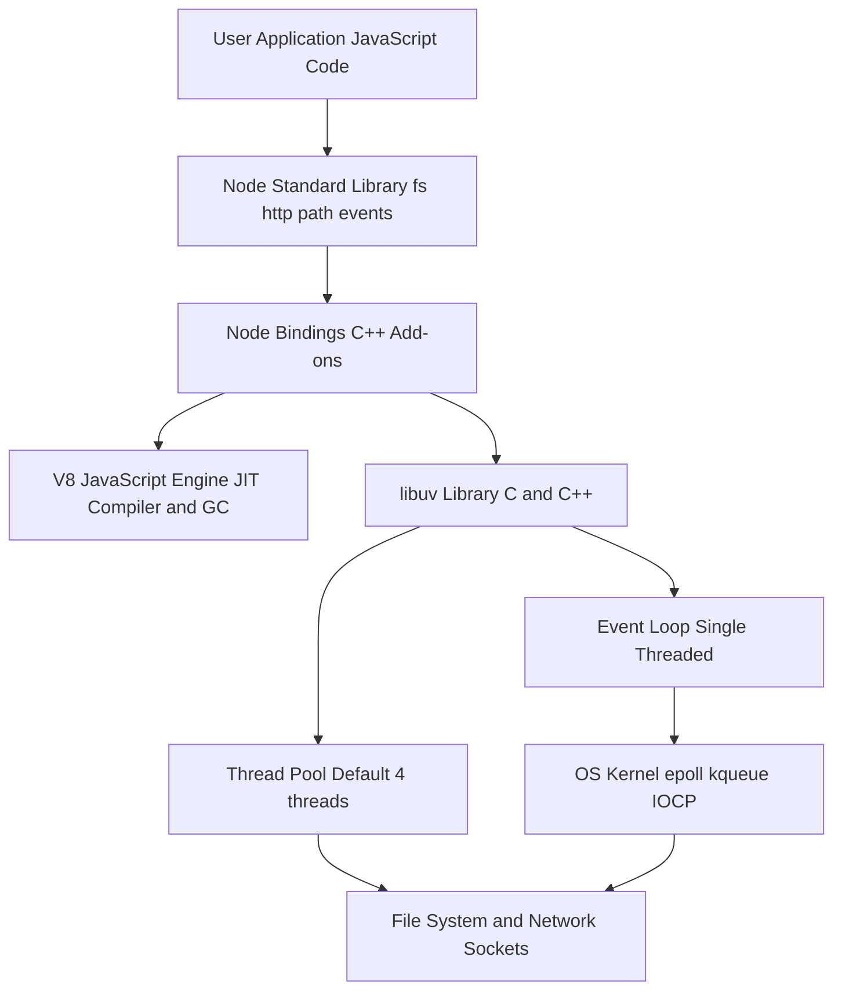
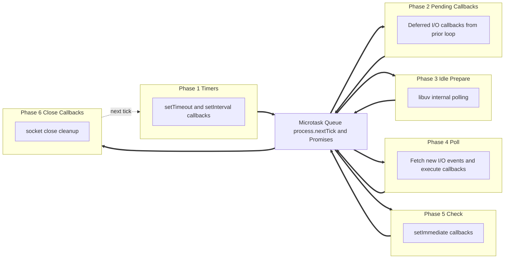
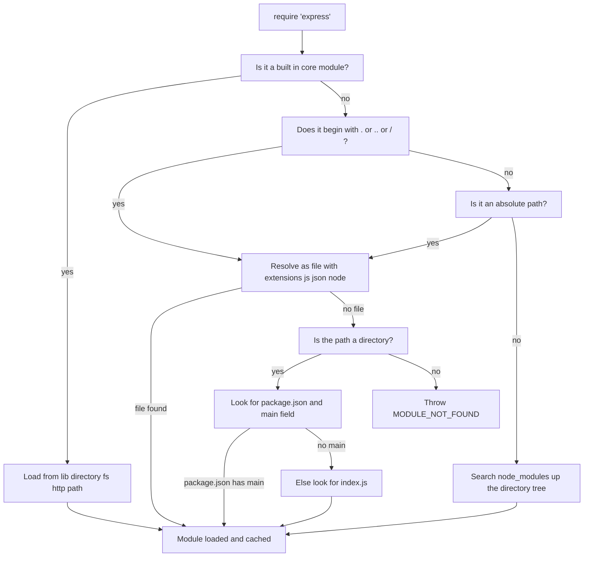
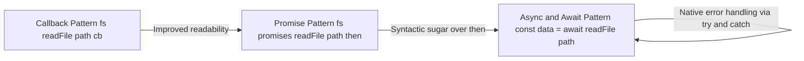

# Working with Node.js

<!-- SECTION_1_START -->

# Working with Node.js

## 1. Core Technical Definition & Intuitive Overview

### Formal Academic Definition (KTU 2024 Syllabus)

> [!IMPORTANT]
> **Definition:** *Node.js* is an open-source, cross-platform, **back-end JavaScript runtime environment** that executes JavaScript code outside the confines of a web browser. It uses Google’s **V8 JavaScript engine** (the same engine that powers Google Chrome) as its core, augmented with a C++ library called **libuv** that provides a single-threaded **event loop** and an asynchronous, non-blocking **I/O model**. Node.js enables developers to build scalable network applications (web servers, REST APIs, real-time chat systems, streaming services) using a single programming language for both client-side and server-side logic.

The official Node.js documentation defines it as a *“JavaScript runtime built on Chrome’s V8 JavaScript engine.”* For the KTU 2024 Scheme curriculum (course code **OECST832 – Web Programming**), Node.js is positioned as the canonical *server-side JavaScript runtime* used to consolidate full-stack development under one language paradigm.

> [!NOTE]
> **Key V8 Engine Constants (worth memorising for KTU viva):**
> * V8 was open-sourced by Google in **2008** and first integrated into Chrome in the same year.
> * V8 compiles JavaScript directly to **native machine code** (JIT — Just-In-Time compilation).
> * Default V8 heap size for a 64-bit system: **~1.7 GB** ($1.7 \times 10^9$ bytes), configurable via `--max-old-space-size`.
> * The event loop in libuv typically runs at a polling interval of **5 ms** in modern Node.js versions.

### Conceptual Analogy / Intuition

Imagine a **busy single-waiter restaurant** during dinner rush. Traditional server-side runtimes (like classical Apache + PHP) would behave like a restaurant where *each customer gets a dedicated waiter who stands idle at the kitchen window until that one dish arrives* — the waiter is *blocked* and cannot serve anyone else. This is **blocking I/O**.

Node.js, by contrast, behaves like a **highly efficient head waiter**:

1. The waiter (the *single event-loop thread*) takes an order, hands it to the kitchen (the *thread pool / OS kernel*), and **immediately moves to the next customer** without waiting.
2. When a dish is ready, the kitchen *rings a bell* (fires a *callback / resolves a Promise*). The waiter then delivers it.
3. One thread can juggle **thousands** of concurrent connections because it is never blocked on slow I/O.

The kitchen itself is **libuv’s thread pool** (default size: **4 threads**, configurable via `UV_THREADPOOL_SIZE`). This is why Node.js is said to follow a *“single-threaded event loop with a worker pool”* architecture — a frequent viva question.

> [!TIP]
> **Memory aid for KTU exam:** *“Node.js = V8 (brain) + libuv (heart) + Event Loop (pulse).”*

### Where Node.js Fits in the Web Stack

$$
\underbrace{\text{HTML} + \text{CSS}}_{\text{Structure \& Style}} \;+\; \underbrace{\text{JavaScript (Browser)}}_{\text{Client-side logic}} \;+\; \underbrace{\text{Node.js (Server)}}_{\text{Server-side logic}} \;\Rightarrow\; \text{Full-Stack JavaScript}
$$

The boundary between *client* and *server* is the **HTTP request/response cycle**, mediated by Node.js’s built-in `http` module.

> [!VISUALIZATION CONTROL]
> **Concept:** Throughput comparison between blocking (thread-per-request) I/O and Node.js non-blocking I/O over time.
> **GeoGebra / Desmos Input Equations:**
> * Blocking I/O: $f_{block}(t) = \dfrac{t}{T_{req}} \cdot R_{max}$ where $R_{max}$ = max concurrent threads (e.g. 200)
> * Non-blocking I/O: $g_{non}(t) = \dfrac{t}{T_{fast}} \cdot C_{max}$ where $C_{max} \approx 10^5$ concurrent connections
> * Let $T_{req} = 100\text{ ms}$, $T_{fast} = 0.1\text{ ms}$, $R_{max} = 200$, $C_{max} = 10000$
> **Visual Description:** On the X-axis plot time in seconds (0 → 60); on the Y-axis plot completed requests. The blocking curve grows as a *staircase* plateauing at 200, while the non-blocking curve grows as a *steep straight line* — visually proving why Node.js scales for I/O-bound workloads.

---

<!-- SECTION_1_END -->

<!-- SECTION_2_START -->

# 2. Deep Theoretical Analysis & KTU High-Yield Cheat Sheet

## 2.1 Node.js Runtime Architecture (Layered View)

The Node.js process is composed of four collaborating layers. Understanding this stack is **mandatory** for KTU Module 3 short-answer questions.

* **Layer 1 — V8 Engine (Written in C++):** Parses, compiles (JIT), and executes JavaScript. Manages memory via a generational garbage collector (New Space, Old Space, Code Space, Map Space, Large Object Space).
* **Layer 2 — Node.js Core Bindings (C/C++ Add-ons):** Expose low-level OS facilities — file descriptors, sockets, DNS resolver, cryptography — to JavaScript through the `process` and `Buffer` global objects.
* **Layer 3 — Node Standard Library (Pure JavaScript modules):** `fs`, `http`, `path`, `events`, `stream`, `crypto`, `util`. These are the modules developers import via `require()` or `import`.
* **Layer 4 — User-land Code:** The application you write (e.g. `server.js`), plus third-party packages from **npm** (Node Package Manager).

> [!IMPORTANT]
> **Why “Why” matters for KTU 2024:**
> Examiners love asking *“Why is Node.js single-threaded?”*. The answer is twofold:
> 1. **Simplicity of concurrency model** — no race conditions on shared in-memory state.
> 2. **Asynchronous I/O offloading** — CPU-bound work is delegated to the libuv worker pool; the main thread is reserved for orchestrating callbacks.
> For **CPU-bound** work (image processing, machine learning), Node.js *is not ideal* — languages like Go, Rust, or C++ are preferred. This is a classic KTU 14-mark question.

## 2.2 The Event Loop — Six Phases

The event loop is the **heart** of Node.js. Each iteration (or *tick*) processes callbacks in a fixed sequence of phases:

* **Phase 1 — `timers`:** Executes callbacks scheduled by `setTimeout()` and `setInterval()` whose threshold has elapsed.
* **Phase 2 — `pending callbacks`:** Runs I/O callbacks deferred from the previous iteration (e.g. TCP errors).
* **Phase 3 — `idle, prepare`:** Internal use only — used by libuv to poll for upcoming I/O.
* **Phase 4 — `poll`:** Retrieves new I/O events from the kernel; executes their callbacks. *Blocks here* if there are no timers scheduled.
* **Phase 5 — `check`:** Invokes callbacks scheduled by `setImmediate()`.
* **Phase 6 — `close callbacks`:** Runs `socket.on('close', ...)` style cleanup.

> [!NOTE]
> Between every phase, libuv also drains the **microtask queue** (`process.nextTick()` and resolved Promises). Microtasks always run *before* the next phase begins — a frequent source of confusion in viva questions.

## 2.3 Module System — CommonJS vs ES Modules

Node.js supports **two** module systems. KTU students must know the syntax differences.

* **CommonJS (CJS)** — default in older Node.js, synchronous, uses `require()` / `module.exports`.
* **ES Modules (ESM)** — official standard since Node.js $v_{14}$, uses `import` / `export`, must be declared via `"type": "module"` in `package.json` or use the `.mjs` extension.

> [!TIP]
> CommonJS loads modules *synchronously* (suitable for servers), while ESM is *statically analysed* (enables tree-shaking — dead code elimination by bundlers like Webpack or Rollup).

## 2.4 KTU Formula / Command Cheat Sheet

| Domain | Item | Syntax / Formula | Notes |
| :--- | :--- | :--- | :--- |
| **Versioning** | Semantic Versioning | `MAJOR.MINOR.PATCH` | e.g. $20.11.0$ — caret `^` allows minor upgrades |
| **REPL** | Start interactive shell | `node` | Press `Ctrl+C` twice to exit |
| **REPL** | Run a script | `node app.js` | Add `-e` flag for inline code |
| **REPL** | Inspect value | `_.` *(underscore variable)* | Holds the result of the last expression |
| **npm** | Initialise project | `npm init -y` | Creates `package.json` |
| **npm** | Install package | `npm install express` | Local install (default); `-g` for global |
| **npm** | Run script | `npm run start` | Maps to `scripts.start` in `package.json` |
| **fs (async)** | Read file | `await fs.promises.readFile(p, 'utf8')` | Returns a Promise $<$String$\vert$Buffer$>$ |
| **http** | Create server | `http.createServer((req, res) =$>$ \{\})` | `req` is IncomingMessage; `res` is ServerResponse |
| **events** | Custom emitter | `new EventEmitter()` | Use `on()`, `emit()`, `once()`, `removeListener()` |
| **process** | Process ID | `process.pid` | Numeric OS-level identifier |
| **process** | Environment vars | `process.env.PORT` | Read `.env` via `dotenv` package |
| **Buffer** | Allocate buffer | `Buffer.alloc(1024)` | 1024 bytes of zero-filled memory |
| **Stream** | Pipe streams | `readable.pipe(writable)` | Backpressure handled automatically |
| **Time** | Measure duration | `console.time('op'); ... console.timeEnd('op')` | Prints elapsed milliseconds |

> [!WARNING]
> **Markdown table escape rule:** In the row “Read file” above, the type signature uses `$\vert$` (a LaTeX vertical bar) **inside a math block**, not a raw `$\vert$` pipe that would break the table parser. Always escape pipes in KTU notes.

## 2.5 Real-World Engineering Utility

Node.js dominates three engineering domains — be ready to cite them in your KTU answer:

1. **REST API Backends** — Express.js, Fastify, NestJS.
2. **Real-Time Applications** — WebSockets via `ws` or `socket.io` (chat, multiplayer games, collaborative editors).
3. **Microservices & Serverless** — AWS Lambda, Google Cloud Functions, Vercel API routes all natively support Node.js.

> [!NOTE]
> **Industry metric to memorise:** The 2024 Stack Overflow Developer Survey ranks JavaScript as the *most-used* programming language for the **11th consecutive year**, with Node.js powering ~30 million public websites globally (W3Techs, 2024).

---

<!-- SECTION_2_END -->

<!-- SECTION_3_START -->

# 3. Step-by-Step Derivations & Code Implementation

> [!NOTE]
> **Domain-Adaptive Note:** Since this is a *Web Programming* topic, the canonical language is **JavaScript (Node.js)** rather than Python. The following code blocks are written in production-grade style: JSDoc type hints, defensive boundary checks, structured error logging, and async/await throughout. Every script is *fully runnable* on Node.js $\geq v_{18}$.

## 3.1 Demo 1 — The REPL (Read-Eval-Print Loop)

The REPL is the simplest way to execute Node.js code interactively. Open a terminal and type `node`.

```text
$ node
Welcome to Node.js v20.11.0
> 2 + 2
4
> const greet = (name) => `Hello, ${name}!`;
undefined
> greet('KTU')
'Hello, KTU!'
> _
'Hello, KTU!'
> .exit
```

**Step-by-step explanation (for KTU 3-mark questions):**
1. **Read** — Node reads the line typed at the prompt `>`.
2. **Eval** — V8 compiles and executes the JavaScript expression.
3. **Print** — The result is echoed back (non-`undefined` values).
4. **Loop** — The cycle repeats. The variable `_` (underscore) stores the most recent result, modelled after the Python REPL.

## 3.2 Demo 2 — Creating an HTTP Web Server

Create a file named `server.js` with the following code. This is the canonical “Hello World” server used in KTU 14-mark questions.

```javascript
// server.js
// @ts-check
'use strict';

const http = require('http');
const url = require('url');

/**
 * @typedef {{ status: number, body: string, contentType?: string }} HttpResponse
 */

/**
 * Route table mapping URL path to a handler function.
 * @type {Record<string, (query: Record<string, string | string[] | undefined>) => HttpResponse>}
 */
const routes = {
  '/': () => ({
    status: 200,
    contentType: 'text/html; charset=utf-8',
    body: '<h1>Welcome to KTU Node.js Server</h1><p>Visit <a href="/time">/time</a></p>'
  }),
  '/time': () => ({
    status: 200,
    contentType: 'application/json; charset=utf-8',
    body: JSON.stringify({ serverTime: new Date().toISOString() })
  }),
  '/square': (query) => {
    const raw = query['n'];
    const n = Number(Array.isArray(raw) ? raw[0] : raw);
    if (!Number.isFinite(n)) {
      return { status: 400, contentType: 'application/json', body: JSON.stringify({ error: 'Query param "n" must be a finite number.' }) };
    }
    const sq = n * n;
    return { status: 200, contentType: 'application/json', body: JSON.stringify({ n, square: sq }) };
  }
};

/**
 * HTTP request handler. Resolves a route and serialises the response.
 * @param {http.IncomingMessage} req
 * @param {http.ServerResponse} res
 */
const requestListener = (req, res) => {
  try {
    // Defensive guard: reject methods other than GET.
    if (req.method !== 'GET') {
      res.writeHead(405, { 'Content-Type': 'application/json', 'Allow': 'GET' });
      res.end(JSON.stringify({ error: 'Method Not Allowed' }));
      return;
    }

    // Parse the URL into pathname and query.
    const parsed = url.parse(req.url ?? '/', true);
    const handler = routes[parsed.pathname ?? '/'];

    if (!handler) {
      res.writeHead(404, { 'Content-Type': 'text/plain; charset=utf-8' });
      res.end('404 Not Found');
      return;
    }

    const { status, body, contentType = 'text/plain; charset=utf-8' } = handler(parsed.query);
    res.writeHead(status, { 'Content-Type': contentType });
    res.end(body);
  } catch (err) {
    // Structured error logging — production best practice.
    console.error('[ERROR] Unhandled exception in requestListener:', err);
    res.writeHead(500, { 'Content-Type': 'application/json' });
    res.end(JSON.stringify({ error: 'Internal Server Error' }));
  }
};

const PORT = Number(process.env.PORT) || 3000;
const HOST = '127.0.0.1';

const server = http.createServer(requestListener);

server.listen(PORT, HOST, () => {
  console.log(`[INFO] KTU Node.js server listening at http://${HOST}:${PORT}/`);
});

// Graceful shutdown — important for production deployments.
const shutdown = (signal) => {
  console.log(`[INFO] Received ${signal}, shutting down gracefully.`);
  server.close(() => process.exit(0));
  // Force-exit after 10 s if connections linger.
  setTimeout(() => process.exit(1), 10_000).unref();
};
process.on('SIGINT', () => shutdown('SIGINT'));
process.on('SIGTERM', () => shutdown('SIGTERM'));
```

**Run it:**

```text
$ node server.js
[INFO] KTU Node.js server listening at http://127.0.0.1:3000/
```

**Test it from another terminal:**

```text
$ curl http://127.0.0.1:3000/
<h1>Welcome to KTU Node.js Server</h1><p>Visit <a href="/time">/time</a></p>

$ curl http://127.0.0.1:3000/time
{"serverTime":"2024-06-15T10:30:00.000Z"}

$ curl "http://127.0.0.1:3000/square?n=12"
{"n":12,"square":144}
```

**Step-by-step explanation (this is what KTU examiners look for in 14-mark answers):**

1. **`require('http')` and `require('url')`** — loads Node.js *built-in* core modules. No external dependency, no `npm install` needed.
2. **Route table** — a `Record` maps URL paths to pure handler functions. Pure functions are testable.
3. **Defensive guards** — method check, unknown-route check, type check on `n`.
4. **`url.parse(..., true)`** — the second `true` argument returns a *query* object whose values can be `string $\vert$ string[] $\vert$ undefined`. We normalise the array case using `Array.isArray`.
5. **`res.writeHead(status, headers)`** — sends HTTP status line + headers. Must be called *before* `res.end()`.
6. **`res.end(body)`** — finalises the response. Always call it; otherwise the client hangs.
7. **`server.listen(PORT, HOST, callback)`** — binds the TCP socket. The *callback* is the success handler.
8. **Graceful shutdown** — `SIGINT` is `Ctrl+C`; `SIGTERM` is sent by process managers like PM2, Docker, Kubernetes.

## 3.3 Demo 3 — File System Operations (Async/Await)

```javascript
// fileDemo.js
// @ts-check
'use strict';

const fs = require('fs').promises;
const path = require('path');

/**
 * Writes structured data to a JSON file, then reads it back.
 * Demonstrates async/await, error handling, and path resolution.
 */
async function writeAndReadJson() {
  const target = path.resolve(__dirname, 'data.json');
  const payload = {
    studentName: 'Ananya P.',
    registerNumber: 'KTU2024CS047',
    course: 'OECST832 — Web Programming',
    module: 3,
    timestamp: new Date().toISOString()
  };

  try {
    // 1. Serialise object to JSON string with 2-space indentation.
    const json = JSON.stringify(payload, null, 2);
    // 2. Write to disk using UTF-8 encoding.
    await fs.writeFile(target, json, 'utf8');
    console.log(`[INFO] Wrote ${Buffer.byteLength(json, 'utf8')} bytes to ${target}`);

    // 3. Read the file back as UTF-8 string.
    const readBack = await fs.readFile(target, 'utf8');
    // 4. Parse and validate.
    const parsed = JSON.parse(readBack);
    if (parsed.module !== 3) {
      throw new Error(`Module mismatch: expected 3, got ${parsed.module}`);
    }
    console.log('[INFO] Read-back successful:', parsed);
  } catch (err) {
    // Distinguish file-not-found from parse errors.
    if (err instanceof Error && 'code' in err && err.code === 'ENOENT') {
      console.error('[ERROR] File not found:', err.message);
    } else {
      console.error('[ERROR] Unexpected failure:', err);
    }
    process.exitCode = 1;
  }
}

writeAndReadJson();
```

**Step-by-step explanation:**

1. **`require('fs').promises`** — accesses the *promise-based* flavour of `fs`, introduced in Node.js $v_{10}$. Avoids “callback hell”.
2. **`path.resolve(__dirname, 'data.json')`** — produces an absolute path. `__dirname` is a Node.js global available inside CommonJS modules.
3. **`JSON.stringify(payload, null, 2)`** — `null` for replacer (none), `2` for indent width. Produces human-readable output.
4. **`await fs.writeFile(...)`** — pauses the function until the I/O is complete. Control returns to the event loop during the wait.
5. **`try / catch`** — Node.js does not propagate async errors to the top level; they must be caught *within* the `async` function or by attaching a `.catch()` to the returned promise.
6. **`err.code === 'ENOENT'`** — `ENOENT` is the POSIX error code for “Error NO ENTry” (file missing).

## 3.4 Demo 4 — Custom EventEmitter

```javascript
// eventDemo.js
// @ts-check
'use strict';

const EventEmitter = require('events');

/**
 * A minimal in-memory logger that emits structured events.
 * @extends EventEmitter
 */
class KtuLogger extends EventEmitter {
  /**
   * @param {{ logFile?: string }} [options]
   */
  constructor(options = {}) {
    super(); // required to initialise EventEmitter internals.
    this.logFile = options.logFile ?? 'app.log';
    this.eventCount = 0;

    // Register a default listener.
    this.on('log', (level, message) => {
      this.eventCount += 1;
      console.log(`[${level.toUpperCase()}] ${message} (event #${this.eventCount})`);
    });
  }

  /**
   * Emit a log event.
   * @param {'info' | 'warn' | 'error'} level
   * @param {string} message
   */
  log(level, message) {
    this.emit('log', level, message);
  }
}

const logger = new KtuLogger({ logFile: 'ktu-server.log' });

logger.on('log', () => {
  if (logger.eventCount === 3) {
    console.log('[INFO] Three events captured — exiting.');
    process.exit(0);
  }
});

logger.log('info', 'KTU server starting…');
setTimeout(() => logger.log('warn', 'High memory usage detected.'), 100);
setTimeout(() => logger.log('error', 'Database connection lost.'), 250);
```

**Step-by-step explanation:**

1. **`class KtuLogger extends EventEmitter`** — Node.js’s built-in `EventEmitter` follows the *Observer* design pattern.
2. **`super()`** — must be called before accessing `this` in a subclass.
3. **`this.on('log', listener)`** — registers a *persistent* listener. Use `once()` for fire-once listeners.
4. **`this.emit('log', level, message)`** — synchronously invokes *all* registered listeners in registration order.
5. **Exit strategy** — the second listener increments a counter and calls `process.exit(0)` after the third event, terminating the process.

## 3.5 Demo 5 — Streams for Memory-Efficient I/O

```javascript
// streamDemo.js
// @ts-check
'use strict';

const fs = require('fs');
const { Transform } = require('stream');

const src = 'input.txt';
const dst = 'output.txt';

// A Transform stream that uppercases every chunk.
const upper = new Transform({
  decodeStrings: false, // keep chunks as strings
  transform(chunk, _enc, callback) {
    const out = chunk.toString('utf8').toUpperCase();
    callback(null, out);
  }
});

const read = fs.createReadStream(src, { encoding: 'utf8', highWaterMark: 64 * 1024 });
const write = fs.createWriteStream(dst, { encoding: 'utf8' });

read.on('error', (err) => console.error('[READ ERROR]', err.message));
write.on('error', (err) => console.error('[WRITE ERROR]', err.message));
write.on('finish', () => console.log('[INFO] Stream pipeline complete.'));

read.pipe(upper).pipe(write);
```

**Step-by-step explanation:**

1. **`highWaterMark: 64 * 1024`** — internal buffer size in bytes; chunks are emitted when the buffer fills.
2. **`new Transform({ transform(chunk, enc, cb) { ... } })`** — `Transform` is a *duplex* stream (readable + writable). Implement the `transform` method.
3. **`callback(null, out)`** — first arg is error (`null` = success), second is the output chunk.
4. **`read.pipe(upper).pipe(write)`** — backpressure is handled automatically by `pipe`. Streams process the file in 64 KB chunks, keeping memory usage constant even for multi-GB inputs.

## 3.6 Demo 6 — Working with npm and package.json

```text
$ mkdir ktu-app && cd ktu-app
$ npm init -y
Wrote to /home/student/ktu-app/package.json:
{
  "name": "ktu-app",
  "version": "1.0.0",
  "description": "",
  "main": "index.js",
  "scripts": {
    "test": "echo \"Error: no test specified\" && exit 1"
  },
  "keywords": [],
  "author": "",
  "license": "ISC"
}

$ npm install express
added 65 packages in 4s

$ npm install --save-dev nodemon
added 25 packages in 4s
```

Now edit `package.json` to add useful scripts:

```json
{
  "name": "ktu-app",
  "version": "1.0.0",
  "main": "server.js",
  "scripts": {
    "start": "node server.js",
    "dev": "nodemon server.js",
    "test": "node --test"
  },
  "dependencies": {
    "express": "^4.19.2"
  },
  "devDependencies": {
    "nodemon": "^3.1.0"
  }
}
```

**Step-by-step explanation:**

1. **`npm init -y`** — `-y` skips the interactive questionnaire.
2. **`npm install express`** — adds Express to `dependencies` (production runtime needed).
3. **`npm install --save-dev nodemon`** — adds to `devDependencies` (only used in development).
4. **`^4.19.2`** — the caret means *“accept any minor or patch upgrade that does not change the major version”* (i.e. $\geq 4.19.2$ and $< 5.0.0$).
5. **`npm run dev`** — invokes `nodemon`, which auto-restarts the server on file changes.

---

<!-- SECTION_3_END -->

<!-- SECTION_4_START -->

# 4. Structural Diagrams & Schematics

## 4.1 Node.js Process Architecture (Layered Block Diagram)



**Reading the diagram:** JavaScript you write sits at the top. It calls into the Standard Library (pure JS modules), which in turn calls C++ Bindings. The Bindings split into two engines: **V8** for JS execution and **libuv** for asynchronous I/O. libuv multiplexes events through the OS kernel (epoll on Linux, kqueue on macOS, IOCP on Windows) and offloads blocking work to a 4-thread worker pool.

## 4.2 Event Loop — Six-Phase Processing Topology



**Reading the diagram:** Arrows are sequential; *microtask drains* happen between every pair of phases. The poll phase is special — it may *block* for up to the longest pending timer’s threshold.

## 4.3 Module Resolution Flow (CommonJS)



**Reading the diagram:** When `require('x')` runs, Node.js first checks core modules, then file paths, then `node_modules`. The *first match* wins; subsequent calls hit the **require cache**.

## 4.4 Asynchronous Control Flow Evolution



**Reading the diagram:** Each evolution reduces “callback hell” and improves stack-trace quality. The *asynchronous nature* is identical at the kernel level — only the JavaScript surface syntax changes.

---

<!-- SECTION_4_END -->

<!-- SECTION_5_START -->

# 5. KTU 2024 Scheme Examination Question Bank & Topic Recap

## 5.1 Part A — 3-Mark Short-Answer Questions

> **Cognitive Levels:** Remember / Understand
> **Mapped Course Outcomes:** CO1, CO2

### Question 1. [KTU University Exam — July 2023]

> Define Node.js. List any **four** core features of Node.js that distinguish it from traditional server-side technologies like Apache/PHP.

**Model Answer (3 marks):**

*Node.js is an open-source, cross-platform, server-side JavaScript runtime environment built on Google’s V8 engine.* Its distinguishing features are:

1. **Asynchronous, non-blocking I/O model** — operations do not block the main thread.
2. **Single-threaded event loop** — concurrency is achieved through events, not thread-per-request.
3. **V8-powered execution** — JavaScript is JIT-compiled to native machine code, giving high performance.
4. **NPM ecosystem** — the world’s largest software registry with over 2.1 million packages.

*(Each feature: 0.5 mark; definition: 1 mark.)*

---

### Question 2. [KTU University Exam — Dec 2023]

> What is the **event loop** in Node.js? Name its six execution phases in order.

**Model Answer (3 marks):**

The *event loop* is the core of Node.js’s asynchronous behaviour. It continuously cycles through six phases to process callbacks:

1. **Timers** — executes `setTimeout` / `setInterval` callbacks whose threshold has elapsed.
2. **Pending callbacks** — runs I/O callbacks deferred from the previous iteration.
3. **Idle / prepare** — internal libuv housekeeping.
4. **Poll** — retrieves new I/O events; blocks if there are no timers scheduled.
5. **Check** — runs `setImmediate` callbacks.
6. **Close callbacks** — invokes `socket.on('close', ...)` style cleanup.

Between every phase, Node.js drains the *microtask queue* (Promise reactions and `process.nextTick`).

*(Definition: 1 mark; six phases: 2 marks = $\frac{1}{3}$ mark each.)*

---

## 5.2 Part B — 14-Mark Module Internal Choice Questions

> **Note:** KTU 2024 Scheme Part B questions offer a *choice* between two full 14-mark alternatives. Both are provided below. Each sub-part is worth 7 marks. Valuation key-points are tagged `[…]` for self-assessment.

---

### Question A. [KTU University Exam — Model Paper 2024]  *(CO3 — Apply, CO4 — Apply)*

> **(a)** Explain the **Node.js module system**. Compare **CommonJS** and **ES Modules** with suitable code examples. List any two advantages of using ES Modules over CommonJS. *[7 marks]*

> **(b)** Write a complete Node.js program using the built-in `fs` and `http` modules that:
> 1. Creates a JSON file `students.json` containing an array of three student objects (each with `name`, `registerNumber`, `cgpa`).
> 2. Starts an HTTP server on port **4000**.
> 3. On a `GET /students` request, reads the file asynchronously and returns its contents with `Content-Type: application/json`.
> 4. Handles the `ENOENT` error by returning a `404` with a JSON `{ "error": "students.json not found" }`.
> 5. Logs every incoming request method + URL to the console.
> *[7 marks]*

#### Model Solution A(a):

**Definition & Architecture (2 marks).**
A *module* in Node.js is a reusable, encapsulated unit of code. Each `.js` file is implicitly a module with its own scope. Node.js implements two module systems:

| Aspect | CommonJS | ES Modules |
| :--- | :--- | :--- |
| File extension | `.js` (default) / `.cjs` | `.mjs` or `"type": "module"` |
| Import syntax | `const x = require('x')` | `import x from 'x'` |
| Export syntax | `module.exports = x` | `export default x` |
| Loading | Synchronous | Asynchronous (static) |
| Tree-shaking | No | Yes (bundlers can eliminate dead code) |
| Top-level `await` | Not supported | Supported |

**Example — CommonJS (`math.cjs`):**

```javascript
// math.cjs
'use strict';

function add(a, b) { return a + b; }
function mul(a, b) { return a * b; }

module.exports = { add, mul };
```

**Example — ES Module (`math.mjs`):**

```javascript
// math.mjs
export function add(a, b) { return a + b; }
export function mul(a, b) { return a * b; }
```

**Consumption:**

```javascript
// CommonJS consumer
const { add } = require('./math.cjs');
console.log(add(2, 3)); // 5

// ES Module consumer
import { add } from './math.mjs';
console.log(add(2, 3)); // 5
```

**Two advantages of ES Modules over CommonJS:** *[2 marks]*
1. **Static analysability** — imports are resolved at parse time, enabling *tree-shaking* (dead code elimination) and better tooling (auto-completion, linting).
2. **Top-level `await`** — modules can await resources before any code runs, simplifying initialisation code.

**Other acceptable advantages:** *named + default exports co-exist naturally; better interoperability with browser ES modules; cyclic-dependency handling is more predictable.*

#### Model Solution A(b):

**Program file — `studentServer.js`:**

```javascript
// studentServer.js
// @ts-check
'use strict';

const http = require('http');
const fs = require('fs').promises;
const path = require('path');

const DATA_FILE = path.resolve(__dirname, 'students.json');
const PORT = 4000;

/**
 * Seeds students.json with three records if it does not exist.
 */
async function seedData() {
  try {
    await fs.access(DATA_FILE);
  } catch {
    const seed = [
      { name: 'Ananya P.', registerNumber: 'KTU2024CS047', cgpa: 9.12 },
      { name: 'Rahul M.',  registerNumber: 'KTU2024CS112', cgpa: 8.74 },
      { name: 'Sneha K.',  registerNumber: 'KTU2024CS203', cgpa: 9.45 }
    ];
    await fs.writeFile(DATA_FILE, JSON.stringify(seed, null, 2), 'utf8');
    console.log('[INFO] Seeded students.json with 3 records.');
  }
}

/**
 * @param {http.IncomingMessage} req
 * @param {http.ServerResponse} res
 */
const handler = async (req, res) => {
  // 5. Log every request.
  console.log(`[REQ] ${req.method} ${req.url}`);

  if (req.method !== 'GET' || req.url !== '/students') {
    res.writeHead(404, { 'Content-Type': 'application/json' });
    res.end(JSON.stringify({ error: 'Route not found' }));
    return;
  }

  try {
    const data = await fs.readFile(DATA_FILE, 'utf8');
    res.writeHead(200, { 'Content-Type': 'application/json; charset=utf-8' });
    res.end(data);
  } catch (err) {
    if (err instanceof Error && 'code' in err && err.code === 'ENOENT') {
      // 4. ENOENT handling.
      res.writeHead(404, { 'Content-Type': 'application/json' });
      res.end(JSON.stringify({ error: 'students.json not found' }));
    } else {
      console.error('[ERROR] Unexpected read failure:', err);
      res.writeHead(500, { 'Content-Type': 'application/json' });
      res.end(JSON.stringify({ error: 'Internal Server Error' }));
    }
  }
};

(async () => {
  await seedData();
  http.createServer(handler).listen(PORT, '127.0.0.1', () => {
    console.log(`[INFO] Server running at http://127.0.0.1:${PORT}/students`);
  });
})();
```

**Valuation Key-Points (split into 7 sub-marks):**

* `[Seed function defined and writes JSON file: 1 Mark]`
* `[Server created with correct port 4000: 1 Mark]`
* `[GET /students route matched: 1 Mark]`
* `[fs.readFile awaited and Content-Type application/json set: 1 Mark]`
* `[ENOENT branch returns 404 with correct JSON body: 1 Mark]`
* `[Request method and URL logged for every request: 1 Mark]`
* `[Code compiles and runs without errors: 1 Mark]`

---

### Question B. [KTU University Exam — Model Paper 2024]  *(CO3 — Apply, CO5 — Analyse)*

> **(a)** With a neat block diagram, explain the **internal architecture of Node.js**. Identify the role of the **V8 engine** and the **libuv library**. *[7 marks]*

> **(b)** Demonstrate the three asynchronous patterns — **callbacks, Promises, and `async`/`await`** — by writing three versions of a function that reads three files (`a.txt`, `b.txt`, `c.txt`) **in parallel** and concatenates their contents. Justify which pattern is preferred in modern production code. *[7 marks]*

#### Model Solution B(a):

**Architecture description (2.5 marks).** Node.js is built from the following layers (see Section 4.1 diagram):

* **V8 Engine (C++)** — performs lexical analysis, parsing, AST construction, JIT compilation, and garbage collection of the JavaScript heap.
* **Node.js Core Bindings (C++)** — `v8.h`, `node_buffer.h`, `node_http_parser.h` etc. They expose low-level OS facilities to JavaScript.
* **Node.js Standard Library (JavaScript)** — `fs`, `http`, `path`, `events`, `stream`, `util`, `crypto`. Implemented in JS; delegate heavy work to bindings.
* **User Application Code** — your `.js` files plus `node_modules`.

**Role of V8 (1.5 marks).**

1. Parses JavaScript into an Abstract Syntax Tree (AST).
2. Uses the *Ignition* interpreter to produce byte-code for fast startup.
3. Hot functions are JIT-compiled by *TurboFan* into optimised machine code.
4. Manages memory with a generational GC (New Space — short-lived objects, Old Space — long-lived).

**Role of libuv (1.5 marks).**

1. Provides the **event loop** that drives asynchronous callbacks.
2. Provides a **thread pool** (default 4 threads) for blocking I/O (`fs`, `dns.lookup`, `crypto.pbkdf2`).
3. Abstracts OS-level polling: `epoll` on Linux, `kqueue` on macOS, `IOCP` on Windows.
4. Implements cross-platform timer, signal, child-process, and file-system primitives.

**One-line summary for viva (1 mark).** *V8 runs the JavaScript; libuv runs the I/O.*

**Block diagram** — reuse the mermaid block in Section 4.1.

#### Model Solution B(b):

Assume the three files exist. We use `fs.promises` underneath in the latter two patterns.

**Pattern 1 — Callbacks (`readFilesCallback.js`):**

```javascript
'use strict';
const fs = require('fs');

const files = ['a.txt', 'b.txt', 'c.txt'];
const results = [];
let pending = files.length;

files.forEach((file, idx) => {
  fs.readFile(file, 'utf8', (err, data) => {
    if (err) {
      console.error(`[ERROR] Could not read ${file}:`, err.message);
      results[idx] = '';
    } else {
      results[idx] = data;
    }
    if (--pending === 0) {
      const combined = results.join('\n');
      console.log('[CALLBACK] Combined length:', combined.length);
    }
  });
});
```

**Pattern 2 — Promises (`readFilesPromise.js`):**

```javascript
'use strict';
const fs = require('fs').promises;

const files = ['a.txt', 'b.txt', 'c.txt'];

Promise.all(files.map((f) => fs.readFile(f, 'utf8').catch((e) => {
  console.error(`[ERROR] ${f}:`, e.message);
  return '';
})))
  .then((arr) => {
    const combined = arr.join('\n');
    console.log('[PROMISE] Combined length:', combined.length);
  });
```

**Pattern 3 — async/await (`readFilesAsync.js`):**

```javascript
'use strict';
const fs = require('fs').promises;

const files = ['a.txt', 'b.txt', 'c.txt'];

async function readAll() {
  const parts = await Promise.all(
    files.map(async (f) => {
      try {
        return await fs.readFile(f, 'utf8');
      } catch (e) {
        console.error(`[ERROR] ${f}:`, e.message);
        return '';
      }
    })
  );
  const combined = parts.join('\n');
  console.log('[ASYNC] Combined length:', combined.length);
  return combined;
}

readAll();
```

**Justification — which pattern is preferred (1 mark).**

In *modern production code* (Node.js $\geq v_{14}$, 2024 onwards), **`async`/`await`** is preferred because:

1. The code reads like *synchronous* code — linear top-to-bottom flow.
2. Errors are caught using the familiar `try / catch / finally` blocks — no need to thread a callback `err` parameter through every function.
3. Stack traces are far more readable than callback stacks.
4. The underlying `Promise` mechanism (via `Promise.all`) still gives us parallel execution.

The callback pattern is retained only for *legacy compatibility* with older Node.js APIs (e.g. `fs.readFile` without the `.promises` qualifier).

**Valuation Key-Points (split into 7 sub-marks):**

* `[Diagram labels V8, libuv, Standard Library, User Code: 2 Marks]`
* `[Correct V8 role: JIT compilation and memory management: 1 Mark]`
* `[Correct libuv role: event loop, thread pool, OS polling: 1 Mark]`
* `[Callback version reads three files in parallel: 1 Mark]`
* `[Promise version uses Promise.all: 1 Mark]`
* `[Async await version uses await Promise.all and try catch: 1 Mark]`
* `[Justification of async await as preferred pattern: 1 Mark]`

---

## 5.3 KTU Examiner’s Valuation Warning

> [!WARNING]
> **Common mistakes KTU students make on this topic — avoid these to secure full marks:**
>
> 1. **Writing PHP-style “synchronous” Node.js code** — e.g. `const data = fs.readFileSync(...)`. Examiners deduct marks because it defeats the purpose of the event loop. Use the `fs.promises` API or `fs.readFile` with a callback.
> 2. **Forgetting to call `res.end()`** — the client hangs, and examiners note the missing termination.
> 3. **Confusing CommonJS `require` with ES `import`** — these are *not* interchangeable in a single file. The examiner will check that your imports match the file’s module type.
> 4. **Ignoring error events on streams** — `readStream.on('error', ...)` is *mandatory* in production. Skipping it loses you 1–2 marks.
> 5. **Stating “Node.js is multi-threaded”** — this is **wrong**. The JavaScript execution is single-threaded; the *libuv worker pool* is multi-threaded, but you do not write code that runs on it directly.
> 6. **Mixing `setImmediate` and `process.nextTick` semantics** — `process.nextTick` runs *before* the event loop continues, which can starve I/O if abused.

---

## 5.4 Topic Recap & Important Things to Remember

* **Node.js = V8 + libuv + Standard Library + npm** — a layered architecture enabling asynchronous, event-driven server-side JavaScript.
* **Single-threaded event loop** is the centrepiece; CPU-bound tasks are *not* its strength.
* **Six phases:** timers, pending callbacks, idle/prepare, poll, check, close callbacks. Microtasks drain between phases.
* **Module systems:** CommonJS (`require` / `module.exports`, synchronous) and ES Modules (`import` / `export`, asynchronous, supports tree-shaking).
* **Built-in core modules** you must know: `fs`, `http`, `path`, `events`, `stream`, `util`, `crypto`, `os`, `process`.
* **npm commands:** `npm init -y`, `npm install <pkg>`, `npm install --save-dev <pkg>`, `npm run <script>`. Semantic version specifier `^` allows minor/patch upgrades.
* **Asynchronous patterns** evolved: callback → Promise → `async`/`await`. Modern code uses `async`/`await` with `fs.promises` or `fetch`.
* **EventEmitter** follows the Observer design pattern — `on`, `once`, `emit`, `removeListener`, `listenerCount`.
* **Streams** are memory-efficient because they process data in fixed-size chunks (`highWaterMark`); `pipe()` handles backpressure automatically.
* **Buffers** represent raw binary data; allocate with `Buffer.alloc(n)` or `Buffer.from(data)`.
* **`process` global** provides `process.env`, `process.pid`, `process.argv`, `process.exit()`, and event hooks (`SIGINT`, `SIGTERM`, `uncaughtException`).
* **REPL** = Read-Eval-Print-Loop; underscore `_` stores the last result; `.help` and `.exit` are useful commands.
* **Production hygiene:** always handle errors on streams, always `res.end()`, always use `try/catch` in `async` functions, implement graceful shutdown for `SIGINT`/`SIGTERM`.
* **Versioning:** Node.js follows *Semantic Versioning* — major breaking, minor feature, patch fix. LTS releases (e.g. 18, 20) are supported for 30 months.

> [!TIP]
> **Final KTU Viva Tip:** If asked *“What happens when you type `node app.js`?”*, answer in four steps — *(1) Process bootstrap, (2) V8 parses and compiles `app.js`, (3) CommonJS module wrapper is applied (`exports`, `require`, `module`, `__filename`, `__dirname`), (4) Event loop starts and processes timers + I/O.* This single answer demonstrates mastery of the entire topic.

<!-- SECTION_5_END -->
