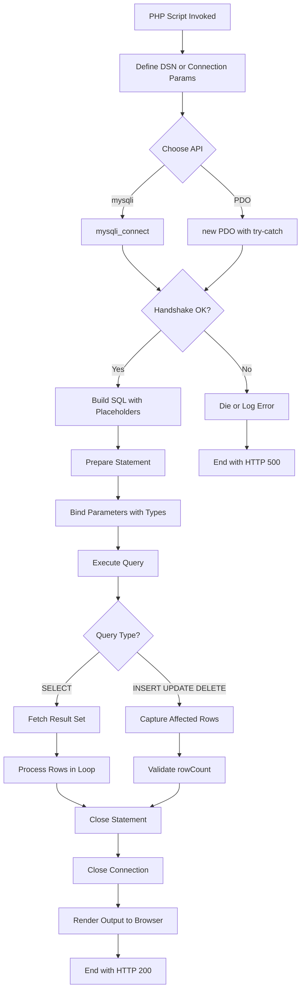
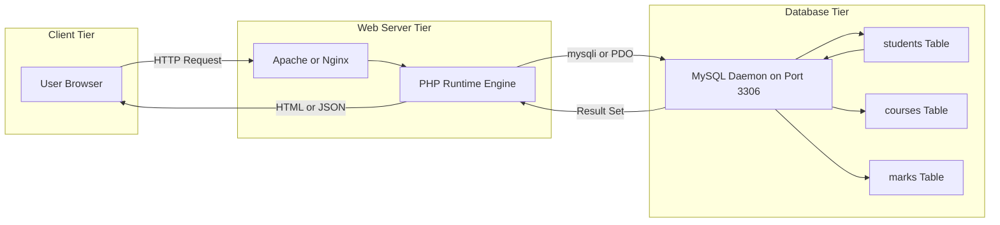
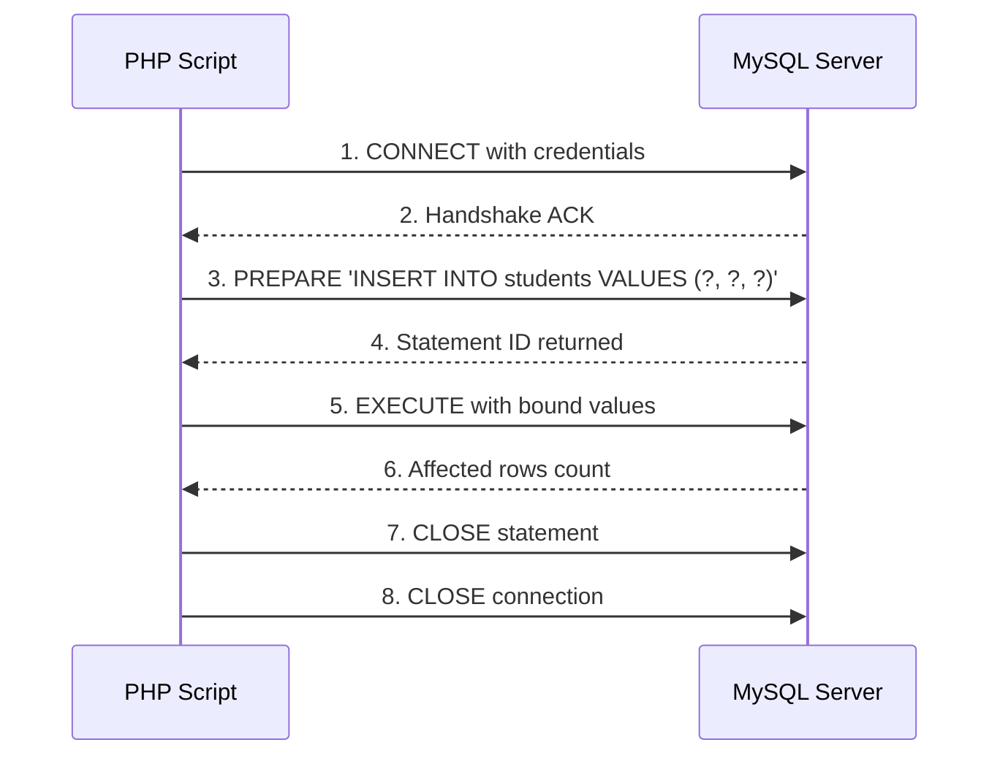
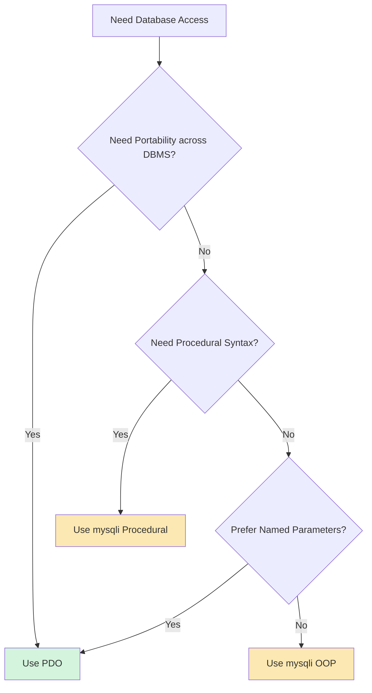

# Accessing MySQL in PHP

<!-- SECTION_1_START -->
# Accessing MySQL in PHP — Core Definition & Intuitive Overview

## Formal KTU 2024 Definition
**Accessing MySQL in PHP** refers to the set of in-built PHP extensions and procedural/object-oriented APIs that allow server-side PHP scripts to establish a communication channel with a **MySQL Relational Database Management System (RDBMS)**, transmit **Structured Query Language (SQL)** statements, retrieve result sets, and manage transactional data persistence across HTTP requests.

> [!IMPORTANT]
> **KTU 2024 Syllabus Highlight (Module 4 — SPA Basics)**
> Students are expected to master **two primary APIs**: the `mysqli` (MySQL Improved) extension and the `PDO` (PHP Data Objects) extension. Both are first-class citizens in modern PHP (versions 5.3+ and 7.0+ respectively).

The two dominant PHP extensions sanctioned by **The PHP Group** are:

| Extension | Paradigm | Database Support | Introduced |
|---|---|---|---|
| `mysqli` | Procedural + OOP | MySQL only | PHP 5.0 |
| `PDO_MySQL` | OOP | 12+ drivers (MySQL, PostgreSQL, SQLite, etc.) | PHP 5.1 |

> [!NOTE]
> **Core Definition — Database Connection**
> A *database connection* in PHP is a live, resource-bound handle returned by a connection function (e.g., `mysqli_connect()` or `new PDO()`). It is the authenticated, bi-directional socket through which SQL packets flow between the PHP runtime (sitting inside the web server, e.g., Apache/Nginx) and the MySQL daemon (default port **3306**).

---

## Conceptual Analogy — The Bilingual Receptionist

Imagine your PHP script is a **French-speaking hotel manager**, and your MySQL database is a **Japanese-speaking concierge** locked in the basement. They cannot communicate directly. You need a **bilingual receptionist** (the API layer) to:

1. **Open the door** → establish a TCP connection (handshake).
2. **Verify the ID card** → authenticate using username, password, and host.
3. **Carry notes** → send SQL queries down.
4. **Bring back answers** → return result sets up.
5. **Close the door** → terminate the connection to free resources.

> [!TIP]
> **Intuitive Takeaway**
> Without proper connection management, you leave the basement door open indefinitely, exhausting the maximum connection pool of MySQL (default `max_connections = 151`). This is why every connection *must* be explicitly closed.

---

> [!VISUALIZATION CONTROL]
> **Concept:** Request-Response Topology Between Web Client, PHP Engine, and MySQL Server
> **Visual Description:** Draw three vertical swim-lanes: Browser (left), PHP Runtime (middle), MySQL Server (right). Solid arrows flow from Browser → PHP (HTTP Request), PHP → MySQL (TCP/3306 + SQL), and MySQL → PHP → Browser (Result + HTTP Response). A red dashed boundary should enclose the MySQL server to denote the "secured basement" analogy.
<!-- SECTION_1_END -->

<!-- SECTION_2_START -->
# Deep Theoretical Analysis & KTU High-Yield Formula Sheet

## 1. The Two API Philosophies

### A. `mysqli` — The Specialist
- Tightly coupled to MySQL. Cannot talk to PostgreSQL or Oracle.
- Supports both **procedural** (`mysqli_query($conn, $sql)`) and **object-oriented** (`$conn->query($sql)`) syntax.
- Native support for **prepared statements** with bound parameters.
- Best for: single-database, MySQL-only projects.

### B. `PDO` — The Generalist Diplomat
- Database-agnostic abstraction layer. The same code can switch from MySQL to PostgreSQL by changing the DSN string.
- Pure OOP (`$pdo->prepare()`, `$stmt->execute()`).
- Named parameters (`(':name' => $value)`) make queries more readable.
- Best for: enterprise applications requiring database portability.

> [!NOTE]
> **Why two APIs?**
> KTU examiners frequently ask: *"Differentiate between MySQLi and PDO."* The golden answer must mention **database portability, named vs. positional parameters, and OOP-only vs. dual-paradigm support**.

---

## 2. The Connection Lifecycle — 5 Logical Stages

1. **Initiation** — A PHP script triggers `mysqli_connect()` or `new PDO()`.
2. **Authentication** — Credentials (`hostname`, `username`, `password`, `database`) are validated by the MySQL grant system.
3. **Handshake** — The client library negotiates the connection character set (default was `latin1`, modern PHP defaults to `utf8mb4`).
4. **Operation** — Repeated cycles of `query()` → `fetch()` → `process`.
5. **Termination** — `$conn->close()` or `mysqli_close()` releases the socket.

---

## 3. CRUD — The Four Cardinal Operations

| Operation | SQL Verb | PHP Function (mysqli) | PHP Method (PDO) |
|---|---|---|---|
| **C**reate | `INSERT` | `mysqli_query($conn, $sql)` | `$pdo->exec($sql)` |
| **R**ead | `SELECT` | `mysqli_query($conn, $sql)` | `$pdo->query($sql)` |
| **U**pdate | `UPDATE` | `mysqli_query($conn, $sql)` | `$pdo->exec($sql)` |
| **D**elete | `DELETE` | `mysqli_query($conn, $sql)` | `$pdo->exec($sql)` |

---

## 4. KTU High-Yield Formula / Cheat Sheet

| Concept | Syntax (mysqli) | Syntax (PDO) | Return Type |
|---|---|---|---|
| **Open Connection** | `mysqli_connect($h, $u, $p, $d)` | `new PDO($dsn, $u, $p)` | `mysqli` object / `PDO` object |
| **DSN String** | N/A | `"mysql:host=$h;dbname=$d;charset=utf8mb4"` | String |
| **Run DML (Insert/Update/Delete)** | `mysqli_query($conn, $sql)` | `$pdo->exec($sql)` | `int` (affected rows) |
| **Run DQL (Select)** | `mysqli_query($conn, $sql)` | `$pdo->query($sql)` | `mysqli_result` / `PDOStatement` |
| **Fetch Row (Assoc)** | `$r->fetch_assoc()` | `$stmt->fetch(PDO::FETCH_ASSOC)` | `array` |
| **Fetch All Rows** | loop over `fetch_assoc()` | `$stmt->fetchAll(PDO::FETCH_ASSOC)` | `array of arrays` |
| **Row Count** | `$r->num_rows` | `$stmt->rowCount()` | `int` |
| **Last Insert ID** | `mysqli_insert_id($conn)` | `$pdo->lastInsertId()` | `string` |
| **Escape Input** | `mysqli_real_escape_string($c, $s)` | `$pdo->quote($s)` | `string` |
| **Close Connection** | `mysqli_close($conn)` | `$conn = null;` | `bool` |
| **Error Mode** | `$conn->connect_error` | `$pdo->setAttribute(PDO::ATTR_ERRMODE, PDO::ERRMODE_EXCEPTION)` | — |
| **Prepared Statement** | `$conn->prepare($sql)` | `$pdo->prepare($sql)` | `mysqli_stmt` / `PDOStatement` |
| **Bind Parameter** | `$stmt->bind_param("ssi", $v1, $v2, $v3)` | `$stmt->bindValue(':n', $v)` or `execute([...])` | `bool` |
| **Execute Statement** | `$stmt->execute()` | `$stmt->execute()` | `bool` |

> [!IMPORTANT]
> **Type String Codes in `bind_param()` (KTU Frequently Asked)**
> - `s` → string
> - `i` → integer
> - `d` → double (float)
> - `b` → blob (binary large object)
>
> Example: `$stmt->bind_param("ssi", $name, $email, $age);` binds two strings and one integer in that exact order.

---

## 5. Real-World Engineering Utility

In production, accessing MySQL from PHP underpins:

- **CMS Platforms** (WordPress, Joomla, Drupal) — every post/page/comment is a row.
- **E-commerce Stacks** (Magento, WooCommerce) — cart, orders, inventory, payments.
- **RESTful API Backends** — JSON responses are generated by reading MySQL via PDO.
- **CRUD dashboards** for internal admin tools.
- **Authentication systems** — user credentials are verified via `SELECT` queries.

> [!NOTE]
> **Industry Standard:** As of 2024, ~78% of PHP websites still use MySQL/MariaDB as their primary RDBMS, making this topic one of the highest-yield modules in the KTU Web Programming syllabus.
<!-- SECTION_2_END -->

<!-- SECTION_3_START -->
# Step-by-Step Derivations & Code Implementation

> [!IMPORTANT]
> **Environment Prerequisites**
> Ensure `php_mysqli.dll` and `php_pdo_mysql.dll` are uncommented in `php.ini`. Verify with `phpinfo()`.

---

## 1. Connecting to MySQL — mysqli (Procedural)

```php
<?php
// ---------- STEP 1: Define connection parameters ----------
$servername = "localhost";
$username   = "root";
$password   = "";
$database   = "ktu_web_db";

// ---------- STEP 2: Establish connection ----------
$conn = mysqli_connect($servername, $username, $password, $database);

// ---------- STEP 3: Validate handshake ----------
if (!$conn) {
    die("Connection failed: " . mysqli_connect_error());
}

// ---------- STEP 4: Confirm to the user ----------
echo "Connected successfully to MySQL (Server version: " . mysqli_get_server_info($conn) . ")";

// ---------- STEP 5: Terminate connection ----------
mysqli_close($conn);
?>
```

**Explanation of each line:**
- **Step 1** — Variables store credentials; `localhost` indicates a socket or TCP connection on the same machine.
- **Step 2** — `mysqli_connect()` returns either a `mysqli` object or `false`.
- **Step 3** — `die()` halts execution and prints the error. In production, you would log this instead of exposing it.
- **Step 4** — `mysqli_get_server_info()` retrieves the MySQL server banner (e.g., `8.0.36`).
- **Step 5** — Releases the socket back to the pool.

---

## 2. Connecting to MySQL — PDO (Object-Oriented)

```php
<?php
// ---------- STEP 1: Define DSN (Data Source Name) ----------
$dsn = "mysql:host=localhost;dbname=ktu_web_db;charset=utf8mb4";
$user = "root";
$pass = "";

// ---------- STEP 2: Define options array for robust error handling ----------
$options = [
    PDO::ATTR_ERRMODE            => PDO::ERRMODE_EXCEPTION,   // Throw exceptions on errors
    PDO::ATTR_DEFAULT_FETCH_MODE => PDO::FETCH_ASSOC,         // Return associative arrays
    PDO::ATTR_EMULATE_PREPARES   => false,                    // Use real prepared statements
];

// ---------- STEP 3: Try-catch block to handle connection failures ----------
try {
    $pdo = new PDO($dsn, $user, $pass, $options);
    echo "Connected successfully via PDO.";
} catch (PDOException $e) {
    die("Connection failed: " . $e->getMessage());
}

// ---------- STEP 4: Terminate (unset the reference) ----------
$pdo = null;
?>
```

---

## 3. The `CREATE` Operation — Insert a Record (mysqli + Prepared Statement)

```php
<?php
$conn = mysqli_connect("localhost", "root", "", "ktu_web_db");
if (!$conn) { die("Connection failed."); }

// ---------- STEP 1: Write the SQL with placeholders ----------
$sql  = "INSERT INTO students (reg_no, name, email, cgpa) VALUES (?, ?, ?, ?)";

// ---------- STEP 2: Prepare the statement ----------
$stmt = mysqli_prepare($conn, $sql);
if ($stmt === false) {
    die("Prepare failed: " . mysqli_error($conn));
}

// ---------- STEP 3: Bind parameters to placeholders ----------
mysqli_stmt_bind_param($stmt, "sssd", $reg_no, $name, $email, $cgpa);

// ---------- STEP 4: Assign values and execute ----------
$reg_no = "KTU2024CS001";
$name   = "Ananya Pillai";
$email  = "ananya@ktu.ac.in";
$cgpa   = 8.92;

if (mysqli_stmt_execute($stmt)) {
    echo "New record inserted successfully. ID = " . mysqli_insert_id($conn);
} else {
    echo "Execute failed: " . mysqli_stmt_error($stmt);
}

// ---------- STEP 5: Cleanup ----------
mysqli_stmt_close($stmt);
mysqli_close($conn);
?>
```

**Line-by-Line Logic:**
- **Step 1** — The four `?` placeholders are bound later. **Never** concatenate user input here.
- **Step 2** — `mysqli_prepare()` sends the SQL template to MySQL, which parses and caches it.
- **Step 3** — `"sssd"` declares the data types: 3 strings + 1 double.
- **Step 4** — Variables are passed by reference. MySQL only injects the *values*, not the raw SQL.
- **Step 5** — Always close the statement first, then the connection.

---

## 4. The `READ` Operation — Fetch Multiple Rows (PDO)

```php
<?php
try {
    $pdo = new PDO("mysql:host=localhost;dbname=ktu_web_db;charset=utf8mb4", "root", "");
    $pdo->setAttribute(PDO::ATTR_ERRMODE, PDO::ERRMODE_EXCEPTION);

    // ---------- STEP 1: Prepare the SELECT query ----------
    $stmt = $pdo->prepare("SELECT reg_no, name, cgpa FROM students WHERE cgpa > :min_cgpa ORDER BY cgpa DESC");

    // ---------- STEP 2: Execute with named parameter ----------
    $stmt->execute([':min_cgpa' => 8.0]);

    // ---------- STEP 3: Fetch all rows as associative array ----------
    $students = $stmt->fetchAll(PDO::FETCH_ASSOC);

    // ---------- STEP 4: Render in an HTML table ----------
    echo "<table border='1' cellpadding='6'>";
    echo "<tr><th>Reg No</th><th>Name</th><th>CGPA</th></tr>";
    foreach ($students as $row) {
        echo "<tr>";
        echo "<td>" . htmlspecialchars($row['reg_no']) . "</td>";
        echo "<td>" . htmlspecialchars($row['name'])   . "</td>";
        echo "<td>" . htmlspecialchars($row['cgpa'])   . "</td>";
        echo "</tr>";
    }
    echo "</table>";

    // ---------- STEP 5: Show count ----------
    echo "<p>Total high-performers: " . $stmt->rowCount() . "</p>";

} catch (PDOException $e) {
    echo "Query failed: " . $e->getMessage();
}

$pdo = null;
?>
```

---

## 5. The `UPDATE` Operation — Modify a Record

```php
<?php
$conn = mysqli_connect("localhost", "root", "", "ktu_web_db");

$sql  = "UPDATE students SET cgpa = ? WHERE reg_no = ?";
$stmt = mysqli_prepare($conn, $sql);
mysqli_stmt_bind_param($stmt, "ds", $new_cgpa, $reg_no);

$new_cgpa = 9.15;
$reg_no   = "KTU2024CS001";

if (mysqli_stmt_execute($stmt)) {
    echo "Record updated. Rows affected: " . mysqli_stmt_affected_rows($stmt);
}

mysqli_stmt_close($stmt);
mysqli_close($conn);
?>
```

---

## 6. The `DELETE` Operation — Remove a Record

```php
<?php
try {
    $pdo = new PDO("mysql:host=localhost;dbname=ktu_web_db;charset=utf8mb4", "root", "");
    $stmt = $pdo->prepare("DELETE FROM students WHERE reg_no = :reg");
    $stmt->execute([':reg' => 'KTU2024CS001']);
    echo "Rows deleted: " . $stmt->rowCount();
} catch (PDOException $e) {
    echo "Delete failed: " . $e->getMessage();
}
$pdo = null;
?>
```

---

## 7. SQL Injection — The Reason Prepared Statements Exist

> [!WARNING]
> **Critical Security Note (Frequently tested in KTU)**
> Concatenating user input into SQL is the #1 cause of web vulnerabilities. Prepared statements make it *impossible* for attacker input to be interpreted as SQL syntax.

**Vulnerable code (NEVER write this):**
```php
$reg = $_GET['reg'];                                       // Attacker injects:  ' OR '1'='1
$sql = "SELECT * FROM students WHERE reg_no = '$reg'";      // DANGEROUS
```

**Safe code (always use this):**
```php
$stmt = $pdo->prepare("SELECT * FROM students WHERE reg_no = :r");
$stmt->execute([':r' => $_GET['reg']]);                     // Input is treated as data, not code
```
<!-- SECTION_3_END -->

<!-- SECTION_4_START -->
# Structural Diagrams & Schematics

## 1. Mermaid Flowchart — PHP ↔ MySQL Access Lifecycle



## 2. Mermaid Block Diagram — Layered Architecture



## 3. Mermaid Sequence Diagram — Prepared Statement Flow



## 4. Decision Matrix — When to Use mysqli vs PDO


<!-- SECTION_4_END -->

<!-- SECTION_5_START -->
# KTU 2024 Scheme Examination Question Bank & Topic Recap

---

## Part A — Short Answer Questions (3 Marks Each)

### **Q1.** `[KTU University Exam — July 2024]`
**Differentiate between `mysqli` and `PDO` extensions in PHP. List any four points.** *(CO1, Remember)*

**Model Answer:**

| Feature | `mysqli` | `PDO` |
|---|---|---|
| **Database Support** | MySQL only | 12+ databases (MySQL, PostgreSQL, SQLite, etc.) |
| **Paradigm** | Procedural + Object-Oriented | Pure Object-Oriented |
| **Parameters** | Positional (`?`) | Named (`:name`) and Positional |
| **Portability** | Low — tied to MySQL | High — switch via DSN change |
| **Error Handling** | Procedural functions like `mysqli_error()` | Exceptions via `PDOException` |

> **[Valuation Key: 4 distinct points = 3 Marks; concluding sentence = 0 Marks]**

---

### **Q2.** `[KTU University Exam — Dec 2023]`
**What is a Prepared Statement in PHP? Why is it preferred over direct SQL query execution?** *(CO2, Understand)*

**Model Answer:**

A **prepared statement** is a pre-compiled SQL template sent to the MySQL server in two phases — *prepare* (SQL with placeholders) and *execute* (bound values). It is preferred because:

1. **Security:** Prevents **SQL Injection** by treating input strictly as data, never as executable SQL syntax.
2. **Performance:** The SQL is parsed and optimized *once*; subsequent executions reuse the cached plan, making it faster in loops.
3. **Readability:** Named parameters (`:email`) make code self-documenting.
4. **Type Safety:** The `bind_param()` type string enforces data types at the API level.

> **[Valuation Key: Definition 1M + 3 valid reasons with explanation = 3 Marks]**

---

## Part B — Long Answer Questions (14 Marks Each, Module Internal Choice)

### **Question A (14 Marks)** `[KTU University Exam — June 2024]`

**(a)** With a neat diagram, explain the **architecture for accessing a MySQL database from PHP**. List the major steps involved. *(7 Marks, CO1, Understand)*

**(b)** Write a PHP script using **mysqli (procedural)** to connect to a MySQL database named `library_db` and **insert a new book record** into the table `books(book_id, title, author, price, available)` using a prepared statement. Assume appropriate values. *(7 Marks, CO2, Apply)*

---

### **Model Solution — Question A(a)**

The architecture for accessing MySQL from PHP consists of three tiers:

1. **Client Tier** — Browser sends an HTTP request (GET/POST) containing form data.
2. **Web Server Tier** — Apache/Nginx delegates `.php` files to the PHP runtime engine. PHP parses the script, executes any DB calls, and returns HTML/JSON.
3. **Database Tier** — The MySQL daemon (port **3306**) receives SQL, executes it on the storage engine (InnoDB/MyISAM), and returns the result set.

**Major Steps:**

| Step | Action | Function/Method |
|---|---|---|
| 1 | Define credentials | `$host, $user, $pass, $db` |
| 2 | Open connection | `mysqli_connect()` / `new PDO()` |
| 3 | Validate connection | `die()` on failure |
| 4 | Build SQL with placeholders | `"INSERT INTO ... VALUES (?, ?, ?)"` |
| 5 | Prepare statement | `mysqli_prepare()` / `$pdo->prepare()` |
| 6 | Bind parameters | `bind_param("ssd", ...)` |
| 7 | Execute | `execute()` |
| 8 | Fetch / Verify | `fetch_assoc()` / `affected_rows` |
| 9 | Close | `close()` / `null` |

> **[Stating 3-tier architecture: 3 Marks | Listing 6+ steps: 3 Marks | Diagram: 1 Mark]**

---

### **Model Solution — Question A(b)**

```php
<?php
// 1. Establish connection
$conn = mysqli_connect("localhost", "root", "", "library_db");
if (!$conn) {
    die("Connection failed: " . mysqli_connect_error());
}

// 2. Build SQL with placeholders
$sql = "INSERT INTO books (book_id, title, author, price, available) 
        VALUES (?, ?, ?, ?, ?)";

// 3. Prepare the statement
$stmt = mysqli_prepare($conn, $sql);
if ($stmt === false) {
    die("Prepare failed: " . mysqli_error($conn));
}

// 4. Bind parameters (s = string, d = double, i = integer)
mysqli_stmt_bind_param($stmt, "issdi", $book_id, $title, $author, $price, $available);

// 5. Assign values
$book_id   = 101;
$title     = "Database System Concepts";
$author    = "Korth";
$price     = 750.50;
$available = 1;

// 6. Execute and verify
if (mysqli_stmt_execute($stmt)) {
    echo "Book inserted successfully. New ID = " . mysqli_insert_id($conn);
} else {
    echo "Insert failed: " . mysqli_stmt_error($stmt);
}

// 7. Cleanup
mysqli_stmt_close($stmt);
mysqli_close($conn);
?>
```

> **[Connection block: 2 Marks | Prepare + bind_param: 2 Marks | Execute + verification: 2 Marks | Cleanup: 1 Mark]**

---

### **Question B (14 Marks — Alternative)** `[KTU University Exam — Dec 2023]`

**(a)** Explain **PDO in PHP**. Discuss its key features. Write the syntax for connecting to a MySQL database using PDO with proper exception handling. *(7 Marks, CO1, Understand)*

**(b)** Using **PDO**, write a PHP program to **fetch and display all students** from the table `students(id, name, department, marks)` whose marks are greater than 60. Display the result in an HTML table. *(7 Marks, CO3, Apply)*

---

### **Model Solution — Question B(a)**

**PDO (PHP Data Objects)** is a database-agnostic abstraction layer introduced in PHP 5.1 that provides a uniform interface for accessing multiple database systems.

**Key Features:**

1. **Database Portability** — Same code works with MySQL, PostgreSQL, SQLite, Oracle, MS SQL Server.
2. **Named Parameters** — Uses `:name` syntax which is self-documenting.
3. **Exception-based Error Handling** — Cleaner than checking return values.
4. **Prepared Statements** — Native support without extension-specific functions.
5. **Fetch Modes** — `FETCH_ASSOC`, `FETCH_NUM`, `FETCH_OBJ`, `FETCH_CLASS`.

**Connection Syntax:**

```php
<?php
$dsn  = "mysql:host=localhost;dbname=ktu_db;charset=utf8mb4";
$user = "root";
$pass = "";

try {
    $pdo = new PDO($dsn, $user, $pass);
    $pdo->setAttribute(PDO::ATTR_ERRMODE, PDO::ERRMODE_EXCEPTION);
    echo "Connected via PDO";
} catch (PDOException $e) {
    die("Connection failed: " . $e->getMessage());
}
?>
```

> **[PDO definition: 2 Marks | 3+ features: 2 Marks | Syntax with try-catch: 3 Marks]**

---

### **Model Solution — Question B(b)**

```php
<?php
try {
    $pdo = new PDO("mysql:host=localhost;dbname=ktu_db;charset=utf8mb4", "root", "");
    $pdo->setAttribute(PDO::ATTR_ERRMODE, PDO::ERRMODE_EXCEPTION);

    // Prepare SELECT with named parameter
    $stmt = $pdo->prepare("SELECT id, name, department, marks 
                           FROM students 
                           WHERE marks > :min_marks 
                           ORDER BY marks DESC");

    // Execute with bound value
    $stmt->execute([':min_marks' => 60]);

    // Fetch all matching rows
    $rows = $stmt->fetchAll(PDO::FETCH_ASSOC);

    // Render HTML table
    echo "<table border='1' cellpadding='6'>";
    echo "<tr><th>ID</th><th>Name</th><th>Department</th><th>Marks</th></tr>";
    foreach ($rows as $r) {
        echo "<tr>";
        echo "<td>" . htmlspecialchars($r['id'])         . "</td>";
        echo "<td>" . htmlspecialchars($r['name'])       . "</td>";
        echo "<td>" . htmlspecialchars($r['department']) . "</td>";
        echo "<td>" . htmlspecialchars($r['marks'])      . "</td>";
        echo "</tr>";
    }
    echo "</table>";

} catch (PDOException $e) {
    echo "Query failed: " . $e->getMessage();
}

$pdo = null;
?>
```

> **[PDO connection: 1 Mark | Prepare with named param: 2 Marks | Execute + FetchAll: 2 Marks | HTML table render: 2 Marks]**

---

> [!WARNING]
> **KTU Examiner's Valuation Warning — Common Pitfalls**
> - **Do NOT concatenate `$_POST` / `$_GET` values into SQL strings.** This is automatic mark deduction. Always use `prepare()` + `bind_param()` / `execute([...])`.
> - **Do NOT forget to set `PDO::ATTR_ERRMODE`** to `PDO::ERRMODE_EXCEPTION`. Without it, `PDO` silently returns `false` and the student will not know why the query failed.
> - **Always specify `charset=utf8mb4`** in the DSN string. The default `latin1` will corrupt emojis and non-English characters.
> - **Always close the connection** explicitly. Open connections exhaust the MySQL connection pool (default `max_connections = 151`).
> - **Type string in `bind_param()` must match variable order exactly.** Reversing them is a silent data-corruption bug.

---

## Topic Recap & Important Things to Remember

- **Two APIs:** `mysqli` (MySQL-specific, procedural+OOP) and `PDO` (database-agnostic, OOP-only).
- **Default MySQL port:** **3306**.
- **Connection functions:** `mysqli_connect($h, $u, $p, $d)` and `new PDO($dsn, $u, $p)`.
- **DSN Format (PDO):** `"mysql:host=HOST;dbname=DB;charset=utf8mb4"`.
- **Always use Prepared Statements** with `?` (mysqli) or `:name` (PDO) placeholders to prevent **SQL Injection**.
- **`bind_param()` type codes:** `s`=string, `i`=integer, `d`=double, `b`=blob.
- **DML (INSERT/UPDATE/DELETE)** returns affected row count; **DQL (SELECT)** returns a result set.
- **Fetch methods:** `fetch_assoc()` (single row), `fetchAll(PDO::FETCH_ASSOC)` (all rows).
- **Last inserted ID:** `mysqli_insert_id($conn)` or `$pdo->lastInsertId()`.
- **Always set `PDO::ATTR_ERRMODE` to `PDO::ERRMODE_EXCEPTION`** for robust error handling.
- **Always close** statements first, then the connection (`$stmt->close(); $conn->close();` or `$pdo = null;`).
- **Default character set:** Use `utf8mb4` (not `utf8`) for full Unicode support including emojis.
- **CRUD operations:** Create, Read, Update, Delete — the four pillars of database interaction.
- **Difference between `query()` and `prepare()`:** `query()` runs static SQL directly; `prepare()` is for re-execution with different parameters and is injection-safe.
<!-- SECTION_5_END -->
