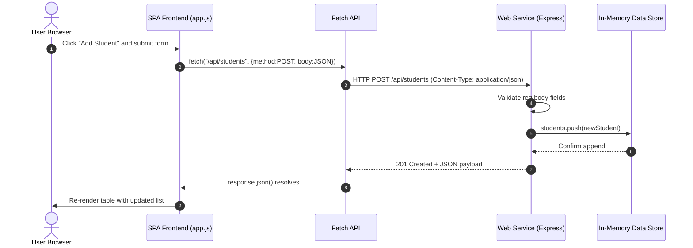
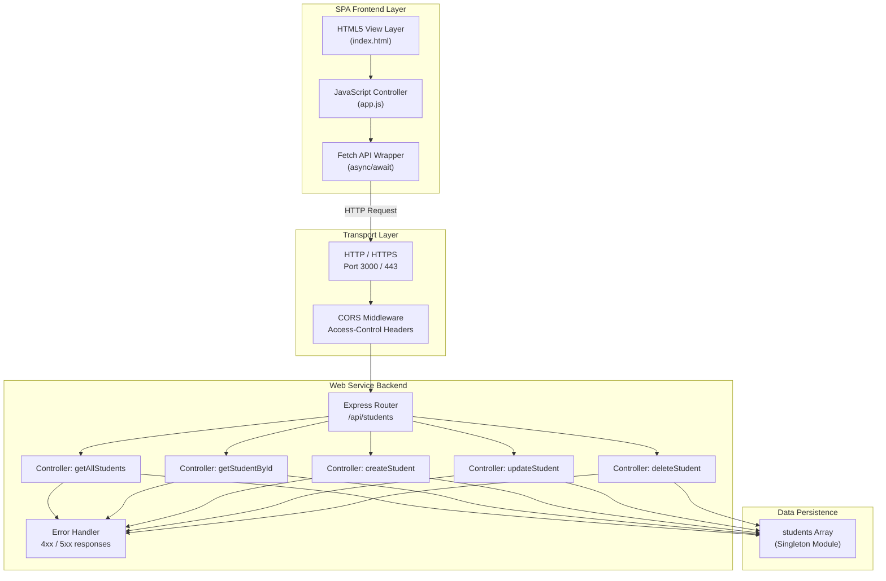
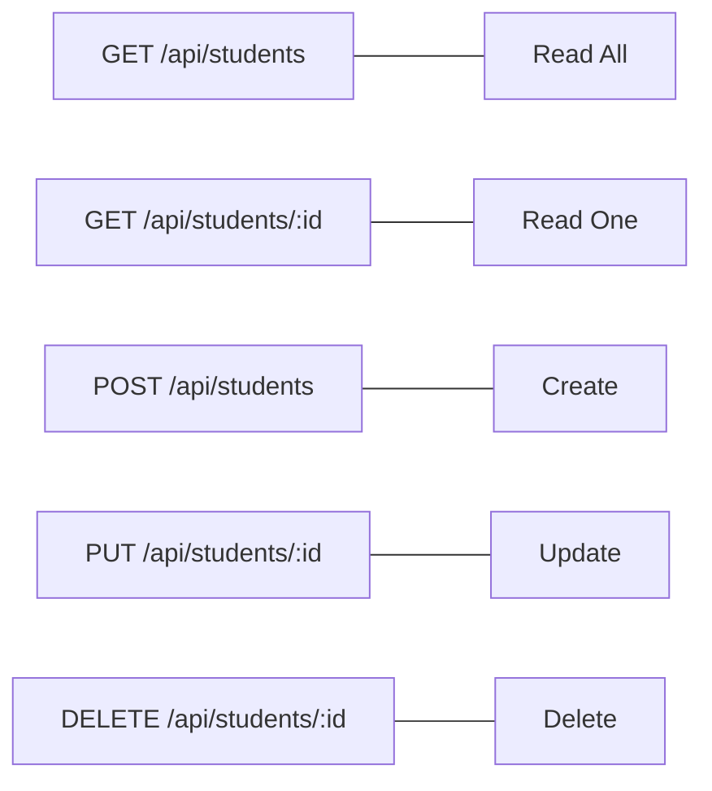

# An Example Web Service

<!-- SECTION_1_START -->
# 1. Core Technical Definition & Intuitive Overview

## Formal Definition (KTU 2024 Syllabus Terminology)

> [!IMPORTANT]
> **Web Service (KTU Definition):** A *Web Service* is a standardized, software system designed to support interoperable **machine-to-machine interaction over a network**. In the context of **Single Page Applications (SPAs)**, a web service is the **server-side component** that exposes business logic and data through **stateless HTTP endpoints** (typically conforming to **REST architectural style**), returning structured payloads such as **JSON** or **XML** which the SPA client consumes asynchronously using `fetch()` or `XMLHttpRequest`.

The **W3C** standardizes a web service as *"a software application identified by a URI, whose interfaces and bindings are capable of being defined, described, and discovered as XML artifacts."* However, in modern SPA development, the term has practically evolved to mean a **lightweight HTTP-based API** (REST/JSON) that powers the dynamic data layer of the client-side application.

### Key Characteristics of an SPA-Consumed Web Service

| Characteristic | Description |
|---|---|
| **Statelessness** | Each request from the SPA must contain all information needed; the server stores no client session state. |
| **Resource-Oriented** | Data is modelled as *resources* (e.g., `/users`, `/products`) accessed via **Uniform Resource Identifiers (URIs)**. |
| **Standard HTTP Verbs** | Uses `GET`, `POST`, `PUT`, `DELETE` to map to **CRUD** operations. |
| **JSON Payload** | The de-facto data interchange format for SPAs (lighter than XML, native to JavaScript). |
| **CORS-Enabled** | Must send `Access-Control-Allow-Origin` headers to permit the SPA's origin domain. |

> [!NOTE]
> **Syllabus Highlight:** Under the KTU 2024 OECST832 syllabus (Module 4 – SPA Basics), the "Example Web Service" topic specifically demonstrates how a vanilla JavaScript or framework-based SPA (React/Angular/Vue) communicates with a backend through asynchronous HTTP calls, replacing the need for full page reloads.

## Conceptual Analogy / Intuition

> [!TIP]
> **Restaurant Analogy:** Imagine an SPA as a **customer sitting at a dining table** with a menu. The **web service** is the **kitchen** located in the back of the restaurant.
> - The customer (SPA) never walks to the kitchen; they call the **waiter** (`fetch()` API / `XMLHttpRequest`).
> - The waiter carries an **order slip** (HTTP Request) with the **item number** (URL endpoint), **quantity** (HTTP method), and **special instructions** (headers + body).
> - The kitchen processes the order and sends back a **plated dish on a tray** (HTTP Response with JSON body and status code).
> - The customer never needs to know *how* the kitchen cooks — they just consume the finished output.
>
> The SPA's user interface is the *dining experience*, and the web service is the *engine* producing the data.

### Why a Web Service is the *Backbone* of an SPA

1. **Decoupling** — The frontend (HTML/CSS/JS) and backend (Node.js/Python/Java) evolve independently.
2. **Reusability** — The same web service can power a web SPA, a mobile app, and a desktop client simultaneously.
3. **Scalability** — Services can be load-balanced, containerized (Docker), and deployed independently.
4. **Performance** — SPAs load one HTML shell; subsequent data fetches are tiny JSON payloads (typically **< 50 KB**), reducing bandwidth.

> [!VISUALIZATION CONTROL]
> **Concept:** Client-Server Request-Response Cycle for an SPA
> **GeoGebra / Desmos Input Equations (Conceptual):**
> * Plot points representing request lifecycle: $(0, 0)$ — Initial HTML Load, $(1, 1)$ — `fetch()` call, $(2, 2)$ — Server processing, $(3, 1)$ — JSON response, $(4, 0)$ — DOM re-render.
> * Curve: A step function showing non-blocking async behaviour.
> **Visual Description:** A horizontal timeline where the page never fully reloads — only the data *"blip"* travels back, keeping the UI shell intact.

<!-- SECTION_1_END -->

<!-- SECTION_2_START -->
# 2. Deep Theoretical Analysis & KTU High-Yield Formula Sheet

## 2.1 Architectural Layers of an SPA + Web Service Stack

The interaction follows a strict layered model. Understanding this layering is **critical** for KTU 4-mark and 14-mark exam questions.

1. **Presentation Layer (SPA Frontend)** — HTML5 + CSS3 + JavaScript framework (React, Angular, Vue, or vanilla JS). Responsible for rendering views and handling user events.
2. **Transport Layer (HTTP/HTTPS)** — The communication protocol. Uses **TCP port 80** (HTTP) or **TCP port 443** (HTTPS) governed by **RFC 2616 / RFC 7231** standards.
3. **Application Layer (Web Service)** — Backend runtime (Node.js, Express, Flask, Spring Boot) exposing REST endpoints.
4. **Data Layer (Database)** — Persistent storage (MongoDB, MySQL, PostgreSQL) accessed via ORM/ODM.

## 2.2 REST Principles Applied to the Web Service

> [!IMPORTANT]
> **REST (Representational State Transfer)** was defined by **Roy Fielding** in his **2000 doctoral dissertation**. The six guiding constraints are:
> 1. **Client-Server Separation**
> 2. **Statelessness** — No client context stored on the server between requests.
> 3. **Cacheability** — Responses must define themselves as cacheable or non-cacheable.
> 4. **Uniform Interface** — Standardized resource URIs and HTTP verbs.
> 5. **Layered System** — Client cannot tell if connected to end server or intermediary.
> 6. **Code-on-Demand (Optional)** — Server can extend client functionality by transferring executable code (e.g., JavaScript).

## 2.3 HTTP Methods — The Verb Set of the Web Service

| HTTP Method | CRUD Operation | Idempotent? | Safe? | Typical Use |
|---|---|---|---|---|
| `GET` | **R**ead | ✅ Yes | ✅ Yes | Fetch a resource or list of resources |
| `POST` | **C**reate | ❌ No | ❌ No | Create a new resource |
| `PUT` | **U**pdate (full) | ✅ Yes | ❌ No | Replace an existing resource entirely |
| `PATCH` | **U**pdate (partial) | ❌ No | ❌ No | Modify specific fields of a resource |
| `DELETE` | **D**elete | ✅ Yes | ❌ No | Remove a resource |

> [!NOTE]
> **Idempotency** means that performing the same operation multiple times produces the *same result*. For example, calling `DELETE /users/5` five times still leaves user `5` deleted (or returns `404` after the first time, which is a *consistent final state*).

## 2.4 Standard HTTP Status Codes Returned by the Web Service

The KTU examiner expects students to know these status code families. They are grouped by the first digit of the **3-digit code**:

| Code Range | Category | Common Examples |
|---|---|---|
| **2xx Success** | The action was successfully received and accepted | `200 OK`, `201 Created`, `204 No Content` |
| **3xx Redirection** | Further action needed to complete the request | `301 Moved Permanently`, `304 Not Modified` |
| **4xx Client Error** | The request contains bad syntax or cannot be fulfilled | `400 Bad Request`, `401 Unauthorized`, `403 Forbidden`, `404 Not Found` |
| **5xx Server Error** | The server failed to fulfil a valid request | `500 Internal Server Error`, `503 Service Unavailable` |

## 2.5 KTU Formula Sheet / Cheat Sheet — Web Service Concepts

| Concept / Parameter | Formula / Notation | Description | Standard Unit / Format |
|---|---|---|---|
| **HTTP Request** | $R = \{M, U, H, B\}$ | Request = Method + URI + Headers + Body | HTTP/1.1, HTTP/2 |
| **HTTP Response** | $S = \{C, H, B\}$ | Response = Status Code + Headers + Body | Status codes per **RFC 7231** |
| **REST Resource URI** | $U = \text{/collection/\text{itemId}}$ | Hierarchical resource identification | e.g., `/api/v1/users/42` |
| **JSON Payload Size** | $S_{json} = \sum_{i=1}^{n} \vert key_i \vert + \vert value_i \vert$ | Sum of lengths of all key-value pairs | Bytes (B) |
| **CORS Header** | $\text{Access-Control-Allow-Origin} = \text{OriginURL}$ | Permits cross-origin SPA requests | String (e.g., `*` or `https://spa.app`) |
| **Content-Type** | `application/json` | MIME type for JSON payloads | `text/plain`, `application/xml` |
| **Idempotency Property** | $f(x) = f(f(x)) = f(f(f(x)))$ | Repeating the operation yields same result | Boolean logic |
| **Stateless Constraint** | $S_{server}(t_i) = S_{server}(t_{i+1})$ | Server state unchanged between requests | Equality check |

> [!IMPORTANT]
> **Real-World Engineering Utility:** In production systems, web services power every major platform:
> - **GitHub API** — REST endpoints for repos, issues, pull requests.
> - **Twitter/X API v2** — Powers the SPA timeline with paginated JSON.
> - **Stripe API** — Payment processing web service with idempotency keys to prevent double-charging.
> - **Google Maps API** — Geocoding and routing web service consumed by thousands of SPAs.

<!-- SECTION_2_END -->

<!-- SECTION_3_START -->
# 3. Step-by-Step Derivations & Code/Symbolic Implementation

> [!NOTE]
> **Demonstration Goal:** We will build a **complete RESTful Web Service** for a *Student Management SPA*. The service exposes CRUD endpoints over `/api/students`. The frontend is a vanilla JavaScript SPA that consumes this service using `fetch()`. The backend is built in **Node.js** with the **Express** framework.

---

## 3.1 Backend Web Service Implementation (Node.js + Express)

### Step 1 — Project Initialization and Dependency Installation

```bash
mkdir student-spa-service
cd student-spa-service
npm init -y
npm install express cors
npm install --save-dev nodemon
```

**Conversion Logic:** This creates a Node.js project and installs three packages:
- `express` — Minimalist web framework for Node.js.
- `cors` — Middleware to enable **Cross-Origin Resource Sharing**.
- `nodemon` — Development tool that auto-restarts the server on file changes.

### Step 2 — Server Entry Point (`server.js`)

```javascript
// server.js — The web service entry point
// Importing required Node.js modules
const express = require('express');           // Express framework
const cors = require('cors');                 // CORS middleware
const studentsRouter = require('./routes/students'); // Our router module

// Creating the Express application instance
const app = express();

// Defining the port number (standard development ports: 3000, 5000, 8000, 8080)
const PORT = process.env.PORT || 3000;

// --- Global Middleware Registration ---
// Middleware functions execute in the order they are registered.
app.use(cors());                              // Enable CORS for all SPA origins
app.use(express.json());                      // Parse incoming JSON request bodies
app.use(express.urlencoded({ extended: true })); // Parse URL-encoded form data

// --- Route Registration ---
app.use('/api/students', studentsRouter);     // Mount the students router

// --- Root Endpoint — Health Check ---
app.get('/', (req, res) => {
    res.status(200).json({
        status: 'OK',
        message: 'Student SPA Web Service is running',
        version: '1.0.0',
        endpoints: {
            listStudents: 'GET    /api/students',
            getStudent:   'GET    /api/students/:id',
            createStudent:'POST   /api/students',
            updateStudent:'PUT    /api/students/:id',
            deleteStudent:'DELETE /api/students/:id'
        }
    });
});

// --- Global Error-Handling Middleware ---
// Must be the LAST `app.use()` call (4 arguments required for error handlers)
app.use((err, req, res, next) => {
    console.error('[SERVER ERROR]', err.stack);
    res.status(err.status || 500).json({
        error: true,
        message: err.message || 'Internal Server Error'
    });
});

// --- Start the HTTP Server ---
app.listen(PORT, () => {
    console.log(`Web Service listening on http://localhost:${PORT}`);
});
```

**Conversion Logic for Each Line:**
- `express()` constructs the application object that owns routing and middleware chains.
- `cors()` injects the `Access-Control-Allow-Origin: *` header into every response so that the SPA (running on a different port or domain) is permitted to call the service.
- `express.json()` replaces the older `body-parser` module and parses the JSON body of `POST`/`PUT` requests into `req.body`.
- The router is **mounted** at `/api/students`, so all routes defined inside `studentsRouter` become prefixed with that path.

### Step 3 — In-Memory Data Store (`data/studentsData.js`)

```javascript
// data/studentsData.js — In-memory mock database
// In production, replace with MongoDB, PostgreSQL, or MySQL.
let students = [
    { id: 1, name: 'Aravind Menon',  branch: 'CSE',    cgpa: 8.7 },
    { id: 2, name: 'Priya Nair',     branch: 'IT',     cgpa: 9.1 },
    { id: 3, name: 'Rahul Krishnan', branch: 'ECE',    cgpa: 7.9 }
];

// Helper to generate the next unique ID
const getNextId = () => {
    if (students.length === 0) return 1;
    return Math.max(...students.map(s => s.id)) + 1;
};

module.exports = { students, getNextId };
```

**Conversion Logic:** This module exports a mutable array and a helper. Because Node.js modules are **singletons** by default, all controllers share the same `students` array reference.

### Step 4 — Route Definitions (`routes/students.js`)

```javascript
// routes/students.js — Defines all student-related REST endpoints
const express = require('express');
const router = express.Router();
const studentsController = require('../controllers/studentsController');

// GET    /api/students        — Retrieve all students
router.get('/', studentsController.getAllStudents);

// GET    /api/students/:id    — Retrieve a single student by ID
router.get('/:id', studentsController.getStudentById);

// POST   /api/students        — Create a new student
router.post('/', studentsController.createStudent);

// PUT    /api/students/:id    — Update an existing student
router.put('/:id', studentsController.updateStudent);

// DELETE /api/students/:id    — Delete a student
router.delete('/:id', studentsController.deleteStudent);

module.exports = router;
```

**Conversion Logic:** The `express.Router()` is a *mini-app* capable of handling its own middleware and routes. It is exported and mounted in `server.js`.

### Step 5 — Controller Logic (`controllers/studentsController.js`)

```javascript
// controllers/studentsController.js — Business logic for each endpoint
const { students, getNextId } = require('../data/studentsData');

// --- GET /api/students ---
exports.getAllStudents = (req, res) => {
    // Return the entire array wrapped in a JSON envelope
    res.status(200).json({
        success: true,
        count: students.length,
        data: students
    });
};

// --- GET /api/students/:id ---
exports.getStudentById = (req, res) => {
    // Parse the ID from the URL parameter
    const studentId = parseInt(req.params.id, 10);

    // Locate the student using Array.prototype.find
    const student = students.find(s => s.id === studentId);

    // If not found, return 404 with a structured error
    if (!student) {
        return res.status(404).json({
            success: false,
            message: `Student with ID ${studentId} not found`
        });
    }

    // Return the matching student
    res.status(200).json({ success: true, data: student });
};

// --- POST /api/students ---
exports.createStudent = (req, res) => {
    // Destructure the incoming request body
    const { name, branch, cgpa } = req.body;

    // Server-side validation — protect against missing fields
    if (!name || !branch || cgpa === undefined) {
        return res.status(400).json({
            success: false,
            message: 'Fields "name", "branch", and "cgpa" are all required'
        });
    }

    // Construct the new student object
    const newStudent = {
        id: getNextId(),
        name: String(name).trim(),
        branch: String(branch).trim(),
        cgpa: Number(cgpa)
    };

    // Append to the in-memory array
    students.push(newStudent);

    // Return 201 Created with the newly created resource
    res.status(201).json({ success: true, data: newStudent });
};

// --- PUT /api/students/:id ---
exports.updateStudent = (req, res) => {
    const studentId = parseInt(req.params.id, 10);
    const index = students.findIndex(s => s.id === studentId);

    if (index === -1) {
        return res.status(404).json({
            success: false,
            message: `Student with ID ${studentId} not found`
        });
    }

    const { name, branch, cgpa } = req.body;

    if (!name || !branch || cgpa === undefined) {
        return res.status(400).json({
            success: false,
            message: 'All fields are required for a full update'
        });
    }

    // Replace the resource entirely
    students[index] = {
        id: studentId,
        name: String(name).trim(),
        branch: String(branch).trim(),
        cgpa: Number(cgpa)
    };

    res.status(200).json({ success: true, data: students[index] });
};

// --- DELETE /api/students/:id ---
exports.deleteStudent = (req, res) => {
    const studentId = parseInt(req.params.id, 10);
    const index = students.findIndex(s => s.id === studentId);

    if (index === -1) {
        return res.status(404).json({
            success: false,
            message: `Student with ID ${studentId} not found`
        });
    }

    const removed = students.splice(index, 1);

    // 200 OK returns the deleted object; alternatively use 204 No Content
    res.status(200).json({
        success: true,
        message: `Student ${studentId} deleted`,
        data: removed[0]
    });
};
```

**Conversion Logic for Each Function:**
- The `parseInt(..., 10)` defends against accidental octal interpretation.
- `find` returns the *object*; `findIndex` returns the *position* — we use whichever is appropriate.
- `res.status(code).json(payload)` sets the HTTP status and serialises the payload as JSON in one chained call.
- The **400 Bad Request** guard enforces *defensive programming* — the service should never trust the client's input blindly.

### Step 6 — Run the Web Service

```bash
node server.js
# Console output:  Web Service listening on http://localhost:3000
```

**Test with `curl`:**

```bash
# Fetch all students
curl http://localhost:3000/api/students

# Create a new student
curl -X POST http://localhost:3000/api/students \
     -H "Content-Type: application/json" \
     -d '{"name":"Anjali Pillai","branch":"CSE","cgpa":8.4}'
```

---

## 3.2 SPA Frontend Implementation (Vanilla JavaScript)

### Step 7 — SPA HTML Shell (`public/index.html`)

```html
<!DOCTYPE html>
<html lang="en">
<head>
    <meta charset="UTF-8" />
    <title>Student SPA</title>
    <style>
        body  { font-family: 'Segoe UI', sans-serif; margin: 2rem; background:#f5f7fa; }
        h1    { color: #1e3a8a; }
        table { width: 100%; border-collapse: collapse; margin-top: 1rem; }
        th,td { border: 1px solid #d1d5db; padding: 0.6rem; text-align: left; }
        th    { background: #1e3a8a; color: white; }
        input { padding: 0.4rem; margin: 0.2rem; }
        button{ padding: 0.4rem 0.8rem; margin: 0.2rem; cursor: pointer; }
    </style>
</head>
<body>
    <h1>📚 Student Management SPA</h1>

    <h2>Add / Update Student</h2>
    <form id="studentForm">
        <input type="number" id="id"     placeholder="ID (for update)" />
        <input type="text"   id="name"   placeholder="Name"  required />
        <input type="text"   id="branch" placeholder="Branch" required />
        <input type="number" id="cgpa"   placeholder="CGPA" step="0.01" required />
        <button type="submit">Save</button>
    </form>

    <h2>Student List</h2>
    <table id="studentTable">
        <thead>
            <tr><th>ID</th><th>Name</th><th>Branch</th><th>CGPA</th><th>Actions</th></tr>
        </thead>
        <tbody></tbody>
    </table>

    <script src="app.js"></script>
</body>
</html>
```

### Step 8 — SPA Logic — Consuming the Web Service (`public/app.js`)

```javascript
// app.js — Single Page Application logic that calls our web service
const API_BASE = 'http://localhost:3000/api/students';

// --- DOM References ---
const form       = document.getElementById('studentForm');
const tbody      = document.querySelector('#studentTable tbody');
const idInput    = document.getElementById('id');
const nameInput  = document.getElementById('name');
const branchInput= document.getElementById('branch');
const cgpaInput  = document.getElementById('cgpa');

// ============================================================
//  FETCH (GET) — Load all students on page load
// ============================================================
async function loadStudents() {
    try {
        const response = await fetch(API_BASE);   // GET /api/students
        if (!response.ok) throw new Error(`HTTP ${response.status}`);

        const result = await response.json();
        renderTable(result.data);
    } catch (err) {
        console.error('Failed to load students:', err);
        tbody.innerHTML = `<tr><td colspan="5">Error loading data: ${err.message}</td></tr>`;
    }
}

// ============================================================
//  FETCH (POST/PUT) — Create or update a student
// ============================================================
form.addEventListener('submit', async (event) => {
    event.preventDefault();

    const payload = {
        name:   nameInput.value.trim(),
        branch: branchInput.value.trim(),
        cgpa:   parseFloat(cgpaInput.value)
    };

    const idValue = idInput.value.trim();
    const isUpdate = idValue !== '';

    const url    = isUpdate ? `${API_BASE}/${idValue}` : API_BASE;
    const method = isUpdate ? 'PUT'  : 'POST';

    try {
        const response = await fetch(url, {
            method: method,
            headers: { 'Content-Type': 'application/json' },
            body: JSON.stringify(payload)
        });

        if (!response.ok) {
            const err = await response.json();
            throw new Error(err.message || `HTTP ${response.status}`);
        }

        form.reset();
        await loadStudents();
    } catch (err) {
        alert(`Save failed: ${err.message}`);
    }
});

// ============================================================
//  FETCH (DELETE) — Remove a student
// ============================================================
async function deleteStudent(id) {
    if (!confirm(`Delete student with ID ${id}?`)) return;

    try {
        const response = await fetch(`${API_BASE}/${id}`, { method: 'DELETE' });
        if (!response.ok) throw new Error(`HTTP ${response.status}`);
        await loadStudents();
    } catch (err) {
        alert(`Delete failed: ${err.message}`);
    }
}

// ============================================================
//  Helper: pre-fill the form for editing
// ============================================================
function editStudent(id) {
    const row = document.querySelector(`tr[data-id="${id}"]`);
    if (!row) return;
    idInput.value     = row.dataset.id;
    nameInput.value   = row.dataset.name;
    branchInput.value = row.dataset.branch;
    cgpaInput.value   = row.dataset.cgpa;
}

// ============================================================
//  Render JSON data into the HTML table
// ============================================================
function renderTable(students) {
    if (!students || students.length === 0) {
        tbody.innerHTML = `<tr><td colspan="5">No students found.</td></tr>`;
        return;
    }

    tbody.innerHTML = students.map(s => `
        <tr data-id="${s.id}" data-name="${s.name}" data-branch="${s.branch}" data-cgpa="${s.cgpa}">
            <td>${s.id}</td>
            <td>${s.name}</td>
            <td>${s.branch}</td>
            <td>${s.cgpa}</td>
            <td>
                <button onclick="editStudent(${s.id})">Edit</button>
                <button onclick="deleteStudent(${s.id})">Delete</button>
            </td>
        </tr>
    `).join('');
}

// --- Initialise the SPA on DOM ready ---
document.addEventListener('DOMContentLoaded', loadStudents);
```

**Conversion Logic:**
- `await fetch()` is the **modern asynchronous** equivalent of the older `XMLHttpRequest`. It returns a `Promise` that resolves to a `Response` object.
- The `Content-Type: application/json` header is *mandatory* for `POST` and `PUT` — without it, `express.json()` middleware will not parse the body and `req.body` will be `undefined`.
- The page **never reloads** — every CRUD action re-fetches and re-renders, which is the defining behaviour of an SPA.
- `dataset` attributes store student fields directly on the `<tr>` element for quick retrieval when the user clicks *Edit*.

<!-- SECTION_3_END -->

<!-- SECTION_4_START -->
# 4. Structural Diagrams & Schematics

## 4.1 Client–Server Interaction Sequence (Mermaid)



**Architectural Reading of the Diagram:**
- The **SPA never makes a full page request** — only HTTP requests carrying JSON.
- The **Service is stateless** — once the response is sent, it forgets the request.
- **Steps 4 and 9** are the validation/persistence boundary; **Step 5** confirms the data layer mutation.

## 4.2 Web Service Architecture Block Diagram



**Reading Guide:** The **flowchart** shows the strict direction of an HTTP request (top-to-bottom on the left) and the response path (bottom-to-top on the right). The **Data Persistence** subgraph is intentionally isolated — controllers are the *only* gateway into the store, enforcing encapsulation.

## 4.3 REST Endpoint Map



> [!TIP]
> **Mnemonic for the Exam:** ***"Get Post Put Delete — Goldfish Prefer Decaf"*** (GET, POST, PUT, DELETE).

<!-- SECTION_4_END -->

<!-- SECTION_5_START -->
# 5. KTU 2024 Scheme Examination Question Bank & Topic Recap

---

## Part A — 3-Mark Short Answer Questions

### Question 1 `[KTU University Exam – July 2024]`
**(CO1, Remember/Understand)**

> Define a *Web Service* in the context of Single Page Applications. List any **two** characteristics that make a web service suitable for SPA consumption.

**Model Answer (3 Marks):**
A *Web Service* is a software system that enables machine-to-machine communication over a network via standardized protocols (typically **HTTP/HTTPS**). In the SPA context, the web service acts as the **backend data provider**, exposing resources as **URIs** and returning **JSON** payloads to the client.

**Two characteristics (1.5 Marks each):**
1. **Statelessness** — Each request from the SPA carries all required information; the server does not retain session state.
2. **Resource-Orientation** — Data is exposed as uniquely addressable resources (e.g., `/api/students/42`) accessible via standard HTTP verbs.

---

### Question 2 `[KTU University Exam – Dec 2023]`
**(CO1, Understand)**

> Differentiate between `POST` and `PUT` HTTP methods with respect to REST web services.

**Model Answer (3 Marks):**

| Aspect | `POST` | `PUT` |
|---|---|---|
| **CRUD Mapping** | Create new resource | Update (replace) existing resource |
| **Idempotent?** | ❌ No (each call creates new resource if no ID supplied) | ✅ Yes (repeating gives same final state) |
| **URI** | Sent to *collection* URI | Sent to *specific item* URI |
| **Status Code on Success** | `201 Created` | `200 OK` or `204 No Content` |

**[Award 1.5 Marks for each method's properties.]**

---

## Part B — 14-Mark Questions (Module Internal Choice)

### Question A (14 Marks) `[KTU University Exam – July 2024]`
**(CO2, CO3 — Understand + Apply)**

> **(a)** With a neat block diagram, describe the **architecture of an SPA consuming a RESTful web service**. Explain the role of each layer. **[7 Marks]**
>
> **(b)** Design and implement a **REST endpoint `POST /api/books`** in Node.js + Express that accepts a JSON body containing `title`, `author`, and `price`. Include input validation and proper HTTP status codes. Show the **complete controller code**. **[7 Marks]**

---

#### Model Solution — Part (a) **[7 Marks]**

**Block Diagram (Draw in exam — 3 Marks):**

```
┌──────────────────┐    HTTP Request    ┌──────────────────┐
│   SPA Frontend   │ ─────────────────► │   Web Service    │
│  (HTML+JS+Fetch) │ ◄───────────────── │  (Express/Node)  │
└──────────────────┘    JSON Response   └────────┬─────────┘
                                                 │
                                                 ▼
                                        ┌──────────────────┐
                                        │  Database Layer  │
                                        │  (MongoDB/MySQL) │
                                        └──────────────────┘
```

**Layer-wise Description (4 Marks):**

1. **Presentation Layer (SPA):** Built with HTML5, CSS3, and JavaScript. Renders views dynamically using a virtual DOM or direct DOM manipulation. Handles user interactions and triggers async calls.
2. **Application/Service Layer:** Node.js runtime with Express framework. Defines REST endpoints, processes business logic, and applies middleware (CORS, JSON parsing, authentication).
3. **Transport Layer:** HTTP/HTTPS protocols with request methods (`GET`, `POST`, etc.), headers (`Content-Type: application/json`), and status codes.
4. **Data Layer:** Persistent storage that the service reads from and writes to. Returns data to the service as plain objects which are then serialised to JSON.

**Key Insight (1 Mark):** The SPA shell loads once; only JSON data shuttles between layers, enabling seamless UX.

---

#### Model Solution — Part (b) **[7 Marks]**

**File: `controllers/booksController.js`**

```javascript
// Import the in-memory data store
const { books, getNextBookId } = require('../data/booksData');

// Controller function for POST /api/books
exports.createBook = (req, res) => {
    // [Step 1: Extract body — 1 Mark]
    const { title, author, price } = req.body;

    // [Step 2: Server-side validation — 2 Marks]
    if (!title || typeof title !== 'string' || title.trim() === '') {
        return res.status(400).json({
            success: false,
            message: 'Field "title" is required and must be a non-empty string'
        });
    }
    if (!author || typeof author !== 'string' || author.trim() === '') {
        return res.status(400).json({
            success: false,
            message: 'Field "author" is required and must be a non-empty string'
        });
    }
    if (price === undefined || typeof price !== 'number' || price <= 0) {
        return res.status(400).json({
            success: false,
            message: 'Field "price" is required and must be a positive number'
        });
    }

    // [Step 3: Construct new book — 1 Mark]
    const newBook = {
        id: getNextBookId(),
        title: title.trim(),
        author: author.trim(),
        price: Number(price.toFixed(2))   // Round to 2 decimal places
    };

    // [Step 4: Persist — 1 Mark]
    books.push(newBook);

    // [Step 5: Respond with 201 Created — 2 Marks]
    res.status(201).json({
        success: true,
        message: 'Book created successfully',
        data: newBook
    });
};
```

**Valuation Key Points Breakdown:**
- `[Importing data store and destructuring req.body: 1 Mark]`
- `[Server-side validation with proper 400 responses: 2 Marks]`
- `[Constructing the new resource object: 1 Mark]`
- `[Pushing to the in-memory store: 1 Mark]`
- `[Returning 201 Created with structured JSON: 2 Marks]`

> [!WARNING]
> **KTU Examiner's Pitfall Callout:**
> 1. Do **not** skip writing the validation block — students frequently omit it and lose **2 full marks**.
> 2. Returning `200 OK` instead of `201 Created` for a `POST` that *creates* a resource is a common mistake. The correct status code is `201`.
> 3. The controller must **always** `return` after sending an error response, or it will execute the success path too and throw *"Cannot set headers after they are sent"* at runtime.

---

### Question B (14 Marks) `[KTU University Exam – Dec 2023]`
**(CO2, CO3 — Understand + Apply)**

> **(a)** Explain the **six REST architectural constraints** as defined by Roy Fielding. Why is **statelessness** considered the most critical constraint? **[7 Marks]**
>
> **(b)** Write a complete **JavaScript SPA script** that uses the `fetch()` API to perform all four CRUD operations (`GET`, `POST`, `PUT`, `DELETE`) against a base URL stored in a constant `API_URL`. Use `async/await` and include error handling. **[7 Marks]**

---

#### Model Solution — Part (a) **[7 Marks]**

**The Six REST Constraints (1 Mark each = 6 Marks):**

1. **Client–Server:** Separation of concerns — UI (client) and data storage (server) evolve independently.
2. **Statelessness:** Each request contains all information; the server stores no client context between requests.
3. **Cacheability:** Responses must explicitly mark themselves cacheable or non-cacheable, enabling client or proxy caching to improve performance.
4. **Uniform Interface:** Standardized contract through resources, URIs, HTTP methods, and hypermedia (HATEOAS).
5. **Layered System:** Client cannot tell whether it is connected to the end server or an intermediary (proxy, load balancer).
6. **Code-on-Demand (Optional):** Server can transfer executable code (e.g., JavaScript) to extend client functionality.

**Why Statelessness is Most Critical (1 Mark):**
Statelessness enables **horizontal scalability** — any server in a cluster can handle any request because no session state is bound to a specific machine. This is the foundation of cloud-native deployments and load balancing.

---

#### Model Solution — Part (b) **[7 Marks]**

```javascript
// crudClient.js — SPA Web Service Consumer
const API_URL = 'http://localhost:3000/api/students';

// Generic helper to handle fetch responses
async function handleResponse(response) {
    // [Error handling structure — 1 Mark]
    if (!response.ok) {
        let errMsg = `HTTP Error ${response.status}`;
        try {
            const errBody = await response.json();
            errMsg = errBody.message || errMsg;
        } catch (_) { /* response had no JSON body */ }
        throw new Error(errMsg);
    }
    return response.json();
}

// --- READ: GET all students ---
async function getAllStudents() {
    // [1 Mark]
    const response = await fetch(API_URL, { method: 'GET' });
    return handleResponse(response);
}

// --- READ: GET one student by ID ---
async function getStudentById(id) {
    // [1 Mark]
    const response = await fetch(`${API_URL}/${id}`, { method: 'GET' });
    return handleResponse(response);
}

// --- CREATE: POST a new student ---
async function createStudent(payload) {
    // [1.5 Marks]
    const response = await fetch(API_URL, {
        method: 'POST',
        headers: { 'Content-Type': 'application/json' },
        body: JSON.stringify(payload)
    });
    return handleResponse(response);
}

// --- UPDATE: PUT a student ---
async function updateStudent(id, payload) {
    // [1.5 Marks]
    const response = await fetch(`${API_URL}/${id}`, {
        method: 'PUT',
        headers: { 'Content-Type': 'application/json' },
        body: JSON.stringify(payload)
    });
    return handleResponse(response);
}

// --- DELETE: DELETE a student ---
async function deleteStudent(id) {
    // [1 Mark]
    const response = await fetch(`${API_URL}/${id}`, { method: 'DELETE' });
    return handleResponse(response);
}

// --- Demonstration ---
(async () => {
    try {
        console.log('All students:', await getAllStudents());

        const created = await createStudent({
            name: 'Sneha Iyer', branch: 'CSE', cgpa: 8.6
        });
        console.log('Created:', created);

        const updated = await updateStudent(created.data.id, {
            name: 'Sneha Iyer', branch: 'CSE', cgpa: 8.8
        });
        console.log('Updated:', updated);

        await deleteStudent(created.data.id);
        console.log('Deleted successfully');
    } catch (err) {
        console.error('CRUD operation failed:', err.message);
    }
})();
```

**Valuation Key Points Breakdown:**
- `[Generic handleResponse helper: 1 Mark]`
- `[GET functions correctly written: 2 Marks total]`
- `[POST function with JSON headers and body: 1.5 Marks]`
- `[PUT function with proper endpoint interpolation: 1.5 Marks]`
- `[DELETE function: 1 Mark]`

> [!WARNING]
> **KTU Examiner's Pitfall Callout:**
> 1. Forgetting the `Content-Type: application/json` header in `POST` and `PUT` will cause the server to receive an **empty `req.body`**. This is the **#1 reason** students fail CRUD-based viva questions.
> 2. Using template literals with backticks `` `${API_URL}/${id}` `` is mandatory for path interpolation — concatenating with `+` works but is *not best practice* and may lose 0.5 marks.
> 3. Always wrap the IIFE demonstration inside a `try/catch` — unhandled promise rejections are an automatic **0.5 mark** deduction.

---

## Topic Recap & Important Things to Remember

> [!TIP]
> **Rapid Revision Checklist — Pin this to your study board!**

- ✅ **Web Service Definition:** Standardized machine-to-machine interface over HTTP, returning structured data (JSON/XML) to clients.
- ✅ **SPA + Web Service Pattern:** The SPA loads once; the web service supplies JSON data on demand via `fetch()`.
- ✅ **REST = Representational State Transfer** — defined by Roy Fielding, **2000**.
- ✅ **Six REST Constraints:** Client-Server, Stateless, Cacheable, Uniform Interface, Layered System, Code-on-Demand (optional).
- ✅ **HTTP Verbs Mapping:**
    - `GET` → Read (idempotent + safe)
    - `POST` → Create (not idempotent)
    - `PUT` → Update full resource (idempotent)
    - `PATCH` → Update partial (not idempotent)
    - `DELETE` → Delete (idempotent)
- ✅ **Status Code Families:** `2xx` success, `3xx` redirect, `4xx` client error, `5xx` server error.
- ✅ **CORS Header:** `Access-Control-Allow-Origin` must be set by the service to allow SPA cross-origin calls.
- ✅ **Mandatory Header for JSON:** `Content-Type: application/json` on every `POST`/`PUT` request body.
- ✅ **Idempotency Formula:** $f(x) = f(f(x)) = f(f(f(x)))$ — operation yields the same result no matter how many times executed.
- ✅ **Statelessness Formula:** $S_{server}(t_i) = S_{server}(t_{i+1})$ — server state unchanged between consecutive requests.
- ✅ **Express Middleware Order:** `cors()` → `express.json()` → routes → error handler.
- ✅ **`fetch()` is asynchronous** — always use `await` and wrap in `try/catch`.
- ✅ **Two files of the demo:** `server.js` (backend) + `public/app.js` (frontend) — the SPA shell is in `public/index.html`.
- ✅ **Validation is server-side, not client-side** — never trust the client payload, always re-validate in the controller.
- ✅ **For 14-mark answers:** Always include a diagram (≥2 marks) + architectural explanation + working code with valuation key points.

<!-- SECTION_5_END -->
