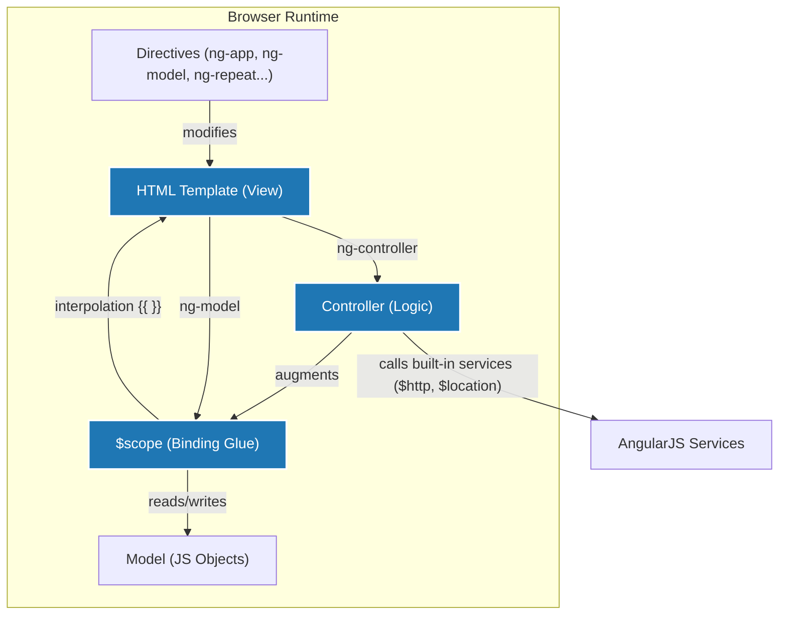
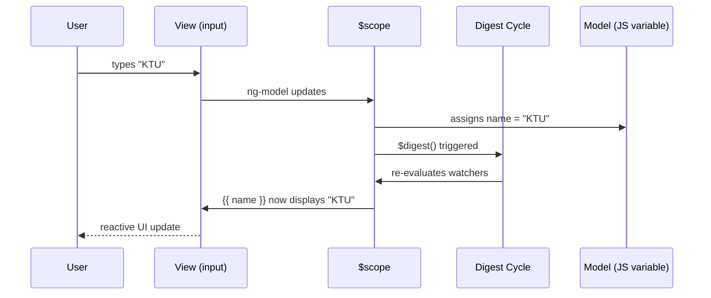
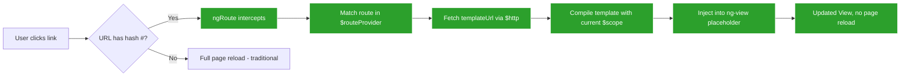

# Angular JS

<!-- SECTION_1_START -->
# AngularJS & SPA Basics — KTU 2024 Premium Notes

## 1. Core Technical Definition & Intuitive Overview

### Formal Definition (KTU 2024 Syllabus Terminology)

> [!IMPORTANT]
> **AngularJS** is a **JavaScript-based open-source front-end web application framework** maintained by **Google**, designed specifically for building **Single Page Applications (SPAs)**. It extends HTML vocabulary using **Directives**, binds data to HTML using **Expressions**, and follows the **MVW (Model-View-Whatever)** architectural pattern, allowing developers to build dynamic, responsive, and modular web UIs using declarative programming.

> [!NOTE]
> **Single Page Application (SPA)** — A web application architecture where a **single HTML page** is loaded once, and subsequent user interactions dynamically rewrite the current page using **JavaScript** and **AJAX** calls, rather than loading entire new pages from the server. Only data (typically **JSON**) is exchanged with the server, producing a fluid, desktop-like user experience.

### Conceptual Analogy / Intuition

Imagine you walk into a **modern smart restaurant**:

- The **waiter (JavaScript engine)** takes your order once.
- The **kitchen (server)** only sends back the **dishes (JSON data)** you ask for — not the entire menu again.
- The **table (HTML page)** stays the same, but the **platters on it keep changing** (views update reactively).

That table is your **SPA shell**, and the **waiter coordinating everything** is **AngularJS**. Traditional web apps, in contrast, behave like a **fast-food counter** — every time you want something, the entire menu board is reprinted and handed to you (full page reloads).

### Key Architectural Pillars of AngularJS

- **Model** — Plain JavaScript objects holding application data.
- **View** — The HTML template rendered with AngularJS directives and expressions.
- **Controller** — JavaScript functions that augment the scope and contain business logic.
- **Scope** — The glue object that binds View and Controller; accessible as **`$scope`**.
- **Directives** — Markers on DOM elements (like attributes) that tell AngularJS to attach behaviour.

### Visualization Control (MVC Pattern)

> [!VISUALIZATION CONTROL]
> **Concept:** AngularJS MVW Request-Response Flow
> **GeoGebra / Desmos Input Equations:** (Not applicable — this is a software architecture concept, best represented as a block diagram in Section 4)
> **Visual Description:** Picture a triangle with **View** at the top, **Model** at the bottom-left, and **Controller** at the bottom-right. Two-way arrows connect View ↔ Controller and Controller ↔ Model, illustrating continuous reactive data exchange.
<!-- SECTION_1_END -->

<!-- SECTION_2_START -->
# 2. Deep Theoretical Analysis & KTU High-Yield Cheat Sheet

## 2.1 Why AngularJS? (The Core 'Why')

1. **Declarative Programming** — You describe *what* you want, not *how* to build it.
2. **Two-Way Data Binding** — View and Model stay automatically synchronised; no manual DOM manipulation.
3. **Dependency Injection** — Built-in IoC container simplifies testing and modularity.
4. **Reusable Components via Directives** — Custom HTML tags/attributes extend browser vocabulary.
5. **Testability** — Originally designed with unit testing in mind (Jasmine + Karma).

## 2.2 The AngularJS Module System

A **module** is a container for the different parts of an application — controllers, services, filters, directives.

```javascript
var myApp = angular.module('myApp', []);   // defines a new module
angular.module('myApp');                   // retrieves the existing module
```

The second argument `[]` is the **dependency array** — list of other modules this module depends on.

## 2.3 Controllers & Scope

A **controller** is a JavaScript function that augments the AngularJS **scope**. Scope is the binding glue between the HTML (view) and the JavaScript variables (model).

```javascript
myApp.controller('MainCtrl', function($scope) {
    $scope.title  = "KTU Web Programming";
    $scope.count  = 0;
    $scope.increment = function() { $scope.count++; };
});
```

## 2.4 Two-Way Data Binding — The Heart of AngularJS

When the user types into an `<input ng-model="name">`, the variable `name` in `$scope` is **automatically updated**, and any place in the view that displays `{{ name }}` is **automatically refreshed**. This is achieved via AngularJS's internal **digest cycle** that watches for changes.

## 2.5 Essential Directives Library

| Directive | Purpose | KTU Exam Importance |
| :--- | :--- | :--- |
| `ng-app` | Bootstraps the AngularJS application; root element marker | **High** |
| `ng-controller` | Attaches a controller to a DOM element | **High** |
| `ng-model` | Two-way binds an input/select/textarea to a scope variable | **High** |
| `ng-bind` | One-way binds scope variable to innerHTML | **Medium** |
| `{{ expression }}` | Inline interpolation — equivalent to `ng-bind` | **High** |
| `ng-repeat` | Loops over a collection, generating one DOM node per item | **High** |
| `ng-click` / `ng-dblclick` | Attaches a click/double-click handler | **High** |
| `ng-show` / `ng-hide` | Toggles CSS `display` based on a truthy expression | **Medium** |
| `ng-if` | Removes/recreates DOM based on a condition (vs. `ng-show`) | **Medium** |
| `ng-src` / `ng-href` | Safe binding for `` and `<a href>` | **Low** |
| `ng-class` | Dynamically sets CSS classes | **Medium** |
| `ng-init` | Evaluates an expression in the current scope | **Low** |
| `ng-include` | Fetches, compiles, and includes an external HTML fragment | **Low** |
| `ng-route` | Provides SPA routing via `#` hash-based URLs (in `ngRoute` module) | **High** |

## 2.6 AngularJS Expressions

Expressions are JavaScript-like code snippets written inside `{{ }}` or `ng-bind`. They are evaluated against the current scope.

```html
<p>Total Cost: {{ quantity * cost \vert currency }}</p>
```

> [!NOTE]
> Unlike JavaScript, AngularJS expressions **do not support** conditionals, loops, or exception handling directly. Use directives like `ng-if` for that.

## 2.7 Filters (Formatting Transformers)

Filters format the displayed value of an expression for the user. Syntax is `{{ value \vert filterName : argument }}`.

| Filter | Example | Output |
| :--- | :--- | :--- |
| `currency` | `{{ 250 \vert currency : "₹" }}` | `₹250.00` |
| `date` | `{{ 1700000000000 \vert date : "dd/MM/yyyy" }}` | `14/11/2023` |
| `uppercase` | `{{ "ktu" \vert uppercase }}` | `KTU` |
| `lowercase` | `{{ "KTU" \vert lowercase }}` | `ktu` |
| `orderBy` | `ng-repeat="s in students \vert orderBy : 'marks'"` | Sorted list |
| `filter` | `ng-repeat="s in students \vert filter : {dept:'CSE'}"` | Subset |
| `limitTo` | `{{ "AngularJS" \vert limitTo : 6 }}` | `Angula` |

## 2.8 Services & Dependency Injection

**Services** are singleton objects instantiated once per app. Built-in services include **`$http`**, **`$location`**, **`$timeout`**, **`$interval`**, **`$rootScope`**, **`$scope`**.

```javascript
myApp.controller('DemoCtrl', function($scope, $http) {
    $http.get('data.json').then(function(response) {
        $scope.items = response.data;
    });
});
```

AngularJS minifies poorly with this style — production code uses **array-style DI annotation**:
```javascript
myApp.controller('DemoCtrl', ['$scope', '$http', function($scope, $http) { ... }]);
```

## 2.9 SPA Routing (`ngRoute`)

Routing allows the URL hash (`#`) to drive which partial view is shown. The `ng-view` directive is the placeholder.

```javascript
var app = angular.module('myApp', ['ngRoute']);
app.config(function($routeProvider) {
    $routeProvider
        .when('/',         { templateUrl: 'home.html' })
        .when('/about',    { templateUrl: 'about.html' })
        .when('/contact',  { templateUrl: 'contact.html', controller: 'ContactCtrl' })
        .otherwise({ redirectTo: '/' });
});
```

## 2.10 Real-World Engineering Utility

AngularJS powers enterprise dashboards, internal CRMs, and content management UIs. While AngularJS (1.x) is now in **Long Term Support (LTS)** and superseded by Angular (2+), it remains a **KTU syllabus-required** foundation for understanding modern SPA frameworks like **React, Vue, and Angular** — all of which borrow the MV\* concept, declarative templates, and DI patterns.
<!-- SECTION_2_END -->

<!-- SECTION_3_START -->
# 3. Step-by-Step Derivations & Code Implementation

## 3.1 Setting Up a Complete AngularJS Project (Step-by-Step)

### Step 1 — HTML Skeleton with AngularJS Bootstrap

Create `index.html`:

```html
<!DOCTYPE html>
<html lang="en" ng-app="kitchenApp">
<head>
    <meta charset="UTF-8" />
    <title>KTU AngularJS SPA Demo</title>
    <script src="https://ajax.googleapis.com/ajax/libs/angularjs/1.8.3/angular.min.js"></script>
    <script src="app.js"></script>
</head>
<body>
    <div ng-controller="ChefCtrl">
        <h1>{{ restaurantName }}</h1>
        <p>Today's Special: {{ special \vert uppercase }}</p>
    </div>
</body>
</html>
```

> **Explanation of directives used:**
> - `ng-app="kitchenApp"` on `<html>` tells AngularJS to **bootstrap** the application using the module named `kitchenApp`.
> - `ng-controller="ChefCtrl"` on the inner `<div>` attaches the controller's scope only to that DOM subtree.

### Step 2 — Define Module and Controller (`app.js`)

```javascript
// 1. Define the application module
var app = angular.module('kitchenApp', []);

// 2. Define a controller using array-style DI for minification safety
app.controller('ChefCtrl', ['$scope', function($scope) {
    $scope.restaurantName = 'Spice Garden';
    $scope.special        = 'Paneer Butter Masala';
    $scope.menu           = [
        { item: 'Idli',          price: 30,  veg: true  },
        { item: 'Chicken Biriyani', price: 220, veg: false },
        { item: 'Veg Noodles',   price: 120, veg: true  },
        { item: 'Fish Curry',    price: 180, veg: false }
    ];
    $scope.cart           = [];
    $scope.total          = 0;
    $scope.cartCount      = 0;
    $scope.searchText     = '';

    $scope.addToCart = function(food) {
        $scope.cart.push(food);
        $scope.total     += food.price;
        $scope.cartCount += 1;
    };

    $scope.removeFromCart = function(index) {
        $scope.total     -= $scope.cart[index].price;
        $scope.cartCount -= 1;
        $scope.cart.splice(index, 1);
    };
}]);
```

### Step 3 — Build the View with `ng-repeat`, `ng-model`, `ng-click`, `ng-show`

Add the following inside the `<div ng-controller="ChefCtrl">` from Step 1:

```html
<h2>Menu</h2>
<input type="text" ng-model="searchText" placeholder="Search dishes..." />

<ul>
    <li ng-repeat="food in menu \vert filter : searchText">
        <strong>{{ food.item }}</strong> — ₹{{ food.price }}
        <span ng-show="food.veg">[VEG]</span>
        <span ng-show="!food.veg">[NON-VEG]</span>
        <button ng-click="addToCart(food)">Add</button>
    </li>
</ul>

<h2>Cart ({{ cartCount }} items)</h2>
<p ng-show="cartCount === 0">Your cart is empty.</p>
<p ng-hide="cartCount === 0">Total: ₹{{ total }}</p>

<ul>
    <li ng-repeat="item in cart track by $index">
        {{ item.item }} — ₹{{ item.price }}
        <button ng-click="removeFromCart($index)">Remove</button>
    </li>
</ul>
```

### Step 4 — Verify Behavioural Logic

- Typing in the search box **automatically filters** the list (two-way binding via `ng-model`).
- Clicking **Add** increases `cartCount` and updates `total` reactively.
- Clicking **Remove** splices the array and re-renders the list.
- The empty-cart message **toggles** between `ng-show` and `ng-hide`.

## 3.2 Implementing SPA Routing (Step-by-Step)

### Step 1 — Include `angular-route.js`

```html
<script src="https://ajax.googleapis.com/ajax/libs/angularjs/1.8.3/angular-route.min.js"></script>
```

### Step 2 — Add `ng-view` Placeholder and Navigation

```html
<body ng-app="spaApp">
    <nav>
        <a href="#!/">Home</a> |
        <a href="#!/about">About</a> |
        <a href="#!/contact">Contact</a>
    </nav>
    <div ng-view></div>
</body>
```

### Step 3 — Configure Routes

```javascript
var spaApp = angular.module('spaApp', ['ngRoute']);

spaApp.config(['$routeProvider', function($routeProvider) {
    $routeProvider
        .when('/', {
            templateUrl: 'views/home.html',
            controller:  'HomeCtrl'
        })
        .when('/about', {
            templateUrl: 'views/about.html'
        })
        .when('/contact', {
            templateUrl: 'views/contact.html',
            controller:  'ContactCtrl'
        })
        .otherwise({ redirectTo: '/' });
}]);

spaApp.controller('HomeCtrl',    ['$scope', function($scope) { $scope.msg = 'Welcome Home'; }]);
spaApp.controller('ContactCtrl', ['$scope', function($scope) { $scope.msg = 'Reach us at ktu@edu.in'; }]);
```

### Step 4 — Create Partial Views

`views/home.html`:
```html
<h2>Home</h2>
<p>{{ msg }}</p>
```

`views/about.html`:
```html
<h2>About</h2>
<p>This is a KTU Web Programming SPA demo built with AngularJS.</p>
```

`views/contact.html`:
```html
<h2>Contact</h2>
<p>{{ msg }}</p>
```

> **Mathematical Trace of the Hash Flow:**
> 
> $$\text{URL} \;\longrightarrow\; \text{\#hash} \;\longrightarrow\; \text{\$routeProvider.when()} \;\longrightarrow\; \text{templateUrl loaded} \;\longrightarrow\; \text{Controller bound} \;\longrightarrow\; \text{\$scope.msg} \;\longrightarrow\; \text{ng-view renders output}$$
> 
> Here, each arrow represents a **single-step transition** in AngularJS's internal hashchange listener. There is **no full page reload**; only the `<div ng-view>` content is swapped.

## 3.3 Custom Directive (Reusable Component)

```javascript
app.directive('kitchenCard', function() {
    return {
        restrict:    'E',                  // E = Element, A = Attribute, C = Class
        scope:       { dish: '=' },        // '=' means two-way binding
        templateUrl: 'card.html'
    };
});
```

```html
<kitchen-card dish="selectedDish"></kitchen-card>
```

This demonstrates how AngularJS lets you invent **new HTML elements** with custom behaviour — the very essence of *extending HTML*.
<!-- SECTION_3_END -->

<!-- SECTION_4_START -->
# 4. Structural Diagrams & Schematics

## 4.1 AngularJS MVW Architecture



## 4.2 Two-Way Data Binding — Digest Cycle



## 4.3 SPA Request-Response Topology



## 4.4 Module-Controller-Service Topology Matrix

| Layer | File | Exports | Depends On |
| :--- | :--- | :--- | :--- |
| Bootstrap | `index.html` | `ng-app` attribute | `angular.min.js` |
| Module | `app.js` | `angular.module('app', ['ngRoute'])` | `ngRoute` |
| Controller | `app.js` | `app.controller('X', fn)` | `$scope`, custom services |
| Service | `services.js` | `app.service('DataSvc', fn)` | `$http` |
| Directive | `directives.js` | `app.directive('myDir', fn)` | None |
| Filter | `filters.js` | `app.filter('myFilter', fn)` | None |
| Partial Views | `views/*.html` | HTML fragments | Controllers via routing |
<!-- SECTION_4_END -->

<!-- SECTION_5_START -->
# 5. KTU 2024 Scheme Examination Question Bank

---

## Part A — Short Answer Questions (2 × 3 = 6 Marks)

### Question 1: `[KTU University Exam - July 2024]` (CO1, Remember)

**Define Single Page Application. List any four advantages of SPAs over traditional multi-page applications.**

**Model Answer (3 Marks):**

> [!NOTE]
> A **Single Page Application (SPA)** is a web application that loads a **single HTML page** dynamically and updates its content via JavaScript and AJAX, without performing full-page reloads.

**Advantages (any four, ½ mark each → 2 marks):**

1. **Faster navigation** after initial load — no full page refresh.
2. **Reduced server load** — only data (JSON) is fetched, not full HTML.
3. **Smoother UX** — fluid, desktop-like transitions.
4. **Easier state management** — client holds the state.
5. **Reusable back-end API** — same JSON endpoint serves web, mobile, and desktop clients.

**[Defining SPA: 1 Mark] [Four advantages: 2 Marks]**

---

### Question 2: `[KTU University Exam - Dec 2023]` (CO1, Understand)

**Explain the role of `ng-model` directive in AngularJS with a suitable example.**

**Model Answer (3 Marks):**

> The **`ng-model`** directive binds an HTML form element (`<input>`, `<select>`, `<textarea>`) to a **property on the `$scope`**, creating a **two-way data binding**.
> - **View → Model:** When the user types into the input, the bound scope variable updates automatically.
> - **Model → View:** When the scope variable changes in JavaScript, the input's displayed value updates automatically.

**Example:**
```html
<div ng-app="demo" ng-controller="DemoCtrl">
    <input type="text" ng-model="username" />
    <p>Hello, {{ username }}!</p>
</div>
```
```javascript
var app = angular.module('demo', []);
app.controller('DemoCtrl', ['$scope', function($scope) {
    $scope.username = 'KTU Student';
}]);
```

**[Explaining two-way binding concept: 1 Mark] [Writing the example: 1 Mark] [Correct explanation of view↔model flow: 1 Mark]**

---

## Part B — Long Answer Questions (Internal Choice)

---

### Question A (14 Marks): `[KTU University Exam - July 2024]` (CO2, Understand + Apply)

**(a)** Explain the **MVC / MVW architecture** of AngularJS with a neat diagram. Describe the role of **Scope** and **Directives**. **(7 Marks)**

**(b)** Write a complete AngularJS program to build a **Student Mark List** application that displays a list of students (name, mark) in a table, allows filtering by name using a search box, and shows a **"PASS"** or **"FAIL"** badge if marks are ≥ 50 or < 50 respectively. Use `ng-repeat`, `ng-model`, and `ng-if`. **(7 Marks)**

---

### Model Solution for Question A

#### Part (a) — MVC/MVW Architecture (7 Marks)

> [!NOTE]
> AngularJS follows the **MVW (Model-View-Whatever)** pattern — an interpretation of MVC where the developer decides whether the controller, view-model, or presenter pattern fits best.

**The Three Components:**

- **Model** — Plain JavaScript objects holding application data.
  $$\text{Model} = \{ \text{students} : [\,], \text{currentUser} : \{\}, \text{settings} : \{\} \,\}$$
- **View** — The HTML template with AngularJS directives and `{{ }}` expressions.
- **Controller / Whatever** — JavaScript constructor function that **augments the scope** with methods and properties.

**Role of Scope:**

The **scope** is the runtime execution context for expressions. It is hierarchically arranged, mirroring the DOM tree. Child scopes prototypically inherit from parent scopes.

$$\text{Scope Chain:} \quad \text{rootScope} \;\to\; \text{ParentScope} \;\to\; \text{ChildScope} \;\to\; \text{SiblingScope}$$

**Role of Directives:**

Directives are markers (attributes, elements, classes, or comments) that **extend HTML's vocabulary**. Built-in examples: `ng-app`, `ng-model`, `ng-repeat`, `ng-show`. Custom directives let you create reusable UI widgets.

**Neat Diagram (3 Marks):**
```
        ┌──────────────┐
        │     View     │  ← HTML + Directives
        │  (Template)  │
        └──────┬───────┘
               │ {{ expr }} / ng-model
               ▼
        ┌──────────────┐
        │    Scope     │  ← $scope (binding glue)
        │  $scope      │
        └──────┬───────┘
               │ properties / methods
               ▼
        ┌──────────────┐
        │  Controller  │  ← Business logic
        │  / Model     │
        └──────────────┘
```

**[Defining Model/View/Controller: 2 Marks] [Explaining Scope with chain: 2 Marks] [Directives role + diagram: 3 Marks]**

---

#### Part (b) — Student Mark List Program (7 Marks)

`index.html`:
```html
<!DOCTYPE html>
<html ng-app="markApp">
<head>
    <title>KTU Mark List</title>
    <script src="https://ajax.googleapis.com/ajax/libs/angularjs/1.8.3/angular.min.js"></script>
    <script src="app.js"></script>
    <style>
        table { border-collapse: collapse; width: 60%; margin: 20px; }
        th, td { border: 1px solid #333; padding: 8px; text-align: left; }
        .pass  { color: green; font-weight: bold; }
        .fail  { color: red;   font-weight: bold; }
    </style>
</head>
<body ng-controller="MarkCtrl">
    <h2>Student Mark List</h2>
    <input type="text" ng-model="search" placeholder="Search by name..." />
    <table>
        <tr><th>Name</th><th>Marks</th><th>Result</th></tr>
        <tr ng-repeat="s in students \vert filter : search">
            <td>{{ s.name }}</td>
            <td>{{ s.marks }}</td>
            <td>
                <span ng-if="s.marks >= 50" class="pass">PASS</span>
                <span ng-if="s.marks <  50" class="fail">FAIL</span>
            </td>
        </tr>
    </table>
</body>
</html>
```

`app.js`:
```javascript
var app = angular.module('markApp', []);
app.controller('MarkCtrl', ['$scope', function($scope) {
    $scope.students = [
        { name: 'Anu',    marks: 85 },
        { name: 'Rahul',  marks: 42 },
        { name: 'Meera',  marks: 67 },
        { name: 'Vijay',  marks: 35 },
        { name: 'Sneha',  marks: 91 },
        { name: 'Arjun',  marks: 48 }
    ];
}]);
```

**[Setting up ng-app, ng-controller: 1 Mark] [Defining students array in $scope: 1 Mark] [Using ng-model for search: 1 Mark] [ng-repeat with filter: 1 Mark] [ng-if for PASS/FAIL badge: 1 Mark] [Table structure and styling: 1 Mark] [Final working output explanation: 1 Mark]**

---

### Question B (14 Marks): `[KTU University Exam - Dec 2023]` (CO3, Apply + Analyse)

**(a)** Explain the concept of **Single Page Application (SPA)** and describe how **AngularJS routing** (`$routeProvider`) enables SPA behaviour. **(7 Marks)**

**(b)** Design an AngularJS application that uses **`$routeProvider`** to switch between three views — **Home**, **Products**, and **Contact** — and a service **`ProductService`** that returns a hard-coded list of products, fetched and displayed in the Products view using `$http`. **(7 Marks)**

---

### Model Solution for Question B

#### Part (a) — SPA & AngularJS Routing (7 Marks)

A **Single Page Application (SPA)** loads a single HTML document and dynamically updates that page as the user interacts, fetching only data (JSON) from the server instead of full pages.

**How AngularJS enables SPA — using `ngRoute`:**

1. The browser's URL **hash fragment** (`#`) is monitored by AngularJS's `$location` service.
2. The `$routeProvider` (configured in `.config()`) **maps** each hash pattern to:
   - a `templateUrl` (which HTML partial to load),
   - an optional `controller` (which logic to attach).
3. The `ng-view` directive acts as a **placeholder DOM node** where AngularJS injects the resolved template.
4. On URL change, AngularJS **intercepts** the navigation, prevents full reload, fetches the partial via `$http`, compiles it, and binds it to `$scope` — all **without refreshing the page**.

**Mathematical Flow:**
$$
\text{URL hash} \;\xrightarrow{\$location}\; \text{\$routeProvider.when()} \;\xrightarrow{\text{match}}\; \{ \text{templateUrl}, \text{controller} \}
$$
$$
\{ \text{templateUrl}, \text{controller} \} \;\xrightarrow{\text{\$http + compile}}\; \text{new DOM in } \texttt{<div ng-view>}
$$

**[Defining SPA: 1 Mark] [Explaining $location hash monitoring: 1 Mark] [Explaining $routeProvider mapping: 1 Mark] [Role of ng-view: 1 Mark] [Full-page reload prevention: 1 Mark] [Diagram/mathematical flow: 2 Marks]**

---

#### Part (b) — Routing + Service Application (7 Marks)

`index.html`:
```html
<!DOCTYPE html>
<html ng-app="routingApp">
<head>
    <title>KTU Routing Demo</title>
    <script src="https://ajax.googleapis.com/ajax/libs/angularjs/1.8.3/angular.min.js"></script>
    <script src="https://ajax.googleapis.com/ajax/libs/angularjs/1.8.3/angular-route.min.js"></script>
    <script src="app.js"></script>
</head>
<body>
    <h1>KTU Routing App</h1>
    <nav>
        <a href="#!/">Home</a> |
        <a href="#!/products">Products</a> |
        <a href="#!/contact">Contact</a>
    </nav>
    <div ng-view></div>
</body>
</html>
```

`app.js`:
```javascript
var app = angular.module('routingApp', ['ngRoute']);

// Route configuration
app.config(['$routeProvider', function($routeProvider) {
    $routeProvider
        .when('/',         { templateUrl: 'views/home.html' })
        .when('/products', { templateUrl: 'views/products.html', controller: 'ProductCtrl' })
        .when('/contact',  { templateUrl: 'views/contact.html' })
        .otherwise({ redirectTo: '/' });
}]);

// Custom service
app.service('ProductService', ['$http', '$q', function($http, $q) {
    var products = [
        { id: 1, name: 'Laptop',   price: 55000 },
        { id: 2, name: 'Phone',    price: 25000 },
        { id: 3, name: 'Headphones', price: 2000 }
    ];
    this.getAll = function() {
        return $q.resolve(products);
    };
}]);

// Controller using DI
app.controller('ProductCtrl', ['$scope', 'ProductService', function($scope, ProductService) {
    ProductService.getAll().then(function(data) {
        $scope.products = data;
    });
}]);
```

`views/home.html`:
```html
<h2>Welcome to the KTU SPA</h2>
```

`views/products.html`:
```html
<h2>Products</h2>
<ul>
    <li ng-repeat="p in products">{{ p.name }} — ₹{{ p.price }}</li>
</ul>
```

`views/contact.html`:
```html
<h2>Contact: ktu@edu.in</h2>
```

**[Setting up ngRoute module: 1 Mark] [Configuring $routeProvider with 3 routes: 2 Marks] [Defining ProductService: 1 Mark] [Injecting service into controller: 1 Mark] [Using $q and $http pattern: 1 Mark] [ng-view in HTML: 1 Mark]**

---

> [!WARNING]
> **KTU Examiner's Valuation Warning — Common Pitfalls:**
> 1. **Forgetting to include `angular-route.min.js`** — Routing won't work; expect 2-mark deduction.
> 2. **Using regular function parameters instead of array-style DI** — Minification will break production code; 1-mark deduction.
> 3. **Confusing `ng-show` with `ng-if`** — `ng-show` toggles CSS `display`, `ng-if` removes/creates DOM. Examiners test this distinction.
> 4. **Spelling `n-g` with hyphen inside a code block vs. `ng-app` correctly in HTML** — Typos in code lose ½ mark.
> 5. **Not bootstrapping with `ng-app`** — The entire application will not start.
> 6. **Using `{{ }}` inside `ng-bind`** — Causes double-binding logic errors; never nest them.

---

## 📌 Topic Recap & Important Things to Remember

- ✅ **AngularJS = JavaScript framework** by Google for **SPA** development using **MVW** pattern.
- ✅ **SPA** loads one HTML page; only JSON data is fetched, no full page reload.
- ✅ **Module** is the container: `angular.module('myApp', [deps])`.
- ✅ **Controller** augments `$scope`; array-style DI is mandatory for minification.
- ✅ **Scope** is the runtime context; prototypally inherited hierarchically.
- ✅ **Two-Way Data Binding** via `ng-model` keeps View and Model in sync automatically.
- ✅ **Digest Cycle** is AngularJS's internal watcher that detects model changes.
- ✅ **Directives** extend HTML: `ng-app`, `ng-controller`, `ng-model`, `ng-repeat`, `ng-if`, `ng-show`, `ng-click`, `ng-bind`, `ng-src`, `ng-href`, `ng-class`, `ng-init`, `ng-include`, `ng-view`.
- ✅ **Filters** transform display: `currency`, `date`, `uppercase`, `lowercase`, `orderBy`, `filter`, `limitTo` — syntax: `{{ value \vert filter }}`.
- ✅ **Services** are singletons; built-ins include `$http`, `$location`, `$timeout`, `$q`, `$rootScope`.
- ✅ **Routing** uses `ngRoute` module's `$routeProvider.when(path, { templateUrl, controller })`; `ng-view` is the placeholder.
- ✅ **Custom Directives** use `restrict: 'E/A/C/M'`, `template`, `templateUrl`, `scope: { }` for isolation.
- ✅ **Hash-based URLs** (`#!`) are the SPA navigation mechanism in AngularJS 1.x.
- ✅ **AngularJS ≠ Angular** — AngularJS is 1.x (LTS); Angular 2+ is a complete rewrite using TypeScript.
- ✅ **Examiners love:** two-way binding explanation, `ng-repeat` syntax, filter piping, $routeProvider configuration, and service/controller DI.
<!-- SECTION_5_END -->
