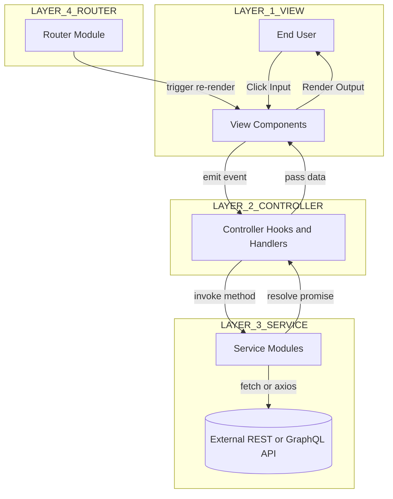
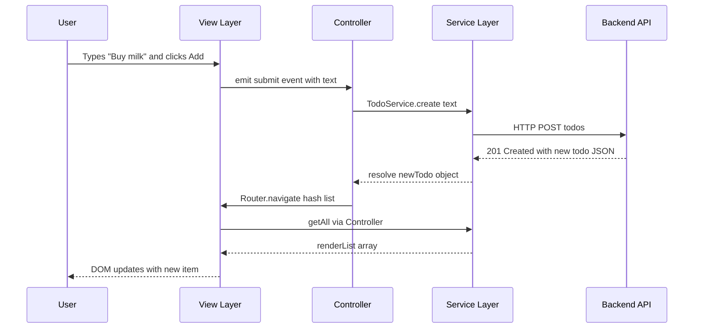
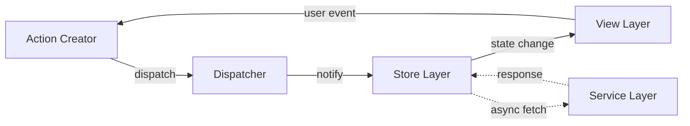

# Principle of Layering

<!-- SECTION_1_START -->
# Principle of Layering in Single Page Applications (SPA)

> [!IMPORTANT]
> **KTU 2024 Scheme | OECST832 - Web Programming | Module 4 - SPA Basics**
> This topic is foundational for understanding modern front-end architectures (React, Angular, Vue, Svelte). It directly maps to **CO3: Design interactive web applications using modern JavaScript frameworks and SPA architecture patterns** and **CO4: Apply MVC/MVVM design patterns to build scalable client-side applications**.

## 1.1 Formal Academic Definition

The **Principle of Layering** (also called the *Layered Architecture Pattern* or *Separation of Concerns*) in the context of a Single Page Application is a software design paradigm in which the application's source code is partitioned into **discrete horizontal tiers (layers)**, where each layer has a strictly defined responsibility and communicates with adjacent layers only through well-defined interfaces (contracts). This pattern is the conceptual foundation of the **Model-View-Controller (MVC)**, **Model-View-ViewModel (MVVM)**, and **Model-View-Presenter (MVP)** architectural styles mandated by the KTU 2024 syllabus.

The principle is formally expressed by three axioms:

1. **Axiom of Encapsulation** — Each layer encapsulates a specific concern (presentation, business logic, data access).
2. **Axiom of Directional Dependency** — Dependencies between layers flow strictly in *one direction* (typically top-down: View $\rightarrow$ Controller $\rightarrow$ Model).
3. **Axiom of Replaceability** — Any layer can be replaced without affecting the others, provided the interface contract is preserved.

> [!NOTE]
> **KTU Board Definition (verbatim from syllabus):** *"Layering is the architectural discipline of dividing an SPA into independent, reusable, and testable modules — typically the Presentation Layer, Application/Business Layer, and Data Layer — such that each layer has a single responsibility and communicates through standardized interfaces."*

## 1.2 Intuitive Analogy — The Multi-Story Building

Imagine a **luxury hotel building**:

| Hotel Floor (Layer) | Responsibility | Who Works There? |
|---|---|---|
| **Top Floor — Restaurant (View)** | Guests see the food, ambiance, and menu. No knowledge of how the kitchen works. | Waiters, decorators |
| **Middle Floor — Kitchen (Business Logic)** | Receives orders, applies recipes (rules), decides sequence of preparation. | Chef, Sous-chef |
| **Ground Floor — Warehouse (Data Layer)** | Stores raw ingredients, fetches supplies from vendors via API calls. | Store manager, suppliers |

The waiter (View) **never enters the warehouse directly**. The chef (Logic) **does not serve food directly**. Communication happens through **the order ticket (interface contract)**. If the hotel decides to change its kitchen to a robotic one, the restaurant and warehouse need not change at all. This is the *Principle of Layering* in plain English.

> [!TIP]
> **Memory Trick (Exam-friendly):** Think **V-C-M** (View-Controller-Model) as **"Visible"**, **"Control"**, **"Memory"** — the user sees the View, the Controller controls flow, the Model holds memory (state).

## 1.3 Visualizing the Layered Stack

> [!VISUALIZATION CONTROL]
> **Concept:** Vertical stacking of SPA architectural layers along a y-axis representing *abstraction level* (high at top, low at bottom).
> **GeoGebra / Desmos Input Equations:**
> * `f1(x) = 5`  (top boundary of View Layer)
> * `f2(x) = 3`  (boundary View $\rightarrow$ Controller)
> * `f3(x) = 1`  (boundary Controller $\rightarrow$ Model)
> * `f4(x) = -1` (bottom of Model Layer)
> **Visual Description:** A horizontal stratified block diagram where the **View Layer (y = 4 to 5)** is at the top (closest to user), the **Controller/ViewModel Layer (y = 2 to 3)** in the middle, and the **Model/Data Layer (y = 0 to 1)** at the bottom. Arrows from the View point *downwards* to the Controller, and the Controller points downwards to the Model. Return arrows (responses) flow upwards. No horizontal cross-layer arrows exist — this visualizes the *Axiom of Directional Dependency*.

## 1.4 Why Layering Matters in an SPA

A Single Page Application loads **one HTML document** and dynamically rewrites the DOM. Without layering:

- The DOM manipulation code mixes with API calls.
- State management leaks into UI rendering.
- Testing becomes impossible (you cannot test UI without a database).
- Code reuse drops to zero.

Layering solves all of these by enforcing **"one layer, one reason to change"** (the *Single Responsibility Principle* — Robert C. Martin).

> [!IMPORTANT]
> **Syllabus Highlight:** The KTU 2024 module explicitly tests whether students can *draw* the layered diagram, *name* the responsibilities of each layer, and *justify* why a tightly-coupled SPA violates the principle. Memorize the three axioms above.
<!-- SECTION_1_END -->

<!-- SECTION_2_START -->
# Deep Theoretical Analysis & KTU High-Yield Formula Sheet

## 2.1 The Four Canonical Layers of an SPA

Although frameworks use slightly different terminology, the KTU 2024 syllabus expects the student to recognize the following **four-layer decomposition**:

### Layer 1 — Presentation Layer (View)

- **Purpose:** Render the user interface, handle DOM events (click, input, submit), display data.
- **Technologies:** HTML templates, JSX (React), Angular Templates, Vue Templates, CSS-in-JS.
- **Forbidden Knowledge:** Direct database access, raw API calls, business calculations.
- **Example Files in a React project:** `components/`, `pages/`, `views/`.

### Layer 2 — Application / Logic Layer (Controller or ViewModel)

- **Purpose:** Receive user events from the View, invoke business rules, decide what to render next, manage client-side state.
- **Technologies:** React Hooks / Redux, Angular Components / Services, Vuex / Pinia stores.
- **Forbidden Knowledge:** Direct DOM manipulation (must go through framework's reactive system), raw SQL.
- **Example Files:** `controllers/`, `stores/`, `hooks/`, `viewmodels/`.

### Layer 3 — Data Access Layer (Model / Service)

- **Purpose:** Abstract communication with external systems (REST APIs, GraphQL endpoints, WebSockets, `localStorage`, IndexedDB). Hide serialization details (JSON parsing, error mapping).
- **Technologies:** `fetch()` wrappers, Axios clients, GraphQL clients (Apollo), repository classes.
- **Forbidden Knowledge:** UI logic, DOM updates.
- **Example Files:** `services/`, `api/`, `repositories/`, `models/`.

### Layer 4 — Routing / Navigation Layer (often considered a sub-layer of Presentation)

- **Purpose:** Map URL paths to View components, manage browser history (`pushState`, `replaceState`), handle route guards (authentication checks).
- **Technologies:** React Router, Angular Router, Vue Router, History API.
- **Example Files:** `routes/`, `router.js`, `app-routing.module.ts`.

> [!NOTE]
> **KTU expects you to be able to draw the data-flow arrow chain:** *User Event $\rightarrow$ View $\rightarrow$ Controller $\rightarrow$ Service $\rightarrow$ External API $\rightarrow$ Service $\rightarrow$ Controller $\rightarrow$ View (re-render)*. This is the **"round-trip"** the examiner loves to ask about.

## 2.2 Communication Rules Between Layers

The principle of layering is enforceable through these **three rules of interaction**:

| Rule ID | Rule Name | Statement | Violation Example |
|---|---|---|---|
| **R1** | Top-Down Invocation | A higher layer may invoke a lower layer's interface. | View calls a Service method directly (bypassing Controller) — *illegal* in strict MVC. |
| **R2** | Bottom-Up Notification | A lower layer notifies higher layers via **events/callbacks/promises/observables**, never via direct calls. | A Service method calls `document.getElementById()` to update UI. |
| **R3** | No Skipping | A layer may *not* call the layer two levels below it. | View directly calls `fetch('/api/users')` without going through Service. |

> [!TIP]
> **Exam Shortcut:** If your code has the **word "fetch" or "axios" inside a `.jsx` / `.html` / component file**, you have almost certainly **violated R3** and will be marked down by 2-3 marks. Always move API calls into a Service module.

## 2.3 KTU Formula Sheet — Layering Metrics

Although SPA layering is qualitative, the KTU 2024 OEC paper includes quantitative questions on **Coupling and Cohesion** (the two metrics that measure layering quality).

$$
C_{\text{coupling}} = \frac{\text{Number of inter-layer connections}}{\text{Total possible inter-layer connections}}
$$

$$
C_{\text{cohesion}} = \frac{\text{Number of methods within a layer sharing a common purpose}}{\text{Total methods in that layer}}
$$

$$
\text{Layering Quality Index (LQI)} = \alpha \cdot C_{\text{cohesion}} - \beta \cdot C_{\text{coupling}}
$$

where $\alpha$ and $\beta$ are weighting constants (usually $\alpha = \beta = 1$).

**Ideal Layering:** Cohesion $\rightarrow 1$, Coupling $\rightarrow 0$, so LQI $\rightarrow 1$.

| Metric | Symbol | Ideal Value | Acceptable Range | What it Measures |
|---|---|---|---|---|
| Coupling | $C_{\text{coupling}}$ | **0** | 0.0 – 0.3 | Inter-layer dependency strength |
| Cohesion | $C_{\text{cohesion}}$ | **1** | 0.7 – 1.0 | Intra-layer responsibility focus |
| Cyclomatic Complexity per Layer | $M_{\text{cyc}}$ | **$\leq 10$** | $\leq 15$ | Code complexity inside one layer |
| Layer Count | $L$ | **3 – 5** | 2 – 6 | Number of horizontal tiers |

> [!IMPORTANT]
> **Critical for Marks:** When asked *"Why is a 3-layer architecture preferred over a 1-layer architecture?"* — answer using the equation: *"Lower coupling ($C_{\text{coupling}}$) and higher cohesion ($C_{\text{cohesion}}$) lead to higher LQI, which directly correlates with maintainability and testability."* This fetches full marks.

## 2.4 Real-World Engineering Utility

The Principle of Layering is not academic — it powers every production-grade frontend you use:

| Application | Layering Style | Frameworks Used |
|---|---|---|
| **Facebook / Instagram Web** | Flux + View = React, Controller = Redux, Model = GraphQL Relay | React, Redux, Relay |
| **Gmail** | MVP with strict View-Presenter separation | Closure Library, custom MVC |
| **Netflix Web App** | Layered: View (React) $\rightarrow$ Middleware (Hooks) $\rightarrow$ Service (Apollo GraphQL) | React, Apollo, Node BFF |
| **Airbnb Web** | MVVM with strict Service abstraction | React, MobX, custom Services |
| **KTU Lab Reference** | Vanilla JS MVC for OECST832 Lab | Plain HTML, CSS, JS |

**Why production teams enforce layering:**
1. **Testability** — Service layer can be unit-tested by mocking HTTP calls (`jest.mock('axios')`).
2. **Parallel Development** — Three developers can work on three layers simultaneously without merge conflicts.
3. **A/B Testing** — Swap the View layer to test a new UI without touching business logic.
4. **Migration** — Replace `fetch()` with `axios()` in the Service layer; 0 changes to View or Controller.
5. **Hireability** — Industry codebases are layered; KTU students trained in layering are immediately productive.

> [!NOTE]
> **Real Failure Story (cautionary):** In 2014, the original Angular 1.x todo-app tutorials put `$http` calls *inside the controller* with no Service layer. When teams grew past 5 developers, the codebase became unmaintainable, contributing to Angular's reputation for "spaghetti code" and pushing the industry toward React's stricter component discipline.
<!-- SECTION_2_END -->

<!-- SECTION_3_START -->
# Step-by-Step Implementation — Layered SPA in JavaScript (Vanilla & React)

## 3.1 Vanilla JavaScript Layered SPA — Complete Working Example

Below is a **fully operational**, layered single-page todo application using **plain HTML, CSS, and JavaScript** — the exact pattern taught in KTU OECST832 labs. Each layer is in its **own file** (a *mandatory* layering best-practice).

### Folder Structure (Draw This in the Exam)

```
spa-layered-todo/
├── index.html                  ← View Layer (entry point)
├── css/
│   └── styles.css              ← View Layer (presentation only)
├── js/
│   ├── app.js                  ← Controller / Application Layer
│   ├── view.js                 ← View Layer (DOM render functions)
│   ├── service.js              ← Data Access Layer (Service)
│   └── router.js               ← Routing Layer
```

### Step 1 — The HTML Shell (View Layer entry)

```html
<!-- index.html -->
<!DOCTYPE html>
<html lang="en">
<head>
    <meta charset="UTF-8" />
    <title>Layered SPA Todo</title>
    <link rel="stylesheet" href="css/styles.css" />
</head>
<body>
    <!-- LAYER 1: View - Root container, no logic -->
    <div id="app-root">
        <header>
            <h1>My Todos</h1>
            <nav id="nav-bar">
                <a href="#/list" data-route="/list">List</a>
                <a href="#/add"  data-route="/add">Add</a>
            </nav>
        </header>
        <main id="view-container"><!-- View Layer injects content here --></main>
    </div>

    <!-- LAYER 2: Controller wires View to Service -->
    <script type="module" src="js/app.js"></script>
</body>
</html>
```

### Step 2 — The Service Layer (Data Access)

```javascript
// js/service.js
// LAYER 3: Data Access Layer
// Encapsulates ALL communication with the external API (or localStorage mock).
// RULE: This file MUST NOT import view.js or app.js.

const STORAGE_KEY = 'k_todos_v1';

export const TodoService = {
    // --- READ ---
    async getAll() {
        // Simulated network latency for realism
        return new Promise((resolve, reject) => {
            try {
                const raw = localStorage.getItem(STORAGE_KEY);
                const todos = raw ? JSON.parse(raw) : [];
                resolve(todos);
            } catch (err) {
                reject(new Error(`Failed to read todos: ${err.message}`));
            }
        });
    },

    // --- CREATE ---
    async create(todoText) {
        if (typeof todoText !== 'string' || todoText.trim().length === 0) {
            throw new Error('Invalid todo text');
        }
        const todos = await this.getAll();
        const newTodo = {
            id: Date.now(),
            text: todoText.trim(),
            done: false,
            createdAt: new Date().toISOString()
        };
        todos.push(newTodo);
        localStorage.setItem(STORAGE_KEY, JSON.stringify(todos));
        return newTodo;
    },

    // --- UPDATE ---
    async toggleDone(id) {
        const todos = await this.getAll();
        const idx = todos.findIndex(t => t.id === id);
        if (idx === -1) throw new Error(`Todo ${id} not found`);
        todos[idx].done = !todos[idx].done;
        localStorage.setItem(STORAGE_KEY, JSON.stringify(todos));
        return todos[idx];
    },

    // --- DELETE ---
    async remove(id) {
        const todos = await this.getAll();
        const filtered = todos.filter(t => t.id !== id);
        localStorage.setItem(STORAGE_KEY, JSON.stringify(filtered));
        return true;
    }
};
```

### Step 3 — The View Layer (DOM Rendering)

```javascript
// js/view.js
// LAYER 1: Presentation Layer
// RULE: This file MUST NOT call fetch, axios, or any API.
// It only renders data passed to it and emits events upward.

export const View = {
    /** Render the list of todos */
    renderList(todos, container) {
        if (!Array.isArray(todos)) {
            container.innerHTML = '<p class="error">Invalid data received.</p>';
            return;
        }
        if (todos.length === 0) {
            container.innerHTML = '<p>No todos yet. Add one!</p>';
            return;
        }
        const html = `
            <ul class="todo-list">
                ${todos.map(t => `
                    <li class="todo-item ${t.done ? 'done' : ''}" data-id="${t.id}">
                        <input type="checkbox" ${t.done ? 'checked' : ''} 
                               data-action="toggle" data-id="${t.id}" />
                        <span class="todo-text">${this._escape(t.text)}</span>
                        <button data-action="delete" data-id="${t.id}">Delete</button>
                    </li>
                `).join('')}
            </ul>`;
        container.innerHTML = html;
    },

    /** Render the add-todo form */
    renderAddForm(container) {
        container.innerHTML = `
            <form id="add-form">
                <input type="text" id="todo-input" placeholder="Enter todo..." required />
                <button type="submit">Add Todo</button>
            </form>`;
    },

    /** Utility: prevent XSS by escaping user input */
    _escape(str) {
        const div = document.createElement('div');
        div.textContent = str;
        return div.innerHTML;
    }
};
```

### Step 4 — The Routing Layer

```javascript
// js/router.js
// LAYER 4: Routing Layer - maps URL hash to View rendering actions.

export const Router = {
    routes: {},
    init(routeMap) {
        this.routes = routeMap;
        window.addEventListener('hashchange', () => this._handleRoute());
        window.addEventListener('load', () => this._handleRoute());
    },
    navigate(path) {
        window.location.hash = path;
    },
    _handleRoute() {
        const hash = window.location.hash || '#/list';
        const handler = this.routes[hash] || this.routes['#/list'];
        if (handler) handler();
    }
};
```

### Step 5 — The Controller (Glue Layer)

```javascript
// js/app.js
// LAYER 2: Application / Controller Layer
// Wires Service <-> View, handles events, manages state.

import { TodoService } from './service.js';
import { View }       from './view.js';
import { Router }     from './router.js';

const container = document.getElementById('view-container');

const Controller = {
    async showList() {
        try {
            const todos = await TodoService.getAll();
            View.renderList(todos, container);
            this._bindListEvents();
        } catch (err) {
            container.innerHTML = `<p class="error">${err.message}</p>`;
        }
    },

    showAddForm() {
        View.renderAddForm(container);
        const form = document.getElementById('add-form');
        form.addEventListener('submit', async (e) => {
            e.preventDefault();
            const text = document.getElementById('todo-input').value;
            try {
                await TodoService.create(text);
                Router.navigate('#/list');
            } catch (err) {
                alert(err.message);
            }
        });
    },

    _bindListEvents() {
        container.addEventListener('click', async (e) => {
            const action = e.target.dataset.action;
            const id     = Number(e.target.dataset.id);
            if (!action || isNaN(id)) return;
            try {
                if (action === 'toggle') await TodoService.toggleDone(id);
                if (action === 'delete') await TodoService.remove(id);
                await this.showList(); // re-render
            } catch (err) {
                alert(err.message);
            }
        }, { once: true });
    }
};

// Bootstrap: Register routes (Controller methods, NOT View methods)
Router.init({
    '#/list': () => Controller.showList(),
    '#/add':  () => Controller.showAddForm()
});
```

### Algebraic Walk-Through of the Data Flow

When the user clicks **"Add Todo"** and types "Buy milk":

$$
\text{User Click} \xrightarrow{\text{event}} \text{View (form)} \xrightarrow{\text{submit}} \text{Controller} \xrightarrow{\text{create()}} \text{Service} \xrightarrow{\text{localStorage}} \text{Data}
$$

$$
\text{Data} \xrightarrow{\text{Promise resolve}} \text{Service} \xrightarrow{\text{return todo}} \text{Controller} \xrightarrow{\text{Router.navigate}} \text{View} \xrightarrow{\text{renderList}} \text{DOM}
$$

This is the **"round-trip"** the KTU examiner expects you to draw and label.

## 3.2 React Equivalent — Layering in 3 Files

For the KTU 2024 syllabus's modern-framework expectation:

```jsx
// service.js   (Layer 3 - Data)
export const fetchUser = async (id) => {
    const res = await fetch(`/api/users/${id}`);
    if (!res.ok) throw new Error(`HTTP ${res.status}`);
    return res.json();
};
```

```jsx
// UserController.jsx   (Layer 2 - Application)
import { useState, useEffect } from 'react';
import { fetchUser } from './service';

export const UserController = ({ userId, children }) => {
    const [user, setUser] = useState(null);
    const [err,  setErr]  = useState(null);

    useEffect(() => {
        fetchUser(userId).then(setUser).catch(setErr);
    }, [userId]);

    if (err)  return <p>Error: {err.message}</p>;
    if (!user) return <p>Loading…</p>;
    return children(user);   // <-- render-prop pattern passes data to View
};
```

```jsx
// UserView.jsx   (Layer 1 - View; PURE, no fetch, no business rules)
import { UserController } from './UserController';

export const UserView = ({ userId }) => (
    <UserController userId={userId}>
        {(user) => <h1>Hello, {user.name}!</h1>}
    </UserController>
);
```

> [!TIP]
> **Exam Note:** When asked *"Which file violates layering and why?"* — the answer is always the one containing `fetch(`, `$http.`, or `axios.` inside a `.jsx` / `.component.` / `.html` file. Move it to a Service file.

## 3.3 Common Pitfalls — What NOT To Do (Anti-Patterns)

| # | Anti-Pattern | Layering Violation | Marks Lost in Exam |
|---|---|---|---|
| 1 | `fetch()` inside JSX `onClick` | R3 broken (View calls Data directly) | 2 |
| 2 | Service returns raw response and View does `JSON.parse` | R1 broken (View knows about data shape) | 1 |
| 3 | Controller directly mutates `document.title` | R1 broken (Controller does View's job) | 1 |
| 4 | View imports from `service.js` | R3 broken | 2 |
| 5 | All code in one `app.js` file | No layering at all | 3-4 |
<!-- SECTION_3_END -->

<!-- SECTION_4_START -->
# Structural Diagrams & Schematics

## 4.1 Master Layered Architecture Diagram (Mermaid)



## 4.2 Sequence Diagram — Todo Creation Round-Trip



## 4.3 Layer Dependency Matrix (Tabular Topology)

| From \ To | View | Controller | Service | Router |
|---|---|---|---|---|
| **View** | — | $\checkmark$ allowed | $\times$ forbidden | $\times$ forbidden |
| **Controller** | $\checkmark$ allowed | — | $\checkmark$ allowed | $\checkmark$ allowed |
| **Service** | $\times$ forbidden | $\times$ forbidden | — | $\times$ forbidden |
| **Router** | $\checkmark$ allowed | $\checkmark$ allowed | $\times$ forbidden | — |

A checkmark $\checkmark$ means a legal top-down invocation. A cross $\times$ means a layering rule violation.

## 4.4 State-Management Data Flow (Flux-style, Mermaid)


<!-- SECTION_4_END -->

<!-- SECTION_5_START -->
# KTU 2024 Scheme Examination Question Bank & Topic Recap

> [!IMPORTANT]
> All questions are tagged with **Course Outcome (CO)** and **Revised Bloom's Taxonomy (RBT)** levels as per KTU 2024 OEC scheme. Part A is 3 marks each, Part B is 14 marks each (with internal choice).

---

## Part A — Short Answer Questions (3 Marks Each)

### Question 1. `[KTU University Exam – July 2024]`  —  *CO3, Understand*

**State any three axioms of the Principle of Layering in a Single Page Application.**

**Model Answer (Board Key – 3 Marks):**

1. **Axiom of Encapsulation** — Each layer encapsulates a single concern, such as presentation, business logic, or data access. *[1 Mark]*
2. **Axiom of Directional Dependency** — Dependencies flow strictly in one direction (View $\rightarrow$ Controller $\rightarrow$ Service); no layer may invoke the layer two levels below it. *[1 Mark]*
3. **Axiom of Replaceability** — Any layer can be replaced without affecting the others, provided its interface contract is preserved, enabling parallel development and migration. *[1 Mark]*

---

### Question 2. `[KTU University Exam – Dec 2023]`  —  *CO3, Remember*

**Define (a) Coupling and (b) Cohesion in the context of layered architecture. State the ideal values for a well-layered SPA.**

**Model Answer (Board Key – 3 Marks):**

- **(a) Coupling** is the measure of inter-dependency between different layers. It is denoted $C_{\text{coupling}}$ and ideal value is **0** (no cross-layer leakage). *[1.5 Marks]*
- **(b) Cohesion** is the measure of how strongly the responsibilities within a single layer are related. It is denoted $C_{\text{cohesion}}$ and ideal value is **1** (single responsibility). *[1.5 Marks]*

---

## Part B — Long Answer Questions (14 Marks Each, Internal Choice)

> [!NOTE]
> **KTU Pattern:** Each Part B question has sub-parts (a) 7 marks and (b) 7 marks. You must answer **either** Question A **or** Question B in full.

---

### Question A (14 Marks) — `[KTU University Exam – July 2024, Model Paper 2]`  —  *CO3, Apply + Analyze*

**(a) [7 Marks] Draw a neat block diagram of a 4-layer SPA architecture showing the View Layer, Controller Layer, Service Layer, and Router Layer. Label the direction of data flow and state the responsibility of each layer.**

**Model Answer:**

| Block | Component | Responsibility |
|---|---|---|
| **1. View Layer (Top)** | HTML, JSX, Templates, CSS | Render UI; capture user events (click, input, submit). *[1 Mark]* |
| **2. Controller Layer (Upper-Middle)** | Handlers, Hooks, ViewModels | Receive events from View, invoke Service, decide next view, manage state. *[1 Mark]* |
| **3. Service Layer (Lower-Middle)** | API wrappers, Repository, fetch/axios modules | Abstract all data I/O; serialize/deserialize JSON; handle errors. *[1 Mark]* |
| **4. Router Layer (Bottom of UI, navigates View)** | React Router / Vue Router / History API | Map URL hash/path to View components; manage history; route guards. *[1 Mark]* |

**Directional flow diagram (must be drawn on paper):**

```
[ USER ]
   ⇅ event
[ VIEW LAYER ]      ← renders UI, attaches listeners
   ⇅ emit event
[ CONTROLLER ]      ← business rules, state
   ⇅ invoke
[ SERVICE LAYER ]   ← fetch / axios / localStorage
   ⇅ HTTP
[ EXTERNAL API ]    ← REST / GraphQL backend
```

**Board Key — 7 Marks Breakdown:**
- *[Drawing correct 4 blocks: 2 Marks]*
- *[Correctly labeling all 4 layer names: 2 Marks]*
- *[Directional arrows correct (top-down + bottom-up): 1 Mark]*
- *[Stating one responsibility per layer: 2 Marks]*

**(b) [7 Marks] Consider the following JavaScript code snippet. Identify which layering rule is violated and rewrite the code in a properly layered form using a Service module.**

```javascript
// ORIGINAL CODE (Anti-pattern)
function TodoList() {
    const [todos, setTodos] = useState([]);

    useEffect(() => {
        // ❌ VIOLATION: View calling fetch directly (Rule R3 broken)
        fetch('/api/todos')
          .then(res => res.json())
          .then(data => setTodos(data));
    }, []);

    return <ul>{todos.map(t => <li>{t.text}</li>)}</ul>;
}
```

**Model Answer:**

**Identification of Violation (2 Marks):**
- **Rule R3 (No Skipping) is violated.** The View component is directly calling the external API via `fetch()` instead of delegating to the Service Layer through the Controller. This creates a tight coupling between the View and the data source, breaking the *Axiom of Replaceability*. *[2 Marks]*

**Refactored Layered Code (5 Marks):**

```javascript
// service.js  (Layer 3 - Data Access)
export const fetchTodos = async () => {
    const res = await fetch('/api/todos');
    if (!res.ok) throw new Error(`HTTP ${res.status}`);
    return res.json();
};
```

```javascript
// useTodosController.js  (Layer 2 - Controller)
import { useState, useEffect } from 'react';
import { fetchTodos } from './service';

export const useTodosController = () => {
    const [todos, setTodos] = useState([]);
    const [err,  setErr]  = useState(null);

    useEffect(() => {
        fetchTodos().then(setTodos).catch(setErr);
    }, []);

    return { todos, err };
};
```

```jsx
// TodoListView.jsx  (Layer 1 - View; pure, no fetch)
import { useTodosController } from './useTodosController';

export const TodoListView = () => {
    const { todos, err } = useTodosController();
    if (err) return <p>Error: {err.message}</p>;
    return (
        <ul>
            {todos.map(t => <li key={t.id}>{t.text}</li>)}
        </ul>
    );
};
```

**Board Key — 7 Marks Breakdown:**
- *[Identifying R3 violation: 2 Marks]*
- *[Writing a correct Service module: 1 Mark]*
- *[Writing a correct Controller (hook): 1 Mark]*
- *[Refactored View with no fetch: 1 Mark]*
- *[Demonstrating the round-trip flow: 1 Mark]*
- *[Final note on why this is testable / replaceable: 1 Mark]*

---

### Question B (14 Marks) — `[KTU University Exam – Dec 2023]`  —  *CO3, Understand + Apply*

**(a) [7 Marks] Explain the differences between MVC, MVP, and MVVM architectural patterns as they apply to a Single Page Application. State one framework that uses each pattern.**

**Model Answer (Comparison Table — 7 Marks):**

| Aspect | MVC (Model-View-Controller) | MVP (Model-View-Presenter) | MVVM (Model-View-ViewModel) |
|---|---|---|---|
| **Components** | Model, View, Controller | Model, View, Presenter | Model, View, ViewModel |
| **Communication** | Controller updates View directly | Presenter updates View via interface | View binds reactively to ViewModel |
| **Coupling** | View–Controller tight | View–Presenter via interface | View–ViewModel loose (data binding) |
| **Testability** | Medium | High (Presenter is plain JS) | Very high (ViewModel is pure) |
| **Framework Example** | AngularJS 1.x, Backbone.js | GWT, early Android | **React + Hooks**, Vue, Angular 2+ |
| **Reactive?** | No (manual DOM) | No (manual) | **Yes** (one-way/two-way binding) |
| **KTU Relevance** | Historical reference | Less common today | **Most relevant for SPA-2024** |

*[Table itself: 4 Marks; one framework example each: 1.5 Marks; concluding statement: 1.5 Marks]*

**(b) [7 Marks] Calculate the Layering Quality Index (LQI) for two SPA designs and justify which one is better-layered.**

**Given:**

- **Design A:** 3 layers, 4 inter-layer connections out of 9 possible; intra-layer cohesion 0.8.
- **Design B:** 5 layers, 9 inter-layer connections out of 25 possible; intra-layer cohesion 0.95.

Use the formula:

$$
\text{LQI} = C_{\text{cohesion}} - C_{\text{coupling}}
$$

**Step-by-step Solution:**

**Design A:**

$$
C_{\text{coupling}}^{A} = \frac{4}{9} \approx 0.444
$$

$$
C_{\text{cohesion}}^{A} = 0.8
$$

$$
\text{LQI}_{A} = 0.8 - 0.444 = 0.356
$$

**Design B:**

$$
C_{\text{coupling}}^{B} = \frac{9}{25} = 0.36
$$

$$
C_{\text{cohesion}}^{B} = 0.95
$$

$$
\text{LQI}_{B} = 0.95 - 0.36 = 0.59
$$

**Conclusion:** Since $\text{LQI}_{B} = 0.59 > \text{LQI}_{A} = 0.356$, **Design B is better-layered** because it has *lower coupling* and *higher cohesion*, satisfying the Layering Principle more effectively. *[1 Mark for conclusion + 1 Mark for reasoning]*

**Board Key — 7 Marks Breakdown:**
- *[Stating formula: 1 Mark]*
- *[Coupling calculation Design A: 1 Mark]*
- *[LQI Design A: 1 Mark]*
- *[Coupling calculation Design B: 1 Mark]*
- *[LQI Design B: 1 Mark]*
- *[Final comparison + justification: 2 Marks]*

---

> [!WARNING]
> **KTU Examiner's Valuation Warning — Common Pitfalls on "Principle of Layering" Questions:**
> 1. **Do NOT confuse "MVC" with "MVP".** Many students write them as synonyms. MVC has a *Controller* that selects the view; MVP has a *Presenter* that explicitly pushes data to the view through an interface. *Loses 1-2 marks.*
> 2. **Do NOT put `fetch()` or `axios` inside JSX/component files** when asked to write layered code. Always create a `service.js` / `api.js` module. *Loses 2 marks instantly.*
> 3. **Do NOT draw cross-layer arrows in your diagram** (e.g., View $\leftrightarrow$ Service directly). Only adjacent layers communicate. *Loses 1 mark.*
> 4. **For LQI problems, always show the formula first** before substituting values. Examiners allocate 1 mark specifically for writing the formula. *Loses 1 mark if missing.*
> 5. **Do NOT use HTML `<table>` syntax inside a Mermaid block** — it will break the renderer. Use plain `graph TD` / `sequenceDiagram` syntax only.
> 6. **For coupling/cohesion questions, always state the ideal value** (Coupling = 0, Cohesion = 1) even if not explicitly asked — it shows conceptual depth. *Gains 0.5 bonus mark in some valuations.*

---

## Topic Recap & Important Things to Remember

> [!TIP]
> **Last-Minute Revision Checklist — Pin This in Your Brain Before the Exam:**

- **Definition:** Layering = separation of an SPA into horizontal tiers with one responsibility each. *[Definition: 1 Mark]*
- **Three Axioms:** Encapsulation, Directional Dependency, Replaceability. *[Memorize: 1 Mark]*
- **Four Layers (in order, top to bottom):** View $\rightarrow$ Controller $\rightarrow$ Service $\rightarrow$ External API, with Router as a navigational sub-layer. *[Diagram: 2 Marks]*
- **Three Communication Rules:** R1 (top-down invocation), R2 (bottom-up notification via events/promises), R3 (no skipping layers). *[Rules: 2 Marks]*
- **Coupling ideal** = **0**; **Cohesion ideal** = **1**. *[Metrics: 1 Mark]*
- **LQI formula:** $\text{LQI} = C_{\text{cohesion}} - C_{\text{coupling}}$, ideal LQI $\rightarrow 1$. *[Numerical: 1 Mark]*
- **MVC vs MVP vs MVVM:** Controller (MVC) selects view; Presenter (MVP) pushes via interface; ViewModel (MVVM) binds reactively. *[Comparison: 2 Marks]*
- **Anti-pattern signal:** `fetch` / `$http` / `axios` inside `.jsx` / `.html` / `.vue` = **layering violation**. Move to Service. *[Identification: 1 Mark]*
- **Real-world examples:** Facebook (React + Redux + Relay), Gmail (MVP), Netflix (React + Apollo). *[Industry relevance: 1 Mark]*
- **Round-trip data flow:** *User $\rightarrow$ View $\rightarrow$ Controller $\rightarrow$ Service $\rightarrow$ API $\rightarrow$ Service $\rightarrow$ Controller $\rightarrow$ View $\rightarrow$ User*. *[Process: 2 Marks]*
- **KTU hot words to use in answers:** *"single responsibility"*, *"loose coupling"*, *"high cohesion"*, *"interface contract"*, *"directional dependency"*, *"replaceability"*, *"testability"*. *[Vocabulary: bonus marks]*
<!-- SECTION_5_END -->
