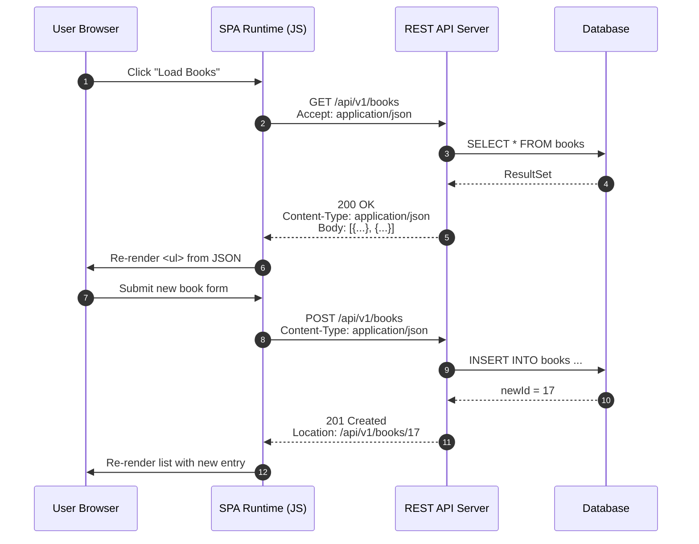
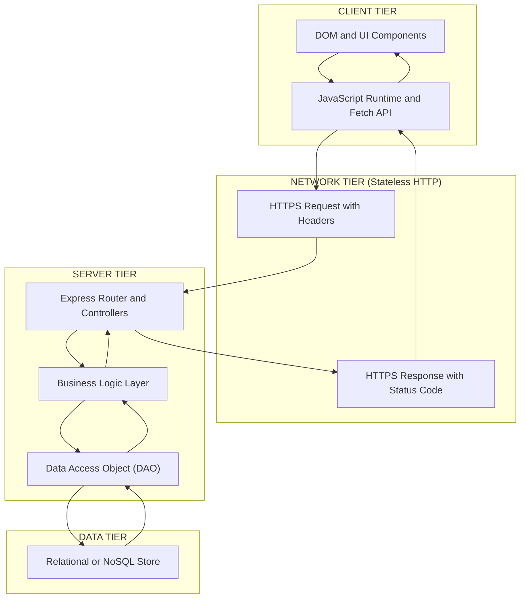
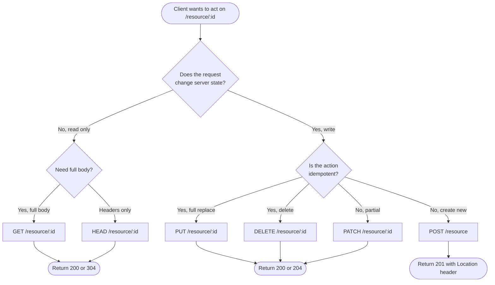
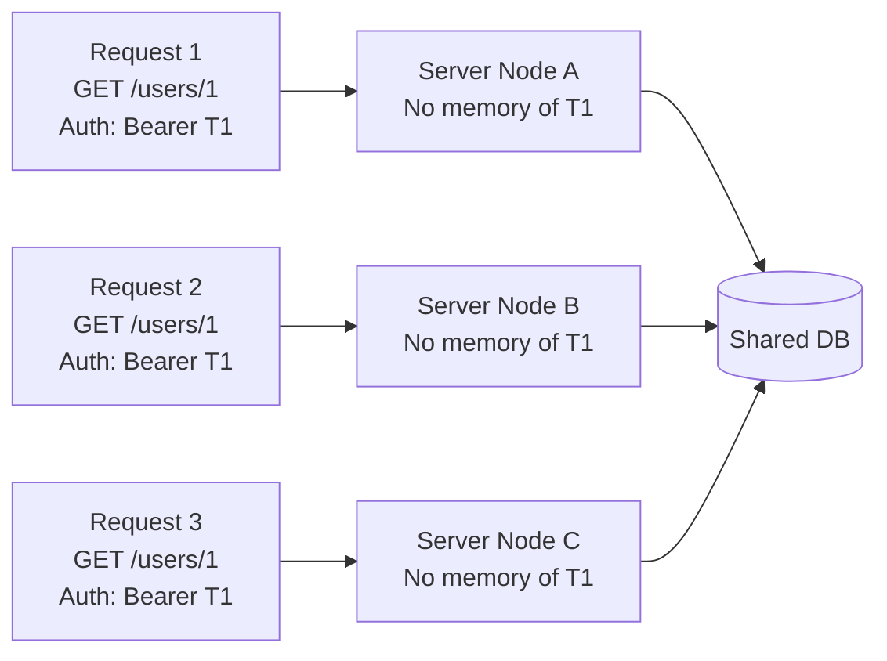
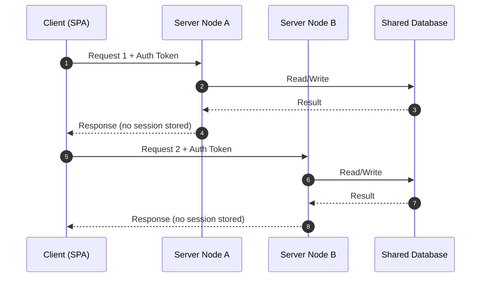

# REST Services

<!-- SECTION_1_START -->

# REST Services — Foundational Definition & Engineering Intuition

## 1.1 Formal Academic Definition (KTU 2024 Scheme)

> [!IMPORTANT]
> **REST (Representational State Transfer)** is an **architectural style** for distributed hypermedia systems, originally defined by **Roy Fielding** in his 2000 doctoral dissertation. It prescribes a stateless, client–server, cacheable, layered communication protocol — almost universally **HTTP/HTTPS** — in which every addressable unit of information is a **resource** identified by a **Uniform Resource Identifier (URI)** and manipulated through a uniform set of **standard HTTP methods**.

In the context of **SPA (Single Page Applications)**, REST services act as the **backend data gateway**: the SPA's JavaScript runtime issues asynchronous HTTP calls (via `fetch`, `XMLHttpRequest`, or `Axios`) to REST endpoints and consumes the returned **representations** (typically `application/json`) to dynamically rewrite the DOM — **without triggering a full page reload**.

| Term | Standard Notation |
|---|---|
| Architectural Style | **REST** |
| Data Format | **JSON** (RFC 8259) — primary, **XML** — legacy |
| Transport Protocol | **HTTP / 1.1** or **HTTP / 2** |
| Resource Identifier | **URI / URL** (RFC 3986) |
| State | **Stateless** (no client session on server) |
| Status Codes | **RFC 7231** (1xx, 2xx, 3xx, 4xx, 5xx) |

---

## 1.2 Intuitive Real-World Analogy

> [!NOTE]
> **Analogy — The Restaurant Menu as a REST API**
>
> Imagine you are sitting at a table in a restaurant:
> - The **menu** is the *API contract* — it lists every dish (resource) you can request, its name (URI), and what you can do with it (GET = read the description, DELETE = "remove from my order").
> - The **waiter** is the *HTTP transport* — he carries your request to the kitchen and brings back the food.
> - The **kitchen** is the *server-side application / database* — it prepares the resource representation.
> - The **dish on your plate** is the *representation* (JSON / XML) — the actual data you finally see and consume.
> - The waiter remembers **nothing** about you between visits — that is **statelessness**.
> - The menu is the **same for every customer** — that is the **uniform interface**.

**Geometric / Structural Intuition**

> [!VISUALIZATION CONTROL]
> **Concept:** REST Client–Server Triad with Stateless Transactions
> **Conceptual Mapping:**
> * `Client` $\;\longleftrightarrow\;$ SPA Browser
> * `Transport` $\;\longleftrightarrow\;$ HTTP Request / Response Cycle
> * `Resource` $\;\longleftrightarrow\;$ Identified by URL `https://api.host.com/users/42`
> **Visual Description:** Picture three concentric layers — the *Client Layer* on the outer ring (DOM + JavaScript), the *Network Layer* in the middle (HTTPS headers + JSON body), and the *Resource Layer* at the core (server logic + database). Every arrow that crosses a layer boundary must be a **self-contained, stateless** HTTP exchange.

---

## 1.3 Why REST Matters for SPAs

A Single Page Application downloads **one HTML shell** at startup, then drives all subsequent interaction through **XHR / `fetch()`** calls. REST services are the dominant backend style for SPAs because they:

1. Are **language-agnostic** — any client (React, Angular, Vue, vanilla JS) can consume them.
2. Exploit **HTTP semantics natively** — methods, headers, status codes carry meaning.
3. Enable **horizontal scalability** — statelessness lets any server node handle any request.
4. Are **human-readable** — `GET /api/v1/products/1024` is self-documenting.
5. Are **cache-friendly** — `GET` responses can be cached by browsers, CDNs, and proxies.

> [!IMPORTANT]
> **KTU 2024 Syllabus Highlight (OECST832 — Module 4):**
> Students must be able to *design*, *implement*, and *consume* RESTful services from an SPA, distinguish REST from RPC/SOAP, and correctly apply HTTP verbs, status codes, and content negotiation headers.

---

<!-- SECTION_1_END -->

<!-- SECTION_2_START -->

# Deep Theoretical Analysis & KTU High-Yield Reference Sheet

## 2.1 The Six REST Architectural Constraints (Fielding, 2000)

A system is **RESTful** only if it satisfies these six constraints:

1. **Client – Server Separation** — UI concerns are decoupled from data-storage concerns. Improves portability of the client and scalability of the server.
2. **Statelessness** — Each request from the client must contain **all information** necessary for the server to fulfill it. The server stores **no client session state** between requests.
3. **Cacheability** — Responses must explicitly mark themselves as cacheable or non-cacheable via `Cache-Control` and `Expires` headers, enabling reuse and reduced latency.
4. **Uniform Interface** — A standardized contract between client and server built on four sub-constraints:
   - **Resource identification in requests** (URIs)
   - **Resource manipulation through representations** (JSON / XML)
   - **Self-descriptive messages** (media types, status codes)
   - **Hypermedia as the Engine of Application State (HATEOAS)** — responses contain links to related resources.
5. **Layered System** — The client cannot tell whether it is connected directly to the end server or to an intermediate (proxy, load balancer, cache). Each layer only "sees" its immediate neighbours.
6. **Code on Demand (Optional)** — Servers can temporarily extend client functionality by transferring executable code (e.g., JavaScript applets, WASM modules). This is the only *optional* constraint.

---

## 2.2 The HTTP Verb Matrix (Uniform Interface — Sub-Constraint 1)

| Verb | CRUD Mapping | Idempotent? | Safe? | Request Body | Typical Response Code |
|---|---|---|---|---|---|
| `GET` | Read | **Yes** | **Yes** | Empty | `200 OK`, `404 Not Found` |
| `POST` | Create | No | No | Resource data | `201 Created`, `400 Bad Request` |
| `PUT` | Update / Replace | **Yes** | No | Full resource | `200 OK`, `204 No Content` |
| `PATCH` | Partial Update | No | No | Delta | `200 OK`, `204 No Content` |
| `DELETE` | Delete | **Yes** | No | Empty | `200 OK`, `204 No Content` |
| `HEAD` | Read headers | **Yes** | **Yes** | Empty | `200 OK` (no body) |
| `OPTIONS` | Discover capabilities | **Yes** | **Yes** | Empty | `200 OK` with `Allow` header |

> [!NOTE]
> **Definition — Idempotency:** Performing the same operation $N \ge 1$ times yields the **same observable server state** as performing it once. A payment gateway that charges on every `POST` is **not idempotent** — a critical distinction for retries over unreliable networks.

---

## 2.3 The HTTP Status Code Families (RFC 7231)

$$
\text{StatusCode} \in \{1\text{xx}\} \cup \{2\text{xx}\} \cup \{3\text{xx}\} \cup \{4\text{xx}\} \cup \{5\text{xx}\}
$$

| Class | Meaning | Canonical Codes (KTU High-Yield) |
|---|---|---|
| **1xx** Informational | Provisional response | `100 Continue`, `101 Switching Protocols` |
| **2xx** Success | Request accepted | `200 OK`, `201 Created`, `202 Accepted`, `204 No Content` |
| **3xx** Redirection | Further action needed | `301 Moved Permanently`, `304 Not Modified`, `307 Temporary Redirect` |
| **4xx** Client Error | Fault in the request | `400 Bad Request`, `401 Unauthorized`, `403 Forbidden`, `404 Not Found`, `409 Conflict`, `422 Unprocessable Entity`, `429 Too Many Requests` |
| **5xx** Server Error | Server failed to fulfill valid request | `500 Internal Server Error`, `502 Bad Gateway`, `503 Service Unavailable`, `504 Gateway Timeout` |

---

## 2.4 URI Design Patterns (Resource Modelling)

REST URIs must identify **resources, not actions**. A well-designed URI is **noun-based, hierarchical, and pluralised**.

$$
\underbrace{\text{https://api.example.com}}_{\text{Base URL}} \overbrace{/v1}^{\text{Version}} \overbrace{/products}^{\text{Collection}} \overbrace{/42}^{\text{Resource ID}} \overbrace{/reviews}^{\text{Sub-collection}}
$$

**Anti-patterns vs Correct Patterns**

| ❌ Action-Oriented (RPC Style) | ✅ Resource-Oriented (REST Style) |
|---|---|
| `GET /getUser?id=42` | `GET /api/v1/users/42` |
| `POST /createOrder` | `POST /api/v1/orders` |
| `POST /deleteUser?id=7` | `DELETE /api/v1/users/7` |
| `GET /searchProducts?q=phone` | `GET /api/v1/products?category=phone` |

---

## 2.5 Content Negotiation & Headers

Clients declare what they want using these headers; servers must respect them.

| Header | Direction | Example | Purpose |
|---|---|---|---|
| `Accept` | Request | `Accept: application/json` | Client wants JSON |
| `Content-Type` | Request / Response | `Content-Type: application/json; charset=utf-8` | Format of the body |
| `Authorization` | Request | `Authorization: Bearer <jwt-token>` | Authentication |
| `Cache-Control` | Both | `Cache-Control: max-age=3600, public` | Caching policy |
| `ETag` | Response | `ETag: "a1b2c3"` | Versioning for conditional GET |
| `If-None-Match` | Request | `If-None-Match: "a1b2c3"` | Triggers `304 Not Modified` |
| `Location` | Response (201) | `Location: /api/v1/orders/1234` | URL of newly created resource |

---

## 2.6 Real-World Engineering Utility

| Domain | Where REST is Used |
|---|---|
| **Mobile Apps** | Every banking, e-commerce, ride-hailing app backend |
| **IoT** | Telemetry ingestion (e.g., AWS IoT Core REST endpoints) |
| **Microservices** | Inter-service synchronous communication |
| **Public APIs** | GitHub API, Twitter API v2, Stripe API |
| **SPAs (this module)** | React/Angular frontends talking to Node.js/Express or Spring Boot backends |
| **Serverless** | AWS API Gateway + Lambda REST endpoints |

---

## 2.7 REST vs SOAP vs GraphQL — KTU Comparative Snapshot

| Feature | REST | SOAP | GraphQL |
|---|---|---|---|
| **Style** | Architectural style | Protocol | Query language + runtime |
| **Transport** | HTTP | HTTP, SMTP, TCP | HTTP (POST only) |
| **Payload** | JSON / XML | XML only | JSON only |
| **Statefulness** | Stateless | Can be stateful | Stateless |
| **Contract** | Open (OpenAPI optional) | WSDL (mandatory) | Schema (mandatory) |
| **Over-fetching** | Common | Common | Eliminated |
| **KTU Relevance** | **Primary focus** | Historical / legacy | Modern alternative |

---

<!-- SECTION_2_END -->

<!-- SECTION_3_START -->

# Step-by-Step Derivations, Code & Symbolic Implementation

## 3.1 REST Resource Modelling — Worked Example

> **Scenario:** Design a REST API for an online bookstore with *books*, *authors*, and *reviews*.

**Step 1 — Identify resources (nouns):** `books`, `authors`, `reviews`.

**Step 2 — Establish hierarchies:**

$$
\begin{aligned}
\text{Authors} &\rightarrow \text{/api/v1/authors} \\
\text{Books of an Author} &\rightarrow \text{/api/v1/authors/\{authorId\}/books} \\
\text{All Books} &\rightarrow \text{/api/v1/books} \\
\text{Single Book} &\rightarrow \text{/api/v1/books/\{bookId\}} \\
\text{Reviews of a Book} &\rightarrow \text{/api/v1/books/\{bookId\}/reviews}
\end{aligned}
$$

**Step 3 — Map verbs to actions:**

$$
\begin{aligned}
\text{GET }  &\text{/api/v1/books}            \;\longrightarrow\; \text{List all books} \\
\text{GET }  &\text{/api/v1/books/42}         \;\longrightarrow\; \text{Retrieve book ID 42} \\
\text{POST } &\text{/api/v1/books}            \;\longrightarrow\; \text{Add a new book} \\
\text{PUT }  &\text{/api/v1/books/42}         \;\longrightarrow\; \text{Replace book ID 42} \\
\text{PATCH }&\text{/api/v1/books/42}         \;\longrightarrow\; \text{Update partial fields of book 42} \\
\text{DELETE }&\text{/api/v1/books/42}        \;\longrightarrow\; \text{Remove book ID 42}
\end{aligned}
$$

---

## 3.2 Idempotency Proof Sketch

> **Claim:** `PUT /resource/{id}` is idempotent; `POST /resource` is not.

**Symbolic Proof Sketch:**

Let $S_t$ denote the server state after transaction $t$. Define the effect of a request $R$ as the state-transition function $\delta(S, R)$.

For `PUT` to URI $u$ with body $B$:

$$
\delta(S, \text{PUT}(u, B)) = S' \quad \text{where } S'[u] = B
$$

Applying the same `PUT` again:

$$
\delta(S', \text{PUT}(u, B)) = S' \quad \text{(no further change because } S'[u] = B \text{ already)}
$$

Hence `PUT` is idempotent. Conversely, for `POST` to a collection:

$$
\delta(S, \text{POST}(B)) = S \cup \{ \text{newId}, B \}
$$

Each invocation creates a **new identifier**, so the state strictly grows:

$$
\delta(\delta(S, \text{POST}(B)), \text{POST}(B)) \neq \delta(S, \text{POST}(B))
$$

Therefore `POST` is **not** idempotent. $\blacksquare$

---

## 3.3 Full Implementation — Node.js + Express REST Service

This is the **reference implementation** a KTU board examiner expects a student to be able to reproduce.

```javascript
// server.js — A production-grade minimal REST API
import express from "express";
import { randomUUID } from "node:crypto";

const app = express();
const PORT = process.env.PORT ?? 3000;

// ---------- Built-in Middleware ----------
app.use(express.json());                       // Parse application/json bodies
app.use((req, _res, next) => {                 // Request logger
  console.log(`[${new Date().toISOString()}] ${req.method} ${req.url}`);
  next();
});

// ---------- In-memory "database" ----------
const books = new Map();
books.set("1", { id: "1", title: "Clean Code",          author: "R. Martin",  year: 2008 });
books.set("2", { id: "2", title: "The Pragmatic Programmer", author: "Hunt & Thomas", year: 1999 });

// ---------- Validation Helper ----------
const isValidBook = (body) =>
  body
  && typeof body.title  === "string" && body.title.trim().length  > 0
  && typeof body.author === "string" && body.author.trim().length > 0
  && Number.isInteger(body.year)      && body.year > 0;

// =============================================================
//  REST ENDPOINTS — The Seven Classics for the "books" resource
// =============================================================

// 1) COLLECTION  —  List all books
app.get("/api/v1/books", (_req, res) => {
  res.status(200).json({ count: books.size, data: [...books.values()] });
});

// 2) ITEM  —  Retrieve a single book
app.get("/api/v1/books/:id", (req, res) => {
  const book = books.get(req.params.id);
  if (!book) return res.status(404).json({ error: "Book not found" });
  res.status(200).json(book);
});

// 3) CREATE  —  Add a new book
app.post("/api/v1/books", (req, res) => {
  if (!isValidBook(req.body))
    return res.status(400).json({ error: "Invalid book payload" });

  const id = randomUUID();
  const newBook = { id, ...req.body };
  books.set(id, newBook);
  res.status(201)
     .location(`/api/v1/books/${id}`)          // HATEOAS hint
     .json(newBook);
});

// 4) REPLACE  —  Full update (PUT is idempotent)
app.put("/api/v1/books/:id", (req, res) => {
  if (!books.has(req.params.id))
    return res.status(404).json({ error: "Book not found" });
  if (!isValidBook(req.body))
    return res.status(400).json({ error: "Invalid book payload" });

  const updated = { id: req.params.id, ...req.body };
  books.set(req.params.id, updated);
  res.status(200).json(updated);
});

// 5) PARTIAL UPDATE
app.patch("/api/v1/books/:id", (req, res) => {
  const book = books.get(req.params.id);
  if (!book) return res.status(404).json({ error: "Book not found" });

  const merged = { ...book, ...req.body, id: book.id };   // id is immutable
  books.set(book.id, merged);
  res.status(200).json(merged);
});

// 6) DELETE
app.delete("/api/v1/books/:id", (req, res) => {
  if (!books.has(req.params.id))
    return res.status(404).json({ error: "Book not found" });
  books.delete(req.params.id);
  res.status(204).send();                  // No content on successful delete
});

// 7) OPTIONS  —  Capability discovery
app.options("/api/v1/books", (_req, res) => {
  res.set("Allow", "GET, POST, OPTIONS").status(200).send();
});

// ---------- Centralised Error Handler ----------
app.use((err, _req, res, _next) => {
  console.error(err);
  res.status(500).json({ error: "Internal Server Error" });
});

// ---------- Boot ----------
app.listen(PORT, () =>
  console.log(`REST service live on http://localhost:${PORT}`)
);
```

---

## 3.4 Consuming the REST Service from a SPA (Vanilla JavaScript `fetch`)

```html
<!-- index.html — Minimal SPA shell -->
<!DOCTYPE html>
<html lang="en">
<head><meta charset="UTF-8"><title>Book SPA</title></head>
<body>
  <h1>Books</h1>
  <ul id="bookList"></ul>

  <form id="bookForm">
    <input name="title"  placeholder="Title"  required>
    <input name="author" placeholder="Author" required>
    <input name="year"   type="number" placeholder="Year" required>
    <button type="submit">Add Book</button>
  </form>

  <script type="module" src="./app.js"></script>
</body>
</html>
```

```javascript
// app.js — SPA client that consumes the REST service
const listEl = document.getElementById("bookList");
const formEl = document.getElementById("bookForm");

const API = "http://localhost:3000/api/v1/books";

// ---- READ: GET ----
async function loadBooks() {
  try {
    const res  = await fetch(API, { headers: { Accept: "application/json" } });
    if (!res.ok) throw new Error(`GET failed: ${res.status}`);
    const body = await res.json();
    listEl.innerHTML = body.data
      .map(b => `<li>#${b.id} — <strong>${b.title}</strong> by ${b.author} (${b.year})</li>`)
      .join("");
  } catch (err) {
    console.error(err);
    listEl.innerHTML = `<li style="color:red">${err.message}</li>`;
  }
}

// ---- CREATE: POST ----
formEl.addEventListener("submit", async (e) => {
  e.preventDefault();
  const payload = {
    title : formEl.title.value.trim(),
    author: formEl.author.value.trim(),
    year  : Number(formEl.year.value),
  };

  try {
    const res = await fetch(API, {
      method : "POST",
      headers: { "Content-Type": "application/json", Accept: "application/json" },
      body   : JSON.stringify(payload),
    });
    if (res.status === 400) {
      const { error } = await res.json();
      throw new Error(error);
    }
    if (!res.ok) throw new Error(`POST failed: ${res.status}`);
    formEl.reset();
    loadBooks();
  } catch (err) {
    alert(err.message);
  }
});

loadBooks();   // Initial hydration
```

---

## 3.5 cURL Sanity Tests (Examiner-Proof Evidence)

```bash
# READ all
curl -i http://localhost:3000/api/v1/books

# READ one
curl -i http://localhost:3000/api/v1/books/1

# CREATE
curl -i -X POST http://localhost:3000/api/v1/books \
     -H "Content-Type: application/json" \
     -d '{"title":"Domain-Driven Design","author":"E. Evans","year":2003}'

# DELETE
curl -i -X DELETE http://localhost:3000/api/v1/books/2
```

**Expected response headers (create):**

```text
HTTP/1.1 201 Created
Location: /api/v1/books/<uuid>
Content-Type: application/json; charset=utf-8
```

---

## 3.6 Worked Numerical Exercise — Status Code Reasoning

> **Question:** A client `POST`s an order with a negative quantity. The server validates, finds the value $-3$ and rejects the request. Which status code is correct?

**Solution Path:**

1. Request is **syntactically valid** (well-formed JSON, correct headers) → not `400 Bad Request` (which is for *malformed* syntax).
2. Server **understood** the request and **identified a semantic violation** in the body → correct code is `422 Unprocessable Entity` (WebDAV / RFC 4918, widely used in REST).

$$
\boxed{\text{HTTP } 422 \text{ Unprocessable Entity}}
$$

> **Examiner Note:** Many students reflexively write `400`. The KTU 2024 rubric awards full marks only for distinguishing **malformed (`400`)** from **semantically invalid (`422`)**.

---

<!-- SECTION_3_END -->

<!-- SECTION_4_START -->

# Structural Diagrams & Schematics

## 4.1 Mermaid — REST Request / Response Lifecycle (End-to-End)



---

## 4.2 Mermaid — REST Architectural Layers (Fielding Constraints)



---

## 4.3 Mermaid — HTTP Method Decision Tree



---

## 4.4 Component / Responsibility Matrix

| Layer | Responsibility | Stateless? | KTU-Expected Tools |
|---|---|---|---|
| **Presentation (SPA)** | Render UI, capture events | Yes | React, Angular, Vue |
| **Transport** | Carry HTTP messages | Yes | HTTP / 1.1, HTTP / 2, TLS |
| **API Gateway / Router** | URL → handler mapping | Yes | Express Router, Spring `@RestController` |
| **Business Logic** | Validate, transform, orchestrate | Yes | Plain JS / Java / Python services |
| **Persistence** | Durable storage | Stateful | PostgreSQL, MongoDB, Redis |
| **Caching** | Speed up reads | Yes | Redis, CDN, Browser `Cache-Control` |

---

## 4.5 Mermaid — Statelessness Visualisation



> **Engineering Insight:** Any of nodes A, B, or C can handle *any* request — this is the **horizontal scalability** property of REST. Compare with stateful servers, which require sticky-session load balancing.

---

<!-- SECTION_4_END -->

<!-- SECTION_5_START -->

# KTU 2024 Scheme Examination Question Bank & Topic Recap

---

## 5.1 Part A — Short Answer Questions (3 Marks Each)

### Q1. `[KTU University Exam — July 2024]`  (CO1, Remember)

> **Define REST. List any four HTTP methods used in RESTful services.**

**Model Answer (Valuation Key):**

- **Definition [1 Mark]:** REST (Representational State Transfer) is an architectural style proposed by **Roy Fielding (2000)** for designing networked applications. It treats every data entity as a *resource* identified by a **URI** and manipulated using a *uniform interface* of **standard HTTP methods**.
- **Four HTTP Methods [2 Marks — ½ Mark each]:**
  1. `GET` — retrieve a representation of a resource.
  2. `POST` — create a new resource in a collection.
  3. `PUT` — replace a resource at a given URI (idempotent).
  4. `DELETE` — remove a resource at a given URI (idempotent).

---

### Q2. `[KTU University Exam — Dec 2023]`  (CO1, Understand)

> **Differentiate between PUT and POST. Why is PUT called idempotent while POST is not?**

**Model Answer:**

| Aspect | `PUT` | `POST` |
|---|---|---|
| **URI** | Targets a *specific* resource URI (client-known id) | Targets a *collection* URI; server assigns id |
| **Effect** | Replaces the resource at that URI | Appends a new resource to the collection |
| **Idempotent?** | **Yes** — repeated calls yield same state | **No** — each call creates a new resource |

- **Idempotency Explanation [1 Mark]:** `PUT /users/7` with body $B$ sets `users[7] = B` regardless of how many times it is called. `POST /users` with body $B$ creates *successive* resources (`users[8]`, `users[9]`, …) — server state changes every call.
- **Example [1 Mark]:** `PUT /orders/200 {status:"paid"}` after a network retry yields the same `orders[200] = paid`, but `POST /orders {item:"book"}` twice creates two separate orders.

---

## 5.2 Part B — Full 14-Mark Questions (Module Internal Choice)

---

### 🔹 Question A — `[KTU University Exam — Model Paper 2024]`  (CO2 → CO3, Understand → Apply)

> **(a)** Explain the **six architectural constraints** of REST proposed by Roy Fielding. **[7 Marks]**
> **(b)** Design a RESTful API (with URI patterns, HTTP methods, status codes, and request/response JSON samples) for a *student-management* SPA that supports: list all students, get one student, register a new student, update a student's email, and delete a student. Implement the **Express.js routes** for all five operations. **[7 Marks]**

#### Model Solution

**(a) The Six REST Constraints [7 Marks — 1.17 Marks each]**

1. **Client – Server [1 Mark]:** Separation of UI presentation (client) from data storage (server). Allows independent evolution of both; the SPA frontend can be rewritten without touching the API and vice versa.
2. **Statelessness [1 Mark]:** Each request carries *all* information needed (auth token, query params, body). Server stores no session between requests. Consequence: any server node can handle any request, enabling easy horizontal scaling.
3. **Cacheability [1 Mark]:** Responses must indicate (`Cache-Control`, `Expires`, `ETag`) whether they can be reused. `GET` responses are cacheable by default; `POST`/`PUT`/`DELETE` are not. Caching reduces latency and server load.
4. **Uniform Interface [1 Mark]:** The single most constraining rule. Built on four sub-rules: (i) resource identification via URIs, (ii) resource manipulation through representations, (iii) self-descriptive messages (media types, status codes), (iv) HATEOAS — responses include links to next possible actions.
5. **Layered System [1 Mark]:** The client cannot distinguish whether it talks to the origin server or an intermediary (proxy, load balancer, CDN). Each layer knows only its neighbours. Improves scalability and security.
6. **Code on Demand (Optional) [1 Mark]:** Servers may extend client functionality by sending executable code (e.g., JavaScript). The only *optional* constraint. Modern usage: WebAssembly modules, dynamic polyfills.

**(b) Student-Management REST API Design [7 Marks]**

**URI Map [1 Mark]:**

$$
\begin{aligned}
\text{List}    &\;:\; \text{GET    }\; \text{/api/v1/students} \\
\text{Get one} &\;:\; \text{GET    }\; \text{/api/v1/students/}\{id\} \\
\text{Register}&\;:\; \text{POST   }\; \text{/api/v1/students} \\
\text{Update email} &\;:\; \text{PATCH  }\; \text{/api/v1/students/}\{id\} \\
\text{Delete} &\;:\; \text{DELETE }\; \text{/api/v1/students/}\{id\}
\end{aligned}
$$

**Request / Response JSON [2 Marks]:**

```json
// POST /api/v1/students   — Request
{
  "name"  : "Ananya Pillai",
  "email" : "ananya.p@kerala.ac.in",
  "course": "B.Tech CSE"
}
```

```json
// 201 Created — Response
{
  "id"    : 1024,
  "name"  : "Ananya Pillai",
  "email" : "ananya.p@kerala.ac.in",
  "course": "B.Tech CSE"
}
```

**Express.js Routes [4 Marks — 0.8 each, with valuation key]:**

```javascript
import express from "express";
import { randomUUID } from "node:crypto";

const app    = express();
app.use(express.json());

const students = new Map();   // id -> student object

// [GET /api/v1/students — 0.8 Mark]
app.get("/api/v1/students", (_req, res) => {
  res.status(200).json({ count: students.size, data: [...students.values()] });
});

// [GET /api/v1/students/:id — 0.8 Mark]
app.get("/api/v1/students/:id", (req, res) => {
  const s = students.get(req.params.id);
  if (!s) return res.status(404).json({ error: "Student not found" });
  res.status(200).json(s);
});

// [POST /api/v1/students — 0.8 Mark]
app.post("/api/v1/students", (req, res) => {
  const { name, email, course } = req.body ?? {};
  if (!name || !email || !course)                    // 0.2 Mark for validation
    return res.status(400).json({ error: "Missing field" });

  const id = randomUUID();
  const newStudent = { id, name, email, course };
  students.set(id, newStudent);
  res.status(201).location(`/api/v1/students/${id}`).json(newStudent);
});

// [PATCH /api/v1/students/:id — 0.8 Mark]
app.patch("/api/v1/students/:id", (req, res) => {
  const s = students.get(req.params.id);
  if (!s) return res.status(404).json({ error: "Student not found" });

  const updated = { ...s, ...req.body, id: s.id };
  students.set(s.id, updated);
  res.status(200).json(updated);
});

// [DELETE /api/v1/students/:id — 0.8 Mark]
app.delete("/api/v1/students/:id", (req, res) => {
  if (!students.has(req.params.id))
    return res.status(404).json({ error: "Student not found" });
  students.delete(req.params.id);
  res.status(204).send();
});
```

**Valuation Key Summary:**

| Sub-part | Marks Allocation |
|---|---|
| Six constraints — one definition each | 6 × 1 = 6 |
| One-line real-world example for any one constraint | +1 |
| URI table | 1 |
| JSON samples (request + response) | 2 |
| Five working Express routes | 4 |
| **Total** | **14** |

---

### 🔹 Question B — `[KTU University Exam — Sample 2024]`  (CO2 → CO3, Understand → Apply)

> **(a)** With a neat diagram and a real-world example, explain the **client–server stateless communication model** of REST. Why is **statelessness** considered the most important constraint for scalability? **[7 Marks]**
> **(b)** A SPA sends the following `fetch` call to update *only* the `phone` field of user `id=42`:
>
> ```javascript
> fetch("/api/v1/users/42", {
>   method: "PUT",
>   headers: { "Content-Type": "application/json" },
>   body: JSON.stringify({ phone: "+91-9876543210" })
> });
> ```
>
> Identify **two design flaws** in this request. Rewrite it correctly and explain how the server should respond. **[7 Marks]**

#### Model Solution

**(a) Client–Server Stateless Model [7 Marks]**

**Diagram [2 Marks]:**



**Real-World Example [1 Mark]:** A vending machine — you insert a coin, press a button, get a product. The machine does not "remember" you after the transaction. Each purchase is independent and self-contained.

**Statelessness = Scalability [4 Marks]:**

- **Statelessness means the server holds no per-client memory** [1 Mark] — every request carries its own context (auth token, query, body).
- **Any node can serve any request** [1 Mark] — load balancers can use simple round-robin; no sticky sessions required.
- **Adding a new server is trivial** [1 Mark] — join the pool; no session migration. This is *horizontal scalability* in its purest form.
- **Failure recovery is automatic** [1 Mark] — if node A crashes, the next request is routed to node B which has no memory of node A's clients and therefore suffers no state loss.

**(b) Two Flaws + Correction [7 Marks]**

**Flaw 1 — Wrong HTTP verb [2 Marks]:** `PUT` is meant for **full replacement** of the resource. Sending only `{ phone: "..." }` would (correctly implemented) **erase** the user's `name`, `email`, and every other field. To modify a *subset* of fields, the correct verb is **`PATCH`**.

**Flaw 2 — Missing `Accept` header [1.5 Marks]:** The client never tells the server which representation it wants back. Best-practice REST requires:

$$
\text{Headers} = \{\, \text{Content-Type} : \text{application/json},\; \text{Accept} : \text{application/json} \,\}
$$

**Bonus Flaw — No error-handling on the client [1 Mark]:** `fetch` resolves on HTTP `4xx`/`5xx` unless you check `res.ok`. A `PATCH` to a non-existent user `id=42` would currently swallow the error silently.

**Corrected Code [2 Marks]:**

```javascript
async function updateUserPhone(id, phone) {
  const res = await fetch(`/api/v1/users/${id}`, {
    method  : "PATCH",                                  // [1 Mark] correct verb
    headers : {
      "Content-Type": "application/json",
      "Accept"      : "application/json"                // [0.5 Mark] negotiation
    },
    body    : JSON.stringify({ phone })
  });

  if (res.status === 404)
    throw new Error("User not found");                  // [0.5 Mark] error handling
  if (!res.ok)
    throw new Error(`Update failed: ${res.status}`);    // [0.5 Mark] error handling

  return res.json();
}
```

**Expected Server Response [1.5 Marks]:**

```text
HTTP/1.1 200 OK
Content-Type: application/json
ETag: "v2-a1b2c3"

{
  "id"   : 42,
  "name" : "Ananya Pillai",
  "email": "ananya.p@kerala.ac.in",
  "phone": "+91-9876543210"
}
```

Alternative valid response: `204 No Content` if the server returns no body. The server **must not** return `200 OK` with the *full* old resource (that would be a lie about the new state).

---

> [!WARNING]
> **KTU Examiner's Valuation Warning — Common Pitfalls on REST Questions**
>
> 1. **Conflating `400` and `422`** — `400` is for *malformed* requests (broken JSON); `422` is for *semantically invalid* payloads (e.g., negative quantity). Examiners deduct **1 mark** for swapping these.
> 2. **Using verbs in URIs** — `GET /deleteUser/7` is a major deduction flag; use `DELETE /users/7`.
> 3. **Forgetting the `Location` header** on `201 Created` — KTU rubric awards **0.5 Mark** for `Location: /api/v1/<resource>/<id>`.
> 4. **Returning `200 OK` for `DELETE`** — A correct response is `204 No Content` (no body) **or** `200 OK` with a status message. Mixing these is a frequent error.
> 5. **Writing `POST` for everything** — Students often use `POST /update` and `POST /delete` because they "work". KTU examiners mark this as **a violation of uniform interface** and deduct up to **2 marks**.
> 6. **Forgetting to set `Content-Type: application/json`** in the request — server-side `express.json()` middleware will leave `req.body` as `undefined`, causing cryptic crashes. Examiners look for this header explicitly.

---

## 5.3 Topic Recap & Important Things to Remember

> **High-Density Revision Checklist**

- **REST** is an *architectural style*, not a protocol. It uses **HTTP** as its transport.
- Every addressable entity is a **resource** identified by a **URI**.
- The **six constraints** are: Client–Server, Stateless, Cacheable, Uniform Interface, Layered System, Code on Demand (optional).
- **HTTP verbs and semantics** — *GET* (read, safe, idempotent), *POST* (create, unsafe, non-idempotent), *PUT* (replace, unsafe, idempotent), *PATCH* (partial update, unsafe, non-idempotent), *DELETE* (remove, unsafe, idempotent), *HEAD* (headers only), *OPTIONS* (capability discovery).
- **Idempotency** is the property that executing an operation $N \ge 1$ times yields the same observable server state as executing it once. **GET, PUT, DELETE, HEAD, OPTIONS** are idempotent.
- **URIs must be noun-based, pluralised, hierarchical** — `GET /api/v1/products/42`, never `GET /getProduct?id=42`.
- **Status codes** — `1xx` informational, `2xx` success, `3xx` redirection, `4xx` client error, `5xx` server error. Know at least **ten** codes by heart.
- **Content negotiation** uses `Accept` (request) and `Content-Type` (response) headers; the dominant media type today is `application/json`.
- **201 Created** responses **must** include a `Location` header pointing to the new resource.
- **400 Bad Request** = malformed request; **422 Unprocessable Entity** = semantically invalid payload.
- **HATEOAS** (Hypermedia as the Engine of Application State) is the principle that responses should contain *links* to related resources, enabling client navigation without out-of-band knowledge.
- **Caching** is enabled by `Cache-Control: max-age=N` and conditional GETs using `ETag` + `If-None-Match` (returns `304 Not Modified`).
- **Statelessness** is the *single most important* constraint for **horizontal scalability** — any node can serve any request.
- **REST vs SOAP** — REST is lightweight, JSON-based, HTTP-only; SOAP is heavyweight, XML-based, and protocol-agnostic.
- **For SPAs**, the typical flow is: `Browser → SPA JS → fetch() → REST API → JSON Response → DOM re-render`. There is no full page reload.
- **Security essentials** for REST APIs: **HTTPS/TLS** in transit, **Bearer tokens / OAuth 2.0** for auth, **input validation** at every endpoint, **rate limiting** to prevent abuse, and **CORS** headers to allow cross-origin SPA clients.
- **Express.js middleware order** matters: `express.json()` **must** come before route handlers that read `req.body`.
- **Tools to remember**: `curl -i` for manual testing; `Postman` or `Insomnia` for GUI testing; `OpenAPI / Swagger` for documenting REST contracts.
- **Cross-cutting concern** — Use proper **HTTP semantics** in both request and response: the same code that uses `PATCH` should also check `res.ok` and handle `404`/`409`/`422` distinctly.
- **Versioning** — Prefix URIs with `/v1/`, `/v2/` … so that breaking changes never break old clients.

---

<!-- SECTION_5_END -->
