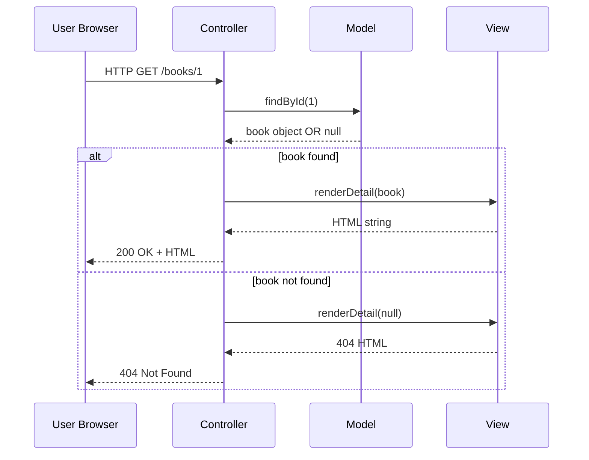
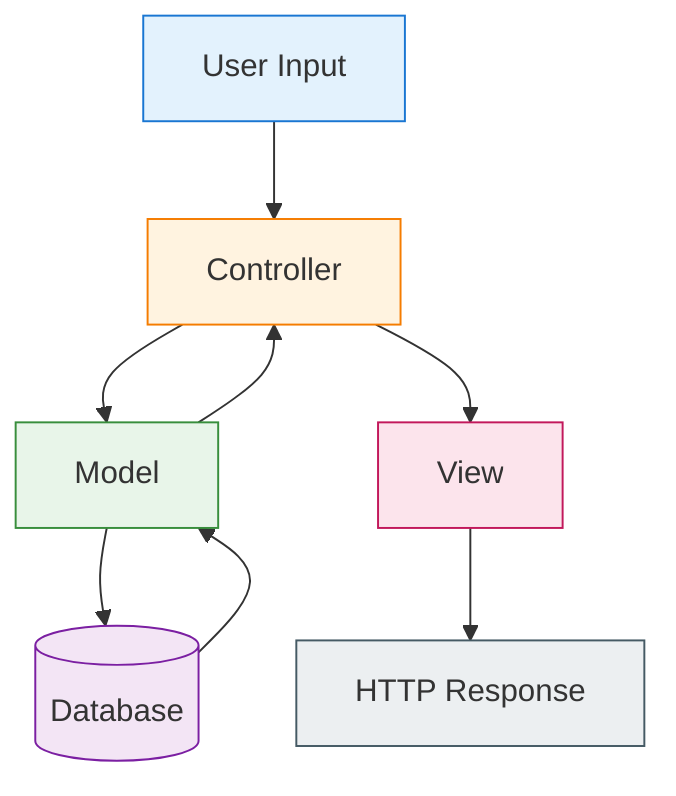
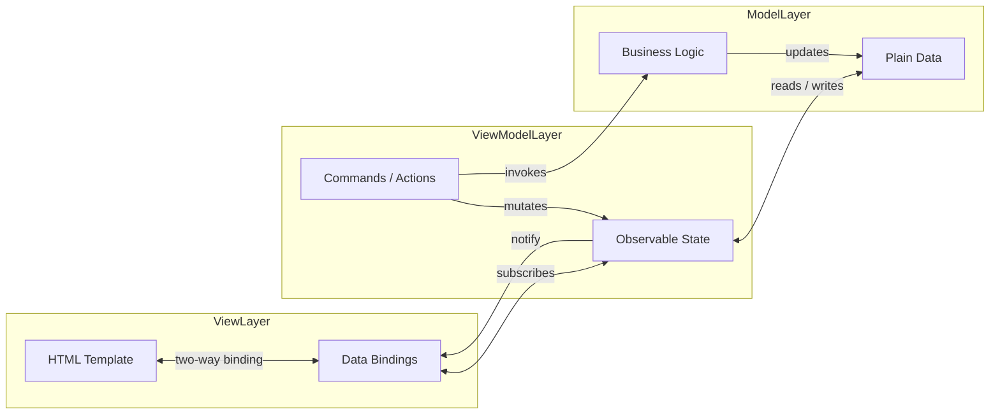
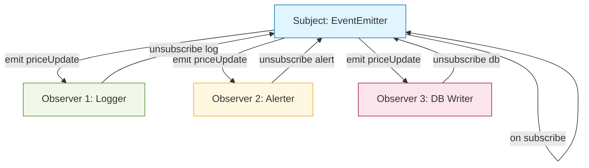
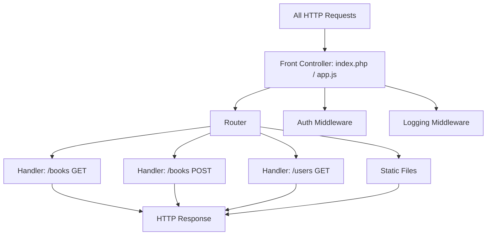
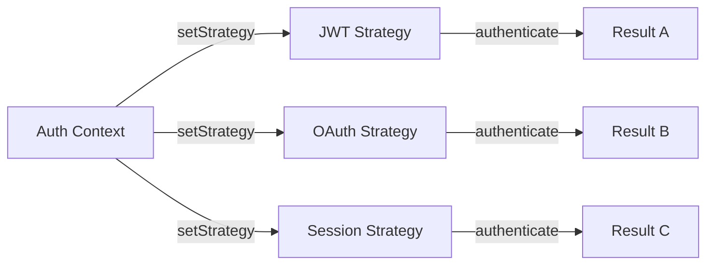
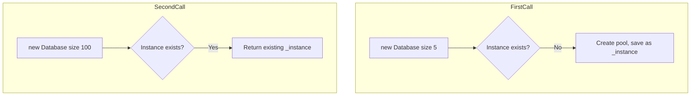
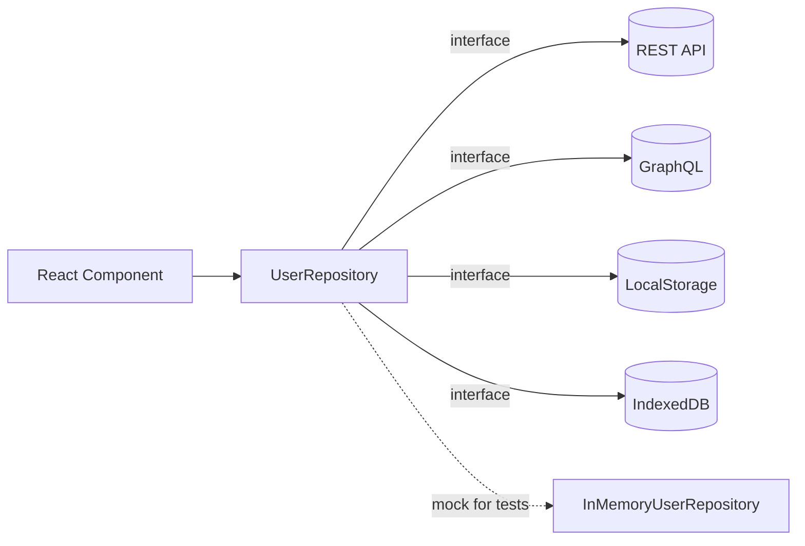
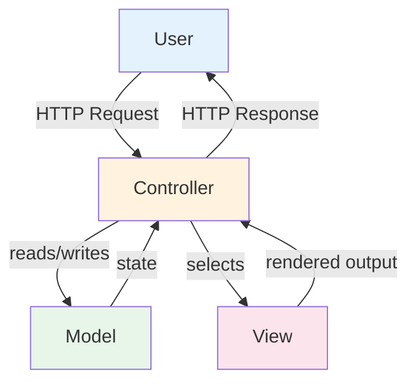

# Software Design Patterns in the Web Context

<!-- SECTION_1_START -->

# Software Design Patterns in the Web Context

## 1.1 Formal Definition

A **Software Design Pattern** is a general, reusable, time-tested solution to a commonly occurring problem within a given context in software design. In the web development ecosystem, design patterns provide a standardized vocabulary and architectural blueprint for structuring client-side and server-side code so that applications remain **scalable**, **maintainable**, and **decoupled**.

In the context of the KTU 2024 Scheme (OECST832 – Web Programming), design patterns are studied as part of Single Page Application (SPA) basics because modern SPA frameworks (React, Angular, Vue) are themselves built upon a layered application of these patterns.

> [!IMPORTANT]
> **KTU 2024 Syllabus Highlight (Module 4 – SPA Basics)**
> Software design patterns are the *architectural foundation* upon which SPA frameworks (React, Angular, Vue) are constructed. Without understanding patterns like MVC, MVVM, and Observer, you cannot reason about *why* a React component re-renders or *why* Angular uses services with `@Injectable()`.

## 1.2 Conceptual Analogy

Imagine you are building a **restaurant**:
- The **Kitchen** (Model) prepares the food — it holds the actual data and business rules.
- The **Waiter** (Controller) takes your order and passes it to the kitchen.
- The **Plate Presentation** (View) is what you see and interact with.

If the waiter starts cooking, the plate is now mixed with the order-taking. A small restaurant might survive, but a 200-table hotel will collapse. **Design Patterns are the codified rules of who does what, ensuring the hotel runs smoothly even when expanded to 10,000 tables.**

Similarly, in a web app:
- **MVC / MVVM** → "Who handles data? Who handles UI? Who handles logic?"
- **Observer** → "How does the UI know data changed without constantly asking?"
- **Singleton** → "How do we share one database connection globally?"

> [!NOTE]
> **Core Definition: Pattern vs. Algorithm**
> A **pattern** describes a *solution structure* (the shape of the code), whereas an **algorithm** describes a *sequence of steps* to solve a specific computation. Patterns are language-agnostic architectural blueprints; algorithms are language-specific procedural recipes.

## 1.3 The "Gang of Four" (GoF) Origin

In **1994**, four authors — Erich Gamma, Richard Helm, Ralph Johnson, and John Vlissides — published *Design Patterns: Elements of Reusable Object-Oriented Software*. This book catalogued **23 classic patterns** divided into three families:

| Family | Purpose | Web Examples |
|:---|:---|:---|
| **Creational** | Object creation mechanisms | Singleton, Factory, Builder |
| **Structural** | Object composition & relationships | Decorator, Facade, Adapter, Proxy |
| **Behavioral** | Communication between objects | Observer, Strategy, Iterator |

These 23 patterns, plus web-specific patterns (MVC, MVVM, Repository, Front Controller), form the complete vocabulary of modern web architecture.

> [!VISUALIZATION CONTROL]
> **Concept:** Pattern Classification Hierarchy
> **GeoGebra / Desmos Input Equations (as a tree structure on the y-axis):**
> * `x = -3, y = 8` → Creational (Point A)
> * `x = 0, y = 8` → Structural (Point B)
> * `x = 3, y = 8` → Behavioral (Point C)
> * Connect with lines to sub-patterns below.
> **Visual Description:** A top-down tree with 3 root nodes at y=8 and 5–6 leaf nodes at y=2, showing how all design patterns branch from three core intents.

---

<!-- SECTION_1_END -->

<!-- SECTION_2_START -->

# Deep Theoretical Analysis & KTU High-Yield Formula Sheet

## 2.1 The 8 Most Important Patterns for Web Development

While the GoF lists 23, web development has crystallized around a specific subset. These are the patterns the KTU 2024 examiner expects you to recognize, draw, and apply.

### 2.1.1 MVC — Model-View-Controller

The grandfather of web architecture. Used by **Ruby on Rails, Django, Laravel, Spring MVC, Express (loosely)**.

- **Model** → Manages data, business logic, and database rules. (The truth.)
- **View** → Renders the UI. (The presentation.) It is *passive* — never contains business logic.
- **Controller** → The middleman. Receives HTTP requests, updates the Model, then selects which View to render.

**Flow of data:**
$$\text{User} \rightarrow \text{Controller} \rightarrow \text{Model} \rightarrow \text{Controller} \rightarrow \text{View} \rightarrow \text{User}$$

> [!NOTE]
> **MVC in modern SPAs is "MVC-flavored":** The server often returns JSON instead of HTML, blurring the View boundary. In React, the View is the component tree, and the Controller is often replaced by hooks/effects.

### 2.1.2 MVVM — Model-View-ViewModel

The pattern behind **Angular, Vue, Knockout, and WPF**. Solves MVC's problem of the View not being smart enough to react to data changes automatically.

- **Model** → Same as MVC. Plain data.
- **View** → Declarative template (HTML with bindings).
- **ViewModel** → The "magic layer" that exposes Model data and commands, supports **two-way data binding**, and notifies the View when data changes.

The crucial mechanism is the **Observer pattern** (see 2.1.4) running inside the ViewModel.

### 2.1.3 Singleton Pattern

**Intent:** Ensure a class has *exactly one instance* and provide a global point of access to it.

**Why web apps need it:**
- Database connection pool (you want ONE pool, not 1000)
- Logger instance
- Application configuration object
- Browser's `window` object (de-facto singleton)

### 2.1.4 Observer Pattern (aka Pub/Sub)

**Intent:** Define a one-to-many dependency so that when one object (the *Subject*) changes state, all its dependents (*Observers*) are notified automatically.

**Why web apps need it:**
- React's `useState` re-renders components (the View is an Observer of state).
- Redux/Vuex stores.
- `addEventListener` is literally Observer.
- WebSocket subscribers.

### 2.1.5 Factory Pattern

**Intent:** Define an interface for creating an object, but let *subclasses* (or a factory function) decide which class to instantiate.

**Web context:** `React.createElement()`, `document.createElement()`, service factories that decide whether to return a real `HttpClient` or a `MockHttpClient` based on environment.

### 2.1.6 Repository Pattern

**Intent:** Mediate between the domain (business logic) and data mapping layers using a collection-like interface for accessing domain objects.

**Web context:** All data access (API calls, DB queries) goes through a repository. Components call `UserRepository.findAll()` instead of writing `fetch()` everywhere. This enables easy testing (mock the repository).

### 2.1.7 Strategy Pattern

**Intent:** Define a family of algorithms, encapsulate each one, and make them interchangeable at runtime.

**Web context:** Payment gateways (Stripe, PayPal, Razorpay — all implement a common `PaymentStrategy` interface). Sorting strategies. Authentication strategies (JWT, OAuth, Session).

### 2.1.8 Decorator Pattern

**Intent:** Attach additional responsibilities to an object dynamically. Decorators provide a flexible alternative to subclassing for extending functionality.

**Web context:** Express/Connect middleware (`app.use(express.json())` is a decorator wrapping the request handler). React Higher-Order Components (HOCs). Python decorators in Flask/Django.

## 2.2 KTU High-Yield Formula Sheet

| # | Pattern | Category | One-Line Intent | Web Framework Example |
|:---:|:---|:---|:---|:---|
| 1 | MVC | Architectural | Separate data, UI, and input logic | Django, Rails, Express |
| 2 | MVVM | Architectural | Two-way binding via ViewModel | Angular, Vue |
| 3 | Singleton | Creational | Only one instance globally | DB Pool, Logger |
| 4 | Factory | Creational | Delegate object creation | `createElement` |
| 5 | Observer | Behavioral | Notify many on state change | Redux, EventEmitter |
| 6 | Strategy | Behavioral | Swap algorithms at runtime | Auth providers |
| 7 | Repository | Structural (Data) | Hide data source from business logic | TypeORM, Mongoose DAOs |
| 8 | Decorator | Structural | Wrap to add behavior | Express middleware, HOCs |
| 9 | Façade | Structural | Simplified interface to complex system | `$.ajax()` jQuery facade |
| 10 | Front Controller | Architectural | Single entry point for all requests | `index.php`, `app.get('*')` |

**Real-World Engineering Utility:**
- **Microservices:** Strategy + Factory + Repository together.
- **E-commerce:** Decorator (discounts) + Observer (stock alerts) + Strategy (payment).
- **Real-time dashboards:** Observer (WebSocket) + MVC (separation).
- **Authentication:** Singleton (token store) + Strategy (JWT vs OAuth) + Decorator (logging).

> [!IMPORTANT]
> **Rule of Thumb for KTU Exams:**
> If the question shows a diagram with arrows between **Model ↔ View ↔ Controller**, the answer is **MVC**. If the arrows are **View ↔ ViewModel ↔ Model with two-way arrows**, the answer is **MVVM**.

---

<!-- SECTION_2_END -->

<!-- SECTION_3_START -->

# Step-by-Step Derivations & Code/Symbolic Implementation

## 3.1 MVC Pattern — Complete Node.js/Express Implementation

We will build a *complete* mini-MVC app for managing a list of books. Every file is shown — no truncation.

**Project structure:**

```
book-app/
├── app.js                  (Controller entry)
├── models/
│   └── bookModel.js        (Model)
├── views/
│   └── bookView.js         (View — HTML rendering)
└── routes/
    └── bookRoutes.js       (Routes act as Controllers)
```

### Step 1 — The Model (`models/bookModel.js`)

The Model is *pure data + business rules*. It does **not** know about HTTP, Express, or the View.

```javascript
// models/bookModel.js

/**
 * In-memory data store. In production this would be a MongoDB
 * collection, PostgreSQL table, or an external API.
 */
const books = [
    { id: 1, title: "The Pragmatic Programmer", author: "Hunt & Thomas" },
    { id: 2, title: "Clean Code",                author: "Robert C. Martin" }
];

/**
 * Repository-style functions.
 * Notice: NO req, NO res, NO express. The Model is framework-agnostic.
 */
const bookModel = {
    findAll() {
        // Return a shallow copy to prevent external mutation.
        return books.map(b => ({ ...b }));
    },

    findById(id) {
        const numericId = Number(id);
        if (Number.isNaN(numericId)) {
            return null;
        }
        return books.find(b => b.id === numericId) ?? null;
    },

    create({ title, author }) {
        // --- Business rule: titles must be at least 2 chars ---
        if (typeof title !== "string" || title.trim().length < 2) {
            throw new Error("ValidationError: title must be a non-empty string of length >= 2");
        }
        if (typeof author !== "string" || author.trim().length < 2) {
            throw new Error("ValidationError: author must be a non-empty string of length >= 2");
        }

        const newId = books.length > 0
            ? Math.max(...books.map(b => b.id)) + 1
            : 1;

        const newBook = {
            id: newId,
            title: title.trim(),
            author: author.trim()
        };
        books.push(newBook);
        return { ...newBook };
    },

    delete(id) {
        const numericId = Number(id);
        const index = books.findIndex(b => b.id === numericId);
        if (index === -1) {
            return false;
        }
        books.splice(index, 1);
        return true;
    }
};

export default bookModel;
```

### Step 2 — The View (`views/bookView.js`)

The View is *pure presentation*. It takes data and returns HTML (or JSON for APIs). It does not access the Model directly.

```javascript
// views/bookView.js

/**
 * Renders a list of books as an HTML string.
 * In React, this would be JSX. Here we use a template literal.
 */
const bookView = {
    renderList(books) {
        if (!Array.isArray(books) || books.length === 0) {
            return `
                <!DOCTYPE html>
                <html>
                  <body>
                    <h1>Book Library</h1>
                    <p>No books available.</p>
                  </body>
                </html>
            `;
        }

        const listItems = books
            .map(b => `<li>${b.id}: <strong>${b.title}</strong> by ${b.author}</li>`)
            .join("");

        return `
            <!DOCTYPE html>
            <html>
              <body>
                <h1>Book Library</h1>
                <ul>${listItems}</ul>
              </body>
            </html>
        `;
    },

    renderDetail(book) {
        if (!book) {
            return `<h1>404 - Book Not Found</h1>`;
        }
        return `
            <!DOCTYPE html>
            <html>
              <body>
                <h1>${book.title}</h1>
                <p>by ${book.author}</p>
                <p>Book ID: ${book.id}</p>
                <a href="/books">Back to list</a>
              </body>
            </html>
        `;
    },

    renderJson(data, statusCode = 200) {
        // Helper for API clients that want JSON instead of HTML.
        return {
            body: JSON.stringify(data),
            headers: { "Content-Type": "application/json" },
            statusCode
        };
    }
};

export default bookView;
```

### Step 3 — The Controller (`routes/bookRoutes.js`)

The Controller is the *only* layer that touches `req` and `res`. It coordinates Model and View.

```javascript
// routes/bookRoutes.js

import express from "express";
import bookModel from "../models/bookModel.js";
import bookView  from "../views/bookView.js";

const router = express.Router();

/* ---------- READ ALL ---------- */
router.get("/books", (req, res) => {
    const books = bookModel.findAll();

    // Content negotiation: serve HTML to browsers, JSON to API clients.
    const accept = req.headers.accept ?? "";
    if (accept.includes("application/json")) {
        const payload = bookView.renderJson(books, 200);
        res.status(payload.statusCode).set(payload.headers).send(payload.body);
    } else {
        res.send(bookView.renderList(books));
    }
});

/* ---------- READ ONE ---------- */
router.get("/books/:id", (req, res) => {
    const book = bookModel.findById(req.params.id);
    if (!book) {
        return res.status(404).send(bookView.renderDetail(null));
    }
    res.send(bookView.renderDetail(book));
});

/* ---------- CREATE ---------- */
router.post("/books", (req, res) => {
    try {
        const created = bookModel.create({
            title:  req.body.title,
            author: req.body.author
        });
        const payload = bookView.renderJson(created, 201);
        res.status(payload.statusCode).set(payload.headers).send(payload.body);
    } catch (err) {
        const payload = bookView.renderJson(
            { error: err.message },
            400
        );
        res.status(payload.statusCode).set(payload.headers).send(payload.body);
    }
});

/* ---------- DELETE ---------- */
router.delete("/books/:id", (req, res) => {
    const ok = bookModel.delete(req.params.id);
    if (!ok) {
        return res.status(404).json({ error: "Book not found" });
    }
    res.status(204).send();
});

export default router;
```

### Step 4 — Application Bootstrap (`app.js`)

```javascript
// app.js
import express       from "express";
import bookRoutes    from "./routes/bookRoutes.js";

const app  = express();
const PORT = 3000;

app.use(express.json());              // Parse JSON request bodies
app.use("/", bookRoutes);             // Mount controller

app.listen(PORT, () => {
    console.log(`MVC Book App listening on http://localhost:${PORT}`);
});
```

**The full request lifecycle for `GET /books/1`:**

$$\text{Browser} \xrightarrow{\text{HTTP GET}} \text{Controller} \xrightarrow{\text{findById(1)}} \text{Model} \xrightarrow{\text{returns book}} \text{Controller} \xrightarrow{\text{renderDetail(book)}} \text{View} \xrightarrow{\text{HTML string}} \text{Controller} \xrightarrow{\text{res.send()}} \text{Browser}$$

---

## 3.2 Observer Pattern — Complete Implementation

The Observer pattern in JavaScript is fundamental. Here is a fully-functional EventEmitter implementation, which is the exact mechanism React's `useState` setter, Vue's reactivity, and Node's `EventEmitter` all rely on.

```javascript
// observer/EventEmitter.js

/**
 * A textbook Observer pattern.
 * - Subject (publisher):  EventEmitter
 * - Observers (subs):     functions registered via .on()
 * - notify():             .emit() calls every observer
 */
class EventEmitter {
    constructor() {
        // Map<eventName, Set<callback>>
        this._listeners = new Map();
    }

    /**
     * Subscribe an observer to an event.
     * Returns an unsubscribe function (functional cleanup, like React's useEffect).
     */
    on(eventName, callback) {
        if (typeof callback !== "function") {
            throw new TypeError("Observer must be a function");
        }
        if (!this._listeners.has(eventName)) {
            this._listeners.set(eventName, new Set());
        }
        this._listeners.get(eventName).add(callback);

        // Return unsubscribe function.
        return () => this.off(eventName, callback);
    }

    /**
     * Unsubscribe an observer.
     */
    off(eventName, callback) {
        const set = this._listeners.get(eventName);
        if (set && set.has(callback)) {
            set.delete(callback);
        }
    }

    /**
     * Notify all observers of an event.
     */
    emit(eventName, ...args) {
        const set = this._listeners.get(eventName);
        if (!set || set.size === 0) return false;

        // Snapshot to avoid mutation during iteration.
        for (const callback of [...set]) {
            try {
                callback(...args);
            } catch (err) {
                console.error(`Observer for "${eventName}" threw:`, err);
            }
        }
        return true;
    }

    /**
     * One-time observer: fires once then auto-unsubscribes.
     */
    once(eventName, callback) {
        const wrapped = (...args) => {
            this.off(eventName, wrapped);
            callback(...args);
        };
        return this.on(eventName, wrapped);
    }
}

export default EventEmitter;
```

**Concrete usage — a tiny "stock price ticker":**

```javascript
// demo.js
import EventEmitter from "./observer/EventEmitter.js";

const ticker = new EventEmitter();

// Observer 1: a logging subscriber
const unsubscribeLog = ticker.on("priceUpdate", (symbol, price) => {
    console.log(`[LOG] ${symbol} is now ₹${price.toFixed(2)}`);
});

// Observer 2: an alerting subscriber
ticker.on("priceUpdate", (symbol, price) => {
    if (price > 100) {
        console.log(`[ALERT] ${symbol} crossed ₹100!`);
    }
});

// Subject publishes a state change.
ticker.emit("priceUpdate", "GOOGL", 105.4);
ticker.emit("priceUpdate", "AAPL",  99.8);

// Clean up the logger; alert remains.
unsubscribeLog();
ticker.emit("priceUpdate", "AAPL", 102.0);
```

**Output:**
```
[LOG]    GOOGL is now ₹105.40
[ALERT]  GOOGL crossed ₹100!
[LOG]    AAPL  is now ₹99.80
[ALERT]  AAPL crossed ₹100!
```

This is *exactly* the mechanism that powers React's `useState`, Vue's `reactive()`, and Node's `fs.watch()`.

---

## 3.3 Singleton Pattern — Database Connection Pool

```javascript
// singleton/Database.js

class Database {
    constructor(config) {
        if (Database._instance) {
            return Database._instance;  // <-- The Singleton gate
        }
        this.config  = config;
        this.pool    = [];              // Simulated connection pool
        this._initPool(config.size ?? 5);
        Database._instance = this;      // <-- Lock the single instance
    }

    _initPool(size) {
        for (let i = 0; i < size; i++) {
            this.pool.push({ id: i, busy: false });
        }
        console.log(`[DB] Pool of ${size} connections created.`);
    }

    acquire() {
        const conn = this.pool.find(c => !c.busy);
        if (!conn) {
            throw new Error("No free connection in pool");
        }
        conn.busy = true;
        return conn;
    }

    release(conn) {
        const target = this.pool.find(c => c.id === conn.id);
        if (target) target.busy = false;
    }
}

// Freeze so it can't be subclassed to break the singleton.
Object.freeze(Database);

export default Database;
```

**Usage proof of singleton behavior:**

```javascript
import Database from "./singleton/Database.js";

const db1 = new Database({ size: 5 });
const db2 = new Database({ size: 100 });  // size: 100 is IGNORED
const db3 = new Database({ size: 999 });  // size: 999 is IGNORED

console.log(db1 === db2);  // true
console.log(db2 === db3);  // true
console.log(db1.pool.length); // 5
```

---

## 3.4 Strategy Pattern — Multi-Provider Authentication

```javascript
// strategies/AuthStrategy.js

/**
 * The Strategy interface (in JS, just a convention).
 * Every concrete strategy must implement authenticate(credentials).
 */
class AuthStrategy {
    authenticate(credentials) {
        throw new Error("authenticate() must be implemented by subclass");
    }
}

// --- Concrete Strategy 1: JWT ---
export class JWTStrategy extends AuthStrategy {
    authenticate({ token }) {
        if (!token || token.length < 10) {
            return { ok: false, reason: "Invalid or missing JWT" };
        }
        // Simulated decode
        return { ok: true, user: { id: 1, name: "Alice", method: "JWT" } };
    }
}

// --- Concrete Strategy 2: OAuth ---
export class OAuthStrategy extends AuthStrategy {
    authenticate({ provider, code }) {
        if (!provider || !code) {
            return { ok: false, reason: "Missing OAuth provider or code" };
        }
        return { ok: true, user: { id: 2, name: "Bob", method: `OAuth-${provider}` } };
    }
}

// --- Context: chooses a strategy at runtime ---
export class AuthContext {
    constructor() {
        this.strategies = {
            jwt:   new JWTStrategy(),
            oauth: new OAuthStrategy()
        };
    }

    setStrategy(name) {
        if (!this.strategies[name]) {
            throw new Error(`Unknown auth strategy: ${name}`);
        }
        this.current = this.strategies[name];
    }

    login(credentials) {
        if (!this.current) {
            throw new Error("No strategy set. Call setStrategy() first.");
        }
        return this.current.authenticate(credentials);
    }
}
```

**Usage:**

```javascript
import { AuthContext } from "./strategies/AuthStrategy.js";

const auth = new AuthContext();

auth.setStrategy("jwt");
console.log(auth.login({ token: "eyJhbGciOiJIUzI1NiJ9.payload.sig" }));
// { ok: true, user: { id: 1, name: 'Alice', method: 'JWT' } }

auth.setStrategy("oauth");
console.log(auth.login({ provider: "google", code: "4/0AX..." }));
// { ok: true, user: { id: 2, name: 'Bob',   method: 'OAuth-google' } }
```

---

## 3.5 Comparative Analysis Matrix

| Pattern | When to Use | When NOT to Use | Risk if Misused |
|:---|:---|:---|:---|
| **MVC** | Server-rendered, full-stack apps | Pure API microservices (use lighter pattern) | "Fat controller" anti-pattern |
| **MVVM** | SPA with rich two-way UI | Tiny static pages | Performance overhead of bindings |
| **Singleton** | Shared resources (DB, logger) | Stateful per-request objects | Hidden global state, hard to test |
| **Factory** | Object creation varies by context | Only one class exists | Over-engineering |
| **Observer** | One-to-many state change | Tight, synchronous logic | Memory leaks if unsubscribe is missed |
| **Repository** | Data access needs abstraction | Trivial app with one data source | Premature abstraction |
| **Strategy** | Multiple algorithms, runtime choice | Only one algorithm exists | Useless indirection |
| **Decorator** | Add behavior dynamically | The base class already has it | Stack of decorators becomes undebuggable |

---

<!-- SECTION_3_END -->

<!-- SECTION_4_START -->

# Structural Diagrams & Schematics

## 4.1 MVC Request Lifecycle (Sequential Processing Topology)



## 4.2 MVC Component Topology (Block-Level Functional Architecture Flow)



## 4.3 MVVM with Two-Way Data Binding (Nested Subgraphs)



## 4.4 Observer Pattern (Pub/Sub Topology)



## 4.5 Front Controller Pattern (Single Entry Point Topology)



## 4.6 Strategy Pattern (Runtime Algorithm Swap)



## 4.7 Singleton Lifecycle (Subgraph Nesting)



## 4.8 Repository Pattern (Data Source Abstraction)



---

<!-- SECTION_4_END -->

<!-- SECTION_5_START -->

# KTU 2024 Scheme Examination Question Bank & Topic Recap

## 5.1 Part A Questions (3 Marks Each)

### Question 1 [KTU University Exam – July 2024] — CO1, Remember

**Q: Define a software design pattern. Name the three categories of GoF patterns.**

**Model Answer (3 Marks):**
- **[1 Mark]** A software design pattern is a general, reusable, proven solution to a commonly occurring problem in software design. It is a *template* for how to solve a problem that can be used in many different situations.
- **[2 Marks]** The three GoF categories are:
  1. **Creational Patterns** — deal with object creation (e.g., Singleton, Factory).
  2. **Structural Patterns** — deal with object composition (e.g., Adapter, Decorator, Facade).
  3. **Behavioral Patterns** — deal with object interaction and responsibility (e.g., Observer, Strategy, Iterator).

---

### Question 2 [KTU University Exam – Dec 2023] — CO1, Understand

**Q: Differentiate between MVC and MVVM patterns. State one framework that uses each.**

**Model Answer (3 Marks):**
- **[1 Mark]** **MVC (Model-View-Controller):** Controller mediates between Model and View; View is passive and requests updates from the Controller. Used by **Django / Ruby on Rails / Express**.
- **[1 Mark]** **MVVM (Model-View-ViewModel):** ViewModel exposes data via *two-way data binding* to the View. The View is declarative. Used by **Angular / Vue.js**.
- **[1 Mark]** **Key Difference:** MVC has a Controller (imperative mediator); MVVM has a ViewModel (declarative binding). MVVM reduces boilerplate "glue" code that MVC requires.

---

## 5.2 Part B Questions (14 Marks Each — Module Internal Choice)

### Question A (14 Marks) [KTU University Exam – July 2024] — CO2, Apply

**(a)** Explain the **Singleton design pattern** with its intent and a real-world web use case. Write a JavaScript class `Logger` that implements Singleton behavior, ensuring only one instance can ever be created. Show its usage with two `new Logger()` calls. **[7 Marks]**

**(b)** Explain the **Observer design pattern** with a use case in **React's `useState`**. Write a complete JavaScript `EventEmitter` class with `on()`, `off()`, `emit()`, and `once()` methods, and demonstrate it with a "user login notification" example where two subscribers react. **[7 Marks]**

#### Model Solution for (a):

**[1 Mark] Intent:** The Singleton pattern ensures a class has *exactly one instance* and provides a global point of access to it.

**[1 Mark] Real-world use case:** A centralized **logging service** in a web app — multiple modules should write to the *same* log file/stream. Creating multiple loggers could cause race conditions and duplicate file handles. Other examples: database connection pool, application configuration store.

**[5 Marks — Code: complete `Logger` Singleton class]**

```javascript
// logger/Logger.js

class Logger {
    constructor() {
        if (Logger._instance) {
            return Logger._instance;     // <-- The Singleton gate
        }
        this.logs = [];                  // In-memory log buffer
        this.createdAt = new Date();
        Logger._instance = this;         // <-- Lock the single instance
    }

    log(level, message) {
        const entry = {
            timestamp: new Date().toISOString(),
            level,
            message
        };
        this.logs.push(entry);
        console.log(`[${entry.level}] ${entry.message}`);
    }

    info(msg)    { this.log("INFO",  msg); }
    warn(msg)    { this.log("WARN",  msg); }
    error(msg)   { this.log("ERROR", msg); }

    getHistory() {
        return [...this.logs];
    }
}

// Prevent subclassing from breaking the singleton.
Object.freeze(Logger);

export default Logger;
```

**Usage demonstrating singleton identity:**

```javascript
import Logger from "./logger/Logger.js";

const loggerA = new Logger();
const loggerB = new Logger();

loggerA.info("Server started on port 3000");
loggerB.warn ("Cache miss rate is high");

console.log(loggerA === loggerB);          // true
console.log(loggerA.getHistory().length);  // 2 entries
```

**Explanation of why it works (key valuation points):**
- **[1 Mark]** The constructor checks `Logger._instance` and returns it if it exists — this is the *Singleton gate*.
- **[1 Mark]** The first call creates the instance and stores it in the static property `_instance`.
- **[1 Mark]** All subsequent calls return the same stored instance regardless of arguments.
- **[1 Mark]** `Object.freeze(Logger)` prevents subclasses from bypassing the gate.
- **[1 Mark]** `getHistory()` shows that both `loggerA` and `loggerB` share the same `logs` array — proof of a single instance.

---

#### Model Solution for (b):

**[1 Mark] Observer pattern intent:** Define a one-to-many dependency so that when one object (the *Subject*) changes state, all its dependents (*Observers*) are notified automatically.

**[1 Mark] React `useState` connection:** When you call `setState(newValue)`, React's internal observer mechanism notifies all components that *subscribed* to that piece of state. They re-render automatically. The "subscribe" happens via the React reconciler; the "notify" happens via React's scheduler.

**[5 Marks — Code: complete `EventEmitter` class]**

```javascript
// observer/EventEmitter.js

class EventEmitter {
    constructor() {
        this._listeners = new Map();   // eventName -> Set<fn>
    }

    on(eventName, callback) {
        if (typeof callback !== "function") {
            throw new TypeError("Observer must be a function");
        }
        if (!this._listeners.has(eventName)) {
            this._listeners.set(eventName, new Set());
        }
        this._listeners.get(eventName).add(callback);
        return () => this.off(eventName, callback);   // unsubscribe
    }

    off(eventName, callback) {
        this._listeners.get(eventName)?.delete(callback);
    }

    emit(eventName, ...args) {
        const set = this._listeners.get(eventName);
        if (!set || set.size === 0) return false;
        for (const cb of [...set]) {
            try { cb(...args); } catch (e) { console.error(e); }
        }
        return true;
    }

    once(eventName, callback) {
        const wrapped = (...args) => {
            this.off(eventName, wrapped);
            callback(...args);
        };
        return this.on(eventName, wrapped);
    }
}

export default EventEmitter;
```

**Demo: "user login notification" with two subscribers:**

```javascript
import EventEmitter from "./observer/EventEmitter.js";

const notifier = new EventEmitter();

// Observer 1: Analytics tracker
notifier.on("userLogin", (user) => {
    console.log(`[Analytics] Login tracked for ${user.email} at ${new Date().toLocaleTimeString()}`);
});

// Observer 2: Welcome email sender
notifier.on("userLogin", (user) => {
    console.log(`[Email] Sending welcome email to ${user.email}`);
});

// Subject publishes: a user logs in
notifier.emit("userLogin", { id: 42, email: "alice@example.com" });
```

**Output:**
```
[Analytics] Login tracked for alice@example.com at 14:32:01
[Email]     Sending welcome email to alice@example.com
```

**Valuation key points:**
- **[1 Mark]** `on()` registers observer; `emit()` notifies all; `off()` unsubscribes.
- **[1 Mark]** Snapshot iteration (`[...set]`) prevents bugs from in-flight subscription changes.
- **[1 Mark]** `once()` is implemented by wrapping the callback and self-removing on first call.
- **[1 Mark]** Returning the unsubscribe function from `on()` enables functional cleanup (used in React's `useEffect`).
- **[1 Mark]** The login example shows two independent observers reacting to the same event.

---

### Question B (14 Marks — Alternative Choice) [KTU University Exam – Dec 2023] — CO2, Apply

**(a)** Explain the **MVC pattern** with a neat diagram. Write a complete Node.js/Express mini-app demonstrating MVC by separating concerns into Model, View, and Controller for a `Product` resource (with `id`, `name`, `price`). The Model should hold an array of products, the View should return a JSON representation, and the Controller should expose `GET /products` and `POST /products`. **[7 Marks]**

**(b)** Explain the **Strategy pattern** with its intent. Implement a `PaymentContext` class in JavaScript that can switch between `CreditCardStrategy`, `UPIStrategy`, and `CryptoStrategy` at runtime, each with an `execute(amount)` method returning a result object. Demonstrate by processing two payments with different strategies. **[7 Marks]**

#### Model Solution for (a):

**[2 Marks] MVC Explanation + Diagram:**

In MVC:
- **Model** encapsulates data and business rules. It is unaware of HTTP, the user interface, or controllers.
- **View** renders the model into a form suitable for interaction (HTML, JSON, etc.).
- **Controller** receives input (HTTP request), translates it into model operations, and selects a view.



**[5 Marks — Code: complete Mini MVC App]**

**File 1 — `models/productModel.js`**

```javascript
const products = [
    { id: 1, name: "Laptop",  price: 75000 },
    { id: 2, name: "Mouse",   price: 1500  }
];

const productModel = {
    findAll() {
        return products.map(p => ({ ...p }));
    },
    create({ name, price }) {
        if (typeof name !== "string" || name.trim().length < 2) {
            throw new Error("Product name must be >= 2 chars");
        }
        if (typeof price !== "number" || price <= 0) {
            throw new Error("Price must be a positive number");
        }
        const newId = products.length > 0
            ? Math.max(...products.map(p => p.id)) + 1
            : 1;
        const product = { id: newId, name: name.trim(), price };
        products.push(product);
        return { ...product };
    }
};

export default productModel;
```

**File 2 — `views/productView.js`**

```javascript
const productView = {
    renderList(products) {
        return {
            statusCode: 200,
            body: JSON.stringify({
                count: products.length,
                data: products
            })
        };
    },
    renderCreated(product) {
        return {
            statusCode: 201,
            body: JSON.stringify(product)
        };
    },
    renderError(message, statusCode = 400) {
        return {
            statusCode,
            body: JSON.stringify({ error: message })
        };
    }
};

export default productView;
```

**File 3 — `controllers/productController.js`**

```javascript
import productModel from "../models/productModel.js";
import productView  from "../views/productView.js";

const productController = {
    getAll(_req, res) {
        const products = productModel.findAll();
        const out = productView.renderList(products);
        res.status(out.statusCode)
           .set({ "Content-Type": "application/json" })
           .send(out.body);
    },
    create(req, res) {
        try {
            const created = productModel.create(req.body);
            const out = productView.renderCreated(created);
            res.status(out.statusCode)
               .set({ "Content-Type": "application/json" })
               .send(out.body);
        } catch (err) {
            const out = productView.renderError(err.message, 400);
            res.status(out.statusCode)
               .set({ "Content-Type": "application/json" })
               .send(out.body);
        }
    }
};

export default productController;
```

**File 4 — `app.js`**

```javascript
import express          from "express";
import productController from "./controllers/productController.js";

const app = express();
app.use(express.json());

app.get ("/products", productController.getAll);
app.post("/products", productController.create);

app.listen(3000, () => console.log("MVC app on port 3000"));
```

**Valuation key points:**
- **[1 Mark]** Model is framework-agnostic (no `req`/`res`).
- **[1 Mark]** View is a pure renderer (no DB access).
- **[1 Mark]** Controller is the *only* layer that touches `req`/`res`.
- **[1 Mark]** `GET /products` returns a 200 with the JSON list.
- **[1 Mark]** `POST /products` validates via Model, returns 201 or 400.

---

#### Model Solution for (b):

**[2 Marks] Strategy Pattern Explanation:**

The **Strategy** pattern defines a family of algorithms, encapsulates each one, and makes them interchangeable at runtime. The client (context) holds a reference to a strategy object and delegates the work to it. This lets you *swap behavior* without modifying the context — perfect for payment gateways, sorting algorithms, and authentication providers.

**[5 Marks — Code: complete PaymentContext]**

```javascript
// strategies/PaymentStrategy.js

class PaymentStrategy {
    execute(_amount) {
        throw new Error("execute() must be implemented by subclass");
    }
}

export class CreditCardStrategy extends PaymentStrategy {
    constructor({ cardNumber, cvv }) {
        super();
        this.cardNumber = cardNumber;
        this.cvv = cvv;
    }
    execute(amount) {
        if (!this.cardNumber || this.cardNumber.length < 12) {
            return { ok: false, reason: "Invalid card number" };
        }
        return {
            ok: true,
            method: "CreditCard",
            amount,
            txnId: "CC-" + Date.now()
        };
    }
}

export class UPIStrategy extends PaymentStrategy {
    constructor({ upiId }) {
        super();
        this.upiId = upiId;
    }
    execute(amount) {
        if (!this.upiId || !this.upiId.includes("@")) {
            return { ok: false, reason: "Invalid UPI ID" };
        }
        return {
            ok: true,
            method: "UPI",
            amount,
            txnId: "UPI-" + Date.now()
        };
    }
}

export class CryptoStrategy extends PaymentStrategy {
    constructor({ walletAddress, coin }) {
        super();
        this.walletAddress = walletAddress;
        this.coin = coin;
    }
    execute(amount) {
        if (!this.walletAddress || !this.coin) {
            return { ok: false, reason: "Missing wallet or coin" };
        }
        return {
            ok: true,
            method: "Crypto",
            amount,
            coin: this.coin,
            txnId: "CRY-" + Date.now()
        };
    }
}

export class PaymentContext {
    constructor() {
        this.strategy = null;
    }
    setStrategy(strategy) {
        if (!(strategy instanceof PaymentStrategy)) {
            throw new TypeError("Must be a PaymentStrategy instance");
        }
        this.strategy = strategy;
    }
    pay(amount) {
        if (!this.strategy) {
            throw new Error("No payment strategy set");
        }
        return this.strategy.execute(amount);
    }
}
```

**Demo:**

```javascript
import {
    PaymentContext,
    CreditCardStrategy,
    UPIStrategy,
    CryptoStrategy
} from "./strategies/PaymentStrategy.js";

const context = new PaymentContext();

// Payment 1: Credit Card
context.setStrategy(new CreditCardStrategy({
    cardNumber: "4111111111111111",
    cvv: "123"
}));
console.log(context.pay(4999));
// { ok: true, method: 'CreditCard', amount: 4999, txnId: 'CC-171...' }

// Payment 2: UPI (same context, swapped strategy)
context.setStrategy(new UPIStrategy({ upiId: "alice@okhdfcbank" }));
console.log(context.pay(1500));
// { ok: true, method: 'UPI', amount: 1500, txnId: 'UPI-171...' }
```

**Valuation key points:**
- **[1 Mark]** Common abstract `PaymentStrategy` with `execute()` defined.
- **[1 Mark]** Three concrete strategies extend it with their own validation.
- **[1 Mark]** `PaymentContext` holds a strategy reference and delegates `pay()` to it.
- **[1 Mark]** `setStrategy()` swaps behavior at runtime without modifying context.
- **[1 Mark]** Demo shows *the same* context processing two different payment types.

> [!WARNING]
> **KTU Examiner's Valuation Warning — Common Pitfalls**
> 1. **Do not** confuse *Singleton* (one instance) with *Factory* (creates many). Singletons gate the constructor; Factories do not.
> 2. **Do not** draw MVC arrows incorrectly. The arrow *must* go Controller → Model → Controller → View → User. Many students draw View → Model directly, which is wrong in strict MVC.
> 3. **Do not** forget to call `unsubscribe()` in Observer-based code. Memory leaks from un-unscribed observers are a common exam question.
> 4. **Do not** write `MVC == MVVM`. They are different. MVVM has a ViewModel with two-way bindings; MVC has a Controller with one-way mediation.
> 5. **Always** mention the *intent* (the "why") of a pattern in your answer — not just the structure. Examiners award 1–2 marks for stating the intent correctly.

---

## 5.3 Topic Recap & Important Things to Remember

- ✅ A **design pattern** is a *reusable, proven solution template*, not a finished library. The **GoF book (1994)** catalogued 23 patterns across **Creational, Structural, and Behavioral** families.
- ✅ **MVC** has a Controller mediating between Model and View; used in **Django, Rails, Express**.
- ✅ **MVVM** has a ViewModel with **two-way data binding**; used in **Angular, Vue**.
- ✅ **Singleton** ensures exactly one instance — apply to **DB pools, loggers, config objects**. Implement via a static `_instance` reference inside the constructor.
- ✅ **Observer** (Pub/Sub) defines one-to-many state-change notification. JavaScript's `addEventListener`, React's `useState`, and Node's `EventEmitter` are all real-world Observer implementations.
- ✅ **Factory** delegates object creation; `React.createElement()` and `document.createElement()` are textbook factories.
- ✅ **Repository** hides data-source details behind a collection-like API; essential for testable data access.
- ✅ **Strategy** swaps algorithms at runtime; perfect for **payment gateways, auth providers, sorting**.
- ✅ **Decorator** wraps objects to add behavior dynamically; Express middleware and React HOCs are decorators.
- ✅ **Front Controller** funnels all HTTP requests through one entry point (`index.php`, Express `app`).
- ✅ The **flow of a request** in MVC is always: *User → Controller → Model → Controller → View → User*. Memorize the order.
- ✅ Two-way binding (MVVM) reduces boilerplate but adds **reactivity overhead** — a trade-off to mention in design questions.
- ✅ For 7-mark questions, always show: **(1) intent, (2) real-world use case, (3) complete runnable code, (4) usage demo with output, (5) explanation of how the pattern is satisfied.**
- ✅ Watch for **"differentiate"** questions in Part A — they often carry 3 marks and require crisp, point-wise comparison.

---

<!-- SECTION_5_END -->
