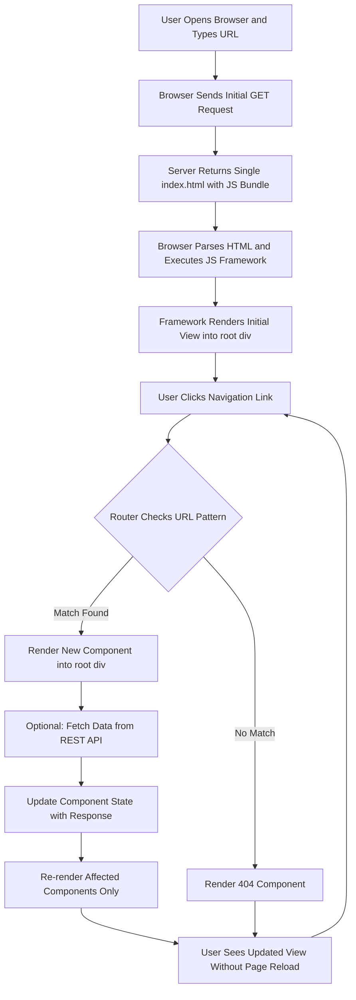
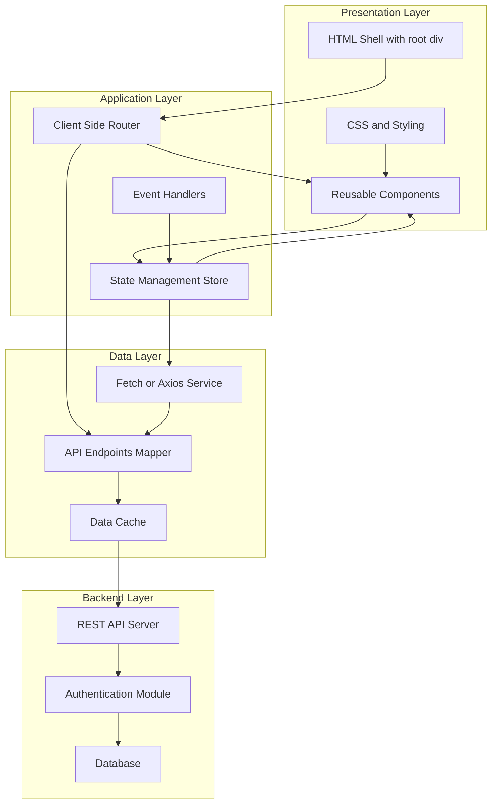
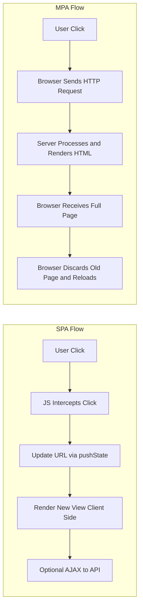
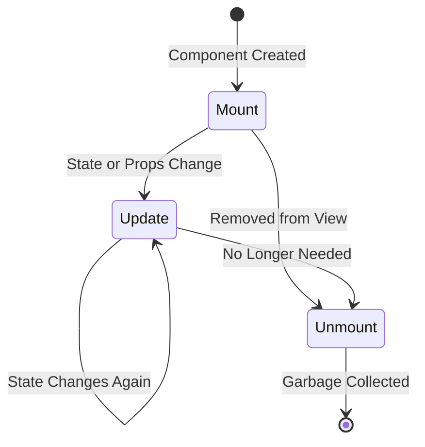
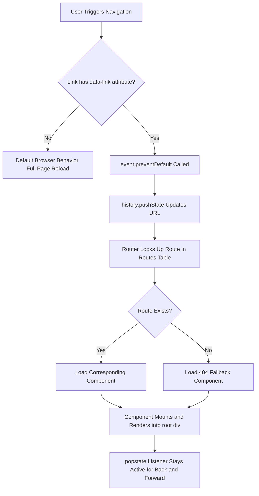

# SPA – Basics

<!-- SECTION_1_START -->

# SPA – Basics

> [!IMPORTANT]
> **KTU 2024 Scheme Focus:** Single Page Applications (SPAs) are a core topic under **Module 4 – SPA Basics** of the **OECST832 – Web Programming** course. Students must master the architecture, working model, popular frameworks, and the contrast with traditional Multi-Page Applications (MPAs).

## 1.1 Formal Definition

A **Single Page Application (SPA)** is a web application or website that interacts with the user by dynamically rewriting the current web page with new data fetched from the web server, instead of the default browser behavior of loading entire new pages from the server. The page itself is **not reloaded** at any point during the user journey, and the entire application runs inside a single HTML document whose Document Object Model (DOM) is manipulated client-side through JavaScript.

> [!NOTE]
> **Core Technical Properties of an SPA**
> 1. A single HTML shell is served to the browser on the first request.
> 2. Subsequent interactions are handled via **AJAX / Fetch / Axios** calls to backend APIs.
> 3. Client-side **routing** simulates multiple page transitions.
> 4. State management is maintained in-memory using frameworks like React, Vue, or Angular.

## 1.2 Conceptual Analogy – The Smart Restaurant

Imagine walking into a **smart restaurant**:

- **Traditional MPA Model** = A conventional restaurant where every time you want a new dish, the waiter tears down your table, walks to the kitchen, comes back with a new table layout, and you start over. The *whole page (table) is reloaded* for every interaction.
- **SPA Model** = A smart restaurant where the kitchen delivers food to your *same table*, the menu is updated digitally on a tablet in front of you, and the only thing that changes is the *content* (the food and the UI bits). The *shell* (table + tablet) never gets destroyed.

This is exactly how an SPA works: the **HTML shell stays, only the data and view fragments change**.

## 1.3 Intuition – Why SPAs Exist

Before SPAs, every click (e.g., navigating to "About Us") caused:

1. Browser sends a full HTTP request to the server.
2. Server renders an entirely new HTML page.
3. Browser discards the current page and re-renders.

This caused:
- **Full page reloads** (noticeable flicker).
- **High latency** for the user.
- **Wasted bandwidth** since the entire HTML (header, footer, navigation) is re-shipped every time.

SPAs solve this by downloading the application **once** and letting JavaScript handle the rest.

## 1.4 Architectural Blueprint – At a Glance

> [!VISUALIZATION CONTROL]
> **Concept:** SPA Architecture Overview
> **GeoGebra / Desmos Input Equations:**
> * Not applicable for a process flow
> **Visual Description:** Visualize a single rectangular "Page Shell" at the top. A two-way arrow goes down to a "JavaScript Engine" block. From there, dashed lines (API calls) connect to a "Backend REST API" server, which connects to a "Database" cylinder. The user clicks links and only the content area of the shell updates — the shell itself remains unchanged.

<!-- SECTION_1_END -->

<!-- SECTION_2_START -->

# 2. Deep Theoretical Analysis & KTU High-Yield Concept Sheet

## 2.1 Anatomy of an SPA – Layered View

An SPA is built on **four operational layers**. Each layer plays a specific role:

### Layer 1 – The HTML Shell
- A minimal HTML file (often `index.html`) is the only HTML page served.
- Contains a single root `<div>` (typically `<div id="root"></div>`).
- Loads the bundled JavaScript and CSS.

### Layer 2 – The JavaScript Framework
- A library or framework (React, Vue, Angular, Svelte) takes control of the root `<div>`.
- Mounts **components** into the DOM dynamically.
- Listens to user events and updates the view reactively.

### Layer 3 – The Client-Side Router
- Intercepts navigation events (e.g., clicking an internal link).
- Maps URL paths (e.g., `/home`, `/profile`) to components.
- Updates the **browser address bar** using the HTML5 History API (`pushState`, `replaceState`).

### Layer 4 – The Data/API Service
- Uses `fetch()`, `axios`, or `XMLHttpRequest` to call backend REST/GraphQL endpoints.
- Receives JSON payloads and pushes them into component state.

## 2.2 SPA vs MPA – The KTU Board Comparison

> [!IMPORTANT]
> This contrast is the **most asked question** in KTU 2024 Scheme ESE for Module 4.

| Feature | SPA (Single Page Application) | MPA (Multi-Page Application) |
|---|---|---|
| **Page Reloads** | None after initial load | Full reload on every navigation |
| **Server Load** | Light (sends only data) | Heavy (sends full HTML each time) |
| **Rendering Engine** | Client-side rendering (CSR) | Server-side rendering (SSR) |
| **Routing** | Client-side (via JavaScript) | Server-side (URL rewriting) |
| **Speed after first load** | Very fast (instant transitions) | Slower (network round-trip per click) |
| **SEO Friendliness** | Historically weak (now solved via SSR/SSG) | Naturally strong |
| **State Management** | In-memory (Redux, Vuex, Pinia) | Server sessions / cookies |
| **Examples** | Gmail, Google Maps, Facebook, Trello | Wikipedia, traditional news portals, e-commerce early sites |
| **First Paint Time** | Slower (JS must be parsed) | Faster (HTML is pre-rendered) |
| **Development Complexity** | Higher (state mgmt, routing) | Lower (per-page logic) |

## 2.3 The Core Pillars of an SPA

### Pillar 1 – Client-Side Routing
Routing in an SPA is **not** a server activity. It is a JavaScript mechanism that listens to URL changes and decides which component to display.

**Common routing techniques:**
- **Hash Routing** – Uses `#` in the URL (e.g., `https://site.com/#/about`). Works without server config.
- **History API Routing** – Uses `pushState()` to make clean URLs (e.g., `https://site.com/about`). Requires server fallback to `index.html`.

### Pillar 2 – Component-Based Architecture
The UI is broken into reusable, self-contained components (e.g., `<Navbar>`, `<ProductCard>`, `<Footer>`). Each component owns its:
- Template (HTML/JSX)
- Logic (JavaScript)
- Style (CSS/SCSS)

### Pillar 3 – State Management
State is the **single source of truth** for the UI. When state changes, the framework re-renders only the affected components (a process called **reconciliation** or **diffing**).

### Pillar 4 – Asynchronous Data Fetching
Components fetch data from APIs without blocking the UI. Promises, `async/await`, and Observables are the workhorses.

## 2.4 KTU Formula Sheet / Cheat Sheet

> [!NOTE]
> Although SPAs are not heavily mathematical, here is the **high-yield concept reference table** for board exam preparation.

| Concept / Term | Definition | Example / Notation |
|---|---|---|
| **SPA** | Single Page Application | Gmail, Trello |
| **CSR** | Client-Side Rendering | Rendered in browser via JS |
| **SSR** | Server-Side Rendering | Rendered on server (Next.js, Nuxt) |
| **SSG** | Static Site Generation | Build-time HTML (Astro, Gatsby) |
| **Hydration** | Attaching JS to server-rendered HTML | Reuses DOM from server |
| **Virtual DOM** | In-memory lightweight copy of the real DOM | React $V_{dom}$ |
| **Reconciliation** | Diffing algorithm between VDOM and DOM | React Fiber |
| **AJAX** | Asynchronous JavaScript and XML | `XMLHttpRequest` |
| **REST API** | Representational State Transfer | `GET / POST / PUT / DELETE` |
| **JWT** | JSON Web Token for auth | Stored in `localStorage` |
| **History API** | Browser API for URL manipulation | `history.pushState({}, '', url)` |
| **Hash Route** | URL fragment routing | `window.location.hash` |

## 2.5 Real-World Engineering Utility

SPAs are the **de-facto architecture** for modern SaaS products:
- **Project Management:** Trello, Asana, Jira Cloud
- **Communication:** Gmail, Slack web, Discord web
- **Social Media:** Twitter (X), Facebook, LinkedIn
- **Design Tools:** Figma, Canva
- **Code Editors:** VS Code web, CodeSandbox

The shift to SPAs is driven by the need for **desktop-like responsiveness** in the browser, enabling **rich, app-like user experiences** over the network.

<!-- SECTION_2_END -->

<!-- SECTION_3_START -->

# 3. Step-by-Step Implementation & Code Walkthrough

> [!IMPORTANT]
> Below is a **fully operational, beginner-friendly SPA** built with **Vanilla JavaScript**, **HTML5 History API**, and **Fetch**. This is the exact style of code students are expected to write in the KTU lab examination.

## 3.1 File Structure

```
spa-demo/
├── index.html
├── app.js
├── router.js
├── views/
│   ├── home.js
│   ├── about.js
│   └── contact.js
└── server.js   (Optional Node.js server for fallback)
```

## 3.2 The HTML Shell (`index.html`)

```html
<!DOCTYPE html>
<html lang="en">
<head>
    <meta charset="UTF-8">
    <meta name="viewport" content="width=device-width, initial-scale=1.0">
    <title>KTU SPA Demo</title>
    <link rel="stylesheet" href="styles.css">
</head>
<body>
    <!-- Navigation Bar (Persistent across views) -->
    <nav id="main-nav">
        <a href="/" data-link>Home</a>
        <a href="/about" data-link>About</a>
        <a href="/contact" data-link>Contact</a>
    </nav>

    <!-- The single mount point where views are rendered -->
    <main id="app-root"></main>

    <!-- The single JS bundle that powers the entire SPA -->
    <script type="module" src="app.js"></script>
</body>
</html>
```

**Explanation:**
- The `<main id="app-root">` is the **only DOM container** that changes.
- The navigation uses `data-link` to mark internal links (so the router can intercept them).
- Only **one** script file is loaded — the framework logic.

## 3.3 The Router (`router.js`)

```javascript
// router.js
// A minimal client-side router using the HTML5 History API.

const routes = {
    '/':        { template: '<h1>Home Page</h1><p>Welcome to the KTU SPA demo.</p>' },
    '/about':   { template: '<h1>About Us</h1><p>This SPA was built with Vanilla JS.</p>' },
    '/contact': { template: '<h1>Contact</h1><p>Email: ktu@exam.in</p>' },
    '/404':     { template: '<h1>404 – Page Not Found</h1>' }
};

/**
 * Resolves the current URL path and renders the matching template
 * into the #app-root element.
 */
function renderRoute(): void {
    const path: string = window.location.pathname;
    const route = routes[path] || routes['/404'];
    const root = document.getElementById('app-root');

    if (!root) {
        console.error('Mount point #app-root not found in DOM.');
        return;
    }

    root.innerHTML = route.template;
    console.log(`[Router] Navigated to: ${path}`);
}

/**
 * Programmatically navigates to a new path without reloading the page.
 * Uses the History API to update the address bar.
 */
function navigateTo(path: string): void {
    window.history.pushState({}, '', path);
    renderRoute();
}

/**
 * Intercepts clicks on anchor tags with the [data-link] attribute.
 * Prevents default browser navigation and uses the router instead.
 */
function attachLinkInterceptors(): void {
    document.body.addEventListener('click', (event) => {
        const target = event.target as HTMLElement;
        const anchor = target.closest('a[data-link]') as HTMLAnchorElement | null;

        if (!anchor) {
            return;
        }

        event.preventDefault();
        const href = anchor.getAttribute('href');
        if (href) {
            navigateTo(href);
        }
    });
}

/**
 * Handles browser back/forward button navigation.
 */
window.addEventListener('popstate', renderRoute);

export { renderRoute, navigateTo, attachLinkInterceptors };
```

**Step-by-step logic:**
1. The `routes` object is a **URL → Template** map. It is the "routing table."
2. `renderRoute()` reads `window.location.pathname` and looks up the matching template.
3. `navigateTo()` uses `history.pushState()` to update the URL bar **without** a server request.
4. `attachLinkInterceptors()` adds a delegated click listener on `<body>` to catch any click on an `<a data-link>`.
5. `popstate` event is fired by the browser when the user clicks **Back** or **Forward** — we re-render accordingly.

## 3.4 The Application Entry Point (`app.js`)

```javascript
// app.js
import { renderRoute, attachLinkInterceptors } from './router.js';

// 1. Render the initial route when the DOM is ready.
document.addEventListener('DOMContentLoaded', () => {
    console.log('[App] SPA booting…');
    renderRoute();
    attachLinkInterceptors();
    console.log('[App] SPA ready. Click nav links to navigate.');
});

// 2. Optional: Demonstrate data fetching from a public API.
async function fetchUserData(userId: number): Promise<void> {
    try {
        const response = await fetch(`https://jsonplaceholder.typicode.com/users/${userId}`);

        if (!response.ok) {
            throw new Error(`HTTP error! Status: ${response.status}`);
        }

        const data = await response.json();
        console.log('[API] User data fetched:', data);
    } catch (err) {
        console.error('[API] Fetch failed:', err);
    }
}

// Auto-fetch a sample user on first load (demo purposes).
fetchUserData(1);
```

**Step-by-step logic:**
1. Wait for `DOMContentLoaded` so the `#app-root` element exists.
2. Render the first view.
3. Attach link click interceptors.
4. Demonstrate an **async API call** to `jsonplaceholder.typicode.com` — a free, KTU-friendly mock API.

## 3.5 Optional: Node.js Fallback Server (`server.js`)

> [!IMPORTANT]
> When using the **History API**, refreshing a deep link (e.g., `/about`) on a static server returns a 404. We need a fallback to `index.html`.

```javascript
// server.js — minimal Node + Express fallback
import express from 'express';
import path from 'path';
import { fileURLToPath } from 'url';

const __filename = fileURLToPath(import.meta.url);
const __dirname  = path.dirname(__filename);

const app  = express();
const PORT = 3000;

// Serve static files (HTML, CSS, JS).
app.use(express.static(__dirname));

// SPA fallback: any unknown GET request returns index.html.
app.get('*', (req, res) => {
    res.sendFile(path.join(__dirname, 'index.html'));
});

app.listen(PORT, () => {
    console.log(`SPA server running at http://localhost:${PORT}`);
});
```

## 3.6 React Equivalent (Modern SPA Pattern)

For board reference, the **React Router** equivalent is:

```javascript
import { BrowserRouter, Routes, Route } from 'react-router-dom';
import Home    from './views/Home';
import About   from './views/About';
import Contact from './views/Contact';
import NotFound from './views/NotFound';

function App() {
    return (
        <BrowserRouter>
            <nav>
                <Link to="/">Home</Link>
                <Link to="/about">About</Link>
                <Link to="/contact">Contact</Link>
            </nav>
            <Routes>
                <Route path="/"        element={<Home />} />
                <Route path="/about"   element={<About />} />
                <Route path="/contact" element={<Contact />} />
                <Route path="*"        element={<NotFound />} />
            </Routes>
        </BrowserRouter>
    );
}

export default App;
```

**Key takeaways from the React pattern:**
- `<BrowserRouter>` enables History API routing.
- `<Routes>` is the route table; `<Route>` maps URL to component.
- `<Link>` is the SPA-safe replacement for `<a>`.

## 3.7 Component Lifecycle (Pseudo-Derivation)

For every component in an SPA, three conceptual phases occur:

$$
\begin{aligned}
\text{Phase 1: Mount}    &\rightarrow \text{Component is created and inserted into the VDOM.} \\
\text{Phase 2: Update}   &\rightarrow \text{State or props change; re-render triggered.} \\
\text{Phase 3: Unmount}  &\rightarrow \text{Component is removed from the DOM.}
\end{aligned}
$$

In React, the **Virtual DOM** ensures that only the **diff** between old and new VDOM is applied to the real DOM. This keeps the SPA fast even with hundreds of components.

<!-- SECTION_3_END -->

<!-- SECTION_4_START -->

# 4. Structural Diagrams & Schematics

## 4.1 SPA Request-Response Flow



## 4.2 SPA Architecture – Layered View



## 4.3 SPA vs MPA – Comparative Flow



## 4.4 Component Lifecycle in an SPA



## 4.5 SPA Routing – Decision Matrix



<!-- SECTION_4_END -->

<!-- SECTION_5_START -->

# 5. KTU 2024 Scheme Examination Question Bank & Topic Recap

## 5.1 Part A – Short Answer Questions (3 Marks Each)

> **Q1. [KTU University Exam – July 2024]**  
> **Define Single Page Application (SPA). List any two features of an SPA.**  
> **Mapped CO:** CO3 | **RBT Level:** Remember

**Model Answer:**

A **Single Page Application (SPA)** is a web application that loads a single HTML document and dynamically updates the content of the page using JavaScript and APIs, without requiring a full page reload from the server.

**Two key features:**
1. **No Full Page Reload:** After the initial load, all subsequent interactions are handled via AJAX/Fetch calls, providing a seamless user experience.
2. **Client-Side Routing:** Navigation between views is managed by JavaScript using the HTML5 History API or hash-based routing, making the app feel like a native desktop application.

> **[Valuation Tip: Definition 2 Marks + Any two features 1 Mark = 3 Marks]**

---

> **Q2. [KTU University Exam – Dec 2023]**  
> **Differentiate between SPA and MPA in terms of page reload and rendering engine.**  
> **Mapped CO:** CO3 | **RBT Level:** Understand

**Model Answer:**

| Parameter | SPA | MPA |
|---|---|---|
| **Page Reload** | Does not reload the page after the initial load. | Reloads the entire page for every navigation. |
| **Rendering Engine** | Uses Client-Side Rendering (CSR) via JavaScript frameworks. | Uses Server-Side Rendering (SSR) where the server produces the full HTML. |

> **[Valuation Tip: Each correct comparison 1.5 Marks × 2 = 3 Marks]**

---

## 5.2 Part B – Long Answer Questions (14 Marks, Internal Choice)

> **Q3. [KTU University Exam – Model Paper 2024]**  
> **(a)** Explain the architecture of a Single Page Application with a neat block diagram. List any four popular JavaScript frameworks used to build SPAs. **(7 Marks)**  
> **(b)** With the help of a working example, demonstrate **client-side routing** using the **HTML5 History API** in Vanilla JavaScript. **(7 Marks)**  
> **Mapped CO:** CO3, CO4 | **RBT Level:** (a) Understand, (b) Apply

### **OR**

> **(a)** Compare SPA and MPA across any seven parameters. **(7 Marks)**  
> **(b)** Write a minimal SPA in Vanilla JS that has three views (Home, About, Contact) and switches between them without a page reload. Show the `index.html`, `app.js`, and router logic. **(7 Marks)**

---

### **Solution to Q3 (Main Version)**

### Part (a) – SPA Architecture & Frameworks (7 Marks)

**Architecture Overview:**

An SPA architecture consists of **four tightly integrated layers**:

1. **HTML Shell Layer:** A minimal `index.html` containing a single `<div id="root"></div>` mount point and a script tag for the JS bundle. This is the **only HTML** the server ever sends.
2. **JavaScript Framework Layer:** A library/framework (React, Vue, Angular, Svelte) that owns the root `<div>` and renders components inside it.
3. **Client-Side Routing Layer:** Intercepts URL changes via the HTML5 History API and maps paths (e.g., `/about`) to specific components.
4. **Data/API Layer:** Uses `fetch()` or `axios` to call backend REST/GraphQL endpoints, retrieves JSON, and injects it into component state.

**Block Diagram:**

```
+---------------------------------+
|         Browser (Client)        |
|  +---------------------------+  |
|  |  index.html (HTML Shell)  |  |
|  |  <div id="root"></div>    |  |
|  +---------------------------+  |
|             |                   |
|             v                   |
|  +---------------------------+  |
|  |  JS Framework / Library   |  |
|  |  (React, Vue, Angular)    |  |
|  +---------------------------+  |
|             |                   |
|             v                   |
|  +---------------------------+  |
|  |  Client-Side Router       |  |
|  |  (history.pushState)      |  |
|  +---------------------------+  |
|             |                   |
|             v                   |
|  +---------------------------+  |
|  |  Fetch / Axios Service    |  |
|  +---------------------------+  |
+-------------|-------------------+
              |  AJAX / Fetch
              v
+---------------------------------+
|       Backend REST API          |
+---------------------------------+
              |
              v
+---------------------------------+
|          Database               |
+---------------------------------+
```

**Four Popular JavaScript Frameworks for SPAs:**

1. **React** – Meta (Facebook); component-based; uses Virtual DOM.
2. **Angular** – Google; full-fledged MVC framework; uses TypeScript.
3. **Vue.js** – Evan You; progressive framework; gentle learning curve.
4. **Svelte** – Rich Harris; compiles to vanilla JS; no Virtual DOM.

> **[Valuation Key for (a):]**
> - **[Layered architecture explanation: 3 Marks]**
> - **[Block diagram: 2 Marks]**
> - **[Four frameworks listed: 2 Marks]**
> - **Total: 7 Marks**

---

### Part (b) – Client-Side Routing using History API (7 Marks)

**Working Code:**

```javascript
// 1. Route table — maps URL paths to view templates.
const routes = {
    '/':      { view: '<h1>Home View</h1>' },
    '/about': { view: '<h1>About View</h1>' },
    '/login': { view: '<h1>Login View</h1>' }
};

// 2. Render function — looks up the current path and injects HTML.
function render(): void {
    const path: string = window.location.pathname;
    const root: HTMLElement = document.getElementById('app-root')!;
    const route = routes[path] || { view: '<h1>404 — Not Found</h1>' };
    root.innerHTML = route.view;
    console.log(`[Router] Rendered: ${path}`);
}

// 3. Programmatic navigation — updates URL without reload.
function go(path: string): void {
    window.history.pushState({}, '', path);
    render();
}

// 4. Intercept link clicks across the whole document.
document.addEventListener('click', (e) => {
    const target = e.target as HTMLElement;
    const link = target.closest('a[data-link]') as HTMLAnchorElement | null;
    if (link) {
        e.preventDefault();
        go(link.getAttribute('href') || '/');
    }
});

// 5. Handle browser Back/Forward buttons.
window.addEventListener('popstate', render);

// 6. Initial render on page load.
document.addEventListener('DOMContentLoaded', render);
```

**Explanation of Key APIs:**

- `history.pushState(state, title, url)` – Pushes a new entry into the browser's history stack and changes the URL bar **without** triggering a page reload.
- `popstate` event – Fired when the user navigates using the **Back** or **Forward** button; we re-render accordingly.
- `e.preventDefault()` – Stops the browser from performing its default full-page navigation when a link is clicked.

> **[Valuation Key for (b):]**
> - **[Correct route table definition: 2 Marks]**
> - **[Working render() and go() functions: 2 Marks]**
> - **[Link interception and popstate handling: 2 Marks]**
> - **[Final output / explanation of pushState: 1 Mark]**
> - **Total: 7 Marks**

---

### **Solution to Q3 OR Version**

### OR Part (a) – SPA vs MPA across 7 Parameters (7 Marks)

| # | Parameter | SPA | MPA |
|---|---|---|---|
| 1 | Page Reload | No full reload after first load | Full reload on every click |
| 2 | Rendering | Client-Side Rendering (CSR) | Server-Side Rendering (SSR) |
| 3 | Routing | JavaScript-based client routing | Server URL rewriting |
| 4 | Speed | Faster after initial load (no round trip) | Slower (server round trip per click) |
| 5 | SEO | Weak by default (improved via SSR/SSG) | Strong by default |
| 6 | State | In-memory state (Redux, Pinia) | Server sessions / cookies |
| 7 | Examples | Gmail, Trello, Figma | Wikipedia, traditional blogs |

> **[Valuation Key: Each valid comparison row = 1 Mark × 7 = 7 Marks]**

---

### OR Part (b) – Minimal Three-View SPA (7 Marks)

**`index.html`:**

```html
<!DOCTYPE html>
<html>
<head><title>KTU SPA</title></head>
<body>
    <nav>
        <a href="/"        data-link>Home</a>
        <a href="/about"   data-link>About</a>
        <a href="/contact" data-link>Contact</a>
    </nav>
    <main id="app-root"></main>
    <script type="module" src="app.js"></script>
</body>
</html>
```

**`app.js`:**

```javascript
const views: Record<string, string> = {
    '/':        '<h1>Home</h1><p>Welcome!</p>',
    '/about':   '<h1>About</h1><p>Built with Vanilla JS.</p>',
    '/contact': '<h1>Contact</h1><p>ktu@exam.in</p>'
};

function show(): void {
    const path: string = location.pathname;
    document.getElementById('app-root')!.innerHTML =
        views[path] || '<h1>404 Not Found</h1>';
}

function navigate(path: string): void {
    history.pushState({}, '', path);
    show();
}

document.addEventListener('click', (e: MouseEvent) => {
    const link = (e.target as HTMLElement).closest('a[data-link]') as HTMLAnchorElement | null;
    if (link) {
        e.preventDefault();
        navigate(link.getAttribute('href') || '/');
    }
});

window.addEventListener('popstate', show);
document.addEventListener('DOMContentLoaded', show);
```

> **[Valuation Key for OR (b):]**
> - **[HTML shell with three nav links: 2 Marks]**
> - **[Views object and show() function: 2 Marks]**
> - **[navigate() with pushState: 1 Mark]**
> - **[Click interception and popstate: 1 Mark]**
> - **[Final working output: 1 Mark]**
> - **Total: 7 Marks**

---

> [!WARNING]
> **KTU Examiner's Valuation Warning – Common Pitfalls**
> 1. **Forgetting `event.preventDefault()`:** Without this, the browser performs a full reload, defeating the purpose of the SPA. Examiners deduct **2 full marks** for this omission.
> 2. **Not handling the `popstate` event:** If you miss this, the browser's Back/Forward buttons break. Deduct **1 mark** in routing questions.
> 3. **Confusing Hash Routing with History API:** Hash routing uses `#` (e.g., `#/about`) and does not need a server fallback. History API uses clean URLs but **requires** server fallback to `index.html`. Mixing them up costs marks.
> 4. **Writing MPA code (page.reload) in an SPA question:** Some students mistakenly use `window.location.href = '/about'` which triggers a full reload. This is **wrong** for SPA routing. The examiner will award **0 marks** for the routing logic in such cases.
> 5. **Skipping the block diagram in 7-mark architecture questions:** A neat labeled diagram is worth **at least 2 marks** in any 7-mark architecture question. Never skip it.

---

## 5.3 Topic Recap & Important Things to Remember

> [!IMPORTANT]
> **Rapid Revision Checklist – SPA Basics**

- **SPA Definition:** A web app that loads a single HTML document and dynamically updates content via JavaScript without full page reloads.
- **MPA Definition:** Traditional web app where every click triggers a full HTML reload from the server.
- **Four Layers of SPA Architecture:** HTML Shell → JS Framework → Client-Side Router → Data/API Service.
- **Two Routing Strategies:** Hash Routing (uses `#`, no server config) and History API Routing (clean URLs, needs server fallback).
- **Key History API Methods:** `history.pushState()`, `history.replaceState()`, `window.addEventListener('popstate', ...)`.
- **Core SPA Frameworks:** React, Angular, Vue.js, Svelte.
- **Data Fetching Tools:** `fetch()` (native), `axios` (popular library), `XMLHttpRequest` (legacy).
- **State Management Libraries:** Redux (React), Pinia (Vue), NgRx (Angular), Zustand (React).
- **Critical APIs in a Router:** `window.location.pathname`, `history.pushState`, `popstate`, `event.preventDefault()`.
- **SPA Advantages:** Fast transitions, desktop-like UX, reduced server load, offline support via Service Workers.
- **SPA Disadvantages:** Poor initial load time, SEO challenges, JS must be enabled, security concerns with token storage.
- **MPA Advantages:** Strong SEO, fast first paint, simpler architecture, works without JavaScript.
- **MPA Disadvantages:** Full page reloads, heavier server load, slower perceived performance.
- **KTU-Favorite Examples:** Gmail, Trello, Google Maps, Facebook, Figma.
- **First-Page Load Behavior in SPA:** The server sends `index.html` + JS bundle; the framework then takes over the `#root` div.
- **Mandatory SEO Solutions for SPAs:** Server-Side Rendering (SSR) via Next.js / Nuxt.js, or Static Site Generation (SSG) via Gatsby / Astro.
- **Concept of Virtual DOM:** An in-memory representation used by React to compute the minimum DOM updates — keeps the SPA fast.
- **Concept of Hydration:** When an SSR-rendered HTML is "revived" by client-side JS so it becomes interactive.
- **The `data-link` Pattern:** A common convention used in tutorials to mark anchor tags that should be intercepted by the SPA router.
- **Fallback Server Rule:** For History API routing, the server **must** serve `index.html` for any unknown path (e.g., `/about` on refresh).

<!-- SECTION_5_END -->
