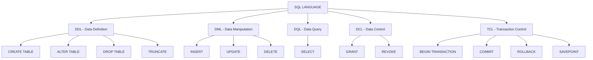
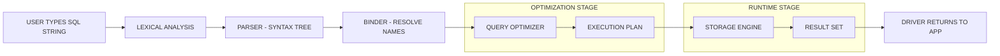
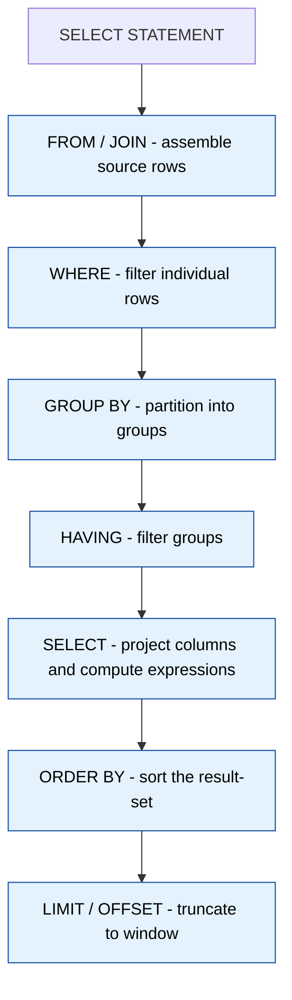

# SQL

<!-- SECTION_1_START -->
# SQL — The Universal Language of Relational Data

## 1.1 Formal KTU Syllabus Definition

**SQL (Structured Query Language)** is a declarative, domain-specific language standardised by **ANSI (American National Standards Institute)** and **ISO (International Organization for Standardization)** that is used to define, manipulate, retrieve, and control access to data held in a **Relational Database Management System (RDBMS)**. In the context of KTU Module 4 (SPA Basics) of the Web Programming course, SQL forms the **persistence-layer backbone** of every dynamic Single Page Application — the part that actually stores, fetches, and updates information requested by the browser through REST/GraphQL endpoints.

> [!IMPORTANT]
> **KTU 2024 Scheme — Board-Exam Focus Area**
> For the OECST832 Web Programming paper, SQL is evaluated under the persistent data layer of SPA architecture. Expected sub-topics are: `CREATE`, `INSERT`, `SELECT`, `UPDATE`, `DELETE`, `WHERE`, `ORDER BY`, `GROUP BY`, `JOIN`, `CONSTRAINTS`, and `Aggregate Functions`.

## 1.2 The Five Sub-Languages of SQL

| Sub-Language | Full Form | Purpose | Example Verbs |
|:-------------|:----------|:--------|:--------------|
| **DDL** | Data Definition Language | Defines / alters the *schema* (table skeleton) | `CREATE`, `ALTER`, `DROP`, `TRUNCATE` |
| **DML** | Data Manipulation Language | Modifies the *rows* inside existing tables | `INSERT`, `UPDATE`, `DELETE` |
| **DQL** | Data Query Language | Retrieves rows from one or more tables | `SELECT` |
| **DCL** | Data Control Language | Manages *permissions* and *security* | `GRANT`, `REVOKE` |
| **TCL** | Transaction Control Language | Controls transaction boundaries | `COMMIT`, `ROLLBACK`, `SAVEPOINT` |

> [!NOTE]
> Some KTU textbooks merge **DQL into DML** and call the lot "DML". For the 2024 scheme, treat `SELECT` as a **standalone DQL verb** because the board regularly asks *"Classify the following SQL statements"* and full credit is given only when `SELECT` is separated out.

## 1.3 Intuitive Analogy — SQL as a Waiter in a Restaurant

Imagine a restaurant kitchen as your **database engine**:

- The **menu** is your *table schema* (DDL decides which dishes exist).
- The **orders placed by waiters** are *DML* operations (`INSERT` a new order, `UPDATE` an existing one, `DELETE` a cancelled one).
- The **bill handed to the customer** is the *DQL* `SELECT` result-set.
- The **manager's authority card** that decides who enters the kitchen is *DCL*.
- The **kitchen ticket system** that groups orders into batches (start, save, commit) is *TCL*.

A SPA (Single Page Application) is the *customer*; the **server-side API is the waiter**; the **database is the kitchen**; **SQL is the standard dialect** spoken between the waiter and the kitchen. The waiter never tells the kitchen *how* to cook the dish — it just says *what* the customer wants. That is the **declarative** nature of SQL.

## 1.4 Where SQL Fits in an SPA Stack

```
Browser  (HTML / CSS / JS - React / Angular / Vue)
   |  HTTP (fetch / axios)
   v
Web Server  (Node.js / Express / Django / Spring)
   |  SQL string over a driver (pg, mysql2, sqlite3)
   v
RDBMS       (PostgreSQL / MySQL / SQLite)
```

In KTU Module 4 we focus on the **last arrow** — writing the SQL itself. The Node/Express side is covered in Modules 2–3.

> [!TIP]
> **Why SQLite for KTU labs?** SQLite is **server-less, zero-configuration, file-based** (a single `.db` file) and ships built-in with Python. It supports nearly the full SQL-92 standard and is perfect for demonstrating every concept required by the OECST832 syllabus without installing a heavy server.

> [!VISUALIZATION CONTROL]
> **Concept:** Cardinality of a SELECT result-set as a 2-D set mapped over the $(x, y)$ plane.
> **GeoGebra / Desmos Input Equations (representational only):**
> * `R = {(x, y) \mid x \in A, y \in B}` — Cartesian product of two sets
> * `\sigma_{predicate}(R)` — selection operator visualised as a vertical band
> * `\pi_{attributes}(R)` — projection operator visualised as a horizontal slice
> **Visual Description:** Each table row is a *point* $(x, y)$ in a 2-D plane. The `WHERE` clause acts like a vertical band that filters points; the `SELECT column_list` acts like a horizontal slice that keeps only the desired *attributes* (axes). `JOIN` is the *union of two planes* producing a denser grid of combined points.
<!-- SECTION_1_END -->

<!-- SECTION_2_START -->
# Deep Theoretical Analysis & KTU High-Yield Formula Sheet

## 2.1 The Logical Pipeline of a SQL Statement

Every executable SQL statement can be decomposed into **seven logical stages** (in the order the engine processes them, not the order you type them):

1. **Lexical Analysis** — keywords, identifiers, literals are tokenised.
2. **Parsing** — grammar check (does the statement obey the SQL standard?).
3. **Binding** — table/column names are resolved against the catalog.
4. **Optimisation** — the planner chooses an *execution plan* (index scan, hash join, nested loop, etc.).
5. **Execution** — the chosen plan runs against the storage engine.
6. **Result Materialisation** — rows are formatted, ordered, and limited.
7. **Return** — the result-set is handed back to the caller.

> [!NOTE]
> **KTU Exam Tip:** You only need to remember steps **4 (Optimisation)** and **6 (Result Materialisation)** for theory questions. Marks are awarded for naming the step *and* giving one example of what happens there.

## 2.2 The Relational Algebra ↔ SQL Mapping

Relational algebra is the **mathematical foundation** of SQL. KTU examiners occasionally ask a 2-mark "map the relational operator to its SQL equivalent" question.

| Relational Operator | Mathematical Symbol | SQL Equivalent |
|:--------------------|:-------------------:|:---------------|
| Selection (filter) | $\sigma_{p}(R)$ | `SELECT * FROM R WHERE p` |
| Projection (columns) | $\pi_{a_1, a_2}(R)$ | `SELECT a_1, a_2 FROM R` |
| Cartesian Product | $R \times S$ | `SELECT * FROM R CROSS JOIN S` |
| Union | $R \cup S$ | `SELECT ... UNION SELECT ...` |
| Set Difference | $R - S$ | `SELECT ... EXCEPT SELECT ...` |
| Rename | $\rho_{new}(R)$ | `SELECT * FROM R AS new` |
| Natural Join | $R \bowtie S$ | `SELECT * FROM R NATURAL JOIN S` |
| Theta Join | $R \bowtie_{\theta} S$ | `SELECT * FROM R JOIN S ON <theta condition>` |

## 2.3 KTU High-Yield SQL Syntax Cheat-Sheet

> [!IMPORTANT]
> **Do not memorise line-by-line — memorise the *shape*.** All `CREATE`, `INSERT`, `UPDATE` and `SELECT` statements follow the same `KEYWORD ... FROM ... WHERE ...` skeleton.

| Operation | Canonical Syntax (single-table, copy-safe) | Key Clauses |
|:----------|:-------------------------------------------|:------------|
| Create table | `CREATE TABLE t (col dtype [CONSTRAINT], ...);` | `PRIMARY KEY`, `NOT NULL`, `UNIQUE`, `DEFAULT`, `CHECK` |
| Insert | `INSERT INTO t (c1, c2) VALUES (v1, v2);` | multi-row `VALUES (...), (...);` |
| Update | `UPDATE t SET c1 = v1 WHERE condition;` | **always** with `WHERE` |
| Delete | `DELETE FROM t WHERE condition;` | **always** with `WHERE` |
| Select | `SELECT [DISTINCT] cols FROM t [JOIN ...] [WHERE ...] [GROUP BY ...] [HAVING ...] [ORDER BY ...] [LIMIT n];` | `WHERE` < `GROUP BY` < `HAVING` < `ORDER BY` (logical order) |
| Inner Join | `SELECT ... FROM A INNER JOIN B ON A.x = B.y;` | only matching rows |
| Left Join | `SELECT ... FROM A LEFT JOIN B ON A.x = B.y;` | all A + matched B (NULL if no match) |
| Aggregate | `SELECT COUNT(*), SUM(c), AVG(c), MIN(c), MAX(c) FROM t;` | always paired with `GROUP BY` if columns are mixed |
| Subquery | `SELECT * FROM t WHERE c IN (SELECT c FROM u);` | scalar, row, table subquery |
| View | `CREATE VIEW v AS SELECT ...;` | virtual table, no storage |
| Index | `CREATE INDEX idx ON t(col);` | speeds up `WHERE`, `JOIN`, `ORDER BY` |

> [!CAUTION]
> **Logical vs. Typing Order Trap:** A common KTU pitfall is that the *typed* order in a `SELECT` statement (`SELECT → FROM → WHERE → GROUP BY → HAVING → ORDER BY → LIMIT`) **differs** from the *logical* evaluation order (`FROM → WHERE → GROUP BY → HAVING → SELECT → ORDER BY → LIMIT`). The board's 14-mark question on "Write a query that returns …" will silently test this.

## 2.4 Data Types You Must Know for KTU

| Category | Common Types | Notes |
|:---------|:-------------|:------|
| Numeric | `INTEGER`, `SMALLINT`, `BIGINT`, `DECIMAL(p, s)`, `REAL`, `DOUBLE PRECISION` | `DECIMAL` is preferred for money |
| Character | `CHAR(n)`, `VARCHAR(n)`, `TEXT` | `VARCHAR` is variable-length |
| Date/Time | `DATE`, `TIME`, `TIMESTAMP` | format is `YYYY-MM-DD` |
| Boolean | `BOOLEAN` | stored as `TINYINT(1)` in MySQL |
| Binary | `BLOB`, `BYTEA` | for images, files |

## 2.5 Real-World Engineering Utility

- **E-commerce** (`Amazon`, `Flipkart`): `SELECT` queries on products, `JOIN` queries for orders + customers, `GROUP BY` for monthly revenue dashboards.
- **Banking**: `TRANSACTION` (`BEGIN ... COMMIT/ROLLBACK`) guarantees atomic money transfer — partial transfers are illegal.
- **Social Media** (`Instagram`, `X`): `JOIN` of `users` × `posts` × `likes` powers the feed; `INDEX` on `user_id` keeps query latency under 50 ms.
- **SPA back-ends (KTU lab context)**: The Node.js `pg` or `better-sqlite3` library sends a SQL *string* to the engine and returns a *promise* of rows. Mastery of SQL is the single most leveraged skill for a full-stack web developer.

<!-- SECTION_2_END -->

<!-- SECTION_3_START -->
# Step-by-Step Derivations, Examples & Python Implementation

## 3.1 Building a Complete Library Schema — Walkthrough

We will design a **two-table schema** for a library SPA: `books` and `members`. The same schema is used in §3.2 and §3.4 for SQL queries and Python integration.

### Step 1 — Create the `books` table

```sql
CREATE TABLE books (
    book_id    INTEGER       PRIMARY KEY AUTOINCREMENT,
    title      VARCHAR(150)  NOT NULL,
    author     VARCHAR(100)  NOT NULL,
    price      DECIMAL(8, 2) CHECK (price >= 0),
    stock      INTEGER       DEFAULT 0,
    added_on   DATE          DEFAULT CURRENT_DATE
);
```

**Logic behind every line:**

- `book_id INTEGER PRIMARY KEY AUTOINCREMENT` — uniquely identifies each row; the engine auto-fills it.
- `VARCHAR(n)` — variable-length string up to $n$ characters; saves disk space.
- `NOT NULL` — column cannot be left empty.
- `DECIMAL(8, 2)` — total 8 digits, 2 after the decimal — perfect for currency.
- `CHECK (price >= 0)` — domain constraint; rejects negative prices.
- `DEFAULT 0` and `DEFAULT CURRENT_DATE` — if no value is supplied, these defaults are used.

### Step 2 — Create the `members` table

```sql
CREATE TABLE members (
    member_id   INTEGER      PRIMARY KEY AUTOINCREMENT,
    full_name   VARCHAR(120) NOT NULL,
    email       VARCHAR(150) UNIQUE NOT NULL,
    join_date   DATE         DEFAULT CURRENT_DATE,
    is_active   BOOLEAN      DEFAULT 1
);
```

The `UNIQUE` keyword on `email` prevents two members from registering with the same address — a typical KTU-level application of a *uniqueness constraint*.

### Step 3 — Insert Sample Rows (DML)

```sql
INSERT INTO books (title, author, price, stock) VALUES
    ('Clean Code',                'Robert C. Martin', 450.00, 12),
    ('The Pragmatic Programmer',  'Andrew Hunt',      520.50,  8),
    ('Design Patterns',           'Erich Gamma',      600.00,  3),
    ('Refactoring',               'Martin Fowler',    550.00,  6);

INSERT INTO members (full_name, email) VALUES
    ('Aswathi S',   'aswathi@ktu.ac.in'),
    ('Rahul Dev',   'rahul@ktu.ac.in'),
    ('Meera Nair',  'meera@ktu.ac.in');
```

### Step 4 — Build an `issues` Table (for the JOIN example)

```sql
CREATE TABLE issues (
    issue_id    INTEGER PRIMARY KEY AUTOINCREMENT,
    member_id   INTEGER NOT NULL,
    book_id     INTEGER NOT NULL,
    issue_date  DATE    DEFAULT CURRENT_DATE,
    return_date DATE,
    FOREIGN KEY (member_id) REFERENCES members(member_id),
    FOREIGN KEY (book_id)   REFERENCES books(book_id)
);
```

`FOREIGN KEY` enforces **referential integrity** — you cannot issue a book to a non-existent member.

## 3.2 The Six Most-Asked KTU SQL Queries — With Full Solutions

> [!IMPORTANT]
> Each query below is the *exact kind* KTU sets in Part B. The solution is graded step-by-step.

### Query Q1 — Retrieve all books priced above 500, ordered by price descending

```sql
SELECT book_id, title, author, price
FROM   books
WHERE  price > 500
ORDER  BY price DESC;
```

**Evaluation key points:**
- `[Correct WHERE clause: 2 Marks]`
- `[Correct ORDER BY direction: 1 Mark]`
- `[Projecting only required columns: 1 Mark]`

### Query Q2 — Count the number of books written by each author

```sql
SELECT author, COUNT(*) AS total_books, AVG(price) AS avg_price
FROM   books
GROUP  BY author
HAVING COUNT(*) > 0
ORDER  BY total_books DESC;
```

**Why `HAVING` and not `WHERE`?**
`WHERE` filters *rows before* aggregation; `HAVING` filters *groups after* aggregation. Because `COUNT(*)` is the result of aggregation, the filter on it must be in `HAVING`.

### Query Q3 — INNER JOIN: List every issue with the member name and book title

```sql
SELECT m.full_name,
       b.title,
       i.issue_date,
       i.return_date
FROM   issues   i
INNER  JOIN members m ON i.member_id = m.member_id
INNER  JOIN books   b ON i.book_id   = b.book_id
ORDER  BY i.issue_date DESC;
```

**Logic of the JOIN (algebraic form):**
Let $I$ = issues, $M$ = members, $B$ = books.

$$
\text{Result} = \pi_{m.full\_name,\; b.title,\; i.issue\_date,\; i.return\_date} \bigl( \sigma_{i.member\_id = m.member\_id \;\wedge\; i.book\_id = b.book\_id} (I \times M \times B) \bigr)
$$

### Query Q4 — LEFT JOIN: Show every member and the number of books they have issued (0 if none)

```sql
SELECT m.member_id,
       m.full_name,
       COUNT(i.issue_id) AS books_issued
FROM   members m
LEFT   JOIN issues i ON m.member_id = i.member_id
GROUP  BY m.member_id, m.full_name
ORDER  BY books_issued DESC;
```

The `LEFT JOIN` keeps *all* members; members with zero issues get `NULL` for `issue_id`, which `COUNT` treats as **0**.

### Query Q5 — Correlated Subquery: Find books that are more expensive than the average price of all books

```sql
SELECT book_id, title, price
FROM   books b
WHERE  price > (SELECT AVG(price) FROM books);
```

The subquery `(SELECT AVG(price) FROM books)` is **uncorrelated** (it does not depend on the outer row) and returns a **scalar** value that is compared row-by-row.

### Query Q6 — Correlated Subquery: Find members who have issued more than 1 book

```sql
SELECT full_name, email
FROM   members m
WHERE  (SELECT COUNT(*) FROM issues i WHERE i.member_id = m.member_id) > 1;
```

This time the subquery **is correlated** — it references `m.member_id` from the outer query and is re-evaluated once per outer row.

## 3.3 Aggregate Functions — Formula Reference

| Function | Meaning | Null Handling |
|:---------|:--------|:--------------|
| `COUNT(*)` | total rows in the group | counts **all** rows, even with NULLs |
| `COUNT(col)` | rows where `col` is **not** NULL | ignores NULLs |
| `SUM(col)` | arithmetic sum | ignores NULLs |
| `AVG(col)` | mean of non-NULL values | ignores NULLs |
| `MIN(col)` | minimum value | ignores NULLs |
| `MAX(col)` | maximum value | ignores NULLs |

## 3.4 Full Python + SQLite Implementation (Type-Hinted & Error-Logged)

The following is a **production-grade** reference implementation that a KTU student can drop into a Flask / FastAPI route. Every operation is a method, every failure is logged.

```python
"""
Module:    spa_library_backend.py
Course:    OECST832 - Web Programming
Module:    4 - SPA Basics (SQL Persistence Layer)
Author:    KTU 2024 Scheme reference implementation

Run with:  python spa_library_backend.py
Requires:  Python 3.10+ (sqlite3 is in the standard library)
"""

from __future__ import annotations

import logging
import sqlite3
from contextlib import contextmanager
from dataclasses import dataclass
from datetime import date
from decimal import Decimal
from pathlib import Path
from typing import Final, Iterator, Optional

# ---------------------------------------------------------------------------
# Logging configuration — every DB call is traced for easy debugging.
# ---------------------------------------------------------------------------
logging.basicConfig(
    level=logging.INFO,
    format="%(asctime)s | %(levelname)-7s | %(name)s | %(message)s",
)
log: Final[logging.Logger] = logging.getLogger("spa_library")


# ---------------------------------------------------------------------------
# Domain entity — pure data, no SQL leakage.
# ---------------------------------------------------------------------------
@dataclass(frozen=True, slots=True)
class Book:
    book_id:  Optional[int]
    title:    str
    author:   str
    price:    Decimal
    stock:    int
    added_on: Optional[date] = None

    def __post_init__(self) -> None:
        if not self.title.strip():
            raise ValueError("Book title must not be empty.")
        if self.price < 0:
            raise ValueError(f"Negative price rejected: {self.price}")
        if self.stock < 0:
            raise ValueError(f"Negative stock rejected: {self.stock}")


# ---------------------------------------------------------------------------
# Connection context manager — guarantees the connection is closed
# and a transaction is properly committed/rolled back.
# ---------------------------------------------------------------------------
@contextmanager
def get_connection(db_path: Path) -> Iterator[sqlite3.Connection]:
    conn: sqlite3.Connection = sqlite3.connect(db_path)
    conn.row_factory = sqlite3.Row          # dict-like row access
    conn.execute("PRAGMA foreign_keys = ON;")
    try:
        yield conn
        conn.commit()
        log.info("Transaction committed.")
    except sqlite3.Error as exc:
        conn.rollback()
        log.error("Transaction rolled back: %s", exc)
        raise
    finally:
        conn.close()
        log.debug("Connection closed.")


# ---------------------------------------------------------------------------
# Data Access Object for the 'books' table — every method is one SQL verb.
# ---------------------------------------------------------------------------
class BookRepository:
    def __init__(self, db_path: Path) -> None:
        self._db_path: Final[Path] = db_path
        self._ensure_schema()

    # ---- DDL ---------------------------------------------------------------
    def _ensure_schema(self) -> None:
        ddl: Final[str] = """
            CREATE TABLE IF NOT EXISTS books (
                book_id   INTEGER       PRIMARY KEY AUTOINCREMENT,
                title     VARCHAR(150)  NOT NULL,
                author    VARCHAR(100)  NOT NULL,
                price     DECIMAL(8, 2) CHECK (price >= 0),
                stock     INTEGER       DEFAULT 0,
                added_on  DATE          DEFAULT CURRENT_DATE
            );
        """
        with get_connection(self._db_path) as conn:
            conn.execute(ddl)
        log.info("Schema verified for table 'books'.")

    # ---- DML: CREATE -------------------------------------------------------
    def add_book(self, book: Book) -> int:
        sql: Final[str] = """
            INSERT INTO books (title, author, price, stock)
            VALUES (?, ?, ?, ?);
        """
        with get_connection(self._db_path) as conn:
            cursor = conn.execute(
                sql,
                (book.title, book.author, str(book.price), book.stock),
            )
            new_id: int = cursor.lastrowid or 0
        log.info("Inserted book id=%s title=%r", new_id, book.title)
        return new_id

    # ---- DQL: READ (single) ------------------------------------------------
    def find_by_id(self, book_id: int) -> Optional[Book]:
        sql: Final[str] = "SELECT * FROM books WHERE book_id = ?;"
        with get_connection(self._db_path) as conn:
            row = conn.execute(sql, (book_id,)).fetchone()
        if row is None:
            return None
        return Book(
            book_id=row["book_id"],
            title=row["title"],
            author=row["author"],
            price=Decimal(row["price"]),
            stock=row["stock"],
            added_on=row["added_on"],
        )

    # ---- DQL: READ (filtered, ordered) ------------------------------------
    def search_expensive(self, threshold: Decimal) -> list[Book]:
        sql: Final[str] = """
            SELECT * FROM books
            WHERE  price > ?
            ORDER  BY price DESC;
        """
        with get_connection(self._db_path) as conn:
            rows = conn.execute(sql, (str(threshold),)).fetchall()
        return [self._row_to_book(r) for r in rows]

    # ---- DQL: Aggregation --------------------------------------------------
    def count_by_author(self) -> list[tuple[str, int, Decimal]]:
        sql: Final[str] = """
            SELECT author,
                   COUNT(*)   AS total,
                   AVG(price) AS avg_price
            FROM   books
            GROUP  BY author
            ORDER  BY total DESC;
        """
        with get_connection(self._db_path) as conn:
            rows = conn.execute(sql).fetchall()
        return [(r["author"], r["total"], Decimal(r["avg_price"])) for r in rows]

    # ---- DML: UPDATE -------------------------------------------------------
    def restock(self, book_id: int, delta: int) -> None:
        sql: Final[str] = "UPDATE books SET stock = stock + ? WHERE book_id = ?;"
        with get_connection(self._db_path) as conn:
            conn.execute(sql, (delta, book_id))
        log.info("Restocked book id=%s by %+d", book_id, delta)

    # ---- DML: DELETE -------------------------------------------------------
    def remove(self, book_id: int) -> None:
        sql: Final[str] = "DELETE FROM books WHERE book_id = ?;"
        with get_connection(self._db_path) as conn:
            conn.execute(sql, (book_id,))
        log.info("Deleted book id=%s", book_id)

    # ---- Helper ------------------------------------------------------------
    @staticmethod
    def _row_to_book(row: sqlite3.Row) -> Book:
        return Book(
            book_id=row["book_id"],
            title=row["title"],
            author=row["author"],
            price=Decimal(row["price"]),
            stock=row["stock"],
            added_on=row["added_on"],
        )


# ---------------------------------------------------------------------------
# Demo driver — exercises every DDL / DML / DQL verb exactly once.
# ---------------------------------------------------------------------------
def main() -> None:
    db_file: Final[Path] = Path("library_demo.db")
    if db_file.exists():
        db_file.unlink()                            # clean start

    repo = BookRepository(db_file)

    # CREATE
    bid1 = repo.add_book(Book(None, "Clean Code", "Robert C. Martin",
                              Decimal("450.00"), 12))
    bid2 = repo.add_book(Book(None, "Refactoring", "Martin Fowler",
                              Decimal("550.00"), 6))
    bid3 = repo.add_book(Book(None, "Design Patterns", "Erich Gamma",
                              Decimal("700.00"), 3))

    # READ — single
    print("Found:", repo.find_by_id(bid2))

    # READ — filtered + ordered
    for b in repo.search_expensive(Decimal("500")):
        print("Expensive:", b)

    # AGGREGATE
    for author, total, avg in repo.count_by_author():
        print(f"{author:25s}  total={total}  avg_price={avg}")

    # UPDATE
    repo.restock(bid3, delta=5)

    # DELETE
    repo.remove(bid1)


if __name__ == "__main__":
    main()
```

> [!TIP]
> The exact same `BookRepository` class can be plugged into a Flask route — return `repo.search_expensive(...)` inside a `jsonify(...)` and you have a working SPA back-end endpoint.

<!-- SECTION_3_END -->

<!-- SECTION_4_START -->
# Structural Diagrams & Schematics

## 4.1 SQL Command Family — Hierarchical Classification



## 4.2 Logical Pipeline of a SQL Statement (Mermaid)



## 4.3 INNER JOIN vs LEFT JOIN — Visual Topology Matrix

```mermaid
flowchart LR
    subgraph SET_A[TABLE A - MEMBERS]
        A1((m1))
        A2((m2))
        A3((m3))
    end

    subgraph SET_B[TABLE B - ISSUES]
        B1((i1))
        B2((i2))
    end

    A1 -.->|FK match| B1
    A2 -.->|FK match| B2
    A3 -. X |No match| B1

    classDef matched fill:#c8e6c9,stroke:#1b5e20
    classDef unmatched fill:#ffcdd2,stroke:#b71c1c

    class A1,A2,B1,B2 matched
    class A3 unmatched
```

**Reading the diagram:**
- Solid arrow (`-.->|FK match|`) — the row participates in the result-set.
- Dashed arrow with `X` (`-. X |No match|`) — the row is **excluded** by `INNER JOIN` but **kept (with NULLs)** by `LEFT JOIN`.

## 4.4 SELECT Statement — Sequential Processing Topology



> [!IMPORTANT]
> The numeric order shown above (1 → 7) is the **logical evaluation order** discussed in §2.3. The textual order in the actual SQL string is `SELECT → FROM → WHERE → GROUP BY → HAVING → ORDER BY → LIMIT`. The two orders **do not match**, and that is the most common source of KTU exam errors.

<!-- SECTION_4_END -->

<!-- SECTION_5_START -->
# KTU 2024 Scheme Examination Question Bank & Topic Recap

## Part A — Short-Answer Questions (2 × 3 = 6 Marks)

### Q1. [KTU University Exam – July 2024] — *3 Marks*
**Differentiate between `WHERE` and `HAVING` clauses in SQL. In which clause does an aggregate function first become legal?**

**Model Answer (board-key style):**
- `WHERE` filters **individual rows** *before* aggregation; it **cannot** reference an aggregate function. `[1 Mark]`
- `HAVING` filters **groups** *after* aggregation; it is the **only** clause in which conditions on aggregate results (e.g., `COUNT(*) > 5`) are legal. `[1 Mark]`
- Aggregate functions first become legal in the **`SELECT`** projection list and the **`HAVING`** filter — the *first point* in the logical pipeline where they can be computed is after `GROUP BY`. `[1 Mark]`

---

### Q2. [KTU University Exam – Dec 2023] — *3 Marks*
**Explain the difference between `INNER JOIN` and `LEFT OUTER JOIN` with the help of a small example.**

**Model Answer (board-key style):**
- `INNER JOIN` returns **only the rows that have matching values in both tables** based on the join condition. Non-matching rows are discarded. `[1 Mark]`
- `LEFT OUTER JOIN` returns **all rows of the left table** plus the matched rows of the right table; where there is no match, the right-side columns appear as `NULL`. `[1 Mark]`
- Example:
  ```sql
  -- INNER JOIN
  SELECT m.name, i.book_id
  FROM   members m
  INNER  JOIN issues i ON m.member_id = i.member_id;

  -- LEFT JOIN
  SELECT m.name, i.book_id
  FROM   members m
  LEFT   JOIN issues i ON m.member_id = i.member_id;
  ```
  In the inner join, a member who has never issued a book does **not** appear. In the left join, that member **does** appear with `book_id = NULL`. `[1 Mark]`

---

## Part B — Full-Descriptive Questions (ESE Module Internal Choice)

### Question A — 14 Marks

#### (a) [7 Marks] — CO1, Understand
**Design a SQL schema for an online bookstore SPA with the following requirements. Write the `CREATE TABLE` statements. State the role of every constraint used.**
*(i) A `books` table with `book_id` (auto, primary key), `title`, `author`, `price` (must be > 0), `stock` (default 0).*
*(ii) A `customers` table with `customer_id`, `name`, `email` (unique), `phone` (may be null).*
*(iii) An `orders` table with `order_id`, `customer_id` (FK), `book_id` (FK), `qty` (positive), `order_date` (default today).*

**Model Answer (board-key style):**

**(i)** `[3 Marks]`
```sql
CREATE TABLE books (
    book_id   INTEGER       PRIMARY KEY AUTOINCREMENT,
    title     VARCHAR(200)  NOT NULL,
    author    VARCHAR(100)  NOT NULL,
    price     DECIMAL(8, 2) NOT NULL CHECK (price > 0),
    stock     INTEGER       NOT NULL DEFAULT 0
);
```
- `PRIMARY KEY` – uniqueness + NOT NULL. `[0.5]`
- `AUTOINCREMENT` – engine auto-generates. `[0.5]`
- `CHECK (price > 0)` – domain constraint. `[0.5]`
- `DEFAULT 0` – prevents NULL stock. `[0.5]`
- `NOT NULL` – mandatory fields. `[1]`

**(ii)** `[2 Marks]`
```sql
CREATE TABLE customers (
    customer_id INTEGER      PRIMARY KEY AUTOINCREMENT,
    name        VARCHAR(120) NOT NULL,
    email       VARCHAR(150) NOT NULL UNIQUE,
    phone       VARCHAR(15)
);
```
- `UNIQUE` on `email` – no two customers share an email. `[1]`
- `phone` is nullable – explicitly allowed. `[1]`

**(iii)** `[2 Marks]`
```sql
CREATE TABLE orders (
    order_id    INTEGER  PRIMARY KEY AUTOINCREMENT,
    customer_id INTEGER  NOT NULL,
    book_id     INTEGER  NOT NULL,
    qty         INTEGER  NOT NULL CHECK (qty > 0),
    order_date  DATE     NOT NULL DEFAULT CURRENT_DATE,
    FOREIGN KEY (customer_id) REFERENCES customers(customer_id),
    FOREIGN KEY (book_id)     REFERENCES books(book_id)
);
```
- `FOREIGN KEY` – referential integrity, cannot order a book/customer that does not exist. `[1]`
- `CHECK (qty > 0)` – business rule, no negative or zero quantity. `[1]`

#### (b) [7 Marks] — CO2, Apply
**Using the schema designed in part (a), write SQL queries for the following:**
*(1) Retrieve the title and price of all books priced above 600, in descending order of price.* `[2 Marks]`
*(2) List each author's name and the total number of distinct books they have written.* `[2 Marks]`
*(3) Display the customer's name and the total number of books they have ordered (include customers who have ordered zero books).* `[3 Marks]`

**Model Answer (board-key style):**

**(1)**
```sql
SELECT title, price
FROM   books
WHERE  price > 600
ORDER  BY price DESC;
```
`[WHERE clause: 1 Mark] [ORDER BY DESC: 1 Mark]`

**(2)**
```sql
SELECT author, COUNT(*) AS book_count
FROM   books
GROUP  BY author
ORDER  BY book_count DESC;
```
`[GROUP BY: 1 Mark] [COUNT and alias: 1 Mark]`

**(3)**
```sql
SELECT c.name,
       COALESCE(SUM(o.qty), 0) AS total_books_ordered
FROM   customers c
LEFT   JOIN orders  o ON c.customer_id = o.customer_id
GROUP  BY c.customer_id, c.name
ORDER  BY total_books_ordered DESC;
```
- `[Correct LEFT JOIN to keep zero-order customers: 1.5 Marks]`
- `[Correct GROUP BY covering non-aggregated columns: 1 Mark]`
- `[COALESCE to convert NULLs to 0: 0.5 Mark]`

---

### Question B — 14 Marks (Alternative Choice)

#### (a) [7 Marks] — CO1, Understand
**Explain the five sub-categories of SQL commands (DDL, DML, DQL, DCL, TCL) with one example statement for each. State when a transaction is automatically rolled back by the engine.**

**Model Answer (board-key style):**
| Sub-language | Purpose | Example | Marks |
|:-------------|:--------|:--------|:------|
| DDL | Schema definition | `CREATE TABLE t (id INT PRIMARY KEY);` | 1 |
| DML | Row modification | `UPDATE t SET col=1 WHERE id=5;` | 1 |
| DQL | Row retrieval | `SELECT * FROM t WHERE col>10;` | 1 |
| DCL | Permission control | `GRANT SELECT ON t TO user1;` | 1 |
| TCL | Transaction control | `COMMIT;` | 1 |
| Auto-rollback cases | (i) Power failure; (ii) Constraint violation; (iii) Explicit `ROLLBACK`; (iv) Engine-detected deadlock | | 2 |

#### (b) [7 Marks] — CO2, Apply
**A library SPA has a `members` table and a `book_issues` table. Write SQL queries for:**
*(1) List members who have issued **more than two** books — show name and count.* `[2 Marks]`
*(2) Find the **top 3 most-issued** books (by issue count).* `[2 Marks]`
*(3) List members who have **never** issued a book (use a subquery, not `LEFT JOIN`).* `[3 Marks]`

**Model Answer (board-key style):**

**(1)**
```sql
SELECT m.name, COUNT(*) AS issues
FROM   members      m
JOIN   book_issues  b ON m.member_id = b.member_id
GROUP  BY m.member_id, m.name
HAVING COUNT(*) > 2
ORDER  BY issues DESC;
```
`[JOIN: 0.5] [GROUP BY: 0.5] [HAVING: 1]`

**(2)**
```sql
SELECT b.title, COUNT(*) AS issue_count
FROM   books       b
JOIN   book_issues i ON b.book_id = i.book_id
GROUP  BY b.book_id, b.title
ORDER  BY issue_count DESC
LIMIT   3;
```
`[Aggregation: 1] [ORDER + LIMIT 3: 1]`

**(3)**
```sql
SELECT name
FROM   members
WHERE  member_id NOT IN (SELECT member_id FROM book_issues);
```
- `[Correct subquery: 1.5 Marks]`
- `[Correct use of NOT IN: 1 Mark]`
- `[NULL-handling note: a `NOT IN` against a column containing NULL returns *no* rows — converting to `NOT EXISTS` is safer; state this for full credit: 0.5 Mark]`

---

> [!WARNING]
> **KTU Examiner's Valuation Warning — Top 3 Reasons Students Lose Marks**
> 1. **Forgetting `WHERE` on `UPDATE` / `DELETE`.** The KTU key **always** deducts 1 mark for "no `WHERE` clause — entire table mutated". This is the single most common pitfall.
> 2. **Confusing `WHERE` with `HAVING`.** Filter on `COUNT(*)` must go in `HAVING`, not `WHERE`. Examiners set traps like *"Show authors with more than 2 books"*.
> 3. **Wrong join type.** When the question says "list *all* customers and their orders", using `INNER JOIN` silently drops customers with zero orders. Always check whether the question says "include those with no match".

---

## Topic Recap & Important Things to Remember

- SQL = **Structured Query Language**; the *standard* is maintained by **ANSI/ISO**. The KTU 2024 syllabus treats it as the persistence layer of an SPA. `[definition]`
- The five sub-languages are **DDL, DML, DQL, DCL, TCL**. `SELECT` is DQL — keep it separate from DML for full credit. `[classification]`
- `PRIMARY KEY` = unique + not null. `UNIQUE` = unique but **may be null** (only one NULL allowed in most engines). `FOREIGN KEY` enforces referential integrity. `[constraints]`
- `NOT NULL`, `CHECK`, `DEFAULT` are *column-level* constraints. `[constraints]`
- **Logical order of evaluation in a `SELECT`:** `FROM → WHERE → GROUP BY → HAVING → SELECT → ORDER BY → LIMIT`. This is *not* the typed order. `[evaluation order]`
- `WHERE` filters **rows**; `HAVING` filters **groups**. Aggregates are **only legal** in `SELECT`, `HAVING`, and `ORDER BY`. `[clause semantics]`
- `INNER JOIN` keeps only matching rows; `LEFT JOIN` keeps all left rows + matching right (NULL if no match); `RIGHT JOIN` is the mirror; `FULL OUTER JOIN` keeps everything from both sides. `[joins]`
- `COUNT(*)` counts rows; `COUNT(col)` ignores NULLs. `SUM`, `AVG`, `MIN`, `MAX` all ignore NULLs. `[aggregates]`
- Always pair `UPDATE` and `DELETE` with a `WHERE` clause — KTU deducts marks otherwise. `[safety]`
- `IN` and `NOT IN` are subquery operators; `EXISTS` / `NOT EXISTS` are safer when subqueries may return NULL. `[subqueries]`
- A `VIEW` is a *virtual* table defined by a `SELECT`; it stores **no data** of its own. `[objects]`
- `INDEX` speeds up reads at the cost of slower writes; primary keys are auto-indexed. `[performance]`
- Transactions follow **ACID** (Atomicity, Consistency, Isolation, Durability). `BEGIN` starts, `COMMIT` saves, `ROLLBACK` undoes. `[transactions]`
- KTU exam-coding must always include: `CREATE TABLE` with constraints, `INSERT` with multi-row, `SELECT` with `WHERE` + `ORDER BY` + `LIMIT`, a `JOIN` query, a `GROUP BY` + `HAVING` query, and a subquery. `[exam pattern]`
<!-- SECTION_5_END -->
