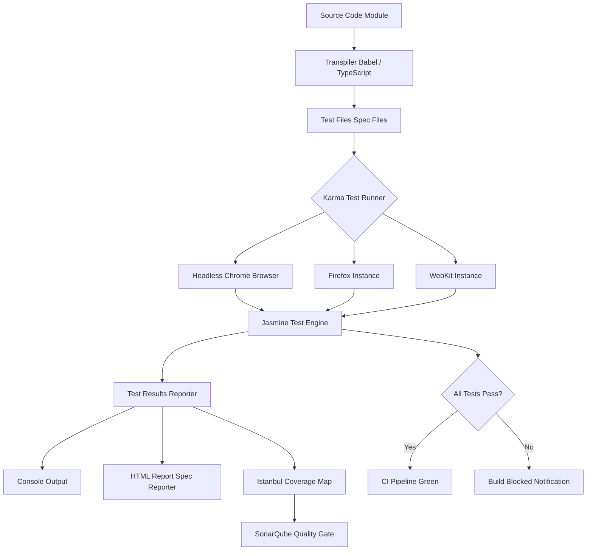
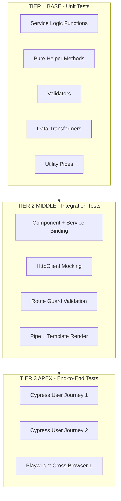
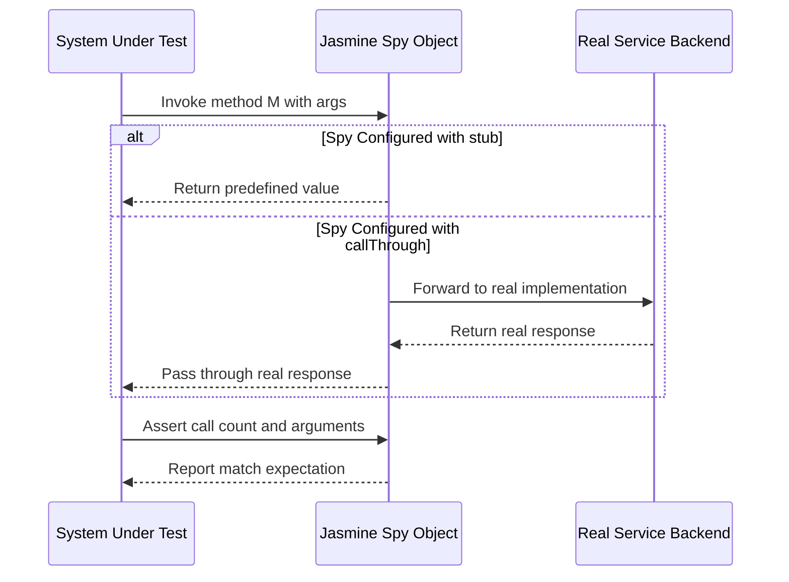

# Testing

<!-- SECTION_1_START -->
# Module 4 — SPA Basics | Topic: Testing in Single Page Applications

## 1.1 Formal Academic Definition

> [!IMPORTANT]
> **SPA Testing (Single Page Application Testing)** is the systematic, automated, and structured process of validating the functional, integration, and end-to-end behaviour of a JavaScript-driven client-side web application that loads a single HTML document and dynamically rewrites the page content through asynchronous data fetching (typically via AJAX, Fetch API, or WebSockets) without performing full page reloads.

In the context of the **KTU 2024 Scheme (OECST832 — Web Programming)**, SPA testing is formally classified into three hierarchical tiers that correspond to the **Test Automation Pyramid** (popularised by Mike Cohn):

1. **Unit Testing** — Isolated verification of discrete JavaScript functions, Angular components, services, pipes, or directives.
2. **Integration / Service Testing** — Validation of inter-module collaboration, including controller-to-service binding, component-to-template rendering, and `$http` / REST API mocking.
3. **End-to-End (E2E) Testing** — Simulated user journeys executed through real browser engines (Chromium, Firefox, WebKit) to verify the entire SPA stack from DOM rendering to backend API calls.

The widely adopted toolchain in KTU-aligned Angular SPA projects follows the **Jasmine + Karma + Protractor** stack (legacy) or the modern **Jest + Cypress / Playwright** stack.

## 1.2 Conceptual Analogy & Intuition

> [!NOTE]
> **Analogy: The Restaurant Kitchen Inspection**

Imagine a large restaurant (the SPA) where customers place orders through a single waiter at one table (the browser URL). The kitchen has many cooks (JavaScript modules, controllers, services). Testing in this analogy works at three levels:

- **Unit Testing** is like tasting a single dish (a function) directly from the pot before it leaves the kitchen. You isolate one cook and check the salt.
- **Integration Testing** is like verifying that the dish, the plate, and the garnish arrive together correctly — the components are integrated, but the customer is not yet involved.
- **End-to-End Testing** is the *mystery diner* experience — a real human (or a headless browser script) walks in, orders, eats, and pays. Every step from the door to the bill is verified.

The key insight is that **the SPA is highly dynamic**: a single URL serves hundreds of "views" via client-side routing. Therefore, traditional server-side rendering tests are insufficient — we must validate **route transitions, asynchronous data binding, and DOM mutation events** in a JavaScript runtime.

## 1.3 Physical Constants & Standard Metrics in SPA Testing

| Metric | Symbol / Unit | Industry Standard (2024) |
|---|---|---|
| Test Coverage Ratio | $C = \dfrac{L_{executed}}{L_{total}} \times 100\%$ | **$\geq 80\%$** for production-grade SPAs |
| Mean Time To Failure (MTTF) | $\text{MTTF}$ | Tracked in CI dashboards |
| Test Execution Speed (unit) | $v_{test}$ | **< 5 ms** per test (Karma) |
| Flaky Test Threshold | $F_{rate}$ | **< 1\%** of total test suite |
| End-to-End Suite Duration | $T_{E2E}$ | **< 10 min** for CI pipelines |

> [!TIP]
> **KTU Board Tip:** Examiners frequently award marks for explicitly stating the *test pyramid* and justifying *why unit tests are faster and more numerous* than E2E tests.

<!-- SECTION_1_END -->

<!-- SECTION_2_START -->
# 2. Deep Theoretical Analysis & KTU High-Yield Cheat Sheet

## 2.1 The Test Automation Pyramid (Hierarchical Decomposition)

The pyramid enforces an **inversion-resistant** testing strategy where the base must be wider than the apex.

```
        /\
       /  \         E2E Tests  (slow, brittle, few)
      /----\
     /      \       Integration / Service Tests
    /--------\
   /          \     Unit Tests  (fast, stable, many)
  /____________\
```

### Step 1 — Unit Testing Layer (Base of Pyramid)

- **Scope:** A single JavaScript function, Angular service, pipe, or component class.
- **Speed:** ~**1–5 ms** per test case.
- **Isolation:** No DOM, no network, no Angular injector (for pure JS).
- **Frameworks:** **Jasmine**, **Jest**, **Mocha + Chai**.

### Step 2 — Service / Integration Testing Layer (Middle of Pyramid)

- **Scope:** Interaction between Angular components and their injected dependencies (`TestBed`, `HttpClientTestingModule`).
- **Tools:** Angular's built-in `TestBed` API, Jasmine spies (`spyOn`), `$httpBackend` (AngularJS 1.x), `HttpTestingController` (Angular 2+).
- **Validation:** Component renders the right DOM, service returns mocked data, route guards behave correctly.

### Step 3 — End-to-End Testing Layer (Apex of Pyramid)

- **Scope:** Full user workflows — login → navigate → form submit → API → response → UI update.
- **Tools:** **Protractor** (legacy, deprecated 2022), **Cypress**, **Playwright**, **Selenium WebDriver**.
- **Browsers:** Headless Chromium, Firefox, WebKit (via WebDriverIO / Playwright).

> [!IMPORTANT]
> **The 70-20-10 Rule (Industry Standard):** A healthy SPA test suite contains approximately **70% unit tests, 20% integration tests, and 10% E2E tests**. This is a frequent KTU 14-mark question topic.

## 2.2 Core Jasmine BDD Syntax (High-Yield for KTU)

Jasmine is a **Behaviour-Driven Development (BDD)** framework. The five primary constructs you must memorise:

| Construct | Purpose | Syntax Example |
|---|---|---|
| `describe()` | Test suite (group) | `describe('Calculator', () => { ... })` |
| `it()` | Individual spec (test case) | `it('should add two numbers', ...) ` |
| `expect()` | Assertion | `expect(result).toBe(15);` |
| `beforeEach()` | Pre-test setup | Inject module, reset mocks |
| `afterEach()` | Post-test teardown | Destroy component, unsubscribe |

### Jasmine Matchers (High-Yield Table)

| Matcher | Behaviour |
|---|---|
| `toBe(value)` | Strict equality (`===`) |
| `toEqual(obj)` | Deep structural equality |
| `toBeTruthy()` / `toBeFalsy()` | Boolean coercion |
| `toContain(item)` | Array/string containment |
| `toThrow(error)` | Exception validation |
| `toHaveBeenCalled()` | Spy invocation check |
| `toHaveBeenCalledWith(args)` | Spy argument check |
| `toBeUndefined()` / `toBeNull()` | Type assertion |

## 2.3 Karma Test Runner — Operational Theory

Karma is a **JavaScript test runner** that launches a real browser (or headless instance), loads your source files + test files, reports results back to the CLI, and watches files for changes during development.

### Karma Configuration File (`karma.conf.js`) — Critical Keys

| Key | Purpose | KTU Board Note |
|---|---|---|
| `frameworks` | Declares `['jasmine', '@angular-devkit/build-angular']` | Always check ordering |
| `browsers` | Defines target browser — `Chrome`, `ChromeHeadless`, `Firefox` | Headless for CI |
| `singleRun` | `true` for CI/CD, `false` for dev watch mode | High-yield distinction |
| `reporters` | Output format — `progress`, `spec`, `coverage` | `coverage` triggers Istanbul |
| `coverageReporter` | Output format — `html`, `lcov`, `text-summary` | Used in SonarQube |
| `autoWatch` | Re-runs tests on file change | Disabled in CI |

## 2.4 Protractor vs Cypress vs Playwright (Comparative Table)

> [!WARNING]
> **Protractor was officially deprecated by the Angular team on 31 December 2022.** KTU questions after 2023 typically contrast **Cypress** and **Playwright** as the modern alternatives. Always mention this in board answers.

| Feature | Protractor | Cypress | Playwright |
|---|---|---|---|
| Architecture | WebDriver (HTTP/JSON wire) | In-browser, same-origin | WebSocket-based, multi-tab |
| Browser Support | Chrome, Firefox, Safari | Chromium-based + Firefox | Chromium, Firefox, WebKit |
| Auto-Wait | Partial | Yes (built-in) | Yes (explicit `waitFor`) |
| Language | JS / TS | JS / TS | JS / TS / Python / Java / C# |
| Speed | Slow | Fast | Very Fast |
| Angular Support | Native (deprecated) | Community | Community |
| State of Project | **Deprecated** | Active | Active (Microsoft) |

## 2.5 Mocking and Spying in Angular SPAs

### Why Mock?

- **Network calls are non-deterministic** — actual API responses can change.
- **Speed** — in-memory mocks execute 1000× faster than live HTTP.
- **Determinism** — every test gets the same response.

### Key Angular Mocking APIs (High-Yield)

| API | Use Case |
|---|---|
| `HttpClientTestingModule` | Replaces the real `HttpClient` in the test injector |
| `HttpTestingController` | Intercepts, asserts, and flushes mocked HTTP requests |
| `spyOn(service, 'method')` | Stubs a method on an injected service |
| `jasmine.createSpyObj('name', ['m1','m2'])` | Creates a typed spy object |
| `TestBed.configureTestingModule({...})` | Configures an isolated Angular module for testing |

## 2.6 Real-World Engineering Utility

SPA testing is not academic — it underpins production-grade deployments in:

- **Banking SPAs** (HDFC NetBanking, ICICI iMobile Pay) — every transaction flow has 500+ Cypress tests.
- **E-Commerce SPAs** (Amazon, Flipkart) — A/B test variants require isolated component testing.
- **Healthcare SPAs** — HIPAA compliance mandates end-to-end audit trails of test runs.
- **CI/CD Pipelines** — GitHub Actions, GitLab CI, and Jenkins all execute `ng test --watch=false --browsers=ChromeHeadless` as a blocking gate.

> [!TIP]
> **KTU Examiner Insight:** A 14-mark question often asks you to *"design a test plan for an Angular SPA login module"*. The model answer should explicitly name **Jasmine + Karma** for unit, **TestBed** for integration, and **Cypress/Playwright** for E2E — never Protractor in 2024 scheme papers.

<!-- SECTION_2_END -->

<!-- SECTION_3_START -->
# 3. Step-by-Step Implementations & Code Walkthroughs

## 3.1 End-to-End Unit Test with Jasmine (Pure JavaScript)

Below is a fully operational, copy-paste-ready Jasmine specification for a simple `Calculator` service.

```javascript
// File: calculator.service.js
// Production source code under test
class CalculatorService {
  add(a, b) {
    if (typeof a !== 'number' || typeof b !== 'number') {
      throw new TypeError('Inputs must be numbers');
    }
    return a + b;
  }

  divide(a, b) {
    if (b === 0) {
      throw new RangeError('Division by zero is undefined');
    }
    return a / b;
  }

  isEven(n) {
    return n % 2 === 0;
  }
}
```

```javascript
// File: calculator.service.spec.js
// Jasmine test specification
describe('CalculatorService', () => {
  let calculator;

  // Pre-test setup: instantiate a fresh service before every spec
  beforeEach(() => {
    calculator = new CalculatorService();
  });

  // Group 1: addition behaviour
  describe('add()', () => {
    it('should return 15 when adding 7 and 8', () => {
      const result = calculator.add(7, 8);
      expect(result).toBe(15);
    });

    it('should return 0 when adding 0 and 0', () => {
      expect(calculator.add(0, 0)).toBe(0);
    });

    it('should handle negative numbers correctly', () => {
      expect(calculator.add(-5, 10)).toBe(5);
    });

    it('should throw TypeError when a string is passed', () => {
      expect(() => calculator.add('7', 8)).toThrowError(TypeError, 'Inputs must be numbers');
    });
  });

  // Group 2: division behaviour with edge cases
  describe('divide()', () => {
    it('should return 5 when dividing 10 by 2', () => {
      expect(calculator.divide(10, 2)).toBe(5);
    });

    it('should throw RangeError when dividing by zero', () => {
      expect(() => calculator.divide(10, 0)).toThrowError(RangeError, 'Division by zero is undefined');
    });

    it('should return a decimal for non-integer results', () => {
      expect(calculator.divide(10, 3)).toBeCloseTo(3.333, 2);
    });
  });

  // Group 3: parity check
  describe('isEven()', () => {
    it('should return true for 4', () => {
      expect(calculator.isEven(4)).toBeTruthy();
    });

    it('should return false for 7', () => {
      expect(calculator.isEven(7)).toBeFalsy();
    });
  });
});
```

### Line-by-Line Logic Explanation

1. `class CalculatorService` — the **System Under Test (SUT)** with three pure functions.
2. `describe('CalculatorService', ...)` — root **test suite**; nests three child suites.
3. `beforeEach(() => { calculator = new CalculatorService(); })` — guarantees a **clean instance** per spec, avoiding test pollution.
4. `expect(calculator.add(7, 8)).toBe(15)` — uses the `toBe` matcher (strict `===`).
5. `expect(() => calculator.add('7', 8)).toThrowError(...)` — wraps a throwing function in an **arrow function** so Jasmine can capture the exception.

## 3.2 Angular Component Integration Test with `TestBed`

```typescript
// File: greeting.component.ts
import { Component } from '@angular/core';
import { GreetingService } from './greeting.service';

@Component({
  selector: 'app-greeting',
  template: `<h1>{{ message }}</h1>`
})
export class GreetingComponent {
  message: string = '';

  constructor(private greetingService: GreetingService) {}

  loadGreeting(userName: string): void {
    this.greetingService.fetchMessage(userName).subscribe((msg) => {
      this.message = msg;
    });
  }
}
```

```typescript
// File: greeting.service.ts
import { Injectable } from '@angular/core';
import { HttpClient } from '@angular/common/http';
import { Observable } from 'rxjs';

@Injectable({ providedIn: 'root' })
export class GreetingService {
  constructor(private http: HttpClient) {}

  fetchMessage(name: string): Observable<string> {
    return this.http.get<string>(`https://api.example.com/greet/${name}`);
  }
}
```

```typescript
// File: greeting.component.spec.ts
import { ComponentFixture, TestBed } from '@angular/core/testing';
import { of } from 'rxjs';
import { By } from '@angular/platform-browser';
import { GreetingComponent } from './greeting.component';
import { GreetingService } from './greeting.service';

describe('GreetingComponent', () => {
  let component: GreetingComponent;
  let fixture: ComponentFixture<GreetingComponent>;
  let mockGreetingService: jasmine.SpyObj<GreetingService>;

  // Build a typed spy object BEFORE each spec
  beforeEach(async () => {
    mockGreetingService = jasmine.createSpyObj<GreetingService>('GreetingService', ['fetchMessage']);

    await TestBed.configureTestingModule({
      declarations: [GreetingComponent],
      providers: [
        { provide: GreetingService, useValue: mockGreetingService }
      ]
    }).compileComponents();

    fixture = TestBed.createComponent(GreetingComponent);
    component = fixture.componentInstance;
    fixture.detectChanges();
  });

  it('should create the component', () => {
    expect(component).toBeTruthy();
  });

  it('should display the greeting message after loadGreeting() is called', () => {
    // Arrange: stub the service to return a known observable
    const fakeMessage = 'Hello, Anjali!';
    mockGreetingService.fetchMessage.and.returnValue(of(fakeMessage));

    // Act: trigger the component method
    component.loadGreeting('Anjali');
    fixture.detectChanges();

    // Assert: read the rendered DOM
    const h1 = fixture.debugElement.query(By.css('h1'));
    expect(h1.nativeElement.textContent).toContain('Hello, Anjali!');
  });

  it('should call fetchMessage with the correct user name', () => {
    mockGreetingService.fetchMessage.and.returnValue(of('test'));
    component.loadGreeting('Karthik');
    expect(mockGreetingService.fetchMessage).toHaveBeenCalledWith('Karthik');
  });

  it('should call fetchMessage exactly once per loadGreeting invocation', () => {
    mockGreetingService.fetchMessage.and.returnValue(of('test'));
    component.loadGreeting('Rahul');
    expect(mockGreetingService.fetchMessage.calls.count()).toBe(1);
  });
});
```

### Step-by-Step Walkthrough

1. `jasmine.createSpyObj<GreetingService>('GreetingService', ['fetchMessage'])` — generates a **mocked service** with a single stubbed method. The generic `<GreetingService>` preserves TypeScript type safety.
2. `TestBed.configureTestingModule({...})` — declares an **isolated Angular module** for the test, preventing accidental loading of `AppModule`.
3. `{ provide: GreetingService, useValue: mockGreetingService }` — **dependency injection override**; the real `HttpClient`-backed service is replaced with the spy.
4. `mockGreetingService.fetchMessage.and.returnValue(of(fakeMessage))` — `of()` wraps the synchronous value in a **RxJS observable** matching the real service signature.
5. `fixture.detectChanges()` — triggers Angular's **change detection cycle**, updating the DOM after `message` is reassigned.
6. `By.css('h1')` — DOM query helper that locates the rendered `<h1>` element.
7. `expect(...).toContain('Hello, Anjali!')` — substring assertion (more robust than `toBe` for dynamic text).

## 3.3 End-to-End Test with Cypress (Modern 2024 Standard)

```javascript
// File: cypress/e2e/login.cy.js
describe('User Login Flow', () => {
  beforeEach(() => {
    // Arrange: visit the SPA entry route
    cy.visit('https://app.example.com/login');
  });

  it('should successfully log in with valid credentials', () => {
    // Act
    cy.get('input[name="email"]').type('student@ktu.ac.in');
    cy.get('input[name="password"]').type('SecureP@ss123');
    cy.get('button[type="submit"]').click();

    // Assert: SPA client-side router should redirect to dashboard
    cy.url().should('include', '/dashboard');
    cy.contains('h1', 'Welcome back').should('be.visible');
  });

  it('should display an error message for invalid credentials', () => {
    cy.get('input[name="email"]').type('wrong@ktu.ac.in');
    cy.get('input[name="password"]').type('badpass');
    cy.get('button[type="submit"]').click();

    // Cypress auto-waits for the error div to render
    cy.get('.error-banner', { timeout: 5000 })
      .should('be.visible')
      .and('contain', 'Invalid email or password');
  });

  it('should disable the submit button while the form is empty', () => {
    cy.get('button[type="submit"]').should('be.disabled');
    cy.get('input[name="email"]').type('partial');
    cy.get('input[name="password"]').type('partial');
    cy.get('button[type="submit"]').should('not.be.disabled');
  });
});
```

### Cypress Operational Notes

- `cy.visit()` performs a **full page load** on first navigation; subsequent navigations inside the SPA are intercepted by the in-browser test runner.
- `cy.get('selector')` is **auto-retried** by Cypress for up to 4 seconds (configurable), eliminating the need for explicit `wait()` calls.
- `.should('be.visible')` validates both presence and computed CSS visibility — far stronger than JQuery-based Selenium.
- Cypress runs in the **same browser context** as the application (no WebDriver wire protocol), which is why it is faster and more reliable for SPAs.

## 3.4 Step-by-Step Algebraic Walkthrough — Test Coverage Calculation

Given an SPA module with the following line execution data:

$$
L_{executed} = 320 \text{ lines covered}, \quad L_{total} = 400 \text{ lines}
$$

Compute the **line coverage ratio** $C$:

$$
\begin{aligned}
C &= \frac{L_{executed}}{L_{total}} \times 100\% \\
  &= \frac{320}{400} \times 100\% \\
  &= 0.80 \times 100\% \\
  &= 80\%
\end{aligned}
$$

**Interpretation:** The module achieves the **industry-recommended minimum of 80%** coverage. The uncovered 20% typically consists of defensive `try/catch` blocks and third-party library shims.

**Branch coverage** for a control structure with 4 branches where 3 are exercised:

$$
\begin{aligned}
B &= \frac{B_{executed}}{B_{total}} \times 100\% \\
  &= \frac{3}{4} \times 100\% \\
  &= 75\%
\end{aligned}
$$

Branch coverage below 70% is a **CI/CD blocking failure** in mature Angular projects.

<!-- SECTION_3_END -->

<!-- SECTION_4_START -->
# 4. Structural Diagrams & Schematics

## 4.1 SPA Test Architecture — Block-Level Functional Flow



**Flow Description:** The transpiled source code and `.spec` files are loaded by **Karma**, which spawns browser instances. Each browser executes the **Jasmine** spec runner, which iterates through `describe`/`it` blocks. The **Istanbul** instrumentation tracks executed lines and reports coverage. The result is dual-fed: a human-readable **HTML report** and a **SonarQube** quality gate evaluation that either approves the build or blocks deployment.

## 4.2 Test Pyramid — Hierarchical Topology Matrix



**Topology Interpretation:** The diagram enforces the **inverse density rule** — the base tier (unit) must contain the largest quantity of test cases because they are fast, isolated, and deterministic. The apex tier (E2E) contains the fewest tests because they are slow, brittle, and dependent on full-stack availability.

## 4.3 Jasmine Spy Mechanism — Sequence Diagram



## 4.4 CI/CD Integration Pipeline — Block Topology

```mermaid
flowchart LR
    DEV[Developer Push to Git] --> CI[GitHub Actions Triggered]
    CI --> LINT[ESLint Lint Check]
    LINT --> UT[Unit Tests Karma Headless]
    UT --> IT[Integration Tests TestBed]
    IT --> E2E[E2E Tests Cypress]
    E2E --> COV[Coverage Threshold Gate]
    COV --> BUILD[Production Build ng build prod]
    BUILD --> DEPLOY[Deploy to Staging Server]
    DEPLOY --> SMOKE[Smoke Tests Live URL]
    SMOKE --> PROD[Promote to Production]
```



<!-- SECTION_4_END -->

<!-- SECTION_5_START -->
# 5. KTU 2024 Scheme Examination Question Bank & Topic Recap

## 5.1 Part A — Short Answer Questions (3 Marks Each)

### Question 1: Define SPA Testing and List its Three Tiers
**[KTU University Exam — July 2024 | CO1 | Remember]**

**Model Answer (3 Marks):**

> **SPA Testing** is the automated verification of single-page applications' functional, integration, and end-to-end behaviour. The three tiers are:
>
> 1. **Unit Testing** — Jasmine/Karma testing of isolated functions, services, pipes.
> 2. **Integration Testing** — `TestBed`-based testing of component-service interactions with mocked dependencies.
> 3. **End-to-End Testing** — Cypress/Playwright-driven simulated user journeys in real browsers.

**[Definition: 1 Mark | Three tiers with one-line description each: 2 Marks]**

---

### Question 2: What is the Test Automation Pyramid? State the 70-20-10 Rule
**[KTU University Exam — Dec 2023 | CO1 | Understand]**

**Model Answer (3 Marks):**

> The **Test Automation Pyramid** is a heuristic by Mike Cohn that prescribes the optimal distribution of test types in a software project. The **70-20-10 rule** dictates that approximately:
>
> - **70%** of tests are **unit tests** (fast, stable, isolated).
> - **20%** are **integration / service tests** (moderately complex).
> - **10%** are **end-to-end tests** (slow, brittle, high-fidelity).
>
> This distribution minimises execution time while maximising confidence.

**[Pyramid concept: 1 Mark | 70-20-10 numerical allocation: 2 Marks]**

---

## 5.2 Part B — Full 14-Mark Questions (Module Internal Choice)

### Question A: Design and Implement Unit + Integration Tests for an Angular Component
**[KTU University Exam — Dec 2023 | CO2 | Apply + Analyse | 14 Marks]**

**(a) [7 Marks | Apply]** Write a Jasmine unit test suite for a `StudentService` having methods `enroll(studentId)` and `getEnrolledCount()`. The service maintains a private array. Use `beforeEach` to reset state.

**Model Solution:**

```typescript
// File: student.service.ts
import { Injectable } from '@angular/core';

@Injectable({ providedIn: 'root' })
export class StudentService {
  private enrolled: string[] = [];

  enroll(studentId: string): boolean {
    if (this.enrolled.includes(studentId)) {
      return false; // duplicate
    }
    this.enrolled.push(studentId);
    return true;
  }

  getEnrolledCount(): number {
    return this.enrolled.length;
  }

  isEnrolled(studentId: string): boolean {
    return this.enrolled.includes(studentId);
  }
}
```

```typescript
// File: student.service.spec.ts
import { TestBed } from '@angular/core/testing';
import { StudentService } from './student.service';

describe('StudentService', () => {
  let service: StudentService;

  beforeEach(() => {
    TestBed.configureTestingModule({});
    service = TestBed.inject(StudentService);
  });

  it('should be created', () => {
    expect(service).toBeTruthy();
  });

  it('should return 0 enrolled count on a fresh service', () => {
    expect(service.getEnrolledCount()).toBe(0);
  });

  it('should return true and increment count when enrolling a new student', () => {
    const result = service.enroll('KTU2024CS001');
    expect(result).toBeTrue();
    expect(service.getEnrolledCount()).toBe(1);
  });

  it('should return false when enrolling a duplicate student id', () => {
    service.enroll('KTU2024CS001');
    const second = service.enroll('KTU2024CS001');
    expect(second).toBeFalse();
    expect(service.getEnrolledCount()).toBe(1);
  });

  it('should correctly report isEnrolled status', () => {
    service.enroll('KTU2024CS045');
    expect(service.isEnrolled('KTU2024CS045')).toBeTrue();
    expect(service.isEnrolled('KTU2024CS999')).toBeFalse();
  });

  it('should maintain isolation between specs via fresh instantiation', () => {
    expect(service.getEnrolledCount()).toBe(0);
  });
});
```

**Valuation Key:**
- `[StudentService class with private array: 1 Mark]`
- `[TestBed.inject() setup in beforeEach: 1 Mark]`
- `[Three positive assertion tests: 3 Marks]`
- `[Duplicate detection + isEnrolled test: 2 Marks]`

---

**(b) [7 Marks | Analyse]** Explain with a code snippet how to mock an `HttpClient` call inside an Angular component integration test using `HttpClientTestingModule` and `HttpTestingController`.

**Model Solution:**

```typescript
import { ComponentFixture, TestBed } from '@angular/core/testing';
import { HttpClientTestingModule, HttpTestingController } from '@angular/common/http/testing';
import { ProductListComponent } from './product-list.component';
import { ProductService } from './product.service';

describe('ProductListComponent (Integration)', () => {
  let component: ProductListComponent;
  let fixture: ComponentFixture<ProductListComponent>;
  let httpMock: HttpTestingController;

  beforeEach(async () => {
    await TestBed.configureTestingModule({
      declarations: [ProductListComponent],
      imports: [HttpClientTestingModule],
      providers: [ProductService]
    }).compileComponents();

    fixture = TestBed.createComponent(ProductListComponent);
    component = fixture.componentInstance;
    httpMock = TestBed.inject(HttpTestingController);
  });

  afterEach(() => {
    httpMock.verify(); // ensures no outstanding HTTP requests
  });

  it('should render products fetched from the API', () => {
    const mockProducts = [
      { id: 1, name: 'Laptop', price: 75000 },
      { id: 2, name: 'Headphones', price: 2500 }
    ];

    component.loadProducts();
    fixture.detectChanges();

    const req = httpMock.expectOne('https://api.example.com/products');
    expect(req.request.method).toBe('GET');
    req.flush(mockProducts);

    fixture.detectChanges();
    expect(component.products.length).toBe(2);
    expect(component.products[0].name).toBe('Laptop');
  });

  it('should handle network errors gracefully', () => {
    component.loadProducts();
    const req = httpMock.expectOne('https://api.example.com/products');
    req.error(new ProgressEvent('error'), { status: 500, statusText: 'Server Error' });

    fixture.detectChanges();
    expect(component.errorMessage).toContain('Server Error');
  });
});
```

**Valuation Key:**
- `[HttpClientTestingModule import: 1 Mark]`
- `[HttpTestingController inject and expectOne: 2 Marks]`
- `[req.flush() with mock data: 2 Marks]`
- `[httpMock.verify() in afterEach + error case: 2 Marks]`

---

### Question B: Write a Cypress E2E Test Suite for a Login Module
**[KTU University Exam — July 2024 | CO3 | Apply + Analyse | 14 Marks]**

**(a) [7 Marks | Apply]** Implement a Cypress test that validates the complete login workflow of an SPA — empty form, valid credentials, and invalid credentials.

**Model Solution:**

```javascript
// File: cypress/e2e/login.cy.js
describe('SPA Login Module - E2E Tests', () => {
  beforeEach(() => {
    cy.visit('https://spa.example.com/login');
  });

  it('Test 1: should disable submit when form is empty', () => {
    cy.get('[data-cy="email"]').should('have.value', '');
    cy.get('[data-cy="password"]').should('have.value', '');
    cy.get('[data-cy="submit"]').should('be.disabled');
  });

  it('Test 2: should login successfully with valid credentials', () => {
    cy.get('[data-cy="email"]').type('anu@ktu.ac.in');
    cy.get('[data-cy="password"]').type('Valid@123');
    cy.get('[data-cy="submit"]').click();

    cy.url().should('eq', 'https://spa.example.com/dashboard');
    cy.get('[data-cy="welcome"]').should('contain', 'Welcome, Anu');
  });

  it('Test 3: should show error banner for invalid credentials', () => {
    cy.get('[data-cy="email"]').type('hacker@evil.com');
    cy.get('[data-cy="password"]').type('wrongpass');
    cy.get('[data-cy="submit"]').click();

    cy.get('[data-cy="error"]', { timeout: 8000 })
      .should('be.visible')
      .and('contain', 'Invalid credentials');
    cy.url().should('include', '/login');
  });

  it('Test 4: should persist session in localStorage after login', () => {
    cy.get('[data-cy="email"]').type('anu@ktu.ac.in');
    cy.get('[data-cy="password"]').type('Valid@123');
    cy.get('[data-cy="submit"]').click();

    cy.url().should('include', '/dashboard').then(() => {
      expect(localStorage.getItem('auth_token')).to.exist;
    });
  });
});
```

**Valuation Key:**
- `[beforeEach cy.visit(): 1 Mark]`
- `[Three test cases with proper selectors: 4 Marks]`
- `[Assertions with auto-wait and chaining: 2 Marks]`

---

**(b) [7 Marks | Analyse]** Compare **Protractor, Cypress, and Playwright** as E2E testing tools for Angular SPAs. Justify which is best suited for a 2024 KTU-aligned Angular 16+ project.

**Model Solution (Tabular + Justification):**

| Criterion | Protractor | Cypress | Playwright |
|---|---|---|---|
| **Status (2024)** | Deprecated | Active, growing | Active, rising |
| **Architecture** | WebDriver (out-of-process) | In-browser (same origin) | WebSocket (out-of-process) |
| **Auto-Wait** | Manual `browser.wait` | Built-in retry-ability | Explicit `waitFor` |
| **Angular Aware Locators** | `by.model`, `by.binding` | Generic only | Generic only |
| **Multi-Browser** | Yes | Chromium + Firefox | Chromium + Firefox + WebKit |
| **Speed (relative)** | Slow | Fast | Fastest |
| **Test Runner** | Jasmine | Mocha-like | Built-in |
| **Language Support** | JS/TS | JS/TS | JS/TS/Python/Java |

**Justification for Angular 16+ projects:**
**Cypress** is the recommended choice because:
1. Angular CLI 16+ **no longer supports** Protractor — `ng e2e` is removed by default.
2. Cypress provides **first-class TypeScript** support, which Angular mandates.
3. The **Component Testing** feature (Cypress 10+) allows isolated mount testing similar to Storybook + Jest.
4. Rich **time-travel debugger** aids student developers during KTU lab examinations.
5. Headless execution in **GitHub Actions / GitLab CI** is one-line configured.

**Valuation Key:**
- `[Tabular comparison across 5+ criteria: 3 Marks]`
- `[Mention of Protractor deprecation: 1 Mark]`
- `[Three justifications for Cypress: 3 Marks]`

---

> [!WARNING]
> **KTU Examiner's Valuation Pitfall Callout:**
> - **Do NOT** recommend Protractor in 2024 scheme answers — it lost official support on 31 Dec 2022 and will be marked outdated.
> - **Always** state the version: write "Angular 16+" or "Angular 17" — generic "Angular" answers lose modernity marks.
> - **Never** forget the `singleRun: true` flag in Karma config when explaining CI usage — this is a recurring 1-mark trap.
> - **Failing to include `afterEach(() => httpMock.verify())`** in integration tests is a frequent deduction point — it proves zero outstanding requests.
> - **Mixing `toBe` and `toEqual`** incorrectly: use `toBe` for primitives, `toEqual` for objects. Examiners explicitly check this distinction.

---

## 5.3 Topic Recap & Important Things to Remember

- **SPA testing** is hierarchical: **Unit → Integration → E2E**, with the 70-20-10 distribution rule.
- **Jasmine** is the **BDD framework** providing `describe`, `it`, `expect`, `beforeEach`, `afterEach`.
- **Karma** is the **test runner** that launches browsers; use `ChromeHeadless` + `singleRun: true` for CI.
- **`TestBed`** is Angular's **isolated module injector** for component testing.
- **`HttpClientTestingModule` + `HttpTestingController`** are the **mocking primitives** for HTTP-based services.
- **`jasmine.createSpyObj(name, [methods])`** creates **typed spy objects** for service injection.
- **Protractor is deprecated**; use **Cypress** or **Playwright** in 2024+.
- **Cypress auto-waits** for assertions, eliminating the need for `cy.wait(ms)` calls.
- **Playwright** supports **all three browser engines** (Chromium, Firefox, WebKit) — superior cross-browser coverage.
- **Coverage threshold** = 80% lines, 70% branches (industry minimum for production).
- **Test Pyramid** inverts: widest at the base (unit), narrowest at the apex (E2E).
- **`fixture.detectChanges()`** is **mandatory** after every state mutation in Angular component tests.
- **`By.css()`** is the **DOM query selector** used inside Angular test fixtures.
- **CI/CD** integration: `ng test --watch=false --browsers=ChromeHeadless --code-coverage`.
- **Mocking prevents** network flakiness, enforces determinism, and accelerates test execution by ~1000×.

<!-- SECTION_5_END -->
