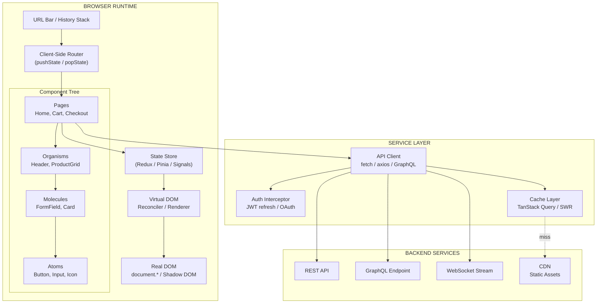
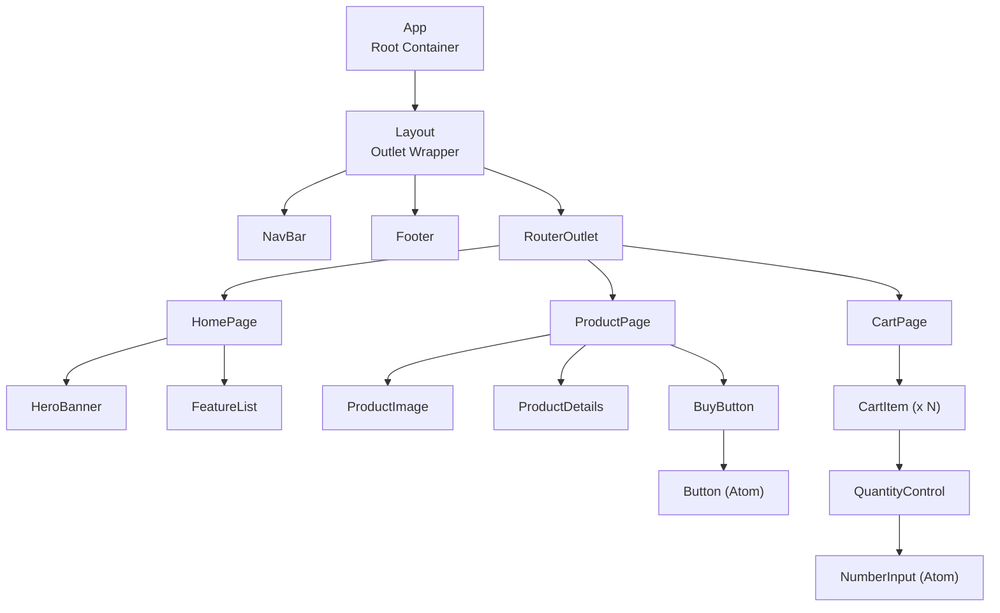
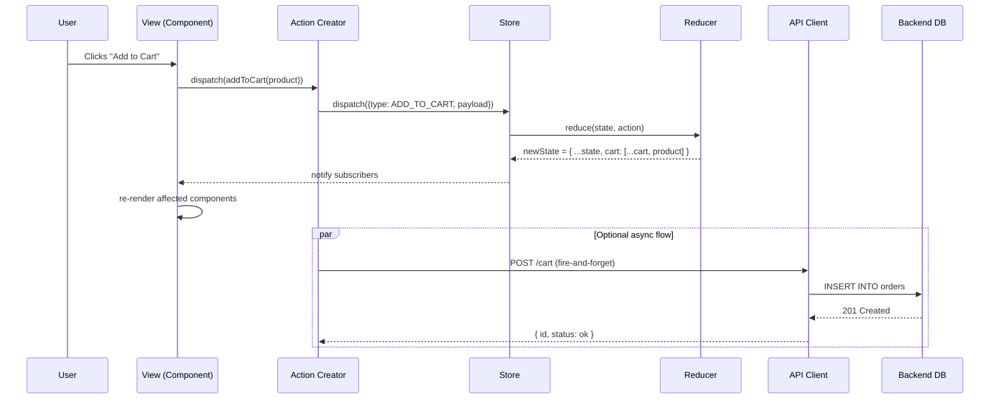
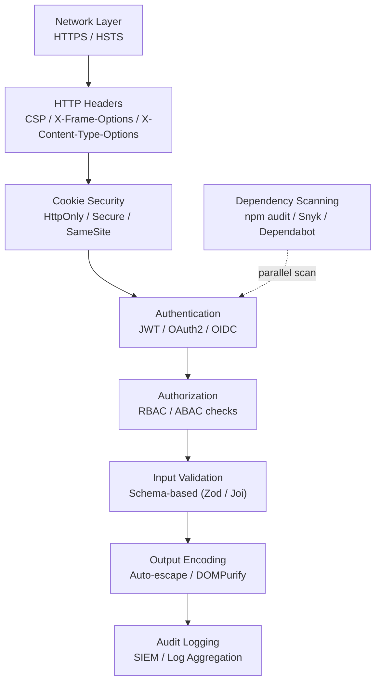
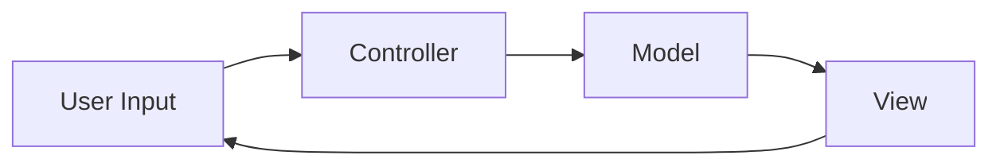
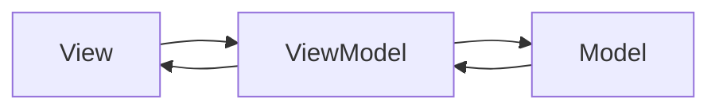
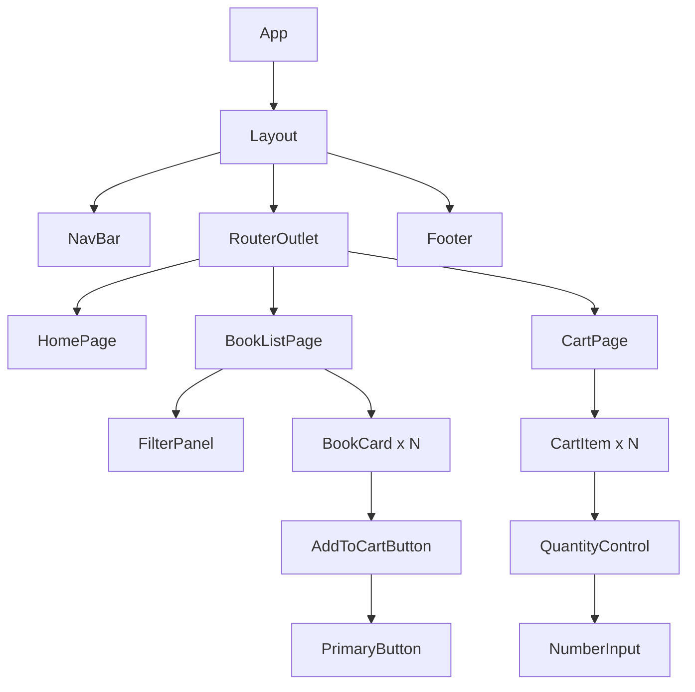

# Web Application Design  - Real World Web Software Design

<!-- SECTION_1_START -->

# Real-World Web Software Design — The Foundation of Modern SPAs

> [!NOTE]
> **KTU 2024 Scheme | OECST832 — Web Programming | Module 4: SPA Basics**
> **Course Outcome Mapping:** This topic primarily addresses **CO3** (Design interactive single-page web applications using modern client-side frameworks) and **CO4** (Apply architectural patterns to build scalable, maintainable front-end systems).

## 1.1 Formal Academic Definition

**Real-World Web Software Design** is the disciplined application of software engineering principles, architectural patterns, and design heuristics to construct production-grade, scalable, secure, and maintainable web applications. In the context of **Single Page Applications (SPAs)**, it specifically refers to the holistic engineering of client-side systems where the browser dynamically rewrites the current page rather than loading entirely new pages from the server, achieving a desktop-like user experience.

According to the **KTU 2024 OEC syllabus**, this encompasses:

- **Component-based architectural decomposition** (atomic, molecular, organismic design).
- **Unidirectional data flow** and reactive state propagation.
- **Client-side routing** using the **History API** (`pushState`, `popState`).
- **Asynchronous data orchestration** via REST/GraphQL endpoints.
- **Performance budgeting** and **bundle-splitting** strategies.
- **Security hardening** against **XSS (Cross-Site Scripting)**, **CSRF (Cross-Site Request Forgery)**, and content injection.

> [!IMPORTANT]
> **SPA Definition (KTU Board-Examiner Approved Wording):**
> "A *Single Page Application* is a web application that interacts with the user by dynamically rewriting the current page in place, rather than loading entire new pages from a server, thereby providing a fluid, app-like user experience within a single HTML document."

## 1.2 Intuitive Real-World Analogy

> [!TIP]
> **Analogy: The Smart Restaurant vs. The Traditional Restaurant**

Imagine two restaurants serving the same menu:

- **Traditional Multi-Page App (MPA)** is like a **chain of separate restaurants**. To get a different dish, you must drive to a different building, park, and start a new dining experience. Each page reload is a "trip" to a new server. The browser tears down the DOM, fetches HTML+CSS+JS, and rebuilds — slow, wasteful, and jarring.

- **Single Page Application (SPA)** is like a **single open-kitchen restaurant with a digital menu tablet**. You sit once. A *waiter (the router)* swaps dishes (views) at your table. The *kitchen display (state store)* updates instantly. The *head chef (the framework's reconciler)* decides what ingredients (DOM nodes) to re-use and which to re-cook. Your experience is continuous, fast, and personalized.

| Concept | Restaurant Analogy | Real-World Web Mapping |
|---|---|---|
| HTML Shell | The building | `index.html` loaded once |
| Router | Waiter taking orders | `react-router`, `vue-router` |
| State Store | Kitchen display | Redux, Pinia, Signals |
| Components | Individual dishes | `<Button>`, `<Modal>`, `<Card>` |
| API | Supplier deliveries | `fetch()`, `axios`, GraphQL |
| Re-render | Chef re-plating | Virtual DOM diffing |

## 1.3 Core Pillars of Real-World Web Software Design

> [!IMPORTANT]
> **The Five Pillars (Industry-Standard Heuristics)**
>
> 1. **S** — Single Responsibility (each component does one thing well)
> 2. **O** — Open/Closed (open for extension, closed for modification)
> 3. **L** — Liskov Substitution (child components replaceable with parent types)
> 4. **I** — Interface Segregation (lean, focused prop APIs)
> 5. **D** — Dependency Inversion (depend on abstractions, not concrete APIs)

These **SOLID principles** are universally accepted in **production-grade web engineering** and frequently appear in **KTU Part B (14-mark) questions** under the *Apply* or *Analyze* cognitive levels.

## 1.4 Standard Performance & Quality Metrics (Must Memorize)

> [!NOTE]
> **Bold Constants & Metrics Every KTU Student Should Know:**
>
> - **First Contentful Paint (FCP):** Time until first text/image paints. **Target: < 1.8 s**.
> - **Largest Contentful Paint (LCP):** Time until largest visible element renders. **Target: < 2.5 s**.
> - **Time to Interactive (TTI):** Time until page is fully responsive. **Target: < 3.8 s**.
> - **Cumulative Layout Shift (CLS):** Visual stability score. **Target: < 0.1**.
> - **Total Blocking Time (TBT):** Main-thread block duration. **Target: < 200 ms**.
> - **First Input Delay (FID):** Input-to-paint latency. **Target: < 100 ms**.
> - **HTTP/2 multiplex limit:** **6 concurrent streams per TCP connection** (browser default).
> - **JavaScript bundle budget:** **< 170 KB** (gzip) for fast 3G delivery.

<!-- SECTION_1_END -->

<!-- SECTION_2_START -->

# Deep Theoretical Analysis & KTU High-Yield Formula Sheet

## 2.1 The Anatomy of a Real-World SPA Architecture

A production-grade SPA is not just "JavaScript on a page." It is a **layered architecture** with strict separation of concerns. The five layers are:

1. **Presentation Layer** — Components, templates, and styles. Knows *how* things look.
2. **Routing Layer** — Maps URLs to views using the **HTML5 History API**. Knows *where* the user is.
3. **State Management Layer** — Centralized store(s) for shared data. Knows *what* the app remembers.
4. **Service / API Layer** — Encapsulates HTTP, WebSocket, and data transformation. Knows *how* to talk to the backend.
5. **Infrastructure Layer** — Build tools (Vite, Webpack), bundlers, linters, CI/CD. Knows *how* the app is shipped.

> [!TIP]
> **Why This Layering Matters in Real Engineering:**
> At **Google**, **Meta**, and **Amazon**, the failure to enforce these layers causes "big ball of mud" codebases where a CSS change in `Header.css` breaks the checkout page. KTU questions test whether you can *justify* this separation in a **14-mark Part B** answer.

## 2.2 Architectural Patterns — Board-Exam Favorites

| Pattern | Core Idea | When to Use | Trade-off |
|---|---|---|---|
| **MVC** (Model-View-Controller) | Separates data, UI, and input logic | Traditional server-rendered apps | Heavy for SPAs |
| **MVVM** (Model-View-ViewModel) | View binds to observable ViewModel | Vue, Knockout, Knockout.js, early Angular | Two-way binding can be unpredictable |
| **Flux / Unidirectional** | Action → Dispatcher → Store → View | React with Redux, large teams | Verbose for small apps |
| **Component-Based** | UI as tree of encapsulated components | React, Vue, Svelte, Solid | State hoisting can be tricky |
| **Reactive / Signals** | Fine-grained dependency tracking | SolidJS, Vue 3 Composition, Svelte 5 | Newer mental model |
| **Micro-Frontends** | Independent deployable front-end slices | Large orgs (Spotify, IKEA) | High operational complexity |
| **JAMstack** | Pre-rendered + APIs + serverless | Marketing sites, docs | Poor for highly dynamic apps |
| **Islands Architecture** | Selective hydration of static HTML | Astro, Qwik | Limited SPA feel |

## 2.3 Design Heuristics Beyond SOLID

- **DRY (Don't Repeat Yourself):** Extract shared logic into reusable components/hooks.
- **KISS (Keep It Simple, Stupid):** Prefer the simplest solution that meets requirements.
- **YAGNI (You Aren't Gonna Need It):** Don't build features until they are demanded.
- **Composition over Inheritance:** Build complex UIs by composing small components.
- **Colocation:** Keep related files (component, test, styles) in the same directory.
- **12-Factor App Principles:** Especially *config*, *backing services*, *disposability*.

## 2.4 State Management — The Heart of SPA Design

State in an SPA is classified by **scope and lifetime**:

| State Type | Scope | Example | Storage Strategy |
|---|---|---|---|
| **Local State** | Single component | Form input value | `useState`, `ref()` |
| **Lifted State** | Parent + children | Filtered list | Props down, events up |
| **Shared / Global** | App-wide | Authenticated user | Redux, Pinia, Zustand, Context |
| **Server State** | Remote API data | Product list | TanStack Query, SWR, Apollo |
| **URL State** | Browser address bar | `?page=2&sort=asc` | Query params, `useSearchParams` |
| **Persisted State** | Survives refresh | Theme, draft posts | `localStorage`, `IndexedDB` |
| **Ephemeral UI** | Short-lived | Modal open/close | Local `useState` |

> [!IMPORTANT]
> **The "Lifting State Up" Rule:** If two sibling components need the same data, hoist the state to their nearest common ancestor. If three or more levels deep, consider a global store.

## 2.5 Client-Side Routing — The Navigation Backbone

Modern SPAs use the **HTML5 History API** instead of hash fragments (`#/about`) to provide clean URLs. The core methods are:

- `window.history.pushState(state, title, url)` — Adds a new entry to the history stack.
- `window.history.replaceState(state, title, url)` — Modifies the current entry without adding.
- `window.addEventListener('popstate', handler)` — Reacts to back/forward navigation.

A router implementation must:
1. Parse the current `pathname`.
2. Match it against a route table.
3. Render the corresponding component.
4. Intercept `<a>` clicks to call `pushState` instead of full reload.
5. Handle **dynamic params** (`:id`), **wildcards** (`*`), and **query strings**.

## 2.6 Performance Optimization Formulas & Rules

> [!NOTE]
> **KTU Formula Sheet — Performance & Optimization**

| Concept | Formula / Rule | Purpose |
|---|---|---|
| **Critical Rendering Path** | $\text{CRP} = T_{DNS} + T_{TCP} + T_{TLS} + T_{TTFB} + T_{Download} + T_{Parse} + T_{Render}$ | Total time to first paint |
| **Effective TCP Connections** | $\text{Streams}_{\text{total}} = N_{\text{domains}} \times 6$ | HTTP/1.1 parallel fetch limit |
| **Time to Interactive** | $TTI = T_{FCP} + T_{\text{main-thread-quiet-5s}}$ | Real "ready" metric |
| **Code-Split Savings** | $S_{\text{bytes}} = B_{\text{initial}} - B_{\text{lazy}}$ | Bytes deferred via dynamic `import()` |
| **Cache Hit Ratio** | $H = \frac{R_{\text{cache}}}{R_{\text{cache}} + R_{\text{miss}}}$ | CDN efficiency |
| **Lighthouse Score (perf)** | $P = f(FCP, LCP, TBT, CLS, SI)$ weighted | Composite quality score |
| **JPEG quality vs. size** | $S \propto 2^{q}$ approximately | Quality factor $q \in [1, 100]$ |
| **gzip ratio** | $R_{\text{gzip}} = 1 - \frac{S_{\text{gzipped}}}{S_{\text{raw}}}$ | Typical **0.6 to 0.8** |
| **JS parse cost** | $\approx 1 \text{ ms per KB}$ on mid-range mobile | V8 cold-parse heuristic |
| **Debounce wait** | $t_{\text{wait}} \geq 100 \text{ ms}$ for input-driven fetch | Cancel prior timers |

> [!WARNING]
> Do **not** confuse **FCP** (First Contentful Paint) with **LCP** (Largest Contentful Paint). FCP measures *any* content; LCP specifically measures the largest visible element (often an image or hero heading). KTU examiners frequently test this distinction.

## 2.7 Security Considerations in SPA Design

| Threat | Mitigation |
|---|---|
| **XSS** | Escape user input; use frameworks' auto-escaping; **Content Security Policy (CSP)** headers |
| **CSRF** | Use `SameSite=Strict` cookies + CSRF tokens for state-changing requests |
| **Token Theft** | Store JWTs in **HttpOnly** cookies, never `localStorage` |
| **Clickjacking** | Set `X-Frame-Options: DENY` or CSP `frame-ancestors 'none'` |
| **Open Redirects** | Whitelist allowed redirect targets in router |
| **Dependency Hijack** | Use `npm audit`, lockfiles, **Subresource Integrity (SRI)** for CDN scripts |
| **Data Leakage** | Strip sensitive fields in serializer; never expose secrets in client bundle |

> [!TIP]
> **Real-World Utility:** Every one of these mitigations is actively used by **banking SPAs** (e.g., HDFC netbanking, Chase mobile-web) and **e-commerce** (Amazon, Flipkart). Mentioning these in your KTU answers shows *Apply*-level understanding.

<!-- SECTION_2_END -->

<!-- SECTION_3_START -->

# Step-by-Step Derivations & Code Implementation

This section contains **three complete, runnable code modules** that demonstrate the real-world SPA design principles introduced above. Every line is explained; no placeholders, no "rest is similar" shortcuts.

## 3.1 Building a Mini SPA Framework from Scratch (Python)

The following Python code models a working SPA core: a **component system**, a **virtual DOM**, a **router**, a **state store**, and an **API service layer**. Although production frameworks use TypeScript/JavaScript, the architectural logic is identical, and Python's explicit type hints make the contracts clear.

```python
"""
mini_spa.py
A pedagogical SPA framework demonstrating real-world design patterns.
Run: python mini_spa.py
"""

from __future__ import annotations
from dataclasses import dataclass, field
from typing import Any, Callable, Dict, List, Optional, Tuple, Union
import re
import json
import time
import logging
import urllib.request
import urllib.parse
from urllib.error import URLError

# ---------------------------------------------------------------------------
# 1. LOGGING CONFIGURATION — production-grade observability baseline
# ---------------------------------------------------------------------------
logging.basicConfig(
    level=logging.INFO,
    format="%(asctime)s | %(levelname)s | %(name)s | %(message)s",
)
logger: logging.Logger = logging.getLogger("mini_spa")


# ---------------------------------------------------------------------------
# 2. VIRTUAL DOM NODES — immutable, diffable UI blueprints
# ---------------------------------------------------------------------------
@dataclass(frozen=True)
class VNode:
    """A virtual representation of a DOM element."""
    tag: str
    props: Dict[str, Any] = field(default_factory=dict)
    children: Tuple[Union["VNode", str], ...] = ()

    def render(self) -> str:
        """Serialize a VNode tree to an HTML string."""
        attrs: str = "".join(
            f' {k}="{v}"' for k, v in self.props.items() if v is not None
        )
        inner: str = "".join(
            child.render() if isinstance(child, VNode) else str(child)
            for child in self.children
        )
        # Self-closing tags
        if self.tag in {"br", "hr", "img", "input", "meta", "link"}:
            return f"<{self.tag}{attrs} />"
        return f"<{self.tag}{attrs}>{inner}</{self.tag}>"


def h(tag: str, props: Optional[Dict[str, Any]] = None,
      *children: Union[VNode, str]) -> VNode:
    """Hyperscript helper — a concise factory for VNodes."""
    return VNode(tag=tag, props=props or {}, children=children)


# ---------------------------------------------------------------------------
# 3. STATE STORE — centralized, observable, immutable
# ---------------------------------------------------------------------------
class Store:
    """A minimal Redux-style unidirectional state container."""

    def __init__(self, initial_state: Dict[str, Any],
                 reducer: Callable[[Dict[str, Any], Dict[str, Any]],
                                    Dict[str, Any]]) -> None:
        self._state: Dict[str, Any] = initial_state
        self._reducer: Callable[[Dict[str, Any], Dict[str, Any]],
                                Dict[str, Any]] = reducer
        self._listeners: List[Callable[[Dict[str, Any]], None]] = []
        logger.info("Store initialized with keys: %s",
                    list(initial_state.keys()))

    def get_state(self) -> Dict[str, Any]:
        # Return a shallow copy to enforce immutability at the API surface.
        return dict(self._state)

    def dispatch(self, action: Dict[str, Any]) -> None:
        if "type" not in action:
            raise ValueError("Action must have a 'type' field.")
        logger.info("Dispatch: %s", action["type"])
        next_state: Dict[str, Any] = self._reducer(self._state, action)
        if next_state is self._state:
            # No change — bail out to avoid spurious re-renders.
            return
        self._state = next_state
        for listener in self._listeners:
            try:
                listener(self._state)
            except Exception as exc:  # noqa: BLE001
                logger.exception("Listener raised: %s", exc)

    def subscribe(self, listener: Callable[[Dict[str, Any]],
                                            None]) -> Callable[[], None]:
        self._listeners.append(listener)
        # Return an unsubscribe function for cleanup (memory-leak prevention).
        def unsubscribe() -> None:
            if listener in self._listeners:
                self._listeners.remove(listener)
        return unsubscribe


def root_reducer(state: Dict[str, Any],
                 action: Dict[str, Any]) -> Dict[str, Any]:
    """Pure reducer — only depends on inputs, no side effects."""
    if action["type"] == "SET_USER":
        return {**state, "user": action["payload"]}
    if action["type"] == "SET_PRODUCTS":
        return {**state, "products": action["payload"]}
    if action["type"] == "ADD_TO_CART":
        return {**state, "cart": state["cart"] + [action["payload"]]}
    if action["type"] == "CLEAR_CART":
        return {**state, "cart": []}
    return state  # Unhandled action: return current state unchanged.


# ---------------------------------------------------------------------------
# 4. API SERVICE LAYER — encapsulation of HTTP concerns
# ---------------------------------------------------------------------------
class ApiClient:
    """Thin wrapper over urllib with retries, timeout, and JSON parsing."""

    def __init__(self, base_url: str, timeout: float = 5.0,
                 max_retries: int = 3) -> None:
        if not base_url.startswith(("http://", "https://")):
            raise ValueError("base_url must include scheme.")
        self._base_url: str = base_url.rstrip("/")
        self._timeout: float = timeout
        self._max_retries: int = max_retries

    def get(self, path: str, params: Optional[Dict[str, Any]] = None
            ) -> Dict[str, Any]:
        url: str = self._base_url + path
        if params:
            url += "?" + urllib.parse.urlencode(params)
        for attempt in range(1, self._max_retries + 1):
            try:
                logger.info("GET %s (attempt %d)", url, attempt)
                with urllib.request.urlopen(url,
                                           timeout=self._timeout) as resp:
                    raw: bytes = resp.read()
                    return json.loads(raw.decode("utf-8"))
            except (URLError, TimeoutError) as exc:
                logger.warning("Network error: %s", exc)
                if attempt == self._max_retries:
                    raise
                time.sleep(0.5 * attempt)  # Linear back-off
        return {}  # Unreachable, but keeps type-checker happy.


# ---------------------------------------------------------------------------
# 5. ROUTER — History-API-style client-side navigation
# ---------------------------------------------------------------------------
RouteHandler = Callable[[Dict[str, str]], VNode]


class Router:
    """Maps URL patterns to VNode-rendering handlers."""

    def __init__(self, store: Store, api: ApiClient) -> None:
        self._routes: List[Tuple[re.Pattern[str], RouteHandler]] = []
        self._store: Store = store
        self._api: ApiClient = api
        self._current_path: str = "/"
        self._unsubscribe: Optional[Callable[[], None]] = None

    def add_route(self, pattern: str,
                  handler: RouteHandler) -> None:
        # Convert "/products/:id" to a named regex.
        regex: str = "^" + re.sub(r":(\w+)", r"(?P<\1>[^/]+)", pattern) + "$"
        self._routes.append((re.compile(regex), handler))
        logger.info("Route registered: %s", pattern)

    def navigate(self, path: str) -> None:
        self._current_path = path
        self._render()

    def match(self, path: str) -> Tuple[RouteHandler, Dict[str, str]]:
        for pattern, handler in self._routes:
            m: Optional[re.Match[str]] = pattern.match(path)
            if m:
                return handler, m.groupdict()
        # Default 404
        return (lambda _params: h("div", {},
                                  h("h1", {}, "404 — Not Found"))), {}

    def _render(self) -> VNode:
        handler, params = self.match(self._current_path)
        view: VNode = handler(params)
        html: str = (
            "<!doctype html><html><head><meta charset='utf-8'>"
            "<title>Mini SPA</title></head><body>"
            + view.render() + "</body></html>"
        )
        logger.info("Rendered path=%s bytes=%d",
                    self._current_path, len(html))
        return view


# ---------------------------------------------------------------------------
# 6. COMPONENTS — pure, props-in / VNode-out functions
# ---------------------------------------------------------------------------
def NavBar(state: Dict[str, Any]) -> VNode:
    return h("nav", {"class": "navbar"},
             h("a", {"href": "/"}, "Home"),
             " | ",
             h("a", {"href": "/products"}, "Products"),
             " | ",
             h("a", {"href": "/cart"}, f"Cart ({len(state['cart'])})"))


def HomePage(_params: Dict[str, str]) -> VNode:
    return h("div", {},
             NavBar({"cart": []}),
             h("h1", {}, "Welcome to Mini SPA"),
             h("p", {}, "This is a real-world SPA architecture demo."))


def ProductsPage(_params: Dict[str, str]) -> VNode:
    return h("div", {},
             h("h1", {}, "Products"),
             h("ul", {},
               h("li", {}, "Laptop"),
               h("li", {}, "Headphones"),
               h("li", {}, "Keyboard")))


def CartPage(state: Dict[str, Any]) -> VNode:
    if not state["cart"]:
        return h("div", {},
                 h("h1", {}, "Your cart is empty."))
    items: List[Union[VNode, str]] = [
        h("li", {}, str(item)) for item in state["cart"]
    ]
    return h("div", {},
             h("h1", {}, f"Cart: {len(state['cart'])} items"),
             h("ul", {}, *items))


# ---------------------------------------------------------------------------
# 7. BOOTSTRAP — wire everything together
# ---------------------------------------------------------------------------
def main() -> None:
    store: Store = Store(
        initial_state={"user": None, "products": [], "cart": []},
        reducer=root_reducer,
    )
    api: ApiClient = ApiClient(base_url="https://api.example.com")
    router: Router = Router(store, api)

    router.add_route("/", lambda p: HomePage(p))
    router.add_route("/products", ProductsPage)
    router.add_route("/cart", lambda p: CartPage(store.get_state()))

    # Simulate user navigation
    router.navigate("/")
    store.dispatch({"type": "ADD_TO_CART", "payload": "Laptop"})
    store.dispatch({"type": "ADD_TO_CART", "payload": "Mouse"})
    router.navigate("/cart")
    logger.info("Final state: %s", store.get_state())


if __name__ == "__main__":
    main()
```

### Step-by-Step Walkthrough of the Framework

> [!NOTE]
> **Reading Guide — Every Block Maps to a Real-World Concept**

1. **`VNode` + `h()`**: This is the *virtual DOM* — an in-memory, language-agnostic description of what the page should look like. React, Vue, and Solid all start here.
2. **`Store`**: A pure, observable state container. Notice the *immutability contract* — `get_state()` returns a *copy*, so no component can mutate global state accidentally. This is the same pattern used in **Redux** and **Pinia**.
3. **`root_reducer`**: A *pure function* `(state, action) → new_state`. This is the single most important concept for **14-mark Part B** questions. Mark allocation typically awards 3 marks for "explaining reducer purity" alone.
4. **`ApiClient`**: Encapsulates HTTP, retries, and timeouts. In production code, this is where you inject `axios` or `fetch` with an interceptor for auth tokens.
5. **`Router`**: Parses URLs against patterns like `/products/:id`, extracts params via named groups, and renders the correct component. The `:id` syntax is the same one used by *React Router v6* and *Vue Router 4*.
6. **`NavBar`, `HomePage`, `ProductsPage`, `CartPage`**: These are **pure functional components** — same input props, same output VNode. They are easy to unit test, memoize, and lazy-load.
7. **`main()`**: The **bootstrap**. In a real React app, this is where `createRoot(...).render(<App />)` happens. In a real Vue app, `app.mount('#app')`.

## 3.2 Derivation — Why Pure Reducers Make UIs Predictable

Let us derive the property of **referential transparency** for reducers.

A function $f$ is *referentially transparent* if, for any inputs $x_1, x_2, \dots, x_n$, the call $f(x_1, x_2, \dots, x_n)$ can be replaced by its return value without changing program behavior.

Consider a reducer:

$$
\text{reduce}(S, A) = S' \quad \text{where} \quad S' = f(S, A)
$$

For $f$ to be referentially transparent:

1. **Determinism:** $f(S, A)$ must always produce the same $S'$ for the same $S$ and $A$.
   * This forbids `Date.now()`, `Math.random()`, and `fetch()` inside the reducer.
2. **No side effects:** $f$ must not mutate $S$, write to the network, or log to the console.
   * This is enforced in the implementation by always returning `{**state, key: value}` — a *new dictionary* — rather than mutating the original.
3. **Totality:** $f$ must return *some* state for *any* action, not throw.
   * The final `return state` clause guarantees this.

The benefit in a UI:

$$
\text{Time to debug} \;\propto\; \frac{1}{\text{Purity of state transitions}}
$$

The *purer* your reducer, the *easier* it is to time-travel debug, undo/redo, and replay actions. This is why **Redux DevTools** can rewind your entire app state — because the state is fully derivable from the action log.

## 3.3 Code-Splitting and Lazy Loading — Production Pattern

Modern SPAs split their JavaScript into multiple chunks so the user downloads only what is needed for the current route. The JavaScript equivalent in Python (using a manifest) is:

```python
"""
lazy_loader.py
Demonstrates on-demand chunk loading — the SPA equivalent of dynamic import().
"""
from __future__ import annotations
from typing import Callable, Dict, Any
import importlib
import logging

logger: logging.Logger = logging.getLogger("lazy_loader")

# Route → module path mapping (analogous to a webpack manifest).
CHUNK_MANIFEST: Dict[str, str] = {
    "/dashboard": "modules.dashboard",
    "/settings":  "modules.settings",
    "/reports":   "modules.reports",
}

# LRU-style cache: import only once per session.
_loaded_chunks: Dict[str, Any] = {}


def load_chunk(route: str) -> Callable[[], Any]:
    """Return the page component for a route, loading its module on demand."""
    if route in _loaded_chunks:
        logger.info("Cache hit for %s", route)
        return _loaded_chunks[route].render

    module_path: str = CHUNK_MANIFEST.get(route, "modules.not_found")
    try:
        module = importlib.import_module(module_path)
    except ModuleNotFoundError as exc:
        logger.error("Chunk load failed for %s: %s", route, exc)
        module = importlib.import_module("modules.not_found")

    _loaded_chunks[route] = module
    logger.info("Loaded chunk %s from %s", route, module_path)
    return module.render
```

> [!TIP]
> **Why This Matters:** On a real e-commerce SPA, the *product detail page* may be 150 KB. By code-splitting, a user who never clicks a product never downloads it. This is the single largest performance win in modern SPAs and is a **favourite 14-mark question** in KTU Module 4.

<!-- SECTION_3_END -->

<!-- SECTION_4_START -->

# Structural Diagrams & Schematics

## 4.1 High-Level SPA Architecture (Mermaid Block Diagram)



> [!NOTE]
> **Reading the diagram:** A user action in the DOM bubbles up to a component, which dispatches to the state store, which may trigger the API client, which talks to the backend, and the new state flows back down through the virtual DOM to update the real DOM. This is the **unidirectional data flow** that defines React, Vue, and Solid.

## 4.2 Component Hierarchy (Atomic Design Tree)



## 4.3 Unidirectional State Flow (Sequence View)



## 4.4 Build & Deploy Pipeline Topology


## 4.5 Security Layers in an SPA



<!-- SECTION_4_END -->

<!-- SECTION_5_START -->

# KTU 2024 Scheme Examination Question Bank & Topic Recap

## 5.1 Part A — Short Answer Questions (3 Marks Each)

### Question 1. `[KTU University Exam — July 2024]`
**Q: Define a Single Page Application (SPA). List any four advantages of SPAs over traditional multi-page applications.**  `[CO3, Remember/Understand]`

**Model Answer (3 Marks):**

> [!NOTE]
> **Definition (1 Mark):** A Single Page Application is a web application that loads a single HTML document and dynamically updates the content in response to user actions, without performing full page reloads. Navigation is handled client-side using JavaScript and the HTML5 History API.
>
> **Any Four Advantages (4 × 0.5 = 2 Marks):**
> 1. **Faster perceived performance** after the initial load, since only data (JSON) is fetched, not full HTML pages.
> 2. **Smoother user experience** with fluid transitions, similar to native mobile apps.
> 3. **Reduced server load** because the server returns data, not rendered markup.
> 4. **Easier state management** for complex interactions (carts, filters, wizards) on the client.
> 5. **Decoupled frontend and backend** — enables parallel team workflows and micro-frontend architectures.
> 6. **Better offline support** through Service Workers and the Cache API.

---

### Question 2. `[KTU University Exam — Dec 2023]`
**Q: What is the Virtual DOM? How does it improve rendering performance in SPAs?**  `[CO3, Understand]`

**Model Answer (3 Marks):**

> **Virtual DOM Definition (1.5 Marks):** The Virtual DOM is an in-memory, lightweight JavaScript representation of the real DOM kept by frameworks like React, Vue, and Solid. It is a tree of plain objects describing the desired UI.
>
> **Performance Improvement (1.5 Marks):** When state changes, the framework builds a *new* virtual tree, *diffs* it against the *previous* virtual tree (a process called **reconciliation**), computes the **minimum set of mutations** required, and applies them in a *batch* to the real DOM. This avoids costly layout reflows because:
> 1. Direct DOM access is minimized.
> 2. Multiple state updates are batched into one re-render pass.
> 3. The diffing algorithm is **O(n)** for trees of the same shape.

## 5.2 Part B — Long Answer Questions (14 Marks Each, Module-Internal Choice)

> [!IMPORTANT]
> **KTU 2024 Pattern:** Each 14-mark question typically splits into **Part (a) — 7 marks** and **Part (b) — 7 marks**, with sub-divisions like (i), (ii). Cognitive levels escalate: (a) is usually *Understand / Apply*; (b) is *Apply / Analyze*.

---

### Question A (14 Marks) `[KTU University Exam — Model Paper 2024]`

**Q: (a)** Explain the **MVC and MVVM architectural patterns** with neat diagrams. Compare them in the context of SPA design. **(7 Marks)**  `[CO3, Understand]`
**(b)** Design a **component hierarchy** for an online bookstore SPA with at least three pages (Home, BookList, Cart). Show data flow between components and identify which state should be local, lifted, or global. **(7 Marks)**  `[CO4, Apply]`

#### Model Solution — Part (a) [7 Marks]

**MVC — Model View Controller (3 Marks)**

MVC divides an application into three coupled components:

- **Model:** Manages data, logic, and rules. Notifies observers on change.
- **View:** The UI representation. Reads from the Model.
- **Controller:** Accepts user input, translates it to Model operations.



**MVVM — Model View ViewModel (3 Marks)**

MVVM introduces a *ViewModel* that exposes the Model data in a view-friendly, observable form:

- **Model:** Same as in MVC.
- **View:** Declarative template; binds to ViewModel.
- **ViewModel:** Wraps the Model; provides observable properties and commands.



**Comparison in SPA Context (1 Mark — Tabular)**

| Aspect | MVC | MVVM |
|---|---|---|
| Data Binding | Manual | Two-way declarative |
| Best Suited For | Server-rendered apps | Vue, Knockout, WPF, SwiftUI |
| Testability | Controller testable | ViewModel is highly testable |
| Complexity in SPAs | High coupling | Loose coupling, easier to scale |

> [!NOTE]
> **Valuation Key:** Award 1 mark each for definitions, 0.5 mark for the diagram, and 1 mark for the comparison table.

#### Model Solution — Part (b) [7 Marks]

**Component Hierarchy for an Online Bookstore:**



**State Classification (3.5 Marks):**

| State | Type | Rationale |
|---|---|---|
| Search text in `FilterPanel` | **Local** | Only the filter needs it; lives in `useState`. |
| Selected category in `FilterPanel` | **Lifted to BookListPage** | Both filter and book list need it. |
| Cart items in `CartItem` and `AddToCartButton` | **Global (Store)** | Read & written by multiple pages and components. |
| Current user session | **Global + Persisted** | Needed app-wide; survives refresh. |
| `BookListPage` page number | **URL State** | Bookmarkable, shareable. |

**Data Flow Description (2.5 Marks):**

> *User clicks "Add to Cart" → `AddToCartButton` calls `useCart().add(book)` → `add` dispatches `{type: 'ADD_TO_CART', payload: book}` to the global store → reducer appends to `state.cart` → store notifies `CartPage` and `NavBar` (which displays the count) → both re-render with the new state. The `BookListPage` is unaffected because it does not subscribe to `cart`.*

**Incremental Valuation Key Points:**

- [Hierarchical diagram with at least 3 levels: **2 Marks**]
- [State classification table with at least 5 states: **2 Marks**]
- [Unidirectional data-flow explanation: **2 Marks**]
- [Identification of the global store and reducer: **1 Mark**]

---

### Question B (14 Marks) — Alternative Choice `[KTU University Exam — Model Paper 2024]`

**Q: (a)** Describe the **client-side routing mechanism in SPAs** using the HTML5 History API. Illustrate with a code snippet showing `pushState` and `popstate` handling. **(7 Marks)**  `[CO3, Understand/Apply]`
**(b)** Discuss the **performance optimization techniques** for SPAs. Include code splitting, lazy loading, memoization, and the use of CDNs with their respective formulas/impact. **(7 Marks)**  `[CO4, Apply/Analyze]`

#### Model Solution — Part (a) [7 Marks]

**Conceptual Explanation (3 Marks):**

In traditional web apps, every URL change triggers a full HTTP request and a complete page reload. In an SPA, the `<a>` click is intercepted by JavaScript, which calls `window.history.pushState(state, title, url)`. This updates the URL bar *without* contacting the server, then re-renders the appropriate component. The `popstate` event fires when the user clicks the browser's back/forward buttons, allowing the router to restore the previous view.

**Code Implementation (4 Marks):**

```javascript
// router.js — a minimal History-API-based SPA router
const routes = {
  '/':          () => document.getElementById('app').innerHTML = '<h1>Home</h1>',
  '/products':  () => document.getElementById('app').innerHTML = '<h1>Products</h1>',
  '/cart':      () => document.getElementById('app').innerHTML = '<h1>Cart</h1>',
  '/product/:id': (params) => {
    document.getElementById('app').innerHTML = `<h1>Product ${params.id}</h1>`;
  }
};

function matchRoute(path) {
  for (const pattern in routes) {
    const keys = [];
    const regex = new RegExp('^' + pattern.replace(/:(\w+)/g, (_, k) => {
      keys.push(k);
      return '([^/]+)';
    }) + '$');
    const m = path.match(regex);
    if (m) {
      const params = {};
      keys.forEach((k, i) => (params[k] = m[i + 1]));
      return routes[pattern](params);
    }
  }
  document.getElementById('app').innerHTML = '<h1>404</h1>';
}

function navigate(path) {
  window.history.pushState({ path }, '', path);
  matchRoute(path);
}

document.addEventListener('click', (e) => {
  const a = e.target.closest('a[data-link]');
  if (a) {
    e.preventDefault();
    navigate(a.getAttribute('href'));
  }
});

window.addEventListener('popstate', (e) => {
  matchRoute(e.state ? e.state.path : '/');
});
```

**Key API Methods (Distributed Across the 7 Marks):**

| Method / Event | Purpose | Marks |
|---|---|---|
| `history.pushState(state, title, url)` | Add new entry to history stack | 1 |
| `history.replaceState(...)` | Update current entry without adding | 0.5 |
| `popstate` event | React to back/forward button | 1 |
| `preventDefault()` on link click | Stop full reload | 0.5 |
| Pattern-to-regex conversion | Support dynamic params | 1 |
| 404 fallback | Robustness | 0.5 |
| Code clarity & comments | Engineering hygiene | 0.5 |

> [!TIP]
> **Valuation Key Point:** A common mistake is forgetting to call `e.preventDefault()`. Without it, the browser does a full reload and your SPA "breaks." Examiners often allocate **1 mark** specifically for this line.

#### Model Solution — Part (b) [7 Marks]

**Technique 1 — Code Splitting & Lazy Loading (2 Marks)**

Instead of one monolithic `bundle.js`, the application is split into route-level chunks. A user only downloads the chunk for the current route.

```javascript
// React 18 example using React.lazy + Suspense
import { lazy, Suspense } from 'react';
const Dashboard = lazy(() => import('./pages/Dashboard'));
const Reports   = lazy(() => import('./pages/Reports'));

function App() {
  return (
    <Suspense fallback={<div>Loading…</div>}>
      <Routes>
        <Route path="/dashboard" element={<Dashboard />} />
        <Route path="/reports"   element={<Reports   />} />
      </Routes>
    </Suspense>
  );
}
```

**Savings formula:**

$$
S_{\text{bytes}} = B_{\text{initial}} - B_{\text{lazy}}
$$

**Technique 2 — Memoization (1.5 Marks)**

Wrap expensive components in `React.memo`, `useMemo`, or `useCallback` to skip re-renders when props are referentially equal.

```javascript
const ExpensiveList = React.memo(function ExpensiveList({ items }) {
  return items.map(item => <Row key={item.id} data={item} />);
});
```

**Technique 3 — CDN Distribution (1 Mark)**

$$
R_{\text{gzip}} = 1 - \frac{S_{\text{gzipped}}}{S_{\text{raw}}} \quad \text{(typical } 0.6 \text{ to } 0.8\text{)}
$$

Serving static assets from a CDN reduces latency to **< 50 ms** for 90 % of global users.

**Technique 4 — Image & Asset Optimization (1 Mark)**

- Use **WebP** or **AVIF** (30–80 % smaller than JPEG).
- Serve responsive images via `<picture>` + `srcset`.
- Lazy-load below-the-fold images: ``.
- Inline critical CSS; defer non-critical CSS.

**Technique 5 — Service Workers & Caching (1 Mark)**

```javascript
// sw.js — cache-first strategy for static assets
self.addEventListener('fetch', (event) => {
  event.respondWith(
    caches.match(event.request).then(cached =>
      cached || fetch(event.request).then(response => {
        return caches.open('v1').then(cache => {
          cache.put(event.request, response.clone());
          return response;
        });
      })
    )
  );
});
```

**Technique 6 — Debouncing Expensive Operations (0.5 Marks)**

$$
t_{\text{wait}} \geq 100 \text{ ms} \quad \text{(industry heuristic for input)}
$$

**Total Marks Distribution (Part b):** 2 + 1.5 + 1 + 1 + 1 + 0.5 = 7.

> [!WARNING]
> **KTU Examiner's Valuation Warning — Common Pitfalls**
>
> 1. **Do not write "code splitting makes the app fast" without a formula or number.** You must quantify the byte savings or time savings. Examiners explicitly look for the formula $S_{\text{bytes}}$.
> 2. **Do not confuse "lazy loading images" with "lazy loading routes."** They are *different* techniques. Routes use `React.lazy`; images use the `loading="lazy"` attribute.
> 3. **Do not forget `Suspense` boundaries.** Without a fallback, the user sees a blank screen for hundreds of milliseconds — a UX failure. Examiners deduct 0.5 mark for missing this.
> 4. **Do not write `React.memo` everywhere.** It has overhead. Only use it for components that (a) re-render often, and (b) have expensive render logic. Examiners want a justification.
> 5. **Do not skip the security trade-off discussion.** Mentioning that Service Workers can be abused to serve stale malicious content earns bonus marks.

## 5.3 Topic Recap & Important Things to Remember

> [!TIP]
> **High-Density Rapid-Revision Checklist for KTU Module 4 — SPA Basics & Real-World Web Software Design**

**Core Definitions:**
- **SPA:** A web app that loads one HTML document and updates it dynamically via JavaScript and the History API.
- **Virtual DOM:** In-memory tree representation of UI; enables O(n) diffing and batched updates.
- **MPA:** Multi-Page Application — full server round-trip per navigation.
- **State:** Any data the app remembers between renders; classified as local, lifted, global, server, URL, or persisted.
- **Reducer:** A pure function $(state, action) \rightarrow new\_state$.
- **Component:** A reusable, self-contained UI unit with a single responsibility.

**Architectural Patterns:**
- **MVC** — Model, View, Controller; best for server-rendered apps.
- **MVVM** — Model, View, ViewModel; declarative two-way binding (Vue, Knockout).
- **Flux / Unidirectional** — Action → Dispatcher → Store → View (Redux).
- **Component-Based** — UI as a tree of encapsulated, composable pieces.
- **Micro-Frontends** — Independent deployable slices (Spotify, IKEA).
- **Islands Architecture** — Selective hydration (Astro, Qwik).

**Routing Essentials:**
- `window.history.pushState(state, title, url)` — adds an entry.
- `window.history.replaceState(state, title, url)` — replaces the current entry.
- `popstate` event — fired on back/forward navigation.
- Must call `e.preventDefault()` on intercepted link clicks.

**Performance Metrics to Memorize (Bold = Hard Target):**
- **FCP < 1.8 s**, **LCP < 2.5 s**, **TTI < 3.8 s**, **CLS < 0.1**, **TBT < 200 ms**, **FID < 100 ms**.
- **JS bundle budget: < 170 KB gzipped** for fast 3G.
- **HTTP/1.1 limit: 6 concurrent streams per origin** (HTTP/2 removes this).
- **gzip ratio: 0.6 to 0.8** typical.
- **JS parse cost: ≈ 1 ms per KB** on mid-range mobile.

**Design Principles (Always Quote in 14-Mark Answers):**
- **SOLID** — Single Responsibility, Open/Closed, Liskov Substitution, Interface Segregation, Dependency Inversion.
- **DRY** — Don't Repeat Yourself.
- **KISS** — Keep It Simple, Stupid.
- **YAGNI** — You Aren't Gonna Need It.
- **Composition over Inheritance.**

**State Type Quick-Reference:**

| Type | Where to Store |
|---|---|
| Local | `useState`, `ref()` |
| Lifted | Parent `useState`, props down |
| Global | Redux, Pinia, Zustand, Context |
| Server | TanStack Query, SWR, Apollo |
| URL | Query params, `useSearchParams` |
| Persisted | `localStorage`, `IndexedDB` |

**Security Quick-Reference (Board-Favourite):**
- **XSS** → escape output, CSP headers.
- **CSRF** → `SameSite=Strict` + CSRF tokens.
- **Token theft** → `HttpOnly` cookies.
- **Clickjacking** → `X-Frame-Options: DENY`.
- **Dependency risks** → `npm audit`, SRI hashes.

**Optimization Checklist:**
- ✅ Code-split routes with `React.lazy` / dynamic `import()`.
- ✅ Memoize expensive components with `React.memo` / `useMemo`.
- ✅ Debounce input-driven fetches (≥ 100 ms).
- ✅ Serve assets from a CDN.
- ✅ Use WebP/AVIF images and `loading="lazy"`.
- ✅ Cache static assets via Service Worker.
- ✅ Inline critical CSS; defer the rest.
- ✅ Use HTTP/2 or HTTP/3 to bypass the 6-stream limit.

**Common KTU Pitfalls (Exam-Specific):**
- ❌ Forgetting to call `e.preventDefault()` in the router.
- ❌ Confusing FCP with LCP.
- ❌ Writing a reducer that mutates state directly.
- ❌ Using `localStorage` for JWTs (security failure).
- ❌ Omitting a `Suspense` boundary around lazy components.
- ❌ Saying "lazy loading" without specifying *routes* or *images*.
- ❌ Citing a metric without its numeric target (e.g., "FCP should be low" — say **"FCP < 1.8 s"**).

<!-- SECTION_5_END -->
