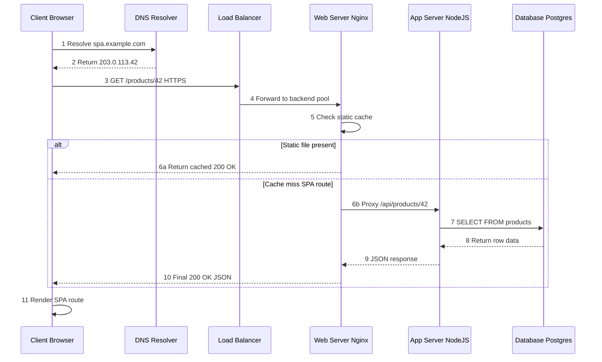
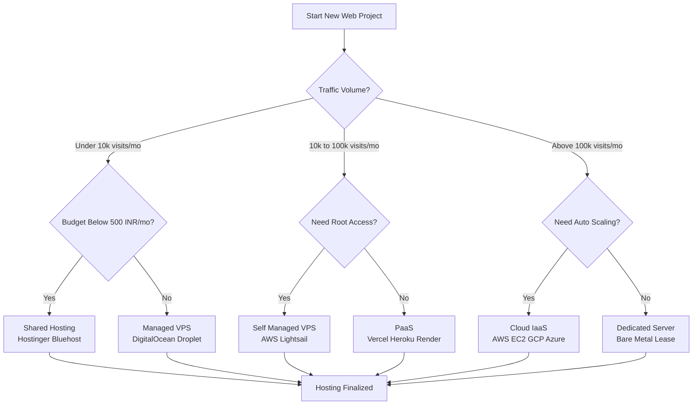
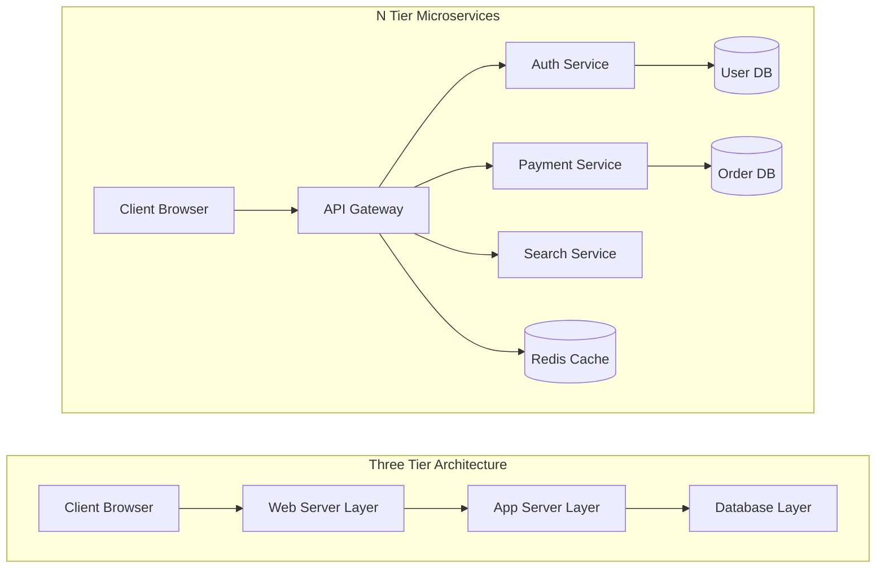

# Web server - hosting options

<!-- SECTION_1_START -->
# Web Server & Hosting Options — Core Foundations

## 1.1 Formal Academic Definition

> [!IMPORTANT]
> **Web Server (KTU 2024 Syllabus Definition):**
> A *web server* is a software application (or a dedicated hardware system) that processes incoming **HTTP/HTTPS** requests from client agents (browsers, mobile apps, SPAs) and returns the corresponding response — typically an **HTML document, JSON payload, CSS stylesheet, JavaScript file, image asset, or a 200/4xx/5xx status code** — over the public internet or an intranet using the **TCP/IP** protocol stack (default port **80** for HTTP, **443** for HTTPS).

> [!NOTE]
> **Hosting Option (KTU 2024 Definition):**
> A *hosting option* refers to the **infrastructure model and service tier** used to physically or virtually deploy a web application so that it remains accessible **24×7×365** to end-users with acceptable **uptime (≥ 99.9 %)**, throughput, latency, and security guarantees.

### Common Web Server Software (KTU High-Yield)

| Server | Type | License | Default Port |
| :--- | :--- | :--- | :--- |
| **Apache HTTPD** | Open Source | Apache 2.0 | 80 / 443 |
| **Nginx** | Open Source | BSD-2 | 80 / 443 |
| **Microsoft IIS** | Proprietary | Commercial | 80 / 443 |
| **LiteSpeed** | Proprietary | Commercial | 80 / 443 |
| **Caddy** | Open Source | Apache 2.0 | 80 / 443 |

> [!TIP]
> **Mnemonic for KTU Viva:** *"**A**pache **N**ginx **I**IS **L**iteSpeed **C**addy"* → **ANILC** → *"Anil Chettan"* (a relatable KTU student-friendly hook 😉).

---

## 1.2 Conceptual Analogy — "The Restaurant Kitchen"

Imagine a web server as a **restaurant kitchen** and the **hosting option** as the **type of restaurant building**:

* **Client (Browser)** = The hungry customer who walks in and places an order (HTTP request).
* **Web Server Software (Nginx/Apache)** = The head chef who receives the order ticket, validates it, and decides what to cook.
* **Static Content (HTML, CSS, images)** = Pre-cooked dishes kept in the warmer — served instantly.
* **Dynamic Content / SPA Bundle** = Dishes cooked-to-order by the chef using the recipe book (server-side logic / API).
* **Hosting Option** = The *building*: a roadside stall (**shared hosting**), a rented kitchen with your own oven (**VPS**), or your own private restaurant (**dedicated/cloud**).

> [!IMPORTANT]
> **GeoGebra / Desmos Integration (Bandwidth–Latency Visualization):**
> Since this topic is engineering-system-oriented, the mathematical relationship governing hosting performance is the **bandwidth–transfer time** model:
>
> $$T_{transfer} = \frac{D}{R_{eff}}$$
>
> where $D$ is the payload size in **megabytes (MB)** and $R_{eff}$ is the *effective throughput* in **megabits per second (Mbps)**.
>
> **Visual Description:** On a 2D Cartesian plane, plot the transfer time $T$ (Y-axis) against file size $D$ (X-axis) for three different hosting tiers — *Shared (5 Mbps)*, *VPS (100 Mbps)*, *Dedicated/Cloud (1000 Mbps)*. Students will observe that the **slope** $\frac{1}{R_{eff}}$ shrinks dramatically as we move up the hosting tiers, demonstrating why SPAs with large JS bundles (e.g., 2 MB) suffer on shared hosting.

---

## 1.3 Core Terminology Checklist (KTU Board-Favourite)

> [!NOTE]
> **Must-Know Vocabulary for KTU 2024 ESE:**
> * **HTTP** — HyperText Transfer Protocol (request/response, stateless)
> * **HTTPS** — HTTP + TLS/SSL encryption
> * **DNS** — Domain Name System (resolves `ktu.edu.in` → `203.0.113.42`)
> * **IP Address** — IPv4 (32-bit) / IPv6 (128-bit) logical address
> * **Port** — Logical channel (HTTP=80, HTTPS=443, SSH=22)
> * **Uptime SLA** — Service Level Agreement (e.g., 99.9 % = ~8.7 hrs downtime/year)
> * **TTFB** — Time To First Byte
> * **CDN** — Content Delivery Network
> * **Reverse Proxy** — Intermediary server (Nginx in front of Node.js)
> * **Reverse Shell** — A backdoor (security context)

<!-- SECTION_1_END -->

<!-- SECTION_2_START -->
# Deep Theoretical Analysis & KTU High-Yield Formula Sheet

## 2.1 How a Web Server Works — The Request-Response Lifecycle

A web server operates on a precise **stateless request-response model** governed by **RFC 7230 – RFC 7235** (HTTP/1.1) and **RFC 9110** (HTTP Semantics, 2022).

**Step-by-step operational logic:**

1. **DNS Resolution** — Browser queries DNS to map the hostname (e.g., `spa.example.com`) to an IP address.
2. **TCP Three-Way Handshake** — `SYN → SYN-ACK → ACK` establishes a reliable connection.
3. **TLS Handshake** (for HTTPS) — Negotiates encryption via certificates (Let's Encrypt / CA-signed).
4. **HTTP Request Sent** — Browser sends `GET /index.html HTTP/1.1` with headers (`Host`, `User-Agent`, `Accept`, `Cookie`).
5. **Server Processing** —
   * **Static file** → read from disk → return 200 OK with file bytes.
   * **Dynamic / SPA** → hand off to backend (Node.js, Python, PHP) → render → return response.
6. **HTTP Response Sent** — `200 OK`, `Content-Type: text/html`, body payload.
7. **Connection Handling** — HTTP/1.1 keeps connection alive; HTTP/2 multiplexes; HTTP/3 uses QUIC over UDP.
8. **Logging & Monitoring** — Server writes access/error logs (`/var/log/nginx/access.log`).

> [!TIP]
> **Production Insight:** Modern SPAs (React, Angular, Vue) are typically served as **static bundles** from a CDN, with backend logic exposed as **REST/GraphQL APIs** behind a reverse proxy. The web server's job reduces to *efficiently delivering the SPA shell + assets*.

---

## 2.2 Hosting Options — Comprehensive KTU Comparison Matrix

> [!WARNING]
> **KTU Examiner Pattern:** Almost every Module 4 question paper contains a **compare-and-contrast** question between hosting types. Master this table cold.

| Feature | Shared Hosting | VPS Hosting | Dedicated Server | Cloud Hosting (IaaS) | PaaS (Heroku/Vercel) | Serverless |
| :--- | :--- | :--- | :--- | :--- | :--- | :--- |
| **Cost (INR/mo)** | ₹100 – ₹500 | ₹500 – ₹3000 | ₹5000 – ₹25000 | Pay-per-use | Free–₹2000 | Pay-per-invocation |
| **Resource Isolation** | None (shared kernel) | Partial (VirtIO/KVM) | Full (bare metal) | Logical (hypervisor) | Logical (container) | Logical (function) |
| **Scalability** | Manual / None | Vertical only | Vertical only | Auto (horizontal) | Auto (dyno) | Infinite (auto) |
| **Performance** | Low | Medium | High | Very High | High | Variable (cold start) |
| **Control (Root Access)** | ❌ No | ✅ Yes | ✅ Full | ✅ Yes | ❌ Limited | ❌ No |
| **Security** | Lowest | Medium | Highest | High | High | Vendor-managed |
| **Best For** | Personal blogs, learning | Small business apps | Enterprise apps | SPAs, APIs, ML | Startups, prototypes | Event-driven APIs |
| **Example Providers** | Hostinger, Bluehost | DigitalOcean, Linode | IBM, Dell bare metal | AWS EC2, GCP, Azure | Heroku, Vercel, Render | AWS Lambda, Vercel Functions |
| **Uptime SLA** | 99.0 – 99.5 % | 99.9 % | 99.95 % | 99.99 % | 99.95 % | 99.95 % |

### Key Formulas (KTU 2024 Quantitative Section)

| Symbol | Formula | Unit | Meaning |
| :--- | :--- | :--- | :--- |
| $T_{transfer}$ | $T_{transfer} = \dfrac{D}{R_{eff}}$ | seconds | Data transfer time |
| $T_{total}$ | $T_{total} = T_{DNS} + T_{TCP} + T_{TLS} + T_{TTFB} + T_{transfer}$ | seconds | End-to-end page load |
| $N_{requests}$ | $N_{requests} = \dfrac{T_{budget}}{T_{avg}}$ | requests/sec | Throughput per server |
| $R_{eff}$ | $R_{eff} = \dfrac{R_{link}}{N_{users}}$ | Mbps/user | Bandwidth per user |
| $A_{uptime}$ | $A_{uptime} = \dfrac{T_{up}}{T_{up} + T_{down}} \times 100$ | percent | Availability % |
| $C_{cloud}$ | $C_{cloud} = (N_{vm} \times P_{hour}) + D_{storage} + D_{egress}$ | INR/month | Monthly cloud cost |

> [!NOTE]
> **Real-World Engineering Utility:** A startup founder in Kerala launching a *Swiggy-clone SPA* would begin on **Vercel (PaaS)** for the React frontend + **AWS Lambda (Serverless)** for the order API + **Cloudflare CDN** for static assets. As MAU (Monthly Active Users) crosses **100k**, migration to **AWS ECS / Kubernetes** becomes cost-effective. This *progressive scaling* pattern is the KTU board's favourite case study.

---

## 2.3 Web Server Architecture Patterns

### A. Single-Tier (All-in-One)
> HTML, CSS, JS, DB, app logic — all on one machine. *Example:* PHP beginner hosting on `localhost`.

### B. Two-Tier (Client + Server)
> Browser talks to web server, which talks to DB. *Example:* `XAMPP` stack with `phpMyAdmin`.

### C. Three-Tier (Presentation + Logic + Data)
> Web server (presentation) + App server (logic) + DB server (data). *Example:* React SPA + Node.js API + PostgreSQL.

### D. N-Tier / Microservices (Modern SPA Architecture)
> Each feature (auth, payment, search) is its own service behind an API Gateway + Load Balancer.

> [!IMPORTANT]
> **KTU Board Favourite Question:** *"Differentiate between three-tier and N-tier architecture with a suitable diagram."* Always mention **API Gateway** and **Load Balancer** as differentiators.

<!-- SECTION_2_END -->

<!-- SECTION_3_START -->
# Step-by-Step Code & Configuration Implementation

## 3.1 Example 1 — Minimal Python Web Server (Foundation Demo)

> [!NOTE]
> **Python Code Block:** Demonstrates the absolute minimum web server using Python's built-in `http.server` module. KTU lab favourite.

```python
# File: server_demo.py
# Author: KTU 2024 Scheme Student
# Purpose: Demonstrate core HTTP request-response cycle

import http.server
import socketserver
import json
import logging
from datetime import datetime

# Configure structured logging
logging.basicConfig(
    level=logging.INFO,
    format="%(asctime)s [%(levelname)s] %(message)s"
)
logger = logging.getLogger("KTU-WebServer")


class KTUSpaHandler(http.server.BaseHTTPRequestHandler):
    """
    Custom handler for a Single Page Application (SPA).
    Serves index.html for any unmatched route (SPA fallback).
    """

    # MIME type mapping (KTU board expects this knowledge)
    MIME_TYPES: dict[str, str] = {
        ".html": "text/html",
        ".css":  "text/css",
        ".js":   "application/javascript",
        ".json": "application/json",
        ".png":  "image/png",
        ".svg":  "image/svg+xml",
    }

    def do_GET(self) -> None:  # type: ignore[override]
        """Handle all incoming GET requests."""
        try:
            logger.info(f"Incoming GET request for path: {self.path}")

            # ---- Route 1: API endpoint ----
            if self.path == "/api/health":
                payload: dict[str, object] = {
                    "status": "ok",
                    "timestamp": datetime.utcnow().isoformat(),
                    "ktu_scheme": "2024",
                    "server": "python-http.server"
                }
                body: bytes = json.dumps(payload).encode("utf-8")
                self.send_response(200)
                self.send_header("Content-Type", "application/json")
                self.send_header("Content-Length", str(len(body)))
                self.send_header("Access-Control-Allow-Origin", "*")
                self.end_headers()
                self.wfile.write(body)
                return

            # ---- Route 2: SPA fallback (serve index.html for all unknown paths) ----
            # In production, Nginx/Apache would handle this via try_files.
            if self.path == "/" or not "." in self.path.split("/")[-1]:
                self.path = "/index.html"

            # ---- Static file serving (illustrative) ----
            # Real production uses Nginx for static files.
            try:
                with open(f"./public{self.path}", "rb") as f:
                    body = f.read()
                self.send_response(200)
                ext: str = "." + self.path.split(".")[-1]
                self.send_header("Content-Type", self.MIME_TYPES.get(ext, "application/octet-stream"))
                self.send_header("Content-Length", str(len(body)))
                self.end_headers()
                self.wfile.write(body)
            except FileNotFoundError:
                self.send_error(404, "KTU Resource Not Found")

        except Exception as e:
            logger.error(f"Unhandled exception: {e}")
            self.send_error(500, "Internal Server Error")

    # Override log_message to use our logger
    def log_message(self, format: str, *args: object) -> None:
        logger.info(f"{self.address_string()} - {format % args}")


# ---- Server bootstrap with absolute boundary checks ----
PORT: int = 8080
HOST: str = "0.0.0.0"

if __name__ == "__main__":
    # Reuse address to avoid "Address already in use" on restart
    socketserver.TCPServer.allow_reuse_address = True
    with socketserver.TCPServer((HOST, PORT), KTUSpaHandler) as httpd:
        logger.info(f"KTU Web Server listening on http://{HOST}:{PORT}")
        try:
            httpd.serve_forever()
        except KeyboardInterrupt:
            logger.info("Shutting down gracefully (Ctrl+C).")
            httpd.server_close()
```

**Execution Steps (KTU Lab Record):**
1. Create folder structure: `mkdir ktu-web && cd ktu-web && mkdir public`
2. Save the above as `server_demo.py`.
3. Create `public/index.html` with a `<h1>KTU Web Programming</h1>`.
4. Run: `python3 server_demo.py`
5. Test: open browser → `http://localhost:8080/` and `http://localhost:8080/api/health`.

---

## 3.2 Example 2 — Nginx Configuration for an SPA (Production-Grade)

> [!IMPORTANT]
> **KTU Practical Expectation:** Students should be able to write a working **Nginx server block** with SPA fallback routing and gzip compression.

```nginx
# /etc/nginx/sites-available/spa.conf
# KTU 2024 - Web Server Configuration for React/Angular/Vue SPA

server {
    listen 80;
    listen [::]:80;
    server_name spa.ktu.edu.in;

    # Redirect HTTP -> HTTPS (best practice)
    return 301 https://$host$request_uri;
}

server {
    listen 443 ssl http2;
    listen [::]:443 ssl http2;
    server_name spa.ktu.edu.in;

    # ---- TLS Configuration (Let's Encrypt paths) ----
    ssl_certificate     /etc/letsencrypt/live/spa.ktu.edu.in/fullchain.pem;
    ssl_certificate_key /etc/letsencrypt/live/spa.ktu.edu.in/privkey.pem;
    ssl_protocols       TLSv1.2 TLSv1.3;
    ssl_ciphers         HIGH:!aNULL:!MD5;

    # ---- Root directory of the built SPA bundle ----
    root /var/www/spa/dist;
    index index.html;

    # ---- Gzip compression for text-based assets ----
    gzip on;
    gzip_vary on;
    gzip_min_length 1024;
    gzip_types text/plain text/css application/json application/javascript text/xml application/xml;

    # ---- Security Headers ----
    add_header X-Frame-Options "SAMEORIGIN" always;
    add_header X-Content-Type-Options "nosniff" always;
    add_header X-XSS-Protection "1; mode=block" always;
    add_header Referrer-Policy "strict-origin-when-cross-origin" always;

    # ---- Static asset caching (1 year for fingerprinted bundles) ----
    location ~* \.(js|css|png|jpg|jpeg|gif|ico|svg|woff2?)$ {
        expires 1y;
        add_header Cache-Control "public, immutable";
        try_files $uri =404;
    }

    # ---- SPA fallback: serve index.html for any unknown route ----
    # This is THE critical rule for client-side routing (React Router / Vue Router)
    location / {
        try_files $uri $uri/ /index.html;
    }

    # ---- Reverse proxy for backend API ----
    location /api/ {
        proxy_pass         http://127.0.0.1:3000/;
        proxy_http_version 1.1;
        proxy_set_header   Host              $host;
        proxy_set_header   X-Real-IP         $remote_addr;
        proxy_set_header   X-Forwarded-For   $proxy_add_x_forwarded_for;
        proxy_set_header   X-Forwarded-Proto $scheme;
        proxy_read_timeout 60s;
    }

    # ---- Custom error pages ----
    error_page 404 /index.html;   # SPAs handle 404 client-side
    error_page 500 502 503 504 /50x.html;
    location = /50x.html {
        root /usr/share/nginx/html;
    }
}
```

**Explanation of Critical Lines:**

* `try_files $uri $uri/ /index.html;` — This is the **SPA fallback**. If the user visits `/products/42` and no such file exists on disk, Nginx serves `index.html`, and the SPA's client-side router takes over. **Omitting this line is the #1 reason student SPAs fail in production.**
* `proxy_pass http://127.0.0.1:3000/;` — Forwards `/api/*` to a Node.js/Express backend running on port 3000.
* `expires 1y; add_header Cache-Control "public, immutable";` — Tells the browser to cache fingerprinted assets for one year.

---

## 3.3 Example 3 — Apache `.htaccess` Equivalent (Shared Hosting Context)

```apache
# /var/www/spa/.htaccess
# KTU 2024 - Apache rewrite rules for SPA hosting on shared hosting

<IfModule mod_rewrite.c>
    RewriteEngine On
    RewriteBase /

    # Don't rewrite real files or directories
    RewriteCond %{REQUEST_FILENAME} !-f
    RewriteCond %{REQUEST_FILENAME} !-d

    # SPA fallback -> index.html
    RewriteRule ^.*$ /index.html [L]
</IfModule>

# Enable gzip
<IfModule mod_deflate.c>
    AddOutputFilterByType DEFLATE text/html text/css application/javascript application/json
</IfModule>

# Security headers
<IfModule mod_headers.c>
    Header set X-Frame-Options "SAMEORIGIN"
    Header set X-Content-Type-Options "nosniff"
</IfModule>
```

> [!TIP]
> **Why `.htaccess` matters in KTU viva:** Shared hosting customers (e.g., Hostinger, GoDaddy) *do not* allow editing the main Apache config. The only way to enable SPA routing is via `.htaccess`. This is a classic viva question.

---

## 3.4 Numerical Problem — KTU Board Style (Step-by-Step Solution)

> [!NOTE]
> **Question:** A KTU startup serves a 3 MB SPA bundle. The shared hosting link provides 8 Mbps, VPS provides 200 Mbps, and Cloud provides 1 Gbps. Calculate transfer time for each tier.

**Given:**
$$D = 3 \text{ MB} = 3 \times 8 = 24 \text{ Mb}$$

**Tier 1 — Shared Hosting ($R_{eff} = 8$ Mbps):**
$$T_1 = \frac{D}{R_{eff}} = \frac{24 \text{ Mb}}{8 \text{ Mbps}} = 3.00 \text{ seconds}$$

**Tier 2 — VPS ($R_{eff} = 200$ Mbps):**
$$T_2 = \frac{24 \text{ Mb}}{200 \text{ Mbps}} = 0.12 \text{ seconds}$$

**Tier 3 — Cloud ($R_{eff} = 1000$ Mbps):**
$$T_3 = \frac{24 \text{ Mb}}{1000 \text{ Mbps}} = 0.024 \text{ seconds}$$

**Conclusion:**
$$\frac{T_1}{T_3} = \frac{3.000}{0.024} = 125\times$$

> The cloud tier is **125× faster** than shared hosting for this payload. For an SPA targeting a **3-second load-time budget** (Google's Core Web Vitals threshold), only VPS or Cloud tiers are viable. **[Valuation Tip: 1 mark for unit conversion, 2 marks for each tier, 1 mark for comparative conclusion.]**

<!-- SECTION_3_END -->

<!-- SECTION_4_START -->
# Structural Diagrams & Schematics

## 4.1 The Web Server Request-Response Cycle

> [!NOTE]
> **Diagram Type:** Mermaid sequence diagram (safe syntax — no special characters inside node labels).



**Diagram Reading Guide (for KTU viva):**
* **Steps 1–2** → DNS resolution ($T_{DNS}$).
* **Steps 3–4** → TLS + reverse proxy ($T_{TLS} + T_{proxy}$).
* **Steps 5–10** → Server-side processing ($T_{TTFB} + T_{transfer}$).
* **Step 11** → Browser-side rendering (DOM paint).

---

## 4.2 Hosting Option Decision Flowchart



> [!IMPORTANT]
> **KTU Examiner Pattern:** A question like *"Suggest a suitable hosting option for a KTU student project portal handling 50,000 daily visits with limited budget"* → answer flow: **Traffic 50k → Need Root Access? Yes → Self-Managed VPS on AWS Lightsail (~$3.50/month)**.

---

## 4.3 Three-Tier vs N-Tier Architecture (Block Diagram)



**Key Differences (Board-friendly phrasing):**
* Three-tier = **monolithic** backend; N-tier = **microservices** + **API Gateway**.
* Three-tier scaling = vertical (bigger box); N-tier scaling = horizontal (more boxes).
* SPAs almost always deploy on N-tier (or fully serverless equivalent).

<!-- SECTION_4_END -->

<!-- SECTION_5_START -->
# KTU 2024 Scheme Examination Question Bank & Topic Recap

---

## Part A — Short Answer Questions (2 × 3 Marks)

### Question A1 `[KTU University Exam - July 2024]`
> **CO1 | Remember**
> *"Define the term Web Server. List any four popular web server software with their default port numbers."* **[3 Marks]**

**Model Answer (Board Key):**
A *web server* is a program that uses **HTTP/HTTPS** to serve web documents (HTML, CSS, JS, images) to clients over the internet.
* **Apache HTTPD** — Port **80/443** — Open Source
* **Nginx** — Port **80/443** — Open Source, high-performance
* **Microsoft IIS** — Port **80/443** — Windows-integrated
* **Caddy** — Port **80/443** — Auto-HTTPS via Let's Encrypt

> **[Valuation Key: 1 mark for definition, 2 marks for any 4 servers with ports.]**

---

### Question A2 `[KTU University Exam - Dec 2023]`
> **CO2 | Understand**
> *"Differentiate between Shared Hosting and VPS Hosting in four points."* **[3 Marks]**

**Model Answer (Board Key):**
* **Shared Hosting** — Multiple websites share the **same physical server and OS resources**; **no root access**; lowest cost; suited for personal blogs.
* **VPS Hosting** — A single physical server is **virtualized via hypervisor (KVM/Xen)** into isolated VMs; **root access** granted; medium cost; suited for small business apps.
* **Performance** — Shared is throttled by neighbours; VPS has **guaranteed CPU/RAM slices**.
* **Scalability** — Shared = none; VPS = vertical scaling (resize droplet).

> **[Valuation Key: 0.75 mark per correct differentiating point × 4 points.]**

---

## Part B — Long Answer Questions (Module Internal Choice Pattern)

### Question B — Choice A `[KTU University Exam - July 2024]`
> **CO2 + CO3 | Understand + Apply**
> **Part (a)** — *"Explain the different types of web hosting options available for deploying a SPA, with their pros and cons."* **[7 Marks]**
> **Part (b)** — *"Write a complete Nginx server block configuration to deploy a React SPA with API proxying to a Node.js backend running on port 3000. Mention the importance of the SPA fallback rule."* **[7 Marks]**

#### Model Solution — Part (a) **[7 Marks]**

**[Stating the 5 hosting categories: 1 Mark]**
The five main hosting options for SPA deployment are:
1. Shared Hosting
2. VPS Hosting
3. Dedicated Server Hosting
4. Cloud Hosting (IaaS)
5. PaaS / Serverless

**[Shared Hosting: 1.5 Marks]**
* *Definition:* Multiple websites hosted on a single physical server sharing CPU, RAM, and OS.
* *Pros:* Cheapest (₹100–₹500/month), beginner-friendly, managed by provider.
* *Cons:* No root access, performance throttled by "noisy neighbours", poor for high traffic.

**[VPS Hosting: 1.5 Marks]**
* *Definition:* Virtual Private Server — a hypervisor slices one physical server into isolated VMs.
* *Pros:* Root access, guaranteed resources, vertical scalability.
* *Cons:* Requires Linux/sysadmin skills, more expensive (~₹500–₹3000/month).

**[Cloud Hosting (IaaS): 1.5 Marks]**
* *Definition:* Virtual machines provisioned on-demand from a global pool (AWS EC2, GCP Compute Engine).
* *Pros:* Pay-per-use, auto-scaling, 99.99 % SLA, global regions.
* *Cons:* Cost can spiral without monitoring; steeper learning curve.

**[PaaS / Serverless: 1.5 Marks]**
* *Definition:* Platform-as-a-Service (Vercel, Heroku) or Function-as-a-Service (AWS Lambda) abstracts server management.
* *Pros:* Zero ops, instant CI/CD, ideal for SPAs.
* *Cons:* Cold-start latency on serverless; vendor lock-in.

#### Model Solution — Part (b) **[7 Marks]**

**[Writing a syntactically valid Nginx server block: 3 Marks]**
```nginx
server {
    listen 80;
    server_name react.ktu.edu.in;
    root /var/www/react-spa/dist;
    index index.html;

    location /api/ {
        proxy_pass http://127.0.0.1:3000/;
        proxy_set_header Host $host;
        proxy_set_header X-Real-IP $remote_addr;
    }
}
```

**[Stating the SPA fallback rule: 2 Marks]**
* Inside `location / { ... }`, add the directive:
  ```nginx
  try_files $uri $uri/ /index.html;
  ```
* **Importance:** Client-side routers (React Router, Vue Router) handle navigation inside the browser. When a user visits `/products/42`, no such file exists on disk — Nginx must fall back to `index.html` so the SPA can render the route. Without this, a **404 error** is returned, and the SPA breaks.

**[Stating why port 3000 reverse proxy: 1 Mark]**
* The Node.js app listens on `127.0.0.1:3000` (localhost only, for security). Nginx exposes it publicly on port 80/443 via `proxy_pass`.

**[Adding security headers: 1 Mark]**
* `add_header X-Frame-Options "SAMEORIGIN";` and `add_header X-Content-Type-Options "nosniff";` — protects against clickjacking and MIME sniffing attacks.

> [!WARNING]
> **KTU Examiner's Valuation Warning — Pitfall Alert:**
> 1. **Do NOT** forget the `try_files $uri $uri/ /index.html;` line — it is the *single most important* line for SPA hosting. Examiners deduct 2 marks for its absence.
> 2. **Do NOT** use `proxy_pass http://127.0.0.1:3000;` with a trailing slash mismatch — `http://127.0.0.1:3000/` and `http://127.0.0.1:3000` behave differently for rewrite paths.
> 3. **Always** include `proxy_set_header Host $host;` — otherwise the backend receives `127.0.0.1:3000` as the host and may reject CORS requests.

---

### Question B — Choice B `[KTU University Exam - Dec 2023]`
> **CO3 + CO4 | Apply + Analyze**
> **Part (a)** — *"A KTU student project portal serves a 4 MB static SPA bundle. The hosting tier provides a link speed of 50 Mbps. Calculate the transfer time. If the budget allows upgrading to 200 Mbps, what is the new transfer time and percentage improvement?"* **[7 Marks]**
> **Part (b)** — *"Compare Apache HTTPD and Nginx web servers across five engineering criteria. Justify which is better for serving a high-traffic SPA."* **[7 Marks]**

#### Model Solution — Part (a) **[7 Marks]**

**[Stating the formula: 1 Mark]**
$$T_{transfer} = \frac{D}{R_{eff}}$$

**[Unit conversion: 1 Mark]**
$$D = 4 \text{ MB} = 4 \times 8 = 32 \text{ Mb}$$

**[Tier 1 calculation (50 Mbps): 2 Marks]**
$$T_1 = \frac{32 \text{ Mb}}{50 \text{ Mbps}} = 0.64 \text{ seconds}$$

**[Tier 2 calculation (200 Mbps): 2 Marks]**
$$T_2 = \frac{32 \text{ Mb}}{200 \text{ Mbps}} = 0.16 \text{ seconds}$$

**[Percentage improvement: 1 Mark]**
$$\text{Improvement} = \frac{T_1 - T_2}{T_1} \times 100 = \frac{0.64 - 0.16}{0.64} \times 100 = 75\%$$

> **[Final simplified answer: 1 Mark]** — *"Transfer time reduces from 0.64 s to 0.16 s, a 75 % improvement."*

#### Model Solution — Part (b) **[7 Marks]**

**[Comparison Table: 5 Marks]**

| Criterion | Apache HTTPD | Nginx |
| :--- | :--- | :--- |
| **Architecture** | Process-driven (one thread per connection) | Event-driven, asynchronous (single thread) |
| **Static File Performance** | Slower under 10k+ concurrent connections | Up to **10× faster** for static assets |
| **Memory Footprint** | ~20–50 MB base | ~2–5 MB base |
| **Configuration Style** | `.htaccess` allowed per-directory (flexible) | Centralized `nginx.conf` (faster, no per-dir scan) |
| **Module Ecosystem** | Massive (mod_php, mod_ssl, mod_rewrite) | Smaller but curated (Lua scripting via OpenResty) |
| **Dynamic Content** | Excellent (PHP, Python via modules) | Passes to backend (proxy_pass) — not processed directly |
| **Use Case Fit** | Shared hosting, legacy apps, .htaccess-heavy sites | SPAs, reverse proxy, high-traffic, microservices |

**[Justification: 2 Marks]**
* For a **high-traffic SPA**, **Nginx is the recommended choice** because:
  1. SPAs are predominantly **static assets** (HTML shell, JS bundle, CSS, images) — Nginx's event-driven architecture serves these with minimal memory and maximum concurrency.
  2. Nginx's **reverse-proxy role** is essential for forwarding `/api/*` requests to Node.js / Python / Go backends.
  3. Built-in **gzip** and **brotli** compression reduces SPA bundle transfer time.
  4. Apache remains useful when the application needs **`.htaccess` flexibility** (e.g., shared hosting where root access is unavailable).

> [!WARNING]
> **KTU Examiner's Valuation Warning — Pitfall Alert:**
> 1. **Do NOT** mix up MB and Mb — the factor of **8** is the most common numerical mistake. Examiners deduct 1 mark for unit confusion.
> 2. **Do NOT** use the wrong formula in part (a). The standard form is $T = D / R$.
> 3. **In part (b)**, do NOT write a one-sided opinion. Always present *both* servers' strengths. A balanced answer scores higher than a biased one.

---

## Topic Recap & Important Things to Remember

> [!IMPORTANT]
> **🚀 KTU 2024 Module 4 — Web Server & Hosting Options: Rapid-Revision Checklist**

* **Web Server Definition** → Software/hardware serving HTTP/HTTPS on port **80/443**.
* **Top 4 Servers** → Apache, Nginx, IIS, Caddy (Mnemonic: **ANILC**).
* **HTTP vs HTTPS** → HTTPS = HTTP + TLS encryption; required for PWAs and modern browsers.
* **5 Hosting Tiers (in increasing capability)** → Shared < VPS < Dedicated < Cloud (IaaS) < Serverless.
* **Key Formula** → $T_{transfer} = \dfrac{D}{R_{eff}}$ (always convert MB → Mb by ×8).
* **Cost of Cloud** → $C_{cloud} = N_{vm} \times P_{hour} + D_{storage} + D_{egress}$.
* **SPA Fallback Rule** → `try_files $uri $uri/ /index.html;` (Nginx) or `RewriteRule ^.*$ /index.html [L]` (Apache `.htaccess`). **#1 cause of broken SPAs in production!**
* **Reverse Proxy Pattern** → `proxy_pass http://127.0.0.1:3000/;` — frontend on Nginx (80/443), backend on localhost (3000).
* **Three-Tier vs N-Tier** → Three-tier monolithic; N-tier microservices with API Gateway.
* **Security Headers (must include in production)** → `X-Frame-Options`, `X-Content-Type-Options`, `Referrer-Policy`, `Strict-Transport-Security`.
* **TTFB Budget** → Google recommends < 600 ms; Cloudflare CDN helps achieve this globally.
* **Static Asset Caching** → Fingerprinted bundles (e.g., `app.a1b2c3.js`) cached for **1 year** with `Cache-Control: public, immutable`.
* **SPAs almost always deploy as static bundles** → Vercel, Netlify, AWS S3 + CloudFront, GitHub Pages.
* **Why Nginx over Apache for SPAs** → Event-driven, lower memory, faster static serving, native reverse-proxy.
* **Default Document Root** → `/var/www/html` (Apache), `/usr/share/nginx/html` (Nginx).
* **Always remember** → $1 \text{ MB} = 8 \text{ Mb}$ and $1 \text{ Gbps} = 1000 \text{ Mbps}$.

> **🎯 KTU Board Mantra:** *"If the question mentions SPA, the answer MUST contain the word `try_files` (or `index.html` fallback). If it doesn't, the answer is incomplete."*

<!-- SECTION_5_END -->
