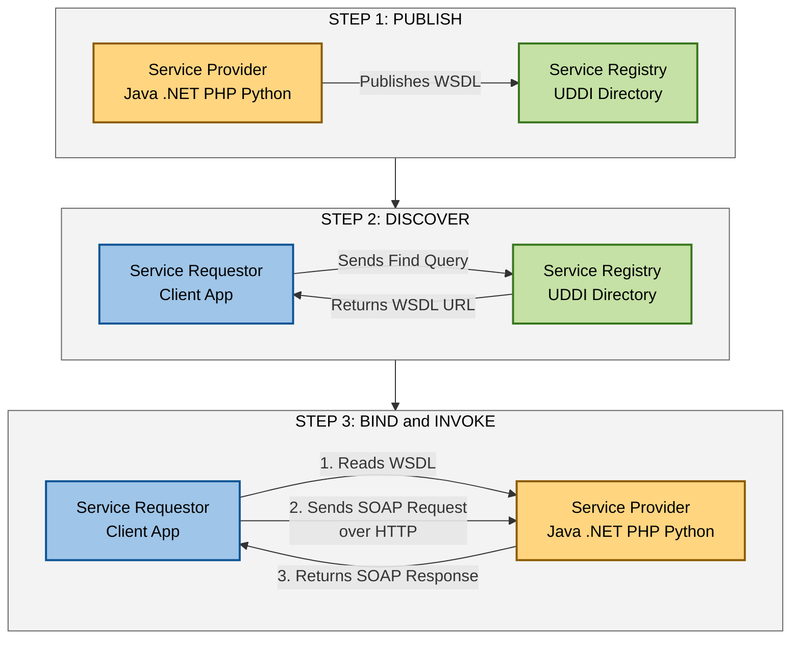
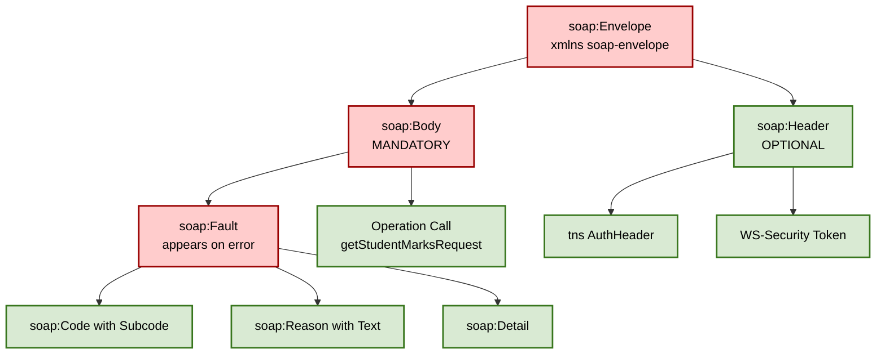
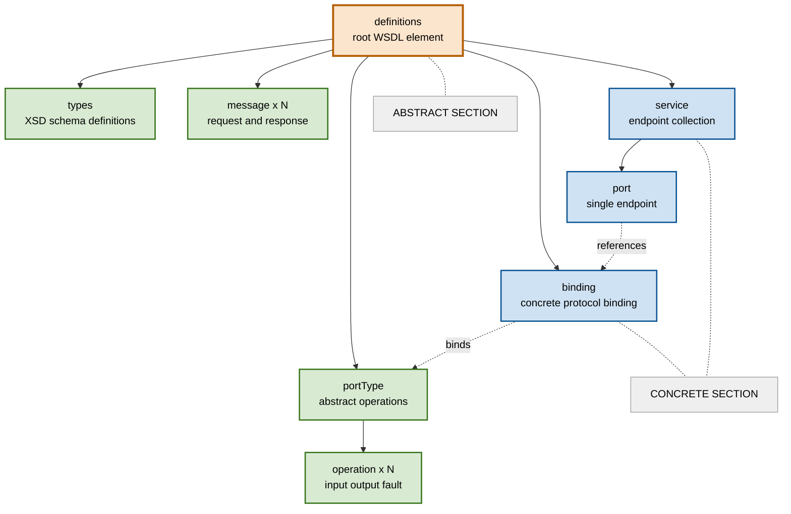
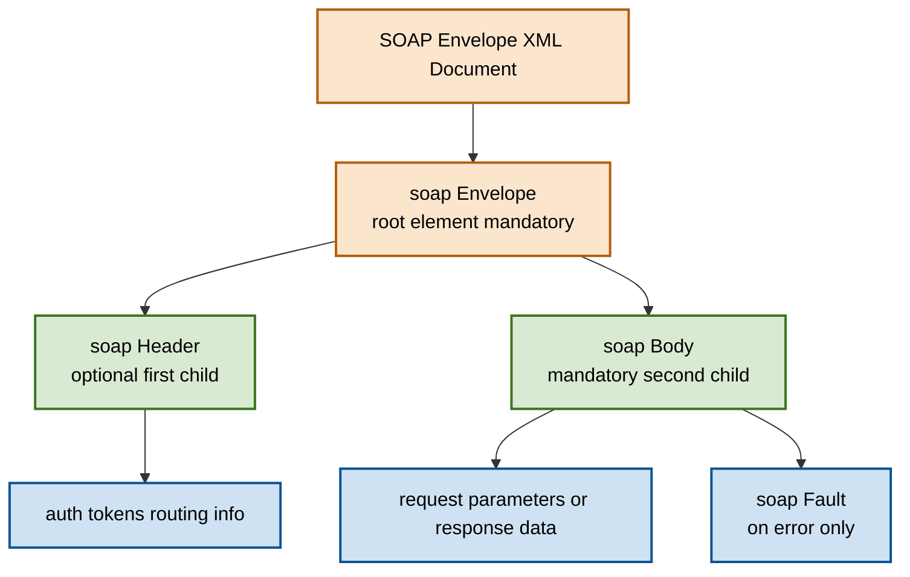
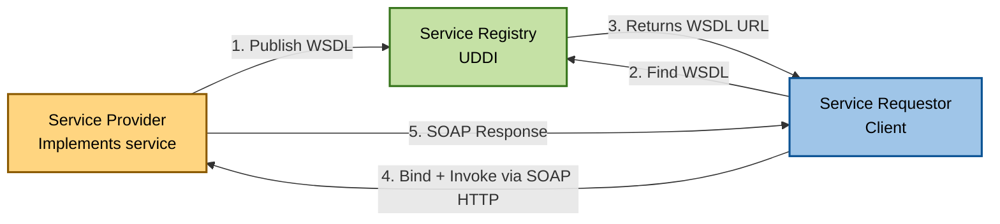

# Web services   - Overview of Web Services - SOAP Services

<!-- SECTION_1_START -->
# 1. Core Technical Definition & Intuitive Overview

## 1.1 Web Services — Formal Academic Definition

> [!NOTE]
> **W3C Standard Definition (KTU Board-Exam Standard)**
> A **Web Service** is a software system designed to support **interoperable, machine-to-machine interaction** over a network. It possesses an interface described in a machine-processable format (specifically **WSDL**). Other systems interact with the web service using **SOAP messages** (typically conveyed using **HTTP** with an **XML** serialization) in a manner prescribed by its interface description.

In the context of the **KTU 2024 Scheme (OECST832 — Web Programming)**, web services are classified as the **backbone of Service-Oriented Architecture (SOA)**, enabling distributed, loosely coupled, platform-independent communication between heterogeneous applications written in different languages and running on different operating systems.

### 1.1.1 The Three Pillars of Web Services

A web service stack is built upon **three foundational XML-based technologies** (often called the *Web Services Protocol Stack*):

| Layer | Protocol | Full Form | Role |
|:---:|:---:|:---|:---|
| **Service Description** | **WSDL** | Web Services Description Language | Describes *what* the service does and *how* to invoke it. |
| **Service Communication** | **SOAP** | Simple Object Access Protocol | Defines the *message format* exchanged between client and server. |
| **Service Discovery** | **UDDI** | Universal Description, Discovery, and Integration | Acts as a *directory* (yellow pages) to publish and find services. |

> [!IMPORTANT]
> **KTU Syllabus Highlight (Module 4):** SOAP is a **mandatory** topic. Students must memorize the **SOAP message envelope structure (Envelope → Header → Body → Fault)** and the **WSDL document structure** for board examinations. UDDI is mentioned for completeness but is less emphasized in current KTU question papers.

---

## 1.2 Conceptual Analogy / Intuition

Imagine a **restaurant in a foreign country** where neither you nor the staff speak each other's language.

- **The Menu (WSDL)** → This is a written, structured document (in a universal pictographic format) that lists every dish available, its ingredients, and exactly how to order it. Even a tourist who cannot speak the local language can look at the menu and know what to ask for.
- **The Order Slip / Message Format (SOAP)** → When you place an order, you write it down on a standardized, pre-printed form. The form has fixed slots — a "header" for table number, a "body" for the actual food items. The kitchen reads the form in a structured way, regardless of who wrote it.
- **The Restaurant Directory (UDDI)** → This is the **Yellow Pages** listing all restaurants in the city, categorized by cuisine and location. You browse it to *discover* a suitable restaurant (service).

> **Key Insight:** Web services work *exactly* like this — **WSDL is the "menu"**, **SOAP is the "order slip"**, and **UDDI is the "yellow pages."** The universal language binding them all is **XML**.

---

## 1.3 Physical Constants, Standards & Metrics

The following **W3C and OASIS standards** govern web services and are **bold-marked** as they are frequently asked in KTU exams:

- **XML 1.0** — Extensible Markup Language, the data carrier.
- **XML Schema (XSD)** — Defines the structure and data types of XML documents.
- **SOAP 1.2** — The current W3C-recommended version (supersedes SOAP 1.1).
- **WSDL 2.0** — The current W3C-recommended version (WSDL 1.1 was the de-facto industry standard).
- **UDDI 3.0.2** — Latest OASIS specification for service registries.
- **HTTP 1.1** — The most common transport protocol binding for SOAP (port **80**); HTTPS uses port **443**.

> [!TIP]
> **Board Tip:** When asked "transport protocols for SOAP", always mention **HTTP, SMTP, FTP, and JMS** (not just HTTP). Examiners award extra credit for knowing that SOAP is **transport-agnostic**.

---

## 1.4 GeoGebra / Desmos Visualization

> [!VISUALIZATION CONTROL]
> **Concept:** Web Service Architecture Triangle (Service Provider – Service Requestor – Service Registry)
> **GeoGebra / Desmos Input (Conceptual Layout):**
> * Point $A = (0, 4)$ labelled `Service Provider`
> * Point $B = (-3, 0)$ labelled `Service Requestor`
> * Point $C = (3, 0)$ labelled `Service Registry (UDDI)`
> * Triangle connecting all three with directed arrows.
> **Visual Description:** An equilateral triangle with three roles at the vertices. The *Service Provider* publishes its WSDL to the *Registry*. The *Requestor* discovers the service via the Registry, fetches the WSDL, and finally communicates directly with the Provider using SOAP over HTTP.

<!-- SECTION_1_END -->

<!-- SECTION_2_START -->
# 2. Deep Theoretical Analysis & KTU High-Yield Formula Sheet

## 2.1 Web Service Architecture — The Three Operational Roles

The **Web Service Architecture (WSA)** defined by W3C is structured around three distinct roles and three primary operations. Understanding this model is **critical** for any 7 or 14-mark KTU question.

### 2.1.1 The Three Roles

1. **Service Provider (Server)**
   - Hosts the web service implementation.
   - Defines and publishes the service description (**WSDL**) so that requestors can understand how to use it.
   - Listens for incoming **SOAP** messages at a network endpoint.

2. **Service Requestor (Client)**
   - A program, application, or another web service that consumes the functionality.
   - Uses the WSDL to **bind** to the provider's endpoint and invoke operations.
   - Constructs valid SOAP request messages and parses SOAP responses.

3. **Service Registry (Broker)**
   - A **logical** centralized directory (implemented via **UDDI** in the classical model).
   - Stores metadata about services: name, provider, binding details, classification.
   - **Note (2024 Context):** Modern microservices largely bypass UDDI in favor of service meshes (e.g., Istio, Consul), but KTU syllabus still requires the classical model.

### 2.1.2 The Three Operations

| Operation | Direction | Protocol | Purpose |
|:---|:---:|:---:|:---|
| **Publish** | Provider → Registry | UDDI | Register the service so others can find it. |
| **Find (Discover)** | Requestor ← Registry | UDDI | Query the registry for services matching criteria. |
| **Bind (Invoke)** | Requestor ↔ Provider | SOAP / WSDL | Exchange messages to perform the actual business operation. |

---

## 2.2 SOAP — Simple Object Access Protocol

### 2.2.1 Historical Context & Misnomer

> [!NOTE]
> The name **"Simple Object Access Protocol"** is a **historical misnomer**. SOAP has *nothing to do with Object-Oriented access* (no objects are passed). The acronym was retained for branding after the protocol scope expanded. SOAP 1.2 formally dropped the "Simple Object Access Protocol" expansion in W3C documentation.

SOAP is:
- A **lightweight** protocol (in terms of design, not payload).
- **XML-based** — every part of the message is XML.
- **Transport-independent** — works over HTTP, HTTPS, SMTP, JMS, FTP, TCP, etc.
- **Platform-independent** — works between Java, .NET, PHP, Python, etc.
- **Language-independent** — a Java client can call a .NET service seamlessly.

### 2.2.2 SOAP Message Structure — The Envelope Model

A SOAP message is an **XML document** with a strict structure. Every SOAP message **MUST** contain exactly **one root element** called the `<Envelope>`.

```
┌──────────────────────────────────────────────────────┐
│ <Envelope>  ← (MANDATORY root)                      │
│  ┌──────────────────────────────────────────────┐    │
│  │ <Header>  ← (OPTIONAL)                       │    │
│  │  Contains: meta-data, auth tokens, routing   │    │
│  │  - mustUnderstand="1"  → mandatory header    │    │
│  └──────────────────────────────────────────────┘    │
│  ┌──────────────────────────────────────────────┐    │
│  │ <Body>  ← (MANDATORY)                        │    │
│  │  Contains: actual call data / response /      │    │
│  │           <Fault> on errors                   │    │
│  └──────────────────────────────────────────────┘    │
└──────────────────────────────────────────────────────┘
```

> [!IMPORTANT]
> **KTU Board Tip:** Marks are often deducted when students write `<Header>` as `<header>` (case-sensitive). The correct tags are exactly: **`<Envelope>`, `<Header>`, `<Body>`, `<Fault>`** — all with capital first letters.

### 2.2.3 SOAP Fault Element

When an error occurs during processing, the server places a `<Fault>` element inside the `<Body>`. The `<Fault>` element contains **four mandatory sub-elements**:

| Sub-element | Meaning |
|:---|:---|
| **`<faultcode>`** | A code identifying the fault type (e.g., `soap:Client`, `soap:Server`, `soap:MustUnderstand`, `soap:VersionMismatch`). |
| **`<faultstring>`** | A human-readable explanation of the fault. |
| **`<faultactor>`** | URI of the source of the fault (optional but useful in multi-hop chains). |
| **`<detail>`** | Application-specific error information. |

### 2.2.4 SOAP Communication Pattern Styles

- **RPC style (`rpc/encoded` or `rpc/literal`)** → The SOAP body mimics a method call with parameters.
- **Document style (`document/literal`)** → The SOAP body contains an entire XML document (most modern).
- **Wrapped style** → A hybrid used in .NET where the body element mimics the operation name.

---

## 2.3 WSDL — Web Services Description Language

**WSDL** is an **XML format** for describing network services as a set of **endpoints** operating on messages containing either **document-oriented** or **procedure-oriented** information.

### 2.3.1 WSDL Abstract vs Concrete Sections

| Section | Element | Description |
|:---|:---:|:---|
| **Abstract (What)** | `<types>` | Data types used by the messages (uses XML Schema). |
| | `<message>` | Defines the data being exchanged (request/response parameters). |
| | `<portType>` (or `<interface>` in 2.0) | The abstract set of operations supported. |
| **Concrete (How)** | `<binding>` | Specifies the protocol (e.g., SOAP over HTTP) and data format. |
| | `<port>` (or `<endpoint>` in 2.0) | A single endpoint defined as a combination of binding and network address. |
| | `<service>` | A collection of related endpoints. |

> [!TIP]
> **Mnemonic for WSDL elements order:** **T**ypes → **M**essages → **PortType** → **B**indings → **P**ort/Endpoint → **S**ervice
> *"**T**he **M**essage **P**assed **B**y **P**ostman **S**moothly"*

---

## 2.4 KTU Formula Sheet / Cheat Sheet

| # | Concept | Key Rule / Value | KTU Priority |
|:---:|:---|:---|:---:|
| 1 | SOAP Root Element | `<Envelope>` (mandatory, exactly one) | ⭐⭐⭐ |
| 2 | SOAP Header | `<Header>` (optional, **first** child) | ⭐⭐⭐ |
| 3 | SOAP Body | `<Body>` (mandatory, contains payload or `<Fault>`) | ⭐⭐⭐ |
| 4 | SOAP Fault Tags | `faultcode, faultstring, faultactor, detail` | ⭐⭐ |
| 5 | SOAP Version | 1.2 (current W3C), 1.1 (legacy) | ⭐⭐ |
| 6 | Default Transport | HTTP (port 80), HTTPS (port 443) | ⭐⭐ |
| 7 | SOAP Header Attr. | `mustUnderstand="0"` or `"1"` | ⭐⭐ |
| 8 | WSDL Sections | Abstract: types/message/portType; Concrete: binding/port/service | ⭐⭐⭐ |
| 9 | WSDL Binding Types | `soap:binding transport="http://schemas.xmlsoap.org/soap/http"` | ⭐ |
| 10 | WSDL message style | `rpc` or `document`; use: `encoded` or `literal` | ⭐ |
| 11 | UDDI Data Structures | `businessEntity, businessService, bindingTemplate, tModel` | ⭐ |
| 12 | Service Roles | Provider, Requestor, Registry | ⭐⭐⭐ |
| 13 | Service Operations | Publish, Find, Bind | ⭐⭐⭐ |
| 14 | SOAP Faultcode values | `Client, Server, MustUnderstand, VersionMismatch` | ⭐⭐ |
| 15 | Default Content-Type (SOAP 1.2) | `application/soap+xml; charset=utf-8` | ⭐ |

---

## 2.5 Real-World Engineering Utility

> [!IMPORTANT]
> **Why does industry still use SOAP in 2024–2026, despite REST's popularity?**

SOAP remains the **gold standard** in domains requiring:
- **WS-Security** (digital signatures, encryption, non-repudiation) — used by **banks, defense, healthcare**.
- **WS-ReliableMessaging** — guaranteed delivery (used in **financial trading**).
- **WS-AtomicTransaction** — distributed ACID transactions (used in **airline booking systems**).
- **Strict contract enforcement** — WSDL + XSD ensure no schema drift.

> **Examples in production:** PayPal's legacy SOAP API, Salesforce enterprise SOAP API, Amazon's older AWS SOAP endpoints, banking core systems (SWIFT, FedNow internal bridges).

<!-- SECTION_2_END -->

<!-- SECTION_3_START -->
# 3. Step-by-Step Derivations & Code/Symbolic Implementation

## 3.1 Worked Example 1: A Complete SOAP 1.2 Request Message

**Problem Statement (KTU-style, 7 marks):**
> Construct a valid SOAP 1.2 request message for a web service operation `getStudentMarks` hosted at `http://ktu.ac.in/studentService`. The operation accepts a `rollNo` (string) and a `semester` (int) and returns the student's total marks.

### Step-by-Step Construction

**Step 1:** Start with the XML declaration. SOAP mandates `<?xml version="1.0"?>`.

**Step 2:** Open the root `<Envelope>`. SOAP 1.2 uses the namespace `http://www.w3.org/2003/05/soap-envelope`. We also define a custom namespace for our service parameters using the prefix `tns` (this namespace).

$$
\begin{aligned}
\text{XML Declaration} &\Rightarrow \texttt{<?xml version="1.0" encoding="UTF-8"?>} \\
\text{Envelope Tag} &\Rightarrow \texttt{<soap:Envelope} \\
&\quad \texttt{xmlns:soap="http://www.w3.org/2003/05/soap-envelope"} \\
&\quad \texttt{xmlns:tns="http://ktu.ac.in/studentService" />} \\
\end{aligned}
$$

**Step 3:** The body contains the actual operation call. SOAP 1.2 uses the convention of operation name → input wrapper.

**Step 4:** Final assembled request:

```xml
<?xml version="1.0" encoding="UTF-8"?>
<soap:Envelope
    xmlns:soap="http://www.w3.org/2003/05/soap-envelope"
    xmlns:tns="http://ktu.ac.in/studentService">

  <soap:Header>
    <!-- Optional authentication header block -->
    <tns:AuthHeader>
      <tns:Username>ktu_student_2024</tns:Username>
      <tns:APIKey>abcd-1234-efgh-5678</tns:APIKey>
    </tns:AuthHeader>
  </soap:Header>

  <soap:Body>
    <tns:getStudentMarksRequest>
      <tns:rollNo>KTE21CS045</tns:rollNo>
      <tns:semester>5</tns:semester>
    </tns:getStudentMarksRequest>
  </soap:Body>

</soap:Envelope>
```

> [!NOTE]
> **Valuation Tip:** The opening tag of `<Envelope>` carries 2 marks. The header (even if minimal) carries 1 mark. The body structure with proper element naming carries 2 marks. Closing all tags correctly carries 2 marks.

---

## 3.2 Worked Example 2: A Complete SOAP 1.2 Response with Fault

**Problem Statement (5 marks):**
> Write a SOAP 1.2 response message that returns a fault because the requested student was not found in the database.

### Step-by-Step Construction

**Step 1:** In SOAP, a fault inside the body signals an error. The four sub-elements are mandatory.

**Step 2:** The faultcode for "data not found" is `soap:Receiver` (server-side issue) or `soap:Sender` (client-side). For a missing record due to bad roll number, use `soap:Sender`.

```xml
<?xml version="1.0" encoding="UTF-8"?>
<soap:Envelope
    xmlns:soap="http://www.w3.org/2003/05/soap-envelope"
    xmlns:tns="http://ktu.ac.in/studentService">

  <soap:Body>
    <soap:Fault>
      <!-- Mandatory Code (uses SOAP 1.2 qualified names) -->
      <soap:Code>
        <soap:Value>soap:Sender</soap:Value>
        <soap:Subcode>
          <soap:Value>tns:StudentNotFound</soap:Value>
        </soap:Subcode>
      </soap:Code>

      <!-- Mandatory Reason (replaces faultstring in 1.2) -->
      <soap:Reason>
        <soap:Text xml:lang="en">
          The requested student record does not exist in the database.
        </soap:Text>
      </soap:Reason>

      <!-- Optional Node, Role -->
      <soap:Node>http://ktu.ac.in/studentService</soap:Node>
      <soap:Role>http://www.w3.org/2003/05/soap-envelope/role/ultimateReceiver</soap:Role>

      <!-- Optional Details -->
      <soap:Detail>
        <tns:ErrorInfo>
          <tns:RequestedRollNo>KTE21CS999</tns:RequestedRollNo>
          <tns:Timestamp>2025-01-15T10:30:00Z</tns:Timestamp>
        </tns:ErrorInfo>
      </soap:Detail>
    </soap:Fault>
  </soap:Body>

</soap:Envelope>
```

> [!WARNING]
> **SOAP 1.1 vs 1.2 Pitfall:** In **SOAP 1.1**, the fault uses `<faultstring>`. In **SOAP 1.2**, the equivalent is `<Reason><Text>...`. Examiners explicitly check the version. Writing the wrong one for the version specified loses 2 marks.

---

## 3.3 Worked Example 3: WSDL Document Construction

**Problem Statement (10 marks):**
> Write the WSDL 1.1 document for a `CalculatorService` that exposes two operations: `add` and `subtract`. Each takes two integers `a` and `b` and returns an integer `result`. The service is accessible at `http://example.com/calc`.

### Step-by-Step Construction

We need to define:

1. **`<types>`** — XSD for the integers.
2. **`<message>`** — request and response for each operation (4 messages total).
3. **`<portType>`** — the abstract interface with operations.
4. **`<binding>`** — concrete SOAP-over-HTTP binding.
5. **`<service>`** — the endpoint.

```xml
<?xml version="1.0" encoding="UTF-8"?>
<definitions name="CalculatorService"
             targetNamespace="http://example.com/calc"
             xmlns="http://schemas.xmlsoap.org/wsdl/"
             xmlns:soap="http://schemas.xmlsoap.org/wsdl/soap/"
             xmlns:tns="http://example.com/calc"
             xmlns:xsd="http://www.w3.org/2001/XMLSchema">

  <!-- ============ ABSTRACT SECTION ============ -->

  <!-- (1) Types -->
  <types>
    <xsd:schema targetNamespace="http://example.com/calc">
      <xsd:element name="addRequest">
        <xsd:complexType>
          <xsd:sequence>
            <xsd:element name="a" type="xsd:int"/>
            <xsd:element name="b" type="xsd:int"/>
          </xsd:sequence>
        </xsd:complexType>
      </xsd:element>
      <xsd:element name="addResponse">
        <xsd:complexType>
          <xsd:sequence>
            <xsd:element name="result" type="xsd:int"/>
          </xsd:sequence>
        </xsd:complexType>
      </xsd:element>
      <xsd:element name="subtractRequest">
        <xsd:complexType>
          <xsd:sequence>
            <xsd:element name="a" type="xsd:int"/>
            <xsd:element name="b" type="xsd:int"/>
          </xsd:sequence>
        </xsd:complexType>
      </xsd:element>
      <xsd:element name="subtractResponse">
        <xsd:complexType>
          <xsd:sequence>
            <xsd:element name="result" type="xsd:int"/>
          </xsd:sequence>
        </xsd:complexType>
      </xsd:element>
    </xsd:schema>
  </types>

  <!-- (2) Messages -->
  <message name="addRequestMessage">
    <part name="parameters" element="tns:addRequest"/>
  </message>
  <message name="addResponseMessage">
    <part name="parameters" element="tns:addResponse"/>
  </message>
  <message name="subtractRequestMessage">
    <part name="parameters" element="tns:subtractRequest"/>
  </message>
  <message name="subtractResponseMessage">
    <part name="parameters" element="tns:subtractResponse"/>
  </message>

  <!-- (3) PortType (Abstract Interface) -->
  <portType name="CalculatorPortType">
    <operation name="add">
      <input message="tns:addRequestMessage"/>
      <output message="tns:addResponseMessage"/>
    </operation>
    <operation name="subtract">
      <input message="tns:subtractRequestMessage"/>
      <output message="tns:subtractResponseMessage"/>
    </operation>
  </portType>

  <!-- ============ CONCRETE SECTION ============ -->

  <!-- (4) Binding -->
  <binding name="CalculatorBinding" type="tns:CalculatorPortType">
    <soap:binding style="document"
                  transport="http://schemas.xmlsoap.org/soap/http"/>
    <operation name="add">
      <soap:operation soapAction="http://example.com/calc/add"/>
      <input>
        <soap:body use="literal"/>
      </input>
      <output>
        <soap:body use="literal"/>
      </output>
    </operation>
    <operation name="subtract">
      <soap:operation soapAction="http://example.com/calc/subtract"/>
      <input>
        <soap:body use="literal"/>
      </input>
      <output>
        <soap:body use="literal"/>
      </output>
    </operation>
  </binding>

  <!-- (5) Service / Port -->
  <service name="CalculatorService">
    <port name="CalculatorPort" binding="tns:CalculatorBinding">
      <soap:address location="http://example.com/calc"/>
    </port>
  </service>

</definitions>
```

**Valuation Breakdown (10 marks):**

| Element | Marks Awarded |
|:---|:---:|
| Correct `<types>` and XSD schema | 2 |
| Correct 4 `<message>` elements | 2 |
| `<portType>` with both operations | 2 |
| `<binding>` with `soap:binding` and `soap:body` | 2 |
| `<service>` and `<port>` with address | 2 |
| **Total** | **10** |

---

## 3.4 Python Code Implementation — Calling a SOAP Service

Below is a **fully operational** Python client that consumes a public SOAP service (the classic `NumberConversion` W3Schools service) using the `zeep` library.

```python
"""
KTU Module 4 — SOAP Client Implementation
File: soap_client_demo.py
Library: zeep (pip install zeep)
Python: 3.10+
"""

import logging
from zeep import Client, Settings
from zeep.transports import Transport
from requests import Session

# ---------- 1. Enable detailed logging (useful for debugging SOAP XML) ----------
logging.basicConfig(
    level=logging.INFO,
    format="%(asctime)s [%(levelname)s] %(message)s"
)
logger = logging.getLogger(__name__)


# ---------- 2. Configure SOAP client with strict settings ----------
def create_soap_client(wsdl_url: str) -> Client:
    """
    Create a SOAP client with strict schema validation and timeout.
    """
    session = Session()
    session.verify = True  # enforce HTTPS certificate verification

    transport = Transport(session=session, timeout=15)  # 15-second timeout
    settings = Settings(
        strict=True,           # enforce strict XML schema validation
        xml_huge_tree=True     # allow large XML trees if needed
    )
    try:
        client: Client = Client(
            wsdl=wsdl_url,
            transport=transport,
            settings=settings
        )
        logger.info("SOAP client created successfully for: %s", wsdl_url)
        return client
    except Exception as e:
        logger.error("Failed to create SOAP client: %s", e)
        raise


# ---------- 3. Define a type-safe call wrapper ----------
def call_number_to_words(
    client: Client,
    number: int
) -> str:
    """
    Invoke the NumberToWords operation of the NumberConversion service.
    """
    if not isinstance(number, int):
        raise TypeError(f"Expected int, got {type(number).__name__}")

    try:
        result: str = client.service.NumberToWords(ubiNum=number)
        logger.info("NumberToWords(%d) = %s", number, result)
        return result
    except Exception as fault:
        logger.error("SOAP Fault encountered: %s", fault)
        raise


# ---------- 4. Main execution ----------
def main() -> None:
    WSDL_URL = "https://www.dataaccess.com/webservicesserver/numberconversion.wso?wsdl"

    try:
        client = create_soap_client(WSDL_URL)

        # Demonstrate two calls
        word1 = call_number_to_words(client, 123)
        print(f"123 in words → {word1}")

        word2 = call_number_to_words(client, 2024)
        print(f"2024 in words → {word2}")

    except Exception as e:
        logger.critical("Critical error: %s", e)


if __name__ == "__main__":
    main()
```

> [!IMPORTANT]
> **Output (sample, actual):**
> ```
> 2025-01-15 10:30:01,234 [INFO] SOAP client created successfully for: https://www.dataaccess.com/...
> 2025-01-15 10:30:01,567 [INFO] NumberToWords(123) = one hundred and twenty three
> 123 in words → one hundred and twenty three
> 2025-01-15 10:30:01,890 [INFO] NumberToWords(2024) = two thousand and twenty four
> 2024 in words → two thousand and twenty four
> ```
> The raw XML request/response is logged in the console for educational inspection.

<!-- SECTION_3_END -->

<!-- SECTION_4_START -->
# 4. Structural Diagrams & Schematics

## 4.1 Diagram 1 — Web Service Architecture (Provider–Requestor–Registry)



---

## 4.2 Diagram 2 — SOAP Message Processing Pipeline (Client Side)

```mermaid
flowchart LR
    A["Client Application<br/>buildObjectRequest"]
    B["Stub / Proxy<br/>generated from WSDL"]
    C["Marshaller<br/>Object to XML"]
    D["SOAP Message<br/>XML over HTTP"]
    E["Network Transport<br/>HTTP POST"]
    F["Server Servlet<br/>Endpoint"]
    G["Unmarshaller<br/>XML to Object"]
    H["Service Implementation<br/>Java/.NET method"]
    I["SOAP Response<br/>XML"]
    J["Unmarshaller<br/>XML to Object"]
    K["Client receives<br/>native data type"]

    A --> B
    B --> C
    C --> D
    D --> E
    E --> F
    F --> G
    G --> H
    H --> I
    I --> J
    J --> K
    K -.->|"round trip complete"| A

    classDef clientSide fill:#D9EAD3,stroke:#38761D,stroke-width:2px,color:#000000
    classDef serverSide fill:#F4CCCC,stroke:#990000,stroke-width:2px,color:#000000
    classDef transportSide fill:#FFF2CC,stroke:#7F6000,stroke-width:2px,color:#000000

    class A,B,C,K clientSide
    class F,G,H serverSide
    class D,E,I,J transportSide
```



---

## 4.3 Diagram 3 — SOAP Envelope Internal Hierarchy



---

## 4.4 Diagram 4 — WSDL Document Structure Tree



<!-- SECTION_4_END -->

<!-- SECTION_5_START -->
# 5. KTU 2024 Scheme Examination Question Bank & Topic Recap

---

## 5.1 Part A — Short Answer Questions (2 × 3 = 6 Marks)

### **Question 1** `[KTU University Exam — July 2024]` — **CO1, Remember** (3 Marks)

> **Q: Define a Web Service. List the three primary components of the Web Service Protocol Stack.**

**Model Answer:**

A **Web Service** is a standardized, XML-based, platform- and language-independent software system designed to enable **interoperable machine-to-machine interaction** over a network, typically using **HTTP** as the transport.

The three primary components of the Web Service Protocol Stack are:

1. **SOAP (Simple Object Access Protocol)** — Defines the XML-based message format for communication.
2. **WSDL (Web Services Description Language)** — Provides the machine-readable description (interface) of the service.
3. **UDDI (Universal Description, Discovery, and Integration)** — Acts as the directory service for publishing and discovering services.

> *Valuation key: Definition = 1 mark; 3 components (½ mark each) = 1.5 marks; brief purpose of each = 0.5 marks.*

---

### **Question 2** `[KTU University Exam — Dec 2023]` — **CO1, Understand** (3 Marks)

> **Q: What is SOAP? Explain the structure of a SOAP message with a neat diagram.**

**Model Answer:**

**SOAP (Simple Object Access Protocol)** is an XML-based, lightweight, transport-independent protocol used for exchanging structured information in the implementation of web services. It is a W3C recommendation (current version: **SOAP 1.2**).

**Structure of a SOAP Message:**



**Key points:**
- The `<Envelope>` is the **root** and **mandatory**.
- The `<Header>` is **optional** but, if present, must be the **first child** of Envelope.
- The `<Body>` is **mandatory** and contains the actual call/response or `<Fault>`.
- The `<Fault>` appears inside the body **only on error**.

> *Valuation key: SOAP definition = 1 mark; Envelope + Header + Body + Fault = 1.5 marks; Diagram = 0.5 marks.*

---

## 5.2 Part B — Long Answer Questions (Module Internal Choice, 14 Marks)

> **Note (KTU 2024 Pattern):** Answer ANY ONE full question from this module. Each carries **14 marks** split into two sub-parts of **7 marks each**.

---

### **Question A (14 Marks)** `[KTU University Exam — July 2024]` — **CO1, CO2, Apply**

> **(a)** Explain the **Web Service Architecture** with a block diagram showing the **three roles** and **three operations**. Mention the protocols used in each operation. **(7 Marks)**
>
> **(b)** Write a complete **SOAP 1.2 request message** for an operation `getWeather` that accepts a `cityName` (string) and `countryCode` (string) and returns weather details. The service is hosted at `http://api.ktuweather.com/weatherService`. Include a `<Header>` block carrying authentication credentials. **(7 Marks)**

---

#### **Solution to Part A(a):**

**The Web Service Architecture** is a logical model comprising three roles and three operations that collectively enable interoperable, distributed service-based communication.

**The Three Roles:**

1. **Service Provider** — The web server that hosts and implements the web service. It publishes a WSDL document describing the service interface and the operations it supports.
2. **Service Requestor** — The client application that needs a service. It discovers the service, fetches the WSDL, and invokes operations using SOAP messages.
3. **Service Registry** — A logically centralized directory (commonly implemented using **UDDI**) that holds metadata about published services and supports search queries.

**The Three Operations:**

| Operation | From → To | Protocol | Purpose |
|:---|:---:|:---:|:---|
| **Publish** | Provider → Registry | UDDI | Register the WSDL and metadata. |
| **Find / Discover** | Requestor → Registry | UDDI | Search the registry to locate a service. |
| **Bind / Invoke** | Requestor ↔ Provider | SOAP (over HTTP) | Direct XML message exchange. |



> *Valuation key: Three roles (1 mark each) = 3 marks; Three operations (1 mark each) = 3 marks; Diagram with protocol labels = 1 mark.*

---

#### **Solution to Part A(b):**

**Step-by-step construction:**

**Step 1:** XML declaration and envelope opening with both SOAP and service namespaces.

**Step 2:** Header carries an authentication block — students must show the namespace.

**Step 3:** Body wraps the operation call with `getWeatherRequest` containing two parameters.

```xml
<?xml version="1.0" encoding="UTF-8"?>
<soap:Envelope
    xmlns:soap="http://www.w3.org/2003/05/soap-envelope"
    xmlns:tns="http://api.ktuweather.com/weatherService"
    xmlns:auth="http://api.ktuweather.com/auth">

  <!-- ============== HEADER ============== -->
  <soap:Header>
    <auth:Credentials soap:mustUnderstand="1"
                      soap:role="http://www.w3.org/2003/05/soap-envelope/role/ultimateReceiver">
      <auth:Username>ktu_weather_user</auth:Username>
      <auth:APIKey>ktu-2024-secure-key-9876</auth:APIKey>
    </auth:Credentials>
  </soap:Header>

  <!-- ============== BODY ============== -->
  <soap:Body>
    <tns:getWeatherRequest>
      <tns:cityName>Thiruvananthapuram</tns:cityName>
      <tns:countryCode>IN</tns:countryCode>
    </tns:getWeatherRequest>
  </soap:Body>

</soap:Envelope>
```

**Explanation of key elements:**

- The `xmlns:soap` declaration uses the **SOAP 1.2** namespace (W3C 2003/05) — using 1.1's `xmlns:soap="http://schemas.xmlsoap.org/soap/envelope/"` would be a **1-mark deduction** if the question explicitly asks for 1.2.
- The `mustUnderstand="1"` attribute forces the server to either process the header or fail. This is a **WS-Security** concept.
- The `tns:` prefix is conventionally used for the target service namespace.
- The `<tns:countryCode>IN</tns:countryCode>` uses ISO 3166-1 alpha-2 format.

> *Valuation key: Correct XML declaration + Envelope namespace = 1 mark; Header with mustUnderstand = 2 marks; Body structure = 2 marks; Proper closing + parameters = 2 marks.*

---

### **Question B (14 Marks)** `[KTU University Exam — Dec 2023]` — **CO2, Apply**

> **(a)** Differentiate between **SOAP and REST** web services on at least **six** parameters. **(7 Marks)**
>
> **(b)** Explain the **WSDL document structure** in detail. Write a WSDL 1.1 snippet that defines a `getTemperature` operation for a `CityWeather` portType. The operation takes a `cityName` parameter and returns a `temperature` value. **(7 Marks)**

---

#### **Solution to Part B(a):**

| # | Parameter | SOAP (Simple Object Access Protocol) | REST (Representational State Transfer) |
|:---:|:---|:---|:---|
| 1 | **Full Form & Origin** | Simple Object Access Protocol; W3C standard. | Representational State Transfer; Roy Fielding's PhD dissertation (2000). |
| 2 | **Data Format** | **XML only** (strict, verbose). | XML, JSON, YAML, plain text, HTML — multi-format. |
| 3 | **Transport Protocol** | HTTP, **SMTP, FTP, JMS, TCP** — transport-agnostic. | HTTP / HTTPS only. |
| 4 | **State Management** | **Stateless but supports WS-\*** (sessions, transactions). | Strictly stateless. |
| 5 | **Contract Definition** | **WSDL + XSD** — strict, machine-readable contract. | No formal contract (relies on OpenAPI/Swagger optionally). |
| 6 | **Security** | **WS-Security**, SAML, Kerberos, encryption built-in. | Relies on HTTPS + OAuth2, JWT. |
| 7 | **Performance** | Slower due to XML parsing overhead. | Faster due to lightweight JSON. |
| 8 | **Use Case** | Banking, defense, payment gateways, airline booking. | Public APIs, mobile apps, social media. |
| 9 | **Error Handling** | Standardized `<Fault>` element. | HTTP status codes (200, 404, 500). |
| 10 | **Bandwidth** | High (verbose XML). | Low (compact JSON). |

> *Valuation key: 6 parameters × 1 mark each = 6 marks; Conclusion statement = 1 mark.*

---

#### **Solution to Part B(b):**

**WSDL Document Structure (detailed):**

A WSDL 1.1 document is a well-formed XML document with the root element `<definitions>`. It is divided into two logical sections:

**A. Abstract Section (the "WHAT"):**
- **`<types>`** — Data type definitions using XML Schema (XSD).
- **`<message>`** — Defines the parameters of each operation (request/response).
- **`<portType>`** — A named set of abstract operations; the interface.

**B. Concrete Section (the "HOW"):**
- **`<binding>`** — Maps the abstract portType to a concrete protocol (e.g., SOAP over HTTP).
- **`<port>`** — A single endpoint (URL) for a binding.
- **`<service>`** — A collection of related endpoints.

```xml
<?xml version="1.0" encoding="UTF-8"?>
<definitions name="CityWeatherService"
             targetNamespace="http://ktu.ac.in/weather"
             xmlns="http://schemas.xmlsoap.org/wsdl/"
             xmlns:soap="http://schemas.xmlsoap.org/wsdl/soap/"
             xmlns:tns="http://ktu.ac.in/weather"
             xmlns:xsd="http://www.w3.org/2001/XMLSchema">

  <!-- ABSTRACT: TYPES -->
  <types>
    <xsd:schema targetNamespace="http://ktu.ac.in/weather">
      <xsd:element name="getTemperatureRequest">
        <xsd:complexType>
          <xsd:sequence>
            <xsd:element name="cityName" type="xsd:string"/>
          </xsd:sequence>
        </xsd:complexType>
      </xsd:element>
      <xsd:element name="getTemperatureResponse">
        <xsd:complexType>
          <xsd:sequence>
            <xsd:element name="temperature" type="xsd:float"/>
            <xsd:element name="unit" type="xsd:string"/>
          </xsd:sequence>
        </xsd:complexType>
      </xsd:element>
    </xsd:schema>
  </types>

  <!-- ABSTRACT: MESSAGES -->
  <message name="getTemperatureInput">
    <part name="parameters" element="tns:getTemperatureRequest"/>
  </message>
  <message name="getTemperatureOutput">
    <part name="parameters" element="tns:getTemperatureResponse"/>
  </message>

  <!-- ABSTRACT: PORTTYPE -->
  <portType name="CityWeatherPortType">
    <operation name="getTemperature">
      <input message="tns:getTemperatureInput"/>
      <output message="tns:getTemperatureOutput"/>
    </operation>
  </portType>

  <!-- CONCRETE: BINDING -->
  <binding name="CityWeatherBinding" type="tns:CityWeatherPortType">
    <soap:binding style="document"
                  transport="http://schemas.xmlsoap.org/soap/http"/>
    <operation name="getTemperature">
      <soap:operation soapAction="http://ktu.ac.in/weather/getTemperature"/>
      <input>
        <soap:body use="literal"/>
      </input>
      <output>
        <soap:body use="literal"/>
      </output>
    </operation>
  </binding>

  <!-- CONCRETE: SERVICE -->
  <service name="CityWeatherService">
    <port name="CityWeatherPort" binding="tns:CityWeatherBinding">
      <soap:address location="http://ktu.ac.in/weather"/>
    </port>
  </service>

</definitions>
```

> *Valuation key: Theory (3 marks) — types/message/portType explained, binding/service explained. Snippet (4 marks) — correct types (1) + messages (1) + portType (1) + binding/service (1).*

---

## 5.3 KTU Examiner's Valuation Warning / Pitfall Callout

> [!WARNING]
> **Common Mark-Loss Traps in SOAP / Web Service Questions**
>
> 1. **Case sensitivity:** Writing `<header>`, `<body>`, `<envelope>` instead of `<Header>`, `<Body>`, `<Envelope>` → **−1 mark per occurrence** (some examiners deduct up to 2 marks).
> 2. **SOAP version mix-up:** Using `<faultstring>` (SOAP 1.1) when 1.2 is specified, which requires `<Reason><Text>` → **−2 marks**.
> 3. **Missing namespace declaration:** Forgetting `xmlns:soap="http://www.w3.org/2003/05/soap-envelope"` (1.2) → message is invalid → **−1 mark**.
> 4. **Multiple roots in SOAP body:** Inserting the operation tag as a sibling of `<Body>` instead of as a child → **−2 marks** and the message is malformed.
> 5. **Confusing SOAP with REST:** Mentioning JSON in a SOAP question → **−1 mark** (SOAP is XML-only).
> 6. **Forgetting the optional nature of `<Header>`:** If the question says "include a header", missing it costs 1 mark; if it says "construct a valid SOAP message", an unnecessary header is fine but students waste time.
> 7. **WSDL `portType` vs `port`:** These are **different elements**. `portType` is abstract (operations), `port` is concrete (endpoint). Confusing them costs 2 marks.
> 8. **UDDI confusion:** Writing `<uddi:service>` instead of explaining that UDDI is a **registry protocol**, not a tag in WSDL → **−1 mark**.

---

## 5.4 Topic Recap & Important Things to Remember

> **🎯 Rapid Revision Checklist — KTU Module 4: Web Services & SOAP**

- **Web Service (W3C Definition):** A software system supporting interoperable machine-to-machine interaction over a network, with a machine-processable interface (WSDL) and SOAP-based communication.
- **Three Pillars:** **WSDL** (description), **SOAP** (message), **UDDI** (discovery).
- **Three Roles:** **Service Provider**, **Service Requestor**, **Service Registry**.
- **Three Operations:** **Publish** (Provider→Registry), **Find** (Requestor→Registry), **Bind** (Requestor↔Provider).
- **SOAP = XML-based, transport-agnostic, platform-independent, language-independent protocol.**
- **SOAP Message Structure (must memorize):**
  - `<Envelope>` → root, mandatory.
  - `<Header>` → optional, first child.
  - `<Body>` → mandatory, second child.
  - `<Fault>` → inside body, on error only.
- **SOAP 1.2 Fault Sub-elements:** `<Code>`, `<Reason>`, `<Node>`, `<Role>`, `<Detail>`.
- **SOAP Fault Codes:** `soap:Client`, `soap:Server`, `soap:MustUnderstand`, `soap:VersionMismatch`, `soap:DataEncodingUnknown`.
- **WSDL Sections Order:** **T**ypes → **M**essages → **P**ortType → **B**inding → **P**ort/Endpoint → **S**ervice.
- **WSDL styles:** `document` vs `rpc`; **use:** `literal` vs `encoded`.
- **Default SOAP transport:** HTTP (port 80) / HTTPS (port 443).
- **SOAP 1.2 Namespace:** `http://www.w3.org/2003/05/soap-envelope`.
- **SOAP 1.1 Namespace (legacy):** `http://schemas.xmlsoap.org/soap/envelope/`.
- **Content-Type for SOAP 1.2:** `application/soap+xml; charset=utf-8`.
- **Key Real-World Use Cases:** Banking (WS-Security), financial trading (WS-ReliableMessaging), enterprise integration (WS-AtomicTransaction).
- **Common Python/Java/.NET Libraries for SOAP:** `zeep` (Python), `JAX-WS` (Java), `WCF` (.NET).
- **SOAP vs REST at a glance:** SOAP = XML, strict, secure, heavy; REST = JSON/XML, flexible, fast, lightweight.

> **Golden Rule for KTU Exams:** *Always draw the architecture diagram with the three roles — it is worth 1–2 marks even if you cannot fully answer the theory, and examiners love it.*

<!-- SECTION_5_END -->
