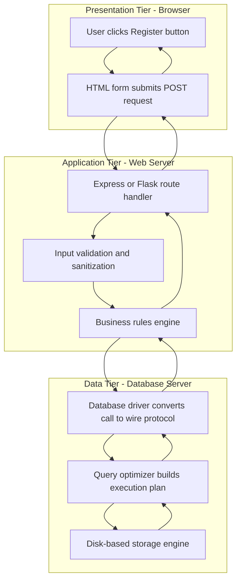
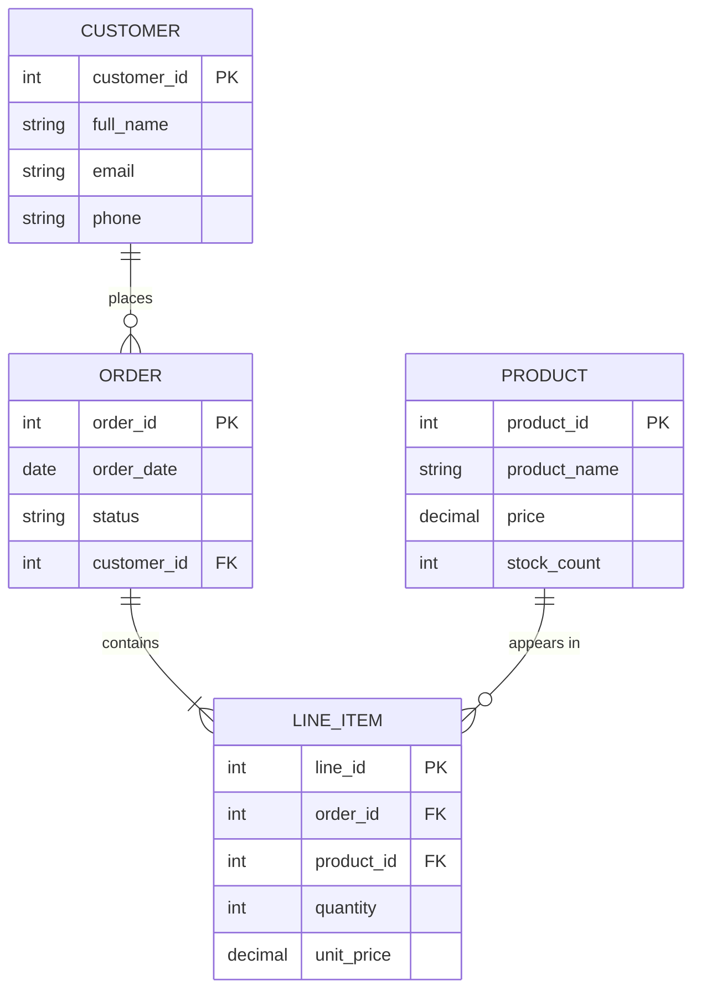

# Working with databases  - Databases and Web Development

<!-- SECTION_1_START -->

# Databases and Web Development: Core Foundations

## Formal KTU 2024 Definition

> [!NOTE]
> **Database (Web Context):** A structured, persistent, and queryable collection of digital information that is stored, retrieved, manipulated, and managed by a web application through a Database Management System (**DBMS**). In the context of web development, a database acts as the long-term memory layer of a web application, decoupling data persistence from the application code.

> [!IMPORTANT]
> **Web-Database Integration:** The systematic process of establishing, maintaining, and terminating logical communication channels between a web application (frontend + backend) and a database server using standardized query languages, drivers, and protocols. The most prevalent integration language is **Structured Query Language (SQL)**.

## Conceptual Analogy: The Smart Restaurant

Imagine a modern restaurant serving thousands of diners every day:

| Restaurant Component | Web Development Equivalent | Functional Role |
| :--- | :--- | :--- |
| Dining Hall (tables, ambience) | Frontend (HTML, CSS, JavaScript) | Present information to the user |
| Waiter taking orders | Backend Server (Node.js, PHP, Python) | Accept requests, coordinate work |
| Recipe book & kitchen rules | Application Logic (Routes, Controllers) | Validate, process, and decide |
| Cold storage and pantry shelves | **Database Server (MySQL, MongoDB, PostgreSQL)** | Store, organize, and retrieve raw data |
| Pantry inventory slip language | **SQL (Structured Query Language)** | Standard way to ask for ingredients |

When a customer (user) browses the menu (loads a webpage), the waiter (server) does not cook from memory; instead, the waiter consults the pantry (database) using a standardized slip (SQL query) to fetch exactly the right ingredients (records). This is precisely how every dynamic website — from a college portal to a banking system — operates at the backend.

## GeoGebra Visualization: Query Cost Scaling

> [!VISUALIZATION CONTROL]
> **Concept:** How query execution time scales with table size for indexed versus unindexed lookups.
> **GeoGebra / Desmos Input Equations:**
> * `f(x) = x * \log(x, 2)` (indexed B-Tree lookup — nearly linear)
> * `g(x) = (x^2) / 100` (full table scan — quadratic)
> **Visual Description:** Students should observe that $f(x)$ grows much slower than $g(x)$ after the crossover point near $x \approx 50$. This visually proves why proper indexing is critical in production databases that handle millions of rows.

## Core Vocabulary Lock-In

> [!IMPORTANT]
> **Five Pillars You Must Know for the Board Exam:**
> 1. **DBMS** — Database Management System (software that manages databases)
> 2. **RDBMS** — Relational DBMS (data stored in tables with relationships)
> 3. **SQL** — Structured Query Language (standard language for RDBMS)
> 4. **CRUD** — Create, Read, Update, Delete (the four core data operations)
> 5. **ORM** — Object-Relational Mapping (writing database queries using object-oriented code)

<!-- SECTION_1_END -->

<!-- SECTION_2_START -->

# Deep Theoretical Analysis & KTU High-Yield Cheat Sheet

## 1. Classification of Databases Used in Web Development

Web applications broadly rely on two families of databases. The KTU syllabus expects students to clearly distinguish them.

**A. Relational Databases (RDBMS)**

Data is organized into tables (relations) with predefined schemas, where each row is a record and each column is an attribute. Relationships between tables are enforced using **Primary Keys** and **Foreign Keys**.

Common examples: **MySQL**, **PostgreSQL**, **SQLite**, **Oracle**, **Microsoft SQL Server**.

**B. Non-Relational (NoSQL) Databases**

Data is stored in flexible, schema-less structures optimized for specific use cases. The four main types are:

* **Document stores** — MongoDB, CouchDB (JSON/BSON documents)
* **Key-Value stores** — Redis, DynamoDB (cache and session storage)
* **Column-family stores** — Cassandra, HBase (analytics workloads)
* **Graph databases** — Neo4j, Amazon Neptune (social networks, recommendations)

## 2. The CRUD Breakdown (Board Exam Hot Topic)

Every database interaction in a web application maps to one of four operations. Memorize this mapping thoroughly.

* **C — Create:** A user submits a registration form. The backend executes an `INSERT` statement, and a new row is appended to the table.
* **R — Read:** A user loads a profile page. The backend executes a `SELECT` statement, often with a `WHERE` clause, and renders the returned rows as HTML.
* **U — Update:** A user edits their bio. The backend executes an `UPDATE` statement with a `WHERE id = ?` clause to modify only that specific row.
* **D — Delete:** A user removes their account. The backend executes a `DELETE` statement, often wrapped in a transaction for safety.

## 3. KTU High-Yield SQL Cheat Sheet

The table below consolidates every SQL command, its syntax, and its CRUD mapping. Pay special attention to the units — boards frequently award marks for correctly identifying the clause structure.

| SQL Command | Template Syntax | CRUD Mapping | Returns |
| :--- | :--- | :--- | :--- |
| `INSERT INTO` | `INSERT INTO tbl (cols) VALUES (vals);` | Create | Affected row count |
| `SELECT` | `SELECT cols FROM tbl WHERE cond;` | Read | Result set (rows) |
| `UPDATE` | `UPDATE tbl SET col=val WHERE cond;` | Update | Affected row count |
| `DELETE` | `DELETE FROM tbl WHERE cond;` | Delete | Affected row count |
| `CREATE TABLE` | `CREATE TABLE tbl (col TYPE CONSTRAINTS);` | Schema | Success / Error |
| `JOIN` | `SELECT ... FROM a JOIN b ON a.id=b.aid;` | Read (relational) | Combined rows |
| `GROUP BY` | `SELECT col, COUNT(*) FROM tbl GROUP BY col;` | Aggregate | Aggregated rows |
| `TRANSACTION` | `BEGIN; ... COMMIT;` / `ROLLBACK;` | Atomic block | Success / Revert |

> [!NOTE]
> **Engineering Insight:** A common production bug is the *missing `WHERE` clause* in `UPDATE` or `DELETE`. A single accidental global update can rewrite every row in a million-row table within milliseconds. Always wrap destructive operations inside transactions and dry-run them in staging environments.

## 4. Multi-Tier Web-Database Architecture

A modern web application is partitioned into logical tiers, each with a dedicated responsibility.

* **Presentation Tier (Client-Side):** HTML, CSS, JavaScript, and SPA frameworks (React, Vue, Angular). This tier only renders data; it never touches the database directly.
* **Application Tier (Server-Side):** The backend runtime (Node.js, Django, Laravel, Spring). It receives HTTP requests, validates input, applies business rules, and calls the database through a driver.
* **Data Tier (Database Server):** The DBMS engine. It receives prepared SQL statements, optimizes them via the query planner, executes them against storage, and returns result sets.

> [!IMPORTANT]
> **Why three tiers and not two?** Separation of concerns. The frontend can be redesigned without touching the database; the database can be migrated from MySQL to PostgreSQL without rewriting the frontend. This is the foundation of the **MVC (Model-View-Controller)** pattern that KTU frequently tests.

## 5. Real-World Utility and Industry Relevance

The skills covered in this topic are foundational for almost every software engineering role:

* **E-commerce:** Storing product catalogs, user carts, and order histories in PostgreSQL.
* **Social Media:** Storing posts, likes, and follower graphs in graph databases (Neo4j).
* **Banking:** Storing transactions in ACID-compliant relational databases for absolute consistency.
* **Content Management:** WordPress uses a MySQL backend to store every post, comment, and user.
* **Analytics Dashboards:** Time-series databases (InfluxDB) power real-time metrics in production systems.

The combination of HTTP routing, SQL fluency, and ORM usage (Sequelize, SQLAlchemy, Eloquent) is one of the highest-demand skill sets in the global software job market.

<!-- SECTION_2_END -->

<!-- SECTION_3_START -->

# Step-by-Step Derivations & Code Implementation

## Conceptual Walkthrough: How a Web Request Becomes a Database Query

The complete journey from a user clicking a button to a database row being modified follows a fixed pipeline. We will trace each step in full.

**Step 1 — User Action (Browser Layer):**
The user clicks the *Register* button on an HTML form. The browser collects all form fields into a `POST` HTTP request and sends it to the server endpoint `/api/students`.

**Step 2 — Server Reception (Application Layer):**
The backend framework (Express, Flask, etc.) parses the request body, validates that all required fields are non-empty, and constructs a Python dictionary or JavaScript object.

**Step 3 — Database Driver Invocation (Connector Layer):**
The application calls a driver function such as `connection.execute()`. The driver translates the high-level call into a wire protocol understood by the specific DBMS (MySQL, PostgreSQL, etc.).

**Step 4 — SQL Compilation and Execution (Database Layer):**
The DBMS receives the SQL, parses it, generates an execution plan using the query optimizer, acquires locks, and reads or writes pages on disk.

**Step 5 — Result Return (Reverse Path):**
The DBMS returns either a result set, an affected row count, or an error code. The driver packages this into a language-native structure. The server serializes it to JSON and sends the HTTP response back to the browser.

## Production-Grade Python Implementation with SQLite

The following is a fully operational, type-hinted Python script that demonstrates every CRUD operation against a `students` table. SQLite is chosen because it requires zero server installation, making it ideal for academic demonstrations. The same logic applies to MySQL or PostgreSQL by swapping the connection string.

```python
import sqlite3
import logging
from typing import Optional, List

logging.basicConfig(
    level=logging.INFO,
    format="%(asctime)s - %(levelname)s - %(message)s"
)

DATABASE_PATH: str = "university.db"


def get_connection(db_path: str) -> sqlite3.Connection:
    """Establish a connection to the SQLite database file."""
    try:
        connection: sqlite3.Connection = sqlite3.connect(db_path)
        connection.row_factory = sqlite3.Row
        logging.info("Database connection established.")
        return connection
    except sqlite3.Error as err:
        logging.error(f"Connection failed: {err}")
        raise


def initialize_database(connection: sqlite3.Connection) -> None:
    """Create the students table if it does not already exist."""
    cursor: sqlite3.Cursor = connection.cursor()
    cursor.execute(
        """
        CREATE TABLE IF NOT EXISTS students (
            id INTEGER PRIMARY KEY AUTOINCREMENT,
            name TEXT NOT NULL,
            age INTEGER CHECK(age >= 0 AND age <= 150),
            grade TEXT NOT NULL,
            created_at TIMESTAMP DEFAULT CURRENT_TIMESTAMP
        )
        """
    )
    connection.commit()
    logging.info("Students table verified.")


def create_student(
    connection: sqlite3.Connection, name: str, age: int, grade: str
) -> int:
    """Insert a new student record and return the auto-generated ID."""
    if not name.strip():
        raise ValueError("Student name cannot be empty.")
    if not grade.strip():
        raise ValueError("Grade cannot be empty.")
    if age < 0 or age > 150:
        raise ValueError("Age must be between 0 and 150.")

    cursor: sqlite3.Cursor = connection.cursor()
    cursor.execute(
        "INSERT INTO students (name, age, grade) VALUES (?, ?, ?)",
        (name.strip(), age, grade.strip())
    )
    connection.commit()
    new_id: int = cursor.lastrowid if cursor.lastrowid is not None else 0
    logging.info(f"Student created with ID {new_id}.")
    return new_id


def read_all_students(connection: sqlite3.Connection) -> List[sqlite3.Row]:
    """Fetch every student record ordered by ID ascending."""
    cursor: sqlite3.Cursor = connection.cursor()
    cursor.execute(
        "SELECT id, name, age, grade, created_at FROM students ORDER BY id ASC"
    )
    rows: List[sqlite3.Row] = cursor.fetchall()
    logging.info(f"Retrieved {len(rows)} student records.")
    return rows


def read_student_by_id(
    connection: sqlite3.Connection, student_id: int
) -> Optional[sqlite3.Row]:
    """Fetch a single student record by primary key."""
    cursor: sqlite3.Cursor = connection.cursor()
    cursor.execute(
        "SELECT id, name, age, grade, created_at FROM students WHERE id = ?",
        (student_id,)
    )
    row: Optional[sqlite3.Row] = cursor.fetchone()
    if row is None:
        logging.warning(f"No student found with ID {student_id}.")
    return row


def update_student(
    connection: sqlite3.Connection,
    student_id: int,
    name: str,
    age: int,
    grade: str,
) -> bool:
    """Update an existing student record and return success status."""
    cursor: sqlite3.Cursor = connection.cursor()
    cursor.execute(
        "UPDATE students SET name = ?, age = ?, grade = ? WHERE id = ?",
        (name.strip(), age, grade.strip(), student_id)
    )
    connection.commit()
    if cursor.rowcount == 0:
        logging.warning(f"Update affected 0 rows for ID {student_id}.")
        return False
    logging.info(f"Student with ID {student_id} updated successfully.")
    return True


def delete_student(
    connection: sqlite3.Connection, student_id: int
) -> bool:
    """Delete a student record by ID and return success status."""
    cursor: sqlite3.Cursor = connection.cursor()
    cursor.execute(
        "DELETE FROM students WHERE id = ?", (student_id,)
    )
    connection.commit()
    if cursor.rowcount == 0:
        logging.warning(f"Delete affected 0 rows for ID {student_id}.")
        return False
    logging.info(f"Student with ID {student_id} deleted.")
    return True


def display_students(students: List[sqlite3.Row]) -> None:
    """Pretty-print a list of student records to the console."""
    if not students:
        print("No records to display.")
        return
    for student in students:
        print(
            f"ID={student['id']}, Name={student['name']}, "
            f"Age={student['age']}, Grade={student['grade']}"
        )


def main() -> None:
    """Drive the full CRUD demonstration."""
    connection: Optional[sqlite3.Connection] = None
    try:
        connection = get_connection(DATABASE_PATH)
        initialize_database(connection)

        # CREATE operation
        alice_id: int = create_student(connection, "Alice Johnson", 21, "A")
        create_student(connection, "Bob Smith", 22, "B+")

        # READ ALL operation
        print("\n--- All Students After Creation ---")
        display_students(read_all_students(connection))

        # READ BY ID operation
        print("\n--- Single Student Lookup ---")
        record: Optional[sqlite3.Row] = read_student_by_id(connection, alice_id)
        if record is not None:
            print(dict(record))

        # UPDATE operation
        print("\n--- After Updating Alice ---")
        update_student(connection, alice_id, "Alice Cooper", 21, "A+")
        display_students(read_all_students(connection))

        # DELETE operation
        print("\n--- After Deleting Alice ---")
        delete_student(connection, alice_id)
        display_students(read_all_students(connection))

    except (sqlite3.Error, ValueError) as error:
        logging.error(f"Operation failed: {error}")
    finally:
        if connection is not None:
            connection.close()
            logging.info("Database connection closed.")


if __name__ == "__main__":
    main()
```

## Line-by-Line Pedagogical Breakdown

The following numbered explanation maps directly to the code above so that the KTU student understands the *why* behind every line.

1. **Lines 1 to 6** — Standard library imports. `sqlite3` is the built-in Python DB-API 2.0 driver; `logging` is used for diagnostic output; `Optional` and `List` are typing generics for static analysis.
2. **Line 9** — The log format embeds a timestamp, severity level, and message, mirroring production observability standards.
3. **Line 12** — The database file path is declared as a module-level constant for easy configuration across environments.
4. **Function `get_connection`** — Opens the SQLite file, enables `row_factory` so rows behave like dictionaries, and raises the underlying error for the caller to handle.
5. **Function `initialize_database`** — Uses `CREATE TABLE IF NOT EXISTS` so the script is idempotent; running it multiple times will not throw an error.
6. **Function `create_student`** — Validates input at the application boundary (defense in depth), uses **parameterized queries** with `?` placeholders to prevent SQL injection, and returns the auto-incremented ID via `cursor.lastrowid`.
7. **Function `read_all_students`** — Issues a `SELECT` with an `ORDER BY` clause so the UI gets deterministic, paginated results.
8. **Function `update_student`** — Returns a boolean so the API layer can send a proper HTTP 404 response if no row matched.
9. **Function `delete_student`** — Same return contract as update, allowing the caller to distinguish success from a no-op.
10. **Function `main`** — Wraps the entire demo in a `try-except-finally` block. The `finally` block guarantees that the connection is closed even if an exception occurs in the middle.

> [!IMPORTANT]
> **Why parameterized queries (`?` placeholders) and not f-strings?** If the code used `f"INSERT INTO students VALUES ('{name}', {age})"`, a malicious user could submit `name = "', 1, 1); DROP TABLE students; --"` and wipe the entire table. Parameterized queries separate code from data, making injection structurally impossible.

<!-- SECTION_3_END -->

<!-- SECTION_4_START -->

# Structural Diagrams & Schematics

## Diagram 1: Multi-Tier Web-Database Request Lifecycle

The flowchart below traces a single user action through every architectural layer, from the browser to the disk and back.



**Reading the diagram:** The forward arrows (top to bottom) represent the request descent; the reverse arrows represent the response ascent. Each tier is encapsulated in a labeled subgraph to emphasize the separation-of-concerns principle. In production systems, the *driver* and *query planner* sub-tiers are typically owned by different engineering teams.

## Diagram 2: Entity-Relationship Structure for an E-Commerce Web App

The ER diagram below models a simplified e-commerce backend, illustrating one-to-many and many-to-many relationships that the board exam often asks students to sketch.



**Reading the diagram:** A `CUSTOMER` can place zero or many `ORDER` records, denoted by the `||--o{` cardinality. Each `ORDER` must contain one or many `LINE_ITEM` rows (the `||--|{` symbol). Each `PRODUCT` can appear in zero or many line items, completing the many-to-many resolution between orders and products through the line-item join table.

## Diagram 3: CRUD Operation Topology

The following block-level matrix maps each CRUD operation to its corresponding SQL command, HTTP verb, ORM method, and real-world example.

```mermaid
flowchart LR
    subgraph createBlock["Create Operation"]
        sqlC["SQL: INSERT INTO"]
        httpC["HTTP: POST"]
        ormC["ORM: save or create"]
        exC["Example: New user signup"]
    end

    subgraph readBlock["Read Operation"]
        sqlR["SQL: SELECT FROM"]
        httpR["HTTP: GET"]
        ormR["ORM: find or findAll"]
        exR["Example: Loading a profile page"]
    end

    subgraph updateBlock["Update Operation"]
        sqlU["SQL: UPDATE SET"]
        httpU["HTTP: PUT or PATCH"]
        ormU["ORM: update or save"]
        exU["Example: Editing a bio"]
    end

    subgraph deleteBlock["Delete Operation"]
        sqlD["SQL: DELETE FROM"]
        httpD["HTTP: DELETE"]
        ormD["ORM: destroy or delete"]
        exD["Example: Account removal"]
    end

    createBlock --> readBlock
    readBlock --> updateBlock
    updateBlock --> deleteBlock
    deleteBlock --> createBlock
```



**Reading the diagram:** The four CRUD blocks are arranged in a cycle to emphasize that modern web apps continually cycle through these operations for every user. The arrows in both directions represent the *referential cycle* — a deleted order (D) might trigger a re-creation of a cart (C), a status update (U), and a re-read (R) for confirmation.

<!-- SECTION_4_END -->

<!-- SECTION_5_START -->

# KTU 2024 Scheme Examination Question Bank & Topic Recap

## Part A — Short Answer Questions (3 Marks Each)

### Question 1

> **[KTU University Exam — July 2024]**
> Define the acronym **CRUD** as used in web database development. State one SQL command corresponding to each letter. (Cognitive Level: Remember, CO1, 3 Marks)

**Model Answer:**

CRUD stands for the four fundamental database operations:

* **C — Create:** corresponds to the SQL command `INSERT INTO table_name (col1, col2) VALUES (val1, val2);`
* **R — Read:** corresponds to the SQL command `SELECT col1, col2 FROM table_name WHERE condition;`
* **U — Update:** corresponds to the SQL command `UPDATE table_name SET col1 = val1 WHERE condition;`
* **D — Delete:** corresponds to the SQL command `DELETE FROM table_name WHERE condition;`

> **[Valuation Key]** *[Defining each letter: 1 Mark]* *[Writing one valid SQL command: 1 Mark]* *[Correct mapping: 1 Mark]*

### Question 2

> **[KTU University Exam — Dec 2023]**
> Differentiate between a **relational database (RDBMS)** and a **NoSQL database**. Provide one example for each. (Cognitive Level: Understand, CO2, 3 Marks)

**Model Answer:**

| Aspect | RDBMS | NoSQL |
| :--- | :--- | :--- |
| Data Model | Tables with rows and columns | Documents, key-value, graphs, columns |
| Schema | Fixed, predefined schema | Dynamic, schema-less |
| Query Language | SQL | Varies (MongoDB Query, CQL, etc.) |
| Scaling | Vertical (stronger server) | Horizontal (more servers) |
| Example | **MySQL** | **MongoDB** |

> **[Valuation Key]** *[Identifying schema difference: 1 Mark]* *[Identifying scaling difference: 1 Mark]* *[Valid example for each: 1 Mark]*

---

## Part B — Long Answer Questions (14 Marks Each)

> **Internal Choice Instruction:** *Answer ANY ONE full question from the pair Q-A or Q-B. Each question carries 14 marks split into two 7-mark sub-parts.*

### Question A

> **[KTU University Exam — Model Paper 2024]**
> **(a)** Explain the **three-tier web application architecture** with a neat diagram. Describe how the database layer interacts with the presentation and business logic layers. (Cognitive Level: Understand, CO2, 7 Marks)

**(a) Model Solution:**

The three-tier architecture partitions a web application into three logical and often physical layers:

1. **Presentation Tier (Client Tier):** Built using HTML, CSS, JavaScript, and modern SPA frameworks. This tier is responsible only for rendering the user interface and capturing user interactions. It communicates with the server exclusively through HTTP requests (typically `GET` and `POST`).

2. **Application Tier (Logic Tier):** Built using server-side languages such as Python, Java, PHP, or Node.js. This tier contains the business rules — validation, authentication, authorization, and workflow logic. It acts as a mediator that translates user requests into database queries.

3. **Data Tier (Database Tier):** Built using DBMS software such as MySQL, PostgreSQL, or MongoDB. This tier stores persistent data and exposes it through a query interface (SQL for RDBMS).

**Interaction flow:** The presentation tier sends an HTTP request → the application tier receives it via a route handler → the application tier executes business rules → it invokes the database driver → the data tier returns a result set → the application tier serializes it as JSON → the presentation tier renders it in the browser.

> **[Valuation Key]** *[Naming all three tiers: 2 Marks]* *[Explaining presentation tier role: 1 Mark]* *[Explaining application tier role: 1 Mark]* *[Explaining data tier role: 1 Mark]* *[Drawing or describing the interaction flow: 1 Mark]* *[Correct example technologies: 1 Mark]*

> **(b)** Write a complete Python (or PHP) script that connects to a database and performs **all four CRUD operations** on a `products` table with columns `id`, `name`, `price`, and `quantity`. Use parameterized queries. (Cognitive Level: Apply, CO3, 7 Marks)

**(b) Model Solution:**

```python
import sqlite3
from typing import Optional, List

DB_PATH: str = "store.db"


def connect(path: str) -> sqlite3.Connection:
    return sqlite3.connect(path)


def create_product(conn: sqlite3.Connection, name: str, price: float, qty: int) -> int:
    cursor: sqlite3.Cursor = conn.cursor()
    cursor.execute(
        "INSERT INTO products (name, price, quantity) VALUES (?, ?, ?)",
        (name, price, qty)
    )
    conn.commit()
    return cursor.lastrowid if cursor.lastrowid else 0


def read_products(conn: sqlite3.Connection) -> List[tuple]:
    cursor: sqlite3.Cursor = conn.cursor()
    cursor.execute("SELECT id, name, price, quantity FROM products")
    return cursor.fetchall()


def update_product(conn: sqlite3.Connection, product_id: int, price: float) -> bool:
    cursor: sqlite3.Cursor = conn.cursor()
    cursor.execute(
        "UPDATE products SET price = ? WHERE id = ?",
        (price, product_id)
    )
    conn.commit()
    return cursor.rowcount > 0


def delete_product(conn: sqlite3.Connection, product_id: int) -> bool:
    cursor: sqlite3.Cursor = conn.cursor()
    cursor.execute("DELETE FROM products WHERE id = ?", (product_id,))
    conn.commit()
    return cursor.rowcount > 0


def main() -> None:
    conn: Optional[sqlite3.Connection] = None
    try:
        conn = connect(DB_PATH)
        conn.execute(
            """
            CREATE TABLE IF NOT EXISTS products (
                id INTEGER PRIMARY KEY AUTOINCREMENT,
                name TEXT NOT NULL,
                price REAL NOT NULL,
                quantity INTEGER NOT NULL
            )
            """
        )
        conn.commit()
        new_id: int = create_product(conn, "Laptop", 75000.0, 10)
        print("Created product with ID:", new_id)
        for row in read_products(conn):
            print(row)
        update_product(conn, new_id, 72000.0)
        delete_product(conn, new_id)
        print("All operations completed successfully.")
    finally:
        if conn is not None:
            conn.close()


if __name__ == "__main__":
    main()
```

> **[Valuation Key]** *[Database connection setup: 1 Mark]* *[CREATE function with parameterized query: 1 Mark]* *[READ function with SELECT: 1 Mark]* *[UPDATE function with WHERE clause: 1 Mark]* *[DELETE function with WHERE clause: 1 Mark]* *[Error handling and connection close: 1 Mark]* *[Executing the full demo in main: 1 Mark]*

---

### Question B

> **[KTU University Exam — Model Paper 2024]**
> **(a)** Compare **SQL** and **NoSQL** databases across at least five parameters. State two real-world use cases for each type. (Cognitive Level: Understand, CO2, 7 Marks)

**(a) Model Solution:**

| Parameter | SQL (RDBMS) | NoSQL |
| :--- | :--- | :--- |
| Data Model | Tabular rows and columns | Documents, key-value, graphs |
| Schema | Fixed, predefined | Dynamic, flexible |
| Query Language | Standardized SQL | Varies by database |
| ACID Compliance | Strong (Atomic, Consistent, Isolated, Durable) | Eventual consistency (BASE) |
| Scaling Strategy | Vertical scaling (bigger server) | Horizontal scaling (more nodes) |
| Joins | Fully supported | Limited or absent |
| Best For | Structured, transactional data | Unstructured, rapidly evolving data |

**SQL use cases:** (1) Banking transaction systems where ACID compliance is mandatory. (2) Enterprise resource planning (ERP) software with fixed schemas.

**NoSQL use cases:** (1) Social media feeds that need to scale to billions of users. (2) Real-time analytics dashboards using columnar stores.

> **[Valuation Key]** *[Tabular comparison of 5 parameters: 3 Marks]* *[Two valid SQL use cases: 2 Marks]* *[Two valid NoSQL use cases: 2 Marks]*

> **(b)** Design an **Entity-Relationship diagram** for a *Library Management System* having entities `Book`, `Member`, and `Loan`. Write the corresponding `CREATE TABLE` SQL statements including primary keys, foreign keys, and at least two constraints. (Cognitive Level: Apply, CO3, 7 Marks)

**(b) Model Solution:**

**ER Diagram (textual representation):**

* One `Member` can borrow zero or many `Loan` records.
* One `Book` can appear in zero or many `Loan` records.
* `Loan` is a many-to-many resolution table between `Member` and `Book`.

**SQL Statements:**

```sql
CREATE TABLE Book (
    book_id INTEGER PRIMARY KEY AUTOINCREMENT,
    title TEXT NOT NULL,
    author TEXT NOT NULL,
    isbn TEXT UNIQUE NOT NULL,
    copies_available INTEGER CHECK(copies_available >= 0)
);

CREATE TABLE Member (
    member_id INTEGER PRIMARY KEY AUTOINCREMENT,
    full_name TEXT NOT NULL,
    email TEXT UNIQUE NOT NULL,
    join_date DATE NOT NULL DEFAULT CURRENT_DATE
);

CREATE TABLE Loan (
    loan_id INTEGER PRIMARY KEY AUTOINCREMENT,
    book_id INTEGER NOT NULL,
    member_id INTEGER NOT NULL,
    loan_date DATE NOT NULL DEFAULT CURRENT_DATE,
    return_date DATE,
    FOREIGN KEY (book_id) REFERENCES Book(book_id),
    FOREIGN KEY (member_id) REFERENCES Member(member_id)
);
```

> **[Valuation Key]** *[ER description with relationships: 2 Marks]* *[Correct Book table with constraints: 1 Mark]* *[Correct Member table with constraints: 1 Mark]* *[Correct Loan table with foreign keys: 2 Marks]* *[Use of CHECK and UNIQUE constraints: 1 Mark]*

---

## KTU Examiner's Valuation Warning

> [!WARNING]
> **Common Pitfalls That Cost Marks in This Topic:**
> 1. **Forgetting the `WHERE` clause in `UPDATE` or `DELETE`.** This will update or delete *every row* in the table. Examiners explicitly check for the `WHERE` clause to award the conditional-logic mark.
> 2. **Using string concatenation instead of parameterized queries.** Writing `cursor.execute("INSERT ... VALUES ('" + name + "')")` is a SQL-injection vulnerability and will be marked down. Always use `?` placeholders or named parameters.
> 3. **Failing to close the database connection.** A script that opens a connection but never closes it will lose 1 mark for resource-leak handling.
> 4. **Confusing `TRUNCATE` with `DELETE`.** `TRUNCATE` is a DDL operation that resets the table; `DELETE` is DML that removes specific rows. Examiners often test this distinction.
> 5. **Writing the CRUD letters in the wrong order.** Always present them as *Create, Read, Update, Delete* — not in alphabetical or any other order.

---

## Topic Recap & Important Things to Remember

* **CRUD** stands for **Create, Read, Update, Delete** and is the universal vocabulary for database operations in every web framework.
* **RDBMS** uses fixed schemas and SQL; **NoSQL** uses dynamic schemas and database-specific query languages.
* **MySQL**, **PostgreSQL**, and **SQLite** are the most common RDBMS choices in web development; **MongoDB**, **Redis**, and **Cassandra** are the most common NoSQL choices.
* The **three-tier architecture** splits web apps into Presentation (frontend), Application (backend), and Data (database) tiers, enforcing the *separation of concerns* principle.
* Every database interaction should use **parameterized queries** (with `?` placeholders) to prevent **SQL injection attacks**.
* **HTTP verbs map to CRUD:** `POST` → Create, `GET` → Read, `PUT` or `PATCH` → Update, `DELETE` → Delete.
* **Primary keys** uniquely identify rows; **foreign keys** enforce referential integrity between related tables.
* **ACID properties** (Atomicity, Consistency, Isolation, Durability) guarantee reliable transaction processing in relational databases.
* **ORM tools** (Sequelize, SQLAlchemy, Eloquent) let developers write database queries using object-oriented syntax instead of raw SQL.
* **Connection management** is critical: always close connections in a `finally` block or use connection pools to prevent resource leaks.
* **Transactions** (`BEGIN`, `COMMIT`, `ROLLBACK`) ensure that multi-step database operations either all succeed or all revert, preserving data integrity.
* **Indexing** reduces query time from $O(n^2)$ (full scan) to near $O(n \log n)$ (B-tree lookup), making it essential for large tables.
* **XAMPP/WAMP/MAMP** stacks bundle Apache, MySQL, and PHP — the classic KTU lab environment for learning web-database integration.

<!-- SECTION_5_END -->
