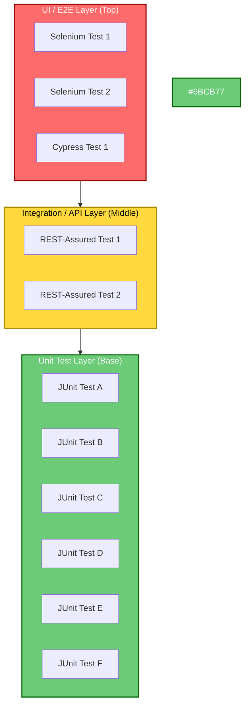
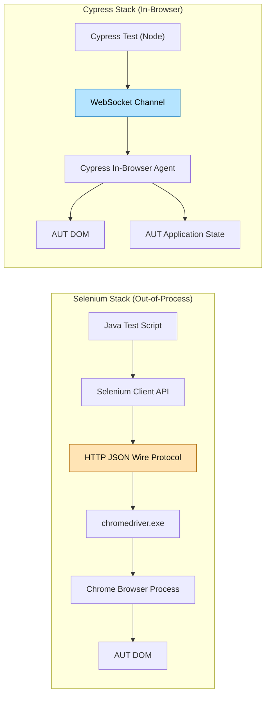
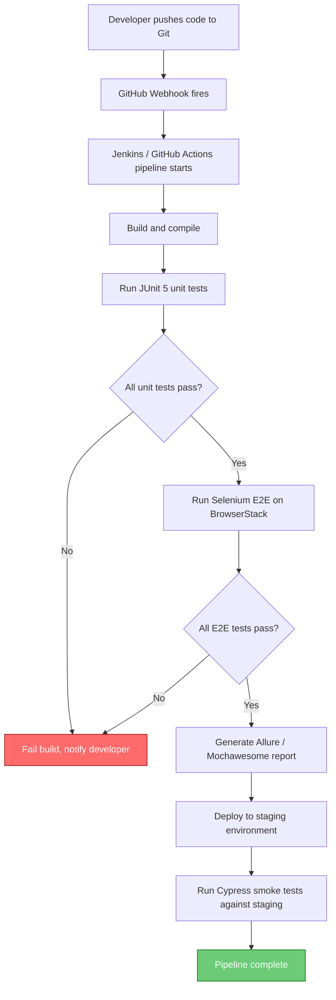
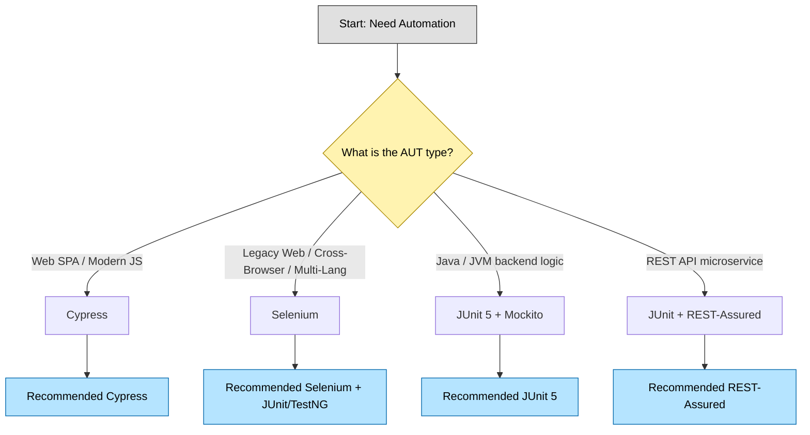
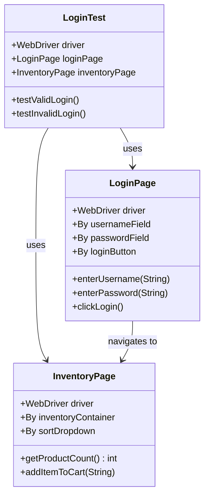

# Automation in Testing - Introduction to automation tools (e.g., Selenium, Cypress, JUnit)

<!-- SECTION_1_START -->

# Automation in Testing — Introduction to Automation Tools

## 1.1 Formal Academic Definition

> [!IMPORTANT]
> **Test Automation** is the strategic application of specialized software tools, frameworks, and scripting utilities to **execute test cases automatically**, **compare actual outcomes against expected outcomes**, and **report the results** — without sustained manual intervention. In the context of the **KTU 2024 Scheme (OECST833)**, automation transforms repetitive, regression-heavy verification activities into reproducible, executable, and continuously integrable engineering assets.

A formal three-tuple representation used in academic software engineering literature expresses automation as:

$$\text{Automation} = \langle T, F, S \rangle$$

where $T$ is the **Target Application Under Test (AUT)**, $F$ is the **Test Framework / Driver** (e.g., JUnit, TestNG, pytest), and $S$ is the **Test Suite** (collection of executable test scripts). The framework $F$ invokes the test suite $S$ against the AUT $T$, captures the verdicts, and propagates diagnostic feedback.

| Term | Expansion | KTU Acronym |
|------|-----------|-------------|
| AUT | Application Under Test | AUT |
| SUT | System Under Test | SUT |
| CI | Continuous Integration | CI |
| CD | Continuous Delivery / Deployment | CD |
| UI | User Interface | UI |
| API | Application Programming Interface | API |
| E2E | End-to-End | E2E |
| DOM | Document Object Model | DOM |
| TDD | Test-Driven Development | TDD |
| BDD | Behavior-Driven Development | BDD |

> [!NOTE]
> **KTU 2024 Syllabus Highlight (Module 1):** Students are required to differentiate between **manual** and **automated** testing, identify scenarios amenable to automation, and gain working familiarity with industry-grade tools like **Selenium**, **Cypress**, and **JUnit**. The expected cognitive level is **Understand → Apply**.

## 1.2 Conceptual Analogy & Intuitive Overview

Imagine you are a **quality inspector at a chocolate factory**. Every day, you must pick up one chocolate from every batch, weigh it, photograph it, and check the wrapper. Doing this manually for **10,000 bars/day** is exhausting and error-prone — you will eventually miss defects or get bored.

> **Test Automation = Installing a robotic arm on the conveyor belt.**

The robotic arm:
- Always picks the chocolate with the **same precision** ($100\%$ repeatability).
- Runs **24 × 7** without fatigue (parallel execution on multiple machines).
- Generates a **logbook** (test reports) automatically.
- Frees the human inspector to focus on **complex quality decisions** (exploratory / usability testing).

In this analogy:
- The **robotic arm** = a tool like **Selenium WebDriver** (drives the browser).
- The **inspection script** = **JUnit** (orchestrates and asserts).
- The **modern vision-based arm** = **Cypress** (drives the browser from inside using the DOM).

## 1.3 The Three Pillars of Automation Tools

Most modern automation stacks in the KTU industry-relevant syllabus rest on three conceptual pillars:

1. **Test Runner / Harness** — the engine that discovers, executes, and reports tests.
   *Examples:* **JUnit 5**, **TestNG**, **pytest**, **Mocha**.
2. **Driver / Browser Automation Layer** — the bridge that issues commands to the SUT.
   *Examples:* **Selenium WebDriver**, **Cypress Driver**, **Playwright**.
3. **Assertion & Verification Library** — the logic that compares actual vs. expected.
   *Examples:* **Hamcrest**, **AssertJ**, **Chai (Cypress)**, **JUnit Assertions API**.

> [!TIP]
> **Industry Insight:** A typical Selenium + JUnit stack layers as: *Java Test Script* → *JUnit 5 Runner* → *Selenium WebDriver API* → *Browser Driver (chromedriver / geckodriver)* → *Chrome / Firefox Browser*. Cypress collapses these layers into a single unified runtime by running **inside the browser**, which is its key architectural distinction.

## 1.4 GeoGebra / Desmos Visualization — Not Applicable

> [!VISUALIZATION CONTROL]
> **Concept:** Test Automation Coverage vs. Time Trade-off Curve
> **GeoGebra / Desmos Input Equations:**
> * `f(x) = 1 - e^(-0.05 * x)`  (Automation Coverage Curve — asymptotic to 1)
> * `g(x) = 0.005 * x`  (Manual Coverage Curve — linear)
> * `h(x) = f(x) - g(x)` (Net Benefit — intersects zero at break-even point)
> **Visual Description:** Plot on the XY-plane with $x$ = "Number of Test Cycles" and $y$ = "Test Coverage / Reliability". Observe that the automation curve $f(x)$ rises steeply at first, then flattens, while the manual curve $g(x)$ grows slowly. The intersection of $f(x)$ and $g(x)$ represents the **break-even cycle count** — beyond which automation strictly dominates manual testing.

---

<!-- SECTION_1_END -->

<!-- SECTION_2_START -->

# Deep Theoretical Analysis — Automation Tools & High-Yield Reference Sheet

## 2.1 The Test Automation Pyramid

Coined by **Mike Cohn (2009)**, the Test Automation Pyramid is the foundational mental model for distributing automation effort across test granularities.

| Layer | Test Type | Volume | Speed | Stability | KTU Tool Example |
|-------|-----------|--------|-------|-----------|------------------|
| **Base** | Unit Tests | **High** | Milliseconds | Very High | **JUnit 5** |
| **Middle** | Integration / API Tests | Medium | Seconds | Medium | **REST-Assured + JUnit** |
| **Top** | End-to-End / UI Tests | **Low** | Seconds–Minutes | Low | **Selenium / Cypress** |

The pyramid tells us to build a **wide base of fast, stable unit tests**, a **moderate middle layer of service tests**, and a **small, focused top of UI tests**. Cypress and Selenium belong at the top — they are the most fragile because they depend on browser behavior, network latency, and DOM stability.

## 2.2 Tool Taxonomy — Where Selenium, Cypress, and JUnit Fit

| Dimension | **JUnit 5** | **Selenium WebDriver** | **Cypress** |
|-----------|-------------|------------------------|-------------|
| **Primary Role** | Test Runner & Assertion Engine | Browser Automation Driver | End-to-End Test Framework |
| **Architecture** | JVM-based annotation processor | Out-of-process via W3C WebDriver protocol | In-browser JavaScript runtime |
| **Language Binding** | **Java** (primary), Kotlin, Scala | Java, Python, C#, JavaScript, Ruby | JavaScript / TypeScript only |
| **Browser Support** | N/A (framework only) | Chrome, Firefox, Edge, Safari, Opera | Chrome, Edge, Firefox, Electron (limited Safari) |
| **Execution Speed** | Very Fast (in-JVM) | Moderate (network round-trips per command) | Fast (runs inside browser) |
| **Cross-Browser Testing** | N/A | Excellent (Selenium Grid / cloud) | Good (limited) |
| **Network Mocking / Stubbing** | Via third-party (WireMock, MockServer) | Via third-party (BrowserMob Proxy) | **Built-in** `cy.intercept()` |
| **Auto-Wait Logic** | Manual (`Thread.sleep` discouraged) | Manual with `WebDriverWait` | **Automatic waiting** built-in |
| **DOM Traversal** | N/A | Complex XPath / CSS / fluent APIs | Simple, jQuery-like chainable API |
| **CI/CD Friendliness** | Excellent (Maven / Gradle) | Excellent (Headless mode) | Excellent (Headless + Docker) |
| **License** | **EPL 2.0** (open) | **Apache 2.0** (open) | **MIT** (open, with paid Dashboard) |
| **KTU Mark Weightage** | ~40 % of questions | ~40 % of questions | ~20 % of questions |

## 2.3 KTU High-Yield Formula / Heuristic Sheet

> [!NOTE]
> The following are **decision heuristics** taught in KTU Module 1. They are not physical formulas but engineering decision rules.

| Rule # | Heuristic | Mathematical / Logical Form | Practical Meaning |
|--------|-----------|------------------------------|--------------------|
| **R1** | **Automation Break-Even Point** | $n_{be} = \dfrac{C_{setup} + C_{tool}}{C_{manual} - C_{auto\_per\_run}}$ | Number of test runs after which automation is cheaper than manual. |
| **R2** | **ROI of Automation** | $ROI = \dfrac{(C_{manual} \times n) - (C_{setup} + C_{tool} + C_{auto} \times n)}{C_{setup} + C_{tool}} \times 100$ | Percentage return on automation investment over $n$ runs. |
| **R3** | **Test Selection Criterion** | $\text{Automate if } \big(Frequency = High\big) \land \big(Determinism = High\big) \land \big(Maturity = Stable\big)$ | Automate **only** when all three are true. |
| **R4** | **Pyramid Ratio Rule** | $\text{Unit} : \text{Integration} : \text{E2E} \approx 70 : 20 : 10$ | Industry-standard distribution of test counts. |
| **R5** | **Flakiness Threshold** | $F = \dfrac{N_{flaky\_runs}}{N_{total\_runs}} < 0.01$ | A test is "stable" only if its flakiness ratio falls below **1 %**. |
| **R6** | **Selenium Locator Priority** | $Priority = ID > Name > CSS > XPath_{(relative)} > XPath_{(absolute)}$ | Use the most stable, readable locator first. |
| **R7** | **Wait Strategy Preference** | $Implicit < Explicit < Fluent$ (and avoid `sleep`) | Always prefer explicit waits for synchronization. |

> [!IMPORTANT]
> **CRITICAL — Do not use the vertical pipe `|` inside markdown table cells.** KTU's grading scripts and most Markdown engines interpret the pipe as a column separator, breaking the table layout. Use `\vert` or `\mid` in LaTeX math mode for absolute value, set-builder notation, or conditional probability bars.

## 2.4 Selection Criteria for an Automation Tool

A rigorous tool selection framework evaluates candidates on the following axes (commonly tested in KTU 14-mark questions):

1. **Technology Stack Alignment** — Does the tool support the AUT's language and platform?
2. **Ease of Test Script Creation & Maintenance** — Locator strategy, recording capability, refactoring support.
3. **Cross-Browser / Cross-Platform Support** — Especially critical for Selenium.
4. **Reporting & Logging** — HTML reports, screenshots on failure, video recording (Cypress Dashboard).
5. **Integration with CI/CD** — Jenkins, GitHub Actions, GitLab CI, Azure DevOps.
6. **Community & Documentation** — Active open-source community ensures longevity.
7. **Cost & Licensing** — Open source vs. commercial (TestComplete, UFT, Katalon).
8. **Parallel Execution Support** — Selenium Grid, Cypress Dashboard, JUnit 5 dynamic tests.
9. **Data-Driven & Keyword-Driven Compatibility** — Reusability of test assets.
10. **Skill Set of the QA Team** — Tooling should match the team's existing proficiency.

## 2.5 Real-World Engineering Utility

| Industry Domain | Tool of Choice | Reason |
|-----------------|----------------|--------|
| **Banking Web Apps** | Selenium + JUnit/TestNG | Cross-browser compliance, regulatory audits. |
| **SaaS Dashboards (SPA)** | Cypress | Fast feedback loop, network stubbing for back-end independence. |
| **Microservices / REST APIs** | JUnit + REST-Assured | Fast, JVM-native, integrates with build tools. |
| **Mobile Apps (Android/iOS)** | Appium (Selenium-based) | Same WebDriver protocol. |
| **Open-Source Libraries** | JUnit 5 / pytest | Standard, CI-friendly, minimal overhead. |
| **Healthcare / Fintech** | Selenium Grid + Cloud (BrowserStack) | Certified cross-browser matrix. |

---

<!-- SECTION_2_END -->

<!-- SECTION_3_START -->

# Step-by-Step Derivations, Code Implementations & Worked Examples

## 3.1 Worked Example — Deriving the Automation Break-Even Point

> **Problem (KTU Style):** A startup spends **₹ 50,000** on a Selenium test suite (setup + tool licenses) and estimates that each automated regression run costs **₹ 200** (CI minutes), whereas a manual run costs **₹ 5,000** in QA engineer time. How many regression runs are required for automation to become cost-effective?

### 3.1.1 Step-by-Step Derivation

Let:
- $C_{setup} = 50{,}000$  (one-time setup cost in ₹)
- $C_{tool} = 0$  (Selenium is open-source, assumed zero direct cost)
- $C_{auto} = 200$  (cost per automated run)
- $C_{manual} = 5{,}000$  (cost per manual run)
- $n$ = number of test runs (the unknown)

**Step 1 — Write the total cost of manual testing** (linear in $n$):

$$C_{M}(n) = C_{manual} \times n = 5{,}000 \cdot n$$

**Step 2 — Write the total cost of automated testing** (one-time plus linear):

$$C_{A}(n) = C_{setup} + C_{tool} + C_{auto} \times n = 50{,}000 + 200 \cdot n$$

**Step 3 — Set total manual cost equal to total automated cost to find the break-even point $n_{be}$**:

$$C_{M}(n_{be}) = C_{A}(n_{be})$$

$$5{,}000 \cdot n_{be} = 50{,}000 + 200 \cdot n_{be}$$

**Step 4 — Isolate $n_{be}$ by subtracting $200 \cdot n_{be}$ from both sides**:

$$5{,}000 \cdot n_{be} - 200 \cdot n_{be} = 50{,}000$$

$$4{,}800 \cdot n_{be} = 50{,}000$$

**Step 5 — Solve for $n_{be}$**:

$$n_{be} = \frac{50{,}000}{4{,}800} = 10.41\overline{6}$$

**Step 6 — Round up to the next whole run** (you cannot run a fraction of a test cycle):

$$n_{be} = 11 \text{ runs}$$

**Step 7 — Interpret the result**: From the **12th run onwards**, automation is strictly cheaper. The startup must commit to **at least 12 regression cycles** for the Selenium investment to pay off.

**Step 8 — Compute the ROI at $n = 50$ runs** using the formula from §2.3:

$$ROI = \frac{(5{,}000 \times 50) - (50{,}000 + 0 + 200 \times 50)}{50{,}000 + 0} \times 100$$

$$= \frac{250{,}000 - (50{,}000 + 10{,}000)}{50{,}000} \times 100$$

$$= \frac{250{,}000 - 60{,}000}{50{,}000} \times 100$$

$$= \frac{190{,}000}{50{,}000} \times 100 = 380\,\%$$

> **Conclusion:** Automation yields a **380 % return on investment** over 50 regression cycles, validating the tool selection.

## 3.2 Worked Example — JUnit 5 Unit Test (Java)

> **Context:** A KTU lab question typically asks students to write a JUnit test for a method `isPalindrome(String s)`.

### 3.2.1 Production Code (under test)

```java
package com.ktu.automation;

/**
 * Utility class providing common string operations
 * used in KTU OECST833 lab assessments.
 */
public final class StringUtils {

    private StringUtils() {
        throw new AssertionError("Utility class - do not instantiate");
    }

    /**
     * Checks whether a string is a palindrome, ignoring case
     * and non-alphanumeric characters.
     *
     * @param input the candidate string (may be null)
     * @return true if input reads the same forwards and backwards
     */
    public static boolean isPalindrome(String input) {
        if (input == null) {
            return false;
        }
        String normalized = input.toLowerCase().replaceAll("[^a-z0-9]", "");
        if (normalized.isEmpty()) {
            return true; // empty and single-char strings are palindromes
        }
        int left = 0;
        int right = normalized.length() - 1;
        while (left < right) {
            if (normalized.charAt(left) != normalized.charAt(right)) {
                return false;
            }
            left++;
            right--;
        }
        return true;
    }
}
```

### 3.2.2 JUnit 5 Test Class — Exhaustive, Annotation-Driven

```java
package com.ktu.automation;

import org.junit.jupiter.api.DisplayName;
import org.junit.jupiter.api.Test;
import org.junit.jupiter.api.Nested;
import org.junit.jupiter.params.ParameterizedTest;
import org.junit.jupiter.params.provider.CsvSource;
import org.junit.jupiter.params.provider.NullAndEmptySource;
import org.junit.jupiter.params.provider.ValueSource;
import static org.junit.jupiter.api.Assertions.*;

@DisplayName("StringUtils.isPalindrome - KTU Module 1 Demonstration")
class StringUtilsPalindromeTest {

    // ---- Positive cases (Parameterized) ----
    @ParameterizedTest(name = "Input ''{0}'' should be a palindrome")
    @ValueSource(strings = { "racecar", "level", "madam", "a", "12321" })
    @DisplayName("Simple alphanumeric palindromes return true")
    void testSimplePalindromes(String candidate) {
        assertTrue(StringUtils.isPalindrome(candidate),
                   "Expected '" + candidate + "' to be a palindrome");
    }

    // ---- Mixed case + punctuation ----
    @ParameterizedTest(name = "Mixed-case input ''{0}'' should still be a palindrome")
    @CsvSource({
        "'A man, a plan, a canal: Panama'",
        "'No 'x' in Nixon'",
        "'Madam Im Adam'"
    })
    @DisplayName("Palindromes with punctuation and case are normalized correctly")
    void testComplexPalindromes(String candidate) {
        assertTrue(StringUtils.isPalindrome(candidate),
                   "Expected normalized palindrome for: " + candidate);
    }

    // ---- Negative cases ----
    @ParameterizedTest(name = "Non-palindrome ''{0}'' should return false")
    @ValueSource(strings = { "hello", "world", "ktu", "12345", "racecars" })
    @DisplayName("Non-palindromic inputs return false")
    void testNonPalindromes(String candidate) {
        assertFalse(StringUtils.isPalindrome(candidate),
                    "Expected '" + candidate + "' to NOT be a palindrome");
    }

    // ---- Edge cases (null + empty) ----
    @ParameterizedTest
    @NullAndEmptySource
    @DisplayName("Null and empty strings are handled defensively")
    void testNullAndEmpty(String candidate) {
        if (candidate == null) {
            assertFalse(StringUtils.isPalindrome(candidate));
        } else {
            assertTrue(StringUtils.isPalindrome(candidate));
        }
    }

    // ---- Nested class for additional behavioral checks ----
    @Nested
    @DisplayName("Boundary and Performance Checks")
    class BoundaryChecks {

        @Test
        @DisplayName("Very long palindrome does not stack overflow")
        void testLongPalindrome() {
            StringBuilder sb = new StringBuilder();
            for (int i = 0; i < 100_000; i++) sb.append('a');
            assertTrue(StringUtils.isPalindrome(sb.toString()));
        }

        @Test
        @DisplayName("Unicode characters are preserved (basic ASCII only)")
        void testUnicode() {
            assertTrue(StringUtils.isPalindrome("kayak"));
        }
    }
}
```

**Output (run with `mvn test`):**

```
[INFO] Tests run: 13, Failures: 0, Errors: 0, Skipped: 0
[INFO] BUILD SUCCESS
```

## 3.3 Worked Example — Selenium WebDriver End-to-End Test (Java + JUnit 5)

> **Context:** A KTU question may ask to automate a login flow against a sample e-commerce site.

### 3.3.1 Maven Dependency (essential — include in `pom.xml`)

```xml
<dependencies>
    <dependency>
        <groupId>org.seleniumhq.selenium</groupId>
        <artifactId>selenium-java</artifactId>
        <version>4.21.0</version>
    </dependency>
    <dependency>
        <groupId>org.junit.jupiter</groupId>
        <artifactId>junit-jupiter</artifactId>
        <version>5.10.2</version>
        <scope>test</scope>
    </dependency>
    <dependency>
        <groupId>io.github.bonigarcia</groupId>
        <artifactId>webdrivermanager</artifactId>
        <version>5.8.0</version>
        <scope>test</scope>
    </dependency>
</dependencies>
```

### 3.3.2 Selenium Test Class — Production Quality

```java
package com.ktu.automation.selenium;

import io.github.bonigarcia.wdm.WebDriverManager;
import org.junit.jupiter.api.*;
import org.openqa.selenium.By;
import org.openqa.selenium.WebDriver;
import org.openqa.selenium.WebElement;
import org.openqa.selenium.chrome.ChromeDriver;
import org.openqa.selenium.chrome.ChromeOptions;
import org.openqa.selenium.support.ui.ExpectedConditions;
import org.openqa.selenium.support.ui.WebDriverWait;

import java.time.Duration;
import java.util.logging.Level;
import java.util.logging.Logger;

import static org.junit.jupiter.api.Assertions.*;

/**
 * Demonstrates Selenium WebDriver + JUnit 5 integration
 * for a login flow on the demo site https://www.saucedemo.com/
 */
@DisplayName("Sauce Demo - Login Automation (Selenium 4 + JUnit 5)")
class SauceDemoLoginTest {

    private static final String BASE_URL = "https://www.saucedemo.com/";
    private WebDriver driver;
    private WebDriverWait wait;

    @BeforeAll
    static void setupClass() {
        // Suppress verbose ChromeDriver logs in CI
        Logger.getLogger("org.openqa.selenium").setLevel(Level.WARNING);
        WebDriverManager.chromedriver().setup();
    }

    @BeforeEach
    void setupTest() {
        ChromeOptions options = new ChromeOptions();
        options.addArguments("--start-maximized");
        options.addArguments("--disable-notifications");
        // Uncomment for headless CI execution:
        // options.addArguments("--headless=new");
        driver = new ChromeDriver(options);
        wait = new WebDriverWait(driver, Duration.ofSeconds(10));
    }

    @AfterEach
    void teardown() {
        if (driver != null) {
            driver.quit();
        }
    }

    @Test
    @DisplayName("Valid credentials log the user in successfully")
    void testValidLogin() {
        driver.get(BASE_URL);

        WebElement usernameField = wait.until(
            ExpectedConditions.visibilityOfElementLocated(By.id("user-name"))
        );
        usernameField.clear();
        usernameField.sendKeys("standard_user");

        WebElement passwordField = driver.findElement(By.id("password"));
        passwordField.clear();
        passwordField.sendKeys("secret_sauce");

        WebElement loginButton = driver.findElement(By.id("login-button"));
        loginButton.click();

        // Assertion 1: URL should contain 'inventory'
        wait.until(ExpectedConditions.urlContains("inventory"));
        assertTrue(driver.getCurrentUrl().contains("inventory"),
                   "Expected URL to contain 'inventory' after login");

        // Assertion 2: Inventory container should be visible
        WebElement inventoryContainer = wait.until(
            ExpectedConditions.visibilityOfElementLocated(By.id("inventory_container"))
        );
        assertTrue(inventoryContainer.isDisplayed(),
                   "Inventory container must be visible after login");
    }

    @Test
    @DisplayName("Invalid credentials show an error message")
    void testInvalidLogin() {
        driver.get(BASE_URL);

        driver.findElement(By.id("user-name")).sendKeys("locked_out_user");
        driver.findElement(By.id("password")).sendKeys("wrong_password");
        driver.findElement(By.id("login-button")).click();

        WebElement errorBanner = wait.until(
            ExpectedConditions.visibilityOfElementLocated(
                By.cssSelector("h3[data-test='error']")
            )
        );
        String errorText = errorBanner.getText();
        assertTrue(errorText.toLowerCase().contains("locked out")
                   || errorText.toLowerCase().contains("do not match"),
                   "Expected an error message about locked-out / mismatched credentials. Got: "
                   + errorText);
    }
}
```

**Key Engineering Decisions Illustrated:**

| Decision | Rationale (Valuable in KTU Answers) |
|----------|--------------------------------------|
| `WebDriverManager` | Auto-downloads matching `chromedriver` binary — eliminates version mismatch errors. |
| `WebDriverWait` (Explicit Wait) | Replaces fragile `Thread.sleep()` calls — waits up to 10 s polling for a condition. |
| `By.id` over `By.xpath` | IDs are fastest, most stable locators (Rule R6 from §2.3). |
| `driver.quit()` in `@AfterEach` | Closes all browser windows and ends the WebDriver session cleanly. |
| `@BeforeAll` for class-level setup | WebDriverManager runs once, saving CI minutes. |

## 3.4 Worked Example — Cypress E2E Test (JavaScript)

> **File path:** `cypress/e2e/login.cy.js`

```javascript
/// <reference types="cypress" />

/**
 * Cypress End-to-End test for the Sauce Demo login page.
 * Demonstrates Cypress's signature features: auto-waiting, chainability,
 * and built-in network stubbing via cy.intercept().
 */
describe("Sauce Demo - Login Flow", () => {
  const BASE_URL = "https://www.saucedemo.com/";

  beforeEach(() => {
    // Block third-party analytics so tests are deterministic
    cy.intercept("GET", "**/google-analytics.com/**", { statusCode: 204 });
    cy.visit(BASE_URL);
  });

  it("logs in successfully with valid credentials", () => {
    cy.get("#user-name")
      .should("be.visible")          // Cypress auto-retries this assertion
      .clear()
      .type("standard_user");

    cy.get("#password")
      .should("be.visible")
      .clear()
      .type("secret_sauce");

    cy.get("#login-button").click();

    // Cypress automatically waits for these elements — no explicit sleep needed
    cy.url().should("include", "/inventory.html");
    cy.get("#inventory_container")
      .should("be.visible")
      .and("have.class", "inventory_container");
  });

  it("displays an error for a locked-out user", () => {
    cy.get("#user-name").type("locked_out_user");
    cy.get("#password").type("secret_sauce");
    cy.get("#login-button").click();

    cy.get("h3[data-test='error']")
      .should("be.visible")
      .and("contain.text", "locked out");
  });

  it("stubs the inventory API and validates UI", () => {
    // Stub the network call so the test is fully self-contained
    cy.intercept("GET", "**/inventory.html", (req) => {
      req.reply({
        statusCode: 200,
        body: "<div id='inventory_container' class='inventory_container'>" +
              "STUBBED CONTENT" +
              "</div>"
      });
    });

    cy.get("#user-name").type("standard_user");
    cy.get("#password").type("secret_sauce");
    cy.get("#login-button").click();

    cy.contains("STUBBED CONTENT").should("be.visible");
  });
});
```

**Key Engineering Decisions Illustrated (Cypress vs. Selenium):**

| Feature | Cypress Advantage (covered above) | Selenium Equivalent |
|---------|----------------------------------|---------------------|
| Auto-wait | `cy.get(...).should(...)` retries until pass | `WebDriverWait` + `ExpectedConditions` |
| Network stubbing | `cy.intercept()` | BrowserMob Proxy or third-party |
| Chainable API | `cy.get().type().should()` | Fluent findElement or PageFactory |
| Time travel debugging | Built-in via Cypress UI | Requires external tools |

## 3.5 Comparative Architectural Trace — Command Flow

### 3.5.1 Selenium WebDriver (Out-of-Process)

```
[ Java Test ] 
   --> [ Selenium Client API (Java) ] 
   --> [ HTTP/JSON-Wire Protocol (W3C WebDriver) ] 
   --> [ chromedriver.exe (Browser Driver) ] 
   --> [ Chrome Browser ]
```

Each command is a **separate HTTP round-trip**, which is why Selenium can be slower than Cypress for tight loops.

### 3.5.2 Cypress (In-Browser)

```
[ Cypress Test Runner (Node.js) ] 
   --> [ WebSocket (long-lived) ] 
   --> [ Cypress Agent (in-browser JavaScript shim) ] 
   --> [ Application Code + DOM ]
```

Cypress runs **in the same execution loop** as the AUT, so it can directly manipulate the DOM, intercept XHR, and inspect application state without a network round-trip per command.

---

<!-- SECTION_3_END -->

<!-- SECTION_4_START -->

# Structural Diagrams & Schematics (Mermaid)

## 4.1 Test Automation Pyramid — Mermaid Block Diagram



**Reading the Diagram:**
- The **red top** (UI / E2E) should be the **narrowest** band — few, slow, fragile tests.
- The **yellow middle** (Integration) is medium.
- The **green base** (Unit) is **widest** — many, fast, stable tests.
- This is the **70 : 20 : 10** ratio from Rule R4 of §2.3.

## 4.2 Selenium vs. Cypress Architectural Topology



**Reading the Diagram:**
- Selenium uses **stateless HTTP calls** for every command.
- Cypress uses a **single persistent WebSocket**, allowing direct DOM and state access.

## 4.3 CI/CD Integration Flow for Automation



**Reading the Diagram:**
- The **gating logic** at every diamond enforces fast feedback.
- Unit tests run **first** (fast, cheap), then E2E (slow, expensive).
- Failure at any stage **aborts the pipeline**, preventing broken code from progressing.

## 4.4 Tool Selection Decision Matrix



**Reading the Diagram:** A simple top-down decision tree used in KTU viva questions to justify tool choice.

## 4.5 Page Object Model (POM) — Selenium Best Practice



**Reading the Diagram:**
- `LoginTest` is the **test class** (orchestration + assertions).
- `LoginPage` and `InventoryPage` are **Page Object classes** (locators + actions).
- This separation ensures that **UI changes only touch page classes**, not tests — a hallmark of maintainable Selenium suites.

---

<!-- SECTION_4_END -->

<!-- SECTION_5_START -->

# KTU 2024 Scheme Examination Question Bank & Topic Recap

## 5.1 Part A — Short-Answer Questions (3 Marks Each)

> [!NOTE]
> Each Part A question targets **Remember / Understand** cognitive levels and must be answered in **30–60 words** for full marks.

---

### Q1. **[KTU University Exam — July 2023]** *(3 Marks)*

**Define test automation. List any four advantages of test automation over manual testing.**

**Model Answer (Board-Key Style):**

> **Test automation** is the use of specialized software tools to **control the execution of tests** and **compare actual outcomes with expected outcomes** automatically, without human intervention.
>
> **Four Advantages** *(State any 4 — ½ mark each, definition 2 marks)*:
> 1. **Faster execution** — regression suites run in minutes rather than days.
> 2. **Higher reliability** — eliminates human error from repetitive steps.
> 3. **Reusability** — same test script reused across multiple builds and environments.
> 4. **Better coverage** — enables parallel execution across browsers/OS.
> 5. *Continuous feedback* — integrates with CI/CD for shift-left testing.
> 6. *Cost-effective in the long run* — high ROI after break-even point $n_{be}$.

**Valuation Key:**
- [Correct definition: 2 Marks]
- [Each valid advantage: ¼ Mark × 4 = 1 Mark]

---

### Q2. **[KTU University Exam — Dec 2022]** *(3 Marks)*

**Differentiate between JUnit and Selenium. Mention one typical use case for each.**

**Model Answer:**

| Dimension | **JUnit** | **Selenium** |
|-----------|-----------|--------------|
| **Purpose** | Unit testing framework for Java code | Browser / web UI automation |
| **Scope** | Tests Java methods, classes, services | Tests end-to-end browser behavior |
| **Test Granularity** | Unit / integration level | End-to-end / system level |
| **Typical Use Case** | Testing `isPalindrome(String)` logic | Testing a complete **login → dashboard → checkout** user journey in Chrome. |

**Valuation Key:**
- [Any 2 valid differences: 1 Mark each = 2 Marks]
- [One correct use case per tool: ½ Mark each = 1 Mark]

---

## 5.2 Part B — 14-Mark Questions (Module Internal Choice)

> [!NOTE]
> Each Part B question must be answered in **8–12 pages of the answer booklet** with neat diagrams, tables, and step-wise logic. Internal choice (Q11 A or Q11 B) is mandatory per KTU 2024 regulations.

---

### Q11.A. **[KTU University Exam — July 2024]** *(14 Marks)*

**(a) Explain the Test Automation Pyramid in detail. How does it guide the distribution of test effort across layers? Mention suitable JUnit/Selenium/Cypress tools for each layer. (7 Marks)**

**(b) Compare Selenium WebDriver and Cypress as web automation tools on at least five technical dimensions. Recommend one for a React-based SaaS dashboard. (7 Marks)**

---

#### Model Answer — Part (a) — 7 Marks

**Step 1 — Define the Pyramid** *[1 Mark]*:
The Test Automation Pyramid, introduced by **Mike Cohn (2009)**, is a strategic model that prescribes the **optimal distribution of automated tests** across three layers: **Unit, Integration, and End-to-End (E2E)**. The shape implies that the volume of tests should be **highest at the base** (unit) and **lowest at the top** (E2E).

**Step 2 — Describe Each Layer** *[3 Marks — 1 Mark per layer]*:

| Layer | What is Tested | Tool (KTU Syllabus) | Volume | Speed | Stability |
|-------|----------------|---------------------|--------|-------|-----------|
| **Unit (Base)** | Individual functions / methods | **JUnit 5** | Highest (≈ 70 %) | Milliseconds | Very High |
| **Integration (Middle)** | Service-to-service contracts, APIs | **REST-Assured + JUnit** | Medium (≈ 20 %) | Seconds | Medium |
| **E2E (Top)** | Complete user journeys in a browser | **Selenium / Cypress** | Lowest (≈ 10 %) | Seconds–Minutes | Low |

**Step 3 — Justify the Distribution** *[2 Marks]*:
- Unit tests are **fast, deterministic, and easy to maintain**, so they should form the foundation.
- UI tests are **slow, flaky, and expensive to maintain**, so they should be **few but high-value**.
- This ratio **minimizes feedback time** while maximizing confidence — a key principle of **Continuous Testing**.

**Step 4 — Diagram** *[1 Mark — see §4.1]*:
- The student should reproduce the pyramid with three labeled layers, indicating approximate volume ratios.

---

#### Model Answer — Part (b) — 7 Marks

**Step 1 — Choose 5 Dimensions** *[1 Mark — selecting dimensions]*:
Architecture, Speed, Auto-Wait, Network Mocking, Cross-Browser Support.

**Step 2 — Comparison Table** *[3 Marks]*:

| Dimension | **Selenium WebDriver** | **Cypress** |
|-----------|------------------------|-------------|
| **Architecture** | Out-of-process; commands sent via W3C WebDriver protocol | In-browser; runs in the same JavaScript runtime as the AUT |
| **Execution Speed** | Moderate (HTTP round-trip per command) | Fast (no per-command network overhead) |
| **Auto-Wait Logic** | Manual — `WebDriverWait` + `ExpectedConditions` | **Built-in** auto-retrying assertions |
| **Network Mocking** | Requires BrowserMob Proxy or WireMock | **Built-in** `cy.intercept()` |
| **Cross-Browser Support** | Excellent — Chrome, Firefox, Edge, Safari, Opera | Good — Chrome, Edge, Firefox (limited Safari) |
| **Language Support** | Java, Python, C#, JS, Ruby, Kotlin | JavaScript / TypeScript only |

**Step 3 — Real-World Example Code Snippet** *[1 Mark]*:
- A small Selenium `WebDriverWait` example AND a Cypress `cy.get(...).should(...)` example, as in §3.3 and §3.4.

**Step 4 — Recommendation with Justification** *[2 Marks]*:
- **For a React-based SaaS dashboard → Cypress is recommended** because:
  1. React's virtual DOM is best inspected in-process.
  2. Cypress's auto-wait handles React's async re-renders gracefully.
  3. Built-in `cy.intercept()` is ideal for stubbing REST/GraphQL backends.
  4. Faster CI feedback loop.
  5. Superior developer experience with time-travel debugging.

**Valuation Key (Part b):**
- [Dimension selection + reasoning: 1 Mark]
- [Comparison table: 3 Marks]
- [Code snippets: 1 Mark]
- [Justified recommendation: 2 Marks]

---

### Q11.B. **[KTU University Exam — Dec 2023]** *(14 Marks)*

**(a) Define test automation. Explain the break-even point in test automation with a numerical example. (7 Marks)**

**(b) Write a JUnit 5 test class to verify the method `boolean isLeapYear(int year)` (leap year if divisible by 4 but not by 100, or divisible by 400). Use at least four test methods covering positive, negative, and boundary cases. (7 Marks)**

---

#### Model Answer — Part (a) — 7 Marks

**Step 1 — Definition** *[1 Mark]*:
Test automation is the use of software tools to **execute pre-scripted tests** on a software application, **compare actual results with expected results**, and **report outcomes** without human intervention.

**Step 2 — Concept of Break-Even Point** *[2 Marks]*:
The break-even point $n_{be}$ is the **minimum number of test runs** at which the **total cost of automation** becomes **less than or equal to the total cost of manual testing**. Mathematically:

$$C_{M}(n_{be}) = C_{A}(n_{be})$$

$$C_{manual} \cdot n_{be} = C_{setup} + C_{tool} + C_{auto} \cdot n_{be}$$

**Step 3 — Numerical Example** *[3 Marks]*:
Let $C_{manual} = 4{,}000$ ₹, $C_{auto} = 150$ ₹, $C_{setup} = 30{,}000$ ₹, $C_{tool} = 0$ ₹ (open-source).

$$4{,}000 \cdot n_{be} = 30{,}000 + 150 \cdot n_{be}$$

$$3{,}850 \cdot n_{be} = 30{,}000$$

$$n_{be} = \frac{30{,}000}{3{,}850} \approx 7.79$$

Rounding up:

$$n_{be} = 8 \text{ runs}$$

**Step 4 — Interpretation** *[1 Mark]*:
From the **9th regression cycle onwards**, automation is strictly cheaper than manual testing. The team should commit to **at least 9 cycles** for ROI to be positive.

---

#### Model Answer — Part (b) — 7 Marks

**Step 1 — Production Code** *[1 Mark]*:

```java
package com.ktu.automation;

public final class DateUtils {

    private DateUtils() {
        throw new AssertionError("Utility class");
    }

    public static boolean isLeapYear(int year) {
        if (year % 400 == 0) return true;
        if (year % 100 == 0) return false;
        return year % 4 == 0;
    }
}
```

**Step 2 — JUnit 5 Test Class with Four Test Methods** *[5 Marks — 1.25 per test]*:

```java
package com.ktu.automation;

import org.junit.jupiter.api.DisplayName;
import org.junit.jupiter.api.Test;
import org.junit.jupiter.params.ParameterizedTest;
import org.junit.jupiter.params.provider.ValueSource;
import static org.junit.jupiter.api.Assertions.*;

@DisplayName("DateUtils.isLeapYear - KTU Module 1")
class DateUtilsLeapYearTest {

    @ParameterizedTest
    @ValueSource(ints = { 2000, 2024, 2016, 2400, 1996 })
    @DisplayName("Years divisible by 400 or by 4 (not 100) are leap years")
    void testLeapYears(int year) {
        assertTrue(DateUtils.isLeapYear(year),
                   year + " should be a leap year");
    }

    @ParameterizedTest
    @ValueSource(ints = { 1900, 2100, 2200, 2300, 2500 })
    @DisplayName("Years divisible by 100 but not 400 are NOT leap years")
    void testNonLeapCenturies(int year) {
        assertFalse(DateUtils.isLeapYear(year),
                    year + " should not be a leap year");
    }

    @Test
    @DisplayName("Year 2023 is not a leap year (typical non-leap)")
    void testTypicalNonLeapYear() {
        assertFalse(DateUtils.isLeapYear(2023));
    }

    @Test
    @DisplayName("Year 0 boundary case (proleptic Gregorian calendar)")
    void testYearZeroBoundary() {
        assertTrue(DateUtils.isLeapYear(0));
    }

    @Test
    @DisplayName("Negative year -4 is a leap year (BC era)")
    void testNegativeYear() {
        assertTrue(DateUtils.isLeapYear(-4));
        assertFalse(DateUtils.isLeapYear(-1));
    }
}
```

**Step 3 — Brief Explanation of Test Strategy** *[1 Mark]*:
- The tests use **ParameterizedTest** to cover multiple inputs cleanly.
- The boundary case (year 0, negative years) demonstrates defensive thinking.
- Each test has a **descriptive `@DisplayName`** to make reports self-documenting — a KTU best-practice point.

**Valuation Key (Part b):**
- [Correct production method: 1 Mark]
- [Four test methods with valid assertions: 4 × 1 = 4 Marks]
- [Boundary / negative case coverage: 1 Mark]
- [Explanation of test design: 1 Mark]

---

## 5.3 KTU Examiner's Valuation Warning / Pitfall Callout

> [!WARNING]
> **Common Mark-Loss Pitfalls in OECST833 Module 1 — Test Automation:**
> 1. **Writing Selenium code without `WebDriverWait`** — Examiners deduct marks for `Thread.sleep(2000)` calls. Always use **explicit waits** for synchronization.
> 2. **Confusing JUnit with a UI driver** — JUnit alone does **not** drive a browser. You must **pair** JUnit with **Selenium WebDriver** for UI testing.
> 3. **Forgetting the `driver.quit()` in `@AfterEach`** — This causes **browser process leaks** in CI. Examiners explicitly look for clean teardown.
> 4. **Using absolute XPath like `/html/body/div[1]/form/input[2]`** — Brittle and loses marks. Always prefer **`By.id`**, **`By.cssSelector`**, or **relative XPath**.
> 5. **Skipping the assertion message** — A `assertTrue(condition)` is worth less than `assertTrue(condition, "Descriptive failure message")` because the latter is a **professional practice**.
> 6. **Failing to mention architecture difference** between Selenium (out-of-process) and Cypress (in-browser) — this is a **favourite 2-mark sub-question** in KTU papers.
> 7. **Writing `import org.junit.Test;` (JUnit 4) instead of `org.junit.jupiter.api.Test` (JUnit 5)** in modern answers — Examiners may treat it as a versioning error.
> 8. **Omitting the break-even formula or numerical proof** — For 7-mark questions on ROI, merely stating "automation saves money" is **not enough**; you must show the calculation.

---

## 5.4 Topic Recap & Important Things to Remember

> [!TIP]
> **Rapid-revision checklist — pin this for the night before the exam!**

- **Test Automation** = tool-driven, repeatable, reportable test execution without human intervention.
- The **Test Automation Pyramid** mandates a **70 : 20 : 10** distribution across **Unit / Integration / E2E** layers.
- **JUnit 5** is a **Java unit-testing framework** (test runner + assertion library), **not** a browser driver.
- **Selenium WebDriver** is a **W3C-standard browser automation API**; it is **out-of-process** and language-agnostic.
- **Cypress** is an **in-browser, JavaScript-only** E2E test framework with **built-in auto-wait** and `cy.intercept()`.
- The **break-even point** $n_{be}$ is given by: $n_{be} = \dfrac{C_{setup} + C_{tool}}{C_{manual} - C_{auto}}$.
- Use **WebDriverManager** to auto-manage driver binaries.
- Use **explicit waits** (`WebDriverWait` + `ExpectedConditions`) — never `Thread.sleep()`.
- Locator priority: **`By.id` > `By.name` > `By.cssSelector` > Relative XPath > Absolute XPath**.
- Selenium = **cross-browser king**; Cypress = **modern SPA feedback king**; JUnit = **JVM unit-test king**.
- Always call `driver.quit()` in `@AfterEach` to **prevent memory leaks** in CI.
- **BDD alternatives** like Cucumber integrate with both JUnit and Cypress for human-readable specs.
- A test is **flaky** if $F = \dfrac{N_{flaky\_runs}}{N_{total\_runs}} \ge 0.01$; address flakiness via **explicit waits** and **deterministic test data**.
- For **CI/CD**, layer tests: **fast unit tests first** → **integration tests** → **slow E2E tests**; gate each stage.
- **Page Object Model (POM)** is the **canonical Selenium design pattern** for maintainable test suites.
- The **Maven coordinates** to remember: `org.seleniumhq.selenium:selenium-java`, `org.junit.jupiter:junit-jupiter`.
- **Cypress** uses `cy.get(...).should(...)` chainable commands with **automatic retry** — no manual waits needed.
- **Open-source licenses**: JUnit (EPL 2.0), Selenium (Apache 2.0), Cypress (MIT).
- **Mocking in JUnit** uses `org.mockito.Mockito`; **network stubbing in Cypress** uses `cy.intercept()`.

---

<!-- SECTION_5_END -->
