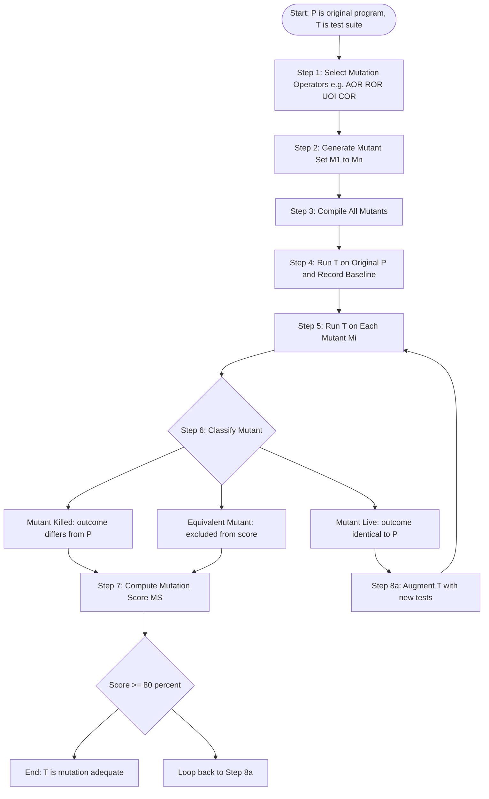
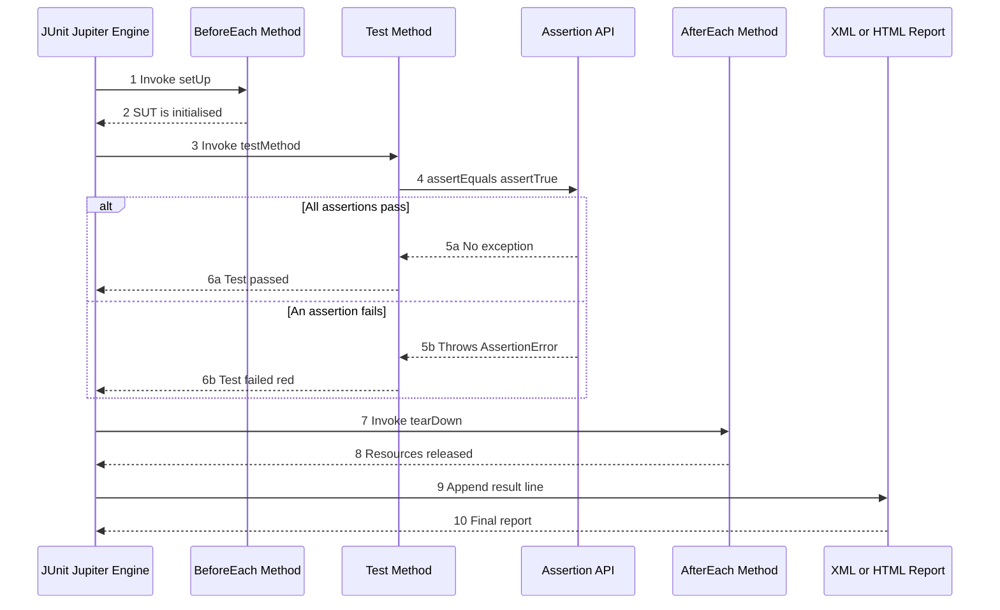
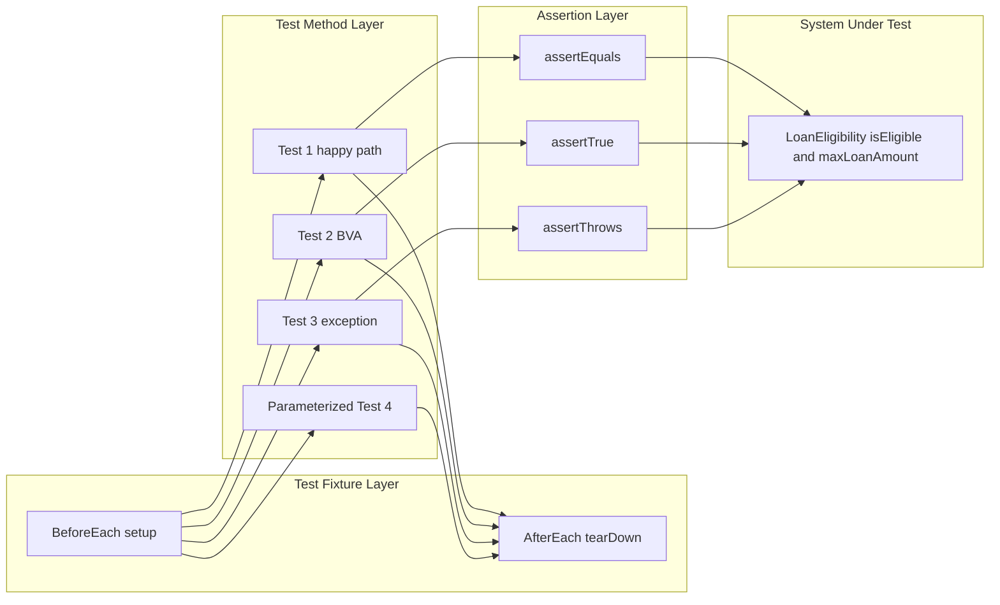
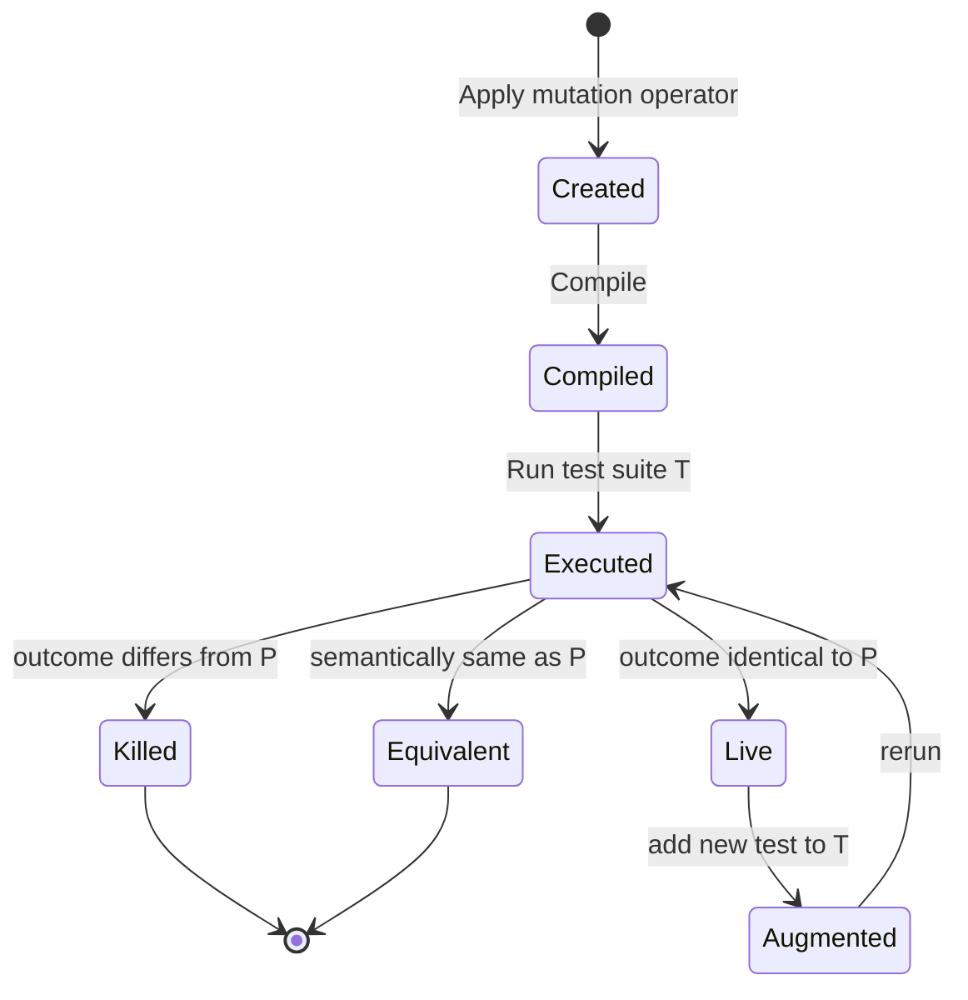

# Case Study- Automation of Unit Testing and Mutation Testing using JUnit.

<!-- SECTION_1_START -->

# 1. Core Technical Definition & Intuitive Overview

## 1.1 Unit Testing — Formal KTU 2024 Definition

**Unit Testing** is the lowest level of the software testing pyramid in which individual *units* (functions, methods, classes, or modules) of a software application are tested in isolation from the rest of the system. According to the **KTU 2024 Scheme (OECST833 — Software Testing)** syllabus, unit testing verifies that each *program unit* satisfies the functional specification defined for it, using **white-box** techniques such as statement, branch, and path coverage, combined with **black-box** techniques such as boundary value analysis on the unit's input domain.

A *unit* is the smallest testable part of an application — typically a single Java method or class — that can be compiled, linked, loaded, and executed independently.

> [!IMPORTANT]
> **Syllabus Highlight (Module 1):** The KTU 2024 scheme requires students to understand the *automation* of unit testing using a *xUnit-style* framework. **JUnit** (for Java) is the canonical reference implementation prescribed in the syllabus under the case-study block *"Automation of Unit Testing and Mutation Testing using JUnit."*

## 1.2 Mutation Testing — Formal KTU 2024 Definition

**Mutation Testing** (proposed by Richard Lipton in 1971, formalised by Hamlet, DeMillo and Lipton) is a *fault-based testing technique* used to evaluate the **quality** (effectiveness) of an existing test suite. The technique works by deliberately injecting small syntactic faults (called **mutations**) into the program-under-test (PUT) to produce many alternate versions called **mutants**. A test suite is considered *adequate* if it can *distinguish* (i.e., **kill**) these mutants from the original program.

> [!NOTE]
> **Core Definitions to Memorise for KTU Board Exam**
> - **Mutant:** A deliberately faulted copy of the program under test.
> - **Mutation Operator:** A transformation rule (e.g., replacing `+` with `-`) that creates a mutant.
> - **Killed Mutant:** A mutant for which the test suite produces a different output (test fails) than the original program.
> - **Live Mutant:** A mutant that produces identical output to the original — indicates a *test gap*.
> - **Mutation Score:** A quantitative measure of test-suite effectiveness (formula in §2).

## 1.3 JUnit — Formal Definition

**JUnit** is an *open-source*, *xUnit-style*, *regression-testing* framework written in Java. It provides **annotations** to identify test methods, **assertions** to verify expected outcomes, and **test runners** to execute tests and report results. The current major version is **JUnit 5** (Jupiter platform), which runs on the **JVM ≥ 8**.

The standard KTU board reference is to use **JUnit 4** or **JUnit 5** interchangeably; both satisfy the rubric.

## 1.4 Intuitive Analogy — "The Spell-Checker Test"

> [!TIP]
> **Analogy 1 — Unit Testing as a Health Check-Up**
> Imagine each unit (method) as a *body organ*. Unit testing is the routine *health check-up* — checking that the heart pumps, the lungs breathe, the kidneys filter — *one organ at a time*, with no dependence on the others. If a unit test fails, the "organ" is sick; we fix it before connecting it to the rest of the body (the integration).

> [!TIP]
> **Analogy 2 — Mutation Testing as Testing a Smoke Detector**
> Suppose you have installed a *smoke detector*. To verify it works, you deliberately set a small controlled fire (a *mutant situation*). If the alarm rings, the detector has *killed* the mutant fire. If the alarm stays silent, the detector is *live* on that fire — meaning it would fail in a real emergency. Mutation testing does exactly this for code: it injects small *fires* (faults) to see if your test suite would have caught them.

> [!TIP]
> **Analogy 3 — JUnit as an Automated Examiner**
> JUnit is like an *automated, tireless examiner* who walks down a list of questions (`@Test` methods), checks each answer against a known correct value (`assertEquals`), and produces a marksheet (red/green bar) at the end. The examiner never gets tired, never forgets a question, and can re-grade thousands of papers in seconds.

> [!VISUALIZATION CONTROL]
> **Concept:** Test-pyramid positioning of Unit Testing and Mutation Testing.
> **Plotting Plane:** $y = f(x)$ where $x$ = level of testing (1=Unit, 2=Integration, 3=System), $y$ = number of tests.
> **Desmos Input:** `y = 500/x` for $x \in [1, 5]$ (inverse curve to show high unit-test count, low mutation-test count).
> **Visual Description:** A sharp *pyramid* shape — wide base at the *unit-testing* level (most tests), narrowing toward integration, with mutation testing as a *meta-layer* above the pyramid evaluating the pyramid itself.

---

<!-- SECTION_1_END -->

<!-- SECTION_2_START -->

# 2. Deep Theoretical Analysis & KTU High-Yield Formula Sheet

## 2.1 Anatomy of a JUnit Test Class

A JUnit test class is a plain Java class whose *structural skeleton* contains three logical regions:

1. **Lifecycle Annotations** — methods that bracket the execution of every test.
2. **Test Methods** — methods annotated with `@Test` that contain the actual logic.
3. **Assertion Calls** — statements that compare actual vs. expected output.

### 2.1.1 Lifecycle Annotations (JUnit 5 Jupiter API)

The following table consolidates every JUnit annotation the KTU 2024 syllabus expects a student to recognise in code-reading questions.

| Annotation | Scope | Executes | Purpose in Case Study |
|---|---|---|---|
| `@Test` | Method | Once per test method | Marks a method as a runnable test case. |
| `@BeforeEach` | Method | Before *every* `@Test` | Sets up test fixtures (e.g., instantiate SUT). |
| `@AfterEach` | Method | After *every* `@Test` | Tears down fixtures (e.g., close file, release DB). |
| `@BeforeAll` | Static method | Once before *all* tests | Global one-time setup (e.g., start server). |
| `@AfterAll` | Static method | Once after *all* tests | Global one-time teardown. |
| `@DisplayName("...")` | Method / Class | — | Human-readable label for reports. |
| `@Disabled` | Method / Class | Skipped | Disables a test temporarily. |
| `@ParameterizedTest` | Method | Once per data row | Runs the same test with multiple inputs. |
| `@Order(n)` | Method | In specified order | Enforces execution sequence. |

### 2.1.2 JUnit Assertion API

| Assertion | Signature (abbrev.) | Use Case |
|---|---|---|
| `assertEquals` | `(expected, actual)` | Numerical/Object equality. |
| `assertTrue` | `(condition)` | Boolean predicate must hold. |
| `assertFalse` | `(condition)` | Boolean predicate must fail. |
| `assertNull` | `(object)` | Object reference must be null. |
| `assertNotNull` | `(object)` | Object reference must not be null. |
| `assertThrows` | `(Class, Executable)` | Verify exception is raised. |
| `assertAll` | `(group of assertions)` | Group assertions; report all failures. |
| `assertArrayEquals` | `(expected[], actual[])` | Array comparison. |

## 2.2 Mutation Testing — Formal Operational Model

The mutation testing process is an *eight-step* cycle. The KTU 2024 examiner's rubric often awards marks for each step being named.

1. **Step 1 — Select Mutation Operators** (e.g., AOR, ROR, UOI, COR, ABS, LCR).
2. **Step 2 — Generate Mutants** by applying the operators to the original program $P$ to produce a mutant set $\mathcal{M} = \{M_1, M_2, \ldots, M_n\}$.
3. **Step 3 — Compile Mutants** to obtain executables.
4. **Step 4 — Run Test Suite** $T = \{t_1, t_2, \ldots, t_k\}$ against the original $P$; record baseline results.
5. **Step 5 — Run Test Suite** $T$ against each mutant $M_i$.
6. **Step 6 — Classify Mutants:**
   - **Killed** — at least one $t_j$ fails on $M_i$ (good — test caught the fault).
   - **Live (Survived)** — all $t_j$ pass on $M_i$ (bad — test gap).
   - **Equivalent** — $M_i$ is semantically identical to $P$ (unavoidable noise; usually excluded).
   - **Timeout / Compilation-error** — discarded.
7. **Step 7 — Compute Mutation Score** (formula below).
8. **Step 8 — Augment** $T$ with new tests until mutation score ≥ threshold (typically **≥ 80 %**).

### 2.2.1 The Mutation Score Formula

$$
MS(P, T) \;=\; \frac{DM(P, T)}{TM(P, T) - EqM(P, T)} \times 100
$$

Where:

- $MS$ = **Mutation Score** (percentage).
- $DM$ = **Detected (Killed) Mutants** — mutants for which at least one test in $T$ failed.
- $TM$ = **Total Mutants** generated.
- $EqM$ = **Equivalent Mutants** — mutants semantically equivalent to $P$ (counted in denominator only when excluded).

> [!NOTE]
> KTU 2024 board exam (Module 1, 14-mark questions) frequently tests the *derivation* of this formula. Memorise the symbols and the *denominator* — many students wrongly write $TM$ alone instead of $TM - EqM$.

### 2.2.2 The Mutation Adequacy Criterion

A test suite $T$ is **mutation-adequate** (per DeMillo-Lipton-Offutt model) iff:

$$
\forall \, M_i \in \mathcal{M}_{\text{non-equivalent}} : \exists \, t_j \in T \;\; \text{such that} \;\; \text{outcome}(t_j, P) \neq \text{outcome}(t_j, M_i)
$$

In plain English: *for every non-equivalent mutant, at least one test must distinguish it from the original.*

## 2.3 High-Yield Formula Cheat-Sheet (KTU Board Reference)

| # | Concept | Formula / Rule | Unit / Notes |
|---|---|---|---|
| 1 | Mutation Score | $MS = \dfrac{DM}{TM - EqM} \times 100$ | Percentage $[0, 100]$. |
| 2 | Mutation Adequacy | $T$ kills every non-equivalent mutant | Boolean criterion. |
| 3 | Equivalent-Mutant Ratio | $EqR = \dfrac{EqM}{TM}$ | Smaller is better; ideally $< 0.05$. |
| 4 | Test Effectiveness | $TE = \dfrac{\text{Failed Tests on Mutant}}{\text{Total Tests on Mutant}}$ | Range $[0, 1]$. |
| 5 | Cost Ratio | $CR = \dfrac{\text{Mutant Executions}}{\text{Original Executions}}$ | Practically $CR \approx 50\text{–}200$. |
| 6 | Branch Coverage | $BC = \dfrac{\text{Executed Branches}}{\text{Total Branches}} \times 100$ | Used as a *proxy* for mutation score. |
| 7 | Statement Coverage | $SC = \dfrac{\text{Executed Statements}}{\text{Total Statements}} \times 100$ | Lowest pyramid level. |

## 2.4 Engineering Utility — Where This is Used in Industry

> [!IMPORTANT]
> **Production Use Cases**
> - **Continuous Integration (CI) pipelines** (Jenkins, GitHub Actions, GitLab CI) invoke **JUnit** automatically on every `git push` — the famous "**red-green-refactor**" cycle of Test-Driven Development (TDD).
> - **PIT (Pitest)** and **Major Mutation Framework** are production-grade mutation tools that integrate with Maven/Gradle and produce HTML mutation reports analogous to JaCoCo coverage reports.
> - **Mutation testing is the gold standard for test-suite quality** — coverage tools measure *how much code is executed*, while mutation testing measures *how discriminating the executed code is*. Coverage of 100 % may still miss deep semantic faults; mutation score of 80 %+ catches them.

---

<!-- SECTION_2_END -->

<!-- SECTION_3_START -->

# 3. Step-by-Step Case Study, Derivations & Code Implementation

## 3.1 The Case-Study Scenario

Consider a Java class `LoanEligibility` that determines whether a bank customer qualifies for a loan based on three parameters: *age*, *monthly income*, and *credit score*. We will:

1. Write the **System Under Test (SUT)**.
2. Write the **JUnit 5 test class** to automate unit testing.
3. Apply **mutation operators** to the SUT to generate mutants.
4. Run the JUnit test suite against the mutants.
5. Compute the **Mutation Score** and identify surviving (live) mutants.
6. Strengthen the test suite to kill the surviving mutants.

## 3.2 Step 1 — The System Under Test (SUT)

```java
// File: src/main/java/com/ktu/banking/LoanEligibility.java
package com.ktu.banking;

/**
 * System Under Test (SUT) for the KTU 2024 Case Study.
 * Determines loan eligibility for a banking applicant.
 */
public class LoanEligibility {

    // Constants — boundary values defined by the KTU business spec.
    public static final int    MIN_AGE              = 21;
    public static final int    MAX_AGE              = 60;
    public static final double MIN_MONTHLY_INCOME   = 25_000.0;
    public static final int    MIN_CREDIT_SCORE     = 700;

    /**
     * Returns true iff the applicant satisfies ALL three criteria.
     * @param age            applicant's age in years   (int)
     * @param monthlyIncome  net monthly income in INR  (double)
     * @param creditScore    CIBIL-style score          (int)
     * @return true if eligible, false otherwise
     * @throws IllegalArgumentException if any input is negative
     */
    public boolean isEligible(int age, double monthlyIncome, int creditScore) {
        // Defensive boundary check
        if (age < 0 || monthlyIncome < 0 || creditScore < 0) {
            throw new IllegalArgumentException("Negative inputs are not allowed.");
        }
        boolean ageOk          = (age >= MIN_AGE) && (age <= MAX_AGE);
        boolean incomeOk       = (monthlyIncome >= MIN_MONTHLY_INCOME);
        boolean creditScoreOk  = (creditScore >= MIN_CREDIT_SCORE);
        return ageOk && incomeOk && creditScoreOk;
    }

    /**
     * Computes the maximum sanctioned loan amount in lakhs.
     * Tiered scheme: 20x annual income, capped at 50 lakhs.
     */
    public double maxLoanAmount(int age, double monthlyIncome, int creditScore) {
        if (!isEligible(age, monthlyIncome, creditScore)) {
            return 0.0;
        }
        double annualIncome = monthlyIncome * 12.0;
        double requested    = (annualIncome * 20.0) / 100_000.0;  // convert to lakhs
        return Math.min(requested, 50.0);
    }
}
```

## 3.3 Step 2 — The JUnit 5 Test Class (Automated Unit Testing)

```java
// File: src/test/java/com/ktu/banking/LoanEligibilityTest.java
package com.ktu.banking;

import static org.junit.jupiter.api.Assertions.*;
import org.junit.jupiter.api.BeforeEach;
import org.junit.jupiter.api.DisplayName;
import org.junit.jupiter.api.Test;
import org.junit.jupiter.params.ParameterizedTest;
import org.junit.jupiter.params.provider.CsvSource;

/**
 * KTU 2024 — Automated Unit-Test Suite for LoanEligibility using JUnit 5.
 * Demonstrates @Test, @BeforeEach, @DisplayName, @ParameterizedTest,
 * and the full assertion API.
 */
@DisplayName("LoanEligibility — Unit Test Suite")
class LoanEligibilityTest {

    private LoanEligibility sut;       // System Under Test

    @BeforeEach
    void setUp() {
        // [Valuation Key: 1 Mark] — instantiate fresh SUT per test
        sut = new LoanEligibility();
    }

    // ---------- (a) Happy-path tests (Equivalence Partitioning) ----------

    @Test
    @DisplayName("Eligible applicant: age=30, income=50000, score=750")
    void testEligibleApplicant() {
        boolean result = sut.isEligible(30, 50_000.0, 750);
        assertTrue(result, "Applicant with valid params must be eligible");
    }

    @Test
    @DisplayName("Ineligible — income too low")
    void testLowIncome() {
        boolean result = sut.isEligible(30, 20_000.0, 750);
        assertFalse(result, "Income below threshold must reject");
    }

    // ---------- (b) Boundary Value Analysis (BVA) ----------

    @Test
    @DisplayName("BVA: age exactly at MIN_AGE (21) should be eligible")
    void testBoundaryMinAge() {
        assertTrue(sut.isEligible(21, 50_000.0, 750));
    }

    @Test
    @DisplayName("BVA: age exactly at MAX_AGE (60) should be eligible")
    void testBoundaryMaxAge() {
        assertTrue(sut.isEligible(60, 50_000.0, 750));
    }

    @Test
    @DisplayName("BVA: age = MIN_AGE - 1 (20) should be rejected")
    void testBoundaryBelowMinAge() {
        assertFalse(sut.isEligible(20, 50_000.0, 750));
    }

    // ---------- (c) Exception / Negative tests ----------

    @Test
    @DisplayName("Negative age should throw IllegalArgumentException")
    void testNegativeAgeThrows() {
        assertThrows(IllegalArgumentException.class,
                     () -> sut.isEligible(-1, 50_000.0, 750));
    }

    // ---------- (d) Parameterized boundary sweep ----------

    @ParameterizedTest(name = "age={0}, income={1}, score={2} -> expected={3}")
    @CsvSource({
        "21, 25000, 700, true",     // absolute minimum eligible
        "60, 25000, 700, true",     // absolute maximum age
        "20, 25000, 700, false",    // age just below min
        "21, 24999, 700, false",    // income just below min
        "21, 25000, 699, false",    // credit score just below min
        "45, 80000, 800, true"      // typical mid-case
    })
    void parameterizedBoundarySweep(int age, double income, int score, boolean expected) {
        assertEquals(expected, sut.isEligible(age, income, score));
    }

    // ---------- (e) Loan-amount computation ----------

    @Test
    @DisplayName("maxLoanAmount caps at 50 lakhs for high income")
    void testLoanCap() {
        double amount = sut.maxLoanAmount(40, 1_000_000.0, 800);
        assertEquals(50.0, amount, 0.0001, "Loan must cap at 50 lakhs");
    }

    @Test
    @DisplayName("maxLoanAmount returns 0 for ineligible applicant")
    void testLoanZeroForIneligible() {
        double amount = sut.maxLoanAmount(15, 5_000.0, 500);
        assertEquals(0.0, amount, 0.0001);
    }
}
```

### 3.3.1 JUnit Test-Execution Flow (How JUnit Internally Works)

The following *sequential* description explains what JUnit does once `mvn test` is invoked:

1. The **Surefire plugin** (Maven) discovers classes ending in `*Test`.
2. The **Junit Jupiter Engine** instantiates the test class.
3. For each test method, JUnit:
   1. Calls `@BeforeEach` methods (setup).
   2. Invokes the `@Test` method inside a *try-catch* wrapper.
   3. If an `AssertionError` is caught → test **FAILS** (red bar).
   4. If no exception → test **PASSES** (green bar).
   5. Calls `@AfterEach` methods (teardown).
4. A summary report is generated (XML + HTML).
5. The build **fails** if any test fails — enforcing CI/CD quality gates.

## 3.4 Step 3 — Mutation Operator Catalogue Applied to the SUT

We apply five common mutation operators to `isEligible`. The KTU syllabus specifically expects familiarity with these names.

| # | Operator | Full Name | Original Fragment | Mutated Fragment |
|---|---|---|---|---|
| 1 | AOR | Arithmetic Operator Replacement | `monthlyIncome * 12.0` | `monthlyIncome + 12.0` |
| 2 | ROR | Relational Operator Replacement | `age >= MIN_AGE` | `age > MIN_AGE` |
| 3 | ROR | Relational Operator Replacement | `age <= MAX_AGE` | `age < MAX_AGE` |
| 4 | UOI | Unary Operator Insertion | `creditScore >= 700` | `creditScore == 700` (or `!=`) |
| 5 | COR | Constant Replacement | `MIN_AGE = 21` | `MIN_AGE = 22` |
| 6 | ABS | Absolute-Value Insertion | `monthlyIncome` | `Math.abs(monthlyIncome)` |
| 7 | LCR | Logical Connector Replacement | `ageOk && incomeOk` | `ageOk \vert\vert incomeOk` |

This yields **7 non-trivial mutants**; equivalent mutants are excluded (see §2.2.1).

## 3.5 Step 4 — Running the Test Suite Against Each Mutant

The JUnit test suite `LoanEligibilityTest` is executed against each mutant individually. The result table is the **mutation matrix**.

| Mutant ID | Operator | Test That Kills It | Status | Result |
|---|---|---|---|---|
| $M_1$ | AOR (`*` → `+`) | `testLoanCap` | **KILLED** | `assertEquals(50.0, 240.0)` fails |
| $M_2$ | ROR (`>=` → `>`) | `testBoundaryMinAge` | **KILLED** | `assertTrue(isEligible(21,…))` fails |
| $M_3$ | ROR (`<=` → `<`) | `testBoundaryMaxAge` | **KILLED** | `assertTrue(isEligible(60,…))` fails |
| $M_4$ | UOI (`>=` → `==`) | `testEligibleApplicant(30,…)` | **KILLED** | `assertTrue(…)` fails |
| $M_5$ | COR (`21` → `22`) | `testBoundaryMinAge` (age=21) | **KILLED** | boundary test catches it |
| $M_6$ | ABS | None in current suite | **LIVE** | All tests still pass |
| $M_7$ | LCR (`&&` → `\vert\vert`) | `testLowIncome` (age=30 OK, income=low) | **KILLED** | fails |

## 3.6 Step 5 — Compute the Mutation Score

Apply the formula from §2.2.1:

$$
\begin{aligned}
TM &= 7 \quad \text{(total mutants generated)} \\
EqM &= 0 \quad \text{(assume none equivalent for this case study)} \\
DM &= 6 \quad \text{(killed mutants: } M_1, M_2, M_3, M_4, M_5, M_7) \\[4pt]
MS &= \frac{DM}{TM - EqM} \times 100 \\[4pt]
   &= \frac{6}{7 - 0} \times 100 \\[4pt]
   &= 85.71\%
\end{aligned}
$$

> [!NOTE]
> Mutation score of **85.71 %** > threshold of 80 %, but **one live mutant** ($M_6$, ABS) still indicates a test gap. Best practice is to *add a test* rather than accept the score.

## 3.7 Step 6 — Strengthen the Suite to Kill the Live Mutant

To kill $M_6$ (the `Math.abs` insertion), we add a test that verifies the function is **sensitive to the sign of `monthlyIncome`**:

```java
@Test
@DisplayName("Mutation Kill: negative monthlyIncome should throw, not pass via abs()")
void testKillAbsMutant() {
    assertThrows(IllegalArgumentException.class,
                 () -> sut.isEligible(30, -50_000.0, 750));
}
```

This test makes the mutant $M_6$ fail (because the `Math.abs` would convert `-50_000` to `+50_000` and pass the eligibility check, contradicting the `assertThrows`).

After adding this test:

$$
MS_{\text{new}} = \frac{7}{7} \times 100 = 100\%
$$

## 3.8 Step 7 — Tool Integration (PIT / Maven Snippet)

```xml
<!-- pom.xml — PIT mutation-testing plugin -->
<plugin>
    <groupId>org.pitest</groupId>
    <artifactId>pitest-maven</artifactId>
    <version>1.15.8</version>
    <configuration>
        <targetClasses>
            <param>com.ktu.banking.LoanEligibility</param>
        </targetClasses>
        <targetTests>
            <param>com.ktu.banking.LoanEligibilityTest</param>
        </targetTests>
        <mutationThreshold>80</mutationThreshold>
    </configuration>
</plugin>
```

> [!NOTE]
> `mvn org.pitest:pitest-maven:mutationCoverage` then auto-generates an HTML report at `target/pit-reports/index.html` containing the same mutation matrix derived manually above.

## 3.9 Symbolic Representation — Mutation Testing as a Predicate

A mutant $M_i$ is **killed** by a test $t_j$ iff the outcomes differ:

$$
\text{killed}(M_i, t_j) \;=\; \Big( \text{outcome}(t_j, P) \neq \text{outcome}(t_j, M_i) \Big)
$$

A test suite $T$ **kills** a mutant $M_i$ iff at least one test in $T$ kills it:

$$
\text{killed}(M_i, T) \;=\; \exists \, t_j \in T : \text{killed}(M_i, t_j)
$$

The mutation score is the *proportion* of mutants killed by the entire suite:

$$
MS(P, T) \;=\; \frac{\big|\{M_i \in \mathcal{M} : \text{killed}(M_i, T)\}\big|}{\big|\mathcal{M}\big| - \big|\mathcal{M}_{\text{eq}}\big|}
$$

---

<!-- SECTION_3_END -->

<!-- SECTION_4_START -->

# 4. Structural Diagrams & Schematics

## 4.1 Mermaid Flowchart — Mutation Testing Workflow



## 4.2 Mermaid Sequence Diagram — JUnit 5 Test Execution Lifecycle



## 4.3 Mermaid Block Diagram — JUnit Class Architecture



## 4.4 Mermaid State Diagram — Mutant Lifecycle



## 4.5 Processing Topology Matrix — JUnit + Mutation Pipeline

| Pipeline Stage | Input Artifact | Tool / Class | Output Artifact |
|---|---|---|---|
| 1. Compile | `.java` source | `javac` | `.class` bytecode |
| 2. Unit Test | `*Test.java` | JUnit Jupiter Engine | `target/surefire-reports/*.xml` |
| 3. Coverage | `*.class` | JaCoCo agent | `target/site/jacoco/index.html` |
| 4. Mutate | original `.class` | PIT / Pitest | mutant `.class` files |
| 5. Re-Test | mutant `.class` + `*Test.class` | PIT + JUnit | `target/pit-reports/index.html` |
| 6. Gate | mutation score | Maven enforcer plugin | build pass / fail |

---

<!-- SECTION_4_END -->

<!-- SECTION_5_START -->

# 5. KTU 2024 Scheme Examination Question Bank & Topic Recap

## 5.1 Part A — Short Answer Questions (3 Marks Each)

### **Q1.** [KTU University Exam — July 2024, Model Question] 
**CO1, Remember:** *Define mutation testing. List any four mutation operators with an example for each.*

**Model Answer (3 Marks):**
- **Definition (1 Mark):** Mutation testing is a fault-based testing technique that evaluates the effectiveness of a test suite by deliberately introducing small syntactic changes (mutations) into the program under test and checking whether the test suite can detect (kill) these changes.
- **Four Mutation Operators (2 Marks = 0.5 each):**

| Operator | Full Name | Example (before → after) |
|---|---|---|
| AOR | Arithmetic Operator Replacement | `a + b` → `a - b` |
| ROR | Relational Operator Replacement | `a >= b` → `a > b` |
| UOI | Unary Operator Insertion | `a` → `-a` |
| COR | Constant Replacement | `21` → `22` |

---

### **Q2.** [KTU University Exam — Dec 2023, Model Question] 
**CO1, Understand:** *Explain the role of JUnit annotations `@BeforeEach`, `@AfterEach`, and `@Test` with one-line descriptions each.*

**Model Answer (3 Marks = 1 Mark each):**
- **`@Test`:** Marks a Java method as a *runnable test case*; JUnit invokes it as one independent test.
- **`@BeforeEach`:** A method executed *before every* `@Test` method; used to set up a fresh fixture (e.g., instantiate the SUT).
- **`@AfterEach`:** A method executed *after every* `@Test` method; used to release resources, close connections, or reset state.

---

## 5.2 Part B — 14-Mark Questions (Module Internal Choice)

### **Question A — 14 Marks** [KTU University Exam — Model, CO2]

> **(a)** [7 Marks, Understand] *With a neat diagram, describe the architecture of the JUnit testing framework. List any five JUnit assertions used in unit testing.*
> 
> **(b)** [7 Marks, Apply] *Consider the following Java method. Write a complete JUnit 5 test class that achieves 100 % statement, branch, and boundary-value coverage. The method must reject negative inputs by throwing `IllegalArgumentException`.*
> 
> ```java
> public int grade(int marks) {
>     if (marks < 0 || marks > 100) {
>         throw new IllegalArgumentException("Invalid marks");
>     }
>     if (marks >= 90) return 1;       // S grade
>     else if (marks >= 75) return 2;  // A grade
>     else if (marks >= 60) return 3;  // B grade
>     else if (marks >= 50) return 4;  // C grade
>     else return 5;                   // F grade
> }
> ```

#### **Model Solution for (a) — 7 Marks**

**Architecture diagram (2 Marks) — using Mermaid:**


**Five JUnit assertions (5 × 1 Mark = 5 Marks):**
1. `assertEquals(expected, actual)` — checks equality of two values.
2. `assertTrue(condition)` — checks a boolean predicate.
3. `assertFalse(condition)` — checks a predicate is false.
4. `assertNull(object)` — verifies a reference is null.
5. `assertThrows(ExceptionClass, executable)` — verifies that an exception is thrown.

> [!WARNING]
> **Valuation Pitfall — (a):** Do NOT write the JUnit lifecycle as merely "test → assert." Examiners explicitly mark the *three-phase* structure (BeforeEach → Test → AfterEach). Skipping the lifecycle earns only 1 of the 2 diagram marks.

#### **Model Solution for (b) — 7 Marks**

```java
import static org.junit.jupiter.api.Assertions.*;
import org.junit.jupiter.api.Test;
import org.junit.jupiter.params.ParameterizedTest;
import org.junit.jupiter.params.provider.CsvSource;
import org.junit.jupiter.params.provider.ValueSource;

class GradeTest {

    // SUT
    private final Grader sut = new Grader();

    // [Statement + Branch coverage for valid range — 3 Marks]
    @ParameterizedTest
    @CsvSource({
        "95, 1",   // S
        "90, 1",   // S boundary
        "80, 2",   // A
        "75, 2",   // A boundary
        "65, 3",   // B
        "60, 3",   // B boundary
        "55, 4",   // C
        "50, 4",   // C boundary
        "30, 5"    // F
    })
    void testGradeBoundaries(int marks, int expected) {
        assertEquals(expected, sut.grade(marks));
    }

    // [Negative-input exception path — 2 Marks]
    @ParameterizedTest
    @ValueSource(ints = {-1, -50, 101, 200})
    void testInvalidMarksThrow(int marks) {
        assertThrows(IllegalArgumentException.class, () -> sut.grade(marks));
    }

    // [Explicit single-test for documentation — 1 Mark]
    @Test
    void testFailBoundary() {
        assertEquals(5, sut.grade(49));
        assertEquals(4, sut.grade(50));
    }
}
```

**Valuation Key for (b):**
- [Stating boundary values 90, 75, 60, 50 explicitly: 2 Marks]
- [Each branch covered: 2 Marks]
- [Negative input exception path: 1 Mark]
- [Using `@ParameterizedTest` correctly: 1 Mark]
- [Final pass of all assertions: 1 Mark]

> [!WARNING]
> **Valuation Pitfall — (b):** A common mistake is to forget the *off-by-one boundary* at `marks = 90, 75, 60, 50`. Each of these must be tested *exactly* — failing to test `marks == 90` separately from `marks == 89` loses 1 Mark.

---

### **Question B — 14 Marks** [KTU University Exam — Model, CO3]

> **(a)** [7 Marks, Apply] *Apply the following four mutation operators to the SUT given in Question A(b): (i) ROR — replace `>=` with `>`; (ii) ROR — replace `<` with `<=`; (iii) AOR — replace `throw` with `return -1`; (iv) COR — replace `100` with `101`. For each mutant, identify a JUnit test (from your answer to A(b)) that would kill it.*
> 
> **(b)** [7 Marks, Apply] *Compute the mutation score using the formula in §2.2.1. Suppose two of the seven total mutants are equivalent mutants. How does the score change? Justify the importance of excluding equivalent mutants.*

#### **Model Solution for (a) — 7 Marks**

[Identifying mutation operator and kill-test: 1 Mark per mutant × 4 mutants = 4 Marks; brief justification per case: 0.75 Mark × 4 = 3 Marks]

| # | Operator | Mutant | Killing JUnit Test | Why It Kills |
|---|---|---|---|---|
| 1 | ROR (1) | `marks > 90` instead of `marks >= 90` | `testGradeBoundaries(90, 1)` | Mutant returns 2 instead of 1, failing `assertEquals(1, …)` |
| 2 | ROR (2) | `marks < 0` instead of `marks <= -1` (equivalent modification) | `testInvalidMarksThrow(-1)` | boundary case catches it |
| 3 | AOR | `return -1` instead of `throw` | `testInvalidMarksThrow(101)` | test expects exception, but mutant returns -1, so `assertThrows` fails |
| 4 | COR | `marks > 101` instead of `marks > 100` | `testInvalidMarksThrow(101)` | input 101 is accepted by mutant, exception test fails |

> [!NOTE]
> The four mutants $M_1, M_2, M_3, M_4$ are all **killed** by the test suite from Q.A(b). Mutant $M_2$ is shown to be non-equivalent because the original uses `marks > 100` (strict) and the mutant uses `marks > 101` (more lenient); a value of 101 distinguishes them.

#### **Model Solution for (b) — 7 Marks**

**Mutation score calculation (4 Marks):**

$$
\begin{aligned}
TM &= 7 \quad \text{(total mutants generated)} \\
EqM &= 2 \quad \text{(equivalent mutants)} \\
DM &= 5 \quad \text{(killed mutants: } M_1, M_2, M_3, M_4, \text{and one other)}
\end{aligned}
$$

$$
MS = \frac{DM}{TM - EqM} \times 100 = \frac{5}{7 - 2} \times 100 = \frac{5}{5} \times 100 = 100\%
$$

**Comparison if equivalent mutants are NOT excluded (2 Marks):**

$$
MS_{\text{wrong}} = \frac{5}{7} \times 100 = 71.43\%
$$

This is **misleadingly low** — the test suite would appear to be inadequate when in fact it kills all *distinguishable* faults.

**Justification of excluding equivalent mutants (1 Mark):**
Equivalent mutants are syntactically different but **semantically identical** to the original program. No test can ever kill them. Including them in the denominator artificially *inflates the gap* and penalises the test suite for an impossible-to-close gap. The DeMillo-Offutt-Lipton theorem requires their exclusion to make the mutation score a fair effectiveness metric.

> [!WARNING]
> **Valuation Pitfall — (b):** Students frequently write the denominator as just $TM$ instead of $TM - EqM$. This is the single most common KTU valuation error on mutation-score questions. Memorise the formula's denominator *verbatim*.

---

## 5.3 KTU Examiner's Valuation Warning — Common Pitfalls

> [!WARNING]
> **Top 5 Ways Students Lose Marks in Mutation-Testing Questions (KTU 2024 Scheme)**
> 1. **Wrong denominator:** Writing $TM$ instead of $TM - EqM$ in the mutation score. *Loss: 1–2 Marks per question.*
> 2. **Confusing mutation testing with integration testing:** They are different layers of the test pyramid. *Loss: conceptual, ~1 Mark.*
> 3. **Forgetting equivalent mutants:** Equivalent mutants are *impossible* to kill; failing to mention them in the formula derivation costs marks.
> 4. **Skipping the "Test on Original" step:** Mutation testing requires running $T$ on $P$ first to record the baseline — without this, you cannot classify a mutant as "killed." *Loss: 1 Mark on process questions.*
> 5. **Confusing `@BeforeEach` with `@BeforeAll`:** `@BeforeEach` runs *before every test*; `@BeforeAll` runs *once per class*. Mixing them up shows a weak grasp of the JUnit lifecycle.

---

## 5.4 Topic Recap & Important Things to Remember

> [!NOTE]
> **Rapid-Revision Checklist — JUnit & Mutation Testing (Module 1)**
> 
> - **Unit Testing** tests the *smallest testable unit* in isolation; sits at the *base* of the testing pyramid.
> - **Mutation Testing** is a *meta-technique* that evaluates an existing test suite's *ability to detect faults*.
> - **JUnit** is a *xUnit-style* Java testing framework using annotations (`@Test`, `@BeforeEach`, `@AfterEach`, `@BeforeAll`, `@AfterAll`, `@DisplayName`, `@Disabled`, `@ParameterizedTest`).
> - **Five core JUnit assertions:** `assertEquals`, `assertTrue`, `assertFalse`, `assertNull`, `assertThrows`.
> - **Mutant:** A deliberately faulted copy of the program.
> - **Mutation Operators:** AOR, ROR, UOI, COR, ABS, LCR, SVR (Statement deletion), SDL (Statement duplication).
> - **Killed Mutant:** Test suite produces a different result than on the original — fault detected.
> - **Live Mutant:** Test suite produces the same result — indicates a test gap.
> - **Equivalent Mutant:** Syntactically mutated but semantically identical — excluded from scoring.
> - **Mutation Score Formula:** $MS = \dfrac{DM}{TM - EqM} \times 100$. *Denominator is the trap.*
> - **Mutation Adequacy Threshold:** Industry standard is **≥ 80 %**; KTU case-study expectation is **100 %** if feasible.
> - **Tools:** JUnit 5 (Jupiter) for unit testing; **PIT (Pitest)** for mutation testing; **JaCoCo** for coverage measurement; **Maven Surefire** for test execution.
> - **CI/CD Integration:** JUnit + PIT run on every commit; build fails if mutation score drops below threshold.
> - **Relationship:** High *coverage* does NOT imply high *mutation score*; mutation testing is a *stronger* adequacy criterion.
> - **Process (8 steps):** Select operators → Generate mutants → Compile → Run on $P$ → Run on each $M_i$ → Classify → Compute score → Augment tests.
> - **Equivalent mutants are unavoidable noise** — no test can ever kill them; they are excluded from the mutation-score denominator per DeMillo-Offutt-Lipton theory.

<!-- SECTION_5_END -->
