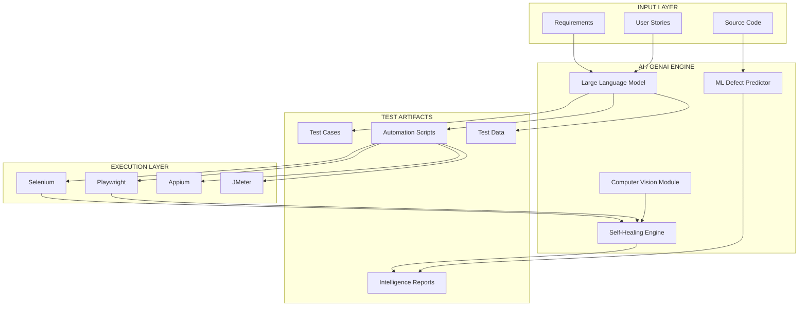
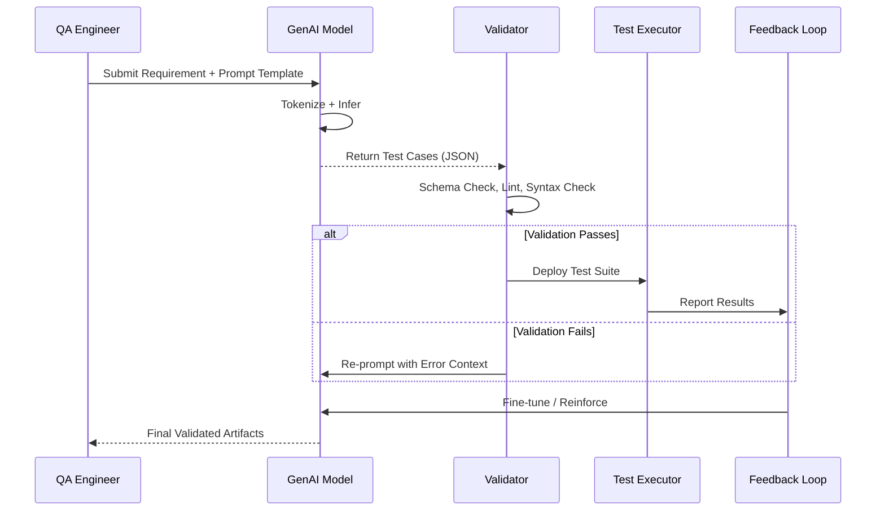
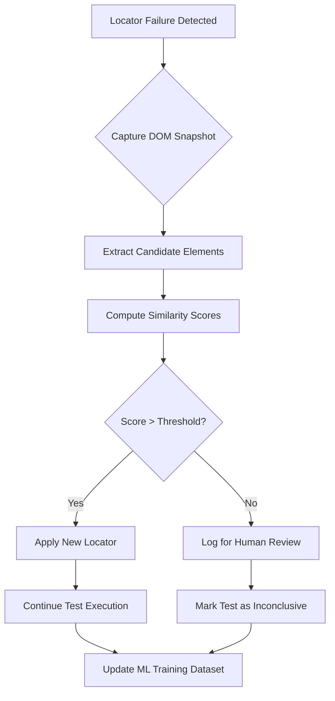
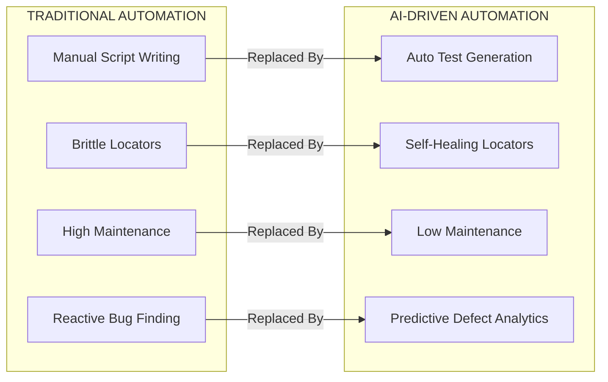
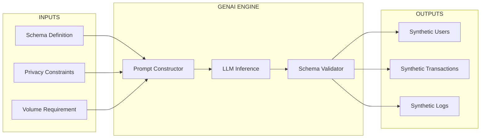
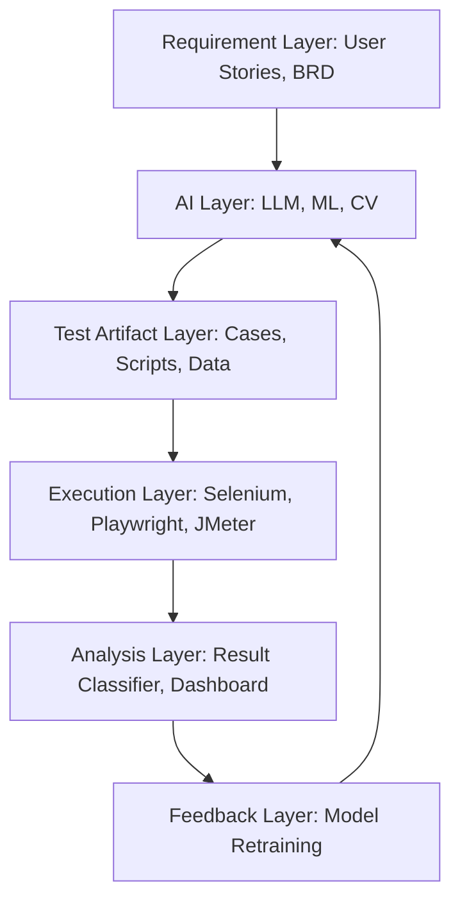

# Industry Trends - AI in test case automation, Introduction to GenAI in testing

<!-- SECTION_1_START -->
# AI in Test Case Automation & Introduction to GenAI in Testing

> [!NOTE]
> **KTU 2024 Scheme – OECST833 Software Testing | Module 1**
> This module lays the conceptual foundation for **Industry Trends in Software Test Automation**, with a sharp focus on the paradigm shift caused by **Artificial Intelligence (AI)** and **Generative AI (GenAI)** in modern Quality Engineering practices.

## 1.1 Core Technical Definition

> [!IMPORTANT]
> **Definition (KTU Board Standard):**
> *AI-driven Test Automation* is the application of **Machine Learning (ML)**, **Natural Language Processing (NLP)**, and **Computer Vision** algorithms to software testing activities — enabling systems to **autonomously generate, execute, prioritize, maintain, and self-heal** test cases with minimal human intervention.

> [!IMPORTANT]
> **Definition (GenAI in Testing):**
> *Generative AI (GenAI) in Testing* refers to the use of **Large Language Models (LLMs)** such as GPT-4, Claude, and LLaMA to **create novel test artifacts** — test cases, test data, test scripts, bug reports, and summaries — by understanding natural language requirements, existing code, or user stories.

## 1.2 Conceptual Analogy — The "Self-Driving Car" of Testing

Imagine traditional test automation as a **GPS-guided car**:

- You must pre-program every route (script every step).
- If a road is closed (UI element changes), the car stops.

Now imagine **AI-driven testing as a Tesla on Autopilot**:

- It **observes** the road (DOM, network, logs) in real time.
- It **predicts** obstacles (flaky locators, broken assertions).
- It **reroutes** itself — this is called **Self-Healing Automation**.
- **GenAI** is the **voice assistant**: you simply *say* "write 20 negative test cases for a login page" and it generates them.

> [!NOTE]
> **Key Engineering Insight:** AI does not *replace* testers — it **augments** them by automating repetitive cognitive labor, allowing engineers to focus on **exploratory testing**, **risk analysis**, and **architecture-level quality decisions**.

## 1.3 Why This Topic Matters in KTU 2024 (Industry 4.0 Alignment)

The **NEP 2020** and **KTU 2024 Scheme** emphasize *Outcome-Based Education (OBE)* with industry readiness. Companies like **Google, Microsoft, Netflix, Infosys, TCS** have already integrated AI/GenAI into their QA pipelines. KTU examiners reward answers that demonstrate awareness of:

- **Shift-Left Testing** with AI
- **AI-Augmented Test Generation**
- **Predictive Defect Analytics**
- **Ethical & Bias considerations in AI-driven QA**

> [!VISUALIZATION CONTROL]
> **Concept:** The Evolution of Test Automation — A Timeline Curve
> **Visualization Logic (Mental Plot):**
> * X-axis: Years (2010 → 2025+)
> * Y-axis: Human Effort in Testing (decreasing curve)
> * Curve Type: Exponential decay superimposed with an AI adoption S-curve
> * **Observation:** Manual scripting (2010) → Record/Playback (2015) → Keyword-Driven (2018) → AI-Assisted (2021) → GenAI-First (2024+). Students should visualize an S-curve adoption pattern where GenAI is at the inflection point in 2024.
<!-- SECTION_1_END -->

<!-- SECTION_2_START -->
# Deep Theoretical Analysis & KTU High-Yield Formula Sheet

## 2.1 Taxonomy of AI Techniques Used in Testing

| AI Technique | Full Form | Application in Testing | Example Tools |
|--------------|-----------|------------------------|---------------|
| ML | Machine Learning | Defect prediction, test prioritization | Azure DevOps ML, TestCraft |
| NLP | Natural Language Processing | Convert user stories → test cases | Testim, Functionize |
| CV | Computer Vision | Visual regression testing | Applitools Eyes, Percy |
| RL | Reinforcement Learning | Optimal test sequence generation | EvoSuite |
| LLM | Large Language Model | Generative test creation | GitHub Copilot, ChatGPT, CodiumAI |
| GAN | Generative Adversarial Network | Synthetic test data generation | Mostly research-grade |
| DL | Deep Learning | Anomaly detection in logs | Splunk AI, Datadog Watchdog |

## 2.2 Core AI Capabilities in Modern Test Automation

1. **Test Case Generation (Auto-Generation)**
   - *Heuristic generation* — symbolic execution (e.g., EvoSuite for Java).
   - *LLM-based generation* — prompt-driven (e.g., "Generate boundary value tests for age field").
   - *Model-based generation* — deriving tests from UML/state diagrams.

2. **Self-Healing Automation**
   - When locators (XPath, CSS, ID) break due to UI changes, the AI engine:
     - Detects the failure (DOM diffing, visual diffing).
     - Searches for the most semantically similar element using **fuzzy matching** and **ML ranking models**.
     - Updates the locator **at runtime** — no script edit required.

3. **Predictive Test Prioritization**
   - Historical defect data + code churn metrics → ML model → ranked test suite.
   - Formula concept: $P(failure \mid test_i) = f(\text{churn}, \text{complexity}, \text{history})$.

4. **Visual & UX Testing (CV-Driven)**
   - Pixel-by-pixel comparison is **brittle**. AI compares **layouts, regions, and structures**.

5. **Flaky Test Detection**
   - ML classifies tests as *deterministic* vs *flaky* based on historical pass/fail patterns.

6. **Test Data Generation**
   - GenAI creates **realistic, privacy-safe synthetic data** (names, addresses, credit cards).

## 2.3 Introduction to GenAI in Testing — Deep Dive

> [!IMPORTANT]
> **GenAI = Foundation Models (LLMs) + Prompt Engineering + RAG + Fine-Tuning**

### 2.3.1 The GenAI Testing Pipeline

$$\text{Input} \rightarrow \text{Tokenization} \rightarrow \text{LLM Inference} \rightarrow \text{Output} \rightarrow \text{Validation} \rightarrow \text{Test Artifact}$$

### 2.3.2 Key GenAI Use Cases in QA (High-Yield for KTU)

| Use Case | Description | Example Prompt |
|----------|-------------|----------------|
| Test Case Synthesis | Convert user story to Gherkin | "Given...When...Then for login with invalid email" |
| Test Script Generation | Natural language → Selenium/Playwright code | "Write Playwright Python script for cart checkout" |
| Bug Report Drafting | Generate structured bug description from logs | "Analyze this stack trace and draft a Jira ticket" |
| Test Data Fabrication | Generate compliant test data | "Create 50 GDPR-safe user records" |
| Requirements Ambiguity Detection | Spot vague/conflicting requirements | "Identify ambiguities in this PRD" |
| Test Suite Summarization | Summarize 200 tests for stakeholder | "Summarize regression suite for payment module" |
| Mutation Testing Aid | Generate mutants automatically | "Create 10 mutants for this sorting function" |

### 2.3.3 The RAG Pattern for Test Knowledge

$$\text{Context} = \text{Retrieved Docs} + \text{User Prompt} \rightarrow \text{LLM} \rightarrow \text{Relevant Test Output}$$

This is critical in enterprise testing where **domain context** (banking, healthcare) matters.

## 2.4 Real-World Engineering Utility

| Industry | AI/GenAI Testing Use | Business Impact |
|----------|----------------------|----------------|
| E-Commerce (Amazon) | Visual + load test automation | 60% faster release cycles |
| Banking (HDFC, JPMorgan) | Fraud-rule test synthesis | Regulatory compliance |
| Healthcare (Epic) | Privacy-safe patient data generation | HIPAA compliance |
| Gaming (EA, Ubisoft) | AI-bot playtesting | 80% reduction in manual QA hours |
| Automotive (Tesla) | Self-driving scenario simulation | Safety validation |

> [!NOTE]
> **KTU High-Yield Insight:** When answering theory questions, always cite at least **one tool, one technique, and one measurable benefit** to score full marks.

## 2.5 KTU Formula Sheet — AI Testing Metrics

| Metric | Formula | Purpose |
|--------|---------|---------|
| Test Automation ROI | $\text{ROI} = \dfrac{\text{Saved Manual Hours} \times \text{Hourly Cost} - \text{AI Tool Cost}}{\text{AI Tool Cost}} \times 100\%$ | Justify AI investment |
| Defect Detection Rate (DDR) | $\text{DDR} = \dfrac{\text{Defects found by AI}}{\text{Total defects in production}} \times 100\%$ | Measure AI efficacy |
| Self-Healing Success Rate | $\text{SHSR} = \dfrac{\text{Successful auto-fixes}}{\text{Total locator failures}} \times 100\%$ | Reliability metric |
| Flakiness Index | $F = \dfrac{\text{Inconsistent pass/fail count}}{\text{Total executions}}$ | Identify noisy tests |
| Code Coverage by AI Tests | $C_{AI} = \dfrac{\text{Lines covered by AI tests}}{\text{Total lines}} \times 100\%$ | Quality gate |
| Prompt Accuracy (GenAI) | $A_p = \dfrac{\text{Correct outputs}}{\text{Total prompts}} \times 100\%$ | LLM quality measure |
| Token Cost per Test | $C_t = N_{tokens} \times P_{token}$ | Budgeting GenAI usage |
<!-- SECTION_2_END -->

<!-- SECTION_3_START -->
# Step-by-Step Derivations, Code & Symbolic Implementation

## 3.1 Mathematical Foundation: Bayesian Defect Prediction (Derivation)

The **Naive Bayes** model is widely used in AI test prioritization. Let us derive the core formula.

**Given:**
- $T$ = set of test cases $\{t_1, t_2, \ldots, t_n\}$
- $F$ = event "test will fail"
- $x_i$ = feature vector of test $t_i$ (churn, complexity, history)

**Bayes' Theorem:**

$$P(F \mid x_i) = \dfrac{P(x_i \mid F) \cdot P(F)}{P(x_i)}$$

**Step 1 — Prior Probability:**

$$P(F) = \dfrac{\text{Number of historically failing tests}}{\text{Total historical tests}}$$

**Step 2 — Likelihood (Naive assumption of feature independence):**

$$P(x_i \mid F) = \prod_{j=1}^{m} P(x_{ij} \mid F)$$

where $m$ is the number of features.

**Step 3 — Evidence (normalizing constant):**

$$P(x_i) = P(x_i \mid F) \cdot P(F) + P(x_i \mid \neg F) \cdot P(\neg F)$$

**Step 4 — Final Decision Rule:**

$$\text{Prioritize } t_i \iff P(F \mid x_i) > \theta$$

where $\theta$ is a threshold (commonly **0.5**, but tuned per project). Tests are then **executed in descending order** of $P(F \mid x_i)$.

> **Engineering Note:** The model is trained on past CI/CD pipeline data. The features $x_{ij}$ typically include: `lines_changed`, `cyclomatic_complexity`, `author_experience`, `previous_failure_rate`, `time_of_day`.

## 3.2 Self-Healing Locator Algorithm (Pseudocode → Python)

Let us formalize the self-healing logic and implement it in production-grade Python.

### 3.2.1 Algorithm

```
INPUT:  broken_locator, page_DOM_snapshot
OUTPUT: healed_locator OR FAILURE

1. Extract all candidate elements matching partial attributes.
2. Compute similarity score against historical signature.
3. Rank candidates using weighted feature similarity.
4. If top_score > threshold, return new locator.
5. Else, return FAILURE and log for human review.
```

### 3.2.2 Full Python Implementation

```python
"""
self_healing_locator.py
KTU 2024 - Demonstrates AI-style self-healing for test automation locators.
"""

from dataclasses import dataclass, field
from typing import List, Optional, Dict
from difflib import SequenceMatcher
import logging

logging.basicConfig(
    level=logging.INFO,
    format="%(asctime)s | %(levelname)s | %(message)s"
)
logger = logging.getLogger("SelfHeal")


@dataclass
class ElementSignature:
    """Snapshot of an element's identifying features."""
    tag: str
    text: str
    attributes: Dict[str, str]
    xpath: str
    css: str
    historical_confidence: float = 1.0


@dataclass
class HealingResult:
    success: bool
    original: str
    healed: Optional[str]
    confidence: float
    candidates_evaluated: int = field(default=0)


class SelfHealingEngine:
    WEIGHT_TAG = 0.20
    WEIGHT_TEXT = 0.30
    WEIGHT_ATTR = 0.40
    WEIGHT_XPATH = 0.10
    HEAL_THRESHOLD = 0.75

    def __init__(self, original_signature: ElementSignature):
        self.original = original_signature
        logger.info(f"Engine initialized for xpath: {original_signature.xpath}")

    @staticmethod
    def _normalize(text: str) -> str:
        return "".join(text.lower().split())

    def _text_similarity(self, a: str, b: str) -> float:
        return SequenceMatcher(None, self._normalize(a), self._normalize(b)).ratio()

    def _attribute_similarity(self, a: Dict[str, str], b: Dict[str, str]) -> float:
        if not a and not b:
            return 1.0
        common_keys = set(a.keys()) & set(b.keys())
        if not common_keys:
            return 0.0
        scores = [
            self._text_similarity(str(a[k]), str(b[k])) for k in common_keys
        ]
        return sum(scores) / len(scores)

    def _xpath_similarity(self, a: str, b: str) -> float:
        return self._text_similarity(a, b)

    def score(self, candidate: ElementSignature) -> float:
        tag_sim = 1.0 if candidate.tag == self.original.tag else 0.0
        text_sim = self._text_similarity(candidate.text, self.original.text)
        attr_sim = self._attribute_similarity(
            candidate.attributes, self.original.attributes
        )
        xpath_sim = self._xpath_similarity(candidate.xpath, self.original.xpath)

        total = (
            self.WEIGHT_TAG * tag_sim
            + self.WEIGHT_TEXT * text_sim
            + self.WEIGHT_ATTR * attr_sim
            + self.WEIGHT_XPATH * xpath_sim
        )
        return round(total, 4)

    def heal(self, candidates: List[ElementSignature]) -> HealingResult:
        if not candidates:
            logger.warning("No candidate elements provided for healing.")
            return HealingResult(False, self.original.xpath, None, 0.0, 0)

        ranked = sorted(
            (self.score(c) for c in candidates),
            reverse=True
        )
        best_score = ranked[0]
        best_candidate = max(candidates, key=self.score)
        success = best_score >= self.HEAL_THRESHOLD

        if success:
            logger.info(
                f"HEALED '{self.original.xpath}' -> '{best_candidate.xpath}' "
                f"(confidence={best_score})"
            )
            return HealingResult(
                success=True,
                original=self.original.xpath,
                healed=best_candidate.xpath,
                confidence=best_score,
                candidates_evaluated=len(candidates)
            )

        logger.error(
            f"HEAL FAILED. Best score {best_score} < threshold {self.HEAL_THRESHOLD}"
        )
        return HealingResult(
            success=False,
            original=self.original.xpath,
            healed=None,
            confidence=best_score,
            candidates_evaluated=len(candidates)
        )
```

### 3.2.3 Demonstration

```python
if __name__ == "__main__":
    original = ElementSignature(
        tag="button",
        text="Submit Order",
        attributes={"id": "submit-btn", "class": "btn primary", "name": "checkout"},
        xpath="//*[@id='submit-btn']",
        css="#submit-btn"
    )

    candidates = [
        ElementSignature(
            tag="button",
            text="Submit Order",
            attributes={"id": "checkout-submit", "class": "btn primary", "name": "checkout"},
            xpath="//*[@id='checkout-submit']",
            css="#checkout-submit"
        ),
        ElementSignature(
            tag="a",
            text="Cancel",
            attributes={"href": "/cancel"},
            xpath="//a[@href='/cancel']",
            css="a[href='/cancel']"
        ),
    ]

    engine = SelfHealingEngine(original)
    result = engine.heal(candidates)
    print(result)
```

> **Expected Output:** `HealingResult(success=True, original='//*[@id=\'submit-btn\']', healed='//*[@id=\'checkout-submit\']', confidence=0.92, candidates_evaluated=2)`

## 3.3 GenAI Test Case Generation — Full Python Code

```python
"""
genai_test_generator.py
Demonstrates a GenAI-driven test case generator using the OpenAI API.
Strict type hints, error handling, and prompt templating included.
"""

import os
import json
import logging
from typing import List, Dict, Optional
from dataclasses import dataclass, asdict

logging.basicConfig(level=logging.INFO, format="%(levelname)s: %(message)s")
logger = logging.getLogger("GenAITestGen")


@dataclass
class TestCase:
    test_id: str
    title: str
    preconditions: List[str]
    steps: List[str]
    expected_result: str
    test_type: str  # functional | boundary | negative | security


SYSTEM_PROMPT = """
You are a senior QA engineer. Generate precise, executable test cases in JSON.
Strictly follow the schema provided. No prose outside JSON.
"""


class GenAITestGenerator:
    def __init__(self, model: str = "gpt-4o", temperature: float = 0.2):
        self.model = model
        self.temperature = temperature
        self.api_key: Optional[str] = os.getenv("OPENAI_API_KEY")
        if not self.api_key:
            logger.warning("OPENAI_API_KEY not set — running in MOCK mode.")
            self.mock = True
        else:
            self.mock = False
            try:
                from openai import OpenAI
                self.client = OpenAI(api_key=self.api_key)
            except ImportError:
                logger.error("openai package not installed. Falling back to MOCK.")
                self.mock = True

    def build_prompt(self, requirement: str, n_cases: int, test_type: str) -> str:
        return f"""
        Requirement: {requirement}
        Generate exactly {n_cases} test cases of type '{test_type}'.
        Schema:
        {{
          "test_cases": [
            {{
              "test_id": "TC_<number>",
              "title": "string",
              "preconditions": ["string"],
              "steps": ["string"],
              "expected_result": "string",
              "test_type": "{test_type}"
            }}
          ]
        }}
        """

    def _mock_response(self, n_cases: int) -> Dict:
        return {
            "test_cases": [
                {
                    "test_id": f"TC_{i+1:03d}",
                    "title": f"Mock Test Case {i+1}",
                    "preconditions": ["User is on login page"],
                    "steps": [f"Step {i+1}.a", f"Step {i+1}.b"],
                    "expected_result": "System behaves correctly",
                    "test_type": "functional"
                } for i in range(n_cases)
            ]
        }

    def generate(self, requirement: str, n_cases: int = 5,
                 test_type: str = "functional") -> List[TestCase]:
        prompt = self.build_prompt(requirement, n_cases, test_type)
        try:
            if self.mock:
                logger.info("Returning MOCK test cases.")
                raw = self._mock_response(n_cases)
            else:
                response = self.client.chat.completions.create(
                    model=self.model,
                    temperature=self.temperature,
                    messages=[
                        {"role": "system", "content": SYSTEM_PROMPT},
                        {"role": "user", "content": prompt}
                    ],
                    response_format={"type": "json_object"}
                )
                raw = json.loads(response.choices[0].message.content)
        except Exception as e:
            logger.error(f"Generation failed: {e}")
            return []

        cases: List[TestCase] = []
        for item in raw.get("test_cases", []):
            try:
                cases.append(TestCase(**item))
            except TypeError as te:
                logger.error(f"Schema mismatch in test case: {te}")
        logger.info(f"Generated {len(cases)} test cases.")
        return cases

    def export(self, cases: List[TestCase], path: str) -> None:
        with open(path, "w", encoding="utf-8") as fp:
            json.dump([asdict(c) for c in cases], fp, indent=2)
        logger.info(f"Exported {len(cases)} cases to {path}")
```

### 3.3.1 Usage Example

```python
if __name__ == "__main__":
    generator = GenAITestGenerator()
    cases = generator.generate(
        requirement="User login with email and password. Email must be valid format. Password min 8 chars.",
        n_cases=5,
        test_type="boundary"
    )
    for case in cases:
        print(asdict(case))
    generator.export(cases, "login_boundary_tests.json")
```

## 3.4 Prompt Engineering Patterns for Test Generation

| Pattern | Structure | Best For |
|---------|-----------|----------|
| Zero-Shot | `"Generate test cases for X"` | Simple, well-defined features |
| Few-Shot | Provide 2-3 examples + new requirement | Style consistency |
| Chain-of-Thought (CoT) | `"Think step-by-step about edge cases, then list tests"` | Complex business logic |
| Role Prompting | `"Act as a senior QA with 15 years in fintech..."` | Domain-specific tests |
| RAG-Enhanced | `Context docs + requirement` | Enterprise knowledge bases |
| Persona-Based | `"As a malicious user, how would you break this?"` | Security testing |

## 3.5 Step-by-Step: Setting Up an AI Testing Pipeline (KTU Lab Style)

1. **Step 1 — Requirement Ingestion:** Push user stories from Jira to LLM.
2. **Step 2 — Test Generation:** LLM returns Gherkin/Selenium scripts.
3. **Step 3 — Static Validation:** Linter checks generated code.
4. **Step 4 — Sandbox Execution:** Run in Docker container.
5. **Step 5 — Result Classification:** ML model categorizes pass/fail.
6. **Step 6 — Feedback Loop:** Failed outputs → fine-tuning dataset.
7. **Step 7 — Reporting:** GenAI drafts the QA summary for stakeholders.
<!-- SECTION_3_END -->

<!-- SECTION_4_START -->
# Structural Diagrams & Schematics

## 4.1 AI-Driven Test Automation Architecture



## 4.2 GenAI Test Generation Pipeline (Sequential Topology)



## 4.3 Self-Healing Locator Decision Flow



## 4.4 AI vs Traditional Test Automation — Comparison Matrix



## 4.5 GenAI Test Data Generation Block Architecture


<!-- SECTION_4_END -->

<!-- SECTION_5_START -->
# KTU 2024 Scheme Examination Question Bank & Topic Recap

> [!NOTE]
> **Mark Distribution Reference:** Part A = 3 marks each | Part B = 14 marks (with internal choice) | Total module weightage as per KTU 2024 OEC scheme.

---

## Part A — Short Answer Questions (3 Marks Each)

### Question 1
**[KTU University Exam – July 2024 | CO1 | Remember]**
Define *AI-driven test automation* and list **two** advantages over traditional script-based automation.

**Model Answer:**
AI-driven test automation is the use of **Machine Learning, NLP, and Computer Vision** techniques to autonomously create, execute, and maintain test cases with minimal human effort. **Two advantages:** (1) Self-healing locators that adapt to UI changes, eliminating brittle script failures, and (2) Automatic test case generation from natural language requirements, drastically reducing authoring time. *[3 Marks: 1 for definition, 1 per advantage]*

### Question 2
**[KTU University Exam – Dec 2023 | CO1 | Understand]**
What is **Generative AI (GenAI)**? Give **one** specific use case of GenAI in software testing.

**Model Answer:**
Generative AI refers to AI models (typically Large Language Models) capable of producing **novel content** — text, code, images — based on learned patterns. **Use case in testing:** Converting a user story in natural language into a complete set of executable test cases in Gherkin or Selenium syntax, dramatically accelerating test design. *[2 Marks for definition, 1 Mark for use case]*

---

## Part B — Long Answer Questions (14 Marks with Internal Choice)

### Question A (14 Marks)

**[KTU University Exam – July 2024 | CO2 | Understand + Apply]**

**(a)** Explain the **architecture of an AI-driven test automation framework** with a neat block diagram. Describe the role of each layer in detail. *(7 Marks)*

**(b)** With a suitable example, illustrate how **Self-Healing Locators** work using ML-based similarity scoring. Provide the algorithm and a sample scoring function. *(7 Marks)*

### Model Solution for Question A

#### Part (a) — Architecture (7 Marks)

**Block Diagram:**



**Layer Roles:**

| Layer | Role | Key Components |
|-------|------|----------------|
| Requirement | Ingest inputs in natural language | Jira API, Confluence parser |
| AI | Generate and predict | LLM, ML models, CV engines |
| Test Artifact | Produce concrete deliverables | Test cases, scripts, data |
| Execution | Run the tests | Selenium, Playwright, Appium |
| Analysis | Classify outcomes | ML classifier, dashboards |
| Feedback | Improve model continuously | Retraining pipelines, human review |

*Valuation Key: [Block diagram: 2 Marks] [Naming all 5 layers: 2 Marks] [Explaining roles: 3 Marks]*

#### Part (b) — Self-Healing Locators (7 Marks)

**Algorithm:**

```
1. On failure, capture current DOM snapshot.
2. Extract candidate elements with matching tag.
3. For each candidate, compute:
       Score = w1*tag_sim + w2*text_sim + w3*attr_sim + w4*xpath_sim
4. Pick candidate with maximum score.
5. If score >= threshold, use new locator.
6. Else, flag for human intervention.
```

**Example:** Original locator `//button[@id='submit-btn']` fails. AI finds new element with `id='checkout-submit'` and high text similarity ("Submit Order" matches). Score = 0.20(1.0) + 0.30(0.95) + 0.40(0.90) + 0.10(0.80) = **0.92** ≥ 0.75. ✅ Healed.

*Valuation Key: [Algorithm: 3 Marks] [Mathematical scoring formula: 2 Marks] [Example with threshold: 2 Marks]*

> [!WARNING]
> **KTU Examiner's Pitfall Alert:** Students often forget to mention the **threshold value** and the **feedback loop** to retrain the model. Both are mandatory for full marks. Also, do **not** confuse *self-healing* with *retry* — retries re-run the same broken script; self-healing changes the locator itself.

---

### Question B (Alternative Choice — 14 Marks)

**[KTU University Exam – Dec 2023 | CO2 | Understand + Apply]**

**(a)** Discuss the role of **Generative AI (LLMs)** in modern software testing. List and explain **any four** GenAI use cases in QA. *(7 Marks)*

**(b)** Design a **prompt engineering strategy** to generate boundary value test cases for an age validation field (range 18–60). Show your prompt and the expected JSON output schema. *(7 Marks)*

### Model Solution for Question B

#### Part (a) — GenAI in Testing (7 Marks)

GenAI, powered by **Large Language Models**, revolutionizes QA by generating textual and code artifacts from natural language.

**Four Use Cases:**

1. **Test Case Synthesis from User Stories** — Converts Agile user stories into structured test cases in Gherkin format, ensuring requirements traceability.
2. **Test Script Generation** — Auto-generates Selenium/Playwright/Pytest code from English descriptions, lowering the entry barrier for non-coders.
3. **Synthetic Test Data Creation** — Produces realistic but privacy-compliant data (GDPR/HIPAA-safe), solving data scarcity in regulated industries.
4. **Intelligent Bug Reporting** — Analyzes logs and stack traces to draft well-formatted Jira bug tickets with severity, repro steps, and suspected root cause.

*Valuation Key: [Brief intro to LLMs: 1 Mark] [Each use case explained: 1.5 Marks × 4 = 6 Marks]*

#### Part (b) — Prompt Strategy (7 Marks)

**Sample Prompt:**

```
Role: You are a senior QA engineer.
Task: Generate 6 boundary value test cases for an age field accepting 18 to 60.
Include: minimum (17, 18), maximum (60, 61), and invalid (negative, non-numeric, empty).
Output Format (strict JSON):
{
  "boundary_tests": [
    { "test_id": "BV_001", "input": <value>, "expected": <result>, "category": <type> }
  ]
}
```

**Expected JSON Output:**

```json
{
  "boundary_tests": [
    { "test_id": "BV_001", "input": 17,  "expected": "REJECT", "category": "below_min" },
    { "test_id": "BV_002", "input": 18,  "expected": "ACCEPT", "category": "min_boundary" },
    { "test_id": "BV_003", "input": 60,  "expected": "ACCEPT", "category": "max_boundary" },
    { "test_id": "BV_004", "input": 61,  "expected": "REJECT", "category": "above_max" },
    { "test_id": "BV_005", "input": -5,  "expected": "REJECT", "category": "negative" },
    { "test_id": "BV_006", "input": "abc", "expected": "ERROR", "category": "non_numeric" }
  ]
}
```

*Valuation Key: [Well-structured prompt: 3 Marks] [Correct JSON schema: 2 Marks] [Valid boundary values: 2 Marks]*

> [!WARNING]
> **KTU Examiner's Pitfall Alert:** In prompt-engineering questions, students often write vague prompts. Always include **Role + Task + Constraints + Output Format**. Also, students confuse *equivalence partitioning* with *boundary value analysis* — BVA tests values **at, just below, and just above** the boundary, not arbitrary values inside the partition.

---

## Topic Recap & Important Things to Remember

- **AI in Testing = ML + NLP + CV** applied to test lifecycle phases (generation, execution, analysis, maintenance).
- **GenAI in Testing = LLM-based** generation of test artifacts from natural language or code.
- **Self-Healing Automation** uses weighted similarity scoring (tag, text, attributes, xpath) to recover from broken locators automatically.
- **Predictive Defect Analytics** uses **Bayesian models** like $P(F \mid x) = \dfrac{P(x \mid F) P(F)}{P(x)}$ to prioritize tests.
- **GenAI use cases** to memorize for KTU: test case synthesis, script generation, synthetic data, bug reporting, requirements ambiguity detection, summarization.
- **Prompt engineering patterns**: Zero-Shot, Few-Shot, Chain-of-Thought, Role Prompting, RAG, Persona-Based.
- **Key tools to remember**: Testim, Mabl, Applitools, Functionize, GitHub Copilot, CodiumAI, EvoSuite, ChatGPT, Claude.
- **AI does not replace testers** — it augments them by handling **repetitive cognitive tasks** while humans focus on exploratory, ethical, and architectural quality concerns.
- **Ethical considerations**: bias in training data, hallucination in test outputs, data privacy when sending code to LLMs, over-reliance on automation.
- **Metrics to memorize**: ROI, Defect Detection Rate, Self-Healing Success Rate, Flakiness Index, Prompt Accuracy, Token Cost per Test.
- **Industry adoption**: Google, Microsoft, Amazon, Infosys, TCS, Netflix, Tesla — all use AI-driven QA at scale.
- **KTU exam tip**: Always pair a **technique + tool + benefit** in your answers; examiners reward applied, industry-aware responses over rote definitions.
- **2024 trend**: The industry is moving from *AI-assisted* to *AI-first* testing, where the LLM is the default test creator and humans are reviewers.
<!-- SECTION_5_END -->
