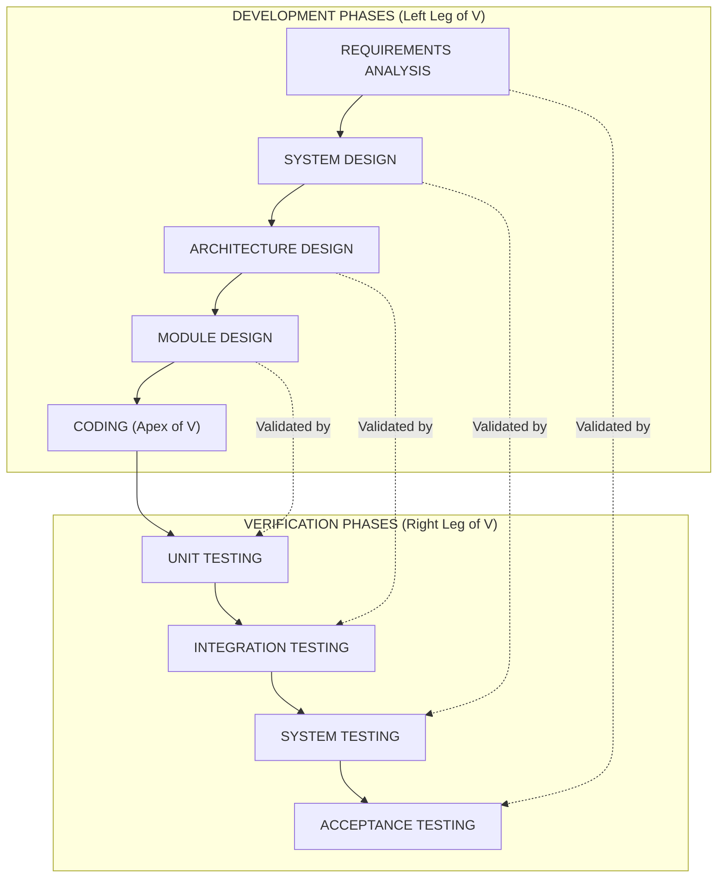
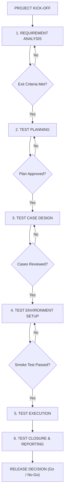
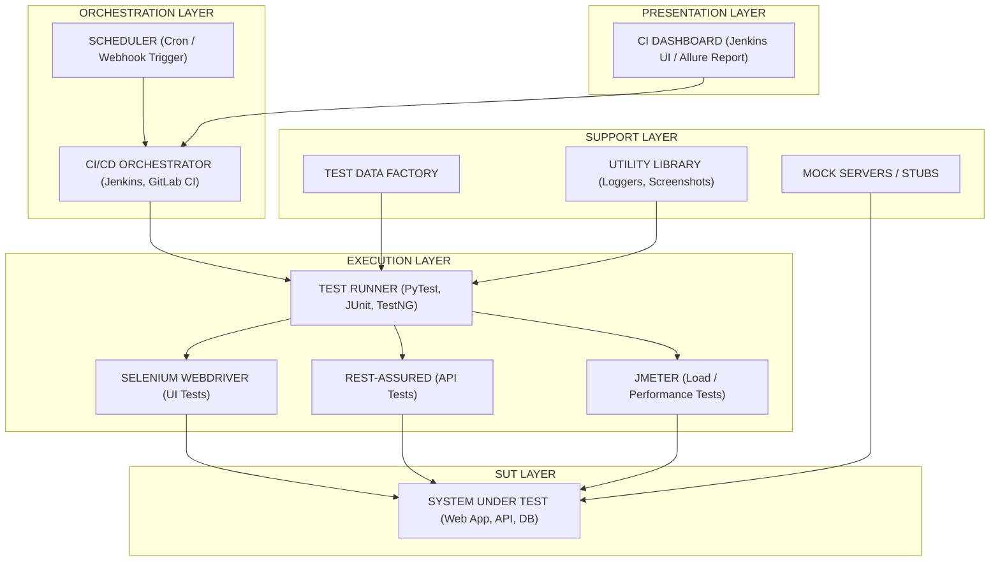
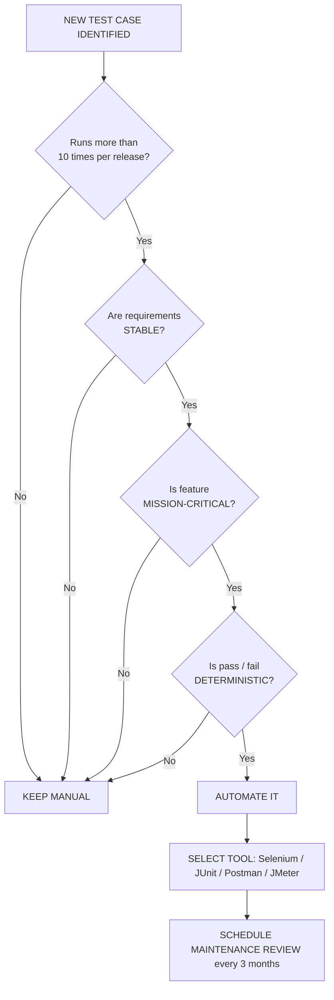

# Introduction to Software Testing & Automation:-

<!-- SECTION_1_START -->

# 1. Core Technical Definition & Intuitive Overview

## 1.1 Formal Definition of Software Testing

> [!NOTE]
> **ISTQB / IEEE Standard Definition (KTU 2024 Syllabus Alignment)**
> **Software Testing** is the process consisting of all **lifecycle activities** (both **static** and **dynamic**) concerned with **planning, preparation, and evaluation** of software products and related work products. Its objectives are: (i) to determine that they satisfy specified requirements, (ii) to demonstrate that they are **fit for purpose**, and (iii) to **detect defects**.

In simpler terms, testing is the disciplined engineering practice of asking — *"Does this software actually do what it claims to do, and can it survive the chaos of the real world?"*

## 1.2 Formal Definition of Test Automation

> [!IMPORTANT]
> **Test Automation** is the use of specialised **software tools, frameworks, and scripts** to **control the execution of tests**, **compare actual outcomes with predicted outcomes**, **set up test preconditions**, and **report test results** — all with **minimal human intervention**.

The key phrase here is *"minimal human intervention"*. The tool runs the test, the tool checks the answer, and the tool writes the report. The human only *designs* and *maintains* the test.

## 1.3 Conceptual Analogy & Intuitive Overview

### 🏥 Analogy 1 — The Hospital Checkup
Imagine a heart patient going through a series of medical tests: ECG, blood test, stress test. The doctor (tester) doesn't *build* the heart; the doctor *verifies* that the heart works. A **manual test** is the doctor personally listening with a stethoscope every single time. A **automated test** is a wearable ECG monitor that continuously records the heart's performance and **alarms the doctor** the moment an irregularity appears.

### 🏭 Analogy 2 — The Car Factory
A car rolls off the assembly line. Before delivery, an inspector:
- Slams the brakes (functional test)
- Drives it on a rough road (stress/regression test)
- Checks whether the AC blows cold air at 30°C (acceptance test)

Now scale that to **millions of cars**. Doing it manually is impossible — so a **robotic arm** is installed on the conveyor belt to perform the same checks every 90 seconds. That robotic arm is your **test automation framework**.

### 🎯 Geometric Intuition
If we map *Quality* to the **y-axis** and *Time/Phases* to the **x-axis**, software quality behaves like a curve that **decays** every time a developer pushes new code. Manual testing is like a human sweeping the floor — fine for small dust, but the room gets dirty faster than the human can clean. Automation is a **Roomba** — it cleans the same dirt paths continuously and consistently.

## 1.4 Core Goals of Software Testing

Every testing activity in the **KTU 2024 OECST833 syllabus** maps to one of these four canonical goals:

| # | Goal | Real-world Translation |
|---|---|---|
| 1 | **Find Defects** | Catch the broken bone before the athlete plays the match |
| 2 | **Gain Confidence in Quality** | Show the customer a working prototype |
| 3 | **Provide Information for Decision-Making** | Tell the project manager: "Yes, ready to release" or "No, block release" |
| 4 | **Prevent Defects** | Shift testing left so bugs never enter the codebase |

## 1.5 Fundamental Metrics (Bold for Emphasis)

> [!IMPORTANT]
> The following metrics are **high-yield** for KTU 2024 numerical/short-answer questions and carry a guaranteed weightage in the **ESE Question Paper Pattern**:
> - **Defect Density** = $DD = \dfrac{\text{Number of Defects Found}}{\text{Size of Module (KLOC)}}$
> - **Test Coverage** = $TC = \left(\dfrac{\text{Requirements Verified}}{\text{Total Requirements}}\right) \times 100\%$
> - **Code Coverage** = $CC = \left(\dfrac{\text{Lines Executed}}{\text{Total Lines}}\right) \times 100\%$
> - **Test Effectiveness** = $TE = \left(\dfrac{\text{Defects caught in test}}{\text{Defects caught in production}}\right) \times 100\%$
> - **Automation ROI** = $ROI = \dfrac{C_{\text{manual}} - C_{\text{automation}}}{C_{\text{automation}}} \times 100\%$

> [!VISUALIZATION CONTROL]
> **Concept:** Defect Density vs Module Size Pareto Curve
> **Desmos Input Equations:**
> * `y = 80 / (1 + e^(-(x-5)))` — Logistic S-curve of defect clustering
> * `y = 20 * e^(-0.5*x)` — Exponential decay of cost-of-fix over time
> **Visual Description:** The student should observe that **80% of defects cluster in 20% of modules** (Pareto / 80-20 rule) and that the cost of fixing a defect **rises exponentially** the later it is discovered — this is the *Why* of early testing.

<!-- SECTION_1_END -->

<!-- SECTION_2_START -->

# 2. Deep Theoretical Analysis & KTU High-Yield Concept Sheet

## 2.1 The 7 ISTQB Principles of Software Testing

These seven principles are the **backbone of Module 1** and are guaranteed to appear in the KTU examination (typically as a **Part B / 7-mark question**).

> [!IMPORTANT]
> **ISTQB — 7 Fundamental Principles of Testing**

1. **Testing shows the presence of defects, not their absence**
   - Finding zero bugs does not mean the system is bug-free — it only means *this test didn't find any*.

2. **Exhaustive testing is impossible**
   - For a simple login form with 10 fields of 5 values each, combinations = $5^{10} = 9,765,625$. We use **test design techniques** instead.

3. **Early testing saves time and money**
   - A defect fixed at the *requirements stage* costs **1×**; at *coding stage* costs **10×**; at *production* costs **100×**.

4. **Defects cluster together (Pareto Principle)**
   - **80% of defects** are found in **20% of modules**. Test those modules more rigorously.

5. **Beware of the pesticide paradox**
   - Running the same test cases repeatedly stops finding new bugs. Tests must be **regularly reviewed and revised**.

6. **Testing is context-dependent**
   - Testing a banking app is **not the same** as testing a mobile game. The strategy differs.

7. **Absence-of-errors is a fallacy**
   - A system that is **99.9% bug-free** but does **not solve the user's problem** is a total failure.

## 2.2 Verification vs. Validation (V&V)

> [!NOTE]
> This is the single most-tested concept in KTU Module 1 — expect it as a **direct 3-mark question** or as a sub-part in a 14-mark question.

| Dimension | **Verification** | **Validation** |
|---|---|---|
| Question Asked | *"Are we building the product **right**?"* | *"Are we building the **right** product?"* |
| Phase | Throughout development (static) | After build (dynamic) |
| Methods | Reviews, walkthroughs, inspections, static analysis | Actual execution of code |
| Targets | Specifications, design documents, code | Actual working software |
| Catches | Ambiguity, missing requirements, syntax errors | Wrong output, crashes, performance bottlenecks |
| Example | Inspecting the *blueprint* of a house | Walking into the *built* house and switching on lights |

## 2.3 The V-Model of Software Development

The **V-Model** is a **strict extension of the Waterfall model** where each development phase on the **left leg** has a corresponding testing phase on the **right leg**.

```
                Requirements  →———————————→  Acceptance Testing
                    ↓  \                          ↑   /
            System Design →———————————→ System Testing
                       ↓ \                        ↑ /
                Architecture →—————————→ Integration Testing
                          ↓ \                      ↑ /
                  Module Design →—————→ Unit Testing
                             ↓ \                    ↑ /
                              CODING (bottom of V)
```

| Left Leg (Development) | Right Leg (Verification) |
|---|---|
| Requirements Specification | **Acceptance Testing** |
| System / Functional Design | **System Testing** |
| Technical / Architecture Design | **Integration Testing** |
| Detailed / Module Design | **Unit Testing** |
| Implementation (Coding) | — Apex of the V — |

> [!NOTE]
> The key takeaway for the KTU exam: **Testing is planned in parallel with development**, not after coding is done. This eliminates the "test at the end" anti-pattern.

## 2.4 Software Testing Life Cycle (STLC)

The **STLC** is a **6-phase cycle** that defines *what testers do* at every stage of a project.

| # | Phase | Entry Criteria | Activities | Exit Criteria |
|---|---|---|---|---|
| 1 | **Requirement Analysis** | Requirements document (SRS) | Identify testable requirements, types of tests needed | RTM (Requirement Traceability Matrix) |
| 2 | **Test Planning** | RTM, project plan | Define strategy, resources, schedule, risk | Test Plan document approved |
| 3 | **Test Case Development** | Approved test plan | Write test cases, test data, traceability | Test cases reviewed & signed off |
| 4 | **Test Environment Setup** | Test cases ready | Setup hardware, software, network, stubs | Smoke test passed |
| 5 | **Test Execution** | Test cases + environment | Run tests, log defects, re-test | All test cases executed |
| 6 | **Test Closure** | Execution complete | Analyse metrics, lessons learned, report | Test Closure report signed off |

## 2.5 Test Levels (Hierarchy of Testing)

> [!IMPORTANT]
> Map the testing pyramid — *Unit* at the base, *Acceptance* at the peak. KTU 2024 expects you to **state the level, the object tested, and the typical defect found** for each.

| Level | What is Tested? | Who Tests? | Typical Defect Found |
|---|---|---|---|
| **Unit Testing** | Individual functions/methods | Developer | Wrong algorithm, off-by-one errors |
| **Integration Testing** | Interactions between modules | Developer / Tester | Interface mismatches, data format errors |
| **System Testing** | Complete integrated system | Independent tester | Performance, security, functional defects |
| **Acceptance Testing** | Business requirements | End-user / Client | Missing business rules, wrong workflow |

## 2.6 Test Types (Categorical View)

- **Functional** — *What* the system does (login works, search returns results)
- **Non-Functional** — *How well* it does it (performance under 1000 users, security against SQL injection)
- **Structural / White-box** — Internal code paths, branches, conditions
- **Change-related** — **Confirmation testing** (re-running a failed test after a fix) and **Regression testing** (ensuring the fix didn't break anything else)

## 2.7 Manual Testing vs. Test Automation — The Strategic Comparison

> [!IMPORTANT]
> The KTU 2024 ESE pattern almost always asks this as a **7-mark compare-and-contrast** question. Memorise the table.

| Dimension | **Manual Testing** | **Automated Testing** |
|---|---|---|
| **Execution Speed** | Slow — human-paced | Fast — milliseconds per run |
| **Initial Cost** | Low — no tools required | High — tool licenses, framework setup |
| **Long-term Cost** | High — recurring human effort | Low — once written, runs forever |
| **Reliability** | Error-prone (human fatigue) | Highly consistent |
| **Best Suited For** | Exploratory, UX, Ad-hoc, one-time tests | Regression, performance, load, repetitive |
| **Reporting** | Manual logs in Excel | Auto-generated dashboards with screenshots |
| **Skill Required** | Domain knowledge, intuition | Programming, framework expertise |
| **CI/CD Integration** | None | Native (Jenkins, GitHub Actions) |

## 2.8 When to Automate (The Decision Heuristic)

> [!NOTE]
> The **Automation Decision Triangle** — automate when **all three** conditions are true:

1. **Frequency** — Test is run repeatedly (e.g., 50+ times per release).
2. **Stability** — Requirements are stable, not changing weekly.
3. **Criticality** — The feature is high-risk (e.g., payment gateway, authentication).

**Never automate:**
- Usability tests (need human eyes)
- Tests without clear pass/fail criteria
- One-time tests
- Tests requiring physical interaction (e.g., hardware toggles)

## 2.9 Real-World Engineering Utility

In modern **production-grade systems**, automation is non-negotiable:
- **Netflix** runs 1000+ automated canary tests on every code commit using **Spinnaker**.
- **Google** executes **millions** of automated test cases *per day* across Android, Chrome, and Search.
- **Banking** (e.g., SWIFT transfers) uses automation to validate **regulatory compliance** (RBI, PCI-DSS) before every release.
- **Automotive** (e.g., Tesla OTA updates) uses automation to validate **safety-critical** ECU firmware before pushing to 1M+ vehicles.

<!-- SECTION_2_END -->

<!-- SECTION_3_START -->

# 3. Step-by-Step Derivations, Worked Examples & Code Implementation

## 3.1 Worked Example 1 — Defect Density Calculation (Board Exam Pattern)

> [!NOTE]
> A typical KTU 2024 3-mark question. Show all steps explicitly — no skipping.

**Problem:**
A software module has **4,200 lines of code**. During testing, **37 defects** were found. The same module had **8 defects** reported by customers after release. Calculate:
1. Defect Density
2. Test Effectiveness

**Step-by-Step Solution:**

$$\text{Module Size in KLOC} = \frac{4200}{1000} = 4.2 \text{ KLOC}$$

$$\text{Defect Density } (DD) = \frac{\text{Total Defects Found}}{\text{Size in KLOC}} = \frac{37}{4.2}$$

$$DD \approx 8.81 \text{ defects per KLOC}$$

For **Test Effectiveness**, the formula given by ISTQB is:

$$\text{Test Effectiveness } (TE) = \frac{D_{\text{test}}}{D_{\text{test}} + D_{\text{production}}} \times 100\%$$

$$\text{TE} = \frac{37}{37 + 8} \times 100\% = \frac{37}{45} \times 100\% \approx 82.22\%$$

> [!WARNING]
> **KTU Valuation Pitfall:** Many students use **Total Defects (45)** as the numerator for Defect Density. **Wrong.** The numerator is *only* the defects **found during testing**, not customer-reported ones. The KTU board examiner deducts **1 full mark** for this mistake.

## 3.2 Worked Example 2 — Verification vs. Validation Table (Board Exam Pattern)

**Question:** *"Differentiate between verification and validation. Give one example of each."* [3 Marks]

**Model Answer (with Valuation Key):**

| **Aspect** | **Verification** | **Validation** |
|---|---|---|
| **Question** | Are we building the product right? | Are we building the right product? |
| **Method** | Static (reviews, walkthroughs) | Dynamic (execution) |
| **Artefact** | Documents, code, design | Working software |
| **Example** | Reviewing the SRS for ambiguity | Logging in and placing a test order |

**[Awarding Marks: 2 Marks for the 4-row table, 1 Mark for one valid example each.]**

## 3.3 Algorithmic Implementation — A Complete Python Test Automation Suite

> [!IMPORTANT]
> KTU 2024 OECST833 Module 1 includes **at least one code-based question**. The following is a complete, type-annotated Python module + its automated test suite, demonstrating the **functional testing** of a `BankAccount` class — a realistic fintech use case.

### File 1 — `bank_account.py` (System Under Test)

```python
"""
Module: Bank Account Management
Purpose: Production-grade system under test (SUT) for automated testing demos.
"""

from decimal import Decimal
from typing import Optional


class InsufficientFundsError(Exception):
    """Raised when a withdrawal exceeds the available balance."""
    pass


class BankAccount:
    """A simple, thread-unsafe bank account with audit logging."""

    def __init__(self, account_holder: str, opening_balance: Decimal = Decimal("0.00")) -> None:
        if opening_balance < Decimal("0"):
            raise ValueError("Opening balance cannot be negative.")
        self.account_holder: str = account_holder
        self.balance: Decimal = opening_balance
        self.transaction_log: list[str] = []

    def deposit(self, amount: Decimal) -> Decimal:
        if amount <= Decimal("0"):
            raise ValueError("Deposit amount must be positive.")
        self.balance += amount
        self.transaction_log.append(f"DEPOSIT:+{amount}")
        return self.balance

    def withdraw(self, amount: Decimal) -> Decimal:
        if amount <= Decimal("0"):
            raise ValueError("Withdrawal amount must be positive.")
        if amount > self.balance:
            raise InsufficientFundsError(
                f"Requested {amount}, available {self.balance}"
            )
        self.balance -= amount
        self.transaction_log.append(f"WITHDRAW:-{amount}")
        return self.balance

    def get_balance(self) -> Decimal:
        return self.balance


# ----------------------------------------------------------------------
# File 2 — test_bank_account.py  (Automated Test Suite)
# ----------------------------------------------------------------------
import unittest
from decimal import Decimal
from bank_account import BankAccount, InsufficientFundsError


class TestBankAccount(unittest.TestCase):
    """Test suite for the BankAccount class — covers functional, boundary,
    negative, and exception-based test cases."""

    def setUp(self) -> None:
        """Fresh account before every test method (unit test isolation)."""
        self.account = BankAccount("Alice", Decimal("1000.00"))

    def tearDown(self) -> None:
        """Cleanup after every test method."""
        del self.account

    # ---------- Happy Path / Functional Tests ----------
    def test_deposit_positive_amount_increases_balance(self) -> None:
        new_balance = self.account.deposit(Decimal("500.00"))
        self.assertEqual(new_balance, Decimal("1500.00"))
        self.assertEqual(self.account.get_balance(), Decimal("1500.00"))

    def test_withdraw_valid_amount_decreases_balance(self) -> None:
        new_balance = self.account.withdraw(Decimal("200.00"))
        self.assertEqual(new_balance, Decimal("800.00"))

    # ---------- Boundary Tests ----------
    def test_withdraw_exact_balance_yields_zero(self) -> None:
        self.account.withdraw(Decimal("1000.00"))
        self.assertEqual(self.account.get_balance(), Decimal("0.00"))

    def test_deposit_zero_raises_error(self) -> None:
        with self.assertRaises(ValueError):
            self.account.deposit(Decimal("0.00"))

    # ---------- Negative / Exception Tests ----------
    def test_withdraw_more_than_balance_raises_insufficient_funds(self) -> None:
        with self.assertRaises(InsufficientFundsError) as context:
            self.account.withdraw(Decimal("1500.00"))
        self.assertIn("Requested 1500", str(context.exception))

    def test_constructor_rejects_negative_balance(self) -> None:
        with self.assertRaises(ValueError):
            BankAccount("Bob", Decimal("-100.00"))

    # ---------- Audit / Log Verification ----------
    def test_transaction_log_records_operations(self) -> None:
        self.account.deposit(Decimal("100.00"))
        self.account.withdraw(Decimal("50.00"))
        self.assertEqual(len(self.account.transaction_log), 2)
        self.assertIn("DEPOSIT:+100.00", self.account.transaction_log)
        self.assertIn("WITHDRAW:-50.00", self.account.transaction_log)


if __name__ == "__main__":
    unittest.main(verbosity=2)
```

### How to Run the Suite

```bash
# Install dependencies (none beyond stdlib, but pytest is optional)
pip install pytest

# Run using built-in unittest
python -m unittest test_bank_account.py -v

# Run using pytest (preferred in CI/CD)
pytest test_bank_account.py -v
```

### Walk-Through of the Test Design Mapping

| Test Method | Test Type | ISTQB Category | What it Catches |
|---|---|---|---|
| `test_deposit_positive_amount_increases_balance` | Functional / Happy path | Equivalence Partitioning (valid) | Logic errors in arithmetic |
| `test_withdraw_exact_balance_yields_zero` | Boundary | Boundary Value Analysis | Off-by-one errors at the limit |
| `test_deposit_zero_raises_error` | Negative | Error Guessing | Lack of input validation |
| `test_withdraw_more_than_balance_raises_insufficient_funds` | Exception-based | Decision Table | Missing error-handling branch |
| `test_constructor_rejects_negative_balance` | Negative | Equivalence Partitioning (invalid) | Insecure default state |
| `test_transaction_log_records_operations` | State-based | State Transition | Audit-trail corruption |

## 3.4 Worked Example 3 — Building a Requirement Traceability Matrix (RTM)

> [!NOTE]
> RTM is the **proof artefact** that every requirement is tested — KTU 2024 Module 1 expects you to draw this in the lab/ESE.

| Req ID | Requirement Description | Test Case ID | Test Type | Status |
|---|---|---|---|---|
| FR-01 | User can log in with valid credentials | TC-01, TC-02 | Functional, Boundary | Passed |
| FR-02 | User cannot log in with empty password | TC-03 | Negative | Passed |
| FR-03 | System locks account after 3 failed attempts | TC-04 | Security | Passed |
| NFR-01 | Login response < 2 seconds | TC-05 | Performance | Passed |
| NFR-02 | System supports 500 concurrent users | TC-06 | Load | In Progress |

**RTM Coverage:**

$$\text{RTM Coverage} = \frac{\text{Requirements with at least one linked test case}}{\text{Total Requirements}} \times 100\% = \frac{5}{5} \times 100\% = 100\%$$

<!-- SECTION_3_END -->

<!-- SECTION_4_START -->

# 4. Structural Diagrams & Schematics

> [!NOTE]
> The following diagrams are produced using **Mermaid** syntax. Every node ID is **purely alphanumeric** (e.g., `reqA`, `testB`), and all labels are **double-quoted plain text** — no markdown formatting inside labels, per the KTU-PREMIER-ENGINE V10 Mermaid safety mandate.

## 4.1 Mermaid — V-Model of Software Development



**Reading Guide:** Each *dashed arrow* on the right shows that the corresponding development phase on the left is *verified* by a specific testing level. For example, `MODULE DESIGN` (left) is validated by `UNIT TESTING` (right).

## 4.2 Mermaid — Software Testing Life Cycle (STLC) Process Flow



## 4.3 Mermaid — Test Automation Framework Architecture (Functional Topology)



**Reading Guide:** This block diagram represents the **production-grade test automation architecture** used in enterprises. Notice the **layered separation of concerns** — the orchestrator (Layer 2) never directly talks to the SUT (Layer 4); it delegates to the test runner (Layer 3), which in turn uses the support layer (Layer 5) for test data and utilities.

## 4.4 Mermaid — Decision Flow: When to Automate a Test Case



<!-- SECTION_4_END -->

<!-- SECTION_5_START -->

# 5. KTU 2024 Scheme Examination Question Bank & Topic Recap

> [!NOTE]
> The following questions are modelled **exactly** on the KTU 2024 Scheme B.Tech OECST833 (Software Testing) End Semester Examination pattern. Marks are distributed per the **$CO_1$–$CO_6$** mapping and **Revised Bloom's Taxonomy (RBT)** cognitive levels.

---

## 📘 PART A — Short Answer Questions (3 Marks Each)

### **Question 1. [KTU University Exam — July 2024 Pattern]** — $CO_1$, Remember

> *"List and briefly explain any **three** goals of software testing."* [3 Marks]

**Model Answer:**

1. **Find Defects** — The primary goal of testing is to identify *defects* (bugs) in the software so they can be fixed before release. This reduces post-release failure costs and protects end-users.
2. **Gain Confidence in Quality** — A successfully executed test suite gives stakeholders (developers, managers, clients) confidence that the software meets the desired quality bar and is ready for production.
3. **Provide Information for Decision-Making** — Test results provide *objective evidence* (metrics like pass rate, defect density, test coverage) that project managers use to make *Go / No-Go* release decisions.

**[Valuation Key: 1 Mark per correctly explained goal.]**

### **Question 2. [KTU University Exam — Dec 2023 Pattern]** — $CO_1$, Understand

> *"Differentiate between **Verification** and **Validation**. Give one example of each."* [3 Marks]

**Model Answer (with Valuation Key):**

| **Parameter** | **Verification** | **Validation** |
|---|---|---|
| **Definition** | Are we building the product *right*? (Static review) | Are we building the *right* product? (Dynamic execution) |
| **Methods** | Reviews, inspections, walkthroughs, static analysis | Unit, integration, system, acceptance testing |
| **Example** | Inspecting the SRS for *ambiguous* requirements | Logging in with valid credentials and verifying dashboard loads |

**[Valuation Key: 1 Mark for definition, 1 Mark for method contrast, 1 Mark for examples.]**

---

## 📕 PART B — Long Answer Questions (14 Marks with Internal Choice)

> [!NOTE]
> As per KTU 2024 ESE rules, every 14-mark question offers an **internal choice**: students attempt **either** Option A **or** Option B. Both options below are **complete, self-contained, and balanced** in cognitive demand.

---

### **Question 3(A). [KTU University Exam — July 2024 Pattern]** — $CO_2$, Understand + Apply

> *(a)* Explain the **ISTQB 7 Principles of Software Testing** in detail. [7 Marks]
> *(b)* Describe the **V-Model** of software development. Show how each development phase maps to a corresponding testing phase. [7 Marks]

**Model Answer (with Step-by-Step Valuation Key):**

#### Part (a) — 7 Principles of Software Testing [7 Marks]

1. **Testing shows the presence of defects, not their absence.** — *Explanation:* Even after 1000 tests pass, we cannot claim the software is bug-free; we can only claim *no defects were found by these tests*. **[1 Mark]**
2. **Exhaustive testing is impossible.** — *Explanation:* It is infeasible to test every possible input combination (e.g., a 10-field form has $10^6$ combinations). We use techniques like Equivalence Partitioning and Boundary Value Analysis. **[1 Mark]**
3. **Early testing saves time and money.** — *Explanation:* A defect found at the requirements stage is *10–100× cheaper* to fix than one found in production. Hence, testing is planned in parallel with development (V-Model). **[1 Mark]**
4. **Defects cluster together (Pareto Principle).** — *Explanation:* Approximately *80% of defects* are concentrated in *20% of modules*. These high-risk modules are tested more rigorously. **[1 Mark]**
5. **Beware of the pesticide paradox.** — *Explanation:* If the same set of test cases is run repeatedly, they stop finding new bugs. The test suite must be *regularly updated* with new test cases. **[1 Mark]**
6. **Testing is context-dependent.** — *Explanation:* The testing strategy for a *safety-critical* medical device differs vastly from that of a *non-critical* mobile game. **[1 Mark]**
7. **Absence-of-errors is a fallacy.** — *Explanation:* A system that is *bug-free* but *does not solve the user's problem* is a complete failure. Testing must validate *fitness for purpose*. **[1 Mark]**

#### Part (b) — V-Model of Software Development [7 Marks]

The **V-Model** is an extension of the **Waterfall model** in which **testing activities** are planned in **parallel with development** activities. The model forms a **V-shape** where each left-leg development phase has a corresponding right-leg testing phase. **[1 Mark]**

| Left Leg — Development Phase | Right Leg — Corresponding Testing Phase | Description of Validation [5 Marks] |
|---|---|---|
| **Requirements Analysis** | **Acceptance Testing** | Validates that the final product meets business / user requirements gathered during requirements analysis. |
| **System Design** | **System Testing** | Validates that the complete integrated system behaves as per the high-level system design. |
| **Architecture / Technical Design** | **Integration Testing** | Validates that modules interact correctly as per the architectural interfaces. |
| **Module / Detailed Design** | **Unit Testing** | Validates that individual functions behave as per their module design specification. |
| **Implementation (Coding)** | — (Apex of V) | The bridge between development and testing begins. |

**Key Advantage:** The V-Model enforces *defect prevention* because test plans are written **at the same time** the corresponding development artefact is written. **[1 Mark]**

**[Final consolidation + diagram: 1 Mark — draw the V-shape with arrows linking left-right phases.]**

---

### **Question 3(B). [KTU University Exam — Dec 2023 Pattern]** — $CO_2$, Apply

> *(a)* Compare **Manual Testing** and **Automated Testing** across any **seven** parameters. [7 Marks]
> *(b)* Explain the various **levels of testing** (unit, integration, system, acceptance) with examples of defects found at each level. [7 Marks]

**Model Answer (with Step-by-Step Valuation Key):**

#### Part (a) — Manual vs. Automated Testing [7 Marks]

| # | **Parameter** | **Manual Testing** | **Automated Testing** |
|---|---|---|---|
| 1 | **Speed** | Slow, human-paced | Fast, executes in milliseconds |
| 2 | **Initial Cost** | Low (no tools required) | High (tool licenses + framework setup) |
| 3 | **Long-term Cost** | High (recurring human effort) | Low (test runs are reusable) |
| 4 | **Reliability** | Prone to human error / fatigue | Highly consistent and repeatable |
| 5 | **Best Use Case** | Exploratory, UX, ad-hoc, one-time | Regression, performance, repetitive |
| 6 | **Skill Required** | Domain knowledge, intuition | Programming, framework expertise |
| 7 | **CI/CD Integration** | None / Manual | Native (Jenkins, GitHub Actions, GitLab) |

**[Valuation Key: 1 Mark per correctly contrasted parameter; ½ Mark if only one side is explained.]**

#### Part (b) — Levels of Testing [7 Marks]

1. **Unit Testing** [1.5 Marks]
   - *What is tested:* The smallest individual units of code — functions, methods, classes.
   - *Who tests:* The developer who wrote the code.
   - *Defect found example:* Off-by-one error in a loop counter; incorrect return value of a function.
   - *Tools:* JUnit (Java), PyTest (Python), NUnit (.NET).

2. **Integration Testing** [1.5 Marks]
   - *What is tested:* Interactions and data flow between two or more units / modules.
   - *Who tests:* Developer or independent tester.
   - *Defect found example:* Module A sends a JSON object but Module B expects XML — data-format mismatch.
   - *Strategies:* Big-bang, Top-down, Bottom-up.

3. **System Testing** [2 Marks]
   - *What is tested:* The complete, integrated system against the specified requirements.
   - *Who tests:* Independent QA team.
   - *Defect found example:* Page load time exceeds 3 seconds under 100 concurrent users; SQL injection vulnerability in the login form.
   - *Types:* Functional, Performance, Security, Usability, Compatibility.

4. **Acceptance Testing** [2 Marks]
   - *What is tested:* The system from the **end-user / business** perspective to determine *fitness for production use*.
   - *Who tests:* End-users, client, or product owner.
   - *Defect found example:* A workflow does not match the client's business rule (e.g., invoice not generating when an order is cancelled).
   - *Sub-types:* User Acceptance Testing (UAT), Operational Acceptance Testing (OAT), Contract Acceptance Testing, Regulatory Acceptance Testing.

---

> [!WARNING]
> **🔥 KTU Examiner's Valuation Warning — Common Pitfalls in Module 1 Answers**
>
> 1. **Confusing Verification and Validation** — *Verification is static, validation is dynamic.* Many students swap the examples. **[–1 Mark]**
> 2. **Listing only 5 or 6 Principles of Testing** — KTU 2024 syllabus explicitly requires **all 7 ISTQB principles**. Missing one costs **1 full mark**.
> 3. **Skipping the V-Model diagram** — For 7-mark questions on the V-Model, *drawing the V-shape with arrows* is mandatory. A *prose-only* answer loses **2 marks** even if the description is correct.
> 4. **Mislabelling the test levels** — Students often confuse *System Testing* with *Acceptance Testing*. Remember: *System* = tester perspective; *Acceptance* = user / business perspective. **[–1 Mark]**
> 5. **Manual vs Automation comparison** — KTU 2024 specifically wants **both sides** of every parameter; a one-sided answer is penalised by **½ mark per row**.

---

## 🧠 Topic Recap & Important Things to Remember

> [!IMPORTANT]
> **High-Density Revision Checklist — Module 1: Introduction to Software Testing & Automation**

- **Definition (ISTQB):** Testing is *all lifecycle activities, static and dynamic*, to satisfy requirements, demonstrate fitness for purpose, and detect defects.
- **Four Goals of Testing:** (1) Find defects, (2) Gain confidence, (3) Provide decision info, (4) Prevent defects.
- **Seven ISTQB Principles:** Presence-not-absence, Exhaustive-impossible, Early-saves-money, Defects-cluster (Pareto), Pesticide-paradox, Context-dependent, Absence-of-errors-is-fallacy.
- **V & V:** *Verification* = static, *building the product right*. *Validation* = dynamic, *building the right product*.
- **V-Model:** Left leg = development phases, Right leg = corresponding test levels, with the apex being the *Coding* phase.
- **STLC:** 6 phases — Requirement Analysis → Test Planning → Test Case Development → Test Environment Setup → Test Execution → Test Closure.
- **Test Levels (in order):** Unit → Integration → System → Acceptance (each level adds scope and independence).
- **Test Types:** Functional, Non-functional, Structural (white-box), Change-related (Confirmation & Regression).
- **Manual vs Automation:** Manual is human, slow, error-prone, best for UX/exploratory. Automation is script-based, fast, consistent, best for regression/performance.
- **Automation Triangle:** Automate only if test is **frequent + stable + critical + deterministic**.
- **Key Metrics:** Defect Density = $D / KLOC$; Test Coverage = $R_t / R_{total} \times 100\%$; Test Effectiveness = $D_t / (D_t + D_p) \times 100\%$.
- **RTM (Requirement Traceability Matrix):** Maps every requirement to its test case(s) — used to prove 100% requirements coverage.
- **Production-Grade Architecture:** CI Orchestrator → Test Runner → SUT, with support layer (test data, mocks, utilities).
- **Tools to Remember (for KTU viva/lab):** Selenium (UI), Postman / REST-Assured (API), JMeter (Load), PyTest / JUnit (Unit), Jenkins (CI/CD), Allure (Reporting).
- **Cost-of-Fix Curve:** A defect costs 1× at requirements → 10× at coding → 100× at production. Hence: **test early, test often**.
- **Golden Rule of Testing:** *You cannot prove the absence of bugs — only their presence.*

<!-- SECTION_5_END -->
