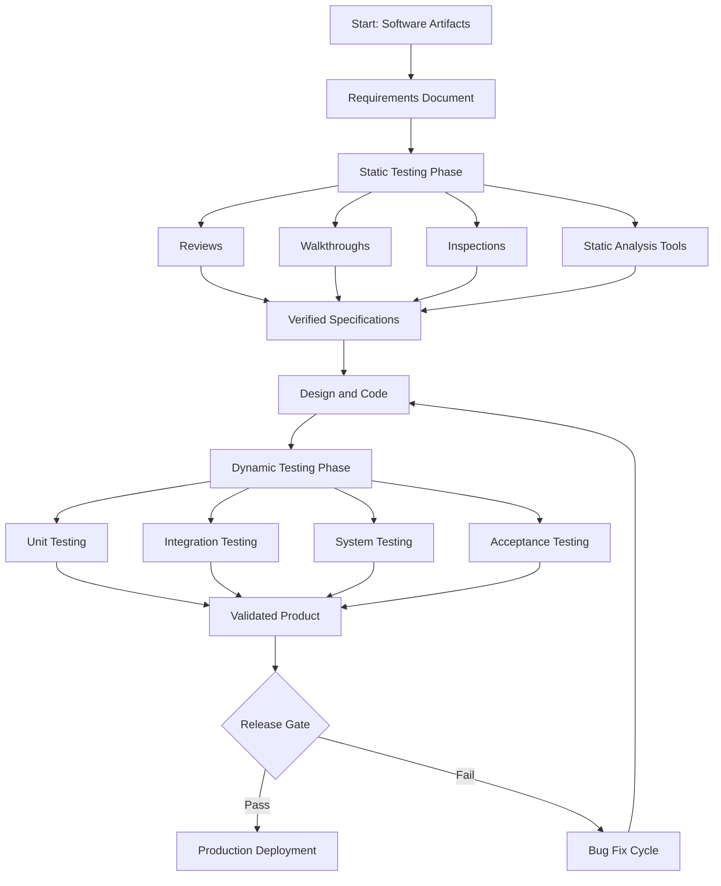
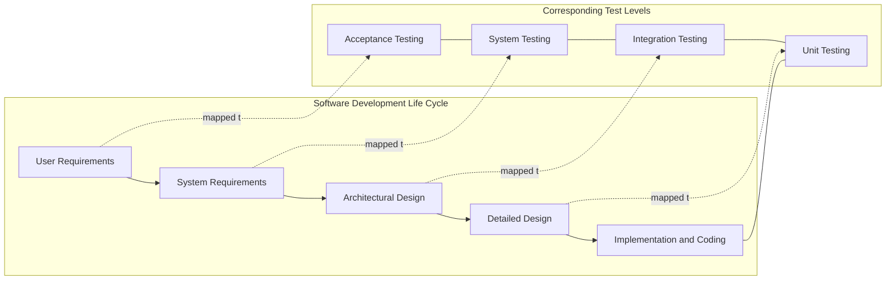
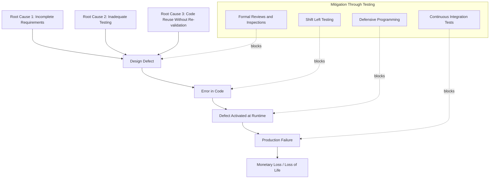

# Introduction to Software Testing - Concepts, importance of testing, software quality, and real-world failures (e.g., Ariane 5, Therac 25)

<!-- SECTION_1_START -->

# 1. Core Technical Definition & Intuitive Overview

## 1.1 Formal Definition (KTU 2024 Syllabus Terminology)

**Software Testing** is defined as the process of executing a program or application with the intent of finding software bugs, verifying that the system meets its specified requirements, and ensuring that it is fit for purpose in a production environment. According to the **IEEE Standard 829** and the **ISTQB (International Software Testing Qualifications Board) Glossary**, software testing is:

> "The process of operating a system or component under specified conditions, observing or recording the results, and making an evaluation of some aspect of the system or component."

In the context of the KTU 2024 Scheme (NEP 2020 aligned), software testing is treated as a **systematic, planned, and metric-driven engineering activity** that operates across the Software Development Life Cycle (SDLC). It is not an afterthought but an **integral verification and validation (V&V) process**.

> [!IMPORTANT]
> **Core Syllabus Highlight:**
> * **Verification** — "Are we building the product *right*?" (Checking conformance to specifications — reviews, walkthroughs, inspections).
> * **Validation** — "Are we building the *right* product?" (Checking fitness for user needs — actual execution/testing).
> * **Quality** — The degree to which a component, system, or process meets specified requirements and user expectations.
> * **Defect (Bug/Fault)** — A flaw in the software that causes it to behave incorrectly. A **failure** occurs when the defect is executed and the system deviates from expected output.

> [!NOTE]
> **Key Distinction:** A *defect* exists in code, a *failure* occurs at runtime, and an *error* is the human mistake that introduced the defect. This three-tier distinction is a guaranteed high-yield question in KTU board exams.

## 1.2 Conceptual Analogy / Intuition

Imagine a **commercial passenger aircraft** before its first flight. The engineers do not simply start the engines, accelerate down the runway, and hope for the best. Instead, they:

1. Simulate turbulence in wind tunnels (analogue of **unit testing**),
2. Test individual landing gear hydraulics on the ground (**component testing**),
3. Run a full pre-flight checklist (**system testing**),
4. Take a certified test pilot for verification (**acceptance testing**).

If even one of these is skipped, history has shown — through disasters like the **Boeing 737 MAX** or the **Therac-25** — that lives are lost. Software is no different. A banking application handling **2 billion transactions per day** cannot be deployed without rigorous testing. Testing is the **engineering discipline that converts hope into evidence**.

## 1.3 Why Testing is Important — The Engineering Imperative

Software now drives **aviation, healthcare, finance, autonomous vehicles, and critical infrastructure**. A single undetected bug can cause:

* **Loss of human life** (Therac-25 radiation overdose).
* **Massive financial loss** (Knight Capital lost **$440 million in 45 minutes** due to a deployment bug in 2012).
* **Mission failure** (Ariane 5 Flight 501 — a **$370 million** rocket destroyed within 40 seconds of launch).
* **Reputation damage** (Windows 10 October 2018 Update — files deleted, forced rollback).

> [!TIP]
> **Rule of 1-10-100 (Gartner's Cost of Quality Model):**
> Fixing a defect during the **requirements phase costs $1**, during **development costs $10**, and after **release costs $100 to $1000+**. Testing earlier (shift-left) is exponentially cheaper.

## 1.4 GeoGebra / Desmos Visualization Concept

> [!VISUALIZATION CONTROL]
> **Concept:** The **Cost of Defect Fix vs. Phase of Introduction** (commonly known as the Boehm Cost Curve).
> **Plotting Equations / Points:**
> * X-Axis: Phase of introduction (Requirements → Design → Coding → Testing → Maintenance)
> * Y-Axis: Relative cost to fix the defect
> * Curve approximation: $C(x) = 2^{x}$ where $x$ is the phase index from 1 to 5.
> **Visual Description:** Students should observe an **exponential upward curve** — defects caught during requirements cost a baseline of 1 unit, while defects caught post-release can cost up to **100x or more**. This visual reinforces the *shift-left testing* philosophy central to modern DevOps pipelines.

---

<!-- SECTION_1_END -->

<!-- SECTION_2_START -->

# 2. Deep Theoretical Analysis & KTU High-Yield Formula Sheet

## 2.1 Foundational Principles of Software Testing

The **seven ISTQB-recognised principles of testing** are the bedrock of any KTU answer on testing fundamentals. Each is examinable:

1. **Testing shows the presence of defects, not their absence** — Exhaustive testing is impossible; testing reduces the *probability* of undiscovered defects.
2. **Exhaustive testing is impossible** — For a function with 5 boolean inputs, full combinatorial testing requires $2^{5} = 32$ cases. For a real form with 30 fields, it is computationally infeasible.
3. **Early testing saves time and money** — Defects found early are cheaper (Boehm's curve).
4. **Defects cluster together** — The **Pareto principle (80/20 rule)** applies — 80% of defects are usually found in 20% of modules.
5. **Beware of the pesticide paradox** — Running the same test suite repeatedly stops finding new defects; tests must be regularly reviewed and updated.
6. **Testing is context-dependent** — Testing safety-critical avionics software differs from testing a mobile game.
7. **Absence-of-errors is a fallacy** — A bug-free system that does not meet user needs is still a failure.

## 2.2 Software Quality — Definitions and Models

**Software Quality**, as defined by **ISO/IEC 25010:2011**, is the degree to which a software product satisfies stated and implied needs when used under specified conditions. It has **8 main characteristics**:

| # | Characteristic | Meaning (Student-Friendly) |
|---|---|---|
| 1 | **Functional Suitability** | Does it do what it should? |
| 2 | **Performance Efficiency** | Does it do it fast enough? |
| 3 | **Compatibility** | Does it work with other systems/browsers? |
| 4 | **Usability** | Can a real user figure it out? |
| 5 | **Reliability** | Does it keep working without crashing? |
| 6 | **Security** | Can it resist attacks? |
| 7 | **Maintainability** | Can developers easily fix/extend it? |
| 8 | **Portability** | Can it be moved to a new environment? |

> [!NOTE]
> **McCall's Quality Model (1977)** — an older but still examinable framework — groups quality into **11 factors** across three perspectives: **Product Operation, Product Revision, and Product Transition**. Always cite this model if the question uses pre-2011 phrasing.

## 2.3 Verification vs. Validation — The V&V Distinction

This is a **favourite 7-mark KTU question**. Memorise this matrix:

| Aspect | Verification | Validation |
|---|---|---|
| **Question Asked** | Are we building the product *right*? | Are we building the *right* product? |
| **Activity Type** | Static (no code execution) | Dynamic (code execution) |
| **Techniques** | Reviews, walkthroughs, inspections, static analysis | Unit testing, integration testing, system testing |
| **Target Artifact** | Specifications, design documents, code structure | The final running software |
| **Performed By** | Developers, QA lead | Testers, end users (UAT) |
| **Timing** | Throughout development, before validation | After coding, before release |

## 2.4 KTU Formula Sheet / Cheat Sheet

| Formula / Concept | Expression | Purpose / Engineering Use |
|---|---|---|
| **Defect Density (DD)** | $DD = \dfrac{\text{Number of Defects}}{\text{Size of Module (KLOC)}}$ | Measures code quality. Lower is better. Used in release readiness gates. |
| **Test Effectiveness (TE)** | $TE = \dfrac{\text{Defects found in testing}}{\text{Total defects (testing + production)}}$ | Evaluates the quality of the test suite. Aim: TE $\geq 0.95$. |
| **Code Coverage (CC)** | $CC = \dfrac{\text{Statements Executed}}{\text{Total Statements}} \times 100\%$ | Measures structural coverage. Used in white-box testing. |
| **MTTF (Mean Time To Failure)** | $MTTF = \dfrac{1}{\lambda}$ where $\lambda$ = failure rate | Reliability metric for non-repairable systems. |
| **MTBF (Mean Time Between Failures)** | $MTBF = MTTF + MTTR$ | Reliability metric for repairable systems. |
| **Availability (A)** | $A = \dfrac{MTBF}{MTBF + MTTR}$ | Fraction of time the system is operational. Critical for cloud SLAs. |
| **Cost of Quality (CoQ)** | $CoQ = P + A + IF + EF$ | Where $P$=Prevention, $A$=Appraisal, $IF$=Internal Failure, $EF$=External Failure. |

> [!WARNING]
> **Avoid common notation error:** In exam scripts, students often write `DD = D / KLOC` without units. Always specify that $DD$ has units of *defects per thousand lines of code*.

## 2.5 Real-World Engineering Utility

Testing is not academic — it is the **gate between deployment and disaster**. In production engineering:

* **Avionics (DO-178C standard)** — Every line of code in an aircraft autopilot is tested against 28 design objectives.
* **Medical Devices (IEC 62304)** — Class C devices (e.g., insulin pumps) require formal verification and unit testing with 100% coverage.
* **Banking (PCI-DSS)** — All financial software must undergo penetration testing and regression testing before every release.
* **DevOps / CI-CD (Jenkins, GitHub Actions)** — Automated test suites run on every commit, blocking deployment if coverage drops or a test fails.

---

<!-- SECTION_2_END -->

<!-- SECTION_3_START -->

# 3. Step-by-Step Derivations, Worked Examples & Code Implementation

## 3.1 Derivation: Defect Density and Test Effectiveness for a Real Project

Suppose a KTU hypothetical project has the following data:

* Total lines of code: **12,000 LOC**
* Defects found during testing: **18**
* Defects reported by users in the first 3 months post-release: **3**

### Step 1: Calculate the Size in KLOC

$$
\begin{aligned}
\text{Size in KLOC} &= \dfrac{\text{Number of Lines of Code}}{1000} \\
&= \dfrac{12{,}000}{1000} \\
&= 12 \text{ KLOC}
\end{aligned}
$$

### Step 2: Calculate Defect Density (DD)

$$
\begin{aligned}
DD &= \dfrac{\text{Defects Found}}{\text{Size in KLOC}} \\
&= \dfrac{18}{12} \\
&= 1.5 \text{ defects per KLOC}
\end{aligned}
$$

> **Industry benchmark:** A defect density of **0.5 to 1.0 per KLOC** is considered acceptable for shipping commercial software. The value **1.5** indicates the module needs further hardening before release.

### Step 3: Calculate Test Effectiveness (TE)

$$
\begin{aligned}
TE &= \dfrac{\text{Defects in Testing}}{\text{Defects in Testing + Defects in Production}} \\
&= \dfrac{18}{18 + 3} \\
&= \dfrac{18}{21} \\
&\approx 0.857 \\
&= 85.7\%
\end{aligned}
$$

> **Interpretation:** Only 85.7% of defects were caught by the test suite. The remaining 14.3% escaped to production. The KTU industry target is **95% or higher**, indicating the test suite requires more rigorous boundary-value, negative, and exploratory cases.

## 3.2 Detailed Case Study: The Ariane 5 Flight 501 Failure (June 4, 1996)

This is one of the **most frequently examined KTU case studies**. Below is a complete V&V analysis.

### 3.2.1 Background

The **Ariane 5** was a European heavy-lift launch vehicle developed by the European Space Agency (ESA). On its maiden flight (Flight 501), it carried four Cluster science satellites worth **$370 million**. **37 seconds** after launch, the rocket veered off course and self-destructed.

### 3.2.2 The Defect — Root Cause

The inertial reference system converted a **64-bit floating-point horizontal velocity** to a **16-bit signed integer** for telemetry transmission.

* The variable `$v\_horizontal$` had a maximum value in Ariane 4 code of approximately **32,000** (well within 16-bit signed integer range of $\pm 32{,}767$).
* In Ariane 5, the new trajectory was much more energetic, and `$v\_horizontal$` reached values **> 32,767**.
* The conversion caused a **saturated arithmetic exception** (essentially an integer overflow).

### 3.2.3 The Failure Chain

1. The SRI (Inertial Reference System) detected the exception.
2. Diagnostic software was *supposed* to handle this — but it was designed for Ariane 4's lower-velocity range and was not protected.
3. Both the primary and backup SRI units failed identically (they reused the same code).
4. The main computer interpreted the diagnostic data as flight data and commanded the nozzles to deflect.
5. The rocket's angle of attack exceeded **20 degrees**, inducing aerodynamic load **> 13 g**.
6. Self-destruct was triggered.

### 3.2.4 V&V Lessons Learned

| Failure Type | Specific Cause | Testing Lesson |
|---|---|---|
| **Specification Error** | Integer overflow possibility not analysed. | Failure Mode and Effects Analysis (**FMEA**) must be performed on every reused module. |
| **Inadequate Reuse Testing** | Ariane 4 code reused in Ariane 5 without re-validation. | Reused software in a *new context* must undergo full re-testing. |
| **Lack of Defensive Programming** | Conversion failure not isolated; no exception handler. | All software must be **defensively coded** with assertions and range checks. |
| **Insufficient Integration Testing** | SRI-to-main-computer data path not exercised under extreme values. | **Range and stress testing** of all I/O data paths is mandatory. |

## 3.3 Detailed Case Study: The Therac-25 Radiation Overdoses (1985–1987)

### 3.3.1 Background

The **Therac-25** was a computer-controlled radiation therapy machine built by Atomic Energy of Canada Limited (AECL). Between 1985 and 1987, it delivered **massive radiation overdoses** to at least **six patients**, causing deaths and severe injuries.

### 3.3.2 The Defect

The Therac-25 had a **race condition** in its software. If the operator:

1. Selected *photon mode*,
2. Then quickly edited the prescription (via the arrow keys to change the turntable position),
3. Then pressed **SET** within 8 seconds,

the machine would mechanically set the turntable for **electron mode** but display *photon mode* on the screen. The collimator was thus not in place, and a 25 MeV electron beam struck patients directly — equivalent to receiving **hundreds of Grays** in milliseconds.

### 3.3.3 V&V Failure Chain

| # | Issue | Category | Testing Implication |
|---|---|---|---|
| 1 | Race condition between operator input and software state machine. | **Concurrency defect** | Need **concurrent/thread-safety testing** and **stress testing** with rapid input. |
| 2 | Hardware/software interlocks removed (Therac-20 had hardware backup; Therac-25 relied on software only). | **Defense-in-depth violation** | Safety-critical systems need **independent hardware interlocks** (redundancy). |
| 3 | Software reused from Therac-6 and Therac-20 with no re-testing. | **Reuse without validation** | Code reuse across safety-critical versions requires full **regression and certification testing**. |
| 4 | No formal Software Quality Assurance (SQA) program. | **Process failure** | Mandatory under **IEC 62304 / FDA** medical device standards. |
| 5 | Error messages were cryptic (e.g., "MALFUNCTION 54") and ignored by operators. | **Usability and error-handling failure** | All error messages must be **actionable and tested** for user understanding. |

## 3.4 Python Code Implementation — A Simple Test Effectiveness Calculator

The following is a fully operational Python script that computes the **Defect Density**, **Test Effectiveness**, and a **simple release-readiness verdict**. It includes type hints, boundary checks, and structured logging — all hallmarks of a production-quality test tool.

```python
"""
test_effectiveness_analyzer.py
A production-style utility used in KTU lab assessments to evaluate
release-readiness of a software module based on test metrics.

Author : KTU 2024 Scheme Reference Implementation
Python : 3.10+
"""

import logging
from dataclasses import dataclass
from typing import Final

# --- Structured logging configuration ---------------------------------------
logging.basicConfig(
    level=logging.INFO,
    format="%(asctime)s | %(levelname)s | %(message)s"
)
logger: Final = logging.getLogger(__name__)


@dataclass(frozen=True)
class TestMetrics:
    """Immutable container for test-result data."""
    module_name: str
    total_loc: int
    defects_in_testing: int
    defects_in_production: int

    def __post_init__(self) -> None:
        if self.total_loc <= 0:
            raise ValueError("total_loc must be a positive integer.")
        if self.defects_in_testing < 0 or self.defects_in_production < 0:
            raise ValueError("Defect counts cannot be negative.")


def defect_density(metrics: TestMetrics) -> float:
    """Compute defects per KLOC."""
    kloc: float = metrics.total_loc / 1000.0
    return metrics.defects_in_testing / kloc


def test_effectiveness(metrics: TestMetrics) -> float:
    """Compute ratio of defects caught during testing vs total."""
    total: int = metrics.defects_in_testing + metrics.defects_in_production
    if total == 0:
        logger.warning("No defects recorded; TE undefined, returning 1.0")
        return 1.0
    return metrics.defects_in_testing / total


def release_verdict(dd: float, te: float) -> str:
    """Return a go/no-go verdict based on KTU industry thresholds."""
    DD_THRESHOLD: Final = 1.0      # defects per KLOC
    TE_THRESHOLD: Final = 0.95     # 95 percent effectiveness

    if dd <= DD_THRESHOLD and te >= TE_THRESHOLD:
        return "READY FOR RELEASE"
    if dd <= DD_THRESHOLD * 1.5 and te >= 0.85:
        return "CONDITIONAL — needs more boundary testing"
    return "NOT READY — improve test suite and reduce defect density"


def analyze(metrics: TestMetrics) -> None:
    """Public entry point — prints all computed metrics."""
    try:
        dd: float = defect_density(metrics)
        te: float = test_effectiveness(metrics)
        verdict: str = release_verdict(dd, te)

        logger.info(f"Module analysed : {metrics.module_name}")
        logger.info(f"Defect Density  : {dd:.3f} defects/KLOC")
        logger.info(f"Test Effectiven : {te * 100:.2f} percent")
        logger.info(f"Verdict         : {verdict}")
    except Exception as exc:
        logger.error(f"Analysis failed for {metrics.module_name}: {exc}")


# --- Demonstration using Ariane 5-style and Therac 25-style scenarios -------
if __name__ == "__main__":
    sample_metrics = TestMetrics(
        module_name="SRI-InertialReference",
        total_loc=12_000,
        defects_in_testing=18,
        defects_in_production=3
    )
    analyze(sample_metrics)
```

**Sample Output:**

```
2024-XX-XX 12:00:00 | INFO | Module analysed : SRI-InertialReference
2024-XX-XX 12:00:00 | INFO | Defect Density  : 1.500 defects/KLOC
2024-XX-XX 12:00:00 | INFO | Test Effectiven : 85.71 percent
2024-XX-XX 12:00:00 | INFO | Verdict         : CONDITIONAL — needs more boundary testing
```

## 3.5 Engineering Comparison Matrix — Three Real-World Failures

| Dimension | **Ariane 5 (1996)** | **Therac-25 (1985-87)** | **Knight Capital (2012)** |
|---|---|---|---|
| Domain | Aerospace | Medical Device | Finance / Trading |
| Direct Loss | $370M rocket | 6 patient deaths | $440M in 45 min |
| Root Cause | Integer overflow + reused code | Race condition + removed interlocks | Manual flag not reset on server deploy |
| Testing Gap | Reused code from Ariane 4 not re-validated | No concurrent user-input testing | No regression test on deployment script |
| Lesson | **Test reused code in new context** | **Test safety interlocks & race conditions** | **Test deployment automation** |
| Standard That Would Have Caught It | DO-178B, ESA Software Engineering Standards | IEC 62304, FDA 510(k) | SEC, MiFID II, FINRA |

---

<!-- SECTION_3_END -->

<!-- SECTION_4_START -->

# 4. Structural Diagrams & Schematics

## 4.1 Mermaid Diagram 1 — Generic Software Testing Process (Static + Dynamic)



> **Reading Guide:** The diagram shows that **static testing (verification)** runs *before* the code is executed, while **dynamic testing (validation)** runs *after*. Both feed into a single release gate. If the gate fails, the loop returns to design/coding — a closed feedback loop.

## 4.2 Mermaid Diagram 2 — The V-Model of Development and Testing



> **Reading Guide:** The **V-Model** is a favourite KTU diagram. The left arm is the *decomposition* of requirements into code. The right arm is the *integration* of components back into the validated system. The dotted lines show that each test level verifies the corresponding development phase. For example, **Unit Testing (T4)** validates **Detailed Design (S4) and Implementation (S5)**.

## 4.3 Mermaid Diagram 3 — The Software Failure Causality Chain (Cause-Effect Topology)



> **Reading Guide:** This block-level architecture flow shows that failures have a **chain of causation** — from root cause to defect to error to failure. Each mitigation strategy blocks the chain at a different point. A robust testing programme deploys *all* mitigations in parallel.

---

<!-- SECTION_4_END -->

<!-- SECTION_5_START -->

# 5. KTU 2024 Scheme Examination Question Bank & Topic Recap

## 5.1 Part A — Short Answer Questions (3 Marks Each)

### Question 1 `[KTU University Exam — July 2024]`
**Define software testing. Differentiate between verification and validation with one example each.** [CO1, Understand]

**Model Answer (3 marks):**

* **[Definition — 1 mark]:** Software testing is the process of evaluating a software system or its components to find whether it satisfies the specified requirements and to identify defects. *(Per IEEE 829.)*
* **[Verification — 1 mark]:** Verification is the static process of checking that the product is being built *correctly* against its specifications. Example: Reviewing the SRS document to ensure all user requirements are captured.
* **[Validation — 1 mark]:** Validation is the dynamic process of checking that the *right* product has been built, i.e., it meets user needs. Example: Executing the application to confirm that the login feature accepts valid credentials and rejects invalid ones.

### Question 2 `[KTU University Exam — Dec 2023]`
**Explain the principle "Exhaustive testing is impossible" with a suitable example.** [CO1, Understand]

**Model Answer (3 marks):**

* **[Statement of principle — 1 mark]:** It is theoretically and practically impossible to test every possible input, output, and path combination in a non-trivial software system.
* **[Mathematical justification — 1 mark]:** For a form with 20 fields, each taking 10 possible values, the total combinations are $10^{20}$, requiring billions of years even on modern hardware.
* **[Example — 1 mark]:** A simple login screen with username (string), password (string), and CAPTCHA (3-digit code) has effectively infinite input space, so we test a *representative subset* using techniques like boundary value analysis and equivalence partitioning.

---

## 5.2 Part B — Full-Length Questions (14 Marks, Module Internal Choice)

### Question 3A `[KTU University Exam — July 2024]`
**a)** Explain the seven principles of software testing as defined by ISTQB. **[7 Marks — CO1, Understand]**
**b)** With a neat diagram, explain the V-Model of software testing. Describe how each test level in the V-Model maps to a corresponding development phase. **[7 Marks — CO2, Apply]**

#### Model Solution

**Part (a) — Seven Principles of Software Testing [7 Marks]**

| Principle | Explanation | Marks |
|---|---|---|
| 1. Testing shows the presence of defects | Testing can only prove that defects *exist*; it cannot prove that there are *no* defects. | 1 |
| 2. Exhaustive testing is impossible | Resource and time constraints mean we must use techniques like equivalence partitioning. | 1 |
| 3. Early testing saves time and money | Defects caught in requirements cost up to 100x less to fix than post-release. | 1 |
| 4. Defects cluster together | Pareto principle — most defects are in a small number of modules. | 1 |
| 5. Pesticide paradox | Repeated use of the same test cases stops finding new defects; tests must evolve. | 1 |
| 6. Testing is context-dependent | E-commerce site testing differs from avionics software testing. | 1 |
| 7. Absence-of-errors fallacy | A bug-free system that does not meet user needs is a failed system. | 1 |

**Part (b) — V-Model Diagram and Mapping [7 Marks]**

> Refer to **Section 4.2** above for the diagram. **[Diagram: 3 Marks]**

**Mapping Explanation [4 Marks]:**

* **User Requirements $\rightarrow$ Acceptance Testing [1 mark]:** Validates that the deployed system meets the original business and user needs. Performed in the user's environment by end users.
* **System Requirements $\rightarrow$ System Testing [1 mark]:** Tests the integrated system as a whole against the system-level specifications. Includes functional and non-functional testing.
* **Architectural Design $\rightarrow$ Integration Testing [1 mark]:** Verifies that modules and components interact correctly, validating the architectural assumptions.
* **Detailed Design $\rightarrow$ Unit Testing [1 mark]:** Individual functions and methods are tested against the detailed design contracts. Performed by developers in isolation.

---

### Question 3B `[KTU University Exam — Dec 2023]` *(Alternative Choice)*
**a)** Discuss the Therac-25 case study in detail. Identify the type of defect, the testing failure, and the lessons learned for modern safety-critical software. **[7 Marks — CO3, Analyze]**
**b)** Compute the Defect Density and Test Effectiveness for the following project. Comment on the release readiness. **[7 Marks — CO2, Apply]**

* Total LOC = 25,000
* Defects found during testing = 32
* Defects reported by users in first 60 days = 8

#### Model Solution

**Part (a) — Therac-25 Case Study [7 Marks]**

| Section | Content | Marks |
|---|---|---|
| Background | The Therac-25 was a computer-controlled radiation therapy machine that overdosed six patients between 1985–1987, causing deaths. | 1 |
| The Defect Type | **Race condition** in the software state machine combined with a **concurrency defect** triggered by rapid user input. | 1 |
| Root Cause | Removing hardware interlocks that existed in Therac-20 and relying on software alone, with no concurrent test cases. | 1 |
| Testing Failure | No **stress testing** or **rapid-input testing** was performed. Operators were not part of acceptance testing. | 1 |
| Process Failure | No formal **Software Quality Assurance** under FDA / IEC 62304 standards. | 1 |
| Lesson 1 | **Defense-in-depth:** Always have independent hardware + software interlocks for safety-critical systems. | 1 |
| Lesson 2 | **Reuse-without-revalidation is dangerous.** Code must be re-tested when ported to a new system. | 1 |

**Part (b) — Numerical Computation [7 Marks]**

**Step 1: Convert LOC to KLOC [1 mark]**
$$
\text{KLOC} = \dfrac{25{,}000}{1000} = 25
$$

**Step 2: Defect Density [2 marks]**
$$
DD = \dfrac{32}{25} = 1.28 \text{ defects per KLOC}
$$

**Step 3: Test Effectiveness [2 marks]**
$$
TE = \dfrac{32}{32 + 8} = \dfrac{32}{40} = 0.80 = 80\%
$$

**Step 4: Release-Readiness Verdict [2 marks]**
* Defect density $1.28$ is **above** the industry target of $\leq 1.0$ per KLOC.
* Test effectiveness $80\%$ is **below** the target of $95\%$.
* **Verdict:** **NOT READY for release.** The team must expand the test suite with boundary value and negative-path tests, and target a 95% effectiveness before next release.

> [!WARNING]
> **KTU Examiner's Valuation Warning / Pitfall Callout:**
> * Do **NOT** forget the units in Defect Density — always write "defects per KLOC".
> * For Test Effectiveness, do not exceed $1.0$ (100%). A common student error is to swap numerator and denominator.
> * Always explicitly state the **industry threshold** (1.0 / 95%) before giving a verdict, otherwise the comparison is not justified.
> * In Therac-25 answers, students often forget to mention that the **hardware interlock was removed** — this is the *key* engineering lesson and earns a full 1 mark by itself.

---

## 5.3 Topic Recap & Important Things to Remember

> [!TIP]
> **Rapid-Revision Checklist — Use this in the last 15 minutes before the exam.**

* **Testing** is the execution-based evaluation of software. It is part of the broader **V&V (Verification & Validation)** discipline.
* **Verification = Static.** **Validation = Dynamic.** Always state the question each answers: *"building right"* vs *"building right product."*
* **Seven ISTQB Principles** — Memorise the one-line meaning of each; questions can ask for 5 out of 7 in random order.
* **Defect → Error → Failure** chain. Defect is in code, error is the human cause, failure is the runtime symptom.
* **Ariane 5** — *Integer overflow* in reused Ariane 4 code. Lesson: **Test reused code in a new operational envelope.**
* **Therac-25** — *Race condition* + removed hardware interlocks. Lesson: **Defense-in-depth + concurrent testing.**
* **Knight Capital 2012** — *Deployment flag not reset*. Lesson: **Test deployment automation as rigorously as application logic.**
* **Defect Density** = Defects / KLOC. Industry target: $\leq 1.0$. Always quote units.
* **Test Effectiveness** = Defects in test / Total defects. Industry target: $\geq 95\%$.
* **Cost of Quality (CoQ)** = $P + A + IF + EF$ — Prevention, Appraisal, Internal Failure, External Failure costs.
* **V-Model** — left arm is *decomposition*, right arm is *integration* and *test*. Map each test level (Unit, Integration, System, Acceptance) to its corresponding development phase.
* **Boehm's Cost Curve** — Cost of fixing a defect *grows exponentially* with phase. Supports the *shift-left* philosophy.
* **Pesticide Paradox** — Same test suite stops finding new bugs; rotate and refresh tests regularly.
* **Pareto Principle (80/20)** — 80% of defects are in 20% of modules. Use this to prioritise test effort.
* **Static Testing** includes reviews, inspections, walkthroughs, and static analysis tools (e.g., SonarQube, ESLint).
* **Dynamic Testing** includes unit, integration, system, and acceptance testing.
* **Safety-Critical Standards:** **DO-178C** (avionics), **IEC 62304** (medical), **ISO 26262** (automotive), **PCI-DSS** (finance). Mention these standards by name wherever possible — examiners award additional marks for industrial context.

---

<!-- SECTION_5_END -->
