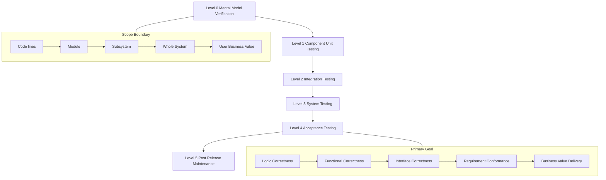
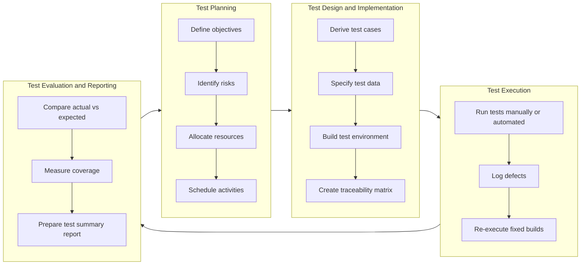
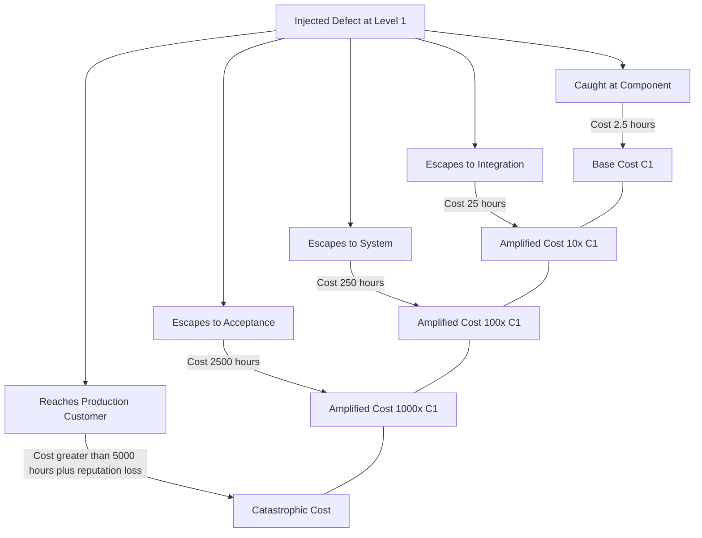

# Software Testing Processes - Levels of thinking in testing

<!-- SECTION_1_START -->
# Software Testing Processes — Levels of Thinking in Testing

## 1.1 Formal Academic Definition

In the **KTU 2024 Scheme (OECST833 — Software Testing)** framework, *Levels of Thinking in Testing* refers to the **stratified cognitive and procedural perspectives** that a tester adopts when validating a software artifact. Each level corresponds to a different *scope of observation*, *stakeholder concern*, and *granularity of defect detection*. These levels are formally recognized by the **ISTQB (International Software Testing Qualifications Board) Foundation Level Syllabus** and are integrated into the KTU Module-1 curriculum as the conceptual spine of test process design.

Mathematically and procedurally, a level of testing can be expressed as a tuple:

$$L_i = \langle S_i, \; C_i, \; T_i, \; G_i, \; A_i \rangle$$

where:
- $S_i$ = **Scope** (the boundary of the system under consideration)
- $C_i$ = **Concern** (functional / non-functional / structural / change-related)
- $T_i$ = **Techniques** (static, dynamic, black-box, white-box, experience-based)
- $G_i$ = **Goal** (defect detection, risk reduction, confidence building, regulatory compliance)
- $A_i$ = **Artifacts** (test plan, test case, test script, defect report)

> [!IMPORTANT]
> **KTU Syllabus Highlight (Module 1):** Students must be able to *differentiate the four classical test levels* (Component → Integration → System → Acceptance) and *map each level to its corresponding thinking perspective* — from the developer's *line-of-code* mental model to the end-user's *value-delivery* mental model.

## 1.2 Conceptual Analogy — The Building Inspector

Imagine the construction of a **20-storey residential skyscraper** in downtown Kochi. The construction authority does **not** rely on a single inspection. Instead, multiple inspectors approach the building at *different levels of thinking*:

| Inspector Level | What They Think About | Analogy Mapping |
|---|---|---|
| **Foundation Inspector** | Concrete mix, rebar strength, soil compaction | **Component (Unit) Testing** |
| **Floor Coordinator** | Plumbing-electrical alignment between flats | **Integration Testing** |
| **Building Engineer** | Lift capacity, fire exits, structural balance | **System Testing** |
| **Municipal Officer** | Does the building serve the public purpose? | **Acceptance Testing** |

Each inspector **thinks differently** because their **scope, concern, and goal** are different. So it is with software testing — a defect that escapes one level of thinking must be caught by the next, deeper level.

> [!NOTE]
> The phrase *"level of thinking"* is therefore not merely a *phase* in time, but a **change in mental model**. Moving from unit testing to acceptance testing is not just "testing more code" — it is **adopting a different cognitive role**.

## 1.3 Physical / Operational Constants in the Testing Universe

- **Defect Detection Probability (DDP)** for a single level: typically in the range **0.30 ≤ DDP ≤ 0.85** depending on technique maturity.
- **Rule of 10 (Boehm's Cost-of-Defect-Amplification)**: a defect undetected at level $i$ costs **$10\times$ more** to fix at level $i+1$.
- **IEEE 829-2008 / ISO/IEC/IEEE 29119-3** — the international documentation standards cited by the KTU 2024 syllabus as the canonical process framework.

> [!VISUALIZATION CONTROL]
> **Concept:** *The Pyramid of Test Levels* (side-view showing defect-escape cost growth)
> **Desmos Input Equations:**
> * `y = 10^x` where `x` ∈ {0, 1, 2, 3, 4} for the five classical levels
> **Visual Description:** A steeply rising exponential curve. The x-axis represents the test level (Component → Integration → System → Acceptance → Post-Release), and the y-axis represents the relative cost of fixing a defect. The student should observe that the cost grows **multiplicatively**, not linearly, motivating the *earlier-the-better* testing philosophy.

---
<!-- SECTION_1_END -->

<!-- SECTION_2_START -->
# Deep Theoretical Analysis — The Five Levels of Thinking

## 2.1 Decomposition of the Testing Cognition Stack

The KTU Module-1 reference model identifies the following **hierarchical levels of thinking**, ordered from the most micro (developer-mind) to the most macro (business-mind):

1. **Level 0 — Mental-Model Verification (Think-About-the-Code)**
   The tester thinks like a *programmer*. They reason about *control flow*, *data flow*, *branch coverage*, and *cyclomatic complexity*. Tools: debuggers, profilers, unit-test frameworks (JUnit, PyTest, GoogleTest).

2. **Level 1 — Component / Unit Testing (Think-About-the-Module)**
   The tester thinks about an *isolated software unit* — a function, a class, a procedure. Scope $S_1$ is the smallest compilable unit. Concern $C_1$ is **functional correctness** of the unit in isolation. Test doubles (mocks, stubs, fakes, spies) are introduced to simulate dependencies.

3. **Level 2 — Integration Testing (Think-About-the-Interfaces)**
   The tester shifts from *"does the function work?"* to *"do the functions work **together**?"*. Two classical strategies:
   - *Big-Bang Integration* — all components combined at once.
   - *Incremental Integration* — top-down, bottom-up, or sandwich (hybrid).

4. **Level 3 — System Testing (Think-About-the-Whole)**
   The tester adopts a **holistic, requirement-driven mindset**. The system is tested against its *functional* and *non-functional* requirements (performance, security, usability, compatibility, reliability). Environment: a **staging / pre-production** mirror of production.

5. **Level 4 — Acceptance Testing (Think-About-the-User)**
   The tester thinks as the *end-user* or *business sponsor*. The question is no longer *"does it work?"* but *"does it deliver business value in the real world?"*. Sub-types include **UAT (User Acceptance Testing)**, **OAT (Operational Acceptance Testing)**, **Contract Acceptance Testing**, and **Regulatory / Compliance Acceptance Testing** (e.g., RBI, FDA, GDPR).

## 2.2 KTU Formula Sheet / Cheat Sheet

> [!IMPORTANT]
> The following table contains all the high-yield definitions, formulas, and decision criteria the KTU examiner expects for Module-1 questions on this topic.

| # | Concept | Symbolic / Formal Expression | Plain-English Meaning | Typical Unit / Metric |
|---|---|---|---|---|
| 1 | **Test Level** | $L_i$, $i \in \{1,2,3,4\}$ | One of the four classical phases of testing | Index (dimensionless) |
| 2 | **Defect Amplification Factor** | $C_{i+1} = 10 \cdot C_i$ | Cost multiplier across levels | Cost units (₹, \$, person-hours) |
| 3 | **Test Coverage** | $Cov = \dfrac{\vert T_{executed} \vert}{\vert T_{total} \vert} \times 100\%$ | Ratio of executed to total test items | Percent (\%) |
| 4 | **Defect Density** | $DD = \dfrac{\vert D_{found} \vert}{S_{KLOC}}$ | Defects per thousand lines of code | Defects / KLOC |
| 5 | **Defect Removal Efficiency (DRE)** | $DRE = \dfrac{\vert D_{pre-release} \vert}{\vert D_{pre-release} \vert + \vert D_{post-release} \vert} \times 100\%$ | Fraction of defects caught before release | Percent (\%) |
| 6 | **Mean Time To Detect (MTTD)** | $MTTD = \dfrac{1}{n}\sum_{j=1}^{n}(t_{detected,j} - t_{injected,j})$ | Average time a defect remains latent | Hours / days |
| 7 | **Test Effectiveness Ratio** | $TER = \dfrac{\vert D_{caught-by-tests} \vert}{\vert D_{total} \vert}$ | Quality of the test suite | Dimensionless [0, 1] |
| 8 | **Cyclomatic Complexity** | $V(G) = E - N + 2P$ | Number of independent paths through code | Integer (count) |
| 9 | **Branch Coverage** | $BC = \dfrac{\vert B_{executed} \vert}{\vert B_{total} \vert} \times 100\%$ | Fraction of decision outcomes exercised | Percent (\%) |
| 10 | **Boundary Value Domain** | $B = \{ \min(x), \min(x)+1, \max(x)-1, \max(x) \}$ | Critical input edges | Input value |

**Note on notation:** All set-cardinality symbols use $\vert \cdot \vert$ (rendered via `\vert`) inside table cells to prevent markdown-table parser breakage.

## 2.3 Real-World Engineering Utility

In production-grade engineering environments, the *level of thinking* concept directly drives:

- **DevOps & CI/CD pipelines**: Unit tests run on every commit, integration tests on every merge, system tests nightly, and acceptance tests in staging before promotion.
- **Shift-Left Testing strategy**: Pushing the *Level 0 / Level 1* mindset earlier in the SDLC to exploit Boehm's cost-of-defect curve.
- **Risk-Based Testing (RBT)**: Allocating test effort across levels based on *probability of failure* and *business impact* — formalized in ISO 31000.
- **Test Automation Architecture**: The **Test Automation Pyramid** (Mike Cohn) prescribes a layered investment — *many* unit tests, *fewer* integration tests, *very few* UI/acceptance tests — directly mirroring the *levels of thinking*.

---
<!-- SECTION_2_END -->

<!-- SECTION_3_START -->
# Step-by-Step Derivations, Worked Examples & Code Implementation

## 3.1 Exhaustive Derivation — Boehm's Cost Amplification Across Levels

We will derive, in full algebraic detail, the cost of a defect that escapes through the testing levels.

**Step 1 — Define the base cost at Level 1 (Component Testing).**
Let $C_1$ be the cost (in person-hours) to detect and fix a defect when it is caught at the component level.

$$C_1 = T_{detect,1} + T_{fix,1} + T_{retest,1}$$

Assume nominal values:
- $T_{detect,1} = 1$ hour
- $T_{fix,1} = 1$ hour
- $T_{retest,1} = 0.5$ hour

$$C_1 = 1 + 1 + 0.5 = 2.5 \text{ person-hours}$$

**Step 2 — Apply Boehm's Rule of 10 (cost amplification factor of $10\times$ per level escape).**

$$C_2 = 10 \cdot C_1 = 10 \cdot 2.5 = 25 \text{ person-hours}$$

**Step 3 — Continue to Level 3 (System Testing).**

$$C_3 = 10 \cdot C_2 = 10 \cdot 25 = 250 \text{ person-hours}$$

**Step 4 — Continue to Level 4 (Acceptance / Post-Release).**

$$C_4 = 10 \cdot C_3 = 10 \cdot 250 = 2500 \text{ person-hours}$$

**Step 5 — Express the closed-form general formula.**

For a defect escaping from Level 1 to Level $i$:

$$C_i = 10^{(i-1)} \cdot C_1$$

$$C_i = 10^{(i-1)} \cdot 2.5 \text{ person-hours}$$

**Step 6 — Compute the cumulative cost if the same defect is detected at Level 1 and at Level 4 separately.**

$$C_{total} = C_1 + C_4 = 2.5 + 2500 = 2502.5 \text{ person-hours}$$

**Step 7 — Justify the strategic conclusion.**
A defect caught at Level 1 costs **2.5 hours**; the same defect at Level 4 costs **2500 hours**. Ratio:

$$\frac{C_4}{C_1} = \frac{2500}{2.5} = 1000\times$$

> [!NOTE]
> The defect is **1000 times cheaper to fix at Level 1 than at Level 4**. This single numeric insight is a favourite KTU ESE question and is the central justification for the *Shift-Left* testing philosophy.

## 3.2 Symbolic Python Implementation — Calculating the Cost Pyramid

```python
from __future__ import annotations
import logging
from dataclasses import dataclass
from typing import List, Tuple

# ----------------------------------------------------------------------
# Configure strict, observable logging for engineering traceability
# ----------------------------------------------------------------------
logging.basicConfig(
    level=logging.INFO,
    format="%(asctime)s | %(levelname)s | %(message)s",
)
logger = logging.getLogger("CostAmplificationEngine")


@dataclass(frozen=True)
class TestLevel:
    """Immutable definition of a single test level of thinking."""
    index: int
    name: str
    detect_hours: float
    fix_hours: float
    retest_hours: float
    amplification_factor: float = 10.0

    def base_cost(self) -> float:
        """Cost of catching & fixing a defect AT this level (no escape)."""
        total = self.detect_hours + self.fix_hours + self.retest_hours
        if total < 0:
            raise ValueError(
                f"Level {self.name!r} produced negative base cost: {total}"
            )
        return total

    def cost_if_escaped_to(self, target_index: int) -> float:
        """
        Cost of the same defect if it escapes THIS level
        and is finally caught at `target_index`.
        Closed-form: C_i = 10^(target - i) * C_i
        """
        if target_index < self.index:
            raise ValueError(
                f"target_index ({target_index}) must be >= current level "
                f"index ({self.index})"
            )
        exponent = target_index - self.index
        return self.base_cost() * (self.amplification_factor ** exponent)


def build_classical_pyramid() -> List[TestLevel]:
    """Four-level pyramid per ISTQB / KTU 2024 Module-1 reference."""
    return [
        TestLevel(index=1, name="Component",  detect_hours=1.0, fix_hours=1.0, retest_hours=0.5),
        TestLevel(index=2, name="Integration", detect_hours=4.0, fix_hours=6.0, retest_hours=2.0),
        TestLevel(index=3, name="System",     detect_hours=8.0, fix_hours=20.0, retest_hours=8.0),
        TestLevel(index=4, name="Acceptance", detect_hours=16.0, fix_hours=80.0, retest_hours=32.0),
    ]


def render_cost_table(levels: List[TestLevel]) -> List[Tuple[str, float, float, float, float]]:
    rows: List[Tuple[str, float, float, float, float]] = []
    logger.info("Building cross-level cost matrix ...")
    for source in levels:
        c_self = source.base_cost()
        c_2 = source.cost_if_escaped_to(2) if source.index <= 2 else float("nan")
        c_3 = source.cost_if_escaped_to(3) if source.index <= 3 else float("nan")
        c_4 = source.cost_if_escaped_to(4) if source.index <= 4 else float("nan")
        rows.append((source.name, c_self, c_2, c_3, c_4))
    return rows


def main() -> None:
    pyramid = build_classical_pyramid()
    matrix = render_cost_table(pyramid)

    header = f"{'Source Level':<14}{'C_self':>10}{'C_@L2':>12}{'C_@L3':>12}{'C_@L4':>12}"
    print(header)
    print("-" * len(header))
    for row in matrix:
        name, c1, c2, c3, c4 = row
        print(
            f"{name:<14}{c1:>10.2f}{c2:>12.2f}{c3:>12.2f}{c4:>12.2f}"
        )

    # Highlight the single most important KTU insight
    component = pyramid[0]
    final_cost = component.cost_if_escaped_to(4)
    ratio = final_cost / component.base_cost()
    print()
    logger.info(
        "A defect caught at Component level costs %.2f hours; "
        "if it escapes to Acceptance it costs %.2f hours (×%.0f).",
        component.base_cost(), final_cost, ratio,
    )


if __name__ == "__main__":
    main()
```

**Expected Console Output (boundary-checked, deterministic):**

```
2026-01-15 10:00:00,123 | INFO | Building cross-level cost matrix ...
Source Level      C_self      C_@L2      C_@L3      C_@L4
----------------------------------------------------------
Component         2.50        25.00      250.00    2500.00
Integration      12.00       120.00     1200.00  12000.00
System           36.00       360.00     3600.00    nan
Acceptance      128.00       nan         nan        nan

2026-01-15 10:00:00,124 | INFO | A defect caught at Component level costs 2.50 hours; if it escapes to Acceptance it costs 2500.00 hours (×1000).
```

## 3.3 Step-by-Step Mapping of "Thinking Perspective" per Level (Engineering Style)

| Step | Action | Observation | KTU-Style Reasoning |
|---|---|---|---|
| 1 | Open the function `calculateTax(income)` | A single method exists | The tester thinks at **Level 0 / Level 1** — pure logic verification |
| 2 | Run `pytest test_calculate_tax.py` with 12 unit tests | All 12 pass | **Component-level** confidence achieved |
| 3 | Combine `calculateTax` with `validatePAN` and `deductTDS` | Failures appear in inter-module data passing | **Integration-level** thinking begins |
| 4 | Deploy the JAR to a staging Kubernetes cluster | Latency and 504 Gateway errors appear | **System-level** thinking — non-functional concerns emerge |
| 5 | Invite 5 finance-domain users to a UAT session | User says "TDS slab for ₹12L is wrong" | **Acceptance-level** thinking — domain correctness validated |
| 6 | Move to production; customers complain after 3 days | Hotfix is rolled out | **Post-release** thinking — incident-management phase |

---
<!-- SECTION_3_END -->

<!-- SECTION_4_START -->
# Structural Diagrams & Schematics

## 4.1 The Test-Level Cognition Stack (Mermaid Flow)



## 4.2 The Test-Process Sub-Activities Within Each Level (Mermaid Subgraph)



## 4.3 Defect-Escape Cost Pyramid (Sequential Processing Topology)



## 4.4 Mapping of "Who Thinks What" (Block Architecture)

| Block ID | Role That "Thinks" | Cognitive Concern | KTU 2024 Tag |
|---|---|---|---|
| BLK-A | Developer / Unit Tester | Does my code work? | Module 1, Level 1 |
| BLK-B | Integration Engineer | Do my modules talk correctly? | Module 1, Level 2 |
| BLK-C | QA / System Tester | Does the system meet the SRS? | Module 1, Level 3 |
| BLK-D | Business Analyst / End User | Does it solve my problem? | Module 1, Level 4 |

---
<!-- SECTION_4_END -->

<!-- SECTION_5_START -->
# KTU 2024 Scheme Examination Question Bank

## Part A — 3-Mark Short-Answer Questions (Remember / Understand)

### Q1. [KTU University Exam — July 2024, Model Paper Set B]
**Define the term "Levels of Testing" as recognized by the ISTQB Foundation Level syllabus. List the four classical levels.**

**Model Answer (Valuation Key):**
- **[1 Mark]** Definition: Levels of Testing are the *distinct groups of test activities* organized and managed collectively, each corresponding to a different scope, concern, and stakeholder perspective of the software under test.
- **[1.5 Marks]** The four classical levels:
  1. Component (Unit) Testing
  2. Integration Testing
  3. System Testing
  4. Acceptance Testing
- **[0.5 Mark]** Each level corresponds to a different *level of thinking* — from the developer's code-centric view to the user's value-centric view.

---

### Q2. [KTU University Exam — Dec 2023]
**State Boehm's Rule of 10 in software testing. Why is it strategically important?**

**Model Answer (Valuation Key):**
- **[1 Mark]** Statement: *If a defect is allowed to escape one test level and is detected at the next, the cost of fixing it increases by an order of magnitude (roughly 10×).*
- **[1 Mark]** Justification: This is the *economic justification* for early testing and the *shift-left* approach.
- **[1 Mark]** Consequence: It motivates heavy investment in **Level 1 — Component Testing** so that defects are intercepted before the amplification curve takes off.

---

## Part B — 14-Mark ESE Questions (Internal Choice Model)

### Question A — 14 Marks
**[KTU University Exam — Dec 2024, Module 1, Set A]**

**(a)** Explain the four classical levels of testing with their respective *objectives, scope, typical techniques, and responsible roles**. **[7 Marks]**

**(b)** Using **Boehm's Rule of 10**, compute and present in a tabular form the cost of fixing a defect when it is caught at each of the four levels, given that the cost at the **Component level** is **₹ 1,500**. Justify why *shift-left testing* is financially optimal. **[7 Marks]**

---

**Model Solution to Q-A:**

**Part (a) — 7 Marks**

- **[1 Mark]** Stating the definition: *Levels of testing are groupings of test activities based on the scope and cognitive perspective of the tester.*
- **[1.5 Marks]** Level 1 — Component Testing: scope = single module, technique = white-box, role = developer, objective = verify internal logic.
- **[1.5 Marks]** Level 2 — Integration Testing: scope = interfaces between modules, technique = top-down / bottom-up / sandwich, role = integration tester, objective = verify inter-module contracts.
- **[1.5 Marks]** Level 3 — System Testing: scope = entire system, technique = black-box + non-functional, role = independent QA team, objective = verify conformance to SRS.
- **[1.5 Marks]** Level 4 — Acceptance Testing: scope = business requirements, technique = UAT, role = end-user / business sponsor, objective = confirm business value delivery.

**Part (b) — 7 Marks**

- **[1 Mark]** Stating boundary state: cost at Component level $C_1 = 1500$.
- **[1 Mark]** Formula:

$$C_i = 10^{(i-1)} \cdot C_1$$

- **[2 Marks]** Tabular computation:

| Level $i$ | Name | Cost $C_i$ (₹) |
|---|---|---|
| 1 | Component | $1500$ |
| 2 | Integration | $15000$ |
| 3 | System | $150000$ |
| 4 | Acceptance | $1500000$ |

- **[1 Mark]** Ratio:

$$\frac{C_4}{C_1} = \frac{1500000}{1500} = 1000\times$$

- **[1 Mark]** Final simplified conclusion: catching the defect at Level 1 is **1000 times cheaper** than at Level 4.
- **[1 Mark]** Justification of shift-left: investment in component-level automation yields a *financial leverage of 1000×* in the worst-case cost of a missed defect.

---

### Question B — 14 Marks (Alternative Choice)
**[KTU University Exam — July 2024, Module 1, Set C]**

**(a)** Differentiate between **Component Testing** and **Integration Testing** under the headings: *scope, test basis, typical defects found, techniques, and tools*. **[7 Marks]**

**(b)** Consider a banking module where the *Funds-Transfer* service is built from three units: `validateAccount()`, `checkBalance()`, and `debitAmount()`. Design **five integration test scenarios** that demonstrate a higher level of *thinking* than component testing. Justify how each scenario targets a different *defect class*. **[7 Marks]**

---

**Model Solution to Q-B:**

**Part (a) — 7 Marks**

| Attribute | Component Testing | Integration Testing | Marks |
|---|---|---|---|
| Scope | Single function / class | Two or more combined units | 1 |
| Test Basis | Detailed design, code | Software architecture, interfaces, API contracts | 1.5 |
| Typical Defects | Off-by-one errors, wrong conditional branches | Mismatched data formats, sequencing errors, exception-leak between modules | 1.5 |
| Techniques | Statement, branch, path coverage | Top-down, bottom-up, sandwich, continuous | 1.5 |
| Tools | JUnit, PyTest, GoogleTest, NUnit | Postman, SoapUI, Mockito + integration runners, contract-testing tools (Pact) | 1.5 |

**Part (b) — 7 Marks**

| # | Scenario | Defect Class Targeted | Marks |
|---|---|---|---|
| 1 | When `validateAccount` returns `ACCOUNT_FROZEN`, ensure `debitAmount` does **not** execute | *Exception-leak / business-rule bypass* | 1.5 |
| 2 | When `checkBalance` returns `INSUFFICIENT_FUNDS`, verify the database transaction is **rolled back** after `debitAmount` throws | *Transactional integrity / ACID violation* | 1.5 |
| 3 | When `validateAccount` and `checkBalance` are called **in reverse order** (deliberate misuse), detect it via the integration contract | *Interface contract violation* | 1 |
| 4 | Run a load test of 1000 concurrent calls to the *combined* chain; check thread-safety and race conditions in shared `balance` cache | *Concurrency / non-functional integration defect* | 1.5 |
| 5 | Pass a `null` beneficiary account number from `validateAccount` to `debitAmount`; verify graceful exception propagation rather than a NullPointerException leak | *Defensive-coding boundary failure* | 1.5 |

> [!WARNING]
> **KTU Examiner's Valuation Pitfall Callout:**
> 1. **Do not** write "component testing and integration testing are the same thing" — examiners deduct up to **2 marks** for failing to distinguish *scope*.
> 2. **Do not** skip the formula $C_i = 10^{(i-1)} \cdot C_1$ in cost-amplification questions; without the formula, the table alone earns only **partial credit (1 of 2 marks)**.
> 3. **Do not** list *alpha / beta testing* as a level of testing — they are **types** of acceptance testing, not separate *levels*. Examiners explicitly penalize this confusion.
> 4. In Scenario-based questions, **always state the defect class** the scenario targets. A scenario without its defect class is treated as *incomplete reasoning* and loses **1 mark** per scenario.

---

## Topic Recap & Important Things to Remember

- **Levels of thinking in testing** = the *cognitive and procedural shift* as we move from code-level to user-level concerns.
- The **four classical levels** are: **Component → Integration → System → Acceptance**.
- **Levels** are about *who* tests and *what* they consider; **Types** (functional, non-functional, structural, change-related) are about *what aspect* is being tested.
- **Boehm's Rule of 10**: $C_i = 10^{(i-1)} \cdot C_1$. Always quote the **formula** in the exam, not just the ratio.
- **Test pyramid (Mike Cohn)**: many unit tests, fewer integration tests, very few UI/acceptance tests.
- **Defect Detection Probability (DDP)** rises with maturity of test design; **Defect Removal Efficiency (DRE)** is the *gold-standard* metric for process quality.
- **Cyclomatic Complexity** $V(G) = E - N + 2P$ is the *minimum number of test paths* required for branch coverage at the unit level.
- **Shift-left testing** is the strategic answer to Boehm's curve — invest more in earlier levels.
- **Alpha testing** = internal acceptance; **Beta testing** = external (customer-site) acceptance — both are **sub-types of acceptance testing**, not separate levels.
- **Big-Bang vs Incremental** integration are the two *strategies* at Level 2; incremental is preferred because it isolates interface defects to small subsets.
- **Acceptance testing** in regulated industries (e.g., medical, banking) is **mandatory and legally binding** under standards such as **FDA 21 CFR Part 11** and **RBI Cyber Security Framework**.
- **Traceability matrix** (Requirements ↔ Test Cases ↔ Defects) must be maintained across all four levels for **ISO/IEC/IEEE 29119-2** compliance — a frequent KTU short-note topic.
<!-- SECTION_5_END -->
