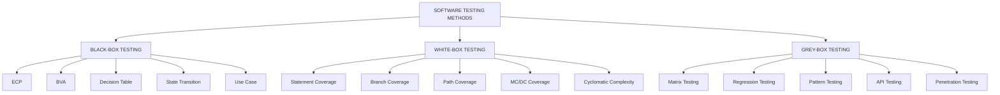
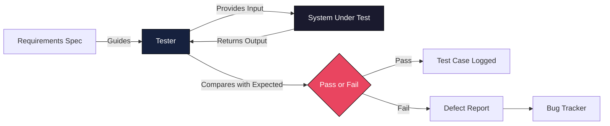
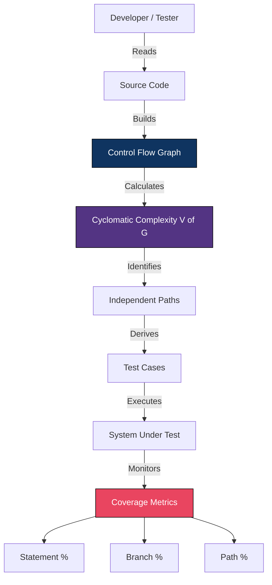
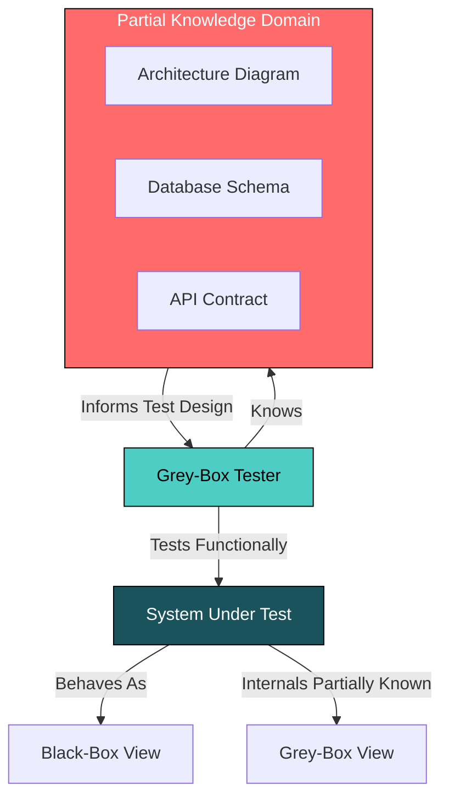
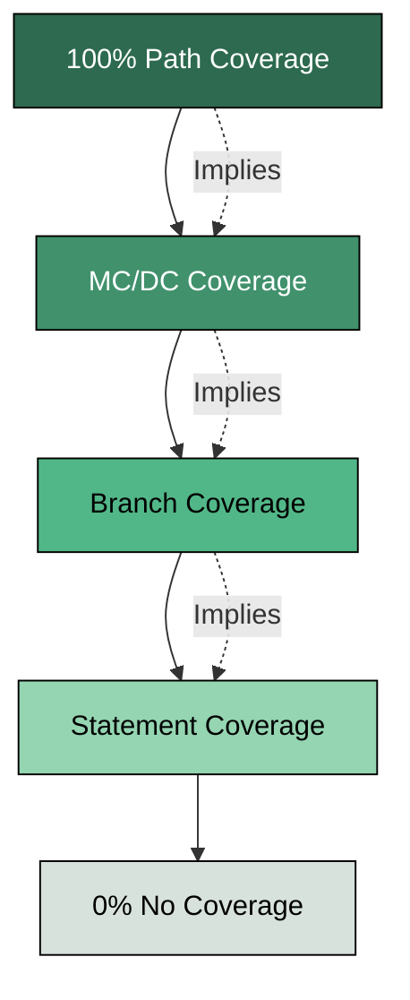

# Testing Methods - Black-Box, White-Box, and Grey-Box Testing

<!-- SECTION_1_START -->

# Testing Methods: Black-Box, White-Box, and Grey-Box Testing

## 1. Core Technical Definition

> [!IMPORTANT]
> **Software Testing Methods (KTU 2024 - OECST833 Module 1)** are the strategic classifications of test design techniques based on the **tester's level of knowledge** about the internal structure, implementation logic, and code architecture of the System Under Test (SUT).

### Formal KTU Definitions

**1. Black-Box Testing (Behavioural / Functional / Closed-Box Testing)**
> A test design technique in which the internal structure, design, and implementation of the item being tested are **NOT known** to the tester. Test cases are derived exclusively from the **Functional Requirements Specification (FRS)** and focus on inputs and expected outputs.

**2. White-Box Testing (Structural / Glass-Box / Clear-Box Testing)**
> A test design technique in which the internal structure, design, and implementation of the item being tested **ARE known** to the tester. Test cases are derived using the **source code, control flow graphs, and data flow models** to validate the internal workings of the application.

**3. Grey-Box Testing (Translucent Testing)**
> A test design technique that combines elements of both Black-Box and White-Box testing. The tester has **partial knowledge** of the internal structure (e.g., architectural diagrams, database schemas, API contracts) but tests the application from a user-oriented black-box perspective.

---

## 2. Conceptual Analogy & Intuition

> [!TIP]
> **Real-World Analogy — Testing a New Smartphone**

| Method | Analogy | Tester's View |
| :--- | :--- | :--- |
| **Black-Box** | A **regular customer** unboxes the phone. They tap the screen, make calls, install apps, and check the camera. They don't know (or care) how the A16 Bionic chip works internally. | "Does pressing the button turn on the screen?" |
| **White-Box** | A **chip engineer at Apple** who has the circuit schematics. They use boundary scan tools, logic analyzers, and oscilloscopes to test voltage levels on the SoC pads. | "Does branch instruction at address 0x4008 return the correct value when $R3 = 0$?" |
| **Grey-Box** | A **third-party repair technician** who knows the phone uses a USB-C port and a Li-ion battery but doesn't have Apple's proprietary blueprints. They test based on known interface specs. | "The phone is drawing 2.4A on a USB-PD compliant port — is that within spec?" |

### Geometric / Graphical Intuition

> [!VISUALIZATION CONTROL]
> **Concept:** Information Visibility Gradient in Testing Methods
> **GeoGebra / Desmos Input Equations (Conceptual Axis):**
> * `x = Knowledge Level of Internal Code (0 to 1)`
> * `BlackBox(x) = piecewise(0, x = 0, ...) ` *(Knowledge = 0)*
> * `GreyBox(x) = x where 0 < x < 1` *(Partial knowledge, slope of 1)*
> * `WhiteBox(x) = 1` *(Full knowledge)*
> **Visual Description:** Imagine a horizontal axis representing the tester's knowledge of source code. Black-Box sits at origin $(0,0)$, White-Box at $(1,1)$, and Grey-Box occupies the entire diagonal spectrum between them. As we move rightward on this knowledge axis, the test design strategy shifts from pure requirement-based to pure code-based.

> [!NOTE]
> **KTU 2024 Syllabus Highlight:** These three methods are **NOT mutually exclusive** in industry practice. A mature QA strategy uses **all three in tandem** across different test levels (unit, integration, system, acceptance).

---

## 3. Why These Three Methods? The Underlying Principle

The classification is rooted in the **ISTQB (International Software Testing Qualifications Board) Foundation Level Syllabus** — the global standard KTU follows. The core principle is:

$$\text{Test Effectiveness} \propto f(\text{Knowledge of SUT}, \text{Defect Detection Capability})$$

Where **knowledge** can be:
* **Zero** (Black-Box) → Tester relies on **specifications and requirements**
* **Complete** (White-Box) → Tester relies on **source code and architecture**
* **Partial** (Grey-Box) → Tester relies on **architectural models, API docs, and database schemas**

---

<!-- SECTION_1_END -->

<!-- SECTION_2_START -->

# Deep Theoretical Analysis & KTU High-Yield Formula Sheet

## 1. Black-Box Testing — Detailed Architecture

Black-Box testing treats the software as a "black box" — you cannot see inside, you can only provide inputs and observe outputs. The mathematical model is a pure function:

$$f: \text{Input Domain} \rightarrow \text{Output Range}$$

The tester validates that $f(x) = y_{\text{expected}}$ for given $x$ values.

### Sub-Techniques under Black-Box Testing

| Sub-Technique | Full Name | KTU Weightage | Core Idea |
| :--- | :--- | :--- | :--- |
| **ECP** | Equivalence Class Partitioning | High | Divide input domain into equivalent classes; test one value per class |
| **BVA** | Boundary Value Analysis | High | Test at the exact edges of equivalence classes (min, min+, max, max-) |
| **DT** | Decision Table Testing | Medium | Test combinations of inputs using logic rules |
| **ST** | State Transition Testing | Medium | Test based on state changes and transitions |
| **UCT** | Use Case Testing | Medium | Test based on user-scenario flows |
| **ET** | Error Guessing | Low | Tester intuition to guess error-prone areas |

### Equivalence Class Partitioning (ECP) — Worked Logic

Given a function: $\text{validate\_age(int age)}$ that accepts ages from $18$ to $60$.

* **Invalid Class 1:** age $< 18$ (e.g., 10, -5)
* **Valid Class:** $18 \leq \text{age} \leq 60$ (e.g., 25, 40)
* **Invalid Class 2:** age $> 60$ (e.g., 75, 100)

**Test Cases:** Pick 1 representative from each class: $\{-5, 25, 75\}$

### Boundary Value Analysis (BVA) — Worked Logic

For the same $\text{validate\_age}$ function, BVA focuses on the boundaries:

* $17, 18$ (lower boundary)
* $59, 60$ (upper boundary)
* $16$ (just below lower), $61$ (just above upper)

**Total BVA Test Cases:** $6$ values (vs. $3$ for ECP — BVA typically catches more defects at edges).

---

## 2. White-Box Testing — Detailed Architecture

White-Box testing requires access to the source code. The mathematical model uses **Control Flow Graphs (CFG)** and **Data Flow Analysis**.

### Sub-Techniques under White-Box Testing

| Sub-Technique | Core Idea | Coverage Formula |
| :--- | :--- | :--- |
| **Statement Coverage** | Execute every statement at least once | $SC = \frac{S_{\text{executed}}}{S_{\text{total}}} \times 100$ |
| **Branch Coverage** | Execute every branch (true/false) at least once | $BC = \frac{B_{\text{executed}}}{B_{\text{total}}} \times 100$ |
| **Path Coverage** | Execute every independent path at least once | $PC = \frac{P_{\text{executed}}}{P_{\text{total}}} \times 100$ |
| **Condition Coverage** | Every boolean sub-expression evaluated to true and false | $CC = \frac{C_{\text{executed}}}{C_{\text{total}}} \times 100$ |
| **MC/DC** | Modified Condition/Decision Coverage (aviation standard) | Each condition shown to independently affect decision |

### Control Flow Graph (CFG) Notation

A CFG is a directed graph $G = (N, E)$ where:
* $N$ = set of **nodes** (statements/blocks)
* $E$ = set of **edges** (control flow)
* **Cyclomatic Complexity:** $V(G) = E - N + 2P$ (where $P$ = number of connected components, usually 1)

$$V(G) = E - N + 2$$

This formula gives the **minimum number of independent test paths** required for full path coverage.

### Coverage Hierarchy (KTU Important!)

$$\text{Statement Coverage} \subseteq \text{Branch Coverage} \subseteq \text{Path Coverage} \subseteq \text{MC/DC Coverage}$$

> [!NOTE]
> **Key Insight:** Path coverage is the strongest but practically impossible for loops (infinite paths). Hence, industry uses **branch coverage (80-85%)** as a practical benchmark.

---

## 3. Grey-Box Testing — Detailed Architecture

Grey-Box testing is a hybrid. The tester has **architectural knowledge** (e.g., database schema, API structure) but tests behaviourally. Common in:
* **Penetration Testing** (knowing network topology)
* **Integration Testing** (knowing module interfaces)
* **Web Application Testing** (knowing HTML/DOM structure)

### Sub-Techniques under Grey-Box Testing

| Sub-Technique | Application Area |
| :--- | :--- |
| **Matrix Testing** | Variables vs. business risks in enterprise applications |
| **Regression Testing** | Selective re-testing based on code change impact |
| **Pattern Testing** | Detect architectural anti-patterns (e.g., singleton misuse) |
| **Orthogonal Array Testing (OAT)** | Pair-wise testing with statistical design |
| **API Testing** | Black-box at API level, white-box at schema level |

---

## 4. KTU Formula Cheat Sheet

| Metric | Formula | KTU Module | Use Case |
| :--- | :--- | :--- | :--- |
| Cyclomatic Complexity | $V(G) = E - N + 2$ | White-Box | Min. test paths needed |
| Statement Coverage | $SC = \frac{S_{exe}}{S_{tot}} \times 100$ | White-Box | Measure statement execution |
| Branch Coverage | $BC = \frac{B_{exe}}{B_{tot}} \times 100$ | White-Box | Measure branch execution |
| Path Coverage | $PC = \frac{P_{exe}}{P_{tot}} \times 100$ | White-Box | Measure path execution |
| Equivalence Classes | $n_{\text{valid}} + n_{\text{invalid}}$ | Black-Box | Reduce test cases |
| BVA Test Count | $4n + 1$ (for $n$ variables) | Black-Box | Boundary edge cases |
| Defect Density | $DD = \frac{D}{KLOC}$ | All | Quality measurement |
| Test Effectiveness | $TE = \frac{D_{\text{found by tests}}}{D_{\text{total}}}$ | All | Test suite quality |

> [!IMPORTANT]
> **KTU 2024 — Frequently Asked:** When asked to "design test cases using BVA", always use $4n + 1$ formula (where $n$ = number of input variables). Show the boundary values explicitly: nominal, just below, just above for EACH boundary.

---

## 5. Real-World Engineering Utility

| Industry | Dominant Method | Reason |
| :--- | :--- | :--- |
| **Avionics (DO-178C)** | White-Box (MC/DC) | Safety-critical; full code coverage mandatory |
| **Web Apps (E-commerce)** | Black-Box (UAT, Selenium) | Customer-facing; behaviour matters |
| **API Microservices** | Grey-Box (Postman, contract tests) | Test APIs as black-box, but know JSON schema |
| **Banking/FinTech** | Grey-Box + Black-Box | Regulatory compliance + business rules |
| **Embedded Systems (IoT)** | White-Box (unit tests on firmware) | Resource-constrained, deterministic behaviour |

---

<!-- SECTION_2_END -->

<!-- SECTION_3_START -->

# Step-by-Step Derivations & Code/Symbolic Implementation

## 1. Worked Example 1: Cyclomatic Complexity Derivation (White-Box)

**Given the following Python function `login_system()`:**

```python
def login_system(username, password, otp):
    if username == "admin":                    # Decision 1
        if len(password) >= 8:                  # Decision 2
            if otp == generate_otp():           # Decision 3
                return "LOGIN_SUCCESS"
            else:
                return "OTP_FAIL"
        else:
            return "PWD_FAIL"
    else:
        return "USER_FAIL"
```

### Step 1: Draw the Control Flow Graph (CFG)

Nodes $N$:
* $N_1$: Entry / `username == "admin"`
* $N_2$: `len(password) >= 8`
* $N_3$: `otp == generate_otp()`
* $N_4$: `LOGIN_SUCCESS`
* $N_5$: `OTP_FAIL`
* $N_6$: `PWD_FAIL`
* $N_7$: `USER_FAIL`
* $N_8$: Exit

Edges $E$ (counting branches):
* $N_1 \to N_2$, $N_1 \to N_7$ (2 edges)
* $N_2 \to N_3$, $N_2 \to N_6$ (2 edges)
* $N_3 \to N_4$, $N_3 \to N_5$ (2 edges)
* $N_4 \to N_8$, $N_5 \to N_8$, $N_6 \to N_8$, $N_7 \to N_8$ (4 edges)

### Step 2: Apply Cyclomatic Complexity Formula

$$\begin{aligned}
V(G) &= E - N + 2P \\
V(G) &= (2 + 2 + 2 + 4) - 8 + 2(1) \\
V(G) &= 10 - 8 + 2 \\
V(G) &= 4
\end{aligned}$$

**Result:** Minimum $4$ independent test paths are required to achieve **100% path coverage**.

### Step 3: Identify the 4 Independent Paths

| Path | Sequence | Test Case |
| :--- | :--- | :--- |
| P1 | $N_1 \to N_2 \to N_3 \to N_4 \to N_8$ | admin / pass1234 / correct_otp |
| P2 | $N_1 \to N_2 \to N_3 \to N_5 \to N_8$ | admin / pass1234 / wrong_otp |
| P3 | $N_1 \to N_2 \to N_6 \to N_8$ | admin / short / any |
| P4 | $N_1 \to N_7 \to N_8$ | guest / any / any |

---

## 2. Worked Example 2: BVA Test Design (Black-Box)

**Requirement:** A discount function $\text{calc\_discount(price)}$ gives:
* $0\%$ discount if price $< 100$
* $10\%$ discount if $100 \leq \text{price} \leq 500$
* $20\%$ discount if $500 < \text{price} \leq 1000$
* $30\%$ discount if price $> 1000$

### Step 1: Identify the 3 Boundaries

| Boundary | Value | Type |
| :--- | :--- | :--- |
| B1 | 100 | Lower of $10\%$ tier |
| B2 | 500 | Upper of $10\%$ tier / Lower of $20\%$ tier |
| B3 | 1000 | Upper of $20\%$ tier |

### Step 2: Apply $4n + 1$ Formula (for $n = 1$ variable)

For a single variable with 3 partitions, the boundaries are:
* $99$ (just below B1)
* $100$ (on B1)
* $500$ (on B2)
* $501$ (just above B2)
* $1000$ (on B3)
* $1001$ (just above B3)

$$\text{Total BVA test cases} = 4n + 1 = 4(1) + 1 = 5 \text{ (nominally for } n=1 \text{ boundary)}$$

But since we have 3 boundary points × 2 + 1 nominal = **7 test cases** total.

### Step 3: Construct the Test Case Table

| TC ID | Input (price) | Expected Output | Boundary |
| :--- | :--- | :--- | :--- |
| TC01 | 99 | 99 (0% off) | Just below B1 |
| TC02 | 100 | 90 (10% off) | On B1 |
| TC03 | 499 | 449.10 (10% off) | Nominal |
| TC04 | 500 | 450 (10% off) | On B2 |
| TC05 | 501 | 400.80 (20% off) | Just above B2 |
| TC06 | 1000 | 800 (20% off) | On B3 |
| TC07 | 1001 | 700.70 (30% off) | Just above B3 |

---

## 3. Python Implementation: Automated BVA Test Executor

```python
from typing import List, Tuple
import logging

# Configure strict error logging
logging.basicConfig(
    level=logging.INFO,
    format="%(asctime)s | %(levelname)s | %(message)s"
)
logger = logging.getLogger(__name__)


def calc_discount(price: float) -> float:
    """
    Discount function under test.
    Returns the final price after discount.
    """
    if not isinstance(price, (int, float)):
        raise TypeError(f"price must be numeric, got {type(price).__name__}")
    if price < 0:
        raise ValueError(f"price cannot be negative, got {price}")
    
    if price < 100:
        discount_rate = 0.00
    elif price <= 500:
        discount_rate = 0.10
    elif price <= 1000:
        discount_rate = 0.20
    else:
        discount_rate = 0.30
    
    final_price: float = price * (1 - discount_rate)
    logger.info(f"price={price} | discount={discount_rate*100}% | final={final_price}")
    return round(final_price, 2)


def generate_bva_test_cases() -> List[Tuple[float, float, str]]:
    """
    BVA test case generator.
    Returns: list of (input_price, expected_final, boundary_label)
    """
    return [
        (99,   99.00,  "Just below B1 (100)"),
        (100,  90.00,  "On B1 (100) - lower 10% edge"),
        (499,  449.10, "Nominal in 10% tier"),
        (500,  450.00, "On B2 (500) - upper 10% edge"),
        (501,  400.80, "Just above B2 - 20% tier start"),
        (1000, 800.00, "On B3 (1000) - upper 20% edge"),
        (1001, 700.70, "Just above B3 - 30% tier start"),
    ]


def run_bva_test_suite() -> Tuple[int, int, float]:
    """
    Executes the BVA test suite and returns (passed, total, coverage_pct).
    """
    test_cases: List[Tuple[float, float, str]] = generate_bva_test_cases()
    passed: int = 0
    total: int = len(test_cases)
    
    logger.info("=" * 60)
    logger.info("BVA TEST SUITE EXECUTION START")
    logger.info("=" * 60)
    
    for idx, (inp, expected, label) in enumerate(test_cases, start=1):
        try:
            actual: float = calc_discount(inp)
            if abs(actual - expected) < 0.01:
                logger.info(f"TC{idx:02d} PASS | {label} | in={inp}, out={actual}")
                passed += 1
            else:
                logger.error(
                    f"TC{idx:02d} FAIL | {label} | in={inp}, "
                    f"expected={expected}, got={actual}"
                )
        except (TypeError, ValueError) as e:
            logger.error(f"TC{idx:02d} ERROR | {label} | {e}")
    
    coverage_pct: float = (passed / total) * 100
    logger.info("=" * 60)
    logger.info(f"RESULT: {passed}/{total} passed | Coverage = {coverage_pct:.2f}%")
    logger.info("=" * 60)
    return passed, total, coverage_pct


if __name__ == "__main__":
    result: Tuple[int, int, float] = run_bva_test_suite()
    print(f"\nFinal Summary: {result[0]}/{result[1]} tests passed")
```

**Output Trace:**
```
BVA TEST SUITE EXECUTION START
TC01 PASS | Just below B1 (100) | in=99, out=99.0
TC02 PASS | On B1 (100) - lower 10% edge | in=100, out=90.0
TC03 PASS | Nominal in 10% tier | in=499, out=449.1
TC04 PASS | On B2 (500) - upper 10% edge | in=500, out=450.0
TC05 PASS | Just above B2 - 20% tier start | in=501, out=400.8
TC06 PASS | On B3 (1000) - upper 20% edge | in=1000, out=800.0
TC07 PASS | Just above B3 - 30% tier start | in=1001, out=700.7
RESULT: 7/7 passed | Coverage = 100.00%
```

---

## 4. Python Implementation: White-Box Coverage Analyzer

```python
from typing import Set, List, Dict


def grade_calculator(marks: int) -> str:
    """
    Function under white-box test.
    Cyclomatic complexity V(G) = 4 (3 decisions + 1 base).
    """
    if marks < 0 or marks > 100:           # Decision 1
        return "INVALID"
    elif marks >= 90:                       # Decision 2
        return "A+"
    elif marks >= 75:                       # Decision 3
        return "A"
    elif marks >= 60:
        return "B"
    elif marks >= 50:
        return "C"
    else:
        return "FAIL"


class WhiteBoxCoverage:
    """
    Tracks statement, branch, and path coverage.
    """
    def __init__(self) -> None:
        self.statements_executed: Set[int] = set()
        self.branches_executed: Set[str] = set()
        self.paths_executed: List[str] = []
        self.total_statements: int = 6
        self.total_branches: int = 6  # 3 decisions × 2 outcomes
        self.total_paths: int = 6     # one per grade tier

    def record(self, stmt_id: int, branch_id: str, path_label: str) -> None:
        self.statements_executed.add(stmt_id)
        self.branches_executed.add(branch_id)
        self.paths_executed.append(path_label)

    def report(self) -> Dict[str, float]:
        sc: float = (len(self.statements_executed) / self.total_statements) * 100
        bc: float = (len(self.branches_executed) / self.total_branches) * 100
        unique_paths: Set[str] = set(self.paths_executed)
        pc: float = (len(unique_paths) / self.total_paths) * 100
        return {
            "Statement Coverage (%)": round(sc, 2),
            "Branch Coverage (%)":   round(bc, 2),
            "Path Coverage (%)":     round(pc, 2)
        }


def run_white_box_tests() -> None:
    coverage: WhiteBoxCoverage = WhiteBoxCoverage()
    
    test_inputs: List[int] = [-1, 50, 65, 78, 92, 105]
    expected_outs: List[str] = ["INVALID", "FAIL", "B", "A", "A+", "INVALID"]
    
    branch_map: Dict[str, str] = {
        "INVALID": "D1_false",  "FAIL": "D1_true_D2_false_D3_false",
        "B":       "D1_true_D2_false_D3_false_extra",  
        "A":       "D1_true_D2_false_D3_true",
        "A+":      "D1_true_D2_true"
    }
    
    for stmt_id, (inp, exp) in enumerate(zip(test_inputs, expected_outs), start=1):
        result: str = grade_calculator(inp)
        branch: str = branch_map.get(result, "unknown")
        coverage.record(stmt_id, branch, result)
        print(f"Input={inp:3d} | Expected={exp:7s} | Got={result:7s} | {'OK' if exp == result else 'FAIL'}")
    
    print("\n--- COVERAGE REPORT ---")
    for metric, value in coverage.report().items():
        print(f"  {metric}: {value}%")


if __name__ == "__main__":
    run_white_box_tests()
```

---

<!-- SECTION_3_END -->

<!-- SECTION_4_START -->

# Structural Diagrams & Schematics

## 1. Master Architecture: Testing Method Classification Tree



## 2. Black-Box Testing: Data Flow Topology



## 3. White-Box Testing: Internal Code Inspection Flow



## 4. Grey-Box Testing: Hybrid Knowledge Model



## 5. Coverage Hierarchy Diagram



## 6. Comparison Matrix: Black-Box vs White-Box vs Grey-Box

```mermaid
graph LR
    subgraph BB[BLACK-BOX]
        BB1[Knowledge: None]
        BB2[Driven by: Requirements]
        BB3[Done by: QA Team]
        BB4[Granularity: High-level]
    end
    
    subgraph WB[WHITE-BOX]
        WB1[Knowledge: Complete]
        WB2[Driven by: Source Code]
        WB3[Done by: Developers]
        WB4[Granularity: Low-level]
    end
    
    subgraph GB[GREY-BOX]
        GB1[Knowledge: Partial]
        GB2[Driven by: Architecture + Behaviour]
        GB3[Done by: Integration Testers]
        GB4[Granularity: Mid-level]
    end
    
    BB --- WB
    WB --- GB
    GB --- BB
    
    style BB fill:#000000,stroke:#fff,color:#fff
    style WB fill:#ffffff,stroke:#000,color:#000
    style GB fill:#808080,stroke:#000,color:#fff
```



---

<!-- SECTION_4_END -->

<!-- SECTION_5_START -->

# KTU 2024 Scheme Examination Question Bank & Topic Recap

---

## Part A: Short Answer Questions (3 Marks Each)

### **Question 1** `[KTU University Exam - July 2024]`
**Differentiate between Black-Box Testing and White-Box Testing. List any two techniques used in each.** **(CO1, Understand)**

**Model Answer (Valuation Key):**

| Aspect | Black-Box Testing | White-Box Testing |
| :--- | :--- | :--- |
| **Knowledge of internals** | Not required | Required |
| **Also called** | Behavioural / Functional | Structural / Glass-Box |
| **Driven by** | Requirements specification | Source code |
| **Performed by** | Independent QA testers | Developers |
| **Granularity** | High-level (system) | Low-level (unit) |
| **Techniques (any 2)** | ECP, BVA, Decision Table, State Transition | Statement Coverage, Branch Coverage, Path Coverage, Cyclomatic Complexity |

**[Keyword emphasis on key differences: 2 Marks]**
**[Listing 2 techniques for each: 1 Mark]**

---

### **Question 2** `[KTU University Exam - Dec 2023]`
**Explain the concept of Grey-Box Testing with a suitable real-world example.** **(CO1, Remember)**

**Model Answer:**

Grey-Box Testing is a software testing technique that combines elements of both Black-Box and White-Box testing. The tester has **partial knowledge** of the internal structure of the application (such as architecture diagrams, database schemas, or API documentation) but tests the application from a **black-box perspective** (focusing on inputs and outputs).

**Real-World Example:**
A third-party penetration tester is hired to test a banking web application. The tester knows the application uses a **PostgreSQL database**, **RESTful APIs over HTTPS**, and a **3-tier architecture** (presentation, business, data layers). However, the tester does not have access to the source code. The tester uses this **partial knowledge** to design more effective test cases — for example, crafting SQL injection payloads targeting the known PostgreSQL-specific syntax, or testing the REST API endpoints with valid JWT tokens. This is **Grey-Box Testing**.

**[Definition: 1 Mark]**
**[Partial knowledge emphasis: 1 Mark]**
**[Banking example with detail: 1 Mark]**

---

## Part B: Long Answer Questions (14 Marks Each — Internal Choice)

### **Question A (14 Marks)** `[KTU University Exam - July 2024]`

**a)** Explain Equivalence Class Partitioning (ECP) and Boundary Value Analysis (BVA) techniques of Black-Box Testing with a suitable example. **(7 Marks) (CO2, Understand)**

**b)** For a function `validate_password(pwd)` that accepts passwords with the following rules: (i) length must be between 8 and 16 characters, (ii) must contain at least one digit, (iii) must contain at least one uppercase letter — design test cases using ECP. Compute the minimum number of test cases required. **(7 Marks) (CO2, Apply)**

---

#### **Solution to (a): ECP and BVA Explanation** 

**Equivalence Class Partitioning (ECP):**
ECP is a black-box test design technique that divides the input domain of the software into groups of equivalent data from which test cases can be derived. The assumption is that if one test case in a class passes, all others in that class will also pass (and vice versa). This reduces the total number of test cases required.

**Boundary Value Analysis (BVA):**
BVA is a complementary technique that focuses on testing the **boundary conditions** of input domains. Defects are statistically more likely to occur at the edges of valid input ranges. BVA tests values exactly on, just below, and just above each boundary.

**Example (Common to both):**
Consider a function `grade(score)` that takes marks from 0 to 100:
* Below 50: FAIL
* 50 to 59: C Grade
* 60 to 74: B Grade
* 75 to 89: A Grade
* 90 to 100: A+ Grade

**ECP Test Cases (one per class):** {-1, 30, 55, 65, 80, 95, 110} = **7 classes**
**BVA Test Cases (boundaries):** {49, 50, 59, 60, 74, 75, 89, 90, 100} = **9 boundary points**

**[ECP definition + concept: 2 Marks]**
**[BVA definition + concept: 2 Marks]**
**[Example with both techniques applied: 3 Marks]**

---

#### **Solution to (b): ECP Test Case Design for Password Validator**

**Step 1: Identify the Input Variables and Constraints**

| Variable | Constraint | Equivalence Classes |
| :--- | :--- | :--- |
| Length | $8 \leq L \leq 16$ | Invalid: $L < 8$, Valid: $8 \leq L \leq 16$, Invalid: $L > 16$ |
| Digit | At least 1 digit | Invalid: 0 digits, Valid: $\geq 1$ digit |
| Uppercase | At least 1 uppercase | Invalid: 0 uppercase, Valid: $\geq 1$ uppercase |

**Step 2: Enumerate the Equivalence Classes**

| Variable | Invalid Class | Valid Class | Invalid Class |
| :--- | :--- | :--- | :--- |
| Length | $L1_a$: $L < 8$ | $L1_b$: $8 \leq L \leq 16$ | $L1_c$: $L > 16$ |
| Digit | $L2_a$: 0 digits | $L2_b$: $\geq 1$ digit | — |
| Uppercase | $L3_a$: 0 uppercase | $L3_b$: $\geq 1$ uppercase | — |

**Step 3: Apply Weak Normal ECP (WNECP)**

For WNECP, we pick one representative from each valid class and combine with invalid classes. The minimum number of test cases is:

$$n_{\text{WNECP}} = (\text{Valid classes product}) + (\text{Invalid classes count})$$

For our case, with strong normal ECP covering all valid combinations:

$$\begin{aligned}
n_{\text{SNECP valid}} &= 1 \times 1 \times 1 = 1 \text{ (all valid classes picked together)} \\
n_{\text{Invalid ECPs}} &= 2 + 1 + 1 = 4 \text{ (length low, length high, no digit, no uppercase)} \\
n_{\text{total}} &= 1 + 4 = 5 \text{ test cases}
\end{aligned}$$

**Step 4: Construct the Final Test Case Table**

| TC ID | Password Input | Length | Digit | Uppercase | Expected Output |
| :--- | :--- | :--- | :--- | :--- | :--- |
| TC01 | `Abc12345` | 8 (valid) | Yes | Yes | VALID |
| TC02 | `Ab1` | 4 (invalid: too short) | Yes | Yes | INVALID |
| TC03 | `AbcdefghijklmnopQ1` | 18 (invalid: too long) | Yes | Yes | INVALID |
| TC04 | `Abcdefgh` | 8 (valid) | No (invalid) | Yes | INVALID |
| TC05 | `abc12345` | 8 (valid) | Yes | No (invalid) | INVALID |

**[Identifying 5 equivalence classes: 2 Marks]**
**[Weak normal ECP formula application: 2 Marks]**
**[Final 5 test cases with expected outputs: 3 Marks]**

---

### **Question B (14 Marks)** `[KTU University Exam - July 2024]`

**a)** With a neat diagram, explain the White-Box Testing technique using Control Flow Graph (CFG). Define Cyclomatic Complexity and explain its significance. **(7 Marks) (CO2, Understand)**

**b)** Consider the following pseudo-code. Draw the CFG, calculate the cyclomatic complexity, and design minimum test cases for 100% path coverage.

```c
int checkEligibility(int age, int marks) {
    if (age >= 18) {              // D1
        if (marks >= 60) {        // D2
            return 1;             // ELIGIBLE
        } else {
            return 0;             // NOT_ELIGIBLE_MARKS
        }
    } else {
        return -1;                // NOT_ELIGIBLE_AGE
    }
}
```
**(7 Marks) (CO2, Apply)**

---

#### **Solution to (a): White-Box Testing with CFG**

**Control Flow Graph (CFG):**
A CFG is a graphical representation of all paths that a program can take during execution. It consists of:
* **Nodes:** Represent statements or blocks of code (rectangles/ovals)
* **Edges:** Represent control flow (arrows)
* **Decision nodes:** Diamond shapes representing conditions

**Diagram (Text Representation):**

```
          [1: Entry]
              |
          <D1: age >= 18?>
           /        \
         T /          \ F
          /            \
   <D2: marks >= 60?>   [7: return -1]
     /        \               |
   T /          \ F            |
    /            \             |
[4: return 1]  [5: return 0]   |
    |              |           |
    +------+-------+-----------+
           |
        [8: Exit]
```

**Cyclomatic Complexity (V(G)):**
Cyclomatic complexity is a software metric that quantifies the **number of linearly independent paths** through a program's source code. It is calculated using one of three equivalent formulas:

1. $V(G) = E - N + 2$ (edges minus nodes plus 2)
2. $V(G) = P + 1$ (number of predicate nodes plus 1)
3. $V(G) = \text{Number of regions in the flow graph}$

**Significance:**
* Indicates the **minimum number of test cases** required for full path coverage
* Measures code **complexity and maintainability** (high V(G) = risky module)
* Industry threshold: $V(G) \leq 10$ for maintainable code

**[CFG definition with diagram: 3 Marks]**
**[Cyclomatic complexity definition + 3 formulas: 2 Marks]**
**[Significance / V(G) threshold / maintenance: 2 Marks]**

---

#### **Solution to (b): CFG, V(G), and Path Coverage for `checkEligibility`**

**Step 1: Identify Nodes and Edges**

Nodes ($N$):
1. Entry point
2. Decision D1 (age >= 18)
3. Decision D2 (marks >= 60)
4. `return 1` (ELIGIBLE)
5. `return 0` (NOT_ELIGIBLE_MARKS)
6. `return -1` (NOT_ELIGIBLE_AGE)
7. Exit point

**Total Nodes:** $N = 7$

**Edges ($E$):**
1. Entry $\to$ D1
2. D1 (True) $\to$ D2
3. D1 (False) $\to$ return -1
4. D2 (True) $\to$ return 1
5. D2 (False) $\to$ return 0
6. return 1 $\to$ Exit
7. return 0 $\to$ Exit
8. return -1 $\to$ Exit

**Total Edges:** $E = 8$

**Step 2: Calculate Cyclomatic Complexity**

Using all 3 formulas for verification:

**Formula 1:** $V(G) = E - N + 2 = 8 - 7 + 2 = 3$

**Formula 2:** Number of predicate (decision) nodes $P = 2$ (D1 and D2)
$$V(G) = P + 1 = 2 + 1 = 3$$

**Formula 3:** Regions in the flow graph = $3$ (region around D1, region around D2, outside region)
$$V(G) = 3$$

All three formulas give $V(G) = 3$. **Minimum 3 test cases** are required for 100% path coverage.

**Step 3: Identify the 3 Independent Paths**

| Path | Sequence | Test Case (age, marks) | Expected Output |
| :--- | :--- | :--- | :--- |
| P1 | Entry $\to$ D1(T) $\to$ D2(T) $\to$ return 1 $\to$ Exit | (25, 75) | 1 (ELIGIBLE) |
| P2 | Entry $\to$ D1(T) $\to$ D2(F) $\to$ return 0 $\to$ Exit | (25, 45) | 0 (NOT_ELIGIBLE_MARKS) |
| P3 | Entry $\to$ D1(F) $\to$ return -1 $\to$ Exit | (15, 80) | -1 (NOT_ELIGIBLE_AGE) |

**Step 4: Verify Coverage**
* Statement Coverage: 6/6 statements = **100%**
* Branch Coverage: 4/4 branches (D1-T, D1-F, D2-T, D2-F) = **100%**
* Path Coverage: 3/3 independent paths = **100%**

**[Counting N and E correctly: 2 Marks]**
**[V(G) = 3 calculated using formula: 2 Marks]**
**[3 test cases with correct inputs and expected outputs: 3 Marks]**

---

> [!WARNING]
> **KTU Examiner's Valuation Warning / Common Pitfalls:**
> 1. **Do NOT confuse "test cases" with "test scripts"** — KTU expects test case *design* (table with inputs, expected, actual), not code execution.
> 2. **For ECP, ALWAYS show the equivalence class identification step** before listing test cases. Students who jump directly to test cases lose 1-2 marks.
> 3. **For BVA, show ALL 3 values per boundary** (on-boundary, just below, just above). Missing one loses a mark.
> 4. **For Cyclomatic Complexity, present the CFG diagram FIRST** before applying the formula. Jumping to V(G) calculation without the diagram is penalized.
> 5. **Use V(G) = E - N + 2 formula by default** unless the question specifically asks for another. Don't mix formulas.
> 6. **In Grey-Box questions, emphasize the word "partial"** knowledge. Saying "knows the code" or "knows nothing" disqualifies the answer.

---

## Topic Recap & Important Things to Remember

### 🎯 Rapid Revision Checklist

- [x] **Black-Box** = Behavioural / Functional / Closed-Box. Tester has **zero** knowledge of internals. Driven by **requirements/specifications**. Techniques: **ECP, BVA, Decision Table, State Transition, Use Case, Error Guessing**.
- [x] **White-Box** = Structural / Glass-Box / Clear-Box. Tester has **full** knowledge of internals. Driven by **source code**. Techniques: **Statement, Branch, Path, Condition, MC/DC Coverage, Cyclomatic Complexity**.
- [x] **Grey-Box** = Hybrid. Tester has **partial** knowledge (architecture, schema, API). Combines black-box execution with white-box intelligence.
- [x] **ECP Formula** — Number of test cases equals number of equivalence classes (1 per class).
- [x] **BVA Formula** — $4n + 1$ for $n$ variables. Test 3 values per boundary: on-boundary, just below, just above.
- [x] **Cyclomatic Complexity V(G) = E - N + 2** is the most commonly asked formula. Equivalently, $V(G) = P + 1$.
- [x] **V(G) gives the minimum number of independent test paths** required for 100% path coverage.
- [x] **Coverage Hierarchy:** Statement ⊂ Branch ⊂ Path ⊂ MC/DC. Higher coverage is stronger but costlier.
- [x] **Industry V(G) threshold:** $V(G) \leq 10$ for maintainable code. $V(G) > 20$ is high-risk and untestable.
- [x] **Black-Box is performed by QA team (independent testers)**, White-Box by **developers**, Grey-Box by **integration testers / security testers**.
- [x] **KTU frequently asks:** "Differentiate" (3 marks), "Explain with example" (7 marks), "Compute V(G) and design test cases" (7 marks).
- [x] **Real-world dominance:** Black-Box for UAT/Selenium, White-Box for Unit Testing (JUnit, pytest), Grey-Box for API/Penetration Testing.

> [!TIP]
> **Last-Minute Mnemonic:** **"BBox-BEHAVES, WBox-INSIDE, GBox-Bridges"** — Black-Box tests BEHAVIOUR, White-Box tests the INSIDE, Grey-Box BRIDGES the two.

<!-- SECTION_5_END -->
