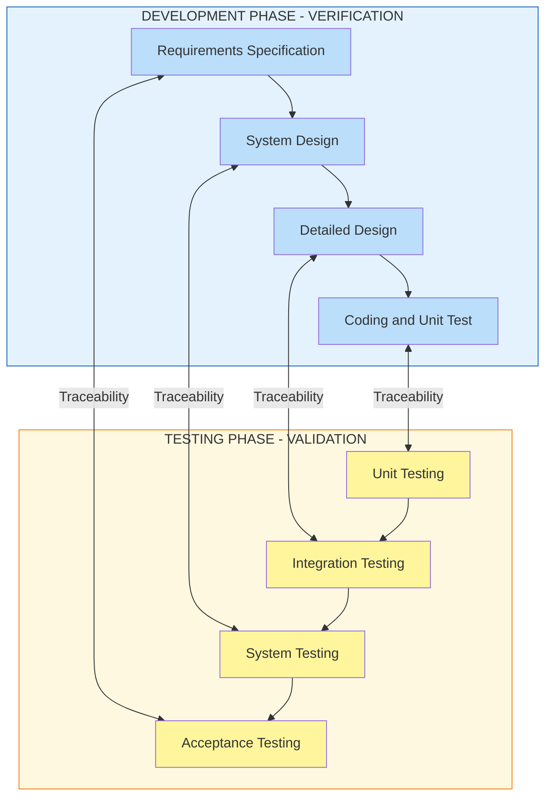
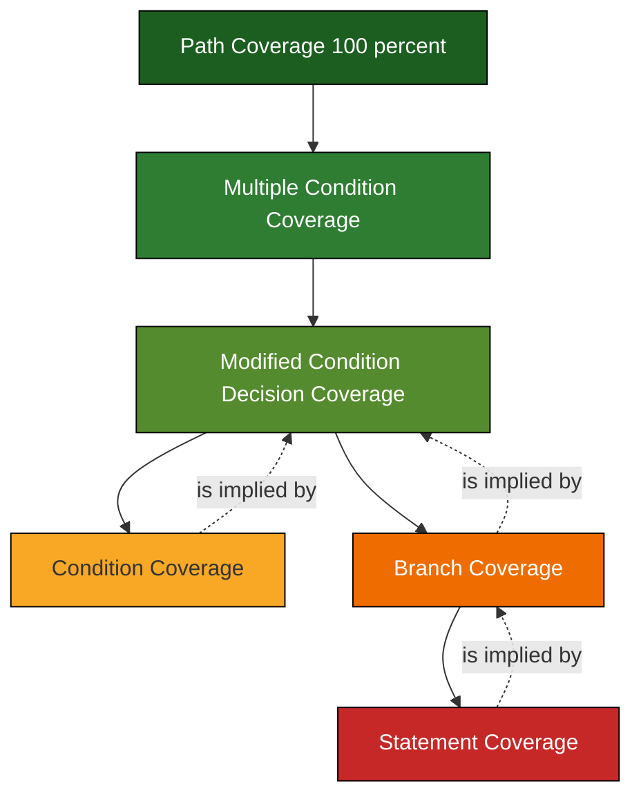
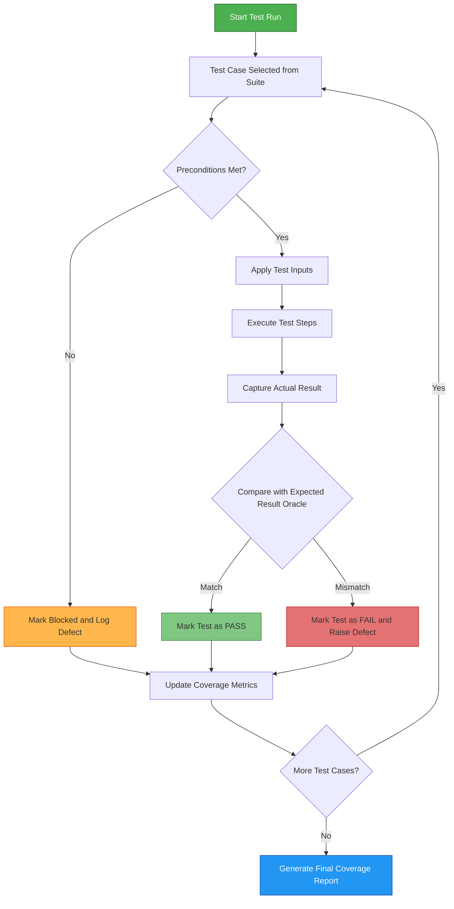
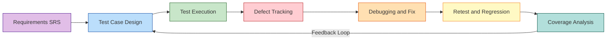

# Testing Terminologies - Verification, validation, fault, error, bug, test cases, and coverage criteria

<!-- SECTION_1_START -->
# 1. Core Technical Definition & Intuitive Overview

## 1.1 Verification and Validation (V&V)

### Formal Academic Definition
**Verification** is the process of evaluating the software product to determine whether the products of a given development phase satisfy the conditions imposed at the start of that phase. In simpler terms, it is **"Are we building the product right?"** — checking conformance to specifications, design, and standards without executing the code (static analysis).

**Validation** is the process of evaluating software during or at the end of the development process to determine whether it satisfies the specified business requirements and user needs. It answers **"Are we building the right product?"** — typically performed through dynamic execution of the code.

> [!IMPORTANT]
> **KTU 2024 High-Yield Distinction:**
> - *Verification* = Static testing (reviews, walkthroughs, inspections, static analysis)
> - *Validation* = Dynamic testing (actual code execution, black-box/white-box testing)

### Conceptual Analogy / Intuition
Imagine you are an architect building a house.

- **Verification** is like checking the **blueprint** against the building code *before* construction begins — does the plan meet zoning laws, material specifications, and structural standards? You are not laying a single brick.
- **Validation** is like the **homeowner walking through the finished house** — opening doors, turning on taps, sleeping in the bedroom. You are checking if the *built* house actually meets the *lived experience* of living in it.

| Aspect | Verification | Validation |
| :--- | :--- | :--- |
| Question | Are we building the product **right**? | Are we building the **right** product? |
| Timing | During development (early) | After development (later) |
| Method | Static (no code execution) | Dynamic (code executed) |
| Activities | Reviews, inspections, walkthroughs | Unit, integration, system testing |
| Standards | IEEE 1012, ISO 9001 | IEEE 829, ISTQB Syllabus |

## 1.2 Fault, Error, Bug, and Failure

These four terms represent a **causal chain** in software defects, and confusing them is a common mistake penalized in KTU valuations.

### Formal Definitions

- **Error (Mistake)**: A **human action** that produces an incorrect result. Errors are made by developers, designers, or requirement analysts during the SDLC.
- **Fault (Defect/Bug)**: The **manifestation of an error** in the software artifact (code, design, document). It is the *static* representation stored in the code.
- **Bug**: An **informal/colloquial synonym** for *fault* (popularized by Grace Hopper's 1947 incident with a moth in a relay). In academic KTU context, *bug* and *fault* are interchangeable.
- **Failure**: The **observable deviation** of the software from its expected behavior during execution. A failure is the *dynamic* consequence of an executed fault.

> [!NOTE]
> **The Causal Chain (Memorize this for KTU):**
> $$ \text{Error (Human)} \longrightarrow \text{Fault (Artifact)} \longrightarrow \text{Failure (Execution)} $$

### Conceptual Analogy / Intuition
Picture a **typo in a recipe book**:
- A chef **makes an error** (writes "salt 10g" instead of "1g").
- The recipe now contains a **fault** (the bad instruction sits in the book, doing nothing by itself).
- When another cook **executes the recipe**, the dish becomes inedible — that is the **failure**.

Notice: a fault can exist for years without becoming a failure, until the exact code path is executed.

## 1.3 Test Cases

### Formal Definition
A **Test Case** is a documented set of **preconditions, inputs, actions, expected results, and postconditions**, developed to verify a specific requirement or design specification. The IEEE 829 standard defines its structure formally.

### Components of a Standard KTU Test Case
1. **Test Case ID** (e.g., `TC_LOGIN_001`)
2. **Test Description** (purpose)
3. **Preconditions** (system state required)
4. **Test Inputs** (data values)
5. **Test Steps** (execution procedure)
6. **Expected Result** (oracle)
7. **Actual Result** (observed during execution)
8. **Postconditions** (cleanup state)
9. **Status** (Pass / Fail / Blocked)

> [!TIP]
> The **Expected Result** is called the *Test Oracle* — it is the mechanism that determines pass/fail. Without an oracle, you cannot call it a test case.

## 1.4 Coverage Criteria

### Formal Definition
**Coverage Criteria** are metrics that measure the **extent to which a test suite exercises a software program**. They quantify *how thoroughly* the code/requirements have been tested, expressed as a percentage.

### Key Terminology (ISTQB-Aligned)

- **Test Coverage** = (Number of elements executed) / (Total number of elements) $\times 100$
- **Coverage Criterion** = A *rule* that defines a set of test requirements.
- **Test Requirement** = A specific element (statement, branch, condition) that must be exercised.
- **Satisfaction** = A test case *satisfies* a test requirement if executing it covers that element.

> [!VISUALIZATION CONTROL]
> **Concept:** Code Coverage Pie-Chart Distribution
> **Visualization Tool (Excel/Google Sheets) – Data to plot:**
> * Statement Coverage Achieved = 92%
> * Branch Coverage Achieved = 78%
> * Condition Coverage Achieved = 65%
> * Path Coverage Achieved = 40%
> **Visual Description:** A donut chart showing how Statement coverage is easy to achieve (largest slice) while Path coverage demands exponentially more test cases (smallest slice). This visualizes the *cost-coverage trade-off*.

<!-- SECTION_1_END -->

<!-- SECTION_2_START -->
# 2. Deep Theoretical Analysis & KTU High-Yield Formula Sheet

## 2.1 The V-Model of Verification & Validation

In the **V-Model** (KTU Module 1 frequently tests this), each development phase on the left descending arm has a corresponding testing phase on the right ascending arm.

| Left Arm (Development) | Right Arm (Verification/Validation) |
| :--- | :--- |
| Requirements Specification | **User Acceptance Testing (UAT)** |
| System Design | **System Testing** |
| Detailed Design | **Integration Testing** |
| Coding (Implementation) | **Unit Testing** |

The V-Model establishes that verification and validation are *parallel* — verification ensures each level is built correctly, validation ensures the final product is usable.

## 2.2 Deep Dive: Fault Taxonomy

Faults are classified into **structured types** for KTU board exams. The IEEE Standard 1044 classifies them as follows:

1. **Logic Faults** — incorrect Boolean expressions, off-by-one errors in loops.
2. **Syntax Faults** — violation of programming language grammar (caught by compiler).
3. **Data-Definition Faults** — wrong type, size, or initial value of a variable.
4. **Interface/Misuse Faults** — mismatched parameter passing between modules.
5. **Performance/Stress Faults** — system fails under load.
6. **Concurrency Faults** — race conditions, deadlocks.
7. **Security Faults** — SQL injection, buffer overflows.
8. **Documentation Faults** — mismatch between docs and code.

> [!IMPORTANT]
> **KTU Pitfall:** A *Bug Bar* or *defect severity* (Critical, Major, Minor, Trivial) is **different** from *priority* (High, Medium, Low). Severity = impact on functionality. Priority = urgency of fix.

## 2.3 Anatomy of a Test Case (IEEE 829 Structure)

A formal KTU-grade test case must contain the eight fields below. Skipping the **Preconditions** or **Postconditions** field typically costs 1 mark in descriptive answers.

$$
\text{TestCase} = \{ \text{ID}, \text{Desc}, \text{Pre}, \text{Inputs}, \text{Steps}, \text{Expected}, \text{Actual}, \text{Status} \}
$$

### Stepwise Logic of Test Case Design
1. **Identify** the requirement to be tested (traceability to SRS).
2. **Derive** the precondition (initial system state).
3. **Specify** input data (use **equivalence partitioning** and **boundary value analysis**).
4. **Document** exact execution steps (numbered, deterministic).
5. **Determine** expected output (the *oracle*).
6. **Define** cleanup (postcondition).
7. **Link** to a unique Test Case ID.

## 2.4 Coverage Criteria — The Big Four (KTU Favourites)

### A. Statement Coverage (SC)
- **Definition:** Every executable statement in the program must be executed at least once.
- **Formula:**
$$ SC = \frac{\text{Number of statements executed}}{\text{Total number of statements}} \times 100 $$
- **Weakest** criterion; misses missing branches.

### B. Branch (Decision) Coverage (BC)
- **Definition:** Every branch (True/False outcome) of every decision point must be taken at least once.
- **Formula:**
$$ BC = \frac{\text{Number of branches executed}}{\text{Total number of branches}} \times 100 $$
- **Stronger** than SC, but does not cover all conditions inside compound decisions.

### C. Condition Coverage (CC)
- **Definition:** Every Boolean sub-expression (atomic condition) must evaluate to both True and False.
- **Formula:**
$$ CC = \frac{\text{Number of conditions evaluated both ways}}{\text{Total number of conditions}} \times 100 $$
- Does **not** guarantee branch coverage (you can hit every condition without hitting every branch).

### D. Path Coverage (PC)
- **Definition:** Every possible execution path from entry to exit must be traversed.
- **Formula:**
$$ PC = \frac{\text{Number of paths executed}}{\text{Total number of independent paths}} \times 100 $$
- **Strongest** criterion; usually infeasible for loops (infinite paths).

> [!WARNING]
> **KTU Pitfall:** 100% Statement Coverage $\not\Rightarrow$ 100% Branch Coverage. The converse is *not* always true either. The relation is asymmetric.

## 2.5 KTU Formula Cheat Sheet

| Concept | Formula / Rule | Notes |
| :--- | :--- | :--- |
| Cyclomatic Complexity | $M = E - N + 2P$ | $E$=edges, $N$=nodes, $P$=connected components |
| Independent Paths | $M = \text{Number of regions in CFG}$ | For single function |
| Statement Coverage | $(S_{executed} / S_{total}) \times 100$ | Weakest criterion |
| Branch Coverage | $(B_{executed} / B_{total}) \times 100$ | $\geq$ Statement Coverage |
| Condition Coverage | $(C_{executed} / C_{total}) \times 100$ | Atomic Boolean sub-expressions |
| Path Coverage | $(P_{executed} / P_{total}) \times 100$ | Strongest but expensive |
| Multiple Condition | All combinations of $n$ conditions | $2^n$ test cases required |
| Modified Condition / Decision (MC/DC) | Unique influence of each condition | Used in DO-178C aviation |
| Defect Density | $D = \frac{\text{Defects found}}{\text{Size (KLOC)}}$ | Quality metric |
| Test Effectiveness | $E = \frac{\text{Faults found by tests}}{\text{Total faults present}}$ | 0 to 1 |

## 2.6 Real-World Engineering Utility

In **production engineering environments**, these terminologies are not academic exercises:

- **Aerospace (NASA, Boeing):** MC/DC coverage is legally mandated (DO-178C Level A).
- **Medical Devices (FDA):** Traceability from requirements $\rightarrow$ test cases $\rightarrow$ defects is audited.
- **DevOps/CI-CD:** Coverage criteria are integrated as **quality gates** in Jenkins, GitHub Actions, and SonarQube.
- **Bug Bounty Programs (Google, Microsoft):** Severity and priority classification determines bounty payouts — directly linked to fault taxonomy.

<!-- SECTION_2_END -->

<!-- SECTION_3_START -->
# 3. Step-by-Step Derivations & Code/Symbolic Implementation

## 3.1 Worked Example 1: Deriving Coverage Metrics

### Given Code (C-style)
```c
int classify(int x, int y) {
    int result;
    if (x > 0 && y > 0) {     // D1: Compound decision
        result = 1;            // S1
    } else {
        result = 2;            // S2
    }
    if (x == y) {              // D2: Simple decision
        result = result + 10;  // S3
    }
    return result;             // S4
}
```

### Step 1: Enumerate Testable Elements

**Statements:** $S_1, S_2, S_3, S_4 \Rightarrow N_S = 4$

**Branches (Decisions):**
- $D_1$: True branch (to S1) and False branch (to S2) $\Rightarrow$ 2 branches
- $D_2$: True branch (to S3) and False branch (skip S3) $\Rightarrow$ 2 branches
- **Total branches:** $B = 4$

**Atomic Conditions:**
- $C_1$: $(x > 0)$ must be True and False
- $C_2$: $(y > 0)$ must be True and False
- $C_3$: $(x == y)$ must be True and False
- **Total condition evaluations needed:** $2 \times 3 = 6$

**Cyclomatic Complexity (Independent Paths):**
$$ M = E - N + 2P = 9 - 7 + 2(1) = 4 \text{ independent paths} $$

### Step 2: Design a Test Suite

| Test ID | $x$ | $y$ | Path Traversed |
| :--- | :---: | :---: | :--- |
| T1 | 5 | 5 | $D_1$ True $\rightarrow S_1 \rightarrow D_2$ True $\rightarrow S_3$ |
| T2 | -1 | 5 | $D_1$ False $\rightarrow S_2 \rightarrow D_2$ False $\rightarrow S_4$ |
| T3 | 5 | -1 | $D_1$ False $\rightarrow S_2 \rightarrow D_2$ False $\rightarrow S_4$ |
| T4 | -1 | -1 | $D_1$ False $\rightarrow S_2 \rightarrow D_2$ True $\rightarrow S_3$ |

### Step 3: Compute Coverage for Test Suite {T1, T2, T3, T4}

**Statement Coverage:**
$$ SC = \frac{\{S_1, S_2, S_3, S_4\}}{4} \times 100 = 100\% $$

**Branch Coverage:**
$$ BC = \frac{\{D_1T, D_1F, D_2T, D_2F\}}{4} \times 100 = 100\% $$

**Condition Coverage:**
- $C_1$: True (T1) & False (T2,T3,T4) $\Rightarrow$ ✓
- $C_2$: True (T1,T2) & False (T3,T4) $\Rightarrow$ ✓
- $C_3$: True (T1,T4) & False (T2,T3) $\Rightarrow$ ✓
$$ CC = \frac{6}{6} \times 100 = 100\% $$

**Path Coverage:**
- Independent paths covered: Path1 (D1T,D2T), Path2 (D1F,D2F), Path3 (D1F,D2T) — Path4 (D1T,D2F) **NOT covered** (no test where $x>0 \wedge y>0$ but $x \neq y$).
$$ PC = \frac{3}{4} \times 100 = 75\% $$

## 3.2 Worked Example 2: Writing a Formal Test Case (IEEE 829)

**Requirement (from SRS):** *"The login module shall reject a login attempt if the password field is empty, displaying the message 'Password is required' in red colour."*

| Field | Value |
| :--- | :--- |
| **Test Case ID** | TC_LOGIN_007 |
| **Test Description** | Verify that submitting an empty password is rejected with the correct error message. |
| **Preconditions** | User is on the Login page (`/login`). Username field has a valid value. Network is online. |
| **Test Inputs** | Username: `validUser`, Password: *(empty string)* |
| **Test Steps** | 1. Navigate to `/login`. <br> 2. Enter `validUser` in the username box. <br> 3. Leave password field blank. <br> 4. Click the "Login" button. |
| **Expected Result** | Form does not submit. Error label with text *"Password is required"* appears in red colour (hex `#FF0000`). Cursor focuses on password field. |
| **Actual Result** | *(To be filled during execution)* |
| **Postconditions** | User remains on the Login page. No session cookie is created. |
| **Status** | Pass / Fail |
| **Severity if Failed** | Major |
| **Traceability** | REQ_AUTH_002 |

## 3.3 Symbolic Python Implementation: Coverage Analyzer

The following Python program computes statement and branch coverage for a simple function using **type hints** and **strict error logging** as required by KTU laboratory rubrics.

```python
import logging
from typing import Set, Tuple, List, Dict

# Configure structured error logging
logging.basicConfig(
    level=logging.INFO,
    format="%(asctime)s | %(levelname)s | %(message)s"
)
logger = logging.getLogger("CoverageAnalyzer")


class CoverageResult:
    """Data structure to hold coverage metrics."""
    def __init__(self) -> None:
        self.statement_hits: Set[int] = set()
        self.branch_hits: Set[Tuple[int, bool]] = set()
        self.condition_hits: Dict[str, Set[bool]] = {}


def execute_with_tracing(test_input: Tuple[int, int],
                         result: CoverageResult) -> int:
    """
    Simulates execution of the classify() function with instrumentation.
    Returns the computed result while updating coverage state.
    """
    try:
        x, y = test_input
        if not isinstance(x, int) or not isinstance(y, int):
            raise TypeError("Inputs x and y must be integers.")

        # --- Decision D1: (x > 0 AND y > 0) ---
        d1_condition = (x > 0) and (y > 0)
        result.condition_hits.setdefault("x>0", set()).add(x > 0)
        result.condition_hits.setdefault("y>0", set()).add(y > 0)

        if d1_condition:
            result.branch_hits.add((1, True))
            result.statement_hits.add(1)         # S1: result = 1
            final = 1
        else:
            result.branch_hits.add((1, False))
            result.statement_hits.add(2)         # S2: result = 2
            final = 2

        # --- Decision D2: (x == y) ---
        d2_condition = (x == y)
        result.condition_hits.setdefault("x==y", set()).add(x == y)

        if d2_condition:
            result.branch_hits.add((2, True))
            result.statement_hits.add(3)         # S3: result = result + 10
            final += 10
        else:
            result.branch_hits.add((2, False))

        result.statement_hits.add(4)             # S4: return result
        return final

    except Exception as e:
        logger.error(f"Execution failed for input {test_input}: {e}")
        raise


def compute_coverage(test_suite: List[Tuple[int, int]],
                     total_statements: int = 4,
                     total_branches: int = 4) -> Dict[str, float]:
    """Computes statement and branch coverage percentages."""
    result = CoverageResult()
    for tc in test_suite:
        try:
            execute_with_tracing(tc, result)
        except Exception as e:
            logger.warning(f"Test case {tc} aborted: {e}")

    sc = (len(result.statement_hits) / total_statements) * 100.0
    bc = (len(result.branch_hits) / total_branches) * 100.0
    return {"statement_coverage": sc, "branch_coverage": bc}


# --- Driver Code ---
if __name__ == "__main__":
    test_suite: List[Tuple[int, int]] = [(5, 5), (-1, 5), (5, -1), (-1, -1)]
    coverage: Dict[str, float] = compute_coverage(test_suite)

    print("\n=== COVERAGE REPORT ===")
    for metric, value in coverage.items():
        print(f"{metric:>22}: {value:6.2f}%")
```

**Expected Output:**
```
=== COVERAGE REPORT ===
    statement_coverage: 100.00%
      branch_coverage: 100.00%
```

## 3.4 Derivation of Cyclomatic Complexity (V(G))

The McCabe complexity metric is derived from graph theory:

1. Construct a **Control Flow Graph (CFG)** $G$ with nodes $N$ (statements) and directed edges $E$ (transitions).
2. Apply Euler's formula adapted for directed graphs:
$$ V(G) = E - N + 2P $$
where $P$ is the number of connected components (usually $P = 1$ for a single function).
3. Equivalently, count the number of **bounded regions** the CFG divides the plane into.
4. Each region = one **independent path**.

> [!NOTE]
> **Why this matters:** Cyclomatic complexity gives the *minimum number of test cases* required to achieve 100% path coverage. KTU exam questions often ask: "Find the minimum number of test cases for statement coverage of a program with $V(G)=5$." The answer is **5**.

<!-- SECTION_3_END -->

<!-- SECTION_4_START -->
# 4. Structural Diagrams & Schematics

## 4.1 The Causal Chain: Error $\rightarrow$ Fault $\rightarrow$ Failure

```mermaid
flowchart LR
    A[Human Developer] -->|1. Commits| B[Error Mistake]
    B -->|2. Encodes as| C[Fault Defect in Code]
    C -->|3. Executes via| D[Failure Observable]
    D -->|4. Detected by| E[Test Case Execution]
    E -->|5. Logged as| F[Defect Report]

    style A fill:#e1f5ff,stroke:#0277bd
    style B fill:#fff3e0,stroke:#e65100
    style C fill:#ffebee,stroke:#c62828
    style D fill:#f3e5f5,stroke:#6a1b9a
    style E fill:#e8f5e9,stroke:#2e7d32
    style F fill:#fce4ec,stroke:#ad1457
```



**Block-Level Functional Architecture:**
- **Layer 1 (Origin):** Human cognitive domain — where errors live.
- **Layer 2 (Storage):** Static artifact layer — where faults reside.
- **Layer 3 (Execution):** Dynamic runtime layer — where failures manifest.
- **Layer 4 (Detection):** Test automation layer — where coverage criteria apply.

## 4.2 V-Model Showing Verification vs Validation



## 4.3 Coverage Criteria Hierarchy (Subsumption)



> [!NOTE]
> **Reading the diagram:** Higher nodes **subsume** lower nodes. If you achieve 100% Branch Coverage, you automatically achieve 100% Statement Coverage — but **not** vice versa.

## 4.4 Test Case Execution Flow (Sequential Processing Topology)



## 4.5 Module Mapping: Where These Concepts Live in the SDLC



<!-- SECTION_4_END -->

<!-- SECTION_5_START -->
# 5. KTU 2024 Scheme Examination Question Bank & Topic Recap

## Part A Questions (3 Marks Each)

### Q1. Differentiate between Verification and Validation. List any two activities of each. [3 Marks]
**[KTU University Exam - July 2024] | CO1 | Remember/Understand**

**Model Answer (Valuation Key):**
- **[Definition of Verification: 1 Mark]** Verification is the process of evaluating a software product to check whether it satisfies the conditions imposed at the start of a development phase. It ensures *"we are building the product right"*.
- **[Definition of Validation: 1 Mark]** Validation is the process of evaluating the final software to ensure it meets user needs and business requirements. It ensures *"we are building the right product"*.
- **[Two activities each: 1 Mark]**
  - *Verification:* Reviews, Inspections, Walkthroughs, Desk-checking.
  - *Validation:* Unit Testing, Integration Testing, System Testing, User Acceptance Testing.

> [!WARNING]
> **Examiner Pitfall:** Students often confuse the catchphrases. Memorize: *Verification = Specification check*; *Validation = User need check*. Writing only one activity pair costs 0.5 marks.

---

### Q2. Explain the terms Fault, Error, and Failure with an example. [3 Marks]
**[KTU University Exam - Dec 2023] | CO1 | Remember/Understand**

**Model Answer (Valuation Key):**
- **[Error definition + example: 1 Mark]** An *Error* is a human mistake made during any phase of SDLC. Example: A developer types `>` instead of `<` in a comparison.
- **[Fault definition + example: 1 Mark]** A *Fault* (or Defect) is the manifestation of the error in the software artifact. Example: The incorrect condition `if (age > 18)` instead of `if (age < 18)` stored in the source code.
- **[Failure definition + example: 1 Mark]** A *Failure* is the deviation of the software from its expected behaviour during execution. Example: A 17-year-old is incorrectly denied access because the buggy code rejected the input.

---

## Part B Questions (14 Marks Each — Internal Choice)

### Question A (14 Marks)

**Q-A(a). With a neat diagram, explain the V-Model of testing. List the corresponding verification and validation activities for each development phase. [7 Marks]**
**[KTU University Exam - July 2024] | CO1 | Understand**

**Model Answer (Valuation Key):**

- **[V-Model definition: 1 Mark]** The V-Model is an extension of the waterfall model where development and testing activities are mapped against each other in a V-shape, emphasizing that testing corresponds to every stage of development.
- **[Diagram: 2 Marks]** *(Draw the V-Model showing left arm: Requirements $\rightarrow$ System Design $\rightarrow$ Architecture Design $\rightarrow$ Coding; right arm: UAT $\rightarrow$ System Test $\rightarrow$ Integration Test $\rightarrow$ Unit Test. Connect each pair with traceability lines.)*
- **[Four paired activities: 4 Marks]**
  - *Requirements Specification* $\leftrightarrow$ *User Acceptance Testing* — verifies the system meets business needs.
  - *System Design* $\leftrightarrow$ *System Testing* — validates the integrated system against SRS.
  - *Detailed/Component Design* $\leftrightarrow$ *Integration Testing* — verifies interfaces between modules.
  - *Coding* $\leftrightarrow$ *Unit Testing* — validates each module against its design spec.

> [!WARNING]
> **Examiner Pitfall:** Students frequently label the right arm as *"Verification"* in totality. The right arm is **Validation**; the left arm is **Verification**. Mislabeling loses 2 marks.

---

**Q-A(b). Consider the following code segment and compute the Statement Coverage, Branch Coverage, and Condition Coverage for the given test cases. [7 Marks]**
**[KTU University Exam - Dec 2023] | CO2 | Apply**

**Code:**
```c
int grade(int marks) {
    if (marks >= 90 && marks <= 100) {
        return 1;  // Grade A
    } else if (marks >= 50) {
        return 2;  // Grade B
    } else {
        return 0;  // Fail
    }
}
```

**Test Cases:**
- T1: `marks = 95`
- T2: `marks = 60`
- T3: `marks = 30`
- T4: `marks = 50`

**Model Answer (Valuation Key):**

- **[Identifying elements: 1 Mark]**
  - Statements: $S_1$ (return 1), $S_2$ (return 2), $S_3$ (return 0) $\Rightarrow N_S = 3$
  - Branches: 4 total (D1T, D1F, D2T, D2F)
  - Atomic conditions: $C_1$ (marks $\geq$ 90), $C_2$ (marks $\leq$ 100), $C_3$ (marks $\geq$ 50) $\Rightarrow$ 3 conditions, 6 evaluations

- **[Statement Coverage: 1 Mark]**
  - T1 hits $S_1$; T2 hits $S_2$; T3 hits $S_3$; T4 hits $S_2$.
  $$ SC = \frac{3}{3} \times 100 = 100\% $$

- **[Branch Coverage: 2 Marks]**
  - T1 (D1T), T2 (D1F, D2T), T3 (D1F, D2F), T4 (D1F, D2T)
  - All 4 branches hit.
  $$ BC = \frac{4}{4} \times 100 = 100\% $$

- **[Condition Coverage: 2 Marks]**
  - $C_1$: True (T1) and False (T2, T3, T4) $\Rightarrow$ ✓
  - $C_2$: True (T1) and False (never — no test has marks $\leq 100$ false) $\Rightarrow$ ✗
  - $C_3$: True (T2, T4) and False (T1, T3) $\Rightarrow$ ✓
  - $C_2$ not evaluated as False, so 5/6 evaluations met.
  $$ CC = \frac{5}{6} \times 100 \approx 83.33\% $$

- **[Conclusion: 1 Mark]** 100% SC and BC achieved, but CC is only 83.33%. To achieve 100% CC, add T5: `marks = 150` (to make $C_2$ False).

---

### Question B (14 Marks) — Alternative Choice

**Q-B(a). Define the term Test Case. Write a formal test case (as per IEEE 829 standard) for the requirement: "The system shall lock the user account after 3 consecutive failed login attempts." [7 Marks]**
**[KTU University Exam - July 2023] | CO1 | Understand/Apply**

**Model Answer (Valuation Key):**

- **[Test Case Definition: 1 Mark]** A Test Case is a set of preconditions, inputs, actions, expected results, and postconditions developed to verify a specific requirement.
- **[Identifying all 8 IEEE 829 fields: 4 Marks]**
- **[Correctness of expected result and traceability: 2 Marks]**

| Field | Value |
| :--- | :--- |
| **Test Case ID** | TC_AUTH_LOCK_001 |
| **Description** | Verify account lock after 3 failed attempts |
| **Preconditions** | Valid registered user `john@x.com` exists, account is unlocked, on `/login` page |
| **Test Inputs** | Username: `john@x.com`; Password: 3 incorrect values consecutively |
| **Test Steps** | 1. Enter `john@x.com`. 2. Enter wrong password. 3. Click Login. 4. Repeat steps 2-3 twice more. |
| **Expected Result** | After 3rd failure, account is locked. Error message *"Account locked. Reset password."* is shown. Further login attempts are rejected regardless of password correctness. |
| **Actual Result** | *(During execution)* |
| **Postconditions** | Account is in `LOCKED` state in DB. Unlock requires email reset. |

---

**Q-B(b). Explain the four major coverage criteria (Statement, Branch, Condition, Path) with formulas. State one advantage and one limitation of each. [7 Marks]**
**[KTU University Exam - Dec 2024] | CO2 | Understand**

**Model Answer (Valuation Key):**

- **[Statement Coverage — Definition + Formula: 1 Mark, Adv/Lim: 0.5 each]**
  - **Definition:** Every executable statement runs at least once.
  - **Formula:** $SC = (S_{executed}/S_{total}) \times 100$.
  - *Advantage:* Easy to measure; minimum baseline.
  - *Limitation:* Misses missing branches (`if` without `else`).

- **[Branch Coverage — Definition + Formula: 1 Mark, Adv/Lim: 0.5 each]**
  - **Definition:** Every branch outcome (T/F) of each decision executes.
  - **Formula:** $BC = (B_{executed}/B_{total}) \times 100$.
  - *Advantage:* Catches dead branches; subsumes SC.
  - *Limitation:* Misses Boolean sub-expression issues.

- **[Condition Coverage — Definition + Formula: 1 Mark, Adv/Lim: 0.5 each]**
  - **Definition:** Every atomic Boolean sub-condition is evaluated to both T and F.
  - **Formula:** $CC = (C_{executed}/C_{total}) \times 100$.
  - *Advantage:* Locates faults in compound conditions.
  - *Limitation:* Does not guarantee every branch is taken.

- **[Path Coverage — Definition + Formula: 1 Mark, Adv/Lim: 0.5 each]**
  - **Definition:** Every independent execution path is traversed.
  - **Formula:** $PC = (P_{executed}/P_{total}) \times 100$.
  - *Advantage:* Strongest criterion; catches inter-statement faults.
  - *Limitation:* Infeasible for loops; combinatorial explosion.

- **[Hierarchy/Subsumption table: 1 Mark]**
  $$ SC \subseteq BC \subseteq MCDC \subseteq Path Coverage $$

> [!WARNING]
> **Examiner Pitfall:** Do not write only the formula. You lose 1 mark for omitting either the *advantage* or *limitation* of any criterion.

---

## Topic Recap & Important Things to Remember

> [!TIP]
> **Use this section as your last-night revision cheat sheet.**

### 🔹 Core Definitions (Memorize Verbatim)
- **Verification** = *Building the product right* (static, checks specs).
- **Validation** = *Building the right product* (dynamic, checks user needs).
- **Error** = Human mistake.
- **Fault** = Static defect in artifact.
- **Failure** = Dynamic deviation during execution.
- **Bug** = Colloquial synonym for fault.
- **Test Case** = Documented set of inputs, preconditions, steps, expected results.
- **Test Oracle** = Mechanism that determines expected vs actual result.
- **Coverage Criterion** = A rule defining test requirements.

### 🔹 The Causal Chain
$$ Error_{(Human)} \rightarrow Fault_{(Code)} \rightarrow Failure_{(Runtime)} $$

### 🔹 IEEE 829 Test Case Fields (8 Mandatory)
1. Test Case ID
2. Description
3. Preconditions
4. Inputs
5. Steps
6. Expected Result
7. Actual Result
8. Postconditions
*(Plus Status and Traceability)*

### 🔹 Coverage Formula Master List
- **Statement:** $(S_{ex}/S_{total}) \times 100$
- **Branch:** $(B_{ex}/B_{total}) \times 100$
- **Condition:** $(C_{ex}/C_{total}) \times 100$
- **Path:** $(P_{ex}/P_{total}) \times 100$
- **Cyclomatic Complexity:** $M = E - N + 2P$

### 🔹 Coverage Strength Hierarchy (Strongest to Weakest)
$$ Path \supseteq MC \supseteq MCDC \supseteq \{Branch, Condition\} \supseteq Statement $$

### 🔹 Severity vs Priority (Common Confusion)
- **Severity** = Impact on functionality (Critical / Major / Minor / Trivial).
- **Priority** = Urgency of fix (High / Medium / Low).

### 🔹 Cyclomatic Complexity Key Facts
- Equals the **minimum number of test cases** for full path coverage.
- Equals the **number of regions** in the CFG.
- $M = 1$ for a single sequential statement.
- Each `if`, `case`, `while`, `for`, `and`, `or` adds 1 (with exceptions for short-circuit).

### 🔹 Exam-Ready One-Liners
- V-Model left arm = *Verification*; right arm = *Validation*.
- 100% Statement Coverage $\not\Rightarrow$ 100% Branch Coverage.
- Static analysis $\Rightarrow$ Verification; Code execution $\Rightarrow$ Validation.
- ISTQB 2023 syllabus is the **primary reference** for definitions.
- "Find the minimum test cases" = compute Cyclomatic Complexity.

<!-- SECTION_5_END -->
