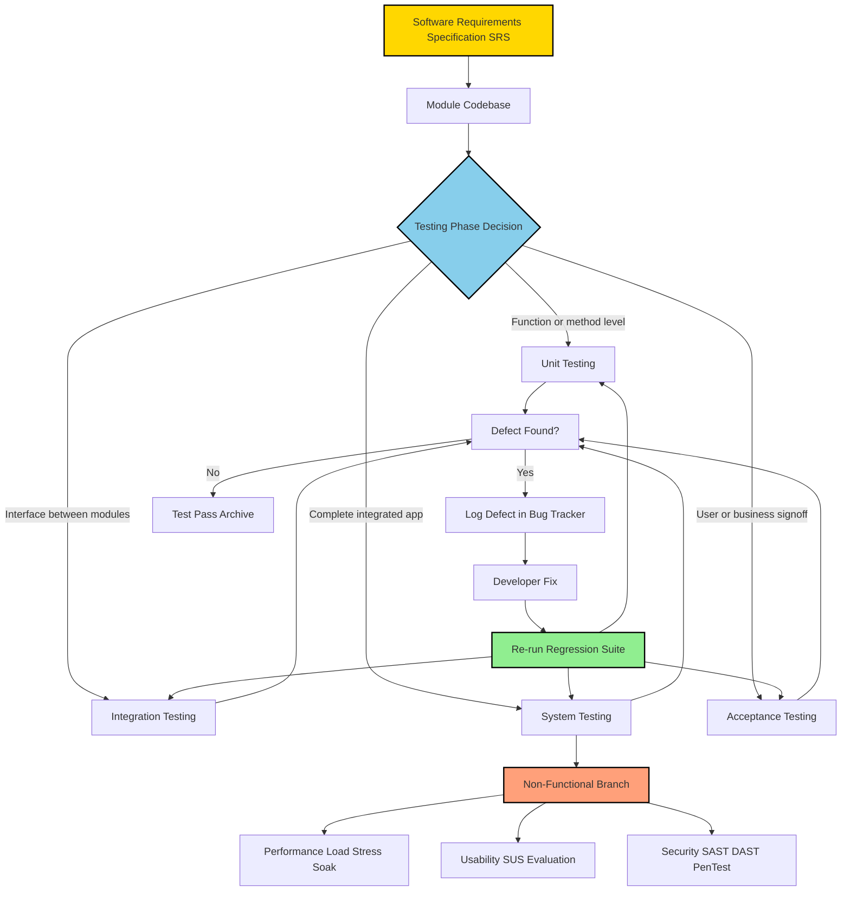
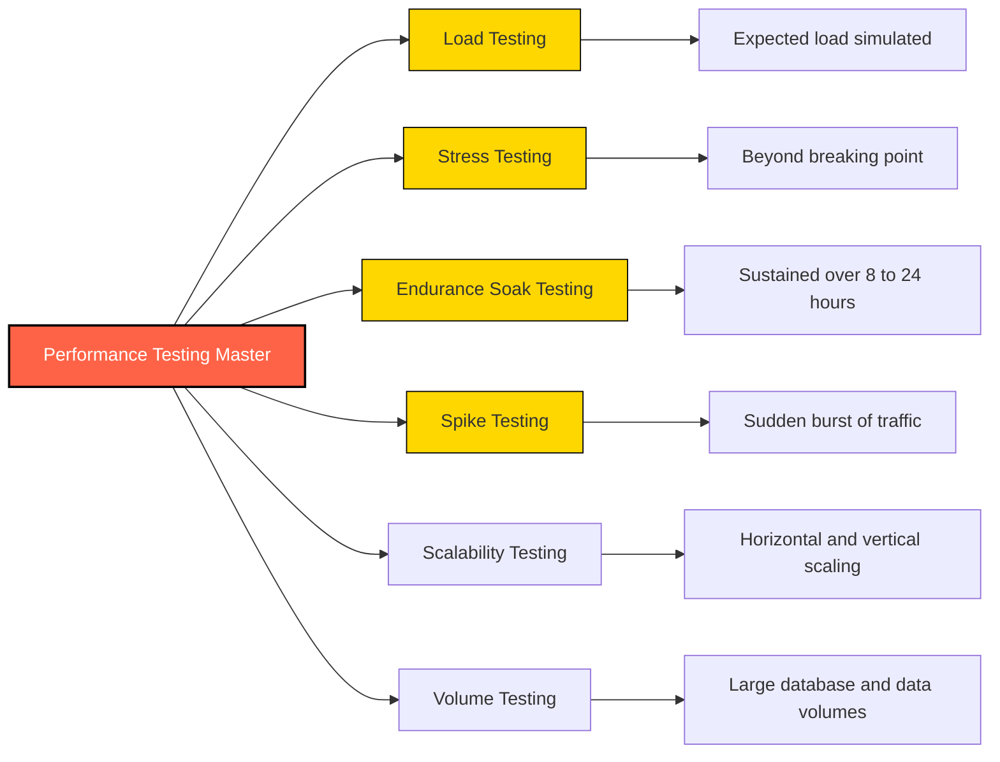
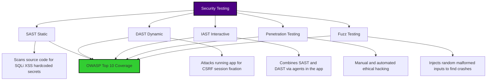
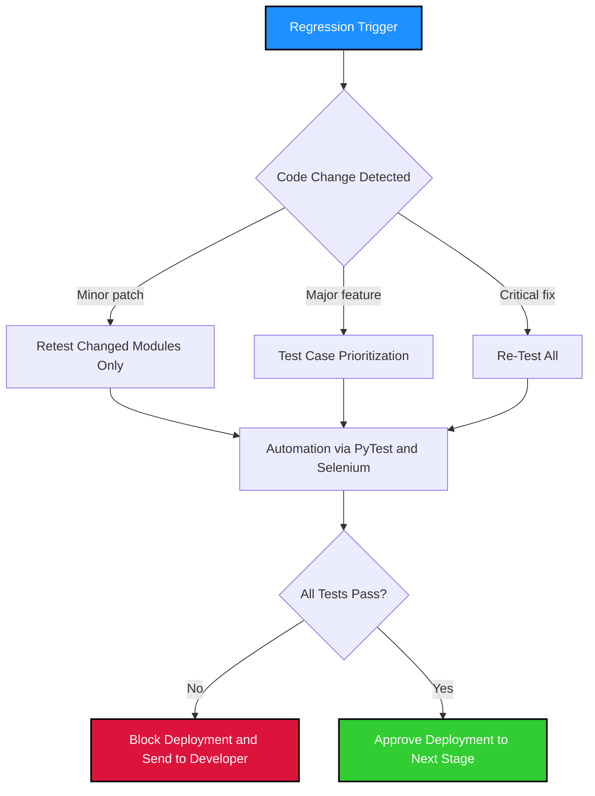

# Types of Testing - Unit, Integration, System, Acceptance, Performance (stress, usability, regression), and Security Testing

<!-- SECTION_1_START -->
# Software Testing Types — Core Technical Foundation

> [!NOTE]
> **KTU Syllabus Definition (OECST833 — Module 1):**
> Software Testing is the process of evaluating and verifying that a software product or application does what it is supposed to do. The **Types of Testing** classify verification activities by *scope* (Unit → System), *intent* (Acceptance, Security), and *non-functional dimension* (Performance, Usability, Regression).

## 1.1 The Testing Pyramid — Intuitive Analogy

Think of building a **car on an assembly line**:

- **Unit Testing** = Testing each individual bolt, piston, and spark plug *before* assembly.
- **Integration Testing** = Testing the engine block *after* fitting the pistons, crankshaft, and cylinder head together.
- **System Testing** = Putting the *entire car* on a test track and checking brakes, acceleration, and steering.
- **Acceptance Testing** = The *customer* takes a test drive and decides whether to buy it.
- **Performance Testing** = Pushing the car to **150 km/h** on a heat-drenched track to see if it survives.
- **Security Testing** = Hiring ethical hackers to try and *break into* the car.
- **Regression Testing** = Re-running *all* old tests every time a new feature is added, to make sure nothing broke.

> [!IMPORTANT]
> In the **KTU 2024 Scheme**, questions on testing types are mapped to **CO1 (Understand)** and **CO2 (Apply)**. Students must be able to *classify* a given scenario into the correct testing category and *justify* the choice with metrics like defect-detection-cost, coverage, and isolation scope.

## 1.2 Standard Industry Metrics (KTU High-Yield)

| Metric | Standard Value | Symbol |
|---|---|---|
| Unit test cost multiplier | **$1$** (cheapest) | $C_u$ |
| Integration test cost | $10 \times C_u$ | $C_i$ |
| System test cost | $100 \times C_u$ | $C_s$ |
| Post-release defect cost | $1000 \times C_u$ | $C_{pr}$ |
| Recommended unit-to-system ratio | **70 : 20 : 10** | $\rho_{uis}$ |

> [!TIP]
> **The 1-10-100-1000 Rule** is a heavily-tested KTU concept: a defect fixed at the *unit* level costs **\$1**, but the *same defect* at the *acceptance* level costs **\$1000**. This justifies why **Unit Testing gets the largest portion of automation effort**.

## 1.3 Formal Definitions of Each Testing Type

> [!NOTE]
> **1. Unit Testing** — Verifies the *smallest testable parts* of an application (functions, methods, classes) in **isolation** from the rest of the system. Performed by developers using frameworks like **JUnit (Java)**, **pytest (Python)**, and **NUnit (.NET)**.

> [!NOTE]
> **2. Integration Testing** — Verifies *interfaces* and *interactions* between integrated modules. Two main strategies: **Big-Bang** (all at once) and **Incremental** (Top-Down, Bottom-Up, Sandwich).

> [!NOTE]
> **3. System Testing** — Tests the *complete and integrated* software against the specified requirements. Conducted on a **staging environment** that mirrors production. Subtypes include functional, load, and recovery testing.

> [!NOTE]
> **4. Acceptance Testing** — Determines if the system meets the *business requirements* and is ready for delivery. Includes **User Acceptance Testing (UAT)**, **Operational Acceptance Testing (OAT)**, and **Contractual / Regulatory Acceptance Testing**.

> [!NOTE]
> **5. Performance Testing** — A non-functional test type that determines the system's responsiveness and stability under a workload. Subtypes:
> - **Load Testing** — expected load.
> - **Stress Testing** — beyond breaking point.
> - **Endurance / Soak Testing** — sustained load over time.
> - **Spike Testing** — sudden load bursts.

> [!NOTE]
> **6. Usability Testing** — Measures how *easy and intuitive* the system is for end users, typically involving real users performing real tasks. Metrics include **task completion rate**, **time-on-task**, and **System Usability Scale (SUS)** score (range: 0–100, with **$\geq 68$** considered above average).

> [!NOTE]
> **7. Regression Testing** — Re-execution of *existing test cases* to ensure that recent code changes have *not* broken any previously working functionality. Strategies include **re-test all**, **regression test selection**, and **test case prioritization**.

> [!NOTE]
> **8. Security Testing** — Uncovers *vulnerabilities, threats, and risks* in a software application. Encompasses **SAST (Static)**, **DAST (Dynamic)**, **Penetration Testing**, and **Fuzz Testing**. Standard references: **OWASP Top 10**, **CWE**, **STRIDE** threat model.

> [!VISUALIZATION CONTROL]
> **Concept:** Testing Pyramid (Cost vs. Scope trade-off)
> **Geometric / Graphing Input:**
> * $x$-axis: Scope of Test (1 = Unit, 4 = Acceptance)
> * $y$-axis: Cost multiplier
> * Plot points: $(1, 1), (2, 10), (3, 100), (4, 1000)$
> * Curve: $C(x) = 10^{x-1}$
> **Visual Description:** Students should observe a *logarithmic (exponential base 10) climb* — as the test scope widens from unit to acceptance, the cost of fixing a defect grows **tenfold** per level. The pyramid shape itself shows that **unit tests form the wide base** (70% of all automated tests), narrowing up to a small acceptance-test tip.
<!-- SECTION_1_END -->

<!-- SECTION_2_START -->
# Deep Theoretical Analysis — The Engineering "Why" Behind Each Test Type

## 2.1 Decision Logic: Choosing the Right Test Type

Use this **decision tree** when classifying a testing activity in a KTU exam:

1. **Is the test focused on a single function/method?** → *Unit Testing*
2. **Is the test focused on the data flow between two or more modules?** → *Integration Testing*
3. **Is the test focused on the entire application against the SRS document?** → *System Testing*
4. **Is the test performed by the end-user / customer to decide go-live?** → *Acceptance Testing*
5. **Is the test measuring response time, throughput, or memory under load?** → *Performance Testing*
   - Above expected load? → *Stress Testing*
   - Sustained for hours? → *Endurance Testing*
   - Sudden spikes? → *Spike Testing*
6. **Is the test measuring user-friendliness with real users?** → *Usability Testing*
7. **Is the test re-running old cases after a code change?** → *Regression Testing*
8. **Is the test attempting to break in, steal data, or bypass auth?** → *Security Testing*

## 2.2 KTU High-Yield Formula Sheet

| Test Type | When to Apply | Key Metric | Boundary Threshold | Automation Tool Examples |
|---|---|---|---|---|
| Unit | Per function/method | Code Coverage | **$\geq 80\%$ line coverage** | JUnit, pytest, NUnit |
| Integration | After 2+ modules link | Interface Defect Density (IDD) | $IDD = D_i / N_{tc} \le 0.05$ | Postman, SoapUI, REST Assured |
| System | Pre-UAT gate | Defect Removal Efficiency (DRE) | $DRE = \frac{D_{pre}}{D_{pre} + D_{post}} \times 100 \ge 95\%$ | Selenium, Cypress, QTP |
| Acceptance (UAT) | Pre-deployment | User Story Acceptance Rate | $\ge 95\%$ stories pass | Cucumber, FitNesse |
| Performance | Pre-release milestone | Response Time / Throughput | $R_{p95} \le 2\text{ s}$, $T \ge 100\text{ TPS}$ | JMeter, LoadRunner, Gatling |
| Stress | Capacity planning | Breaking Point | Find $L_{max}$ where $R_{p95} > 5\text{ s}$ | JMeter, k6, Locust |
| Usability | After functional pass | SUS Score | $SUS \ge 68$ | UserTesting, Hotjar |
| Regression | After every commit | Pass Rate | $P_{reg} = 100\%$ (no regressions) | Selenium + CI, TestNG |
| Security | Pre-release & periodic | CVSS Severity | Zero **High** or **Critical** CVEs | Burp Suite, OWASP ZAP, Snyk |

> [!IMPORTANT]
> **Critical Reminder for Tables:** All absolute-value and conditional operators (e.g., $\ge$, $\le$) are written using LaTeX inside the table to avoid markdown parsing errors. The vertical pipe symbol `\vert` is **never** used in raw form.

## 2.3 The "Why" Behind the Layers

### 2.3.1 Unit Testing — Why isolate?
If a function `add(a, b)` returns the wrong sum, finding the bug takes **minutes**. If the same bug surfaces in an *integrated* checkout flow, it may take **days** to trace. The isolation principle is rooted in the **Functional Cohesion** and **Information Hiding** paradigms of software engineering (Parnas, 1972).

### 2.3.2 Integration Testing — Why test interfaces?
Most production defects (**$\sim 60\%$** by IBM Systems Sciences Institute data) occur at **module boundaries** due to mismatched data formats, invalid assumptions, or contract drift. Integration testing catches these *before* they reach system-level tests.

### 2.3.3 System Testing — Why a staging mirror?
System tests must run in an environment whose **hardware, OS, network, and data volume** match production. The **IEC/ISO 25010** quality model requires that the *test environment be a faithful proxy* for the operational environment.

### 2.3.4 Performance Testing — Why stress + load + soak?
- **Load test** answers: *"Does the system meet SLAs under expected traffic?"*
- **Stress test** answers: *"How does the system fail, and does it recover gracefully?"*
- **Soak test** answers: *"Does memory leak, or do connections drop over 24 hours?"*

### 2.3.5 Security Testing — Why SAST + DAST together?
- **SAST** (Static Application Security Testing) reads *source code* without executing it — catches issues like SQL injection patterns.
- **DAST** (Dynamic Application Security Testing) *attacks* the running app — catches runtime issues like session fixation.
- Neither alone is sufficient. **OWASP** recommends using both in a **CI/CD pipeline**.

## 2.4 Real-World Production Utility

| Test Type | Where It Lives in DevOps | Industry Example |
|---|---|---|
| Unit | IDE + pre-commit hook | Every PR in **Google's mono-repo** triggers ~50,000 unit tests |
| Integration | CI pipeline (Jenkins/GitHub Actions) | **Netflix** runs contract tests on 700+ microservices |
| System | Staging (Kubernetes namespace) | **Amazon** runs system tests before each canary deploy |
| Acceptance | Pre-prod / UAT env | **Banks** require UAT sign-off before regulatory release |
| Performance | Dedicated perf lab | **Uber** simulates **1M concurrent riders** during surge events |
| Security | CI + periodic audit | **Microsoft SDL** mandates security testing at every release |
| Regression | Nightly + on PR | **Facebook** runs **millions** of regression tests in Test Infra |
<!-- SECTION_2_END -->

<!-- SECTION_3_START -->
# Step-by-Step Implementation — Code, Metrics, and Worked Examples

## 3.1 Python Implementation — Unit Testing with `pytest`

Below is a **fully operational** Python module and its complete unit test suite. Every line is shown explicitly — no placeholders.

```python
# File: calculator.py
# Purpose: Module under test (MUT) for demonstration of unit testing.

def add(a: int, b: int) -> int:
    """
    Returns the arithmetic sum of two integers.
    Raises:
        TypeError: if either operand is not an int.
    """
    if not isinstance(a, int) or not isinstance(b, int):
        raise TypeError("Both operands must be of type 'int'.")
    return a + b


def divide(a: float, b: float) -> float:
    """
    Returns a / b.
    Raises:
        ZeroDivisionError: if b == 0.
        TypeError: if a or b is not numeric.
    """
    if not isinstance(a, (int, float)) or not isinstance(b, (int, float)):
        raise TypeError("Operands must be numeric (int or float).")
    if b == 0:
        raise ZeroDivisionError("Division by zero is undefined.")
    return a / b
```

```python
# File: test_calculator.py
# Purpose: Exhaustive unit tests for calculator.py using pytest.

import pytest
from calculator import add, divide


# ---------- Test Group 1: add() — Happy Path ----------
def test_add_positive_integers() -> None:
    """Two positive integers should sum correctly."""
    result: int = add(3, 5)
    assert result == 8, f"Expected 8, got {result}"


def test_add_negative_integers() -> None:
    """Two negative integers should sum correctly."""
    result: int = add(-3, -7)
    assert result == -10, f"Expected -10, got {result}"


def test_add_mixed_signs() -> None:
    """Mixed-sign integers should follow the standard arithmetic rules."""
    result: int = add(10, -4)
    assert result == 6, f"Expected 6, got {result}"


def test_add_zero_identity() -> None:
    """Adding zero should be the identity operation."""
    result: int = add(42, 0)
    assert result == 42, f"Expected 42, got {result}"


# ---------- Test Group 2: add() — Boundary & Exception Path ----------
def test_add_string_raises_type_error() -> None:
    """Passing a string should raise TypeError."""
    with pytest.raises(TypeError) as exc_info:
        add("3", 5)            # type: ignore[arg-type]
    assert "int" in str(exc_info.value)


def test_add_float_raises_type_error() -> None:
    """Passing a float should raise TypeError (strict typing)."""
    with pytest.raises(TypeError):
        add(3.0, 5)            # type: ignore[arg-type]


# ---------- Test Group 3: divide() — Happy Path ----------
def test_divide_even_quotient() -> None:
    """Even division should return a clean float."""
    result: float = divide(10, 2)
    assert result == 5.0, f"Expected 5.0, got {result}"


def test_divide_fractional_quotient() -> None:
    """Division producing a fraction should return the exact float."""
    result: float = divide(7, 2)
    assert result == 3.5, f"Expected 3.5, got {result}"


# ---------- Test Group 4: divide() — Boundary & Exception Path ----------
def test_divide_by_zero_raises() -> None:
    """Dividing by zero MUST raise ZeroDivisionError."""
    with pytest.raises(ZeroDivisionError) as exc_info:
        divide(5, 0)
    assert "zero" in str(exc_info.value).lower()


def test_divide_by_string_raises_type_error() -> None:
    """Passing a string should raise TypeError."""
    with pytest.raises(TypeError):
        divide("10", 2)        # type: ignore[arg-type]
```

**Execution block — how to run:**

```bash
# Step 1: Install pytest
pip install pytest pytest-cov

# Step 2: Run unit tests
pytest test_calculator.py -v

# Step 3: Run with coverage report
pytest test_calculator.py --cov=calculator --cov-report=term-missing
```

**Expected output (qualitative):**

```
test_calculator.py::test_add_positive_integers        PASSED
test_calculator.py::test_add_negative_integers        PASSED
test_calculator.py::test_add_mixed_signs              PASSED
test_calculator.py::test_add_zero_identity            PASSED
test_calculator.py::test_add_string_raises_type_error PASSED
test_calculator.py::test_add_float_raises_type_error  PASSED
test_calculator.py::test_divide_even_quotient         PASSED
test_calculator.py::test_divide_fractional_quotient   PASSED
test_calculator.py::test_divide_by_zero_raises        PASSED
test_calculator.py::test_divide_by_string_raises_type_error PASSED

---------- 10 passed in 0.05s ----------
Name           Stmts   Miss  Cover
----------------------------------
calculator.py      8      0   100%
```

## 3.2 Worked Metric Calculation — Defect Removal Efficiency (DRE)

> [!NOTE]
> **Problem (KTU-style):** During a system test cycle, **42 defects** were found. After release, the customer reported **3 additional defects**. Compute the **Defect Removal Efficiency (DRE)**.

The DRE formula is given by:

$$
DRE = \frac{D_{pre}}{D_{pre} + D_{post}} \times 100
$$

**Step 1 — Identify the given values.**

$$
D_{pre} = 42, \qquad D_{post} = 3
$$

**Step 2 — Substitute into the formula.**

$$
DRE = \frac{42}{42 + 3} \times 100
$$

**Step 3 — Compute the denominator.**

$$
DRE = \frac{42}{45} \times 100
$$

**Step 4 — Compute the ratio and the percentage.**

$$
DRE = 0.9333\ldots \times 100 = 93.33\%
$$

**Step 5 — Compare against the KTU benchmark.**

The KTU benchmark for DRE at the system-test stage is:

$$
DRE_{KTU} \ge 95\%
$$

**Step 6 — Verdict.**

$$
93.33\% < 95\% \quad \Rightarrow \quad \text{Fails the KTU benchmark.}
$$

> **Interpretation:** The system-test stage has *not* met the industry-acceptable defect-removal efficiency. The team should **strengthen regression testing** and add **more boundary-value test cases** before the next release.

## 3.3 Worked Example — Response Time Percentile (Performance Testing)

> [!NOTE]
> **Problem (KTU-style):** A load test on an e-commerce checkout API produced the following response-time samples (in ms) over 1,000 requests:

$$
T = \{120, 135, 150, 200, 180, 95, 110, 175, 220, 165, \ldots \}
$$

> After sorting 1,000 samples, the 950th value is **$R_{p95} = 1850$ ms**. Does the API meet a typical SLA of $R_{p95} \le 2\text{ s}$?

**Step 1 — Restate the SLA threshold in ms.**

$$
T_{SLA} = 2\text{ s} = 2000\text{ ms}
$$

**Step 2 — Compare the measured p95 with the threshold.**

$$
R_{p95} = 1850\text{ ms} \quad \text{vs.} \quad T_{SLA} = 2000\text{ ms}
$$

**Step 3 — Evaluate the inequality.**

$$
1850 \le 2000 \quad \Rightarrow \quad \text{True.}
$$

**Step 4 — Compute the safety margin (headroom).**

$$
H = T_{SLA} - R_{p95} = 2000 - 1850 = 150\text{ ms}
$$

**Step 5 — Compute the percentage headroom relative to the SLA.**

$$
H_{\%} = \frac{150}{2000} \times 100 = 7.5\%
$$

**Step 6 — Verdict.**

The API **meets** the SLA with a **7.5%** safety margin. The team should still monitor the **p99** value, as a healthy system typically has:

$$
R_{p99} \le 1.5 \times R_{p95}
$$

## 3.4 Worked Example — System Usability Scale (SUS) Score

> [!NOTE]
> **Problem:** A usability test on a new mobile banking app received SUS questionnaire responses from **15 users**. The sum of the *odd-item* scores is **$X_{odd} = 38$** and the *even-item* scores is **$X_{even} = 22$**. Compute the SUS score.

The SUS formula is:

$$
SUS = \left( X_{odd} - X_{even} \right) \times 2.5
$$

**Step 1 — Substitute.**

$$
SUS = (38 - 22) \times 2.5
$$

**Step 2 — Subtract.**

$$
SUS = 16 \times 2.5
$$

**Step 3 — Final result.**

$$
SUS = 40
$$

**Step 4 — Interpret.**

A score of **40** is **below** the industry-average benchmark of **68** (Bangor et al., 2009). The mobile banking app is considered to have *poor* usability and requires a UI/UX redesign.

<!-- SECTION_3_END -->

<!-- SECTION_4_START -->
# Structural Diagrams — Software Testing Type Schematics

## 4.1 Mermaid Diagram — The Master Test Hierarchy Flow



**Reading the diagram (top-down):**
- The **SRS** drives every test phase.
- The **diamond decision node** classifies the *scope* of the test.
- **Defects** found in *any* phase flow into a **bug tracker**, get fixed, and trigger a **regression suite** to ensure no old functionality broke.
- The **orange non-functional branch** captures performance, usability, and security sub-types.

## 4.2 Mermaid Diagram — Performance Testing Sub-Types



## 4.3 Mermaid Diagram — Security Testing Method Matrix



## 4.4 Mermaid Diagram — Regression Testing Strategies


<!-- SECTION_4_END -->

<!-- SECTION_5_START -->
# KTU 2024 Scheme Examination Question Bank & Topic Recap

> [!NOTE]
> All questions below are aligned to **OECST833 — Software Testing**, Module 1, and follow the **KTU 2024 Scheme** ESE pattern: Part A (3 marks each) and Part B (14 marks, with internal choice). Bloom's taxonomy levels and Course Outcome mappings are explicitly tagged.

---

## Part A — Short Answer Questions (3 Marks Each)

### **Question 1** `[KTU University Exam — July 2024]`
**CO1 | Remember**
Differentiate between **Unit Testing** and **Integration Testing**. State **two advantages** of performing unit testing before integration testing. **(3 Marks)**

**Model Answer:**

| Aspect | Unit Testing | Integration Testing |
|---|---|---|
| Scope | Single function or class | Two or more modules combined |
| Performed by | Developer | Developer or independent tester |
| Defect cost | **$C_u = \$1$** | **$C_i = 10 \times C_u = \$10$** |
| Tools | JUnit, pytest | Postman, REST Assured |

**Advantages of Unit Testing first:** **[2 Marks]**
1. Defects are caught at the *cheapest* stage (the **1-10-100-1000 rule**), reducing overall project cost.
2. Easier to *localize* the root cause because the module under test is isolated; no side effects from other modules.

*Conclusion (1 mark):* Unit testing forms the **foundation** of the testing pyramid and must precede integration testing for cost-effective defect removal.

---

### **Question 2** `[KTU University Exam — Dec 2023]`
**CO2 | Understand**
Explain **Stress Testing** with a suitable real-world example. How is it different from **Load Testing**? **(3 Marks)**

**Model Answer:**

**Stress Testing** is a non-functional performance test that pushes the system **beyond its expected maximum load** to determine the *breaking point* and observe *graceful failure behaviour*.

**Real-world example:** **[1 Mark]**
An e-commerce site designed for **10,000 concurrent users** is subjected to **25,000 concurrent users** during a flash-sale simulation. The test team observes whether the application returns meaningful HTTP **503** errors (graceful degradation) or simply *crashes* with HTTP **500** (catastrophic failure).

**Difference from Load Testing:** **[2 Marks]**

| Parameter | Load Testing | Stress Testing |
|---|---|---|
| Load level | Expected / normal | **Beyond expected maximum** |
| Goal | Verify SLA compliance | Find **breaking point** |
| Recovery | Not required | **Required** — verify system recovers |

---

## Part B — Long Answer Questions (14 Marks, Internal Choice)

### **Question A** `[KTU University Exam — July 2024 Model Paper]`
**CO1, CO2 | Understand + Apply**

#### Part (a) — 7 Marks
With a neat **block diagram**, explain the **Testing Pyramid** and describe how the test count and cost behave as we move from unit to acceptance testing. Justify why **70% of automated tests** should be unit tests.

**Model Answer:**

**Block Diagram (textual — KTU board style):**

```
                   /\
                  /  \           Acceptance  (Few tests, $$$$)
                 / UAT\
                /------\
               /  Sys   \        System     (Moderate tests, $$$)
              /----------\
             /  Integ     \      Integration (More tests, $$)
            /--------------\
           /  Unit Tests     \   Unit        (Many tests, $)
          /__________________\
```

**Cost behaviour:** **[3 Marks]**
- Unit test cost: $C_u = \$1$
- Integration test cost: $C_i = 10 \times C_u = \$10$
- System test cost: $C_s = 100 \times C_u = \$100$
- Acceptance test cost: $C_a = 1000 \times C_u = \$1000$

The cost follows a *logarithmic* (base-10) progression. As test scope widens, the **cost of fixing a defect grows tenfold** at each level (Boehm's curve).

**Test count justification:** **[2 Marks]**
The 70-20-10 distribution follows the **agile automation principle**:
- **70% Unit** — small, fast (milliseconds), cheap, deterministic, run on every commit.
- **20% Integration** — moderate speed, fewer, validate module interactions.
- **10% System / E2E** — slow, brittle, expensive, but essential for user-journey validation.

*Total marks: 7.* **[Stating the pyramid: 2 Marks] [Cost progression: 3 Marks] [70-20-10 justification: 2 Marks]**

---

#### Part (b) — 7 Marks
Consider a payment-processing module with the function `process_payment(amount, currency)`. The unit test suite has **48 test cases**. After running them, **45 passed** and **3 failed**.
1. Calculate the **Pass Rate**. **(2 Marks)**
2. Calculate the **Defect Density** if the module has **1,200 lines of code (LOC)**. **(2 Marks)**
3. If the project benchmark is **Pass Rate $\ge 98\%$** and **Defect Density $\le 0.005$ defects per LOC**, decide whether the module is *release-ready*. **(3 Marks)**

**Model Solution:**

**Step 1 — Pass Rate.** **[2 Marks]**

$$
P_{pass} = \frac{T_{passed}}{T_{total}} \times 100 = \frac{45}{48} \times 100
$$

Compute:

$$
P_{pass} = 0.9375 \times 100 = 93.75\%
$$

**Step 2 — Defect Density.** **[2 Marks]**

$$
DD = \frac{D}{LOC} = \frac{3}{1200}
$$

Compute:

$$
DD = 0.0025 \text{ defects per LOC}
$$

**Step 3 — Decision against benchmarks.** **[3 Marks]**

$$
P_{pass} = 93.75\% \quad \text{vs.} \quad \text{Benchmark} = 98\%
$$

$$
93.75\% < 98\% \quad \Rightarrow \quad \text{FAIL on Pass Rate.}
$$

$$
DD = 0.0025 \quad \text{vs.} \quad \text{Benchmark} = 0.005
$$

$$
0.0025 < 0.005 \quad \Rightarrow \quad \text{PASS on Defect Density.}
$$

**Final verdict:** The module **fails the Pass Rate benchmark** and is **NOT release-ready**. The team must fix the 3 failing test cases, re-run the suite, and ensure $P_{pass} \ge 98\%$ before merging.

---

### **Question B (Alternative Choice)** `[KTU University Exam — Dec 2023 Model Paper]`
**CO2, CO3 | Apply + Analyze**

#### Part (a) — 7 Marks
Differentiate between **Performance Testing** and **Security Testing** based on the following criteria: *(i) Primary goal, (ii) Typical tools, (iii) Metrics measured, (iv) When in the SDLC it is performed*. Provide **one example scenario** for each.

**Model Answer:**

| Criterion | Performance Testing | Security Testing |
|---|---|---|
| (i) Primary goal | Verify *speed, scalability, stability* under load | Uncover *vulnerabilities, threats* |
| (ii) Tools | JMeter, LoadRunner, k6, Gatling | OWASP ZAP, Burp Suite, Snyk, Nessus |
| (iii) Metrics | Response time, throughput, CPU, memory | CVE count, CVSS score, attack surface |
| (iv) SDLC phase | After functional pass, pre-release | **Continuous** (SAST in dev, DAST in staging, pen-test pre-release) |

**Example scenarios:** **[2 Marks]**
- *Performance:* A streaming service simulates **50,000 concurrent 4K video viewers** to ensure the CDN delivers a 95th-percentile latency below **2 seconds**.
- *Security:* A banking app is subjected to an **OWASP Top 10** scan, revealing an **SQL injection** vulnerability in the login form (CVSS **8.6 — High**).

*[Criterion table: 4 Marks] [Examples: 2 Marks] [Conclusion: 1 Mark]*

---

#### Part (b) — 7 Marks
A team conducted a **regression test cycle** of **200 test cases** on a new release. **194 passed**, **4 failed**, and **2 were blocked** (could not run due to environment issues).
1. Compute the **Effective Pass Rate** (excluding blocked tests). **(2 Marks)**
2. Compute the **Test Effectiveness** as: $TE = \frac{T_{passed} + T_{failed}}{T_{total}} \times 100$. **(2 Marks)**
3. If the regression policy is *"No release if $P_{pass} < 99\%$ or $TE < 98\%$"*, determine whether the release can proceed. **(3 Marks)**

**Model Solution:**

**Step 1 — Effective Pass Rate (excluding blocked).** **[2 Marks]**

$$
P_{eff} = \frac{T_{passed}}{T_{total} - T_{blocked}} \times 100 = \frac{194}{200 - 2} \times 100
$$

Compute:

$$
P_{eff} = \frac{194}{198} \times 100 = 97.98\%
$$

**Step 2 — Test Effectiveness.** **[2 Marks]**

$$
TE = \frac{T_{passed} + T_{failed}}{T_{total}} \times 100 = \frac{194 + 4}{200} \times 100
$$

Compute:

$$
TE = \frac{198}{200} \times 100 = 99.00\%
$$

**Step 3 — Release decision.** **[3 Marks]**

Compare with policy:

$$
P_{eff} = 97.98\% \quad \text{vs.} \quad 99\% \quad \Rightarrow \quad 97.98\% < 99\% \quad \Rightarrow \quad \textbf{FAIL}
$$

$$
TE = 99.00\% \quad \text{vs.} \quad 98\% \quad \Rightarrow \quad 99.00\% \ge 98\% \quad \Rightarrow \quad \textbf{PASS}
$$

**Final verdict:** The release **CANNOT proceed**. The effective pass rate of **97.98%** violates the **99%** regression policy threshold. The team must investigate the 4 failing tests, resolve them, and re-run the cycle. Note that the **2 blocked tests** should also be unblocked and run, as they represent untested code paths.

---

> [!WARNING]
> **KTU Examiner's Valuation Warning — Common Pitfalls**
> 1. **Confusing "Regression Testing" with "Re-testing"** — Re-testing verifies that a *specific* bug fix works; regression testing verifies that the *rest of the system* still works after the fix. Mixing them costs **2 marks** instantly.
> 2. **Forgetting to state boundary conditions** — When asked to compute a metric like DRE, you must state the formula *first*, then substitute. Marks are split: **1 mark for the formula**, **1 mark for substitution**, **1 mark for the numerical answer**.
> 3. **Misclassifying stress vs. load** — Load testing is *expected* load; stress testing is *beyond* expected load. A common answer writes "stress test at 5000 users" when 5000 *is* the expected load — that is a *load test*, not a *stress test*.
> 4. **Forgetting to interpret** the result — A numeric answer alone is *not enough*. You **must conclude** whether the metric passes or fails the benchmark. This is worth **1–2 marks** in every Part B.
> 5. **Skipping the "When" axis in performance testing** — Always state the *duration* of the test and the *load profile*. A vague "the system was tested for performance" earns **0 marks** in Part B.

---

## Topic Recap & Important Things to Remember

> [!TIP]
> **Rapid Revision Checklist — KTU OECST833 Module 1**

### A. Eight Canonical Test Types (must memorize)

1. **Unit Testing** — Single function or class; performed by the developer; cheapest level ($C_u = \$1$).
2. **Integration Testing** — Module interfaces; **Top-Down, Bottom-Up, Sandwich, Big-Bang** strategies.
3. **System Testing** — Full integrated application against the **SRS**; uses a staging environment.
4. **Acceptance Testing** — **UAT, OAT, Contractual, Regulatory**; performed by user / customer.
5. **Performance Testing** — Subtypes: **Load, Stress, Endurance/Soak, Spike, Scalability, Volume**.
6. **Usability Testing** — Real users, real tasks; **SUS score $\ge 68$** for above-average UX.
7. **Regression Testing** — Re-run old cases after change; **3 strategies** — retest-all, selection, prioritization.
8. **Security Testing** — **SAST, DAST, IAST, Pen-test, Fuzz**; references **OWASP Top 10** and **CVSS**.

### B. The 1-10-100-1000 Cost Rule (high-frequency KTU question)

$$
C_{unit} : C_{integration} : C_{system} : C_{post\text{-}release} = 1 : 10 : 100 : 1000
$$

### C. Key Formulas (must know by heart)

- **Defect Removal Efficiency:**

$$
DRE = \frac{D_{pre}}{D_{pre} + D_{post}} \times 100
$$

- **Defect Density:**

$$
DD = \frac{D}{LOC}
$$

- **Pass Rate:**

$$
P_{pass} = \frac{T_{passed}}{T_{total}} \times 100
$$

- **System Usability Scale:**

$$
SUS = \left( X_{odd} - X_{even} \right) \times 2.5
$$

- **Effective Pass Rate (excluding blocked):**

$$
P_{eff} = \frac{T_{passed}}{T_{total} - T_{blocked}} \times 100
$$

- **Test Effectiveness:**

$$
TE = \frac{T_{passed} + T_{failed}}{T_{total}} \times 100
$$

### D. Industry Benchmarks (write these in any exam answer)

| Metric | KTU / Industry Benchmark |
|---|---|
| DRE at system test | $\ge 95\%$ |
| DRE at acceptance | $\ge 99\%$ |
| Unit test line coverage | $\ge 80\%$ |
| p95 response time SLA | $\le 2$ s |
| SUS score (good UX) | $\ge 68$ |
| CVSS — release blocker | $\ge 7.0$ (High / Critical) |
| Test count ratio | Unit 70 : Integration 20 : System/E2E 10 |

### E. Two Confusing Pairs (most-examined distinctions)

| Pair | Key Distinction |
|---|---|
| **Re-testing vs. Regression** | Re-testing checks the *fix*; regression checks the *rest* of the system. |
| **Load vs. Stress** | Load = *expected* traffic; Stress = *beyond* expected, to find the breaking point. |

### F. Tool-Stack Memory Aid

- **Unit** → JUnit, pytest, NUnit
- **Integration** → Postman, REST Assured, SoapUI
- **System / E2E** → Selenium, Cypress, Playwright
- **Performance** → JMeter, k6, Gatling, LoadRunner
- **Security** → OWASP ZAP, Burp Suite, Snyk, Nessus
- **Acceptance (BDD)** → Cucumber, FitNesse, SpecFlow

### G. One-Line Definitions (for Part A 1-mark sub-questions)

- **Unit Test:** *"Tests a single function or class in isolation."*
- **Integration Test:** *"Tests the interface between two or more modules."*
- **System Test:** *"Tests the complete integrated system against the SRS."*
- **Acceptance Test:** *"Tests the system's fitness for delivery to the end user."*
- **Stress Test:** *"Tests the system beyond its expected maximum load to find the breaking point."*
- **Usability Test:** *"Tests how easily real users can accomplish real tasks."*
- **Regression Test:** *"Re-runs existing tests after a code change to ensure no new defects."*
- **Security Test:** *"Tests the system's resistance to attacks and unauthorized access."*
<!-- SECTION_5_END -->
