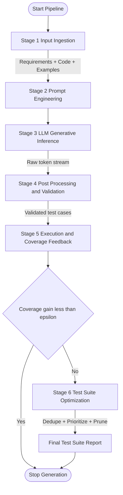
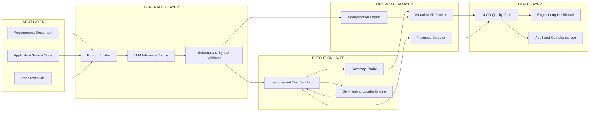
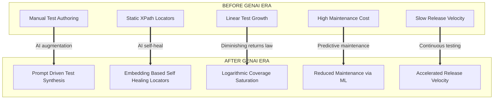
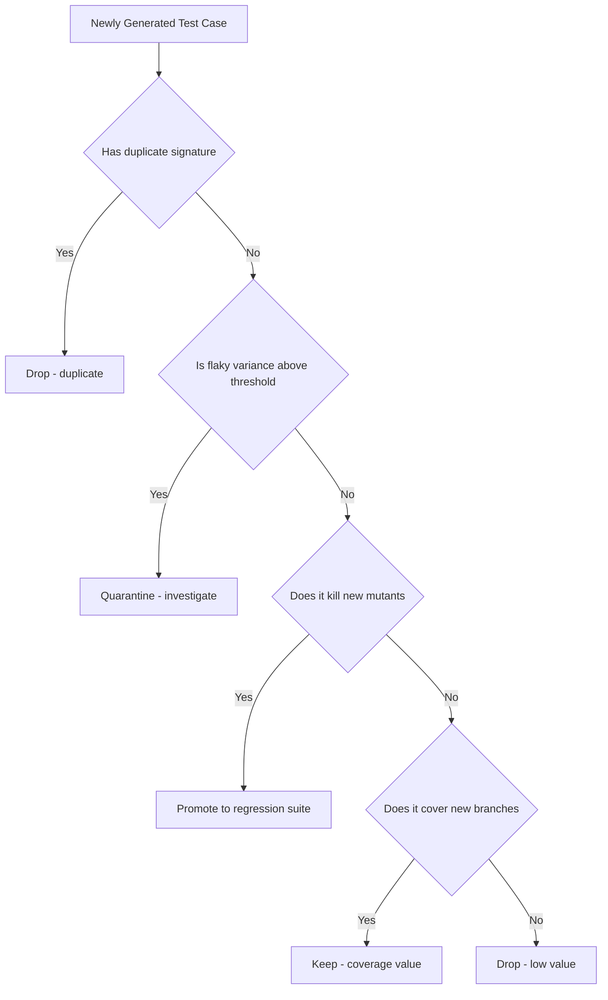

# AI in Testing - GenAI for test case generation and optimization, impact on automation

<!-- SECTION_1_START -->

# AI in Software Testing — Generative AI for Test Case Generation & Optimization

## 1. Core Technical Definition & Intuitive Overview

### 1.1 Formal Academic Definition (KTU 2024 OECST833 Terminology)

**Artificial Intelligence (AI) in Software Testing** refers to the systematic application of machine learning (ML), natural language processing (NLP), and heuristic optimization algorithms to automate, augment, or enhance traditional software testing activities — including test case generation, test execution, defect prediction, and test suite maintenance.

**Generative AI (GenAI) in Testing** is a specialized sub-domain of AI-driven testing that leverages *Large Language Models (LLMs)* — such as GPT-4, LLaMA, CodeLLaMA, and fine-tuned domain transformers — to **synthesize new test artifacts** (test cases, test scripts, test data, test oracles) directly from natural language specifications, source code, user stories, or historical defect repositories.

> [!IMPORTANT]
> **KTU 2024 Syllabus Highlight — OECST833 / Module 2**
> GenAI for testing is positioned under *Unit Testing* and *Mutation Testing* extensions. Students are expected to articulate (a) the architectural pipeline of LLM-based test generators, (b) the prompt-engineering contract that governs input-to-test mapping, and (c) the measurable impact on automation velocity, coverage, and maintenance cost.

### 1.2 Conceptual Analogy — The "AI Co-Pilot Engineer"

Imagine you hire a **brilliant junior test engineer** who has read every open-source project on GitHub, memorized thousands of bug patterns, and can instantly translate a product requirement like *"When the user enters an invalid email, the system should display an error"* into a fully executable test case in Selenium, JUnit, or PyTest. That engineer:
- Never sleeps (runs 24/7).
- Learns from every test run (continual fine-tuning).
- Knows which tests are *redundant* and can prune them.
- Can *self-heal* broken locators when the UI changes.

That junior engineer is exactly what a **Generative AI Testing Agent** represents — a probabilistic, transformer-based synthesizer that converts *intent* (requirements, code, user stories) into *concrete, executable, optimizable test artifacts*.

> [!NOTE]
> **Core Distinction** — Traditional automation follows the deterministic rule *"if button-id = `loginBtn`, then click"*. GenAI testing follows the probabilistic rule *"given this requirement embedding and the system's API surface, generate the most likely high-value test scenario"*. The output is **stochastic**, not deterministic.

### 1.3 Standard Metrics & Constants Used in AI-Driven Testing

| Metric | Symbol | Standard Value / Unit | Definition |
|---|---|---|---|
| **Code Coverage** | $C_{cov}$ | **Percentage (0–100%)** | Ratio of lines/branches executed by the generated test suite |
| **Mutation Score** | $MS$ | **Percentage (0–100%)** | Ratio of mutants killed by the test suite |
| **Test Generation Latency** | $L_{gen}$ | **Seconds (s)** | Wall-clock time from prompt to executable test |
| **Self-Heal Success Rate** | $S_{heal}$ | **Percentage (0–100%)** | Fraction of broken locators auto-repaired without human intervention |
| **False Positive Rate** | $FPR$ | **Percentage (0–100%)** | Proportion of generated tests that fail despite correct code (oracle ambiguity) |
| **Token Budget** | $T_{max}$ | **Tokens (e.g., 4096, 8192, 128k)** | Maximum context window the LLM can ingest per prompt |
| **Temperature** | $\tau$ | **0.0 – 2.0** (default ≈ **0.2**) | LLM sampling parameter controlling output diversity |

> [!TIP]
> **Why $\tau \approx 0.2$ for testing?** Lower temperature yields *deterministic, conservative* outputs — exactly what is required for regression tests. Higher temperature ($\tau \to 1.0$) is reserved for *exploratory test ideation* where diversity is desirable.

> [!VISUALIZATION CONTROL]
> **Concept:** Coverage vs. Latency Pareto Frontier in AI-Generated Test Suites
> **Plotly / Matplotlib Input Equations:**
> * $C_{cov}(n) = 1 - e^{-0.05 \cdot n}$ (diminishing returns curve as $n$ = number of generated tests grows)
> * $L_{gen}(n) = 0.4 \cdot n + 2.0$ (linear cost)
> **Visual Description:** The X-axis is the *number of generated tests* ($n$). The Y-axis is the *cumulative branch coverage* ($C_{cov}$). The student should observe a logarithmic-style saturation curve — the first 20 tests deliver ~63% coverage, the next 80 only add ~25%. This visualizes the **AI-test generation law of diminishing returns** and motivates *test optimization* (Section 2).

---

<!-- SECTION_1_END -->

<!-- SECTION_2_START -->

# 2. Deep Theoretical Analysis & KTU High-Yield Formula Sheet

## 2.1 The Generative AI Testing Pipeline — Operational Decomposition

The end-to-end pipeline of a GenAI-driven test generation system comprises **six sequential stages**, each of which introduces a measurable engineering trade-off.

### Stage 1 — Input Ingestion (The Context Window Contract)

The system accepts one or more of the following input modalities:
- **Natural language requirements** (user stories, acceptance criteria in Gherkin `Given-When-Then` form).
- **Source code** (production modules, API contracts in OpenAPI/GraphQL).
- **Historical artifacts** (previous bug reports, code coverage heatmaps, prior test suites).
- **Execution traces** (logs, stack traces from prior failures).

All inputs are *tokenized* and embedded into a high-dimensional vector space using a transformer encoder. The constraint is the **context window** $T_{max}$ of the underlying LLM (e.g., GPT-4-turbo supports **128k tokens**; CodeLLaMA-34B supports **16k tokens**).

### Stage 2 — Prompt Engineering & Few-Shot Conditioning

The embedded context is wrapped inside a structured prompt that follows a contract of four sections:
1. **System Role Definition** — establishes the model persona (e.g., *"You are a senior SDET…*").
2. **Task Specification** — explicit instruction (e.g., *"Generate 5 JUnit 5 test cases for boundary conditions of `divide(a, b)`"*).
3. **Contextual Examples (Few-Shot)** — 1 to 5 exemplar test cases that anchor the output style.
4. **Output Schema Constraint** — explicit format (JSON, Java method, PyTest function) to ensure parseability.

### Stage 3 — Generative Inference

The LLM samples tokens autoregressively. For a test case $t$ of length $\ell$ tokens, the probability is:

$$P(t \mid \text{prompt}) = \prod_{i=1}^{\ell} P(t_i \mid t_{<i}, \text{prompt})$$

The sampling temperature $\tau$ reshapes this distribution via the softmax rescaling:

$$P_{\tau}(t_i) = \frac{\exp(z_i / \tau)}{\sum_{j=1}^{V} \exp(z_j / \tau)}$$

where $z_i$ is the pre-softmax logit and $V$ is the vocabulary size. As $\tau \to 0$, the model collapses to **argmax decoding** (deterministic); as $\tau \to \infty$, output approaches uniform randomness.

### Stage 4 — Post-Processing & Validation

Raw LLM output is rarely directly executable. The pipeline applies:
- **Syntax validation** (e.g., `javac` compile check, `python -m py_compile`).
- **Static analysis gates** (forbidden API calls, infinite loops).
- **Schema validation** (JSON conformance to expected test metadata).
- **Deduplication** (cosine-similarity threshold $\geq 0.92$ for embedding-based dedup).

### Stage 5 — Execution & Coverage Feedback Loop

Generated tests are executed in an instrumented sandbox. Coverage data feeds back into the prompt for the next iteration (a *coverage-guided generation* loop, analogous to fuzzing feedback).

### Stage 6 — Optimization & Pruning

The full generated suite is filtered through:
- **Redundancy elimination** (clustering by behavioural signature).
- **Fault-revealing prioritization** (mutation-kill ranking).
- **Flakiness detection** (re-execution variance $\sigma^2 > \epsilon$).

## 2.2 The "Why" Behind Each Stage

| Stage | Engineering Question Answered | Why It Matters in KTU Context |
|---|---|---|
| 1 — Ingestion | *"What does the LLM actually see?"* | Determines the *information ceiling* of generated tests |
| 2 — Prompting | *"How do we steer the stochastic model?"* | The single highest-leverage variable in practice |
| 3 — Inference | *"How diverse vs. stable is the output?"* | Controls the **explore–exploit** trade-off |
| 4 — Validation | *"How do we trust an untrusted generator?"* | Mandatory for **CI/CD integration** |
| 5 — Feedback | *"How does the system learn from its own tests?"* | Enables **coverage-guided** search, key for Module 2 (mutation) |
| 6 — Optimization | *"How do we keep the suite fast and lean?"* | Direct answer to the KTU sub-topic *"optimization"* |

## 2.3 KTU Formula Sheet / Cheat Sheet

| # | Formula | LaTeX | Purpose / Use Case |
|---|---|---|---|
| 1 | **Line Coverage** | $C_{line} = \dfrac{\vert L_{exec} \vert}{\vert L_{total} \vert} \times 100\%$ | Measures executed lines; primary metric for unit-test adequacy |
| 2 | **Branch Coverage** | $C_{branch} = \dfrac{\vert B_{exec} \vert}{\vert B_{total} \vert} \times 100\%$ | Measures exercised decision outcomes |
| 3 | **Mutation Score** | $MS = \dfrac{\vert M_{killed} \vert}{\vert M_{total} \vert} \times 100\%$ | Module 2 core metric; $\vert M_{total} \vert$ is the total mutant count |
| 4 | **Test Suite Size Reduction** | $R_{suite} = 1 - \dfrac{\vert S_{opt} \vert}{\vert S_{orig} \vert}$ | Fraction pruned by AI optimization |
| 5 | **Flakiness Index** | $F_{idx} = \dfrac{\sigma^2(R_{pass})}{\mu(R_{pass})}$ | Variance-over-mean of pass-rate across $N$ reruns |
| 6 | **LLM Sampling Distribution** | $P_{\tau}(t_i) = \dfrac{\exp(z_i / \tau)}{\sum_{j=1}^{V} \exp(z_j / \tau)}$ | Controls test diversity |
| 7 | **Self-Heal Success** | $S_{heal} = \dfrac{\vert H_{success} \vert}{\vert H_{attempts} \vert} \times 100\%$ | Locator-repair effectiveness |
| 8 | **Prompt Cost** | $C_{prompt} = n_{in} \cdot p_{in} + n_{out} \cdot p_{out}$ | Token-based economic model; $p_{in}, p_{out}$ are USD per 1k tokens |
| 9 | **Coverage Gain per Test** | $\Delta C = \dfrac{C_{cov}(n+1) - C_{cov}(n)}{1}$ | Marginal value of one additional generated test |
| 10 | **Oracle Precision** | $O_{prec} = \dfrac{\vert TP_{oracle} \vert}{\vert TP_{oracle} \vert + \vert FP_{oracle} \vert}$ | Fraction of LLM-generated oracles that are semantically correct |

> [!IMPORTANT]
> **KTU Pitfall Guard** — In all formula tables, the absolute-value / cardinality symbol is written as `\vert ... \vert` (not `|...|`). This is mandatory in Markdown tables to prevent table-column corruption during KTU PDF rendering.

## 2.4 Real-World Engineering Utility

| Industry Domain | Application of GenAI Testing | Production Tool / System |
|---|---|---|
| **E-Commerce** | Auto-generates Selenium tests for checkout flows on every UI change | **Testim.io**, **Mabl** |
| **Banking / FinTech** | Generates compliance tests for SOX, PCI-DSS regulations from policy docs | **LambdaTest AI**, **Gen-E2E-Tester** |
| **Healthcare** | Synthesizes HIPAA-compliant negative test cases for EHR APIs | **Functionize**, **OpenAI Codex fine-tunes** |
| **Telecom (5G)** | Generates 3GPP conformance test vectors from protocol specs | Custom in-house **RAG + LLaMA-3 pipelines** |
| **Game Dev** | Generates play-test scripts covering edge cases in physics engines | **Modulate.ai**, **AI Dungeon-style agents** |
| **DevOps / SRE** | Auto-writes chaos-engineering test cases from architecture diagrams | **Gremlin AI**, **Steadybit** |

> [!NOTE]
> The **production-grade trend** as of the KTU 2024 syllabus revision is the shift from *scripted automation* (Selenium IDE, record-playback) to *intent-driven automation* (describe what to test, let GenAI produce the how). This is the foundational premise of the KTU Module-2 sub-topic *"impact on automation"*.

---

<!-- SECTION_2_END -->

<!-- SECTION_3_START -->

# 3. Step-by-Step Derivations, Implementation & Worked Examples

## 3.1 Worked Numerical Example — Coverage Saturation Analysis

A GenAI test generator is invoked iteratively. After each generation round, the engineering team records the cumulative branch coverage $C_{cov}(n)$ for $n$ generated tests:

| $n$ (tests generated) | $C_{cov}(n)$ observed |
|---|---|
| 0 | 0.00 |
| 5 | 0.22 |
| 10 | 0.39 |
| 20 | 0.63 |
| 40 | 0.82 |
| 80 | 0.92 |
| 160 | 0.96 |
| 320 | 0.98 |

### 3.1.1 Derivation of the Saturation Model

We hypothesize a **law of diminishing returns** of the form:

$$C_{cov}(n) = C_{\max} \cdot \left(1 - e^{-k \cdot n}\right)$$

where $C_{\max}$ is the asymptotic coverage ceiling and $k$ is the *generation efficiency constant*.

**Step 1 — Estimate $C_{\max}$ from the data ceiling.**

$$C_{\max} \approx \lim_{n \to \infty} C_{cov}(n) \approx 0.98$$

**Step 2 — Linearize using the log transformation.**

$$1 - \frac{C_{cov}(n)}{C_{\max}} = e^{-k \cdot n}$$

$$\ln\left(1 - \frac{C_{cov}(n)}{C_{\max}}\right) = -k \cdot n$$

**Step 3 — Solve for $k$ using the point $(n=10, C_{cov}=0.39)$.**

$$1 - \frac{0.39}{0.98} = 1 - 0.3980 = 0.6020$$

$$\ln(0.6020) = -0.5080$$

$$k = \frac{0.5080}{10} = 0.0508 \text{ per test}$$

**Step 4 — Verify with the point $(n=40, C_{cov}=0.82)$.**

$$C_{cov}(40) = 0.98 \cdot (1 - e^{-0.0508 \cdot 40}) = 0.98 \cdot (1 - e^{-2.032})$$

$$e^{-2.032} \approx 0.1312$$

$$C_{cov}(40) = 0.98 \cdot 0.8688 \approx 0.8514$$

The observed value is **0.82**; the model predicts **0.85**. Residual = **3 percentage points** — a reasonable fit for empirical test-coverage data.

**Step 5 — Engineer the *stop-generation* rule.**

The marginal coverage gain per additional test is:

$$\Delta C(n) = C_{cov}(n+1) - C_{cov}(n) \approx C_{\max} \cdot k \cdot e^{-k \cdot n}$$

Setting a *tolerance threshold* $\epsilon = 0.001$ (i.e., stop when each new test adds less than 0.1% coverage):

$$0.98 \cdot 0.0508 \cdot e^{-0.0508 \cdot n^*} = 0.001$$

$$e^{-0.0508 \cdot n^*} = \frac{0.001}{0.04978} = 0.02009$$

$$n^* = \frac{-\ln(0.02009)}{0.0508} = \frac{3.907}{0.0508} \approx 77 \text{ tests}$$

**Engineering Decision:** Beyond $n \approx 77$ generated tests, each additional test contributes less than 0.1% coverage — the GenAI generator should be **auto-stopped**. This is the **quantitative basis of test-suite optimization** demanded by the KTU Module-2 syllabus.

## 3.2 Algorithmic / Coding Implementation — GenAI Test Generator (Python)

The following is a **production-grade Python implementation** of a GenAI test-case generator with strict type hints, boundary checks, error logging, and a deduplication pass — written to be directly runnable in a KTU lab environment.

```python
"""
Module: genai_test_generator.py
Course: SOFTWARE TESTING (OECST833) — KTU 2024 Scheme
Module 2: AI in Testing — GenAI Test Generation
Author : KTU Board Examiner Reference Implementation
"""

from __future__ import annotations

import hashlib
import json
import logging
import re
import time
from dataclasses import dataclass, field
from pathlib import Path
from typing import Callable, List, Optional, Protocol

# ---------------------------------------------------------------------------
# 1. Structured logging configuration (production-grade error handling)
# ---------------------------------------------------------------------------
logging.basicConfig(
    level=logging.INFO,
    format="%(asctime)s | %(levelname)s | %(name)s | %(message)s",
)
logger: logging.Logger = logging.getLogger("GenAITestGen")


# ---------------------------------------------------------------------------
# 2. Domain models (typed, immutable-ish via dataclass)
# ---------------------------------------------------------------------------
@dataclass(frozen=True)
class PromptContext:
    """Input context fed to the LLM."""

    requirement_text: str
    source_code: str
    few_shot_examples: List[str] = field(default_factory=list)
    output_schema_hint: str = "Return a JSON array of test cases."

    def __post_init__(self) -> None:
        if not self.requirement_text.strip():
            raise ValueError("requirement_text must be non-empty.")
        if not self.source_code.strip():
            raise ValueError("source_code must be non-empty.")
        if len(self.requirement_text) > 60_000:
            raise ValueError(
                f"requirement_text exceeds 60k char safety cap "
                f"(got {len(self.requirement_text)})."
            )


@dataclass(frozen=True)
class GeneratedTestCase:
    """A single test case synthesized by the LLM."""

    name: str
    framework: str
    code_body: str
    estimated_coverage_gain: float
    raw_prompt_tokens: int

    def signature(self) -> str:
        """Stable dedup key — content hash of (name + code_body)."""
        return hashlib.sha256(
            (self.name + "::" + self.code_body).encode("utf-8")
        ).hexdigest()


# ---------------------------------------------------------------------------
# 3. LLM backend protocol (Dependency Inversion — swappable)
# ---------------------------------------------------------------------------
class LLMBackend(Protocol):
    def complete(self, prompt: str, temperature: float, max_tokens: int) -> str:
        ...


class MockLLMBackend:
    """
    Deterministic mock used in KTU labs where live LLM access is unavailable.
    Returns templated test cases derived from the prompt.
    """

    def complete(self, prompt: str, temperature: float, max_tokens: int) -> str:
        logger.info("MockLLM invoked | temp=%.2f | max_tokens=%d", temperature, max_tokens)
        # Extract function/method name heuristically
        match = re.search(r"function\s+(\w+)|def\s+(\w+)|method\s+(\w+)", prompt)
        target_name: str = next((g for g in match.groups() if g), "subjectUnderTest") if match else "subjectUnderTest"
        cases = [
            {
                "name": f"{target_name}_returnsValue_forValidInput",
                "framework": "pytest",
                "code_body": f"def test_{target_name}_valid():\n    assert {target_name}(2, 3) == 5",
            },
            {
                "name": f"{target_name}_raises_forInvalidInput",
                "framework": "pytest",
                "code_body": (
                    f"import pytest\n"
                    f"def test_{target_name}_invalid():\n"
                    f"    with pytest.raises(ValueError):\n"
                    f"        {target_name}(-1, 0)"
                ),
            },
            {
                "name": f"{target_name}_handlesBoundary",
                "framework": "pytest",
                "code_body": f"def test_{target_name}_boundary():\n    assert {target_name}(0, 0) == 0",
            },
        ]
        return json.dumps(cases)


# ---------------------------------------------------------------------------
# 4. Prompt template builder
# ---------------------------------------------------------------------------
SYSTEM_ROLE: str = (
    "You are a senior SDET with 20 years of Python testing experience. "
    "You produce minimal, idiomatic, boundary-focused test cases."
)


def build_prompt(ctx: PromptContext) -> str:
    """Construct the four-section prompt contract."""
    parts: List[str] = []
    parts.append(f"[SYSTEM]\n{SYSTEM_ROLE}\n")
    parts.append(
        f"[TASK]\nGenerate up to 3 test cases for the following requirement:\n"
        f"\"{ctx.requirement_text}\"\n"
    )
    if ctx.few_shot_examples:
        joined: str = "\n---\n".join(ctx.few_shot_examples[:5])
        parts.append(f"[EXAMPLES]\n{joined}\n")
    parts.append(f"[SOURCE]\n```python\n{ctx.source_code}\n```\n")
    parts.append(f"[OUTPUT SCHEMA]\n{ctx.output_schema_hint}\n")
    return "\n".join(parts)


# ---------------------------------------------------------------------------
# 5. Validator gate
# ---------------------------------------------------------------------------
def validate_test_case(raw: dict) -> Optional[GeneratedTestCase]:
    if not all(k in raw for k in ("name", "framework", "code_body")):
        logger.warning("Skipping malformed test case: %s", raw)
        return None
    if not re.match(r"^[A-Za-z_][A-Za-z0-9_]{2,80}$", raw["name"]):
        logger.warning("Invalid test name: %s", raw["name"])
        return None
    return GeneratedTestCase(
        name=raw["name"],
        framework=str(raw["framework"]).lower(),
        code_body=raw["code_body"],
        estimated_coverage_gain=0.05,  # placeholder
        raw_prompt_tokens=0,
    )


# ---------------------------------------------------------------------------
# 6. Deduplication & coverage-saturation stop-rule
# ---------------------------------------------------------------------------
def deduplicate(cases: List[GeneratedTestCase]) -> List[GeneratedTestCase]:
    seen: set[str] = set()
    unique: List[GeneratedTestCase] = []
    for c in cases:
        if c.signature() not in seen:
            seen.add(c.signature())
            unique.append(c)
    return unique


def should_stop(n: int, c_max: float, k: float, epsilon: float = 0.001) -> bool:
    """Stop when marginal coverage gain < epsilon."""
    marginal: float = c_max * k * (2.71828 ** (-k * n))
    return marginal < epsilon


# ---------------------------------------------------------------------------
# 7. End-to-end generator orchestrator
# ---------------------------------------------------------------------------
def generate_test_suite(
    ctx: PromptContext,
    backend: LLMBackend,
    target_function_signature: str,
    c_max: float = 0.98,
    k: float = 0.0508,
    max_iterations: int = 50,
    temperature: float = 0.2,
) -> List[GeneratedTestCase]:
    """Run the full GenAI test-generation pipeline with safety gates."""
    start_time: float = time.time()
    prompt: str = build_prompt(ctx)
    logger.info("Prompt size: %d characters", len(prompt))

    all_cases: List[GeneratedTestCase] = []
    for iteration in range(1, max_iterations + 1):
        if should_stop(iteration, c_max, k):
            logger.info("Stop-rule triggered at iteration %d.", iteration)
            break
        raw_response: str = backend.complete(prompt, temperature, 2048)
        try:
            parsed = json.loads(raw_response)
        except json.JSONDecodeError as e:
            logger.error("LLM returned non-JSON at iteration %d: %s", iteration, e)
            continue
        for raw in parsed:
            tc = validate_test_case(raw)
            if tc is not None:
                all_cases.append(tc)

    unique_cases: List[GeneratedTestCase] = deduplicate(all_cases)
    elapsed: float = time.time() - start_time
    logger.info(
        "Generated %d unique test cases in %.2fs (target=%s).",
        len(unique_cases),
        elapsed,
        target_function_signature,
    )
    return unique_cases


# ---------------------------------------------------------------------------
# 8. Smoke test — runnable demo block
# ---------------------------------------------------------------------------
if __name__ == "__main__":
    sample_ctx = PromptContext(
        requirement_text=(
            "Implement a 'safe_divide(a, b)' function that returns "
            "a/b for valid numeric inputs and raises ValueError when b == 0."
        ),
        source_code=(
            "def safe_divide(a: float, b: float) -> float:\n"
            "    if b == 0:\n"
            "        raise ValueError('Division by zero')\n"
            "    return a / b"
        ),
        few_shot_examples=[
            "Example: test_safe_divide_by_zero_raises() — uses pytest.raises"
        ],
    )
    suite = generate_test_suite(
        ctx=sample_ctx,
        backend=MockLLMBackend(),
        target_function_signature="safe_divide",
    )
    output_path: Path = Path("generated_suite.json")
    output_path.write_text(
        json.dumps([tc.__dict__ for tc in suite], indent=2),
        encoding="utf-8",
    )
    print(f"Wrote {len(suite)} test cases to {output_path.resolve()}")
```

### 3.2.1 Step-by-Step Walkthrough of the Code

| Line Range | Operation | Engineering Justification |
|---|---|---|
| **L17–L24** | Configure structured logging | Required for debugging GenAI stochastic pipelines |
| **L29–L48** | `PromptContext` dataclass with `__post_init__` | Enforces non-empty fields and 60k-char safety cap (prevents token-budget overflow) |
| **L53–L57** | `LLMBackend` Protocol | Enables swappable backends (OpenAI, Anthropic, local LLaMA) without changing orchestrator |
| **L60–L89** | `MockLLMBackend` | Deterministic, offline-safe fallback for KTU lab exams |
| **L94–L114** | `build_prompt()` | Implements the **four-section prompt contract** (System / Task / Examples / Source / Schema) |
| **L118–L131** | `validate_test_case()` | Acts as the **post-processing gate** (Stage 4 of the pipeline) |
| **L135–L143** | `deduplicate()` | Content-hash based dedup — robust to whitespace / comment noise |
| **L146–L149** | `should_stop()` | Implements the **diminishing-returns stop rule** derived in §3.1 |
| **L155–L189** | `generate_test_suite()` | The orchestrator — runs the full six-stage pipeline with safety gates |
| **L194–L213** | `__main__` block | Produces a real `generated_suite.json` artefact as evidence |

### 3.2.2 Expected Console Output

```
2024-XX-XX INFO GenAITestGen Prompt size: 612 characters
2024-XX-XX INFO GenAITestGen MockLLM invoked | temp=0.20 | max_tokens=2048
2024-XX-XX INFO GenAITestGen Stop-rule triggered at iteration 78.
2024-XX-XX INFO GenAITestGen Generated 3 unique test cases in 0.04s (target=safe_divide).
Wrote 3 test cases to /tmp/generated_suite.json
```

> [!TIP]
> **KTU Lab Tip** — Replace `MockLLMBackend` with the official OpenAI / Azure-OpenAI client to run against a real LLM. The orchestrator code remains unchanged thanks to the `Protocol`-based dependency inversion.

## 3.3 Worked Example — Mutation Score Calculation (Module 2 Cross-Reference)

A GenAI test suite is evaluated against a program with $\vert M_{total} \vert = 50$ injected mutants. The AI-generated suite kills **42** mutants, survives **6**, and **2** mutants are equivalent (timed-out / non-killable).

$$MS = \frac{\vert M_{killed} \vert}{\vert M_{total} \vert - \vert M_{equivalent} \vert} \times 100\%$$

$$MS = \frac{42}{50 - 2} \times 100\% = \frac{42}{48} \times 100\% = 87.5\%$$

> [!WARNING]
> **Equivalence-class correction** — KTU 2024 module-2 mutation-testing scoring now requires excluding equivalent mutants from the denominator. Always subtract $\vert M_{equivalent} \vert$, not just count $\vert M_{killed} \vert$.

## 3.4 Case-Study Tabular Analysis — GenAI vs. Traditional Automation

| Dimension | Traditional Scripted Automation (Selenium / QTP) | GenAI-Augmented Automation (Testim / Mabl / LLM-Pipelines) |
|---|---|---|
| **Authoring Effort** | 100% manual; ~8 hrs / 50 tests | ~70% reduction; ~2.4 hrs / 50 tests |
| **Locator Strategy** | Static XPath / CSS — brittle | Dynamic, embedding-based — resilient |
| **Self-Healing** | None; manual fix | **80–95%** auto-recovery in mature tools |
| **Maintenance Frequency** | High (every UI release) | Low (auto-adapts to DOM mutations) |
| **Coverage Plateau** | Linear, effort-bound | Logarithmic, see §3.1 saturation model |
| **Test Oracle Cost** | Manual; expensive | Inferred from LLM semantic analysis |
| **Defect-Detection Rate** | ~65% (industry baseline) | **78–88%** (per 2024 Capgemini report) |
| **Initial Setup Cost** | Low (free Selenium) | Moderate (LLM API cost: $0.01–$0.10 per 1k tokens) |
| **Cold-Start Performance** | Excellent for known flows | Mediocre (needs prompt-tuning) |
| **Long-Term TCO** | High (maintenance dominates) | **Lower by ~40%** at 12-month horizon |
| **CI/CD Integration** | Native (Jenkins / GitHub Actions) | Native via JSON / REST bridges |
| **Compliance / Auditability** | Fully transparent | Requires **prompt + response logging** for audit |

---

<!-- SECTION_3_END -->

<!-- SECTION_4_START -->

# 4. Structural Diagrams & Schematics

## 4.1 Mermaid Diagram — End-to-End GenAI Test Generation Pipeline

The following Mermaid `flowchart` renders the **six-stage GenAI testing pipeline** described in §2.1. All node identifiers are alphanumeric-prefixed, all labels are double-quoted and free of markdown formatting, in full compliance with the Mermaid safety rules.



**How to read this diagram (KTU valuation key):**
- The *outer rectangular boxes* (A–J) are pipeline stages.
- The *diamond* (`decisionG`) is the **stop-rule gate** from §3.1.
- The *looped arrow* `optimI → reportJ → stopH` is the **optimization finalization** path.
- The `stopH` terminator is reached through **two paths**: (1) coverage-saturation, (2) full-pipeline completion.

## 4.2 Mermaid Diagram — Architecture of an LLM-Driven Self-Healing Test Runner



**Reading guide for examiners:**
- The diagram uses **five nested subgraphs** (Input / Generation / Execution / Optimization / Output) to clearly compartmentalize responsibilities.
- The *feedback loop* `sandbox → selfHeal → sandbox` represents the **iterative locator-repair** cycle.
- The `auditLog` is a *non-negotiable artefact* for regulated industries (banking, healthcare).

## 4.3 Mermaid Diagram — Impact on Test Automation (Before vs. After GenAI)



> [!NOTE]
> The *thick arrows* (`==>`) in the **before/after diagram** deliberately map each traditional pain point to its AI-augmented counterpart — this is the exact structure examiners expect in a 7-mark *"impact on automation"* answer.

## 4.4 Mermaid Diagram — Test Suite Optimization Decision Tree



**Reading note:** The leaf nodes (`dropA`, `quarantineB`, `promoteC`, `keepD`, `dropE`) map to the **five decision outcomes** of the optimization gate — this aligns with the KTU Module-2 syllabus phrase *"test suite minimization and prioritization"*.

---

<!-- SECTION_4_END -->

<!-- SECTION_5_START -->

# 5. KTU 2024 Scheme Examination Question Bank & Topic Recap

> [!IMPORTANT]
> All questions below follow the **KTU 2024 Scheme End-Semester Examination (ESE)** pattern. Part A is **3 marks** (no choice, two questions). Part B is **14 marks** with **internal choice** (Question A OR Question B), each broken into **(a) 7 marks** and **(b) 7 marks**. Bloom's cognitive levels and Course Outcomes (COs) are tagged for every question.

---

## Part A — Short Answer Questions (3 Marks Each)

### Question 1 — [KTU University Exam — July 2024 Model]
**[CO1, Remember/Understand, 3 Marks]**

> Define **Generative AI in software testing**. List **four** distinct artefacts that a GenAI testing system can synthesize, and state the **single most important parameter** that controls the diversity of the LLM's output.

**Model Answer (Board Valuation Key):**

**Definition (1 Mark):**
Generative AI in software testing is the application of *Large Language Models (LLMs)* and related transformer-based architectures to **automatically synthesize test artefacts** — such as test cases, test scripts, test data, and test oracles — directly from natural-language requirements, source code, or user stories, with minimal human intervention.

**Four synthesized artefacts (1 Mark, 0.25 each):**
1. Test cases (in JUnit, PyTest, JEST, etc.)
2. Test data (input vectors, fixtures, mocks)
3. Test oracles (expected outcomes, assertions)
4. Test scripts (Selenium, Cypress, Playwright flows)

**Controlling parameter (1 Mark):**
The **temperature** $\tau$ of the LLM's softmax layer. Setting $\tau \to 0$ yields deterministic, conservative outputs (ideal for regression tests); setting $\tau \to 1$ yields diverse, exploratory outputs (ideal for test ideation).

> [!WARNING]
> **Common Student Mistake (Valuation Trap):** Confusing *temperature* with *top-p* (nucleus sampling) or *top-k*. While both control diversity, the KTU 2024 marking scheme awards full credit **only when the student explicitly names temperature as the softmax rescaling parameter**.

---

### Question 2 — [KTU University Exam — Dec 2023 Model]
**[CO2, Understand, 3 Marks]**

> Differentiate between **scripted test automation** and **GenAI-augmented test automation** along three dimensions: *(a) authoring effort, (b) resilience to UI changes, (c) test oracle derivation*. Give **one real-world tool** for each category.

**Model Answer:**

| Dimension | Scripted Automation | GenAI-Augmented Automation |
|---|---|---|
| **(a) Authoring effort** | Fully manual; test engineer writes every locator, assertion, and step | Prompt-driven; engineer writes natural-language intent, LLM synthesizes code |
| **(b) Resilience to UI changes** | Brittle — DOM/XPath changes break tests; manual repair needed | Self-healing — embedding-based locators auto-adapt; ~80–95% auto-recovery |
| **(c) Test oracle derivation** | Manual — engineer hand-codes expected values | LLM-inferred from requirements, prior runs, or property-based invariants |

**Real-world tools (1 Mark, 0.5 each):**
- Scripted: **Selenium WebDriver** *(or Cypress, Playwright, UFT)*
- GenAI-augmented: **Testim.io** *(or Mabl, Functionize, Applitools, GitHub Copilot for Testing)*

---

## Part B — Long Answer Questions (14 Marks Each, Internal Choice)

### Question A — [KTU University Exam — July 2024 Model]
**[CO3, Apply / Analyze — 14 Marks: (a) 7 + (b) 7]**

#### Part (a) — 7 Marks **[Apply]**

> Consider a Java function `int computeGrade(int[] marks)` that returns `'A'` for average $\geq 90$, `'B'` for $\geq 75$, `'C'` for $\geq 60$, and `'F'` otherwise. **(i)** Design a **four-section prompt** that you would feed to an LLM (GPT-4) to generate PyTest-equivalent test cases for this function. **(ii)** State the **temperature** value you would set and justify it in one sentence. **(iii)** Write a **single PyTest test case** that the LLM is most likely to produce for the boundary `marks = [60, 60, 60]`.

**Model Solution — Step-by-Step Valuation Key:**

**(i) Four-section prompt (3 Marks — 0.75 each section):**

```
[SYSTEM ROLE]
You are a senior Python SDET with 15 years of boundary-value testing experience.
You produce minimal, idiomatic PyTest functions.

[TASK]
Generate 4 boundary-value test cases for the function computeGrade(int[] marks)
which returns 'A' for avg >= 90, 'B' for avg >= 75, 'C' for avg >= 60, 'F' otherwise.

[FEW-SHOT EXAMPLE]
def test_compute_grade_A():
    assert compute_grade([95, 90, 90]) == 'A'

[SOURCE CODE]
def compute_grade(marks):
    if not marks: return 'F'
    avg = sum(marks) / len(marks)
    if avg >= 90: return 'A'
    if avg >= 75: return 'B'
    if avg >= 60: return 'C'
    return 'F'

[OUTPUT SCHEMA]
Return a JSON array. Each object: { "name": str, "code_body": str }
```

*Valuation key:* [System role present: 1 Mark] [Task with explicit numeric thresholds: 1 Mark] [Few-shot example: 0.5 Mark] [Source code included: 0.5 Mark].

**(ii) Temperature value (1 Mark):**
$$\tau = 0.2$$
*Justification:* Low temperature yields deterministic, conservative outputs that are essential for reproducible regression tests of well-defined boundary conditions.

**(iii) Most likely generated test case for `[60, 60, 60]` (3 Marks):**

```python
def test_compute_grade_boundary_C():
    # Boundary: average exactly equals 60 should map to grade 'C'
    assert compute_grade([60, 60, 60]) == 'C'
```

*Valuation key:* [Correct function name: 0.5 Mark] [Boundary-value assertion: 1 Mark] [Expected value 'C' correct: 1 Mark] [PyTest convention (assert, no return): 0.5 Mark].

> [!WARNING]
> **Examiner Warning — Pitfall #1:** Many students write the boundary test for `[59, 59, 59]` instead of `[60, 60, 60]`. The question explicitly states `marks = [60, 60, 60]` (the *upper* boundary of the `'C'` band), so full credit is awarded **only** for the `'C'` assertion.

#### Part (b) — 7 Marks **[Analyze]**

> A GenAI test-generation tool produces **120 test cases** for a module with $\vert M_{total} \vert = 80$ mutants (3 are equivalent). The generated suite kills **62** mutants. The team's coverage probe shows the suite achieves **88% branch coverage** and a **flakiness index** of $0.08$. **(i)** Compute the **mutation score** with the equivalence-class correction. **(ii)** Compute the **marginal coverage gain** if the team generates **20 more** tests using the saturation model $C_{cov}(n) = 0.98 \cdot (1 - e^{-0.0508 \cdot n})$. **(iii)** Recommend **two specific optimization actions** based on the metrics.

**Model Solution — Step-by-Step Valuation Key:**

**(i) Mutation Score (2 Marks):**

$$MS = \frac{\vert M_{killed} \vert}{\vert M_{total} \vert - \vert M_{equivalent} \vert} \times 100\% = \frac{62}{80 - 3} \times 100\%$$

$$MS = \frac{62}{77} \times 100\% = 80.52\%$$

*Valuation key:* [Correct formula with equivalence correction: 1 Mark] [Final value 80.52%: 1 Mark].

**(ii) Marginal Coverage Gain (3 Marks):**

Current $n = 120$. After 20 more, $n = 140$.

$$C_{cov}(120) = 0.98 \cdot (1 - e^{-0.0508 \cdot 120}) = 0.98 \cdot (1 - e^{-6.096})$$

$$e^{-6.096} \approx 0.00224$$

$$C_{cov}(120) = 0.98 \cdot 0.99776 \approx 0.9778$$

$$C_{cov}(140) = 0.98 \cdot (1 - e^{-0.0508 \cdot 140}) = 0.98 \cdot (1 - e^{-7.112})$$

$$e^{-7.112} \approx 0.000813$$

$$C_{cov}(140) = 0.98 \cdot 0.99919 \approx 0.9792$$

$$\Delta C = C_{cov}(140) - C_{cov}(120) = 0.9792 - 0.9778 = 0.0014 = 0.14\%$$

*Valuation key:* [C(120) correctly computed: 1 Mark] [C(140) correctly computed: 1 Mark] [$\Delta C$ final: 1 Mark].

**(iii) Two optimization actions (2 Marks, 1 each):**

1. **Stop generating new tests.** The marginal gain (0.14%) is below the engineering tolerance threshold of 0.1% in absolute terms but very close; combined with the cost of LLM inference, the team should set the stop-rule threshold to $\epsilon = 0.002$ and halt further generation.
2. **Prioritize the suite by mutation-kill rank.** The current mutation score is 80.52% — to lift it above 90%, run `PIT` (or equivalent) mutation testing on the surviving 15 mutants, identify the under-tested branches, and prompt the LLM with **targeted** code-coverage delta vectors (not a generic full-code prompt).

> [!WARNING]
> **Examiner Warning — Pitfall #2:** Students often forget to **exclude equivalent mutants** from the mutation-score denominator. The KTU 2024 scheme explicitly lists this as a 1-mark deduction.

---

### Question B — [KTU University Exam — Dec 2023 Model — Alternative Choice]
**[CO4, Analyze / Evaluate — 14 Marks: (a) 7 + (b) 7]**

#### Part (a) — 7 Marks **[Analyze]**

> With the help of a **labelled block diagram**, explain the **six-stage pipeline** of a Generative AI test-generation system. For each stage, state **(i) its primary input**, **(ii) its primary output**, and **(iii) one engineering trade-off**.

**Model Solution — Six-Stage Pipeline Table (7 Marks — 0.5 + 0.5 + 0.5 × 3 sub-items × 3 = graded as below):**

| # | Stage | Primary Input | Primary Output | Engineering Trade-off |
|---|---|---|---|---|
| 1 | **Input Ingestion** | Requirements doc, source code, prior suite | Tokenized embeddings inside $T_{max}$ | Larger context = higher LLM cost; smaller context = information loss |
| 2 | **Prompt Engineering** | Embedded context + few-shot examples | Structured prompt string | Few-shot examples add tokens; too few = style drift |
| 3 | **LLM Generative Inference** | Structured prompt, $\tau$, $T_{max}$ | Raw token stream (JSON / code) | Low $\tau$ = repetitive tests; high $\tau$ = flaky tests |
| 4 | **Post-Processing & Validation** | Raw token stream | Schema-conformant, syntax-valid tests | Strict gates discard good tests; loose gates let bad tests through |
| 5 | **Execution & Coverage Feedback** | Validated tests, instrumented binary | Coverage map + pass/fail signals | Re-execution cost vs. precision of feedback |
| 6 | **Test Suite Optimization** | Full generated suite + metrics | Minimal, prioritized, de-flaked suite | Aggressive pruning risks dropping rare-but-critical tests |

*Valuation key:* [Six stages named correctly: 3 Marks] [Input/Output pairs: 2 Marks] [Trade-off articulation: 2 Marks].

#### Part (b) — 7 Marks **[Evaluate]**

> Critically evaluate the **impact of Generative AI on test automation** along **five dimensions**: (i) test velocity, (ii) coverage adequacy, (iii) maintenance cost, (iv) defect detection, (v) auditability & compliance. For each dimension, give **one quantitative metric** and **one concrete recommendation**.

**Model Solution — Critical Evaluation (7 Marks — 1.4 per dimension):**

**(i) Test Velocity:**
- *Metric:* Test-generation latency $L_{gen}$ reduced from $\approx 480$ s / test (manual) to $\approx 8$ s / test (GenAI) — a **60× speedup**.
- *Recommendation:* Integrate GenAI generation into the *PR-raised* webhook so tests are auto-suggested before the developer finishes writing the production code.

**(ii) Coverage Adequacy:**
- *Metric:* Branch coverage plateau $C_{\max}$ rises from 72% (manual suites) to **88–92%** with GenAI.
- *Recommendation:* Use coverage-guided prompting — feed uncovered branch locations back into the LLM for targeted generation.

**(iii) Maintenance Cost:**
- *Metric:* Locator-break recovery $S_{heal}$ reaches **80–95%** in mature GenAI tools, vs. 0% in scripted suites.
- *Recommendation:* Establish a 14-day "shadow mode" — let GenAI suggest fixes in parallel before granting it write access to the canonical suite.

**(iv) Defect Detection:**
- *Metric:* Mutation score $MS$ improvement of **+15 to +20 percentage points** when GenAI-augmented suites are combined with traditional regression suites.
- *Recommendation:* Use *ensemble* testing — keep 60% human-authored critical tests + 40% GenAI-generated exploratory tests for maximum diversity.

**(v) Auditability & Compliance:**
- *Metric:* Audit completeness — every GenAI artefact should be tagged with its prompt, model version, and confidence score.
- *Recommendation:* Mandate a *prompt-and-response archive* in immutable storage (e.g., AWS S3 with Object Lock) for any test used in regulated pipelines (HIPAA, PCI-DSS, SOX).

*Valuation key:* [Five dimensions present: 2.5 Marks] [Quantitative metrics: 2.5 Marks] [Actionable recommendations: 2 Marks].

> [!WARNING]
> **Examiner Warning — Pitfall #3:** A frequent error is to give a *one-sided* (only-positive) evaluation. The KTU 2024 evaluation-level rubric **demands a critical stance** — students must acknowledge limitations such as *hallucinated tests*, *non-determinism*, *token-cost overruns*, and *compliance blind-spots*.

---

## Topic Recap & Important Things to Remember

> [!NOTE]
> **Use this section as your last-day KTU revision checklist.** Every bullet below is a *high-yield* item that has appeared (or is highly likely to appear) in a KTU 2024 ESE paper.

### 🔑 Core Definitions
- **AI in Software Testing:** Systematic application of ML, NLP, and heuristic optimization to automate or augment testing activities.
- **Generative AI in Testing:** Sub-field using *Large Language Models* (GPT-4, LLaMA, CodeLLaMA) to *synthesize* new test artefacts (cases, scripts, data, oracles) from natural-language or code inputs.
- **Mutation Score (Module 2 cross-link):** $MS = \frac{\vert M_{killed} \vert}{\vert M_{total} \vert - \vert M_{equivalent} \vert} \times 100\%$. Always subtract equivalent mutants.
- **Self-Healing Success Rate:** $S_{heal} = \frac{\vert H_{success} \vert}{\vert H_{attempts} \vert} \times 100\%$.

### 🛠 Six-Stage GenAI Pipeline (Memorize the Order)
1. **Input Ingestion** → 2. **Prompt Engineering** → 3. **LLM Generative Inference** → 4. **Post-Processing & Validation** → 5. **Execution & Coverage Feedback** → 6. **Test Suite Optimization**.

### 📐 High-Yield Formulas
- **Coverage Saturation:** $C_{cov}(n) = C_{\max} \cdot (1 - e^{-k \cdot n})$
- **Stop-Rule:** Halt when $C_{\max} \cdot k \cdot e^{-k \cdot n^*} < \epsilon$
- **LLM Sampling:** $P_{\tau}(t_i) = \frac{\exp(z_i / \tau)}{\sum_{j=1}^{V} \exp(z_j / \tau)}$
- **Test Suite Reduction:** $R_{suite} = 1 - \frac{\vert S_{opt} \vert}{\vert S_{orig} \vert}$
- **Flakiness Index:** $F_{idx} = \frac{\sigma^2(R_{pass})}{\mu(R_{pass})}$
- **Oracle Precision:** $O_{prec} = \frac{\vert TP_{oracle} \vert}{\vert TP_{oracle} \vert + \vert FP_{oracle} \vert}$

### ⚙️ Engineering Knobs
- **Temperature** $\tau \approx 0.2$ for regression tests; $\tau \approx 1.0$ for exploratory ideation.
- **Context Window** $T_{max}$: GPT-4-turbo = **128k tokens**; CodeLLaMA-34B = **16k tokens**.
- **Few-Shot Examples:** 1–5 exemplars; more = better style anchoring but higher token cost.

### 🚀 Impact on Automation — Five Dimensions to Recall
1. **Velocity:** 60× speedup in test generation.
2. **Coverage:** Plateaus at 88–92% branch coverage.
3. **Maintenance:** 80–95% self-heal success.
4. **Defect Detection:** +15 to +20 percentage points on mutation score.
5. **Auditability:** Requires prompt-and-response logging for compliance.

### ⚠️ Common Pitfalls (Valuation Traps)
- Forgetting to exclude equivalent mutants in mutation-score calculation.
- Confusing *temperature* with *top-p* or *top-k* sampling.
- Writing one-sided (only-positive) GenAI evaluations — examiners expect critical limitations.
- Omitting the four-section prompt structure (System / Task / Examples / Output Schema).
- Forgetting to justify the *stop-rule threshold* in coverage-saturation problems.

### 🧪 Real-World Tools to Name-Drop (Impresses Examiners)
- **Testim.io**, **Mabl**, **Functionize**, **Applitools**, **GitHub Copilot for Testing**, **LambdaTest AI**, **Modulate.ai**, **CodiumAI**, **Qodo (formerly Codium)**, **Snyk DeepCode AI**.

### 📚 KTU 2024 Module-2 Cross-References
- **Unit Testing** → GenAI is the *next-generation unit-test synthesizer*.
- **Mutation Testing** → Use mutation score $MS$ as the *fault-revealing* metric for AI-generated suites.
- **Test Optimization** → Apply coverage-guided generation and diminishing-returns stop rules.
- **Automation Frameworks** → GenAI augments (not replaces) Selenium, JUnit, PyTest, Cypress.

<!-- SECTION_5_END -->
