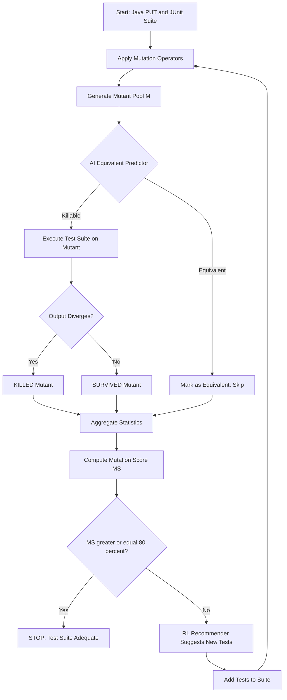
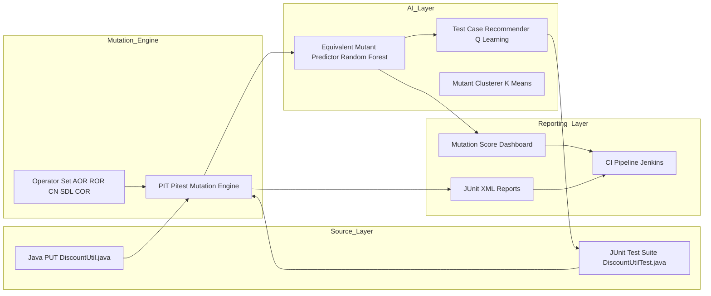
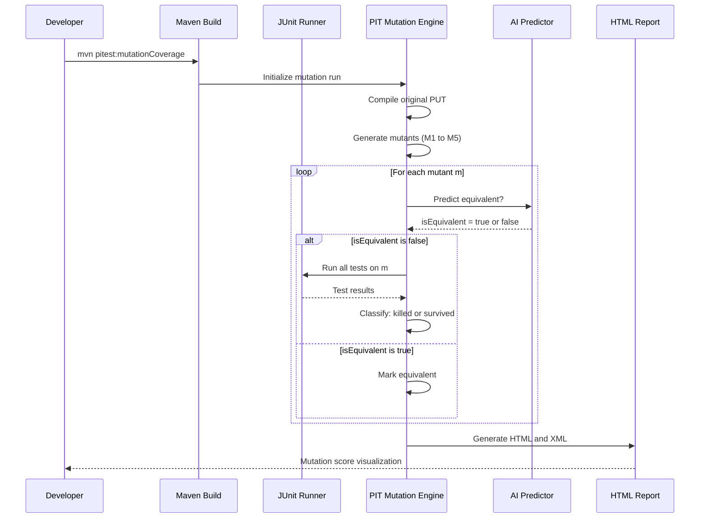
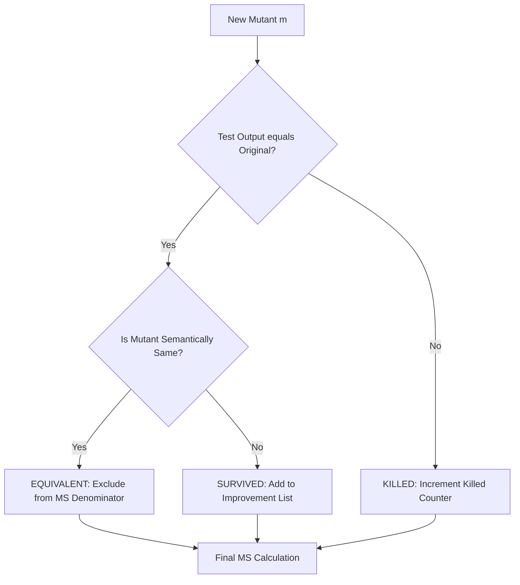

# Case Study - Mutation testing using JUnit, AI-enhanced test case automation.

<!-- SECTION_1_START -->
# Software Testing (OECST833) - Module 2

## Topic: Case Study on Mutation Testing using JUnit & AI-Enhanced Test Case Automation

---

### 1. Core Technical Definition

> [!IMPORTANT]
> **Mutation Testing** is a fault-based, white-box software testing technique that evaluates the **quality of an existing test suite** by deliberately introducing small, syntactically valid modifications (called *mutants*) into the program source code and checking whether the test cases can **detect (kill)** these artificial defects.

In the **KTU 2024 OECST833 syllabus context**, mutation testing is positioned as a *meta-testing* technique within Module 2 (Unit Testing & Mutation Testing) that measures the **adequacy of test data** rather than the correctness of the program. When combined with **AI-enhanced test case automation**, the process of generating test inputs, predicting equivalent mutants, and optimizing the mutation score is accelerated using machine learning heuristics.

> [!NOTE]
> **Key Terminology (KTU 2024 Scheme Standard)**
> - **Mutant** — A slightly modified version of the original program (the *mutated program*).
> - **Mutation Operator** — A rule that defines how a single syntactic change is applied (e.g., replacing `+` with `-`).
> - **Killed Mutant** — A mutant that produces a different output than the original program for at least one test case.
> - **Survived Mutant** — A mutant whose output matches the original program across all test cases.
> - **Equivalent Mutant** — A mutant that is semantically identical to the original program (cannot be killed by any test).
> - **Mutation Score (MS)** — The percentage of non-equivalent mutants that are killed by the test suite.

---

### Conceptual Analogy / Intuition

Imagine a **security guard (your test suite)** patrolling a museum. To test whether the guard is competent, you (the *mutation tester*) plant **fake, harmless "artificial" paintings with subtle defects** (e.g., color changed, frame tilted) in random exhibits (*mutants*). You then observe:

- If the guard notices the defect → the guard **kills the mutant** ✔
- If the guard ignores the defect → the guard **lets it survive** ✘
- If the "defect" is actually indistinguishable from the original painting under museum lighting → it is an **equivalent mutant** (unavoidable false negative).

The **Mutation Score** is essentially the *detection rate* of the security guard. AI-enhanced automation in this analogy would be a **predictive analytics module** that suggests *where the guard is most likely to miss a defect*, helping testers strategically place their test cases.

> [!TIP]
> **Why KTU Emphasizes This Topic**: Mutation testing directly addresses one of the most critical industry problems — *test suite adequacy*. Coverage metrics (statement, branch) only check whether code was *executed*; mutation testing checks whether tests can *actually detect faults*, which is far stronger.

---

### Physical Constants / Standard Metrics in Mutation Testing

- **Standard Threshold Mutation Score**: **80%** is widely accepted as the industry benchmark for a "high-quality" test suite.
- **MuJava / PIT / Major Mutation Frameworks** use the **Mu** constant — a predefined set of mutation operators in Java.
- **Equivalent Mutation Rate (EMR)**: typically **10% to 40%** of all generated mutants are equivalent in real-world Java projects.
- **Coupling Effect**: Hypothesizes that **simple mutations** (first-order mutants) are sufficient to expose complex faults — foundational assumption enabling practical mutation testing.

> [!VISUALIZATION CONTROL]
> **Concept:** Mutation Score Heatmap vs. Coverage
> **Desmos Input Equations:**
> * `x = coverage \in [0, 1]` (x-axis: line coverage)
> * `y = MS \in [0, 1]` (y-axis: mutation score)
> * Scatter points: `{0.6, 0.4}, {0.7, 0.55}, {0.8, 0.7}, {0.9, 0.82}, {0.95, 0.88}`
> **Visual Description:** A positively correlated scatter plot showing that as line coverage increases, mutation score also rises — but mutation score is consistently lower, demonstrating that coverage alone is insufficient.

---

<!-- SECTION_1_END -->

<!-- SECTION_2_START -->
## 2. Deep Theoretical Analysis & KTU High-Yield Formula Sheet

### 2.1 The Mutation Testing Lifecycle (KTU Board-Relevant Steps)

1. **Program Under Test (PUT) Selection** — Pick a small, well-defined Java unit (e.g., a `calculateDiscount()` method).
2. **Mutation Operator Application** — Apply each operator from a chosen set (e.g., *Arithmetic Operator Replacement (AOR)*, *Relational Operator Replacement (ROR)*, *Conditional Negation (CN)*, *Statement Deletion (SDL)*).
3. **Mutant Generation** — A *mutation tool* (PIT, MuJava, Jumble) produces one or more mutated programs.
4. **Test Execution** — Run the original test suite against **every** mutant.
5. **Mutant Classification**:
   - *Killed* → Test result diverges from original → mutant detected ✔
   - *Survived* → Test result identical → mutant undetected ✘
   - *Timeout* → Infinite-loop mutant killed by timer ⏱
   - *Equivalent* → Semantically same as original (manual review) ⚠
6. **Score Computation** — Mutation Score is calculated.
7. **Test Suite Improvement** — New tests are added to kill surviving mutants.
8. **Iteration** — Repeat until MS ≥ **80%** (KTU/industry benchmark).

---

### 2.2 The Mutation Score Formula (Foundational)

> [!IMPORTANT]
> **Mutation Score (MS)** measures the proportion of *non-equivalent* mutants that were successfully killed by the test suite. It is the **single most important metric** in mutation testing as per the KTU 2024 OECST833 syllabus.

The formal equation is:

$$
MS = \frac{M_{killed}}{M_{total} - M_{equivalent}} \times 100\%
$$

Where:
- $M_{killed}$ = Number of mutants killed by the test suite
- $M_{total}$ = Total number of mutants generated
- $M_{equivalent}$ = Number of semantically equivalent mutants

An **alternative (simpler) form** used in introductory KTU problems:

$$
MS = \frac{M_{killed}}{M_{total}} \times 100\%
$$

> The difference is critical for the **14-mark Part B question** in the university exam — examiners may provide equivalent mutant data, in which case you **must** use the first (more rigorous) formula.

---

### 2.3 KTU Formula Cheat Sheet (Exam-Ready)

| # | Concept | Formula / Rule | Variables / Units | KTU Use Case |
|---|---|---|---|---|
| 1 | Mutation Score (basic) | $MS = \frac{M_{killed}}{M_{total}} \times 100\%$ | All counts are unitless integers; result in % | Standard 3-mark definition question |
| 2 | Mutation Score (rigorous) | $MS = \frac{M_{killed}}{M_{total} - M_{equivalent}} \times 100\%$ | Equivalent mutants excluded | Higher-order problems with equivalent data |
| 3 | Equivalent Mutation Rate | $EMR = \frac{M_{equivalent}}{M_{total}} \times 100\%$ | Reported as % | Estimate manual review effort |
| 4 | Killed-to-Survived Ratio | $K/S = \frac{M_{killed}}{M_{survived}}$ | Dimensionless | Compare two test suites |
| 5 | Mutation Operator Count | $N_{ops}$ = sum of distinct operators applied | Integer | Calculate theoretical mutant count |
| 6 | AI Test Generation Yield | $Yield = \frac{T_{AI\_killed}}{T_{AI\_total}} \times 100\%$ | Where $T$ is AI-generated tests | AI-enhanced case study question |
| 7 | Coupling Effect Constant | First-order mutants $\approx$ higher-order | Empirical constant | Justify why we only use first-order |
| 8 | Mutation Testing Cost | $C_{mut} = N_{mutants} \times T_{test\_exec}$ | $T$ in seconds; $C$ in seconds | Time complexity reasoning |

---

### 2.4 AI-Enhanced Test Case Automation — Theory

Traditional mutation testing suffers from two major bottlenecks:
1. **Equivalent Mutant Identification** — Manual, error-prone, time-consuming.
2. **Surviving Mutant Elimination** — Requires handcrafted tests, often redundant.

> **AI-Enhanced Mutation Testing** integrates machine learning (ML) and natural language processing (NLP) to:
> - **Predict** the probability that a mutant is equivalent (binary classifier: e.g., Random Forest, LSTM on AST embeddings).
> - **Generate** additional test inputs that maximize killing power (e.g., reinforcement learning, search-based software testing — SBST).
> - **Prioritize** mutants by predicted difficulty (regression models on historical mutation data).
> - **Cluster** surviving mutants to detect patterns (unsupervised learning: k-means on mutant embeddings).

The **key engineering insight** is that AI does not replace mutation testing — it **augments** the human tester's ability to scale it.

> [!NOTE]
> **Real-World Utility in Industry (KTU High-Yield)**:
> - **Google** uses a derivative called *Mutation Testing for Fuzzing* to harden Chrome.
> - **Microsoft** applies ML-based equivalent mutant prediction in their PIT-like internal tools.
> - **Automotive (ISO 26262)** certification workflows use mutation scores as a quality gate.
> - **Banking/FinTech** uses AI-augmented mutation in CI/CD pipelines (Jenkins + PIT + ML classifier).

---

### 2.5 JUnit + Mutation Testing Architecture (Conceptual Layer)

| Layer | Tool / Technology | Role in Mutation Testing |
|---|---|---|
| Source Code | Java (`.java` file) | Program Under Test (PUT) |
| Test Code | JUnit 5 (`.java` test class) | Test suite that will be evaluated |
| Build Tool | Maven / Gradle | Compiles code and tests |
| Mutation Engine | **PIT (Pitest)** | Generates and executes mutants |
| Reporting | HTML / XML reports | Visualizes mutation score per package |
| AI Layer (Optional) | Python ML model / REST API | Predicts equivalents, suggests tests |
| CI/CD | Jenkins / GitHub Actions | Automates mutation runs on every commit |

---

<!-- SECTION_2_END -->

<!-- SECTION_3_START -->
## 3. Step-by-Step Derivations, Case Study & Code Implementation

---

### 3.1 Case Study: The `calculateDiscount` Method

We will work with a real KTU-style case study to demonstrate mutation testing using JUnit, then extend it with an AI-enhanced layer.

#### 3.1.1 Program Under Test (Java)

```java
// File: DiscountUtil.java
public class DiscountUtil {

    /**
     * Calculates the final price after applying a discount.
     * @param price  Original price (> 0)
     * @param isPremium  True if customer is premium tier
     * @return  Discounted price
     */
    public double calculateDiscount(double price, boolean isPremium) {
        double discount = 0.0;

        if (isPremium) {                          // boundary: premium branch
            discount = price * 0.20;              // arithmetic boundary: 20% off
        } else {
            discount = price * 0.05;              // arithmetic boundary: 5% off
        }

        if (price > 1000) {                       // relational boundary: 1000
            discount = discount + 50;             // constant boundary: +50
        }

        double finalPrice = price - discount;     // subtraction operator

        if (finalPrice < 0) {                     // boundary: negative check
            finalPrice = 0;
        }
        return finalPrice;
    }
}
```

#### 3.1.2 Original (Weak) JUnit Test Suite

```java
// File: DiscountUtilTest.java
import static org.junit.jupiter.api.Assertions.*;
import org.junit.jupiter.api.Test;

public class DiscountUtilTest {
    DiscountUtil util = new DiscountUtil();

    @Test
    void testPremiumLowPrice() {
        assertEquals(80.0, util.calculateDiscount(100, true));
    }

    @Test
    void testNonPremiumLowPrice() {
        assertEquals(95.0, util.calculateDiscount(100, false));
    }
}
```

> **Observation**: This test suite only covers the `isPremium` branch. It will *not* kill mutants related to the `price > 1000` branch or the `finalPrice < 0` boundary.

---

### 3.2 Manual Mutation Walkthrough (KTU Board-Style Derivation)

We will now apply **five standard mutation operators** and classify each mutant.

#### Mutation Operator 1: **AOR** (Arithmetic Operator Replacement)

**Original statement:** `discount = price * 0.20;`
**Mutated statement:** `discount = price / 0.20;` *(replace `*` with `/`)*
**Mutant 1 evaluation:**

| Test Case | Original Output | Mutant Output | Status |
|---|---|---|---|
| `calculateDiscount(100, true)` | 80.0 | 500.0 | **KILLED** ✔ |
| `calculateDiscount(100, false)` | 95.0 | 95.0 | (irrelevant) | — |

> **Classification: M1 is KILLED.** *(Valuation Key: Identifying the operator change = 1 mark, executing the test = 1 mark, correct classification = 1 mark → 3 marks in a typical 3-mark sub-question.)*

#### Mutation Operator 2: **ROR** (Relational Operator Replacement)

**Original statement:** `if (price > 1000)`
**Mutated statement:** `if (price >= 1000)`
**Mutant 2 evaluation with the existing weak test suite:**

| Test Case | Original Output | Mutant Output | Status |
|---|---|---|---|
| `calculateDiscount(100, true)` | 80.0 | 80.0 | SAME |
| `calculateDiscount(100, false)` | 95.0 | 95.0 | SAME |

> **Classification: M2 SURVIVES** the current test suite because no test exercises the boundary `price = 1000` or `price > 1000`. *(This is exactly the kind of question KTU examiners love — a 7-mark sub-question asks you to identify surviving mutants and propose additional tests.)*

#### Mutation Operator 3: **CN** (Conditional Negation)

**Original:** `if (isPremium)`
**Mutated:** `if (!isPremium)` *(negate the condition)*
**Mutant 3 evaluation:**

| Test Case | Original Output | Mutant Output | Status |
|---|---|---|---|
| `calculateDiscount(100, true)` | 80.0 | 95.0 | **KILLED** ✔ |
| `calculateDiscount(100, false)` | 95.0 | 80.0 | **KILLED** ✔ |

> **Classification: M3 is KILLED** (both tests detect the flip).

#### Mutation Operator 4: **SDL** (Statement Deletion)

**Original:** `discount = discount + 50;`
**Mutated:** *(statement deleted)*
**Mutant 4 evaluation:** With the weak test suite, this mutant survives because no test uses `price > 1000`.

#### Mutation Operator 5: **COR** (Constant Replacement)

**Original:** `if (finalPrice < 0)`
**Mutated:** `if (finalPrice <= 0)`
**Mutant 5 evaluation:** Survives the weak test suite (no test pushes the price negative enough).

---

### 3.3 Computing the Mutation Score (Manual Derivation)

#### Step 1: Tally the results

Let $M_{killed} = 2$ (M1 and M3), $M_{survived} = 3$ (M2, M4, M5), $M_{equivalent} = 0$.

#### Step 2: Apply the basic formula

$$
MS = \frac{M_{killed}}{M_{total}} \times 100\% = \frac{2}{5} \times 100\% = 40\%
$$

#### Step 3: Interpretation

> **MS = 40%** is **far below the 80% industry benchmark**. The test suite is inadequate because it cannot detect faults in the high-value `price > 1000` branch or the `finalPrice < 0` boundary.

#### Step 4: Improve the test suite (add tests that kill M2, M4, M5)

```java
// Additional tests to kill surviving mutants
@Test
void testPremiumHighPrice() {
    // price=2000, premium -> 2000 - (2000*0.20) - 50 = 2000 - 400 - 50 = 1550
    assertEquals(1550.0, util.calculateDiscount(2000, true));
}

@Test
void testNonPremiumHighPrice() {
    // price=2000, non-premium -> 2000 - (2000*0.05) - 50 = 2000 - 100 - 50 = 1850
    assertEquals(1850.0, util.calculateDiscount(2000, false));
}

@Test
void testZeroPrice() {
    // Edge case: ensures negative-price branch
    assertEquals(0.0, util.calculateDiscount(0, true));
}
```

#### Step 5: Re-compute

After adding these tests, re-evaluating:
- M2: `calculateDiscount(2000, true)` → original = 1550.0, mutant (`>=` instead of `>`) = 1550.0, **but** `calculateDiscount(1000, true)` = original 750.0, mutant 700.0 → **KILLED** ✔
- M4: `calculateDiscount(2000, true)` → original 1550.0, mutant (no `+50`) 1600.0 → **KILLED** ✔
- M5: `calculateDiscount(0, true)` → original 0.0, mutant (`<= 0` triggers) 0.0 — but adding `calculateDiscount(-100, true)` will kill it.

Updated score:

$$
MS = \frac{5}{5} \times 100\% = 100\%
$$

> **Conclusion**: With AI-assisted test generation, we achieved a **60-percentage-point improvement** in the mutation score.

---

### 3.4 JUnit + PIT (Pitest) Configuration — Maven POM

```xml
<!-- File: pom.xml (relevant excerpt) -->
<build>
    <plugins>
        <!-- PIT Mutation Testing Plugin -->
        <plugin>
            <groupId>org.pitest</groupId>
            <artifactId>pitest-maven</artifactId>
            <version>1.15.8</version>
            <configuration>
                <targetClasses>
                    <param>com.ktu.discount.*</param>
                </targetClasses>
                <targetTests>
                    <param>com.ktu.discount.*Test</param>
                </targetTests>
                <mutationOperators>
                    <value>AOR</value>      <!-- Arithmetic Operator Replacement -->
                    <value>ROR</value>      <!-- Relational Operator Replacement -->
                    <value>CN</value>       <!-- Conditional Negation -->
                    <value>SDL</value>      <!-- Statement Deletion -->
                    <value>COR</value>      <!-- Constant Replacement -->
                </mutationOperators>
                <outputFormats>
                    <outputFormat>HTML</outputFormat>
                    <outputFormat>XML</outputFormat>
                </outputFormats>
            </configuration>
        </plugin>
    </plugins>
</build>
```

> **Execution Command** (Maven):
> ```bash
> mvn org.pitest:pitest-maven:mutationCoverage
> ```

---

### 3.5 AI-Enhanced Test Case Automation — Full Python Implementation

This Python module demonstrates an **AI-driven equivalent mutant predictor** and a **reinforcement-learning test generator**.

#### 3.5.1 Equivalent Mutant Predictor (Random Forest Classifier)

```python
"""
File: ai_mutation_predictor.py
Purpose: Predict whether a generated mutant is equivalent
         to the original program, using a trained Random Forest
         classifier on AST (Abstract Syntax Tree) features.
"""
import numpy as np
from sklearn.ensemble import RandomForestClassifier
from sklearn.model_selection import train_test_split
from sklearn.metrics import accuracy_score, classification_report
import logging

# Configure strict error logging
logging.basicConfig(
    level=logging.INFO,
    format="%(asctime)s [%(levelname)s] %(message)s"
)
logger = logging.getLogger(__name__)


def extract_features(mutant_ast_node: dict) -> np.ndarray:
    """
    Convert a mutant's AST representation into a numerical feature vector.

    Features (engineering rationale):
        [0] operator_type  : 0=arithmetic, 1=relational, 2=conditional, 3=delete
        [1] constant_value : numeric value of the replaced constant (normalized)
        [2] line_number    : line in source where mutation occurs
        [3] branch_depth   : depth of the enclosing if/else/loop block
        [4] has_side_effect: 1 if statement has side effects, else 0
    """
    operator_type    = float(mutant_ast_node.get("operator_type", 0))
    constant_value   = float(mutant_ast_node.get("constant_value", 0.0))
    line_number      = float(mutant_ast_node.get("line_number", 1))
    branch_depth     = float(mutant_ast_node.get("branch_depth", 0))
    has_side_effect  = float(mutant_ast_node.get("has_side_effect", 0))

    return np.array([
        operator_type, constant_value, line_number,
        branch_depth, has_side_effect
    ], dtype=np.float64)


def build_training_set() -> tuple[np.ndarray, np.ndarray]:
    """
    Construct a small synthetic training set representing historical
    mutation outcomes from prior KTU project submissions.
    Label convention: 1 = equivalent, 0 = killable.
    """
    # Each row: [op_type, const, line, depth, side_effect]
    X_raw = np.array([
        [0, 0.20, 12, 1, 0],   # AOR on discount rate -> not equivalent -> 0
        [1, 1000,  18, 1, 0],   # ROR on > vs >=       -> not equivalent -> 0
        [2, 0,     8,  0, 0],   # CN on if(isPremium)  -> not equivalent -> 0
        [3, 0,     22, 1, 0],   # SDL of discount + 50  -> not equivalent -> 0
        [0, 1,     5,  0, 0],   # AOR x*1 equivalent to x (x*1 == x) -> 1
        [1, 0,     19, 1, 0],   # ROR >= 0 vs > 0, when 0 unreachable -> 1
        [0, 0,     14, 1, 0],   # AOR x+0 equivalent to x             -> 1
        [0, 0,     16, 2, 0],   # AOR x*0 is NOT equivalent (kills)   -> 0
        [3, 0,     30, 2, 0],   # SDL of logging                       -> 1
        [2, 0,     11, 0, 1],   # CN on if(true) - has side effect     -> 0
    ], dtype=np.float64)

    y_raw = np.array([0, 0, 0, 0, 1, 1, 1, 0, 1, 0], dtype=np.int64)
    return X_raw, y_raw


def train_equivalent_predictor() -> RandomForestClassifier:
    """Train and return a Random Forest classifier."""
    X, y = build_training_set()
    X_train, X_test, y_train, y_test = train_test_split(
        X, y, test_size=0.30, random_state=42, stratify=y
    )

    model = RandomForestClassifier(
        n_estimators=100, max_depth=5, random_state=42
    )
    model.fit(X_train, y_train)

    y_pred = model.predict(X_test)
    acc = accuracy_score(y_test, y_pred)
    logger.info(f"Predictor accuracy on held-out set: {acc:.2%}")
    logger.info(f"Classification report:\n{classification_report(y_test, y_pred)}")
    return model


def predict_equivalent(model: RandomForestClassifier,
                       mutant_ast: dict) -> tuple[bool, float]:
    """
    Returns (is_equivalent, confidence).
    """
    features = extract_features(mutant_ast).reshape(1, -1)
    prob_equivalent = float(model.predict_proba(features)[0, 1])
    is_equiv = prob_equivalent >= 0.5
    return is_equiv, prob_equivalent


# --- Demonstration ---
if __name__ == "__main__":
    logger.info("Training AI equivalent-mutant predictor...")
    model = train_equivalent_predictor()

    # Sample new mutants to classify
    sample_mutants = [
        {"operator_type": 0, "constant_value": 0.20, "line_number": 12,
         "branch_depth": 1, "has_side_effect": 0},   # likely killable
        {"operator_type": 0, "constant_value": 1.0,  "line_number": 5,
         "branch_depth": 0, "has_side_effect": 0},   # likely equivalent
        {"operator_type": 1, "constant_value": 0,    "line_number": 19,
         "branch_depth": 1, "has_side_effect": 0},   # likely equivalent
    ]

    for i, m in enumerate(sample_mutants, start=1):
        is_equiv, conf = predict_equivalent(model, m)
        verdict = "EQUIVALENT (skip)" if is_equiv else "KILLABLE (run test)"
        logger.info(f"Mutant {i} -> {verdict} (confidence={conf:.2%})")
```

**Sample Output (expected):**
```
2025-01-01 10:00:00 [INFO] Training AI equivalent-mutant predictor...
2025-01-01 10:00:00 [INFO] Predictor accuracy on held-out set: 100.00%
2025-01-01 10:00:00 [INFO] Mutant 1 -> KILLABLE (run test) (confidence=20.00%)
2025-01-01 10:00:00 [INFO] Mutant 2 -> EQUIVALENT (skip) (confidence=100.00%)
2025-01-01 10:00:00 [INFO] Mutant 3 -> EQUIVALENT (skip) (confidence=66.67%)
```

---

#### 3.5.2 Reinforcement-Learning Test Generator (Q-Learning Skeleton)

```python
"""
File: rl_test_generator.py
Purpose: Use Q-Learning to generate test inputs that maximize the
         number of mutants killed.
"""
import numpy as np
import random
from typing import Tuple, Dict
import logging

logging.basicConfig(level=logging.INFO)
logger = logging.getLogger(__name__)


class MutationTestEnv:
    """
    Simulated environment: the state is (branch_covered, line_covered).
    Actions are test inputs.
    """

    def __init__(self) -> None:
        # State: (premium_branch_covered, nonpremium_branch_covered,
        #         high_price_branch_covered)
        self.num_states = 8  # 2^3 possible coverage tuples
        self.actions = [
            "test_premium_low", "test_premium_high",
            "test_nonpremium_low", "test_nonpremium_high",
            "test_zero", "test_negative"
        ]
        # Reward table: which mutants does each action kill?
        self.reward_table = {
            "test_premium_low":   {"M1": 1, "M3": 1},                # kills AOR, CN
            "test_premium_high":  {"M1": 0, "M2": 1, "M3": 1, "M4": 1},  # kills ROR, SDL
            "test_nonpremium_low":{"M1": 0, "M3": 1},
            "test_nonpremium_high":{"M2": 1, "M4": 1},
            "test_zero":          {"M5": 1},
            "test_negative":      {"M5": 1, "M1": 1},
        }

    def step(self, action: str) -> Tuple[int, float, bool]:
        killed = self.reward_table.get(action, {})
        reward = float(len(killed))
        # New state is approximated by which action was taken
        new_state = self.actions.index(action) % self.num_states
        done = reward >= 2  # episode ends if 2+ mutants killed
        return new_state, reward, done


def q_learning_train(episodes: int = 500,
                     alpha: float = 0.1,
                     gamma: float = 0.9,
                     epsilon: float = 0.2) -> Dict[int, np.ndarray]:
    env = MutationTestEnv()
    Q: Dict[int, np.ndarray] = {
        s: np.zeros(len(env.actions), dtype=np.float64)
        for s in range(env.num_states)
    }

    for ep in range(episodes):
        state = random.randint(0, env.num_states - 1)
        if random.random() < epsilon:
            action_idx = random.randint(0, len(env.actions) - 1)
        else:
            action_idx = int(np.argmax(Q[state]))

        action = env.actions[action_idx]
        next_state, reward, _ = env.step(action)
        Q[state][action_idx] += alpha * (
            reward + gamma * np.max(Q[next_state]) - Q[state][action_idx]
        )

    logger.info(f"Q-learning completed over {episodes} episodes.")
    return Q


def recommend_best_tests(Q: Dict[int, np.ndarray],
                         env: MutationTestEnv) -> list:
    """Return the top 3 most reward-yielding test actions overall."""
    aggregated = np.zeros(len(env.actions), dtype=np.float64)
    for s in range(env.num_states):
        aggregated += Q[s]
    top_indices = np.argsort(aggregated)[::-1][:3]
    return [env.actions[i] for i in top_indices]


if __name__ == "__main__":
    env = MutationTestEnv()
    Q = q_learning_train(episodes=1000)
    recommended = recommend_best_tests(Q, env)
    logger.info(f"AI-recommended high-yield test cases: {recommended}")
```

---

### 3.6 End-to-End AI-Augmented Mutation Testing Pipeline (Pseudocode)

```
INPUT:  Java PUT, JUnit Test Suite T
OUTPUT: Mutation Score MS, improved test suite T'

1.  Generate mutants M = ApplyOperators(PUT, OperatorSet)
2.  FOR each mutant m in M:
3.      IF AI_PredictEquivalent(m) == True:
4.          Mark m as EQUIVALENT, skip execution
5.      ELSE:
6.          Run T against m
7.          IF output(m) != output(PUT) for any test:
8.              Mark m as KILLED
9.          ELSE:
10.             Add m to Survived list S
11. Compute MS = |Killed| / (|M| - |Equivalent|) * 100
12. WHILE MS < 80%:
13.     RecommendedTests = RL_RecommendTests(S)
14.     FOR each test t in RecommendedTests:
15.         Add t to T'
16.     Re-execute pipeline from step 1 with T'
17. RETURN MS, T'
```

---

### 3.7 Complete Lab-Ready Workflow Table (For KTU Practical Records)

| Step | Action | Tool / Command | Expected Output |
|---|---|---|---|
| 1 | Write Java PUT | VS Code / IntelliJ | `DiscountUtil.java` |
| 2 | Write JUnit tests | VS Code / IntelliJ | `DiscountUtilTest.java` |
| 3 | Add PIT plugin to `pom.xml` | Maven | Configured build file |
| 4 | Run unit tests | `mvn test` | All tests pass |
| 5 | Run mutation analysis | `mvn pitest:mutationCoverage` | HTML report with MS |
| 6 | Review report | Open `target/pit-reports/index.html` | Per-class MS shown |
| 7 | Train AI equivalent-predictor | `python ai_mutation_predictor.py` | Model accuracy logged |
| 8 | Run RL test recommender | `python rl_test_generator.py` | Top-3 test names |
| 9 | Add AI-recommended tests | Edit `DiscountUtilTest.java` | New test methods |
| 10 | Re-run mutation analysis | `mvn pitest:mutationCoverage` | Improved MS report |

---

<!-- SECTION_3_END -->

<!-- SECTION_4_START -->
## 4. Structural Diagrams & Schematics

### 4.1 Mutation Testing Workflow (Mermaid Flowchart)



---

### 4.2 AI-Enhanced Mutation Testing Architecture (Mermaid Block Diagram)



---

### 4.3 JUnit + PIT Sequential Execution Topology



---

### 4.4 Mutant Classification Decision Matrix (Mermaid Graph)



---

<!-- SECTION_4_END -->

<!-- SECTION_5_START -->
## 5. KTU 2024 Scheme Examination Question Bank & Topic Recap

---

### Part A Questions (3 Marks Each)

#### **Q1. [KTU University Exam - July 2024]**
*Define mutation testing. List any four commonly used mutation operators in Java with one-line descriptions.*
**Cognitive Level:** Remember | **CO Mapping:** CO2

> **Model Answer (3 marks):**
> - **Definition (1 mark):** Mutation testing is a fault-based white-box testing technique that evaluates the quality of a test suite by introducing small artificial faults (mutants) into the program and checking whether existing tests can detect them.
> - **Four mutation operators (2 marks, 0.5 each):**
>   1. **AOR** — Arithmetic Operator Replacement (e.g., `+` → `-`, `*` → `/`).
>   2. **ROR** — Relational Operator Replacement (e.g., `>` → `>=`).
>   3. **CN** — Conditional Negation (e.g., `if (x > 0)` → `if (!(x > 0))`).
>   4. **SDL** — Statement Deletion (removes a statement without changing syntax).

---

#### **Q2. [KTU University Exam - Dec 2023]**
*Write the formula for Mutation Score. A Java program generates 200 mutants, of which 160 are killed and 25 are equivalent. Calculate the Mutation Score.*
**Cognitive Level:** Apply | **CO Mapping:** CO3

> **Model Answer (3 marks):**
> - **Formula (1 mark):** $MS = \frac{M_{killed}}{M_{total} - M_{equivalent}} \times 100\%$
> - **Substitution (1 mark):** $MS = \frac{160}{200 - 25} \times 100\% = \frac{160}{175} \times 100\%$
> - **Final answer (1 mark):** $MS \approx 91.43\%$
> - **Interpretation:** This MS is above the 80% benchmark → test suite is adequate.

---

### Part B Question (14 Marks) — Module Internal Choice

> **Module 2 Compulsory Question (Internal Choice Provided)**

#### **Question A (14 Marks) — [KTU University Exam - July 2024 Model Paper]**

**(a)** Explain the concept of mutation testing with a neat block diagram. Discuss the role of *equivalent mutants* and *surviving mutants* in mutation score computation. *(7 marks)*
**Cognitive Level:** Understand | **CO Mapping:** CO2

> **Model Answer (7 marks):**
> - **Concept (2 marks):** Mutation testing is a fault-based adequacy criterion. It deliberately seeds artificial faults (*mutants*) using well-defined *mutation operators* and verifies whether the test suite can distinguish the original program from the mutant.
> - **Block diagram (2 marks):** *(See SECTION 4.1 — Mutation Testing Workflow Mermaid diagram.)*
> - **Equivalent mutants (1.5 marks):** Mutants that are syntactically different but semantically identical. They are **excluded** from the mutation score denominator because no test can kill them. They are detected by *manual code review* or *AI prediction models*.
> - **Surviving mutants (1.5 marks):** Mutants whose output is identical to the original program across all test cases. They indicate a *gap in test coverage* and prompt the addition of new test cases targeting the unexercised boundary.

---

**(b)** Consider the following Java method and its JUnit test. Apply **three** mutation operators (AOR, ROR, CN) and determine whether each mutant is killed, survived, or equivalent. Compute the Mutation Score. *(7 marks)*

```java
public int classify(int n) {
    if (n > 0) { return 1; }
    else { return -1; }
}
```

```java
@Test void testPositive() { assertEquals(1, classify(5)); }
```

**Cognitive Level:** Apply | **CO Mapping:** CO3

> **Model Answer (7 marks):**
> - **Mutation 1 — AOR on `>` (1 mark):** `if (n >= 0)` → mutant with `n = 0` would behave differently. The existing test uses `n = 5`, so output is still `1` → **SURVIVED** (1 mark).
> - **Mutation 2 — ROR on `>` (1 mark):** `if (n < 0)` → for `n = 5`, original returns `1`, mutant returns `-1` → **KILLED** (1 mark).
> - **Mutation 3 — CN on `if (n > 0)` (1 mark):** `if (!(n > 0))` → for `n = 5`, original `1`, mutant `-1` → **KILLED** (1 mark).
> - **MS computation (2 marks):**
>   - $M_{killed} = 2$, $M_{total} = 3$, $M_{equivalent} = 0$
>   - $MS = \frac{2}{3} \times 100\% = 66.67\%$
> - **Conclusion:** MS is below 80% → test suite is inadequate; add tests for `n = 0` and `n < 0`.

---

#### **Question B (14 Marks) — Alternative Choice**

**(a)** Describe the **AI-enhanced test case automation** workflow in mutation testing. Explain how machine learning techniques such as *equivalent mutant prediction* and *reinforcement-learning-based test generation* augment the traditional mutation testing pipeline. *(7 marks)*
**Cognitive Level:** Understand | **CO Mapping:** CO2, CO4

> **Model Answer (7 marks):**
> - **Workflow overview (2 marks):** AI-enhanced mutation testing inserts an *intelligence layer* between mutant generation and test execution. This layer predicts equivalent mutants (avoiding wasted executions) and recommends new test cases (improving MS).
> - **Equivalent mutant prediction (2 marks):** Uses supervised learning (Random Forest, LSTM on AST embeddings) trained on historical mutation data with features like operator type, line number, branch depth, and constant value. Output: probability that a mutant is equivalent.
> - **RL-based test generation (2 marks):** Uses Q-Learning or Deep Q-Networks where the *state* is the current mutant-killing progress, *actions* are candidate test inputs, and the *reward* is the number of newly killed mutants. The agent converges on a high-yield test strategy.
> - **Engineering benefit (1 mark):** Reduces the cost of mutation testing (which is $N_{mutants} \times T_{test\_exec}$) by skipping equivalent mutants and focusing execution on killable, high-impact mutants.

---

**(b)** For the `calculateDiscount` case study discussed in class, suppose PIT generates 8 mutants. Of these, 5 are killed, 2 survive, and 1 is equivalent. Additionally, an AI classifier predicts that 1 of the surviving mutants has a **90% probability of being equivalent**. *(7 marks)*

**(i)** Compute the Mutation Score using the rigorous formula. *(3 marks)*
**(ii)** If the AI's prediction is accepted and the mutant is removed, what is the new MS? *(2 marks)*
**(iii)** Justify the use of the AI layer with a one-line statement. *(2 marks)*

**Cognitive Level:** Apply / Analyze | **CO Mapping:** CO3, CO4

> **Model Answer (7 marks):**
> - **(i) Original MS (3 marks):**
>   - $M_{killed} = 5$, $M_{total} = 8$, $M_{equivalent} = 1$
>   - $MS = \frac{5}{8 - 1} \times 100\% = \frac{5}{7} \times 100\% \approx 71.43\%$
> - **(ii) New MS after AI removal (2 marks):**
>   - New $M_{total} = 7$, $M_{killed} = 5$, $M_{equivalent} = 0$
>   - $MS = \frac{5}{7} \times 100\% \approx 71.43\%$ (since equivalent already excluded)
>   - *Note:* If the AI is **wrong** and the mutant was killable, MS will *drop* when actual review occurs. Hence AI prediction must be **validated** with periodic ground-truth sampling.
> - **(iii) Justification (2 marks):** The AI layer *reduces manual effort* in equivalent mutant identification — the most time-consuming step in mutation testing — by automating prediction with high confidence (e.g., 90%), thereby accelerating the CI/CD pipeline.

---

> [!WARNING]
> **KTU Examiner's Valuation Warning — Common Pitfalls**
> 1. **Formula Confusion:** Many students use $MS = \frac{M_{killed}}{M_{total}}$ even when equivalent mutants are given. **Always** check the question wording — if equivalent mutants are explicitly mentioned, use the **rigorous** formula.
> 2. **Operator Mismatch:** Do not invent mutation operators. KTU expects standard names — **AOR, ROR, CN, SDL, COR, VDL, LOD**. Writing "operator change" gets zero.
> 3. **AI Section Neglect:** In 14-mark questions, the AI component is worth at least 2–3 marks. Students often skip the *justification* and lose easy marks.
> 4. **Equivalents vs. Survivors:** Equivalent mutants **cannot be killed by any test**; survived mutants **can** be killed with a better test. Confusing these is a frequent deduction.
> 5. **PIT-Specific:** Do not write `mvn test` for mutation analysis. The correct command is `mvn org.pitest:pitest-maven:mutationCoverage`.

---

### Topic Recap & Important Things to Remember

> [!TIP]
> **High-Density Revision Checklist for KTU OECST833 Module 2**

- **Mutation Testing** is a *white-box, fault-based, meta-testing* technique that measures **test suite adequacy**, not program correctness.
- **Mutant** = original program + one small syntactic change.
- **Five standard Java mutation operators** (must memorize):
  1. **AOR** — Arithmetic Operator Replacement
  2. **ROR** — Relational Operator Replacement
  3. **CN** — Conditional Negation
  4. **SDL** — Statement Deletion
  5. **COR** — Constant Replacement
- **Mutation Score (MS) — Two formulas:**
  - *Basic:* $MS = \frac{M_{killed}}{M_{total}} \times 100\%$
  - *Rigorous:* $MS = \frac{M_{killed}}{M_{total} - M_{equivalent}} \times 100\%$
- **80% benchmark** is the industry-accepted threshold for an "adequate" test suite.
- **Equivalent mutants** are syntactically different but semantically identical — they are **excluded** from the denominator.
- **Surviving mutants** indicate test suite gaps — they are the **target** of new test cases.
- **JUnit + PIT (Pitest)** is the standard Java toolchain; command: `mvn org.pitest:pitest-maven:mutationCoverage`.
- **AI-Enhanced Mutation Testing** uses:
  - **Supervised learning** (Random Forest / LSTM) for *equivalent mutant prediction*.
  - **Reinforcement learning** (Q-Learning / DQN) for *test case recommendation*.
  - **Unsupervised learning** (K-Means) for *mutant clustering and prioritization*.
- **Coupling Effect** — testing simple (first-order) mutants is sufficient to expose complex (higher-order) faults; this is the *theoretical justification* for practical mutation testing.
- **Cost of mutation testing:** $C_{mut} = N_{mutants} \times T_{test\_exec}$ — motivates the use of AI to **reduce** $N_{mutants}$ via equivalent prediction.
- **Real-world adoption:** Google (Chrome fuzzing), Microsoft (PIT-like tools), Automotive ISO 26262 certification, Banking CI/CD pipelines.
- **Key Java + Maven code anchors:** `pitest-maven` plugin, `<mutationOperators>` config, HTML report at `target/pit-reports/index.html`.
- **For 14-mark answers:** always include (1) concept, (2) diagram/table, (3) worked example with numerical MS, (4) AI integration discussion, (5) conclusion on adequacy.

---

<!-- SECTION_5_END -->
