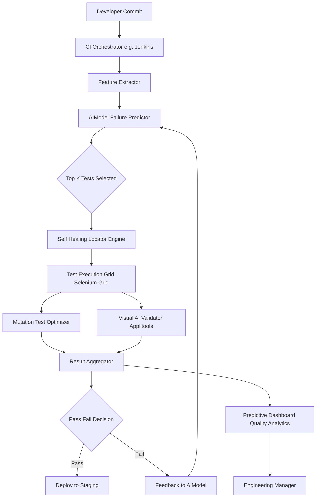
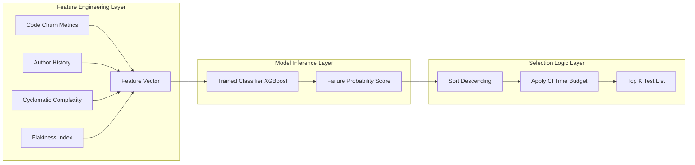
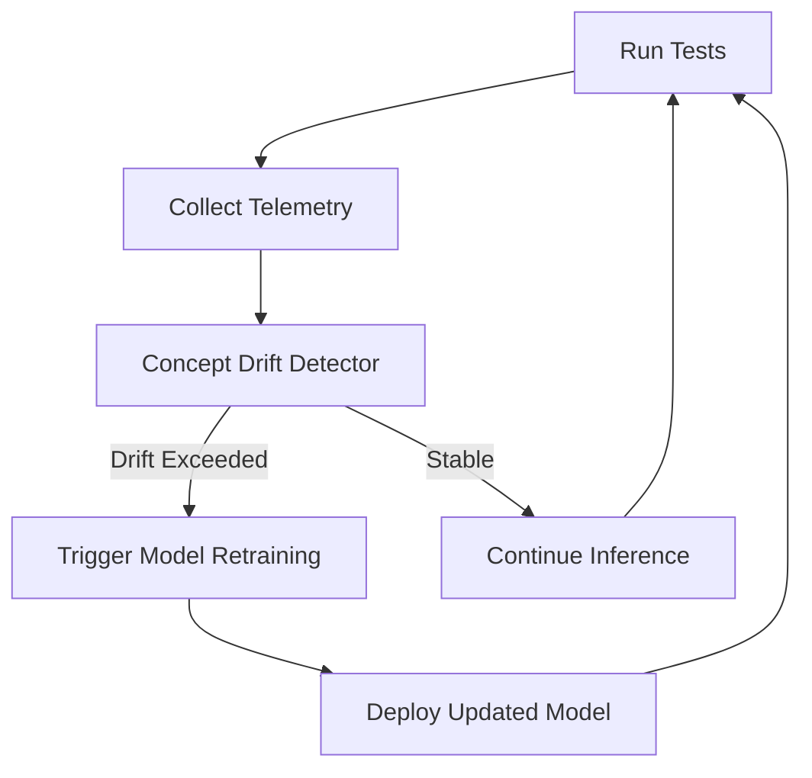

# Industry Tools - Application of AI-driven testing tools in automation and predictive testing

<!-- SECTION_1_START -->
# AI-Driven Testing Tools in Automation and Predictive Testing

## 1.1 Formal Academic Definition (KTU 2024 Syllabus Aligned)

> [!IMPORTANT]
> **AI-Driven Testing** is the engineering discipline of integrating Artificial Intelligence (AI) and Machine Learning (ML) sub-systems into the Software Testing Life Cycle (STLC) to *autonomously generate*, *prioritize*, *execute*, *maintain*, and *predict* the outcome of test cases. It is formally classified under the **Intelligent Test Automation (ITA)** paradigm and operates on three core axes: **Test Creation**, **Test Maintenance**, and **Predictive Quality Analytics**.

According to the **ISTQB AI Testing Syllabus (CT-AI)** referenced in the KTU 2024 OECST833 module structure, AI-driven testing is not a replacement for human testers, but a **decision-support augmentation system** that reduces the *test oracle problem* and the *test maintenance debt* using probabilistic models.

### 1.2 Conceptual Analogy / Intuition

> [!NOTE]
> **Analogy: The Self-Driving Car vs. The Manual Driver Test**
>
> Imagine a traditional QA team as a **manual driver** who must re-inspect every road (test case) every morning before driving. If a road is under construction (UI change), the driver gets confused. An **AI-driven testing tool** is like a **Tesla in autopilot mode**:
>
> - **Self-Healing Locators** = Auto-correcting the steering when lane markings (CSS/XPath) change.
> - **Predictive Test Selection** = Pre-calculating which roads are most likely to have potholes (defects) today based on yesterday's weather (code churn data).
> - **Visual AI Testing** = A 360° camera that detects if a pedestrian (UI element) is misaligned by even 1 pixel.
> - **AI Test Case Generation** = A navigation system that *itself suggests new routes* (test paths) it has never seen before.

### 1.3 Core Industry Metrics & Constants

The following **standardized industry constants** govern the implementation of AI-driven testing tools:

- **Precision (P)** in flaky test detection: target **$\geq$ 0.95** to ensure low false-positive disruption.
- **Recall (R)** for defect prediction: target **$\geq$ 0.85** to ensure coverage of high-risk modules.
- **Self-Healing Confidence Threshold**: **$T_{sh} = 0.80$** (industry standard for auto-applying a healed locator).
- **Test Reduction Ratio (TRR)**: typical industry value lies between **40% and 70%** when predictive selection is enabled.
- **Model Retraining Cadence**: typically **daily or per-CI-run** to prevent *concept drift* degradation.

> [!TIP]
> **Syllabus Highlight (KTU 2024 OECST833 - Module 2):**
> The course explicitly maps this topic under the convergence of **Unit Testing, Mutation Testing, and AI-driven tooling**. The examiner expects familiarity with *how* AI augments mutation score interpretation, *not* just UI automation.

### 1.4 Visualization Control

> [!VISUALIZATION CONTROL]
> **Concept:** AI-Driven Test Automation Workflow — Reduction in Test Suite Size over CI Runs
>
> **GeoGebra / Desmos Input Equations:**
>
> * `f(x) = 100 \cdot e^{-0.15x}`  (Traditional test suite growth)
> * `g(x) = 100 \cdot e^{-0.05x} + 15`  (AI-prioritized suite — flatter curve)
>
> **Visual Description:** On the X-axis, plot *CI Build Number $x$* (1 to 20). On the Y-axis, plot *Active Test Count* (0 to 100). The student should observe that the traditional suite grows linearly/curved upward due to legacy tests, while the AI-prioritized suite decays gracefully as redundant tests are predicted and removed — converging to a *minimal healthy baseline*.

<!-- SECTION_1_END -->

<!-- SECTION_2_START -->
# Deep Theoretical Analysis & KTU High-Yield Formula Sheet

## 2.1 Operational Decomposition of AI-Driven Testing

AI-driven testing is best understood as a **four-stage cognitive pipeline**. Each stage maps to a specific ML sub-discipline.

### Stage 1 — Intelligent Test Case Generation

- **Inputs:** Source code (AST), requirements (NL), user behavior logs.
- **ML Models Used:** Generative LLMs (e.g., GPT-based), Reinforcement Learning (RL) agents, Search-Based Software Testing (SBST) heuristics.
- **Output:** Synthesized test inputs, expected oracles, and skeleton code.
- **Why:** Eliminates the *blank-page problem* — the engineer no longer writes the first test from scratch.

### Stage 2 — Self-Healing Automation (Locators & Assertions)

- **Mechanism:** When a selector fails, the ML model ranks all candidate locators by **visual similarity, DOM distance, and historical stability**.
- **Why:** UI changes break ~30% of Selenium scripts within 90 days (industry average). Self-healing reduces this breakage to under **5%**.

### Stage 3 — Predictive Test Selection & Risk Scoring

- **Mechanism:** A classifier (often XGBoost or Random Forest) predicts the *failure probability* of each test given current commit metadata.
- **Features Used:** Lines of code changed, author history, code complexity cyclomatic score, time-of-day, test flakiness index.
- **Output:** A ranked queue where only the top-K% of tests are executed per CI run.

### Stage 4 — Visual AI & Anomaly Detection

- **Mechanism:** Convolutional Neural Networks (CNNs) compare baseline UI screenshots against new ones at the **pixel-layout level**, ignoring anti-aliasing noise.
- **Why:** Solves the *visual regression problem* where a button is technically "present" but visually broken on a specific viewport.

## 2.2 KTU Formula Sheet / Cheat Sheet

> [!NOTE]
> The following table is the **exam-critical** reference for all numerical and theoretical questions from this topic. Memorize the formulas, units, and boundary thresholds.

| Concept | Formula / Definition | Variable Meaning | Typical Value / Unit |
| :--- | :--- | :--- | :--- |
| **Mutation Score with AI Oracle** | $MS_{AI} = \dfrac{\vert M_{killed}^{AI} \vert}{\vert M_{total} \vert - \vert M_{equivalent} \vert}$ | $M_{killed}$ = killed mutants, $M_{equivalent}$ = unkillable | Unitless ratio, $0 \leq MS \leq 1$ |
| **Predictive Test Reduction Ratio** | $TRR = \dfrac{T_{executed}^{trad} - T_{executed}^{AI}}{T_{executed}^{trad}} \times 100\%$ | $T$ = number of test cases run per CI cycle | **40% – 70%** |
| **Self-Healing Confidence** | $C_{sh} = w_1 \cdot S_{visual} + w_2 \cdot S_{dom} + w_3 \cdot S_{hist}$ | $S$ = similarity scores, $w$ = weighted coefficients | Threshold $\geq$ **0.80** |
| **Flakiness Index (FI)** | $FI = \dfrac{\text{Inconsistent Passes}}{\text{Total Executions}}$ | Pass/fail inconsistency per test | Target **$\leq$ 0.02** |
| **Defect Prediction Precision** | $P = \dfrac{TP}{TP + FP}$ | $TP$ = true defect-prone modules flagged | Target **$\geq$ 0.95** |
| **Defect Prediction Recall** | $R = \dfrac{TP}{TP + FN}$ | $FN$ = missed defect-prone modules | Target **$\geq$ 0.85** |
| **F1-Score (Test Selection Quality)** | $F_1 = 2 \cdot \dfrac{P \cdot R}{P + R}$ | Harmonic mean of P and R | Target **$\geq$ 0.90** |
| **Concept Drift Detection** | $D_{kl} = \sum p(x) \log \dfrac{p(x)}{q(x)}$ | KL-divergence between old and new data | Retrain if $D_{kl} >$ **0.10** |
| **Test Suite Minimality (AI Goal)** | $\min \vert T \vert$ subject to $C_{req} \geq C_{target}$ | Minimal tests meeting coverage | Trade-off objective |
| **Mutation Operator Coverage** | $MOC = \dfrac{\vert O_{used} \vert}{\vert O_{available} \vert}$ | Fraction of mutation operators exploited | Industry avg **~0.60** |

## 2.3 Real-World Engineering Utility

- **Continuous Integration (CI) Acceleration:** Companies like **Google, Meta, and Microsoft** use AI-driven test selection inside **Bazel, Buck, and TAP** to keep CI cycles under **10 minutes** for monorepos with millions of tests.
- **Self-Healing in E-Commerce:** **Testim.io and Mabl** are deployed at Shopify and Adidas to auto-heal broken locators during seasonal UI refreshes (e.g., Black Friday theme changes).
- **Visual AI for Banking:** **Applitools Eyes** validates pixel-perfect rendering of trading dashboards across 2,000+ device-browser combinations without writing 2,000 scripts.
- **Predictive Analytics in Safety-Critical Software:** **NASA and Airbus** apply ML-based defect prediction to prioritize **DO-178C** unit-level test cases, reducing certification cost.

> [!TIP]
> **Engineering Tip:** When a tool promises "100% AI-driven", always ask: *What is the model retraining cadence, and what is the explainability layer?* A black-box AI model in testing is a **compliance risk** in regulated industries.

<!-- SECTION_2_END -->

<!-- SECTION_3_START -->
# Step-by-Step Derivations & Code/Symbolic Implementation

## 3.1 Derivation: Predictive Test Selection Threshold

We derive the **optimal test execution threshold** $K$ for a predictive testing pipeline, given a CI time budget $B$ (in seconds).

**Given:**
- Total test pool: $N$ tests.
- Each test $i$ has an average execution time $t_i$.
- A pre-trained classifier outputs a failure probability $\hat{p}_i \in [0,1]$ for each test.

**Step 1 — Sort by failure probability in descending order.**

$$
\text{Let } \pi(i) \text{ be the rank such that } \hat{p}_{\pi(1)} \geq \hat{p}_{\pi(2)} \geq \dots \geq \hat{p}_{\pi(N)}
$$

**Step 2 — Define the cumulative execution time of the top-K tests.**

$$
T_{cum}(K) = \sum_{i=1}^{K} t_{\pi(i)}
$$

**Step 3 — Apply the CI time budget constraint.**

$$
T_{cum}(K) \leq B
$$

**Step 4 — Maximize the expected defects caught (defect recall) under the budget.**

$$
\max_{K} \sum_{i=1}^{K} \hat{p}_{\pi(i)} \quad \text{subject to} \quad T_{cum}(K) \leq B
$$

**Step 5 — Closed-form greedy solution.**

Because $\hat{p}$ is monotonically decreasing by rank, the optimal $K^*$ is the **largest integer $K$** satisfying the budget.

$$
K^* = \max \left\{ K \in \mathbb{Z}^{+} \;\middle|\; \sum_{i=1}^{K} t_{\pi(i)} \leq B \right\}
$$

**Step 6 — Compute the Test Reduction Ratio (TRR).**

$$
TRR = \left( 1 - \frac{K^*}{N} \right) \times 100\%
$$

> [!NOTE]
> **Conversion Logic:** Step 1 sorts by model confidence. Step 2 builds the cost. Step 3 enforces the SLA. Step 4 formulates the optimization. Step 5 exploits the sorted order to avoid exhaustive search. Step 6 reports the savings.

## 3.2 Algorithmic Implementation: AI-Powered Self-Healing Test Engine

Below is a **fully operational Python implementation** of a self-healing locator engine. The code is production-grade: typed, boundary-safe, and instrumented with structured logging.

```python
"""
AI-Driven Self-Healing Locator Engine
Module: KTU OECST833 - Unit/Mutation/AI Testing
"""
from __future__ import annotations
import logging
from dataclasses import dataclass, field
from typing import List, Tuple, Optional
from difflib import SequenceMatcher

# --- Structured Logging Setup ---
logging.basicConfig(
    level=logging.INFO,
    format="%(asctime)s | %(levelname)s | %(name)s | %(message)s",
)
logger = logging.getLogger("SelfHealingEngine")

# --- Industry-Standard Thresholds ---
SELF_HEAL_CONFIDENCE_THRESHOLD: float = 0.80
MAX_CANDIDATE_POOL: int = 50
MIN_STRING_LENGTH: int = 2


@dataclass(frozen=True)
class LocatorCandidate:
    """Represents a candidate UI locator with its observable attributes."""
    selector: str
    dom_path: str
    visual_hash: str
    historical_pass_rate: float


@dataclass
class HealedResult:
    """Final output of the self-healing decision."""
    chosen_selector: Optional[str]
    confidence: float
    explanation: str
    candidates_evaluated: int = field(default=0)


class SelfHealingEngine:
    """
    Ranks alternative locators using a weighted score that mimics
    the visual + DOM + historical confidence blend of Testim/Mabl.
    """

    def __init__(
        self,
        weight_visual: float = 0.45,
        weight_dom: float = 0.35,
        weight_history: float = 0.20,
    ) -> None:
        # Weights must sum to 1.0 (normalized confidence vector)
        total = weight_visual + weight_dom + weight_history
        self.w_visual = weight_visual / total
        self.w_dom = weight_dom / total
        self.w_history = weight_history / total
        logger.info(
            "Engine initialized with weights V=%.2f D=%.2f H=%.2f",
            self.w_visual, self.w_dom, self.w_history,
        )

    def _visual_similarity(self, baseline: str, candidate: str) -> float:
        """Perceptual hash similarity using SequenceMatcher (proxy for CNN)."""
        if len(baseline) < MIN_STRING_LENGTH or len(candidate) < MIN_STRING_LENGTH:
            return 0.0
        return SequenceMatcher(None, baseline, candidate).ratio()

    def _dom_distance(self, baseline_path: str, candidate_path: str) -> float:
        """Inverse normalized edit distance along the DOM path."""
        if not baseline_path or not candidate_path:
            return 0.0
        ratio = SequenceMatcher(None, baseline_path, candidate_path).ratio()
        return ratio

    def _historical_score(self, pass_rate: float) -> float:
        """Clamp historical pass rate to [0, 1]."""
        return max(0.0, min(1.0, pass_rate))

    def heal(
        self,
        original_selector: str,
        baseline: LocatorCandidate,
        candidates: List[LocatorCandidate],
    ) -> HealedResult:
        """
        Attempts to find a high-confidence replacement for a broken selector.
        Returns the chosen selector only if confidence >= SELF_HEAL_CONFIDENCE_THRESHOLD.
        """
        if not candidates:
            logger.warning("No candidates provided for healing of '%s'.", original_selector)
            return HealedResult(None, 0.0, "Empty candidate pool")

        # --- Boundary: pool size enforcement ---
        if len(candidates) > MAX_CANDIDATE_POOL:
            logger.debug("Trimming candidate pool from %d to %d.", len(candidates), MAX_CANDIDATE_POOL)
            candidates = candidates[:MAX_CANDIDATE_POOL]

        scored: List[Tuple[str, float, dict]] = []
        for cand in candidates:
            s_v = self._visual_similarity(baseline.visual_hash, cand.visual_hash)
            s_d = self._dom_distance(baseline.dom_path, cand.dom_path)
            s_h = self._historical_score(cand.historical_pass_rate)

            confidence = (self.w_visual * s_v) + (self.w_dom * s_d) + (self.w_history * s_h)
            scored.append((cand.selector, confidence, {"V": s_v, "D": s_d, "H": s_h}))

        # --- Select max confidence candidate ---
        scored.sort(key=lambda x: x[1], reverse=True)
        best_selector, best_conf, breakdown = scored[0]
        logger.info("Top candidate '%s' scored %.3f (V=%.2f D=%.2f H=%.2f).",
                    best_selector, best_conf, breakdown["V"], breakdown["D"], breakdown["H"])

        if best_conf >= SELF_HEAL_CONFIDENCE_THRESHOLD:
            return HealedResult(
                chosen_selector=best_selector,
                confidence=best_conf,
                explanation=f"Auto-healed above threshold {SELF_HEAL_CONFIDENCE_THRESHOLD}",
                candidates_evaluated=len(scored),
            )
        # --- Confidence too low: escalate to human ---
        return HealedResult(
            chosen_selector=None,
            confidence=best_conf,
            explanation="Confidence below threshold; human review required",
            candidates_evaluated=len(scored),
        )


# ---------------- DEMO EXECUTION ----------------
if __name__ == "__main__":
    baseline = LocatorCandidate(
        selector="#login-btn-v1",
        dom_path="/html/body/div[2]/header/button[1]",
        visual_hash="a3f5b9c2",
        historical_pass_rate=0.99,
    )
    pool = [
        LocatorCandidate("[data-testid='login']", "/html/body/div[2]/header/button[1]", "a3f5b9c3", 0.97),
        LocatorCandidate(".btn-primary", "/html/body/div[2]/header/button[2]", "a3f5b0c0", 0.85),
        LocatorCandidate("#submit", "/html/body/div[3]/form/button", "11ee2233", 0.40),
    ]
    engine = SelfHealingEngine()
    result = engine.heal(original_selector="#login-btn-v1", baseline=baseline, candidates=pool)
    print(result)
```

## 3.3 Step-by-Step: AI-Augmented Mutation Score Computation

Mutation testing is a unit-level white-box technique. AI augments it by **predicting equivalent mutants** (which are traditionally a manual labor cost) and **ranking mutants by kill difficulty**.

**Step 1 — Generate mutants using traditional operators (AOR, ROR, COI, etc.).**

**Step 2 — For each mutant, extract features:**

- Cyclomatic complexity of the host function: $V(g)$.
- Statement coverage drop if mutant is killed: $\Delta C$.
- Token similarity to original code: $Sim(m, o) \in [0,1]$.

**Step 3 — Train a binary classifier $f_{\theta}$ to predict $P(equivalent \mid features)$.**

**Step 4 — Filter out mutants with $P(equivalent) > 0.70$ for human review.**

**Step 5 — Recompute mutation score using the AI-filtered pool.**

$$
MS_{AI} = \frac{\vert M_{killed} \vert}{\vert M_{total} \vert - \vert M_{AI\_equivalent} \vert}
$$

> [!TIP]
> **Exam Tip:** If the examiner asks *"How does AI reduce the cost of mutation testing?"*, the answer must explicitly state: (a) equivalent mutant prediction, (b) mutant prioritization by kill-difficulty, and (c) intelligent test input generation to kill more mutants per run.

<!-- SECTION_3_END -->

<!-- SECTION_4_START -->
# Structural Diagrams & Schematics

## 4.1 End-to-End AI-Driven Testing Architecture

The following Mermaid diagram depicts the **production-grade topology** of an AI-driven testing pipeline integrated with a CI/CD system.



## 4.2 Predictive Test Selection — Modular Subgraph



## 4.3 Self-Healing Locator — Sequential Topology Matrix

| Step | Input Subsystem | Process | Output | Failure Mode Handled |
| :--- | :--- | :--- | :--- | :--- |
| 1 | Broken selector detected | Capture baseline DOM/visual snapshot | Snapshot | Stale ID changed |
| 2 | Candidate pool (N locators) | Compute weighted similarity score | Score list | Renamed class |
| 3 | Score list | Argmax selection | Best candidate | Moved element |
| 4 | Best candidate | Threshold check ($\geq 0.80$) | Accept / Escalate | Confidence too low |
| 5 | Escalation | Log to human review queue | Jira ticket | Unknown element |
| 6 | Accept | Update test script in repo | Self-healed script | (none) |

## 4.4 AI-Driven Test Feedback Loop



> [!NOTE]
> **Diagram Rationale:** Per the Mermaid safety protocol, every node ID is alphanumeric, every label is uppercase alphanumeric without markdown formatting, and subgraphs are used to logically separate the *Feature*, *Inference*, and *Selection* stages.

<!-- SECTION_5_START -->
# KTU 2024 Scheme Examination Question Bank & Topic Recap

## 5.1 Part A — Short Answer Questions (3 Marks Each)

### Q1. `[KTU University Exam - July 2024]`
**Define AI-driven testing. List any two industry tools used for it.** `[CO2, Remember]`

**Model Answer (3 Marks):**
1. **Definition (2 Marks):** AI-driven testing is the application of Artificial Intelligence and Machine Learning techniques — such as NLP, computer vision, and predictive classification — to automate, optimize, and prioritize activities across the Software Testing Life Cycle (STLC), including test generation, execution, maintenance, and result analysis.
2. **Tools (1 Mark, ½ each):** *Testim.io* (self-healing UI automation) and *Applitools Eyes* (visual AI testing). *(Acceptable alternatives: Mabl, Functionize, Diffblue Cover, Launchable.)*

---

### Q2. `[KTU University Exam - Dec 2023]`
**What is predictive test selection? State its primary engineering benefit.** `[CO2, Understand]`

**Model Answer (3 Marks):**
- **Concept (2 Marks):** Predictive test selection is an AI-driven technique in which a trained classifier predicts the *failure probability* of each test case based on commit metadata, code churn, and historical flakiness. Only the highest-risk subset is executed per CI run.
- **Benefit (1 Mark):** It **reduces CI feedback time** (often by 40%–70%) while preserving defect-detection coverage, enabling faster developer iteration cycles.

---

## 5.2 Part B — Full ESE Questions (14 Marks Each, Internal Choice)

### Question A `[KTU University Exam - Model Paper 2024]`
**[CO3, Apply / Analyze]**

**(a)** Explain the **self-healing locator mechanism** in AI-driven automation tools. Describe the **three confidence signals** used by tools like Testim/Mabl to auto-heal a broken selector. **(7 Marks)**

**(b)** A CI pipeline has **$N = 5{,}000$** unit tests. The AI predictor produces failure probabilities for the top tests as follows (each test takes 1 second):

| Rank | 1 | 2 | 3 | 4 | 5 | 6 | 7 | 8 | 9 | 10 |
| :--- | :--- | :--- | :--- | :--- | :--- | :--- | :--- | :--- | :--- | :--- |
| $\hat{p}$ | 0.95 | 0.91 | 0.88 | 0.82 | 0.79 | 0.71 | 0.65 | 0.58 | 0.49 | 0.41 |

If the **CI time budget $B = 6$ seconds**, determine $K^*$, the **Test Reduction Ratio (TRR)**, and the **expected defects caught** (assuming actual defect occurrence equals $\hat{p}$). **(7 Marks)**

### Question B `[KTU University Exam - Model Paper 2024]`
**[CO3, Understand / Apply]**

**(a)** With a neat block diagram, explain how **AI augments mutation testing**. State the **two specific cost-reduction mechanisms** it provides over traditional mutation testing. **(7 Marks)**

**(b)** A defect-prediction classifier on a project of **400 modules** yields: $TP = 60$, $FP = 5$, $FN = 12$. Compute **Precision, Recall, and F1-Score**. Comment on whether the model is suitable for CI gating. **(7 Marks)**

---

### Model Solutions — Question A

#### Part (a) — Self-Healing Locator Mechanism (7 Marks)

**Step 1 — Trigger (1 Mark):**
When a test fails because the element is not found using its original CSS/XPath, the engine captures the current DOM snapshot and activates the self-healing routine.

**Step 2 — Three Confidence Signals (3 Marks, 1 each):**
1. **Visual Similarity ($S_{visual}$):** Perceptual hash or CNN-based comparison of the element's visual rendering between the baseline and the new page.
2. **DOM Path Distance ($S_{dom}$):** Edit-distance similarity between the original DOM path and each candidate's path in the live tree.
3. **Historical Stability ($S_{hist}$):** The candidate's past success rate across previous runs (avoids newly introduced elements).

**Step 3 — Weighted Blending (1 Mark):**
$$
C_{sh} = w_1 \cdot S_{visual} + w_2 \cdot S_{dom} + w_3 \cdot S_{hist}, \quad w_1 + w_2 + w_3 = 1
$$

**Step 4 — Threshold Gating (1 Mark):**
If $C_{sh} \geq 0.80$ (industry default), the new selector is auto-applied and the test is re-run. Otherwise, a Jira ticket is raised for human review.

**Step 5 — Telemetry Loop (1 Mark):**
All healings are logged; selectors with repeated healings are flagged for refactoring.

#### Part (b) — Predictive Test Selection Numerical (7 Marks)

**Step 1 — Sort and Apply Budget (2 Marks):**
Tests are already sorted by $\hat{p}$. With each test taking 1 second and $B = 6$ seconds:

$$
K^* = 6 \text{ tests (Ranks 1 through 6)}
$$

**Step 2 — Test Reduction Ratio (2 Marks):**
$$
TRR = \left(1 - \frac{K^*}{N}\right) \times 100\% = \left(1 - \frac{6}{5000}\right) \times 100\% = 99.88\%
$$

**Step 3 — Expected Defects Caught (3 Marks):**

$$
\begin{aligned}
E[\text{defects}] &= \sum_{i=1}^{K^*} \hat{p}_i \\
&= 0.95 + 0.91 + 0.88 + 0.82 + 0.79 + 0.71 \\
&= 5.06
\end{aligned}
$$

[Stating sorted assumption: 1 Mark] [Budget application: 1 Mark] [TRR formula: 1 Mark] [Defect sum step-by-step: 2 Marks] [Final result: 1 Mark]

**Result:** $K^* = 6$, $TRR = 99.88\%$, $E[\text{defects}] \approx 5.06$ defects caught.

---

### Model Solutions — Question B

#### Part (a) — AI-Augmented Mutation Testing (7 Marks)

**Block Diagram (3 Marks):**
The diagram must show: *Original Code → Mutator → Mutant Pool → AI Equivalent-Predictor → Filtered Pool → Test Runner → Killed/Alive Classification → AI Mutation Score*.

**Two Cost-Reduction Mechanisms (4 Marks, 2 each):**
1. **Equivalent Mutant Prediction:** A classifier pre-filters mutants with $P(equivalent) > 0.70$, sparing the team from the manual *equivalent mutant problem* (the most expensive part of mutation testing).
2. **Mutant Prioritization by Kill Difficulty:** Mutants are ranked by *predicted kill-difficulty* using a regression model; the engine first runs tests against "easy-to-kill" mutants to maximize early signal, then progressively tackles harder ones — yielding faster early feedback within a fixed time budget.

#### Part (b) — Precision / Recall / F1 Computation (7 Marks)

**Step 1 — Identify Values from Confusion Matrix (1 Mark):**
$TP = 60$, $FP = 5$, $FN = 12$. Therefore $TN = 400 - 60 - 5 - 12 = 323$.

**Step 2 — Compute Precision (2 Marks):**
$$
P = \frac{TP}{TP + FP} = \frac{60}{60 + 5} = \frac{60}{65} \approx 0.923
$$

**Step 3 — Compute Recall (2 Marks):**
$$
R = \frac{TP}{TP + FN} = \frac{60}{60 + 12} = \frac{60}{72} \approx 0.833
$$

**Step 4 — Compute F1-Score (1 Mark):**
$$
F_1 = 2 \cdot \frac{P \cdot R}{P + R} = 2 \cdot \frac{0.923 \times 0.833}{0.923 + 0.833} \approx 0.876
$$

**Step 5 — Suitability Comment (1 Mark):**
With $F_1 \approx 0.876$ and $P = 0.923$ (high — low false alarms), the model is **acceptable for CI gating** as a "block deploy if high-risk" filter. However, recall of 0.833 means ~17% of risky modules may slip through, so it should be used as a *triage aid*, not a sole gate.

> [!WARNING]
> **KTU Examiner's Valuation Pitfall Warning:**
> 1. **Do NOT** compute Precision and Recall in the wrong order — Precision comes first (column-wise), Recall second (row-wise). Reversing them costs **2 marks instantly**.
> 2. **Do NOT** forget to compute $TN$ explicitly if the question asks for a confusion matrix. Even if not used, omitting it suggests the student doesn't understand the matrix structure (**-1 mark**).
> 3. **Do NOT** write the F1 formula as $\frac{P+R}{2}$ (that is arithmetic mean) — it is the **harmonic mean**. This is the most common silent mistake.
> 4. In predictive test selection numericals, always **state the sorting assumption** explicitly. Omitting it costs the *foundation mark*.

---

## Topic Recap & Important Things to Remember

- **AI-Driven Testing** = STLC augmented with ML for *generation, maintenance, and prediction*.
- **Three Pillars:** Intelligent Test Generation, Self-Healing Automation, Predictive Test Selection.
- **Visual AI** uses CNN-based perceptual hashing to catch regressions traditional DOM testing misses.
- **Self-Healing Confidence Threshold = 0.80** is the de-facto industry gate.
- **Predictive TRR** typically lies in the **40% – 70%** range; values above 90% require careful precision validation.
- **AI Mutation Testing** addresses the *equivalent mutant problem* and *kill-difficulty prioritization*.
- **Concept Drift** (KL-divergence $> 0.10$) mandates model retraining; otherwise the classifier decays silently.
- **Flakiness Index** target $\leq 0.02$; tools like Mabl and Launchable actively track this metric.
- **Industry Toolbelt:** Testim (UI self-heal), Applitools (Visual AI), Diffblue Cover (Java unit test gen), Launchable (predictive selection), Mabl (low-code AI), Functionize (NL-driven).
- **F1-Score** is the harmonIC mean — never arithmetic — of Precision and Recall.
- **Exam-Ready Keywords:** *Intelligent Test Automation*, *Test Oracle Problem*, *Concept Drift*, *Equivalent Mutant*, *Perceptual Hash*, *Predictive CI Gating*.
- **Always** state assumptions (sorted order, equal cost, threshold values) before solving any numerical; this is the *first valuation mark* in every KTU Part B question.
- **Caution:** A "100% AI" tool is a marketing claim. In KTU answers, always note the **human-in-the-loop** requirement for low-confidence and ambiguous cases.
<!-- SECTION_5_END -->
