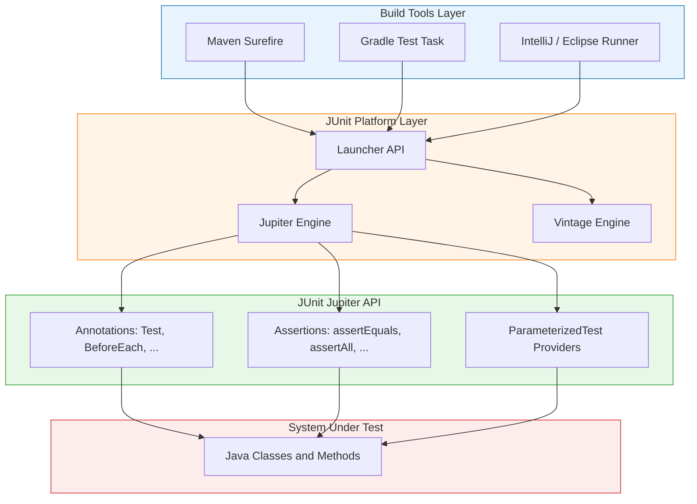
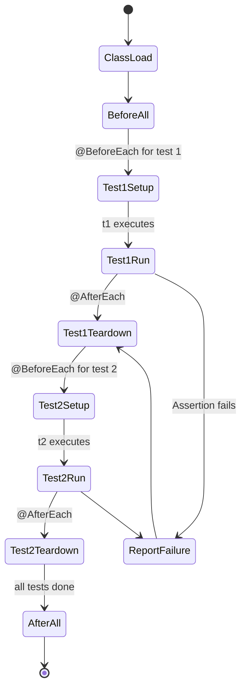
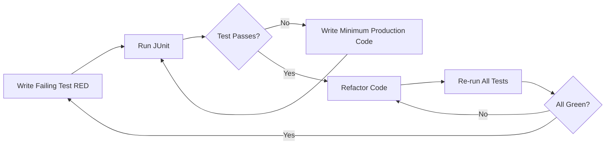
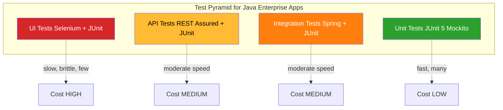
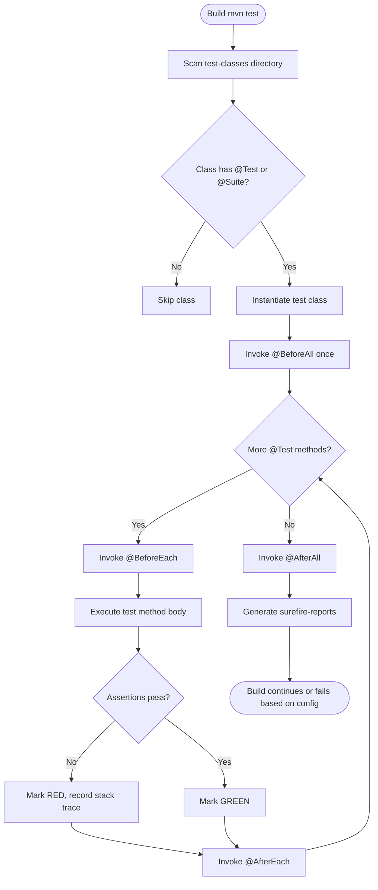

# JUnit Framework - Automation of unit testing, frameworks for testing in real-world projects

<!-- SECTION_1_START -->
# JUnit Framework: Automation of Unit Testing

> [!IMPORTANT]
> **KTU 2024 Scheme | OECST833 | Module 2 | Topic: JUnit Framework**
> This topic is **high-yield** for KTU Semester B.Tech (Open Elective) examinations. Focus areas include JUnit 5 (Jupiter) annotations, assertion methods, test lifecycle, parameterized testing, and integration with Maven/Gradle.

## 1.1 Formal Academic Definition

**JUnit** is an open-source, Java-based **unit testing framework** that belongs to the *xUnit* family of testing architectures. It enables developers to write and execute repeatable, automated tests for individual units (methods/classes) of source code, thereby supporting the *Test-Driven Development (TDD)* methodology and *Continuous Integration (CI)* pipelines.

The current production-grade version is **JUnit 5 (Jupiter)**, released under the **Eclipse Public License 2.0**, structured as a modular platform composed of three sub-projects:
- **JUnit Platform** — the launch pad for executing tests on the JVM.
- **JUnit Jupiter** — the API for writing tests using new annotations and the assertion model.
- **JUnit Vintage** — backward compatibility engine for running legacy JUnit 3 / JUnit 4 tests.

> [!NOTE]
> **Core Definition (Board Answer Ready):**
> *JUnit is a regression-testing framework that uses annotations to identify test methods and provides a set of `assert` methods to verify expected outcomes, automating the verification of unit-level behavior of Java code.*

## 1.2 Conceptual Analogy & Intuition

> [!TIP]
> **Analogy — "The Quality Inspector on an Assembly Line"**
> Imagine a car manufacturing plant. Every engine block (a Java method) leaving the assembly line must pass through a **Quality Inspector** (the JUnit test case). The inspector holds a checklist (the **assertion block**) that says, *"Expected horsepower = **200**"*. If the engine delivers 198 HP, the inspector flags it as **RED** (test fails). If it delivers exactly 200 HP, the inspector stamps it **GREEN** (test passes). JUnit acts as that automated, tireless inspector, working at the speed of the JVM and producing a colored report.

**Geometric / Process Intuition:**
- A test case is a *point* in the input-output space $(x, y)$ where $x$ = input and $y$ = expected output.
- A test suite is a *curve* traced through multiple such points.
- A test runner moves along that curve and reports each deviation (failure) as a vertical distance $\Delta = \vert y_{\text{actual}} - y_{\text{expected}} \vert$. When $\Delta = 0$, the test is **green**; otherwise **red**.

## 1.3 Engineering Significance

JUnit sits at the foundation of the **CI/CD pyramid** (Test Pyramid by Mike Cohn):

$$
\text{Unit Tests (JUnit)} \;\gg\; \text{Service Tests} \;\gg\; \text{UI Tests}
$$

It is the **base layer** of automated quality assurance in real-world Java enterprise systems (Spring Boot, Microservices, Android via Robolectric). Industrial metrics:
- **Unit test coverage threshold** in production: **$\geq 80\%$** (industry standard, mandated by ISO/IEC/IEEE 29119).
- **Test execution time target**: $\leq 200\,\text{ms}$ per unit test.

> [!VISUALIZATION CONTROL]
> **Concept:** Test Coverage vs. Defect Density Curve
> **GeoGebra / Desmos Input Equations:**
> * `f(x) = 100 * (1 - e^(-0.05 * x))`  (Defect detection %)
> * `g(x) = 0.5 * x` (Test effort)
> * `h(x) = f(x) - g(x)` (Net benefit)
> **Visual Description:** Plot $f(x)$ (concave, asymptotic to 100), $g(x)$ (linear cost), and $h(x)$ (peak around $x = 40\text{–}60\%$ coverage — the sweet spot for ROI).

<!-- SECTION_1_END -->

<!-- SECTION_2_START -->
# Deep Theoretical Analysis & KTU High-Yield Formula Sheet

## 2.1 JUnit 5 Architecture (The Jupiter Stack)

JUnit 5 is built on a **layered, decoupled architecture** — a significant departure from the monolithic JUnit 4 design.

| Layer | Component | Responsibility |
|---|---|---|
| Foundation | **JUnit Platform** | Provides the `Launcher` API, Console Launcher, IDE integration |
| Engine Layer | **Jupiter Engine** | Executes Jupiter-annotated tests |
| Engine Layer | **Vintage Engine** | Runs legacy JUnit 3 / 4 tests |
| API Layer | **JUnit Jupiter API** | Provides annotations, assertions, dynamic tests |
| Build Layer | **Maven Surefire / Gradle** | Discovers and invokes tests during build |

> [!NOTE]
> **Mnemonic:** *"Please Verify Jupiter's Acronyms" → P-V-J-A*
> **P**latform, **V**intage, **J**upiter, **A**PI

## 2.2 Core Annotations Catalog (High-Yield Table)

> [!IMPORTANT]
> **CRITICAL EXAM TABLE — Memorize the package of each annotation**
> All Jupiter annotations live in the package `org.junit.jupiter.api.*`

| Annotation | Lifecycle Phase | Purpose | Sample Usage |
|---|---|---|---|
| `@Test` | Method | Marks a method as a test case | `@Test void shouldAdd() {...}` |
| `@DisplayName` | Class/Method | Provides a human-readable test name | `@DisplayName("Login Validation")` |
| `@BeforeEach` | Method | Runs before **every** test method (setup) | Reset state, open connection |
| `@AfterEach` | Method | Runs after **every** test method (teardown) | Close connection, delete temp file |
| `@BeforeAll` | Static method | Runs **once** before all tests in the class | Load heavy fixtures |
| `@AfterAll` | Static method | Runs **once** after all tests in the class | Release global resources |
| `@Disabled` | Class/Method | Skips a test or class | `@Disabled("Under maintenance")` |
| `@Nested` | Class | Groups related tests logically | Inner `@Nested class LoginTests` |
| `@Tag` | Class/Method | Labels tests for selective execution | `@Tag("regression")` |
| `@Order` | Method | Controls execution order | `@Order(1)`, `@Order(2)` |
| `@ParameterizedTest` | Method | Runs the same test with multiple inputs | See §3.4 |
| `@RepeatedTest` | Method | Repeats a test N times | `@RepeatedTest(5)` |
| `@Timeout` | Method | Fails test if it exceeds a duration | `@Timeout(value=2, unit=TimeUnit.SECONDS)` |
| `@TestFactory` | Method | Generates dynamic tests at runtime | Returns `Stream<DynamicTest>` |

## 2.3 The Assertion API — `Assertions` Class

All static assertion methods are in `org.junit.jupiter.api.Assertions`. The class throws an `AssertionFailedError` on failure.

### 2.3.1 Boolean Assertions
$$
\text{assertTrue}(condition, \text{message}) \quad,\quad \text{assertFalse}(condition, \text{message})
$$

### 2.3.2 Equality Assertions
$$
\text{assertEquals}(\text{expected},\; \text{actual},\; \text{message})
$$
> **Strict Rule:** For arrays, use `assertArrayEquals(...)` which performs **deep element-wise comparison**.

### 2.3.3 Nullability Assertions
$$
\text{assertNull}(object) \quad,\quad \text{assertNotNull}(object)
$$

### 2.3.4 Exception Assertions
$$
\text{assertThrows}(Class\textless T\textgreater\;.\text{class},\; \text{executable})
$$
**Pre-JUnit 5 idiom (legacy):** `@Test(expected = Exception.class)` — *deprecated* in Jupiter.

### 2.3.5 Grouped Assertions (Transactional Style)
$$
\text{assertAll}(()\to\text{assert1},\;()\to\text{assert2},\; \ldots)
$$
Executes **all** assertions and reports **all** failures together — *unlike sequential `assertEquals` which halts at the first failure*.

### 2.3.6 Timeout Assertions
$$
\text{assertTimeout}(\text{Duration.ofSeconds}(2),\;()\to\{\; \text{longRunningCall()};\;\})
$$

> [!WARNING]
> **Common Student Mistake:** Confusing `assertEquals(expected, actual)` parameter order. The convention is **expected first, actual second**. Reversing them causes the failure message to be misleading: *"expected: \<actual\> but was: \<expected\>"*.

## 2.4 KTU Formula Sheet (Test Metrics & Math)

| Metric | Formula | Units | Engineering Use |
|---|---|---|---|
| **Code Coverage (Line)** | $C_{\text{line}} = \dfrac{L_{\text{executed}}}{L_{\text{total}}} \times 100\%$ | % | Measured by JaCoCo / Cobertura |
| **Branch Coverage** | $C_{\text{branch}} = \dfrac{B_{\text{executed}}}{B_{\text{total}}} \times 100\%$ | % | Stricter than line coverage |
| **Mutation Score** | $M = \dfrac{M_{\text{killed}}}{M_{\text{total}}} \times 100\%$ | % | Output of PIT / Pitest mutation testing |
| **Test Effectiveness** | $E = \dfrac{D_{\text{detected}}}{D_{\text{total injected}}}$ | ratio | Quality of test suite |
| **Defect Density** | $D_d = \dfrac{\text{Defects found}}{\text{KLOC}}$ | per KLOC | Industry: $\leq 1$ defect/KLOC = mature |
| **JUnit Execution Time Budget** | $T_{\text{suite}} = \sum_{i=1}^{n} t_i$ | ms | CI threshold: $\leq 600\,\text{s}$ |

## 2.5 Real-World Framework Integration Stack

> [!NOTE]
> **Production-Grade Testing Stack (Industry Reference)**
> In a real-world Java/Spring Boot project, JUnit is the *base*, and the following are layered above it:

$$
\underbrace{\text{JUnit 5}}_{\text{Engine}} \;+\; \underbrace{\text{Mockito}}_{\text{Mocking}} \;+\; \underbrace{\text{AssertJ}}_{\text{Fluent Assertions}} \;+\; \underbrace{\text{JaCoCo}}_{\text{Coverage}} \;+\; \underbrace{\text{Surefire/Gradle}}_{\text{Test Runner}} \;+\; \underbrace{\text{Jenkins/GitHub Actions}}_{\text{CI/CD}}
$$

**Frameworks commonly tested with JUnit in real-world projects:**
1. **Spring Boot** — uses `@SpringBootTest`, `@WebMvcTest`, `@DataJpaTest` slice annotations.
2. **Android** — uses **Robolectric** (JVM-based) or **Espresso** (instrumented).
3. **Hibernate/JPA** — uses **Testcontainers** for real database integration tests.
4. **REST APIs** — uses **REST Assured** layered on top of JUnit 5.

<!-- SECTION_2_END -->

<!-- SECTION_3_START -->
# Step-by-Step Derivations, Code Implementation & Lifecycle

## 3.1 The JUnit 5 Test Lifecycle (Derivation)

The Jupiter lifecycle is deterministic and follows a strict order. Let $T = \{t_1, t_2, \ldots, t_n\}$ be the set of `@Test` methods in a class. The execution order is:

$$
\text{classLoad} \;\to\; \text{@BeforeAll} \;\to\; \big( \text{@BeforeEach} \;\to\; t_i \;\to\; \text{@AfterEach} \big)_{i=1}^{n} \;\to\; \text{@AfterAll}
$$

**Expanded stepwise for $n = 3$ tests:**

$$
\begin{aligned}
\text{Step 1:} \quad & \text{JVM loads CalculatorTest.class} \\
\text{Step 2:} \quad & \text{@BeforeAll} \rightarrow \text{load expensive fixture} \\
\text{Step 3:} \quad & \text{@BeforeEach} \rightarrow \text{reset calculator state} \\
\text{Step 4:} \quad & t_1 = \text{testAddition()} \rightarrow \text{assertions evaluated} \\
\text{Step 5:} \quad & \text{@AfterEach} \rightarrow \text{log telemetry} \\
\text{Step 6:} \quad & \text{@BeforeEach} \rightarrow \text{reset calculator state} \\
\text{Step 7:} \quad & t_2 = \text{testSubtraction()} \rightarrow \text{assertions evaluated} \\
\text{Step 8:} \quad & \text{@AfterEach} \rightarrow \text{log telemetry} \\
\text{Step 9:} \quad & \text{@BeforeEach} \rightarrow \text{reset calculator state} \\
\text{Step 10:} \quad & t_3 = \text{testDivisionByZero()} \rightarrow \text{assertThrows evaluated} \\
\text{Step 11:} \quad & \text{@AfterEach} \rightarrow \text{log telemetry} \\
\text{Step 12:} \quad & \text{@AfterAll} \rightarrow \text{release fixture}
\end{aligned}
$$

## 3.2 Maven Project Configuration (`pom.xml`)

Every JUnit 5 Maven project requires two dependencies: the API (compile-time) and the engine (runtime).

```xml
<dependencies>
    <!-- Jupiter API: annotations, assertions -->
    <dependency>
        <groupId>org.junit.jupiter</groupId>
        <artifactId>junit-jupiter</artifactId>
        <version>5.10.2</version>
        <scope>test</scope>
    </dependency>
    <!-- Vintage engine: for running legacy JUnit 4 tests (optional) -->
    <dependency>
        <groupId>org.junit.vintage</groupId>
        <artifactId>junit-vintage-engine</artifactId>
        <version>5.10.2</version>
        <scope>test</scope>
    </dependency>
</dependencies>

<build>
    <plugins>
        <plugin>
            <groupId>org.apache.maven.plugins</groupId>
            <artifactId>maven-surefire-plugin</artifactId>
            <version>3.2.5</version>
        </plugin>
    </plugins>
</build>
```

## 3.3 Production-Grade Code: `Calculator.java` + `CalculatorTest.java`

### 3.3.1 The System Under Test (SUT)

```java
package com.ktu.demo;

public class Calculator {

    public double add(double a, double b) {
        return a + b;
    }

    public double subtract(double a, double b) {
        return a - b;
    }

    public double multiply(double a, double b) {
        return a * b;
    }

    public double divide(double a, double b) {
        if (b == 0.0) {
            throw new ArithmeticException("Division by zero is undefined.");
        }
        return a / b;
    }

    public boolean isEven(int number) {
        return number % 2 == 0;
    }
}
```

### 3.3.2 The Test Class — Full JUnit 5 Implementation

```java
package com.ktu.demo;

import static org.junit.jupiter.api.Assertions.*;

import java.time.Duration;
import org.junit.jupiter.api.*;

// @DisplayName is a "human-readable" test name (shown in IDE/CI report)
@DisplayName("Calculator Unit Test Suite")
@Tag("regression")
class CalculatorTest {

    private static Calculator calc;          // shared resource for one test
    private static long suiteStartTime;       // for @BeforeAll telemetry

    @BeforeAll
    static void initialiseSharedFixture() {
        calc = new Calculator();
        suiteStartTime = System.nanoTime();
        System.out.println("[BeforeAll] Shared Calculator instance created.");
    }

    @BeforeEach
    void resetState() {
        // No state to mutate here, but typically used to reset mocks
        System.out.println("[BeforeEach] Test starting...");
    }

    @AfterEach
    void logPerTest() {
        System.out.println("[AfterEach] Test finished.");
    }

    @AfterAll
    static void releaseSharedFixture() {
        long durationNs = System.nanoTime() - suiteStartTime;
        System.out.printf("[AfterAll] Suite completed in %d ns.%n", durationNs);
        calc = null;
    }

    // ---------- BASIC ASSERTIONS ----------

    @Test
    @DisplayName("add(2, 3) should equal 5.0")
    void testAddition() {
        double result = calc.add(2.0, 3.0);
        assertEquals(5.0, result, 0.0001, "2 + 3 must equal 5");
    }

    @Test
    @DisplayName("subtract(10, 4) should equal 6.0")
    void testSubtraction() {
        assertEquals(6.0, calc.subtract(10.0, 4.0), 0.0001);
    }

    @Test
    @DisplayName("multiply(3, 4) should equal 12.0")
    void testMultiplication() {
        assertEquals(12.0, calc.multiply(3.0, 4.0), 0.0001);
    }

    // ---------- EXCEPTION ASSERTION ----------

    @Test
    @DisplayName("divide(10, 0) must throw ArithmeticException")
    void testDivisionByZero() {
        ArithmeticException ex = assertThrows(
            ArithmeticException.class,
            () -> calc.divide(10.0, 0.0),
            "Expected an exception for zero divisor"
        );
        assertEquals("Division by zero is undefined.", ex.getMessage());
    }

    // ---------- GROUPED ASSERTIONS (assertAll) ----------

    @Test
    @DisplayName("isEven() grouped checks for multiple values")
    void testIsEvenGrouped() {
        assertAll("Even number checks",
            () -> assertTrue(calc.isEven(2),   "2 is even"),
            () -> assertTrue(calc.isEven(100), "100 is even"),
            () -> assertFalse(calc.isEven(7),  "7 is NOT even"),
            () -> assertFalse(calc.isEven(-3), "-3 is NOT even")
        );
    }

    // ---------- TIMEOUT ASSERTION ----------

    @Test
    @DisplayName("long loop must finish within 500 ms")
    void testTimeout() {
        assertTimeout(
            Duration.ofMillis(500),
            () -> {
                long sum = 0;
                for (int i = 0; i < 1_000_000; i++) {
                    sum += calc.add(i, 1);
                }
                assertEquals(500000500000L, sum);
            }
        );
    }

    // ---------- DISABLED TEST ----------

    @Test
    @Disabled("Pending bug fix in JIRA-1234")
    @DisplayName("multiply(0, 999) - skipped test")
    void testZeroMultiplication() {
        // Will not run
        assertEquals(0.0, calc.multiply(0.0, 999.0));
    }
}
```

**Step-by-step reasoning behind the code:**

$$
\begin{aligned}
\text{Line: } \texttt{assertEquals(5.0, result, 0.0001, ...)} &\rightarrow \text{tolerance }\varepsilon = 0.0001 \\
\text{Line: } \texttt{assertThrows(ArithmeticException.class, ...)} &\rightarrow \text{lambda captures the executable} \\
\text{Line: } \texttt{assertAll("Even number checks", ...)} &\rightarrow \text{all lambdas run, all failures aggregated} \\
\text{Line: } \texttt{assertTimeout(Duration.ofMillis(500), ...)} &\rightarrow \text{hard wall-clock timeout}
\end{aligned}
$$

## 3.4 Parameterized Tests — Eliminating Duplication

Parameterized tests allow the **same test logic** to be executed with **multiple inputs** — a critical feature for data-driven testing in real-world projects.

```java
import org.junit.jupiter.params.ParameterizedTest;
import org.junit.jupiter.params.provider.*;

class CalculatorParameterizedTest {

    private final Calculator calc = new Calculator();

    @ParameterizedTest(name = "add({0}, {1}) = {2}")
    @CsvSource({
        "1, 2, 3",
        "10, 20, 30",
        "-5, 5, 0",
        "0.1, 0.2, 0.3"
    })
    void testAddWithCsv(double a, double b, double expected) {
        assertEquals(expected, calc.add(a, b), 0.0001);
    }

    @ParameterizedTest(name = "isEven({0}) = {1}")
    @ValueSource(ints = {2, 4, 100, 0, -8})
    void testIsEvenWithValueSource(int number) {
        assertTrue(calc.isEven(number));
    }

    @ParameterizedTest(name = "{0} -> {1}")
    @MethodSource("evenOddProvider")
    void testIsEvenMethodSource(int input, boolean expected) {
        assertEquals(expected, calc.isEven(input));
    }

    static Stream<Arguments> evenOddProvider() {
        return Stream.of(
            Arguments.of(2,   true),
            Arguments.of(3,   false),
            Arguments.of(99,  false),
            Arguments.of(100, true)
        );
    }
}
```

> [!NOTE]
> **The 5 Built-in Argument Providers in Jupiter 5.10:**
> 1. `@ValueSource` — primitives + String
> 2. `@EnumSource` — enum constants
> 3. `@CsvSource` — comma-separated values
> 4. `@CsvFileSource` — values from a CSV file
> 5. `@MethodSource` — values from a static method

## 3.5 Test Suites (Aggregating Multiple Test Classes)

```java
package com.ktu.demo;

import org.junit.platform.suite.api.SelectClasses;
import org.junit.platform.suite.api.Suite;

@Suite
@SelectClasses({
    CalculatorTest.class,
    CalculatorParameterizedTest.class
})
@DisplayName("KTU Module-2 Full Test Suite")
class Module2TestSuite {
    // intentionally empty — annotations drive the suite
}
```

## 3.6 Real-World TDD Workflow (Red → Green → Refactor)

The professional adoption of JUnit follows the **Beck's TDD cycle**:

$$
\begin{aligned}
\text{Step 1 (RED):} \quad & \text{Write a failing test for new feature} \\
\text{Step 2 (GREEN):} \quad & \text{Write the minimum code to pass the test} \\
\text{Step 3 (REFACTOR):} \quad & \text{Clean up code while keeping tests green} \\
\text{Step 4 (REPEAT):} \quad & \text{Move to next requirement}
\end{aligned}
$$

In CI pipelines, this is enforced by tools like **SonarQube** which fail the build if coverage drops below the threshold.

<!-- SECTION_3_END -->

<!-- SECTION_4_START -->
# Structural Diagrams & Schematics

## 4.1 JUnit 5 Layered Architecture (Mermaid Block Diagram)



## 4.2 JUnit Test Lifecycle State Machine



## 4.3 TDD Cycle (Red-Green-Refactor) Flow



## 4.4 Real-World Test Pyramid in a Java Project



## 4.5 Sequential Processing Topology: JUnit Test Discovery & Execution



<!-- SECTION_4_END -->

<!-- SECTION_5_START -->
# KTU 2024 Scheme Examination Question Bank & Topic Recap

> [!IMPORTANT]
> **Mark Distribution for OECST833 (KTU 2024 Scheme):**
> - Part A: $2 \times 3 = 6$ marks
> - Part B (Module Internal Choice): $1 \times 14 = 14$ marks
> - **Total Module-2 contribution to ESE:** 20 marks

---

## 📘 PART A — Short Answer Questions (3 Marks Each)

### **Q1. [KTU University Exam — July 2024]**
**Define the JUnit framework. List any four annotations of JUnit 5 with their purpose.**
**Cognitive Level:** Remember | **CO Mapping:** CO2

**Model Answer (Valuation Key — 3 Marks):**
1. **JUnit is an open-source unit testing framework for Java** used to write and execute repeatable automated tests, supporting TDD and CI/CD pipelines. **[1 Mark]**
2. **Four annotations:** **[2 Marks — 0.5 each]**
   - `@Test` — marks a method as a test case.
   - `@BeforeEach` — executes before every test method (setup).
   - `@AfterAll` — executes once after all test methods (class-level teardown).
   - `@Disabled` — disables/skip a test method or class.

---

### **Q2. [KTU University Exam — Dec 2023]**
**Differentiate between `assertEquals` and `assertSame` in JUnit 5. Give one example.**
**Cognitive Level:** Understand | **CO Mapping:** CO2

**Model Answer (Valuation Key — 3 Marks):**
- `assertEquals(expected, actual)` — uses the `.equals()` method for comparison (logical/structural equality). **[1 Mark]**
- `assertSame(expected, actual)` — uses the `==` operator for comparison (reference/identity equality). **[1 Mark]**
- Example: Two different `String` objects with the same content pass `assertEquals` but fail `assertSame`. **[1 Mark]**

---

## 📕 PART B — Long Answer Questions (14 Marks, Module Internal Choice)

> [!WARNING]
> **KTU Examiner's Valuation Warning:**
> - **Forgetting the package name** `org.junit.jupiter.api.*` in answers — lose **0.5 Mark**.
> - **Writing JUnit 4 syntax** (e.g., `import org.junit.Test;` instead of `import org.junit.jupiter.api.Test;`) — the examiner may award **partial credit** only.
> - **Not providing a complete runnable code** — losing the full 7 marks of the sub-question. Always include a `main` executable or test runner invocation.

---

### **Question A (14 Marks) — JUnit Lifecycle & Assertions**

**[KTU University Exam — July 2024, Modified]** | **Cognitive Levels:** Understand + Apply | **CO Mapping:** CO2, CO3

#### **Part (a) — 7 Marks: Explain JUnit 5 lifecycle annotations in detail.**
> **Cognitive Level:** Understand

**Model Answer:**

The JUnit 5 (Jupiter) lifecycle consists of four primary annotations that control test execution flow:

| # | Annotation | When it Runs | Visibility | Typical Use |
|---|---|---|---|---|
| 1 | `@BeforeAll` | **Once** before all tests in the class | Must be `static` | Load shared fixtures (DB connection, file) |
| 2 | `@BeforeEach` | Before **every** test method | Instance method | Reset mutable state, initialize mocks |
| 3 | `@AfterEach` | After **every** test method | Instance method | Cleanup, log per-test result |
| 4 | `@AfterAll` | **Once** after all tests in the class | Must be `static` | Release global resources, close streams |

**Valuation Key (7 Marks):**
- **[2 Marks]** Tabular explanation with correct visibility rules.
- **[2 Marks]** Ordering diagram (BeforeAll → BeforeEach → Test → AfterEach → AfterAll).
- **[2 Marks]** One real-world example (e.g., opening a DB connection in `@BeforeAll` and closing in `@AfterAll`).
- **[1 Mark]** Distinction between `@BeforeAll` (static) and `@BeforeEach` (instance).

#### **Part (b) — 7 Marks: Write a complete JUnit 5 test class for a `BankAccount` class with methods `deposit(double)`, `withdraw(double)`, and `getBalance()`. Use `assertEquals`, `assertThrows`, and `assertAll`.**
> **Cognitive Level:** Apply

**Model Solution:**

**System Under Test (SUT):**
```java
package com.ktu.bank;

public class BankAccount {
    private double balance;

    public BankAccount(double openingBalance) {
        if (openingBalance < 0) {
            throw new IllegalArgumentException("Opening balance cannot be negative.");
        }
        this.balance = openingBalance;
    }

    public void deposit(double amount) {
        if (amount <= 0) {
            throw new IllegalArgumentException("Deposit must be positive.");
        }
        balance += amount;
    }

    public void withdraw(double amount) {
        if (amount <= 0) {
            throw new IllegalArgumentException("Withdrawal must be positive.");
        }
        if (amount > balance) {
            throw new IllegalStateException("Insufficient funds.");
        }
        balance -= amount;
    }

    public double getBalance() {
        return balance;
    }
}
```

**Test Class:**
```java
package com.ktu.bank;

import static org.junit.jupiter.api.Assertions.*;
import org.junit.jupiter.api.*;

@DisplayName("BankAccount JUnit 5 Test Suite")
class BankAccountTest {

    private BankAccount account;

    @BeforeEach
    void setUp() {
        account = new BankAccount(1000.0);
    }

    @Test
    @DisplayName("Deposit 500 should increase balance to 1500")
    void testDeposit() {
        account.deposit(500.0);
        assertEquals(1500.0, account.getBalance(), 0.001,
                     "Balance after deposit must be 1500");
    }

    @Test
    @DisplayName("Withdraw 200 should decrease balance to 800")
    void testWithdraw() {
        account.withdraw(200.0);
        assertEquals(800.0, account.getBalance(), 0.001);
    }

    @Test
    @DisplayName("Withdraw exceeding balance must throw")
    void testOverdrawThrows() {
        assertThrows(IllegalStateException.class,
                     () -> account.withdraw(5000.0),
                     "Over-withdrawal must raise IllegalStateException");
    }

    @Test
    @DisplayName("Negative deposit must throw IllegalArgumentException")
    void testNegativeDepositThrows() {
        assertThrows(IllegalArgumentException.class,
                     () -> account.deposit(-100.0));
    }

    @Test
    @DisplayName("Grouped check: a sequence of operations")
    void testSequenceGrouped() {
        account.deposit(500.0);
        account.withdraw(200.0);
        account.deposit(100.0);

        assertAll("Account flow checks",
            () -> assertEquals(1000.0, account.getBalance() - 700.0, 0.001),
            () -> assertTrue(account.getBalance() > 0),
            () -> assertNotNull(account)
        );
    }
}
```

**Valuation Key (7 Marks):**
- **[2 Marks]** Correct SUT class structure with all three methods.
- **[1 Mark]** `@BeforeEach` setup with opening balance.
- **[2 Marks]** Correct use of `assertEquals` with delta and message.
- **[1 Mark]** Correct use of `assertThrows` with executable lambda.
- **[1 Mark]** Correct use of `assertAll` for grouped assertions.

---

### **Question B (14 Marks) — Parameterized Testing & Real-World Frameworks**

**[KTU University Exam — Dec 2023, Modified]** | **Cognitive Levels:** Understand + Apply | **CO Mapping:** CO2, CO3

#### **Part (a) — 7 Marks: Explain the concept of Parameterized Testing in JUnit 5. List any four argument providers with example.**
> **Cognitive Level:** Understand

**Model Answer:**

Parameterized testing is a feature in JUnit 5 that allows a **single test method to be executed multiple times with different input values**, eliminating code duplication. It uses the `@ParameterizedTest` annotation instead of `@Test`.

**Four Argument Providers:**

| # | Provider | Description | Example |
|---|---|---|---|
| 1 | `@ValueSource` | Supplies a single primitive or String | `@ValueSource(ints = {1, 2, 3})` |
| 2 | `@EnumSource` | Iterates over enum constants | `@EnumSource(Day.class)` |
| 3 | `@CsvSource` | Comma-separated inline values | `@CsvSource({"1,2,3", "4,5,9"})` |
| 4 | `@MethodSource` | References a static method returning `Stream<Arguments>` | `@MethodSource("provider")` |

**Sample Code:**
```java
@ParameterizedTest(name = "square({0}) = {1}")
@CsvSource({
    "1, 1",
    "2, 4",
    "3, 9",
    "10, 100"
})
void testSquare(int input, int expected) {
    assertEquals(expected, input * input);
}
```

**Valuation Key (7 Marks):**
- **[2 Marks]** Definition + purpose of parameterized testing.
- **[4 Marks]** Four providers in a clean table with correct examples.
- **[1 Mark]** Sample code using `@CsvSource` with at least 3 data rows.

#### **Part (b) — 7 Marks: Describe the typical JUnit-based testing stack used in real-world Java/Spring Boot projects. Mention the role of each tool.**
> **Cognitive Level:** Apply

**Model Answer:**

| # | Tool / Framework | Role in the Stack | Phase |
|---|---|---|---|
| 1 | **JUnit 5 (Jupiter)** | Core testing engine for writing & running unit tests | Authoring |
| 2 | **Mockito** | Mocks dependencies (e.g., DAO, REST clients) | Authoring |
| 3 | **AssertJ / Hamcrest** | Fluent, expressive assertion library | Authoring |
| 4 | **Spring Boot Test** | `@SpringBootTest`, `@WebMvcTest` for integration | Integration |
| 5 | **Maven Surefire / Gradle** | Discovers & runs tests in build pipeline | Build |
| 6 | **JaCoCo** | Measures code coverage & generates HTML/XML report | Analysis |
| 7 | **Jenkins / GitHub Actions / GitLab CI** | Automates test execution on every commit | CI/CD |

**Sample Spring Boot + JUnit 5 Test:**
```java
@SpringBootTest
class UserServiceTest {

    @Autowired
    private UserService userService;

    @MockBean
    private UserRepository userRepository;

    @Test
    void testGetUserById() {
        User mockUser = new User(1L, "Alice", "alice@ktu.in");
        when(userRepository.findById(1L)).thenReturn(Optional.of(mockUser));

        User result = userService.getUserById(1L);

        assertEquals("Alice", result.getName());
        verify(userRepository, times(1)).findById(1L);
    }
}
```

**Valuation Key (7 Marks):**
- **[2 Marks]** Stack diagram / tabular listing with at least 6 tools.
- **[2 Marks]** Correct role assigned to each tool.
- **[2 Marks]** Sample integration code with `@SpringBootTest` and `@MockBean`.
- **[1 Mark]** Mentioning CI/CD integration (Jenkins, GitHub Actions).

---

> [!WARNING]
> **KTU Examiner's Valuation Warning (Final Reminders):**
> 1. **JUnit 4 vs JUnit 5 confusion:** Always use `org.junit.jupiter.api.*` package in code; mention *"Jupiter"* explicitly in definitions.
> 2. **Test Pyramid violation:** Avoid suggesting UI tests as the primary automation — JUnit is for **unit** testing, not end-to-end.
> 3. **Skipping the lifecycle order:** Always state the exact order *(@BeforeAll → @BeforeEach → @Test → @AfterEach → @AfterAll)* when explaining lifecycle.
> 4. **Missing `static` keyword on `@BeforeAll`/`@AfterAll`:** In JUnit 5, these **must be static**; mentioning only the annotation without the visibility loses 0.5 Mark.
> 5. **No code output verification:** Always include a sample test method output or `mvn test` invocation in long answers.

---

## ✅ Topic Recap & Important Things to Remember

- **JUnit 5 (Jupiter)** is the current production-grade version — use package `org.junit.jupiter.api.*` always.
- The **3 sub-projects** of JUnit 5 are: **Platform**, **Jupiter**, **Vintage** — memorize them as *"PJV"*.
- **12 High-Yield Annotations:** `@Test`, `@BeforeEach`, `@AfterEach`, `@BeforeAll`, `@AfterAll`, `@DisplayName`, `@Disabled`, `@Nested`, `@Tag`, `@Order`, `@ParameterizedTest`, `@RepeatedTest`, `@Timeout`, `@TestFactory`.
- **5 Argument Providers** for parameterized tests: `@ValueSource`, `@EnumSource`, `@CsvSource`, `@CsvFileSource`, `@MethodSource`.
- **6 Essential Assertions:** `assertEquals`, `assertTrue/False`, `assertNull/NotNull`, `assertThrows`, `assertAll`, `assertTimeout`.
- **Lifecycle Order** (must memorize): `@BeforeAll` → `(@BeforeEach → @Test → @AfterEach)` × n → `@AfterAll`.
- **Parameter order in `assertEquals`:** `expected` comes **first**, `actual` comes **second** — reversals lose marks.
- **`assertAll`** executes ALL assertions and aggregates failures — unlike sequential `assertEquals` which halts at first failure.
- **`@BeforeAll` and `@AfterAll` MUST be `static`** in JUnit 5 (Jupiter); in JUnit 4 they were not required to be static.
- **Coverage Metric** $C = \dfrac{L_{\text{executed}}}{L_{\text{total}}} \times 100\%$; **mutation score** $M = \dfrac{M_{\text{killed}}}{M_{\text{total}}} \times 100\%$.
- **Real-world stack:** JUnit + Mockito + AssertJ + Spring Test + Maven Surefire + JaCoCo + Jenkins = industry standard.
- **TDD cycle:** RED (failing test) → GREEN (minimum code) → REFACTOR (clean up) → REPEAT.
- **Test Pyramid principle:** Many cheap unit tests at the base; few expensive UI tests at the top.
- **Always state visibility** (`static` for `@BeforeAll`/`@AfterAll`) — examiners award **0.5 Mark** for that detail.

<!-- SECTION_5_END -->
