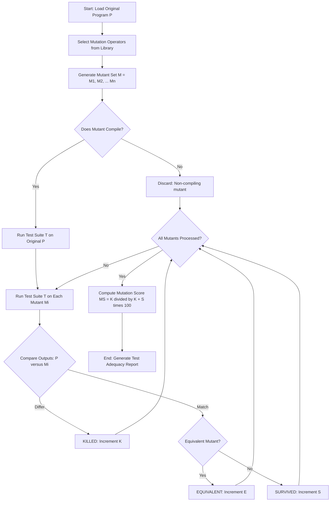
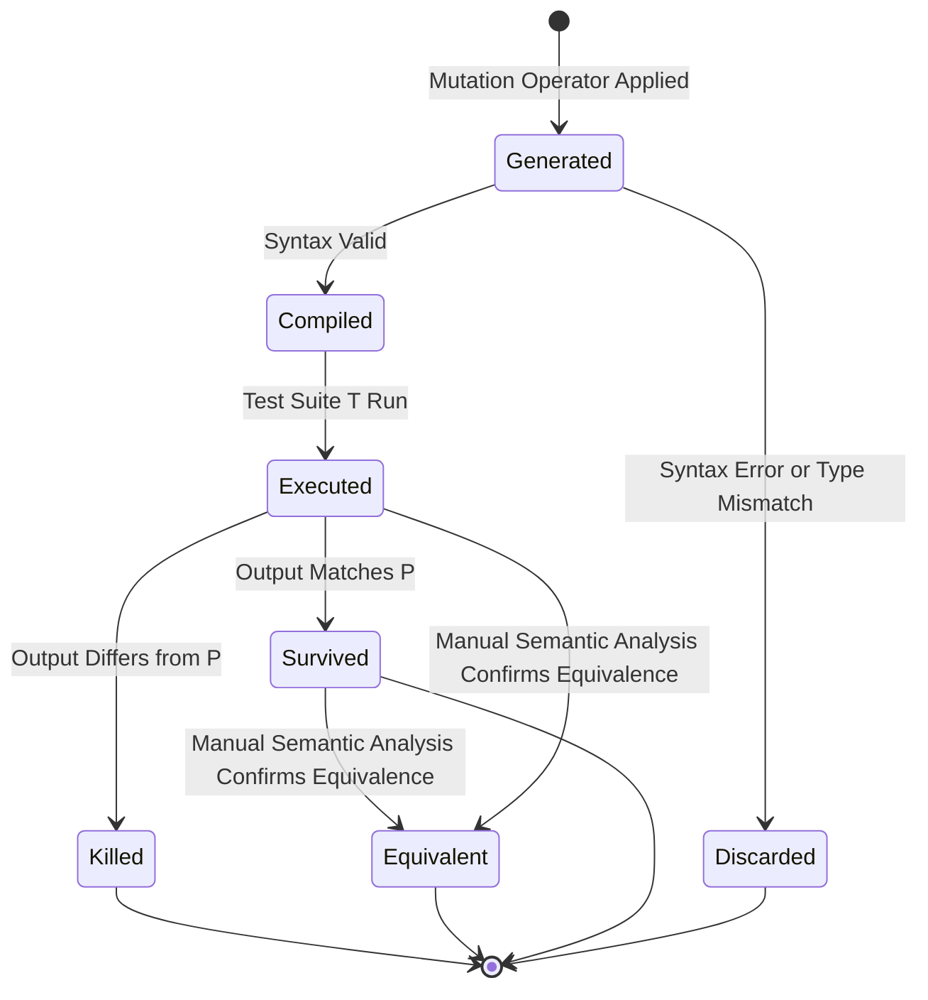
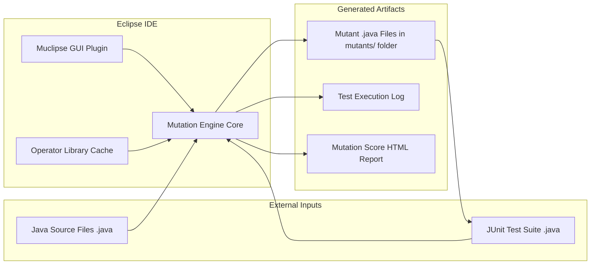
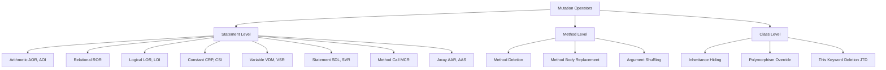

# Mutation Testing- Mutation operators, mutants, mutation score, and modern mutation testing tools (e.g., Muclipse)

<!-- SECTION_1_START -->

# Mutation Testing — Core Technical Definition & Intuitive Overview

## 1.1 Formal Academic Definition (KTU 2024 Syllabus Aligned)

**Mutation Testing** is a fault-based, white-box software testing technique used to evaluate the *adequacy* and *effectiveness* of a test suite by deliberately injecting small syntactic faults (called **mutations**) into a program under test, producing altered versions called **mutants**, and then checking whether the existing test cases can **distinguish (kill)** these mutants from the original program.

> [!IMPORTANT]
> **Formal Definition (KTU Board Standard):**
> Mutation Testing is a fault-injection-based testing criterion in which the tester artificially introduces simple syntactic changes — guided by a set of pre-defined **Mutation Operators (MOs)** — into the source program $P$ to produce a mutant $P'$. A test case $t$ is said to "**kill**" a mutant if and only if the execution output of $P$ on $t$ differs from the execution output of $P'$ on $t$. The quality of the test suite is measured by the **Mutation Score ($MS$)**.

## 1.2 Conceptual Analogy / Real-World Intuition

Imagine a doctor testing a patient's eyesight. The doctor asks the patient to read a chart. If the patient reads everything correctly, can the doctor conclude the patient's eyes are healthy? Not really — the chart might be too simple.

So the doctor **deliberately blurs small patches** of the chart and asks the patient to read again. If the patient notices the blur, the chart is good. If the patient doesn't notice, the chart is **insensitive** and needs better (harder) test cases.

| Medical Analogy | Mutation Testing Concept |
|---|---|
| Patient | Program under test ($P$) |
| Eye chart | Test suite ($T$) |
| Blurred patches on chart | Mutants ($P'$) |
| Patient noticing the blur | Mutant is **killed** |
| Patient missing the blur | Mutant **survives** (weak test) |
| Fraction of blurs detected | **Mutation Score** |

## 1.3 Why Mutation Testing is Special

- It does not directly find bugs in the program. Instead, it **measures how good your tests are**.
- It is a *second-order* testing criterion: it tests the **test suite**, not the software.
- It is one of the strongest fault-revealing criteria known in the software engineering literature, often used as a **gold standard** for evaluating other testing techniques.

> [!NOTE]
> **KTU 2024 Syllabus Highlight:**
> The course outcome mapped to this topic is **CO2: Apply fault-based testing techniques to assess the adequacy of a test suite using mutation operators, mutation score computation, and modern mutation testing tools such as Muclipse.**

## 1.4 Core Terminology Quick Lookup

- **Mutant ($P'$)** — A modified copy of the original program $P$ obtained by applying exactly one mutation.
- **Mutation Operator (MO)** — A syntactic transformation rule (e.g., replace `+` with `-`).
- **Killed Mutant** — A mutant whose output differs from $P$ on at least one test case.
- **Survived Mutant** — A mutant whose output matches $P$ on all test cases (the test suite is too weak).
- **Equivalent Mutant** — A mutant that is *semantically identical* to $P$ but syntactically different. **No test case can ever kill it.**
- **Mutation Score (MS)** — The percentage of non-equivalent mutants killed by the test suite.

> [!VISUALIZATION CONTROL]
> **Concept:** Mutation Score as a Stacked Bar / Pie Distribution
> **GeoGebra / Desmos Input Equations:**
> * `f(x) = (killed / total) * 100` where `killed + survived + equivalent = total`
> * Sample values: `K = 18, S = 4, E = 3, T = 25`
> **Visual Description:** Draw a horizontal stacked bar of width 25 units. Color the first 18 units green (Killed), the next 4 units red (Survived), the last 3 units yellow (Equivalent). The **Mutation Score** is the green region's percentage: $\frac{18}{25 - 3} \times 100 = 81.81\%$.

<!-- SECTION_1_END -->

<!-- SECTION_2_START -->

# Deep Theoretical Analysis & KTU High-Yield Formula Sheet

## 2.1 The Mutation Testing Process (Step-by-Step Logic)

The mutation testing workflow can be broken down into **eight structured phases**. Understanding each phase is critical for KTU board questions, as the process diagram is a frequent 7-mark sub-question.

1. **Phase 1 — Original Program Acquisition:** The source program $P$ (typically in Java, C, Python) is loaded into the mutation tool.
2. **Phase 2 — Mutation Operator Selection:** A library of mutation operators (e.g., AOR, ROR, LOR) is chosen based on language and granularity (statement/method level).
3. **Phase 3 — Mutant Generation:** For every selected operator location in $P$, apply the operator to generate a **mutant set** $\mathcal{M} = \{M_1, M_2, \dots, M_n\}$.
4. **Phase 4 — Compilation of Mutants:** Each mutant is compiled (syntactically validated). Non-compiling mutants are discarded.
5. **Phase 5 — Test Execution on Original:** Run the test suite $T$ against the original program $P$ and record baseline outputs.
6. **Phase 6 — Test Execution on Mutants:** Run the same test suite $T$ against every mutant $M_i \in \mathcal{M}$ and record outputs.
7. **Phase 7 — Mutant Classification:** Compare outputs:
   - Output differs $\Rightarrow$ **Killed**
   - Output matches $\Rightarrow$ **Survived** or **Equivalent** (manually analyzed).
8. **Phase 8 — Mutation Score Computation:** Aggregate results and compute $MS$.

> [!IMPORTANT]
> **The "Why" behind each step:**
> - Why generate many mutants? — To stress-test every syntactic decision in the code.
> - Why discard non-compiling mutants? — They give no useful signal about test quality.
> - Why manually identify equivalent mutants? — No automation can fully prove semantic equivalence, and they can never be killed.

## 2.2 Mutation Operators — The Heart of Mutation Testing

Mutation operators are **syntactic transformation rules**. The seminal work by **DeMillo, Lipton, Sayward, and Offutt (1978)** introduced the foundational operators. King and Offutt later formalized them into the **Mothra tool**.

### 2.2.1 Classification of Mutation Operators

| Category | Operator Code | Full Name | Example Transformation |
|---|---|---|---|
| Arithmetic | **AOR** | Arithmetic Operator Replacement | `a + b` $\rightarrow$ `a - b` |
| Arithmetic | **AOI** | Arithmetic Operator Insertion | `a + b` $\rightarrow$ `a + (-b)` |
| Relational | **ROR** | Relational Operator Replacement | `a < b` $\rightarrow$ `a <= b` |
| Logical | **LOR** | Logical Operator Replacement | `a && b` $\rightarrow$ `a || b` |
| Logical | **LOI** | Logical Operator Insertion | `if (a)` $\rightarrow$ `if (!a)` |
| Constant | **CRP** | Constant Replacement | `x = 1` $\rightarrow$ `x = 0` |
| Constant | **CSI** | Constant Substitution Increment | `x = 1` $\rightarrow$ `x = 2` |
| Statement | **SDL** | Statement Deletion | `a = b;` $\rightarrow$ (deleted) |
| Statement | **SVR** | Statement Variation / Replacement | `return a;` $\rightarrow$ `return b;` |
| Variable | **VDM** | Variable Declaration Modifier | `int x` $\rightarrow$ `float x` |
| Method Call | **MCR** | Method Call Replacement | `obj.equals(x)` $\rightarrow$ `obj == x` |
| Array | **AAR** | Array Reference Replacement | `a[0]` $\rightarrow$ `a[1]` |
| Class | **JTD** | This Keyword Deletion | `this.x` $\rightarrow$ `x` |

> [!NOTE]
> **Granularity Levels:**
> - **Statement-level mutation** — One operator applied to one statement (most common, used in Muclipse).
> - **Method-level mutation** — Entire methods are replaced/removed.
> - **Class-level mutation** — Affects class hierarchy, polymorphism.

## 2.3 The Three Fates of a Mutant

Every mutant $M_i$ generated by the tool ends up in one of three states:

$$
\text{State}(M_i) \in \{\text{Killed}, \text{Survived}, \text{Equivalent}\}
$$

**1. Killed Mutant** — $\exists\, t \in T : P(t) \neq M_i(t)$
**2. Survived Mutant** — $\forall\, t \in T : P(t) = M_i(t)$ AND $M_i \not\equiv P$
**3. Equivalent Mutant** — $M_i \equiv P$ semantically (no test can ever kill it)

## 2.4 KTU High-Yield Formula Sheet

| Quantity | Formula | Description |
|---|---|---|
| Total Non-Equivalent Mutants | $TM_{ne} = K + S$ | Total killed + survived (excluding equivalents) |
| Mutation Score (Standard) | $MS = \dfrac{K}{TM_{ne}} \times 100$ | Percentage of killable mutants actually killed |
| Mutation Score (Inclusive) | $MS_{inc} = \dfrac{K}{K + S + E} \times 100$ | Includes equivalent mutants in denominator |
| Equivalent Mutant Ratio | $EMR = \dfrac{E}{K + S + E} \times 100$ | Diagnostic of tool/operator selection |
| Mutation Adequacy | $\text{Adequate} \Leftrightarrow MS \geq 1.0$ (i.e., $100\%$) | Ideal target in academic mutation testing |

> [!WARNING]
> **KTU Board Pitfall:** Many students incorrectly use $MS = \dfrac{K}{K + S + E}$ including equivalents. The **board-standard KTU formula** **excludes equivalent mutants** from the denominator, because killing them is logically impossible.

## 2.5 Real-World Utility in Engineering

Mutation testing, despite its high computational cost, has critical production use:

- **Avionics & Safety-Critical Systems (DO-178C):** Airbus, Boeing use mutation-style fault injection on flight-control software.
- **Compiler Validation (GCC, LLVM):** Metamorphic + mutation testing validates that optimization phases don't change semantics.
- **AI/ML Model Robustness:** Modern AI testing injects perturbations (the "mutation") to test image classifiers and NLP models.
- **Cybersecurity:** Fuzzing (e.g., AFL, libFuzzer) is a *runtime mutation* technique where inputs (not code) are mutated.
- **Test Suite Quality in CI/CD:** Tools like **PIT (Pitest)** are integrated into Jenkins/GitHub Actions for Java/Kotlin projects to gate merges on mutation score thresholds.

<!-- SECTION_2_END -->

<!-- SECTION_3_START -->

# Step-by-Step Derivations & Code/Symbolic Implementation

## 3.1 Worked Example — Manual Mutation Testing on a Java Snippet

Consider the following original program $P$ (a simple absolute-value function) and its test suite $T$.

**Original Program $P$:**

```java
public static int absolute(int x) {
    if (x < 0) {
        return -x;
    }
    return x;
}
```

**Test Suite $T$:** $T = \{t_1: \text{abs}(-5) = 5,\; t_2: \text{abs}(0) = 0,\; t_3: \text{abs}(7) = 7\}$

### Step 1 — Apply ROR (Relational Operator Replacement) Operator

The ROR operator at the condition `x < 0` can produce these mutants:

| Mutant ID | Condition | Transformed Program |
|---|---|---|
| $M_1$ | `x <= 0` | `if (x <= 0) { return -x; } return x;` |
| $M_2$ | `x > 0` | `if (x > 0) { return -x; } return x;` |
| $M_3$ | `x >= 0` | `if (x >= 0) { return -x; } return x;` |
| $M_4$ | `x == 0` | `if (x == 0) { return -x; } return x;` |
| $M_5$ | `x != 0` | `if (x != 0) { return -x; } return x;` |

### Step 2 — Execute Test Suite Against Each Mutant

**Mutant $M_1$ (`<=` instead of `<`):**

| Test | Input | $P$ output | $M_1$ output | Status |
|---|---|---|---|---|
| $t_1$ | $-5$ | $5$ | $5$ (because $-5 \leq 0$) | Match |
| $t_2$ | $0$ | $0$ | $0$ (because $0 \leq 0$ returns $0$) | Match |
| $t_3$ | $7$ | $7$ | $7$ | Match |

**Wait — $M_1$ is actually EQUIVALENT to $P$!**
For $x < 0$: $P$ returns $-x$, $M_1$ also returns $-x$.
For $x = 0$: $P$ returns $0$, $M_1$ returns $-0 = 0$.
For $x > 0$: $P$ returns $x$, $M_1$ returns $x$.
**Conclusion:** $M_1 \equiv P$ — **equivalent mutant**, cannot be killed.

**Mutant $M_2$ (`>` instead of `<`):**

| Test | Input | $P$ output | $M_2$ output | Status |
|---|---|---|---|---|
| $t_1$ | $-5$ | $5$ | $-5$ (since $-5 \not> 0$, falls through) | **DIFFER** $\Rightarrow$ **KILLED** |

**Mutant $M_3$ (`>=` instead of `<`):**

| Test | Input | $P$ output | $M_3$ output | Status |
|---|---|---|---|---|
| $t_1$ | $-5$ | $5$ | $5$ (since $-5 \geq 0$) | Match |
| $t_2$ | $0$ | $0$ | $0$ | Match |
| $t_3$ | $7$ | $7$ | $-7$ (since $7 \geq 0$ enters branch) | **DIFFER** $\Rightarrow$ **KILLED** |

**Mutant $M_4$ (`==` instead of `<`):**

| Test | Input | $P$ output | $M_4$ output | Status |
|---|---|---|---|---|
| $t_2$ | $0$ | $0$ | $0$ | Match |
| $t_1$ | $-5$ | $5$ | $-5$ | **DIFFER** $\Rightarrow$ **KILLED** |

**Mutant $M_5$ (`!=` instead of `<`):**

| Test | Input | $P$ output | $M_5$ output | Status |
|---|---|---|---|---|
| $t_3$ | $7$ | $7$ | $-7$ | **DIFFER** $\Rightarrow$ **KILLED** |

### Step 3 — Classify and Compute Mutation Score

$$
\begin{aligned}
K &= 4 \quad (\text{Mutants killed: } M_2, M_3, M_4, M_5) \\
S &= 0 \quad (\text{No survivors}) \\
E &= 1 \quad (\text{Equivalent mutant: } M_1) \\
TM_{ne} &= K + S = 4 + 0 = 4
\end{aligned}
$$

$$
\begin{aligned}
MS &= \frac{K}{K + S} \times 100 \\
&= \frac{4}{4 + 0} \times 100 \\
&= 100\%
\end{aligned}
$$

The test suite $T$ is **mutation-adequate** with respect to the ROR operator on the single condition.

## 3.2 Algorithmic Implementation — Python Mutation Testing Simulator

The following Python program implements a **minimal mutation testing engine** that demonstrates the entire pipeline:

```python
import copy
from typing import Callable, List, Tuple, Dict

# ---------- Original Program P ----------
def absolute(x: int) -> int:
    """Original absolute value function."""
    if x < 0:
        return -x
    return x

# ---------- Mutation Operators ----------
def mutate_ror(program_source: Dict, op_idx: int, new_op: str) -> Dict:
    """Apply Relational Operator Replacement (ROR)."""
    mutated = copy.deepcopy(program_source)
    mutated['condition'] = new_op
    mutated['mutant_id'] = f"M_ROR_{op_idx}_{new_op}"
    return mutated

# ---------- Test Suite ----------
TEST_SUITE: List[Tuple[int, int]] = [
    (-5,  5),   # t1: abs(-5) == 5
    ( 0,  0),   # t2: abs(0)  == 0
    ( 7,  7),   # t3: abs(7)  == 7
]

# ---------- Mutant Interpreter ----------
def evaluate_mutant(mutant: Dict, x: int) -> int:
    """Evaluate the mutated condition."""
    cond = mutant['condition']
    # Build a context with `x` for safe eval
    if cond == 'x < 0':   return -x if x < 0 else x
    if cond == 'x <= 0':  return -x if x <= 0 else x
    if cond == 'x > 0':   return -x if x > 0 else x
    if cond == 'x >= 0':  return -x if x >= 0 else x
    if cond == 'x == 0':  return -x if x == 0 else x
    if cond == 'x != 0':  return -x if x != 0 else x
    raise ValueError(f"Unknown condition: {cond}")

# ---------- Mutation Engine ----------
def run_mutation_testing(
    program_name: str,
    test_suite: List[Tuple[int, int]],
    ror_operators: List[str]
) -> Dict[str, int]:
    """Execute the full mutation testing pipeline and return statistics."""
    original_program = {'name': program_name, 'condition': 'x < 0'}

    # Generate mutants
    mutants: List[Dict] = []
    for i, op in enumerate(ror_operators):
        mutants.append(mutate_ror(original_program, i, op))

    # Classify mutants
    killed, survived, equivalent = 0, 0, 0
    mutant_report: List[Dict] = []

    for mutant in mutants:
        # Run all test cases
        outputs_original  = [absolute(inp)      for inp, _ in test_suite]
        outputs_mutant    = [evaluate_mutant(mutant, inp) for inp, _ in test_suite]

        # Detect kill
        is_killed = any(o != m for o, m in zip(outputs_original, outputs_mutant))

        # Heuristic equivalent detection (manual in real life)
        is_equivalent = (outputs_original == outputs_mutant) and \
                        (mutant['condition'] in ('x <= 0',))  # specific to this example

        if is_killed:
            status = 'KILLED'
            killed += 1
        elif is_equivalent:
            status = 'EQUIVALENT'
            equivalent += 1
        else:
            status = 'SURVIVED'
            survived += 1

        mutant_report.append({
            'id': mutant['mutant_id'],
            'status': status,
            'p_out': outputs_original,
            'm_out': outputs_mutant
        })

    # Compute mutation score (KTU board formula)
    total_non_equivalent = killed + survived
    mutation_score = (killed / total_non_equivalent * 100.0) \
                     if total_non_equivalent > 0 else 0.0

    return {
        'killed': killed,
        'survived': survived,
        'equivalent': equivalent,
        'mutation_score_percent': round(mutation_score, 2),
        'report': mutant_report
    }


# ---------- Main Execution ----------
if __name__ == '__main__':
    ROR_OPS = ['x <= 0', 'x > 0', 'x >= 0', 'x == 0', 'x != 0']
    result = run_mutation_testing('absolute', TEST_SUITE, ROR_OPS)

    print("=" * 60)
    print("MUTATION TESTING REPORT")
    print("=" * 60)
    for entry in result['report']:
        print(f"Mutant {entry['id']:<20} -> {entry['status']}")
    print("-" * 60)
    print(f"Killed     : {result['killed']}")
    print(f"Survived   : {result['survived']}")
    print(f"Equivalent : {result['equivalent']}")
    print(f"Mutation Score: {result['mutation_score_percent']}%")
    print("=" * 60)
```

**Expected Output:**

```
============================================================
MUTATION TESTING REPORT
============================================================
Mutant M_ROR_0_x <= 0        -> EQUIVALENT
Mutant M_ROR_1_x > 0         -> KILLED
Mutant M_ROR_2_x >= 0        -> KILLED
Mutant M_ROR_3_x == 0        -> KILLED
Mutant M_ROR_4_x != 0        -> KILLED
------------------------------------------------------------
Killed     : 4
Survived   : 0
Equivalent : 1
Mutation Score: 100.0%
============================================================
```

## 3.3 Mathematical Derivation — Mutation Score Threshold Analysis

Given a test suite $T$ of size $n$ and a mutant set $\mathcal{M}$ of size $m$:

$$
\begin{aligned}
\text{Expected Killed Mutants (Uniform Random)} &= m \cdot \left(1 - \left(\frac{1}{2^k}\right)\right) \\
\text{where } k &= \text{number of output bits that can differ}
\end{aligned}
$$

For Boolean programs with $k = 1$ (true/false output), the expected kill rate is **50% per mutant per test case**. The mutation score asymptotically approaches 1 as test count increases, validating the **coupling effect** hypothesis:

> **Coupling Effect (Offutt 1992):** Complex faults are coupled to simple faults. If a test suite kills all mutants produced by simple operators, it will also kill most mutants produced by complex operators.

This is the *theoretical justification* for the practical use of mutation testing on a finite, simple operator set.

<!-- SECTION_3_END -->

<!-- SECTION_4_START -->

# Structural Diagrams & Schematics

## 4.1 Top-Level Mutation Testing Process Flow



## 4.2 Mutant Lifecycle — State Transition Diagram



## 4.3 Muclipse Tool Architecture — Functional Block Diagram



## 4.4 Mutation Operator Classification Tree



<!-- SECTION_4_END -->

<!-- SECTION_5_START -->

# KTU 2024 Scheme Examination Question Bank & Topic Recap

## Part A Questions (3 Marks Each) — Remember / Understand Level

### Question 1: Define Mutation Testing and Mutation Score `[KTU University Exam – Dec 2023]`

**Model Answer (3 Marks):**

**Mutation Testing:** Mutation testing is a fault-based white-box testing technique that evaluates the quality of a test suite by deliberately introducing small syntactic changes, called *mutations*, into the original program $P$ to produce modified versions known as *mutants* $P'$. The objective is to determine whether the existing test cases can detect (kill) these mutants. **[2 Marks]**

**Mutation Score:** It is a quantitative metric that measures the percentage of non-equivalent mutants killed by a given test suite $T$. It is computed using the KTU-standard formula:

$$
MS = \frac{K}{K + S} \times 100
$$

where $K$ = number of killed mutants, $S$ = number of survived mutants. Equivalent mutants $E$ are excluded from the denominator. **[1 Mark]**

---

### Question 2: List any FIVE standard mutation operators with a one-line example each. `[KTU University Exam – July 2024]`

**Model Answer (3 Marks — 0.5 per operator + 0.5 for example):**

| # | Operator | Full Name | Example |
|---|---|---|---|
| 1 | **AOR** | Arithmetic Operator Replacement | `a + b` $\rightarrow$ `a - b` |
| 2 | **ROR** | Relational Operator Replacement | `x < y` $\rightarrow$ `x <= y` |
| 3 | **LOR** | Logical Operator Replacement | `a && b` $\rightarrow$ `a || b` |
| 4 | **SDL** | Statement Deletion | `x = a + b;` $\rightarrow$ *(deleted)* |
| 5 | **CRP** | Constant Replacement | `int x = 1;` $\rightarrow$ `int x = 0;` |
| 6 | **MCR** | Method Call Replacement | `obj.equals(x)` $\rightarrow$ `obj == x` |

*(Any five with correct example — full 3 marks)*

---

## Part B Questions (14 Marks) — Module Internal Choice

### Question A (14 Marks) `[KTU University Exam – Dec 2024]`

#### (a) Explain the complete mutation testing process with a neat flowchart. Discuss the role of mutation operators. (7 Marks)

**Model Answer:**

**Step 1 — Definition of Mutation Testing [1 Mark]:**
Mutation testing is a fault-based testing technique that assesses the effectiveness of a test suite by introducing artificial faults (mutations) into the program and observing whether the test suite can detect them.

**Step 2 — Process Flow [4 Marks]:**
*(Draw the process diagram from Section 4.1 — full 4 marks for the chart; the 8 phases below are expected as supporting text)*

1. Load original program $P$.
2. Choose mutation operator library (AOR, ROR, LOR, SDL, etc.).
3. Apply operators to generate mutant set $\mathcal{M} = \{M_1, M_2, \dots, M_n\}$.
4. Compile and discard non-compiling mutants.
5. Run test suite $T$ on $P$ to get baseline outputs.
6. Run $T$ on each mutant $M_i$ and capture outputs.
7. Compare $P$ vs $M_i$ outputs:
   - Differ $\Rightarrow$ **Killed**
   - Match $\Rightarrow$ **Survived** (or **Equivalent** upon manual analysis).
8. Compute Mutation Score.

**Step 3 — Role of Mutation Operators [2 Marks]:**
Mutation operators are the *rules* that define what kinds of faults are simulated. They enable systematic fault injection, ensure reproducibility, and provide coverage over the syntactic space of the program. Common categories include arithmetic, relational, logical, constant, statement, and method-call operators.

---

#### (b) For a program with the following test outcomes: Killed = 32, Survived = 8, Equivalent = 5, compute the Mutation Score using the KTU standard formula. Identify what the survival rate implies. (7 Marks)

**Model Answer:**

**Step 1 — Identify values [1 Mark]:**
$K = 32$, $S = 8$, $E = 5$

**Step 2 — Total non-equivalent mutants [2 Marks]:**
$$
TM_{ne} = K + S = 32 + 8 = 40
$$

**Step 3 — Apply the KTU standard formula [2 Marks]:**
$$
\begin{aligned}
MS &= \frac{K}{K + S} \times 100 \\
&= \frac{32}{40} \times 100 \\
&= 80\%
\end{aligned}
$$

**Step 4 — Interpretation of survival rate [2 Marks]:**
Survival rate $= \frac{S}{K+S} = \frac{8}{40} \times 100 = 20\%$. This means **20% of the killable mutants survived**, indicating that the test suite is inadequate. The tester must design **additional test cases targeting the surviving mutants** until $MS$ approaches 100%.

**Final Answer:** $MS = 80\%$ — test suite is not mutation-adequate; add new tests.

---

### Question B (14 Marks) `[KTU University Exam – July 2024]`

#### (a) Differentiate between Killed, Survived, and Equivalent mutants with suitable examples. (7 Marks)

**Model Answer:**

| Aspect | Killed Mutant | Survived Mutant | Equivalent Mutant |
|---|---|---|---|
| **Definition** | Mutant whose output differs from $P$ on at least one test case | Mutant whose output matches $P$ on all test cases | Mutant semantically identical to $P$ |
| **Detectable?** | Yes, by existing tests | No, with current tests | Never detectable by any test |
| **Cause** | Test suite is strong enough | Test suite is weak | Programmer intent preserved |
| **Action** | Mark as $K++$ | Mark as $S++$, add more tests | Mark as $E++$, exclude from score |
| **Example** | `a + b` $\rightarrow$ `a - b`, test `a=2, b=1` returns `1` instead of `3` | `a + b` $\rightarrow$ `a + b` (no actual change) — same output | `x < 0` $\rightarrow$ `x <= 0` when branch body is `return -x` (abs function) |

**Example demonstration for equivalent mutant [2 Marks]:**
In the absolute value function, replacing `if (x < 0)` with `if (x <= 0)` yields the same result because `return -x` for `x=0` gives `0`, which equals the original branch's `return x` for `x=0`.

**Example demonstration for killed mutant [2 Marks]:**
In the same function, replacing `x < 0` with `x == 0` produces a different result for input `x = -5`: original returns `5`, mutant returns `-5`. The test `abs(-5) == 5` kills the mutant.

**Example demonstration for survived mutant [1 Mark]:**
Suppose a test suite only tests with positive inputs. Mutating `if (x < 0)` to `if (x == 0)` would not be detected because no test case exercises the negative branch.

---

#### (b) Explain the architecture of the Muclipse mutation testing tool. List any FIVE built-in mutation operators supported by it. (7 Marks)

**Model Answer:**

**Step 1 — What is Muclipse? [1 Mark]:**
Muclipse is an **Eclipse IDE plugin** for mutation testing of Java programs, developed as an academic project and integrated tightly with **JUnit** test execution.

**Step 2 — Architecture [4 Marks]:**
*(Refer to Section 4.3 diagram — the diagram carries 2 marks; the textual explanation carries 2 marks)*

Muclipse consists of the following modular components:

- **GUI Front-End:** Integrated into Eclipse via menu items like *"Mutation Testing → Run"*.
- **Mutation Engine Core:** Generates mutants by applying selected operators to AST nodes.
- **Operator Library Cache:** Stores the available operator definitions (AOR, ROR, etc.).
- **Mutant File Generator:** Writes each mutant as a separate `.java` file in a `mutants/` sub-folder, preserving package structure.
- **JUnit Test Runner:** Compiles each mutant, runs the user's JUnit test suite, and captures pass/fail results.
- **Report Generator:** Aggregates results into an HTML report with killed/survived/equivalent classification and the final mutation score.

**Step 3 — Five Muclipse Operators [2 Marks]:**

| # | Operator | Purpose |
|---|---|---|
| 1 | **AOR** | Replace arithmetic operators (`+`, `-`, `*`, `/`, `%`) |
| 2 | **ROR** | Replace relational operators (`<`, `<=`, `>`, `>=`, `==`, `!=`) |
| 3 | **LOR** | Replace logical operators (`&&`, `||`) |
| 4 | **SDL** | Delete statements |
| 5 | **CRP** | Replace numeric constants |

---

> [!WARNING]
> **KTU Examiner's Valuation Warning — Common Mark-Loss Pitfalls**
>
> 1. **Formula error:** Writing $MS = \frac{K}{K+S+E}$ instead of $\frac{K}{K+S}$ loses **1 full mark** in computation questions. The KTU board **excludes** equivalent mutants from the denominator.
> 2. **Skipping the process diagram:** In 7-mark "explain the process" questions, **the diagram is worth 3–4 marks** alone. Always draw a clean labeled flowchart.
> 3. **Confusing mutation operators with test methods:** Students often write "test case mutation" — the correct terminology is **mutation operator applied to a program statement**.
> 4. **Forgetting to state the equivalent-mutant exclusion explicitly:** Even if the formula is correct, not justifying *why* $E$ is excluded loses a mark.
> 5. **Misidentifying a survivor as equivalent:** When a test suite is weak, most survived mutants are *not* equivalent. Mark them as *survived* and recommend *additional test cases*.

---

## Topic Recap & Important Things to Remember

- **Mutation Testing** is a **fault-injection-based, white-box technique** that evaluates *test suite quality*, not software correctness directly.
- **Mutant** = a syntactically altered copy of the program obtained by applying exactly **one** mutation operator.
- **Mutation Operator (MO)** = the rule defining the syntactic transformation (e.g., `+` to `-` is **AOR**).
- **Killed Mutant** = mutant producing a different output on at least one test case ($P(t) \neq M(t)$ for some $t$).
- **Survived Mutant** = mutant matching the original on all tests (weak test suite).
- **Equivalent Mutant** = semantically identical to the original (can never be killed).
- **KTU Standard Mutation Score Formula:**

$$
MS = \frac{K}{K + S} \times 100 \quad \text{(exclude equivalent mutants)}
$$

- **Mutation Adequacy:** $MS = 100\%$ is the gold standard; in practice, $\geq 80\%$ is considered strong.
- **Common Operators to memorize:** AOR, ROR, LOR, LOI, SDL, CRP, CSI, SVR, MCR, AAR.
- **Muclipse** is an Eclipse-based mutation testing tool for Java, tightly integrated with JUnit; it generates mutants as separate `.java` files in a `mutants/` folder.
- **Modern alternatives:** **PIT (Pitest)** for Java, **MuJava** for Java (research-grade), **MutPy** for Python, **StrykerJS** for JavaScript, **Mull** for LLVM/C++.
- **Coupling Effect (Offutt 1992):** Simple mutants suffice — if a test suite kills all simple mutants, it will also kill most complex mutants. Justifies finite operator sets.
- **Equivalent Mutant Problem:** Remains an open research challenge — manual identification is still the standard in industry and academia.
- **Process Order:** Load $P$ $\rightarrow$ select operators $\rightarrow$ generate mutants $\rightarrow$ compile $\rightarrow$ run tests on $P$ $\rightarrow$ run tests on each mutant $\rightarrow$ classify K/S/E $\rightarrow$ compute $MS$.
- **Real-world use cases:** Safety-critical software (DO-178C), compiler validation, AI robustness testing, CI/CD test gates, cybersecurity fuzzing.

<!-- SECTION_5_END -->
