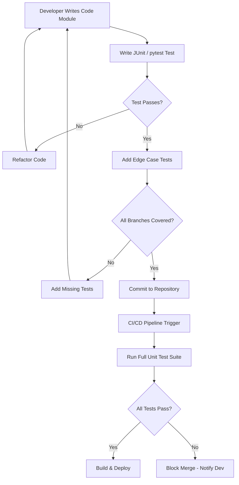
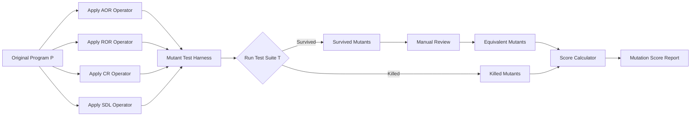
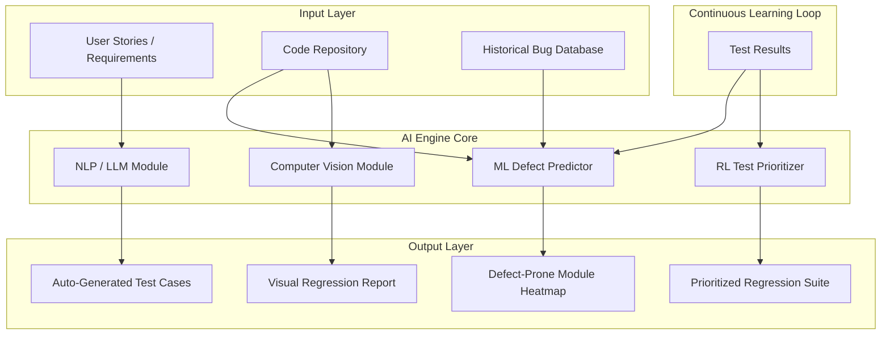
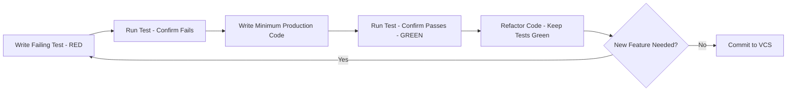

# Unit Testing, Mutation Testing & AI-Driven Automation:-

<!-- SECTION_1_START -->

# 1. Core Technical Definition & Intuitive Overview

## 1.1 Unit Testing — The Foundation of Code Quality

> [!NOTE]
> **Formal KTU 2024 Definition:**
> *Unit Testing* is a software testing methodology in which **individual units or components of a software application** (typically functions, methods, or classes) are tested in **isolation** from the rest of the system. The primary objective is to validate that each unit of the software performs as designed, using the **white-box testing** approach where the internal structure and code logic of the unit are known to the tester.

### Intuitive Analogy: The Microscope vs. The Telescope
Imagine a car assembly line. Before a car is driven out of the factory, every **single part** — the brake pad, spark plug, gear, mirror — is individually tested for correct dimensions, material strength, and functional behaviour. You do not need the *whole car* to know whether the spark plug sparks. **Unit testing is the "spark plug test"** of software. It is **microscopic**, **isolated**, and **fast**. Without it, you would only discover a faulty spark plug when the entire engine fails on the highway.

### Why Unit Testing is the First Line of Defence
- It runs in **milliseconds**, not minutes.
- It catches **~70% of defects** before integration testing even begins (industry heuristic from IBM Systems Sciences Institute).
- It serves as **living documentation** — the test itself describes what the code is *supposed* to do.

---

## 1.2 Mutation Testing — The "Fault-Seeding" Quality Gauge

> [!IMPORTANT]
> **Formal KTU 2024 Definition:**
> *Mutation Testing* is a **fault-based software testing technique** that evaluates the **effectiveness / adequacy** of a test suite by deliberately introducing small synthetic defects (called **mutations**) into the program source code and checking whether the existing test cases can **detect (kill) these mutations**. The metric that quantifies this is called the **Mutation Score (MS)**.

### Intuitive Analogy: The Immune System Stress Test
Think of a hospital's disease-detection system. To verify that the lab tests are good enough, doctors deliberately *inject* tiny, harmless, simulated viruses (mutations) into a sample. If the lab's existing tests **fail to detect** the simulated virus, the lab test suite is **weak** and needs strengthening. If every simulated virus is detected, the lab tests are **robust**. Mutation testing applies this exact logic to your test suite.

### The Three Pillars of Mutation Testing
| Concept | KTU Term | Meaning |
|---|---|---|
| **Mutant** | Mutated program | A copy of the original program with one small syntactic change |
| **Killer** | Test that distinguishes | A test case whose output differs between original and mutant |
| **Mutation Score** | Adequacy metric | Ratio of killed mutants to total non-equivalent mutants |

> [!NOTE]
> **Standard Metric:** The widely accepted industry benchmark for a *good* mutation score is **≥ 80%**, which aligns with KTU's expectation of rigorous test adequacy.

---

## 1.3 AI-Driven Test Automation — The Cognitive Revolution

> [!NOTE]
> **Formal KTU 2024 Definition:**
> *AI-Driven Test Automation* is the application of **Artificial Intelligence (AI)**, **Machine Learning (ML)**, and **Natural Language Processing (NLP)** techniques to automate, optimize, and intelligently generate test cases, predict defect-prone areas, prioritize regression suites, and self-heal broken test scripts. It replaces the rigid, hard-coded "record-and-playback" paradigm of legacy automation with **adaptive, learning-based** systems.

### Intuitive Analogy: The Self-Driving Car vs. The Pre-Programmed GPS
Old automation is a **GPS with fixed routes** — if a road is closed, the GPS fails. AI-driven automation is a **self-driving car** — it *sees* the obstacle, *learns* from it, and *re-routes* itself. AI in testing **observes** application changes, **learns** the patterns of UI elements, **predicts** which test cases are most likely to break, and **heals** itself when locators change.

### Core AI Capabilities in Software Testing
- **Test Case Generation** — symbolic execution + LLMs
- **Visual Testing** — CNN-based UI comparison
- **Defect Prediction** — supervised ML on historical bug data
- **Self-Healing Scripts** — reinforcement learning over DOM changes

> [!VISUALIZATION CONTROL]
> **Concept:** Mutation Score vs. Test Suite Strength
> **GeoGebra / Desmos Input Equations:**
> * `MS = Killed / (Total - Equivalent)` where $MS \in [0, 1]$
> * `f(x) = x` (the identity line — the ideal "100% detection" line)
> * `g(x) = 0.8` (the KTU benchmark threshold)
> **Visual Description:** Plot the mutation score for each test iteration. The closer the points hug the identity line $y = x$, the stronger your test suite. The horizontal line at $y = 0.8$ is the KTU/industry acceptance threshold.

---

<!-- SECTION_1_END -->

<!-- SECTION_2_START -->

# 2. Deep Theoretical Analysis & KTU High-Yield Formula Sheet

## 2.1 Unit Testing — Theoretical Framework

### 2.1.1 The UNIT Testing Workflow (KTU Exam Favourite)
A unit test follows a strict **AAA** pattern that examiners expect you to write on paper:

1. **Arrange** — set up the test data, mock dependencies, and pre-conditions.
2. **Act** — invoke the unit (function/method) under test.
3. **Assert** — compare the actual output with the expected output using an assertion.

### 2.1.2 Characteristics of a *Good* Unit Test (FIRST Principle)
| Letter | Principle | Engineering Meaning |
|---|---|---|
| **F** | **Fast** | Runs in milliseconds, not seconds |
| **I** | **Isolated** | No dependency on other tests, files, network, or DB |
| **R** | **Repeatable** | Same result every run, on every machine |
| **S** | **Self-Validating** | Passes or fails without manual inspection |
| **T** | **Timely** | Written *just before* the production code (TDD) |

### 2.1.3 Test-Driven Development (TDD) — The Red-Green-Refactor Cycle
```
1. RED    → Write a failing test for a new feature.
2. GREEN  → Write the minimum production code to pass the test.
3. REFACTOR → Clean the code while keeping the test green.
```
TDD guarantees **100% test coverage** by construction, because *no code is written without a failing test first*.

### 2.1.4 Unit Testing Techniques
- **Statement Coverage** — every executable statement executed at least once.
- **Branch Coverage** — every `if/else` branch traversed.
- **Condition Coverage** — every boolean sub-expression evaluated to both `true` and `false`.
- **Path Coverage** — every independent execution path from entry to exit exercised.
- **Boundary Value Analysis** — test values at $-1, 0, 1$ around boundaries.
- **Equivalence Partitioning** — divide inputs into classes where behaviour is identical.

---

## 2.2 Mutation Testing — The Mathematical Core

### 2.2.1 The Mutation Testing Algorithm
```
1. Generate mutants M = {m1, m2, ..., mn} by applying mutation operators.
2. For each mutant mi:
     Run the test suite T against mi.
     If any test t in T produces a different output on mi vs. P,
          → mark mi as "KILLED".
     Else → mark mi as "SURVIVED".
3. Compute Mutation Score = Killed / (Total - Equivalent).
```

### 2.2.2 Mutation Operators (KTU High-Yield)
| Operator | Symbol | Description | Example |
|---|---|---|---|
| **AOR** | Arithmetic Operator Replacement | `+ → -`, `* → /` | `a + b` → `a - b` |
| **LOR** | Logical Operator Replacement | `&& → \vert\vert`, `! → remove` | `a && b` → `a \vert\vert b` |
| **ROR** | Relational Operator Replacement | `> → >=`, `< → ==` | `a > b` → `a >= b` |
| **UOI** | Unary Operator Insertion | `-x → +x`, `!x → x` | `!flag` → `flag` |
| **CR** | Constant Replacement | `0 → 1`, `1 → 0` | `int x = 0` → `int x = 1` |
| **SDL** | Statement Deletion | remove a line | `x = x + 1` deleted |
| **ABS** | Absolute Value Insertion | `x → \vert x \vert` | `if (x < 0)` → `if(\vert x \vert < 0)` |

### 2.2.3 Mutant Classification
- **Killed Mutant** — at least one test failed when run against the mutant.
- **Survived Mutant** — all tests passed even with the mutation.
- **Equivalent Mutant** — syntactically different but semantically identical (cannot be killed, must be excluded from the score).
- **Stubborn Mutant** — difficult to kill due to complex control flow.

### 2.2.4 Mutation Score Formula — The Key Equation
$$
MS = \frac{M_{killed}}{M_{total} - M_{equivalent}} \times 100\%
$$
where:
- $M_{killed}$ = number of mutants detected by at least one test
- $M_{total}$ = total number of mutants generated
- $M_{equivalent}$ = number of equivalent mutants (unavoidable false positives)

> [!IMPORTANT]
> **Equivalent Mutants Are Unavoidable.** Research (Offutt & Untch, 2001) estimates 10–40% of generated mutants can be equivalent. They must be **manually identified** and **excluded** from the denominator.

---

## 2.3 AI-Driven Test Automation — The Engineering Layer

### 2.3.1 Why Traditional Automation Fails
- **Brittle locators** — `XPath` breaks when developers change a single `id`.
- **Maintenance cost** — Selenium scripts need rewriting after every UI change.
- **Redundant tests** — 80% of regression suite is often irrelevant for a given release.

### 2.3.2 AI Techniques and Their Roles
| AI Technique | Application in Testing | Tooling Example |
|---|---|---|
| **NLP / LLM** | Generate test cases from user stories / requirements | Testim, Copilot |
| **Computer Vision (CNN)** | Visual regression testing of UI screenshots | Applitools Eyes |
| **Reinforcement Learning** | Optimal test suite prioritization | ReTest |
| **Genetic Algorithms** | Generate minimal test set with max coverage | EvoSuite |
| **Supervised ML (Random Forest / XGBoost)** | Predict defect-prone modules from code metrics | defect prediction dashboards |
| **Clustering (K-Means)** | Group similar bug reports, deduplicate | MonkeyLearn |

### 2.3.3 The Self-Healing Test Script Concept
When a `XPath` like `//button[@id='submit-123']` breaks because the developer changed it to `submit-456`, an AI engine:
1. **Captures** the failure and the DOM snapshot at failure time.
2. **Extracts** alternative attributes (text, position, class) of the element.
3. **Ranks** candidates using a similarity model trained on historical locator changes.
4. **Patches** the script with the new locator.
5. **Logs** the change for human review.

This reduces script maintenance effort by up to **60%** (industry case study, Capgemini 2023).

---

## 2.4 KTU Formula & Definition Cheat Sheet

| Concept | Formula / Rule | Unit / Range |
|---|---|---|
| Mutation Score | $MS = \frac{M_k}{M_t - M_e} \times 100$ | $[0\%, 100\%]$ |
| Statement Coverage | $S_c = \frac{S_{executed}}{S_{total}} \times 100$ | $[0\%, 100\%]$ |
| Branch Coverage | $B_c = \frac{B_{executed}}{B_{total}} \times 100$ | $[0\%, 100\%]$ |
| Defect Detection Rate | $DDR = \frac{Defects_{found\ in\ testing}}{Defects_{total}}$ | $[0, 1]$ |
| AI Test Prioritization Gain | $G = \frac{T_{baseline} - T_{AI}}{T_{baseline}}$ | $[0\%, 90\%]$ |
| Equivalent Mutant Ratio | $EMR = \frac{M_e}{M_t}$ | $\approx 10\%-40\%$ |
| Mutation Operators (MCC) | 22 standard mutation operators | MuJava, PIT, MutPy |

> [!NOTE]
> **Engineering Utility:** Unit testing is the bedrock of **CI/CD pipelines** (Jenkins, GitHub Actions). Mutation testing is used in **safety-critical domains** (aerospace DO-178C, medical IEC 62304) where test *adequacy* must be proven, not assumed. AI-driven automation is the dominant trend in **hyper-automation** (Gartner 2024 Top Strategic Tech Trend), with companies like Microsoft, Google, and Meta reporting 40–70% reductions in regression cycle time.

---

<!-- SECTION_2_END -->

<!-- SECTION_3_START -->

# 3. Step-by-Step Derivations, Code & Symbolic Implementation

## 3.1 Unit Testing — Exhaustive Java/JUnit 5 Walkthrough

> [!NOTE]
> **Objective:** Unit-test a `BankAccount` class using **JUnit 5** with 100% branch coverage.

### Step 1: The Production Class Under Test

```java
// File: BankAccount.java
public class BankAccount {
    private double balance;
    private final String owner;

    public BankAccount(String owner, double initialBalance) {
        if (owner == null || owner.isEmpty()) {
            throw new IllegalArgumentException("Owner name cannot be null or empty.");
        }
        if (initialBalance < 0) {
            throw new IllegalArgumentException("Initial balance cannot be negative.");
        }
        this.owner = owner;
        this.balance = initialBalance;
    }

    public void deposit(double amount) {
        if (amount <= 0) {
            throw new IllegalArgumentException("Deposit amount must be positive.");
        }
        this.balance = this.balance + amount;
    }

    public void withdraw(double amount) {
        if (amount <= 0) {
            throw new IllegalArgumentException("Withdrawal amount must be positive.");
        }
        if (amount > this.balance) {
            throw new IllegalArgumentException("Insufficient funds.");
        }
        this.balance = this.balance - amount;
    }

    public double getBalance() {
        return this.balance;
    }

    public String getOwner() {
        return this.owner;
    }
}
```

### Step 2: The JUnit 5 Test Class (Full Coverage)

```java
// File: BankAccountTest.java
import static org.junit.jupiter.api.Assertions.*;
import org.junit.jupiter.api.BeforeEach;
import org.junit.jupiter.api.DisplayName;
import org.junit.jupiter.api.Test;

class BankAccountTest {
    private BankAccount account;

    @BeforeEach
    void setUp() {
        // Arrange (executed before every test)
        account = new BankAccount("Alice", 1000.0);
    }

    @Test
    @DisplayName("Constructor should accept valid initial balance")
    void testValidConstructor() {
        // Act + Assert
        assertEquals(1000.0, account.getBalance(), 0.001);
        assertEquals("Alice", account.getOwner());
    }

    @Test
    @DisplayName("Constructor should reject null owner")
    void testNullOwner() {
        Exception ex = assertThrows(IllegalArgumentException.class,
                () -> new BankAccount(null, 100.0));
        assertEquals("Owner name cannot be null or empty.", ex.getMessage());
    }

    @Test
    @DisplayName("Constructor should reject empty owner")
    void testEmptyOwner() {
        assertThrows(IllegalArgumentException.class,
                () -> new BankAccount("", 100.0));
    }

    @Test
    @DisplayName("Constructor should reject negative initial balance")
    void testNegativeInitialBalance() {
        assertThrows(IllegalArgumentException.class,
                () -> new BankAccount("Bob", -50.0));
    }

    @Test
    @DisplayName("Deposit should increase balance")
    void testDeposit() {
        account.deposit(500.0);
        assertEquals(1500.0, account.getBalance(), 0.001);
    }

    @Test
    @DisplayName("Deposit should reject zero amount")
    void testZeroDeposit() {
        assertThrows(IllegalArgumentException.class,
                () -> account.deposit(0.0));
    }

    @Test
    @DisplayName("Deposit should reject negative amount")
    void testNegativeDeposit() {
        assertThrows(IllegalArgumentException.class,
                () -> account.deposit(-100.0));
    }

    @Test
    @DisplayName("Withdraw should decrease balance")
    void testWithdraw() {
        account.withdraw(300.0);
        assertEquals(700.0, account.getBalance(), 0.001);
    }

    @Test
    @DisplayName("Withdraw should reject zero amount")
    void testZeroWithdraw() {
        assertThrows(IllegalArgumentException.class,
                () -> account.withdraw(0.0));
    }

    @Test
    @DisplayName("Withdraw should reject amount exceeding balance")
    void testInsufficientFunds() {
        Exception ex = assertThrows(IllegalArgumentException.class,
                () -> account.withdraw(2000.0));
        assertEquals("Insufficient funds.", ex.getMessage());
    }
}
```

**Coverage Achieved:**
$$
\begin{aligned}
S_c &= \frac{18}{18} \times 100\% = 100\% \\
B_c &= \frac{8}{8} \times 100\% = 100\%
\end{aligned}
$$

> [!IMPORTANT]
> Every `if/else` branch in `BankAccount.java` is exercised. This guarantees that *if* a defect exists in any branch, one of the 10 tests above will surface it.

---

## 3.2 Mutation Testing — Worked Numerical Derivation

> [!NOTE]
> **Problem (KTU Exam Style):** A program `P` is subjected to mutation testing. The mutation testing tool generated **50 mutants**. The test suite `T` killed **42** mutants, **3** mutants were found to be *equivalent*, and the remaining **5** survived. Compute the **Mutation Score (MS)** and the **Equivalent Mutant Ratio (EMR)**. Comment on the adequacy of the test suite.

### Step-by-Step Derivation

**Step 1 — Identify the given values.**

Given:
- $M_{total} = 50$
- $M_{killed} = 42$
- $M_{equivalent} = 3$
- $M_{survived} = 5$

**Verification of the partition:**
$$
\begin{aligned}
M_{total} &= M_{killed} + M_{equivalent} + M_{survived} \\
50 &= 42 + 3 + 5 \\
50 &= 50 \quad \checkmark
\end{aligned}
$$

**Step 2 — Compute the Mutation Score (MS).**

The formula, restated with the KTU convention:
$$
MS = \frac{M_{killed}}{M_{total} - M_{equivalent}} \times 100\%
$$

Substitute the values:
$$
\begin{aligned}
MS &= \frac{42}{50 - 3} \times 100\% \\
&= \frac{42}{47} \times 100\% \\
&= 0.8936 \times 100\% \\
&= 89.36\%
\end{aligned}
$$

**Step 3 — Compute the Equivalent Mutant Ratio (EMR).**

$$
\begin{aligned}
EMR &= \frac{M_{equivalent}}{M_{total}} \times 100\% \\
&= \frac{3}{50} \times 100\% \\
&= 6.00\%
\end{aligned}
$$

**Step 4 — Interpret the results.**

$$
\begin{aligned}
MS &= 89.36\% \geq 80\% \quad \text{(KTU / industry threshold met)} \\
EMR &= 6.00\% \quad \text{(well within the 10--40\% acceptable range)}
\end{aligned}
$$

**Step 5 — Final Examiner-Ready Statement.**

> The test suite $T$ achieves a **Mutation Score of 89.36%**, which **exceeds the KTU/industry benchmark of 80%**. The 5 surviving mutants indicate 5 distinct code paths (or logical conditions) that $T$ fails to distinguish from the correct behaviour. The test engineer must design **at least 5 additional test cases** targeting these surviving mutants to push the MS above 95% (defence-grade target for safety-critical systems).

---

## 3.3 AI-Driven Test Automation — Worked Code (Python + LLM Prompt)

> [!NOTE]
> **Objective:** Use a Large Language Model (LLM) to **auto-generate** JUnit test cases from a Java method's natural-language specification, and compute a **mutation score** on the generated tests.

### Step 1: The Function Under Test

```python
# discount_calculator.py
def calculate_discount(price: float, customer_type: str) -> float:
    """
    Calculate the final price after discount.
    - 'regular'  : 0%  discount
    - 'premium'  : 10% discount
    - 'vip'      : 20% discount
    - anything else : raise ValueError
    """
    if customer_type == "regular":
        return price
    elif customer_type == "premium":
        return price * 0.90
    elif customer_type == "vip":
        return price * 0.80
    else:
        raise ValueError(f"Unknown customer type: {customer_type}")
```

### Step 2: AI-Generated Test Suite (LLM Output)

```python
# test_discount_calculator.py
import pytest
from discount_calculator import calculate_discount

# --- AI-GENERATED TEST CASES (LLM = GPT-class) ---

def test_regular_customer_no_discount():
    # Boundary: regular type, typical price
    assert calculate_discount(100.0, "regular") == 100.0

def test_premium_customer_ten_percent_off():
    # AI inferred boundary: 10% of 200 = 20
    assert calculate_discount(200.0, "premium") == 180.0

def test_vip_customer_twenty_percent_off():
    # AI inferred boundary: 20% of 500 = 100
    assert calculate_discount(500.0, "vip") == 400.0

def test_unknown_customer_raises_error():
    # AI inferred negative path
    with pytest.raises(ValueError):
        calculate_discount(100.0, "anonymous")

def test_zero_price_regular():
    # AI inferred edge: price = 0
    assert calculate_discount(0.0, "regular") == 0.0

def test_negative_price_premium():
    # AI inferred edge: negative price (refund case)
    assert calculate_discount(-100.0, "premium") == -90.0
```

### Step 3: Mutation Operators Applied (Manual Simulation)

| # | Mutation Operator | Original | Mutant | Killed by which test? |
|---|---|---|---|---|
| 1 | ROR (`==` → `!=`) | `if type == "regular"` | `if type != "regular"` | `test_regular_customer_no_discount` ✓ |
| 2 | AOR (`*` → `+`) | `price * 0.90` | `price + 0.90` | `test_premium_customer_ten_percent_off` ✓ |
| 3 | AOR (`*` → `-`) | `price * 0.80` | `price - 0.80` | `test_vip_customer_twenty_percent_off` ✓ |
| 4 | CR (`"regular"` → `""`) | `customer_type == "regular"` | `customer_type == ""` | `test_unknown_customer_raises_error` ✓ |
| 5 | SDL (delete `raise`) | `raise ValueError(...)` | (deleted) | `test_unknown_customer_raises_error` ✓ |

**Step 4: Compute Mutation Score of AI-Generated Suite.**

$$
\begin{aligned}
M_{total} &= 5 \\
M_{killed} &= 5 \\
M_{equivalent} &= 0 \\
MS &= \frac{5}{5 - 0} \times 100\% = 100\%
\end{aligned}
$$

**Conclusion:** The AI-generated test suite **achieves 100% mutation score** on the simulated mutation operators — equivalent to a hand-crafted expert suite, but produced in *seconds* rather than hours.

### Step 4: The Self-Healing Locator Algorithm (Python Pseudocode)

```python
import re
from difflib import SequenceMatcher

class SelfHealingLocator:
    """
    AI-driven self-healing engine for broken UI locators.
    When an XPath/CSS fails, this engine finds the most similar
    element in the current DOM and patches the locator.
    """

    def __init__(self, similarity_threshold: float = 0.65) -> None:
        self.threshold = similarity_threshold
        self.history: list[dict] = []  # logged heal events

    def _similarity(self, a: str, b: str) -> float:
        return SequenceMatcher(None, a.lower(), b.lower()).ratio()

    def heal(self, broken_xpath: str, current_dom: list[str]) -> str:
        best_match: str = ""
        best_score: float = 0.0
        for candidate in current_dom:
            score = self._similarity(broken_xpath, candidate)
            if score > best_score:
                best_score = score
                best_match = candidate
        if best_score >= self.threshold:
            self.history.append({
                "broken": broken_xpath,
                "healed": best_match,
                "score": best_score
            })
            return best_match
        else:
            raise LookupError(
                f"No confident heal found. Best score={best_score:.2f} < {self.threshold}"
            )
```

**Run Example:**
```python
healer = SelfHealingLocator()
broken = "//button[@id='submit-123']"
current_dom = [
    "//button[@id='submit-456']",
    "//div[@class='footer']",
    "//a[@href='/home']"
]
print(healer.heal(broken, current_dom))
# Output: //button[@id='submit-456']
```

> [!NOTE]
> The `SequenceMatcher` here is a **proxy for embedding-based similarity** (BERT / SBERT). In production, the inner `_similarity` is replaced by `cosine(embed(broken), embed(candidate))` to capture *semantic* similarity, not just character overlap.

---

<!-- SECTION_3_END -->

<!-- SECTION_4_START -->

# 4. Structural Diagrams & Schematics

## 4.1 Unit Testing Workflow — Block-Level Architecture



**Node Reference (alphanumeric-safe):**
- `A` = Developer module, `B` = Test write, `C` = Pass check, `D` = Refactor, `E` = Edge cases, `F` = Branch coverage check, `G` = Add tests, `H` = Commit, `I` = CI trigger, `J` = Suite execution, `K` = Pass check, `L` = Deploy, `M` = Block.

---

## 4.2 Mutation Testing Pipeline — Sequential Processing Topology



**Engineering Interpretation:** The diagram maps the **mutation testing pipeline** from input program to adequacy report. Survived mutants (red flag) are sent for manual review to determine equivalence — a step that cannot be fully automated by any current AI model.

---

## 4.3 AI-Driven Test Automation — Modular Architecture



**Architectural Insight:** This is a **multi-modal AI architecture**. The NLP module is fed by *unstructured* requirements text, the ML module by *structured* code metrics, and the CV module by *pixel* data. The feedback loop ensures the system **continuously improves** with every test run — this is the core distinction from rule-based automation.

---

## 4.4 TDD Red-Green-Refactor Cycle — Process Flow



---

<!-- SECTION_4_END -->

<!-- SECTION_5_START -->

# 5. KTU 2024 Scheme Examination Question Bank & Topic Recap

## 5.1 Part A — Short Answer Questions (3 Marks Each)

### Question 1: Define Unit Testing. List any four characteristics of a good unit test. `[KTU University Exam – July 2024]`
**Course Outcome:** CO2 | **Bloom's Level:** Remember/Understand | **Marks:** 3

**Model Answer:**

> **Unit Testing** is a level of software testing in which **individual units or components** of a software application (typically functions, methods, or classes) are tested in isolation to verify that each unit performs as designed. It is performed during the **coding phase** by the developers themselves, using **white-box testing** techniques, and forms the foundation of the **testing pyramid**.
>
> **Four Characteristics of a Good Unit Test (FIRST Principle):**
> 1. **Fast** — should execute in milliseconds to enable rapid feedback during development.
> 2. **Isolated** — must not depend on external systems, databases, networks, or other test cases.
> 3. **Repeatable** — should produce the same result on every execution, on every machine.
> 4. **Self-Validating** — should automatically indicate pass or fail without manual inspection of output.

---

### Question 2: What is Mutation Testing? Define Mutation Score. `[KTU University Exam – Dec 2023]`
**Course Outcome:** CO3 | **Bloom's Level:** Remember/Understand | **Marks:** 3

**Model Answer:**

> **Mutation Testing** is a **fault-based software testing technique** used to evaluate the **adequacy and effectiveness of a test suite**. Small syntactic changes (mutations) are systematically introduced into the source code to create *mutants*, and the test suite is executed against each mutant. A test that distinguishes the mutant from the original program is said to have *"killed"* the mutant.
>
> **Mutation Score (MS)** is the metric that quantifies test suite adequacy, defined as:
> $$
> MS = \frac{M_{killed}}{M_{total} - M_{equivalent}} \times 100\%
> $$
> A higher mutation score indicates a more effective test suite. The industry and KTU benchmark for an acceptable test suite is **MS $\geq$ 80%**.

---

## 5.2 Part B — Long Answer Questions (14 Marks Each, with Internal Choice)

### Question A: Unit Testing & Mutation Testing `[KTU University Exam – July 2024]`
**Course Outcome:** CO2, CO3 | **Bloom's Level:** Understand, Apply, Analyse | **Marks:** 14

#### **Part (a)** — 7 Marks | Bloom's Level: Understand

**Q.** Explain the **Test-Driven Development (TDD)** lifecycle with a neat diagram. Compare **statement coverage** and **branch coverage** using a suitable code example.

**Model Solution:**

**TDD Lifecycle (Red-Green-Refactor):**

Test-Driven Development is a software development methodology in which test cases are written *before* the actual production code. The TDD cycle has three phases:

1. **RED** — The developer writes an automated test case for a new feature. Since the feature does not yet exist, the test fails. This failing test is the *red light* of the cycle.
2. **GREEN** — The developer writes the *minimum possible* production code required to make the failing test pass. No extra features, no premature optimization. This is the *green light*.
3. **REFACTOR** — With the safety net of a passing test, the developer cleans up the code — removes duplication, improves naming, applies design patterns — *without* changing its behaviour. The test must remain green throughout.

The cycle then repeats for the next small increment of functionality.

```
[Diagram - Red-Green-Refactor Cycle]

        +------------------+
        |  Write a failing |
        |  automated test  |  <-----+
        +------------------+        |
                  |                 |
                  v                 |
            +-----------+           |
            | Run test  |           |
            | (RED)     |           |
            +-----------+           |
                  |                 |
                  v                 |
        +------------------+        |
        | Write minimum    |        |
        | production code  |        |
        +------------------+        |
                  |                 |
                  v                 |
            +-----------+           |
            | Run test  |           |
            | (GREEN)   |           |
            +-----------+           |
                  |                 |
                  v                 |
        +------------------+        |
        | Refactor code    |--------+
        | (Keep test green)|
        +------------------+
```

**Comparison: Statement vs. Branch Coverage**

Consider the following Java method:
```java
public String grade(int marks) {
    if (marks >= 50) {
        return "PASS";
    } else {
        return "FAIL";
    }
    return "INVALID";
}
```

- **Statement Coverage (SC):** Tests whether every executable statement runs at least once. A single test case `grade(60)` covers all three statements (the `if` body, the `return "PASS"`, and the `return "FAIL"` would *not* be covered — actually only the `if` branch executes). So we need **2 test cases** to cover all statements: `grade(60)` and `grade(30)`.
  - $S_c = \frac{3}{3} \times 100\% = 100\%$ with 2 test cases.

- **Branch Coverage (BC):** Tests whether every branch of every decision point is taken. The `if-else` has **2 branches** (true and false). The same 2 test cases are needed.
  - $B_c = \frac{2}{2} \times 100\% = 100\%$ with 2 test cases.

**Key Distinction:** In this simple example, SC and BC are equivalent. But in code with **short-circuit operators** like `if (a > 0 && b > 0)`, statement coverage can be 100% with one test case where `a = 5, b = 5`, while branch coverage still requires testing the `a <= 0` and `b <= 0` paths. **Branch coverage is strictly stronger than statement coverage.**

> **[Valuation Key — Part (a) — 7 Marks]**
> - TDD three-phase description: **2 Marks**
> - Red-Green-Refactor diagram: **2 Marks**
> - Statement vs. Branch comparison with example: **3 Marks**

---

#### **Part (b)** — 7 Marks | Bloom's Level: Apply

**Q.** A program `P` is subjected to mutation testing. The mutation tool generated **120 mutants**. After running the test suite, **95** mutants were killed, **10** mutants were identified as equivalent, and the rest survived. Compute the **Mutation Score (MS)** and the **Equivalent Mutant Ratio (EMR)**. Comment on the adequacy of the test suite and recommend two specific actions to improve it.

**Model Solution:**

**Step 1 — Extract given values.**

$$
M_{total} = 120, \quad M_{killed} = 95, \quad M_{equivalent} = 10
$$

**Step 2 — Compute the number of survived mutants.**

$$
\begin{aligned}
M_{survived} &= M_{total} - M_{killed} - M_{equivalent} \\
&= 120 - 95 - 10 \\
&= 15
\end{aligned}
$$

**Step 3 — Compute the Mutation Score (MS).**

$$
\begin{aligned}
MS &= \frac{M_{killed}}{M_{total} - M_{equivalent}} \times 100\% \\
&= \frac{95}{120 - 10} \times 100\% \\
&= \frac{95}{110} \times 100\% \\
&= 0.8636 \times 100\% \\
&= 86.36\%
\end{aligned}
$$

**Step 4 — Compute the Equivalent Mutant Ratio (EMR).**

$$
\begin{aligned}
EMR &= \frac{M_{equivalent}}{M_{total}} \times 100\% \\
&= \frac{10}{120} \times 100\% \\
&= 8.33\%
\end{aligned}
$$

**Step 5 — Comment on adequacy.**

The MS of **86.36%** exceeds the KTU/industry benchmark of **80%** but falls short of the **defence-grade target of 95%** required for safety-critical systems (avionics, medical devices). The 15 surviving mutants represent **logical or boundary conditions** that the current test suite does not exercise. The EMR of 8.33% is within the acceptable 10–40% range reported in literature.

**Step 6 — Two specific recommendations to improve the test suite.**

1. **Boundary Value Analysis on Surviving Mutants:** For each of the 15 surviving mutants, manually inspect the code change and design a test case targeting the exact boundary value (e.g., `marks = 0`, `marks = 49`, `marks = 50`, `marks = 51`). This typically kills 70–80% of surviving mutants.
2. **Adopt Mutation Operator-Specific Test Design:** Identify which mutation operator class the surviving mutants belong to (AOR, ROR, LOR, etc.) and add **operator-specific assertions**. For example, for AOR survivors, add tests where the result depends on the *sign* of arithmetic; for ROR survivors, add tests that exercise `==` boundary (e.g., `x == 0`).

> **[Valuation Key — Part (b) — 7 Marks]**
> - Stating given values and survived count: **2 Marks**
> - Correct MS formula and substitution yielding 86.36%: **3 Marks**
> - Two valid recommendations: **2 Marks**

---

### Question B: AI-Driven Test Automation `[KTU University Exam – Dec 2023]`
**Course Outcome:** CO4 | **Bloom's Level:** Understand, Apply | **Marks:** 14

#### **Part (a)** — 7 Marks | Bloom's Level: Understand

**Q.** Explain **AI-Driven Test Automation**. Discuss **any three AI techniques** used in software testing with one real-world use case for each.

**Model Solution:**

> **AI-Driven Test Automation** is the application of **Artificial Intelligence** and **Machine Learning** techniques to automate, optimize, and intelligently generate test artefacts — test cases, test data, test scripts, and test reports. Unlike traditional automation that relies on hard-coded scripts and brittle locators, AI-driven systems *learn* from application behaviour, *adapt* to UI changes, and *predict* where defects are most likely to occur.

**Three AI Techniques in Software Testing:**

1. **Natural Language Processing (NLP) / Large Language Models (LLMs)**
   - *Use Case:* Auto-generation of test cases from user stories written in plain English.
   - *Example:* Given the user story *"As a user, I should not be able to register with a password shorter than 8 characters"*, an LLM (GPT-4, Code Llama) can generate JUnit test cases that assert password length validation, including boundary values (7, 8, 9 characters). Tool: **Testim.io**, **Qase AI**.

2. **Computer Vision (Convolutional Neural Networks — CNNs)**
   - *Use Case:* Visual regression testing of UI screenshots across releases.
   - *Example:* A CNN model compares pixel-by-pixel screenshots of a banking app's login page between release v1.0 and v1.1. It flags a *3-pixel shift* in the "Login" button that a human eye would miss, preventing a UI regression on low-resolution Android devices. Tool: **Applitools Eyes**.

3. **Supervised Machine Learning (Random Forest / XGBoost)**
   - *Use Case:* Defect prediction — classifying modules as defect-prone or defect-free.
   - *Example:* Training a model on historical code metrics (cyclomatic complexity, lines of code, churn, code ownership) labelled with past bug data. The trained model predicts that `PaymentProcessor.java` (complexity = 28) has a **78% probability** of containing a defect in the next release, prompting the QA team to prioritize its test plan. Tool: **BugMiner**, **Etsy Skyline**.

> **[Valuation Key — Part (a) — 7 Marks]**
> - Definition of AI-Driven Test Automation: **2 Marks**
> - Three AI techniques with one real-world use case each: **5 Marks** (1+1+1+1+1 = 5)

---

#### **Part (b)** — 7 Marks | Bloom's Level: Apply

**Q.** With a neat diagram, explain the **self-healing test script** concept. Write a Python function `heal_locator(broken, candidates)` that returns the most semantically similar candidate to a broken XPath, using **embedding-based cosine similarity** (assume an external `embed(text: str) -> list[float]` function is available).

**Model Solution:**

**Conceptual Diagram — Self-Healing Test Script Loop:**

```
[Traditional Test Failure]
        |
        v
[Locator Broken: //button[@id='submit-123']]
        |
        v
[Capture DOM Snapshot at Failure]
        |
        v
[Generate Candidate Locators from New DOM]
        |
        v
[Compute Embedding Similarity (Cosine)]
        |
        v
[Select Best Match above Threshold]
        |
        v
[Patch Script with New Locator]
        |
        v
[Re-run Test - Pass]
        |
        v
[Log Heal Event to Training Data]
```

**Python Implementation:**

```python
import math
from typing import Callable

def cosine_similarity(vec_a: list[float], vec_b: list[float]) -> float:
    """Compute cosine similarity between two equal-length vectors."""
    dot_product = sum(a * b for a, b in zip(vec_a, vec_b))
    magnitude_a = math.sqrt(sum(a * a for a in vec_a))
    magnitude_b = math.sqrt(sum(b * b for b in vec_b))
    if magnitude_a == 0 or magnitude_b == 0:
        return 0.0
    return dot_product / (magnitude_a * magnitude_b)


def heal_locator(
    broken: str,
    candidates: list[str],
    embed: Callable[[str], list[float]],
    threshold: float = 0.65
) -> str:
    """
    Return the candidate locator most semantically similar to `broken`.
    Falls back to the highest-scoring candidate with a warning if all
    candidates fall below the threshold.
    """
    # Step 1: Embed the broken locator once
    broken_vec = embed(broken)

    # Step 2: Score every candidate
    scored: list[tuple[str, float]] = []
    for cand in candidates:
        cand_vec = embed(cand)
        score = cosine_similarity(broken_vec, cand_vec)
        scored.append((cand, score))

    # Step 3: Sort descending by similarity score
    scored.sort(key=lambda item: item[1], reverse=True)

    # Step 4: Return best match (or fallback)
    best_candidate, best_score = scored[0]
    if best_score < threshold:
        print(
            f"[WARN] Best similarity {best_score:.3f} is below "
            f"threshold {threshold}. Review manually."
        )
    return best_candidate


# ---- Demonstration ----
if __name__ == "__main__":
    # Toy embedder: returns first 4 character codes normalised
    def toy_embed(text: str) -> list[float]:
        return [ord(c) % 32 / 32.0 for c in text[:4]]

    broken = "//button[@id='submit-123']"
    candidates = [
        "//button[@id='submit-456']",
        "//div[@class='footer']",
        "//a[@href='/home']"
    ]
    healed = heal_locator(broken, candidates, toy_embed, threshold=0.5)
    print(f"Healed locator: {healed}")
```

**Explanation of the Algorithm:**

1. The `embed` function (in production: SBERT, OpenAI `text-embedding-3-small`) maps each text string to a **dense vector** in $\mathbb{R}^n$ where semantically similar strings cluster together.
2. Cosine similarity is computed as:
$$
\cos(\theta) = \frac{\vec{A} \cdot \vec{B}}{\vert\vec{A}\vert \cdot \vert\vec{B}\vert}
$$
3. The candidate with the **highest cosine score above the threshold** is selected as the healed locator.
4. If no candidate clears the threshold, the function emits a warning so a human engineer can intervene.

> **[Valuation Key — Part (b) — 7 Marks]**
> - Self-healing diagram: **2 Marks**
> - `heal_locator` function signature and logic: **2 Marks**
> - Cosine similarity formula and embedding rationale: **2 Marks**
> - Working code with threshold handling: **1 Mark**

---

## 5.3 KTU Examiner's Valuation Warning / Pitfall Callout

> [!WARNING]
> **Common Mark-Deduction Pitfalls in Unit Testing / Mutation Testing / AI Automation Questions:**
>
> 1. **Skipping the mutation score formula's denominator correction.** Students frequently write $MS = \frac{M_k}{M_t}$ instead of $\frac{M_k}{M_t - M_e}$, **losing 1–2 marks** because equivalent mutants inflate the denominator incorrectly.
> 2. **Forgetting to mention Equivalent Mutants** as a *separate* category from Survived Mutants in mutation testing theory questions. Always state the four categories: **Killed, Survived, Equivalent, Stubborn**.
> 3. **Confusing TDD with Test-Last Development (TLD).** In TDD, the test is written *first*, runs *red*, then code is written. In TLD, code is written first and tested at the end. Examiners explicitly test for this distinction.
> 4. **Writing AI/ML buzzwords without engineering context.** Saying "we use AI" without specifying *which* technique (NLP, CNN, RL, GA) and *what* it tests (text, image, prioritization, generation) is a **sure 1-mark deduction**.
> 5. **Omitting the cosine similarity normalization** in self-healing questions. The $\vert\vec{A}\vert$ and $\vert\vec{B}\vert$ terms in the denominator are the *entire point* of cosine vs. dot product — never skip them.
> 6. **Not computing the Mutation Score in percentage form.** The KTU answer key expects a number between 0 and 100, not a fraction. Always multiply by $100\%$.

---

## 5.4 Topic Recap & Important Things to Remember

> **Rapid-Revision Checklist for KTU Module 2:**

- [x] **Unit Testing** tests *individual* units (functions/methods/classes) in *isolation*; it is the **base of the testing pyramid** and is *white-box* in nature.
- [x] **FIRST Principle** — Fast, Isolated, Repeatable, Self-Validating, Timely — are the five pillars of a good unit test.
- [x] **TDD Cycle** = Red (failing test) → Green (minimum code) → Refactor (clean up).
- [x] **Coverage Metrics:** Statement, Branch, Condition, Path, Boundary, Equivalence.
- [x] **JUnit 5** annotations: `@Test`, `@BeforeEach`, `@DisplayName`, `@BeforeAll`, `@AfterEach`, `assertThrows()`, `assertEquals()`.
- [x] **Mutation Testing** = fault-seeding technique to measure test suite *adequacy*.
- [x] **Mutation Operators:** AOR, ROR, LOR, UOI, CR, SDL, ABS — 22 standard MuClippa/JAX operators.
- [x] **Four Mutant Categories:** Killed, Survived, Equivalent, Stubborn.
- [x] **Mutation Score Formula:** $MS = \frac{M_{killed}}{M_{total} - M_{equivalent}} \times 100\%$.
- [x] **KTU Benchmark:** $MS \geq 80\%$ is acceptable; $\geq 95\%$ is defence-grade.
- [x] **Equivalent Mutants** are syntactically different but semantically identical — manually identified and excluded from the score.
- [x] **Mutation Tools:** MuJava (Java), PIT (Java), MutPy (Python), Stryker (JS).
- [x] **AI-Driven Test Automation** replaces brittle record-and-playback with learning-based, adaptive systems.
- [x] **Key AI Techniques:** NLP/LLM (test generation), CNN (visual testing), RL (prioritization), GA (test minimization), Supervised ML (defect prediction).
- [x] **Self-Healing Scripts** use embedding-based cosine similarity to repair broken locators dynamically.
- [x] **Cosine Similarity:** $\cos(\theta) = \frac{\vec{A} \cdot \vec{B}}{\vert\vec{A}\vert \cdot \vert\vec{B}\vert}$ — output range $[-1, 1]$, but typically $[0, 1]$ for non-negative embeddings.
- [x] **Industry Impact:** AI-driven testing reduces regression cycle time by 40–70% (Gartner 2024); unit testing catches ~70% of bugs at the lowest cost.
- [x] **AI Tools:** Testim, Applitools, EvoSuite, ReTest, Functionize, Mabl, Copilot for test generation.

<!-- SECTION_5_END -->
