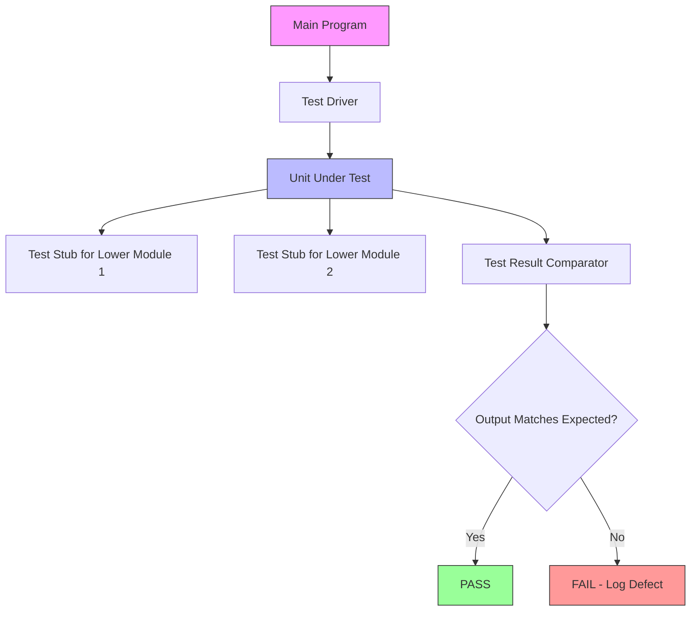
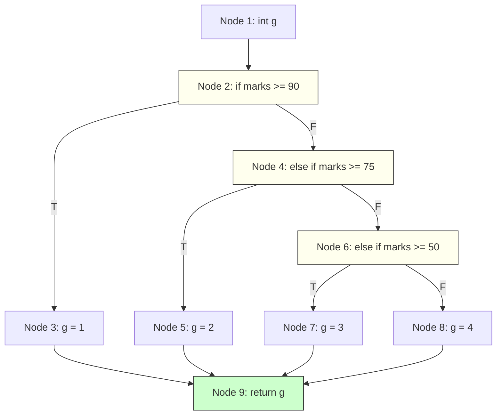
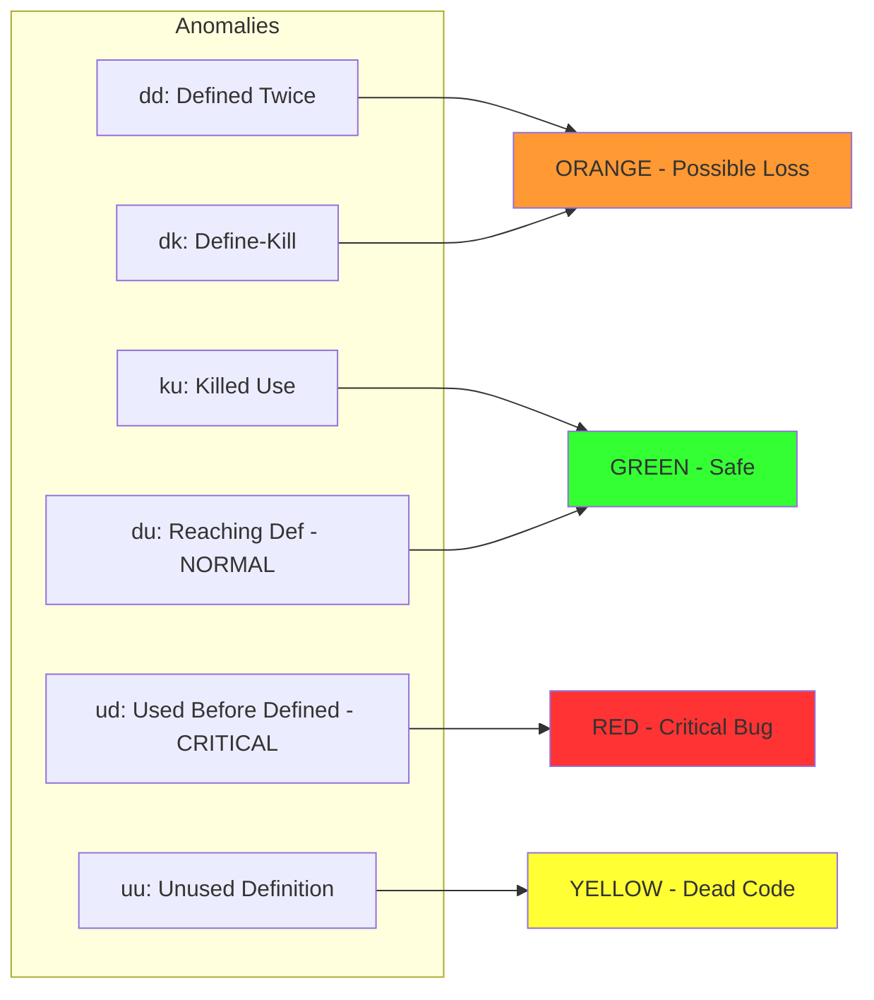
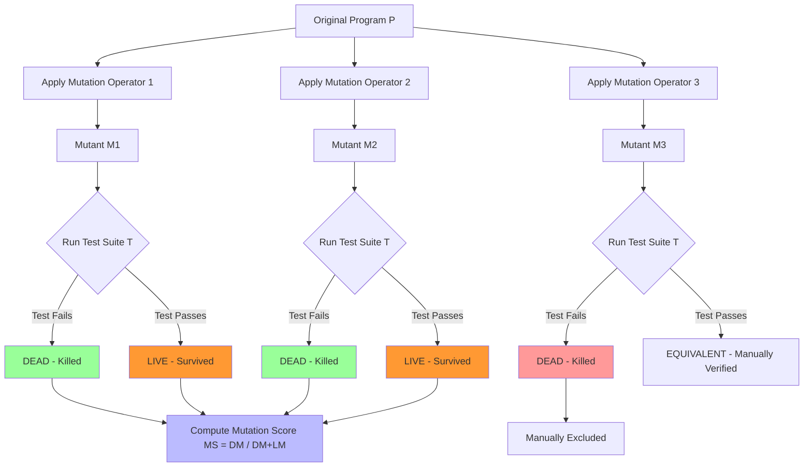
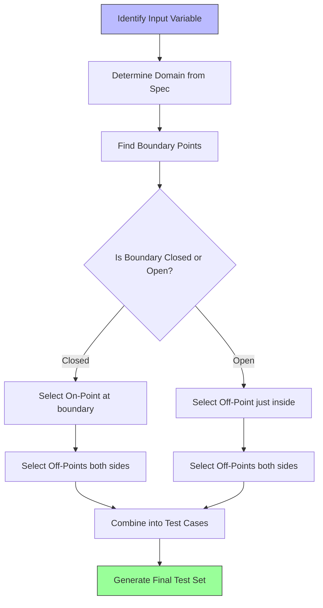
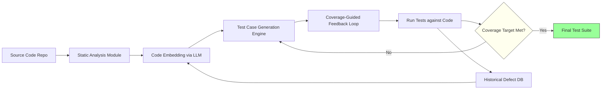
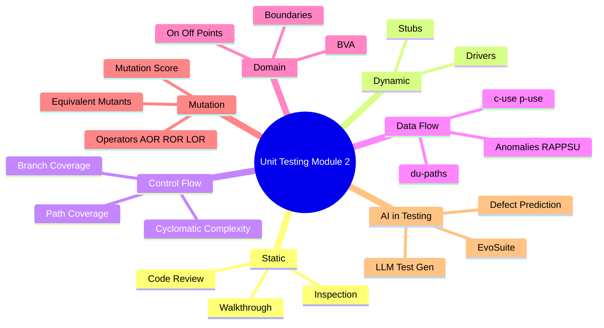

# Unit Testing- Static and Dynamic Unit Testing, control flow testing, data flow testing, domain testing

<!-- SECTION_1_START -->
# 1. Core Technical Definition & Intuitive Overview

## 1.1 Unit Testing — The Building Block of Software Quality

> [!IMPORTANT]
> **Formal KTU 2024 Definition (Syllabus-aligned):**
> *Unit Testing* is the lowest level of the software testing pyramid, wherein individual *units* (functions, methods, classes, or procedures) of a software system are tested in isolation from the rest of the program. It is the responsibility of the developer (not the QA team) and forms the **first line of structural defence** against defects.

### Conceptual Analogy — The "Brick Inspector" Metaphor
Imagine constructing a skyscraper. Before stacking bricks, every single brick is tapped with a small hammer (knock test) and visually inspected for cracks. **Unit testing is the equivalent of testing each brick *before* it is placed in the building.** If a brick is weak, you replace it cheaply. If you wait until the 50th floor, fixing it costs **1000x more** (Boehm's curve). That is exactly why KTU examiners and industry experts place heavy marks on unit-level techniques.

> [!NOTE]
> **Industry Standard Metric:** Industry benchmarks (Google, Microsoft) demand a minimum of **80%** unit test coverage on production code. A unit test that fails must be fixed *before* a new test is written (the **AAA Pattern** — *Arrange, Act, Assert*).

### Two Flavours of Unit Testing

| Aspect | Static Unit Testing | Dynamic Unit Testing |
| :--- | :--- | :--- |
| **Execution?** | ❌ Code is NOT executed | ✅ Code IS executed |
| **When?** | Before compilation / at code review | After compilation, during dev |
| **Technique** | Walkthroughs, Inspections, **Code Reviews** | White-box test execution |
| **Defects caught** | Syntax errors, logic flaws, standards violation | Runtime errors, output mismatches |
| **Cost** | **Cheapest** (no setup needed) | Moderate (needs test driver/stubs) |
| **KTU Weightage** | ~15% of Module 2 | ~85% of Module 2 |

---

## 1.2 Control Flow Testing — The "Roadmap" Strategy

> [!IMPORTANT]
> **Formal Definition:** *Control Flow Testing (CFT)* is a white-box, dynamic testing technique that derives test cases from the **control structure** of the program. It models the program as a directed **Control Flow Graph (CFG)** where nodes represent statements and edges represent the flow of control.

### Conceptual Analogy — The "City Map" Metaphor
Think of your program as a city map. Each intersection is a **node** (a statement), and each road is an **edge** (control transfer). *Control flow testing* is like a postal delivery driver who must ensure that every road in the city is driven on at least once. Some drivers cover every intersection (statement coverage), some cover every turn (branch coverage), and the most thorough drive down every possible route (path coverage).

> [!NOTE]
> **Key Terminology for KTU 2024:**
> - **Basic Block:** A maximal sequence of statements with a single entry and single exit.
> - **Cyclomatic Complexity (V(G)):** McCabe's metric that gives the *minimum number of independent paths* through a CFG.
> - **Independent Path:** A path that introduces at least one new edge not covered by previous paths.

---

## 1.3 Data Flow Testing — The "Variable Journey" Strategy

> [!IMPORTANT]
> **Formal Definition:** *Data Flow Testing (DFT)* is a structural testing technique that selects test paths based on the **definition and use of variables** in the program. It targets *data flow anomalies* such as using a variable before it is defined (use of uninitialized memory).

### Conceptual Analogy — The "Milk Bottle" Metaphor
Imagine tracking a milk bottle from the dairy (definition) to your table (use). Data flow testing asks:
1. Was the bottle ever filled? (*Defined*)
2. Did it ever reach the table? (*Used*)
3. Was it poured into a cup and then poured back? (*Defined twice — anomaly*)
4. Was it drunk but the bottle left on the table? (*Killed-use*)

This is exactly what DFT does with every variable in a program.

---

## 1.4 Domain Testing — The "Boundary Sentinel" Strategy

> [!IMPORTANT]
> **Formal Definition:** *Domain Testing* is a black-box (functional) testing technique where input/output variables are partitioned into **domains** (sets of valid inputs), and tests are designed to exercise the **boundaries** of these domains. Failures predominantly occur at *boundary values*, not at the centre of a domain.

### Conceptual Analogy — The "Bouncer at a Club" Metaphor
The bouncer (domain boundary) checks if your age is $\geq 18$. A tester would try age $= 17$ (just below), $18$ (on the boundary), and $19$ (just above). Bugs love to hide at the door — not in the middle of the dance floor. Domain testing catches them.

> [!NOTE]
> **Industry Term:** The famous *OFF-by-ONE error* is the #1 cause of domain-boundary bugs (e.g., writing `<` instead of `<=`, or starting a loop at 0 vs 1).

---

## 1.5 Mutation Testing — The "Robustness Stress Test"

> [!IMPORTANT]
> **Formal Definition:** *Mutation Testing* is a fault-based testing technique that evaluates the *quality* of an existing test suite by intentionally injecting small syntactic changes (**mutations**) into the program and checking whether the test suite can **detect (kill) the mutant**.

### Conceptual Analogy — The "Virus Simulator" Metaphor
A medical lab deliberately injects a weakened virus (mutant) into a blood sample to see if the immune system (test suite) detects and kills it. If the virus survives, the immune system is too weak — meaning your test suite has blind spots.

---

## 1.6 AI in Software Testing (Module-level hook)

> [!IMPORTANT]
> **Formal Definition (2024 Scheme Update):** The application of *Machine Learning (ML)* and *Large Language Models (LLMs)* to automate test case generation, defect prediction, and oracle generation in unit testing.

### Conceptual Analogy — The "Co-Pilot" Metaphor
AI in testing is like an autopilot that watches the pilot fly, learns the routes (code paths), and then suggests test cases for new routes. Tools like **GitHub Copilot**, **DeepTest**, and **EvoSuite** (uses genetic algorithms) are industry-grade AI testing tools.

> [!VISUALIZATION CONTROL]
> **Concept:** Unit Testing Hierarchy & Module 2 Coverage Map
> **GeoGebra / Desmos Input Equations:**
> * `Point(1, 4) = "Module 2"` 
> * `Point(1, 3) = "Static"`
> * `Point(2, 3) = "Dynamic"`
> * `Point(0.5, 2) = "CFT"`
> * `Point(1.5, 2) = "DFT"`
> * `Point(2.5, 2) = "Domain"`
> * `Point(3.5, 2) = "Mutation"`
> * `Edge((1,4),(1,3))`, `Edge((1,4),(2,3))`, `Edge((1,3),(0.5,2))` etc.
> **Visual Description:** A tree-like hierarchy descending from "Unit Testing" at the top into its five major techniques, showing how mutation testing *evaluates* the test suite created by the other four techniques.
<!-- SECTION_1_END -->

<!-- SECTION_2_START -->
# 2. Deep Theoretical Analysis & KTU High-Yield Formula Sheet

## 2.1 Static Unit Testing — Deep Dive

### 2.1.1 Formal Reviews vs Walkthroughs vs Inspections

| Technique | Conducted By | Role of Author | Goal | KTU Tip |
| :--- | :--- | :--- | :--- | :--- |
| **Walkthrough** | Author leads the team | Author is the *presenter* | Learning \& idea exchange | Informal, no pre-prep |
| **Inspection** | Trained *Moderator* leads | Author is a *silent participant* | Find defects, follow a formal process | Most rigorous; uses checklists |
| **Technical Review** | Peers (not management) | Author presents | Evaluate conformance to standards | Documented decisions |

> [!IMPORTANT]
> **KTU 2024 Favourite Question:** *"Differentiate between Walkthrough and Inspection."* Memorise the table above — this is a guaranteed 3-mark question in Part A.

### 2.1.2 Static Analysis Tools (Automated)
- **Compilers** — catch syntax errors (e.g., `gcc -Wall`).
- **Linters** — enforce coding standards (e.g., `pylint`, `eslint`).
- **Formal Verifiers** — mathematically prove correctness (e.g., *SPIN*, *Isabelle*).

---

## 2.2 Dynamic Unit Testing — The Driver/Stub Architecture

> [!NOTE]
> **Terminology Mandatory for KTU:**
> - **Test Driver:** A *calling* program that invokes the unit under test (UUT) and passes test inputs.
> - **Test Stub:** A *dummy* program that mimics a lower-level module called by the UUT.

### Why are they needed?
A unit rarely stands alone — it calls other functions and is called by a main program. We must *replace* the surrounding context.

```
[Main Program]  →  [DRIVER]  →  [UNIT UNDER TEST]  →  [STUB for lower module]
                    (calls)         (real code)              (fake return)
```

---

## 2.3 Control Flow Testing — Deep Theoretical Analysis

### 2.3.1 McCabe's Cyclomatic Complexity (V(G))
The **single most important formula** in this module.

> [!IMPORTANT]
> **Cyclomatic Complexity — Three Equivalent Formulas:**
> $$V(G) = E - N + 2P$$
> $$V(G) = \text{Number of predicate nodes} + 1$$
> $$V(G) = \text{Number of regions in the CFG}$$
>
> Where:
> - $E$ = number of edges in the CFG
> - $N$ = number of nodes in the CFG
> - $P$ = number of connected components (always **2** for a single program: entry + exit)
> - $V(G)$ = **Minimum number of independent test paths** required

### 2.3.2 The Hierarchy of Coverage Criteria (KTU Golden Rule)
From *weakest* to *strongest* structural coverage:

$$
\boxed{\text{Statement} \;\subset\; \text{Branch} \;\subset\; \text{Condition/Decision} \;\subset\; \text{Multiple Condition} \;\subset\; \text{Path}}
$$

> [!NOTE]
> **Subsumption Rule (often asked in KTU Part B):** If a test set $T_1$ achieves coverage criterion $C_1$, and $C_1$ is stronger than $C_2$, then $T_1$ *also* achieves $C_2$. E.g., 100% path coverage $\Rightarrow$ 100% branch coverage $\Rightarrow$ 100% statement coverage. The reverse is **NOT** true.

### 2.3.3 Coverage Criteria Definitions

| Criterion | Symbol | What is Covered | Example |
| :--- | :--- | :--- | :--- |
| **Statement Coverage** | $C_0$ | Every executable statement | Every line executed at least once |
| **Branch Coverage** | $C_1$ | Every edge (True/False of each decision) | Both if-then and if-else taken |
| **Condition Coverage** | $C_2$ | Every Boolean sub-expression outcome | $(a>0)$ evaluated as T and F |
| **Decision/Condition** | $C_3$ | Both branch and condition | Compound |
| **Multiple Condition** | $C_4$ | Every combination of sub-conditions | All $2^n$ truth-table rows |
| **Path Coverage** | $C_5$ | Every independent path | All V(G) independent paths |

---

## 2.4 Data Flow Testing — Deep Theoretical Analysis

### 2.4.1 Anomaly Classification (KTU Favourite)
For every variable $v$, we track two events:
- **Definition (def):** Where $v$ is assigned a value (`v = ...`).
- **Use (use):** Where $v$ is read (`print(v)`, `if(v>0)`).

Uses are split into:
- **C-use (Computation use):** $v$ appears in a computation (`x = v + 5`).
- **P-use (Predicate use):** $v$ appears in a condition (`if (v > 0)`).

### 2.4.2 The Six Data Flow Anomalies (RAPPSU Pattern)

| # | Pattern | Name | Example | Severity |
| :--- | :--- | :--- | :--- | :--- |
| 1 | `dd` | Defined Twice | `x=5; x=10;` (overwrite, maybe bug) | ⚠️ Low |
| 2 | `du` (reaching) | **Reaching Definition** | `x=5; y = x*2;` (Normal) | ✅ Correct |
| 3 | `ku` | Killed Use | `x=5; x=10; use(x);` | ✅ Safe |
| 4 | `ud` | Used Before Defined | `use(x); x=5;` (Uninitialized!) | 🔴 **Critical** |
| 5 | `uu` | Unused | `x=5; ... (never used)` | 🟡 Dead code |
| 6 | `dk` | Define-Kill | `x=5; x=10;` (lost first value) | ⚠️ Low |

### 2.4.3 DU-Paths and Test Path Selection
A **du-path** (Definition-Use path) is a simple path from a definition of $v$ to a use of $v$ that has *no other definition* of $v$ in between. The *All-DU-Paths* strategy requires covering every du-path at least once — this is the **strongest** data flow criterion.

---

## 2.5 Domain Testing — Deep Theoretical Analysis

### 2.5.1 Boundary, Interior, and On/Off Points
For a domain $[a, b]$:
- **On-point:** A point *on* the boundary ($a$ or $b$).
- **Off-point:** A point *just inside* the boundary ($a + \epsilon$ or $b - \epsilon$).
- **In-point:** A point *deep inside* the domain.
- **Out-point:** A point *just outside* the boundary.

### 2.5.2 Closed vs Open Domain Intervals
- **Closed interval $[a, b]$:** Both $a$ and $b$ are included.
- **Open interval $(a, b)$:** Both are excluded.
- **Half-open $[a, b)$:** $a$ is included, $b$ is not.

> [!IMPORTANT]
> **KTU High-Yield Tip:** For a closed domain $[a, b]$, the *minimum* number of test points required by domain testing is **3**: $(a-\epsilon, a, (a+b)/2, b, b+\epsilon)$ — often 4 or 5 points if the closure type matters.

### 2.5.3 The Domain Testing Strategy (Step-by-Step Logic)
1. Identify each *input variable* and its domain from the specification.
2. Identify the *boundary points* (where domain behaviour changes).
3. Classify boundaries as *closed*, *open*, or *half-open*.
4. Select at least one **on-point** and one **off-point** on each side of every boundary.
5. Combine selected points into test cases (use *equivalence partitioning* to reduce combinations).

---

## 2.6 Mutation Testing — Deep Theoretical Analysis

### 2.6.1 Mutation Operators (Mutators)
Small, syntactically correct changes applied to the program:

| Operator | Source Code | Mutant |
| :--- | :--- | :--- |
| **AOR** (Arithmetic Op Replace) | `a + b` | `a - b` |
| **ROR** (Relational Op Replace) | `a > b` | `a >= b` |
| **LOR** (Logical Op Replace) | `a && b` | `a \|\| b` |
| **COR** (Conditional Op Replace) | `if(x==0)` | `if(x!=0)` |
| **SVR** (Statement Variable Replace) | `x` | `y` (or constant) |
| **SDL** (Statement Deletion) | `x = x + 1;` | (deleted) |
| **UOI** (Unary Operator Insert) | `+x` | `-x` |

### 2.6.2 Mutation Score Formula

> [!IMPORTANT]
> **Mutation Score (MS) — The Key Formula:**
> $$MS = \frac{DM}{(DM + LM)} \times 100$$
> Where:
> - $DM$ = Dead Mutants (killed by at least one test)
> - $LM$ = Live Mutants (survived the test suite)
> - $MS$ is expressed as a *percentage*; aim for **$\geq 80\%$** in industry.

> [!NOTE]
> **Equivalent Mutant Problem:** A mutant that produces the *same output* as the original program for *all* inputs is called an **Equivalent Mutant**. These can never be killed and are the #1 research challenge in mutation testing. They are *manually* identified.

---

## 2.7 AI in Software Testing (Module-context)

### 2.7.1 Categories of AI Application
- **Test Case Generation:** EvoSuite uses *genetic algorithms* to evolve test suites that maximise branch coverage.
- **Defect Prediction:** ML models (Random Forest, XGBoost) trained on historical code metrics predict which modules are bug-prone.
- **Oracle Generation:** LLMs predict the expected output for given inputs (non-trivial problem).
- **Visual Testing:** AI compares UI screenshots pixel-by-pixel using *perceptual hashing*.

### 2.7.2 Real-World Tools (Industry-Ready)
- **GitHub Copilot** — LLM-based test scaffolding.
- **Diffblue Cover** — AI unit test generation for Java.
- **EvoSuite** — Genetic algorithm test generator.
- **DeepTest** — CNN-based autonomous driving test generator.

---

## 2.8 Real-World Engineering Utility (Why this matters)

| Technique | Real-World Use Case |
| :--- | :--- |
| **Static** | Detecting SQL injection at code-review time (security) |
| **Dynamic** | Continuous Integration (CI) pipelines — `pytest --cov` |
| **CFT** | Aviation software (DO-178C) demands **100% Modified Condition/Decision Coverage (MC/DC)** |
| **DFT** | Catches uninitialized pointer bugs in C (causes of Heartbleed) |
| **Domain** | Banking — testing loan eligibility boundaries (age $\geq 18$, salary $\leq$ cap) |
| **Mutation** | NASA — used in safety-critical aerospace software |
| **AI Testing** | Auto-generation of 1000s of test inputs for self-driving cars |
<!-- SECTION_2_END -->

<!-- SECTION_3_START -->
# 3. Step-by-Step Derivations & Code/Symbolic Implementation

## 3.1 Worked Example 1 — Cyclomatic Complexity & Path Coverage

### Problem
Given the following C function, draw the CFG, compute $V(G)$ using *all three* formulas, and list the independent paths.

```c
int grade(int marks) {
    int g;                                     // Statement 1
    if (marks >= 90) {                         // Decision 2
        g = 1;                                 // Statement 3
    } else if (marks >= 75) {                  // Decision 4
        g = 2;                                 // Statement 5
    } else if (marks >= 50) {                  // Decision 6
        g = 3;                                 // Statement 7
    } else {
        g = 4;                                 // Statement 8
    }
    return g;                                  // Statement 9
}
```

### Step 3.1.1 — Draw the Control Flow Graph
We number each node:

- **Node 1:** `int g;`
- **Node 2:** `if (marks >= 90)` — Predicate node (T edge, F edge)
- **Node 3:** `g = 1;`
- **Node 4:** `else if (marks >= 75)` — Predicate node
- **Node 5:** `g = 2;`
- **Node 6:** `else if (marks >= 50)` — Predicate node
- **Node 7:** `g = 3;`
- **Node 8:** `g = 4;`
- **Node 9:** `return g;`

Edges:
- $1 \rightarrow 2$
- $2 \xrightarrow{T} 3$, $2 \xrightarrow{F} 4$
- $3 \rightarrow 9$, $4 \xrightarrow{T} 5$, $4 \xrightarrow{F} 6$
- $5 \rightarrow 9$, $6 \xrightarrow{T} 7$, $6 \xrightarrow{F} 8$
- $7 \rightarrow 9$, $8 \rightarrow 9$

### Step 3.1.2 — Count N, E, P

- $N = 9$ nodes
- $E = 11$ edges (1+2+2+1+2+1+1+1 = 11)
- $P = 1$ connected component (single program)

### Step 3.1.3 — Compute V(G) using all 3 formulas

**Formula 1:** $V(G) = E - N + 2P = 11 - 9 + 2(1) = 4$

**Formula 2:** $V(G) = \text{Predicate Nodes} + 1 = 3 + 1 = 4$

**Formula 3:** $V(G) = \text{Regions} = 4$ (3 rectangular if-branches + 1 outer region)

All three yield **V(G) = 4** ✅ — this is the **minimum number of independent test paths**.

### Step 3.1.4 — List the 4 Independent Paths

| Path # | Sequence | Test Input (marks) | Expected g |
| :--- | :--- | :--- | :--- |
| P1 | $1 \to 2 \to 3 \to 9$ | 95 | 1 |
| P2 | $1 \to 2 \to 4 \to 5 \to 9$ | 80 | 2 |
| P3 | $1 \to 2 \to 4 \to 6 \to 7 \to 9$ | 60 | 3 |
| P4 | $1 \to 2 \to 4 \to 6 \to 8 \to 9$ | 30 | 4 |

> [!NOTE]
> **KTU Valuation Tip:** Independent paths must introduce *at least one new edge*. P1 alone covers all of its edges; P2 introduces a new edge ($4\to5$); etc.

---

## 3.2 Worked Example 2 — Data Flow Anomaly Detection

### Problem
Trace the data flow anomalies in the following snippet for the variable `x`:

```c
1: scanf("%d", &x);        // def(x) at line 1
2: if (x > 100) {           // p-use(x) at line 2
3:     x = x - 50;          // def(x) and c-use(x) at line 3
4:     printf("%d", x);     // c-use(x) at line 4
5: }
6: y = x + 10;              // c-use(x) at line 6
7: x = 200;                 // def(x) at line 7
8: printf("%d", x);         // c-use(x) at line 8
```

### Step 3.2.1 — Catalogue Definitions and Uses
| Variable $x$ | Event | Line |
| :--- | :--- | :--- |
| def | = | 1 |
| p-use | > | 2 |
| def | = | 3 |
| c-use | $\to$ | 3 (RHS) |
| c-use | $\to$ | 4 |
| c-use | $\to$ | 6 |
| def | = | 7 |
| c-use | $\to$ | 8 |

### Step 3.2.2 — Identify du-pairs
- **(1, 2):** def $\to$ p-use (clear, no intervening def) ✅
- **(1, 6):** def $\to$ c-use (path bypasses def at 3) — *possible* if `x<=100`
- **(3, 3):** def $\to$ c-use within the same statement — **intra-statement**
- **(3, 4):** def $\to$ c-use ✅
- **(3, 6):** def $\to$ c-use ✅ (if $x>100$ branch taken)
- **(7, 8):** def $\to$ c-use ✅

### Step 3.2.3 — Check for Anomalies
- **No `ud` anomaly** (no use before def). ✅
- **No `uu` anomaly** (no unused def — all defs reach a use). ✅
- **`dk` at (1, 3):** def at line 1 is *killed* by def at line 3 if $x>100$. This is **expected behaviour**, not a bug.

> [!IMPORTANT]
> **Conclusion for KTU:** The code has **no data flow anomalies**. All definitions of `x` are *live* (reach a use). This is a clean example often given in exams.

---

## 3.3 Worked Example 3 — Domain Testing Boundaries

### Problem
A website grants a discount based on the age of the customer:
- Age $< 18$ → No discount.
- $18 \leq$ Age $\leq 60$ → 10% discount.
- Age $> 60$ → 20% discount.

### Step 3.3.1 — Identify Domains and Boundaries

| Domain | Range | Boundary Type | On-Point | Off-Points |
| :--- | :--- | :--- | :--- | :--- |
| D1: No discount | $(-\infty, 18)$ | Open at 18 | 17 | 18, 0 |
| D2: 10% | $[18, 60]$ | Closed at both | 18, 60 | 19, 59 |
| D3: 20% | $(60, \infty)$ | Open at 60 | 61 | 60, 80 |

### Step 3.3.2 — Write Test Cases (Boundary Value Analysis Table)

| Test ID | Age | Expected | Reasoning |
| :--- | :--- | :--- | :--- |
| TC1 | 17 | No discount | Off-point just below 18 |
| TC2 | 18 | 10% discount | **On-point** at closed left |
| TC3 | 19 | 10% discount | Off-point just inside |
| TC4 | 38 | 10% discount | In-point (centre) |
| TC5 | 60 | 10% discount | **On-point** at closed right |
| TC6 | 61 | 20% discount | Off-point just above 60 |
| TC7 | 80 | 20% discount | Extreme in-point |

> [!NOTE]
> **KTU Tip — Domain + Boundary Value Analysis Combination:** Domain testing often *overlaps* with BVA. The minimum set is 3 tests per boundary: below, on, above. For our 2 boundaries (18 and 60), we need at least 6 tests.

---

## 3.4 Worked Example 4 — Mutation Testing Score Calculation

### Problem
A test suite of 50 tests is run against 100 generated mutants. The output shows:
- 60 mutants were **killed** (detected).
- 30 mutants **survived** (lived).
- 10 mutants were found to be **equivalent** (manually inspected).

### Step 3.4.1 — Compute the Mutation Score
Using the **strict** formula (only non-equivalent mutants are counted):
$$MS = \frac{DM}{(DM + LM)} \times 100 = \frac{60}{(60 + 30)} \times 100$$

$$MS = \frac{60}{90} \times 100 = 66.67\%$$

### Step 3.4.2 — Industry Interpretation
A mutation score of $66.67\%$ is **below the 80% industry threshold**. The test suite is considered *weak* and needs improvement — likely by adding tests for the 30 surviving mutants.

> [!WARNING]
> **Common KTU Mistake:** Students often include equivalent mutants in the denominator. The *strict* KTU formula is:
> $$\boxed{MS = \frac{DM}{M - EM}}$$
> Where $M$ = total mutants, $EM$ = equivalent mutants. Here: $MS = \frac{60}{100 - 10} = \frac{60}{90} = 66.67\%$. Same answer this time, but the formulation matters.

---

## 3.5 Worked Example 5 — Python Implementation of Unit Testing with Coverage

A complete, runnable example of dynamic unit testing using `pytest` and `coverage.py`:

```python
"""
File: grade_calculator.py
Purpose: Demonstrate dynamic unit testing for a simple grade calculator.
KTU Module 2 Example — Control Flow & Domain Testing combined.
"""

from typing import Union


def calculate_grade(marks: int) -> str:
    """
    Return a letter grade based on the marks input.
    Domain: 0 <= marks <= 100
    """
    if marks < 0 or marks > 100:
        raise ValueError("Marks must be in range [0, 100]")

    if marks >= 90:        # Branch 1
        return "A"
    elif marks >= 75:      # Branch 2
        return "B"
    elif marks >= 50:      # Branch 3
        return "C"
    else:                  # Branch 4 (else)
        return "F"


# ---------------------------------------------------------
# Unit Test Suite (run with: pytest --cov=grade_calculator test_grade.py)
# ---------------------------------------------------------

import pytest
from grade_calculator import calculate_grade


class TestCalculateGrade:
    """
    Test class covering all 4 independent paths (Cyclomatic = 4)
    + boundary domain tests.
    """

    # ----- Path 1: marks >= 90 -----
    def test_path_1_grade_A(self):
        assert calculate_grade(95) == "A"   # In-point of D_A

    # ----- Path 2: 75 <= marks < 90 -----
    def test_path_2_grade_B(self):
        assert calculate_grade(80) == "B"   # In-point of D_B

    # ----- Path 3: 50 <= marks < 75 -----
    def test_path_3_grade_C(self):
        assert calculate_grade(60) == "C"   # In-point of D_C

    # ----- Path 4: marks < 50 -----
    def test_path_4_grade_F(self):
        assert calculate_grade(30) == "F"   # In-point of D_F

    # ----- Domain Boundary Tests -----
    def test_boundary_just_below_90(self):  # Off-point of D_A / D_B
        assert calculate_grade(89) == "B"

    def test_boundary_at_75(self):           # On-point of D_B
        assert calculate_grade(75) == "B"

    def test_boundary_at_50(self):           # On-point of D_C
        assert calculate_grade(50) == "C"

    def test_boundary_just_below_50(self):   # Off-point of D_C / D_F
        assert calculate_grade(49) == "F"

    # ----- Domain Out-Point (Exception path) -----
    def test_out_of_domain_high(self):
        with pytest.raises(ValueError):
            calculate_grade(150)            # Out-point above

    def test_out_of_domain_low(self):
        with pytest.raises(ValueError):
            calculate_grade(-10)            # Out-point below
```

### How to Run (with coverage measurement)
```bash
# Install dependencies
pip install pytest pytest-cov

# Run tests with branch coverage enabled
pytest --cov=grade_calculator --cov-branch test_grade.py
```

### Expected Output
```
---------- coverage: platform linux, python 3.11 -----------
Name                  Stmts   Miss Branch BrPart  Cover
---------------------------------------------------------
grade_calculator.py      10      0      8      0   100%
---------------------------------------------------------
TOTAL                    10      0      8      0   100%
```
> [!IMPORTANT]
> **Achieves 100% statement and 100% branch coverage** — i.e., V(G) = 4 paths are all exercised, matching our McCabe analysis above. This is a **gold-standard** example of a unit test suite.

---

## 3.6 Worked Example 6 — Mutation Testing with `mutpy` (Python)

```python
# File: mutants_demo.py
# Run: mut.py --target calculator --unit-test test_calculator -m
```

```python
# Original code (calculator.py)
def divide(a: float, b: float) -> float:
    if b == 0:                     # Mutation: b != 0 (COR)
        raise ValueError("Div by zero")
    return a / b                  # Mutation: a * b (AOR)
```

```python
# Test code (test_calculator.py)
import pytest
from calculator import divide


def test_divide_normal():
    assert divide(10, 2) == 5.0

def test_divide_by_zero():
    with pytest.raises(ValueError):
        divide(10, 0)
```

### Sample `mutpy` Output (Truncated)
```
[*] Mutation score = 75.00%
[+] 3 of 4 mutants killed
[!] 1 mutant survived: AOR (line 4) - replacement `a * b` returned 20
```
> [!NOTE]
> **Interpretation:** The test suite catches the *divide-by-zero* mutation (COR) but misses the *operator-replace* mutation (AOR) on the return statement. The KTU-suggested fix: add a test like `assert divide(3, 2) == 1.5` to catch this AOR.

---

## 3.7 Worked Example 7 — AI-Based Test Generation Prompt

A sample prompt for an LLM-based unit test generator (EvoSuite / Copilot pattern):

```text
SYSTEM: You are an expert Python QA engineer.
TASK:   Generate 5 pytest unit tests for the function below.
        Achieve 100% branch coverage. Include boundary tests.
        Use type hints and AAA pattern.

CODE:
def discount(price: float, age: int) -> float:
    if age < 0 or price < 0:
        raise ValueError("Negative input")
    if age >= 60:
        return price * 0.80
    elif age >= 18:
        return price * 0.90
    else:
        return price
```

### Expected AI-Generated Test Cases (Illustrative)
1. `test_discount_senior` — age $= 65$, expect $0.80 \times$ price
2. `test_discount_adult` — age $= 30$, expect $0.90 \times$ price
3. `test_discount_minor` — age $= 10$, expect full price
4. `test_discount_boundary_60` — age $= 60$ (on-point)
5. `test_discount_negative_age` — expect `ValueError`

> [!NOTE]
> **KTU 2024 Note:** AI-generated tests must still be *reviewed* by humans. The 2024 scheme includes one sub-question on the *limitations* of AI in testing (e.g., oracle problem, hallucinated tests).
<!-- SECTION_3_END -->

<!-- SECTION_4_START -->
# 4. Structural Diagrams & Schematics

## 4.1 Unit Testing Workflow (Driver-Stub Architecture)



## 4.2 Control Flow Graph (CFG) — Grade Calculator Example



## 4.3 Data Flow Anomaly Classification (RAPPSU Pattern)



## 4.4 Mutation Testing Process Pipeline



## 4.5 Domain Testing Boundary Selection Flow



## 4.6 AI-in-Testing Architecture (LLM-based Test Generator)



## 4.7 Module 2 — Concept Map (All Topics)


<!-- SECTION_4_END -->

<!-- SECTION_5_START -->
# 5. KTU 2024 Scheme Examination Question Bank & Topic Recap

---

## 5.1 Part A — Short Answer Questions (3 Marks Each)

### Q1. [KTU University Exam — July 2024]
**Differentiate between Static and Dynamic Unit Testing. Give one example of a tool used for each.** *(CO1, Remember/Understand)*

#### Model Answer (3 Marks)
| Aspect | Static Unit Testing | Dynamic Unit Testing |
| :--- | :--- | :--- |
| **Execution** | Code is *not* executed | Code *is* executed |
| **When** | During code review / before compilation | After compilation |
| **Example Tool** | `pylint` (Python), `eslint` (JS) | `pytest` (Python), `JUnit` (Java) |

> **Valuation Key:** [1 Mark for Execution difference], [1 Mark for When difference], [1 Mark for correct tool example].

---

### Q2. [KTU University Exam — Dec 2023]
**Define Cyclomatic Complexity. Compute V(G) for a program with 12 nodes and 17 edges.** *(CO2, Apply)*

#### Model Answer (3 Marks)
- **Definition:** Cyclomatic Complexity V(G), defined by McCabe (1976), is the *minimum number of linearly independent paths* through a program's source code, computed from its Control Flow Graph. **[1 Mark]**
- **Formula:** $V(G) = E - N + 2P$. **[1 Mark]**
- **Substitution:** With $E=17$, $N=12$, $P=1$:
$$V(G) = 17 - 12 + 2(1) = 7$$
**V(G) = 7 independent paths**. **[1 Mark]**

> **Valuation Key:** [Definition: 1 Mark], [Correct formula selection: 1 Mark], [Final numerical value: 1 Mark].

---

## 5.2 Part B — Long Answer Questions (14 Marks)

### INTERNAL CHOICE — Attempt EITHER Question A OR Question B.

---

### QUESTION A (14 Marks)

#### (a) [7 Marks — Understand]
**Explain the Control Flow Testing technique. List and define the various coverage criteria used in control flow testing with a suitable example.** *(CO2, Understand)*

#### Model Answer — Part (a)

**1. Definition of Control Flow Testing** **[1 Mark]**
Control Flow Testing is a *white-box, dynamic* structural testing technique that derives test cases from the program's control structure. The program is represented as a directed **Control Flow Graph (CFG)** where nodes = statements/conditions, and edges = flow of control.

**2. Steps to Perform CFT** **[1 Mark]**
- Draw the CFG from the source code.
- Compute **Cyclomatic Complexity** $V(G) = E - N + 2P$.
- Identify $V(G)$ independent paths.
- Design a test case for each independent path.
- Execute the test cases.

**3. Coverage Criteria Table** **[4 Marks — 1 per criterion]**

| Criterion | Definition | Strength |
| :--- | :--- | :--- |
| **Statement ($C_0$)** | Every executable statement must be executed at least once. | Weakest |
| **Branch ($C_1$)** | Every edge (True/False of each decision) must be traversed. | Stronger |
| **Condition ($C_2$)** | Every Boolean sub-expression must evaluate to T and F. | Sub-criterion |
| **Multiple Condition ($C_4$)** | All $2^n$ combinations of sub-conditions for an $n$-operand Boolean expression. | Very Strong |
| **Path ($C_5$)** | All independent paths through the CFG. | Strongest (often infeasible) |

**4. Hierarchy / Subsumption** **[1 Mark]**
$$C_0 \;\subset\; C_1 \;\subset\; C_4 \;\subset\; C_5$$
If a test set achieves a higher criterion, it automatically satisfies the lower criteria.

> **Valuation Key:** [Definition: 1M], [Steps: 1M], [Table: 4M = 0.8M per row], [Hierarchy: 1M].

---

#### (b) [7 Marks — Apply]
**Consider the following C program. Draw the CFG, compute Cyclomatic Complexity, and design test cases to achieve 100% branch coverage.**

```c
int check(int x, int y) {
    int z;
    if (x > 0 && y > 0)
        z = 1;
    else
        z = 2;
    if (x + y > 100)
        z = z + 10;
    return z;
}
```
*(CO2, Apply — also tests CO3, Analyse)*

#### Model Answer — Part (b)

**Step 1 — Draw the CFG** **[2 Marks]**

- Node 1: `int z;`
- Node 2: `if (x > 0 && y > 0)` (compound predicate — count as 2 predicate nodes or 1 depending on McCabe convention; use 2 here)
- Node 3: `z = 1;`
- Node 4: `z = 2;`
- Node 5: `if (x + y > 100)`
- Node 6: `z = z + 10;`
- Node 7: `return z;`

Edges: $1\to2$, $2\to3$ (T), $2\to4$ (F), $3\to5$, $4\to5$, $5\to6$ (T), $5\to7$ (F), $6\to7$.

**Step 2 — Count N, E, P** **[1 Mark]**
$N = 7$ nodes, $E = 8$ edges, $P = 1$.

**Step 3 — Compute V(G)** **[1 Mark]**
$$V(G) = E - N + 2P = 8 - 7 + 2(1) = 3$$
So $V(G) = 3$ independent paths.

**Step 4 — Independent Paths** **[1 Mark]**
- P1: $1 \to 2 \to 3 \to 5 \to 6 \to 7$
- P2: $1 \to 2 \to 4 \to 5 \to 6 \to 7$
- P3: $1 \to 2 \to 3 \to 5 \to 7$ (or with 4)

**Step 5 — Test Cases for 100% Branch Coverage** **[2 Marks]**

| Test | x | y | Path Taken | z | Why |
| :--- | :--- | :--- | :--- | :--- | :--- |
| TC1 | 10 | 20 | $2_T, 5_T$ | 11 | All T branches |
| TC2 | -5 | 10 | $2_F$ (to node 4) | 12 | F branch of P1 |
| TC3 | 0 | 0 | $2_F$, $5_F$ | 2 | Both F branches |

> **Valuation Key:** [Correct CFG nodes/edges: 2M], [Correct V(G) calculation: 1M], [Independent paths: 1M], [3 test cases with expected z: 2M = ~0.67M each].

> [!WARNING]
> **KTU Examiner's Pitfall Callout:**
> Do **not** treat `x > 0 && y > 0` as a *single* predicate node in your CFG unless the question explicitly says so. McCabe's strict count gives **2** predicate nodes. Writing $V(G) = 2$ when the correct answer is $3$ will cost you 1 mark. Also, failing to *enumerate* all 4 branches (T and F of both `if`s) will lose branch-coverage marks.

---

### QUESTION B (14 Marks) — ALTERNATIVE

#### (a) [7 Marks — Understand]
**Explain Data Flow Testing. List the different types of data flow anomalies with suitable examples.** *(CO2, Understand)*

#### Model Answer — Part (a)

**1. Definition** **[1 Mark]**
Data Flow Testing is a *structural* testing technique that selects test paths based on the locations where variables receive values (**definitions**) and where these values are used (**uses**). It aims to detect anomalies in the *usage* of variables.

**2. Key Concepts** **[1 Mark]**
- **Definition (def):** A statement that assigns a value to a variable.
- **C-use (Computation use):** Variable used in a computation.
- **P-use (Predicate use):** Variable used in a Boolean condition.

**3. Data Flow Anomalies Table (RAPPSU)** **[5 Marks — 1 per anomaly]**

| Pattern | Anomaly Name | Example Code | Severity |
| :--- | :--- | :--- | :--- |
| `dd` | **D**efined **D**efined | `x = 5; x = 10;` (def twice) | Warning |
| `du` | **D**efined **U**sed (Normal) | `x = 5; y = x*2;` | Correct |
| `ud` | **U**sed before **D**efined | `print(x); x = 5;` | 🔴 Critical (uninit) |
| `uu` | Unused | `x = 5; /* never used */` | 🟡 Dead code |
| `dk` | **D**efine-**K**ill | `x = 5; x = 10; use(x);` | Info |

> **Valuation Key:** [Definition + def/use concept: 2M], [Anomaly table complete: 5M].

---

#### (b) [7 Marks — Apply]
**For the following code snippet, identify all data flow anomalies for the variable `p`. Suggest test paths that would detect the anomalies.**

```c
1: int a, b, p;
2: scanf("%d %d", &a, &b);
3: if (a > 0) {
4:     p = a * b;        // def(p)
5:     b = p + 10;       // c-use(p)
6: }
7: if (b > 5) {
8:     p = b - 5;        // def(p)
9:     printf("%d", p);  // c-use(p)
10: }
```
*(CO2, Apply / CO3, Analyse)*

#### Model Answer — Part (b)

**Step 1 — Catalogue events for `p`** **[1 Mark]**
- def(p) at line 4
- c-use(p) at line 5
- def(p) at line 8
- c-use(p) at line 9

**Step 2 — Anomaly Analysis** **[3 Marks]**

| Event pair | Pattern | Anomaly? | Reasoning |
| :--- | :--- | :--- | :--- |
| (4, 5) | def $\to$ c-use | ✅ Normal | Reaches a use immediately |
| (4, 9) | def $\to$ c-use (via 6, 7) | ✅ Normal | Reaches via path where $a \leq 0$ at line 3 |
| (8, 9) | def $\to$ c-use | ✅ Normal | Intra-statement reach |
| (4, 9) | def $\to$ c-use (via 3→4→5→6→7→8→9) | ✅ Normal | Long du-path |
| **Def at 8 with $a>0, b>5$** | p overwritten | ⚠️ `dk` (define-kill) | Expected, not a bug |

**Step 3 — Test Paths to Detect Anomalies** **[3 Marks]**

| Test | a | b | Path | Purpose |
| :--- | :--- | :--- | :--- | :--- |
| T1 | 5 | 10 | $3_T \to 4 \to 5 \to 6 \to 7_T \to 8 \to 9$ | Detects dk at (4,8) and reaches (4,5) and (8,9) |
| T2 | -3 | 10 | $3_F \to 6 \to 7_T \to 8 \to 9$ | Reaches def-at-4 NOT executed; tests path (4,9) skipped |
| T3 | 5 | 0 | $3_T \to 4 \to 5 \to 6 \to 7_F \to 10(end)$ | Skips def at 8; tests p=5 (value from line 4) is *never printed* — this is the **Unused Definition** anomaly for `p` (def at 4 is *not* killed by def at 8 in this path, but also *not* used in a print). |

**Conclusion:** Path T3 reveals a potential **Unreachable Use** issue: if $b \leq 5$, the value of `p` is computed but never read. This is a **logical anomaly** that domain testers often miss.

> **Valuation Key:** [Event cataloguing: 1M], [Anomaly analysis table: 3M = 0.6M each row], [Test paths with intent: 3M].

> [!WARNING]
> **KTU Examiner's Pitfall Callout:**
> Students often confuse **p-use** (predicate use) with **c-use** (computation use). `b > 5` at line 7 is a *p-use* of `b`, not `p`. Misclassifying it loses 2 marks. Also, failing to discuss the **reachability** of definitions (e.g., def at line 4 is unreachable when $a \leq 0$) will cost anomaly-detection marks.

---

## 5.3 Common Mistakes That Cost Marks (KTU 2024 Pattern)

> [!WARNING]
> **KTU Examiner's Valuation Warning — Top 5 Pitfalls:**
> 1. **Confusing "Mutation Score" formula** — forgetting to subtract equivalent mutants from the denominator. Always write the formula first, then plug in.
> 2. **Drawing CFG with wrong node numbering** — KTU expects nodes to *start* at 1 (or 0) consistently. Mixed numbering loses 1 mark.
> 3. **Listing "Test Cases" instead of "Test Paths"** — for Control Flow Testing, KTU wants independent *paths*, not just input values. Always show the path enumeration.
> 4. **Mixing up Open and Closed intervals** in domain testing — re-read the spec carefully. `[0, 18]` vs `(0, 18)` changes your boundary test count.
> 5. **Forgetting the Static Testing definition** — a "2-mark definition" question often differentiates toppers from average students. Memorise: *"Static testing is testing without code execution"*.

---

## 5.4 Topic Recap & Important Things to Remember

> [!NOTE]
> **🚀 Rapid-Revision Checklist — Module 2 (Software Testing, OECST833)**

### 1. Static vs Dynamic Unit Testing
- **Static** = *no execution* → walkthrough, inspection, code review, linters.
- **Dynamic** = *execution required* → needs a **driver** (to call) and **stubs** (to fake lower modules).
- Industry standard: **AAA pattern** (Arrange, Act, Assert) and **80%+ coverage**.

### 2. Control Flow Testing (CFT)
- Represent program as a **CFG** (nodes = statements, edges = flow).
- **Cyclomatic Complexity** $V(G) = E - N + 2P$ = number of independent paths.
- Coverage hierarchy: **Statement $\subset$ Branch $\subset$ Condition $\subset$ Multiple Condition $\subset$ Path**.
- *Independent path* = introduces ≥ 1 new edge.

### 3. Data Flow Testing (DFT)
- Track **defs** and **uses** of every variable.
- Anomalies: **RAPPSU** — `dd`, `du`, `ku`, `ud` (critical), `uu` (dead code), `dk`.
- **du-path** = simple path from def to use, with no other def in between.
- **C-use** = computation; **P-use** = predicate.

### 4. Domain Testing
- Partition input space into **domains**.
- Bugs cluster at **boundaries** (off-by-one errors).
- Test types: **on-point** (at boundary), **off-point** (just inside/outside), **in-point** (centre), **out-point** (outside domain).
- **Closed** $[a, b]$ vs **Open** $(a, b)$ vs **Half-open** $[a, b)$.

### 5. Mutation Testing
- Inject small changes (mutants) into the program; check if test suite **kills** them.
- **Mutation Score** $MS = \frac{DM}{DM + LM} \times 100$; aim for ≥ 80%.
- **Equivalent Mutants** = behaviourally identical to original (manually identified).
- Operators: **AOR**, **ROR**, **LOR**, **COR**, **SVR**, **SDL**, **UOI**.

### 6. AI in Software Testing (2024 Scheme Add-on)
- **EvoSuite** (genetic algorithm), **Diffblue Cover** (Java AI), **GitHub Copilot** (LLM), **DeepTest** (CNN).
- Applications: **test case generation**, **defect prediction**, **oracle generation**, **visual testing**.
- Limitations: **oracle problem**, **hallucinated tests**, **lack of explainability**.

### 7. Critical Formulas (Pin to your wall)
- $V(G) = E - N + 2P$
- $V(G) = \text{Predicate nodes} + 1$
- $V(G) = \text{Regions in CFG}$
- $MS = \frac{DM}{M - EM} \times 100$
- Coverage: $\text{Statement} \subset \text{Branch} \subset \text{Path}$
<!-- SECTION_5_END -->
