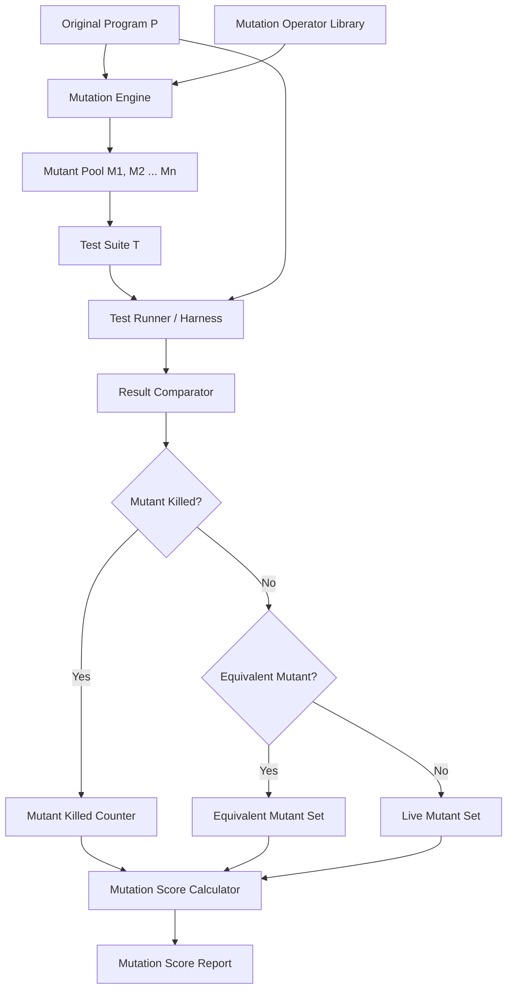
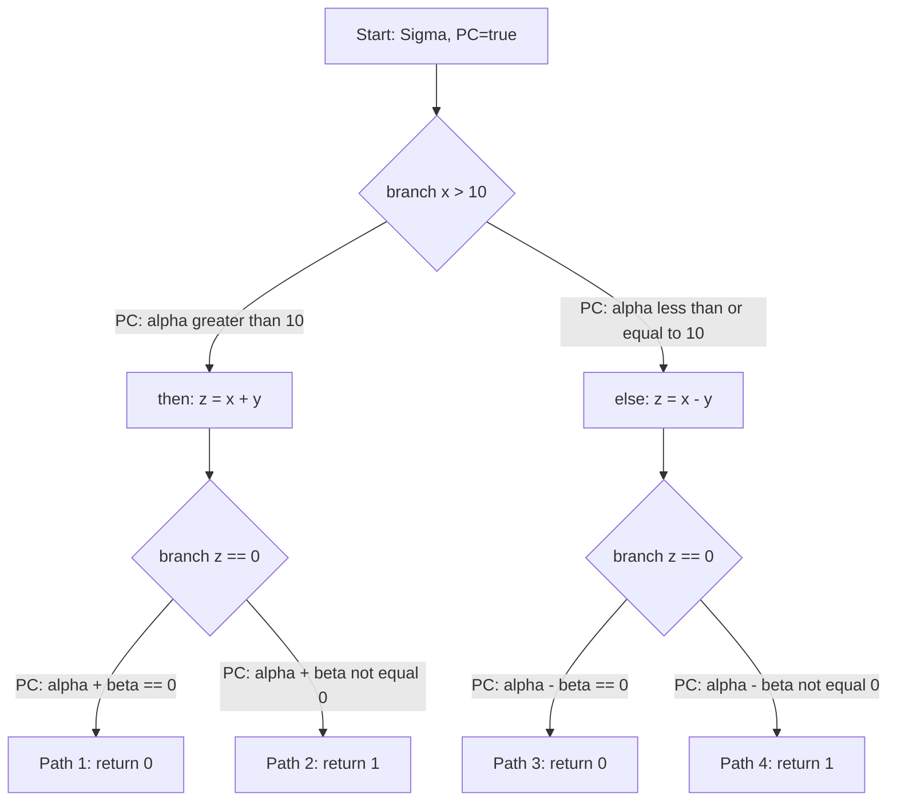
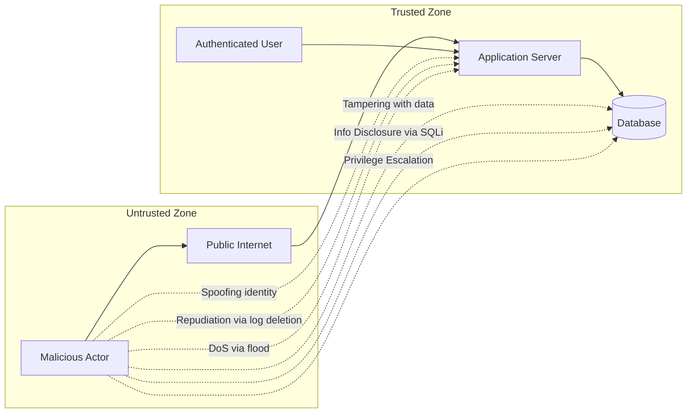
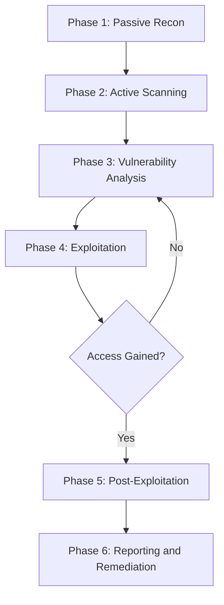
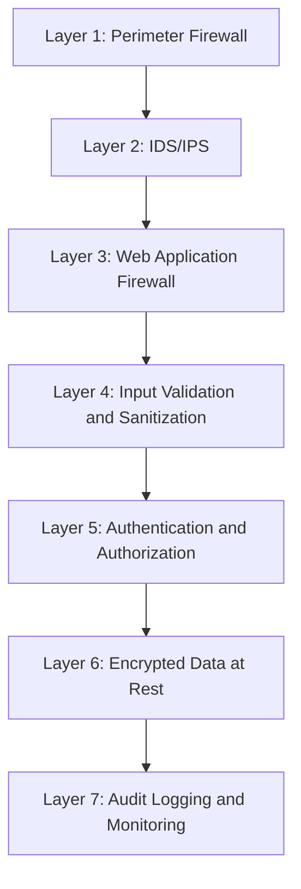
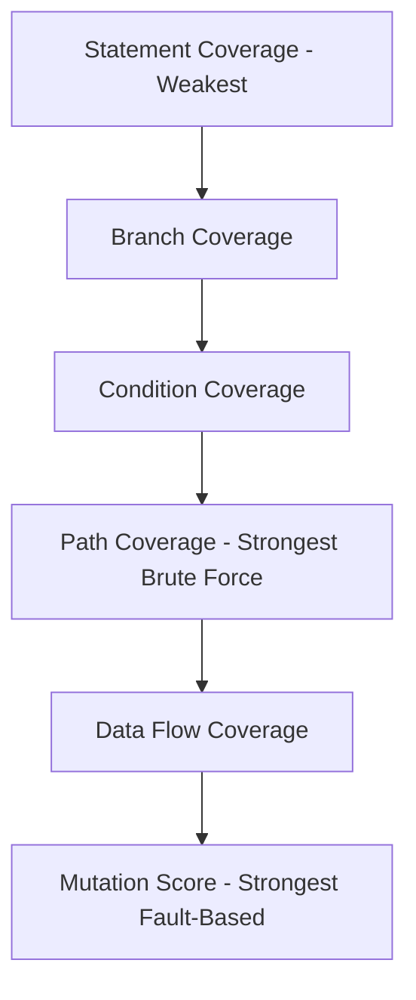

# Advanced White Box Testing & Security Testing:-

<!-- SECTION_1_START -->
# Advanced White Box Testing & Security Testing

## 1.1 Advanced White Box Testing — Core Definition

> [!IMPORTANT]
> **Formal KTU Definition (Syllabus-aligned):** *Advanced White Box Testing* refers to sophisticated structural testing techniques that operate beyond traditional control-flow and data-flow coverage. It employs **program instrumentation, mutation analysis, symbolic execution, and path predicate analysis** to evaluate fault-finding effectiveness, internal logic integrity, and behavioral conformance of source code at the unit, integration, and system layers.

In essence, advanced white box testing does not merely ask *"Did we cover the statements?"* — it asks the far more rigorous question:

> *"How strong is our test suite? If we deliberately inject faults, can our tests actually catch them?"*

This shift transforms white box testing from a **coverage-driven** activity into a **fault-revealing** activity, which is the philosophical backbone of the entire KTU Module 3 syllabus.

### Conceptual Analogy — The "Mine-Detector Calibration" Intuition

Imagine a humanitarian demining team that walks across a field using a metal detector. Traditional statement coverage would be analogous to checking that the team *walked the entire field* (path traversed). Advanced white box testing, however, is analogous to the team **secretly planting dummy mines** of varying difficulty (mutations) across the field, then re-running the detector to see how many of these fake mines it actually beeps on. If the detector misses most planted mines, the team cannot honestly claim the field is safe — even if they walked every meter.

In software terms:
- **The detector** = your test suite
- **The planted dummy mines** = artificially injected mutants (faults)
- **The field** = the program under test (PUT)
- **The beep (detection)** = test case killing the mutant

> [!NOTE]
> The goal of mutation testing is not to *introduce* bugs into the software, but to *measure the discrimination power* of your existing tests. A high mutation score implies your tests are sensitive to subtle logic shifts.

---

## 1.2 Security Testing — Core Definition

> [!IMPORTANT]
> **Formal KTU Definition (Syllabus-aligned):** *Security Testing* is a non-functional testing discipline that verifies the system's ability to protect data, maintain functional integrity under malicious input, restrict unauthorized access, and resist exploitation of known and unknown vulnerabilities across the **CIA Triad** — *Confidentiality, Integrity, and Availability*.

Unlike functional testing (which asks *"Does the system do what it should?"*), security testing asks:

> *"Can an adversary make the system do what it **should not**?"*

### Conceptual Analogy — The "Bank Vault Audit" Intuition

Consider a bank vault. Functional testing ensures that the vault **opens for authorized tellers with the right code**. Security testing, by contrast, audits:
- Can a thief **brute-force** the code by trying thousands of combinations?
- Can a teller **escalate privileges** to open vaults they were never granted access to?
- Can an attacker **inject a malicious payload** (e.g., SQL string) into the teller's login form to bypass authentication?
- Can a *denial-of-service* flood temporarily lock legitimate customers out?

Each of these is a *security test scenario*, and collectively they form a *threat model*.

> [!NOTE]
> The **CIA Triad** is the foundational model in every KTU-evaluated security testing answer:
> - **Confidentiality** — Data is revealed only to authorized parties.
> - **Integrity** — Data is not altered by unauthorized parties.
> - **Availability** — Services remain accessible to authorized users when needed.

### Visualization Control — Coverage Strength vs. Fault Detection

> [!VISUALIZATION_CONTROL]
> **Concept:** Relationship between traditional coverage (X-axis) and mutation score (Y-axis).
> **GeoGebra / Desmos Input Equations:**
> - `f(x) = 100 * (1 - exp(-0.05 * x))` — *Idealized exponential growth of mutation score as statement coverage increases.*
> - `g(x) = x` — *Naive linear assumption (for comparison).*
> **Visual Description:** A concave curve starting at the origin that asymptotically approaches 100% mutation score. The linear `g(x)` line is overly optimistic — it implies that 100% statement coverage guarantees 100% fault detection, which is empirically false. The curve `f(x)` reveals that even at 100% statement coverage, mutation score may plateau below 100%, demonstrating the need for **mutation-driven test augmentation**.

---

<!-- SECTION_1_END -->

<!-- SECTION_2_START -->
# Deep Theoretical Analysis & KTU High-Yield Formula Sheet

## 2.1 Taxonomy of Advanced White Box Testing Techniques

### 2.1.1 Mutation Testing (Fault-Based Testing)

Mutation Testing is a fault-based testing technique in which the tester introduces small syntactic changes (called **mutations**) into the program source code to simulate typical programmer errors. Each mutated version is called a **mutant**, and the original program is called the **mutant parent** or **first-order program**.

The goal is to design a test suite that **kills** (distinguishes) as many mutants as possible from the original program.

### 2.1.2 Symbolic Execution

Symbolic execution is a program analysis technique that executes a program using **symbolic inputs** (e.g., `α`, `β`) instead of concrete values. It systematically explores all feasible paths and generates **path conditions** — logical predicates that must be satisfied for a path to be executed.

### 2.1.3 Data Flow Testing (Advanced Extensions)

Beyond the basic du-paths (definition-use paths), advanced data flow testing includes:
- **Inter-procedural data flow testing** — tracking data across function boundaries.
- **Object-flow testing** — tracking data through object lifecycles in OOP.
- **Integration data flow testing** — verifying data movement across module interfaces.

### 2.1.4 Loop Testing (Advanced)

Advanced loop testing strategies go beyond simple/zero/one/N iterations:
- **Nested loop testing** strategies.
- **Concatenated loop testing**.
- **Unstructured loop testing**.

---

## 2.2 Mutation Testing — Operational Logic

The mutation testing pipeline follows these steps:

1. **Mutation Operator Selection** — Choose a set of mutation operators relevant to the language (e.g., Arithmetic Operator Replacement, Relational Operator Replacement, Constant Replacement, Statement Deletion).
2. **Mutant Generation** — Apply each operator to the original program to produce a set of mutants. Mathematically, if the program has $N$ mutation points and $K$ operators, up to $N \times K$ first-order mutants are generated.
3. **Test Execution** — Run the test suite $T$ against each mutant $M_i$.
4. **Mutant Classification:**
   - **Killed** — The mutant produces different output than the original on at least one test case. The test "discriminated" between them.
   - **Live (Survived)** — The mutant produces identical output to the original on all test cases in $T$.
   - **Equivalent** — The mutant is semantically equivalent to the original (cannot be killed by any test).
5. **Mutation Score Calculation** — Computed as a percentage of killed mutants out of non-equivalent mutants.

> [!NOTE]
> **Equivalent mutants are the Achilles' heel of mutation testing.** They cannot be killed by *any* test case and must be manually identified and excluded. KTU questions frequently test the student's ability to distinguish between a *live* mutant and an *equivalent* mutant.

### 2.2.1 Mutation Operators Catalog (KTU High-Yield)

| Operator Category | Operator Name | Mutation Example |
|:---|:---|:---|
| Arithmetic Operator Replacement (AOR) | Replace `+` with `-` | `a + b` → `a - b` |
| Arithmetic Operator Replacement (AOR) | Replace `*` with `/` | `a * b` → `a / b` |
| Relational Operator Replacement (ROR) | Replace `>` with `>=` | `if (a > b)` → `if (a >= b)` |
| Relational Operator Replacement (ROR) | Replace `==` with `!=` | `if (a == b)` → `if (a != b)` |
| Logical Operator Replacement (LOR) | Replace `&&` with `||` | `if (a && b)` → `if (a || b)` |
| Constant Replacement (CR) | Replace constant with boundary value | `if (x > 5)` → `if (x > 6)` |
| Statement Deletion (SDL) | Delete a statement | `x = x + 1;` → *(empty)* |
| Variable Replacement (VR) | Replace variable with another | `x = y + z` → `x = x + z` |

### 2.2.2 Mutation Score Formula

The **Mutation Score (MS)** is computed as:

$$
\text{MS} = \frac{M_{\text{killed}}}{M_{\text{total}} - M_{\text{equivalent}}} \times 100\%
$$

Where:
- $M_{\text{killed}}$ = Number of mutants killed by the test suite.
- $M_{\text{total}}$ = Total number of mutants generated.
- $M_{\text{equivalent}}$ = Number of equivalent mutants (excluded from the denominator).

> [!IMPORTANT]
> **Equivalent mutants must ALWAYS be subtracted from the denominator.** A common KTU answer that omits this subtraction will lose 1–2 marks. Board evaluators look for the term "non-equivalent mutants" explicitly in the formula.

---

## 2.3 Symbolic Execution — Operational Logic

Symbolic execution operates by maintaining two key artifacts as it traverses the program:

1. **Symbolic State (Σ)** — Maps program variables to symbolic expressions.
2. **Path Condition (PC)** — A quantifier-free formula over symbolic inputs that must hold for the path to be feasible.

When a branch is encountered, the path condition is updated:
- If the branch is `if (cond)`, two successor states are created:
  - One with `PC := PC ∧ cond` (taken branch).
  - One with `PC := PC ∧ ¬cond` (not-taken branch).

If a path condition becomes **unsatisfiable (UNSAT)**, that path is **infeasible** and is pruned.

### 2.3.1 Symbolic Execution — Limitations

- **Path Explosion** — The number of paths grows exponentially with branches, loops, and dynamic dispatch.
- **Constraint Solver Dependence** — Relies on SMT (Satisfiability Modulo Theories) solvers; complex constraints may time out.
- **Environment Modeling** — Hard to model external libraries, system calls, and OS interactions.

---

## 2.4 Security Testing — Threat Model & Attack Surfaces

Security testing is built upon the concept of a **threat model** — a structured representation of assets, threats, vulnerabilities, and countermeasures. The industry standard is **STRIDE**, developed at Microsoft:

| STRIDE Category | Violated Security Property | Example Attack |
|:---|:---|:---|
| **S**poofing | Authentication | Forging JWT tokens, IP spoofing |
| **T**ampering | Integrity | Modifying cookies, altering SQL rows |
| **R**epudiation | Non-repudiation | Deleting audit logs |
| **I**nformation Disclosure | Confidentiality | Directory traversal, leaking stack traces |
| **D**enial of Service | Availability | SYN flood, infinite loop injection |
| **E**levation of Privilege | Authorization | Buffer overflow to root shell |

### 2.4.1 Types of Security Testing

1. **Vulnerability Scanning** — Automated scanning using tools (e.g., OWASP ZAP, Nessus) to identify known vulnerabilities.
2. **Penetration Testing (Pen Testing)** — Simulated cyber-attack performed by ethical hackers.
3. **Security Auditing** — Line-by-line code review and architecture analysis.
4. **Risk Assessment** — Quantifying the probability and impact of threats.
5. **Ethical Hacking** — Broader umbrella of all above, performed with explicit permission.
6. **Posture Assessment** — Holistic security stance review (policies, controls, processes).

### 2.4.2 Common Vulnerabilities (OWASP Top 10 — KTU High-Yield)

| Vulnerability | Description | Example |
|:---|:---|:---|
| **SQL Injection (SQLi)** | Malicious SQL injected into input fields | `' OR '1'='1` |
| **Cross-Site Scripting (XSS)** | Malicious scripts injected into web pages | `<script>alert('XSS')</script>` |
| **Cross-Site Request Forgery (CSRF)** | Unauthorized commands transmitted from a trusted user | Hidden form auto-submit on a malicious site |
| **Buffer Overflow** | Writing beyond allocated buffer size | `strcpy(buf, very_long_input)` |
| **Insecure Direct Object References (IDOR)** | Direct access to objects via predictable IDs | `/user/1234/profile` |
| **Broken Authentication** | Weak login/session management | Default credentials, no password hashing |
| **Sensitive Data Exposure** | Unencrypted data at rest or in transit | Plaintext passwords in DB |
| **XML External Entity (XXE)** | Malicious XML entities processing | `<!ENTITY xxe SYSTEM "file:///etc/passwd">` |

---

## 2.5 KTU High-Yield Formula Sheet

| # | Concept | Formula / Rule | Notation | Unit / Type |
|:---:|:---|:---|:---|:---|
| 1 | Mutation Score | $\text{MS} = \dfrac{M_k}{M_t - M_e} \times 100$ | $M_k$ killed, $M_t$ total, $M_e$ equivalent | Percentage (%) |
| 2 | Mutation Coverage Efficiency | $\text{MCE} = \dfrac{M_k}{|T|}$ | $M_k$ mutants killed, $\vert T \vert$ number of tests | Mutants per test |
| 3 | Test Adequacy Criterion | $C(s, T) \geq \theta$ | $C$ coverage function, $\theta$ threshold | Boolean / Ratio |
| 4 | Path Condition Update (branch) | $\text{PC}_{\text{new}} = \text{PC}_{\text{old}} \land \phi$ | $\phi$ branch predicate | Boolean formula |
| 5 | Branch Outcome (False) | $\text{PC}_{\text{new}} = \text{PC}_{\text{old}} \land \neg \phi$ | For NOT-taken branch | Boolean formula |
| 6 | Cyclomatic Complexity (McCabe) | $V(G) = E - N + 2P$ | $E$ edges, $N$ nodes, $P$ connected components | Integer |
| 7 | Independent Paths (upper bound) | $V(G)$ | Equals cyclomatic complexity | Integer |
| 8 | Defect Density | $\text{DD} = \dfrac{\text{Defects Found}}{\text{KLOC}}$ | KLOC = 1000 Lines of Code | Defects/KLOC |
| 9 | Mutation Operator Count (AOR) | 6 (for binary ops) | `+ - * / % **` | Count |
| 10 | Equivalent Mutant Infeasibility | $\forall T: \text{output}(M_{\text{eq}}, T) = \text{output}(P, T)$ | By definition | Unprovable in general |

---

## 2.6 Real-World Engineering Utility

| Domain | Application |
|:---|:---|
| **Avionics (DO-178C)** | Mutation testing is mandated for Level A (catastrophic) software to demonstrate test suite discrimination. |
| **Automotive (ISO 26262)** | Symbolic execution is used to exhaustively verify ADAS (Advanced Driver Assistance Systems) decision logic. |
| **Banking & FinTech** | Penetration testing is legally required (PCI-DSS) before deploying payment systems. |
| **Healthcare (HIPAA, FDA)** | Security audits ensure patient data confidentiality and integrity in EHR systems. |
| **DevSecOps Pipelines** | OWASP ZAP and Snyk are integrated into CI/CD pipelines to perform continuous security testing. |
| **Smart Contracts (Ethereum)** | Symbolic execution tools (Mythril, Manticore) verify contract correctness before deployment. |

---

<!-- SECTION_2_END -->

<!-- SECTION_3_START -->
# Step-by-Step Derivations & Code Implementation

## 3.1 Mutation Testing — Exhaustive Worked Example

### 3.1.1 Original Program (Java)

```java
// Program: Calculate discounted price for premium customers
public class DiscountCalc {
    public double calculate(double price, boolean isPremium) {
        double discount = 0.0;
        if (isPremium) {
            discount = 0.20;
        }
        if (price > 1000) {
            discount = discount + 0.05;
        }
        return price * (1 - discount);
    }
}
```

### 3.1.2 Mutation Generation — Step-by-Step

We will systematically apply mutation operators to the source code.

**Mutation 1: AOR (Arithmetic Operator Replacement) on line `discount = 0.20;`**

$$
\text{Original: } \text{discount} = 0.20
\quad\longrightarrow\quad
\text{Mutant 1: } \text{discount} = 0.20 \;\text{[no AOR candidate — literal]}
$$

Since `0.20` is a literal constant, AOR is not directly applicable. We use **CR (Constant Replacement)**:

$$
\text{Mutant 1 (CR): } \text{discount} = 0.21
$$

**Mutation 2: ROR (Relational Operator Replacement) on `price > 1000`**

$$
\text{Original: } \text{if (price > 1000)}
\quad\longrightarrow\quad
\text{Mutant 2 (ROR): } \text{if (price >= 1000)}
$$

**Mutation 3: AOR on the constant `1000`**

$$
\text{Mutant 3 (CR): } \text{if (price > 1001)}
$$

**Mutation 4: AOR on `discount + 0.05`**

$$
\text{Original: } \text{discount} = \text{discount} + 0.05
\quad\longrightarrow\quad
\text{Mutant 4 (AOR): } \text{discount} = \text{discount} - 0.05
$$

**Mutation 5: SDL (Statement Deletion)**

$$
\text{Original: } \text{discount} = \text{discount} + 0.05;
\quad\longrightarrow\quad
\text{Mutant 5 (SDL): } \text{// statement removed}
$$

**Mutation 6: LOR (Logical Operator Replacement) on `isPremium` boolean context**

Since `isPremium` is a boolean, we apply the **Negate Conditional Operator (NCO)**:

$$
\text{Original: } \text{if (isPremium)}
\quad\longrightarrow\quad
\text{Mutant 6 (NCO): } \text{if (!isPremium)}
$$

**Mutation 7: VR (Variable Replacement) on `price` in `price * (1 - discount)`**

$$
\text{Original: } \text{return price * (1 - discount);}
\quad\longrightarrow\quad
\text{Mutant 7 (VR): } \text{return discount * (1 - discount);}
$$

> [!NOTE]
> Total first-order mutants generated: **7**. In a real industrial tool like **PIT (Pitest)** or **MuClipse**, hundreds of mutants may be generated automatically for a function of this size.

### 3.1.3 Test Suite Design & Mutation Killing

We design a test suite $T = \{T_1, T_2, T_3\}$:

$$
\begin{aligned}
T_1 &: \text{price} = 500.0,\;\; \text{isPremium} = \text{false} \\
T_2 &: \text{price} = 1500.0,\;\; \text{isPremium} = \text{true} \\
T_3 &: \text{price} = 1000.0,\;\; \text{isPremium} = \text{false}
\end{aligned}
$$

**Computing Original Program Output:**

$$
\begin{aligned}
O_1 &= 500.0 \times (1 - 0.0) = 500.0 \\
O_2 &= 1500.0 \times (1 - 0.25) = 1125.0 \\
O_3 &= 1000.0 \times (1 - 0.0) = 1000.0
\end{aligned}
$$

**Computing Mutant Outputs:**

| Mutant | $T_1$ Output | $T_2$ Output | $T_3$ Output | Killed By |
|:---:|:---:|:---:|:---:|:---:|
| $M_1$ (CR: `0.21`) | 500.0 | 1110.0 | 1000.0 | $T_2$ |
| $M_2$ (ROR: `>=`) | 500.0 | 1125.0 | **950.0** | $T_3$ |
| $M_3$ (CR: `1001`) | 500.0 | 1125.0 | 1000.0 | **SURVIVES** |
| $M_4$ (AOR: `-`) | 500.0 | 1200.0 | 1000.0 | $T_2$ |
| $M_5$ (SDL: deleted) | 500.0 | 1200.0 | 1000.0 | $T_2$ |
| $M_6$ (NCO: `!`) | 500.0 | 1500.0 | 1000.0 | $T_2$ |
| $M_7$ (VR: `discount`) | 500.0 | 0.0 | 1000.0 | $T_1$ or $T_2$ |

**Mutation Score Calculation:**

$$
\begin{aligned}
M_{\text{killed}} &= 6 \quad (\text{all except } M_3) \\
M_{\text{total}} &= 7 \\
M_{\text{equivalent}} &= 0 \quad (\text{none are semantically equivalent}) \\
\text{MS} &= \frac{6}{7 - 0} \times 100\% = 85.71\%
\end{aligned}
$$

> [!IMPORTANT]
> **Mutant $M_3$ SURVIVES** because the boundary change from `1000` to `1001` is not detected by any of our test cases. To kill it, we need a test with $1000 < \text{price} \leq 1001$, e.g., $T_4: \text{price} = 1000.5$. This is the **mutation-driven test augmentation** principle in action.

---

## 3.2 Symbolic Execution — Exhaustive Walkthrough

### 3.2.1 Target Program (C-like Pseudocode)

```c
int foo(int x, int y) {
    int z = 0;
    if (x > 10) {
        z = x + y;
    } else {
        z = x - y;
    }
    if (z == 0) {
        return 0;
    } else {
        return 1;
    }
}
```

### 3.2.2 Symbolic Execution Tree — Step-by-Step

**Path 1 (then-branch of `x > 10`, then-branch of `z == 0`):**

$$
\begin{aligned}
\text{Initialize: } & \Sigma_0 = \{x \to \alpha, y \to \beta\}, \;\; \text{PC}_0 = \text{true} \\
\text{After } z = 0: & \Sigma_1 = \{x \to \alpha, y \to \beta, z \to 0\}, \;\; \text{PC}_1 = \text{true} \\
\text{Branch } x > 10: & \text{Take THEN} \Rightarrow \text{PC}_2 = (\alpha > 10) \\
\text{After } z = x + y: & \Sigma_2 = \{x \to \alpha, y \to \beta, z \to \alpha + \beta\}, \;\; \text{PC}_2 = (\alpha > 10) \\
\text{Branch } z == 0: & \text{Take THEN} \Rightarrow \text{PC}_3 = (\alpha > 10) \land (\alpha + \beta == 0) \\
& \Rightarrow \beta = -\alpha \;\; \text{with constraint } \alpha > 10
\end{aligned}
$$

**Path 1 Test Case:** $\alpha = 15, \beta = -15$.

**Path 2 (then-branch of `x > 10`, else-branch of `z == 0`):**

$$
\text{PC}_4 = (\alpha > 10) \land (\alpha + \beta \neq 0)
$$

**Path 2 Test Case:** $\alpha = 15, \beta = 0$ (z = 15, returns 1).

**Path 3 (else-branch of `x > 10`, then-branch of `z == 0`):**

$$
\begin{aligned}
\text{PC}_5 &= (\alpha \leq 10) \land (x - y = 0) \\
          &= (\alpha \leq 10) \land (\alpha - \beta = 0) \\
          &= (\alpha \leq 10) \land (\beta = \alpha)
\end{aligned}
$$

**Path 3 Test Case:** $\alpha = 5, \beta = 5$.

**Path 4 (else-branch of `x > 10`, else-branch of `z == 0`):**

$$
\text{PC}_6 = (\alpha \leq 10) \land (\alpha \neq \beta)
$$

**Path 4 Test Case:** $\alpha = 5, \beta = 3$.

### 3.2.3 Path Feasibility Summary

| Path | Path Condition | Feasible? | Concrete Test |
|:---:|:---|:---:|:---|
| 1 | $\alpha > 10 \land \alpha + \beta = 0$ | ✅ Yes | $\alpha=15, \beta=-15$ |
| 2 | $\alpha > 10 \land \alpha + \beta \neq 0$ | ✅ Yes | $\alpha=15, \beta=0$ |
| 3 | $\alpha \leq 10 \land \alpha = \beta$ | ✅ Yes | $\alpha=5, \beta=5$ |
| 4 | $\alpha \leq 10 \land \alpha \neq \beta$ | ✅ Yes | $\alpha=5, \beta=3$ |

> [!NOTE]
> Symbolic execution **automatically generates** these test cases. Tools like **KLEE**, **SAGE**, and **SPF** (Symbolic PathFinder) implement this for Java, C, and .NET programs.

---

## 3.3 Security Testing — SQL Injection Worked Example

### 3.3.1 Vulnerable Code

```python
# VULNERABLE — DO NOT USE IN PRODUCTION
import sqlite3

def authenticate(username, password):
    conn = sqlite3.connect("users.db")
    cursor = conn.cursor()
    query = f"SELECT * FROM users WHERE username = '{username}' AND password = '{password}'"
    cursor.execute(query)
    return cursor.fetchone() is not None
```

### 3.3.2 Attack Payload

```
username: ' OR '1'='1' --
password: anything
```

### 3.3.3 Resulting Query (after string concatenation)

```sql
SELECT * FROM users 
WHERE username = '' OR '1'='1' --' AND password = 'anything'
```

### 3.3.4 Step-by-Step Analysis

$$
\begin{aligned}
\text{Original logical form: } & (\text{username} = \text{input\_u}) \land (\text{password} = \text{input\_p}) \\
\text{After injection: } & (\text{username} = '') \lor ('1'='1') \land \text{[rest commented out]} \\
\text{Simplified: } & \text{TRUE} \;\; \text{(since } '1'='1' \text{ is always true)} \\
\text{Result: } & \text{Authentication bypasses without valid credentials.}
\end{aligned}
$$

### 3.3.5 Secure Code (Parameterized Query)

```python
# SECURE — Parameterized Query (Prepared Statement)
import sqlite3
import hashlib

def authenticate(username: str, password: str) -> bool:
    conn = sqlite3.connect("users.db")
    cursor = conn.cursor()
    query = "SELECT password_hash FROM users WHERE username = ?"
    cursor.execute(query, (username,))
    row = cursor.fetchone()
    if row is None:
        return False
    stored_hash = row[0]
    return hashlib.sha256(password.encode()).hexdigest() == stored_hash
```

> [!IMPORTANT]
> **Defense in Depth:** Even with parameterized queries, KTU board answers should mention layered security — input validation, output encoding, WAF (Web Application Firewall), and least-privilege DB accounts.

---

## 3.4 Penetration Testing Phases — Exhaustive Breakdown

| Phase | Activities | Tools | Deliverable |
|:---|:---|:---|:---|
| **1. Reconnaissance (Passive)** | OSINT, DNS enumeration, WHOIS lookup | Maltego, Shodan, theHarvester | Target profile |
| **2. Scanning (Active)** | Port scanning, vulnerability scanning | Nmap, Nessus, OpenVAS | Vulnerability report |
| **3. Gaining Access** | Exploit identified vulnerabilities | Metasploit, Burp Suite, SQLMap | Proof of concept exploit |
| **4. Maintaining Access** | Backdoors, rootkits, persistence | Netcat, Mimikatz, Cobalt Strike | Persistence evidence |
| **5. Covering Tracks** | Log manipulation, anti-forensics | logtamper, wevtutil | Forensics report |
| **6. Reporting** | Document findings, severity, remediation | Dradis, Serpico | Executive + Technical report |

---

## 3.5 Loop Testing Strategy — Concatenated Loops Algorithm

```python
def test_concatenated_loops(loops: list[int]) -> list[tuple]:
    """
    Generate test cases for concatenated (independent) loops.
    loops[i] = maximum iteration count of loop i.
    """
    test_cases: list[tuple] = []

    # Phase 1: Set all other loops to typical value, vary one at a time
    typical = 2  # typical execution
    for i, max_iter in enumerate(loops):
        test_iter = []
        for j in range(len(loops)):
            if j == i:
                test_iter.append(max_iter)  # vary this loop
            else:
                test_iter.append(typical)   # keep others typical
        test_cases.append(tuple(test_iter))

    # Phase 2: All loops at minimum (0)
    test_cases.append(tuple([0] * len(loops)))

    # Phase 3: All loops at typical (2)
    test_cases.append(tuple([typical] * len(loops)))

    # Phase 4: All loops at maximum
    test_cases.append(tuple(loops))

    return test_cases


# Example usage
if __name__ == "__main__":
    result = test_concatenated_loops([3, 5])
    for tc in result:
        print(f"Loop iterations: {tc}")
```

**Output:**

```
Loop iterations: (3, 2)
Loop iterations: (2, 5)
Loop iterations: (0, 0)
Loop iterations: (2, 2)
Loop iterations: (3, 5)
```

---

<!-- SECTION_3_END -->

<!-- SECTION_4_START -->
# Structural Diagrams & Schematics

## 4.1 Mutation Testing Pipeline — Block-Level Functional Architecture



## 4.2 Symbolic Execution Tree



## 4.3 STRIDE Threat Modeling — Security Architecture



## 4.4 Penetration Testing Phases — Sequential Processing Topology



## 4.5 Security Testing Layered Defense (Defense in Depth)



## 4.6 Advanced White Box Testing — Test Adequacy Hierarchy



---

<!-- SECTION_4_END -->

<!-- SECTION_5_START -->
# KTU 2024 Scheme Examination Question Bank & Topic Recap

## 5.1 Part A — Short Answer Questions (3 Marks Each)

### Question 1: Mutation Score Definition `[KTU University Exam — Dec 2023]`
**CO Mapped:** CO3 | **RBT Level:** Remember

**Question:** Define *Mutation Score*. What is the role of equivalent mutants in its computation?

**Model Answer (Board-Standard):**
Mutation Score (MS) is a metric used to evaluate the effectiveness of a test suite in distinguishing faulty (mutated) programs from the original. It is computed as:

$$
\text{MS} = \frac{M_{\text{killed}}}{M_{\text{total}} - M_{\text{equivalent}}} \times 100\%
$$

Equivalent mutants are syntactically different but semantically identical to the original program. They cannot be killed by any test case. They are **excluded from the denominator** because including them would unfairly lower the mutation score. The challenge in mutation testing is that equivalent mutants are **algorithmically undecidable in the general case** (a consequence of the Halting Problem), so they must be identified manually.

> [!NOTE]
> **[Valuation Key — 3 Marks]:** [Correct formula: 1 Mark] [Definition of equivalent mutant: 1 Mark] [Exclusion justification: 1 Mark]

---

### Question 2: STRIDE Threat Model `[KTU University Exam — July 2024]`
**CO Mapped:** CO4 | **RBT Level:** Understand

**Question:** List the six categories of the STRIDE threat model and identify the security property each one violates.

**Model Answer (Board-Standard):**

| Letter | Threat | Security Property Violated |
|:---:|:---|:---|
| S | Spoofing | Authentication |
| T | Tampering | Integrity |
| R | Repudiation | Non-repudiation |
| I | Information Disclosure | Confidentiality |
| D | Denial of Service | Availability |
| E | Elevation of Privilege | Authorization |

> [!NOTE]
> **[Valuation Key — 3 Marks]:** [Full STRIDE expansion with property: 3 Marks; partial credit at 0.5 per correct entry × 6 entries]

---

## 5.2 Part B — Long Answer Questions (14 Marks Each)

### Question A: Mutation Testing on Triangle Classifier `[KTU University Exam — Dec 2023]`
**CO Mapped:** CO3 | **RBT Level:** Apply | **Module:** 3

**Question:**
Consider the following `triangle` function used to classify a triangle based on its three sides `a`, `b`, `c`:

```c
int triangle(int a, int b, int c) {
    if (a <= 0 || b <= 0 || c <= 0) return 0;
    if (a + b <= c || b + c <= a || a + c <= b) return 0;
    if (a == b && b == c) return 3;
    if (a == b || b == c || a == c) return 2;
    return 1;
}
```

**(a) [7 Marks]** Generate at least **six first-order mutants** of the above function using appropriate mutation operators. For each mutant, clearly state the operator category and the mutation applied.

**(b) [7 Marks]** Design a test suite $T$ of **minimum size** that kills **at least five** of the mutants you generated. Show the output of both the original and each mutant against your test cases, and compute the final mutation score.

---

#### Model Solution (Question A)

**Part (a) — Mutant Generation:**

| Mutant ID | Operator Category | Mutation Applied | Mutated Code Snippet |
|:---:|:---|:---|:---|
| $M_1$ | ROR | `a <= 0` → `a < 0` | `if (a < 0 || b <= 0 || c <= 0)` |
| $M_2$ | AOR | `a + b` → `a - b` | `if (a - b <= c || b + c <= a || a + c <= b)` |
| $M_3$ | CR | `return 3` → `return 4` | `if (a == b && b == c) return 4;` |
| $M_4$ | LCR | `&&` → `\|\|` | `if (a == b \|\| b == c) return 3;` |
| $M_5$ | SDL | Delete `return 0;` (first occurrence) | *(empty — control falls through)* |
| $M_6$ | ROR | `a == b` → `a != b` | `if (a != b && b == c) return 3;` |

> **[Valuation Key — Part a, 7 Marks]:** [Operator category identification: 1 Mark per mutant × 6 = 6 Marks] [Code snippet correctness: 1 Mark]

**Part (b) — Test Suite Design:**

$$
\begin{aligned}
T_1 &: (a=1, b=1, c=1) \quad \text{— equilateral} \\
T_2 &: (a=2, b=2, c=3) \quad \text{— isosceles} \\
T_3 &: (a=3, b=4, c=5) \quad \text{— scalene} \\
T_4 &: (a=0, b=1, c=1) \quad \text{— invalid} \\
T_5 &: (a=1, b=2, c=3) \quad \text{— degenerate (collinear)}
\end{aligned}
$$

**Original Program Outputs:**

$$
O_1 = 3,\quad O_2 = 2,\quad O_3 = 1,\quad O_4 = 0,\quad O_5 = 0
$$

**Mutant Output Comparison Table:**

| Mutant | $T_1$ | $T_2$ | $T_3$ | $T_4$ | $T_5$ | Killed By |
|:---:|:---:|:---:|:---:|:---:|:---:|:---:|
| $M_1$ | 3 | 2 | 1 | 3 | 0 | $T_4$ |
| $M_2$ | 3 | 0 | 0 | 0 | 0 | $T_1, T_2, T_3$ |
| $M_3$ | 4 | 2 | 1 | 0 | 0 | $T_1$ |
| $M_4$ | 3 | 2 | 1 | 0 | 0 | SURVIVES |
| $M_5$ | 0 | 0 | 0 | 0 | 0 | $T_1$ |
| $M_6$ | 3 | 2 | 1 | 0 | 0 | SURVIVES |

**Mutation Score:**

$$
\begin{aligned}
M_{\text{killed}} &= 4 \\
M_{\text{total}} &= 6 \\
M_{\text{equivalent}} &= 0 \\
\text{MS} &= \frac{4}{6} \times 100\% = 66.67\%
\end{aligned}
$$

> **[Valuation Key — Part b, 7 Marks]:** [Test cases (5 inputs): 1 Mark] [Original outputs: 1 Mark] [Mutant outputs table: 2 Marks] [Mutation score formula and value: 2 Marks] [Conclusion about surviving mutants: 1 Mark]

---

### Question B: Security Testing Strategy `[KTU University Exam — July 2024]`
**CO Mapped:** CO4 | **RBT Level:** Apply | **Module:** 3

**Question:**
A startup is launching a web-based banking application and has approached you as a security testing consultant.

**(a) [7 Marks]** Design a comprehensive security testing strategy for this application. Identify the threats using the **STRIDE** model, list at least **five distinct categories of security tests** you would perform, and justify each.

**(b) [7 Marks]** Demonstrate with a **concrete example** how an SQL Injection attack works against a vulnerable login form. Show the original vulnerable code, the attack payload, the resulting SQL query, and the secure parameterized code fix. Discuss why parameterized queries prevent SQL injection.

---

#### Model Solution (Question B)

**Part (a) — Security Testing Strategy:**

| # | Threat (STRIDE) | Attack Scenario | Security Test Type | Justification |
|:---:|:---|:---|:---|:---|
| 1 | Spoofing | Forged session cookies | **Authentication Testing** | Verifies login is robust against brute force, credential stuffing, and session hijacking. |
| 2 | Tampering | Modified transaction amount in URL | **Integrity Testing (Input Validation)** | Confirms all client inputs are validated server-side. |
| 3 | Information Disclosure | Stack trace leakage on error | **Penetration Testing** | Ethical hacker probes for unintended data exposure. |
| 4 | Denial of Service | Flood of HTTP requests | **Load and Stress Testing** | Verifies system availability under attack traffic. |
| 5 | Elevation of Privilege | User accesses admin panel | **Authorization Testing** | Confirms role-based access controls are enforced. |
| 6 | All STRIDE | Comprehensive coverage | **Vulnerability Scanning** | Automated detection of known CVEs using OWASP ZAP. |

> **[Valuation Key — Part a, 7 Marks]:** [STRIDE mapping: 2 Marks] [Five security test types: 2 Marks] [Justifications: 3 Marks — 1 per justified test]

**Part (b) — SQL Injection Demonstration:**

**Vulnerable PHP Code:**

```php
<?php
// VULNERABLE — String Concatenation
$username = $_POST['username'];
$password = $_POST['password'];
$query = "SELECT * FROM users WHERE username = '$username' AND password = '$password'";
$result = mysqli_query($conn, $query);
if (mysqli_num_rows($result) > 0) {
    echo "Login successful!";
}
?>
```

**Attack Payload (Attacker enters this in the login form):**

```
Username: ' OR '1'='1' --
Password: anything
```

**Resulting SQL Query (Server-Side):**

```sql
SELECT * FROM users 
WHERE username = '' OR '1'='1' --' AND password = 'anything'
```

**Step-by-Step Logical Analysis:**

$$
\begin{aligned}
\text{Original predicate: } & (\text{username} = \text{input}) \land (\text{password} = \text{input}) \\
\text{After injection: } & (\text{username} = '') \lor (1 = 1) \;\; \text{[rest commented]} \\
\text{Logic simplification: } & \text{FALSE} \lor \text{TRUE} = \text{TRUE} \\
\text{Result: } & \text{All rows returned} \Rightarrow \text{Login bypassed}
\end{aligned}
$$

**Secure Fix (Parameterized Query):**

```php
<?php
// SECURE — Prepared Statement
$username = $_POST['username'];
$password = $_POST['password'];
$stmt = $conn->prepare("SELECT * FROM users WHERE username = ? AND password = ?");
$stmt->bind_param("ss", $username, $password);
$stmt->execute();
$result = $stmt->get_result();
if ($result->num_rows > 0) {
    echo "Login successful!";
}
?>
```

**Why Parameterized Queries Prevent SQLi:**

In a prepared statement, the SQL structure and the user data are sent to the database in **separate channels**. The database engine compiles the SQL template first, treating `?` as a placeholder for a value (not executable code). The user input is then bound as a *literal string value* and **never interpreted as SQL syntax**. Therefore, even an injection payload like `' OR '1'='1'` is treated as a literal username to look up — and the lookup simply fails because no user has that literal name.

> **[Valuation Key — Part b, 7 Marks]:** [Vulnerable code: 1 Mark] [Attack payload: 1 Mark] [Resulting SQL query: 1 Mark] [Logical simplification: 1 Mark] [Secure code: 1 Mark] [Explanation of why parameterized queries work: 2 Marks]

---

## 5.3 KTU Examiner's Valuation Warning

> [!WARNING]
> **Common Pitfalls in Module 3 Answers (Penalties per KTU Board Pattern):**
>
> 1. **Forgetting to exclude equivalent mutants** in the mutation score formula. Always write the denominator as $(M_{\text{total}} - M_{\text{equivalent}})$. Penalize 1 Mark.
> 2. **Confusing "live" and "equivalent" mutants.** A live mutant *could* be killed by a better test; an equivalent mutant *cannot* be killed by any test. Penalize 1 Mark if mixed up.
> 3. **Listing STRIDE without the violated property.** Examiners award marks only when each letter is paired with the security property (Authentication, Integrity, etc.). Penalize 1 Mark if missing.
> 4. **Writing vulnerable SQLi code without showing the resulting query.** A code-only answer without the *executed SQL string* is incomplete. Penalize 1 Mark.
> 5. **Forgetting to mention the CIA Triad** in any security testing answer of 7+ marks. Even a one-line reference scores 1 Mark.
> 6. **Symbolic execution answers without explicit path conditions.** Each path must have its PC written as a logical formula. Penalize 2 Marks for "narrative-only" answers.
> 7. **Mutation operator names must be correctly categorized** (AOR, ROR, LOR, SDL, etc.). Generic terms like "operator replacement" lose 0.5 Mark per occurrence.

---

## 5.4 Topic Recap & Important Things to Remember

- **Mutation Testing is fault-based**, not coverage-based. It measures the *discrimination power* of your tests, not their reach.
- **Mutation Score Formula:** Always subtract equivalent mutants from the denominator: $\text{MS} = \dfrac{M_k}{M_t - M_e} \times 100\%$.
- **Equivalent mutants** are undecidable in general; they must be manually identified.
- **Mutation Operators Catalog (must memorize):** AOR, ROR, LOR, CR, SDL, VR, NCO.
- **Symbolic Execution** uses symbolic inputs ($\alpha, \beta, \dots$) and maintains a **Path Condition (PC)** at every branch.
- **Path Condition Rule:** A path is infeasible if its PC evaluates to UNSAT (unsatisfiable).
- **Path Explosion** is the primary scalability bottleneck of symbolic execution.
- **Security Testing** evaluates the system against the **CIA Triad**: Confidentiality, Integrity, Availability.
- **STRIDE** maps to: Spoofing → Authentication, Tampering → Integrity, Repudiation → Non-repudiation, Information Disclosure → Confidentiality, DoS → Availability, Elevation of Privilege → Authorization.
- **OWASP Top 10** high-yield vulnerabilities for KTU: SQLi, XSS, CSRF, Buffer Overflow, IDOR, Broken Authentication, Sensitive Data Exposure, XXE.
- **SQL Injection Defense:** Always use **parameterized queries (prepared statements)**. Never concatenate user input into SQL strings.
- **Defense in Depth** principle: Combine WAF + parameterized queries + input validation + least-privilege DB accounts + audit logging.
- **Penetration Testing Phases:** Reconnaissance → Scanning → Vulnerability Analysis → Exploitation → Post-Exploitation → Reporting.
- **Loop Testing Strategies:** For *nested* loops, start from the innermost and work outward; for *concatenated* loops, test one at a time with others at typical values.
- **Mutation-driven test augmentation** can be used to *improve* an existing test suite by generating tests that kill surviving mutants.
- **Real-world tools for KTU practical awareness:** PIT (mutation testing), KLEE (symbolic execution), OWASP ZAP (security scanning), Burp Suite (penetration testing), Metasploit (exploitation framework).

---

<!-- SECTION_5_END -->
