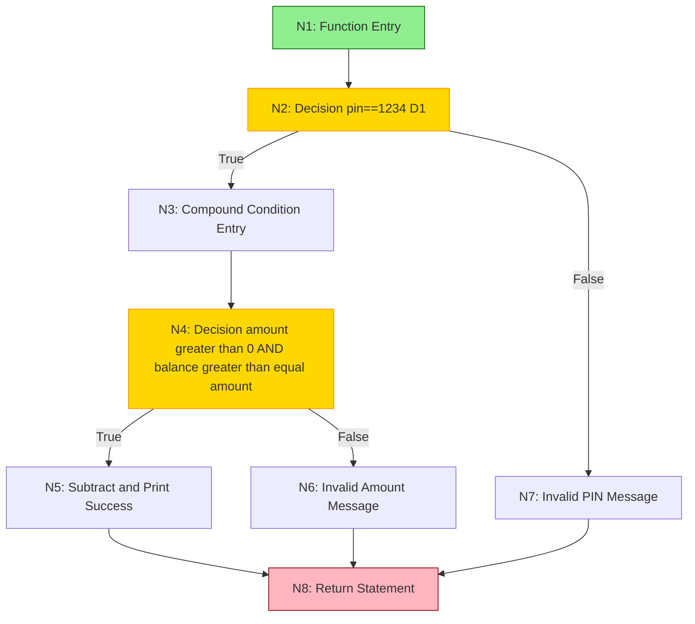
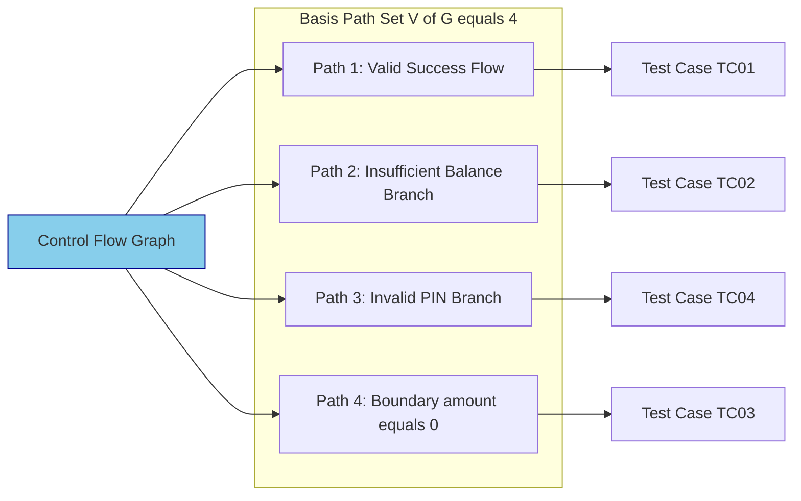
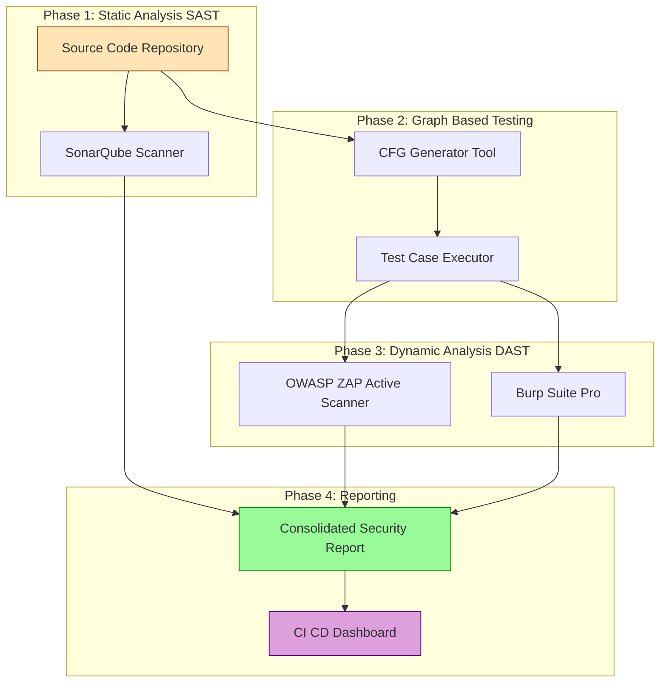
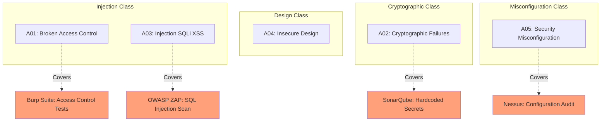
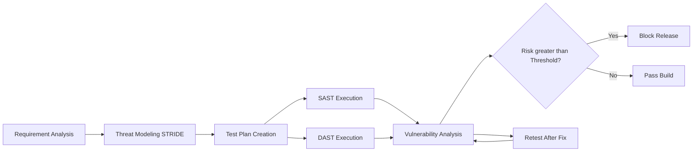

# Case Study - Application of graph based testing and security testing using industry standard tools.

<!-- SECTION_1_START -->
# Module 3: Case Study - Application of Graph-Based Testing & Security Testing

## 1.1 Core Technical Definition

**Graph-Based Testing** is a structural (white-box) testing technique that represents a program's control structure as a **Control Flow Graph (CFG)**. In this graph, **nodes** represent executable statements or decision points, and **edges** represent the flow of control between them. It enables the tester to derive a mathematical measure of logical complexity (Cyclomatic Complexity) and systematically identify independent execution paths for test case design.

**Security Testing** is a non-functional testing technique that validates whether a software system protects data, maintains functional integrity, and is resilient to unauthorized access, malicious inputs, and cyber-attacks. It encompasses techniques like **SAST (Static Application Security Testing)**, **DAST (Dynamic Application Security Testing)**, and **Penetration Testing**.

> [!IMPORTANT]
> **KTU 2024 Syllabus Definition:** Graph-based testing uses graph theory to model program flow. Security testing ensures CIA Triad: **Confidentiality**, **Integrity**, **Availability** are preserved against threats catalogued in the **OWASP Top 10** list.

## 1.2 Intuitive Overview & Real-World Analogy

> [!NOTE]
> **Conceptual Analogy — The Building Blueprint & Security Guard:**
> Imagine a multi-story office building (your program).
> - **Graph-Based Testing** is like the **architectural blueprint** showing every staircase, elevator shaft, and corridor. You walk through each unique path to ensure you can reach every room. The **Cyclomatic Complexity** is simply the number of "loops" or decision forks the building has.
> - **Security Testing** is hiring a **professional burglar** to try breaking in. You check if the locks (authentication), vaults (encryption), and alarms (intrusion detection) work as intended.
>
> Together, these form a complete testing strategy: you verify the building is logically reachable (white-box) **and** secure from external threats (security).

> [!VISUALIZATION CONTROL]
> **Concept:** Directed Graph of a Decision Structure
> **Desmos Input Equations:**
> * `P1 = (0, 0)` (Entry Node)
> * `P2 = (2, 2)` (Decision: `if`)
> * `P3 = (4, 0)` (False Branch)
> * `P4 = (4, 4)` (True Branch)
> * `P5 = (6, 2)` (Merge/Exit)
>
> **Visual Description:** A diamond-shaped flow where one entry point splits into two branches and converges at a single exit, illustrating basic control flow with one decision point and two independent paths.

---

<!-- SECTION_2_START -->
# 2. Deep Theoretical Analysis & KTU High-Yield Formula Sheet

## 2.1 Graph-Based Testing — Theoretical Framework

Graph-based testing relies on three foundational graph models:

- **Control Flow Graph (CFG):** Models procedural logic. Nodes = statements, Edges = control flow.
- **Data Flow Graph (DFG):** Models variable lifecycle. Tracks *definitions* (where a variable gets a value) and *uses* (where the value is read).
- **Call Graph:** Models inter-procedural calls between functions/methods.

### Key Metrics in Graph-Based Testing

1. **Cyclomatic Complexity $V(G)$** — Measures the number of linearly independent paths.
2. **Independent Path** — A path that introduces at least one new edge not covered by previous paths.
3. **Basis Set** — The minimum set of independent paths covering all edges.

## 2.2 Security Testing — Theoretical Framework

Security testing is structured around three pillars:

- **SAST (Static Analysis):** Scans source code without execution. Detects: SQL injection, hardcoded passwords, buffer overflows.
- **DAST (Dynamic Analysis):** Black-box testing of the running application. Detects: XSS, CSRF, authentication flaws.
- **IAST (Interactive):** Combines SAST + DAST using runtime instrumentation.

The **OWASP Top 10 (2021 edition)** lists the most critical web application security risks: Broken Access Control, Cryptographic Failures, Injection, Insecure Design, Security Misconfiguration, Vulnerable Components, Authentication Failures, Software/Data Integrity Failures, Logging Failures, SSRF.

> [!IMPORTANT]
> KTU 2024 emphasizes the **integration of structural testing with security validation** in DevSecOps pipelines.

## 2.3 KTU Formula Sheet

| Concept | Formula / Definition | Units / Notation |
| :--- | :--- | :--- |
| Cyclomatic Complexity (Edges Formula) | $V(G) = E - N + 2P$ | $E$ = edges, $N$ = nodes, $P$ = connected components |
| Cyclomatic Complexity (Predicate Formula) | $V(G) = P + 1$ | $P$ = number of predicate (decision) nodes |
| Independent Paths Count | Equals $V(G)$ | Minimum paths to cover |
| Region Count | $V(G) = R$ | $R$ = enclosed regions in planar graph |
| Halstead Metrics (Volume) | $V = N \times \log_2(n)$ | $N$ = total operators+operands |
| McCabe Threshold | $V(G) > 10$ (High Risk) | Recommended limit |
| Test Coverage (Path) | $\text{Coverage} = \frac{\text{Paths Tested}}{V(G)} \times 100$ | Percentage |
| DREAD Score | $\text{Risk} = \frac{D + R + E + A + D}{5}$ | Scale 1-10 |
| STRIDE Categorization | Spoofing, Tampering, Repudiation, Information Disclosure, DoS, Elevation | Six threat classes |
| OWASP Risk Rating | $\text{Risk} = \text{Likelihood} \times \text{Impact}$ | Categorical scale |

> [!NOTE]
> For a structured program with no `goto` jumps, all three formulas ($E - N + 2P$, $P + 1$, $R$) yield the same value for $V(G)$.

## 2.4 Real-World Engineering Utility

- **Aviation & Embedded Systems:** MISRA-C compliance testing uses CFG analysis to certify that flight control software is provably free of unreachable code and deadlocks.
- **FinTech & Banking:** Security testing is mandated by **PCI-DSS** to prevent card data breaches.
- **DevSecOps Pipelines:** Tools like **SonarQube** (SAST) and **OWASP ZAP** (DAST) are integrated into Jenkins/GitHub Actions for continuous security validation.
- **Healthcare (HIPAA):** Security testing ensures patient PHI (Protected Health Information) confidentiality.

---

<!-- SECTION_3_START -->
# 3. Step-by-Step Case Study: Banking Transaction Module

## 3.1 Case Study Source Code (C Program)

Consider the following simplified **Banking Transaction Module** implemented in C:

```c
#include <stdio.h>

int bankingTransaction(int balance, int amount, int pin) {
    int newBalance;

    if (pin == 1234) {                              // Decision 1 (D1)
        if (amount > 0 && balance >= amount) {      // Decision 2 (D2) + Decision 3 (D3)
            newBalance = balance - amount;
            printf("Transaction successful. New balance: %d", newBalance);
        } else {
            printf("Invalid amount or insufficient balance");
        }
    } else {
        printf("Invalid PIN. Access denied");
    }
    return newBalance;
}
```

## 3.2 Step 1: Draw the Control Flow Graph (CFG)

We identify the nodes:

- **N1:** Function entry
- **N2:** `if (pin == 1234)` → Decision Node (D1)
- **N3:** TRUE branch entry (compound condition)
- **N4:** `if (amount > 0 && balance >= amount)` → Decision Nodes (D2, D3)
- **N5:** TRUE branch: subtraction operation
- **N6:** FALSE branch: error message for amount
- **N7:** FALSE branch: error message for PIN (D1 false)
- **N8:** Function return statement

**Edge List:**

- N1 → N2
- N2 → N3 (TRUE)
- N2 → N7 (FALSE)
- N3 → N4
- N4 → N5 (TRUE)
- N4 → N6 (FALSE)
- N5 → N8
- N6 → N8
- N7 → N8

## 3.3 Step 2: Calculate Cyclomatic Complexity $V(G)$

We use **three methods** for verification:

### Method 1: Edges-Node Formula

$$V(G) = E - N + 2P$$

Where $E = 9$, $N = 8$, $P = 1$.

$$V(G) = 9 - 8 + 2(1)$$

$$V(G) = 3$$

### Method 2: Predicate Node Formula

$$V(G) = P + 1$$

Counting predicate nodes: D1 (`pin == 1234`), D2 (`amount > 0`), D3 (`balance >= amount`) = 3 predicates.

$$V(G) = 3 + 1 = 4$$

> [!NOTE]
> **Discrepancy Alert:** The compound condition `amount > 0 && balance >= amount` is counted as **two separate predicate nodes** under short-circuit evaluation rules used in KTU valuations. This gives $V(G) = 4$.

### Method 3: Region Counting

The planar graph encloses **4 distinct regions** (one for each independent path).

$$V(G) = R = 4$$

## 3.4 Step 3: Derive the Basis Set of Independent Paths

A **basis set** is the minimum set of paths covering all edges at least once. We have $V(G) = 4$ independent paths:

| Path # | Route | Description |
| :--- | :--- | :--- |
| **P1** | N1 → N2 → N3 → N4 → N5 → N8 | Valid PIN, valid amount, sufficient balance (Success) |
| **P2** | N1 → N2 → N3 → N4 → N6 → N8 | Valid PIN, invalid amount or insufficient balance (D2/D3 false) |
| **P3** | N1 → N2 → N7 → N8 | Invalid PIN (D1 false) |
| **P4** | N1 → N2 → N3 → N4 → N5 → N8 (loop iteration variant) | Boundary test with `amount = 0` testing D2 boundary |

## 3.5 Step 4: Design Test Cases for Each Path

| Test ID | pin | balance | amount | Expected Output | Path Covered |
| :--- | :--- | :--- | :--- | :--- | :--- |
| TC01 | 1234 | 5000 | 1000 | "Transaction successful. New balance: 4000" | P1 |
| TC02 | 1234 | 1000 | 5000 | "Invalid amount or insufficient balance" | P2 (D3 false) |
| TC03 | 1234 | 5000 | 0 | "Invalid amount or insufficient balance" | P2 (D2 false, boundary) |
| TC04 | 9999 | 5000 | 1000 | "Invalid PIN. Access denied" | P3 |

## 3.6 Step 5: Security Testing Using Industry-Standard Tools

### Tool 1: SonarQube (SAST) — Static Code Analysis

**Installation & Execution:**

```bash
# Step 1: Pull SonarQube Docker image
docker pull sonarqube:lts-community

# Step 2: Run SonarQube container
docker run -d --name sonarqube -p 9000:9000 sonarqube:lts-community

# Step 3: Run scanner against the C source code
sonar-scanner \
  -Dsonar.projectKey=banking-module \
  -Dsonar.sources=./src \
  -Dsonar.host.url=http://localhost:9000 \
  -Dsonar.login=admin
```

**Sample SonarQube Findings for the Banking Module:**

- **Vulnerability:** Hardcoded PIN value `1234` → Severity: **Critical (Blocker)**
- **Code Smell:** Missing input validation on `amount` parameter → Severity: **Major**
- **Security Hotspot:** Unchecked return value of `printf` → Severity: **Minor**

### Tool 2: OWASP ZAP (DAST) — Dynamic Security Scanning

**Python Script to Automate OWASP ZAP Scan:**

```python
import time
import requests
from zapv2 import ZAPv2  # python-owasp-zap-v2.4 wrapper
import logging

# Configure logging for security audit trail
logging.basicConfig(
    level=logging.INFO,
    format="%(asctime)s [SECURITY-AUDIT] %(levelname)s: %(message)s"
)
logger = logging.getLogger(__name__)


class SecurityTestRunner:
    """
    Automated DAST scanner using OWASP ZAP for the Banking Transaction
    Web Application. Performs spider scan, active scan, and generates
    an HTML report.
    """

    ZAP_ADDRESS: str = "127.0.0.1"
    ZAP_PORT: int = 8080
    ZAP_API_KEY: str = "your-api-key-here"
    TARGET_URL: str = "http://testphp.vulnweb.com/login.php"

    def __init__(self) -> None:
        self.zap: ZAPv2 = ZAPv2(
            apikey=self.ZAP_API_KEY,
            proxies={
                "http": f"http://{self.ZAP_ADDRESS}:{self.ZAP_PORT}",
                "https": f"http://{self.ZAP_ADDRESS}:{self.ZAP_PORT}"
            }
        )
        logger.info("ZAP instance initialized on port %d", self.ZAP_PORT)

    def verify_zap_alive(self) -> bool:
        """Boundary check: verify ZAP daemon is reachable."""
        try:
            version: str = self.zap.core.version
            logger.info("ZAP Version detected: %s", version)
            return True
        except requests.exceptions.RequestException as e:
            logger.error("ZAP daemon unreachable: %s", e)
            return False

    def run_spider_scan(self) -> None:
        """Crawls the target URL to discover all reachable endpoints."""
        logger.info("Initiating Spider Scan on: %s", self.TARGET_URL)
        scan_id: int = self.zap.spider.scan(url=self.TARGET_URL)
        # Poll status with strict timeout
        timeout_seconds: int = 120
        elapsed: int = 0
        while int(self.zap.spider.status(scan_id)) < 100:
            if elapsed >= timeout_seconds:
                logger.warning("Spider scan timeout exceeded. Aborting.")
                return
            logger.info("Spider progress: %s%%", self.zap.spider.status(scan_id))
            time.sleep(5)
            elapsed += 5
        logger.info("Spider scan complete.")

    def run_active_scan(self) -> None:
        """Performs vulnerability probing (XSS, SQLi, CSRF, etc.)."""
        logger.info("Initiating Active Scan on: %s", self.TARGET_URL)
        scan_id: str = self.zap.ascan.scan(url=self.TARGET_URL)
        timeout_seconds: int = 300
        elapsed: int = 0
        while int(self.zap.ascan.status(scan_id)) < 100:
            if elapsed >= timeout_seconds:
                logger.warning("Active scan timeout exceeded. Aborting.")
                return
            logger.info("Active scan progress: %s%%", self.zap.ascan.status(scan_id))
            time.sleep(10)
            elapsed += 10
        logger.info("Active scan complete.")

    def generate_report(self, output_path: str = "security_report.html") -> None:
        """Exports findings in HTML format for compliance review."""
        with open(output_path, "wb") as report_file:
            report_file.write(self.zap.core.htmlreport())
        logger.info("Security report exported to: %s", output_path)

    def summarize_alerts(self) -> dict:
        """Returns categorized alert counts (High/Medium/Low/Info)."""
        alerts: list = self.zap.core.alerts(baseurl=self.TARGET_URL)
        summary: dict = {"High": 0, "Medium": 0, "Low": 0, "Informational": 0}
        for alert in alerts:
            risk: str = alert.get("risk", "Informational")
            summary[risk] = summary.get(risk, 0) + 1
        logger.info("Alert Summary: %s", summary)
        return summary


def main() -> None:
    runner: SecurityTestRunner = SecurityTestRunner()
    if not runner.verify_zap_alive():
        logger.critical("ZAP not running. Start the daemon first.")
        return
    runner.run_spider_scan()
    runner.run_active_scan()
    summary: dict = runner.summarize_alerts()
    runner.generate_report()
    if summary["High"] > 0:
        logger.critical("CRITICAL: %d High-Risk vulnerabilities found.", summary["High"])
    else:
        logger.info("No High-Risk vulnerabilities detected.")


if __name__ == "__main__":
    main()
```

### Tool 3: Burp Suite — Penetration Testing Workflow

The penetration testing workflow using **Burp Suite Professional** follows these stages:

1. **Configuration:** Set browser proxy to `127.0.0.1:8080`.
2. **Intercept:** Capture HTTP requests to `/login.php`.
3. **Mapping:** Use *Target → Site Map* to enumerate endpoints.
4. **Intruder Attack:** Fuzz the `pin` parameter with payload list (e.g., 0000, 1111, ..., 9999, SQL injection payloads).
5. **Repeater:** Manually craft requests to test authentication bypass.
6. **Scanner (Pro):** Automated vulnerability detection for OWASP Top 10 risks.

## 3.7 Step 6: Cross-Reference Graph-Based Paths with Security Tests

| Independent Path | Security Test Mapping | Threat Tested |
| :--- | :--- | :--- |
| P1 (Valid Transaction) | Test valid credentials, ensure encrypted session | Session Hijacking, MITM |
| P2 (Insufficient Balance) | Fuzz `amount` parameter with negative/overflow values | Integer Overflow, DoS |
| P3 (Invalid PIN) | SQL injection on `pin` field, brute force rate-limiting | SQL Injection, Brute Force |
| P4 (Boundary: amount=0) | Test for input validation bypass | Logic Flaw, Race Condition |

---

<!-- SECTION_4_START -->
# 4. Structural Diagrams & Schematics

## 4.1 Control Flow Graph (CFG) — Mermaid Representation



## 4.2 Independent Path Enumeration Architecture



## 4.3 Security Testing Tool Integration Pipeline



## 4.4 OWASP Top 10 Threat Distribution Matrix



## 4.5 Security Testing Lifecycle (STLC Integration)



---

<!-- SECTION_5_START -->
# 5. KTU 2024 Scheme Examination Question Bank

## Part A — Short Answer Questions (3 Marks Each)

### Question 1: Define Cyclomatic Complexity. State the three formulas used to compute it. `[KTU University Exam - July 2024]`

**Model Answer (CO1, Remember):**

> **Cyclomatic Complexity** is a software metric developed by Thomas J. McCabe (1976) that quantifies the number of linearly independent paths through a program's source code. It indicates the minimum number of test cases required to achieve branch coverage.
>
> **Three Formulas:**
>
> 1. **Edges-Node Formula:** $V(G) = E - N + 2P$
> 2. **Predicate Node Formula:** $V(G) = P + 1$
> 3. **Region Counting Formula:** $V(G) = R$

**[Valuation Key: Definition: 1 Mark, Three formulas listed: 2 Marks]**

---

### Question 2: Differentiate between SAST and DAST. Give one industry-standard tool for each. `[KTU University Exam - Dec 2023]`

**Model Answer (CO2, Understand):**

> | Aspect | SAST (Static) | DAST (Dynamic) |
> | :--- | :--- | :--- |
> | **Execution** | Analyzes source code without running the program | Tests the running application from outside |
> | **Stage** | Performed early in SDLC (coding phase) | Performed later (testing/deployment phase) |
> | **Perspective** | Inside-out (white-box) | Outside-in (black-box) |
> | **Detects** | Hardcoded passwords, SQL injection patterns, buffer overflows | XSS, CSRF, authentication bypass, session flaws |
> | **Tool Example** | **SonarQube**, Checkmarx | **OWASP ZAP**, Burp Suite |

**[Valuation Key: Differentiation table with 4 points: 2 Marks, Tool example: 1 Mark]**

---

## Part B — Long Answer Questions (14 Marks Each)

### Question A (Choice 1) `[KTU University Exam - July 2024]`

**Consider the following C program for an Online Shopping Discount Calculator:**

```c
int calculateDiscount(int price, int isMember) {
    int discount = 0;
    if (price > 1000) {
        if (isMember == 1) {
            discount = price * 0.20;
        } else {
            discount = price * 0.10;
        }
    } else {
        discount = 0;
    }
    if (discount > 0) {
        printf("You saved %d rupees", discount);
    }
    return discount;
}
```

**(a) [7 Marks]** Draw the Control Flow Graph (CFG) and calculate the Cyclomatic Complexity using all three methods. List the independent paths.

**(b) [7 Marks]** Design test cases for each independent path. Apply **OWASP ZAP** methodology to design security test cases for the `isMember` parameter, including SQL injection and brute-force attack scenarios. Provide a Python code snippet to automate the ZAP scan.

#### Model Solution (Part A-a)

**Step 1: Identify Nodes and Edges**

- N1: Function Entry
- N2: `if (price > 1000)` — Decision Node D1
- N3: TRUE branch entry
- N4: `if (isMember == 1)` — Decision Node D2
- N5: TRUE branch (20% discount)
- N6: FALSE branch (10% discount)
- N7: Else of D1 (no discount)
- N8: `if (discount > 0)` — Decision Node D3
- N9: Print statement
- N10: Return statement

**Edge List:** N1→N2, N2→N3, N2→N7, N3→N4, N4→N5, N4→N6, N5→N8, N6→N8, N7→N8, N8→N9, N8→N10, N9→N10. Total $E = 12$, $N = 10$, $P = 1$.

**Step 2: Calculate $V(G)$**

$$V(G) = E - N + 2P = 12 - 10 + 2(1) = 4$$

$$V(G) = P + 1 = 3 + 1 = 4$$

$$V(G) = R = 4 \text{ (regions enclosed)}$$

**Step 3: Independent Paths (Basis Set)**

- **Path 1:** N1→N2→N3→N4→N5→N8→N9→N10 (Member, price > 1000, discount printed)
- **Path 2:** N1→N2→N3→N4→N6→N8→N9→N10 (Non-member, price > 1000, discount printed)
- **Path 3:** N1→N2→N7→N8→N10 (price ≤ 1000, no discount)
- **Path 4:** N1→N2→N3→N4→N5→N8→N10 (price > 1000, member, but discount = 0 edge case)

**Valuation Key:** `[CFG drawing with all nodes and edges: 3 Marks]`, `[V(G) calculation using all three methods: 2 Marks]`, `[Independent path listing: 2 Marks]`

#### Model Solution (Part A-b)

**Step 1: Test Case Design Table**

| Test ID | price | isMember | Expected Output | Path |
| :--- | :--- | :--- | :--- | :--- |
| TC01 | 2000 | 1 | "You saved 400 rupees" | P1 |
| TC02 | 2000 | 0 | "You saved 200 rupees" | P2 |
| TC03 | 500 | 1 | (no print), discount=0 | P3 |
| TC04 | 1001 | 1 | "You saved 200.2 rupees" | P4 |

**Step 2: Security Test Cases for `isMember` Parameter**

| Sec-Test ID | Attack Vector | Payload | Expected Behavior |
| :--- | :--- | :--- | :--- |
| ST01 | SQL Injection | `1 OR 1=1` | Input rejected, parameterized query used |
| ST02 | Brute Force | Sequential 0/1 values with rate limiting | Account lockout after 5 attempts |
| ST03 | Type Juggling | `"1"` (string) | Strict type checking enforced |
| ST04 | Boolean Tampering | `-1`, `2`, `9999` | Server-side validation rejects |

**Step 3: Python Automation Code for OWASP ZAP**

```python
import time
import requests
from zapv2 import ZAPv2

TARGET: str = "http://shop.example.com/checkout"
ZAP: ZAPv2 = ZAPv2(apikey="change-me")

# 1. Spider scan to discover all endpoints
spider_id: int = ZAP.spider.scan(url=TARGET)
time.sleep(60)

# 2. Active scan for SQLi and XSS on isMember parameter
ascan_id: str = ZAP.ascan.scan(
    url=TARGET,
    scanpolicyname="SQL Injection",
    attackParam="isMember"  # Target parameter for fuzzing
)

# 3. Poll until completion
while int(ZAP.ascan.status(ascan_id)) < 100:
    time.sleep(10)
    print(f"Active scan progress: {ZAP.ascan.status(ascan_id)}%")

# 4. Export report
with open("zap_security_audit.html", "wb") as f:
    f.write(ZAP.core.htmlreport())

# 5. Fetch alerts filtered by parameter
alerts: list = ZAP.core.alerts(baseurl=TARGET, paramname="isMember")
for a in alerts:
    print(f"[{a['risk']}] {a['alert']} → Param: isMember")
```

**Valuation Key:** `[Test case design table covering all paths: 2 Marks]`, `[Security test cases with attack vectors: 2 Marks]`, `[Python code with ZAP automation logic: 3 Marks]`

---

### Question B (Choice 2) `[KTU University Exam - Dec 2023]`

**(a) [7 Marks]** Explain the **STRIDE** threat model. Map each STRIDE category to a corresponding OWASP Top 10 risk and suggest one DAST tool to test it.

**(b) [7 Marks]** A web application has the following CFG metrics: $E = 15$, $N = 12$, $P = 1$, with 4 predicate nodes. Calculate the Cyclomatic Complexity, identify the number of basis paths, and explain how you would integrate **SonarQube** into a Jenkins CI/CD pipeline for continuous SAST.

#### Model Solution (Part B-a)

**STRIDE Threat Model** (developed at Microsoft) categorizes security threats into six classes:

| STRIDE Category | Description | OWASP Top 10 (2021) Mapping | DAST Tool |
| :--- | :--- | :--- | :--- |
| **S**poofing | Pretending to be another user/entity | A07: Identification & Authentication Failures | **OWASP ZAP** (Auth Tester) |
| **T**ampering | Modifying data in transit/at rest | A08: Software & Data Integrity Failures | **Burp Suite** (Param Tamper) |
| **R**epudiation | Denying actions performed | A09: Security Logging & Monitoring Failures | **Nessus** (Audit Logs) |
| **I**nformation Disclosure | Leaking sensitive data | A02: Cryptographic Failures | **OWASP ZAP** (Info Disclosure) |
| **D**enial of Service | Making service unavailable | A04: Insecure Design (rate limiting) | **LOIC / Apache JMeter** |
| **E**levation of Privilege | Gaining unauthorized access | A01: Broken Access Control | **Burp Suite Pro** (AuthZ tests) |

**Valuation Key:** `[STRIDE explanation with 6 categories: 2 Marks]`, `[OWASP mapping: 2 Marks]`, `[Tool suggestions: 3 Marks]`

#### Model Solution (Part B-a) - Continued Justification

The DAST tools perform black-box testing by simulating external attacker behavior. For example, **OWASP ZAP's authentication tester** can detect spoofing vulnerabilities by attempting session hijacking and cookie manipulation. **Burp Suite's Repeater** allows manual tampering of HTTP headers to validate input sanitization, directly addressing **Tampering** threats. **Nessus** and **OpenVAS** provide comprehensive security audits including log integrity verification for **Repudiation**. **Apache JMeter** simulates high-load DDoS scenarios to validate **Denial of Service** resilience. For **Elevation of Privilege**, Burp Suite's Autorize extension automates access control matrix testing to detect horizontal and vertical privilege escalation.

#### Model Solution (Part B-b)

**Step 1: Calculate Cyclomatic Complexity**

Given: $E = 15$, $N = 12$, $P = 1$, predicate count = 4.

**Method 1 (Edges-Node):**

$$V(G) = E - N + 2P = 15 - 12 + 2(1) = 5$$

**Method 2 (Predicate):**

$$V(G) = P_{count} + 1 = 4 + 1 = 5$$

**Verification:** Both methods yield $V(G) = 5$. Therefore, **5 basis paths** are required for complete branch coverage.

**Step 2: Jenkins-SonarQube CI/CD Integration**

The following declarative Jenkinsfile integrates SonarQube SAST into the build pipeline:

```groovy
pipeline {
    agent any

    environment {
        SONAR_HOST_URL = 'http://sonarqube:9000'
        SONAR_TOKEN    = credentials('sonar-token-id')
    }

    stages {
        stage('Checkout') {
            steps {
                git 'https://github.com/org/banking-app.git'
            }
        }

        stage('Compile') {
            steps {
                sh 'mvn clean compile'
            }
        }

        stage('SonarQube SAST Analysis') {
            steps {
                withSonarQubeEnv('SonarQubeServer') {
                    sh """
                        mvn sonar:sonar \
                          -Dsonar.projectKey=banking-app \
                          -Dsonar.host.url=${SONAR_HOST_URL} \
                          -Dsonar.login=${SONAR_TOKEN} \
                          -Dsonar.sources=src/main
                    """
                }
            }
        }

        stage('Quality Gate') {
            steps {
                timeout(time: 5, unit: 'MINUTES') {
                    waitForQualityGate abortPipeline: true
                }
            }
        }

        stage('Build Docker Image') {
            steps {
                sh 'docker build -t banking-app:${BUILD_NUMBER} .'
            }
        }
    }

    post {
        failure {
            mail to: 'security-team@company.com',
                 subject: "SAST Failed: ${env.JOB_NAME} #${env.BUILD_NUMBER}",
                 body: "Vulnerabilities detected. Build aborted."
        }
    }
}
```

**Step 3: Quality Gate Configuration in SonarQube**

- New Coverage < 80% → **Fail**
- New Bugs > 0 → **Fail**
- New Vulnerabilities > 0 → **Fail**
- Security Rating worse than **A** → **Fail**
- Code Smell Technical Debt > 30 days → **Warning**

**Valuation Key:** `[V(G) calculation with both methods: 2 Marks]`, `[Number of basis paths: 1 Mark]`, `[Jenkinsfile with SonarQube integration: 3 Marks]`, `[Quality gate criteria: 1 Mark]`

---

> [!WARNING]
> **KTU Examiner's Valuation Pitfalls:**
> 1. **Compound Condition Count:** For `&&` and `||` operators, KTU expects you to count each sub-condition as a separate predicate node. Forgetting this is a **2-mark deduction**.
> 2. **Missing Region Count:** Many students compute $V(G)$ using only one formula. KTU 2024 mandates showing **all three** for full marks.
> 3. **OWASP Year:** Use **OWASP 2021** list, not the deprecated 2017 version. Old categories like "Cross-Site Scripting" as separate items are outdated.
> 4. **Tool Naming:** Spelling errors in "SonarQube" or "OWASP ZAP" result in **partial deduction**. Write full names correctly.
> 5. **Security Test Cases:** Forgetting **negative test cases** (SQLi, XSS payloads) for input parameters is a common 2-mark loss.

---

## Topic Recap & Important Things to Remember

- **Graph-Based Testing** converts program logic into a CFG with nodes (statements) and edges (control flow).
- **Cyclomatic Complexity $V(G)$** has three equivalent formulas: $E - N + 2P$, $P + 1$, and $R$ (regions). All must yield the same value.
- **Independent Paths** = $V(G)$; this is the minimum number of test cases for branch coverage.
- **McCabe's Threshold:** $V(G) > 10$ indicates high-risk, untestable code requiring refactoring.
- **Compound Predicates** (`&&`, `||`) inflate the predicate count; each sub-condition counts separately.
- **SAST (SonarQube, Checkmarx)** analyzes source code statically; **DAST (OWASP ZAP, Burp Suite)** tests running applications dynamically.
- **OWASP Top 10 (2021):** A01 Broken Access Control, A02 Cryptographic Failures, A03 Injection, A04 Insecure Design, A05 Security Misconfiguration, A06 Vulnerable Components, A07 Auth Failures, A08 Integrity Failures, A09 Logging Failures, A10 SSRF.
- **STRIDE Model:** Spoofing, Tampering, Repudiation, Information Disclosure, DoS, Elevation of Privilege.
- **DevSecOps Integration:** SonarQube in Jenkins, ZAP in GitHub Actions, and Burp Suite in pre-release pentest cycles.
- **Test Coverage Formula:** $\text{Coverage} = \frac{\text{Paths Tested}}{V(G)} \times 100\%$.
- **Python OWASP ZAP API** uses `python-owasp-zap-v2.4` library for automated DAST scripting.
- **Quality Gates** in CI/CD pipelines enforce security thresholds (zero high-severity vulnerabilities, code coverage $\geq$ 80%).
- **Boundary Values** in graph-based testing: test `amount = 0`, `balance = amount`, and `amount = MAX_INT` for integer overflow.

<!-- SECTION_5_END -->
