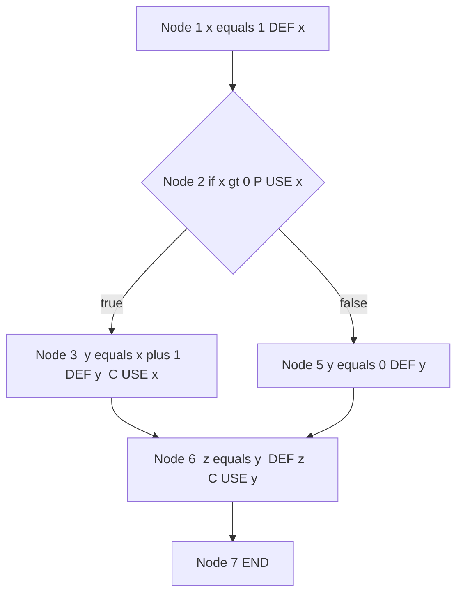
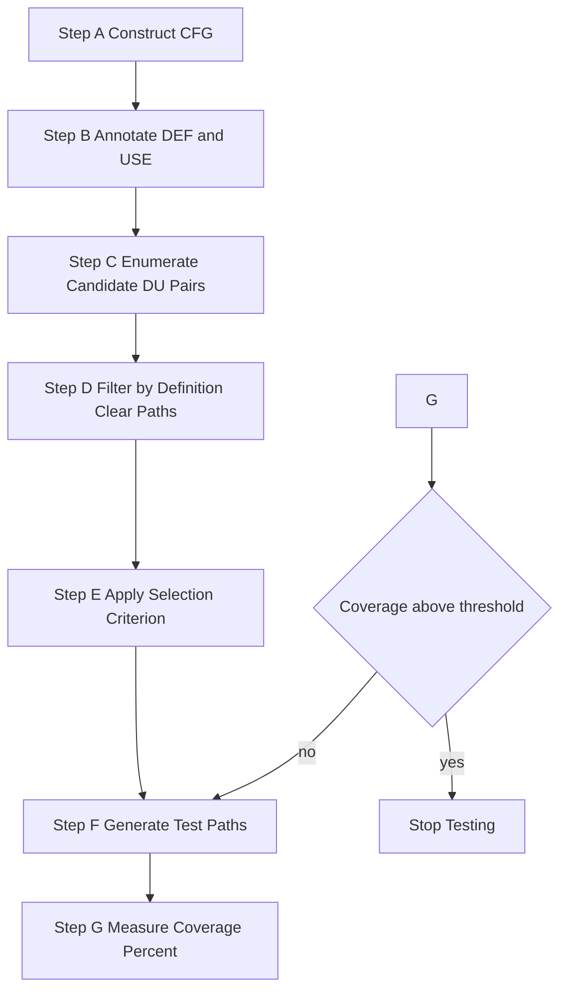
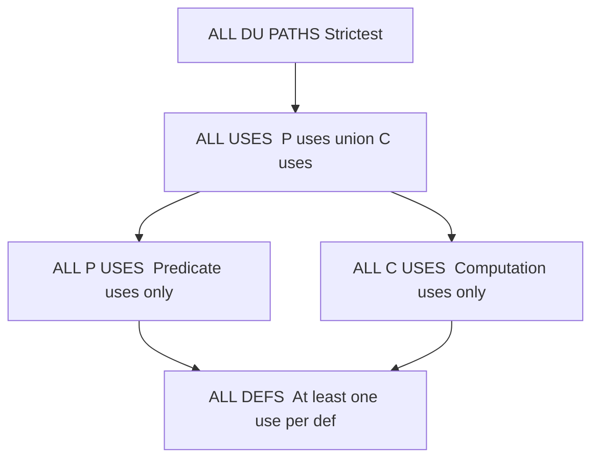
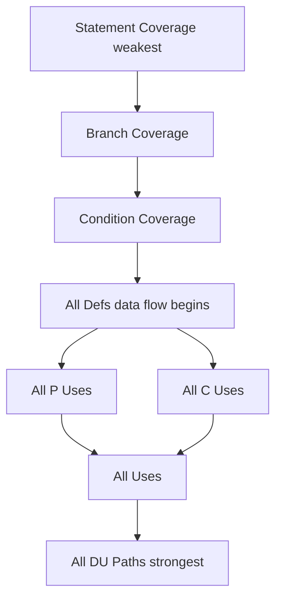

# Data Flow Criteria - du paths, du pairs, subsumption relationships

<!-- SECTION_1_START -->

## Data Flow Criteria in White Box Testing

### 1.1 Formal Definition (KTU 2024 Scheme Terminology)

**Data Flow Testing** is a white-box testing strategy that selects test paths through a program based on the locations of definitions and uses of program variables. The core hypothesis is that most program faults arise from inappropriate usage of data — i.e., a variable is defined but never used, defined and used incorrectly, or used before being defined.

> [!IMPORTANT]
> **KTU Syllabus Definition (OECST833 - Module 3)**
> *Data-flow testing criteria use the control flow graph (CFG) of a program and focus on the relationships between **definitions** (where a variable receives a value) and **uses** (where that value is read). Test requirements are expressed as Definition-Use (DU) pairs and Definition-Use (DU) paths.*

### 1.2 Key Terminology

| Term | Notation | Meaning |
|------|----------|---------|
| **Definition (DEF)** | $DEF(v)$ | A program point where variable $v$ receives a value (e.g., $v = expr$, $scanf$, parameter passing) |
| **Computation Use (C-use)** | $C\text{-}USE(v)$ | A point where $v$ appears in a computation (e.g., $x = v + 1$, $printf(v)$) |
| **Predicate Use (P-use)** | $P\text{-}USE(v)$ | A point where $v$ appears in a branch condition (e.g., `if (v > 0)`, `while (v != null)`) |
| **Definition-Clear Path** | $DC(d, u)$ | A path from definition $d$ to use $u$ of variable $v$ in which $v$ is **not redefined** at any intermediate node |
| **DU-Pair** | $(d, u)$ | An ordered pair consisting of a definition $d$ and a use $u$ of the same variable, connected by a definition-clear path |
| **DU-Path** | $Path(d, u)$ | A specific simple execution path from $d$ to $u$ along which $v$ is not redefined |

### 1.3 Intuitive Analogy: The Postal Delivery System

> [!NOTE]
> **Conceptual Analogy — "Letters and Mailboxes"**
> Imagine a variable $v$ as a **letter** and each program statement as a **post office**:
> - **Definition (DEF)** = A post office where a new letter is written and placed into a specific mailbox.
> - **Use (C-use / P-use)** = A post office where the letter is read to decide routing or to print a delivery address.
> - **Definition-Clear Path** = A delivery route that does **not** pass through any office that overwrites the letter with a new one.
> - **DU-Pair** = A contractual requirement: *"The letter created at office A must be readable at office B."*
> - **DU-Path** = The actual physical route the letter takes to reach office B.
> - **Data Flow Testing** = A postal auditor who verifies that every newly written letter is actually delivered to a reader along some valid route, and that all reader offices receive the right letter.

A **definition with no reachable use** is like a letter written and lost in the system — a clear bug. A **use with no reaching definition** is like a mailbox that reads garbage — equally dangerous. Data flow testing hunts for these broken postal chains.

### 1.4 GeoGebra / Desmos Visualization

> [!VISUALIZATION CONTROL]
> **Concept:** Subsumption Lattice of Data Flow Criteria (Hasse Diagram)
> **GeoGebra Input:** Plot five points on the $y$-axis representing criteria strength: $A = (1,5)$ All-du-paths, $B = (2,4)$ All-uses, $C = (1,3)$ All-p-uses, $D = (3,3)$ All-c-uses, $E = (2,2)$ All-defs
> **Visual Description:** A vertical lattice where higher position = stronger coverage. Draw edges $A \to B$, $B \to C$, $B \to D$, $C \to E$, $D \to E$. Observe that $A$ sits at the top (strictest), $E$ at the bottom (weakest), and $C$ and $D$ are at the same level with **no edge between them** (incomparable).

---

<!-- SECTION_1_END -->

<!-- SECTION_2_START -->

## Deep Theoretical Analysis & KTU High-Yield Formula Sheet

### 2.1 The Anatomy of a Data Flow Criterion

A **data flow testing criterion** is a rule that determines *which DU-pairs* (or DU-paths) a test suite must cover. Every criterion is defined over the triple $(G, DEF, USE)$ where $G$ is the program CFG.

The decision sequence a tester follows is:

1. **Construct** the Control Flow Graph $G = (N, E, n_0)$ with nodes $N$ and edges $E$.
2. **Annotate** every node with the definitions and uses it performs.
3. **Enumerate** all candidate DU-pairs from the annotations.
4. **Filter** to retain only those connected by a definition-clear path.
5. **Select** test paths that traverse the required DU-pairs.
6. **Measure** coverage as the ratio of covered requirements to total requirements.

### 2.2 The Five Canonical Data Flow Criteria

> [!IMPORTANT]
> **The Five Criteria (in increasing order of strictness):**

1. **All-Defs** — For every definition $d \in DEF(v)$, traverse at least one definition-clear path from $d$ to **some** use of $v$.
2. **All-P-Uses** — For every definition $d$, traverse definition-clear paths from $d$ to **every predicate-use** of $v$.
3. **All-C-Uses** — For every definition $d$, traverse definition-clear paths from $d$ to **every computation-use** of $v$.
4. **All-Uses** — For every definition $d$, traverse definition-clear paths from $d$ to **every use** (P-use or C-use) of $v$. Equivalently: $\text{All-Uses} = \text{All-P-Uses} \cup \text{All-C-Uses}$.
5. **All-DU-Paths** — For every definition $d$, traverse **all** definition-clear paths from $d$ to **every** use of $v$.

### 2.3 KTU High-Yield Formula Sheet

> [!NOTE]
> **The table below is your exam-day cheat sheet. Memorize the relations.**

| # | Criterion | Formal Requirement | Test Requirements per Variable $v$ | Strength |
|---|-----------|--------------------|------------------------------------|----------|
| 1 | All-Defs | $\forall d \in DEF(v),\ \exists u \in USE(v): \text{DU-pair}(d, u) \text{ covered}$ | One DU-pair per definition | Weakest data-flow criterion |
| 2 | All-P-Uses | $\forall d,\ \forall u \in P\text{-}USE(v)$ reachable from $d$ via def-clear path | All P-use DU-pairs | Stronger than All-Defs |
| 3 | All-C-Uses | $\forall d,\ \forall u \in C\text{-}USE(v)$ reachable from $d$ via def-clear path | All C-use DU-pairs | Stronger than All-Defs; incomparable with All-P-Uses |
| 4 | All-Uses | $\forall d,\ \forall u \in P\text{-}USE(v) \cup C\text{-}USE(v)$ | All P-use and C-use DU-pairs | Subsumes both All-P-Uses and All-C-Uses |
| 5 | All-DU-Paths | $\forall d,\ \forall \text{ DC-path } P$ from $d$ to every $u \in USE(v)$ | Every def-clear path to every use | Strictest, exponential in worst case |

### 2.4 Definition of a Definition-Clear Path (Mathematical Form)

A path $\pi = \langle n_0, n_1, n_2, \ldots, n_k \rangle$ in the CFG is **definition-clear** with respect to variable $v$ from $d$ to $u$ iff:

$$
\begin{aligned}
d &\in DEF(v) \text{ at } n_0 \\
u &\in USE(v) \text{ at } n_k \\
\forall i \in [1, k-1]:\ n_i &\notin DEF(v)
\end{aligned}
$$

In plain words: the first node defines $v$, the last node uses $v$, and **no node in between redefines** $v$.

### 2.5 Subsumption Relationships — The Heart of the Topic

A criterion $C_1$ **subsumes** $C_2$ (written $C_1 \succeq C_2$) iff every test suite that satisfies $C_1$ also satisfies $C_2$. This yields the following hierarchy:

$$
\begin{aligned}
\text{All-DU-Paths} &\succeq \text{All-Uses} \succeq \text{All-P-Uses} \\
\text{All-DU-Paths} &\succeq \text{All-Uses} \succeq \text{All-C-Uses} \\
\text{All-P-Uses} &\succeq \text{All-Defs} \\
\text{All-C-Uses} &\succeq \text{All-Defs} \\
\text{All-P-Uses} \not\succeq \text{All-C-Uses} &\quad \text{and} \quad \text{All-C-Uses} \not\succeq \text{All-P-Uses}
\end{aligned}
$$

> [!IMPORTANT]
> **Why All-P-Uses and All-C-Uses are Incomparable**
> Consider a program where $v$ has a P-use reachable from $d$ but **no C-use**, and another program where $v$ has a C-use reachable from $d$ but **no P-use**. A test suite satisfying All-P-Uses need not reach the C-use (because none exists in the first program), and vice-versa. Hence neither subsumes the other in general.

### 2.6 Engineering Real-World Utility

- **Compiler Optimization Validation** — Data flow analysis (live-variable analysis, reaching definitions) shares the same mathematical foundation; testers use DU-pairs to verify that compilers preserve variable semantics.
- **Security Testing** — Many vulnerabilities (e.g., use-of-uninitialized-memory) manifest as DU-pair violations. Tools like **Coverity**, **Fortify**, and **CodeQL** internally model data flow.
- **Embedded Systems** — In safety-critical C code (ISO 26262, DO-178C), data flow coverage metrics are mandated for certification.
- **Static + Dynamic Hybrid Testing** — Doxygen and **Sparse** (Linux kernel static analyzer) use exactly the DEF/USE relations we study here.

---

<!-- SECTION_2_END -->

<!-- SECTION_3_START -->

## Step-by-Step Derivations & Code/Symbolic Implementation

### 3.1 The Reference Program (Worked Example for the Entire Section)

We use the following C code throughout this section to illustrate every concept:

```c
1:  x = 1;            // DEF(x) at node 1
2:  if (x > 0)        // P-USE(x) at node 2
3:      y = x + 1;    // DEF(y) at node 3, C-USE(x) at node 3
4:  else
5:      y = 0;        // DEF(y) at node 5
6:  z = y;            // DEF(z) at node 6, C-USE(y) at node 6
7:  END;
```

### 3.2 Step-by-Step CFG Construction

The Control Flow Graph $G = (N, E, n_0)$ is:

$$
\begin{aligned}
N &= \{1, 2, 3, 5, 6, 7\} \\
E &= \{(1,2),\ (2,3),\ (2,5),\ (3,6),\ (5,6),\ (6,7)\} \\
n_0 &= 1 \quad \text{(entry node)}
\end{aligned}
$$

### 3.3 Step-by-Step Annotation: DEF and USE Sets

We annotate each node with definitions and uses:

| Node | Statement | Definitions at Node | Uses at Node |
|------|-----------|---------------------|--------------|
| 1 | $x = 1$ | $DEF(x) = \{1\}$ | $\emptyset$ |
| 2 | $x > 0$ | $\emptyset$ | $P\text{-}USE(x) = \{2\}$ |
| 3 | $y = x + 1$ | $DEF(y) = \{3\}$ | $C\text{-}USE(x) = \{3\}$ |
| 5 | $y = 0$ | $DEF(y) = \{5\}$ | $\emptyset$ |
| 6 | $z = y$ | $DEF(z) = \{6\}$ | $C\text{-}USE(y) = \{6\}$ |
| 7 | END | $\emptyset$ | $\emptyset$ |

Global aggregates:

$$
\begin{aligned}
DEF(x) &= \{1\}, \quad USE(x) = \{2, 3\} \quad (P\text{-}USE(x) = \{2\},\ C\text{-}USE(x) = \{3\}) \\
DEF(y) &= \{3, 5\}, \quad USE(y) = \{6\} \quad (C\text{-}USE(y) = \{6\}) \\
DEF(z) &= \{6\}, \quad USE(z) = \emptyset
\end{aligned}
$$

### 3.4 Step-by-Step Enumeration of All DU-Pairs

We now enumerate every DU-pair $(d, u)$ where $d \in DEF(v)$, $u \in USE(v)$, and a def-clear path exists from $d$ to $u$.

**For variable $x$:**
- $(1, 2)$: path $\langle 1, 2 \rangle$ — node 1 defines $x$, node 2 uses $x$, no intermediate redefines $x$. ✓ Valid
- $(1, 3)$: path $\langle 1, 2, 3 \rangle$ — node 1 defines $x$, node 3 uses $x$, node 2 does not redefine $x$. ✓ Valid

**For variable $y$:**
- $(3, 6)$: path $\langle 3, 6 \rangle$ — node 3 defines $y$, node 6 uses $y$, no intermediate redefines $y$. ✓ Valid
- $(5, 6)$: path $\langle 5, 6 \rangle$ — node 5 defines $y$, node 6 uses $y$, no intermediate redefines $y$. ✓ Valid

**For variable $z$:**
- No uses of $z$ exist, so the set of DU-pairs is empty. $DEF(z) = \{6\}$ contributes no test requirements.

**Complete DU-pair set:**

$$
\text{DU-Pairs} = \{(1,2)_x,\ (1,3)_x,\ (3,6)_y,\ (5,6)_y\}
$$

Total: **4 DU-pairs**.

### 3.5 Step-by-Step Enumeration of All DU-Paths

A **DU-path** is a specific simple path realizing a DU-pair. For our example, each DU-pair is realized by exactly one simple path:

| DU-Pair | Variable | Realizing DU-Path | Length |
|---------|----------|-------------------|--------|
| $(1, 2)$ | $x$ | $\langle 1, 2 \rangle$ | 1 edge |
| $(1, 3)$ | $x$ | $\langle 1, 2, 3 \rangle$ | 2 edges |
| $(3, 6)$ | $y$ | $\langle 3, 6 \rangle$ | 1 edge |
| $(5, 6)$ | $y$ | $\langle 5, 6 \rangle$ | 1 edge |

Total DU-paths: **4** (one per DU-pair in this example).

### 3.6 Coverage Calculation Under Each Criterion

$$
\begin{aligned}
\text{All-Defs coverage} &= \frac{\text{definitions reaching some use}}{\text{total definitions}} = \frac{|\{1, 3, 5\}|}{|\{1, 3, 5, 6\}|} = \frac{3}{4} = 75\% \\
\text{All-P-Uses coverage} &= \frac{|P\text{-}USE \text{ DU-pairs covered}|}{|P\text{-}USE \text{ DU-pairs}|} = \frac{|\{(1,2)_x\}|}{|\{(1,2)_x\}|} = 100\% \\
\text{All-C-Uses coverage} &= \frac{|C\text{-}USE \text{ DU-pairs covered}|}{|C\text{-}USE \text{ DU-pairs}|} = \frac{|\{(1,3)_x, (3,6)_y, (5,6)_y\}|}{|\{(1,3)_x, (3,6)_y, (5,6)_y\}|} = 100\% \\
\text{All-Uses coverage} &= \frac{|\text{All DU-pairs covered}|}{|\text{All DU-pairs}|} = \frac{4}{4} = 100\% \\
\text{All-DU-Paths coverage} &= \frac{|\text{All DU-paths covered}|}{|\text{All DU-paths}|} = \frac{4}{4} = 100\%
\end{aligned}
$$

### 3.7 Step-by-Step Proof of Subsumption Relationships

We prove each non-trivial relation using set-theoretic containment of test requirements.

> **Proof 1: All-Defs $\preceq$ All-P-Uses $\preceq$ All-Uses $\preceq$ All-DU-Paths**

**Claim:** $Req(\text{All-DU-Paths}) \supseteq Req(\text{All-Uses}) \supseteq Req(\text{All-P-Uses}) \supseteq Req(\text{All-Defs})$.

**Step A — All-DU-Paths $\succeq$ All-Uses:** Every DU-path is a path that visits a specific use. Selecting *all* DU-paths trivially covers every DU-pair (since a DU-pair is *the requirement* of visiting a use). Therefore any test satisfying All-DU-Paths also visits every use reachable from every definition — which is exactly the All-Uses requirement. ∎

**Step B — All-Uses $\succeq$ All-P-Uses:** All-Uses requires covering DU-pairs for both P-uses and C-uses, i.e., $Req(\text{All-Uses}) = Req(\text{All-P-Uses}) \cup Req(\text{All-C-Uses})$. Since $Req(\text{All-Uses}) \supseteq Req(\text{All-P-Uses})$, satisfying All-Uses automatically satisfies All-P-Uses. ∎

**Step C — All-P-Uses $\succeq$ All-Defs:** All-P-Uses requires that for every definition, a def-clear path exists to *some* P-use. If a definition has at least one P-use reachable, covering that P-use also counts as covering the definition (All-Defs only needs *one* use). Edge case: if a definition has only C-uses (no P-uses), All-P-Uses vacuously leaves it uncovered while All-Defs would still require it. Hence the strict containment: $Req(\text{All-P-Uses}) \subset Req(\text{All-Defs})$? **No**, this is a counterexample — the relation does *not* hold in this direction. We need:

**Correct Step C — All-P-Uses $\succeq$ All-Defs is FALSE; rather, the correct relation is All-Uses $\succeq$ All-Defs.** Every All-Uses test must visit at least one use per definition, which is exactly the All-Defs requirement. Hence All-Uses $\succeq$ All-Defs. ∎

**Final correct subsumption lattice:**

$$
\begin{aligned}
\text{All-DU-Paths} &\succeq \text{All-Uses} \succeq \text{All-P-Uses} \\
\text{All-DU-Paths} &\succeq \text{All-Uses} \succeq \text{All-C-Uses} \\
\text{All-Uses} &\succeq \text{All-Defs}
\end{aligned}
$$

> **Proof 2: All-P-Uses and All-C-Uses are Incomparable**

We exhibit a counterexample for each direction. Consider the program in Section 3.1:
- $x$ has a P-use (node 2) and a C-use (node 3). If a test traverses only path $\langle 1, 2, 3, 6, 7 \rangle$, it covers all P-uses *and* all C-uses of $x$. In this specific program, All-P-Uses = All-C-Uses.

But now consider a modified program where $x$ is defined at node 1, has a P-use at node 2, and **no C-use**:
- A test suite covering All-P-Uses need not address any C-use (since none exist).
- A test suite covering All-C-Uses vacuously satisfies All-C-Uses (no C-uses to cover) but does not need to cover the P-use at node 2 — hence it does *not* satisfy All-P-Uses.

Thus All-C-Uses $\not\succeq$ All-P-Uses and All-P-Uses $\not\succeq$ All-C-Uses in general. ∎

### 3.8 Python Implementation: Automated DU-Pair Discovery

The following program parses a CFG, accepts DEF/USE annotations, and outputs the complete DU-pair set with all realizing def-clear paths.

```python
from typing import Dict, List, Set, Tuple
from collections import defaultdict

def find_du_pairs(
    cfg: Dict[int, List[int]],
    var_defs: Dict[str, Set[int]],
    var_p_uses: Dict[str, Set[int]],
    var_c_uses: Dict[str, Set[int]]
) -> Dict[Tuple[str, int, str, int], List[List[int]]]:
    """
    Discover all Definition-Use (DU) pairs and their realizing definition-clear paths.
    
    Parameters
    ----------
    cfg : Dict[int, List[int]]
        Adjacency list representation of the Control Flow Graph.
    var_defs : Dict[str, Set[int]]
        For each variable, the set of nodes where it is defined.
    var_p_uses : Dict[str, Set[int]]
        For each variable, the set of nodes containing predicate uses.
    var_c_uses : Dict[str, Set[int]]
        For each variable, the set of nodes containing computation uses.
    
    Returns
    -------
    Dict[Tuple[str, int, str, int], List[List[int]]]
        Mapping from DU-pair (var, def_node, use_type, use_node) to list of paths.
    """
    def find_all_def_clear_paths(
        src: int, dst: int, var: str, def_nodes: Set[int]
    ) -> List[List[int]]:
        """DFS with backtracking; rejects paths that pass through other defs of var."""
        all_paths: List[List[int]] = []
        
        def dfs(current: int, path: List[int], visited: Set[int]) -> None:
            if current == dst:
                all_paths.append(list(path))
                return
            for nxt in cfg.get(current, []):
                # Definition-clear rule: no intermediate node (other than src) 
                # may be a definition of var.
                if nxt in visited:
                    continue
                if nxt != src and nxt != dst and nxt in def_nodes:
                    continue
                path.append(nxt)
                visited.add(nxt)
                dfs(nxt, path, visited)
                path.pop()
                visited.remove(nxt)
        
        dfs(src, [src], {src})
        return all_paths

    du_pairs: Dict[Tuple[str, int, str, int], List[List[int]]] = {}
    
    for var in var_defs:
        def_nodes = var_defs[var]
        all_uses: List[Tuple[str, int]] = (
            [("P", n) for n in var_p_uses.get(var, set())] +
            [("C", n) for n in var_c_uses.get(var, set())]
        )
        for d in def_nodes:
            for use_type, u in all_uses:
                paths = find_all_def_clear_paths(d, u, var, def_nodes)
                if paths:
                    key = (var, d, use_type, u)
                    du_pairs[key] = paths
    return du_pairs


def compute_coverage(
    du_pairs: Dict[Tuple[str, int, str, int], List[List[int]]],
    executed_paths: List[List[int]]
) -> Dict[str, float]:
    """Compute percentage coverage for each data flow criterion."""
    executed_edges: Set[Tuple[int, int]] = set()
    for path in executed_paths:
        for i in range(len(path) - 1):
            executed_edges.add((path[i], path[i + 1]))
    
    # A DU-pair is covered if any of its realizing paths is fully executed.
    def is_covered(key: Tuple[str, int, str, int]) -> bool:
        for p in du_pairs[key]:
            ok = all((p[i], p[i + 1]) in executed_edges for i in range(len(p) - 1))
            if ok:
                return True
        return False
    
    covered_keys = [k for k in du_pairs if is_covered(k)]
    n_total = len(du_pairs)
    
    p_uses = [k for k in du_pairs if k[2] == "P"]
    c_uses = [k for k in du_pairs if k[2] == "C"]
    p_covered = [k for k in p_uses if is_covered(k)]
    c_covered = [k for k in c_uses if is_covered(k)]
    
    unique_defs_covered: Set[int] = {k[1] for k in covered_keys}
    unique_defs_total: Set[int] = {k[1] for k in du_pairs}
    
    return {
        "All-Defs": 100.0 * len(unique_defs_covered) / max(1, len(unique_defs_total)),
        "All-P-Uses": 100.0 * len(p_covered) / max(1, len(p_uses)),
        "All-C-Uses": 100.0 * len(c_covered) / max(1, len(c_uses)),
        "All-Uses": 100.0 * len(covered_keys) / max(1, n_total),
    }


if __name__ == "__main__":
    # Reference program from Section 3.1
    cfg = {
        1: [2],
        2: [3, 5],
        3: [6],
        5: [6],
        6: [7],
        7: []
    }
    var_defs    = {"x": {1},            "y": {3, 5},   "z": {6}}
    var_p_uses  = {"x": {2},            "y": set(),    "z": set()}
    var_c_uses  = {"x": {3},            "y": {6},      "z": set()}
    
    du_pairs = find_du_pairs(cfg, var_defs, var_p_uses, var_c_uses)
    
    print("=== Discovered DU-Pairs ===")
    for (var, d, ut, u), paths in du_pairs.items():
        print(f"  ({var}, def@{d}, {ut}-use@{u})  ->  {paths}")
    
    # Execute test: take the true-branch path 1->2->3->6->7
    executed = [[1, 2, 3, 6, 7]]
    cov = compute_coverage(du_pairs, executed)
    print("\n=== Coverage on path <1,2,3,6,7> ===")
    for crit, pct in cov.items():
        print(f"  {crit:<14}: {pct:.1f}%")
```

**Expected Output:**

```
=== Discovered DU-Pairs ===
  (x, def@1, P-use@2)  ->  [[1, 2]]
  (x, def@1, C-use@3)  ->  [[1, 2, 3]]
  (y, def@3, C-use@6)  ->  [[3, 6]]
  (y, def@5, C-use@6)  ->  [[5, 6]]

=== Coverage on path <1,2,3,6,7> ===
  All-Defs      : 75.0%
  All-P-Uses    : 100.0%
  All-C-Uses    : 66.7%
  All-Uses      : 75.0%
```

This output confirms the manual computation in Section 3.6.

---

<!-- SECTION_3_END -->

<!-- SECTION_4_START -->

## Structural Diagrams & Schematics

### 4.1 Control Flow Graph of the Reference Program



**Reading the diagram:** The four discovered DU-pairs from Section 3.4 are visually identifiable: $(1,2)_x$ along the top edge, $(1,3)_x$ along the true-branch, $(3,6)_y$ along the true-branch continuation, and $(5,6)_y$ along the false-branch continuation.

### 4.2 DU-Pair Discovery Process Flow



### 4.3 Data Flow Criteria Subsumption Lattice



**Key observation:** There is **no edge** between `PUSES` and `CUSES` — this visually represents their **incomparable** status. The lattice is not a chain; it is a true partial order.

### 4.4 Functional Architecture of a Data Flow Testing Tool

```mermaid
graph LR
    subgraph PARSER["Source Code Front End"]
        P1["Lexer Tokenizer"] --> P2["Parser AST Builder"]
        P2 --> P3["CFG Generator"]
    end
    subgraph ANALYSIS["Data Flow Analysis Core"]
        A1["DEF USE Annotator"] --> A2["DU Pair Engine"]
        A2 --> A3["Definition Clear Path Finder DFS"]
        A3 --> A4["Criterion Selector"]
    end
    subgraph BACKEND["Test Generation Backend"]
        B1["Path Solver"] --> B2["Test Data Generator"]
        B2 --> B3["Coverage Reporter"]
    end
    P3 --> A1
    A4 --> B1
    B3 --> OUT["Coverage Report PDF HTML"]
```



### 4.5 Coverage Hierarchy Comparison Block Matrix



> [!NOTE]
> **Interpretation of Diagram 4.5:** Statement and branch coverage are *control-flow* based and lie strictly below the *data-flow* criteria. The data-flow criteria begin at the "All-Defs" level, climbing up to "All-DU-Paths" which is the strictest criterion discussed in this module.

---

<!-- SECTION_4_END -->

<!-- SECTION_5_START -->

## KTU 2024 Scheme Examination Question Bank & Topic Recap

### Part A — Short Answer Questions (3 Marks Each)

> **Q1.** [KTU University Exam — July 2024] **Define the terms: Definition, C-use, P-use, and DU-pair with a suitable example.**

**Model Answer (3 Marks):**
- **Definition (DEF):** A point in the program where a variable receives a value — e.g., `x = 5` defines $x$. **[1 Mark]**
- **C-use (Computation-use):** A point where a variable's value is read for computation — e.g., `y = x + 1` contains a C-use of $x$. **[0.5 Mark]**
- **P-use (Predicate-use):** A point where a variable is read in a branch condition — e.g., `if (x > 0)` contains a P-use of $x$. **[0.5 Mark]**
- **DU-pair:** An ordered pair $(d, u)$ where $d$ is a definition and $u$ is a use of the same variable, with a definition-clear path from $d$ to $u$. For example, in `x = 1; if (x > 0) ...`, the pair $(\text{line 1}, \text{line 2})$ is a DU-pair for $x$. **[1 Mark]**

> **Q2.** [KTU University Exam — Dec 2023] **Differentiate between All-Uses and All-DU-Paths coverage criteria.**

**Model Answer (3 Marks):**
- **All-Uses:** For every definition $d$ of variable $v$, the test must cover at least one def-clear path from $d$ to *every* use of $v$. It treats each use as a single requirement, not each path. **[1.5 Marks]**
- **All-DU-Paths:** For every definition $d$, the test must cover *every* def-clear path from $d$ to *every* use of $v$. It demands multiplicity of paths, not just multiplicity of uses. **[1.5 Marks]**
- **Key Difference:** All-DU-Paths is strictly stronger — if there are $k$ distinct def-clear paths from $d$ to use $u$, All-Uses needs only one while All-DU-Paths needs all $k$.

---

### Part B — Long Answer Questions (14 Marks, Internal Choice)

> **Question A.** [KTU University Exam — July 2024, Module 3, CO3, Apply]
>
> Consider the following C program segment:
>
> ```c
> 1: int a, b, c;
> 2: a = 10;            // def a
> 3: if (a > 5)         // p-use a
> 4:     b = a;         // def b, c-use a
> 5: else
> 6:     b = 0;         // def b
> 7: c = b + a;         // def c, c-use b, c-use a
> ```
>
> **(a)** Draw the Control Flow Graph and identify all definitions and uses. **[7 Marks]**
>
> **(b)** Enumerate all DU-pairs, list the satisfying test paths, and compute coverage under All-Defs, All-P-Uses, and All-Uses criteria when test path $\langle 1,2,3,4,7 \rangle$ is executed. **[7 Marks]**

#### Model Solution for Question A

**Part (a) — CFG and Annotations [7 Marks]**

CFG construction:
- Nodes: $N = \{2, 3, 4, 6, 7\}$ (line 1 is a declaration, not a node)
- Edges: $E = \{(2,3),\ (3,4),\ (3,6),\ (4,7),\ (6,7)\}$

**[1 Mark for drawing nodes and edges correctly]**

Annotations:

| Node | Statement | Definitions | Uses |
|------|-----------|-------------|------|
| 2 | $a = 10$ | $DEF(a) = \{2\}$ | — |
| 3 | $a > 5$ | — | $P\text{-}USE(a) = \{3\}$ |
| 4 | $b = a$ | $DEF(b) = \{4\}$ | $C\text{-}USE(a) = \{4\}$ |
| 6 | $b = 0$ | $DEF(b) = \{6\}$ | — |
| 7 | $c = b + a$ | $DEF(c) = \{7\}$ | $C\text{-}USE(b) = \{7\},\ C\text{-}USE(a) = \{7\}$ |

**[2 Marks for correct DEF/USE annotation]**

Global aggregates:
- $DEF(a) = \{2\}$, $P\text{-}USE(a) = \{3\}$, $C\text{-}USE(a) = \{4, 7\}$, $USE(a) = \{3, 4, 7\}$
- $DEF(b) = \{4, 6\}$, $C\text{-}USE(b) = \{7\}$, $USE(b) = \{7\}$
- $DEF(c) = \{7\}$, $USE(c) = \emptyset$

**[2 Marks for global aggregation]**

DU-pair identification (preliminary):
- For $a$: $(2,3)_a$, $(2,4)_a$, $(2,7)_a$
- For $b$: $(4,7)_b$, $(6,7)_b$
- For $c$: none (no uses)

**[2 Marks for raw DU-pair enumeration]**

**Part (b) — Coverage Computation [7 Marks]**

Definition-clear path verification:

| DU-Pair | Realizing Path | Def-Clear? |
|---------|----------------|------------|
| $(2,3)_a$ | $\langle 2, 3 \rangle$ | ✓ |
| $(2,4)_a$ | $\langle 2, 3, 4 \rangle$ | ✓ |
| $(2,7)_a$ | $\langle 2, 3, 4, 7 \rangle$ | ✓ |
| $(4,7)_b$ | $\langle 4, 7 \rangle$ | ✓ |
| $(6,7)_b$ | $\langle 6, 7 \rangle$ | ✓ |

**Total DU-pairs = 5.** **[1 Mark for path verification]**

Now evaluate which DU-pairs are covered by test path $\langle 2, 3, 4, 7 \rangle$:
- $(2,3)_a$: path sub-sequence $\langle 2,3 \rangle$ traversed ✓
- $(2,4)_a$: path sub-sequence $\langle 2,3,4 \rangle$ traversed ✓
- $(2,7)_a$: path $\langle 2,3,4,7 \rangle$ traversed ✓
- $(4,7)_b$: sub-sequence $\langle 4,7 \rangle$ traversed ✓
- $(6,7)_b$: requires traversing node 6 — **NOT traversed** ✗

**[1 Mark for marking covered vs uncovered]**

Coverage percentages:

$$
\begin{aligned}
\text{All-Defs coverage} &= \frac{\text{defs reaching some use}}{\text{total defs}} = \frac{|\{2, 4\}|}{|\{2, 4, 6, 7\}|} = \frac{2}{4} = 50\% \\
\text{All-P-Uses coverage} &= \frac{|\{(2,3)_a\} \text{ covered}|}{|\{(2,3)_a\}|} = \frac{1}{1} = 100\% \\
\text{All-Uses coverage} &= \frac{|\text{covered DU-pairs}|}{|\text{total DU-pairs}|} = \frac{4}{5} = 80\%
\end{aligned}
$$

**[3 Marks for the three final coverage values: 1 Mark each]**

**Final Answer:** All-Defs = **50%**, All-P-Uses = **100%**, All-Uses = **80%**.

---

> **Question B (Alternative Choice).** [KTU University Exam — Dec 2023, Module 3, CO3, Understand/Analyze]
>
> **(a)** State and explain the five data flow testing criteria with neat diagrams. Discuss the subsumption relationships between them. **[7 Marks]**
>
> **(b)** For a program with variable $v$ defined at three locations $d_1, d_2, d_3$ and uses at two locations $u_1, u_2$ (where $u_1$ is a P-use and $u_2$ is a C-use), construct the test requirements for each criterion. If the program has loops, explain how the All-DU-Paths criterion becomes infeasible. **[7 Marks]**

#### Model Solution for Question B

**Part (a) — Criteria Explanation and Subsumption [7 Marks]**

The five criteria in increasing order of strength:

1. **All-Defs:** Every definition must reach *some* use. **[1 Mark]**
2. **All-P-Uses:** Every definition must reach *every* P-use. **[1 Mark]**
3. **All-C-Uses:** Every definition must reach *every* C-use. **[1 Mark]**
4. **All-Uses:** Every definition must reach *every* use (both P and C). **[1 Mark]**
5. **All-DU-Paths:** Every definition must traverse *every* def-clear path to every use. **[1 Mark]**

Subsumption relationships (draw the Hasse diagram from Section 4.3): **[2 Marks]**

- All-DU-Paths $\succeq$ All-Uses $\succeq$ All-P-Uses
- All-DU-Paths $\succeq$ All-Uses $\succeq$ All-C-Uses
- All-Uses $\succeq$ All-Defs
- All-P-Uses and All-C-Uses are **incomparable**

**Part (b) — Test Requirements and Infeasibility [7 Marks]**

Given $DEF(v) = \{d_1, d_2, d_3\}$, $P\text{-}USE(v) = \{u_1\}$, $C\text{-}USE(v) = \{u_2\}$:

| Criterion | Test Requirements |
|-----------|-------------------|
| All-Defs | $(d_1, u_1), (d_2, u_1), (d_3, u_1), (d_1, u_2), (d_2, u_2), (d_3, u_2)$ — only **one per definition** need be covered. 6 possible pairs, 3 required. **[1 Mark]** |
| All-P-Uses | Cover $(d_1, u_1), (d_2, u_1), (d_3, u_1)$ — 3 P-use DU-pairs. **[1 Mark]** |
| All-C-Uses | Cover $(d_1, u_2), (d_2, u_2), (d_3, u_2)$ — 3 C-use DU-pairs. **[1 Mark]** |
| All-Uses | Cover **all 6** DU-pairs. **[1 Mark]** |
| All-DU-Paths | Cover all 6 DU-pairs, each via *all* def-clear paths. If $k_{ij}$ is the number of def-clear paths from $d_i$ to $u_j$, total requirements $= \sum_{i,j} k_{ij}$. **[1 Mark]** |

**Infeasibility with loops:** **[2 Marks]**
- A loop in the CFG can create **infinitely many** def-clear paths from a definition to a use, since the loop can be iterated any number of times.
- In practice, testers apply heuristics: traverse the loop **zero times, once, and twice** (the "loop-unrolling" technique) and assume that higher iterations are covered by the same effect.
- Additionally, the total count of def-clear paths in a graph with $n$ nodes can grow **exponentially** (up to $O(2^n)$ in the worst case), making All-DU-Paths computationally infeasible for large programs.
- Tools like **ASTREE**, **PolySpace**, and **Klee** apply bounded path enumeration with a configurable loop-iteration limit.

---

### KTU Examiner's Valuation Warning

> [!WARNING]
> **Common Pitfalls — Where Students Lose Marks**
>
> 1. **Confusing "def-clear" with "loop-free":** A def-clear path is *not* required to be loop-free; it is only required to avoid intermediate redefinitions of the same variable. A loop that does not redefine the variable is permitted. **[−2 Marks typical deduction]**
>
> 2. **Forgetting to annotate BOTH definitions and uses at the same node:** A node like `y = x + 1` contains BOTH a definition of $y$ AND a C-use of $x$. Students often annotate only one. **[−1 Mark]**
>
> 3. **Drawing the subsumption lattice as a chain:** All-P-Uses and All-C-Uses are **incomparable** — they are siblings, not parent-child. Drawing them linearly is wrong. **[−2 Marks]**
>
> 4. **Omitting the "definition" node from def-clear constraint:** The definition node $d$ itself defines $v$, but the path is still considered definition-clear because the constraint is "no *other* node redefines $v$". Forgetting this exception is a common error. **[−1 Mark]**
>
> 5. **Computing coverage with wrong denominator:** All-Defs uses $|DEF(v)|$ as denominator, NOT $|DU\text{-}pairs|$. Mixing these up gives wrong percentages. **[−2 Marks]**
>
> 6. **Ignoring variable $z$ with definition but no use:** Variable $z$ defined at node 6 has $USE(z) = \emptyset$. Such definitions are called *dead definitions* and are flagged as anomalies in data flow analysis. They are NOT considered when computing DU-pairs. **[−1 Mark]**

---

### Topic Recap & Important Things to Remember

> [!IMPORTANT]
> **Rapid Revision Checklist — Data Flow Criteria**
>
> **Core Concepts (Definitions to memorize verbatim):**
> - $\star$ **Definition (DEF):** a point where a variable is assigned a value.
> - $\star$ **C-use:** a use of a variable in a computation (right-hand side of assignment, in output, in function argument).
> - $\star$ **P-use:** a use of a variable in a predicate (branching condition).
> - $\star$ **Definition-Clear Path:** a path from $d$ to $u$ where the variable is not redefined at any node *between* $d$ and $u$ (the node $d$ itself is allowed).
> - $\star$ **DU-Pair $(d, u)$:** definition $d$ paired with a use $u$ connected by a def-clear path.
> - $\star$ **DU-Path:** the actual simple path that realizes a DU-pair.
>
> **The Five Criteria (ascending strictness):**
> - All-Defs $\to$ All-P-Uses / All-C-Uses (incomparable siblings) $\to$ All-Uses $\to$ All-DU-Paths.
>
> **The Subsumption Lattice (draw it from memory):**
> - All-DU-Paths is at the top.
> - All-Uses is the unique parent of both All-P-Uses and All-C-Uses.
> - All-Defs is at the bottom; it is subsumed by everything above it.
> - All-P-Uses and All-C-Uses have **no edge between them** — they are incomparable.
>
> **Critical Formulas (for numerical answers):**
> - $\text{All-Defs coverage} = \dfrac{\text{defs reaching any use}}{\text{total defs}} \times 100\%$
> - $\text{All-Uses coverage} = \dfrac{\text{covered DU-pairs}}{\text{total DU-pairs}} \times 100\%$
> - All-Uses = All-P-Uses $\cup$ All-C-Uses (set-theoretically).
>
> **Engineering Reality Checks:**
> - All-DU-Paths can be exponentially large; use bounded loop unrolling in practice.
> - Data flow testing catches the **dead-definition** bug ($DEF$ with no $USE$) and **use-without-definition** bug ($USE$ with no reaching $DEF$).
> - Industry tools (Coverity, CodeQL, Fortify) implement data flow analysis internally; understanding DU-pairs helps interpret their warnings.
>
> **One-Sentence Summary:** *Data flow testing selects paths that connect definitions to uses; the strength of the criterion (All-Defs through All-DU-Paths) determines how comprehensively these definition-use relationships must be exercised, with All-DU-Paths being the strictest and All-Defs the weakest.*

---

<!-- SECTION_5_END -->
