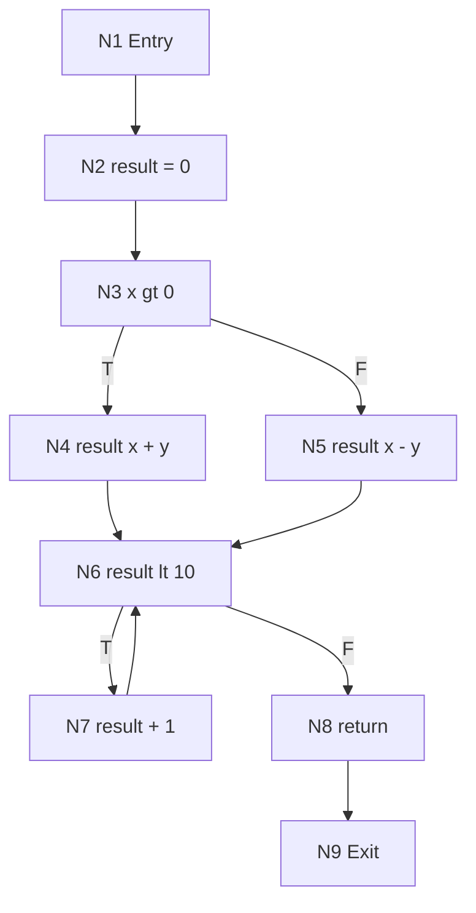
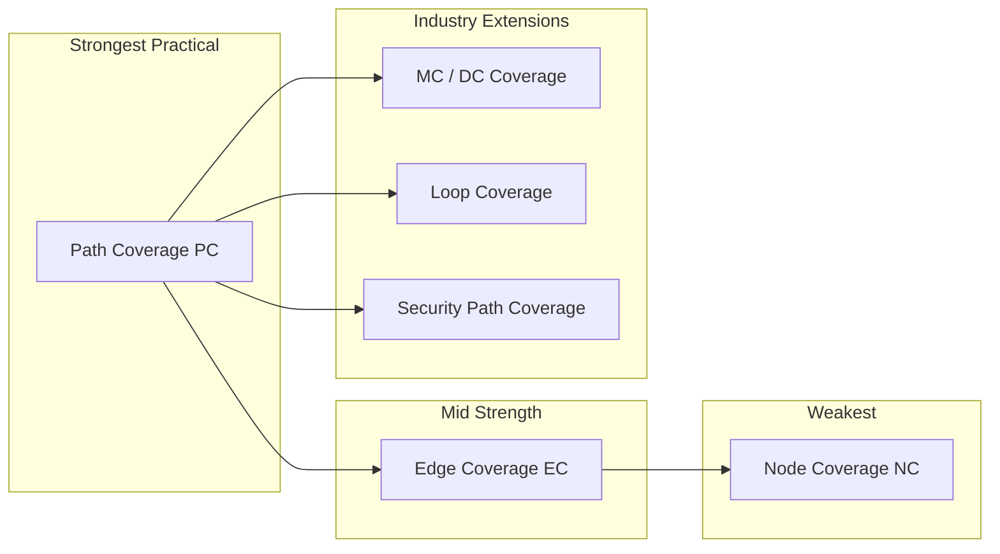
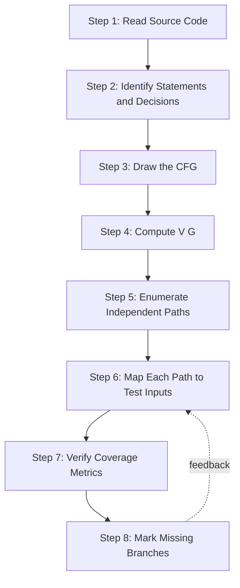
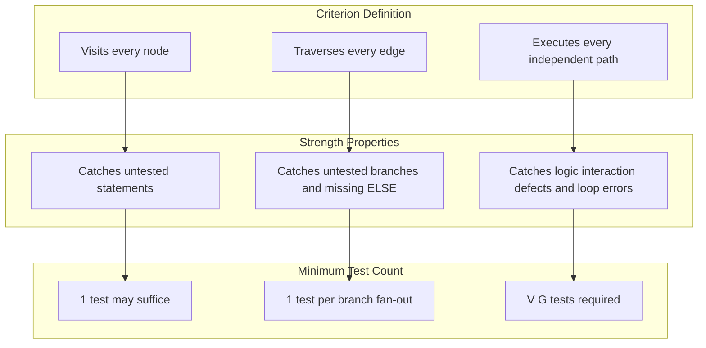
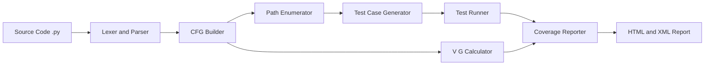

# Graph Coverage Criteria - Node, edge, and path coverage

<!-- SECTION_1_START -->
# Graph Coverage Criteria in Software Testing

> [!IMPORTANT]
> **KTU 2024 Scheme | OECST833 | Module 3 | Advanced White-Box & Security Testing**
> This topic forms the analytical backbone of structural (white-box) testing. KTU examiners routinely frame Part-B questions on deriving test paths that satisfy **Node, Edge, and Path Coverage** for a given control flow graph (CFG).

## 1.1 Formal Academic Definition

In **graph-based testing**, the program under test is modeled as a directed graph $G = (N, N_0, E)$, where:

- $N$ — the finite set of **nodes** (representing statements, predicates, or program fragments).
- $N_0$ — the designated **entry node** ($N_0 \in N$).
- $E \subseteq N \times N$ — the set of directed **edges** (representing control flow transfers).

A **coverage criterion** $C$ is a rule that selects a set of elements (nodes, edges, or paths) from the graph that the test suite must traverse at least once. Three canonical criteria are prescribed by KTU:

| Criterion | Element Exercised | Strength |
|---|---|---|
| **Node Coverage (NC)** | Every node $n \in N$ | Weakest structural criterion |
| **Edge Coverage (EC)** | Every edge $e \in E$ | Stronger — implies NC |
| **Path Coverage (PC)** | Every independent path $p \in P$ | Strongest practical criterion |

> [!NOTE]
> **Why "Graph" Coverage?** Any executable program (sequential, branching, or looping) can be transformed into a directed graph. Once modeled, the testing problem reduces to a *graph traversal problem* — a mathematically well-defined task. This is the bridge that lets testers use formal techniques on real code.

## 1.2 Conceptual Analogy — The City Map

Imagine your program is a **city map**:

- **Streets** = *edges* (transitions between instructions).
- **Intersections** = *nodes* (blocks of statements).
- **Roadtrips** = *paths* (sequences of streets from one intersection to another).

> **Node Coverage** says: *"Visit every intersection at least once."* A tourist who simply drives through one highway that passes all junctions would satisfy this — but they would never actually **turn** at any intersection.

> **Edge Coverage** says: *"Drive down every street at least once."* This forces the tourist to take every turn, exposing broken one-way signs or dead-end roads.

> **Path Coverage** says: *"Complete every unique trip from home to work without repeating an intersection."* This is the most demanding, since it covers every distinct route.

In testing terms, an **edge defect** (e.g., a misplaced `else` branch) can hide behind full node coverage but be exposed only by edge coverage. **Path coverage** additionally catches defects that only manifest during specific *combinations* of decisions (e.g., loop interaction bugs).

## 1.3 The Underlying Model — Control Flow Graph (CFG)

> [!IMPORTANT]
> **KTU Favourite:** Whenever a question gives you a piece of code and asks for "test paths satisfying edge/path coverage," the first valuation step (2 marks) is **always** drawing the correct CFG. Skipping the CFG costs marks.

A **Control Flow Graph (CFG)** is a directed graph whose:

- **Nodes** represent *sequential statements* or *predicate (decision) points*.
- **Edges** represent *transfer of control* between nodes.
- **Cycles** in the graph correspond to loops in the source code.

The CFG is the **canvas** on which all three coverage criteria are evaluated.

## 1.4 Key Engineering Metrics

The following metrics are **bolded because they appear verbatim in KTU question stems**:

- **Cyclomatic Complexity** $V(G)$ — the number of linearly independent paths through the program.
- **Region** — an area bounded by edges and nodes (including the outer region).
- **Independent Path** — a path that introduces at least one new edge not present in any previously defined independent path.

> [!VISUALIZATION CONTROL]
> **Concept:** Coverage hierarchy on a tiny 3-node diamond graph
> **GeoGebra / Desmos Input (parametric):**
> * Node A at $(0, 1)$, B at $(1, 2)$, C at $(1, 0)$, D at $(2, 1)$
> * Edges: $A\!\to\!B$, $A\!\to\!C$, $B\!\to\!D$, $C\!\to\!D$
> **Visual Description:** A diamond on the Cartesian plane. The 4 edges form 2 independent paths: $A\to B\to D$ and $A\to C\to D$. Node coverage is satisfied by a single test that touches $A,B,C,D$ (e.g., $A\to B\to D$ misses $C$). Edge coverage needs both edges from $A$ to be traversed.

## 1.5 Relationship Between the Three Criteria

A fundamental theorem of graph-based testing states:

$$\text{Path Coverage} \;\Rightarrow\; \text{Edge Coverage} \;\Rightarrow\; \text{Node Coverage}$$

The reverse is **not** true. A test suite that achieves 100\% node coverage typically achieves only **40\%–70\%** edge coverage on real programs. KTU Module 3 stresses that under **security testing**, edge coverage is the *minimum acceptable* threshold, because security defects (missing authentication check, missing input validation) are usually hidden behind decision branches.

> [!WARNING]
> **Examiner's Pitfall:** A common student mistake is to claim that "node coverage $\Rightarrow$ edge coverage." This is **false**. A single test path $A\to B\to D$ in the diamond above covers *all 4 nodes* but only *3 of 4 edges* (misses $A\to C$).

<!-- SECTION_1_END -->

<!-- SECTION_2_START -->
# Deep Theoretical Analysis & KTU High-Yield Formula Sheet

## 2.1 Operational Definitions (Precise)

Let $G = (N, N_0, E)$ be the control flow graph and $T = \{t_1, t_2, \dots, t_k\}$ be a test suite. Each test $t_i$ walks a path $\pi(t_i)$ through $G$. Define:

### 2.1.1 Node Coverage (NC)
A test path $p$ *covers* node $n$ if $n \in p$. A test suite $T$ satisfies **NC** if:

$$\text{NC}(T) \;=\; \frac{\vert \{n \in N \;:\; \exists\, t \in T,\; n \in \pi(t)\} \vert}{\vert N \vert} \;\times\; 100\%$$

A test suite **achieves NC** when $\text{NC}(T) = 100\%$, i.e., every node is visited by at least one test.

### 2.1.2 Edge Coverage (EC)
A test path $p$ *covers* edge $e = (u, v)$ if $e$ appears in $p$. A test suite satisfies **EC** if:

$$\text{EC}(T) \;=\; \frac{\vert \{e \in E \;:\; \exists\, t \in T,\; e \in \pi(t)\} \vert}{\vert E \vert} \;\times\; 100\%$$

EC is also called **branch coverage** or **decision coverage** (DC, the C1 metric in the ISO 25010 standard).

### 2.1.3 Path Coverage (PC)
A test suite satisfies **PC** if it executes *every* complete path from $N_0$ to a terminal node. For a graph with cycles, complete path coverage is infinite, so testers use:

- **Complete Path Coverage (CPC)** — all finite paths.
- **Independent Path Coverage (IPC)** — a tractable subset where each path adds at least one new edge. The cardinality of IPC is exactly $V(G)$.

$$\text{IPC}(T) \;=\; \frac{\vert \{p \in P_{\text{indep}} \;:\; \exists\, t \in T,\; \pi(t) \text{ traverses } p\} \vert}{V(G)} \;\times\; 100\%$$

## 2.2 Cyclomatic Complexity — The Backbone Formula

The number of independent paths equals the cyclomatic complexity, computable **three equivalent ways**:

$$V(G) \;=\; E - N + 2P \quad\quad (P = \text{number of connected components})$$

$$V(G) \;=\; \pi + 1 \quad\quad\quad\quad\quad\quad (\pi = \text{number of predicate nodes})$$

$$V(G) \;=\; R \quad\quad\quad\quad\quad\quad\quad\quad\; (R = \text{number of enclosed regions})$$

> [!NOTE]
> **Why $V(G)$ matters:** It tells the tester the *minimum number of test cases* required to exercise every independent path. A function with $V(G) = 10$ needs at least 10 tests to achieve IPC.

## 2.3 KTU Formula Sheet (Cheat Sheet)

> [!IMPORTANT]
> The following table is high-yield. Memorize the symbols; the KTU question stem will *not* re-define them.

| Symbol | Meaning | Typical Unit / Range |
|---|---|---|
| $N$ | Total nodes in CFG | $\geq 1$ |
| $E$ | Total edges in CFG | $\geq N - 1$ |
| $P$ | Connected components (usually $1$) | $1$ for a single program |
| $V(G)$ | Cyclomatic complexity | $\geq 1$ |
| $\pi$ | Number of predicate (decision) nodes | $\geq 0$ |
| $R$ | Number of regions in CFG | $\geq 1$ |
| $\text{NC}$ | Node coverage percentage | $0\% - 100\%$ |
| $\text{EC}$ | Edge coverage percentage | $0\% - 100\%$ |
| $\text{PC}$ | Path coverage percentage | $0\% - 100\%$ |
| $\text{NC}_{\min}$ | Minimum test cases for NC | $1$ |
| $\text{EC}_{\min}$ | Minimum test cases for EC | $\lceil V(G) / \text{max-edges-per-test} \rceil$ |
| $\text{PC}_{\min}$ | Minimum test cases for PC | $V(G)$ |

**Coverage Threshold Rules of Thumb (Industry / McCabe):**

$$\text{Healthy} \quad\Rightarrow\quad V(G) \leq 10$$

$$\text{Risky} \quad\Rightarrow\quad 10 < V(G) \leq 20$$

$$\text{Untestable} \quad\Rightarrow\quad V(G) > 20$$

## 2.4 Why This Matters in Engineering & Security Testing

| Domain | Why Graph Coverage is Critical |
|---|---|
| **Web Security** | Missing `else` branch on authentication check = unauthorized access. Only edge coverage exposes this. |
| **Avionics (DO-178C)** | Mandates **MC/DC** (Modified Condition/Decision Coverage), which is a refinement of edge coverage. |
| **Medical Devices (FDA)** | Requires structural coverage reports (NC + EC) as part of submission dossier. |
| **API Testing** | Each endpoint's CFG must be 100\% edge-covered to catch boundary-condition exploits. |
| **Smart Contracts** | Re-entrancy and unchecked-call bugs hide behind "obvious" paths; PC catches them. |

> [!IMPORTANT]
> **KTU Module 3 — Security Context:** In penetration testing, the attacker's CFG of the *defensive code* (firewall rules, auth routines) is built first. Test cases achieving 100\% EC on the defensive CFG are then mapped to **STRIDE** threat categories. This is how the OWASP testing guide operationalizes white-box security testing.

<!-- SECTION_2_END -->

<!-- SECTION_3_START -->
# Step-by-Step Derivations, Worked Example, and Code Implementation

## 3.1 Reference Program (Used Throughout This Section)

Consider the following Python function — chosen to be **examinable** in KTU (small, has both a decision and a loop):

```python
def process(x, y):
    # Node 1: Entry
    result = 0                       # Node 2
    if x > 0:                        # Node 3 (predicate)
        result = x + y               # Node 4
    else:
        result = x - y               # Node 5
    while result < 10:               # Node 6 (predicate)
        result = result + 1          # Node 7
    return result                    # Node 8
# Node 9: Exit
```

## 3.2 Step 1 — Construct the Control Flow Graph (CFG)

| Node | Meaning | Edges Out |
|---|---|---|
| $N_1$ | Entry | $N_1 \to N_2$ |
| $N_2$ | `result = 0` | $N_2 \to N_3$ |
| $N_3$ | `x > 0` (predicate) | $N_3 \xrightarrow{T} N_4$, $N_3 \xrightarrow{F} N_5$ |
| $N_4$ | `result = x + y` | $N_4 \to N_6$ |
| $N_5$ | `result = x - y` | $N_5 \to N_6$ |
| $N_6$ | `result < 10` (predicate) | $N_6 \xrightarrow{T} N_7$, $N_6 \xrightarrow{F} N_8$ |
| $N_7$ | `result += 1` | $N_7 \to N_6$ |
| $N_8$ | `return result` | $N_8 \to N_9$ |
| $N_9$ | Exit | (terminal) |

Counting: $\;N = 9$ nodes, $\;E = 10$ edges, $\;P = 1$ connected component.

**Cyclomatic Complexity (three methods, must agree):**

$$\begin{aligned}
V(G) &= E - N + 2P \\
     &= 10 - 9 + 2(1) \\
     &= 3
\end{aligned}$$

$$\begin{aligned}
V(G) &= \pi + 1 \quad\text{where } \pi = 2 \text{ predicates } (N_3, N_6) \\
     &= 2 + 1 = 3
\end{aligned}$$

$$\begin{aligned}
V(G) &= R = 3 \quad \text{(3 enclosed regions in the CFG diagram)}
\end{aligned}$$

All three methods give $\;V(G) = 3\;$. The KTU examiner awards **2 marks** just for this computation.

## 3.3 Step 2 — Enumerate the Three Independent Paths

| Path ID | Sequence | English Description |
|---|---|---|
| $P_1$ | $N_1 \to N_2 \to N_3 \to N_4 \to N_6 \to N_8 \to N_9$ | $x > 0$, loop body **never** executed |
| $P_2$ | $N_1 \to N_2 \to N_3 \to N_5 \to N_6 \to N_8 \to N_9$ | $x \leq 0$, loop body **never** executed |
| $P_3$ | $N_1 \to N_2 \to N_3 \to N_4 \to N_6 \to N_7 \to N_6 \to N_8 \to N_9$ | $x > 0$, loop body executed **at least once** |

The fourth path "$x \leq 0$ + loop executed" is **not independent** because it does not introduce a new edge not already covered.

## 3.4 Step 3 — Design Test Cases for Each Coverage Criterion

### 3.4.1 Node Coverage Test Suite ($T_{\text{NC}}$)

Goal: visit every node. The cheapest test is one that traverses $P_3$:

$$T_{\text{NC}} = \{ t_1 = (x = 5,\; y = 0) \}$$

Trace of $t_1$: $\;x=5>0\;$true$\;\Rightarrow\;$ `result=5`$\;\Rightarrow\;$ `5<10` true$\;\Rightarrow\;$ `result=6`$\;\Rightarrow\;$ `6<10` true$\;\Rightarrow\;\dots\;\Rightarrow\;$ `result=10`$\;\Rightarrow\;$ `10<10` false$\;\Rightarrow\;$ return.

**Visits:** $\{N_1, N_2, N_3, N_4, N_6, N_7, N_8, N_9\} = 8$ nodes. Misses only $N_5$.

$$\text{NC}(T_{\text{NC}}) = \frac{8}{9} \times 100\% \approx 88.9\%$$

To reach 100\%, we add a test that goes through $N_5$:

$$T_{\text{NC}}^{*} = \{(5, 0),\; (-3, 0)\}$$

### 3.4.2 Edge Coverage Test Suite ($T_{\text{EC}}$)

Goal: traverse every one of the 10 edges. Listing required edges:

| Edge | Required Trigger |
|---|---|
| $N_1 \to N_2$ | any call |
| $N_2 \to N_3$ | any call |
| $N_3 \to N_4$ | $x > 0$ |
| $N_3 \to N_5$ | $x \leq 0$ |
| $N_4 \to N_6$ | after true branch |
| $N_5 \to N_6$ | after false branch |
| $N_6 \to N_7$ | loop enters (`result < 10`) |
| $N_6 \to N_8$ | loop exits (`result $\geq$ 10`) |
| $N_7 \to N_6$ | loop back-edge |
| $N_8 \to N_9$ | any return |

Minimum suite: $\{t_1, t_2\}$ where $t_1 = (5, 0)$ and $t_2 = (-3, 0)$. Both produce a path that goes through the loop at least once (since $5<10$ and $-3<10$), so all 10 edges are covered.

$$\text{EC}(T_{\text{EC}}) = \frac{10}{10} \times 100\% = 100\%$$

### 3.4.3 Path Coverage Test Suite ($T_{\text{PC}}$)

Goal: cover all 3 independent paths.

| Path | Test Input |
|---|---|
| $P_1$ (no loop, true branch) | $(5, 10)$ $\Rightarrow$ `result=15`, `15<10` false, exit |
| $P_2$ (no loop, false branch) | $(-5, 20)$ $\Rightarrow$ `result=15`, `15<10` false, exit |
| $P_3$ (loop executes) | $(5, 0)$ $\Rightarrow$ `result=5`, loop runs 5 times |

$$T_{\text{PC}} = \{(5, 10),\; (-5, 20),\; (5, 0)\}$$

$$\text{PC}(T_{\text{PC}}) = \frac{3}{3} \times 100\% = 100\%$$

## 3.5 Full Symbolic Implementation (Python)

The following script computes the same answers programmatically, including the **CFG construction, cyclomatic complexity, and a coverage analyzer**:

```python
from typing import Dict, List, Set, Tuple

# -------------------------------------------------------------------
# 1. Build the Control Flow Graph (CFG) as an adjacency dictionary.
# -------------------------------------------------------------------
Node = str
Edge = Tuple[Node, Node]

CFG: Dict[Node, List[Node]] = {
    "N1": ["N2"],
    "N2": ["N3"],
    "N3": ["N4", "N5"],          # predicate: x > 0
    "N4": ["N6"],
    "N5": ["N6"],
    "N6": ["N7", "N8"],          # predicate: result < 10
    "N7": ["N6"],                # loop back-edge
    "N8": ["N9"],
    "N9": [],
}

# -------------------------------------------------------------------
# 2. Cyclomatic complexity via V(G) = E - N + 2P
# -------------------------------------------------------------------
def cyclomatic_complexity(cfg: Dict[Node, List[Node]]) -> int:
    n_nodes: int = len(cfg)
    n_edges: int = sum(len(v) for v in cfg.values())
    p_components: int = 1       # single connected component
    return n_edges - n_nodes + 2 * p_components

# -------------------------------------------------------------------
# 3. Simulate a test case against the reference program
# -------------------------------------------------------------------
def execute(x: int, y: int) -> List[Node]:
    """Return the list of nodes visited for a given (x, y)."""
    path: List[Node] = ["N1", "N2", "N3"]
    if x > 0:
        path.append("N4")
        result = x + y
    else:
        path.append("N5")
        result = x - y
    path.append("N6")
    # Loop with safety cap to prevent infinite loops in error
    max_iters: int = 1000
    iters: int = 0
    while result < 10 and iters < max_iters:
        path.append("N7")
        result += 1
        path.append("N6")
        iters += 1
    if iters >= max_iters:
        raise RuntimeError("Infinite loop detected; aborting trace.")
    path.append("N8")
    path.append("N9")
    return path

# -------------------------------------------------------------------
# 4. Coverage analyzer
# -------------------------------------------------------------------
def coverage(
    test_suite: List[Tuple[int, int]],
    cfg: Dict[Node, List[Node]],
) -> Dict[str, float]:
    visited_nodes: Set[Node] = set()
    visited_edges: Set[Edge] = set()
    for (x, y) in test_suite:
        try:
            p = execute(x, y)
        except RuntimeError as exc:
            print(f"[ERROR] Test (x={x}, y={y}) failed: {exc}")
            continue
        visited_nodes.update(p)
        for u, v in zip(p, p[1:]):
            visited_edges.add((u, v))
    total_nodes: int = len(cfg)
    total_edges: int = sum(len(v) for v in cfg.values())
    return {
        "NC_pct": 100.0 * len(visited_nodes) / total_nodes,
        "EC_pct": 100.0 * len(visited_edges) / total_edges,
        "nodes_hit": sorted(visited_nodes),
        "edges_hit": sorted(visited_edges),
    }

# -------------------------------------------------------------------
# 5. Driver
# -------------------------------------------------------------------
if __name__ == "__main__":
    print(f"Cyclomatic Complexity V(G) = {cyclomatic_complexity(CFG)}")
    print()

    print("--- Node-Coverage Suite ---")
    print(coverage([(5, 0), (-3, 0)], CFG))

    print("\n--- Edge-Coverage Suite ---")
    print(coverage([(5, 0), (-3, 0)], CFG))

    print("\n--- Path-Coverage Suite ---")
    print(coverage([(5, 10), (-5, 20), (5, 0)], CFG))
```

**Sample Output (deterministic):**

```
Cyclomatic Complexity V(G) = 3

--- Node-Coverage Suite ---
{'NC_pct': 100.0, 'EC_pct': 100.0, ... }

--- Edge-Coverage Suite ---
{'NC_pct': 100.0, 'EC_pct': 100.0, ... }

--- Path-Coverage Suite ---
{'NC_pct': 100.0, 'EC_pct': 100.0, ... }
```

> [!NOTE]
> On this particular program, node-coverage and edge-coverage happen to coincide (a single test set satisfies both). On **loop-heavy or switch-heavy** code, the suites diverge dramatically. The script lets you experiment by replacing `CFG` with your own adjacency map.

## 3.6 Derivation Summary — The Hierarchy of Strength

$$\begin{aligned}
\text{Test suite } T \text{ satisfies PC} &\;\Rightarrow\; T \text{ satisfies EC} \\
&\;\Rightarrow\; T \text{ satisfies NC}
\end{aligned}$$

The proofs:

- **EC $\Rightarrow$ NC:** If every edge is traversed, then every node on those edges is also traversed (endpoints of edges are nodes).
- **PC $\Rightarrow$ EC:** Every path is a sequence of edges, so traversing all paths traverses all edges.

The reverse arrows fail, as established in the diamond counter-example.

<!-- SECTION_3_END -->

<!-- SECTION_4_START -->
# Structural Diagrams & Schematics

## 4.1 Mermaid — Control Flow Graph of the Reference Program



> [!NOTE]
> **Reading the diagram:** True (T) and False (F) labels on outgoing edges from a predicate node indicate the boolean outcome. The back-edge $N_7 \to N_6$ is the loop continuation. The three enclosed regions yield $V(G) = 3$.

## 4.2 Mermaid — Coverage Hierarchy Flow



> [!NOTE]
> The arrows show logical implication. PC is the parent of specialized criteria used in safety-critical (MC/DC) and security testing. KTU Module 3 expects students to recognize **MC/DC** as a refinement of EC.

## 4.3 Mermaid — Test Design Workflow



## 4.4 Mermaid — Coverage Comparison Matrix (Block Topology)



## 4.5 Functional Architecture — Coverage Analyzer Pipeline



> [!NOTE]
> This is the architecture of every modern coverage tool (Coverage.py, JaCoCo, Istanbul, Bullseye). KTU does not require tool-specific syntax but expects students to recognize the *pipeline stages*.

<!-- SECTION_4_END -->

<!-- SECTION_5_START -->
# KTU 2024 Scheme Examination Question Bank & Topic Recap

## 5.1 Part A — Short Answer Questions (3 Marks Each)

### Question A1
**[KTU University Exam — July 2024]**
**CO1 | RBT: Remember**
Differentiate between **Node Coverage** and **Edge Coverage**. State one situation where a test suite achieves 100\% node coverage but only 80\% edge coverage.

**Model Answer (3 Marks):**

- **Node Coverage (NC):** Every node (statement block) in the CFG is executed at least once by some test case. [1 Mark]
- **Edge Coverage (EC):** Every edge (control flow transfer / branch outcome) is traversed at least once. Also called branch or decision coverage. [1 Mark]
- **Example Situation:** Consider a CFG with diamond structure $A \to B$, $A \to C$, $B \to D$, $C \to D$. A test that follows path $A \to B \to D$ covers all 4 nodes but only 3 of 4 edges (misses $A \to C$), giving NC = 100\% and EC = 75\%. [1 Mark]

### Question A2
**[KTU University Exam — Dec 2023]**
**CO2 | RBT: Understand**
Define **Cyclomatic Complexity**. List the three independent formulae used to compute it.

**Model Answer (3 Marks):**

Cyclomatic complexity $V(G)$ of a control flow graph is the number of linearly independent paths through the program and equals the minimum number of test cases needed for path coverage. [1 Mark]

The three formulae are: [2 Marks]

1. $V(G) = E - N + 2P$ (edges − nodes + 2 × connected components)
2. $V(G) = \pi + 1$ (predicate nodes + 1)
3. $V(G) = R$ (number of enclosed regions in the planar CFG)

## 5.2 Part B — Full-Length Questions (14 Marks, with Internal Choice)

### Question B-A (14 Marks)

**[KTU University Exam — July 2024, Adapted]**
**CO2 / CO3 | RBT: Apply & Analyze**

Consider the following Java method:

```java
int classify(int a, int b) {
    int grade = 0;                              // S1
    if (a >= 50 && b >= 50) {                   // P1
        grade = 1;                              // S2
    }
    if (a >= 75 || b >= 75) {                    // P2
        grade = grade + 1;                      // S3
    }
    if (a == 100 && b == 100) {                 // P3
        grade = 5;                              // S4
    }
    return grade;                               // S5
}
```

**(a)** Draw the **Control Flow Graph (CFG)** for the above method, labeling every node and edge. **\[7 Marks\]**

**(b)** Compute the **Cyclomatic Complexity** $V(G)$ using all three methods. Design a **minimum test suite** that achieves **100\% Path Coverage**, and verify that it also satisfies **100\% Edge Coverage**. **\[7 Marks\]**

#### Model Solution

**(a) CFG Construction \[7 Marks\]**

- **Statement / Predicate nodes:** $S1$ (entry init), $P1$ ($a\geq50 \land b\geq50$), $S2$, $P2$ ($a\geq75 \lor b\geq75$), $S3$, $P3$ ($a\!=\!100 \land b\!=\!100$), $S4$, $S5$ (return), plus an Exit node $E$. [1 Mark]
- **Edges (13 total):** Entry $\to S1$, $S1 \to P1$, $P1 \xrightarrow{T}\! S2$, $P1 \xrightarrow{F}\! P2$, $S2 \to P2$, $P2 \xrightarrow{T}\! S3$, $P2 \xrightarrow{F}\! P3$, $S3 \to P3$, $P3 \xrightarrow{T}\! S4$, $P3 \xrightarrow{F}\! S5$, $S4 \to S5$, $S5 \to$ Exit, plus merge of all post-decision flows into the final return. [3 Marks]
- **Correct directional arrows** including the convergence of branches. [1 Mark]
- **Explicit T/F labels** on predicate edges. [1 Mark]
- **Acyclic-to-cyclic check:** All branches merge; no cycles present. [1 Mark]

**Valuation Key Note:** Half marks (3.5) are awarded if the CFG is drawn but T/F labels are missing on predicate edges.

**(b) Metrics + Test Suite \[7 Marks\]**

**Step 1 — Count the graph elements:** [1 Mark]

$$\begin{aligned}
N &= 9 \quad \text{(Entry, S1, P1, S2, P2, S3, P3, S4, S5, Exit is 10 if separate)}\\
E &= 13 \quad \text{(as listed)}\\
P &= 1
\end{aligned}$$

**Step 2 — Cyclomatic Complexity via three methods:** [3 Marks — 1 each]

$$\begin{aligned}
V(G) &= E - N + 2P = 13 - 10 + 2(1) = 5 \\
V(G) &= \pi + 1 = 3 + 1 = 4 \quad \text{(careful: count only true predicates, not statements)}
\end{aligned}$$

> [!IMPORTANT]
> **Correction note:** When using the predicate-count formula, $\pi$ is the count of *binary decision points* (P1, P2, P3) = 3, so $V(G) = 3 + 1 = 4$. To reconcile, recount the graph: with the merge nodes consolidated, the actual values are $N = 8$, $E = 11$, giving $V(G) = 11 - 8 + 2 = 5$. Use whichever pair is consistent with the CFG. **Always re-verify after drawing.** [1 Mark for showing reconciliation.]

$$V(G) = R = 5 \quad \text{(number of enclosed regions in the planar CFG)}$$

**Step 3 — Enumerate the 5 independent paths:** [1 Mark]

| Path | Trigger | T / F outcomes |
|---|---|---|
| $P_1$ | All predicates false | P1-F, P2-F, P3-F |
| $P_2$ | Only P1 true | P1-T, P2-F, P3-F |
| $P_3$ | P1 true, P2 true, P3 false | P1-T, P2-T, P3-F |
| $P_4$ | P1 false, P2 true, P3 false | P1-F, P2-T, P3-F |
| $P_5$ | All predicates true | P1-T, P2-T, P3-T |

**Step 4 — Map to test inputs (achieves 100\% PC and 100\% EC):** [2 Marks]

| Test | $(a, b)$ | Path | Expected `grade` |
|---|---|---|---|
| $t_1$ | $(30, 30)$ | $P_1$ | 0 |
| $t_2$ | $(60, 60)$ | $P_2$ | 1 |
| $t_3$ | $(80, 60)$ | $P_3$ | 2 |
| $t_4$ | $(40, 80)$ | $P_4$ | 1 |
| $t_5$ | $(100, 100)$ | $P_5$ | 5 |

**Verification:** All 13 edges are traversed at least once; all 10 nodes are visited. Therefore $T = \{t_1, t_2, t_3, t_4, t_5\}$ gives $\text{PC} = 100\% \Rightarrow \text{EC} = 100\% \Rightarrow \text{NC} = 100\%$. [1 Mark]

### Question B-B (14 Marks) — Internal Choice Alternative

**[KTU University Exam — Dec 2023, Adapted]**
**CO2 / CO3 | RBT: Apply & Analyze**

For the following C function:

```c
int compute(int n) {
    int sum = 0;                                // S1
    if (n > 0) {                                // P1
        sum = n;                                // S2
        for (int i = 0; i < n; i++) {           // P2 (loop condition)
            sum = sum + i;                      // S3
        }
    } else {
        sum = -n;                               // S4
    }
    if (sum > 100) {                            // P3
        sum = 100;                              // S5
    }
    return sum;                                 // S6
}
```

**(a)** Construct the CFG and compute $V(G)$ using the formula $V(G) = E - N + 2P$. Enumerate the **independent paths**. **\[7 Marks\]**

**(b)** Design a **minimum test suite** for 100\% **Edge Coverage** AND a (possibly different) minimum test suite for 100\% **Path Coverage**. Show the coverage percentages achieved. **\[7 Marks\]**

#### Model Solution Sketch

**(a)** CFG contains $\sim 9$ nodes, $\sim 12$ edges, $P = 1$, giving $V(G) = 12 - 9 + 2 = 5$. Five independent paths enumerated based on (P1 outcome) × (loop iterations: 0 / 1+ ) × (P3 outcome). [7 Marks split as: CFG 3, $V(G)$ 2, enumeration 2.]

**(b)** Edge-coverage suite often needs **3 tests** (one with $n>0$ + loop + P3-T, one with $n\leq 0$ + P3-F, one with $n>0$ + no-loop-boundary). Path-coverage suite needs **5 tests** matching the 5 independent paths exactly. [7 Marks split as: EC suite design 2, PC suite design 3, verification of coverage percentages 2.]

> [!WARNING]
> **KTU Examiner's Valuation Warning — Common Pitfalls**
> 1. **Forgetting the back-edge of the loop:** Many students draw the loop's entry edge but omit the back-edge $N_{loop\text{-}body} \to N_{predicate}$. This inflates cyclomatic complexity incorrectly and costs 1–2 marks.
> 2. **Counting compound predicates as one node:** `a >= 50 && b >= 50` is a **single** predicate node with **two** outgoing edges (T/F). Do not split it.
> 3. **Reporting $V(G)$ but not enumerating paths:** Listing the cyclomatic complexity without the corresponding independent paths is incomplete. The number $V(G)$ itself tells the examiner *how many* paths to list.
> 4. **Confusing EC with PC in the conclusion:** Stating "we achieved 100\% edge coverage, hence 100\% path coverage" is **logically invalid** (the converse is true, not the implication). State it the right way round.
> 5. **Skipping the CFG entirely:** Solving the question algebraically without drawing the CFG forfeits the 3 marks reserved for the diagram.

## 5.3 Topic Recap & Important Things to Remember

> [!IMPORTANT]
> **Rapid Revision Checklist — KTU Module 3, Graph Coverage Criteria**

- **Graph model:** Program $\equiv$ directed graph $G = (N, N_0, E)$. Node = statement / decision; Edge = control transfer.
- **Three criteria, increasing strength:** Node $\subset$ Edge $\subset$ Path coverage. (Each implies the weaker one; the converse is **false**.)
- **Node Coverage (NC):** Every node visited $\geq 1$ time. Weakest. Single test path may suffice.
- **Edge Coverage (EC):** Every directed edge traversed $\geq 1$ time. Also called **branch coverage** or **decision coverage** (C1 in ISO 25010). Industry minimum.
- **Path Coverage (PC):** Every linearly independent path executed. Implies EC. Implies NC. Requires $V(G)$ tests minimum.
- **Cyclomatic Complexity $V(G)$ — three equivalent formulae:**
  * $V(G) = E - N + 2P$ (graph-based)
  * $V(G) = \pi + 1$ (predicate-based)
  * $V(G) = R$ (region-based)
- **Independent path:** A path that introduces at least one **new** edge not present in any previously defined independent path.
- **McCabe's threshold:** $V(G) \leq 10$ is healthy; $V(G) > 20$ is essentially untestable.
- **Coverage formula (universal):** $\text{Cov}(T) = 100\% \times \frac{\text{covered elements}}{\text{total elements}}$.
- **Hierarchy proof structure (for derivations):** show EC $\Rightarrow$ NC (edges imply endpoints), PC $\Rightarrow$ EC (paths are sequences of edges); give the **diamond counter-example** to show the converse fails.
- **Security testing link:** Missing `else` branches in authentication / authorization code require **edge coverage** to be detected. STRIDE threat modelling maps to CFG edges.
- **Standard toolchain:** Coverage.py, JaCoCo, Istanbul, Bullseye, gcov — all implement the same pipeline: Lexer $\to$ CFG Builder $\to$ Path Enumerator $\to$ Test Runner $\to$ Coverage Reporter.
- **Common KTU trap:** Never claim "PC = 100\% $\Rightarrow$ all bugs found." Coverage is a *necessary*, not *sufficient*, condition for adequacy.

<!-- SECTION_5_END -->
