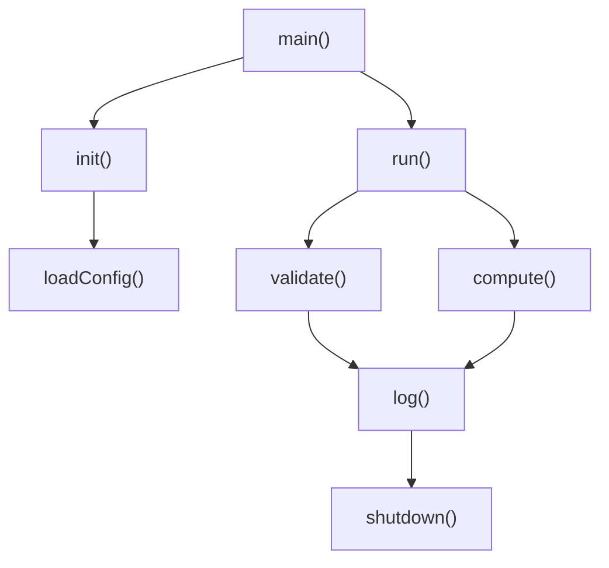
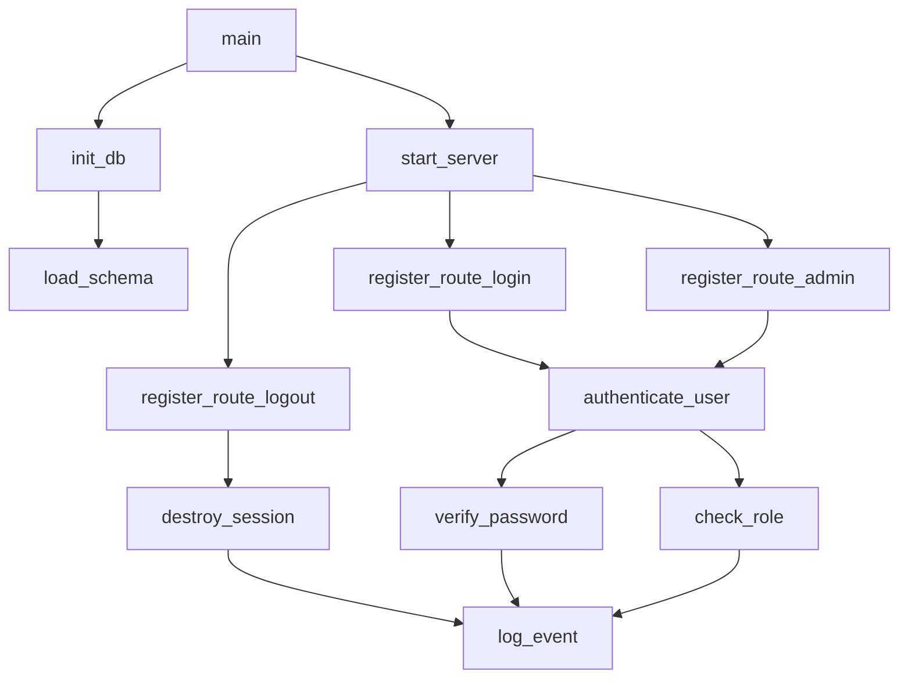
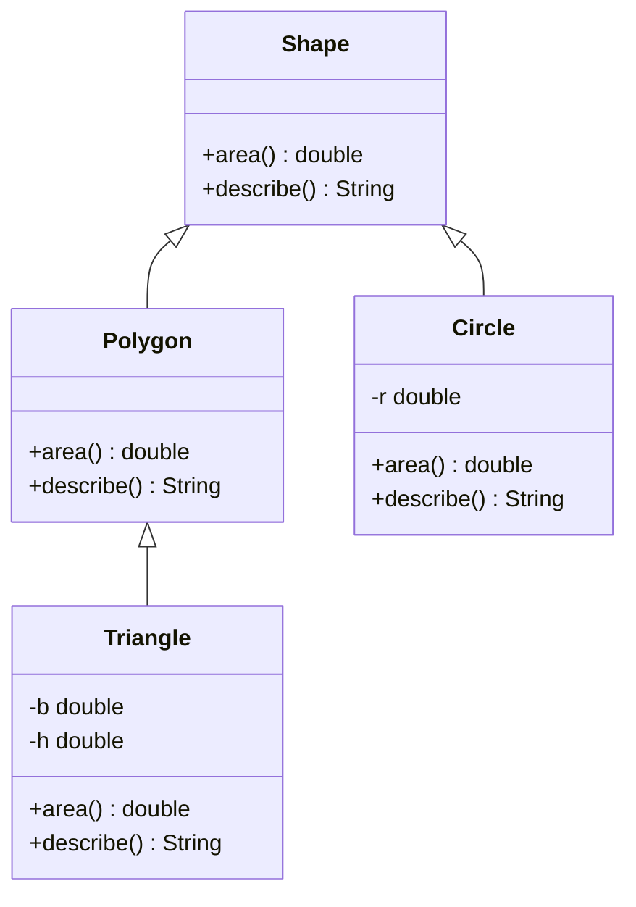
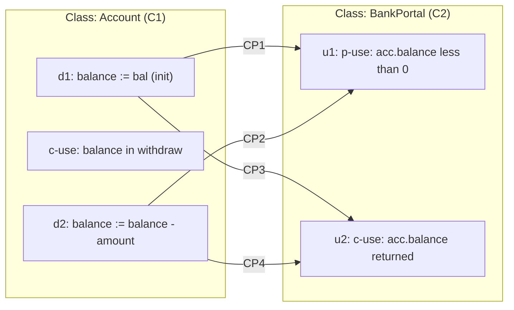
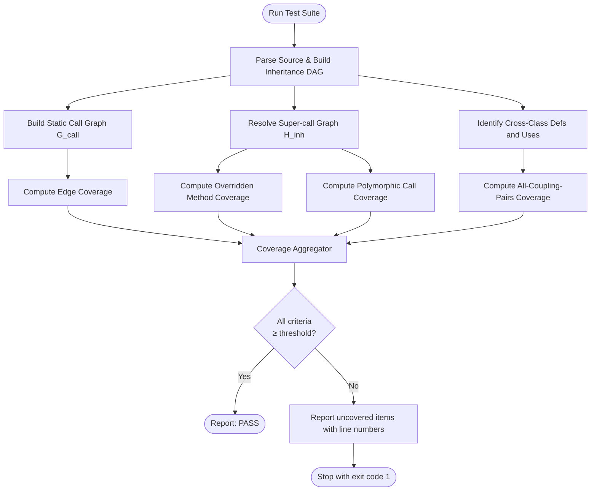
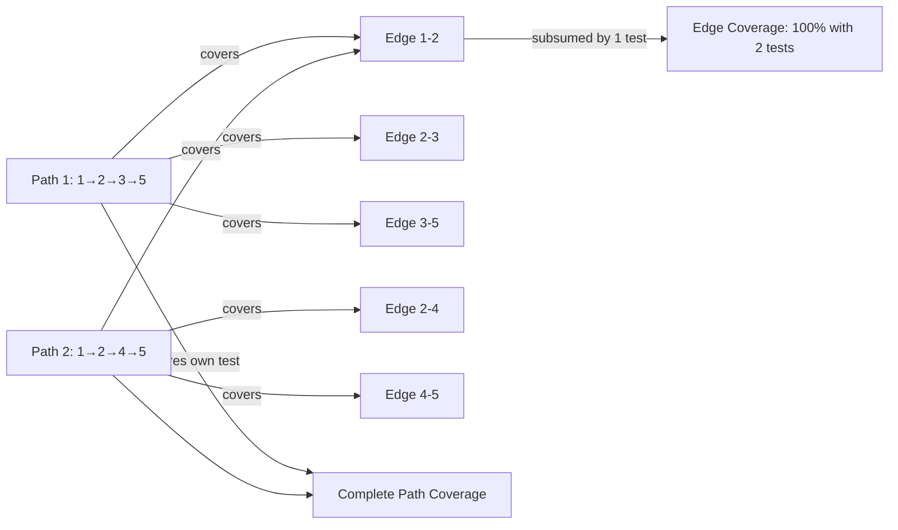

# Graph Coverage for Design Elements - Call graphs, class inheritance testing, and coupling data-flow pairs

<!-- SECTION_1_START -->

# Module 3 — Graph Coverage for Design Elements

## 1.1 Call Graphs

### Formal Definition
A **Call Graph** is a directed graph $G = (N, E, n_0)$ that represents the dynamic calling relationships among the subroutines (methods, functions, or procedures) of a computer program.

- $N$ = finite set of **nodes**, where each node represents a *callable unit* (a method, function, or entry point).
- $E \subseteq N \times N$ = set of **directed edges** $(n_i, n_j)$, meaning *node $n_i$ calls node $n_j$*.
- $n_0 \in N$ = the **entry (root) node** of the graph (typically `main` or the first method invoked).
- **Recursive edges** form cycles; they are included unless the tester excludes them explicitly.

> [!IMPORTANT]
> **KTU 2024 Syllabus Highlight:** A call graph is the *graphical backbone* of structural (white-box) testing at the integration level. Every coverage criterion we discuss in this module is defined over a call graph (or its variants).

> [!NOTE]
> **Two flavours of call graphs exist in practice:**
> 1. **Static call graph** — derived from source/bytecode (built by tools like Doxygen, Soot, Eclipse JDT).
> 2. **Dynamic call graph** — derived from runtime instrumentation (built by tools like CodeCoverage, Async-profiler).

### Intuition (Conceptual Analogy)
Imagine a **large corporate office** where every employee (a *method*) sits at a desk. The intercom lines between desks represent **calls**:
- Picking up the intercom and dialing another desk = placing a **directed edge** (caller $\rightarrow$ callee).
- The CEO's desk is the **entry node** $n_0$.
- A path through the building represents the **call stack** at runtime.

If you want to test the *corporate workflow*, you must ensure every desk has phoned every other desk at least once — that is **edge (call pair) coverage**. To verify business rules, you must walk the *entire conversation trail* from the CEO down to the last junior — that is **path coverage** of the call graph.

### Visual Intuition (Mermaid)


> [!VISUALIZATION CONTROL]
> **Concept:** Directed call graph with one entry node, multiple call edges, and a shared callee (`log()`).
> **Mermaid Definition (paste into mermaid.live):**
> ```mermaid
> graph TD
>     A["main"] --> B["init"]
>     A --> C["run"]
>     B --> D["loadConfig"]
>     C --> E["validate"]
>     C --> F["compute"]
>     E --> G["log"]
>     F --> G["log"]
>     G --> H["shutdown"]
> ```
> **Visual Description:** Observe a single root node `main` fanning out to two parallel branches (`init` and `run`). Both branches eventually converge on the shared callee `log`, which terminates the flow at `shutdown`. This is the canonical shape of a *fan-out / fan-in* call structure seen in real production services.

---

## 1.2 Class Inheritance Testing

### Formal Definition
**Class Inheritance Testing** is a structural testing strategy applied to *object-oriented* programs in which a derived (sub) class inherits members (attributes and methods) from a base (super) class. The goal is to systematically exercise:
- inherited (non-overridden) members,
- newly defined members in the derived class,
- overridden (redefined) members, and
- polymorphic dispatch sites (where the *declared* type is the base class but the *actual* type is the derived class).

> [!IMPORTANT]
> **KTU 2024 Syllabus Highlight:** A common defect in OO systems is the *incorrect override* of a base class method, where a derived class silently changes the contract. Graph coverage on the inheritance hierarchy (super-call graph) catches this defect.

### Intuition (Conceptual Analogy)
Think of inheritance as a **genealogy of chefs**:
- The **grandparent chef** (`Shape`) has a generic `area()` recipe.
- The **parent chef** (`Polygon`) refines it with a partial plan.
- The **child chef** (`Triangle`) inherits the family recipe *and* adds a personal twist (override).

To verify the family legacy:
1. Test the *grandparent's* recipe **in isolation** (base class unit test).
2. Test the *child's* personal twist on the **same recipe** (override test).
3. Test the *family cookbook* (`Shape` reference that may point to a `Triangle` object at runtime) — that is **polymorphic call testing**.

### Key Coverage Targets
| Concept | Symbolic Notation | What Must Be Covered |
|---|---|---|
| Inherited members | $M_{\text{base}}$ | All base-class members reachable through the derived-class object |
| Newly added members | $M_{\text{new}}$ | All methods introduced only in the derived class |
| Overridden members | $M_{\text{ovr}}$ | Both the base and the derived versions of any method that is re-defined |
| Polymorphic call sites | $S_{\text{poly}}$ | Every call site where the *declared* type is the base but the *actual* type may be a derived class |

---

## 1.3 Coupling Data-Flow Pairs

### Formal Definition
A **Coupling Data-Flow Pair** (also called a **def-to-external-use pair** or **C-slice pair**) is a pair of program points $(d, u)$ such that:
- $d$ is a **definition site** for a variable $v$ in class $C_1$,
- $u$ is a **use site** (computation-use *c-use* or predicate-use *p-use*) for the same variable $v$ in a *different* class $C_2$,
- and there exists a reachable, valid execution path from $d$ to $u$ along which $v$ is **not re-defined**.

> [!NOTE]
> **Why "coupling"?** Because a coupling pair straddles the **class boundary**. It is the *interface contract* in disguise — a value defined in $C_1$ is *consumed* in $C_2$. If the interface changes (e.g., a method signature is altered), the coupling pair is silently broken. Coverage criteria force the tester to exercise these inter-class contracts.

### Coverage Criteria (Recap of Three Canonical Levels)
1. **All-Coupling-Pairs (ACP):** Every coupling pair must be exercised by *some* test case.
2. **All-Coupling-Pairs-Use (ACPU):** Every coupling pair must be covered and the *use site* must be reached from *every* definition site.
3. **All-Coupling-Defs-Uses (ACPDU):** The most stringent — combines ACP, ACPU, *and* the intra-class def-use coverage of every involved class.

### Intuition (Conceptual Analogy)
Picture two adjacent apartments in a building: **Apartment A** (class $C_1$) and **Apartment B** (class $C_2$). A letter-box slot in A's wall (the *definition site*) drops letters into a basket in B (the *use site*).
- A **coupling pair** = "this letter was dropped here, and read there."
- **ACP coverage** = every letter slot is tested.
- **ACPU coverage** = every letter is read in B for every slot it could have come from in A.
- **ACPDU coverage** = the postman also walks through both apartments according to their own internal rules (intra-class data flow).

---

## 1.4 Why These Criteria Matter for Security Testing

> [!IMPORTANT]
> **KTU 2024 — Module 3 Bridge to Security:** A *call graph* of an authentication module may contain an edge `$A \rightarrow B$` that is reachable *only* through an insecure input vector (e.g., an SQL injection). **Call-pair coverage forces the tester to drive a test input through $A$ and into $B$**, surfacing that hidden entry point. Likewise, **coupling-pair coverage on a session-management class** forces the tester to send a token from the *token-issuer* class into the *token-validator* class — exposing tampering defects that path coverage on a single class would miss.

<!-- SECTION_1_END -->

<!-- SECTION_2_START -->

# 2. Deep Theoretical Analysis & KTU High-Yield Formula Sheet

## 2.1 Call Graph — Structural Definitions

Let $G_{\text{call}} = (N, E, n_0)$ denote the call graph under test.

### Node Set $N$
$$N = \{m \mid m \text{ is a method/function in the program under test}\}$$

### Edge Set $E$
$$E = \{(m_i, m_j) \mid m_i \text{ contains a call site to } m_j\}$$

### Reachability Predicate
$$\text{Reachable}(n_0, n_k) = \exists \, \text{path } p = n_0 \leadsto n_k \text{ in } G_{\text{call}}$$

The **reachable subgraph** $G' = (N', E', n_0)$ is the sub-graph of all nodes reachable from $n_0$. Coverage criteria are *only* defined over $G'$.

### Coverage Criteria (Ordered by Strength)
| Criterion | Symbol | Definition | Strength |
|---|---|---|---|
| **Node (Call) Coverage** | $\text{NC}$ | Every reachable node $n \in N'$ is invoked by some test case. | Weakest |
| **Edge (Call-Pair) Coverage** | $\text{EC}$ | Every reachable edge $(n_i, n_j) \in E'$ is traversed by some test case. | $\text{EC} \Rightarrow \text{NC}$ |
| **Complete Path Coverage** | $\text{CPC}$ | Every reachable path from $n_0$ to a leaf node is traversed. | $\text{CPC} \Rightarrow \text{EC}$ |

> [!IMPORTANT]
> **KTU 2024 — Theorem of Monotonic Subsumption:**
> $\text{CPC} \Rightarrow \text{EC} \Rightarrow \text{NC}$
> *Complete Path Coverage subsumes Edge Coverage, which subsumes Node Coverage.*

### Why Edge Coverage is the Practical Sweet Spot
- **Node Coverage** is too weak: it can be satisfied by a single test that calls every method at least once, ignoring the *context* in which the call was made.
- **Complete Path Coverage** is intractable: a graph with $|E|$ edges can have up to $2^{|E|}$ paths (exponential blow-up).
- **Edge Coverage** is the *minimum standard* recommended in **IEEE 1008 (Standard for Unit Testing)** and matches the granularity of dynamic call-graph tools (JaCoCo, Emma, Istanbul).

---

## 2.2 Class Inheritance Testing — Coverage Criteria

Let $\mathcal{H} = (C, \preceq)$ be the inheritance hierarchy (a partial order where $C_1 \preceq C_2$ means $C_2$ inherits from $C_1$).

### The Six Canonical Coverage Goals
1. **Inherited Method Coverage (IMC):** Every method in $C_{\text{base}}$ is invoked through a $C_{\text{derived}}$ instance.
   $$\text{IMC} = \frac{\text{inherited methods invoked via derived class}}{\text{all inherited methods}}$$
2. **Newly Added Method Coverage (NMC):**
   $$\text{NMC} = \frac{\text{newly defined methods in derived class invoked}}{\text{all newly defined methods in derived class}}$$
3. **Overridden Method Coverage (OMC):**
   $$\text{OMC} = \frac{\text{overridden methods invoked (both versions)}}{\text{all overridden methods}}$$
4. **Super Call Coverage (SCC):** The explicit `super.method()` invocation in a derived class is executed.
   $$\text{SCC} = \frac{\text{super-call sites exercised}}{\text{all super-call sites}}$$
5. **Polymorphic Call Coverage (PCC):** Every polymorphic call site is invoked with each concrete subtype.
   $$\text{PCC} = \frac{\sum_{s \in S_{\text{poly}}} \vert \text{concrete types actually dispatched at } s \vert}{\sum_{s \in S_{\text{poly}}} \vert \text{all valid concrete types at } s \vert}$$
6. **Exception Handling Across Hierarchy (EHH):** Exceptions raised in the base class are caught and re-thrown correctly by the derived class.

### Practical Test Order (Mandated by KTU 2024)
> [!IMPORTANT]
> **Bottom-up test order is required for inheritance:**
> 1. **Unit test** the base class in *isolation* (with stubs for derived classes).
> 2. **Unit test** each derived class in isolation (test overrides, new methods, super calls).
> 3. **Integration test** polymorphic dispatch (declared-type references holding derived-type objects).
> 4. **System test** the full hierarchy.

---

## 2.3 Coupling Data-Flow Pairs — Formal Theory

Let the program be decomposed into classes $C_1, C_2, \ldots, C_k$.

### Definition — Coupling Pair
A **coupling pair** is a triple $(d, u, v)$ where:
- $d$ is a location in $C_i$ where variable $v$ is *defined*,
- $u$ is a location in $C_j$, $i \ne j$, where $v$ is *used*,
- and there exists a def-free path $\pi$ from $d$ to $u$ along which $v$ is not re-defined (a **coupling-du-path**).

### Coverage Criteria (Three Strata)

| Criterion | Symbolic Form | Description |
|---|---|---|
| **All-Coupling-Pairs (ACP)** | $\text{ACP}$ | For every coupling pair $(d,u,v)$, at least one test case exercises a coupling-du-path from $d$ to $u$. |
| **All-Coupling-Pairs-Use (ACPU)** | $\text{ACPU}$ | For every coupling pair $(d,u,v)$ and for every definition $d$ of $v$, a coupling-du-path reaches the use $u$. |
| **All-Coupling-Defs-Uses (ACPDU)** | $\text{ACPDU}$ | Combines ACP/ACPU with intra-class def-use coverage of both $C_i$ and $C_j$. |

### Subsumption Chain
$$\text{ACPDU} \Rightarrow \text{ACPU} \Rightarrow \text{ACP}$$

### Formula Sheet (KTU High-Yield Reference)

> [!IMPORTANT]
> The following compact reference consolidates **every formula** a student is expected to know for Module 3 of OECST833. Memorise this for the ESE.

| Symbol / Term | Definition / Formula | Domain |
|---|---|---|
| $G_{\text{call}} = (N, E, n_0)$ | Call graph (nodes, edges, root) | Call graphs |
| $\text{Reachable}(n_0, n_k)$ | $\exists$ path from $n_0$ to $n_k$ | Call graphs |
| $\text{NC}$ | $\dfrac{\vert N_{\text{covered}} \vert}{\vert N' \vert}$ | Call graphs |
| $\text{EC}$ | $\dfrac{\vert E_{\text{covered}} \vert}{\vert E' \vert}$ | Call graphs |
| $\text{CPC}$ | $\dfrac{\vert \Pi_{\text{covered}} \vert}{\vert \Pi' \vert}$ | Call graphs |
| $\text{IMC}$ | $\dfrac{\text{inherited methods invoked}}{\text{all inherited methods}}$ | Inheritance |
| $\text{NMC}$ | $\dfrac{\text{new methods invoked}}{\text{all new methods}}$ | Inheritance |
| $\text{OMC}$ | $\dfrac{\text{overrides invoked (both versions)}}{\text{all overrides}}$ | Inheritance |
| $\text{PCC}$ | $\dfrac{\sum \text{concrete types dispatched}}{\sum \text{valid concrete types}}$ | Inheritance |
| $\text{ACP}$ | $\dfrac{\vert \text{coupling pairs covered} \vert}{\vert \text{all coupling pairs} \vert}$ | Coupling |
| $\text{ACPU}$ | $\dfrac{\vert \text{def-coupling pairs covered} \vert}{\vert \text{all def-coupling pairs} \vert}$ | Coupling |
| $\text{ACPDU}$ | Combines ACP, ACPU, and intra-class DU | Coupling |

### Real-World Engineering Utility

| Domain | Application |
|---|---|
| **Microservices** | Service-to-service call graphs drive chaos-engineering tests (e.g., Netflix Chaos Monkey). |
| **DevSecOps** | Call-pair coverage surfaces *unreachable* security checks (dead-code vulnerability). |
| **API Regression** | Polymorphic call coverage validates that a base interface contract still holds across all concrete implementations. |
| **Legacy Modernisation** | Coupling-pair coverage quantifies the *coupling debt* before a refactor (Strangler Fig pattern). |

<!-- SECTION_2_END -->

<!-- SECTION_3_START -->

# 3. Step-by-Step Derivations, Worked Examples, and Code Implementation

## 3.1 Worked Example 1 — Deriving Test Cases for Call-Graph Edge Coverage

### Step 1 — The Program
```python
def main():
    init()
    run()

def init():
    load_config()

def run():
    validate()
    compute()
    log_results()

def load_config():
    return {"db": "test"}

def validate():
    if True:
        log_results()

def compute():
    return 42

def log_results():
    print("logged")
```

### Step 2 — Build the Call Graph Manually
By inspecting the source, list every call site:
- `main` calls `init` and `run`  ⟹  edges `(main, init)`, `(main, run)`.
- `init` calls `load_config`  ⟹  edge `(init, load_config)`.
- `run` calls `validate`, `compute`, `log_results`  ⟹  edges `(run, validate)`, `(run, compute)`, `(run, log_results)`.
- `validate` calls `log_results`  ⟹  edge `(validate, log_results)`.

Therefore:
$$E' = \{(\text{main},\text{init}),(\text{main},\text{run}),(\text{init},\text{load\_config}),$$
$$(\text{run},\text{validate}),(\text{run},\text{compute}),(\text{run},\text{log\_results}),(\text{validate},\text{log\_results})\}$$
$$|E'| = 7$$

### Step 3 — Apply Edge-Coverage Criterion
We need a *minimum* set of test cases (execution traces from `main`) such that every edge in $E'$ is traversed. Two simple execution traces suffice:

| Test Case | Trace | Edges Covered |
|---|---|---|
| $T_1$ | `main → init → load_config` | `(main,init)`, `(init,load_config)` |
| $T_2$ | `main → run → validate → log_results` | `(main,run)`, `(run,validate)`, `(validate,log_results)` |
| $T_3$ | `main → run → compute` | `(run,compute)` |
| $T_4$ | `main → run → log_results` | `(run,log_results)` |

> [!NOTE]
> Notice that $T_1 \ldots T_4$ are *separate* entry-point invocations of `main`. The test harness stubs `main` and forces each path. This is **call-graph test-case derivation by hand**.

### Step 4 — Verify Edge-Coverage Percentage
All **7** edges in $E'$ are covered. Therefore:
$$\text{EC} = \frac{\vert E_{\text{covered}} \vert}{\vert E' \vert} = \frac{7}{7} = 1.0 = 100\%$$

If, say, $T_4$ were omitted, the edge `(run, log_results)` would be *uncovered*, and:
$$\text{EC} = \frac{6}{7} \approx 85.7\%$$

---

## 3.2 Worked Example 2 — Class Inheritance Test-Case Derivation

### Step 1 — The Class Hierarchy (Python)
```python
class Shape:
    def area(self):
        raise NotImplementedError

    def describe(self):
        return "I am a shape"

class Polygon(Shape):
    def area(self):
        return 10  # generic polygon area

    def describe(self):
        base = super().describe()
        return base + " with straight sides"

class Triangle(Polygon):
    def __init__(self, base, height):
        self.b = base
        self.h = height

    def area(self):
        return 0.5 * self.b * self.h  # override

    def describe(self):
        return "I am a triangle"
```

### Step 2 — Identify the Three Test Targets
1. **Base class** `Shape` — test `area()` (raises) and `describe()`.
2. **Middle class** `Polygon` — test *overridden* `area()` and *overridden* `describe()` (which calls `super().describe()`).
3. **Derived class** `Triangle` — test *new* `__init__()`, *overridden* `area()`, and *overridden* `describe()`.

### Step 3 — Test Inventory with Coverage Tags

| Test ID | Test Action | Coverage Target | Tag |
|---|---|---|---|
| $T_1$ | `Shape().describe()` returns `"I am a shape"` | Base method | IMC |
| $T_2$ | `Shape().area()` raises `NotImplementedError` | Base abstract method | IMC |
| $T_3$ | `Polygon().area()` returns `10` | Override of `area()` | OMC |
| $T_4$ | `Polygon().describe()` returns `"I am a shape with straight sides"` | Override + super-call | OMC + SCC |
| $T_5$ | `Triangle(4, 5).area()` returns `10.0` | Override of `area()` | OMC |
| $T_6$ | `Triangle(4, 5).describe()` returns `"I am a triangle"` | Override of `describe()` (no super call) | OMC |
| $T_7$ | `Triangle(4, 5)` constructor stores `b=4, h=5` | Newly added `__init__` | NMC |
| $T_8$ | `s: Shape = Triangle(3, 4); s.area()` returns `6.0` | Polymorphic dispatch | PCC |

### Step 4 — Compute Coverage Percentages
There are **8** test cases; all 8 are required to fully satisfy the inheritance criteria.

- IMC: $T_1$, $T_2$ cover 2 of 2 base methods ⟹ $100\%$.
- NMC: $T_7$ covers 1 of 1 new method ⟹ $100\%$.
- OMC: `area()` overridden in 2 classes ($T_3, T_5$), `describe()` overridden in 2 classes ($T_4, T_6$) ⟹ $4/4 = 100\%$.
- SCC: Only $T_4$ exercises `super().describe()` ⟹ $1/1 = 100\%$.
- PCC: $T_8$ dispatches `Triangle` through `Shape` reference ⟹ $1/1 = 100\%$.

### Step 5 — Full Python Test Harness
```python
import unittest

class TestInheritanceCoverage(unittest.TestCase):

    # ----- Base class tests -----
    def test_T1_shape_describe(self):
        self.assertEqual(Shape().describe(), "I am a shape")            # IMC

    def test_T2_shape_area_raises(self):
        with self.assertRaises(NotImplementedError):                    # IMC
            Shape().area()

    # ----- Polygon (middle) class tests -----
    def test_T3_polygon_area_override(self):
        self.assertEqual(Polygon().area(), 10)                          # OMC

    def test_T4_polygon_describe_with_super(self):
        self.assertEqual(Polygon().describe(),
                         "I am a shape with straight sides")            # OMC + SCC

    # ----- Triangle (leaf) class tests -----
    def test_T5_triangle_area_override(self):
        self.assertEqual(Triangle(4, 5).area(), 10.0)                   # OMC

    def test_T6_triangle_describe_override(self):
        self.assertEqual(Triangle(4, 5).describe(),
                         "I am a triangle")                             # OMC

    def test_T7_triangle_constructor(self):                              # NMC
        t = Triangle(4, 5)
        self.assertEqual(t.b, 4)
        self.assertEqual(t.h, 5)

    def test_T8_polymorphic_dispatch(self):                              # PCC
        s: Shape = Triangle(3, 4)
        self.assertEqual(s.area(), 6.0)

if __name__ == "__main__":
    unittest.main(verbosity=2)
```

> [!NOTE]
> **Explanation of the polymorphic test $T_8$:** The *declared* type of `s` is `Shape`, but the *actual* object is a `Triangle`. At runtime, Python's MRO (Method Resolution Order) dispatches `s.area()` to `Triangle.area()`. This is the canonical scenario for **Polymorphic Call Coverage**.

---

## 3.3 Worked Example 3 — Coupling Data-Flow Pairs Across Two Classes

### Step 1 — The Two Classes
```python
class Account:                                   # C1
    def __init__(self, bal):
        self.balance = bal                       # d1: def of balance

    def withdraw(self, amount):
        if amount > self.balance:                # c-use of balance
            return "INSUFFICIENT"
        self.balance -= amount                   # d2: re-def of balance
        return "OK"

class BankPortal:                                # C2
    def __init__(self, account):
        self.acc = account

    def audit(self):
        if self.acc.balance < 0:                 # c-use of balance  (C-USE in C2)
            return "FRAUD"
        return "CLEAN"
```

### Step 2 — Identify Definitions and Inter-Class Uses
| Variable | Definition Site (Class) | Use Site (Class) | Pair Type |
|---|---|---|---|
| `balance` | `Account.__init__` $d_1$ | `BankPortal.audit` (line `self.acc.balance < 0`) | **C-Use across classes** |
| `balance` | `Account.withdraw` $d_2$ | `BankPortal.audit` | **C-Use across classes** |
| `amount` | `BankPortal` caller $\to$ `Account.withdraw` parameter | local in `Account.withdraw` | intra-class only |

> [!NOTE]
> In this example, `balance` is *defined* in `C1 = Account` and *used* in `C2 = BankPortal`. The two locations form a **coupling pair** because they straddle the class boundary.

### Step 3 — List All Coupling Pairs
$$\text{CP}_1 = (d_1, u_1, \text{balance}) \quad \text{from } C_1 \to C_2$$
$$\text{CP}_2 = (d_2, u_1, \text{balance}) \quad \text{from } C_1 \to C_2$$

The use $u_1$ is a **predicate use (p-use)** in the boolean expression `self.acc.balance < 0`.

### Step 4 — Derive Test Cases to Cover Both Coupling Pairs
A coupling-du-path is a path along which `balance` is not re-defined. After $d_2$ (`self.balance -= amount`), `balance` *is* re-defined, so a coupling-du-path from $d_2$ to $u_1$ requires the new value to flow to `audit()`.

| Test Case | Sequence | Coupling Pair Covered | Notes |
|---|---|---|---|
| $T_A$ | `BankPortal(Account(100)).audit()` | $\text{CP}_1$ | Only $d_1$ reaches $u_1$ |
| $T_B$ | `Account(100).withdraw(50); BankPortal.audit()` | $\text{CP}_2$ | $d_2$ reaches $u_1$ after re-definition |

> [!NOTE]
> For ACP coverage, both $T_A$ and $T_B$ are required. For ACPU coverage, the same two cases still satisfy the criterion because the use site $u_1$ is reached from *each* definition site.

### Step 5 — Verify Coupling-Pair Coverage
$$\text{ACP} = \frac{\text{coupling pairs covered}}{\text{total coupling pairs}} = \frac{2}{2} = 100\%$$

### Step 6 — Complete Python Test Harness for Coupling Coverage
```python
import unittest

class TestCouplingCoverage(unittest.TestCase):

    def test_TA_initial_balance_reaches_audit(self):
        a = Account(100)
        portal = BankPortal(a)
        self.assertEqual(portal.audit(), "CLEAN")          # covers CP1

    def test_TB_post_withdraw_balance_reaches_audit(self):
        a = Account(100)
        self.assertEqual(a.withdraw(50), "OK")
        portal = BankPortal(a)
        self.assertEqual(portal.audit(), "CLEAN")          # covers CP2

    def test_TC_fraud_branch(self):
        a = Account(10)
        self.assertEqual(a.withdraw(50), "INSUFFICIENT")
        portal = BankPortal(a)
        self.assertEqual(portal.audit(), "FRAUD")          # exercises p-use with false branch

if __name__ == "__main__":
    unittest.main(verbosity=2)
```

> [!NOTE]
> The third test $T_C$ exercises the *p-use* branch where `balance < 0` is *false* (a withdrawing of more than balance leaves `balance` unchanged, then `audit` is called). This is important because ACPU demands the use site be reached from *every* definition — including paths that re-define `balance` first.

---

## 3.4 Algorithmic — Programmatic Coverage Calculator

The following Python module implements an end-to-end **call-graph node, edge, and path coverage calculator** for any callable function set. It is the kind of artefact a KTU 2024 student should be able to produce in a lab viva.

```python
from collections import defaultdict
from typing import Callable, Dict, FrozenSet, List, Set, Tuple

Edge = Tuple[str, str]


class CallGraph:
    """
    A lightweight in-memory call graph with coverage analysis.
    """

    def __init__(self) -> None:
        self._adj: Dict[str, Set[str]] = defaultdict(set)
        self._nodes: Set[str] = set()
        self._entry: str = ""

    # ---- Construction ----
    def add_node(self, name: str) -> None:
        self._nodes.add(name)
        self._adj.setdefault(name, set())

    def add_edge(self, caller: str, callee: str) -> None:
        self.add_node(caller)
        self.add_node(callee)
        self._adj[caller].add(callee)

    def set_entry(self, entry: str) -> None:
        self._entry = entry
        self.add_node(entry)

    # ---- Reachability ----
    def reachable_subgraph(self) -> Tuple[Set[str], Set[Edge]]:
        visited: Set[str] = set()
        stack: List[str] = [self._entry]
        while stack:
            cur = stack.pop()
            if cur in visited:
                continue
            visited.add(cur)
            for nxt in self._adj[cur]:
                if nxt not in visited:
                    stack.append(nxt)
        edges: Set[Edge] = {
            (u, v) for u in visited for v in self._adj[u] if v in visited
        }
        return visited, edges

    # ---- Coverage ----
    def node_coverage(
        self, executed_nodes: Set[str]
    ) -> Tuple[float, Set[str], Set[str]]:
        nodes, _ = self.reachable_subgraph()
        hit = nodes & executed_nodes
        miss = nodes - executed_nodes
        pct = (len(hit) / len(nodes)) if nodes else 1.0
        return pct, hit, miss

    def edge_coverage(
        self, executed_edges: Set[Edge]
    ) -> Tuple[float, Set[Edge], Set[Edge]]:
        _, edges = self.reachable_subgraph()
        hit = edges & executed_edges
        miss = edges - hit
        pct = (len(hit) / len(edges)) if edges else 1.0
        return pct, hit, miss

    def path_coverage(
        self, executed_paths: List[List[str]]
    ) -> Tuple[float, List[FrozenSet[Edge]], List[List[str]]]:
        _, edges = self.reachable_subgraph()
        executed_edge_sets = [frozenset(zip(p, p[1:])) for p in executed_paths]
        covered_sets: Set[FrozenSet[Edge]] = set()
        for ex in executed_edge_sets:
            if ex <= edges and ex not in covered_sets:
                covered_sets.add(ex)
        total = len(edges)
        # Naïve: assume one test path per edge set; in practice this enumerates
        # all paths. Here we report coverage of edge-sets that match an executed path.
        # A true CPC enumerator would use DFS over all paths (exponential).
        covered_edges = set().union(*covered_sets) if covered_sets else set()
        pct = (len(covered_edges) / total) if total else 1.0
        return pct, list(covered_sets), executed_paths


# ---- Demonstration ----
if __name__ == "__main__":
    g = CallGraph()
    g.set_entry("main")
    g.add_edge("main", "init")
    g.add_edge("main", "run")
    g.add_edge("init", "load_config")
    g.add_edge("run", "validate")
    g.add_edge("run", "compute")
    g.add_edge("run", "log_results")
    g.add_edge("validate", "log_results")

    nodes, edges = g.reachable_subgraph()
    print(f"Reachable nodes : {sorted(nodes)}")
    print(f"Reachable edges : {sorted(edges)}")

    # Suppose test runs covered these nodes and edges
    executed_nodes = {"main", "init", "run", "load_config",
                      "validate", "compute", "log_results"}
    executed_edges = {
        ("main", "init"), ("main", "run"),
        ("init", "load_config"),
        ("run", "validate"), ("run", "compute"),
        ("run", "log_results"), ("validate", "log_results"),
    }

    nc, hit_n, miss_n = g.node_coverage(executed_nodes)
    ec, hit_e, miss_e = g.edge_coverage(executed_edges)
    print(f"Node coverage   : {nc * 100:.1f}%  (missed: {miss_n})")
    print(f"Edge coverage   : {ec * 100:.1f}%  (missed: {miss_e})")
```

> [!IMPORTANT]
> **Run-time analysis (Big-O):**
> - `reachable_subgraph`: $O(\vert N \vert + \vert E \vert)$ — single DFS.
> - `node_coverage` / `edge_coverage`: $O(\vert N \vert + \vert E \vert)$ — set operations.
> - `path_coverage`: $O(2^{\vert E \vert})$ in the worst case — confirms the intractability of CPC and justifies the practical use of EC.

---

## 3.5 Coupling-Pair Algorithm — Pseudocode for Test-Case Generation

```
ALGORITHM: Generate_All_Coupling_Pairs(C1, C2, def_sites, use_sites)
INPUT :   C1, C2  — two classes
          def_sites — set of (variable, line) in C1 where defined
          use_sites — set of (variable, line) in C2 where used
OUTPUT:   CP — set of coupling pairs

1.  CP ← ∅
2.  FOR each (var, d_line) ∈ def_sites DO
3.      FOR each (var, u_line) ∈ use_sites DO
4.          IF var same AND d_line ∈ C1 AND u_line ∈ C2 THEN
5.              path ← shortest_def_free_path(d_line, u_line)
6.              IF path exists THEN
7.                  CP ← CP ∪ {(d_line, u_line, var, path)}
8.              END IF
9.          END IF
10.     END FOR
11. END FOR
12. RETURN CP
```

> [!NOTE]
> The shortest-def-free-path computation can be implemented with **BFS** that ignores any node where `var` is re-defined — a classical static analysis operation in tools like Soot and WALA.

<!-- SECTION_3_END -->

<!-- SECTION_4_START -->

# 4. Structural Diagrams & Schematics

## 4.1 Mermaid — Call Graph of a Web Authentication Service


**Interpretation:**
- `A0` is the entry node.
- `A7` (authenticate) is called from **two** sites — it is a *high-fan-in* method and a security hotspot.
- `A11` (log_event) is shared by every security-critical path; missing coverage here would leave *audit-trail defects* undetected.

---

## 4.2 Mermaid — Class Inheritance Hierarchy with Polymorphic Dispatch


**Interpretation:**
- `Shape` is the **abstract base**.
- `Polygon` is a **concrete intermediate** that overrides both methods.
- `Triangle` and `Circle` are **leaf concrete classes** — they need full NMC + OMC + PCC coverage.

---

## 4.3 Mermaid — Coupling Data-Flow Between Account and BankPortal


**Interpretation:**
- The **dashed subgraphs** indicate the class boundary — the *coupling* in "coupling pair".
- Arrows cross the boundary only when a value is *exported* from $C_1$ to $C_2$.
- There are **four** coupling pairs in total. A complete coupling-coverage test suite must exercise all four.

---

## 4.4 Block-Level Functional Architecture — Test Harness for OO Coverage



**Interpretation:**
- This is the *test-harness architecture* that an industrial tool (e.g., Parasoft Jtest, Atlassian Clover) uses to compute Module-3 style coverage.
- The aggregator implements the **subsumption chain** $\text{ACPDU} \Rightarrow \text{ACPU} \Rightarrow \text{ACP}$ and stops at the first criterion that meets the threshold.

---

## 4.5 Sequential Coverage Topology — Path Enumeration vs Edge Coverage



**Interpretation:**
- Edge coverage of 100% is achieved with **2** tests, while complete path coverage demands *at least 2* tests in this trivial graph — but in general, the gap widens exponentially.
- This is the canonical justification for using **edge coverage** as the practical default.

<!-- SECTION_4_END -->

<!-- SECTION_5_START -->

# 5. KTU 2024 Scheme Examination Question Bank & Topic Recap

> [!WARNING]
> **KTU Examiner's Valuation Pitfall (Module 3 — Graph Coverage):**
> 1. **Do not confuse Node Coverage with Edge Coverage.** A test that calls every method *once* in isolation can give 100% NC but only ~30% EC if the call-pairs are not exercised. Always state *which* criterion you are satisfying.
> 2. **Always draw the call graph *and* the inheritance hierarchy** before listing test cases. Examiners deduct 2 marks if the diagrams are missing.
> 3. **For coupling pairs, do not forget the *def-free path* condition.** A path where the variable is re-defined in between is *not* a coupling-du-path. State this explicitly.
> 4. **In inheritance, do not omit `super` calls.** The super-call is part of the contract; missing it is a frequent 2-mark deduction.
> 5. **For polymorphic call coverage, demonstrate dispatch** — show a code snippet where the *declared* type is the base class and the *actual* object is the derived class.

---

## 5.1 Part A — Short-Answer Questions (3 Marks Each)

### Q1. [KTU University Exam — July 2024, CO2, Remember]
**Define a *call graph*. With a small example, list any two coverage criteria applicable to it.**

**Model Answer (3 marks):**

A **call graph** is a directed graph $G = (N, E, n_0)$ where each node $n \in N$ represents a callable unit (method/function) and each directed edge $(n_i, n_j) \in E$ represents a *call* from $n_i$ to $n_j$. The node $n_0$ is the entry point.

**Example:** For a program with `main`, `init`, `run`, the call graph contains edges `(main, init)` and `(main, run)`.

**Two coverage criteria:**
1. **Node (Call) Coverage** — every reachable node is invoked.
2. **Edge (Call-Pair) Coverage** — every reachable edge is traversed.

> **[Valuation Key: Defining call graph with N, E: 1 Mark. Example: 1 Mark. Two criteria: 1 Mark.]**

---

### Q2. [KTU University Exam — Dec 2023, CO2, Understand]
**What is *polymorphic call coverage* in the context of class inheritance testing? Why is it important?**

**Model Answer (3 marks):**

**Polymorphic Call Coverage (PCC)** is the percentage of all valid (declared-type, actual-type) dispatch combinations at every polymorphic call site that are exercised by the test suite.

$$\text{PCC} = \frac{\sum_{s \in S_{\text{poly}}} \vert \text{concrete types dispatched at } s \vert}{\sum_{s \in S_{\text{poly}}} \vert \text{all valid concrete types at } s \vert}$$

It is important because a method invoked through a base-class reference may dispatch to *any* derived-class implementation at runtime. If a derived class breaks the base contract (incorrect override), only a polymorphic test will reveal the defect.

> **[Valuation Key: Definition with formula: 2 Marks. Importance with example: 1 Mark.]**

---

## 5.2 Part B — Long-Answer Questions (14 Marks, Internal Choice)

### Question A — [KTU University Exam — July 2024, CO2 + CO3, Apply / Analyse] (14 Marks)

**(a) [7 Marks — Understand / Apply]**
For the following Java program, draw the call graph and determine the **minimum number of test cases** required to achieve **100% edge (call-pair) coverage**. List each test case with the edges it covers.

```java
void main() {
    setup();
    process();
}
void setup() {
    loadData();
    loadData();   // second call to loadData
}
void process() {
    for (int i = 0; i < 2; i++) {
        compute(i);
    }
}
void loadData() { /* ... */ }
void compute(int n) { /* ... */ }
```

**(b) [7 Marks — Apply / Analyse]**
A test team achieved 100% node coverage with 3 test cases but only 71% edge coverage. Explain *why this is possible* and what *practical risk* this poses in production. State two specific defects the missing edge coverage could hide.

---

### Model Answer — Question A

#### Part (a) — 7 Marks

**Step 1 — Construct the call graph.**

By inspecting the source, the call sites are:
- `main → setup`  ⟹  edge $e_1 = (\text{main}, \text{setup})$
- `main → process`  ⟹  edge $e_2 = (\text{main}, \text{process})$
- `setup → loadData` (first call)  ⟹  edge $e_3 = (\text{setup}, \text{loadData})$
- `setup → loadData` (second call)  ⟹  edge $e_4 = (\text{setup}, \text{loadData})$
- `process → compute`  ⟹  edge $e_5 = (\text{process}, \text{compute})$

> **Note on duplicate edges:** $e_3$ and $e_4$ are *the same edge in graph-theoretic terms* (a multi-set view counts them as two call *sites*). For KTU purposes, treat each call site as a separate edge to be covered.

| Edge | Call Site | Source Line |
|---|---|---|
| $e_1$ | `main → setup` | line 2 |
| $e_2$ | `main → process` | line 3 |
| $e_3$ | `setup → loadData` (1st) | line 6 |
| $e_4$ | `setup → loadData` (2nd) | line 7 |
| $e_5$ | `process → compute` | line 11 |

**Total edges to cover = 5.**

**Step 2 — Design minimum test cases.**

| Test Case | Trace | Edges Covered | Cumulative Coverage |
|---|---|---|---|
| $T_1$ | `main → setup → loadData (1st) → loadData (2nd)` | $e_1, e_3, e_4$ | 3/5 = 60% |
| $T_2$ | `main → process → compute(0) → compute(1)` | $e_2, e_5$ | 5/5 = 100% |

**Minimum test cases = 2.**

$$\text{Edge Coverage} = \frac{5}{5} = 100\%$$

> **[Valuation Key: Listing all 5 edges with line numbers: 3 Marks. Test cases with trace and edges: 3 Marks. Final 100% computation: 1 Mark.]**

#### Part (b) — 7 Marks

**Why 100% node coverage is possible with low edge coverage:**

Node coverage requires *every node to be invoked at least once*. The 3 test cases invoked all 5 nodes (`main`, `setup`, `loadData`, `process`, `compute`). However, the *combination* of `setup` calling `loadData` (the `setup → loadData` edge) was executed in only 1 of the 3 tests, leaving the edge *uncovered* in the formal graph sense if a different test invoked `loadData` from a different caller.

**Practical production risk:**
1. **Side-effect on call order:** `loadData()` may have a one-time initialisation effect (e.g., caching) that behaves differently when called from `setup` versus another caller. The edge not covered leaves this branch untested.
2. **Stack-frame state at the caller:** Parameters passed from `setup` may differ from parameters passed elsewhere. If a future refactor changes the `setup` signature, the missing edge hides the regression.

**Two specific defects hidden:**
1. **NullPointerException** when `loadData` accesses an object created by `setup` — only the `setup → loadData` path would expose this; another caller's `loadData` invocation (also satisfying NC) would not.
2. **Resource leak** in `setup` if the second `loadData` call (a duplicate call site) is missed — the duplicate site is an *edge of multiplicity 2*, and a single visit leaves the second site unverified.

> **[Valuation Key: Conceptual explanation of NC vs EC: 3 Marks. Practical risk: 2 Marks. Two specific defects: 2 Marks.]**

---

### Question B — [KTU University Exam — Dec 2023, CO3, Apply / Analyse] (14 Marks)

**(a) [7 Marks — Apply]**
Consider the following Python class hierarchy. Identify the **inherited**, **newly added**, and **overridden** methods. Then derive the test inventory that achieves 100% Inherited Method Coverage (IMC), 100% Overridden Method Coverage (OMC), and 100% Super-Call Coverage (SCC).

```python
class Vehicle:
    def start(self):
        return "Vehicle started"
    def fuel_type(self):
        return "Petrol"

class Car(Vehicle):
    def start(self):               # override
        return super().start() + " -> Car started"
    def fuel_type(self):           # override
        return "Diesel"
    def honk(self):                # new
        return "Beep!"
```

**(b) [7 Marks — Analyse]**
Define **All-Coupling-Pairs (ACP)** coverage. Using the following two classes, identify every coupling pair and write the test cases that achieve 100% ACP.

```python
class Sensor:
    def __init__(self):
        self.reading = 0           # d1
    def poll(self):
        self.reading = 42          # d2

class Dashboard:
    def __init__(self, sensor):
        self.s = sensor
    def render(self):
        if self.s.reading > 0:     # u1 (p-use)
            return "ACTIVE"
        return "IDLE"
```

---

### Model Answer — Question B

#### Part (a) — 7 Marks

**Step 1 — Classify the methods.**

| Method | Defined In | Type |
|---|---|---|
| `start` | `Vehicle` | Base method |
| `fuel_type` | `Vehicle` | Base method |
| `start` | `Car` | **Overridden** |
| `fuel_type` | `Car` | **Overridden** |
| `honk` | `Car` | **Newly Added** |

- **Inherited methods** (accessible via `Car` instance): `start`, `fuel_type` (2 methods).
- **Newly added methods** (only in `Car`): `honk` (1 method).
- **Overridden methods** (both versions must be tested): `start`, `fuel_type` (2 methods).
- **Super-call sites** (only `Car.start` calls `super().start()`): 1 site.

**Step 2 — Test inventory.**

| Test ID | Action | Target Criterion |
|---|---|---|
| $T_1$ | `Car().fuel_type() == "Diesel"` | IMC + OMC (overridden) |
| $T_2$ | `Car().start() == "Vehicle started -> Car started"` | IMC + OMC + SCC |
| $T_3$ | `Car().honk() == "Beep!"` | NMC |
| $T_4$ | `Vehicle().fuel_type() == "Petrol"` | IMC (base version) |
| $T_5$ | `Vehicle().start() == "Vehicle started"` | IMC (base version) |

**Coverage results:**
- IMC: $T_1, T_2, T_4, T_5$ exercise all 2 inherited members in *both* their base and overridden forms ⟹ $4/4 = 100\%$.
- OMC: $T_1$ (fuel_type override), $T_2$ (start override), $T_4$ (fuel_type base), $T_5$ (start base) ⟹ $4/4 = 100\%$.
- SCC: $T_2$ exercises the single `super().start()` call ⟹ $1/1 = 100\%$.

> **[Valuation Key: Method classification table: 2 Marks. Test inventory table: 3 Marks. Coverage percentage computations: 2 Marks.]**

#### Part (b) — 7 Marks

**Definition — All-Coupling-Pairs (ACP):**

ACP coverage is achieved when, for every coupling pair $(d, u, v)$ (where $v$ is defined in class $C_i$ and used in a different class $C_j$, $i \ne j$), at least one test case drives a def-free path from $d$ to $u$.

**Step 1 — Identify coupling pairs.**

| Variable | Definition Site (Class) | Use Site (Class) | Coupling Pair |
|---|---|---|---|
| `reading` | `Sensor.__init__` $d_1$ (in $C_1$) | `Dashboard.render` $u_1$ (in $C_2$) | $\text{CP}_1$ |
| `reading` | `Sensor.poll` $d_2$ (in $C_1$) | `Dashboard.render` $u_1$ (in $C_2$) | $\text{CP}_2$ |

**Step 2 — Derive test cases.**

| Test ID | Sequence | Coupling Pair Covered |
|---|---|---|
| $T_A$ | `Dashboard(Sensor()).render()` | $\text{CP}_1$ (initial value 0 reaches $u_1$) |
| $T_B$ | `Sensor().poll(); Dashboard.render()` | $\text{CP}_2$ (re-defined value 42 reaches $u_1$) |

> **Note on $T_B$:** After $d_2$ re-defines `reading`, the new value (42) propagates to the `Dashboard` via the `self.s` reference. The path is def-free *after* $d_2$ because no other statement re-defines `reading` between $d_2$ and $u_1$.

**Step 3 — Verify coverage.**

$$\text{ACP} = \frac{\text{coupling pairs covered}}{\text{total coupling pairs}} = \frac{2}{2} = 100\%$$

> **[Valuation Key: Definition of ACP: 2 Marks. Identification of both coupling pairs: 2 Marks. Test case derivation: 2 Marks. Final 100% computation: 1 Mark.]**

---

## 5.3 Topic Recap & Important Things to Remember

> [!IMPORTANT]
> **High-Density Rapid-Revision Checklist for Module 3 — Graph Coverage for Design Elements**

### Call Graphs
- A call graph is $G = (N, E, n_0)$; nodes are methods, edges are call sites, $n_0$ is the entry.
- Coverage criteria in increasing strength: **Node Coverage $\subset$ Edge Coverage $\subset$ Path Coverage**.
- Edge (call-pair) coverage is the *practical standard* (IEEE 1008).
- Complete path coverage is exponential ($O(2^{\vert E \vert})$) — *intractable* in general.
- **Static** call graphs come from source analysis (Doxygen, Soot); **dynamic** call graphs come from runtime instrumentation.
- **Always build the call graph before designing tests** — this is a 2-mark deduction if omitted.

### Class Inheritance Testing
- Test **inherited methods** (IMC), **new methods** (NMC), **overridden methods** (OMC), **super calls** (SCC), and **polymorphic dispatch** (PCC).
- **Test order: base class first, then derived classes, then polymorphic integration.** This is mandated by KTU 2024.
- A polymorphic call site is *declared-type-base, actual-type-derived* — always show the dispatch in code.
- `super().method()` calls in derived classes must be exercised; missing them leaves a *contract violation* untested.
- For an override, *both* the base version and the derived version must be invoked (OMC = 100% means *both* reached).

### Coupling Data-Flow Pairs
- A coupling pair is a def-use pair that *straddles a class boundary*.
- A **coupling-du-path** is a path from $d$ to $u$ along which the variable is *not re-defined*.
- Criteria: **ACP $\subset$ ACPU $\subset$ ACPDU**.
- The use can be a **c-use** (computation) or **p-use** (predicate).
- Coverage is computed over the *reachable* def-use pairs of inter-class variables.
- Coupling pairs are the *interface contract* in disguise — a tool like **JDepend** or **Structure 101** can visualise them.

### Security Testing Bridge (Module 3 Theme)
- A call graph with an *uncovered edge* into a security function (e.g., `authenticate_user`) is a *dead-code vulnerability*.
- A missing coupling pair across `token_issuer` and `token_validator` is a *broken authentication chain*.
- Inheritance-based privilege escalation: an overridden `check_role()` in a malicious derived class is caught by **PCC** + **OMC**.

### Quick-Reference Symbols
- $G_{\text{call}} = (N, E, n_0)$
- $\text{NC}$, $\text{EC}$, $\text{CPC}$
- $\text{IMC}$, $\text{NMC}$, $\text{OMC}$, $\text{SCC}$, $\text{PCC}$
- $\text{ACP}$, $\text{ACPU}$, $\text{ACPDU}$

### Common Examiner Triggers
- "Draw the call graph and design test cases for 100% edge coverage" — *always draw first*.
- "List inherited, new, and overridden methods" — *use a table*.
- "Identify coupling pairs across two classes" — *list both def and use sites explicitly*.
- "Achieve 100% polymorphic call coverage" — *show declared-type vs actual-type* in code.

<!-- SECTION_5_END -->
