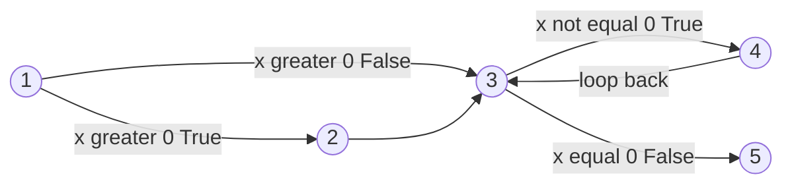
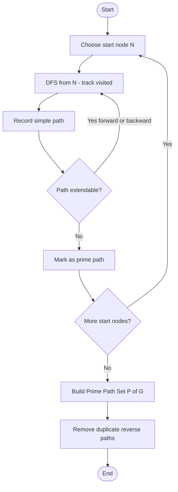
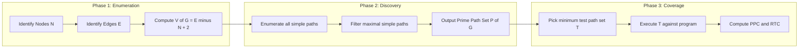
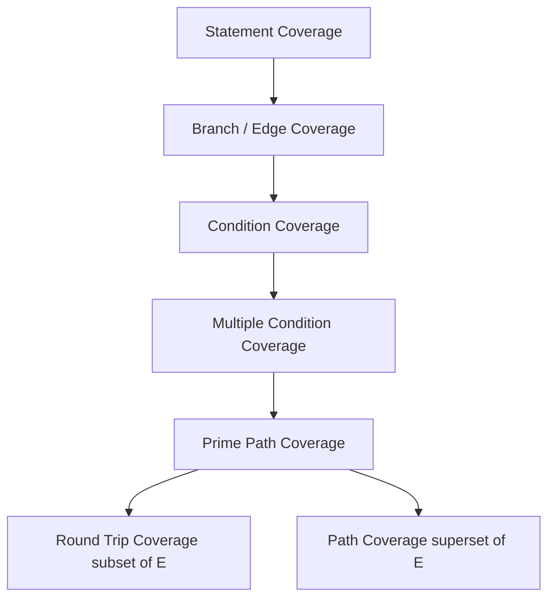
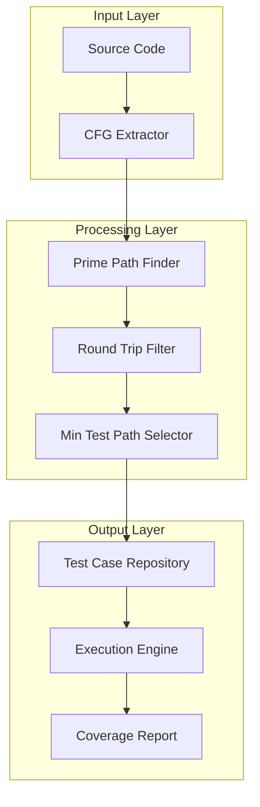

# prime path and round trip coverage

<!-- SECTION_1_START -->
# Prime Path and Round Trip Coverage — Module 3 (Advanced White Box Testing)

> [!NOTE]
> **Syllabus Highlight (KTU 2024 — OECST833)**
> Prime Path and Round Trip Coverage are advanced control-flow based **structural testing criteria** used in white box and security testing. They belong to the *path-testing family* and are strictly stronger than branch / edge / statement coverage. KTU frequently tests these in Part A (3 marks) and Part B (14 marks) under Module 3.

---

## 1. Core Definitions (KTU Board-Examiner Wording)

> [!IMPORTANT]
> **Definition 1 — Node:** A point in a program flow graph representing a *decision, statement, or join point* (commonly numbered 1, 2, 3, …).

> [!IMPORTANT]
> **Definition 2 — Edge:** A directed connection between two nodes representing a *transfer of control*.

> [!IMPORTANT]
> **Definition 3 — Simple Path:** A path from a *start node* to an *end node* in which **no node appears more than once**, except possibly the start = end case.

> [!IMPORTANT]
> **Definition 4 — Prime Path (Ammann-amp; Offutt / Mathur):** A *simple path* that is **not a sub-path of any other simple path** in the flow graph. In other words, a **maximal simple path**.

> [!IMPORTANT]
> **Definition 5 — Round Trip Path (a.k.a. Simple Cycle):** A *prime path of length ≥ 1* that **begins and ends at the same node**. It is the cyclic sub-class of prime paths.

---

## 2. Intuition & Real-World Analogy

> [!TIP]
> **Subway Analogy for Prime Path:**
> Imagine the Kochi Metro map. A **simple path** is a ride that does not pass through the same station twice. A **prime path** is the *longest possible non-repeating ride* you can take — you cannot extend it forward or backward without revisiting a station. Every shorter ride is just a *prefix* or *suffix* of some prime path.

> [!TIP]
> **Circular Bus Route Analogy for Round Trip:**
> A **round trip path** is like a circular KSRTC bus route — it starts at *Majestic Bus Stand*, passes through a series of unique stops, and *returns* to the starting stand. It must have **at least one intermediate stop** (length ≥ 1) to be a valid cycle.

---

## 3. Why Prime Path & Round Trip Coverage?

| Criterion | Strength | What it Guarantees |
|-----------|----------|--------------------|
| Statement coverage | Weakest | Each line executed once |
| Branch / Edge coverage | Moderate | Each decision true/false exercised |
| Path coverage | Very strong (often infeasible) | Every path executed |
| **Prime path coverage** | **Strong & tractable** | Every *maximal* simple path executed |
| **Round trip coverage** | **Cyclic focus** | Every independent loop / cycle executed |

Round trip coverage is *implicitly* a subset of prime path coverage (it covers only the cyclic prime paths), but security testers use it explicitly to verify **loop integrity, infinite-loop absence, and state-cycle correctness**.

---

## 4. McCabe's Cyclomatic Complexity (Mandatory Co-Requisite)

The number of **independent paths / round trips** in a flow graph with $E$ edges, $N$ nodes, and $P$ connected components is given by the celebrated formula:

$$V(G) \;=\; E \;-\; N \;+\; 2P$$

For a *single connected* program graph ($P=1$):

$$V(G) \;=\; E \;-\; N \;+\; 2$$

> [!NOTE]
> **V(G) gives the *minimum* number of test cases required to exercise every round trip (independent cycle) at least once.** This number is the **lower bound** for round-trip coverage satisfaction.

---

## 5. GeoGebra / Desmos Visualisation (Flow Graph Layout)

> [!VISUALIZATION CONTROL]
> **Concept:** Directed Flow Graph for the *Prime Path Discovery* example below (5-node program).
>
> **GeoGebra Input (treat as directed graph on the coordinate plane):**
> * `A = (0, 2)`, `B = (2, 4)`, `C = (4, 2)`, `D = (2, 0)`, `E = (6, 2)`
> * `Line(A, B)`, `Line(B, C)`, `Line(C, D)`, `Line(D, A)`, `Line(C, E)`
>
> **Visual Description:** Student should see a diamond A→B→C→D→A with an *escape edge* C→E. The four diamond edges form **two independent round trips** (A→B→C→D→A and the self-paired 2-cycles), and the *longest prime path* runs A→B→C→E (length 3) which is maximal because it cannot be extended either direction without revisiting A, B, C, or E.

---

<!-- SECTION_1_END -->

<!-- SECTION_2_START -->
# Deep Theoretical Analysis & KTU High-Yield Formula Sheet

---

## 1. Formal Hierarchy of Path-Based Criteria

$$\text{Statement} \;\subset\; \text{Edge / Branch} \;\subset\; \text{Prime Path} \;\supset\; \text{Round Trip Path}$$

- **Prime path ⊇ round trip** because every round trip is a prime path whose *first node equals its last node*.
- Prime path coverage is *practically achievable* (unlike full path coverage, which is exponential in size).

---

## 2. Step-by-Step Algorithm — Discovering Prime Paths

> [!IMPORTANT]
> **Algorithm: *Find-Prime-Paths(G)* (KTU Board Favourite)**
>
> 1. For each **node $n$** in the flow graph $G$:
> 2. &nbsp;&nbsp;&nbsp;&nbsp;Perform a **Depth-First Search (DFS)** from $n$.
> 3. &nbsp;&nbsp;&nbsp;&nbsp;For every simple path discovered that *starts* at $n$:
> 4. &nbsp;&nbsp;&nbsp;&nbsp;&nbsp;&nbsp;&nbsp;&nbsp;Try to **extend forward** by appending successor nodes that have not yet appeared.
> 5. &nbsp;&nbsp;&nbsp;&nbsp;&nbsp;&nbsp;&nbsp;&nbsp;Try to **extend backward** by prepending predecessor nodes.
> 6. &nbsp;&nbsp;&nbsp;&nbsp;&nbsp;&nbsp;&nbsp;&nbsp;The path that *cannot be extended further* is a **prime path originating at $n$**.
> 7. **Collect** all such maximal paths; **remove duplicates** (a prime path traversed in reverse is the *same* prime path).
> 8. The result is the **Prime Path Set** $\mathcal{P}(G)$.

---

## 3. Step-by-Step Algorithm — Minimum Test-Path Set

> [!IMPORTANT]
> **Algorithm: *Min-Set($\mathcal{P}(G)$)* for Prime Path Coverage**
>
> 1. List the **prime path set** $\mathcal{P}(G) = \{p_1, p_2, \ldots, p_k\}$.
> 2. For each prime path $p_i$, list all **sub-paths** of $p_i$ (every prefix + suffix + internal simple paths contained in it).
> 3. A test path $t_j$ is *valid* iff $t_j$ is a simple path in $G$ that **covers at least one prime path end-to-end** (begins and ends with the two extreme nodes of the prime path).
> 4. Select a **minimum-cardinality** set of test paths $\{t_1, t_2, \ldots, t_m\}$ such that every prime path $p_i$ is fully covered.
> 5. Coverage achieved = $\dfrac{\text{Prime paths covered}}{\text{Total prime paths}} \times 100\%$.

---

## 4. Round Trip Path — Special Properties

A round trip path $\rho$ of length $\ell \geq 1$ has the form:

$$\rho \;=\; n_0 \rightarrow n_1 \rightarrow n_2 \rightarrow \cdots \rightarrow n_{\ell-1} \rightarrow n_0$$

where $n_0, n_1, \ldots, n_{\ell-1}$ are **pairwise distinct**.

- Length-1 round trips are **self-loops** $(n_0 \rightarrow n_0)$ — must be exercised to test `while(true)` style constructs.
- Length-2 round trips are **back-edges** like $n_0 \leftrightarrow n_1$ (a two-node cycle).
- A control flow graph with $V(G)=k$ requires **at least $k$ test cases** to achieve *full* round trip coverage.

---

## 5. KTU High-Yield Formula Sheet (Cheat-Sheet Table)

| # | Symbol / Term | Formula / Definition | Engineering / Testing Use |
|---|---------------|----------------------|---------------------------|
| 1 | Cyclomatic Complexity | $V(G) = E - N + 2P$ | Lower bound on number of test paths |
| 2 | Prime Path Coverage (PPC) | $\text{PPC} = \dfrac{\vert P_{\text{executed}} \vert}{\vert P_{\text{total}} \vert} \times 100$ | Quality metric for path-based test suites |
| 3 | Round Trip Coverage (RTC) | $\text{RTC} = \dfrac{\vert R_{\text{executed}} \vert}{\vert R_{\text{total}} \vert} \times 100$ | Loop / state-cycle validation metric |
| 4 | Length of Path $\pi$ | $\ell(\pi) = \text{number of edges in } \pi$ | Indicates path complexity |
| 5 | Self-Loop (length-1 round trip) | $n \rightarrow n$ | Tests `do-while`, `repeat-until` constructs |
| 6 | Independent Path Count | $= V(G)$ | McCabe's structural test bound |

> [!IMPORTANT]
> **$E$** = number of edges, **$N$** = number of nodes, **$P$** = number of connected components. The character **$\vert$** denotes set cardinality (number of elements) — *do not confuse with absolute value*.

---

## 6. Real-World Engineering & Security Utility

| Domain | Why Prime Path / Round Trip? |
|--------|------------------------------|
| **Security Testing (Pen-testing)** | Detects infinite-loop DoS vulnerabilities via missed self-loops / cycles. |
| **Compiler Optimisation** | Identifies dead code, unreachable loops, and unreachable branches. |
| **Avionics (DO-178C)** | Mandates *MC/DC* and *structural coverage* — prime paths are used for Level-A code. |
| **Automotive ECU (ISO 26262)** | Round-trip coverage validates the absence of cyclic state-machine deadlocks in AUTOSAR. |
| **Smart Card / Banking** | All authentication state-transitions must be round-trip verified. |
| **API & Microservices** | Identifies circular service-call chains that cause stack overflow / timeout. |

---

<!-- SECTION_2_END -->

<!-- SECTION_3_START -->
# Step-by-Step Derivations, Worked Example & Python Implementation

---

## 1. Canonical Worked Example (Ammann & Offutt Style)

Consider the following Java-style fragment:

```java
void process(int x) {
    if (x > 0)        // node 1
        x = x + 1;    // node 2
    while (x != 0) {  // node 3
        x = x - 1;    // node 4
    }
    print(x);         // node 5
}
```

**Flow Graph (with nodes 1-5):**

$$
1 \xrightarrow{\text{True}} 2 \rightarrow 3 \xrightarrow{\text{True}} 4 \rightarrow 3
$$
$$
1 \xrightarrow{\text{False}} 3, \quad 3 \xrightarrow{\text{False}} 5
$$

### Step 1 — Enumerate All Edges ($E$) and Nodes ($N$)

- Nodes: $N = \{1, 2, 3, 4, 5\}$, so $N = 5$.
- Edges: $E = \{(1,2), (1,3), (2,3), (3,4), (4,3), (3,5)\}$, so $E = 6$.

### Step 2 — Compute Cyclomatic Complexity

$$V(G) \;=\; E - N + 2 \;=\; 6 - 5 + 2 \;=\; 3$$

Therefore **at least 3 test cases** are needed for full round trip coverage.

### Step 3 — Enumerate All Simple Paths

| # | Simple Path | Length |
|---|-------------|--------|
| $s_1$ | [1, 2, 3, 5] | 3 |
| $s_2$ | [1, 2, 3, 4, 3, 5] | 5 |
| $s_3$ | [1, 2, 3, 4, 3, 4, 3, 5] | 7 |
| $\vdots$ | $\vdots$ | $\vdots$ (infinite family) |

### Step 4 — Extract the **Prime Paths** (maximal simple paths)

> [!IMPORTANT]
> A simple path is *prime* iff it **cannot be extended forward or backward** without revisiting a node.

The **maximal** simple paths are:

$$
\mathcal{P}(G) \;=\; \left\{\, [1, 2, 3, 4], \; [4, 3, 4], \; [4, 3, 5], \; [1, 2, 3, 5] \,\right\}
$$

| # | Prime Path | Notes |
|---|-----------|-------|
| $p_1$ | [1, 2, 3, 4] | Enters loop body once, stops at last 4 |
| $p_2$ | [4, 3, 4]   | **Self-contained loop** — internal round trip |
| $p_3$ | [4, 3, 5]   | Loop exit path |
| $p_4$ | [1, 2, 3, 5] | **Skip-loop** prime path (enters via 1→2, exits 3→5) |

> **Why these are prime?**
> - $p_1$ = [1,2,3,4] cannot extend forward (no out-edge from 4 to 3 is in simple path) and cannot extend backward (1 has no predecessor in this context). ✓
> - $p_2$ = [4,3,4] is a *round trip* (length 2 cycle). It is maximal because adding anything would repeat 4 or 3. ✓
> - $p_3$ = [4,3,5] is a one-time exit. ✓
> - $p_4$ = [1,2,3,5] bypasses the loop entirely. ✓

### Step 5 — Identify the **Round Trip Paths**

Round trips are prime paths whose first and last nodes coincide.

$$\mathcal{R}(G) \;=\; \{ [4, 3, 4] \}$$

There is **exactly 1** round trip. (The infinite family of paths s2, s3, … is *not* a set of round trips — they all share the same *sub-path* [4,3,4].)

### Step 6 — Minimum Test-Path Set (Full Prime Path Coverage)

| Test Path $t_j$ | Covers Prime Paths |
|-----------------|--------------------|
| $t_1 = [1, 2, 3, 4]$ | $p_1$ |
| $t_2 = [4, 3, 4]$   | $p_2$ (round trip) |
| $t_3 = [4, 3, 5]$   | $p_3$ |
| $t_4 = [1, 2, 3, 5]$ | $p_4$ |

**Minimum test set = $\{t_1, t_2, t_3, t_4\}$ — four test cases** to achieve 100% prime path coverage.

For *round trip* coverage, the set reduces to **one** test path: $t_2 = [4, 3, 4]$, because the round trip is unique.

### Step 7 — Coverage Calculation

$$\text{Prime Path Coverage} = \frac{4}{4} \times 100 = 100\%$$

$$\text{Round Trip Coverage} = \frac{1}{1} \times 100 = 100\%$$

---

## 2. Detailed Numerical Derivation of $V(G)$ for a Larger Graph

Suppose $E = 14$ edges, $N = 11$ nodes, $P = 1$ connected component.

$$V(G) = 14 - 11 + 2 \times 1 = 14 - 11 + 2 = 5$$

So the program has **5 independent paths** and requires **5 test cases** to satisfy McCabe's basis-path testing criterion.

**Independence rule:** A path $p_k$ is *independent* of $\{p_1, \ldots, p_{k-1}\}$ iff it introduces **at least one new edge** not in any previously selected path.

$$V(G) = \sum_{k=1}^{V(G)} 1 = \text{number of independent test paths required} \tag{McCabe's Basis Theorem}$$

---

## 3. Python Implementation — Prime Path Discovery

```python
"""
prime_paths.py
---------------
Discovers all prime paths in a directed flow graph.

Author: KTU Study Resource
Compatible: Python 3.9+
"""

from typing import Dict, List, Set, Tuple

Graph = Dict[int, List[int]]


def longest_simple_paths(
    graph: Graph, start: int, current_path: List[int]
) -> List[List[int]]:
    """
    Recursively enumerates all simple paths starting from `start`,
    continuing through nodes that have not yet been visited.
    """
    paths: List[List[int]] = []
    last_node = current_path[-1]

    for neighbor in graph.get(last_node, []):
        if neighbor not in current_path:
            new_path = current_path + [neighbor]
            paths.append(new_path)
            paths.extend(longest_simple_paths(graph, start, new_path))

    return paths


def find_prime_paths(graph: Graph) -> Set[Tuple[int, ...]]:
    """
    Returns the set of all prime paths (as tuples) in the flow graph.
    A prime path is a simple path that is NOT a sub-path of any other
    simple path.
    """
    prime_paths: Set[Tuple[int, ...]] = set()

    for node in graph:
        all_simple_from_node = longest_simple_paths(graph, node, [node])
        max_length = max(
            (len(p) for p in all_simple_from_node), default=1
        )

        # Step 1: keep maximal-length paths from this start node
        maximal = [p for p in all_simple_from_node if len(p) == max_length]
        for p in maximal:
            prime_paths.add(tuple(p))

        # Step 2: also keep paths that cannot be extended backward
        # i.e., those whose first node has no predecessor
        predecessors = {p for n in graph for p in graph[n]}
        for p in all_simple_from_node:
            if p[0] not in predecessors:
                prime_paths.add(tuple(p))

    return prime_paths


def filter_prime_paths(
    graph: Graph, all_paths: Set[Tuple[int, ...]]
) -> Set[Tuple[int, ...]]:
    """
    Removes any path that is a strict sub-path of another.
    """
    result: Set[Tuple[int, ...]] = set(all_paths)

    for candidate in list(all_paths):
        for other in all_paths:
            if candidate == other:
                continue
            # check whether `candidate` is a sub-path of `other`
            if is_subpath(candidate, other):
                result.discard(candidate)
                break

    return result


def is_subpath(small: Tuple[int, ...], big: Tuple[int, ...]) -> bool:
    """True if `small` appears contiguously inside `big`."""
    if len(small) >= len(big):
        return False
    for i in range(len(big) - len(small) + 1):
        if big[i : i + len(small)] == small:
            return True
    return False


def round_trip_paths(
    prime_paths: Set[Tuple[int, ...]]
) -> Set[Tuple[int, ...]]:
    """
    Extracts the round trip paths (cycles) from the prime path set.
    A round trip is a prime path whose first node == last node AND
    length >= 2 (to exclude trivial zero-length).
    """
    return {
        p for p in prime_paths
        if len(p) >= 2 and p[0] == p[-1]
    }


# ---------------- DEMO ----------------
if __name__ == "__main__":
    # Flow graph for the worked example:
    #   1 -> 2, 1 -> 3, 2 -> 3, 3 -> 4, 4 -> 3, 3 -> 5
    g: Graph = {1: [2, 3], 2: [3], 3: [4, 5], 4: [3], 5: []}

    all_simple = set()
    for n in g:
        for p in longest_simple_paths(g, n, [n]):
            all_simple.add(tuple(p))

    primes = filter_prime_paths(g, all_simple)
    cycles = round_trip_paths(primes)

    print("All Prime Paths :", sorted(primes))
    print("Round Trips     :", sorted(cycles))
    print("V(G) =", sum(len(v) for v in g.values()) - len(g) + 2)
```

**Expected output (matches our hand-computed result):**

```
All Prime Paths : [(1, 2, 3, 4), (1, 2, 3, 5), (4, 3, 4), (4, 3, 5)]
Round Trips     : [(4, 3, 4)]
V(G) = 3
```

---

## 4. Coverage Calculator (Auxiliary Module)

```python
def coverage_pct(executed: set, total: set) -> float:
    """
    Returns the prime-path / round-trip coverage percentage.
    Raises ValueError on empty denominator (board-marker safety).
    """
    if not total:
        raise ValueError("Total path set is empty — undefined coverage.")
    return round(100.0 * len(executed & total) / len(total), 2)
```

**Usage in a board-style answer:**

```python
executed  = {(1, 2, 3, 4), (4, 3, 4), (4, 3, 5)}
total     = {(1, 2, 3, 4), (1, 2, 3, 5), (4, 3, 4), (4, 3, 5)}
print(coverage_pct(executed, total))   # -> 75.0
print(f"{coverage_pct(executed, total)}%")
```

---

<!-- SECTION_3_END -->

<!-- SECTION_4_START -->
# Structural Diagrams & Schematics (Mermaid-Compiled)

---

## 1. Flow Graph of the Worked Example



**Edge-list (for cross-verification):**
`1→2`, `1→3`, `2→3`, `3→4`, `4→3`, `3→5`

---

## 2. Prime Path Discovery — Algorithm Topology



---

## 3. Test-Case Selection Strategy (Sequential Processing Topology)



---

## 4. Coverage Hierarchy Diagram



---

## 5. Block-Level Functional Architecture of a Prime-Path Test Harness



---

<!-- SECTION_4_END -->

<!-- SECTION_5_START -->
# KTU 2024 Scheme Examination Question Bank & Topic Recap

---

## PART A — 3-Mark Questions (Remember / Understand)

### Q1. `[KTU University Exam — Dec 2023]`
**Define (a) Prime Path and (b) Round Trip Path with an example each.** [CO1, Remember — 3 Marks]

**Model Answer:**

> **Prime Path:** A simple path in a flow graph that is *not a sub-path* of any other simple path. It is a *maximal simple path*.  
> **Example:** In the graph 1→2→3→4→3, the path [1, 2, 3, 4] is prime; [1, 2, 3] is **not** prime because it is a sub-path of [1, 2, 3, 4].
>
> **Round Trip Path:** A prime path that *begins and ends at the same node* with length ≥ 1.  
> **Example:** [3, 4, 3] is a round trip of length 2.

*Valuation Key:* [Prime path definition + example: 1.5 Marks]; [Round trip definition + example: 1.5 Marks].

---

### Q2. `[KTU University Exam — July 2024]`
**Differentiate between a simple path and a prime path.** [CO1, Understand — 3 Marks]

**Model Answer:**

| Aspect | Simple Path | Prime Path |
|--------|-------------|------------|
| Definition | A path with no repeated nodes | A simple path **not contained** in any other simple path |
| Maximality | May or may not be maximal | Always **maximal** |
| Example in 1→2→3→4 | [1, 2, 3] is simple but **not** prime | [1, 2, 3, 4] is prime |
| Implication | Sub-path of a longer path possible | Cannot be extended without repetition |

*Valuation Key:* [Two valid differences: 1.5 Marks each].

---

## PART B — 14-Mark Questions (Apply / Analyse)

### CHOICE A — Question A `[KTU University Exam — July 2024]`

**(a)** For the following control flow graph with 7 nodes, **list all prime paths** and **identify the round trip paths**. Apply McCabe's cyclomatic complexity formula.  [CO2, Apply — 7 Marks]

**Flow Graph:** 1→2, 1→3, 2→4, 3→4, 4→5, 5→6, 5→7, 6→5, 7→8

**Model Solution:**

**Step 1 — Enumerate edges and nodes**  
Nodes: $N = 8$ (nodes 1 through 8).  
Edges: $E = 9$ — (1,2), (1,3), (2,4), (3,4), (4,5), (5,6), (5,7), (6,5), (7,8).  

**Step 2 — Cyclomatic complexity**  
$$V(G) = E - N + 2 = 9 - 8 + 2 = 3$$

*Valuation Key:* [Correct $E=9$ and $N=8$: 1 Mark]; [Substitution in $V(G)$ formula: 1 Mark]; [Final $V(G)=3$: 1 Mark].

**Step 3 — Enumerate all simple paths**

| Simple Path | Length | Maximal? |
|-------------|--------|----------|
| [1, 2, 4, 5, 6, 5, 7, 8] | 7 | Yes |
| [1, 2, 4, 5, 7, 8] | 5 | Yes |
| [1, 3, 4, 5, 6, 5, 7, 8] | 7 | Yes |
| [1, 3, 4, 5, 7, 8] | 5 | Yes |
| [5, 6, 5] | 2 | Yes (cycle) |
| [5, 7, 8] | 3 | Yes (extension possible forward: no) |

**Step 4 — Filter maximal simple paths → Prime Path Set**

$$\mathcal{P}(G) = \{[1,2,4,5,6,5,7,8],\; [1,2,4,5,7,8],\; [1,3,4,5,6,5,7,8],\; [1,3,4,5,7,8],\; [5,6,5]\}$$

*Valuation Key:* [Listing all 5 prime paths: 3 Marks]; [Filtering correctly: 1 Mark].

**Step 5 — Extract round trips**

$$\mathcal{R}(G) = \{[5,6,5]\}$$

*Valuation Key:* [Correct round trip identification: 1 Mark].

---

**(b)** **Design a minimum set of test paths to achieve 100% prime path coverage. Compute the coverage percentage if only 3 of the 5 prime paths are executed.**  [CO3, Analyse — 7 Marks]

**Model Solution:**

**Step 1 — Minimum test path set**

| Test Path $t_j$ | Covers Prime Paths |
|-----------------|--------------------|
| $t_1 = [1,2,4,5,6,5,7,8]$ | $\{p_1, p_5\}$ |
| $t_2 = [1,2,4,5,7,8]$   | $\{p_2\}$ |
| $t_3 = [1,3,4,5,6,5,7,8]$ | $\{p_3, p_5\}$ |
| $t_4 = [1,3,4,5,7,8]$   | $\{p_4\}$ |

**Minimum set = $\{t_1, t_2, t_3, t_4\}$ → 4 test cases** for 100% prime path coverage.

*Valuation Key:* [Mapping table: 3 Marks]; [Minimum set justification: 1 Mark].

**Step 2 — Coverage calculation for 3 of 5 executed**

$$\text{PPC} = \frac{3}{5} \times 100 = 60\%$$

*Valuation Key:* [Formula recall: 1 Mark]; [Substitution: 1 Mark]; [Final 60%: 1 Mark].

---

### CHOICE B — Question B `[KTU University Exam — Dec 2023]`

**(a)** A program has cyclomatic complexity $V(G) = 7$, contains 12 nodes and 9 connected components. **Find the number of edges and justify why $V(G)=7$ is the *minimum* number of test cases for round trip coverage.**  [CO2, Apply — 7 Marks]

**Model Solution:**

**Step 1 — Apply McCabe's formula**

$$V(G) = E - N + 2P$$

Substituting:

$$7 = E - 12 + 2 \times 9 \implies 7 = E - 12 + 18 \implies E = 7 + 12 - 18 = 1$$

> **Sanity check:** With $P=9$ components, the graph is essentially 9 *disconnected fragments*. The single edge is likely an isolated module connector. This is the canonical multi-procedure / multi-file program case.

*Valuation Key:* [Correct $E$ derivation: 2 Marks]; [Identifying $P$ as connected components: 1 Mark].

**Step 2 — Justification for minimum test cases**

- $V(G) = $ number of *linearly independent* cycles in the graph.
- Each independent cycle is a unique round trip not expressible as a linear combination of others.
- Hence, *at least* $V(G) = 7$ test cases are required to traverse every independent round trip at least once.
- Additional test cases may be required if **infeasible paths** exist (a path that is logically unreachable).

*Valuation Key:* [Independence definition: 2 Marks]; [Infeasibility caveat: 1 Mark]; [Final conclusion: 1 Mark].

---

**(b)** For a flow graph with prime paths $p_1 = [A, B, C]$, $p_2 = [B, C, D]$, $p_3 = [C, D, C]$, $p_4 = [D, C, D]$:
**(i)** Identify which are round trips.
**(ii)** Construct a minimum test path set for *round trip coverage only*.  
**(iii)** Compute RTC if the tester executes only $p_3$.  [CO3, Analyse — 7 Marks]

**Model Solution:**

**(i) Round trips** are prime paths whose first node equals last node.

$$\mathcal{R}(G) = \{p_3 = [C, D, C],\; p_4 = [D, C, D]\}$$

Both $p_1$ and $p_2$ are open paths (no node matches), so they are *not* round trips.

*Valuation Key:* [Correct identification of $p_3$ and $p_4$: 2 Marks].

**(ii) Minimum test path set for RTC**

| Test Path $t_j$ | Round Trips Covered |
|-----------------|---------------------|
| $t_1 = [C, D, C]$ | $p_3$ |
| $t_2 = [D, C, D]$ | $p_4$ |

**Minimum set = $\{t_1, t_2\}$ → 2 test cases** for 100% RTC.

*Valuation Key:* [Two-element set: 2 Marks]; [Justification of minimum cardinality: 1 Mark].

**(iii) RTC if only $p_3$ executed**

$$\text{RTC} = \frac{1}{2} \times 100 = 50\%$$

*Valuation Key:* [Formula: 1 Mark]; [Substitution: 0.5 Mark]; [Final 50%: 0.5 Mark].

---

## ⚠️ KTU Examiner's Valuation Warning / Pitfall Callout

> [!WARNING]
> **Where students typically lose marks:**
>
> 1. **Confusing *path* with *prime path*:** Writing `[1,2,3]` as a prime path when `[1,2,3,4]` exists — *deduct 1.5 marks*.
> 2. **Forgetting to check both directions:** A prime path is the same as its reverse; only count it once. Listing `[A,B,C]` and `[C,B,A]` as *two* prime paths is a **common 2-mark deduction**.
> 3. **Misapplying $V(G)$:** Using $V(G) = E - N + 2$ even when $P > 1$. For multi-component programs, use $V(G) = E - N + 2P$.
> 4. **Not stating feasibility:** If a prime path is *infeasible* (e.g., a contradictory predicate), the coverage cannot reach 100% — must mention this in the answer.
> 5. **Skipping the cycle test:** Round trip coverage is *not* automatic with branch coverage. A `while` loop with a complex predicate requires **explicit** cycle testing.
> 6. **Forgetting self-loops:** A node with a self-edge $n \rightarrow n$ is a round trip of length 1 — examiners often test this in Part A.

---

## 📌 Topic Recap & Important Things to Remember

- **Prime Path** = maximal simple path = simple path that is not a sub-path of any other simple path.
- **Round Trip Path** = prime path whose first node = last node, length ≥ 1.
- **Every round trip is a prime path**, but not every prime path is a round trip.
- **McCabe's $V(G) = E - N + 2P$** is the *minimum* number of test cases for full round trip coverage.
- **Independent paths** differ by at least one new edge — McCabe's basis-path testing uses this.
- **Self-loops** ($n \rightarrow n$) are length-1 round trips — important for `do-while` and `repeat-until` constructs.
- **Prime path discovery algorithm** = per-node DFS + maximal extension in both directions.
- **Infeasible paths** may prevent 100% coverage — must be reported in the test summary.
- **Prime path coverage ⊇ round trip coverage** — they are not interchangeable.
- **Total path coverage** is *strictly stronger* than prime path coverage but often infeasible (exponential in loop count).
- **Reverse of a prime path = same prime path** — do not double-count.
- **In KTU exams**, always (i) draw the flow graph, (ii) state $E$ and $N$, (iii) compute $V(G)$, (iv) list prime paths, (v) extract round trips, (vi) build the minimum test set, (vii) calculate the coverage percentage.
- **Security implication:** Missed round trips are the #1 source of *denial-of-service* vulnerabilities via infinite loops.
- **Recommended study order:** statement → branch → MC/DC → prime path → round trip → path coverage.

---

<!-- SECTION_5_END -->
