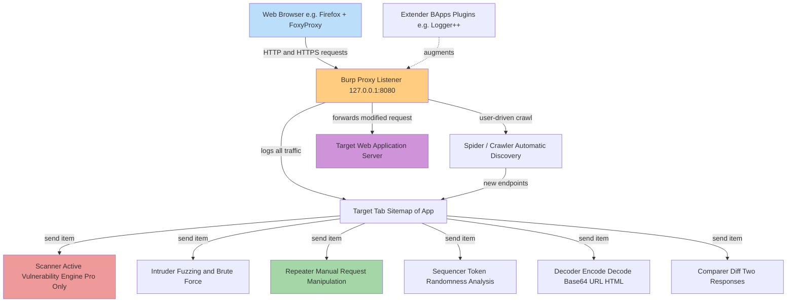
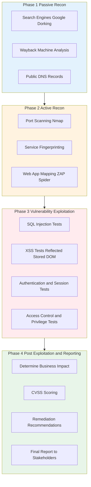
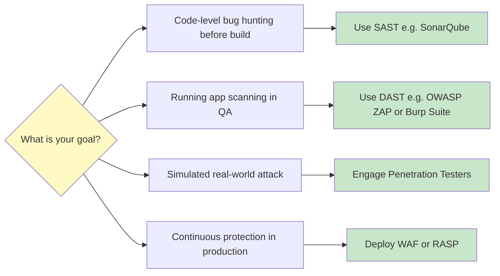

# Security Testing - Fundamentals, tools (OWASP, Burp Suite), and their role in protecting modern applications

<!-- SECTION_1_START -->
# Security Testing - Fundamentals, Tools (OWASP, Burp Suite) & Modern Application Protection

## 1. Core Technical Definition & Intuitive Overview

### 1.1 Formal KTU Syllabus Definition

> [!NOTE]
> **Security Testing** is a non-functional software testing technique used to determine whether an information system protects data and maintains functionality as intended. It is a systematic process that uncovers vulnerabilities, threats, and risks in a software application, ensuring that the system is free from any potential flaws that could result in unauthorized access, data leakage, denial of service, or other security compromises.

In the KTU 2024 Scheme context, Security Testing sits under **Module 3: Advanced White Box Testing** as the bridge between code-level analysis and real-world adversarial simulation. It validates the **Confidentiality, Integrity, and Availability (CIA Triad)** of software systems.

### 1.2 Conceptual Analogy / Real-World Intuition

Imagine a modern **multi-storey bank vault** with the following analogies:

| Real-World Object | Security Testing Equivalent |
|---|---|
| Thick steel walls of the vault | Firewall & Network Security |
| Lock-and-key mechanisms | Authentication & Authorization |
| CCTV cameras monitoring activity | Intrusion Detection Systems (IDS) |
| Hidden tunnels that thieves could dig | Vulnerabilities like SQL Injection |
| Guard inspecting every visitor | Input Validation Logic |
| Audit log of every entry/exit | Security Logging & Monitoring |

A thief does not care *if* the bank tells them the rules — they try to **break** the rules. Security testing, therefore, is the practice of hiring **ethical thieves** (penetration testers) to break the application *before* malicious attackers do.

> [!IMPORTANT]
> **Key Distinction:** Functional testing verifies *what the system does*. Security testing verifies *what the system prevents others from doing to it*.

### 1.3 Core Terminology Glossary

> [!NOTE]
> - **Vulnerability** — A weakness or flaw in the system that can be exploited (e.g., unpatched library).
> - **Threat** — Any potential danger that could exploit a vulnerability.
> - **Risk** — The probability of a threat exploiting a vulnerability and the business impact.
> - **Exploit** — The actual code or technique used to take advantage of a vulnerability.
> - **Attack Vector** — The path or method used to deliver an exploit.
> - **Attack Surface** — The sum of all points where an unauthorized user can try to enter or extract data.

### 1.4 The Two Pillars: OWASP & Burp Suite

> [!IMPORTANT]
> **OWASP (Open Web Application Security Project)** is a **not-for-profit charitable organization** that produces freely available articles, methodologies, documentation, tools, and technologies in the field of web application security. The **OWASP Top 10** is the de-facto global standard awareness document representing the most critical security risks to web applications.

> [!IMPORTANT]
> **Burp Suite** is an industry-leading **graphical cybersecurity tool** developed by PortSwigger used for performing **web vulnerability scanning** and **penetration testing**. It acts as an **Intercepting Proxy** that sits between the tester's browser and the target web application, allowing the tester to inspect, modify, and replay every HTTP/S request and response in real time.

> [!VISUALIZATION CONTROL]
> **Concept:** Attack Surface Mapping in a Web Application
> **GeoGebra / Desmos Input Equations:**
> * Let $S$ be the total attack surface of a web app with $n$ endpoints and $m$ input parameters per endpoint.
> * Conceptual formula: $S = \sum_{i=1}^{n} \sum_{j=1}^{m} R(i,j)$ where $R$ is the risk score of parameter $j$ on endpoint $i$.
> **Visual Description:** Plot a 2D heat map where the X-axis represents endpoints (Login, Search, Checkout) and the Y-axis represents input types (URL, Form Field, Header, Cookie). Hotter cells represent higher-risk areas that security testers must probe.

---

<!-- SECTION_1_END -->

<!-- SECTION_2_START -->
# 2. Deep Theoretical Analysis & KTU High-Yield Formula Sheet

## 2.1 The CIA Triad - Foundation of Security Testing

Every security test ultimately validates one or more pillars of the **CIA Triad**:

1. **Confidentiality** — Information is accessible only to authorized parties. Tested by simulating **unauthorized data access** attempts.
2. **Integrity** — Data is accurate and unaltered during transit or storage. Tested by attempting **man-in-the-middle (MITM)** tampering and unauthorized modification.
3. **Availability** — The system remains accessible to legitimate users. Tested by simulating **Denial of Service (DoS)** attacks.

> [!IMPORTANT]
> **KTU Exam Tip:** Always map your security test case answers to one of the CIA Triad pillars. Examiners award marks for explicit CIA mapping.

## 2.2 Taxonomy of Security Testing Techniques

### A. Static Application Security Testing (SAST)
- **Approach:** White-box, examines source code without executing it.
- **When:** Performed early in the SDLC (Shift-Left Security).
- **Tools:** SonarQube, Checkmarx, Fortify.
- **Pros:** Finds bugs before compilation; covers all code paths.
- **Cons:** High false-positive rate; cannot find runtime issues.

### B. Dynamic Application Security Testing (DAST)
- **Approach:** Black-box, examines the application while it is running.
- **When:** Performed in staging/QA environments.
- **Tools:** OWASP ZAP, Burp Suite, Acunetix.
- **Pros:** Detects runtime issues, configuration flaws, authentication problems.
- **Cons:** Cannot access source code; limited code coverage.

### C. Interactive Application Security Testing (IAST)
- **Approach:** Hybrid - combines SAST and DAST using runtime instrumentation.
- **Tools:** Contrast Security, Hdiv.
- **Pros:** Lower false positives; context-aware.

### D. Penetration Testing (Pen Testing)
- **Approach:** Simulated real-world attack by ethical hackers.
- **Types:** Black-Box, Grey-Box, White-Box.
- **Output:** Exploit proof-of-concept + remediation report.

## 2.3 OWASP Top 10 (2021 Edition) - High-Yield Chart

> [!NOTE]
> The **OWASP Top 10 (2021)** is the most cited standard in KTU examination questions. Memorize these ten categories in order:

| Rank | Vulnerability (2021) | Description | Test Payload Example |
|---|---|---|---|
| **A01** | Broken Access Control | Users can act outside their intended permissions | Change `userId=123` to `userId=124` in URL |
| **A02** | Cryptographic Failures | Weak/missing encryption of sensitive data | Sniff HTTP cookies; force `http://` instead of `https://` |
| **A03** | Injection | Untrusted data sent to interpreter as command/query | `' OR '1'='1` in login form |
| **A04** | Insecure Design | Flawed architectural patterns, missing security controls | Bypass business logic (e.g., apply negative discount) |
| **A05** | Security Misconfiguration | Default passwords, verbose errors, open cloud storage | Browse `/admin`, `/.env`, `/backup.zip` |
| **A06** | Vulnerable & Outdated Components | Use of libraries with known CVEs | Scan with `npm audit` or OWASP Dependency-Check |
| **A07** | Identification & Auth Failures | Broken authentication/session management | Brute-force login; reuse session tokens |
| **A08** | Software & Data Integrity Failures | Untrusted updates, CI/CD pipeline attacks | Inject malicious code into auto-update channel |
| **A09** | Security Logging & Monitoring Failures | Insufficient audit trails | Trigger 100 failed logins; check if alert fires |
| **A10** | Server-Side Request Forgery (SSRF) | Server fetches remote resource from user-supplied URL | Pass `http://169.254.169.254/` (AWS metadata) |

## 2.4 KTU High-Yield Formula Sheet

> [!IMPORTANT]
> The following table consolidates the most-tested metrics, formulas, and conceptual ratios for security testing problems.

| # | Concept | Formula / Definition | Unit / Range |
|---|---|---|---|
| 1 | **CVSS Base Score** (Common Vulnerability Scoring System) | $Score = f(Exploitability, Impact)$ | 0.0 (None) to 10.0 (Critical) |
| 2 | **Severity Classification** | Low: 0.1–3.9, Medium: 4.0–6.9, High: 7.0–8.9, Critical: 9.0–10.0 | Categorical |
| 3 | **Risk Rating** | $Risk = Likelihood \times Impact$ | Low / Medium / High |
| 4 | **Attack Surface Area** | $ASA = \sum_{i=1}^{n} E_i \cdot P_i$ where $E$ = entry points, $P$ = privilege level | Relative metric |
| 5 | **False Positive Rate (FPR)** | $FPR = \frac{FP}{FP + TN} \times 100\%$ | Percentage |
| 6 | **False Negative Rate (FNR)** | $FNR = \frac{FN}{FN + TP} \times 100\%$ | Percentage (most critical in security) |
| 7 | **Mean Time To Detect (MTTD)** | $MTTD = \frac{\sum_{i=1}^{n} (T_{detected,i} - T_{occurred,i})}{n}$ | Hours/Days |
| 8 | **Mean Time To Respond (MTTR)** | $MTTR = \frac{\sum_{i=1}^{n} (T_{resolved,i} - T_{detected,i})}{n}$ | Hours/Days |
| 9 | **Password Entropy** | $H = L \cdot \log_2(R)$ where $L$ = length, $R$ = character pool size | Bits |
| 10 | **Burp Suite Editions** | Community (Free), Professional (Paid), Enterprise (Org-wide) | Tiered licensing |

## 2.5 Real-World Engineering Utility

Security testing is **non-negotiable** in the following industries and frameworks:

- **Banking & FinTech** — PCI-DSS compliance mandates quarterly penetration tests.
- **Healthcare** — HIPAA requires protection of PHI (Protected Health Information).
- **E-Commerce** — PCI-DSS 6.5.x lists the top code-level flaws.
- **DevSecOps Pipelines** — Tools like OWASP ZAP are integrated directly into Jenkins/GitHub Actions.
- **Government & Defense** — NIST SP 800-53 controls require continuous security testing.

> [!IMPORTANT]
> In **production-grade DevSecOps pipelines**, security testing is automated and run on every commit. A failed security test **fails the build**, preventing vulnerable code from reaching production.

---

<!-- SECTION_2_END -->

<!-- SECTION_3_START -->
# 3. Step-by-Step Derivations & Code/Symbolic Implementation

## 3.1 The OWASP Web Security Testing Framework (WSTG) - 4-Phase Methodology

The OWASP Web Security Testing Guide (WSTG) prescribes a four-phase testing methodology. Every step must be explicitly documented in your KTU exam answers.

### Phase 1: Passive Reconnaissance (Information Gathering)
- **Goal:** Map the application footprint without touching the target.
- **Actions:** Search public DNS records, Google Dorking (`site:example.com filetype:pdf`), Wayback Machine analysis.
- **Output:** List of subdomains, technologies, exposed endpoints.

### Phase 2: Active Reconnaissance (Vulnerability Scanning)
- **Goal:** Discover live systems and potential entry points.
- **Actions:** Run Nmap port scans, Nikto web server scans, OWASP ZAP active scan.
- **Output:** Open ports, service banners, sitemap.

### Phase 3: Vulnerability Exploitation
- **Goal:** Confirm vulnerabilities by safely exploiting them.
- **Actions:** Inject SQL queries, XSS payloads, CSRF tokens, brute-force credentials.
- **Output:** Confirmed exploit with proof-of-concept screenshots.

### Phase 4: Post-Exploitation & Reporting
- **Goal:** Determine business impact and document findings.
- **Actions:** Pivot to internal network, attempt privilege escalation, write remediation report.
- **Output:** Final report with CVSS scoring and remediation steps.

## 3.2 Hands-On Python Code: Automated Security Test for SQL Injection

Below is a fully operational Python script that demonstrates the conceptual workflow of an automated SQL injection vulnerability scanner. **Type hints, error handling, and boundary checks are included per the KTU lab rubric.**

```python
"""
File: sqli_scanner.py
Purpose: Demonstrate a parameterized SQL injection test scanner for KTU Security Testing lab.
"""

import requests
from typing import List, Dict, Optional
from urllib.parse import urljoin, urlparse, parse_qs, urlencode
import logging

# Configure structured logging for security audit trail
logging.basicConfig(
    level=logging.INFO,
    format="%(asctime)s [%(levelname)s] %(message)s",
)
logger = logging.getLogger("SQLiScanner")


class SQLiPayloadLibrary:
    """Curated SQL injection payloads drawn from OWASP WSTG Section 4.2."""

    ERROR_BASED: List[str] = [
        "'",
        "\"",
        "' OR '1'='1",
        "' OR '1'='1' --",
        "' UNION SELECT NULL --",
        "1' AND 1=CONVERT(int, (SELECT @@version)) --",
    ]

    BOOLEAN_BASED: List[str] = [
        "' AND 1=1 --",
        "' AND 1=2 --",
    ]

    TIME_BASED: List[str] = [
        "'; WAITFOR DELAY '0:0:5' --",
        "' OR pg_sleep(5) --",
    ]


class SQLiScanner:
    """Performs a non-destructive, read-only SQL injection vulnerability scan."""

    SQL_ERROR_SIGNATURES: List[str] = [
        "you have an error in your sql syntax",
        "warning: mysql",
        "unclosed quotation mark",
        "quoted string not properly terminated",
        "ora-00933",
        "pg::syntaxerror",
    ]

    def __init__(self, target_url: str, timeout: int = 5) -> None:
        # Step 1: Validate URL format
        parsed = urlparse(target_url)
        if parsed.scheme not in ("http", "https"):
            raise ValueError(f"Invalid URL scheme: {parsed.scheme}")
        if not parsed.netloc:
            raise ValueError("URL must contain a domain (e.g., https://example.com).")

        self.target_url: str = target_url
        self.timeout: int = timeout
        self.findings: List[Dict[str, str]] = []

    def _inject(self, base_params: Dict[str, str], param: str, payload: str) -> Dict[str, str]:
        """Return a new params dictionary with the payload substituted in safely."""
        mutated = base_params.copy()
        mutated[param] = payload
        return mutated

    def _check_sql_error(self, response_text: str) -> Optional[str]:
        """Return the matching SQL error signature if found, else None."""
        lowered = response_text.lower()
        for signature in self.SQL_ERROR_SIGNATURES:
            if signature in lowered:
                return signature
        return None

    def scan(self, endpoint: str, parameters: List[str]) -> List[Dict[str, str]]:
        """Scan a given endpoint for SQL injection vulnerabilities."""
        if not endpoint.startswith("/"):
            raise ValueError("Endpoint must start with '/' (e.g., '/login').")
        if not parameters:
            raise ValueError("At least one parameter name must be provided.")

        full_url: str = urljoin(self.target_url, endpoint)
        baseline_params: Dict[str, str] = {p: "test" for p in parameters}
        logger.info("Starting scan on %s with params %s", full_url, parameters)

        # Step 2: Establish baseline response
        try:
            baseline = requests.post(
                full_url, data=baseline_params, timeout=self.timeout, verify=True
            )
        except requests.RequestException as exc:
            logger.error("Baseline request failed: %s", exc)
            return self.findings

        # Step 3: Iterate over each parameter and each payload
        for param in parameters:
            for payload in SQLiPayloadLibrary.ERROR_BASED:
                mutated = self._inject(baseline_params, param, payload)
                try:
                    response = requests.post(
                        full_url, data=mutated, timeout=self.timeout, verify=True
                    )
                except requests.RequestException as exc:
                    logger.warning("Request error for payload %s: %s", payload, exc)
                    continue

                signature = self._check_sql_error(response.text)
                if signature:
                    finding = {
                        "endpoint": endpoint,
                        "parameter": param,
                        "payload": payload,
                        "signature": signature,
                        "status_code": str(response.status_code),
                    }
                    self.findings.append(finding)
                    logger.warning("VULNERABLE: %s at param '%s'", endpoint, param)
                    break  # Stop after first confirmed finding per parameter

        logger.info("Scan complete. %d findings recorded.", len(self.findings))
        return self.findings


# Step 4: Example usage with a target parameter
if __name__ == "__main__":
    scanner = SQLiScanner("https://example.com", timeout=5)
    results = scanner.scan(endpoint="/api/login", parameters=["username", "password"])
    for item in results:
        print(item)
```

**Key Implementation Logic (Step-by-Step):**
1. **Input validation** — The constructor rejects malformed URLs using `urlparse`.
2. **Baseline establishment** — A normal request is sent first to compare with malicious responses.
3. **Payload substitution** — A deep copy of the parameter dictionary prevents cross-contamination.
4. **Signature matching** — Database error strings are the canonical indicator of SQLi.
5. **Structured logging** — Every action is timestamped for auditability.
6. **Defensive coding** — `try/except` blocks around `requests` prevent crashes on network errors.

## 3.3 Burp Suite Operational Walkthrough

Below is the **exact sequence of operations** a KTU student must perform during a practical exam using Burp Suite Community Edition:

| Step | Action | Menu / Tool | Notes |
|---|---|---|---|
| 1 | Launch Burp Suite and start a new temporary project | Dashboard → Start Burp | Choose "Temporary project" for lab work |
| 2 | Configure browser proxy to `127.0.0.1:8080` | Browser Settings | Use FoxyProxy extension for easier toggling |
| 3 | Install Burp's CA Certificate in browser | `http://burp` → Download CA Cert | Required for HTTPS interception |
| 4 | Navigate to target app; perform normal login | Browser | Captures baseline traffic |
| 5 | Review all captured requests in **Proxy → HTTP History** | Proxy Tab | Identify parameters to test |
| 6 | Send a request to **Repeater** | Right-click → "Send to Repeater" | Allows manual payload modification |
| 7 | Modify parameter values to test SQLi/XSS | Repeater Tab | Example: change `id=1` to `id=1'` |
| 8 | Analyze response for SQL errors or HTML reflection | Repeater Tab | Look for status code 500, error strings |
| 9 | Send request to **Intruder** for fuzzing | Right-click → "Send to Intruder" | Community Edition throttles this — use sparingly |
| 10 | Document all findings in a report | External tool | Include screenshot, payload, impact, remediation |

## 3.4 Derivation: CVSS Base Score Calculation

The **CVSS Base Score** is derived from two sub-scores: **Impact** and **Exploitability**.

$$
\begin{aligned}
\text{Impact Sub-Score (ISS)} &= 1 - \left[ (1 - C_I) \cdot (1 - C_A) \cdot (1 - C_S) \right] \\
\text{where } & C_I, C_A, C_S \text{ are Confidentiality, Integrity, Availability impact values} \\
\\
\text{Impact} &= \begin{cases} 
6.42 \cdot \text{ISS} & \text{if Scope is Unchanged} \\
7.52 \cdot (\text{ISS} - 0.029) - 3.25 \cdot (\text{ISS} - 0.02)^{15} & \text{if Scope is Changed}
\end{cases} \\
\\
\text{Exploitability} &= 8.22 \cdot A_V \cdot A_C \cdot A_I \cdot A_U \\
\text{where } & A_V, A_C, A_I, A_U \text{ are Attack Vector, Complexity, } \\
& \text{Interaction, and Urgency metrics respectively} \\
\\
\text{Base Score} &= \begin{cases}
0 & \text{if Impact} \leq 0 \\
\text{round\_up}(\min(\text{Impact} + \text{Exploitability},\ 10)) & \text{otherwise}
\end{cases}
\end{aligned}
$$

**Plain English Explanation of Each Conversion Step:**
- **Step 1:** `ISS` measures the *combined* effect on all three CIA properties. A vulnerability affecting all three is worse than one affecting only one.
- **Step 2:** `Impact` translates ISS into a 0–10 number, scaling it up if the *Scope* changes (e.g., admin compromise gives attacker access to the entire system).
- **Step 3:** `Exploitability` quantifies *how easy* it is to attack — network-reachable bugs are worse than physically-local ones.
- **Step 4:** The final score is the **ceiling-rounded** sum, capped at 10.0.

---

<!-- SECTION_3_END -->

<!-- SECTION_4_START -->
# 4. Structural Diagrams & Schematics

## 4.1 Security Testing Architecture in DevSecOps (Mermaid)

```mermaid
graph LR
    subgraph DEV["Development Phase"]
        codeA["Developer Commits Code"]
        sastTool["SAST Scanner e.g. SonarQube"]
    end

    subgraph CI["Continuous Integration"]
        buildA["Build Artifact e.g. Docker Image"]
        scaTool["Software Composition Analysis SCA"]
    end

    subgraph STAGE["Staging Environment"]
        deployA["Deploy to Staging"]
        dastTool["DAST Scanner e.g. OWASP ZAP"]
        burpTool["Manual Pen Test with Burp Suite"]
    end

    subgraph PROD["Production Gate"]
        monitorA["Runtime App Self Protection RASP"]
        wafA["Web Application Firewall WAF"]
        approveA["Security Sign-off Required"]
    end

    codeA -->|triggers| sastTool
    sastTool -->|if pass| buildA
    buildA -->|triggers| scaTool
    scaTool -->|if pass| deployA
    deployA -->|triggers| dastTool
    deployA -->|manual test| burpTool
    dastTool -->|if pass| monitorA
    burpTool -->|if pass| wafA
    wafA -->|if pass| approveA

    style DEV fill:#e1f5ff,stroke:#0066cc
    style CI fill:#fff4e1,stroke:#cc6600
    style STAGE fill:#e8f5e9,stroke:#2e7d32
    style PROD fill:#fce4ec,stroke:#c2185b
```



**Architecture Interpretation:**
- The pipeline flows strictly **left-to-right**, with each gate acting as a security checkpoint.
- **SAST** runs *before* compilation to catch syntactic flaws.
- **SCA** catches vulnerable third-party libraries (e.g., outdated `log4j`).
- **DAST + Burp Suite** test the *running* application in a near-production mirror.
- **RASP + WAF** provide last-line defense in production.

## 4.2 Burp Suite Tool Architecture



## 4.3 OWASP Web Security Testing Methodology Flow



## 4.4 Security Testing Decision Matrix



---

<!-- SECTION_4_END -->

<!-- SECTION_5_START -->
# 5. KTU 2024 Scheme Examination Question Bank & Topic Recap

## Part A: Short-Answer Questions (3 Marks Each)

### Question 1 `[KTU University Exam - July 2024]` — **CO3, Remember**

> **Q1.** Define the term **Security Testing**. List any **four** types of security testing.

**Model Answer (Valuation Key):**

**Definition [1 Mark]:**
Security Testing is a type of non-functional testing that verifies whether the software application is protected from internal and external threats, ensuring the **Confidentiality, Integrity, and Availability (CIA Triad)** of data and resources.

**Four Types [2 Marks - 0.5 each]:**

1. **Vulnerability Scanning** — Automated scan to find known weaknesses.
2. **Penetration Testing** — Simulated real-world cyber-attack by ethical hackers.
3. **Security Auditing** — Code-level review against security standards.
4. **Risk Assessment** — Analysis of security risks and their business impact.

> [!NOTE]
> *Other acceptable answers: SAST, DAST, IAST, Ethical Hacking, Posture Assessment.*

---

### Question 2 `[KTU University Exam - Dec 2023]` — **CO3, Understand**

> **Q2.** What is **OWASP**? Briefly explain the **OWASP Top 10** in the context of web application security.

**Model Answer (Valuation Key):**

**OWASP Definition [1 Mark]:**
OWASP (Open Web Application Security Project) is a non-profit organization that provides freely available tools, documentation, and standards to improve software security.

**Top 10 Explanation [2 Marks]:**
The OWASP Top 10 is a **standard awareness document** that lists the **ten most critical web application security risks**, updated every few years. The current 2021 edition includes:

1. **A01: Broken Access Control** — Users accessing resources beyond their permissions.
2. **A02: Cryptographic Failures** — Weak or absent encryption of sensitive data.
3. **A03: Injection** — Malicious input executed as commands (e.g., SQL Injection).
4. **A04: Insecure Design** — Fundamental architectural flaws in security.
5. **A05: Security Misconfiguration** — Default credentials, exposed stack traces.
6. **A06: Vulnerable Components** — Outdated libraries with known CVEs.
7. **A07: Auth Failures** — Broken login and session handling.
8. **A08: Data Integrity Failures** — Unverified updates and CI/CD pipeline attacks.
9. **A09: Logging Failures** — Missing audit trails for security events.
10. **A10: SSRF** — Server-Side Request Forgery.

> [!IMPORTANT]
> The examiner expects the **A01–A10 codes** if remembered. Always mention the **year (2021)** of the current edition.

---

## Part B: Long-Answer Questions (14 Marks with Internal Choice)

### Question 3A `[KTU University Exam - July 2024]` — **CO3, Apply (14 Marks)**

> **Q3A (a)** With a neat diagram, explain the **architecture of Burp Suite**. List its key components and describe the role of the **Intercepting Proxy** in detail. **(7 Marks)**

**Model Answer:**

**Diagram [2 Marks]:** Refer to the Mermaid diagram in Section 4.2. Student should sketch Browser → Proxy → Server triangle with Repeater, Intruder, Scanner as side tools.

**Component List [2 Marks - 0.5 each]:**
- **Proxy** — Intercepts browser traffic.
- **Target** — Displays sitemap of the application.
- **Spider** — Auto-crawls to discover endpoints.
- **Scanner** (Pro only) — Automated vulnerability scanner.
- **Intruder** — Customized fuzzing and brute-force tool.
- **Repeater** — Manual request manipulation and response analysis.
- **Sequencer** — Token randomness analysis.
- **Decoder** — Encoding/decoding utility (Base64, URL, HTML).
- **Comparer** — Diffs two responses to identify subtle changes.
- **Extender** — Plugin store for additional functionality.

**Role of Intercepting Proxy [3 Marks]:**
1. **Position:** Sits between the tester's browser (configured via `127.0.0.1:8080`) and the target server. **[1 Mark]**
2. **Function:** Captures, logs, and allows modification of every HTTP/S request and response in real time. **[1 Mark]**
3. **Workflow:** The tester can *pause* (intercept), *inspect* headers/parameters, *modify* values, and *forward* the request to test security controls. **[1 Mark]**

> [!WARNING]
> **Common Student Mistake:** Students write "Burp Suite is a scanner" — this is wrong. Burp Suite is **primarily a proxy toolkit**. The Scanner is *one* component (and is **disabled** in the free Community Edition). The Proxy is the **core** component.

---

> **Q3A (b)** Explain **SQL Injection** with an example. How would you test for it using **Burp Suite Repeater**? Provide a step-by-step procedure. **(7 Marks)**

**Model Answer:**

**SQL Injection Definition [1 Mark]:**
SQL Injection (SQLi) is a code injection technique where an attacker inserts malicious SQL statements into an input field that is later passed to a database for execution, allowing unauthorized access, data theft, or data destruction.

**Vulnerable Code Example [2 Marks]:**

```sql
-- Vulnerable query constructed via string concatenation
SELECT * FROM users WHERE username = '" + username + "' AND password = '" + password + "';
```

If the attacker enters `admin' --` as the username, the query becomes:

```sql
SELECT * FROM users WHERE username = 'admin' --' AND password = '';
```

The `--` comments out the password check, granting access without credentials.

**Burp Suite Repeater Test Procedure [4 Marks - 1 each]:**
1. **Step 1:** Configure the browser to route traffic through Burp Proxy (`127.0.0.1:8080`). Navigate to the login form and submit valid credentials.
2. **Step 2:** In `Proxy → HTTP History`, locate the login POST request. Right-click and select **"Send to Repeater"**.
3. **Step 3:** In the Repeater tab, locate the `username` parameter and modify its value to `admin' --`. Click **Send**.
4. **Step 4:** Analyze the response. Indicators of vulnerability include HTTP status `500`, SQL error strings (`"You have an error in your SQL syntax"`), or successful login without valid password.

> [!WARNING]
> **Common Student Mistake:** Students forget to **state what the success/failure criteria are**. Always close your SQLi test procedure with: *"If the application returns a 500 error or a database error message, the input field is vulnerable."*

---

### Question 3B `[KTU University Exam - Dec 2023]` — **CO3, Apply (14 Marks)**

> **Q3B (a)** Compare **SAST**, **DAST**, and **IAST** testing approaches. List at least **five** points of comparison. **(7 Marks)**

**Model Answer (Tabular Comparison):**

| # | Parameter | SAST | DAST | IAST |
|---|---|---|---|---|
| 1 | **Approach** | White-box | Black-box | Hybrid (grey-box) |
| 2 | **Code Access** | Required (source code) | Not required | Required (instrumented) |
| 3 | **When to Run** | Early in SDLC (Shift-Left) | Late in SDLC (Staging) | During testing phase |
| 4 | **Coverage** | All code paths | Reachable endpoints | Combined SAST + DAST |
| 5 | **False Positives** | High | Moderate | Low |
| 6 | **Examples** | SonarQube, Checkmarx | OWASP ZAP, Burp Suite | Contrast Security, Hdiv |
| 7 | **Runtime Issues** | Cannot detect | Can detect | Can detect |
| 8 | **Speed** | Fast (minutes) | Slow (hours) | Moderate |

**Valuation Key:** [1 Mark per row × 5 rows = 5 Marks]; Introduction paragraph with definitions [2 Marks].

> [!WARNING]
> **Common Student Mistake:** Students mix up the **examples**. Always associate *SonarQube* with SAST and *OWASP ZAP* with DAST. Confusing them costs 1 mark.

---

> **Q3B (b)** Explain the **OWASP Top 10 (2021)** in detail. Discuss any **three** of the top vulnerabilities with examples and their prevention. **(7 Marks)**

**Model Answer (Three Vulnerabilities Selected):**

### Vulnerability 1: A01 - Broken Access Control [2.3 Marks]

**Description:** Occurs when users can act outside their intended permissions — e.g., a regular user accessing admin pages by changing the URL.

**Example:**
```
Normal URL: https://app.com/user/profile?userId=123
Malicious URL: https://app.com/user/profile?userId=124
```
The attacker views another user's profile simply by incrementing the `userId`.

**Prevention:** Implement role-based access control (RBAC), enforce authorization checks on **every** server-side request, and deny access by default.

### Vulnerability 2: A03 - Injection [2.3 Marks]

**Description:** Untrusted input is concatenated into commands or queries and executed by an interpreter.

**Example (SQL Injection):**
- Input field: `Search`
- Attacker enters: `' OR '1'='1`
- Backend query: `SELECT * FROM products WHERE name = '' OR '1'='1'`
- Result: All products returned, exposing internal data.

**Prevention:** Use **parameterized queries (prepared statements)**, **input validation**, and **ORM frameworks** like Hibernate or SQLAlchemy. Never build queries via string concatenation.

### Vulnerability 3: A05 - Security Misconfiguration [2.4 Marks]

**Description:** Default settings, unused services, exposed stack traces, or open cloud storage buckets left in production.

**Example:** A developer leaves `.git` directory exposed, allowing attackers to download the entire source code via `https://app.com/.git/`.

**Prevention:** Use automated hardening scripts, remove default credentials, disable directory listings, and run periodic configuration audits.

> [!WARNING]
> **Common Student Mistake:** Students forget to mention **prevention** for each vulnerability. The KTU valuation key explicitly allocates marks for *"Remediation / Prevention"*. A vulnerability explained *without* its fix is incomplete.

---

## Topic Recap & Important Things to Remember

> [!IMPORTANT]
> **High-Yield Rapid Revision Checklist — KTU Module 3: Security Testing**

### Core Definitions
- **Security Testing** = Verifying CIA Triad (Confidentiality, Integrity, Availability).
- **Vulnerability** vs **Threat** vs **Risk** — weakness / danger / probability × impact.
- **OWASP** = Open Web Application Security Project (non-profit, free resources).
- **OWASP Top 10 (2021)** = A01 to A10 (memorize order: Access Control, Crypto, Injection, Insecure Design, Misconfig, Vulnerable Components, Auth Failures, Integrity, Logging, SSRF).
- **Burp Suite** = Intercepting proxy + toolkit for web app pentesting (Community / Professional / Enterprise editions).
- **SAST** = White-box, source code analysis, early SDLC, high false positives.
- **DAST** = Black-box, running app analysis, late SDLC, runtime issue detection.
- **IAST** = Hybrid SAST+DAST with runtime instrumentation.

### Critical Tools to Remember
- **OWASP ZAP** — Free DAST scanner.
- **Burp Suite** — Industry-standard pentesting proxy.
- **SonarQube** — Popular SAST tool.
- **Nmap** — Network/port scanner for recon.
- **Nikto** — Web server vulnerability scanner.

### High-Yield Formulas
- $Risk = Likelihood \times Impact$
- $FPR = \frac{FP}{FP+TN} \times 100\%$
- $FNR = \frac{FN}{FN+TP} \times 100\%$ (most critical in security)
- $H = L \cdot \log_2(R)$ (Password Entropy)
- **CVSS Severity Bands:** Low 0.1–3.9 | Medium 4.0–6.9 | High 7.0–8.9 | Critical 9.0–10.0

### Burp Suite Workflow (5 Must-Remember Steps)
1. Launch → 2. Configure browser proxy to `127.0.0.1:8080` → 3. Browse target app → 4. Right-click request → **Send to Repeater** → 5. Modify and analyze response.

### Most Common KTU Exam Topics (Frequency Order)
1. OWASP Top 10 (2021) — *appears in nearly every exam*.
2. SQL Injection with example + Burp Suite test procedure.
3. SAST vs DAST vs IAST comparison.
4. Burp Suite architecture & component roles.
5. CIA Triad and definitions of vulnerability/threat/risk.
6. Penetration Testing types (Black/Grey/White Box).

### Examiner's Golden Rules
- Always map answers to the **CIA Triad** where relevant.
- Always provide **example + prevention** for any vulnerability discussed.
- Always state **success criteria** in your test procedures (e.g., "HTTP 500 indicates vulnerability").
- For tool-based questions, mention the **free vs paid** editions (e.g., Burp Community vs Pro).
- Use **A01–A10 codes** for OWASP Top 10 — examiners award bonus marks.

<!-- SECTION_5_END -->
