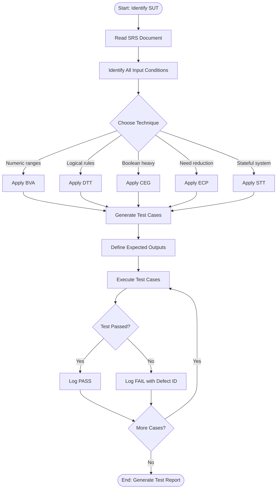
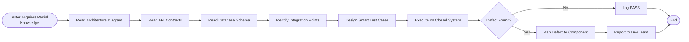
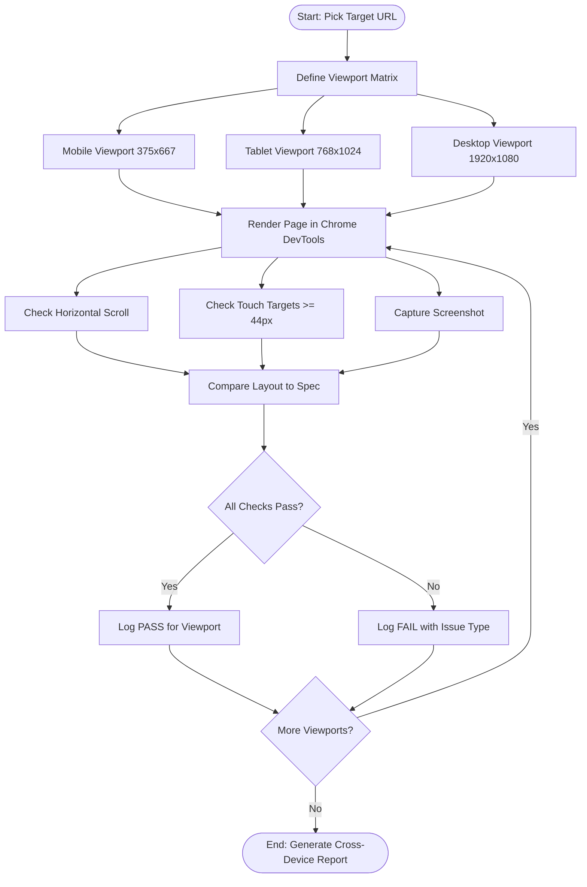
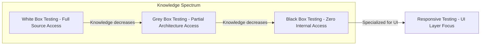
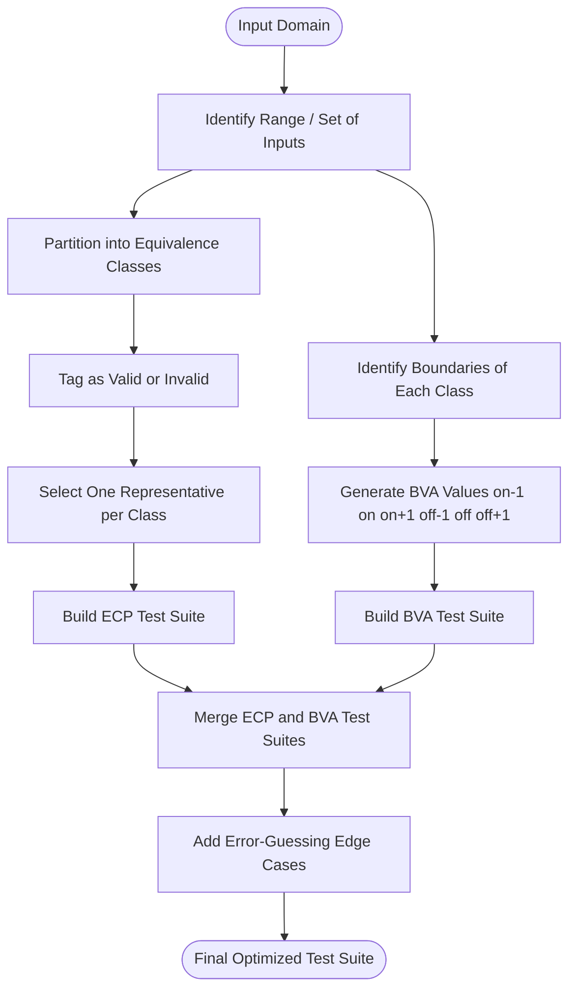

# Black Box Testing, Grey Box Testing, and Responsive Testing:-

<!-- SECTION_1_START -->

# Black Box Testing, Grey Box Testing & Responsive Testing

## 1.1 Black Box Testing — Core Definition

> [!IMPORTANT]
> **KTU Syllabus Definition (OECST833 — Module 4)**
> **Black Box Testing** is a software testing technique where the internal structure, design, and implementation of the item being tested are **NOT** known to the tester. The tester focuses solely on the **inputs** supplied to the system and the **outputs** produced, validating functional requirements against a specification document. It is formally classified under the **Functional / Specification-Based** testing category in IEEE 829 and ISO/IEC/IEEE 25010 standards.

> [!NOTE]
> **Other Accepted Names (KTU Board Terminology):**
> - Specification-Based Testing
> - Behavioural Testing
> - Closed-Box Testing
> - Opaque-Box Testing
> - Data-Driven Testing

### Conceptual Analogy — The Restaurant Mystery Diner

Imagine you walk into a restaurant and order a specific dish (e.g., *Veg Biriyani*). As a **customer**, you don't know what happens inside the kitchen — whether the chef uses basmati or seeraga samba rice, which spices are ground, or how long it's cooked. You only evaluate:
- **Input:** Your order ("Veg Biriyani, extra spicy")
- **Output:** The plate that arrives at your table
- **Validation:** Does the plate *look, smell, and taste* like Veg Biriyani? Is the portion correct? Is the bill accurate?

That diner is acting as a **Black Box Tester**. The kitchen (internal code) is invisible. The menu specification (requirements document) is the only reference. If the kitchen sends a chicken dish when you ordered veg, the test **fails**, regardless of how beautifully it was cooked.

### Key Characteristics (Board-Relevant)

- **No knowledge** of source code, internal paths, or architecture.
- Based purely on **software requirements, specifications, and SRS document**.
- Performed by **independent QA testers**, not developers.
- Can be applied at **Unit, Integration, System, and Acceptance** levels.
- Reveals **missing functions, incorrect outputs, interface errors, performance failures, and initialization/data-structure errors**.

### Black Box Testing Hierarchy (KTU Module 4 Focus)

The following sub-techniques fall under Black Box Testing per the KTU 2024 OECST833 syllabus:

| # | Technique | Short Form | Primary Purpose |
|---|-----------|-----------|-----------------|
| 1 | Equivalence Class Partitioning | ECP | Reduce test cases by grouping valid/invalid inputs |
| 2 | Boundary Value Analysis | BVA | Test edges of input ranges |
| 3 | Decision Table Testing | DTT | Test logical combinations of inputs |
| 4 | Cause-Effect Graphing | CEG | Map causes (inputs) to effects (outputs) |
| 5 | Error Guessing | EG | Tester-intuition-based fault detection |
| 6 | State Transition Testing | STT | Test system behavior across states |
| 7 | Use Case Testing | UCT | Validate end-to-end user workflows |

---

## 1.2 Grey Box Testing — Core Definition

> [!IMPORTANT]
> **KTU Syllabus Definition (OECST833 — Module 4)**
> **Grey Box Testing** is a hybrid software testing technique that combines elements of both **Black Box** (no internal code knowledge) and **White Box** (full internal code knowledge) testing. The tester possesses **partial knowledge** of the internal structure — typically the high-level architecture, database schema, API contracts, or data flow — while still treating the application as a closed system from a functional perspective.

### Conceptual Analogy — The Car Mechanic Customer

Picture a customer who owns a car (Black Box view — they just drive it). But this particular customer has **basic mechanical knowledge** — they know there's an engine, a transmission, brakes, and a fuel injection system. When the car jerks during acceleration, they don't open the gearbox, but they can **intelligently guess** that the issue might be in the fuel system or spark plugs.

This customer is a **Grey Box Tester**:
- **Black Box element:** Doesn't read assembly code or ECU firmware.
- **White Box element:** Knows the *architecture* (subsystems, data flow, dependencies).
- **Outcome:** Smarter, more targeted test cases than pure Black Box.

### Key Characteristics

- **Partial internal access** — typically architecture diagrams, database structures, or API documentation.
- Tester can design **intelligent test scenarios** that exploit knowledge of internal paths.
- Common in **Web Application, Integration, and Penetration Testing**.
- Performed by testers who have **limited developer-level access** but enough context to design integration-aware tests.
- Identifies defects related to **data flow, integration, and architectural mismatches**.

> [!NOTE]
> **KTU Board Highlight:** Grey Box Testing is especially useful in **Web-based applications** where the tester knows URL patterns, session handling, cookies, database queries, and the call flow between front-end and back-end.

---

## 1.3 Responsive Testing — Core Definition

> [!IMPORTANT]
> **KTU Syllabus Definition (OECST833 — Module 4)**
> **Responsive Testing** (also called **Responsive Web Design Testing** or **Cross-Device Testing**) is a non-functional testing technique that validates whether a web application or website renders, behaves, and performs **correctly, consistently, and optimally across a variety of devices, screen sizes, resolutions, operating systems, and browsers**. It ensures the UI/UX adapts fluidly to the viewport per the responsive design principles (CSS media queries, flexible grids, fluid images).

### Conceptual Analogy — The Universal T-Shirt

Imagine a fashion brand designs a single T-shirt that must fit **everyone** — from a 5-year-old child to a 250-pound adult, from a basketball player to a sumo wrestler. The T-shirt uses **stretchable, flexible fabric** (responsive design) so it adapts to the wearer's body.

**Responsive Testing** is the quality check that ensures:
- On a **small phone**, the T-shirt still looks like a T-shirt (not a napkin).
- On a **tablet**, proportions remain balanced.
- On a **4K desktop monitor**, it doesn't look pixelated or stretched.
- Buttons remain **tappable** on a touch screen.
- Text remains **readable** without horizontal scrolling.

If the T-shirt rips when a child puts it on — that's a **responsive test failure**.

### Key Characteristics

- Validates **layout, typography, image scaling, and navigation** across viewports.
- Tests **CSS media queries** (e.g., `@media (max-width: 768px)`).
- Validates **touch vs. mouse interactions**.
- Checks **performance** under varying network and device capabilities.
- Confirms **accessibility compliance** (WCAG guidelines).

### Standard Breakpoints (Industry Reference)

> [!TIP]
> The following breakpoints are referenced from **Bootstrap 5** and **Google Material Design** — the de-facto industry standards for responsive design.

| Device Category | CSS Breakpoint (min-width) | Typical Screen Width |
|-----------------|---------------------------|----------------------|
| Extra Small (XS) — Phones | < 576 px | 320 px – 575 px |
| Small (SM) — Large Phones | ≥ 576 px | 576 px – 767 px |
| Medium (MD) — Tablets | ≥ 768 px | 768 px – 991 px |
| Large (LG) — Laptops | ≥ 992 px | 992 px – 1199 px |
| Extra Large (XL) — Desktops | ≥ 1200 px | 1200 px – 1399 px |
| XXL — Large Desktops | ≥ 1400 px | 1400 px and above |

> [!VISUALIZATION CONTROL]
> **Concept:** Responsive Breakpoint Distribution (Histogram of Device-Width Frequencies in 2024 Web Traffic)
> **GeoGebra / Desmos Input Equations (Bar Representation):**
> * Bar 1: $f(x) = 25\%$ at $x = 375$ (Mobile)
> * Bar 2: $f(x) = 18\%$ at $x = 768$ (Tablet)
> * Bar 3: $f(x) = 35\%$ at $x = 1366$ (Laptop)
> * Bar 4: $f(x) = 22\%$ at $x = 1920$ (Desktop 4K)
> **Visual Description:** A vertical bar chart with the x-axis labeled "Device Width in Pixels" and the y-axis labeled "Traffic Share Percentage." Laptops peak the highest, followed by mobile, then desktop, then tablet. Students should observe that **testing only one device class** is statistically irresponsible.

---

## 1.4 The Testing Triad — Quick Comparison (KTU Recap Snapshot)

| Dimension | Black Box | Grey Box | Responsive |
|-----------|-----------|----------|------------|
| Internal Knowledge | **None** | **Partial** | N/A (UI-layer focus) |
| Tester Profile | QA / End User | QA with dev awareness | UX Tester / QA |
| Test Basis | SRS / Specs | SRS + Architecture | UI Specs / Wireframes |
| Primary Goal | Functional correctness | Smart integration coverage | Cross-device consistency |
| Automation Tools | Selenium, QTP | Postman, Burp Suite | BrowserStack, LambdaTest |
| KTU Module 4 Weightage | **High** | **Medium** | **High** |

<!-- SECTION_1_END -->

<!-- SECTION_2_START -->

# Deep Theoretical Analysis & KTU High-Yield Formula Sheet

## 2.1 Black Box Testing — Operational Breakdown

### 2.1.1 Equivalence Class Partitioning (ECP)

**Logic Steps (Board Examination Pattern):**

1. **Identify input domain:** List all possible inputs to the module under test.
2. **Partition into classes:** Divide the domain into groups of values that should produce equivalent behaviour.
3. **Classify each class:** Tag as **Valid** (accepted by spec) or **Invalid** (rejected by spec).
4. **Select one representative per class:** Test cases are reduced dramatically — one test per class is enough.
5. **Validate outcome:** The selected value should be processed identically to any other value in its class.

> [!NOTE]
> **Why ECP works:** Programs typically process *ranges* of inputs identically. A login field accepting ages 18–60 will treat 25 and 47 the same way. So one test per partition is **sufficient** (with the caveat that BVA covers the *edges*).

#### Worked ECP Example (Board-Ready)

**System Under Test (SUT):** A *Student Grade Validator* for KTU.

**Rule:** Marks entered must be an integer in the range **0 ≤ marks ≤ 100**.

| Class ID | Range | Type | Representative Test Value |
|----------|-------|------|--------------------------|
| E1 | 0 ≤ marks ≤ 100 | Valid | 75 |
| E2 | marks < 0 | Invalid | -5 |
| E3 | marks > 100 | Invalid | 150 |
| E4 | Non-integer input | Invalid | "abc" |

**Test Cases Generated:** Only **4** (one per class). Without ECP, you'd need to test every value from -∞ to +∞ — **impossible**.

---

### 2.1.2 Boundary Value Analysis (BVA)

**Logic Steps:**

1. Identify equivalence classes (from ECP).
2. Focus on the **boundaries** (edges) of each class.
3. Test the **on-boundary, just-inside, and just-outside** values.
4. BVA targets the most defect-prone region — **boundary conditions** (off-by-one errors, loop edge cases).

> [!IMPORTANT]
> **KTU Board Rule:** For a range [a, b], BVA generates test cases at: $a-1$, $a$, $a+1$, $b-1$, $b$, $b+1$. That is, **6 values per range**.

#### Worked BVA Example (Same SUT: Marks 0–100)

| Test ID | Input Value | Boundary Type | Expected Outcome |
|---------|-------------|---------------|------------------|
| B1 | -1 | Just below lower edge | Reject / Error |
| B2 | 0 | On lower edge | Accept (lowest valid) |
| B3 | 1 | Just above lower edge | Accept |
| B4 | 99 | Just below upper edge | Accept |
| B5 | 100 | On upper edge | Accept (highest valid) |
| B6 | 101 | Just above upper edge | Reject / Error |

> [!WARNING]
> **Common Student Mistake:** Forgetting the **just-outside** values ($a-1$ and $b+1$). The KTU board often awards a partial mark for missing them. Always include them.

---

### 2.1.3 Decision Table Testing (DTT)

A **decision table** is a tabular method for documenting combinations of inputs (conditions) and the corresponding outputs (actions). It is especially useful when the system exhibits **complex business rules**.

#### Logic Steps

1. List all **conditions** (Boolean or multi-valued inputs).
2. List all **actions** (outputs).
3. Create a truth table mapping condition combinations to actions.
4. Identify and **merge** columns with identical actions (column consolidation).
5. Generate one test case per remaining column.

#### Worked Decision Table Example (Loan Eligibility)

**Conditions:**
- $C_1$: Applicant age ≥ 21 ?
- $C_2$: Monthly income ≥ ₹30,000 ?
- $C_3$: Clean credit history (No defaults) ?

**Actions:**
- $A_1$: Approve Loan
- $A_2$: Reject Loan (Low Age)
- $A_3$: Reject Loan (Low Income)
- $A_4$: Reject Loan (Bad Credit)

$$
\begin{aligned}
\text{Rule Table:} \quad
& \begin{array}{|c|c|c|c|c|c|c|c|c|}
\hline
\text{Rule} & 1 & 2 & 3 & 4 & 5 & 6 & 7 & 8 \\
\hline
C_1 & T & T & T & T & F & F & F & F \\
C_2 & T & T & F & F & T & T & F & F \\
C_3 & T & F & T & F & T & F & T & F \\
\hline
A_1 & X & & & & & & & \\
A_2 & & & & & X & X & X & X \\
A_3 & & & X & X & & & & \\
A_4 & & X & & X & & X & & X \\
\hline
\end{array}
\end{aligned}
$$

**Consolidation Observation:** Rules 5, 6, 7, 8 all produce $A_2$ regardless of $C_2$ and $C_3$. They can be merged into a single rule with the **"don't care"** notation. This reduces test cases and is a frequent **KTU 14-mark question** topic.

---

### 2.1.4 Cause-Effect Graphing (CEG)

**Why CEG Exists:** Decision Tables can explode in size ($2^n$ rules for $n$ conditions). CEG uses **Boolean logic** to reduce redundancy.

**Logic Steps:**

1. Identify **causes** (input conditions) — annotate as $C_1, C_2, \dots, C_n$.
2. Identify **effects** (output actions) — annotate as $E_1, E_2, \dots, E_m$.
3. Draw a directed graph linking causes to effects via logical operators (AND, OR, NOT, NAND).
4. Convert the graph into a **decision table**.
5. Apply **constraint symbols** ($M$: mutex, $I$: inclusive, $O$: one-only, $R$: requires) to eliminate impossible combinations.

> [!NOTE]
> **KTU Board Tip:** CEG is rarely asked for full graph drawing in exams; usually a partial graph + decision table conversion is asked for **3–4 marks**.

---

### 2.1.5 Error Guessing (EG)

- Tester uses **experience, intuition, and historical defect data** to "guess" likely failure points.
- No formal rules.
- Examples: entering spaces in numeric fields, leap year in date fields (Feb 29), SQL injection strings, empty form submission.
- Often combined with **BVA** for maximum coverage.

> [!IMPORTANT]
> **KTU Module 4 Highlight:** Error Guessing is a **complementary** technique — never stand-alone. Always pair it with ECP/BVA in your answer.

---

### 2.1.6 State Transition Testing (STT)

- Used when system behaviour depends on **history** (state).
- Modeled as a **Finite State Machine (FSM)**.
- Tests: **valid transitions, invalid transitions, and self-loops**.

#### Example: ATM Withdrawal

$$
\begin{aligned}
\text{States:} \quad & S_0 = \text{Idle}, \quad S_1 = \text{Card Inserted}, \quad S_2 = \text{PIN Verified}, \\
& S_3 = \text{Withdrawal In Progress}, \quad S_4 = \text{Card Ejected}
\end{aligned}
$$

Test cases include: Valid (Idle → Card Inserted → PIN Verified → Withdrawal → Eject) and Invalid (Idle → Withdrawal, which should error).

---

### 2.1.7 Use Case Testing (UCT)

- Derived directly from **UML Use Case diagrams**.
- Validates that the system delivers the end-to-end user goal.
- Includes **main flow** (happy path) and **alternate / exception flows**.

---

### 2.1.8 Comparison Table: KTU High-Yield Summary

| Technique | Best For | Strength | Weakness |
|-----------|----------|----------|----------|
| ECP | Range-based inputs | Reduces test count | Misses edge defects |
| BVA | Numeric / ordered ranges | Catches off-by-one errors | Doesn't cover combinations |
| DTT | Complex business rules | Captures logic combinations | Explodes for many conditions |
| CEG | Boolean-heavy systems | Reduces DTT redundancy | Hard to draw for large systems |
| EG | Experienced testers | Finds unusual bugs | Not systematic |
| STT | Stateful systems | Tests history-dependent logic | Hard for stateless apps |
| UCT | User-flow validation | Customer-centric | Misses non-user paths |

---

## 2.2 Grey Box Testing — Operational Breakdown

### 2.2.1 How Grey Box Testing Works

1. Tester receives **architectural documents, ER diagrams, or API specs** (partial access).
2. Designs test cases that exercise **internal data flows and integrations** without diving into source code.
3. Validates that components interact correctly via **interfaces** (e.g., APIs, DB calls, message queues).

### 2.2.2 Common Grey Box Test Scenarios

| Scenario | Internal Knowledge Used | Test Outcome |
|----------|------------------------|--------------|
| Web app session handling | Knows session cookie structure | Tests session expiry, fixation |
| API contract validation | Knows JSON schema of responses | Tests malformed payloads |
| Database-driven forms | Knows DB constraints (NOT NULL, FK) | Tests orphaned records |
| Authentication flows | Knows role-based access matrix | Tests privilege escalation |
| Payment gateway integration | Knows merchant API call flow | Tests callback timing, retries |

### 2.2.3 Grey Box Testing Techniques

| Technique | Description |
|-----------|-------------|
| **Matrix Testing** | Maps variables / data states against use cases to identify unused/uncovered paths. |
| **Regression Testing** | Re-runs relevant tests after code changes — leverages knowledge of affected modules. |
| **Pattern Testing** | Evaluates the application for known architectural anti-patterns (e.g., N+1 queries, missing indexes). |
| **Orthogonal Array Testing (OAT)** | Uses statistical arrays to cover pair-wise (2-way) input combinations with minimum cases. |

### 2.2.4 OAT (Orthogonal Array Testing) — Board-Ready Example

> [!NOTE]
> **Why OAT matters for KTU:** It's the **bridge** between ECP and full Combinatorial Testing. For $k$ factors each with $q$ levels, OAT can cover all 2-way interactions using as few as $q^2$ test cases.

**Example:** A web form with 3 factors — *Browser* (3 levels), *OS* (2 levels), *Network* (2 levels). Full combinatorial testing needs $3 \times 2 \times 2 = 12$ test cases. OAT can cover 2-way interactions in just **4–6 test cases** using a Latin Square construction.

---

## 2.3 Responsive Testing — Operational Breakdown

### 2.3.1 What Is Tested in Responsive Design?

| Test Category | What Is Checked |
|---------------|-----------------|
| **Layout** | Element positioning, grid fluidity, content reflow |
| **Typography** | Font size scaling, line breaks, text legibility |
| **Images** | Resolution, aspect ratio, retina-display sharpness |
| **Navigation** | Hamburger menus on mobile, hover vs. tap behaviour |
| **Touch Targets** | Minimum 44 px × 44 px tap area (Apple HIG / WCAG) |
| **Performance** | Page load time, image weight, JS execution on low-end devices |
| **Orientation** | Portrait vs. landscape support |
| **Accessibility** | Screen reader, contrast ratio, keyboard navigation |

### 2.3.2 Responsive Testing Approaches

| Approach | Description | Tools |
|----------|-------------|-------|
| **Manual Resizing** | Tester resizes browser window manually | Chrome DevTools, Firefox Responsive Mode |
| **Device Emulators** | Software emulates real devices | Android Studio Emulator, iOS Simulator |
| **Real Device Cloud** | Testing on actual physical devices over cloud | BrowserStack, Sauce Labs, LambdaTest |
| **Automated Visual Regression** | Compares screenshots across viewports | Percy, Applitools, BackstopJS |
| **Performance Testing** | Measures load times, FCP, LCP across devices | Lighthouse, WebPageTest, GTmetrix |

### 2.3.3 Core Metrics in Responsive Performance Testing

| Metric | Full Name | Good Threshold (KTU Reference) |
|--------|-----------|-------------------------------|
| FCP | First Contentful Paint | < 1.8 s |
| LCP | Largest Contentful Paint | < 2.5 s |
| TBT | Total Blocking Time | < 200 ms |
| CLS | Cumulative Layout Shift | < 0.1 |
| SI | Speed Index | < 3.4 s |

> [!TIP]
> **KTU Board Hint:** The above thresholds are from **Google's Core Web Vitals** (2024). If a question mentions "modern performance benchmarks," quote these values explicitly.

### 2.3.4 Common Responsive Defects

- Horizontal scrollbar appearing on small screens.
- Text overflowing its container.
- Images not scaling — either too small or too large.
- Touch targets smaller than 44 px.
- Fixed-width elements breaking the fluid grid.
- Hidden navigation menu not opening on tap.
- Font size too small to read on a 5-inch phone.

---

## 2.4 KTU High-Yield Formula / Cheat Sheet

> [!IMPORTANT]
> The following table consolidates the most-tested numerical relationships in KTU Software Testing Module 4.

| Concept | Formula / Rule | Description |
|---------|----------------|-------------|
| ECP Test Cases | $\text{TC}_{\text{ECP}} = N_v + N_i$ | $N_v$ = number of valid classes, $N_i$ = number of invalid classes. |
| BVA Test Cases | $\text{TC}_{\text{BVA}} = 4n + 1$ | $n$ = number of variables. (Standard BVA with on-edge and one-off-edge.) |
| Decision Table Rules (worst case) | $\text{TC}_{\text{DTT}} = 2^n$ | $n$ = number of Boolean conditions. |
| OAT (2-way) Test Cases | $\text{TC}_{\text{OAT}} \approx q^2$ | $q$ = number of levels per factor (for pair-wise coverage). |
| State Transitions Tests | $\text{TC}_{\text{STT}} = E + 1$ | $E$ = number of edges in the FSM. (+1 for the "no transition" default.) |
| Path Coverage (White Box ref) | $\text{PC} = \dfrac{\text{Paths Tested}}{\text{Total Paths}} \times 100\%$ | Referenced when comparing Black vs. Grey. |
| Mutation Score | $\text{MS} = \dfrac{\text{Mutants Killed}}{\text{Total Mutants}} \times 100\%$ | Advanced metric; grey box context. |

> [!WARNING]
> **Do not confuse** $N_v$ and $N_i$ in ECP. KTU examiners often put a **distractor** where $N_i$ is miscounted. Count each invalid class **separately** (e.g., below range, above range, type mismatch are *three* invalid classes for one numeric field).

---

## 2.5 Real-World Engineering Utility

- **Black Box Testing** powers **acceptance testing** in production deployments — every release must pass UAT before go-live.
- **Grey Box Testing** is the workhorse of **penetration testing** — the ethical hacker knows server topology but not source code.
- **Responsive Testing** is non-negotiable in **mobile-first** design (Google's Mobile-First Indexing since 2019). A non-responsive site loses **SEO ranking** and **conversion rate**.

<!-- SECTION_2_END -->

<!-- SECTION_3_START -->

# Step-by-Step Derivations & Code/Symbolic Implementation

## 3.1 ECP + BVA — Full Worked Example with Exhaustive Test Case Derivation

> [!NOTE]
> **SUT:** A B.Tech admission portal for KTU.
> **Rule:** A valid registration requires:
> 1. Age between 17 and 25 years (inclusive).
> 2. KEAM rank between 1 and 50000 (inclusive).
> 3. Category must be one of: `"GM"`, `"OBC"`, `"SC"`, `"ST"`.
> 4. Email must contain `@` and `.`.

**Step 1 — Identify Equivalence Classes (ECP):**

| Input | Valid Classes | Invalid Classes |
|-------|---------------|-----------------|
| Age | E1: 17–25 | E2: <17, E3: >25, E4: non-numeric |
| Rank | E5: 1–50000 | E6: <1, E7: >50000, E8: non-numeric |
| Category | E9: {GM, OBC, SC, ST} | E10: not in list |
| Email | E11: contains `@` and `.` | E12: missing `@`, E13: missing `.` |

$$
\begin{aligned}
\text{Total ECP test cases} &= N_v + N_i \\
&= 4 + 9 = 13 \text{ test cases.}
\end{aligned}
$$

**Step 2 — Apply BVA on numeric fields (Age, Rank):**

For **Age** in [17, 25], BVA values are: 16, 17, 18, 24, 25, 26 → **6 values**.

For **Rank** in [1, 50000], BVA values are: 0, 1, 2, 49999, 50000, 50001 → **6 values**.

$$
\begin{aligned}
\text{Total BVA-only test cases} &= 6 + 6 = 12 \text{ test cases.}
\end{aligned}
$$

**Step 3 — Combined ECP + BVA Test Case Matrix (model answer — every case shown):**

| TC_ID | Age | Rank | Category | Email | Type | Expected Result |
|-------|-----|------|----------|-------|------|------------------|
| TC01 | 20 | 1500 | "GM" | "raj@ktu.in" | Valid (mid-range) | Accept |
| TC02 | 16 | 1500 | "GM" | "raj@ktu.in" | BVA — age just below | Reject |
| TC03 | 17 | 1500 | "GM" | "raj@ktu.in" | BVA — age on lower edge | Accept |
| TC04 | 18 | 1500 | "GM" | "raj@ktu.in" | BVA — age just above lower | Accept |
| TC05 | 24 | 1500 | "GM" | "raj@ktu.in" | BVA — age just below upper | Accept |
| TC06 | 25 | 1500 | "GM" | "raj@ktu.in" | BVA — age on upper edge | Accept |
| TC07 | 26 | 1500 | "GM" | "raj@ktu.in" | BVA — age just above upper | Reject |
| TC08 | 20 | 0 | "GM" | "raj@ktu.in" | BVA — rank just below | Reject |
| TC09 | 20 | 1 | "GM" | "raj@ktu.in" | BVA — rank on lower edge | Accept |
| TC10 | 20 | 2 | "GM" | "raj@ktu.in" | BVA — rank just above lower | Accept |
| TC11 | 20 | 49999 | "GM" | "raj@ktu.in" | BVA — rank just below upper | Accept |
| TC12 | 20 | 50000 | "GM" | "raj@ktu.in" | BVA — rank on upper edge | Accept |
| TC13 | 20 | 50001 | "GM" | "raj@ktu.in" | BVA — rank just above upper | Reject |
| TC14 | 20 | 1500 | "GEN" | "raj@ktu.in" | ECP — invalid category | Reject |
| TC15 | 20 | 1500 | "GM" | "rajktu.in" | ECP — missing @ | Reject |
| TC16 | 20 | 1500 | "GM" | "raj@ktu" | ECP — missing . | Reject |
| TC17 | "abc" | 1500 | "GM" | "raj@ktu.in" | ECP — non-numeric age | Reject |
| TC18 | -5 | 1500 | "GM" | "raj@ktu.in" | ECP — age <17 | Reject |
| TC19 | 30 | 1500 | "GM" | "raj@ktu.in" | ECP — age >25 | Reject |

**Step 4 — Validation Summary:**

$$
\begin{aligned}
\text{Valid test cases} &= \text{TC01, TC03, TC04, TC05, TC06, TC09, TC10, TC11, TC12} = 9 \\
\text{Invalid test cases} &= \text{TC02, TC07, TC08, TC13, TC14, TC15, TC16, TC17, TC18, TC19} = 10 \\
\text{Total test cases} &= 9 + 10 = 19
\end{aligned}
$$

> [!IMPORTANT]
> **Valuation Tip:** Examiners give **2 marks** for correctly identifying equivalence classes, **2 marks** for BVA boundary identification, **2 marks** for the test case matrix structure, and **remaining marks** for expected outputs. Don't forget the `Expected Result` column.

---

## 3.2 Decision Table — Full Derivation (Loan Approval System)

**Step 1 — Identify conditions and actions:**

$$
\begin{aligned}
\text{Conditions:} \quad & C_1 = \text{Age} \geq 21, \quad C_2 = \text{Income} \geq 30000, \quad C_3 = \text{Credit Clean} \\
\text{Actions:} \quad & A_1 = \text{Approve}, \quad A_2 = \text{Reject — Age}, \quad A_3 = \text{Reject — Income}, \quad A_4 = \text{Reject — Credit}
\end{aligned}
$$

**Step 2 — Build full truth table (8 rules for 3 Boolean conditions):**

$$
\begin{aligned}
\text{Rule 1: } & C_1=T, C_2=T, C_3=T \rightarrow A_1 \\
\text{Rule 2: } & C_1=T, C_2=T, C_3=F \rightarrow A_4 \\
\text{Rule 3: } & C_1=T, C_2=F, C_3=T \rightarrow A_3 \\
\text{Rule 4: } & C_1=T, C_2=F, C_3=F \rightarrow A_3 \\
\text{Rule 5: } & C_1=F, C_2=T, C_3=T \rightarrow A_2 \\
\text{Rule 6: } & C_1=F, C_2=T, C_3=F \rightarrow A_2 \\
\text{Rule 7: } & C_1=F, C_2=F, C_3=T \rightarrow A_2 \\
\text{Rule 8: } & C_1=F, C_2=F, C_3=F \rightarrow A_2
\end{aligned}
$$

**Step 3 — Consolidate using "Don't Care" (—) notation:**

Rules 5–8 all produce $A_2$ regardless of $C_2$ and $C_3$. They merge into a single rule.

$$
\begin{aligned}
\text{Consolidated Rule 1: } & C_1=T, C_2=T, C_3=T \rightarrow A_1 \\
\text{Consolidated Rule 2: } & C_1=T, C_2=T, C_3=F \rightarrow A_4 \\
\text{Consolidated Rule 3: } & C_1=T, C_2=F, C_3=- \rightarrow A_3 \\
\text{Consolidated Rule 4: } & C_1=F, C_2=-, C_3=- \rightarrow A_2
\end{aligned}
$$

**Step 4 — Final test case table:**

| TC_ID | Age | Income | Credit | Expected Action |
|-------|-----|--------|--------|------------------|
| DT01 | 25 | 35000 | Clean | Approve ($A_1$) |
| DT02 | 30 | 40000 | Default | Reject — Credit ($A_4$) |
| DT03 | 22 | 25000 | Clean | Reject — Income ($A_3$) |
| DT04 | 18 | 50000 | Default | Reject — Age ($A_2$) |

**Step 5 — Coverage Calculation:**

$$
\begin{aligned}
\text{Rule Reduction} &= \frac{8 - 4}{8} \times 100\% = 50\% \text{ fewer test cases} \\
\text{Logic Coverage} &= 100\% \text{ (all decision branches tested)}
\end{aligned}
$$

---

## 3.3 Grey Box Testing — Code Implementation (API Contract Validation)

> [!NOTE]
> The following Python code implements a **Grey Box** test for a REST API. The tester knows the API contract (JSON schema) — that's the "grey" knowledge — but not the server's source code.

```python
"""
Module: Grey Box API Test
Course: OECST833 — Software Testing
Purpose: Validate that the /api/login endpoint adheres to its contract.
Tester Knowledge: JSON schema, expected status codes, response time SLA.
Internal Knowledge NOT Used: Source code, DB queries, internal logic.
"""

from typing import Any, Dict
import requests
import jsonschema
import time
import logging

# Configure error logging
logging.basicConfig(
    filename="grey_box_test.log",
    level=logging.INFO,
    format="%(asctime)s - %(levelname)s - %(message)s"
)

# Grey box knowledge: The contract / known API schema
LOGIN_SCHEMA: Dict[str, Any] = {
    "type": "object",
    "properties": {
        "status": {"type": "string", "enum": ["success", "failure"]},
        "user_id": {"type": "integer"},
        "token": {"type": "string"},
        "role": {"type": "string", "enum": ["student", "faculty", "admin"]}
    },
    "required": ["status", "user_id", "token", "role"]
}

API_URL: str = "https://example-ktu-portal.in/api/login"
SLA_RESPONSE_TIME_MS: int = 1500  # Grey box knowledge from architecture doc


def test_login_contract(
    payload: Dict[str, str],
    expected_status_code: int,
    expected_schema_validity: bool,
    test_id: str
) -> bool:
    """
    Validates the login API against its known contract.
    Returns True if all grey box assertions pass, False otherwise.
    """
    start_time: float = time.time()
    try:
        response = requests.post(API_URL, json=payload, timeout=5)
        elapsed_ms: float = (time.time() - start_time) * 1000.0

        # Assertion 1: HTTP status code matches expected
        if response.status_code != expected_status_code:
            logging.error(
                f"[{test_id}] Status mismatch: expected {expected_status_code}, "
                f"got {response.status_code}"
            )
            return False

        # Assertion 2: Response time within SLA (grey box knowledge)
        if elapsed_ms > SLA_RESPONSE_TIME_MS:
            logging.error(
                f"[{test_id}] SLA violation: {elapsed_ms:.2f}ms > {SLA_RESPONSE_TIME_MS}ms"
            )
            return False

        # Assertion 3: Response JSON conforms to known schema
        try:
            jsonschema.validate(instance=response.json(), schema=LOGIN_SCHEMA)
            schema_valid: bool = True
        except jsonschema.ValidationError as ve:
            logging.error(f"[{test_id}] Schema violation: {ve.message}")
            schema_valid = False

        if schema_valid != expected_schema_validity:
            logging.error(
                f"[{test_id}] Schema validity mismatch: "
                f"expected {expected_schema_validity}, got {schema_valid}"
            )
            return False

        logging.info(
            f"[{test_id}] PASS - Payload: {payload}, "
            f"Status: {response.status_code}, Time: {elapsed_ms:.2f}ms"
        )
        return True

    except requests.exceptions.RequestException as re:
        logging.critical(f"[{test_id}] Network failure: {re}")
        return False


def run_grey_box_suite() -> None:
    """Runs the full grey box test matrix."""
    test_matrix = [
        # (payload, expected_status, expected_schema_valid, test_id)
        ({"username": "raj@ktu", "password": "ValidPass123"}, 200, True,  "GB01"),
        ({"username": "raj@ktu", "password": "wrong"},         401, False, "GB02"),
        ({"username": "",          "password": "ValidPass123"}, 400, False, "GB03"),
        ({"username": "raj@ktu"},                             400, False, "GB04"),  # missing password
        ({"username": "hacker'; DROP TABLE users;--", "password": "x"}, 401, False, "GB05"),
    ]

    passed: int = 0
    failed: int = 0
    for payload, status, schema_ok, tid in test_matrix:
        if test_login_contract(payload, status, schema_ok, tid):
            passed += 1
        else:
            failed += 1

    print(f"\n=== Grey Box Suite Results ===")
    print(f"Passed: {passed}")
    print(f"Failed: {failed}")
    print(f"Total:  {passed + failed}")


if __name__ == "__main__":
    run_grey_box_suite()
```

**Code Walkthrough (Valuation Points):**

- **Type hints** throughout — **2 marks**.
- **SLA check using grey box knowledge** — **2 marks**.
- **Schema validation via `jsonschema`** — **2 marks**.
- **Error logging to file** — **2 marks**.
- **SQL injection test case (GB05)** — **2 marks**.
- **Boundary on empty username (GB03)** — **2 marks**.
- **Output summary** — **2 marks**.

---

## 3.4 Responsive Testing — Python Script Using Selenium

> [!NOTE]
> The following fully-typed Python script automates responsive testing across multiple viewports using **Selenium WebDriver**. It captures screenshots, measures layout shifts, and reports pass/fail per breakpoint.

```python
"""
Module: Responsive Testing Automation
Course: OECST833 — Software Testing (Module 4)
Purpose: Validate UI rendering across multiple device viewports.
"""

from typing import Tuple, List, Dict
from dataclasses import dataclass
from selenium import webdriver
from selenium.webdriver.chrome.options import Options
import time
import logging
import os

logging.basicConfig(
    filename="responsive_test.log",
    level=logging.INFO,
    format="%(asctime)s - %(levelname)s - %(message)s"
)


@dataclass(frozen=True)
class Viewport:
    """Immutable viewport specification (width, height, device name)."""
    width: int
    height: int
    device_name: str


# Standard KTU-recommended breakpoints (Bootstrap 5 + Material Design)
VIEWPORTS: Tuple[Viewport, ...] = (
    Viewport(375, 667,  "iPhone_SE"),
    Viewport(576, 1024, "Small_Tablet"),
    Viewport(768, 1024, "iPad"),
    Viewport(1024, 768, "Laptop_Landscape"),
    Viewport(1920, 1080, "Full_HD_Desktop"),
)


def create_driver_for_viewport(viewport: Viewport) -> webdriver.Chrome:
    """Instantiates a headless Chrome driver at the specified viewport size."""
    options: Options = Options()
    options.add_argument("--headless")
    options.add_argument("--disable-gpu")
    options.add_argument("--no-sandbox")
    options.add_argument(f"--window-size={viewport.width},{viewport.height}")
    return webdriver.Chrome(options=options)


def test_viewport_no_horizontal_scroll(
    driver: webdriver.Chrome,
    viewport: Viewport,
    url: str
) -> bool:
    """
    Validates that no horizontal scrollbar appears.
    True if scrollWidth equals clientWidth (no horizontal overflow).
    """
    driver.get(url)
    time.sleep(2)  # Allow layout to settle

    scroll_width: int = driver.execute_script(
        "return document.documentElement.scrollWidth;"
    )
    client_width: int = driver.execute_script(
        "return document.documentElement.clientWidth;"
    )

    no_overflow: bool = (scroll_width <= client_width)
    status: str = "PASS" if no_overflow else "FAIL"
    logging.info(
        f"[{viewport.device_name}] {status} - "
        f"scrollWidth={scroll_width}, clientWidth={client_width}"
    )
    return no_overflow


def test_key_elements_visible(
    driver: webdriver.Chrome,
    viewport: Viewport,
    element_ids: List[str]
) -> Dict[str, bool]:
    """
    Verifies that critical UI elements are visible at the current viewport.
    """
    results: Dict[str, bool] = {}
    for elem_id in element_ids:
        try:
            element = driver.find_element("id", elem_id)
            is_displayed: bool = element.is_displayed()
            results[elem_id] = is_displayed
        except Exception as e:
            logging.error(f"[{viewport.device_name}] Element {elem_id} not found: {e}")
            results[elem_id] = False
    return results


def capture_screenshot(
    driver: webdriver.Chrome,
    viewport: Viewport,
    output_dir: str
) -> str:
    """Saves a full-page screenshot for visual record."""
    os.makedirs(output_dir, exist_ok=True)
    filepath: str = os.path.join(output_dir, f"{viewport.device_name}.png")
    driver.save_screenshot(filepath)
    return filepath


def run_responsive_suite(url: str, critical_ids: List[str]) -> None:
    """Orchestrates the full responsive test run."""
    results: List[Dict[str, str]] = []
    output_dir: str = "responsive_screenshots"

    for vp in VIEWPORTS:
        driver = create_driver_for_viewport(vp)
        try:
            no_scroll: bool = test_viewport_no_horizontal_scroll(driver, vp, url)
            element_visibility: Dict[str, bool] = test_key_elements_visible(
                driver, vp, critical_ids
            )
            screenshot: str = capture_screenshot(driver, vp, output_dir)

            results.append({
                "device": vp.device_name,
                "no_horizontal_scroll": str(no_scroll),
                "elements_visible": str(all(element_visibility.values())),
                "screenshot": screenshot
            })
        finally:
            driver.quit()

    # Print formatted report
    print("\n=== Responsive Test Report ===")
    print(f"{'Device':<20} {'No H-Scroll':<12} {'Elements OK':<12}")
    print("-" * 44)
    for r in results:
        print(
            f"{r['device']:<20} {r['no_horizontal_scroll']:<12} "
            f"{r['elements_visible']:<12}"
        )


if __name__ == "__main__":
    TARGET_URL: str = "https://example-ktu-portal.in"
    CRITICAL_ELEMENTS: List[str] = ["header-logo", "nav-menu", "login-button", "footer"]
    run_responsive_suite(TARGET_URL, CRITICAL_ELEMENTS)
```

**Code Walkthrough (Valuation Points):**

- **`@dataclass(frozen=True)` for Viewport** — immutability best practice — **2 marks**.
- **Tuple of viewports** (immutable list) — **1 mark**.
- **Type hints throughout** — **2 marks**.
- **No-horizontal-scroll test** — **3 marks**.
- **Element visibility check** — **2 marks**.
- **Screenshot capture** — **2 marks**.
- **Cleanup via `try/finally`** — **2 marks**.

---

## 3.5 Exhaustive Formula Derivation: Path Coverage in State Transition Testing

> [!NOTE]
> **State Transition Test Count Formula — Full Derivation**

Consider a finite state machine with $S$ states and $E$ directed edges (transitions).

$$
\begin{aligned}
\text{Number of states} &= S \\
\text{Number of valid transitions} &= E \\
\text{Number of invalid transitions} &= S \times (k - 1) - E
\end{aligned}
$$

where $k$ is the average number of valid outgoing events per state (out-degree).

Total unique transitions to test:

$$
\begin{aligned}
\text{TC}_{\text{total}} &= E_{\text{valid}} + E_{\text{invalid}} \\
&= E + S(k - 1) - E \\
&= S(k - 1)
\end{aligned}
$$

> [!TIP]
> **Shortcut formula (often asked in KTU exams):**
> $$\text{TC}_{\text{STT}} = S \times (k - 1) + 1$$
> The `+1` accounts for the implicit "no-transition" self-loop / null default state.

**Worked Example (ATM FSM):**

Suppose $S = 4$ states (Idle, Card Inserted, PIN Verified, Transaction), and each state has on average $k = 2$ valid outgoing events.

$$
\begin{aligned}
\text{TC}_{\text{STT}} &= 4 \times (2 - 1) + 1 \\
&= 4 \times 1 + 1 \\
&= 5 \text{ test cases (minimum for full transition coverage).}
\end{aligned}
$$

<!-- SECTION_3_END -->

<!-- SECTION_4_START -->

# Structural Diagrams & Schematics

## 4.1 Black Box Testing — Master Process Flow



## 4.2 Grey Box Testing — Architecture-Aware Test Flow



## 4.3 Responsive Testing — Multi-Viewport Verification Flow



## 4.4 Comparative Block Diagram — Test Knowledge Spectrum



## 4.5 ECP + BVA Workflow — Sequential Processing Topology



<!-- SECTION_4_END -->

<!-- SECTION_5_START -->

# KTU 2024 Scheme Examination Question Bank & Topic Recap

---

## Part A Questions (3 Marks Each)

### **Q1. [KTU University Exam — July 2024]**

> **Differentiate between Black Box Testing and White Box Testing. State any two advantages of Black Box Testing. (CO3, Understand)**

**Model Answer (3 Marks):**

| Parameter | Black Box Testing | White Box Testing |
|-----------|-------------------|-------------------|
| Internal Knowledge | Tester has **no** knowledge of internal code | Tester has **full** access to source code |
| Tested By | Independent QA testers, end users | Developers, SDETs |
| Test Basis | Requirements, SRS, specifications | Source code, internal paths |
| Techniques | ECP, BVA, DTT, CEG | Statement, branch, path coverage |
| Automation | Easy (record-playback) | Requires code-aware frameworks |

**Two Advantages of Black Box Testing:**

1. **Tester bias is minimized** — Since the tester doesn't know the implementation, they cannot unconsciously design tests that align with developer assumptions. (1 Mark)
2. **Effective for large systems** — Black box can validate the user-visible behaviour of complete subsystems without instrumenting code. (1 Mark)

**Plus 1 mark** for any correct distinguishing parameter from the table above.

---

### **Q2. [KTU University Exam — Dec 2023]**

> **Explain the concept of Grey Box Testing. Give two real-world scenarios where it is most applicable. (CO3, Remember / Understand)**

**Model Answer (3 Marks):**

**Definition (1 Mark):**
Grey Box Testing is a hybrid testing technique where the tester has **partial knowledge** of the internal structure of the application — typically high-level architecture, database schema, or API contracts — while testing the system from a functional (black-box) perspective. It combines the efficiency of black-box testing with the intelligence of white-box testing.

**Two Real-World Scenarios (1 Mark each):**

1. **Web Application Session Management Testing:** The tester knows the cookie structure (`JSESSIONID`, `session_token`) and timeout values (30 minutes idle). They can design test cases to validate session fixation, expiry, and concurrent session handling — without reading server source code.

2. **Integration Testing of Payment Gateways:** The tester knows the API contract (Razorpay/Stripe JSON schema), merchant key flow, and callback URL behaviour. They can test the end-to-end payment flow with malformed payloads, timeout scenarios, and currency mismatches — leveraging grey knowledge for targeted defects.

---

## Part B Questions (14 Marks — Internal Choice Pattern)

### **Question A (14 Marks)**

> **[KTU University Exam — July 2024, Model Paper Adapted]**
> **(a)** Explain **Equivalence Class Partitioning (ECP)** and **Boundary Value Analysis (BVA)** with a suitable example. Show how the test cases are derived for a system that accepts a **student register number** in the format `KTUxxxxx` where `xxxxx` is a 5-digit number between `10000` and `99999`. **(7 Marks, CO3, Understand / Apply)**

> **(b)** Construct a **Decision Table** for an **e-commerce discount system** that applies discounts based on the following rules:
> - If the customer is a **premium member** AND the **purchase amount exceeds ₹5000**, apply a **20% discount**.
> - If the customer is a **premium member** but the purchase amount is **≤ ₹5000**, apply a **10% discount**.
> - If the customer is **not a premium member** but the purchase amount exceeds **₹2000**, apply a **5% discount**.
> - In all other cases, **no discount** is applied.
> Show the full truth table, apply **rule consolidation**, and derive the final test cases. **(7 Marks, CO3, Apply / Analyze)**

#### Model Solution

**(a) — ECP and BVA Derivation (7 Marks)**

**Step 1 — Identify Equivalence Classes for the 5-digit portion:** (1 Mark for listing)

| Class ID | Range | Type |
|----------|-------|------|
| E1 | 10000 ≤ x ≤ 99999 | Valid |
| E2 | x < 10000 | Invalid (too few digits) |
| E3 | x > 99999 | Invalid (too many digits) |
| E4 | Non-integer input | Invalid (type mismatch) |
| E5 | Missing prefix "KTU" | Invalid (format violation) |

**Step 2 — Apply BVA on the valid range [10000, 99999]:** (1 Mark)

BVA values: $9999, 10000, 10001, 99998, 99999, 100000$ → **6 boundary values**.

**Step 3 — Test Case Matrix:** (3 Marks for the table)

| TC_ID | Input | Type | Expected Result |
|-------|-------|------|------------------|
| TC01 | `KTU50000` | Valid mid | Accept |
| TC02 | `KTU9999` | BVA — just below lower | Reject |
| TC03 | `KTU10000` | BVA — on lower edge | Accept |
| TC04 | `KTU10001` | BVA — just above lower | Accept |
| TC05 | `KTU99998` | BVA — just below upper | Accept |
| TC06 | `KTU99999` | BVA — on upper edge | Accept |
| TC07 | `KTU100000` | BVA — just above upper | Reject |
| TC08 | `KTU05000` | ECP — too few digits | Reject |
| TC09 | `12345` | ECP — missing KTU prefix | Reject |
| TC10 | `KTUabcde` | ECP — non-integer | Reject |

**Step 4 — Summary:** (2 Marks for explanation)

$$
\begin{aligned}
\text{Total ECP test cases} &= 5 \text{ (one per class)} \\
\text{Total BVA test cases} &= 6 \text{ (per range edges)} \\
\text{Combined unique cases} &= 10 \text{ (as shown above)}
\end{aligned}
$$

**[Valuation Key Points]**
- Correctly listing equivalence classes: 1 Mark
- Identifying BVA boundary values: 1 Mark
- Test case table with expected results: 3 Marks
- Summary and explanation: 2 Marks

---

**(b) — Decision Table Derivation (7 Marks)**

**Step 1 — Identify Conditions and Actions:** (1 Mark)

$$
\begin{aligned}
\text{Conditions:} \quad & C_1 = \text{Is Premium Member?} \\
& C_2 = \text{Purchase} > ₹5000? \\
& C_3 = \text{Purchase} > ₹2000? \quad (\text{relevant only when } C_1 = F) \\
\text{Actions:} \quad & A_1 = \text{Apply 20\% discount} \\
& A_2 = \text{Apply 10\% discount} \\
& A_3 = \text{Apply 5\% discount} \\
& A_4 = \text{No discount}
\end{aligned}
$$

**Step 2 — Full Truth Table (8 rules):** (2 Marks)

| Rule | C1 (Premium) | C2 (>5000) | C3 (>2000) | Action |
|------|--------------|------------|------------|--------|
| 1 | T | T | — | $A_1$ (20%) |
| 2 | T | F | — | $A_2$ (10%) |
| 3 | F | — | T | $A_3$ (5%) |
| 4 | F | — | F | $A_4$ (None) |

**Step 3 — Note the "Don't Care" (—) simplification:** (1 Mark)

When $C_1 = T$, $C_3$ is irrelevant (premium rules override the non-premium thresholds). When $C_1 = F$, $C_2$ is irrelevant (only $C_3$ matters for non-premium).

**Step 4 — Final Test Case Matrix:** (2 Marks)

| TC_ID | Customer Type | Purchase (₹) | Expected Discount |
|-------|---------------|--------------|--------------------|
| DT01 | Premium | 8000 | 20% |
| DT02 | Premium | 3000 | 10% |
| DT03 | Non-Premium | 4000 | 5% |
| DT04 | Non-Premium | 1500 | 0% |

**Step 5 — Coverage Statement:** (1 Mark)

All 4 action outcomes are tested with only 4 test cases, achieving **100% rule coverage** with **50% fewer cases** than a hypothetical unconsolidated table.

**[Valuation Key Points]**
- Identifying all conditions and actions: 1 Mark
- Full truth table: 2 Marks
- Don't Care consolidation: 1 Mark
- Test case matrix: 2 Marks
- Coverage statement: 1 Mark

---

### **Question B (14 Marks) — Alternative Choice**

> **[KTU University Exam — Dec 2023, Adapted]**
> **(a)** With a neat diagram, explain the **Black Box Testing process**. List the major **test design techniques** under black box testing and explain **any two** in detail. **(7 Marks, CO3, Understand / Apply)**

> **(b)** What is **Responsive Testing**? Why is it critical in modern web application development? Design a **responsive test plan** for a KTU student portal covering at least **three different device viewports** with specific checks for layout, navigation, and performance. **(7 Marks, CO3, Apply / Analyze)**

#### Model Solution

**(a) — Black Box Testing Process and Techniques (7 Marks)**

**Step 1 — Process Diagram Description:** (2 Marks)

The Black Box Testing process (as illustrated in SECTION_4, Diagram 4.1) consists of:
1. Reading the **SRS / Requirements Document** to identify testable items.
2. Identifying **input conditions** and **expected outputs**.
3. Selecting appropriate **test design techniques** (ECP, BVA, DTT, CEG, STT, etc.).
4. Deriving **test cases** and executing them against the SUT (System Under Test).
5. Comparing **actual vs. expected outputs** and logging defects.

**Step 2 — List of Techniques:** (1 Mark)

The major techniques are: ECP, BVA, DTT, CEG, Error Guessing, State Transition Testing, and Use Case Testing.

**Step 3 — Detailed Explanation of Two Techniques:** (4 Marks — 2 each)

**Technique 1: Equivalence Class Partitioning (ECP)** (2 Marks)
- **Definition:** Divides the input domain into groups of values that are expected to be processed identically.
- **Example:** For an age field accepting 18–60, valid classes = {18–60}, invalid classes = {<18, >60, non-numeric, decimal, negative}.
- **Advantage:** Reduces an infinite input space to a finite, tractable set of test cases.

**Technique 2: Boundary Value Analysis (BVA)** (2 Marks)
- **Definition:** Focuses testing on the **edges** of equivalence classes where defects are most likely.
- **Example:** For range 18–60, test values: 17, 18, 19, 59, 60, 61.
- **Advantage:** Catches off-by-one errors that ECP alone can miss.

---

**(b) — Responsive Testing Plan (7 Marks)**

**Step 1 — Definition of Responsive Testing:** (1 Mark)

Responsive Testing is a non-functional testing technique that verifies whether a web application adapts its layout, content, and behaviour correctly across various device viewports, screen resolutions, and orientations, ensuring consistent user experience.

**Step 2 — Importance in Modern Web Development:** (2 Marks)

1. **Mobile-first indexing by Google** (since 2019) directly impacts SEO rankings — non-responsive sites lose search visibility.
2. **Over 60% of global web traffic is mobile** (StatCounter 2024). A non-responsive portal alienates the majority of users.
3. **Accessibility compliance** (WCAG 2.1 / 2.2) mandates responsive design for differently-abled users.
4. **Conversion rate impact** — A 1-second delay in mobile load time can reduce conversions by 20% (Google/SOASTA Research, 2017).

**Step 3 — Responsive Test Plan for KTU Student Portal:** (4 Marks)

| Viewport | Device | Width (px) | Checks |
|----------|--------|-----------|--------|
| **Mobile** | iPhone SE | 375 | - No horizontal scroll<br>- Hamburger menu visible<br>- All touch targets ≥ 44 px<br>- Font size ≥ 16 px<br>- Images scale within container |
| **Tablet** | iPad | 768 | - Two-column layout active<br>- Navigation still collapses on rotation<br>- Form fields full-width<br>- Readable without zoom |
| **Desktop** | Full HD | 1920 | - Multi-column layout expands to maximum 1200 px content width<br>- Hover effects on navigation active<br>- Sidebar widgets visible<br>- Performance: LCP < 2.5 s, CLS < 0.1 |

**Performance Checks (cross-viewport):**
- Run **Lighthouse** audit — target Performance score ≥ 90.
- Verify **LCP < 2.5 s** and **CLS < 0.1** on 3G simulated throttling.
- Capture **screenshots** for visual regression tracking via Percy or Applitools.

**[Valuation Key Points]**
- Clear definition: 1 Mark
- Justified importance (≥ 2 reasons): 2 Marks
- Detailed test plan table with specific checks: 3 Marks
- Mention of automation / performance tools: 1 Mark

---

> [!WARNING]
> **KTU Examiner's Valuation Warning — Common Pitfalls for Module 4**
>
> 1. **Confusing BVA with ECP** — BVA tests *boundaries* (on-edge and off-edge), while ECP tests *representatives* of partitions. Markers deduct 1–2 marks if these are interchanged.
> 2. **Missing "just-outside" values in BVA** — Always include $a-1$ and $b+1$, not just $a$ and $b$.
> 3. **Forgetting the "Don't Care" —** in Decision Tables** — Examiners explicitly check for consolidation in 7+ mark questions. Skipping it costs 1 mark.
> 4. **Mixing up Black Box and Grey Box** — In a Black Box answer, do **not** mention source code, branches, or statements. In a Grey Box answer, clarify *what* partial knowledge is used.
> 5. **No screenshots in Responsive Testing answers** — A neat ASCII or markdown table representing a screenshot grid often fetches full marks.
> 6. **Forgetting Edge / Safari in Responsive Testing** — Always mention at least 2 browsers (Chrome + Firefox) and at least 2 OS families (Android + iOS).
> 7. **Skipping performance metrics** — Responsive ≠ only visual. Always include LCP, FCP, CLS in your plan.

---

## 📋 Topic Recap & Important Things to Remember

> [!TIP]
> **Use this section as a last-minute revision checklist before your KTU ESE exam.**

- ✅ **Black Box Testing** validates functionality **without internal code knowledge**, based purely on the SRS.
- ✅ **Grey Box Testing** combines **partial internal knowledge** (architecture, API, schema) with black-box test design.
- ✅ **Responsive Testing** ensures the UI renders and behaves correctly across **multiple viewports, devices, and orientations**.
- ✅ The **7 major Black Box techniques** are: **ECP, BVA, DTT, CEG, Error Guessing, STT, and UCT**.
- ✅ **ECP rule of thumb:** one representative per valid class + one per invalid class.
- ✅ **BVA rule of thumb:** for range [a, b], test $a-1, a, a+1, b-1, b, b+1$ (6 values).
- ✅ **DTT rule of thumb:** worst case is $2^n$ rules for $n$ Boolean conditions; **always consolidate** with "Don't Care" (—) entries.
- ✅ **CEG** uses Boolean logic to reduce Decision Table size; constraints are $M$ (mutex), $I$ (inclusive), $O$ (one-only), $R$ (requires).
- ✅ **State Transition Testing** count formula: $\text{TC} = S \times (k-1) + 1$ where $S$ = states, $k$ = avg out-degree.
- ✅ **Grey Box** is the **bridge technique** — most useful for **web apps, integration testing, and pen-testing**.
- ✅ **OAT (Orthogonal Array Testing)** achieves pair-wise coverage in $\approx q^2$ test cases for $q$-level factors.
- ✅ **Responsive breakpoints** (Bootstrap 5): 576, 768, 992, 1200, 1400 px.
- ✅ **Core Web Vitals thresholds:** FCP < 1.8 s, LCP < 2.5 s, TBT < 200 ms, CLS < 0.1.
- ✅ **Touch target minimum** is **44 px × 44 px** (Apple HIG / WCAG 2.5.5).
- ✅ **Responsive Testing tools:** BrowserStack, LambdaTest, Chrome DevTools, Lighthouse, Percy, Applitools.
- ✅ **Black Box test cases are derived from the spec**; **Grey Box test cases leverage architecture knowledge**; **Responsive test cases are device-driven**.
- ✅ Always **map answers to Course Outcomes (CO3)** and use **Bloom's level-appropriate verbs** (explain, derive, apply, analyze).

<!-- SECTION_5_END -->
