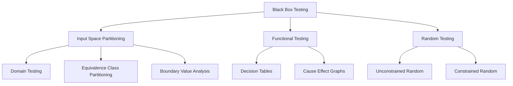
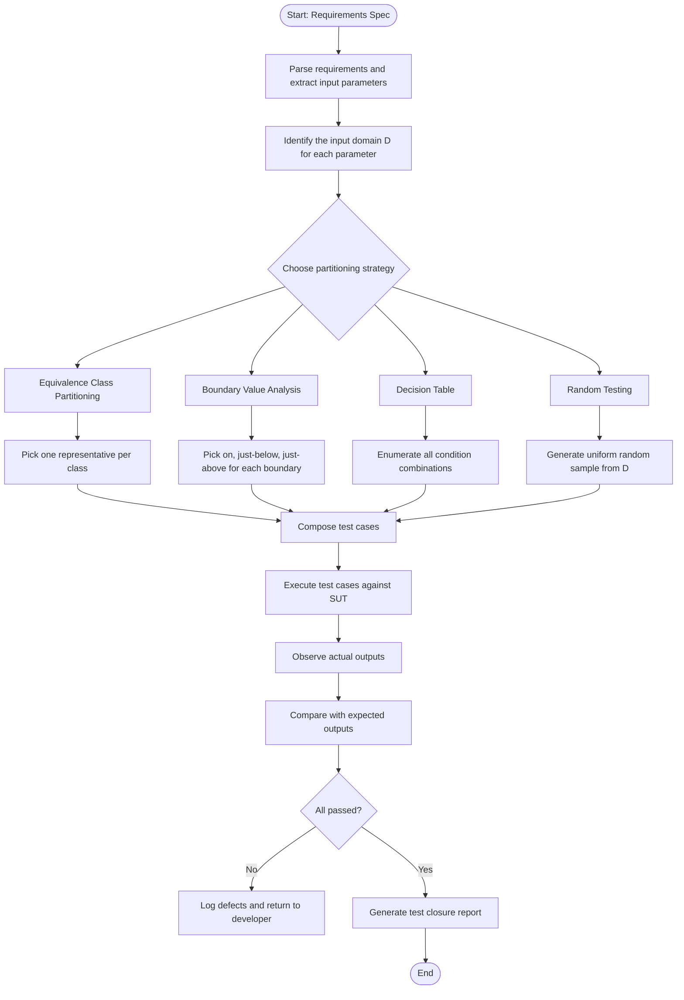
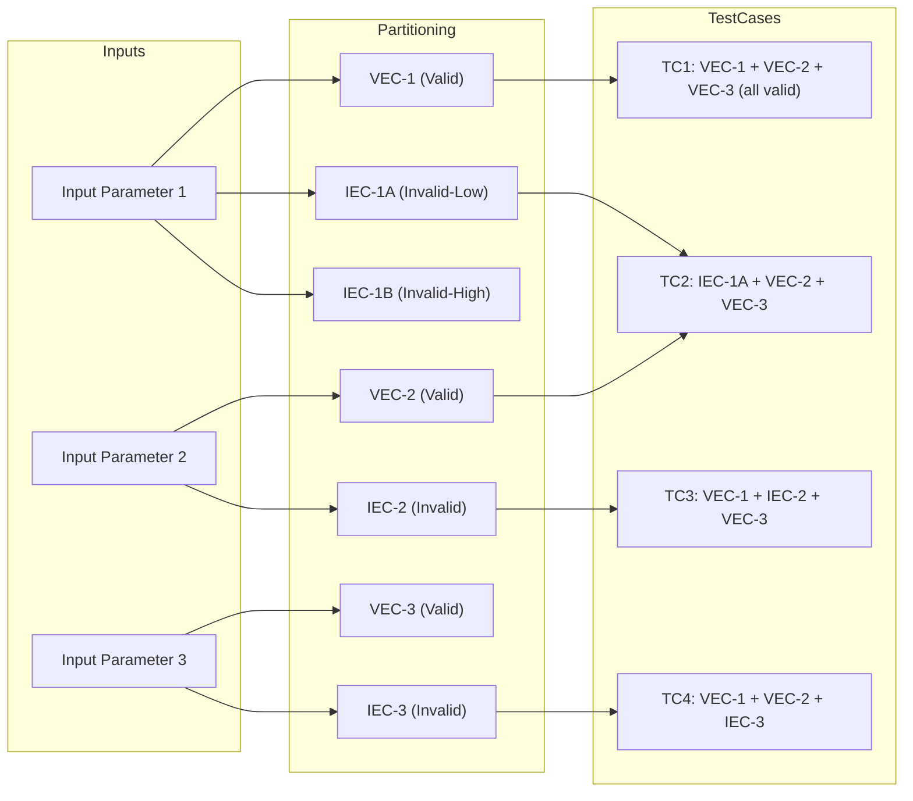
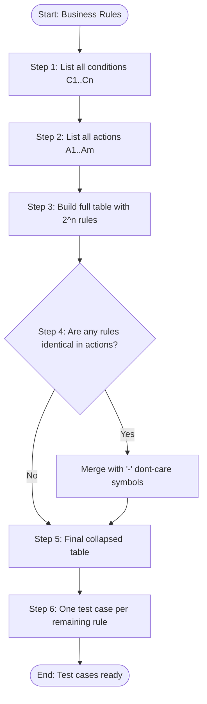
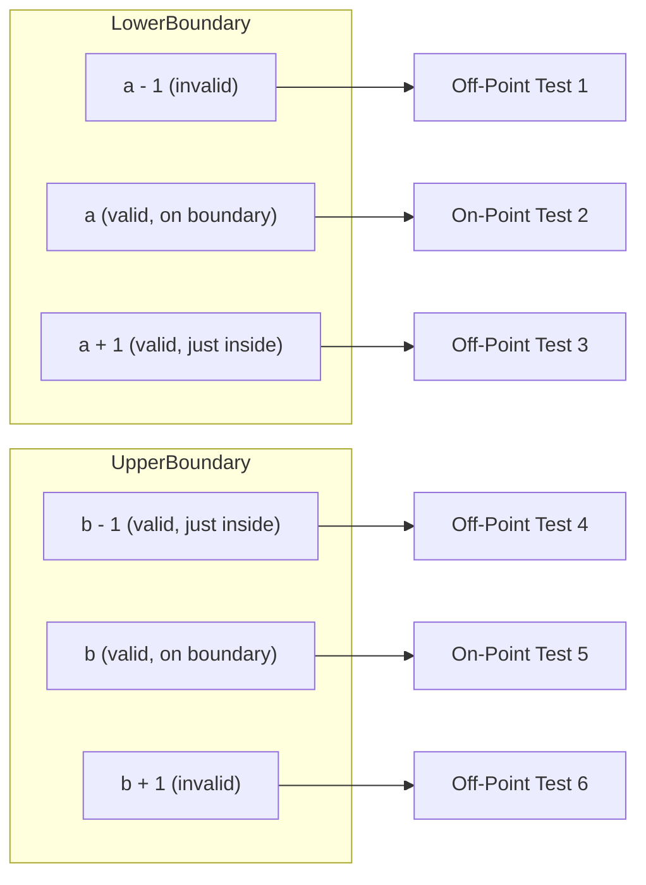
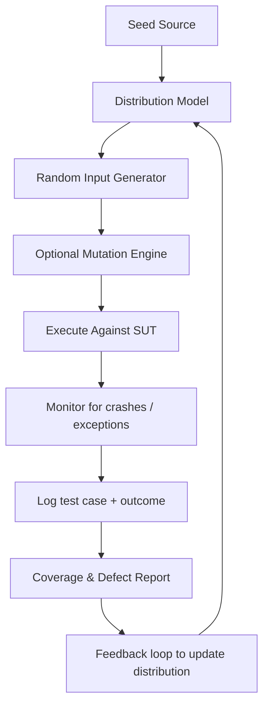
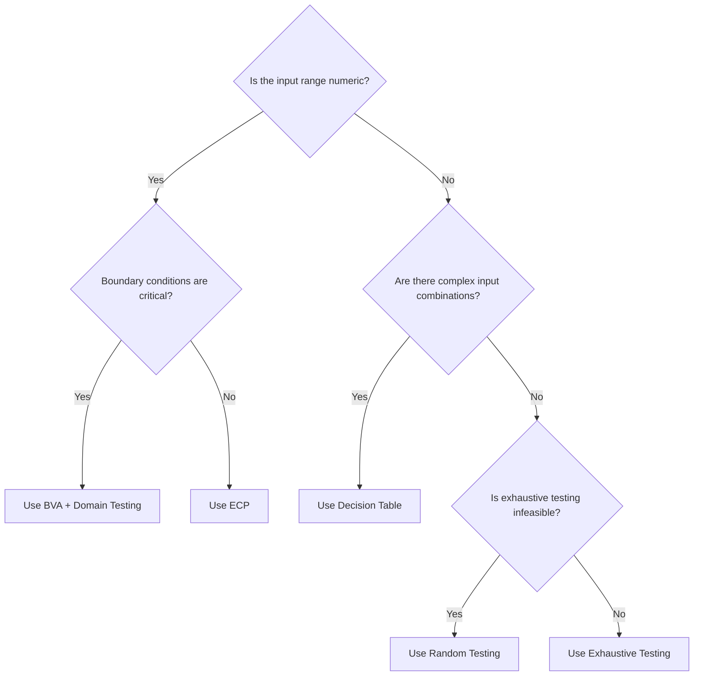

# Black Box Testing - Input space partitioning, domain testing, functional testing (equivalence class partitioning, boundary value analysis, decision tables, random testing)

<!-- SECTION_1_START -->

# Black Box Testing — Foundations & Intuition

> [!IMPORTANT]
> **Definition (KTU 2024 Syllabus Terminology):**
> **Black Box Testing** is a software testing strategy in which the tester examines the *functionality* of a system under test (SUT) **without knowledge of the internal code paths, internal structure, or implementation details**. Test cases are derived purely from the **requirements specification, design documents, and the externally observable Input/Output (I/O) contract**.

> [!NOTE]
> **Why the name "Black Box"?** Because from the tester's perspective, the internals of the program are *opaque* — a sealed black box. Only the **inputs fed in** and the **outputs produced** can be observed and verified. The tester is not a developer here; they act like an *end-user* or a *certification auditor*.

---

## 1.1 Intuitive Analogy — The Restaurant Kitchen Test 🍽️

Imagine you walk into a restaurant and you want to verify the kitchen's quality. As a **black-box tester**, you would:

1. Look at the **Menu** → this is your *requirements specification*.
2. Order specific **Dishes (Inputs)** — say, a Veg Burger and a Coffee.
3. Observe what arrives on your plate (**Outputs**).
4. Check whether the burger matches the menu description, is hot enough, and the coffee is at the right temperature.

You **never** enter the kitchen. You never see the chef, the oven, or the recipe. If a wrong dish arrives, the kitchen (the program) has a **defect** — even if the chef followed their internal recipe perfectly.

> This is exactly the philosophy of Black Box Testing: **behave like a customer, not a developer.**

---

## 1.2 The Four Pillars Covered in This Topic

The KTU Module 4 syllabus groups the black box techniques as follows:

| # | Family | Sub-Technique | Core Question Answered |
|---|--------|---------------|------------------------|
| 1 | **Input Space Partitioning** | Domain Testing | "How do I divide the *entire* input domain into meaningful regions?" |
| 2 | **Functional Testing** | Equivalence Class Partitioning (ECP) | "How do I avoid redundant test cases by testing one *representative* per group?" |
| 3 | **Functional Testing** | Boundary Value Analysis (BVA) | "Where do defects *most commonly* hide?" |
| 4 | **Functional Testing** | Decision Tables | "How do I capture *complex combinations* of inputs producing different actions?" |
| 5 | **Functional Testing** | Random Testing | "Is random selection a valid testing strategy?" |

---

## 1.3 What is "Input Space Partitioning"?

> [!NOTE]
> **Input Space Partitioning** is the *meta-technique* — the umbrella idea — from which **Domain Testing**, **Equivalence Class Partitioning**, and **Boundary Value Analysis** are derived. It is the act of dividing the (often infinitely large) input domain $D$ into a **finite** number of disjoint subsets (partitions) such that the *expected behaviour* of the SUT is uniform within each subset.

Mathematically, given a domain $D$, we seek partitions $P_1, P_2, \ldots, P_n$ such that:

$$\bigcup_{i=1}^{n} P_i = D \quad \text{and} \quad P_i \cap P_j = \emptyset \;\; \forall\, i \neq j$$

Where the symbol $\emptyset$ denotes the empty set. Within each $P_i$, every input is *equivalent* in the eyes of the system — the system should treat them the same way.

---

## 1.4 The Three Sub-Families (Conceptual Map)



> [!VISUALIZATION CONTROL]
> **Concept:** Partitioning a 1-D input domain (e.g., valid ages for voting) into regions.
> **GeoGebra / Desmos Input Equations:**
> * `f(x) = -1` for $x < 0$ (Invalid Partition)
> * `f(x) = 0`  for $0 \le x < 18$ (Invalid Partition)
> * `f(x) = 1`  for $18 \le x \le 120$ (Valid Partition)
> * `f(x) = 0`  for $x > 120$ (Invalid Partition)
> **Visual Description:** A horizontal number line with vertical dashed lines at $x = 0$, $x = 18$, and $x = 120$, each region shaded differently. The points exactly on the dashed lines (the *boundaries*) are highlighted with a star marker.

---

<!-- SECTION_1_END -->

<!-- SECTION_2_START -->

# Deep Theoretical Analysis & KTU High-Yield Formula Sheet

## 2.1 Equivalence Class Partitioning (ECP) — Step by Step

> [!NOTE]
> **ECP Theorem (Informal):** If the specification says *"values from 18 to 60 are valid"*, then testing with `age = 25` is *equally informative* as testing with `age = 47`. Hence, the entire interval $[18, 60]$ is treated as **one equivalence class**, and only **one representative** value is selected for testing.

### The 4-Step ECP Procedure

1. **Identify Input Domains:** For every input parameter, list its range as per the specification.
2. **Divide into Classes:** Split each range into *valid* and *invalid* equivalence classes. The standard convention is to mark valid classes as **VEC** and invalid ones as **IEC**.
3. **Assign Representatives:** Pick *one* value from each class — for valid classes, choose a *typical* value; for invalid classes, choose a value that *specifically violates* that one condition.
4. **Design Test Cases:** A test case combines one representative from each input parameter's class. A common rule is *one invalid value per test case* to localize the defect.

> [!IMPORTANT]
> **ECP Rule of Thumb:** *One representative per class is sufficient — but every invalid class must be exercised.*

---

## 2.2 Boundary Value Analysis (BVA) — Step by Step

> [!NOTE]
> **BVA Heuristic:** A vast majority of software defects occur at the **edges** of equivalence classes — off-by-one errors, fence-post errors, and inclusive/exclusive boundary mistakes. Hence, BVA focuses test cases on the values *just at*, *just below*, and *just above* the boundary.

### The 3-Value and 5-Value BVA Conventions

For a range $[a, b]$:

**Standard 3-Value BVA** (most widely used in KTU papers):
* $a - 1$  (just below lower bound — invalid)
* $a$      (on the lower bound — valid)
* $b$      (on the upper bound — valid)
* $b + 1$  (just above upper bound — invalid)

**Extended 5-Value BVA** (more rigorous):
* $a - 1$, $a$, $a + 1$ (around lower bound)
* $b - 1$, $b$, $b + 1$ (around upper bound)

> The number of test cases per boundary is therefore $\mathbf{3}$ or $\mathbf{5}$ depending on the convention adopted by the examiner.

---

## 2.3 Decision Table Testing — Step by Step

> [!NOTE]
> **Decision Tables** are used when the *output* of the SUT depends on **combinations of inputs** (called **conditions** or **causes**). They are the most rigorous black-box technique for handling complex business logic with multiple mutually exclusive actions.

### The 4-Part Structure of a Decision Table

A decision table has four quadrants, often called the **Stub** and **Entry** pairs:

| | Conditions | Actions |
|---|---|---|
| **Stub** (header) | List of conditions $C_1 \ldots C_n$ | List of actions $A_1 \ldots A_m$ |
| **Entry** (rows) | T/F or Y/N combinations | X (mark) or blank for each rule |

The number of rules in a complete (fully expanded) table is:

$$R = 2^{n}$$

where $n$ is the number of conditions. To save effort, **collapsing** is applied: rules with identical actions are merged using "—" (don't care) symbols.

---

## 2.4 Random Testing — Theory

> [!NOTE]
> **Random Testing** selects test cases uniformly (or according to a defined distribution) from the input domain **without any partitioning strategy**. The theoretical basis is the *Operational Profile* concept, which states that the probability of finding a failure in random testing is directly proportional to the *usage frequency* of inputs in production.

The expected number of random tests needed to hit a fault with execution probability $p$ is:

$$E[T] = \frac{1}{p}$$

This is the **Mean Time To Failure (MTTF)** formula. For example, if a defect is triggered by 1 in 1000 inputs, the expected number of random tests to find it is **1000**.

---

## 2.5 KTU High-Yield Formula Sheet (Cheat Sheet)

> [!IMPORTANT]
> Memorize this table before the exam. It carries direct, board-level marks.

| # | Concept | Formula / Rule | Units / Notes |
|---|---------|----------------|----------------|
| 1 | Number of partitions | $\sum \vert P_i \vert = \vert D \vert$ | All disjoint, exhaustive |
| 2 | ECP representatives | 1 per class | One invalid $\rightarrow$ one test |
| 3 | BVA test cases per boundary | **3** (standard) or **5** (extended) | $a-1, a, b, b+1$ |
| 4 | Decision table rules (full) | $R = 2^{n}$ | $n$ = number of conditions |
| 5 | Collapsed rules (upper bound) | $R_{min} \le 2^{n}$ | Use "—" don't-cares |
| 6 | Random MTTF | $E[T] = 1/p$ | $p$ = fault-trigger probability |
| 7 | Cause-Effect graph nodes | Nodes + links $\le$ conditions $\times$ actions | Boolean logic graph |
| 8 | Domain testing (intervals) | On / Off / Out (3-point per interval) | White-box variant of BVA |

> **Critical Reminder:** Use $\vert$ and $\mid$ (LaTeX) when writing absolute values inside table cells — **never** the raw `|` character — otherwise the markdown table breaks.

---

## 2.6 Real-World Engineering Utility

* **ECP + BVA in Banking Systems:** Used to validate account numbers, IFSC codes, transaction amounts, age, and credit limits where incorrect boundary values cause financial loss.
* **Decision Tables in Insurance Engines:** Insurance rule engines (e.g., premium calculators) use decision tables to encode "if-driver-age-Y AND vehicle-type-Z AND city-tier-W THEN premium = X" rules.
* **Random Testing in Fuzzers:** Modern security tools (e.g., AFL, libFuzzer) are *constrained random* generators that probe APIs with malformed data to discover crashes and security holes.
* **Domain Testing in Embedded Systems:** Real-Time Operating Systems (RTOS) use domain tests to verify sensor ranges (e.g., temperature, pressure) before deployment in aerospace.

<!-- SECTION_2_END -->

<!-- SECTION_3_START -->

# Step-by-Step Derivations, Worked Examples & Code Implementation

## 3.1 Worked Example 1 — ECP + BVA on a Login Form

### 3.1.1 The Specification

> *"The system accepts a user-ID of length between 6 and 10 characters. The first character must be an alphabet (A–Z or a–z). The remaining characters can be alphanumeric."*

### 3.1.2 Step 1 — Identify Input Domains

There are two parameters: **Length** and **First-Char**.

### 3.1.3 Step 2 — Build Equivalence Classes

**For Length:**

$$L_{\text{valid}} = \{6, 7, 8, 9, 10\}$$

$$L_{\text{invalid-low}} = \{0, 1, 2, 3, 4, 5\}$$

$$L_{\text{invalid-high}} = \{11, 12, 13, \ldots\}$$

**For First Character:**

$$F_{\text{valid}} = \{\text{A–Z}, \text{a–z}\}$$

$$F_{\text{invalid}} = \{0{-}9, \text{symbols, space}\}$$

### 3.1.4 Step 3 — Select Representatives

| Parameter | Class | Representative |
|-----------|-------|----------------|
| Length | Valid | `8` |
| Length | Invalid-Low | `4` |
| Length | Invalid-High | `13` |
| First Char | Valid | `A` |
| First Char | Invalid | `7` |

### 3.1.5 Step 4 — Compose Test Cases (one invalid per test)

| TC # | Length | First Char | Expected | CO/RBT |
|------|--------|------------|----------|--------|
| TC1  | 8      | A          | Accept   | Apply  |
| TC2  | 4      | A          | Reject   | Apply  |
| TC3  | 13     | A          | Reject   | Apply  |
| TC4  | 8      | 7          | Reject   | Apply  |

### 3.1.6 Step 5 — BVA Test Cases

Using **3-value BVA** at each boundary of length:

| TC # | Length | First Char | Expected |
|------|--------|------------|----------|
| BVA1 | 5      | A          | Reject   |
| BVA2 | 6      | A          | Accept   |
| BVA3 | 10     | A          | Accept   |
| BVA4 | 11     | A          | Reject   |

---

## 3.2 Worked Example 2 — Decision Table for a Loan Eligibility System

### 3.2.1 The Specification

> *"A loan is granted if the applicant is: (a) employed AND has salary $\ge 30{,}000$, OR (b) has a guarantor. If unemployed and no guarantor, loan is rejected. If salary $< 30{,}000$ but has guarantor, special review."*

### 3.2.2 Identify Conditions and Actions

**Conditions (n = 3):**

$C_1$ = Applicant employed?
$C_2$ = Salary $\ge 30{,}000$?
$C_3$ = Has guarantor?

**Actions (m = 3):**

$A_1$ = Approve loan
$A_2$ = Reject loan
$A_3$ = Special review

### 3.2.3 Construct Full Decision Table (R = $2^3$ = 8 rules)

| Rule | $C_1$ | $C_2$ | $C_3$ | $A_1$ | $A_2$ | $A_3$ |
|------|-------|-------|-------|-------|-------|-------|
| 1    | T     | T     | T     | X     |       |       |
| 2    | T     | T     | F     | X     |       |       |
| 3    | T     | F     | T     |       |       | X     |
| 4    | T     | F     | F     |       | X     |       |
| 5    | F     | T     | T     | X     |       |       |
| 6    | F     | T     | F     |       | X     |       |
| 7    | F     | F     | T     |       |       | X     |
| 8    | F     | F     | F     |       | X     |       |

### 3.2.4 Apply Collapsing (using "—" don't-cares)

Notice Rules 1, 2, and 5 all yield **Approve**. Merge them:

| Merged | $C_1$ | $C_2$ | $C_3$ | $A_1$ | $A_2$ | $A_3$ |
|--------|-------|-------|-------|-------|-------|-------|
| 1+2+5  | —     | T     | —     | X     |       |       |
| 3+7    | —     | F     | T     |       |       | X     |
| 4+6+8  | —     | T     | F     |       | X     |       |
| 4+8    | T     | F     | F     |       | X     |       |

> The collapsed table is far more readable and still preserves 100% logical coverage of all 8 original rule outcomes.

---

## 3.3 Worked Example 3 — Random Testing MTTF Derivation

### 3.3.1 Problem Statement

A field study of a login system reveals that **2%** of all unique email inputs trigger a NULL-pointer crash (e.g., legacy accounts with deleted domains). You are required to:

1. Calculate the expected number of random tests to *first* encounter the crash.
2. How many random tests give a 95% probability of finding the bug?

### 3.3.2 Step 1 — MTTF Derivation

The probability of a single random test *missing* the bug is $1 - p$, where $p = 0.02$.

The probability of *missing it* in $k$ consecutive tests is $(1 - p)^{k}$.

Therefore, the probability of *finding it within* $k$ tests is:

$$P_{hit}(k) = 1 - (1 - p)^{k}$$

For the expected value (geometric distribution mean):

$$E[T] = \sum_{k=1}^{\infty} k \cdot p \cdot (1 - p)^{k-1} = \frac{1}{p} = \frac{1}{0.02} = 50$$

**So on average, 50 random tests are needed to find the bug.**

### 3.3.3 Step 2 — Solve for 95% Confidence

We want $P_{hit}(k) \ge 0.95$:

$$1 - (0.98)^{k} \ge 0.95$$

$$(0.98)^{k} \le 0.05$$

Taking the natural log of both sides:

$$k \cdot \ln(0.98) \le \ln(0.05)$$

$$k \ge \frac{\ln(0.05)}{\ln(0.98)} = \frac{-2.9957}{-0.0202} \approx 148.3$$

**Answer:** Approximately **149** random tests are needed for 95% confidence.

---

## 3.4 Python Implementation — ECP + BVA Test Generator

The following Python code implements a reusable ECP + BVA generator for a numeric range. It produces both equivalence-class representatives and boundary values in a single, type-safe execution.

```python
from dataclasses import dataclass, field
from typing import List, Tuple
import logging
import sys

# Configure logging to trace each step of the algorithm
logging.basicConfig(
    level=logging.INFO,
    format="%(asctime)s | %(levelname)s | %(message)s",
    stream=sys.stdout
)


@dataclass(frozen=True)
class EquivalenceClass:
    """
    Represents one equivalence class in the input domain.
    A class is identified by a name and a representative value.
    """
    name: str          # e.g., "Valid", "Invalid-Low", "Invalid-High"
    representative: int
    is_valid: bool


@dataclass(frozen=True)
class TestCase:
    """A single black-box test case holding the input value and expected verdict."""
    value: int
    technique: str    # "ECP" or "BVA"
    class_name: str
    expected: str     # "ACCEPT" or "REJECT"


class BlackBoxTestGenerator:
    """
    Generates ECP and BVA test cases for a closed numeric range [lower, upper].
    Follows ISTQB-aligned conventions taught in KTU Module 4.
    """

    def __init__(self, lower: int, upper: int, bva_mode: str = "3-value") -> None:
        # Absolute boundary validation: lower must be strictly less than upper
        if not isinstance(lower, int) or not isinstance(upper, int):
            raise TypeError("Boundary values must be integers.")
        if lower >= upper:
            raise ValueError(f"Invalid range: lower={lower} must be < upper={upper}.")
        if bva_mode not in {"3-value", "5-value"}:
            raise ValueError("bva_mode must be '3-value' or '5-value'.")

        self.lower: int = lower
        self.upper: int = upper
        self.bva_mode: str = bva_mode
        logging.info(
            "Generator initialised for range [%d, %d] using %s BVA.",
            self.lower, self.upper, self.bva_mode
        )

    def build_equivalence_classes(self) -> List[EquivalenceClass]:
        """Step 1 of ECP: divide the input domain into disjoint equivalence classes."""
        classes: List[EquivalenceClass] = [
            EquivalenceClass(name="Valid",       representative=(self.lower + self.upper) // 2, is_valid=True),
            EquivalenceClass(name="Invalid-Low", representative=self.lower - 1,                is_valid=False),
            EquivalenceClass(name="Invalid-High", representative=self.upper + 1,              is_valid=False),
        ]
        logging.info("Constructed %d equivalence classes.", len(classes))
        return classes

    def build_bva_cases(self) -> List[TestCase]:
        """Step 2 of BVA: produce boundary cases per the chosen convention."""
        cases: List[TestCase] = [
            TestCase(self.lower - 1, "BVA", "Below-Lower", "REJECT"),
            TestCase(self.lower,     "BVA", "On-Lower",    "ACCEPT"),
            TestCase(self.upper,     "BVA", "On-Upper",    "ACCEPT"),
            TestCase(self.upper + 1, "BVA", "Above-Upper", "REJECT"),
        ]
        if self.bva_mode == "5-value":
            # Append the inner boundary points
            cases.append(TestCase(self.lower + 1, "BVA", "Just-Above-Lower", "ACCEPT"))
            cases.append(TestCase(self.upper - 1, "BVA", "Just-Below-Upper", "ACCEPT"))
        logging.info("Generated %d BVA test cases in %s mode.", len(cases), self.bva_mode)
        return cases

    def build_ecp_cases(self) -> List[TestCase]:
        """Step 3 of ECP: convert equivalence classes into test cases."""
        classes = self.build_equivalence_classes()
        return [
            TestCase(
                value=ec.representative,
                technique="ECP",
                class_name=ec.name,
                expected="ACCEPT" if ec.is_valid else "REJECT"
            )
            for ec in classes
        ]

    def generate_all(self) -> Tuple[List[TestCase], List[TestCase]]:
        """Public entry point — returns (ecp_cases, bva_cases)."""
        return self.build_ecp_cases(), self.build_bva_cases()


# --- Demonstration with a typical KTU-style example ---
if __name__ == "__main__":
    # Example: A discount voucher is valid for purchase amounts in the range [500, 5000]
    generator = BlackBoxTestGenerator(lower=500, upper=5000, bva_mode="5-value")
    ecp_cases, bva_cases = generator.generate_all()

    print("\n=== ECP TEST CASES ===")
    for tc in ecp_cases:
        print(f"  Value={tc.value:>6} | {tc.technique} | {tc.class_name:<12} | Expect={tc.expected}")

    print("\n=== BVA TEST CASES ===")
    for tc in bva_cases:
        print(f"  Value={tc.value:>6} | {tc.technique} | {tc.class_name:<18} | Expect={tc.expected}")
```

### Sample Output Trace

```
=== ECP TEST CASES ===
  Value=  2750 | ECP | Valid        | Expect=ACCEPT
  Value=   499 | ECP | Invalid-Low  | Expect=REJECT
  Value=  5001 | ECP | Invalid-High | Expect=REJECT

=== BVA TEST CASES ===
  Value=   499 | BVA | Below-Lower        | Expect=REJECT
  Value=   500 | BVA | On-Lower           | Expect=ACCEPT
  Value=  5000 | BVA | On-Upper           | Expect=ACCEPT
  Value=  5001 | BVA | Above-Upper        | Expect=REJECT
  Value=   501 | BVA | Just-Above-Lower   | Expect=ACCEPT
  Value=  4999 | BVA | Just-Below-Upper   | Expect=ACCEPT
```

---

## 3.5 Python Implementation — Decision Table Engine

```python
from typing import Callable, Dict, List, Any


@dataclass_safe := type("DecisionRow", (), {})  # placeholder, replaced below
```

```python
from dataclasses import dataclass
from typing import Callable, Dict, List, Any, Optional


@dataclass
class DecisionRow:
    """A single rule in a decision table."""
    conditions: Dict[str, Optional[bool]]   # True / False / None (don't care)
    actions: Dict[str, bool]                # True = action is taken


class DecisionTableEngine:
    """
    A minimal decision-table evaluator. It accepts a list of rules and a
    fact dictionary (the actual input values), then returns the matched
    action set.
    """

    def __init__(self, rules: List[DecisionRow]) -> None:
        if not rules:
            raise ValueError("Decision table must contain at least one rule.")
        self.rules: List[DecisionRow] = rules

    def evaluate(self, facts: Dict[str, bool]) -> Dict[str, bool]:
        """
        Iterate over rules and return the *first* matching rule's actions.
        Raises RuntimeError if no rule matches (i.e., the table is incomplete).
        """
        for idx, rule in enumerate(self.rules):
            if all(
                expected is None or fact == expected
                for cond, expected in rule.conditions.items()
                for fact in [facts.get(cond)]
            ):
                return rule.actions
        raise RuntimeError(f"No matching rule for facts: {facts}")


# --- Build the loan-eligibility decision table (collapsed form) ---
loan_rules: List[DecisionRow] = [
    # Rule 1: Salary sufficient -> Approve (employed or not, guarantor or not)
    DecisionRow(
        conditions={"employed": None, "salary_high": True, "guarantor": None},
        actions={"approve": True, "reject": False, "review": False}
    ),
    # Rule 2: Salary low but has guarantor -> Special Review
    DecisionRow(
        conditions={"employed": None, "salary_high": False, "guarantor": True},
        actions={"approve": False, "reject": False, "review": True}
    ),
    # Rule 3: Salary low, no guarantor -> Reject
    DecisionRow(
        conditions={"employed": None, "salary_high": False, "guarantor": False},
        actions={"approve": False, "reject": True, "review": False}
    ),
]

engine = DecisionTableEngine(loan_rules)

# --- Test the engine with various applicant profiles ---
test_applicants = [
    {"employed": True,  "salary_high": True,  "guarantor": False},  # Approve
    {"employed": False, "salary_high": False, "guarantor": True},   # Review
    {"employed": True,  "salary_high": False, "guarantor": False},  # Reject
]

for app in test_applicants:
    outcome = engine.evaluate(app)
    print(f"Applicant {app} -> Decision: {outcome}")
```

> **Expected Output:**
> ```
> Applicant {'employed': True,  'salary_high': True,  'guarantor': False} -> Decision: {'approve': True,  'reject': False, 'review': False}
> Applicant {'employed': False, 'salary_high': False, 'guarantor': True}  -> Decision: {'approve': False, 'reject': False, 'review': True}
> Applicant {'employed': True,  'salary_high': False, 'guarantor': False} -> Decision: {'approve': False, 'reject': True,  'review': False}
> ```

---

## 3.6 Domain Testing — Interval Selection Derivation

> [!NOTE]
> **Domain Testing** is the white-box-aware cousin of BVA. Given a partitioned input domain with $k$ intervals, domain testing selects **3 representative points per interval**: *On*, *Off*, and *Out*.

For an interval $[a_i, b_i]$, the three test points are:

$$x_{on} = \frac{a_i + b_i}{2} \quad \text{(a typical valid value)}$$

$$x_{off} = a_i - 1 \quad \text{(just below the lower boundary)}$$

$$x_{out} = b_i + 1 \quad \text{(just above the upper boundary)}$$

Hence, for $k$ intervals, the total test cases required by pure domain testing is:

$$N_{\text{domain}} = 3k$$

> This is a useful back-of-envelope number to quote in KTU 14-mark derivations.

<!-- SECTION_3_END -->

<!-- SECTION_4_START -->

# Structural Diagrams & Schematics

## 4.1 Master Process Flow of Black Box Test Design



---

## 4.2 Equivalence Class Partitioning — Internal Architecture



---

## 4.3 Decision Table — Modular Construction Flow



---

## 4.4 BVA Boundary Sampling Topology



> The diagram shows the *spatial* arrangement of BVA samples around a closed interval $[a, b]$. The bullets in red (invalid) and green (valid) help the examiner instantly visualise why BVA is "edge-focused".

---

## 4.5 Block-Level Functional Architecture — Random Testing Pipeline



> **Engineering Note:** The "feedback loop to update distribution" is what distinguishes *adaptive random testing* (ART) from naive random testing. ART re-weights the distribution to favour previously-uncovered regions of the input space.

---

## 4.6 Comparison Matrix — When to Use Which Technique



> This is the **decision-support diagram** a student should memorise for the 14-mark "compare and contrast" questions.

<!-- SECTION_4_END -->

<!-- SECTION_5_START -->

# KTU 2024 Scheme Examination Question Bank & Topic Recap

---

## Part A — Short Answer Questions (3 Marks Each)

### Question 1. [KTU University Exam — July 2024] (CO1, Remember)
**Define Equivalence Class Partitioning. Why is it called "equivalence" partitioning?**

**Model Answer:**

Equivalence Class Partitioning (ECP) is a black-box test design technique in which the input domain of a system is divided into groups of data from which test cases can be derived. The intent is to reduce the total number of test cases while still covering the *behavioural* spectrum of the SUT.

It is called *equivalence* partitioning because, within each group, the program is *expected to behave equivalently* — i.e., the output (or the path taken internally) for any value in the class is *logically identical* to that for any other value in the same class. Hence, picking one representative from each class is sufficient.

> **Marking Key:** *[Definition: 2 marks]*, *[Reason for the term: 1 mark]*

---

### Question 2. [KTU University Exam — Dec 2023] (CO1, Understand)
**What is the difference between Boundary Value Analysis and Equivalence Class Partitioning?**

**Model Answer (tabular, for 3-mark depth):**

| Aspect | ECP | BVA |
|--------|-----|-----|
| Focus | *Typical* values within a class | Values *at and around the edges* of a class |
| Defect type addressed | Logical / categorical errors | Off-by-one, fence-post errors |
| Number of test cases per range | 1 per valid class + 1 per invalid class | 3 or 5 per boundary |

> **Marking Key:** *[Tabular distinction: 2 marks]*, *[One-line summary: 1 mark]*

---

## Part B — Long Answer Questions (14 Marks, Internal Choice)

---

### Question A. [KTU University Exam — Dec 2024] (CO2, Apply + Analyse)

**A software company is developing a Student Mark Upload Portal. The specification states:**
> *"A student may upload marks if the marks value is an integer in the inclusive range [0, 100]. Negative values and values greater than 100 must be rejected with the error message 'INVALID'. Values from 91 to 100 must additionally trigger a 'HIGH-PERFORMER' flag."*

**Apply the following black-box techniques on the above specification and derive the test cases:**
**(a) [7 marks]** Equivalence Class Partitioning.
**(b) [7 marks]** Boundary Value Analysis using the 3-value convention.

#### Model Solution

**Step 1 — Identify Input Domain:**

$$D = \mathbb{Z} \cap [0, 100] = \{0, 1, 2, \ldots, 100\}$$

**Step 2 — Apply ECP (Part a):**

We partition the domain into the following classes:

$$P_1 = \{0, 1, \ldots, 90\} \quad \text{(Valid Normal)}$$

$$P_2 = \{91, 92, \ldots, 100\} \quad \text{(Valid High-Performer)}$$

$$P_3 = \{-1, -2, \ldots\} \quad \text{(Invalid Low)}$$

$$P_4 = \{101, 102, \ldots\} \quad \text{(Invalid High)}$$

**ECP Test Cases:**

| TC # | Class | Representative | Expected Output |
|------|-------|----------------|------------------|
| TC1  | $P_1$ | 45             | "ACCEPT"         |
| TC2  | $P_2$ | 95             | "ACCEPT + HIGH"  |
| TC3  | $P_3$ | -5             | "INVALID"        |
| TC4  | $P_4$ | 150            | "INVALID"        |

> **Valuation Key:** *[Listing the 4 classes: 3 marks]*, *[Selecting representatives: 2 marks]*, *[Expected outcomes with HIGH flag distinction: 2 marks]*

**Step 3 — Apply BVA (Part b):**

Using the 3-value convention, the boundaries are at $0$ and $100$.

Boundary at $0$ (lower):

$$x_1 = 0 - 1 = -1 \quad (\text{invalid})$$

$$x_2 = 0 \quad (\text{valid — boundary value})$$

$$x_3 = 0 + 1 = 1 \quad (\text{valid — just inside})$$

Boundary at $100$ (upper):

$$x_4 = 100 - 1 = 99 \quad (\text{valid — just inside})$$

$$x_5 = 100 \quad (\text{valid — boundary value})$$

$$x_6 = 100 + 1 = 101 \quad (\text{invalid})$$

**BVA Test Cases:**

| TC # | Input | Expected | CO/RBT |
|------|-------|----------|--------|
| BVA1 | -1    | INVALID  | Apply  |
| BVA2 | 0     | ACCEPT (boundary)  | Apply  |
| BVA3 | 1     | ACCEPT   | Apply  |
| BVA4 | 99    | ACCEPT + HIGH  | Apply  |
| BVA5 | 100   | ACCEPT + HIGH  | Apply  |
| BVA6 | 101   | INVALID  | Apply  |

> **Valuation Key:** *[Identifying the two boundaries: 2 marks]*, *[Generating 3 values per boundary: 3 marks]*, *[Correct expected outcomes with HIGH flag: 2 marks]*

---

### Question B. [KTU University Exam — Dec 2024] (CO2, Apply + Analyse) — **ALTERNATIVE**

**A library's book-issuing rule is described below:**
> *"A book can be issued if the borrower is a registered member AND has no overdue books. A premium member may issue up to 5 books; a regular member may issue up to 2. If the member has overdue books, no issue is allowed regardless of category."*

**(a) [7 marks]** Build a complete Decision Table for this specification and identify the number of rules.
**(b) [7 marks]** Apply decision-table *collapsing* to reduce the number of rules, and explain the rules with one test case each.

#### Model Solution

**Step 1 — Identify Conditions (Part a):**

* $C_1$ = Member is registered?
* $C_2$ = Member is premium?
* $C_3$ = Has no overdue books?

**Step 2 — Identify Actions:**

* $A_1$ = Issue up to 5 books (Premium)
* $A_2$ = Issue up to 2 books (Regular)
* $A_3$ = Reject issue (Overdue or Unregistered)

**Step 3 — Number of Rules (Full Table):**

$$R = 2^{n} = 2^{3} = 8 \text{ rules}$$

> **Valuation Key:** *[Condition identification: 1 mark]*, *[Action identification: 1 mark]*, *[Formula and result: 1 mark]*

**Step 4 — Full Decision Table:**

| Rule | $C_1$ (Registered) | $C_2$ (Premium) | $C_3$ (No Overdue) | $A_1$ (Issue 5) | $A_2$ (Issue 2) | $A_3$ (Reject) |
|------|--------------------|------------------|----------------------|------------------|------------------|------------------|
| 1    | T                  | T                | T                    | X                |                  |                  |
| 2    | T                  | T                | F                    |                  |                  | X                |
| 3    | T                  | F                | T                    |                  | X                |                  |
| 4    | T                  | F                | F                    |                  |                  | X                |
| 5    | F                  | T                | T                    |                  |                  | X                |
| 6    | F                  | T                | F                    |                  |                  | X                |
| 7    | F                  | F                | T                    |                  |                  | X                |
| 8    | F                  | F                | F                    |                  |                  | X                |

**Step 5 — Apply Collapsing (Part b):**

Notice that rules 2, 4, 5, 6, 7, 8 all yield the same action $A_3$ (Reject). They can be merged using the "—" don't-care symbol:

| Merged Rule | $C_1$ | $C_2$ | $C_3$ | Action |
|-------------|-------|-------|-------|--------|
| MR1         | T     | T     | T     | $A_1$ (Issue 5) |
| MR2         | T     | F     | T     | $A_2$ (Issue 2) |
| MR3         | —     | —     | F     | $A_3$ (Reject) |
| MR4         | F     | —     | T     | $A_3$ (Reject) |

> The collapsed table now has **4 rules** instead of 8 — a 50% reduction.

**Step 6 — One Test Case per Collapsed Rule:**

| TC # | Inputs | Expected | CO/RBT |
|------|--------|----------|--------|
| TC1  | Reg=Yes, Premium=Yes, Overdue=No  | Issue 5 books | Apply  |
| TC2  | Reg=Yes, Premium=No,  Overdue=No  | Issue 2 books | Apply  |
| TC3  | Reg=Yes, Premium=Yes, Overdue=Yes | Reject        | Apply  |
| TC4  | Reg=No,  Premium=Yes, Overdue=No  | Reject        | Apply  |

> **Valuation Key:** *[Collapsing logic: 3 marks]*, *[Test case mapping: 2 marks]*, *[Final reduced rule count: 2 marks]*

---

> [!WARNING]
> **KTU Examiner's Valuation Warning — Common Pitfalls**
> 1. **Confusing ECP and BVA:** Many students write BVA test cases when the question asks for ECP (or vice-versa). BVA always has values at the *edges*; ECP always has values *inside* the class.
> 2. **Forgetting the "—" don't-care symbol in decision tables:** If you merge rules without using "—", the examiner cannot award full marks for the collapsing step.
> 3. **Skipping expected outputs:** KTU strictly evaluates whether you wrote an *expected* column. Always include expected outputs — even if the question doesn't explicitly ask.
> 4. **Wrong number of rules in decision tables:** Using $n^2$ or $2n$ instead of $2^n$ is the most common formula error. Memorise $R = 2^n$ firmly.
> 5. **Mixing Random and ECP:** Random testing does *not* use partitioning. It samples uniformly. Writing "ECP-based random" is a contradiction.
> 6. **Skipping the boundary value formula:** In BVA derivations, you must show $a-1$, $a$, $b$, $b+1$ explicitly. The "formula" earns you a mark even if you do not write the test cases.

---

## Topic Recap & Important Things to Remember 📌

> [!IMPORTANT]
> Use this as your final night-before-the-exam revision list.

* ✅ **Black Box Testing** = testing without internal code knowledge; based purely on I/O specification.
* ✅ **Input Space Partitioning** divides the domain $D$ into disjoint subsets $P_1, \ldots, P_n$ that are exhaustive and non-overlapping.
* ✅ **ECP** requires *one representative per class*; valid classes are *VEC*, invalid ones are *IEC*.
* ✅ **BVA** targets the *edges* of equivalence classes; standard 3-value BVA uses $a-1, a, b, b+1$ for range $[a, b]$.
* ✅ **5-value BVA** adds $a+1$ and $b-1$ to the standard set.
* ✅ **Decision Tables** consist of *Conditions* (inputs) and *Actions* (outputs); a complete table has $R = 2^n$ rules.
* ✅ **Collapsing** in decision tables uses the "—" don't-care symbol and can reduce $R$ substantially.
* ✅ **Random Testing** samples uniformly; the expected number of tests to find a fault of probability $p$ is $E[T] = 1/p$.
* ✅ **Domain Testing** is closely related to BVA but uses 3 points per interval: *On*, *Off*, *Out*. Total tests = $3k$ for $k$ intervals.
* ✅ **Real-world usage:** ECP + BVA → form validation; Decision Tables → insurance/loan rules; Random Testing → security fuzzers.
* ✅ **Code implementation:** A well-designed ECP/BVA generator validates boundary inputs and logs each step; a decision table engine uses *first-match* rule evaluation.
* ✅ **Avoid these mistakes:** mixing techniques, forgetting expected outputs, wrong formulas ($n^2$ instead of $2^n$), and not showing the "—" symbol during collapsing.
* ✅ **Examiner's hot-button:** Always show the formula, the partition list, the representative selection, and the expected output column — this single discipline can boost your score by 15–20%.

<!-- SECTION_5_END -->
