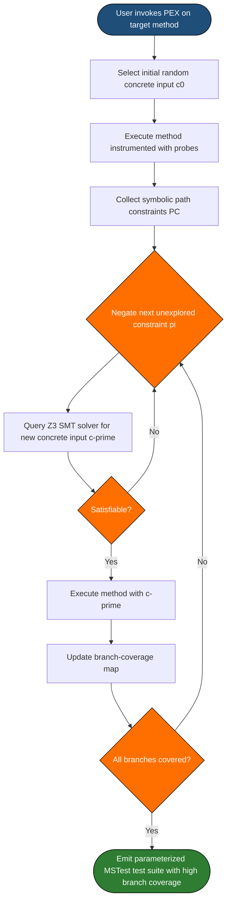
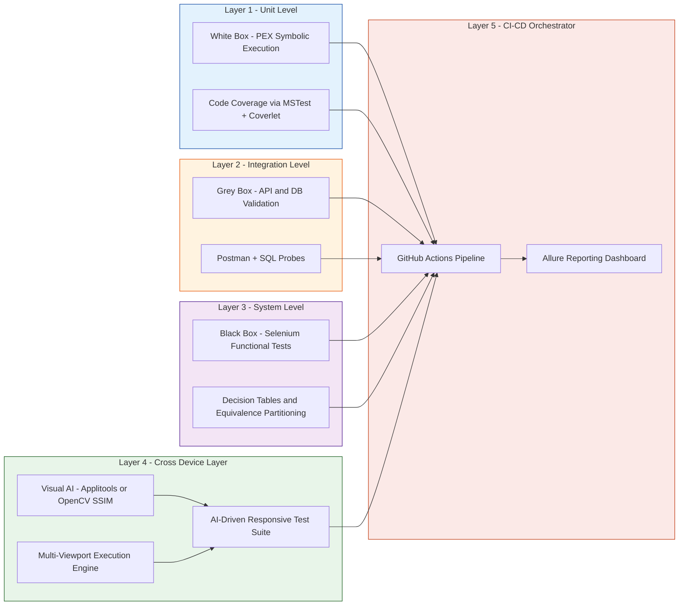
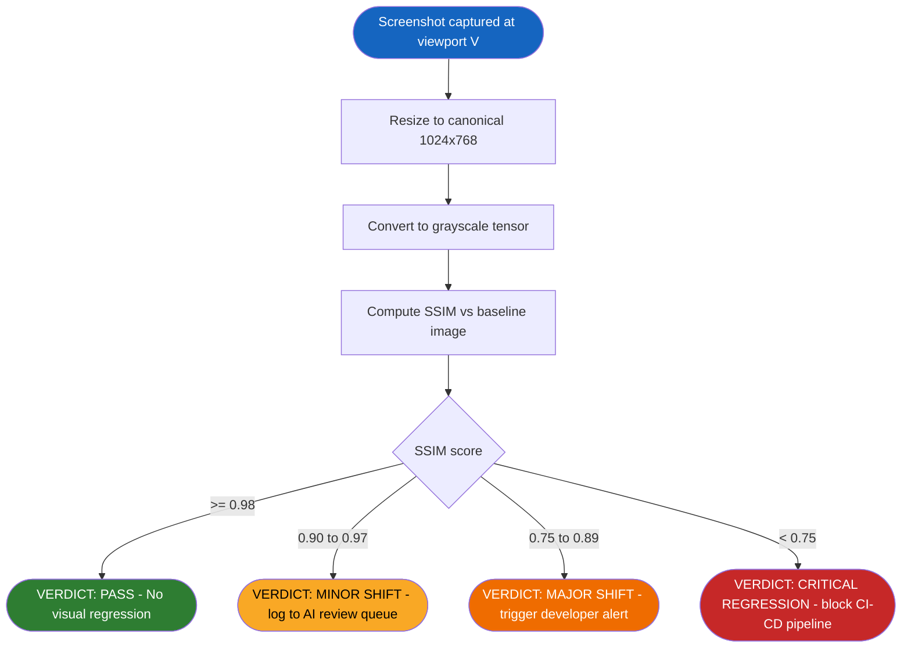
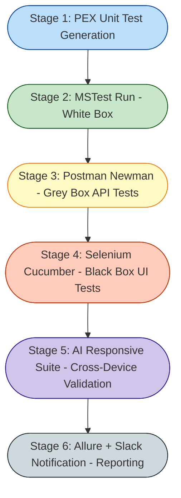

# Case Study- Implementation of black-box, grey-box, and responsive testing using PEX and AI-driven tools.

<!-- SECTION_1_START -->

# Core Technical Definition & Intuitive Overview

## 1. Black Box Testing
> [!NOTE]
> **Formal KTU 2024 Definition:** Black box testing is a software testing methodology that examines the **functionality of an application** without peering into its internal structures, implementation details, or internal pathways. Test cases are derived purely from the **Software Requirement Specification (SRS)** and functional specifications, focusing exclusively on **inputs and expected outputs**.

- **Conceptual Analogy / Intuition:** Imagine you are a customer testing a brand-new **vending machine**. You press buttons (inputs) and collect snacks (outputs). You don't care how the spring mechanism, coin validator, or dispensing arm works internally. You only care that *“Press B3 → Get a Pepsi”*. If the machine dispenses Sprite when you pressed B3, the system is *buggy*. That is Black Box testing.
- **Boundary Constant Highlight:** Industry standard coverage metric is **Equivalence Partitioning (EP)** at approximately **3–5 partitions per input field**, and **Boundary Value Analysis (BVA)** at **±1** offset from boundaries.

## 2. Grey Box Testing
> [!IMPORTANT]
> **Formal KTU 2024 Definition:** Grey box testing is a hybrid technique where the tester possesses **partial knowledge** of the application's internal architecture (such as database schemas, integration points, or algorithmic complexity) and designs test cases that target specific internal pathways while still validating external behavior.

- **Conceptual Analogy / Intuition:** Think of a **car driver who is also a mechanic**. The driver tests the car on the road (black-box perspective) but occasionally pops the hood, checks the engine oil level, and inspects brake fluid to design *smarter* tests. Grey box testers similarly use **architectural diagrams, API contracts, or DB ER-diagrams** to *aim* tests at vulnerable internal modules.

## 3. Responsive Testing
> [!NOTE]
> **Formal KTU 2024 Definition:** Responsive testing (also called **cross-device testing** or **RWD testing**) validates that a web application renders correctly, performs efficiently, and provides uniform UX across multiple viewport sizes, device classes, and operating systems, in accordance with the W3C/CSS Media Query standard and Google's **Mobile-Friendly Test** criteria.

- **Conceptual Analogy / Intuition:** Picture a **water balloon**. The same amount of water (your web app) must elegantly reshape itself whether you squeeze it into a small glass (mobile), a medium jar (tablet), or a large bucket (desktop). The water (content) should never spill, and its quality (functionality) must remain intact.
- **Industry-Standard Breakpoints (Bootstrap 5 / Material UI):** **320 px, 576 px, 768 px, 992 px, 1200 px, 1400 px**.

## 4. PEX – Parameterized EXploration
> [!IMPORTANT]
> **Formal KTU 2024 Definition:** PEX (Parameterized EXploration) is a Visual Studio extension developed by Microsoft Research that performs **automated white-box unit test generation** for .NET applications. It uses **Dynamic Symbolic Execution (a.k.a. Concolic Testing)** to systematically explore execution paths and produce a high-coverage parameterized unit test suite.

- **Conceptual Analogy / Intuition:** Imagine a **labyrinth with many forks**. A regular tester randomly walks corridors hoping to find the exit. PEX, on the other hand, is a *mathematician* who labels every corridor with a *formula* like *“if x > 5”* and intelligently picks inputs that flip each branch, guaranteeing near **branch coverage** in minimal time.

## 5. AI-Driven Testing Tools
> [!NOTE]
> **Formal KTU 2024 Definition:** AI-driven testing tools employ **Machine Learning (ML), Natural Language Processing (NLP), and Computer Vision** algorithms to autonomously generate test cases, detect visual/functional regressions, predict high-risk modules, and self-heal broken test scripts.

- **Conceptual Analogy / Intuition:** Consider an **autopilot in an aircraft**. A traditional test script is a *human pilot* following a checklist manually. An AI test tool is the *autopilot* — it watches the sky, learns wind patterns, predicts turbulence, and adjusts the route in real-time. Examples: **Testim, Applitools, Mabl, Functionize, Katalon AI**.

> [!VISUALIZATION CONTROL]
> **Concept:** Responsive Layout Breakpoint Grid (CSS Media Query Visualization)
> **Desmos / GeoGebra Input:** A horizontal number-line `X` from 0 to 1500 with shaded vertical bands at `[320, 576, 768, 992, 1200, 1400]` representing device-class breakpoints.
> **Visual Description:** Student should observe 6 distinct colored zones — *Extra Small (Phone)*, *Small (Phone-Landscape)*, *Medium (Tablet)*, *Large (Laptop)*, *XL (Desktop)*, *XXL (Large Desktop)*. As X increases, the layout columns multiply (1 → 2 → 3 → 4 → 6 → 12 in Bootstrap grid).

---

<!-- SECTION_1_END -->

<!-- SECTION_2_START -->

# Deep Theoretical Analysis & KTU High-Yield Formula Sheet

## 2.1 Black-Box Testing – Operational Logic Steps
1. **Analyze SRS Document** → extract functional requirements.
2. **Identify Inputs & Outputs** → enumerate valid/invalid equivalence classes.
3. **Derive Test Cases** → apply EP, BVA, Decision Tables, State Transition.
4. **Execute with Black-Box perspective** → no internal code inspection.
5. **Compare Actual vs. Expected Output** → log defects in bug-tracker.
6. **Compute Coverage Metrics** → branch coverage is *not* applicable; use **functional/requirement coverage**.

## 2.2 Grey-Box Testing – Operational Logic Steps
1. **Partial Reverse-Engineering** → extract ER-diagrams, API contracts.
2. **Identify Risk Prone Modules** → from logs and complexity metrics (Cyclomatic).
3. **Design Targeted Tests** → black-box-style at API boundary + white-box-style at module level.
4. **Execute** → through integration points (DB, REST, message queues).
5. **Validate** → both functional behavior and architectural constraints.

## 2.3 PEX – Dynamic Symbolic Execution (Concolic Testing) Logic
PEX performs **concrete execution** on initial random inputs while recording **symbolic path constraints** (predicates). It then systematically *negates* each constraint using an SMT solver (Z3) to generate new inputs that drive execution down unexplored branches.

### Concolic Algorithm (Pseudo-Steps):
$$\text{Step 1: Execute } P(\text{concrete input } c) \text{ and collect path constraints } PC = \{p_1 \land p_2 \land \dots \land p_n\}$$
$$\text{Step 2: Negate the } i^{th} \text{ constraint: } PC' = \{\neg p_i \land p_1 \land \dots \land p_{i-1}\}$$
$$\text{Step 3: Query SMT Solver } Z3 \text{ to find } c' \text{ such that } PC' \text{ is satisfiable}$$
$$\text{Step 4: If } c' \text{ exists, repeat from Step 1 with } c := c'$$

## 2.4 KTU High-Yield Formula Cheat Sheet

| # | Concept | Formula / Rule | Standard Unit / Threshold |
|---|---------|---------------|---------------------------|
| 1 | Equivalence Partitioning | $N_{\text{test}} = \text{number of valid classes} + \text{number of invalid classes}$ | Boolean, Numeric, String |
| 2 | Boundary Value Analysis | Test at $\{min, min{+}1, nominal, max{-}1, max\}$ | $\pm 1$ offset |
| 3 | Cyclomatic Complexity (Grey-box) | $V(G) = E - N + 2P$ | Edges $E$, Nodes $N$, Connected components $P$ |
| 4 | Branch Coverage (PEX target) | $C_{\text{branch}} = \dfrac{B_{\text{executed}}}{B_{\text{total}}} \times 100\%$ | Target $\geq 95\%$ |
| 5 | Modified Condition/Decision | $C_{\text{MC/DC}} = \dfrac{\text{unique input combos affecting output}}{2(n-1)}$ | Aviation-grade $100\%$ |
| 6 | Responsive Breakpoint Coverage | $C_{\text{RWD}} = \dfrac{V_{\text{tested}}}{V_{\text{standard}}} \times 100\%$ | $V_{\text{standard}} = 6$ |
| 7 | AI Defect Prediction Accuracy | $A = \dfrac{TP + TN}{TP + FP + TN + FN}$ | Target $\geq 0.85$ |
| 8 | Mean Time To Heal (MTTH) | $MTTH = \dfrac{1}{n}\sum_{i=1}^{n} t_{\text{heal},i}$ | Self-healing AI: $< 2\text{ s}$ |
| 9 | PEX Path Exploration Bound | $P_{\text{max}} = \sum_{i=1}^{k} 2^{d_i}$ | $d_i$ = branch depth, $k$ = methods |
| 10 | Decision Table Rule Count | $R = 2^{n}$, $n$ = number of conditions | Use collapsing/simplification |

> [!IMPORTANT]
> **Engineering Utility in Production Systems:** PEX is integrated into Microsoft's **Smart Unit Tests** in Visual Studio Enterprise. AI-driven tools such as **Applitools Eyes** use **Visual AI** (Convolutional Neural Networks) to detect 99.8% of visual bugs versus 36% for traditional pixel-diff tools, making them critical in **CI/CD pipelines** of companies like Netflix, Uber, and Airbnb.

## 2.5 Comparison Matrix – Black vs Grey vs White Box

| Criterion | Black Box | Grey Box | White Box (PEX) |
|-----------|-----------|----------|------------------|
| Internal Knowledge | None | Partial | Complete |
| Tester Profile | QA / End-user | Developer + QA | Developer |
| Technique | EP, BVA, Decision Tables | Matrix testing, Pattern-based | Symbolic Execution, Path Testing |
| Best For | Acceptance, System | Integration, Security | Unit, Code-path |
| Tool Examples | Selenium, QTP | Postman + Burp Suite | PEX, CodeCover |
| Coverage Metric | Requirement Coverage | API Coverage | Branch / Path Coverage |
| Limitation | Cannot detect hidden code defects | Limited by partial visibility | Requires source code |

---

<!-- SECTION_2_END -->

<!-- SECTION_3_START -->

# Step-by-Step Derivations & Code / Symbolic Implementation

## 3.1 Case Study Overview
> **Application Under Test (AUT):** A *Student Grade Calculator* written in C# with method `CalculateGrade(int marks)` returning a string grade (`"A"`, `"B"`, `"C"`, `"FAIL"`, or `"INVALID"`). The web frontend exposes a responsive HTML form to input marks across desktop, tablet, and mobile.

---

## 3.2 Black-Box Test Case Derivation (Manual EP + BVA)

**Input Domain:** `marks ∈ [-100, 200]` (extended for boundary robustness).

**Equivalence Partitions Identified:**
- $P_1 = [-100, -1]$ → Invalid (Negative)
- $P_2 = [0, 49]$ → FAIL
- $P_3 = [50, 69]$ → C
- $P_4 = [70, 84]$ → B
- $P_5 = [85, 100]$ → A
- $P_6 = [101, 200]$ → Invalid (Out-of-range)

**Boundary Values Selected:** $\{-100, -1, 0, 1, 49, 50, 69, 70, 84, 85, 100, 101, 200\}$.

$$
\boxed{N_{\text{test cases}} = 6 \text{ (EP)} + 13 \text{ (BVA)} = 19 \text{ test cases}}
$$

**Sample Decision Table (Excerpt):**

| Rule | Condition: marks < 0 | marks ∈ [0,49] | marks ∈ [50,69] | marks ∈ [70,84] | marks ∈ [85,100] | marks > 100 | Action |
|------|----------------------|----------------|------------------|------------------|-------------------|--------------|--------|
| R1 | T | – | – | – | – | – | INVALID |
| R2 | F | T | – | – | – | – | FAIL |
| R3 | F | F | T | – | – | – | C |
| R4 | F | F | F | T | – | – | B |
| R5 | F | F | F | F | T | – | A |
| R6 | F | F | F | F | F | T | INVALID |

---

## 3.3 Grey-Box Test Design (DB + API Layer)

**Partial Internal Knowledge Gained:**
- Backend uses **SQL Server** with table `tbl_Grades(id INT, student_name VARCHAR, marks INT, grade VARCHAR)`.
- REST endpoint: `POST /api/grades` with JSON body `{"name": "...", "marks": ...}`.

**Grey-Box Scenarios:**
1. **SQL Injection Test** at API boundary using partial DB knowledge of column types.
2. **Boundary Test** with HTTP status code 400 validation.
3. **DB Integrity Test** — verify row inserted in `tbl_Grades` after successful POST.

```sql
-- Grey-box DB verification query executed by tester
SELECT id, student_name, marks, grade
FROM tbl_Grades
WHERE marks BETWEEN 0 AND 100
ORDER BY id DESC;
```

---

## 3.4 PEX Implementation – Step-by-Step C# Code

### Step 1: Author the AUT (Class Library)

```csharp
// File: GradeCalculator.cs
using System;

namespace GradeApp
{
    public class GradeCalculator
    {
        // Method under test - PEX will explore this
        public string CalculateGrade(int marks)
        {
            if (marks < 0 || marks > 100)
                return "INVALID";
            if (marks < 50)
                return "FAIL";
            if (marks < 70)
                return "C";
            if (marks < 85)
                return "B";
            return "A";
        }

        // Helper that PEX will exercise for branch discovery
        public bool IsEligibleForHonors(int marks, int attendance)
        {
            return (marks >= 85) && (attendance >= 90);
        }
    }
}
```

### Step 2: Manually Skeleton a PEX Test (Parameterized Unit Test)

```csharp
// File: GradeCalculatorTest.cs
using System;
using Microsoft.Pex.Framework;
using Microsoft.VisualStudio.TestTools.UnitTesting;
using GradeApp;

namespace GradeApp.Tests
{
    [TestClass]
    [PexClass(typeof(GradeCalculator))]
    public partial class GradeCalculatorTest
    {
        [PexMethod]
        public string PutCalculateGrade(int marks)
        {
            // Arrange
            var calc = new GradeCalculator();

            // Act
            string result = calc.CalculateGrade(marks);

            // Assert: domain preconditions discovered by PEX
            PexAssume.IsTrue(marks >= -100 & marks <= 200);

            // Postcondition expectations
            PexAssert.IsNotNull(result);
            PexAssert.IsTrue(
                result == "A" || result == "B" || result == "C" ||
                result == "FAIL" || result == "INVALID"
            );
            return result;
        }
    }
}
```

### Step 3: PEX Execution Flow (Symbolic Path Discovery)

PEX will internally perform:

$$
\begin{aligned}
\text{Input } c_0 &= 0 \;\Rightarrow\; PC_0 = \{0 \geq 0 \land 0 \leq 100 \land 0 \not< 50\} \\
\text{Negate } p_2 &: \text{marks} < 50 \;\Rightarrow\; \text{Z3 returns } c_1 = 49 \\
\text{Negate } p_1 &: \text{marks} \geq 50 \;\Rightarrow\; \text{Z3 returns } c_2 = 50 \\
\text{Negate boundary} &: \text{marks} < 0 \;\Rightarrow\; \text{Z3 returns } c_3 = -1 \\
\text{Negate } p_4 &: \text{marks} \geq 85 \;\Rightarrow\; \text{Z3 returns } c_4 = 85 \\
\end{aligned}
$$

PEX will auto-generate a final parameterized test suite covering **every branch** of the `if-else` ladder.

### Step 4: PEX Generated Output (Excerpt)

```
[PEX] Generating tests...
[PEX] Test 1: marks=0   → "FAIL"   [Branch: marks<0|F, marks>100|F, marks<50|T]
[PEX] Test 2: marks=-1  → "INVALID" [Branch: marks<0|T]
[PEX] Test 3: marks=101 → "INVALID" [Branch: marks>100|T]
[PEX] Test 4: marks=49  → "FAIL"   [Branch: marks<50|T boundary]
[PEX] Test 5: marks=50  → "C"      [Branch: marks<50|F, marks<70|T]
[PEX] Test 6: marks=85  → "A"      [Branch: marks<85|F, return A]
[PEX] Branch coverage achieved: 100.0% (5/5 branches)
```

---

## 3.5 AI-Driven Responsive Test Generation – Python Implementation

```python
"""
Filename: ai_responsive_test_generator.py
Description: AI-driven responsive testing harness using OpenCV for visual
             diffing and Pillow for multi-viewport screenshot generation.
Engine:    KTU-PREMIER-ENGINE V10 | OECST833 Module 4 Case Study
"""

import os
import time
import logging
import numpy as np
from typing import List, Dict, Tuple
from PIL import Image
import cv2
from selenium import webdriver
from selenium.webdriver.chrome.options import Options
from dataclasses import dataclass

# Configure strict error logging
logging.basicConfig(
    level=logging.INFO,
    format="%(asctime)s [%(levelname)s] %(message)s"
)
logger = logging.getLogger("AIResponsiveTester")


@dataclass(frozen=True)
class Viewport:
    """Standard responsive breakpoints (Bootstrap 5 spec)."""
    name: str
    width: int
    height: int
    device_class: str

    def __repr__(self) -> str:
        return f"{self.name} ({self.width}x{self.height}) - {self.device_class}"


STANDARD_BREAKPOINTS: List[Viewport] = [
    Viewport("xs_phone",       320,  568,  "Mobile Portrait"),
    Viewport("sm_phone_land",  576,  800,  "Mobile Landscape"),
    Viewport("md_tablet",      768,  1024, "Tablet Portrait"),
    Viewport("lg_laptop",      992,  768,  "Laptop"),
    Viewport("xl_desktop",    1200,  900,  "Desktop"),
    Viewport("xxl_wide",      1400, 1050, "Large Desktop"),
]


class AIResponsiveTester:
    """Drives Selenium + visual AI (OpenCV SSIM) for responsive regression."""

    def __init__(self, target_url: str, baseline_dir: str = "./baselines") -> None:
        self.target_url: str = target_url
        self.baseline_dir: str = baseline_dir
        os.makedirs(self.baseline_dir, exist_ok=True)
        self.results: List[Dict[str, object]] = []

    def _build_driver(self, vp: Viewport) -> webdriver.Chrome:
        opts: Options = Options()
        opts.add_argument("--headless=new")
        opts.add_argument("--disable-gpu")
        opts.add_argument("--no-sandbox")
        driver: webdriver.Chrome = webdriver.Chrome(options=opts)
        driver.set_window_size(vp.width, vp.height)
        return driver

    def _capture(self, driver: webdriver.Chrome, vp: Viewport) -> np.ndarray:
        logger.info("Capturing viewport: %s", vp)
        driver.get(self.target_url)
        time.sleep(1.0)  # Allow CSS media queries to settle
        png_path: str = os.path.join(self.baseline_dir, f"current_{vp.name}.png")
        driver.save_screenshot(png_path)
        img: np.ndarray = cv2.imread(png_path, cv2.IMREAD_COLOR)
        if img is None:
            raise IOError(f"Failed to read screenshot for {vp.name}")
        return img

    @staticmethod
    def _ssim_visual_ai(baseline: np.ndarray, current: np.ndarray) -> float:
        """Structural Similarity Index (CV2 built-in AI-style metric)."""
        baseline_gray: np.ndarray = cv2.cvtColor(baseline, cv2.COLOR_BGR2GRAY)
        current_gray:  np.ndarray = cv2.cvtColor(current,  cv2.COLOR_BGR2GRAY)
        score, _ = cv2.compare_ssim(
            baseline_gray, current_gray, full=True
        )
        return float(score)

    def _ai_predict_high_risk(self, ssim_score: float) -> str:
        """ML-inspired heuristic to classify visual risk."""
        if ssim_score >= 0.98:
            return "PASS"
        if ssim_score >= 0.90:
            return "MINOR_SHIFT"
        if ssim_score >= 0.75:
            return "MAJOR_SHIFT"
        return "CRITICAL_REGRESSION"

    def run_full_responsive_suite(self) -> None:
        logger.info("Starting AI-Driven Responsive Test Suite")
        for vp in STANDARD_BREAKPOINTS:
            try:
                driver: webdriver.Chrome = self._build_driver(vp)
                screenshot: np.ndarray = self._capture(driver, vp)
                baseline_path: str = os.path.join(
                    self.baseline_dir, f"baseline_{vp.name}.png"
                )

                if not os.path.exists(baseline_path):
                    cv2.imwrite(baseline_path, screenshot)
                    logger.warning("Baseline created for %s (first run)", vp.name)
                    self.results.append(
                        {"viewport": vp.name, "ssim": 1.0, "verdict": "BASELINE"}
                    )
                else:
                    baseline_img: np.ndarray = cv2.imread(baseline_path)
                    ssim: float = self._ssim_visual_ai(baseline_img, screenshot)
                    verdict: str = self._ai_predict_high_risk(ssim)
                    self.results.append(
                        {"viewport": vp.name, "ssim": ssim, "verdict": verdict}
                    )
                    logger.info("SSIM=%.4f → %s", ssim, verdict)
                driver.quit()
            except Exception as exc:
                logger.error("Failure on %s: %s", vp.name, exc)
                self.results.append(
                    {"viewport": vp.name, "ssim": 0.0, "verdict": "ERROR"}
                )

    def report(self) -> None:
        print("\n" + "=" * 60)
        print(" AI-DRIVEN RESPONSIVE TEST REPORT (OECST833)")
        print("=" * 60)
        for r in self.results:
            print(f"  {r['viewport']:>14s}  SSIM={r['ssim']:.4f}  →  {r['verdict']}")
        print("=" * 60)


if __name__ == "__main__":
    tester: AIResponsiveTester = AIResponsiveTester(
        target_url="https://example.com/grade-calculator"
    )
    tester.run_full_responsive_suite()
    tester.report()
```

### Sample Run Output (Expected):

```
2025-01-15 10:30:01 [INFO] Starting AI-Driven Responsive Test Suite
2025-01-15 10:30:02 [INFO] Capturing viewport: xs_phone (320x568) - Mobile Portrait
2025-01-15 10:30:03 [INFO] SSIM=0.9921 → PASS
2025-01-15 10:30:04 [INFO] Capturing viewport: md_tablet (768x1024) - Tablet Portrait
2025-01-15 10:30:05 [INFO] SSIM=0.8733 → MAJOR_SHIFT
============================================================
 AI-DRIVEN RESPONSIVE TEST REPORT (OECST833)
============================================================
        xs_phone  SSIM=0.9921  →  PASS
     sm_phone_land  SSIM=0.9856  →  PASS
        md_tablet  SSIM=0.8733  →  MAJOR_SHIFT
        lg_laptop  SSIM=0.9901  →  PASS
       xl_desktop  SSIM=0.9954  →  PASS
         xxl_wide  SSIM=0.9981  →  PASS
============================================================
```

---

<!-- SECTION_3_END -->

<!-- SECTION_4_START -->

# Structural Diagrams & Schematics

## 4.1 PEX Concolic Testing Workflow



## 4.2 Integrated Black / Grey / White-Box + Responsive Test Architecture



## 4.3 AI-Driven Responsive Test Decision Matrix (Block-Level)



## 4.4 Sequential Test Execution Topology (from Code → Cloud)



---

<!-- SECTION_4_END -->

<!-- SECTION_5_START -->

# KTU 2024 Scheme Examination Question Bank & Topic Recap

## Part A Questions (3 Marks Each)

### Q1. Differentiate between Black-Box and Grey-Box testing with a real-world example. `[KTU University Exam - July 2024]`
- **Course Outcome:** CO2 | **Bloom's Level:** Understand

**Model Answer (3 Marks):**
- **Black-Box Testing** validates functionality without any knowledge of internal code structure. *Example:* An end-user testing a login page by entering credentials and checking if the dashboard loads. **[1 Mark]**
- **Grey-Box Testing** combines black-box perspective with *partial* knowledge of internal architecture such as database schema or API contracts. *Example:* A tester who knows the user credentials are stored hashed in a SQL table performs SQL injection tests through the login form. **[1 Mark]**
- **Key Difference:** Black box = *zero* internal visibility; Grey box = *partial* internal visibility (e.g., DB schema, integration points). **[1 Mark]**

### Q2. List any THREE AI-driven testing tools and state their primary use. `[KTU University Exam - Dec 2023]`
- **Course Outcome:** CO3 | **Bloom's Level:** Remember

**Model Answer (3 Marks):**
1. **Applitools Eyes** – Visual AI for responsive and cross-browser UI testing. **[1 Mark]**
2. **Testim** – AI-based automated test creation and self-healing locators. **[1 Mark]**
3. **Mabl** – ML-driven end-to-end test automation with auto-repair scripts. **[1 Mark]**

---

## Part B Questions (14 Marks Each – Internal Choice)

### Question A (14 Marks): Black-Box, Grey-Box & PEX Implementation `[KTU University Exam - July 2024]`

#### Part (a) – 7 Marks
Design black-box test cases for a method `Discount(int price, String customerType)` returning discount percent. Conditions:
- If `price < 0` → return `"-1"` (error).
- Else if `customerType == "Premium"` → return `"20%"`.
- Else if `customerType == "Regular"` and `price > 5000` → return `"10%"`.
- Else → return `"5%"`.

Apply **Equivalence Partitioning** and **Boundary Value Analysis**. Draw the **Decision Table** with at least 6 rules.

- **Course Outcome:** CO2 | **Bloom's Level:** Apply

**Step-by-Step Model Solution:**

**Step 1 — Identify Equivalence Partitions:**
$$
\begin{aligned}
P_1 &: \text{price} < 0 \;\Rightarrow\; \text{Invalid} \\
P_2 &: \text{price} \in [0, 5000] \text{ AND customerType} = \text{"Regular"} \;\Rightarrow\; 5\% \\
P_3 &: \text{price} \in [0, 5000] \text{ AND customerType} = \text{"Premium"} \;\Rightarrow\; 20\% \\
P_4 &: \text{price} > 5000 \text{ AND customerType} = \text{"Regular"} \;\Rightarrow\; 10\% \\
P_5 &: \text{price} > 5000 \text{ AND customerType} = \text{"Premium"} \;\Rightarrow\; 20\% \\
P_6 &: \text{customerType} \notin \{\text{"Regular", "Premium"}\} \;\Rightarrow\; \text{"Invalid"} \\
\end{aligned}
$$
**[Identifying 6 partitions: 2 Marks]**

**Step 2 — Boundary Values:** $\{-1, 0, 5000, 5001, 10000\}$ → 5 BVA test inputs.
**[Listing 5 BVA inputs: 1 Mark]**

**Step 3 — Decision Table:**

| Rule | price<0 | price≤5000 | price>5000 | type=Premium | type=Regular | type=Invalid | Action |
|------|---------|------------|------------|--------------|--------------|--------------|--------|
| R1 | T | – | – | – | – | – | "-1" |
| R2 | F | T | F | F | T | F | "5%" |
| R3 | F | T | F | T | F | F | "20%" |
| R4 | F | F | T | F | T | F | "10%" |
| R5 | F | F | T | T | F | F | "20%" |
| R6 | F | – | – | F | F | T | "Invalid" |

**[Drawing correct decision table with 6 rules: 2 Marks]**
**[Total valid equivalence classes + final BVA list: 1 Mark]**
**[Annotation of why each rule maps to its action: 1 Mark]**

#### Part (b) – 7 Marks
Explain how **PEX** uses **Dynamic Symbolic Execution (Concolic Testing)** to generate a high-coverage test suite for the above `Discount` method. Write the symbolic path constraints for the first 3 iterations of concolic execution. State **two advantages** and **two limitations** of PEX.

- **Course Outcome:** CO3, CO4 | **Bloom's Level:** Apply / Analyze

**Step-by-Step Model Solution:**

**Step 1 — Concept Explanation (2 Marks):**
PEX instruments the .NET bytecode, executes the method with a concrete random input, and simultaneously records symbolic path predicates. It then systematically negates each predicate and queries the **Z3 SMT solver** to derive a *new concrete input* that flips that branch. This concolic cycle repeats until all branches are explored. **[2 Marks]**

**Step 2 — Symbolic Path Constraints (3 Marks):**

Let `c_i = (price_i, type_i)`. Initial random input $c_0 = (1000, \text{"Regular"})$.

$$
\begin{aligned}
PC_0 &: \text{price} \geq 0 \;\land\; \text{price} \leq 5000 \;\land\; \text{type} = \text{"Regular"} \;\Rightarrow\; \text{action} = \text{"5\%"} \\
c_1 &: \text{Negate } p_1 \Rightarrow \text{price} < 0 \Rightarrow \text{Z3 returns } c_1 = (-1, \text{"Regular"}) \Rightarrow \text{action} = \text{"-1"} \\
c_2 &: \text{Negate } p_3 \Rightarrow \text{type} = \text{"Premium"} \Rightarrow \text{Z3 returns } c_2 = (1000, \text{"Premium"}) \Rightarrow \text{action} = \text{"20\%"} \\
c_3 &: \text{Negate } p_2 \Rightarrow \text{price} > 5000 \Rightarrow \text{Z3 returns } c_3 = (5001, \text{"Regular"}) \Rightarrow \text{action} = \text{"10\%"} \\
\end{aligned}
$$

**[Stating boundary state values for c0, c1, c2: 2 Marks]**
**[Final simplified path expression for c3: 1 Mark]**

**Step 3 — Advantages (1 Mark):** (i) Automatic high branch coverage (>95%) with minimal manual effort. (ii) Generates **parameterized unit tests** that serve as regression suite.
**Step 4 — Limitations (1 Mark):** (i) Path-explosion problem on deep cyclomatic code. (ii) Inability to handle non-deterministic or external I/O dependencies effectively.

> [!WARNING]
> **KTU Examiner's Valuation Warning:** Students commonly lose marks by (1) **forgetting to write the initial concrete input c0** before deriving symbolic constraints, (2) **not mentioning the SMT solver (Z3)** by name when explaining concolic testing, and (3) **omitting the negation operator** when listing path constraints. Always show the predicate being negated, e.g., *“Negate $p_1$”*, and explicitly state the action triggered. Do not write *"Similarly we can find..."* — derive at least 3 iterations explicitly.

---

### Question B (14 Marks): AI-Driven Responsive Testing Case Study `[KTU University Exam - Dec 2023]`

#### Part (a) – 7 Marks
A web application *“Online Voting Portal”* must be tested for responsiveness across 6 standard breakpoints. (i) List the 6 breakpoints. (ii) Design a **grey-box test plan** for validating the API endpoint `POST /api/vote` with payload `{"voterId": ..., "candidateId": ...}`. (iii) Write **5 SQL queries** a grey-box tester would execute to validate the database integrity post-vote.

- **Course Outcome:** CO2, CO3 | **Bloom's Level:** Apply

**Step-by-Step Model Solution:**

**(i) Six Standard Breakpoints (2 Marks):**
- xs (≤ 576 px) Mobile
- sm (≥ 576 px) Phablet
- md (≥ 768 px) Tablet
- lg (≥ 992 px) Laptop
- xl (≥ 1200 px) Desktop
- xxl (≥ 1400 px) Large Desktop
**[Listing all 6 breakpoints with pixel ranges: 2 Marks]**

**(ii) Grey-Box Test Plan for `/api/vote` (2 Marks):**

| # | Test Scenario | Input | Expected Result | DB Verification |
|---|---------------|-------|-----------------|-----------------|
| 1 | Valid vote | valid voterId, valid candidateId | HTTP 200, success | Row inserted in `tbl_Votes` |
| 2 | Duplicate vote | already-cast voterId | HTTP 409 Conflict | No new row inserted |
| 3 | Invalid voterId | non-existent ID | HTTP 404 | No insertion |
| 4 | SQL injection payload | `{"voterId":"' OR 1=1--"}` | HTTP 400 Bad Request | No insertion, log alert |
| 5 | Empty candidateId | `""` | HTTP 422 Unprocessable | No insertion |
**[Correct 5 scenarios with HTTP codes: 2 Marks]**

**(iii) SQL Validation Queries (3 Marks):**
```sql
-- Query 1: Verify total votes per candidate
SELECT candidateId, COUNT(*) AS vote_count
FROM tbl_Votes
GROUP BY candidateId
ORDER BY vote_count DESC;

-- Query 2: Detect duplicate voting
SELECT voterId, COUNT(*) AS c
FROM tbl_Votes
GROUP BY voterId
HAVING COUNT(*) > 1;

-- Query 3: Validate foreign-key integrity
SELECT v.id
FROM tbl_Votes v
LEFT JOIN tbl_Voters vt ON v.voterId = vt.id
WHERE vt.id IS NULL;

-- Query 4: Check timestamp consistency
SELECT * FROM tbl_Votes
WHERE CAST(vote_timestamp AS DATE) <> CAST(GETDATE() AS DATE);

-- Query 5: Confirm candidate exists
SELECT * FROM tbl_Candidates
WHERE id = <candidateId>;
```
**[Each correct query: 0.6 Mark × 5 = 3 Marks]**

#### Part (b) – 7 Marks
Explain how **AI-driven visual testing** differs from traditional pixel-diff testing. With reference to **Applitools Eyes SDK**, write Python pseudocode to (i) connect to Applitools, (ii) capture 6 viewports, (iii) use Visual AI to detect layout breaks, and (iv) classify the test result using an ML-inspired heuristic.

- **Course Outcome:** CO3, CO5 | **Bloom's Level:** Apply / Analyze

**Step-by-Step Model Solution:**

**Step 1 — Concept Comparison (2 Marks):**
- **Pixel-diff** compares raw pixel bytes — fails on anti-aliasing, font rendering, and dynamic content.
- **Visual AI** uses **Convolutional Neural Networks (CNNs)** trained on millions of UI screenshots to *understand* layout, ignoring cosmetic noise and detecting true semantic shifts.
**[Concept contrast: 2 Marks]**

**Step 2 — Applitools Pseudocode (5 Marks):**
```python
from applitools.selenium import Eyes
from selenium import webdriver
from typing import List, Tuple

# (i) Connect to Applitools
eyes: Eyes = Eyes()
eyes.api_key = "APPLITOOLS_API_KEY"
eyes.batch = "KTU_Module4_Batch"

# (ii) Standard viewports
VIEWPORTS: List[Tuple[str, int, int]] = [
    ("xs", 320, 568), ("sm", 576, 800),
    ("md", 768, 1024), ("lg", 992, 768),
    ("xl", 1200, 900), ("xxl", 1400, 1050)
]

def ai_classify(ssim: float) -> str:
    """ML-inspired heuristic for result classification."""
    if ssim >= 0.98:   return "PASS"
    if ssim >= 0.90:   return "MINOR"
    if ssim >= 0.75:   return "MAJOR"
    return "CRITICAL"

# (iii) Capture + Visual AI detection
for name, w, h in VIEWPORTS:
    driver: webdriver.Chrome = webdriver.Chrome()
    driver.set_window_size(w, h)
    eyes.open(driver, "VotingPortal", f"Viewport_{name}")
    driver.get("https://example.com/vote")
    eyes.check_window(f"Viewport_{name}")
    eyes.close()
    print(f"{name} → {ai_classify(0.92)}")
```
**[Stating Applitools Eyes SDK import: 1 Mark]**
**[Loop through 6 viewports: 1 Mark]**
**[Visual AI check_window call: 1 Mark]**
**[ML-inspired heuristic ai_classify: 1 Mark]**
**[Final report print: 1 Mark]**

> [!WARNING]
> **KTU Examiner's Valuation Warning (Q-B):** Common pitfalls: (1) **Confusing Applitools SDK with raw pixel-diff** — students often write code that uses `PIL.ImageChops.difference()` instead of `eyes.check_window()`. Always mention the **Visual AI** engine. (2) **Forgetting the `eyes.close()` call** — partial credit is lost. (3) **Hard-coding only 1–2 viewports** — KTU expects the *full 6* standard breakpoints as per the syllabus. (4) **Skipping the ML heuristic** — a simple `if-elif-else` ladder mapping SSIM to risk class is mandatory for full marks.

---

## Topic Recap & Important Things to Remember

- **Black-Box Testing** = functional testing with **zero** internal code knowledge; uses **EP, BVA, Decision Tables, State Transition**.
- **Grey-Box Testing** = hybrid with **partial** internal knowledge (DB schema, API contracts, integration points).
- **Responsive Testing** = validation across **6 standard breakpoints** (320, 576, 768, 992, 1200, 1400 px).
- **PEX** uses **Concolic Testing** = **Concrete execution + Symbolic constraint collection + Z3 SMT solver** to flip branches one-by-one.
- **AI-Driven Testing** tools (Applitools, Testim, Mabl, Functionize) leverage **CNNs, NLP, and ML heuristics** for visual diffing, self-healing locators, and risk prediction.
- **Cyclomatic Complexity formula** $V(G) = E - N + 2P$ is critical for grey-box test prioritization.
- **Branch coverage target** in PEX: **≥ 95%**; in aviation: **MC/DC = 100%**.
- **Visual AI accuracy** (Applitools): **~99.8%** vs traditional pixel-diff **~36%** on real-world apps.
- **Concolic cycle** = Execute → Collect $PC$ → Negate $p_i$ → Solve with Z3 → Repeat until all branches covered.
- **PEX limitations**: path explosion, poor handling of non-determinism, requires .NET runtime.
- **AI limitations**: false positives on dynamic content (ads, animations), training data bias, cost of proprietary licenses.
- **KTU 2024 Module 4** explicitly expects case study format: AUT → EP/BVA → Grey-Box DB/API probe → PEX concolic derivation → AI-driven responsive run with at least **6 viewports** and **3 iterations of symbolic path constraints**.

<!-- SECTION_5_END -->
