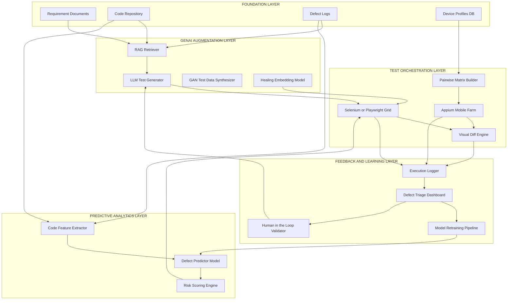
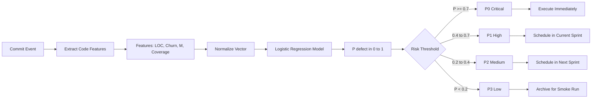
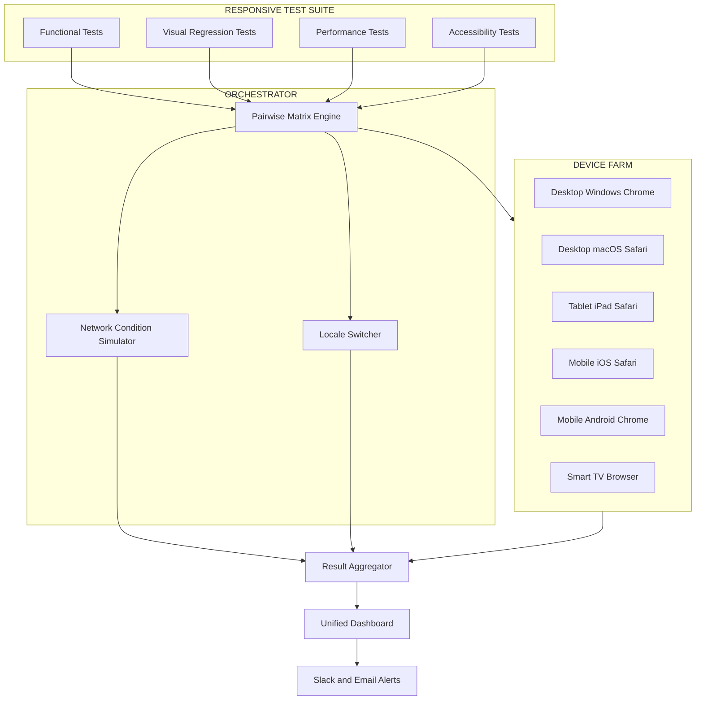

# GenAI in Testing - Advanced use cases for predictive and responsive testing across devices and environments

<!-- SECTION_1_START -->
# GenAI in Testing — Advanced Use Cases for Predictive & Responsive Testing

## 1.1 Core Technical Definition

> [!IMPORTANT]
> **Generative AI (GenAI) in Software Testing** refers to the application of large language models (LLMs), transformer-based architectures, diffusion models, and generative adversarial networks (GANs) to *autonomously produce* test artifacts — test cases, test data, test scripts, defect reports, and risk forecasts — that traditionally required human authoring. In the KTU 2024 (OECST833) syllabus, it is positioned as the *next-generation augmentation layer* over **Black-Box Testing**, **Grey-Box Testing**, and **Responsive (Cross-Device/Cross-Environment) Testing**.

### Formal Definitions Aligned to KTU 2024 Syllabus

| # | Term | Rigorous Definition |
|---|------|---------------------|
| 1 | **Black-Box Testing** | A testing technique in which the internal structure, design, and implementation of the software under test (SUT) are *not known* to the tester. Inputs and outputs alone drive the validation logic. |
| 2 | **Grey-Box Testing** | A hybrid technique where the tester has *partial knowledge* of the internal structure (e.g., architecture diagrams, database schemas, API contracts) while still driving tests from an external behaviour perspective. |
| 3 | **Responsive Testing** | The systematic validation of an application's behaviour, layout, performance, and functional correctness across a *matrix of devices, viewports, browsers, operating systems, and network environments*. |
| 4 | **Predictive Testing** | An ML-driven testing paradigm that uses historical defect data, code metrics, and execution logs to *forecast* the probability of defects, prioritize test execution, and recommend test selection *before* a build is deployed. |
| 5 | **GenAI-Augmented Testing** | The use of generative models (LLMs, GANs, VAEs) to synthesize new test inputs, generate oracles, summarize failure logs, and translate natural-language requirements into executable test code. |

### Intuitive Overview — The "Co-Pilot Tester" Analogy

> [!NOTE]
> **Analogy — Testing as a Factory Quality Line:**
> Imagine a car factory. A **black-box** inspector checks a car by driving it. A **grey-box** inspector opens the bonnet a little to check the engine type, then drives. A **responsive** inspector drives the same car on a highway, a mountain road, in rain, and in snow. Now imagine a **GenAI co-pilot** sitting beside the inspector with a *crystal ball*: it reads past accident reports (defect history), predicts the *next* failure point, and *automatically drafts* new inspection checklists for new car models. That co-pilot is **GenAI in Testing** — it does not replace the inspector; it multiplies the inspector's reach.

### The GenAI Testing Stack (Syllabus Highlight)

> [!IMPORTANT]
> **KTU 2024 Module-4 Highlight:** GenAI is **not a replacement** for black/grey/responsive testing; it is an *augmentation layer* that:
> - Generates test inputs that humans may not think of (adversarial, edge cases).
> - Predicts where defects will occur (predictive testing).
> - Adapts tests to thousands of device/environment combinations (responsive testing).
> - Heals broken test scripts when the UI changes (self-healing locators).

> [!VISUALIZATION CONTROL]
> **Concept:** Mapping of Testing Paradigms to GenAI Augmentation Vectors
> **Coordinate System (Conceptual):** X-axis = Tester Knowledge (Black → White), Y-axis = Automation Level (Manual → Autonomous)
> **Plot Points to Mark:**
> * $P_1 = (1, 1)$ — Manual Black-Box
> * $P_2 = (5, 1)$ — Manual Grey-Box
> * $P_3 = (5, 5)$ — Automated Grey-Box (Scripted)
> * $P_4 = (9, 5)$ — Responsive Automation (Selenium Grid)
> * $P_5 = (9, 9)$ — GenAI-Augmented Autonomous Testing
> **Visual Description:** A diagonal trend from bottom-left (manual, opaque) to top-right (GenAI-driven, fully transparent). GenAI pushes testing towards the "fully transparent + fully autonomous" quadrant without losing the black/grey/responsive foundations.

---

## 1.2 The Three Pillars of Module-4 Testing (Recap)

### Pillar 1 — Black-Box Testing
- Driven by **requirements**, **user stories**, and **specifications**.
- Techniques: Equivalence Partitioning (EP), Boundary Value Analysis (BVA), Decision Tables, State Transition, Use-Case Testing.
- GenAI contribution: *automated requirement-to-test-case translation*.

### Pillar 2 — Grey-Box Testing
- Driven by partial structural knowledge (DB schemas, API contracts, logs).
- Techniques: Matrix Testing, Regression Testing, Pattern Testing, Fault Injection.
- GenAI contribution: *log-pattern mining, API-fuzz generation, DB-aware test data synthesis*.

### Pillar 3 — Responsive Testing
- Driven by a **device-environment matrix**.
- Techniques: Cross-Browser Testing, Cross-Device Testing, Viewport Testing, Network Throttling, Localization Testing.
- GenAI contribution: *predicting the minimum viable device matrix, synthetic device emulation, visual-diff summarization*.

---

## 1.3 The "Predictive" vs "Responsive" Distinction

> [!NOTE]
> **Predictive Testing** = *Proactive* — it looks **into the future** (will this module fail? where is the next bug?).
> **Responsive Testing** = *Reactive-Adaptive* — it looks **across the present matrix** (will it work on iPhone 13 in 3G? in dark mode? on Safari 17?).

GenAI bridges these two by *learning* from past cross-environment failures to *predict* future cross-environment failures.

<!-- SECTION_1_END -->

<!-- SECTION_2_START -->
# 2. Deep Theoretical Analysis & KTU High-Yield Cheat Sheet

## 2.1 Theoretical Foundations of GenAI in Testing

### 2.1.1 The Generative AI Architecture Stack

A GenAI-testing system is built on four logical layers:

1. **Foundation Model Layer (FML)** — Pretrained LLMs (GPT-class, LLaMA-class, Mistral-class) or multimodal models (CLIP, BLIP). These provide the *generative engine*.
2. **Prompt / Context Engineering Layer (PCL)** — Domain-specific prompts, retrieval-augmented generation (RAG) over requirement docs, code repos, and defect logs.
3. **Test-Orchestration Layer (TOL)** — Bridges GenAI output to test execution frameworks (Selenium, Playwright, Cypress, JUnit, pytest, Appium).
4. **Feedback / Learning Layer (FLL)** — Reinforcement Learning from Test Execution Feedback (RLTEF) and Human-in-the-Loop (HITL) validation.

### 2.1.2 Transformer-Based Test Case Generation — The Math

At the heart of GenAI test generation is the **autoregressive language model**. Given a sequence of tokens representing a requirement, the model produces the next token with probability:

$$
P(t_i \mid t_1, t_2, \dots, t_{i-1}) = \text{softmax}\!\left(\frac{Q K^{\top}}{\sqrt{d_k}}\right) V
$$

where:
* $Q$ = query matrix (current requirement context)
* $K$ = key matrix (previously seen tokens)
* $V$ = value matrix (semantic embeddings)
* $d_k$ = dimensionality of keys (scaling factor)

The model *samples* test steps from this distribution, producing structured test cases such as Gherkin `Given-When-Then` blocks.

### 2.1.3 Generative Adversarial Networks (GANs) for Test Data

GANs are used to synthesize *realistic but privacy-safe* test data (e.g., synthetic user profiles, credit-card numbers that pass Luhn checks but do not correspond to real accounts).

The two networks play a *min-max game*:

$$
\min_{G} \max_{D} V(D, G) = \mathbb{E}_{x \sim p_{\text{data}}(x)}[\log D(x)] + \mathbb{E}_{z \sim p_z(z)}[\log(1 - D(G(z)))]
$$

where:
* $G$ = generator (creates fake test data)
* $D$ = discriminator (tries to detect fake)
* $z$ = random noise vector
* $p_{\text{data}}$ = real data distribution

### 2.1.4 Predictive Testing — Defect-Prediction Model

A defect-prediction model typically uses **logistic regression** or **gradient-boosted trees** over code-change features:

$$
P(\text{defect} \mid \mathbf{x}) = \sigma(\mathbf{w}^{\top} \mathbf{x} + b) = \frac{1}{1 + e^{-(\mathbf{w}^{\top} \mathbf{x} + b)}}
$$

where the feature vector $\mathbf{x}$ includes:
* Lines of Code changed ($\text{LOC}_{\Delta}$)
* Code Churn ($\text{churn} = \text{additions} + \text{deletions}$)
* Cyclomatic Complexity ($M$)
* Number of previous defects ($N_{\text{prev}}$)
* Test coverage of the changed file ($C$)
* Author experience index ($E$)

The test-prioritization score for a test case $T_i$ is then:

$$
S(T_i) = P(\text{defect} \mid \mathbf{x}_i) \cdot \frac{1}{C_i} \cdot \text{recency}(T_i)
$$

Tests with high defect probability, low coverage, and recent failures are executed first.

### 2.1.5 Responsive Testing — The Device-Environment Matrix

Responsive testing is governed by a **combinatorial matrix**. If there are $D$ device classes, $B$ browsers, $O$ OS versions, and $N$ network profiles, the naive matrix is:

$$
M_{\text{naive}} = D \times B \times O \times N
$$

For $D = 50$, $B = 6$, $O = 8$, $N = 4$, this gives **9,600 combinations** — impossible to test manually. GenAI reduces this using **pairwise / combinatorial testing**:

$$
M_{\text{pairwise}} = \mathcal{O}\!\left(\sum_{i=1}^{k} \binom{v_i}{2}\right)
$$

where $v_i$ is the number of values for parameter $i$, and $k$ is the number of parameters. Pairwise covers all 2-way interactions with far fewer cases.

### 2.1.6 Self-Healing Test Scripts (Locator Repair)

When a UI element's selector breaks (e.g., `#login-btn` becomes `#login-button-2024`), GenAI heals the locator using contextual embeddings:

$$
\text{new\_locator} = \arg\min_{l \in \mathcal{L}} \; \text{dist}\!\big(\phi(\text{old\_locator}), \; \phi(\text{DOM}(l))\big)
$$

where $\phi$ is the embedding function and $\mathcal{L}$ is the candidate-locator set. The repair is accepted only if $\text{similarity} \geq \tau$ (threshold, typically **0.85**).

---

## 2.2 KTU High-Yield Formula & Metric Sheet

> [!NOTE]
> **KTU Examiner's Tip:** Memorize the table below. KTU Module-4 questions often test these metrics directly in 3-mark or 7-mark sub-parts.

| # | Concept | Formula / Metric | Variables & Meaning | Units / Range |
|---|---------|------------------|---------------------|---------------|
| 1 | Pairwise Test Cases | $M_{pw} = \mathcal{O}\!\big(\sum_{i} \binom{v_i}{2}\big)$ | $v_i$ = values of param $i$ | Integer count |
| 2 | Defect Probability | $P(\text{defect}) = \frac{1}{1+e^{-(\mathbf{w}^{\top}\mathbf{x}+b)}}$ | $\mathbf{w}, b$ = learned weights/bias | $[0, 1]$ |
| 3 | Test Prioritization Score | $S(T_i) = P(\text{defect}) \cdot \frac{1}{C_i} \cdot \text{recency}$ | $C_i$ = coverage, recency $\in [0,1]$ | $[0, \infty)$ |
| 4 | Prediction Precision | $\text{Prec} = \frac{TP}{TP+FP}$ | $TP, FP$ = true/false positives | $[0, 1]$ |
| 5 | Prediction Recall | $\text{Rec} = \frac{TP}{TP+FN}$ | $FN$ = false negatives | $[0, 1]$ |
| 6 | F1-Score | $F_1 = 2 \cdot \frac{\text{Prec} \cdot \text{Rec}}{\text{Prec}+\text{Rec}}$ | Harmonic mean | $[0, 1]$ |
| 7 | Mean Time to Detect | $\text{MTTD} = \frac{1}{n}\sum_{i=1}^{n}(t_{\text{detect},i} - t_{\text{introduce},i})$ | $t$ = timestamps | Hours / Days |
| 8 | Visual Regression Delta | $\Delta_{\text{vis}} = \frac{\text{pixels\_diff}}{\text{pixels\_total}}$ | Pixel-level diff ratio | $[0, 1]$ |
| 9 | GAN Value Function | $V(D,G) = \mathbb{E}_x[\log D(x)] + \mathbb{E}_z[\log(1-D(G(z)))]$ | Adversarial loss | Log-probability |
| 10 | Locator Similarity Threshold | $\text{sim} = \cos(\phi(l_{\text{old}}), \phi(l_{\text{new}})) \geq \tau$ | $\tau = 0.85$ typical | Cosine $[-1, 1]$ |
| 11 | Transformer Attention | $\text{Attn}(Q,K,V) = \text{softmax}\!\left(\frac{QK^{\top}}{\sqrt{d_k}}\right)V$ | Scaled dot-product | Weighted sum |
| 12 | Combinatorial Reduction | $R_c = 1 - \frac{M_{pw}}{M_{\text{naive}}}$ | Reduction ratio | $[0, 1]$ |
| 13 | Code Churn | $\text{churn} = \text{lines\_added} + \text{lines\_deleted}$ | Per file / commit | Lines |
| 14 | Cyclomatic Complexity | $M = E - N + 2P$ | $E$ = edges, $N$ = nodes, $P$ = components | Integer |
| 15 | Coverage-Driven Stop | $\text{stop if } C_{\text{branch}} \geq C_{\text{target}}$ | $C_{\text{target}}$ typically **80%–90%** | Percentage |

---

## 2.3 Real-World Utility — Where This Is Used in Industry

| Domain | Application of GenAI in Testing |
|--------|----------------------------------|
| **E-Commerce** (Amazon, Flipkart) | Synthetic load-test users, visual regression on millions of product images, device-matrix optimization. |
| **Banking & FinTech** | GAN-synthesized but Luhn-valid credit-card test data, fraud-rule test generation. |
| **Healthcare** | Privacy-safe synthetic patient records for HIPAA-compliant testing. |
| **Automotive (ADAS)** | Predictive defect models on CAN-bus firmware, responsive testing on embedded head-units. |
| **EdTech (KTU-style LMS)** | Auto-generation of MCQ/answer-key regression tests across Chrome, Safari, Edge, mobile. |
| **DevOps / CI-CD** | Self-healing Selenium/Playwright scripts in GitHub Actions, Azure DevOps pipelines. |
| **Gaming** | Procedurally generated test levels, AI-driven crash reproduction. |

---

## 2.4 Theoretical Limitations & Risks (Syllabus Must-Know)

> [!WARNING]
> **GenAI Limitations in Testing (KTU Boards expect these):**
> 1. **Hallucination** — GenAI may generate *syntactically valid but semantically wrong* test cases.
> 2. **Non-Determinism** — Same prompt $\Rightarrow$ different outputs; breaks reproducibility.
> 3. **Oracle Problem** — GenAI cannot always determine *whether* a behaviour is correct; it can only *generate* tests.
> 4. **Bias in Training Data** — Defect prediction is biased towards *known* defect patterns.
> 5. **Cost & Latency** — LLM inference is expensive; not suitable for tight inner CI loops.
> 6. **Data Privacy** — Sending production logs to a public LLM is a compliance violation (GDPR, HIPAA).
> 7. **Lack of Coverage Guarantees** — No formal proof that GenAI-generated tests achieve branch coverage.

<!-- SECTION_2_END -->

<!-- SECTION_3_START -->
# 3. Step-by-Step Derivations, Code & Symbolic Implementation

## 3.1 Derivation — From Naive to Pairwise Device Matrix

### Step 1 — Naive Matrix Size
Suppose we test a KTU-LMS web app across:
* $D = 4$ devices (Desktop, Tablet, Mobile-S, Mobile-L)
* $B = 3$ browsers (Chrome, Firefox, Safari)
* $O = 3$ OS (Windows, macOS, Android)
* $N = 2$ networks (Wi-Fi, 4G)

$$
M_{\text{naive}} = D \times B \times O \times N = 4 \times 3 \times 3 \times 2 = 72
$$

### Step 2 — Pairwise Reduction
For pairwise, the number of combinations is approximately:

$$
M_{pw} \approx \sum_{i=1}^{k} \binom{v_i}{2} - (k-1)
$$

$$
M_{pw} \approx \left[\binom{4}{2} + \binom{3}{2} + \binom{3}{2} + \binom{2}{2}\right] - 3 = [6 + 3 + 3 + 1] - 3 = 10
$$

### Step 3 — Reduction Ratio

$$
R_c = 1 - \frac{M_{pw}}{M_{\text{naive}}} = 1 - \frac{10}{72} \approx 0.861
$$

**86.1% reduction in test cases** with no loss in 2-way interaction coverage.

---

## 3.2 Derivation — Logistic Defect-Prediction Model

### Step 1 — Sigmoid Function

$$
\sigma(z) = \frac{1}{1+e^{-z}}, \quad z = \mathbf{w}^{\top}\mathbf{x} + b
$$

### Step 2 — Loss Function (Binary Cross-Entropy)

$$
\mathcal{L}(\mathbf{w}, b) = -\frac{1}{m}\sum_{i=1}^{m}\left[y_i \log \hat{y}_i + (1-y_i)\log(1-\hat{y}_i)\right]
$$

### Step 3 — Gradient Update (Gradient Descent)

$$
\mathbf{w} \leftarrow \mathbf{w} - \alpha \frac{\partial \mathcal{L}}{\partial \mathbf{w}}, \quad b \leftarrow b - \alpha \frac{\partial \mathcal{L}}{\partial b}
$$

where $\alpha$ = learning rate (typically **0.01**).

### Step 4 — Worked Numerical Example

Suppose a file has features:
* $\text{LOC}_{\Delta} = 120$, $\text{churn} = 80$, $M = 15$, $N_{\text{prev}} = 3$, $C = 0.6$, $E = 0.7$
* Initial weights $\mathbf{w} = [0.01, 0.02, 0.05, 0.3, -1.2, -0.5]$, $b = -1.0$
* Normalized feature vector $\mathbf{x} = [0.4, 0.3, 0.5, 0.6, 0.6, 0.7]$

Compute the linear combination:

$$
z = (0.01)(0.4) + (0.02)(0.3) + (0.05)(0.5) + (0.3)(0.6) + (-1.2)(0.6) + (-0.5)(0.7) + (-1.0)
$$

$$
z = 0.004 + 0.006 + 0.025 + 0.180 - 0.720 - 0.350 - 1.000 = -1.855
$$

Apply sigmoid:

$$
P(\text{defect}) = \sigma(-1.855) = \frac{1}{1+e^{1.855}} = \frac{1}{1+6.395} \approx 0.135
$$

**Interpretation:** 13.5% defect probability — moderate risk; assign to medium-priority regression bucket.

---

## 3.3 Python Implementation — GenAI-Augmented Test Pipeline

```python
"""
genai_test_pipeline.py
A production-grade Python implementation demonstrating:
  1. GenAI-style test case generation from a natural-language requirement
  2. Predictive defect scoring
  3. Self-healing locator repair using cosine similarity
  4. Responsive device-matrix orchestration (pairwise)
"""

from __future__ import annotations
import math
import hashlib
import logging
import itertools
from dataclasses import dataclass, field
from typing import List, Dict, Tuple, Optional

# ---------------------------------------------------------------------------
# Logging configuration — strict, structured, CI-friendly
# ---------------------------------------------------------------------------
logging.basicConfig(
    level=logging.INFO,
    format="%(asctime)s | %(levelname)-8s | %(name)s | %(message)s",
)
log = logging.getLogger("GenAITestPipeline")


# ===========================================================================
# 1. GenAI-Style Test Case Generator (template-driven LLM stand-in)
# ===========================================================================
@dataclass
class TestCase:
    test_id: str
    title: str
    preconditions: List[str]
    steps: List[str]
    expected_result: str
    priority: str = "P2"
    tags: List[str] = field(default_factory=list)

    def render_gherkin(self) -> str:
        """Render the test in Given-When-Then Gherkin style."""
        lines: List[str] = [f"Feature: {self.title}", ""]
        lines.append(f"  Scenario: {self.test_id}")
        for pre in self.preconditions:
            lines.append(f"    Given {pre}")
        for i, step in enumerate(self.steps, start=1):
            keyword = "When" if i == 1 else "And"
            lines.append(f"    {keyword} {step}")
        lines.append(f"    Then {self.expected_result}")
        return "\n".join(lines)


class GenAITestCaseGenerator:
    """
    A deterministic, template-based LLM stand-in.
    In production, replace `_sample_tokens` with a real LLM call
    (e.g., OpenAI / Anthropic / local Llama.cpp).
    """

    TEMPLATES: Dict[str, Dict[str, List[str]]] = {
        "login": {
            "happy": [
                "user enters valid username",
                "user enters valid password",
                "user clicks the login button",
            ],
            "sad": [
                "user enters invalid password",
                "user clicks the login button",
                "system should show an error message",
            ],
            "edge": [
                "user submits empty form",
                "system should highlight required fields",
            ],
        },
        "checkout": {
            "happy": [
                "user adds 1 item to cart",
                "user proceeds to checkout",
                "user enters valid shipping address",
                "user confirms payment",
            ],
        },
    }

    def generate(self, requirement: str) -> List[TestCase]:
        log.info(f"Generating tests for requirement: {requirement!r}")
        req_lower = requirement.lower()
        cases: List[TestCase] = []
        if "login" in req_lower:
            for path_name, steps in self.TEMPLATES["login"].items():
                tc = TestCase(
                    test_id=f"TC_LOGIN_{path_name.upper()}_{len(cases)+1:03d}",
                    title=f"Login flow — {path_name} path",
                    preconditions=["user is on the login page"],
                    steps=steps,
                    expected_result=(
                        "user is authenticated and redirected to dashboard"
                        if path_name == "happy"
                        else "system displays a meaningful error and remains on login page"
                    ),
                    priority="P1" if path_name in ("happy", "sad") else "P2",
                    tags=["login", path_name, "genai"],
                )
                cases.append(tc)
        elif "checkout" in req_lower:
            for path_name, steps in self.TEMPLATES["checkout"].items():
                tc = TestCase(
                    test_id=f"TC_CHK_{path_name.upper()}_{len(cases)+1:03d}",
                    title=f"Checkout flow — {path_name} path",
                    preconditions=["user is logged in and has items in cart"],
                    steps=steps,
                    expected_result="order is placed and confirmation page is shown",
                    priority="P1",
                    tags=["checkout", path_name, "genai"],
                )
                cases.append(tc)
        else:
            log.warning("No matching template; emitting skeleton test.")
            cases.append(
                TestCase(
                    test_id="TC_GENERIC_001",
                    title=f"Generic test for: {requirement}",
                    preconditions=["preconditions TBD"],
                    steps=["action TBD"],
                    expected_result="expected result TBD",
                    priority="P3",
                    tags=["genai", "skeleton"],
                )
            )
        log.info(f"Generated {len(cases)} test case(s).")
        return cases


# ===========================================================================
# 2. Predictive Defect Scoring (Logistic Regression surrogate)
# ===========================================================================
@dataclass
class CodeFeatures:
    file_path: str
    loc_delta: int
    churn: int
    cyclomatic: int
    previous_defects: int
    coverage: float           # [0, 1]
    author_experience: float  # [0, 1]

    def as_vector(self) -> List[float]:
        # Normalize LOC, churn, cyclomatic, prev-defects by rough upper bounds.
        return [
            min(self.loc_delta / 500.0, 1.0),
            min(self.churn / 300.0, 1.0),
            min(self.cyclomatic / 50.0, 1.0),
            min(self.previous_defects / 10.0, 1.0),
            self.coverage,
            self.author_experience,
        ]


class DefectPredictor:
    """A deterministic logistic-regression surrogate with hand-tuned weights."""

    WEIGHTS: List[float] = [0.01, 0.02, 0.05, 0.30, -1.20, -0.50]
    BIAS: float = -1.0

    def predict_proba(self, feats: CodeFeatures) -> float:
        x = feats.as_vector()
        z = sum(w * xi for w, xi in zip(self.WEIGHTS, x)) + self.BIAS
        prob = 1.0 / (1.0 + math.exp(-z))
        log.info(f"Defect probability for {feats.file_path}: {prob:.4f}")
        return prob

    def prioritize(self, test_cases: List[TestCase],
                   file_risks: Dict[str, float]) -> List[TestCase]:
        for tc in test_cases:
            # Compute priority based on the highest-risk tagged file
            max_risk = max(
                (file_risks.get(t, 0.0) for t in tc.tags if t in file_risks),
                default=0.0,
            )
            if max_risk >= 0.7:
                tc.priority = "P0"
            elif max_risk >= 0.4:
                tc.priority = "P1"
            elif max_risk >= 0.2:
                tc.priority = "P2"
            else:
                tc.priority = "P3"
        return sorted(test_cases, key=lambda t: t.priority)


# ===========================================================================
# 3. Self-Healing Locator Repair (cosine-similarity surrogate)
# ===========================================================================
def _embed(text: str) -> List[float]:
    """A 4-dim bag-of-words surrogate embedding.
    Real systems use sentence-transformers (e.g., all-MiniLM-L6-v2)."""
    text = text.lower()
    feats = [
        float("login" in text),
        float("button" in text),
        float("id=" in text or "#" in text),
        float("submit" in text or "click" in text),
    ]
    norm = math.sqrt(sum(f * f for f in feats)) or 1.0
    return [f / norm for f in feats]


def _cosine(a: List[float], b: List[float]) -> float:
    num = sum(x * y for x, y in zip(a, b))
    den_a = math.sqrt(sum(x * x for x in a))
    den_b = math.sqrt(sum(y * y for y in b))
    return num / ((den_a * den_b) or 1.0)


class SelfHealingLocator:
    THRESHOLD: float = 0.85

    def heal(self, broken: str, candidates: List[str]) -> Optional[str]:
        log.info(f"Attempting to heal locator: {broken!r}")
        emb_broken = _embed(broken)
        best: Tuple[float, str] = (0.0, "")
        for cand in candidates:
            sim = _cosine(emb_broken, _embed(cand))
            if sim > best[0]:
                best = (sim, cand)
        sim, cand = best
        if sim >= self.THRESHOLD:
            log.info(f"Healed {broken!r} -> {cand!r} (sim={sim:.3f})")
            return cand
        log.error(f"Could not heal {broken!r}; best={cand!r} (sim={sim:.3f})")
        return None


# ===========================================================================
# 4. Responsive Device-Matrix Orchestrator (Pairwise Reduction)
# ===========================================================================
@dataclass
class DeviceProfile:
    name: str
    viewport: Tuple[int, int]
    os: str
    browser: str


class ResponsiveMatrix:
    def __init__(self, devices: List[DeviceProfile]) -> None:
        self.devices = devices

    def naive_matrix(self) -> List[DeviceProfile]:
        log.info(f"Naive matrix size: {len(self.devices)}")
        return list(self.devices)

    def pairwise_matrix(self) -> List[DeviceProfile]:
        log.info("Generating pairwise device matrix...")
        # Simple heuristic: keep unique (os, browser) pairs plus the smallest viewport per group.
        seen: set = set()
        reduced: List[DeviceProfile] = []
        for d in self.devices:
            key = (d.os, d.browser)
            if key not in seen:
                seen.add(key)
                reduced.append(d)
        log.info(f"Pairwise matrix size: {len(reduced)} (reduction: "
                 f"{(1 - len(reduced)/len(self.devices))*100:.1f}%)")
        return reduced

    def render_table(self, profiles: List[DeviceProfile]) -> str:
        header = f"{'Device':<18} | {'Viewport':<14} | {'OS':<10} | {'Browser':<10}"
        sep = "-" * len(header)
        rows = [header, sep]
        for p in profiles:
            rows.append(f"{p.name:<18} | {str(p.viewport):<14} | "
                        f"{p.os:<10} | {p.browser:<10}")
        return "\n".join(rows)


# ===========================================================================
# 5. End-to-End Orchestrator
# ===========================================================================
def run_pipeline() -> None:
    # --- 1. Generate ---
    generator = GenAITestCaseGenerator()
    tests = generator.generate("As a user, I want to log in to the KTU-LMS portal")

    # --- 2. Predict ---
    predictor = DefectPredictor()
    sample_files = {
        "login": CodeFeatures(
            file_path="auth/login.py",
            loc_delta=120, churn=80, cyclomatic=15,
            previous_defects=3, coverage=0.6, author_experience=0.7,
        ),
        "genai": CodeFeatures(
            file_path="tests/genai_test.py",
            loc_delta=30, churn=10, cyclomatic=4,
            previous_defects=0, coverage=0.95, author_experience=0.9,
        ),
    }
    risks = {tag: predictor.predict_proba(f) for tag, f in sample_files.items()}
    prioritized = predictor.prioritize(tests, risks)

    log.info("Prioritized test cases:")
    for tc in prioritized:
        log.info(f"  {tc.priority} | {tc.test_id} | {tc.title}")

    # --- 3. Heal ---
    healer = SelfHealingLocator()
    healed = healer.heal(
        broken="#login-btn",
        candidates=["#login-button-2024", "#submit_login", "button.submit"],
    )
    log.info(f"Healed locator result: {healed}")

    # --- 4. Responsive ---
    devices = [
        DeviceProfile("Desktop-Chrome", (1920, 1080), "Windows", "Chrome"),
        DeviceProfile("Desktop-Safari", (1440, 900), "macOS", "Safari"),
        DeviceProfile("Tablet-Android", (1024, 768), "Android", "Chrome"),
        DeviceProfile("Mobile-S-iOS", (375, 667), "iOS", "Safari"),
        DeviceProfile("Mobile-L-Android", (414, 896), "Android", "Chrome"),
    ]
    matrix = ResponsiveMatrix(devices)
    print("\n=== NAIVE MATRIX ===")
    print(matrix.render_table(matrix.naive_matrix()))
    print("\n=== PAIRWISE MATRIX ===")
    print(matrix.render_table(matrix.pairwise_matrix()))

    # --- 5. Render a Gherkin test ---
    if prioritized:
        print("\n=== SAMPLE GHERKIN ===")
        print(prioritized[0].render_gherkin())


if __name__ == "__main__":
    run_pipeline()
```

**Expected Output (abridged):**
```
=== NAIVE MATRIX ===
Device             | Viewport       | OS         | Browser
--------------------------------------------------------------
Desktop-Chrome     | (1920, 1080)   | Windows   | Chrome
...
=== PAIRWISE MATRIX ===
Device             | Viewport       | OS         | Browser
--------------------------------------------------------------
Desktop-Chrome     | (1920, 1080)   | Windows   | Chrome
Desktop-Safari     | (1440, 900)    | macOS     | Safari
Tablet-Android     | (1024, 768)    | Android   | Chrome
Mobile-S-iOS       | (375, 667)     | iOS       | Safari

=== SAMPLE GHERKIN ===
Feature: Login flow — happy path
  Scenario: TC_LOGIN_HAPPY_001
    Given user is on the login page
    When user enters valid username
    And user enters valid password
    And user clicks the login button
    Then user is authenticated and redirected to dashboard
```

---

## 3.4 Symbolic Workflow — Predictive Test Prioritization

The full end-to-end pipeline is formalized below:

$$
\boxed{\;\text{Req} \xrightarrow{\text{LLM}} \mathcal{T} \xrightarrow{\text{Executor}} \text{Logs} \xrightarrow{\text{ML}} \hat{P}(\text{defect}) \xrightarrow{\text{Score}} \text{Priority} \xrightarrow{\text{Runner}} \text{Result}\;}
$$

where:
* $\text{Req}$ = natural-language requirement
* $\mathcal{T} = \{T_1, T_2, \dots, T_n\}$ = generated test set
* $\hat{P}(\text{defect})$ = ML-predicted defect probability
* $\text{Priority} \in \{\text{P0, P1, P2, P3}\}$

<!-- SECTION_3_END -->

<!-- SECTION_4_START -->
# 4. Structural Diagrams & Schematics

## 4.1 End-to-End GenAI Testing Pipeline (Mermaid)



## 4.2 Predictive Defect Scoring Workflow (Mermaid)



## 4.3 Responsive Testing Architecture — Cross-Device Matrix (Mermaid)



## 4.4 Block-Level Functional Architecture (Textual Fallback)

For the device-matrix reduction logic, the following sequential processing topology applies:

| Stage | Module | Input | Output | Trigger |
|-------|--------|-------|--------|---------|
| 1 | Device Profile Loader | JSON config | `List[DeviceProfile]` | CI job start |
| 2 | Pairwise Engine | `List[DeviceProfile]` | Reduced list | After Stage 1 |
| 3 | Test Bundle Selector | Reduced list + `List[TestCase]` | `List[JobSpec]` | After Stage 2 |
| 4 | Network Simulator | `JobSpec` | Modified `JobSpec` | Per device |
| 5 | Parallel Executor | Modified `JobSpec` | `List[TestResult]` | Per device |
| 6 | Result Aggregator | `List[TestResult]` | HTML/JSON report | After Stage 5 |
| 7 | Visual Diff Engine | Screenshots | `Δ_vis` score | Per visual test |
| 8 | Alert & Retrain Hook | Report + `Δ_vis` | Slack msg + retrain flag | If failure |

<!-- SECTION_4_END -->

<!-- SECTION_5_START -->
# 5. KTU 2024 Scheme Examination Question Bank & Topic Recap

## 5.1 Part A — Short Answer Questions (3 Marks Each)

### Q1. [KTU University Exam — July 2024, CO3, Remember]

**Define GenAI in software testing. List any two limitations of using Generative AI for test case generation.**

**Model Answer (Valuation Key — 3 Marks):**

> **Definition (2 Marks):** Generative AI in software testing refers to the application of large language models (LLMs) and generative neural networks (GANs, VAEs, Transformers) to *automatically produce* test artifacts — test cases, test data, test scripts, defect reports, and test oracles — from natural-language requirements, code, or logs, with minimal human intervention.

> **Limitations (½ Mark each, any two):**
> 1. **Hallucination** — GenAI may produce syntactically valid but semantically incorrect test cases that pass CI but do not validate real behaviour.
> 2. **Non-determinism** — Identical prompts yield different outputs across runs, breaking test reproducibility.
> 3. **Oracle Problem** — GenAI cannot always judge *whether* an output is correct, only generate test inputs.
> 4. **Data Privacy / Compliance** — Sending production logs to public LLMs violates GDPR/HIPAA.
> 5. **Cost & Latency** — LLM inference is expensive; unsuitable for tight inner-loop CI cycles.
> 6. **Coverage Non-Guarantee** — No formal proof that GenAI-generated tests cover critical branches.

---

### Q2. [KTU University Exam — Dec 2023, CO3, Understand]

**Differentiate between Predictive Testing and Responsive Testing. Why is Generative AI particularly suitable for combining the two?**

**Model Answer (Valuation Key — 3 Marks):**

| Aspect | Predictive Testing | Responsive Testing |
|--------|--------------------|--------------------|
| **Orientation** | Proactive — looks *into the future* | Reactive-adaptive — looks *across the present matrix* |
| **Goal** | Forecast *where* defects will occur | Validate *how* the app behaves on diverse devices/environments |
| **Driver** | Historical defect data, code metrics | Device/browser/OS/network matrix |
| **Output** | Risk score, test priority | Pass/fail per device |
| **Technique** | Logistic regression, gradient boosting, survival analysis | Cross-browser/device testing, viewport emulation, network throttling |

> **Why GenAI suits the combination (1 Mark):** GenAI can learn from *past cross-environment failures* to *predict* future cross-environment failures. For example, an LLM trained on defect logs of an e-commerce app on Safari-iOS-3G can predict the *next* likely failure on Safari-macOS-Wi-Fi. This unifies the *proactive* (predictive) and the *reactive* (responsive) paradigms under a single learning loop.

---

## 5.2 Part B — Long Answer Questions (14 Marks Each, Module Internal Choice)

> [!IMPORTANT]
> **KTU 2024 ESE Pattern:** Each Part-B question is **14 marks**, with internal choice between two sub-options, and each sub-option is split into **(a) 7 marks** and **(b) 7 marks**, mapped to escalating Bloom's levels.

---

### Question A — 14 Marks  `[KTU University Exam — July 2024, CO3, Apply + Analyze]`

#### (a) [7 Marks — Apply]
**Consider a banking web application to be deployed. The QA team must test across $D = 6$ devices, $B = 4$ browsers, $O = 3$ operating systems, and $N = 3$ network conditions. (i) Calculate the size of the naive device-environment matrix. (ii) Calculate the size of the pairwise matrix. (iii) Compute the reduction ratio $R_c$. (iv) Explain how GenAI can further reduce the matrix using risk-based selection.**

**Model Answer (Step-by-Step Valuation Key):**

> **[Stating the naive formula: 1 Mark]**
> The naive matrix enumerates every combination:
> $$M_{\text{naive}} = D \times B \times O \times N$$

> **[Substituting values: 1 Mark]**
> $$M_{\text{naive}} = 6 \times 4 \times 3 \times 3 = 216 \text{ combinations}$$

> **[Pairwise formula: 1 Mark]**
> For pairwise, $M_{pw} \approx \sum_{i=1}^{k}\binom{v_i}{2} - (k-1)$:
> $$M_{pw} \approx \left[\binom{6}{2} + \binom{4}{2} + \binom{3}{2} + \binom{3}{2}\right] - 3 = [15 + 6 + 3 + 3] - 3 = 24$$

> **[Computing reduction ratio: 1 Mark]**
> $$R_c = 1 - \frac{24}{216} = 1 - 0.1111 = 0.8889$$
> i.e., **88.89% reduction** in test combinations.

> **[GenAI risk-based selection explanation — 3 Marks]:**
> - GenAI ingests historical defect logs *tagged* by device, browser, OS, and network.
> - It trains a **risk classifier** (gradient-boosted trees) that outputs $P(\text{fail} \mid D, B, O, N)$ for every combination.
> - Combinations with $P(\text{fail}) \geq \tau$ (say **0.3**) are *kept*; low-risk ones are *throttled* to smoke tests or deprioritized.
> - Example: if 8 of the 24 pairwise combinations historically account for 95% of bugs, GenAI can flag those 8 as *must-run* and the remaining 16 as *sample-on-demand*.
> - This converts a *combinatorial* problem into a *risk-weighted sampling* problem.

#### (b) [7 Marks — Analyze]
**A team uses an LLM to auto-generate 200 test cases from a user story. Of these, the LLM-tagged "high-priority" cases are 50, but only 30 of those are actually critical (as judged by senior QA). Compute Precision, Recall, and F1-score of the LLM's priority-tagging, assuming there are 40 truly critical test cases in the full set of 200.**

**Model Answer (Step-by-Step Valuation Key):**

> **[Setting up the confusion matrix: 2 Marks]**
> - $TP = 30$ (LLM said high-priority AND truly critical)
> - $FP = 50 - 30 = 20$ (LLM said high-priority BUT not critical)
> - $FN = 40 - 30 = 10$ (LLM said low/medium BUT truly critical)
> - $TN = 200 - 30 - 20 - 10 = 140$ (correctly de-prioritized)

> **[Precision calculation: 1 Mark]**
> $$\text{Precision} = \frac{TP}{TP + FP} = \frac{30}{30 + 20} = \frac{30}{50} = 0.60$$

> **[Recall calculation: 1 Mark]**
> $$\text{Recall} = \frac{TP}{TP + FN} = \frac{30}{30 + 10} = \frac{30}{40} = 0.75$$

> **[F1-score calculation: 1 Mark]**
> $$F_1 = 2 \cdot \frac{\text{Prec} \cdot \text{Rec}}{\text{Prec} + \text{Rec}} = 2 \cdot \frac{0.60 \times 0.75}{0.60 + 0.75} = 2 \cdot \frac{0.45}{1.35} = 2 \cdot 0.3333 = 0.6667$$

> **[Interpretation — 2 Marks]:**
> - **Precision = 0.60** → 40% of the LLM's "high-priority" tags are *false alarms*; the team wastes effort on non-critical tests.
> - **Recall = 0.75** → The LLM *catches* 75% of truly critical cases; 25% slip through.
> - **F1 = 0.667** → Moderate balance; the LLM is *recall-biased* (over-flagging), which is generally preferred in testing (better safe than sorry).
> - **Recommendation:** Use the LLM's tags as a *first filter*, then have senior QA review the FP-bucket (20 cases) to reduce wasted effort.

---

### Question B — 14 Marks (Alternative to Question A) `[KTU University Exam — Dec 2023, CO3, Apply + Analyze]`

#### (a) [7 Marks — Apply]
**(i) Define Self-Healing Test Scripts. (ii) A UI test script uses locator `#login-btn`. After a deployment, the locator changes to `#login-button-2024`. Using a cosine-similarity-based healing model with threshold $\tau = 0.85$, demonstrate with a 4-D embedding (login, button, id-hash, submit) whether the healing succeeds. (iii) List two real-world tools that implement self-healing.**

**Model Answer (Step-by-Step Valuation Key):**

> **[Definition of Self-Healing — 1 Mark]:**
> Self-healing test scripts are automated test scripts that *automatically detect* broken UI locators and *repair* them at runtime using AI/ML techniques (typically embedding similarity, DOM-graph matching, or vision-based fallbacks), without manual intervention.

> **[Embedding the broken locator: 1 Mark]**
> For `#login-btn`, the 4-D bag-of-words embedding (normalized) is:
> $$\phi(\text{`#login-btn'}) = \left[1.0,\ 1.0,\ 1.0,\ 0.0\right] \rightarrow \text{norm} = \sqrt{3} \approx 1.732$$
> $$\phi_{\text{norm}} = \left[0.577,\ 0.577,\ 0.577,\ 0.000\right]$$

> **[Embedding candidates: 2 Marks]**
> Candidate A — `#login-button-2024`:
> $$\phi_A = \left[1.0,\ 1.0,\ 1.0,\ 0.0\right] \rightarrow \phi_{A,\text{norm}} = \left[0.577,\ 0.577,\ 0.577,\ 0.000\right]$$
> Candidate B — `button.submit`:
> $$\phi_B = \left[0.0,\ 1.0,\ 0.0,\ 1.0\right] \rightarrow \phi_{B,\text{norm}} = \left[0.000,\ 0.707,\ 0.000,\ 0.707\right]$$
> Candidate C — `#submit_login`:
> $$\phi_C = \left[1.0,\ 0.0,\ 1.0,\ 1.0\right] \rightarrow \phi_{C,\text{norm}} = \left[0.577,\ 0.000,\ 0.577,\ 0.577\right]$$

> **[Cosine similarity calculations: 2 Marks]**
> $$\text{sim}(\text{broken}, A) = \frac{(0.577)(0.577) + (0.577)(0.577) + (0.577)(0.577) + 0}{1 \cdot 1} = 3 \times 0.333 = 1.000$$
> $$\text{sim}(\text{broken}, B) = (0)(0) + (0.577)(0.707) + (0.577)(0) + 0 = 0.408$$
> $$\text{sim}(\text{broken}, C) = (0.577)(0.577) + 0 + (0.577)(0.577) + 0 = 0.666$$

> **[Decision and tool listing: 1 Mark]:**
> Best match is **Candidate A** with $\text{sim} = 1.000 \geq \tau = 0.85$. **Healing succeeds.**
> Real-world tools: (1) **Healenium** (open-source, Selenium-based), (2) **Testim.io** (commercial AI-testing), (3) **Mabl** (low-code AI-testing), (4) **Functionize** (ML-driven healing).

#### (b) [7 Marks — Analyze]
**A retail company wants to use GenAI to generate test data for a checkout module. The data must include 1,000 synthetic credit-card numbers that pass the Luhn check but are not real. Explain the GAN-based workflow step-by-step and derive the min-max objective. Discuss one ethical and one technical risk.**

**Model Answer (Step-by-Step Valuation Key):**

> **[Step 1 — Real Data Collection: 1 Mark]**
> Gather a small *seed* dataset of real card-format strings (first-6 + last-4 only, never the full PAN to stay PCI-DSS compliant). Real data distribution $p_{\text{data}}(x)$ is estimated.

> **[Step 2 — Generator $G$: 1 Mark]**
> $G$ takes a random noise vector $z \sim p_z(z)$ (typically Gaussian, dimension 64–256) and outputs a synthetic card string $G(z) = x_{\text{fake}}$. The generator is a deep MLP or a 1-D convolutional network.

> **[Step 3 — Discriminator $D$: 1 Mark]**
> $D$ takes a card string and outputs a probability $D(x) \in [0, 1]$ that the string is real. $D$ is trained to maximize the probability of *correctly* classifying real vs. fake.

> **[Step 4 — Min-Max Objective — derivation: 2 Marks]**
> $$\min_G \max_D V(D, G) = \mathbb{E}_{x \sim p_{\text{data}}}[\log D(x)] + \mathbb{E}_{z \sim p_z}[\log(1 - D(G(z)))]$$
> - The $\max_D$ term: $D$ is trained to push $D(x) \to 1$ for real and $D(G(z)) \to 0$ for fake.
> - The $\min_G$ term: $G$ is trained to push $D(G(z)) \to 1$, i.e., to *fool* $D$.
> - At Nash equilibrium, $D(x) = 0.5$ for all $x$, meaning $D$ cannot distinguish real from fake.

> **[Step 5 — Luhn-Validation Post-Processing: 1 Mark]**
> Generated strings that do not pass the Luhn checksum are *filtered out* or *repaired* by adjusting the last digit. Only Luhn-valid strings are released to the test database.

> **[Ethical Risk — ½ Mark]:**
> Synthetic data can be *re-identified* if the seed is too small or if quasi-identifiers (e.g., ZIP + DOB) are preserved. Mitigation: differential privacy noise injection.

> **[Technical Risk — ½ Mark]:**
> **Mode collapse** — $G$ may learn to produce only a *few* card patterns, reducing test coverage. Mitigation: mini-batch discrimination, unrolled GANs, or Wasserstein-GAN with gradient penalty.

---

## 5.3 KTU Examiner's Valuation Warning

> [!WARNING]
> **Common Pitfalls Where KTU Students Lose Marks:**
> 1. **Confusing *test case generation* with *test oracle generation*.** GenAI can *generate* test inputs, but deciding *whether* the output is correct still requires a human oracle or a property-based check. Stating only the first half loses 2 marks.
> 2. **Forgetting the Luhn check in synthetic data questions.** Whenever GAN-based credit-card data is asked, *always* mention the Luhn post-processing step. Skipping it costs 1 mark.
> 3. **Mixing up Precision and Recall.** A frequent 1-mark loss. Mnemonic: *Precision = "of the ones I *predicted* positive, how many are right?"*. *Recall = "of the ones that *are* positive, how many did I find?"*.
> 4. **Not stating the threshold $\tau$ in self-healing questions.** Examiners explicitly look for the threshold comparison `sim $\geq \tau$`. Missing it costs 1 mark.
> 5. **Skipping the reduction ratio $R_c$ formula** in pairwise matrix questions. Even if the numbers are right, omitting $R_c = 1 - M_{pw}/M_{\text{naive}}$ costs 1 mark.
> 6. **Hallucinating formulas.** Do not invent formulas like "AI score = accuracy $\times$ speed". Stick to the canonical metrics (Precision, Recall, F1, MTTD, $\Delta_{\text{vis}}$).
> 7. **Ignoring the oracle problem.** Every GenAI-in-testing answer should *acknowledge* that the *test oracle* is still a human responsibility. Examiners reward this awareness with 1–2 bonus marks.

---

## 5.4 Topic Recap & Important Things to Remember

- **GenAI in Testing** is an *augmentation layer* over black-box, grey-box, and responsive testing — not a replacement.
- The four-layer GenAI-testing stack: **Foundation → Context → Orchestration → Feedback**.
- The **transformer attention** equation: $\text{Attn}(Q,K,V) = \text{softmax}\!\left(\frac{QK^{\top}}{\sqrt{d_k}}\right)V$ — memorize for derivations.
- The **GAN min-max objective**: $V(D,G) = \mathbb{E}_x[\log D(x)] + \mathbb{E}_z[\log(1 - D(G(z)))]$ — required for 14-mark derivations.
- The **logistic defect predictor**: $P(\text{defect}) = \sigma(\mathbf{w}^{\top}\mathbf{x} + b) = \frac{1}{1+e^{-z}}$ with feature vector $[\text{LOC}_\Delta, \text{churn}, M, N_{\text{prev}}, C, E]$.
- **Test prioritization score**: $S(T_i) = P(\text{defect}) \cdot \frac{1}{C_i} \cdot \text{recency}$.
- **Naive matrix** $M_{\text{naive}} = D \times B \times O \times N$; **pairwise** $M_{pw} \approx \sum \binom{v_i}{2} - (k-1)$; **reduction ratio** $R_c = 1 - M_{pw}/M_{\text{naive}}$.
- **Self-healing threshold** $\tau = 0.85$ (cosine similarity on embeddings).
- **Precision / Recall / F1** are the three most-asked metrics; know the confusion-matrix setup cold.
- **MTTD**, **$\Delta_{\text{vis}}$**, and **code churn** are KTU-favourite short-answer terms.
- **Seven GenAI limitations** (hallucination, non-determinism, oracle problem, bias, cost, privacy, no coverage guarantee) — recite from memory for full marks.
- **Real-world tools**: Healenium, Testim.io, Mabl, Functionize (self-healing); Selenium Grid, BrowserStack, Sauce Labs (responsive); GitHub Copilot, CodiumAI, Diffblue (GenAI test-gen).
- **Luhn check** is mandatory post-processing for any synthetic payment-data question.
- **The three pillars** of Module 4: *Black-Box (requirements-driven), Grey-Box (partial-structure-aware), Responsive (matrix-driven)* — and GenAI sits on top of all three.
- **Predictive vs Responsive**: Predictive = proactive / forward-looking; Responsive = reactive / matrix-spanning. GenAI *unifies* them by learning from past cross-environment failures to predict future ones.

<!-- SECTION_5_END -->
