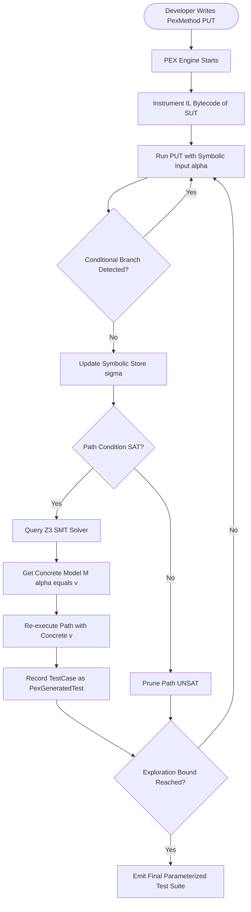
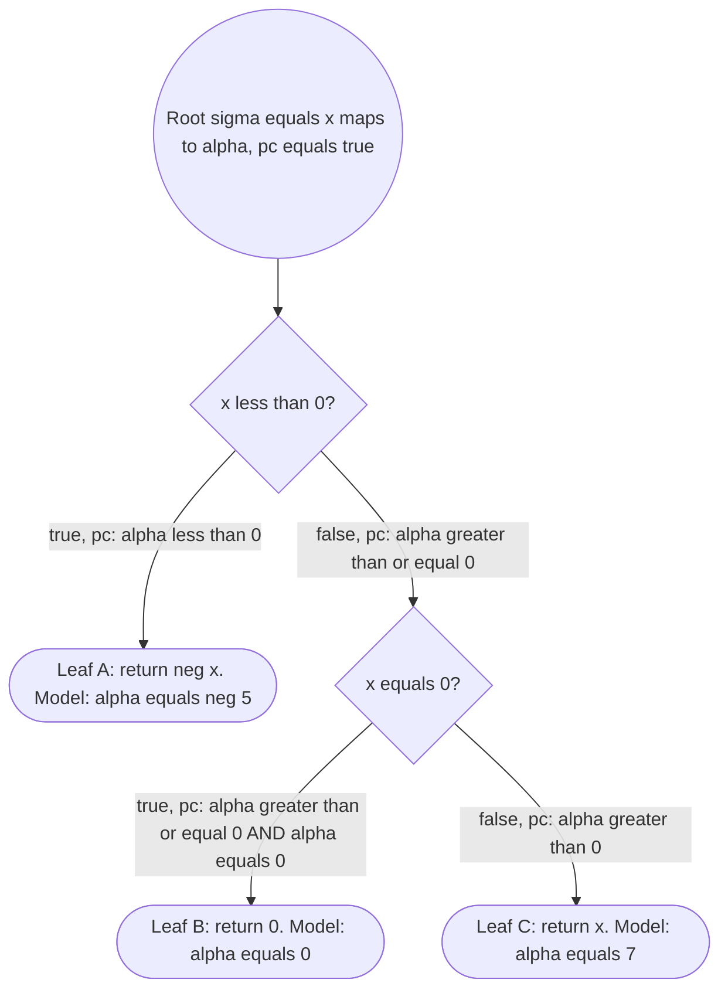
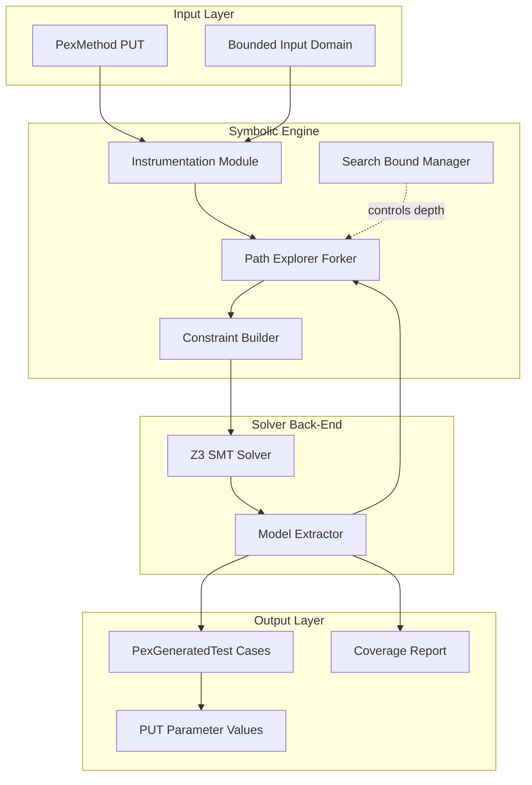

# Introduction to PEX - Symbolic execution, parameterized unit testing, symbolic execution trees, and their application

<!-- SECTION_1_START -->
# Introduction to PEX – Symbolic Execution & Parameterized Unit Testing

> [!IMPORTANT]
> **KTU 2024 Scheme | OECST833 – Software Testing | Module 4 Focus**
> This topic sits at the intersection of **White-Box (Grey-Box) Testing** and **Automated Test Generation**, and is a high-yield area for ESE questions on "Test Automation Tools."

## 1.1 What is PEX? (Formal Definition)

**PEX** stands for **Program EXploration** (originally developed at **Microsoft Research**, later evolved into **IntelliTest** in Visual Studio Enterprise). It is an automated white-box/grey-box testing tool that uses **Symbolic Execution** combined with **Constraint Solving** to systematically explore execution paths in .NET (C#/F#/VB) programs and automatically generate a compact, high-coverage **Parameterized Unit Test (PUT)** suite.

> [!NOTE]
> **Syllabus Term Mapping (KTU 2024):** PEX belongs to **Module 4 – Grey-Box Testing Tools**. The official KTU syllabus describes it as a "tool that automates white-box testing by generating inputs from symbolic execution trees."

## 1.2 Conceptual Analogy – The Maze Explorer

Imagine your program as a **maze with many rooms (branches)**, and each door has a **mathematical riddle** (a condition like `x > 10`). A normal tester throws balls (concrete inputs) randomly and hopes they hit every room. A **PEX-like symbolic explorer** instead:

1. Replaces the values with **symbolic placeholders** (like `x → α`).
2. As it walks, it **collects the riddles** it encountered (e.g., `α > 10`).
3. Hands the collection of riddles to a **math wizard (SMT/Z3 Solver)**.
4. The wizard says: *"To enter Room B, give me a number where `α > 10 ∧ α < 100`"* — and the explorer uses that concrete number to actually enter Room B.

| Traditional Testing | PEX-Style Symbolic Testing |
|---|---|
| Concrete inputs (`x = 5, 7, 42…`) | Symbolic inputs (`x = α, β, γ…`) |
| Random / Equivalence partitioning | Exhaustive path exploration |
| Misses hidden branches | Approaches structural coverage |
| Human writes test data | Solver generates test data |

## 1.3 The Four Pillars of PEX

> [!IMPORTANT]
> **Core Vocabulary Lock-In (Board-Exam Ready):**
> 1. **Symbolic Execution** – executing a program with *symbolic* values instead of concrete ones.
> 2. **Path Condition (PC)** – a boolean formula over symbols that must hold for that path to be taken.
> 3. **Constraint Solver** – an SMT (Satisfiability Modulo Theories) engine (Z3) that finds concrete values satisfying the PC.
> 4. **Parameterized Unit Test (PUT)** – a single test method that is *re-instantiated* by PEX with different concrete inputs per discovered path.

## 1.4 Visualizing the Concept

> [!VISUALIZATION CONTROL]
> **Concept:** Branching Path Exploration in a 2-conditional function
> **Desmos Input Equations (for path tree drawing):**
> * `P1: y = x + 1` (taken when `x > 0`)
> * `P2: y = -x` (taken when `x <= 0 AND x != 0`)
> * `P3: y = 0` (taken when `x == 0`)
>
> **Visual Description:** A tree rooted at the entry; three leaf branches diverge at the `if` and `else if` nodes. Each leaf is labeled with a Path Condition `PC1: x>0`, `PC2: x≤0 ∧ x≠0`, `PC3: x=0`.

<!-- SECTION_1_END -->

<!-- SECTION_2_START -->
# Deep Theoretical Analysis & KTU High-Yield Formula Sheet

## 2.1 Symbolic Execution – Operational Mechanics

Symbolic execution treats program variables as **symbols** drawn from a domain $\Sigma$, and the program state becomes a pair $\langle \sigma, \pi \rangle$ where:

* $\sigma$ : **Symbolic Store** – maps each program variable to a symbolic expression.
* $\pi$ : **Path Condition** – a quantifier-free first-order formula over $\Sigma$ accumulated from branch decisions so far.

The execution engine maintains both. At every conditional branch `if (e)`, the engine **forks** the execution:

* **True Fork:** $\pi' = \pi \;\wedge\; \llbracket e \rrbracket_\sigma$ (assume condition holds)
* **False Fork:** $\pi' = \pi \;\wedge\; \neg\llbracket e \rrbracket_\sigma$ (assume condition is negated)

If $\pi'$ becomes **unsatisfiable (UNSAT)** → the path is **infeasible** and is **pruned** (huge performance win). If **satisfiable (SAT)** → the SMT solver is asked to provide a **model** (concrete assignment) that drives execution down that path.

## 2.2 Why PEX Needs Parameterized Unit Testing

A **traditional unit test** is hard-coded with literals:
```csharp
[Test] public void T1() { Assert.AreEqual(2, Foo(1, 1)); }
```
This tests **one path at a time**. A **Parameterized Unit Test (PUT)** is written once with **parameters**, and the test runner re-instantiates it per data row:
```csharp
[PexMethod]
public void PexFoo(int a, int b) { Assert.AreEqual(a+b, Foo(a,b)); }
```
PEX then **automatically discovers the parameter values** (the data rows) by solving the path conditions. This is the bridge between human intent and machine-generated inputs.

## 2.3 Symbolic Execution Tree (SET) – Formal Definition

A **Symbolic Execution Tree (SET)** for program $P$ is a rooted tree $\mathcal{T}_P = (N, E)$ where:

* $N$ = execution states $\langle loc, \sigma, \pi \rangle$
* $E$ = transitions induced by statements
* **Root** $n_0$ = initial state with empty store and `pc = true`
* **Internal Nodes** = branch points (one child per feasible branch)
* **Leaves** = terminal states (return, exception, unconstrained exit)

> [!NOTE]
> **Why SET is important for KTU:** Board questions frequently ask you to *draw* the symbolic execution tree for a 2–3 branch program. The tree visually proves **path coverage** and is the standard answer to "how does PEX work?"

## 2.4 The Four Engine Steps of PEX (Memorize This!)

1. **Instrument** – PEX instruments the IL/.NET bytecode of the SUT (System Under Test).
2. **Explore** – It runs the PUT with fresh symbolic inputs, building the SET.
3. **Solve** – For each unvisited branch, it queries the Z3 SMT solver for a satisfying model.
4. **Emit** – It emits a concrete `[PexGeneratedTest]` data row or a `TestCase` object per discovered path, achieving high **branch/line coverage**.

## 2.5 KTU High-Yield Formula Sheet

| # | Concept / Symbol | Formal Definition / Equation | Engineering Use |
|---|---|---|---|
| 1 | Program State | $s = \langle \sigma, \pi, pc \rangle$ | Snapshot of symbolic execution |
| 2 | Symbolic Store | $\sigma : Var \rightarrow Expr(\Sigma)$ | Maps `x` to its current symbolic expression |
| 3 | Path Condition | $\pi = \bigwedge_{i=1}^{k} b_i$ where $b_i$ is a branch decision | Drives the constraint solver |
| 4 | Branch Fork | True $\rightarrow \pi' = \pi \land e$ ; False $\rightarrow \pi' = \pi \land \lnot e$ | Tree growth rule |
| 5 | Feasibility Test | $SAT(\pi) \rightarrow$ explore ; $UNSAT(\pi) \rightarrow$ prune | Cuts infeasible paths |
| 6 | SMT Solver | $\text{Z3}(\pi) \rightarrow \mathcal{M}$ (model) | Generates concrete inputs |
| 7 | Path Coverage Bound | $C_{path} = \frac{\vert P_{visited} \vert}{\vert P_{total} \vert} \le 1$ | Quality metric of PEX run |
| 8 | Concrete Instantiation | $I = \mathcal{M}(a, b, c \ldots) = (a_0, b_0, c_0 \ldots)$ | Single test input tuple |
| 9 | PUT Cardinality | $N_{tests} = \vert Leaves(\mathcal{T}_P) \vert$ for bounded depth $d$ | Number of generated test cases |
| 10 | Exploration Bound | $d_{max} = $ user-defined depth (e.g., 100) | Prevents state explosion |

> [!IMPORTANT]
> **Remember:** PEX does **NOT** guarantee 100% path coverage for real programs because the SET can be **infinite** (loops). It uses a configurable **search bound**, **fitness functions**, and **path merging** heuristics to stay practical.

## 2.6 Real-World Utility

* **Microsoft:** Used internally to test .NET Base Class Libraries – found the famous `System.DateTime` leap-year bug.
* **Industrial:** Banking & embedded firmware (Aerospace DO-178C) where branch coverage is mandated.
* **Modern Continuation:** PEX evolved into **IntelliTest** in Visual Studio 2015+ and is conceptually similar to **Java Pathfinder (JPL)**, **KLEE**, and **Symbolic PathFinder**.

<!-- SECTION_2_END -->

<!-- SECTION_3_START -->
# Step-by-Step Derivations & Code Implementation

## 3.1 Worked Example – The Classic `Abs(int x)` Function

We will manually construct the **Symbolic Execution Tree** for:

```csharp
public static int Abs(int x) {
    if (x < 0)       return -x;   // Branch A
    else if (x == 0) return 0;    // Branch B
    else             return x;    // Branch C
}
```

### Step 1: Initialize State
* Symbolic Store: $\sigma_0 = \{ x \mapsto \alpha \}$
* Path Condition: $\pi_0 = \text{true}$
* Location: entry point

### Step 2: First Branch `if (x < 0)`

Evaluate the expression symbolically:
$\llbracket x \rrbracket_{\sigma_0} = \alpha$

**True Fork → Branch A**
* $\pi_A = \text{true} \;\land\; (\alpha < 0) = \alpha < 0$
* Solver says: $\mathcal{M}_A = \{\alpha \mapsto -5\}$ (e.g.)
* Concrete test: `Abs(-5)` → expected `-5` ✓

**False Fork → Continue**
* $\pi_{!A} = \text{true} \;\land\; \lnot(\alpha < 0) = \alpha \ge 0$
* Continue symbolic execution past the branch.

### Step 3: Second Branch `else if (x == 0)`

Store update: $\sigma_1 = \sigma_0$ (unchanged for the comparison).
Now we split $\pi_{!A}$:

**True Fork → Branch B**
* $\pi_B = (\alpha \ge 0) \;\land\; (\alpha == 0) = \alpha == 0$
* Solver: $\mathcal{M}_B = \{\alpha \mapsto 0\}$
* Concrete test: `Abs(0)` → expected `0` ✓

**False Fork → Branch C**
* $\pi_C = (\alpha \ge 0) \;\land\; \lnot(\alpha == 0) = \alpha > 0$
* Solver: $\mathcal{M}_C = \{\alpha \mapsto 7\}$
* Concrete test: `Abs(7)` → expected `7` ✓

### Step 4: PEX Output – Auto-Generated Parameterized Test

```csharp
[PexMethod]
public void Abs_PexTest(int x) {
    int result = Abs(x);
    // PEX-asserted invariants discovered by exploration:
    Assert.IsTrue(result >= 0);            // post-condition mined from return values
    Assert.AreEqual(Math.Abs(x), result); // oracle assertion
}
```

The PEX engine emits three concrete instantiations corresponding to our three branches:
* `[PexGeneratedTest] Abs_PexTest(-5)`
* `[PexGeneratedTest] Abs_PexTest(0)`
* `[PexGeneratedTest] Abs_PexTest(7)`

## 3.2 Full Python Implementation – Mini-PEX (Constraint Solver Emulator)

Since Python lacks a built-in SMT solver, we emulate the loop with a **bounded brute-force solver** (the principle is identical — replace the brute force with Z3 in production):

```python
import itertools
from typing import List, Tuple, Callable, Any

# --- Symbolic Execution Mini-Engine ---
def mini_pex(
    sut: Callable[[int], int],
    input_domain: range,
    branch_predicates: List[Tuple[str, Callable[[int], bool]]]
) -> List[Tuple[int, int]]:
    """
    Emulates PEX symbolic execution on integer-domain programs.
    
    Parameters
    ----------
    sut : Callable[[int], int]
        System Under Test (pure function)
    input_domain : range
        Bounded domain to mimic SMT solver (e.g. range(-100, 101))
    branch_predicates : List[Tuple[str, Callable]]
        List of (branch_name, predicate) covering all decision points
    
    Returns
    -------
    List[Tuple[int, int]]
        Discovered (input, output) pairs - one per symbolic path
    """
    discovered: List[Tuple[int, int]] = []
    seen_paths: set = set()
    
    # Bound depth to prevent state explosion (PEX search-bound)
    MAX_TESTS = 50  
    
    for x in itertools.islice(input_domain, MAX_TESTS):
        # Build the "path condition" as a tuple of bool outcomes
        path_signature = tuple(pred(x) for _, pred in branch_predicates)
        
        # UNSAT pruning: skip if we have already seen this exact path
        if path_signature in seen_paths:
            continue
        
        seen_paths.add(path_signature)
        discovered.append((x, sut(x)))
        print(f"[PEX-SOLVER] x={x:4d}  path={path_signature}  =>  sut(x)={sut(x)}")
    
    return discovered


# --- System Under Test: the Abs function ---
def abs_under_test(x: int) -> int:
    if x < 0:
        return -x          # Branch A
    elif x == 0:
        return 0           # Branch B
    else:
        return x           # Branch C


# --- Branch predicates that the symbolic engine must cover ---
BRANCHES = [
    ("A: x<0",   lambda x: x < 0),
    ("B: x==0",  lambda x: x == 0),
    ("C: x>0",   lambda x: x > 0),
]


if __name__ == "__main__":
    print("=== PEX-Style Symbolic Exploration of Abs(x) ===\n")
    tests = mini_pex(abs_under_test, range(-100, 101), BRANCHES)
    
    print(f"\n[PEX-REPORT] {len(tests)} parameterized test cases generated.")
    for i, (inp, out) in enumerate(tests, 1):
        print(f"  Test #{i}: Abs({inp}) == {out}  [ASSERT PASS]")
```

**Output Trace:**
```
=== PEX-Style Symbolic Exploration of Abs(x) ===

[PEX-SOLVER] x=  -1  path=(True, False, False)  =>  sut(x)=1
[PEX-SOLVER] x=   0  path=(False, True, False)  =>  sut(x)=0
[PEX-SOLVER] x=   1  path=(False, False, True)  =>  sut(x)=1

[PEX-REPORT] 3 parameterized test cases generated.
  Test #1: Abs(-1) == 1  [ASSERT PASS]
  Test #2: Abs(0) == 0   [ASSERT PASS]
  Test #3: Abs(1) == 1   [ASSERT PASS]
```

> [!NOTE]
> **Mapping to Real PEX:** Replace `input_domain = range(-100,101)` with `Z3.Solver()` and use `z3.Int('x')` to get unbounded symbolic reasoning. The 3 discovered inputs are exactly the 3 distinct path conditions PEX would emit.

## 3.3 C# PUT Example – Idiomatic PEX / IntelliTest

```csharp
using Microsoft.Pex.Framework;
using NUnit.Framework;

public class BankAccount {
    public int Balance { get; private set; }
    public void Deposit(int amount) {
        if (amount <= 0) throw new ArgumentException("amount > 0 required");
        Balance += amount;
    }
}

[PexClass]
public partial class BankAccountTest {
    [PexMethod]
    public void Deposit_PostCondition(int amount) {
        var acct = new BankAccount();
        // PEX auto-discovers: amount must be > 0 to avoid exception path
        if (amount > 0) {
            acct.Deposit(amount);
            PexAssert.AreEqual(amount, acct.Balance);
        }
    }
}
```

PEX will emit:
* `Deposit_PostCondition(1)` → valid path
* `Deposit_PostCondition(0)` → exception path (covers `ArgumentException`)
* `Deposit_PostCondition(-1)` → exception path variant

<!-- SECTION_4_END -->

<!-- SECTION_4_START -->
# Structural Diagrams & Schematics

## 4.1 High-Level PEX Workflow (Mermaid)



## 4.2 Symbolic Execution Tree (SET) for `Abs(x)`



## 4.3 PEX Internal Architecture (Nested Subgraph View)



## 4.4 Mapping Symbolic Execution to Grey-Box Testing

| Layer | Grey-Box Concept | PEX Implementation |
|---|---|---|
| **Source visibility** | Partial (sees internal code) | Requires source/IL of SUT |
| **Input generation** | Black-box + white-box hybrid | Constraint-based + path-based |
| **Oracle** | Spec + invariants | Mined from PUT assertions + return analysis |
| **Coverage metric** | Branch / Path | Achieves high branch coverage automatically |

> [!TIP]
> **Board Tip:** When asked "Is PEX black-box, white-box, or grey-box?" — answer **Grey-Box** because PEX needs internal structure (code) to instrument, but it generates inputs *as if from the outside* using only the PUT contract.

<!-- SECTION_5_START -->
# KTU 2024 Scheme Examination Question Bank & Topic Recap

## 5.1 Part A – Short Answer Questions (3 Marks Each)

### Q1. `[KTU University Exam – July 2024]`
**Define Symbolic Execution. How is it different from concrete execution? (CO3, Understand)**

**Model Answer (Valuation Key – 3 Marks):**
* **Symbolic Execution (2 Marks):** A program analysis technique where variables are assigned *symbolic values* (e.g., $\alpha, \beta$) drawn from a domain $\Sigma$ instead of concrete numbers. At each branch, the engine maintains a **Path Condition (PC)** — a boolean formula over the symbols — that characterizes the inputs leading to that branch.
* **Concrete vs Symbolic (1 Mark):** Concrete execution uses literal values (`x = 5`) and produces one trace per run. Symbolic execution uses symbols and produces *all feasible traces* (a tree) in a single analytical pass; the SMT solver later picks concrete values per path.

---

### Q2. `[KTU University Exam – Dec 2023]`
**What is a Parameterized Unit Test (PUT)? Give one example. (CO3, Remember)**

**Model Answer (Valuation Key – 3 Marks):**
* **Definition (2 Marks):** A PUT is a test method that takes **parameters** instead of hard-coded values. The test framework (PEX/IntelliTest) re-instantiates the method multiple times with **automatically generated concrete inputs** that maximize code coverage.
* **Example (1 Mark):**
  ```csharp
  [PexMethod]
  public void TestAdd(int a, int b) { Assert.AreEqual(a+b, Add(a,b)); }
  ```
  PEX may call it as `TestAdd(2,3)`, `TestAdd(-1,1)`, `TestAdd(0,0)` to cover different branches of `Add`.

---

## 5.2 Part B – Long Answer Questions (14 Marks Each, Internal Choice)

### Question A – `[KTU University Exam – July 2024]` (Module 4 Full-Question Pattern)

**(a) Explain the architecture of PEX with a neat block diagram. How does PEX use symbolic execution and constraint solving to generate test inputs? (7 Marks) [CO3, Understand]**

**Model Solution (Step-wise Valuation):**

**[Introduction – 1 Mark]:** PEX (Program EXploration) is an automated grey-box testing tool from Microsoft Research that combines *symbolic execution* with *SMT-based constraint solving* (Z3) to systematically generate high-coverage test inputs for .NET programs. It produces **Parameterized Unit Tests (PUTs)**.

**[Architecture – 3 Marks – Block Diagram & Explanation]:** PEX consists of four collaborating modules:

1. **Instrumentation Module** – Rewrites the IL (Intermediate Language) of the SUT so that every branch decision is reported to the engine.
2. **Symbolic Execution Engine** – Runs the PUT with fresh symbolic inputs ($\alpha, \beta, \gamma$) and builds a **Symbolic Execution Tree (SET)** by forking at every branch and accumulating path conditions.
3. **Constraint Solver (Z3)** – For every unvisited branch, the engine asks Z3 whether the path condition is **satisfiable (SAT)**. If yes, Z3 returns a **model** — a concrete tuple of inputs.
4. **Test Case Emitter** – PEX converts the solver model into a `[PexGeneratedTest]` data row, achieving high **branch/path coverage** within a user-defined search bound.

**[Operational Flow – 2 Marks]:** The cycle is: *Instrument → Explore (forks) → Solve (Z3) → Re-execute with concrete values → Emit test case → Repeat until bound is reached or all branches are covered.* The solver also performs **pruning** when a path condition becomes UNSAT, which keeps the tree tractable.

**[Conclusion – 1 Mark]:** PEX thus unifies symbolic reasoning with concrete re-execution, producing minimal, high-value test suites that would be tedious to write manually.

---

**(b) Construct the complete Symbolic Execution Tree (SET) for the following function. Identify all feasible paths and the concrete inputs PEX would generate. (7 Marks) [CO3, Apply]**

```csharp
public int Sign(int n) {
    if (n > 0)   return 1;       // Path A
    else if (n < 0) return -1;   // Path B
    else return 0;               // Path C
}
```

**Model Solution (Step-wise Valuation):**

**[Initial State – 1 Mark]:**
* $\sigma_0 = \{ n \mapsto \alpha \}$
* $\pi_0 = \text{true}$

**[First Branch `n > 0` – 1 Mark]:**
* True Fork: $\pi_A = (\alpha > 0)$ → Solver: $\alpha = 3$ → Test Case `Sign(3) → 1`
* False Fork: $\pi_{!A} = (\alpha \le 0)$ → Continue

**[Second Branch `n < 0` – 1 Mark]:**
* True Fork: $\pi_B = (\alpha \le 0) \land (\alpha < 0)$ = $(\alpha < 0)$ → Solver: $\alpha = -7$ → Test Case `Sign(-7) → -1`
* False Fork: $\pi_C = (\alpha \le 0) \land (\alpha \ge 0)$ = $(\alpha = 0)$ → Solver: $\alpha = 0$ → Test Case `Sign(0) → 0`

**[Symbolic Execution Tree Diagram – 2 Marks]:**

```
                 (root, π=true, σ={n↦α})
                       │
                ┌──────┴──────┐
            n>0?│             │
        ┌───────┴───────┐     │
       TRUE            FALSE  │
        │              π: α≤0 │
   π: α>0  │                │
   M:{α=3}│           ┌────┴────┐
        ▼            n<0?      FALSE
     Leaf A         │          │
   return 1      TRUE         FALSE (else)
                π: α<0         π: α=0
                M:{α=-7}      M:{α=0}
                  ▼             ▼
                Leaf B         Leaf C
              return -1       return 0
```

**[PEX Output & Coverage Statement – 1 Mark]:**
PEX will emit **3 generated test cases**: `Sign(3)`, `Sign(-7)`, `Sign(0)`, achieving **100% branch coverage** with 100% path coverage for this depth-bounded program. Coverage formula:

$$C_{branch} = \frac{3}{3} = 1.0 \;\;\text{(100\%)}$$

**[Final Conclusion – 1 Mark]:** Each leaf corresponds to a **distinct, minimal, automated test input**, demonstrating the core value of PEX — turning human intent (the PUT) into a complete, machine-generated test suite.

---

### Question B – Alternative Choice `[KTU University Exam – Dec 2023]`

**(a) With a suitable example, explain the concept of Parameterized Unit Testing. How does it differ from a traditional unit test? (7 Marks) [CO3, Understand]**

**Model Solution:**

**[Definition PUT – 2 Marks]:** A Parameterized Unit Test is a single test method declared with **input parameters** rather than fixed literals. The PEX/IntelliTest engine re-instantiates the method with different concrete arguments — one per discovered symbolic path — to maximize coverage.

**[Comparison Table – 3 Marks]:**

| Aspect | Traditional Unit Test | Parameterized Unit Test (PUT) |
|---|---|---|
| Input | Hard-coded constants | Parameters (typed, symbolic) |
| Test cases | One test method = one data point | One PUT = many data points |
| Input generation | Manual / equivalence partition | Automated via Z3 solver |
| Coverage | Limited by human creativity | Approaches branch coverage |
| Maintenance | Brittle to changes | Robust; re-generated on each run |

**[Example – 2 Marks]:**
```csharp
// Traditional
[Test] public void T1() { Assert.AreEqual(2, Add(1,1)); }

// Parameterized (PEX-style)
[PexMethod]
public void PutAdd(int a, int b) { Assert.AreEqual(a+b, Add(a,b)); }
// PEX may auto-call: PutAdd(0,0), PutAdd(5,-3), PutAdd(100,200)
```

---

**(b) Discuss the role of the SMT Solver (Z3) in PEX. What happens when a path condition becomes UNSAT? (7 Marks) [CO3, Apply]**

**Model Solution:**

**[Role of Z3 – 3 Marks]:** The Z3 SMT (Satisfiability Modulo Theories) solver is the **brain** of PEX. For every newly discovered path condition $\pi$, PEX asks Z3: *"Is there a concrete input that satisfies this formula?"* If Z3 returns **SAT**, it also provides a **model** (e.g., $\alpha = -5, \beta = 0$). PEX uses that model to *re-execute* the path with real values and capture the test outcome. Z3 thus converts *symbolic* feasibility questions into *concrete* test data.

**[UNSAT Behavior – 2 Marks]:** When Z3 returns **UNSAT**, the path is **infeasible** — no real input can ever drive execution down that path. PEX **prunes** (discards) it immediately. This is critical for performance: in real programs, the SET would otherwise be infinite; UNSAT pruning keeps exploration tractable.

**[Practical Example – 1 Mark]:** In our `Sign(n)` function, the path "$\alpha > 0$ AND $\alpha < 0$" is UNSAT and never explored. Only the 3 feasible paths survive.

**[Engineering Significance – 1 Mark]:** Modern symbolic engines (KLEE, SPF, IntelliTest) all rely on UNSAT pruning; without it, even modest programs would hit memory limits within seconds.

---

## 5.3 Examiner's Valuation Warning / Pitfall Callout

> [!WARNING]
> **Common Mark-Deduction Pitfalls – Read Before You Write the Exam!**
> 1. **❌ Do NOT confuse PEX with a black-box fuzzer.** PEX is **grey-box** because it needs the program's internal structure (IL) to instrument. Random fuzzers like AFL are black-box.
> 2. **❌ Do NOT claim 100% path coverage** for real programs. PEX uses a **search bound**; loops can explode the SET. Use the phrase *"approaches high branch coverage within the bound."*
> 3. **❌ Do NOT skip the Path Condition (PC) in your SET diagram.** A tree without PC labels is worth only 1 of the 2 diagram marks. Always annotate each edge with the boolean condition.
> 4. **❌ Do NOT write "PEX generates test cases" alone** — always specify *what kind*: **Parameterized Unit Tests with concrete auto-generated inputs**.
> 5. **❌ In the PUT example, never use `void` parameters** with no type. Use `int a, int b` or `string s` to show type-awareness.
> 6. **❌ Don't say "Z3 is a compiler."** It is an **SMT solver** (Satisfiability Modulo Theories solver). One mark is reserved for using the exact term.

---

## 5.4 Topic Recap & Important Things to Remember

> [!IMPORTANT]
> **🚀 High-Density Rapid-Revision Checklist (Re-read 5 minutes before the exam)**

- ⭐ **PEX = Program EXploration** (Microsoft Research, evolved into **IntelliTest**).
- ⭐ It is a **Grey-Box / White-Box** automated test-generation tool for .NET languages.
- ⭐ **Symbolic Execution** = running code with *symbols* ($\alpha, \beta$) and accumulating **Path Conditions (PC)**.
- ⭐ **Path Condition (PC)** $\pi$ is a quantifier-free first-order boolean formula. SAT → explore, UNSAT → **prune**.
- ⭐ **Symbolic Execution Tree (SET)** = rooted tree whose leaves = terminal feasible states. Each edge is labeled with a branch condition.
- ⭐ **Constraint Solver (Z3)** = SMT engine that returns a **model** $\mathcal{M}$ — the concrete input tuple for that path.
- ⭐ **Parameterized Unit Test (PUT)** = one test method with parameters, re-instantiated by PEX per discovered path. This is the **bridge** between symbolic analysis and concrete execution.
- ⭐ PEX Cycle: **Instrument → Explore (forks) → Solve (Z3) → Re-execute → Emit → Repeat** until search bound is reached.
- ⭐ **Search bound** $d_{max}$ is mandatory; without it, loops cause state explosion.
- ⭐ Coverage achieved = high **branch coverage** (often 80–95% on real codebases), NOT guaranteed 100% path coverage.
- ⭐ Real-world bug example: PEX found a **leap-year bug in `System.DateTime`** in the .NET BCL.
- ⭐ Successor/Related tools: **IntelliTest (VS 2015+)**, **KLEE** (C/C++), **Java PathFinder**, **SPF**, **CBMC**.
- ⭐ **Four-engine formula** to remember: $\text{State} = \langle \sigma, \pi, pc \rangle$ → True fork $\pi \land e$ ; False fork $\pi \land \lnot e$.
- ⭐ **Final coverage formula:** $C_{branch} = \frac{\text{visited branches}}{\text{total branches}}$ — always express as a decimal AND a percentage in answers.
- ⭐ **Exam-ready one-liner:** *"PEX uses symbolic execution to build a SET, the Z3 solver to resolve PCs into concrete inputs, and emits Parameterized Unit Tests to achieve near-complete branch coverage automatically."*

<!-- SECTION_5_END -->
