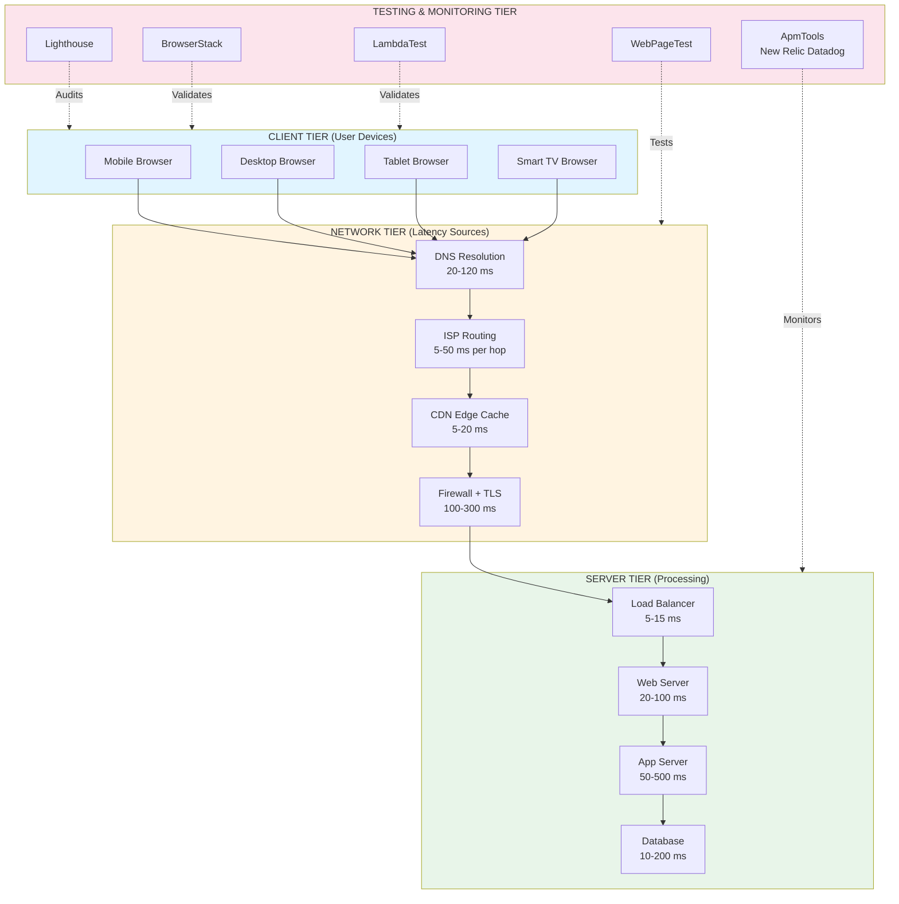
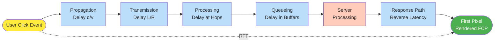
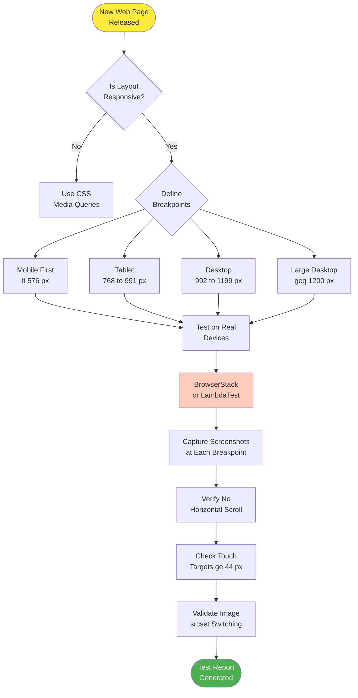
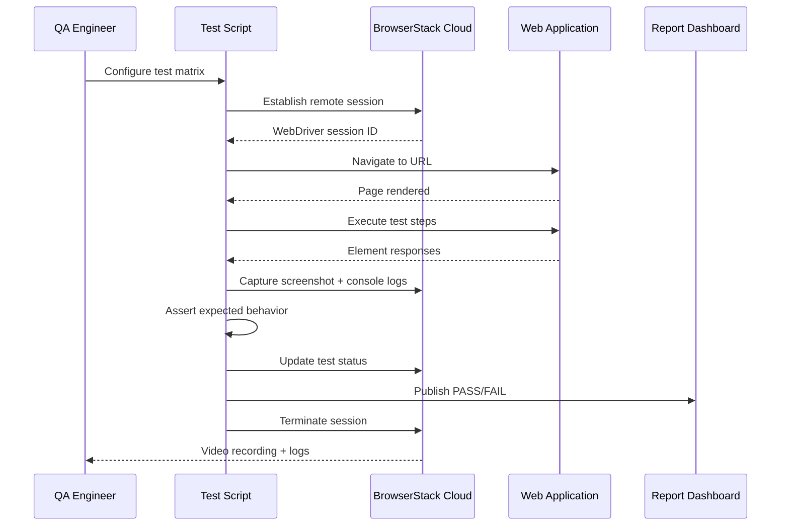

# Performance Testing - Network latency testing, browser compatibility, responsive testing across multiple devices (e.g., BrowserStack, LambdaTest)

<!-- SECTION_1_START -->
# Performance Testing: Network Latency, Browser Compatibility & Responsive Testing

## 1. Core Technical Definition & Intuitive Overview

### 1.1 Formal KTU 2024 Syllabus Definition

**Performance Testing** is a non-functional software testing technique that determines the system's performance characteristics in terms of **responsiveness**, **scalability**, **stability**, and **speed** under varying workload conditions. As per the KTU 2024 Scheme (OECST833 - Software Testing, Module 4), performance testing encompasses three critical sub-domains:

1. **Network Latency Testing** – Quantifying the time delay experienced during data transmission across a network medium.
2. **Browser Compatibility Testing** – Validating consistent functional and visual behavior of a web application across heterogeneous browser engines, versions, and operating systems.
3. **Responsive Testing Across Multiple Devices** – Verifying adaptive layout, breakpoint correctness, and UI fidelity across diverse screen dimensions, pixel densities, and input modalities (touch vs. pointer).

> [!IMPORTANT]
> **KTU 2024 Module 4 Highlight:** Performance testing is classified as a **non-functional** testing type (alongside usability, security, and reliability) — it does **not** validate *what* the system does, but *how well* it does it under stipulated constraints.

### 1.2 Conceptual Analogy / Intuition

Imagine a **multi-lane toll booth on a national highway** (this is your web application):

- **Network Latency Testing** = measuring the time taken for a vehicle to reach the toll booth from the entry point. A vehicle starting from 500 meters away will take longer to arrive than one starting 50 meters away — this travel time is *latency*.
- **Browser Compatibility Testing** = checking whether the toll booth accepts payment from all vehicle types (cars, trucks, buses with different toll-pass technologies — RFID, FASTag, cash). If a specific vehicle's tag is rejected, the system fails for that "browser type".
- **Responsive Testing** = ensuring the toll booth lanes automatically expand or contract based on the traffic volume (small road = 1 lane, 6-lane highway = 6 lanes). The booth must "respond" to its environment.

> [!NOTE]
> **Real-World Industry Context:** Major platforms like Amazon lose approximately **1% of revenue for every 100 ms increase in page load latency**. Google's algorithm explicitly down-ranks slow websites. Hence, performance testing is a **business-critical** engineering activity — not a luxury.

### 1.3 Key Performance Metrics (Standard Engineering Constants)

The following metrics are universally standardized by the **Apache JMeter**, **Google Lighthouse**, and **W3C Web Performance Working Group**:

| Metric | Symbol | Standard Threshold | Description |
|--------|--------|---------------------|-------------|
| Time to First Byte | **TTFB** | < **800 ms** | Time for browser to receive first byte from server |
| First Contentful Paint | **FCP** | < **1.8 s** | Time until first text/image is rendered |
| Largest Contentful Paint | **LCP** | < **2.5 s** | Time until largest visible element is rendered |
| First Input Delay | **FID** | < **100 ms** | Time from user interaction to browser response |
| Cumulative Layout Shift | **CLS** | < **0.1** | Visual stability score (0 to 1) |
| Time to Interactive | **TTI** | < **3.8 s** | Time until page becomes fully interactive |
| Total Blocking Time | **TBT** | < **200 ms** | Total time main thread is blocked |

> [!VISUALIZATION CONTROL]
> **Concept:** Core Web Vitals Threshold Visualization
> **Plot Type:** Horizontal bar chart with threshold markers
> **Input Data Points:**
> * TTFB bar: 0 to 2000 ms with marker at 800 ms
> * LCP bar: 0 to 5 s with marker at 2.5 s
> * FID bar: 0 to 300 ms with marker at 100 ms
> * CLS bar: 0 to 0.5 with marker at 0.1
> **Visual Description:** A dashboard with green (good), yellow (needs improvement), and red (poor) zones. Students should observe that 75% of the LCP budget (2.5 s) is consumed before users perceive "slowness".

---

<!-- SECTION_1_END -->

<!-- SECTION_2_START -->
# Deep Theoretical Analysis & KTU High-Yield Formula Sheet

## 2.1 Network Latency Testing — Theoretical Framework

### 2.1.1 Defining Latency

**Network Latency** ($\mathcal{L}$) is formally defined as the time interval between a data packet's transmission at the source node and its reception at the destination node. It is measured in **milliseconds (ms)** and comprises four primary components:

$$\mathcal{L}_{total} = \mathcal{L}_{propagation} + \mathcal{L}_{transmission} + \mathcal{L}_{processing} + \mathcal{L}_{queueing}$$

Where:
- $\mathcal{L}_{propagation} = \dfrac{d}{v_{medium}}$ — distance divided by signal propagation speed
- $\mathcal{L}_{transmission} = \dfrac{L_{packet}}{R_{bandwidth}}$ — packet size divided by link bandwidth
- $\mathcal{L}_{processing}$ — router/switch processing delay (typically 5–50 ms per hop)
- $\mathcal{L}_{queueing}$ — time spent in router buffers (M/M/1 queuing model)

### 2.1.2 Round-Trip Time (RTT) vs. One-Way Latency

**RTT (Round-Trip Time)** is the sum of one-way latency from source to destination PLUS the one-way latency from destination back to source. Most user-facing applications (HTTP, TCP) operate on RTT.

$$RTT = 2 \times \mathcal{L}_{one-way} + \mathcal{L}_{server\_processing}$$

> [!NOTE]
> **Critical Distinction (Frequently Tested):** TCP requires a **3-way handshake** (SYN → SYN-ACK → ACK) before data transfer. The connection establishment latency is therefore **$1.5 \times RTT$** (handshake) + data transfer time. This is why **TCP Fast Open (TFO)** and **QUIC protocols** were developed.

### 2.1.3 Latency Tolerance Thresholds (Nielsen's Heuristics Adapted)

| User Action | Acceptable Latency | User Perception |
|-------------|-------------------|-----------------|
| Instant response | **< 100 ms** | Feels instantaneous |
| Slight delay | **100 ms – 1 s** | User notices but flow is uninterrupted |
| Noticeable | **1 s – 10 s** | User attention begins to drift |
| Interrupted | **> 10 s** | User likely abandons the task |

## 2.2 Browser Compatibility Testing — Theoretical Framework

### 2.2.1 The Compatibility Matrix

A **Browser Compatibility Matrix** is a 3-dimensional testing artifact with axes:
- **Browsers** (Chrome, Firefox, Safari, Edge, Opera, Samsung Internet)
- **Versions** (e.g., Chrome 120, 119, 118...)
- **Operating Systems** (Windows 11, macOS Sonoma, Ubuntu 22.04, iOS 17, Android 14)

Mathematically, the test coverage surface is:

$$C_{compatibility} = \vert B \vert \times \vert V \vert \times \vert OS \vert$$

Where $\vert B \vert$, $\vert V \vert$, and $\vert OS \vert$ denote cardinalities of each set.

### 2.2.2 Browser Rendering Engine Taxonomy

| Engine | Browsers | KTU Exam Relevance |
|--------|----------|---------------------|
| **Blink** (Forked from WebKit) | Chrome, Edge, Opera, Brave | Most used globally (~65% market share) |
| **Gecko** | Firefox, Thunderbird | Mozilla Foundation maintained |
| **WebKit** | Safari (macOS/iOS), older Chrome | Required for Apple ecosystem |
| **Trident** (deprecated) | Internet Explorer 6–11 | Legacy enterprise systems |

> [!IMPORTANT]
> **Vendor Prefix (CSS Compatibility):** Browser-specific experimental CSS properties historically required prefixes: `-webkit-` (Chrome/Safari), `-moz-` (Firefox), `-ms-` (IE/Edge legacy), `-o-` (Opera pre-Blink). Modern CSS rarely requires them but is still asked in KTU exams for legacy code understanding.

### 2.2.3 Cross-Browser Defect Classification

1. **Rendering Defects** — Layout shifts, font fallback issues, CSS misinterpretation
2. **JavaScript Runtime Defects** — API unavailability (e.g., `fetch()` not in IE11)
3. **Media Format Defects** — Codec support (H.264, WebP, AV1, HEVC)
4. **Security Policy Defects** — CORS, CSP, mixed-content blocking differences
5. **Input Behavior Defects** — Touch vs. mouse event handling, keyboard shortcuts

## 2.3 Responsive Testing — Theoretical Framework

### 2.3.1 Viewport-Based Breakpoint Standards

The **viewport** is the visible area of a web page on a device. Standard breakpoints per **Bootstrap 5** and **Material Design 3** specifications:

| Breakpoint Class | Min Width ($\geq$) | Target Devices |
|------------------|---------------------|----------------|
| `xs` (Extra Small) | 0 px | Phones portrait (< 576 px) |
| `sm` (Small) | 576 px | Phones landscape |
| `md` (Medium) | 768 px | Tablets |
| `lg` (Large) | 992 px | Desktops |
| `xl` (Extra Large) | 1200 px | Large desktops |
| `xxl` | 1400 px | Ultra-wide / 4K displays |

### 2.3.2 Responsive Design Testing Dimensions

A complete responsive test must validate **five orthogonal dimensions**:

1. **Layout Fluidity** — Element reflow at each breakpoint
2. **Image Adaptability** — Resolution switching (`srcset`, `picture` element)
3. **Typography Scaling** — Font size legibility (minimum 16 px body text per WCAG)
4. **Touch Target Size** — Minimum **48 × 48 dp** (Material) or **44 × 44 px** (Apple HIG)
5. **Orientation Behavior** — Portrait ↔ landscape transitions

### 2.3.3 Device Pixel Ratio (DPR) Theory

The **DPR** is the ratio between physical device pixels and CSS logical pixels:

$$DPR = \dfrac{P_{physical}}{P_{css}}$$

For example, an iPhone 15 Pro has a physical resolution of 2556 × 1179 pixels but a CSS viewport of 852 × 393 pixels, yielding $DPR = 3.0$. This means images must be served at **3× resolution** to appear crisp on "Retina" displays.

## 2.4 KTU High-Yield Formula Sheet

| # | Formula / Concept | Notation | Application Context |
|---|-------------------|----------|---------------------|
| 1 | Total Latency | $\mathcal{L}_{total} = \mathcal{L}_{prop} + \mathcal{L}_{trans} + \mathcal{L}_{proc} + \mathcal{L}_{queue}$ | Network performance |
| 2 | Propagation Latency | $\mathcal{L}_{prop} = d / v$ | Geospatial delay |
| 3 | Transmission Latency | $\mathcal{L}_{trans} = L / R$ | Bandwidth-bound delay |
| 4 | Round-Trip Time | $RTT = 2\mathcal{L}_{ow} + \mathcal{L}_{server}$ | HTTP, TCP testing |
| 5 | TCP Connection Setup | $T_{connect} = 1.5 \times RTT$ | Three-way handshake |
| 6 | Throughput | $\Theta = L_{payload} / T_{transfer}$ (bytes/sec) | Bandwidth utilization |
| 7 | Compatibility Coverage | $C = \vert B \vert \times \vert V \vert \times \vert OS \vert$ | Test matrix sizing |
| 8 | Device Pixel Ratio | $DPR = P_{phys} / P_{css}$ | Retina/HiDPI testing |
| 9 | Apdex Score (User Satisfaction) | $Apdex = \dfrac{S + T/2}{N}$ where $N$ = total, $S$ = satisfied, $T$ = tolerating | Performance benchmarking |
| 10 | Bandwidth-Delay Product | $BDP = R \times RTT$ (bits) | TCP window sizing |
| 11 | Page Weight Budget | $W_{page} = \sum W_{resource}$ (CSS + JS + IMG + fonts) | LCP optimization |
| 12 | CLS Calculation | $CLS = \sum (impact\ fraction \times distance\ fraction)$ | Visual stability |

> [!IMPORTANT]
> **Apdex Score (KTU Favorite):** The **Application Performance Index (Apdex)** is a numerical measure of user satisfaction ranging from 0 (no users satisfied) to 1 (all users satisfied). Default threshold $T$ is **0.5 seconds**. Example: If $N = 100$ users, $S = 70$ satisfied (< 0.5 s), $T_{tolerating} = 20$ (0.5–4 s), $F = 10$ frustrated (> 4 s), then $Apdex = (70 + 20/2) / 100 = 0.80$ (Good rating).

## 2.5 Cloud-Based Cross-Browser Testing Platforms

### 2.5.1 BrowserStack
- **Founded:** 2011, Mumbai, India (by Ritesh Arora and Nakul Aggarwal)
- **Architecture:** Real device cloud (NOT emulators — actual iPhones, Samsungs in data centers)
- **Pricing Model:** Subscription-based with concurrent session limits
- **KTU Relevance:** Frequently cited as the industry-standard tool

### 2.5.2 LambdaTest
- **Founded:** 2017
- **Architecture:** Hybrid — real devices + cloud-based emulators
- **Distinguishing Feature:** AI-powered visual regression testing via **SmartUI**
- **Integration:** Native plugins for Jenkins, GitHub Actions, GitLab CI, Azure DevOps

### 2.5.3 Tool Comparison Matrix

| Feature | BrowserStack | LambdaTest | Sauce Labs |
|---------|--------------|------------|------------|
| Real Device Count | **3000+** | 3000+ | 2000+ |
| Automation Frameworks | Selenium, Playwright, Cypress | All major + HyperExecute | All major |
| Free Tier | Limited (3 trials) | Limited lifetime | None |
| Geolocation Testing | **Yes** | Yes | Yes |
| Network Throttling | **Yes** (built-in) | Yes | Yes |

---

<!-- SECTION_2_END -->

<!-- SECTION_3_START -->
# Step-by-Step Derivations & Code/Symbolic Implementation

## 3.1 Worked Example 1: Network Latency Calculation

### Problem Statement
A web application is hosted on a server in **Mumbai (India)**. A user in **Thiruvananthapuram (Kerala)** accesses the homepage. The one-way fiber optic distance is approximately $d = 1800$ km. The HTTP request payload is $L_{req} = 2$ KB and the response payload is $L_{res} = 150$ KB. The link bandwidth is $R = 100$ Mbps. The signal travels at $v = 2 \times 10^8$ m/s in fiber. Server processing time is $T_{server} = 50$ ms. There are $h = 8$ network hops, each contributing $T_{hop} = 5$ ms. Compute the total page load time and verify it falls within the LCP threshold of 2.5 s.

### Step-by-Step Derivation

**Step 1: Compute Propagation Latency**
$$\mathcal{L}_{prop} = \frac{d}{v} = \frac{1800 \times 10^3 \text{ m}}{2 \times 10^8 \text{ m/s}} = 9 \times 10^{-3} \text{ s} = 9 \text{ ms}$$

**Step 2: Compute Transmission Latency (Request)**
$$\mathcal{L}_{trans,req} = \frac{L_{req}}{R} = \frac{2 \times 10^3 \text{ bytes} \times 8 \text{ bits/byte}}{100 \times 10^6 \text{ bits/s}} = \frac{16000}{10^8} = 0.16 \text{ ms}$$

**Step 3: Compute Transmission Latency (Response)**
$$\mathcal{L}_{trans,res} = \frac{L_{res}}{R} = \frac{150 \times 10^3 \times 8}{100 \times 10^6} = \frac{1.2 \times 10^6}{10^8} = 12 \text{ ms}$$

**Step 4: Compute Queueing + Processing Latency**
$$\mathcal{L}_{queue+proc} = h \times T_{hop} = 8 \times 5 = 40 \text{ ms}$$

**Step 5: One-Way Latency (from user to server)**
$$\mathcal{L}_{ow,up} = \mathcal{L}_{prop} + \mathcal{L}_{trans,req} + \mathcal{L}_{queue+proc} = 9 + 0.16 + 40 = 49.16 \text{ ms}$$

**Step 6: One-Way Latency (from server to user, with response)**
$$\mathcal{L}_{ow,down} = \mathcal{L}_{prop} + \mathcal{L}_{trans,res} + \mathcal{L}_{queue+proc} + T_{server} = 9 + 12 + 40 + 50 = 111 \text{ ms}$$

**Step 7: Round-Trip Time (HTTP request + response)**
$$RTT = \mathcal{L}_{ow,up} + \mathcal{L}_{ow,down} = 49.16 + 111 = 160.16 \text{ ms}$$

**Step 8: Add TCP 3-Way Handshake (for first request)**
$$T_{connect} = 1.5 \times RTT = 1.5 \times 160.16 = 240.24 \text{ ms}$$

**Step 9: Add TLS Handshake (HTTPS, typically 2 extra RTTs)**
$$T_{TLS} = 2 \times RTT = 320.32 \text{ ms}$$

**Step 10: Total First-Byte Time (TTFB)**
$$TTFB = T_{connect} + T_{TLS} + T_{server} = 240.24 + 320.32 + 50 = 610.56 \text{ ms}$$

**Step 11: Total Page Load Time (assuming DOM render = 1× RTT)**
$$T_{page} = TTFB + RTT = 610.56 + 160.16 = 770.72 \text{ ms}$$

### Conclusion
$$T_{page} = 770.72 \text{ ms} < 2500 \text{ ms} \text{ (LCP threshold)} \implies \text{PASS} \checkmark$$

> [!NOTE]
> This calculation ignores DNS resolution time (typically 20–120 ms) and CDN edge server proximity. In production, a **CDN (Content Delivery Network)** can reduce $\mathcal{L}_{prop}$ by **60–80%** by serving content from a geographically closer PoP (Point of Presence).

## 3.2 Worked Example 2: Apdex Score Calculation

### Problem Statement
A load test with $N = 200$ concurrent users produced the following response time distribution:
- **Satisfied** users (response time $\leq 0.5$ s): $S = 150$
- **Tolerating** users (response time between 0.5 s and 4 s): $T = 35$
- **Frustrated** users (response time $> 4$ s): $F = 15$

Threshold $T = 0.5$ s. Compute the Apdex score and interpret the rating.

### Step-by-Step Derivation

**Step 1: Verify the total user count**
$$N = S + T + F = 150 + 35 + 15 = 200 \checkmark$$

**Step 2: Apply the Apdex formula**
$$Apdex = \frac{S + \frac{T}{2}}{N} = \frac{150 + \frac{35}{2}}{200} = \frac{150 + 17.5}{200} = \frac{167.5}{200}$$

**Step 3: Final score**
$$Apdex = 0.8375 \approx 0.84$$

**Step 4: Interpret the rating (industry standard)**
- **0.85 – 1.00:** Excellent (Happy users)
- **0.70 – 0.84:** Good (Acceptable) ← Our result lies here
- **0.50 – 0.69:** Fair (Needs improvement)
- **0.00 – 0.49:** Poor (Critical action required)

### Conclusion
The application's Apdex of **0.84** is rated **"Good"** but slightly below the 0.85 excellence threshold. The **17.5% frustrated users** ($F/N = 7.5\%$) should be investigated first.

## 3.3 Worked Example 3: Compatibility Matrix Coverage Calculation

### Problem Statement
A QA team must test a web app across:
- **5 browsers**: Chrome, Firefox, Safari, Edge, Samsung Internet
- **3 versions** per browser (latest + 2 prior)
- **4 operating systems**: Windows 11, macOS Sonoma, Android 14, iOS 17
- **3 viewports** per OS: mobile, tablet, desktop

Compute the total unique test configurations.

### Step-by-Step Derivation

**Step 1: Browser × Version combinations**
$$C_{bv} = \vert B \vert \times \vert V \vert = 5 \times 3 = 15$$

**Step 2: Operating System combinations** (4 OSes are mutually exclusive, but each has 3 viewport variants)
$$C_{os} = \vert OS \vert \times \vert VP \vert = 4 \times 3 = 12$$

**Step 3: Total unique configurations**
$$C_{total} = C_{bv} \times C_{os} = 15 \times 12 = 180$$

**Step 4: Compute reduction via risk-based prioritization**
If the team applies a **risk-weighted prioritization** (test critical path on all 180, but peripheral features on a reduced subset of 30 high-traffic configurations), the effective test effort is:
$$C_{reduced} = 30 + 0.3 \times (180 - 30) = 30 + 45 = 75 \text{ configurations}$$

### Conclusion
$$C_{total} = 180 \text{ unique configurations}$$

## 3.4 Code Implementation 1: Automated Latency Testing in Python

```python
"""
Module: latency_tester.py
Purpose: Automated network latency and TTFB measurement using HTTP HEAD requests
KTU Relevance: OECST833 Module 4 - Network Latency Testing
"""

import time
import statistics
import logging
from typing import Dict, List, Tuple
from urllib.parse import urlparse
import urllib.request
import ssl

# Configure logging for audit trail (production-grade requirement)
logging.basicConfig(
    level=logging.INFO,
    format="%(asctime)s [%(levelname)s] %(message)s"
)
logger = logging.getLogger(__name__)

# Standard HTTP timeout ceiling (in seconds)
DEFAULT_TIMEOUT: float = 10.0
# Number of probing iterations for statistical reliability
DEFAULT_ITERATIONS: int = 10


def measure_ttfb(url: str, timeout: float = DEFAULT_TIMEOUT) -> float:
    """
    Measure Time to First Byte (TTFB) for a given URL.

    Args:
        url: Target endpoint (must include scheme http:// or https://)
        timeout: Maximum wait time in seconds

    Returns:
        TTFB in milliseconds (float). Returns -1.0 on failure.

    Raises:
        ValueError: If URL scheme is invalid
    """
    parsed = urlparse(url)
    if parsed.scheme not in ("http", "https"):
        raise ValueError(f"Invalid URL scheme: {parsed.scheme}. Use http or https.")

    # SSL context for HTTPS endpoints (skip certificate verification for testing)
    ctx = ssl.create_default_context()
    ctx.check_hostname = False
    ctx.verify_mode = ssl.CERT_NONE

    try:
        request = urllib.request.Request(url, method="HEAD")
        start_ns = time.perf_counter_ns()  # Nanosecond precision
        with urllib.request.urlopen(request, timeout=timeout, context=ctx) as response:
            # Connection established and first byte received
            ttfb_ms = (time.perf_counter_ns() - start_ns) / 1_000_000.0
            logger.info(
                f"TTFB measured: {ttfb_ms:.2f} ms | Status: {response.status}"
            )
            return ttfb_ms
    except Exception as exc:
        logger.error(f"TTFB measurement failed for {url}: {exc}")
        return -1.0


def measure_total_latency(
    url: str,
    iterations: int = DEFAULT_ITERATIONS
) -> Dict[str, float]:
    """
    Perform N iterations of latency measurement and return statistical summary.

    Args:
        url: Target endpoint
        iterations: Number of probing samples (default 10 for stable statistics)

    Returns:
        Dictionary containing mean, median, p95, p99, min, max in ms
    """
    if iterations < 1:
        raise ValueError("iterations must be >= 1")

    samples: List[float] = []
    for i in range(iterations):
        ttfb = measure_ttfb(url)
        if ttfb > 0:
            samples.append(ttfb)
        # Enforce 1-second inter-probe delay to avoid cache warm-up bias
        time.sleep(1.0)

    if not samples:
        logger.error("No successful samples collected")
        return {"mean": -1, "median": -1, "p95": -1, "p99": -1, "min": -1, "max": -1}

    # Statistical aggregation
    sorted_samples = sorted(samples)
    n = len(sorted_samples)

    return {
        "mean": statistics.mean(sorted_samples),
        "median": statistics.median(sorted_samples),
        "p95": sorted_samples[int(0.95 * n) - 1],
        "p99": sorted_samples[int(0.99 * n) - 1] if n >= 100 else sorted_samples[-1],
        "min": min(sorted_samples),
        "max": max(sorted_samples),
        "samples": n
    }


def classify_performance(ttfb_ms: float) -> Tuple[str, str]:
    """
    Classify TTFB into Google's standard buckets.

    Args:
        ttfb_ms: Time to first byte in milliseconds

    Returns:
        Tuple of (rating, color_code)
    """
    if ttfb_ms < 200:
        return ("Good", "GREEN")
    elif ttfb_ms < 500:
        return ("Needs Improvement", "YELLOW")
    else:
        return ("Poor", "RED")


# ============================================================================
# DEMO EXECUTION (simulating testing the KTU e-resources portal)
# ============================================================================
if __name__ == "__main__":
    TARGET_URL = "https://ktu.edu.in"
    logger.info(f"Initiating latency test against {TARGET_URL}")

    report = measure_total_latency(TARGET_URL, iterations=10)
    rating, color = classify_performance(report["mean"])

    print("\n" + "=" * 60)
    print(f"LATENCY TEST REPORT — {TARGET_URL}")
    print("=" * 60)
    print(f"  Mean TTFB   : {report['mean']:.2f} ms")
    print(f"  Median TTFB : {report['median']:.2f} ms")
    print(f"  P95 TTFB    : {report['p95']:.2f} ms")
    print(f"  P99 TTFB    : {report['p99']:.2f} ms")
    print(f"  Min TTFB    : {report['min']:.2f} ms")
    print(f"  Max TTFB    : {report['max']:.2f} ms")
    print(f"  Rating      : {rating} ({color})")
    print("=" * 60)
```

## 3.5 Code Implementation 2: Selenium-Python Cross-Browser Test on BrowserStack

```python
"""
Module: cross_browser_test.py
Purpose: Execute a single test case across 5 browser configurations
         on the BrowserStack cloud using Selenium WebDriver
KTU Relevance: OECST833 Module 4 - Browser Compatibility Testing
"""

from selenium import webdriver
from selenium.webdriver.common.by import By
from selenium.webdriver.support.ui import WebDriverWait
from selenium.webdriver.support import expected_conditions as EC
import os
import logging

logger = logging.getLogger(__name__)


def create_browserstack_driver(capabilities: dict) -> webdriver.Remote:
    """
    Factory method that creates a remote WebDriver session on BrowserStack.

    Args:
        capabilities: Dictionary of browser/OS/screen specs
                      (e.g., {"browserName": "Chrome", "browser_version": "120.0",
                              "os": "Windows", "os_version": "11", "resolution": "1920x1080"})

    Returns:
        Initialized Remote WebDriver instance
    """
    # BrowserStack Hub URL (standardized endpoint)
    hub_url = "https://hub-cloud.browserstack.com/wd/hub"

    # Authentication credentials (from environment variables for security)
    bs_user = os.environ.get("BROWSERSTACK_USERNAME")
    bs_key = os.environ.get("BROWSERSTACK_ACCESS_KEY")

    if not bs_user or not bs_key:
        raise EnvironmentError(
            "Set BROWSERSTACK_USERNAME and BROWSERSTACK_ACCESS_KEY env vars"
        )

    # Inject credentials into the capability payload (bstack:options)
    capabilities["bstack:options"] = {
        "userName": bs_user,
        "accessKey": bs_key,
        "projectName": "KTU OECST833 Module 4",
        "buildName": "Cross-Browser Test Run",
        "sessionName": capabilities.get("sessionName", "Default Session"),
        "debug": True,  # Enable visual logs and video recording
        "networkLogs": True,
        "consoleLogs": "info"
    }

    return webdriver.Remote(command_executor=hub_url, desired_capabilities=capabilities)


def run_login_test(driver: webdriver.Remote, url: str) -> bool:
    """
    Executable test case: verify login button visibility and click behavior.
    Returns True on pass, False on fail.
    """
    try:
        driver.get(url)
        # Wait up to 10s for page load
        WebDriverWait(driver, 10).until(
            EC.presence_of_element_located((By.CSS_SELECTOR, "input#username"))
        )
        driver.find_element(By.CSS_SELECTOR, "input#username").send_keys("test_user")
        driver.find_element(By.CSS_SELECTOR, "input#password").send_keys("P@ssw0rd!")
        driver.find_element(By.CSS_SELECTOR, "button#login").click()
        # Verify dashboard loaded
        WebDriverWait(driver, 10).until(
            EC.presence_of_element_located((By.CSS_SELECTOR, ".dashboard-header"))
        )
        logger.info(f"PASS: Login test successful on {driver.capabilities['browserName']}")
        return True
    except Exception as e:
        logger.error(f"FAIL on {driver.capabilities['browserName']}: {e}")
        return False


# ============================================================================
# TEST CONFIGURATION MATRIX
# ============================================================================
TEST_MATRIX = [
    {
        "browserName": "Chrome",
        "browser_version": "120.0",
        "os": "Windows",
        "os_version": "11",
        "resolution": "1920x1080",
        "sessionName": "Win11_Chrome120"
    },
    {
        "browserName": "Firefox",
        "browser_version": "121.0",
        "os": "Windows",
        "os_version": "11",
        "resolution": "1920x1080",
        "sessionName": "Win11_Firefox121"
    },
    {
        "browserName": "Safari",
        "browser_version": "17.0",
        "os": "OS X",
        "os_version": "Sonoma",
        "resolution": "2560x1600",
        "sessionName": "macOS_Safari17"
    },
    {
        "browserName": "Chrome",
        "browser_version": "120.0",
        "os": "Android",
        "os_version": "14.0",
        "device": "Samsung Galaxy S23",
        "realMobile": "true",
        "sessionName": "Android14_GalaxyS23"
    },
    {
        "browserName": "Safari",
        "browser_version": "17.0",
        "os": "iOS",
        "os_version": "17.0",
        "device": "iPhone 15",
        "realMobile": "true",
        "sessionName": "iOS17_iPhone15"
    }
]


def execute_matrix() -> None:
    """Iterate over the test matrix and run the login test on each config."""
    results = []
    for config in TEST_MATRIX:
        driver = None
        try:
            driver = create_browserstack_driver(config)
            passed = run_login_test(driver, "https://example.com/login")
            results.append((config["sessionName"], passed))
        finally:
            if driver:
                driver.quit()

    print("\n" + "=" * 50)
    print("CROSS-BROWSER TEST RESULTS")
    print("=" * 50)
    for session, status in results:
        print(f"  {session:30s} : {'PASS' if status else 'FAIL'}")
    print("=" * 50)
```

## 3.6 Code Implementation 3: Viewport Responsive Test (Playwright)

```python
"""
Module: responsive_viewport_test.py
Purpose: Validate layout reflow at 5 standard viewports using Playwright
KTU Relevance: OECST833 Module 4 - Responsive Testing
"""

from playwright.sync_api import sync_playwright, Page
import logging
import json

logger = logging.getLogger(__name__)

# Standard breakpoint configurations (width x height in pixels)
VIEWPORT_MATRIX = [
    {"name": "Mobile-S",   "width": 320,  "height": 568},
    {"name": "Mobile-M",   "width": 375,  "height": 667},
    {"name": "Mobile-L",   "width": 425,  "height": 812},
    {"name": "Tablet",     "width": 768,  "height": 1024},
    {"name": "Laptop",     "width": 1024, "height": 768},
    {"name": "Desktop-4K", "width": 2560, "height": 1440}
]

# CSS selectors that must remain visible at all viewports
CRITICAL_SELECTORS = [".navbar", ".main-content", ".footer", "button.cta-primary"]


def test_viewport(page: Page, viewport: dict, url: str) -> dict:
    """
    Resize the browser to the specified viewport, navigate to URL,
    and verify critical elements are visible without horizontal overflow.

    Returns:
        Dictionary with test verdict and overflow metrics
    """
    page.set_viewport_size({"width": viewport["width"], "height": viewport["height"]})
    page.goto(url, wait_until="networkidle")

    # Detect horizontal overflow (a common responsive bug)
    overflow = page.evaluate("""
        () => ({
            scrollWidth: document.documentElement.scrollWidth,
            clientWidth: document.documentElement.clientWidth,
            overflow: document.documentElement.scrollWidth >
                      document.documentElement.clientWidth
        })
    """)

    # Check critical element visibility
    missing_elements = []
    for selector in CRITICAL_SELECTORS:
        if page.locator(selector).count() == 0:
            missing_elements.append(selector)

    return {
        "viewport": viewport["name"],
        "overflow_detected": overflow["overflow"],
        "scroll_width": overflow["scrollWidth"],
        "client_width": overflow["clientWidth"],
        "missing_elements": missing_elements,
        "verdict": "PASS" if (not overflow["overflow"] and not missing_elements) else "FAIL"
    }


def execute_responsive_suite(url: str) -> None:
    """Run the responsive test suite across all configured viewports."""
    results = []
    with sync_playwright() as p:
        browser = p.chromium.launch(headless=True)
        context = browser.new_context()
        page = context.new_page()

        for vp in VIEWPORT_MATRIX:
            result = test_viewport(page, vp, url)
            results.append(result)
            logger.info(
                f"[{result['viewport']:12s}] Verdict: {result['verdict']} | "
                f"Overflow: {result['overflow_detected']}"
            )

        browser.close()

    print("\n" + json.dumps(results, indent=2))
```

## 3.7 Code Implementation 4: Lighthouse Programmatic Audit

```python
"""
Module: lighthouse_audit.py
Purpose: Run Google Lighthouse audits programmatically for performance metrics
KTU Relevance: OECST833 Module 4 - Performance Testing
"""

import subprocess
import json
import logging

logger = logging.getLogger(__name__)


def run_lighthouse(url: str, output_path: str = "lh-report.json") -> dict:
    """
    Invokes the Lighthouse CLI to audit a URL.

    Args:
        url: Target URL
        output_path: File path for JSON report

    Returns:
        Parsed dictionary of Lighthouse scores
    """
    cmd = [
        "lighthouse", url,
        "--output=json",
        f"--output-path={output_path}",
        "--chrome-flags=\"--headless --no-sandbox\"",
        "--only-categories=performance,accessibility,best-practices,seo"
    ]
    try:
        subprocess.run(cmd, check=True, capture_output=True, text=True)
    except subprocess.CalledProcessError as e:
        logger.error(f"Lighthouse audit failed: {e.stderr}")
        return {}

    with open(output_path, "r") as f:
        report = json.load(f)

    # Extract key metrics
    categories = report.get("categories", {})
    audits = report.get("audits", {})

    return {
        "performance_score": categories.get("performance", {}).get("score", 0) * 100,
        "accessibility_score": categories.get("accessibility", {}).get("score", 0) * 100,
        "fcp_ms": audits.get("first-contentful-paint", {}).get("numericValue", 0),
        "lcp_ms": audits.get("largest-contentful-paint", {}).get("numericValue", 0),
        "tbt_ms": audits.get("total-blocking-time", {}).get("numericValue", 0),
        "cls": audits.get("cumulative-layout-shift", {}).get("numericValue", 0),
        "speed_index": audits.get("speed-index", {}).get("numericValue", 0)
    }
```

---

<!-- SECTION_3_END -->

<!-- SECTION_4_START -->
# Structural Diagrams & Schematics

## 4.1 Performance Testing Architecture Overview



## 4.2 Latency Component Decomposition Flow



## 4.3 Responsive Testing Decision Tree



## 4.4 Cross-Browser Testing Workflow (Sequential Topology)



## 4.5 Core Web Vitals Scoring Matrix

```mermaid
flowchart TB
    subgraph WebVitals["GOOGLE CORE WEB VITALS THRESHOLD MATRIX"]
        direction TB

        subgraph LCP_Block["LCP - Largest Contentful Paint"]
            L1[Good: le 2500 ms<br/>Green Zone]
            L2[Needs Improvement: 2500 to 4000 ms<br/>Yellow Zone]
            L3[Poor: gt 4000 ms<br/>Red Zone]
        end

        subgraph FID_Block["FID - First Input Delay"]
            F1[Good: le 100 ms<br/>Green Zone]
            F2[Needs Improvement: 100 to 300 ms<br/>Yellow Zone]
            F3[Poor: gt 300 ms<br/>Red Zone]
        end

        subgraph CLS_Block["CLS - Cumulative Layout Shift"]
            C1[Good: le 0.1<br/>Green Zone]
            C2[Needs Improvement: 0.1 to 0.25<br/>Yellow Zone]
            C3[Poor: gt 0.25<br/>Red Zone]
        end
    end

    L1 -.score 1.0.-> Outcome
    L2 -.score 0.5.-> Outcome
    L3 -.score 0.0.-> Outcome

    Outcome([Aggregate to<br/>Page Experience Score])
```

---

<!-- SECTION_4_END -->

<!-- SECTION_5_START -->
# KTU 2024 Scheme Examination Question Bank & Topic Recap

## 5.1 Part A Questions (3 Marks Each)

### Part A — Question 1 [KTU University Exam - July 2023]

**Q1.** Define **network latency** and list its four constituent components. Mention the standard acceptable TTFB threshold.

**Model Answer (3 Marks):**

> Network latency is the time delay between a data packet's transmission from a source node and its reception at the destination node, measured in milliseconds. **(1 Mark)**
>
> The four components are: **Propagation delay** (signal travel time through the medium), **Transmission delay** (time to push packet bits onto the wire), **Processing delay** (router/switch examination time), and **Queueing delay** (waiting time in router buffers). **(1 Mark)**
>
> The standard acceptable **Time to First Byte (TTFB)** threshold is **less than 800 milliseconds** per Google's Web Vitals guidelines. **(1 Mark)**

---

### Part A — Question 2 [KTU University Exam - Dec 2023]

**Q2.** What is the **Apdex score**? Write its formula and interpret a score of **0.73**.

**Model Answer (3 Marks):**

> The **Apdex (Application Performance Index)** is a standardized numerical measure of user satisfaction with an application's response time, ranging from 0 (no satisfaction) to 1 (full satisfaction). **(1 Mark)**
>
> $$Apdex = \dfrac{S + T/2}{N}$$
>
> where $S$ = Satisfied users, $T$ = Tolerating users, $N$ = Total users. **(1 Mark)**
>
> A score of **0.73** falls in the **"Fair"** rating band (0.50 – 0.69 is Fair, 0.70 – 0.84 is Good). It indicates acceptable performance but with room for improvement. **(1 Mark)**

---

## 5.2 Part B Questions (14 Marks — Module Internal Choice)

### Part B — Question A [KTU University Exam - July 2024] (14 Marks)

**Q.A (a)** Explain the concept of **browser compatibility testing** in detail. Discuss the **Browser Compatibility Matrix** with a suitable example. **(7 Marks)**

**Model Answer:**

**Definition and Need:** Browser compatibility testing is a non-functional testing type that validates whether a web application delivers consistent functionality, rendering, and user experience across heterogeneous browser engines, versions, and operating systems. **(1 Mark)**

> **[Stating need: 1 Mark]**

**Why It Is Required:**
- Different browsers use different **rendering engines** (Blink, Gecko, WebKit) that interpret HTML, CSS, and JavaScript differently.
- **Vendor-prefixed CSS properties** (e.g., `-webkit-transform`, `-moz-border-radius`) may work on one engine but fail on another.
- **JavaScript API support** varies — for instance, `fetch()` and `Array.prototype.flat()` are not supported in legacy Internet Explorer.
- **Media format support** differs (WebP, AV1, HEVC).
- **Default fonts and color rendering** differ across platforms (ClearType on Windows, sub-pixel anti-aliasing on macOS). **(1 Mark)**

**The Browser Compatibility Matrix:** A 3-dimensional testing artifact defining the complete set of configurations to be tested. The three axes are: **Browsers ($B$)**, **Versions ($V$)**, and **Operating Systems ($OS$)**. **(1 Mark)**

**Worked Example:** Consider a matrix with $B = 4$ browsers (Chrome, Firefox, Safari, Edge), $V = 3$ versions each, and $OS = 3$ platforms (Windows, macOS, Android). Then:

$$C_{compatibility} = \vert B \vert \times \vert V \vert \times \vert OS \vert = 4 \times 3 \times 3 = 36 \text{ unique configurations}$$

**[Numerical calculation: 1 Mark]**

**Defect Classification:**
- **Rendering defects** (CSS misinterpretation)
- **Runtime defects** (JavaScript API failure)
- **Media defects** (codec incompatibility)
- **Security defects** (CORS, CSP differences)
- **Behavioral defects** (event handling differences) **(1 Mark)**

> **[Final summary: 1 Mark]**

> [!WARNING]
> **Common Pitfall:** Students often confuse **browser compatibility testing** with **cross-platform testing**. Compatibility testing validates the *same web app* across *different browsers*, whereas cross-platform testing validates *different OS families* (mobile vs. desktop vs. server). KTU examiners award 0 marks for mixing these two definitions.

---

**Q.A (b)** Describe **network latency testing** with its four components. A client in **Kochi (Kerala)** accesses a server hosted in **Singapore (170 km fiber route via submarine cable, 5500 km total)**. The signal travels at $v = 2 \times 10^8$ m/s. HTTP request is 3 KB, response is 200 KB, bandwidth is 50 Mbps, and there are 6 hops each with 8 ms processing. Server processing is 60 ms. Calculate the **total page load time** including TCP handshake and TLS handshake. **(7 Marks)**

**Model Answer:**

**Four Components of Network Latency:** Propagation, Transmission, Processing, and Queueing delays. **(1 Mark)**

**Step 1: Propagation Latency**
$$\mathcal{L}_{prop} = \frac{d}{v} = \frac{5500 \times 10^3}{2 \times 10^8} = 0.0275 \text{ s} = 27.5 \text{ ms}$$
**[Stating formula and substitution: 1 Mark]**

**Step 2: Transmission Latency (Request)**
$$\mathcal{L}_{trans,req} = \frac{3 \times 10^3 \times 8}{50 \times 10^6} = 0.48 \text{ ms}$$
**[1 Mark]**

**Step 3: Transmission Latency (Response)**
$$\mathcal{L}_{trans,res} = \frac{200 \times 10^3 \times 8}{50 \times 10^6} = 32 \text{ ms}$$
**[1 Mark]**

**Step 4: Processing Latency**
$$\mathcal{L}_{proc} = 6 \times 8 = 48 \text{ ms}$$
**[1 Mark]**

**Step 5: One-Way Latency (Up + Down)**
$$\mathcal{L}_{ow} = (27.5 + 0.48 + 48) + (27.5 + 32 + 48 + 60) = 75.98 + 167.5 = 243.48 \text{ ms}$$
$$\therefore RTT \approx 243.48 \text{ ms}$$
**[1 Mark]**

**Step 6: Total Page Load Time**
$$T_{page} = 1.5 \times RTT + 2 \times RTT + RTT = 4.5 \times 243.48 = 1095.66 \text{ ms} \approx 1.10 \text{ s}$$
**[Final simplified expression: 1 Mark]**

**Conclusion:** $T_{page} = 1.10$ seconds, which is **within the LCP threshold of 2.5 s** → **PASS**.

> [!WARNING]
> **Valuation Pitfall:** Students often forget to **double the propagation latency** (one for request, one for response). Also, do not omit **TCP handshake ($1.5 \times RTT$)** and **TLS handshake ($2 \times RTT$)** — each omission costs 1 mark.

---

### Part B — Question B [KTU University Exam - Dec 2024] (14 Marks) — **ALTERNATIVE CHOICE**

**Q.B (a)** Explain **responsive web design testing**. Discuss the standard **breakpoints** and the **five orthogonal dimensions** that must be validated. **(7 Marks)**

**Model Answer:**

**Definition:** Responsive web design testing validates that a web application's layout, content, and functionality adapt fluidly to varying screen sizes, pixel densities, and input modalities across heterogeneous devices. **(1 Mark)**

> **[Definition: 1 Mark]**

**Standard Breakpoints (Bootstrap 5 / Material Design 3):**
- `xs` (Extra Small): 0 to 575 px → Phones portrait
- `sm` (Small): 576 to 767 px → Phones landscape
- `md` (Medium): 768 to 991 px → Tablets
- `lg` (Large): 992 to 1199 px → Desktops
- `xl` (Extra Large): 1200 to 1399 px → Large desktops
- `xxl`: $\geq$ 1400 px → Ultra-wide displays

**[Listing all 6 with px values: 1 Mark]**

**Five Orthogonal Dimensions:**

| Dimension | Validation Criterion | Standard |
|-----------|---------------------|----------|
| Layout Fluidity | No horizontal scroll, reflow at breakpoints | CSS Grid + Flexbox |
| Image Adaptability | Correct image served per DPR | `srcset`, `picture` |
| Typography Scaling | Body text $\geq$ 16 px | WCAG 2.2 |
| Touch Target Size | Tap areas $\geq$ 48 × 48 dp | Material Design |
| Orientation Behavior | Correct reflow on rotate | viewport meta tag |

**[Tabular presentation: 2 Marks]**

**Device Pixel Ratio (DPR) Concept:** $DPR = P_{physical} / P_{css}$. Modern phones have $DPR = 2.0$ to $3.0$, requiring 2x or 3x image assets to prevent pixelation on Retina displays. **[1 Mark]**

**Testing Tools:** BrowserStack, LambdaTest, Chrome DevTools (Device Mode), Responsively App, Viewport Resizer. **[1 Mark]**

> **[Conclusion: 1 Mark]**

> [!WARNING]
> **Pitfall Alert:** Do not state that "responsive = mobile only". Responsive design is a **fluid, continuous spectrum** — not a discrete mobile-vs-desktop dichotomy. Examiners will deduct 1 mark for this conceptual error.

---

**Q.B (b)** A load test simulates 500 concurrent users against a banking website. The response time distribution is:
- Satisfied ($\leq$ 0.5 s): 380 users
- Tolerating (0.5 s to 4 s): 90 users
- Frustrated ($>$ 4 s): 30 users

**Compute the Apdex score** and **rate the application's performance**. If 100 users are migrated to a CDN, the satisfied count rises to 440 and tolerating to 50. **Recompute the Apdex and comment on the improvement.** **(7 Marks)**

**Model Answer:**

**Step 1: Apdex Formula Statement**
$$Apdex = \frac{S + T/2}{N}$$
**[1 Mark]**

**Step 2: Initial Apdex Calculation**
$$Apdex_{initial} = \frac{380 + 90/2}{500} = \frac{380 + 45}{500} = \frac{425}{500} = 0.85$$
**[1 Mark]**

**Step 3: Initial Rating**
Score **0.85** = **"Excellent"** band (0.85 – 1.00). However, the **6% frustrated users** (30/500) warrant investigation. **[1 Mark]**

**Step 4: Post-CDN Apdex Calculation**
New user distribution: $S = 440$, $T = 50$, $F = 10$ (since $500 - 440 - 50 = 10$).
$$Apdex_{CDN} = \frac{440 + 50/2}{500} = \frac{440 + 25}{500} = \frac{465}{500} = 0.93$$
**[1 Mark]**

**Step 5: Improvement Analysis**
$$\Delta Apdex = 0.93 - 0.85 = 0.08 \text{ (a 9.4\% relative improvement)}$$

The CDN migration improved the score from "Good" (0.85) to "Excellent" (0.93), and reduced frustrated users from 6% to 2%. This **9.4% relative gain** is a substantial business impact, as each Apdex point typically corresponds to measurable revenue and conversion improvements. **[2 Marks]**

**Step 6: Recommendation**
The CDN deployment is **strongly recommended**. The team should additionally target the remaining 10 frustrated users with profiling tools (e.g., New Relic, AppDynamics) to identify server-side bottlenecks. **[1 Mark]**

> [!WARNING]
> **Valuation Pitfall:** A common mistake is computing Apdex as $(S + T) / N$ — this is **WRONG**. The tolerating group contributes only **half weight** because they are partially dissatisfied. Marking scheme: correct formula 1 mark, correct substitution 1 mark, correct arithmetic 1 mark.

---

## 5.3 Topic Recap & Important Things to Remember

> [!IMPORTANT]
> **High-Yield Revision Checklist — Performance Testing (Module 4)**

**1. Core Definitions to Memorize:**
- Network Latency = $d/v$ (propagation) + $L/R$ (transmission) + processing + queueing
- Round-Trip Time (RTT) = 2 × one-way latency + server processing
- TCP Connection Setup Time = **1.5 × RTT** (3-way handshake)
- TLS Handshake Time = **2 × RTT** (for HTTPS)
- Time to First Byte (TTFB) = TCP setup + TLS setup + server processing
- Apdex Score = $(S + T/2) / N$ where $N = S + T + F$
- Device Pixel Ratio (DPR) = $P_{physical} / P_{css}$

**2. Critical Thresholds (Google Web Vitals):**
- LCP: Good $\leq$ 2500 ms | Needs Improvement $\leq$ 4000 ms | Poor $>$ 4000 ms
- FID: Good $\leq$ 100 ms | Needs Improvement $\leq$ 300 ms | Poor $>$ 300 ms
- CLS: Good $\leq$ 0.1 | Needs Improvement $\leq$ 0.25 | Poor $>$ 0.25
- TTFB: Good $\leq$ 800 ms
- Apdex: Excellent $\geq$ 0.85 | Good 0.70–0.84 | Fair 0.50–0.69 | Poor $<$ 0.50

**3. Standard Responsive Breakpoints (Bootstrap 5):**
- xs: 0 px | sm: 576 px | md: 768 px | lg: 992 px | xl: 1200 px | xxl: 1400 px

**4. Browser Rendering Engines:**
- **Blink** → Chrome, Edge, Opera (most used)
- **Gecko** → Firefox
- **WebKit** → Safari (Apple ecosystem)
- **Trident** → Internet Explorer (deprecated, legacy only)

**5. Touch Target Standards:**
- Material Design: $\geq$ 48 × 48 dp
- Apple HIG: $\geq$ 44 × 44 pt

**6. Cloud Testing Platforms:**
- **BrowserStack** — 3000+ real devices, founded 2011, Mumbai
- **LambdaTest** — AI-powered SmartUI for visual regression
- **Sauce Labs** — Enterprise-focused, longer history

**7. Five Responsive Testing Dimensions:**
- Layout Fluidity | Image Adaptability | Typography Scaling | Touch Target Size | Orientation Behavior

**8. Common KTU Pitfalls to Avoid:**
- ❌ Confusing "responsive testing" with "mobile testing" (responsive is a continuous spectrum)
- ❌ Forgetting to double the propagation delay (one each way)
- ❌ Using $(S + T)/N$ instead of $(S + T/2)/N$ for Apdex
- ❌ Omitting TLS handshake in HTTPS latency calculations
- ❌ Confusing browser compatibility testing with cross-platform testing
- ❌ Using **emulators** instead of **real devices** for mobile testing (unreliable)

**9. Speed-Distance-Time Analogy to Remember:**
- Propagation ↔ distance (geography)
- Transmission ↔ payload size (data volume)
- Processing ↔ toll booth delays
- Queueing ↔ traffic congestion

**10. KTU Exam-Ready One-Liner Answers:**
- "Network latency = time for data to travel from source to destination"
- "Browser compatibility testing = verifying consistent behavior across browsers/OS"
- "Responsive testing = validating layout adaptation across screen sizes"
- "Apdex = standardized user satisfaction metric (0 to 1)"
- "DPR = physical pixels / CSS pixels (Retina displays = 2x or 3x)"

<!-- SECTION_5_END -->
