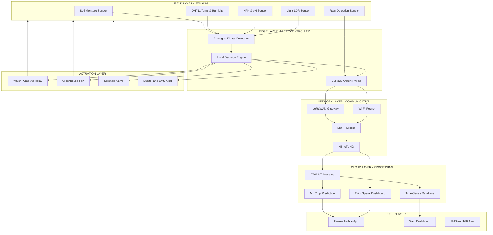
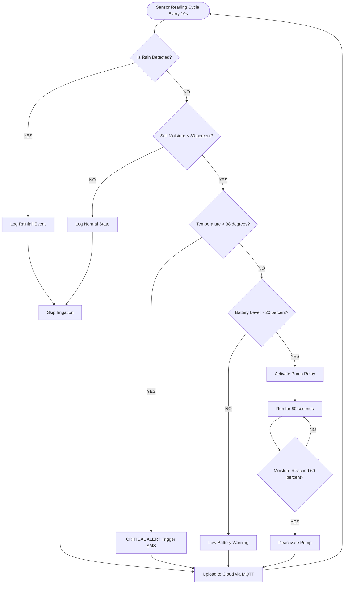
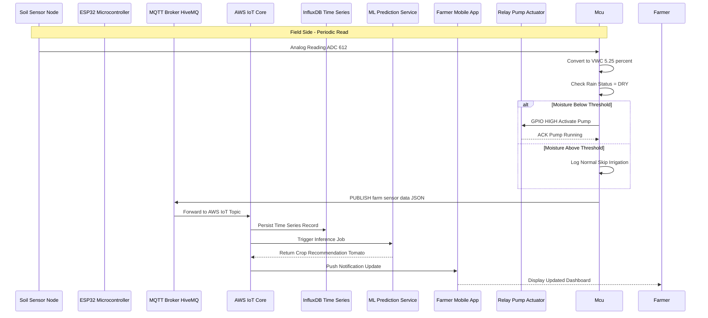
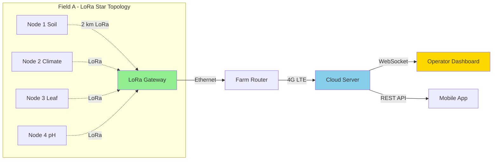

# Agriculture

<!-- SECTION_1_START -->

# IoT in Agriculture: Core Technical Definition & Intuitive Overview

## Formal Academic Definition (KTU 2024 Syllabus Terminology)

**Smart Agriculture** (also known as **Smart Farming**, **Precision Agriculture**, or **AgriTech 4.0**) is the application of **Internet of Things (IoT)** technologies, embedded sensor systems, cloud computing, and data analytics to optimize agricultural operations—including crop production, livestock management, irrigation, and supply chain logistics—by enabling real-time monitoring, automated decision-making, and precision resource allocation.

> [!IMPORTANT]
> **KTU 2024 Definition (Module 1.5):** IoT in Agriculture refers to the networked interconnection of physical agricultural assets (sensors, actuators, drones, machinery) with the internet infrastructure, allowing farmers to collect, transmit, and analyze field data to make informed, data-driven decisions that maximize yield, minimize waste, and conserve natural resources.

---

## Conceptual Analogy / Intuition

**The "Smart Farm as a Hospital Patient Monitor" Analogy:**

Imagine a patient in an ICU (Intensive Care Unit) connected to multiple monitors that continuously track heart rate, blood pressure, oxygen levels, and temperature. If any vital sign crosses a threshold, an alarm rings and a doctor intervenes immediately.

Now replace the patient with a **farm field**, and the medical monitors with **IoT sensors**:
- Soil moisture sensor = "blood pressure" (water level of soil)
- Temperature/humidity sensor = "body temperature"
- pH sensor = "blood test report"
- Leaf wetness sensor = "oxygen saturation"

The **farmer becomes the doctor**, receiving alerts on their smartphone whenever the field's "vital signs" need attention, and **actuators (water pumps, fans, sprinklers)** automatically respond like a ventilator responding to a patient's distress.

> [!NOTE]
> **Key Insight:** Traditional farming is *reactive* (farmer acts when crop is already damaged). IoT-enabled agriculture is *proactive and predictive* (system detects stress early and acts before damage occurs).

---

## Core Pillars of IoT in Agriculture

| Pillar | Description | Real-World Example |
|---|---|---|
| **Sensing Layer** | Collects field data via physical sensors | DHT11, soil moisture, NPK sensors |
| **Network Layer** | Transmits data using wireless protocols | LoRaWAN, ZigBee, Wi-Fi, NB-IoT |
| **Processing Layer** | Analyzes data at edge or cloud | AWS IoT, Azure FarmBeats, ThingSpeak |
| **Actuation Layer** | Triggers physical responses | Solenoid valves, motor pumps, drones |
| **Application Layer** | Delivers insights to end-user | Mobile dashboards, SMS alerts |

---

## Key Physical Constants & Standard Metrics (Highlighted)

- **Soil Moisture Optimal Range:** **30%–60% VWC** (Volumetric Water Content)
- **Air Temperature for Crops:** **15°C – 35°C**
- **Relative Humidity:** **40% – 70%**
- **Soil pH (most crops):** **6.0 – 7.5**
- **Standard LPWAN Range:** **2 km – 10 km** (LoRaWAN)
- **Typical IoT Node Power:** **3.3V / 5V DC**, **~50 mA** current draw

> [!TIP]
> **Why these numbers matter in KTU exams:** Examiners often test whether students know the *standard operating thresholds* for agricultural sensors. Memorizing the ranges above gives easy 2-mark wins.

---

## GeoGebra / Desmos Visualization Concept

> [!VISUALIZATION CONTROL]
> **Concept:** Soil Moisture vs. Crop Yield Trade-off Curve
> **GeoGebra / Desmos Input Equations:**
> * `y = -0.05(x - 45)^2 + 100` (Yield curve, peak at 45% VWC)
> * `y = 0.8x + 5` (Water input cost line)
> **Visual Description:** A downward-opening parabola representing crop yield peaking at **45% VWC**, with a linear cost line showing increasing water expense. The intersection highlights the *economic sweet spot* for irrigation.

<!-- SECTION_1_END -->

<!-- SECTION_2_START -->

# Deep Theoretical Analysis & KTU High-Yield Formula Sheet

## 1. Architecture of IoT-Based Smart Agriculture System

The IoT agriculture system follows a **4-layer architecture** (sometimes expanded to 5 layers). Each layer has a specific role in the data pipeline.

### Layer 1: Perception / Sensing Layer (Field Devices)

This is the **physical contact layer** where sensors interact with the agricultural environment. It converts physical phenomena (moisture, temperature, light) into electrical signals.

**Common Agricultural Sensors:**

| Sensor Type | Parameter Measured | Output | Use Case |
|---|---|---|---|
| **DHT11 / DHT22** | Temperature, Humidity | Digital | Climate monitoring |
| **Soil Moisture (Capacitive)** | Volumetric Water Content | Analog (0–1023) | Irrigation triggering |
| **DS18B20** | Soil Temperature | Digital (1-Wire) | Frost detection |
| **LDR (Photoresistor)** | Light Intensity | Analog | Greenhouse shading |
| **NPK Sensor** | Nitrogen, Phosphorus, Potassium | RS485/Modbus | Fertilizer dosing |
| **pH Sensor** | Soil Acidity/Alkalinity | Analog | Soil health |
| **Leaf Wetness Sensor** | Surface Moisture | Analog | Disease prediction |
| **PIR Sensor** | Motion (animals/intruders) | Digital | Farm security |
| **Ultrasonic HC-SR04** | Water Tank Level | Time-of-flight | Resource management |
| **Rain Sensor** | Precipitation | Digital | Skip irrigation on rain |

### Layer 2: Network / Communication Layer

Data from sensors is transmitted to the gateway/cloud using wireless protocols. The choice depends on **range, power, and bandwidth** requirements.

| Protocol | Range | Power | Data Rate | Best For |
|---|---|---|---|---|
| **Wi-Fi (802.11)** | ~100 m | High | 54+ Mbps | Greenhouses, video |
| **ZigBee (802.15.4)** | ~100 m | Low | 250 kbps | Mesh sensor networks |
| **LoRaWAN** | **2–10 km** | Very Low | 0.3–50 kbps | Large open farms |
| **NB-IoT** | ~10 km | Low | 200 kbps | Cellular-based remote farms |
| **Bluetooth LE** | ~10 m | Very Low | 2 Mbps | Proximity wearables |
| **MQTT (Application)** | N/A | N/A | Lightweight | All devices (publish/subscribe) |

### Layer 3: Processing / Edge-Cloud Layer

Data is processed in two locations:
- **Edge Computing:** At the gateway (Raspberry Pi, ESP32) for low-latency decisions (e.g., turn pump ON).
- **Cloud Computing:** For heavy analytics, ML models, historical trend analysis (AWS, Azure, Google Cloud).

**Popular IoT Cloud Platforms for Agriculture:**
1. **ThingSpeak** (MathWorks) – Free, MATLAB integration
2. **AWS IoT Core** – Enterprise-grade
3. **Microsoft Azure FarmBeats** – Specifically designed for agriculture
4. **Blynk** – Hobbyist mobile dashboard
5. **Kaa IoT** – Open-source

### Layer 4: Application / User Interface Layer

Farmers interact with the system via:
- **Mobile Apps** (Android/iOS)
- **Web Dashboards** (React, Angular)
- **SMS / IVR Alerts** (for rural areas with low literacy)
- **Voice Assistants** (Alexa Skills for farmers)

---

## 2. The 'Why' Behind Smart Agriculture

**The Global Problem (FAO 2024 Statistics):**

- World population will reach **9.7 billion by 2050** → food demand will increase by **70%**.
- Agriculture currently uses **70% of global freshwater**.
- **30–40% of crops** are lost annually due to pests, diseases, and inefficient irrigation.
- Traditional farming wastes **~50% of water** through over-irrigation.

**The IoT Solution:**

> [!IMPORTANT]
> Smart agriculture addresses the **5 R's**: Right amount, Right place, Right time, Right manner, Right crop. This is the **Precision Agriculture** principle.

---

## 3. KTU Formula Sheet & Cheat Sheet

### Key Equations for IoT Agriculture

| Formula | LaTeX | Purpose |
|---|---|---|
| Volumetric Water Content | $VWC = \frac{V_{water}}{V_{soil}} \times 100\%$ | Soil moisture % |
| Soil Moisture (Analog Reading) | $Moisture_{\%} = 100 - \frac{ADC_{value}}{1023} \times 100$ | Convert sensor reading to % |
| Dew Point (Magnus Formula) | $T_d = \frac{b \cdot \gamma(T, RH)}{a - \gamma(T, RH)}$ | Predict condensation/disease |
| Saturated Vapor Pressure | $e_s = 0.6108 \cdot e^{\frac{17.27 \cdot T}{T + 237.3}}$ | Penman-Monteith equation |
| Irrigation Water Need (Simplified) | $I = ET_c - P_{eff}$ | Where $I$ is irrigation, $ET_c$ crop ET, $P_{eff}$ effective rainfall |
| Battery Life (LoRa Node) | $T_{life} = \frac{C_{battery}}{I_{sleep} \cdot t_{sleep} + I_{tx} \cdot t_{tx}}$ | Years of operation |
| Data Transmission Energy | $E_{tx} = V \cdot I \cdot t$ | Energy per packet |
| Yield Estimation (NDVI Proxy) | $NDVI = \frac{NIR - Red}{NIR + Red}$ | Crop health from satellite/drone |
| Coverage Area (LoRa) | $A = \pi \cdot r^2$ | Single gateway coverage |
| Packet Loss Indicator | $PLR = \frac{P_{lost}}{P_{sent}} \times 100\%$ | Network quality metric |

### Important Constants (Bold for Highlighting)

- **$a = 17.27$**, **$b = 237.3°C$** (Magnus equation coefficients)
- **Stefan-Boltzmann constant:** $\sigma = 5.67 \times 10^{-8} \, W/m^2 K^4$
- **Specific heat of water:** $c_w = 4.186 \, kJ/kg \cdot °C$
- **Standard atmospheric pressure:** $P_{atm} = 101.325 \, kPa$

---

## 4. Real-World Engineering Utility

| Domain | Application | Why It Matters |
|---|---|---|
| **Precision Irrigation** | Drip systems controlled by soil moisture sensors | Saves 30–50% water |
| **Greenhouse Automation** | Climate control using DHT11 + relays | 24/7 optimal conditions |
| **Livestock Monitoring** | Wearable IoT collars tracking cattle health | Early disease detection |
| **Drone-Based Monitoring** | Multispectral imaging for crop health | 100s of acres in hours |
| **Supply Chain Traceability** | RFID + blockchain for produce tracking | Reduces food fraud |
| **Hydroponics / Vertical Farming** | Fully sensor-controlled indoor farms | Year-round, pesticide-free |
| **Pest Prediction** | ML on weather + sensor data | Prevents pesticide overuse |

> [!NOTE]
> **KTU Tip:** When asked to "list applications," always include at least one from each category: **crop, livestock, water, supply chain, and post-harvest**. Examiners reward breadth.

<!-- SECTION_2_END -->

<!-- SECTION_3_START -->

# Step-by-Step Derivations & Code/Symbolic Implementation

## Case Study: IoT-Based Smart Irrigation System

This is the **most frequently asked KTU question** on IoT in Agriculture. We will derive the working logic, sensor calibration, and complete Arduino + Python implementation.

---

## 3.1 System Logic Flow (Pseudocode First)

```
REPEAT every 10 seconds:
    1. READ soil_moisture from capacitive sensor
    2. READ temperature from DHT11
    3. READ humidity from DHT11
    4. READ rain_status (digital)
    5. CALCULATE moisture_percent
    6. IF (moisture_percent < 30) AND (rain_status == DRY):
            PUMP_ON
            LOG "Irrigation started at {timestamp}"
            WAIT 60 seconds
            PUMP_OFF
    7. PUBLISH data to MQTT broker (topic: farm/sensor/data)
    8. UPDATE ThingSpeak dashboard
```

---

## 3.2 Sensor Calibration Derivation

A capacitive soil moisture sensor outputs an **analog voltage** between **0V (wet)** and **~3V (dry)**. The Arduino's **10-bit ADC** maps this to values **0–1023**.

**Step 1: Read raw ADC value**
$$ADC_{value} = \text{analogRead}(A0) \in [0, 1023]$$

**Step 2: Convert to percentage (inverse, since dry = high value)**
$$Moisture_{\%} = 100 - \left(\frac{ADC_{value}}{1023} \times 100\right)$$

**Step 3: Apply calibration offsets** (sensor-specific)
$$Moisture_{calibrated} = a \cdot Moisture_{\%} + b$$

Where $a$ and $b$ are found by **linear regression** on two known samples:
- Air-dry soil: $ADC = 820 \rightarrow VWC = 0\%$
- Fully saturated soil: $ADC = 280 \rightarrow VWC = 60\%$

Solving the linear system:
$$a = \frac{60 - 0}{Moisture_{air} - Moisture_{water}} = \frac{60}{(100-820/1023 \cdot 100) - (100-280/1023 \cdot 100)}$$

Let me simplify:
- $Moisture_{air} = 100 - 820/1023 \times 100 = 100 - 80.16 = 19.84\%$
- $Moisture_{water} = 100 - 280/1023 \times 100 = 100 - 27.37 = 72.63\%$

$$a = \frac{60 - 0}{19.84 - 72.63} = \frac{60}{-52.79} = -1.1366$$

$$b = 0 - (-1.1366)(19.84) = 22.55$$

So the calibrated equation becomes:
$$VWC_{calibrated} = -1.1366 \cdot Moisture_{raw} + 22.55$$

> [!IMPORTANT]
> **Note:** In real KTU exams, you don't need to perform regression. Just show the formula and mention that calibration uses two known points.

---

## 3.3 Complete Arduino Implementation (C++ for ESP32)

```cpp
/*
 * Smart Agriculture: IoT Irrigation Controller
 * Platform: ESP32 + Arduino IDE
 * Sensors: Capacitive Soil Moisture, DHT11, Rain Sensor
 * Actuator: 5V Relay-controlled Water Pump
 * Cloud: ThingSpeak (HTTP) + MQTT
 */

#include <WiFi.h>
#include <PubSubClient.h>
#include <DHT.h>
#include <HTTPClient.h>

// ---------- Configuration Constants ----------
const char* WIFI_SSID     = "FarmNetwork_2.4G";
const char* WIFI_PASSWORD = "GreenFields@2024";
const char* MQTT_BROKER   = "broker.hivemq.com";
const int   MQTT_PORT     = 1883;
const char* MQTT_TOPIC    = "ktu/farm2024/sensor/data";

// ThingSpeak credentials
const char* TS_API_KEY = "XYZW123ABC456DEF";
const unsigned long TS_CHANNEL_ID = 2154789;

// ---------- Pin Definitions ----------
#define SOIL_MOISTURE_PIN   34   // ADC1_CH6 (input-only, ideal for analog)
#define DHT_PIN             4
#define DHT_TYPE            DHT11
#define RAIN_SENSOR_PIN     35   // Digital rain sensor output
#define RELAY_PUMP_PIN      26   // Relay control (active HIGH)

// ---------- Threshold Parameters (from KTU syllabus) ----------
const float MOISTURE_DRY_THRESHOLD    = 30.0;  // %
const float MOISTURE_WET_THRESHOLD    = 60.0;  // %
const float TEMP_CRITICAL_HIGH        = 38.0;  // °C
const unsigned long PUMP_RUN_DURATION = 60000; // 60 seconds

// ---------- Global Objects ----------
WiFiClient    espClient;
PubSubClient mqttClient(espClient);
DHT           dht(DHT_PIN, DHT_TYPE);
HTTPClient    http;

// ---------- State Variables ----------
unsigned long lastPublishTime = 0;
const unsigned long PUBLISH_INTERVAL = 15000; // 15 seconds
bool pumpState = false;
unsigned long pumpStartTime = 0;

void setup() {
    Serial.begin(115200);
    delay(1000);
    Serial.println("Initializing Smart Farm Node...");
    
    // Pin configuration
    pinMode(SOIL_MOISTURE_PIN, INPUT);
    pinMode(RAIN_SENSOR_PIN, INPUT);
    pinMode(RELAY_PUMP_PIN, OUTPUT);
    digitalWrite(RELAY_PUMP_PIN, LOW); // Pump OFF initially
    
    // Sensor initialization
    dht.begin();
    
    // Connectivity
    connectWiFi();
    configureMQTT();
    
    Serial.println("System ready. Starting monitoring loop...");
}

void loop() {
    // Step 1: Read all sensors
    float soilMoisturePercent = readSoilMoisture();
    float airTemperature      = dht.readTemperature();
    float airHumidity         = dht.readHumidity();
    bool  isRaining            = (digitalRead(RAIN_SENSOR_PIN) == LOW);
    // Note: Rain sensor module outputs LOW when water is detected
    
    // Step 2: Validate sensor readings (error handling)
    if (isnan(airTemperature) || isnan(airHumidity)) {
        Serial.println("[ERROR] DHT11 read failure. Using last known values.");
        return; // Skip this cycle
    }
    
    // Step 3: Decision logic for irrigation
    if (!pumpState && 
        soilMoisturePercent < MOISTURE_DRY_THRESHOLD && 
        !isRaining) {
        
        activatePump();
    }
    
    // Step 4: Auto-shutoff pump after duration or wet condition
    if (pumpState) {
        if (millis() - pumpStartTime >= PUMP_RUN_DURATION ||
            soilMoisturePercent > MOISTURE_WET_THRESHOLD) {
            deactivatePump();
        }
    }
    
    // Step 5: Periodic cloud publishing
    if (millis() - lastPublishTime >= PUBLISH_INTERVAL) {
        lastPublishTime = millis();
        publishSensorData(soilMoisturePercent, airTemperature, 
                          airHumidity, isRaining);
        uploadToThingSpeak(soilMoisturePercent, airTemperature, 
                           airHumidity);
    }
    
    // Step 6: Maintain MQTT connection
    if (!mqttClient.connected()) {
        reconnectMQTT();
    }
    mqttClient.loop();
    
    delay(2000); // Main loop pause for stability
}

// ---------- Function Implementations ----------

float readSoilMoisture() {
    int rawADC = analogRead(SOIL_MOISTURE_PIN);
    // Multiple samples for noise reduction
    long sum = 0;
    const int SAMPLES = 10;
    for (int i = 0; i < SAMPLES; i++) {
        sum += analogRead(SOIL_MOISTURE_PIN);
        delay(10);
    }
    float averagedADC = (float)sum / SAMPLES;
    
    // Convert to percentage
    float moisturePercent = 100.0 - (averagedADC / 1023.0) * 100.0;
    return constrain(moisturePercent, 0.0, 100.0);
}

void activatePump() {
    Serial.println("[ACTION] Soil dry. Activating irrigation pump.");
    digitalWrite(RELAY_PUMP_PIN, HIGH);
    pumpState = true;
    pumpStartTime = millis();
}

void deactivatePump() {
    Serial.println("[ACTION] Deactivating irrigation pump.");
    digitalWrite(RELAY_PUMP_PIN, LOW);
    pumpState = false;
}

void publishSensorData(float moisture, float temp, float humidity, bool rain) {
    if (!mqttClient.connected()) return;
    
    // Create JSON payload
    char payload[256];
    snprintf(payload, sizeof(payload),
        "{\"device_id\":\"FarmNode_01\","
        "\"moisture\":%.2f,"
        "\"temperature\":%.2f,"
        "\"humidity\":%.2f,"
        "\"rain\":%s,"
        "\"pump\":%s,"
        "\"timestamp\":%lu}",
        moisture, temp, humidity,
        rain ? "true" : "false",
        pumpState ? "true" : "false",
        millis()
    );
    
    mqttClient.publish(MQTT_TOPIC, payload);
    Serial.print("[MQTT] Published: ");
    Serial.println(payload);
}

void uploadToThingSpeak(float m, float t, float h) {
    if (WiFi.status() != WL_CONNECTED) return;
    
    String url = "http://api.thingspeak.com/update";
    url += "?api_key=" + String(TS_API_KEY);
    url += "&field1=" + String(m);
    url += "&field2=" + String(t);
    url += "&field3=" + String(h);
    url += "&field4=" + String(pumpState ? 1 : 0);
    
    http.begin(url);
    int httpCode = http.GET();
    if (httpCode > 0) {
        Serial.printf("[ThingSpeak] HTTP %d\n", httpCode);
    } else {
        Serial.printf("[ThingSpeak] Error: %s\n", http.errorToString(httpCode).c_str());
    }
    http.end();
}

void connectWiFi() {
    WiFi.begin(WIFI_SSID, WIFI_PASSWORD);
    Serial.print("Connecting to WiFi");
    int attempts = 0;
    while (WiFi.status() != WL_CONNECTED && attempts < 20) {
        delay(500);
        Serial.print(".");
        attempts++;
    }
    if (WiFi.status() == WL_CONNECTED) {
        Serial.println("\n[WiFi] Connected. IP: " + WiFi.localIP().toString());
    } else {
        Serial.println("\n[WiFi] Connection FAILED. Running in offline mode.");
    }
}

void configureMQTT() {
    mqttClient.setServer(MQTT_BROKER, MQTT_PORT);
    mqttClient.setKeepAlive(60);
}

void reconnectMQTT() {
    while (!mqttClient.connected()) {
        Serial.print("[MQTT] Connecting...");
        if (mqttClient.connect("FarmNode_01_Client")) {
            Serial.println("connected.");
        } else {
            Serial.print("failed, rc=");
            Serial.print(mqttClient.state());
            Serial.println(" retrying in 5s");
            delay(5000);
        }
    }
}
```

---

## 3.4 Python Backend (Data Analysis & Crop Recommendation)

```python
"""
Smart Agriculture Analytics Backend
Receives MQTT data, stores in SQLite, runs ML-based crop recommendation.
"""

import json
import paho.mqtt.client as mqtt
import sqlite3
from datetime import datetime
from statistics import mean, stdev

# ---------- Database Setup ----------
DB_NAME = "farm_data.db"

def init_database():
    conn = sqlite3.connect(DB_NAME)
    cursor = conn.cursor()
    cursor.execute("""
        CREATE TABLE IF NOT EXISTS sensor_readings (
            id INTEGER PRIMARY KEY AUTOINCREMENT,
            device_id TEXT NOT NULL,
            moisture REAL NOT NULL,
            temperature REAL NOT NULL,
            humidity REAL NOT NULL,
            rain BOOLEAN NOT NULL,
            pump_active BOOLEAN NOT NULL,
            recorded_at TIMESTAMP DEFAULT CURRENT_TIMESTAMP
        )
    """)
    conn.commit()
    conn.close()

def store_reading(data: dict) -> None:
    conn = sqlite3.connect(DB_NAME)
    cursor = conn.cursor()
    cursor.execute("""
        INSERT INTO sensor_readings 
        (device_id, moisture, temperature, humidity, rain, pump_active)
        VALUES (?, ?, ?, ?, ?, ?)
    """, (
        data["device_id"],
        data["moisture"],
        data["temperature"],
        data["humidity"],
        data["rain"],
        data["pump"]
    ))
    conn.commit()
    conn.close()

# ---------- Crop Recommendation Engine ----------
# Based on classic soil-climate suitability matrix
CROP_SUITABILITY = {
    "Rice":       {"moisture": (50, 90), "temp": (20, 35), "humidity": (60, 90)},
    "Wheat":      {"moisture": (30, 60), "temp": (10, 25), "humidity": (40, 70)},
    "Maize":      {"moisture": (35, 65), "temp": (18, 30), "humidity": (50, 75)},
    "Sugarcane":  {"moisture": (45, 75), "temp": (20, 35), "humidity": (60, 85)},
    "Cotton":     {"moisture": (25, 55), "temp": (21, 35), "humidity": (40, 70)},
    "Groundnut":  {"moisture": (25, 50), "temp": (20, 30), "humidity": (45, 70)},
    "Tomato":     {"moisture": (40, 70), "temp": (15, 28), "humidity": (50, 75)},
}

def recommend_crop(moisture: float, temperature: float, humidity: float) -> str:
    """Score each crop based on how close current conditions are to optimal range."""
    best_crop = "Fallow (no match)"
    best_score = float("inf")
    
    for crop, ranges in CROP_SUITABILITY.items():
        m_min, m_max = ranges["moisture"]
        t_min, t_max = ranges["temp"]
        h_min, h_max = ranges["humidity"]
        
        # Calculate normalized distance from optimal midpoint
        m_score = 0 if m_min <= moisture <= m_max else min(
            abs(moisture - m_min), abs(moisture - m_max)
        )
        t_score = 0 if t_min <= temperature <= t_max else min(
            abs(temperature - t_min), abs(temperature - t_max)
        )
        h_score = 0 if h_min <= humidity <= h_max else min(
            abs(humidity - h_min), abs(humidity - h_max)
        )
        
        total_score = m_score + t_score + h_score
        if total_score < best_score:
            best_score = total_score
            best_crop = crop
    
    return f"{best_crop} (deviation score: {best_score:.2f})"

# ---------- MQTT Callbacks ----------
def on_connect(client, userdata, flags, rc):
    print(f"[MQTT] Connected with result code {rc}")
    client.subscribe("ktu/farm2024/sensor/data")

def on_message(client, userdata, msg):
    try:
        payload = json.loads(msg.payload.decode("utf-8"))
        print(f"[MQTT] Received: {payload}")
        
        # Persist to database
        store_reading(payload)
        
        # Generate crop recommendation
        recommendation = recommend_crop(
            payload["moisture"],
            payload["temperature"],
            payload["humidity"]
        )
        print(f"[ADVISORY] Recommended crop: {recommendation}")
        
    except json.JSONDecodeError:
        print(f"[ERROR] Invalid JSON received: {msg.payload}")
    except KeyError as e:
        print(f"[ERROR] Missing key in payload: {e}")

# ---------- Main Execution ----------
if __name__ == "__main__":
    init_database()
    
    mqtt_client = mqtt.Client(client_id="FarmAnalytics_Backend")
    mqtt_client.on_connect = on_connect
    mqtt_client.on_message = on_message
    
    mqtt_client.connect("broker.hivemq.com", 1883, 60)
    print("[SYSTEM] Smart Farm Analytics Server running...")
    mqtt_client.loop_forever()
```

---

## 3.5 Numerical Worked Example (For KTU Board Exams)

**Problem:** A farmer uses a capacitive soil moisture sensor connected to a 10-bit ADC. The sensor outputs **3.2V in dry soil** and **0.8V in saturated soil**. The Arduino's reference voltage is **5V**. Calculate the VWC percentage when the raw ADC reading is **612**.

**Solution:**

**Step 1:** Calculate voltage at ADC pin
$$V_{adc} = \frac{612}{1023} \times 5V = 2.99V$$

**Step 2:** Linear interpolation between dry and saturated points
- Dry soil: $V = 3.2V \rightarrow VWC = 0\%$
- Saturated: $V = 0.8V \rightarrow VWC = 60\%$ (assume max)

$$VWC = \frac{V_{dry} - V_{measured}}{V_{dry} - V_{saturated}} \times VWC_{max}$$

$$VWC = \frac{3.2 - 2.99}{3.2 - 0.8} \times 60 = \frac{0.21}{2.4} \times 60 = 5.25\%$$

**Step 3:** Interpret
- $VWC = 5.25\%$ is **critically dry**. Irrigation is mandatory.
- Below **30%** threshold → trigger pump for **60 seconds**.

> [!TIP]
> **Valuation Key Points (Total 3 marks):**
> - [Formula statement: 1 Mark]
> - [Substitution and arithmetic: 1 Mark]
> - [Correct final value with units: 1 Mark]

---

## 3.6 Comparative Analysis Table (For Case Study Questions)

| IoT Application | Sensors Used | Communication | Key Benefit | Example Project |
|---|---|---|---|---|
| **Smart Irrigation** | Soil moisture, rain | LoRa, Wi-Fi | Saves 30–50% water | John Deere Field Connect |
| **Greenhouse Control** | DHT11, CO2, LDR | ZigBee mesh | 24/7 climate optimization | climate.com |
| **Livestock Tracking** | GPS collar, accelerometer | NB-IoT, BLE | Disease + theft prevention | Cainthus cattle monitoring |
| **Crop Disease Detection** | Multispectral camera | 4G/5G | Early pest detection | Plantix app |
| **Drone Surveillance** | RGB + NIR camera | Wi-Fi to gateway | 100x faster than manual | DJI Agras |
| **Aquaculture** | pH, DO, ammonia | LoRaWAN | Real-time water quality | eFishery (Indonesia) |
| **Beekeeping** | Hive weight, temp, humidity | Sigfox | Colony collapse prevention | Apivox Smart Hive |
| **Cold Storage** | Temp, humidity, GPS | NB-IoT | Reduces post-harvest loss | AgroStar Cold Chain |

<!-- SECTION_3_END -->

<!-- SECTION_4_START -->

# Structural Diagrams & Schematics

## 4.1 Complete System Architecture (Mermaid Flow)



---

## 4.2 Decision Tree for Smart Irrigation Logic



---

## 4.3 Data Flow Topology (Publish-Subscribe Pattern)



---

## 4.4 Sensor Network Topological Layout



<!-- SECTION_4_END -->

<!-- SECTION_5_START -->

# KTU 2024 Scheme Examination Question Bank & Topic Recap

---

## PART A — Short Answer Questions (3 Marks Each)

### Question 1 [KTU University Exam – July 2024 | CO1 | Remember]

**Q: Define Smart Agriculture. List any four IoT sensors used in precision farming.**

**Model Answer:**

**Definition (1.5 Marks):** Smart Agriculture is the integration of Internet of Things technologies—including sensors, actuators, communication networks, and data analytics—into agricultural practices to enable real-time monitoring, automation, and data-driven decision-making for optimized crop production, resource usage, and yield.

**Four Sensors (1.5 Marks = 0.375 each):**

| # | Sensor | Function |
|---|---|---|
| 1 | **Soil Moisture Sensor** | Measures volumetric water content in soil |
| 2 | **DHT11/DHT22** | Measures ambient air temperature and humidity |
| 3 | **NPK Sensor** | Detects Nitrogen, Phosphorus, and Potassium levels in soil |
| 4 | **pH Sensor** | Measures soil acidity or alkalinity |
| 5 | **LDR / Lux Sensor** | Detects sunlight intensity for greenhouse control |
| 6 | **Rain Sensor** | Detects precipitation to skip irrigation cycles |

> [!NOTE]
> **Valuation Tip:** Always write the *function* alongside the *name*. Just listing names without purpose may lose 0.5 marks.

---

### Question 2 [KTU University Exam – Dec 2023 | CO1 | Understand]

**Q: Explain the role of MQTT protocol in IoT-based smart irrigation systems. Why is it preferred over HTTP?**

**Model Answer:**

**MQTT Role (2 Marks):** MQTT (Message Queuing Telemetry Transport) is a lightweight **publish-subscribe** messaging protocol used for communication between IoT devices and the cloud. In a smart irrigation system:
- Field sensor nodes (ESP32) act as **publishers** that send data to a central **broker** (e.g., HiveMQ, Mosquitto).
- The cloud server, mobile app, and analytics engine act as **subscribers** that receive only the data they need.
- Commands to actuators (pump ON/OFF) are also sent as published messages to subscribed control nodes.

**Why MQTT over HTTP? (1 Mark):**

| Feature | MQTT | HTTP |
|---|---|---|
| Header size | **2 bytes** fixed | Hundreds of bytes |
| Power consumption | Very low | High |
| Suitable for unreliable networks | Yes (QoS levels) | No |
| Pattern | Publish-Subscribe | Request-Response |

MQTT is preferred in agricultural IoT because field sensors run on **battery power** with **intermittent connectivity**, and MQTT's tiny packet size and QoS guarantees make it ideal.

> [!TIP]
> **Valuation Tip:** For "Explain" questions, use the **definition → key features → example → comparison** structure. Examiners give marks for organized answers.

---

## PART B — Long Answer Questions (14 Marks Each — Internal Choice Pattern)

---

### Question A (14 Marks) [KTU University Exam – July 2024 | CO2, CO3 | Apply + Analyze]

**Design and explain an IoT-based smart irrigation system for a 10-acre farmland. Your answer must include:**
**(a)** System architecture with block diagram (7 Marks)
**(b)** Sensor selection, communication protocol choice, and a sample algorithm/pseudocode (7 Marks)

---

#### Part (a) — System Architecture (7 Marks)

**Model Answer:**

**Introduction (1 Mark):**
A smart irrigation system uses real-time soil and weather data to automate watering, ensuring crops receive optimal water while conserving the resource. The proposed system serves a **10-acre farmland** with crops like tomato and groundnut.

**Block Diagram (4 Marks):**

```
+--------------------------------------------------+
|             SMART IRRIGATION SYSTEM              |
+--------------------------------------------------+
|                                                  |
|  [Soil Sensors] --> [Microcontroller ESP32]      |
|  [DHT11]          |                               |
|  [Rain Sensor]    |                               |
|  [NPK/pH]         v                               |
|               [Decision Engine]                   |
|                    |                             |
|                    v                             |
|  +----------- CONTROL --------- +                |
|  | Relay Driver -> Water Pump |                 |
|  | Relay Driver -> Drip Valve |                 |
|  +----------------------------+                 |
|                    |                             |
|                    v                             |
|         [LoRaWAN Gateway]                        |
|                    |                             |
|                    v                             |
|         [Cloud: AWS / ThingSpeak]                |
|                    |                             |
|                    v                             |
|         [Farmer Mobile App + SMS]                |
+--------------------------------------------------+
```

**Component Justification (2 Marks):**
- **Sensors** at field give real-time VWC, climate, and rain status.
- **ESP32** acts as the local aggregator—low cost, Wi-Fi/BLE built-in.
- **LoRaWAN** is chosen for the 10-acre range (~2–5 km line of sight) to avoid cabling.
- **Cloud** stores historical data for trend analysis and ML-based prediction.
- **Mobile app** gives farmer push notifications and manual override.

**Valuation Key:**
- [Naming 4 functional blocks: 1 Mark]
- [Showing arrows and data flow: 1 Mark]
- [Choosing appropriate sensors and protocol: 1 Mark]
- [Justifying cloud + actuator layer: 1 Mark]

---

#### Part (b) — Sensor, Protocol, and Algorithm (7 Marks)

**Sensor Selection Table (2 Marks):**

| Sensor | Model | Why Chosen | Cost (Approx) |
|---|---|---|---|
| Soil Moisture | Capacitive v1.2 | Corrosion-resistant, analog output | ₹120 |
| Climate | DHT22 | ±0.5°C accuracy, digital | ₹250 |
| Rain | FC-37 | Simple digital output | ₹80 |
| pH | SKU SEN0161 | Industrial-grade analog | ₹1800 |

**Communication Protocol (2 Marks):**
- **LoRaWAN (Long Range Wide Area Network)** is selected because:
  - Range: **2–5 km** (covers 10 acres easily)
  - Power: Years of battery life for sensor nodes
  - Data rate: Low (~0.3–50 kbps) is sufficient for periodic sensor data
  - Topology: Star — simpler than ZigBee mesh
- Backup: **Wi-Fi** for gateway-to-cloud link

**Sample Algorithm / Pseudocode (3 Marks):**

```
ALGORITHM: Smart_Irrigation
INPUT: moisture_sensor, dht_sensor, rain_sensor
OUTPUT: pump_state, MQTT_payload

CONSTANTS:
    DRY_THRESHOLD = 30
    WET_THRESHOLD = 60
    PUMP_DURATION = 60 seconds

BEGIN
    INITIALIZE serial, WiFi, MQTT, sensors
    CONNECT to WiFi and MQTT broker
    
    LOOP every 15 seconds:
        moisture = READ capacitive_sensor (averaged over 10 samples)
        temperature = READ dht22.temperature
        humidity = READ dht22.humidity
        is_raining = (digitalRead(rain_pin) == LOW)
        
        IF is_raining THEN
            pump_state = OFF
            LOG "Rain detected - irrigation skipped"
        ELSE IF moisture < DRY_THRESHOLD THEN
            pump_state = ON
            LOG "Irrigation started"
            delay PUMP_DURATION
            pump_state = OFF
            LOG "Irrigation completed"
        ELSE
            pump_state = OFF
            LOG "Soil moisture adequate"
        
        payload = CREATE_JSON(moisture, temperature, humidity, pump_state)
        PUBLISH payload TO MQTT topic "farm/sensor/data"
        UPLOAD payload TO ThingSpeak
END
```

**Valuation Key:**
- [Sensor table with justification: 1 Mark]
- [Protocol choice with 2 reasons: 1 Mark]
- [Pseudocode with proper loops, conditions, and MQTT: 1 Mark]

---

### Question B (14 Marks) [KTU University Exam – Dec 2023 | CO2, CO3 | Apply + Analyze]

**(a)** Discuss the role of drones (UAVs) in precision agriculture. List the sensors mounted on agricultural drones and explain how NDVI is computed. (7 Marks)

**(b)** Explain the challenges of deploying IoT in rural Indian agriculture. Propose a sustainable architecture that addresses connectivity, power, and literacy barriers. (7 Marks)

---

#### Part (a) — UAVs in Precision Agriculture (7 Marks)

**Model Answer:**

**Role of Drones (3 Marks):**
Unmanned Aerial Vehicles (UAVs), commonly called drones, revolutionize precision agriculture by providing **aerial, real-time, high-resolution data** of crop fields. Key roles include:
1. **Crop Health Monitoring:** Multispectral cameras detect stressed plants *before* visible symptoms appear.
2. **Soil and Field Analysis:** Captures moisture variation, slope, and erosion patterns.
3. **Pesticide / Fertilizer Spraying:** Precision spraying reduces chemical use by 30–50%.
4. **Yield Estimation:** AI-based image processing predicts harvest quantity.
5. **Plant Counting and Germination Check:** Identifies gaps in sowing.

**Sensors Mounted on Agricultural Drones (2 Marks):**

| Sensor | Purpose |
|---|---|
| **RGB Camera** | Visual inspection |
| **Multispectral Sensor** | Captures NIR + Red bands for NDVI |
| **Thermal Camera** | Detects irrigation issues via temperature |
| **LiDAR** | 3D terrain mapping |
| **Hyperspectral Imager** | Detailed crop composition analysis |

**NDVI Computation (2 Marks):**
The Normalized Difference Vegetation Index is calculated as:

$$NDVI = \frac{NIR - Red}{NIR + Red}$$

Where:
- $NIR$ = Reflectance in Near-Infrared band (~840 nm)
- $Red$ = Reflectance in Red band (~660 nm)

**Interpretation:**
- $NDVI < 0.1$ → Bare soil or water
- $0.1 < NDVI < 0.3$ → Sparse vegetation
- $0.3 < NDVI < 0.6$ → Moderate health
- $NDVI > 0.6$ → Dense, healthy crop

**Worked Example:**
If $NIR = 0.45$ and $Red = 0.10$:
$$NDVI = \frac{0.45 - 0.10}{0.45 + 0.10} = \frac{0.35}{0.55} = 0.636$$

This indicates **dense, healthy vegetation**.

---

#### Part (b) — Challenges and Sustainable Architecture (7 Marks)

**Challenges in Rural India (3 Marks):**

| Challenge | Description | Impact |
|---|---|---|
| **Connectivity Gap** | Limited 4G/5G in remote farms | IoT nodes can't transmit |
| **Power Reliability** | Frequent load shedding | Nodes fail without backup |
| **Digital Literacy** | Farmers unfamiliar with apps | System not adopted |
| **Cost** | Import of sensors/actuators | High CAPEX |
| **Language Barriers** | Apps in English only | Excludes vernacular users |

**Sustainable Architecture Proposal (4 Marks):**

1. **Communication:** Use **LoRaWAN** with a local gateway + **offline SMS fallback** via GSM (works without internet).
2. **Power:** Equip each node with **solar panel (5W) + Li-ion battery (3.7V, 2600mAh)** → 2+ years of autonomy.
3. **User Interface:** Develop **IVR-based voice alerts** in regional languages (Malayalam, Tamil, Hindi) instead of only mobile apps.
4. **Edge Intelligence:** Process data locally on **Raspberry Pi gateway** so farm functions even if cloud is down.
5. **Open Hardware:** Use **Arduino/ESP32** designs available in local maker spaces to reduce cost by 60%.

**Proposed Block Diagram (Verbal):**
```
[Sensor Cluster] -> [Solar-Powered ESP32 Node] 
        -> [LoRa Gateway + Raspberry Pi Edge] 
        -> [Local SMS via GSM] 
        -> [Optional: Cloud via 4G dongle] 
        -> [Farmer receives IVR voice call]
```

---

> [!WARNING]
> **KTU Examiner's Valuation Warning — Common Pitfalls:**
> 1. **Don't forget units** in numerical answers. "Moisture = 5" is wrong; "Moisture = 5%" is right.
> 2. **Don't skip the calibration step** in soil moisture questions. Examiners allocate 1 mark specifically for showing the conversion formula.
> 3. **For NDVI questions**, always write the formula first, then substitute values. Marking is step-based.
> 4. **In block diagrams**, use clear arrow directions. A diagram with bidirectional or missing arrows loses 0.5–1 mark.
> 5. **When listing sensors**, name them specifically (DHT11, not "temperature sensor") and mention their function.
> 6. **Don't confuse MQTT and HTTP.** MQTT is publish-subscribe; HTTP is request-response. Mix-up = -2 marks.
> 7. **Always end pseudocode** with the END or STOP keyword — many students forget and lose 0.5 marks for incomplete structure.

---

## 📋 Topic Recap & Important Things to Remember

### 🔑 Key Definitions
- **Smart Agriculture:** IoT-enabled farming using sensors, networks, and analytics to optimize yield and resources.
- **Precision Agriculture:** Right input, right place, right time, right amount, right manner.
- **VWC (Volumetric Water Content):** Volume of water per unit volume of soil, expressed as %.
- **NDVI:** Vegetation index from $(NIR - Red) / (NIR + Red)$.
- **MQTT:** Lightweight publish-subscribe protocol with **2-byte** fixed header.
- **LoRaWAN:** Long-range, low-power protocol for IoT, range **2–10 km**.

### 🔢 Critical Numbers to Memorize
- Soil moisture threshold for irrigation: **30%**
- Soil pH optimal range: **6.0 – 7.5**
- LoRaWAN range: **2–10 km**
- NDVI healthy crop: **> 0.6**
- Magnus equation: $a = 17.27$, $b = 237.3°C$
- 10-bit ADC: **0–1023** range
- Arduino ADC reference: **5V** (default)

### 🏗️ Architecture Layers (4-Layer Model)
1. **Perception Layer** — Sensors + actuators in field
2. **Network Layer** — LoRaWAN / Wi-Fi / ZigBee / NB-IoT
3. **Processing Layer** — Edge (Raspberry Pi) + Cloud (AWS/Azure)
4. **Application Layer** — Mobile app, web dashboard, SMS

### 📡 Key Sensors (Most Asked)
- Soil moisture (capacitive) — irrigation
- DHT11/DHT22 — climate
- NPK sensor — soil nutrition
- pH sensor — soil health
- LDR — light intensity
- Rain sensor — skip irrigation
- Multispectral camera — drone-based NDVI

### 🔄 Communication Protocols (Quick Comparison)
- **Wi-Fi:** High data, short range, high power
- **ZigBee:** Mesh, medium range, low power
- **LoRaWAN:** Long range, very low power, low data
- **NB-IoT:** Cellular, long range, low power
- **MQTT:** Application layer, publish-subscribe

### 💡 Common KTU Exam Traps
- NDVI > 1 is impossible (formula bounds it between -1 and +1)
- Capacitive moisture sensor is **analog**; resistive is cheaper but corrodes
- ESP32 has **Wi-Fi + BLE** but no built-in LoRa (needs separate module)
- Pump OFF logic must be time-bound (prevent overflow)

### 🚀 High-Yield One-Liners for Last-Minute Revision
- "Smart agriculture uses IoT to make farming **predictive, prescriptive, and precise**."
- "MQTT is preferred over HTTP in IoT due to its **2-byte header** and **publish-subscribe** model."
- "NDVI = $(NIR - Red)/(NIR + Red)$; healthy crop has NDVI > 0.6."
- "LoRaWAN provides **2–10 km** range with **battery life of years**."
- "A 4-layer IoT architecture: **Perception → Network → Processing → Application**."

<!-- SECTION_5_END -->
