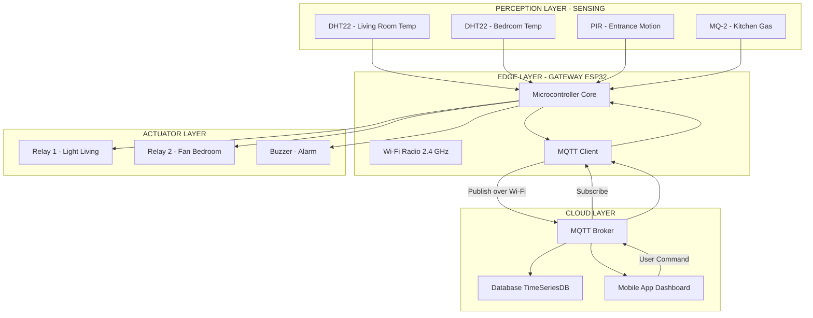
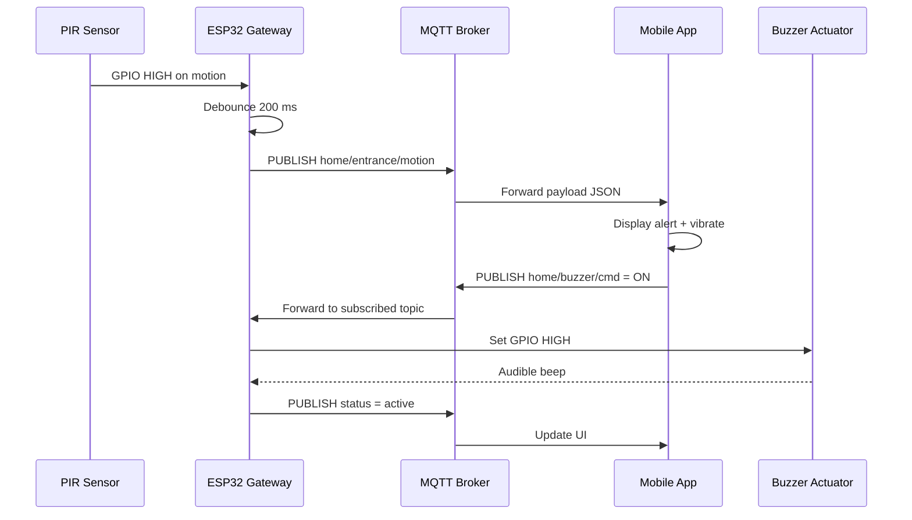
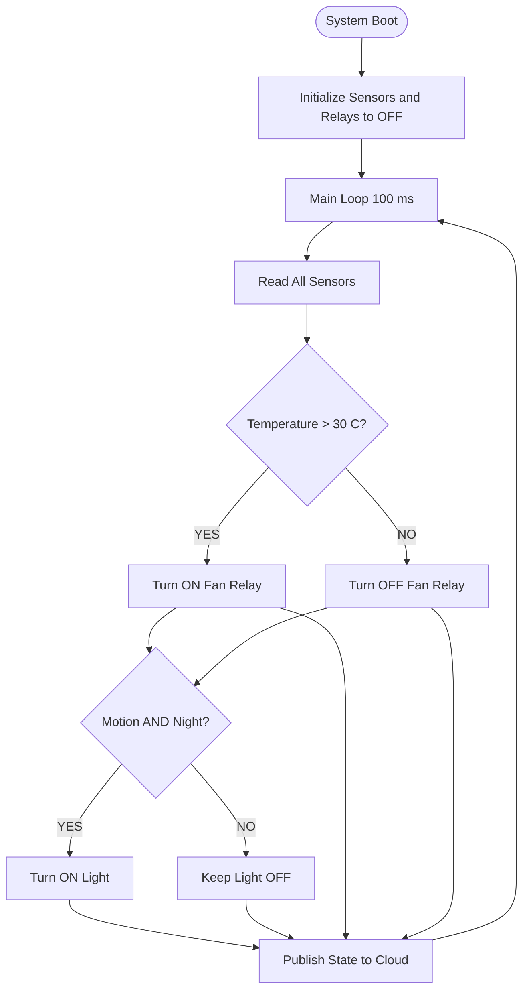

# Domain Specific IoT- Home automation

<!-- SECTION_1_START -->

# Domain-Specific IoT: Home Automation

> [!IMPORTANT]
> **KTU 2024 Scheme | OECST834 — Internet of Things | Module 1**
> *Mapped Course Outcomes: CO1 — Understand the foundational concepts, architecture, and domain-specific applications of the Internet of Things.*

## 1.1 Formal Academic Definition

**Home Automation** (also known as **Domotics** or **Smart Home Technology**) is a domain-specific application of the Internet of Things that enables the **centralized, intelligent, and remote monitoring, control, and management of household appliances, electrical devices, security systems, and environmental parameters** through a network of interconnected sensors, actuators, and communication protocols.

According to the KTU 2024 syllabus framework, Home Automation belongs to the broader **"Vertical-Specific IoT"** category — a use-case driven implementation where a generic IoT architecture (Perception → Network → Middleware → Application → Business layers) is tailored to the residential domain.

> [!NOTE]
> **Core Definition for Board Exams**
> *"Home Automation is the IoT-enabled automation of household functions such as lighting, climate control, security, and entertainment, achieved by integrating heterogeneous smart devices over IP-based or short-range wireless networks, with control logic residing locally on a hub or remotely on a cloud platform."*

### 1.2 Conceptual Analogy — The "Nervous System" of a House

Imagine your home as a **living organism**:

- **Sensors** act as the **senses** (eyes, skin, ears) — detecting motion, temperature, light, smoke, and door states.
- **The Gateway/Hub** is the **brainstem** — aggregating raw sensory data and dispatching reflex actions.
- **Actuators** are the **muscles** — physically switching on a fan, dimming an LED, locking a door, or sounding an alarm.
- **The Cloud Platform** is the **conscious mind** — analyzing patterns, learning preferences, and allowing remote decision-making via a smartphone.

Just as your nervous system reacts to a hot surface *before* you consciously feel it, a properly designed smart home triggers actuators (e.g., turns on a sprinkler) the moment sensors detect an anomaly (smoke) — often before a human is even aware.

> [!TIP]
> **Think of it this way:** A traditional home is a *collection of isolated appliances*; a smart home is a *collaborative team of devices* working toward **comfort, security, and energy efficiency**.

### 1.3 Key Engineering Metrics (KTU High-Yield)

The following parameters are repeatedly tested in KTU examinations:

| Parameter | Typical Value / Range | Significance |
|---|---|---|
| **Latency** | **< 100 ms** (for safety-critical actions) | Determines responsiveness |
| **Power Budget** | **< 1 W** (battery-operated nodes) | Affects battery life (typically 1–5 years) |
| **Network Range** | **10–100 m** (indoor) | Coverage of a typical residence |
| **Device Density** | **50–250 devices** per home | Scalability benchmark |
| **Data Rate** | **250 kbps – 1 Gbps** | Depends on protocol (Zigbee vs. Wi-Fi) |
| **Uptime SLA** | **99.9 %** | Reliability for security systems |

> [!VISUALIZATION CONTROL]
> **Concept:** Smart Home Sensor-Actuator Network Topology
> **GeoGebra / Desmos Input Equations (Conceptual Plot):**
> * Gateway position: $G = (0, 0)$
> * Device positions on a 2D floor plan: $D_i = (x_i, y_i)$ for $i = 1, 2, ..., n$
> * Coverage radius equation: $(x - x_i)^2 + (y - y_i)^2 \leq r^2$, where $r = 15$ m
> **Visual Description:** A central node (gateway) at the origin with concentric coverage circles; smart devices (lights, thermostats, cameras) scattered within the indoor range, all wirelessly linked to the central hub and outward to the cloud.

---

<!-- SECTION_1_END -->

<!-- SECTION_2_START -->

# 2. Deep Theoretical Analysis & Architecture of Home Automation

## 2.1 Layered Architecture (KTU Reference Model)

Home Automation systems follow a **modified IoT Reference Model** with five distinct layers. Each layer has a clearly demarcated responsibility:

### Layer 1 — Perception / Sensing Layer
- **Role:** Physical data acquisition.
- **Components:** Temperature sensors (DHT22, LM35), PIR motion sensors (HC-SR501), gas/smoke sensors (MQ-2), reed switches (door/window), LDR (light-dependent resistor), cameras.
- **Output:** Analog voltages or digital GPIO pulses.

### Layer 2 — Network / Communication Layer
- **Role:** Reliable data transport from devices to the gateway and onward to the cloud.
- **Protocols Used:**
  * **Wi-Fi (IEEE 802.11n/ac):** High bandwidth, suitable for cameras. Typical throughput: **150 Mbps – 1.3 Gbps**.
  * **Zigbee (IEEE 802.15.4):** Low-power mesh, up to **65,000 nodes**. Data rate: **250 kbps**.
  * **Z-Wave:** Sub-GHz (908.42 MHz in US, 868.42 MHz in EU). Data rate: **100 kbps**. Range: **30 m indoor**.
  * **Bluetooth Low Energy (BLE 5.0):** For wearable/smartphone integration. Range: **75 m** line-of-sight.
  * **MQTT (over TCP/IP):** Lightweight publish-subscribe messaging protocol — the *de facto* standard for IoT.

### Layer 3 — Middleware / Edge Layer
- **Role:** Local processing, protocol translation, and decision-making.
- **Components:** Raspberry Pi, ESP32, Home Assistant hub, OpenHAB, AWS IoT Greengrass.
- **Functions:** Data filtering, local rule execution (e.g., *"if temp > 30 °C AND time is between 14:00–17:00, switch on AC"*), and MQTT broker hosting.

### Layer 4 — Application Layer
- **Role:** User interaction and visualization.
- **Components:** Mobile apps (Blynk, custom Flutter/React Native apps), voice assistants (Alexa, Google Assistant), web dashboards.

### Layer 5 — Business Layer
- **Role:** Analytics, billing, predictive maintenance, and integration with utility providers.
- **Components:** Cloud platforms (AWS IoT, Azure IoT Hub, Google Cloud IoT), data lakes, ML models.

## 2.2 Communication Protocol Comparison (KTU High-Yield Table)

| Protocol | Frequency | Range | Data Rate | Power | Mesh | Best Use Case |
|---|---|---|---|---|---|---|
| **Wi-Fi** | 2.4 / 5 GHz | 50 m | 1 Gbps | High | No | Cameras, streaming |
| **Zigbee** | 2.4 GHz | 30 m | 250 kbps | Low | Yes | Lights, sensors |
| **Z-Wave** | 908 MHz | 30 m | 100 kbps | Low | Yes | Locks, thermostats |
| **BLE** | 2.4 GHz | 75 m | 2 Mbps | Very Low | No | Wearables, beacons |
| **LoRa** | 868/915 MHz | 2–5 km | 50 kbps | Very Low | No | Outdoor sensors |
| **Thread** | 2.4 GHz | 30 m | 250 kbps | Low | Yes | Native IPv6, Nest |

> [!NOTE]
> **Board Tip:** Zigbee and Z-Wave dominate the *battery-powered, low-data-rate* domain of Home Automation because of their **mesh topology**, where each mains-powered device acts as a repeater — drastically extending coverage.

## 2.3 MQTT — The Backbone Protocol (Detailed)

**MQTT (Message Queuing Telemetry Transport)** is a publish/subscribe protocol standardized as **ISO/IEC 20922**.

### Core Components
- **Publisher:** The smart device (e.g., a temperature sensor).
- **Subscriber:** The application or actuator that needs the data.
- **Broker:** Central server (e.g., Mosquitto) that filters and routes messages.
- **Topic:** A hierarchical string identifier (e.g., `home/livingroom/temperature`).
- **QoS Levels:** 0 (at most once), 1 (at least once), 2 (exactly once).

### Publish/Subscribe Flow
1. A sensor **publishes** its reading to a topic, e.g., `home/bedroom/temp` with payload `{"value": 28.5, "unit": "C"}`.
2. The **broker** receives and stores the message.
3. Any client that has **subscribed** to `home/bedroom/temp` (e.g., a fan controller) receives the message.
4. The actuator executes the rule logic.

> [!IMPORTANT]
> **Why MQTT over HTTP?** HTTP requires a request-response cycle (heavy header overhead ~800 bytes). MQTT's fixed header is just **2 bytes**, making it ideal for constrained devices and lossy networks.

## 2.4 KTU Formula Sheet (Engineering Metrics)

| Formula | Expression | Engineering Meaning |
|---|---|---|
| **Nyquist Data Rate** | $C = 2 B \log_2(M)$ | Max bit rate (bps) for noiseless channel |
| **Shannon Capacity** | $C = B \log_2(1 + \text{SNR})$ | Max bit rate (bps) for noisy channel |
| **Free-Space Path Loss** | $\text{FSPL} = 20\log_{10}(d) + 20\log_{10}(f) + 32.44$ | Signal attenuation in dB (d in km, f in MHz) |
| **Link Budget** | $P_{rx} = P_{tx} + G_{tx} + G_{rx} - \text{FSPL} - L_{misc}$ | End-to-end power balance |
| **Battery Life Estimate** | $T = \frac{C_{bat}}{I_{avg}}$ | Where $C_{bat}$ is capacity (mAh), $I_{avg}$ is average current draw |
| **Duty Cycle (Sleep)** | $D = \frac{T_{active}}{T_{active} + T_{sleep}}$ | Fraction of time the device is awake |
| **MQTT Keep-Alive Multiplier** | $\text{Timeout} = 1.5 \times \text{KeepAlive}$ | Default broker timeout in seconds |
| **Mesh Hops Delay** | $T_{total} = \sum_{i=1}^{n} T_{hop_i}$ | Cumulative latency across $n$ mesh nodes |

> [!TIP]
> **Real-world Utility:** The Free-Space Path Loss formula is used by RF engineers at **Philips Hue** and **Sengled** to determine how many Zigbee repeaters are needed in a multi-storey home. A typical indoor path loss exponent is **3.0–3.5** (instead of the free-space 2.0) due to walls and furniture.

### 2.5 Real-World Use Cases in Production

1. **Lighting Control:** Philips Hue and LIFX bulbs use Zigbee/Wi-Fi to enable scheduled dimming, geofencing, and circadian rhythm simulation.
2. **Climate Control:** Nest Thermostat (acquired by Google for $3.2 billion in 2014) uses ML to learn user preferences and reduce HVAC energy use by **10–15 %**.
3. **Security:** Ring doorbells, Arlo cameras, Yale smart locks — using end-to-end encryption (AES-128) and two-factor authentication.
4. **Energy Management:** Smart meters (per India's *Smart Meter National Programme* targeting 250 million households by 2025) provide real-time consumption analytics.
5. **Health Monitoring:** Elder-care systems using wearable BLE sensors to detect falls and abnormal vitals.

---

<!-- SECTION_2_END -->

<!-- SECTION_3_START -->

# 3. Step-by-Step Implementation — Smart Home Prototype

## 3.1 System Architecture Derivation

We will design a **4-room home automation system** with the following requirements:
- Monitor **temperature** in 2 rooms.
- Detect **motion** at the main entrance.
- Control **2 lights** and **1 fan** remotely.
- Send alerts to a smartphone on motion detection.

### Hardware Bill of Materials

| # | Component | Quantity | Function |
|---|---|---|---|
| 1 | ESP32 DevKit V1 | 1 | Main controller with Wi-Fi + BLE |
| 2 | DHT22 sensor | 2 | Temperature & humidity |
| 3 | PIR HC-SR501 | 1 | Motion detection |
| 4 | 5V Relay module (2-ch) | 1 | Switching AC appliances |
| 5 | LED bulbs (representative) | 2 | Lighting load |
| 6 | 12V DC fan | 1 | Climate load |
| 7 | Breadboard & jumper wires | — | Prototyping |
| 8 | USB 5V / 2A adapter | 1 | Power supply |

### Network Topology Derivation

We use the **Star Topology** with the ESP32 at the center. Justification:
- Centralized control simplifies firmware.
- ESP32 has **4 MB flash, 520 KB SRAM**, and built-in Wi-Fi — sufficient for our node count.
- MQTT broker runs on a Raspberry Pi or a free-tier cloud (e.g., `broker.hivemq.com` for testing).

$$
\text{Topology}(G) = \{V, E\}
$$

$$
V = \{\text{ESP32}, \text{DHT22}_1, \text{DHT22}_2, \text{PIR}, \text{Relay}_1, \text{Relay}_2, \text{Fan}\}
$$

$$
E = \{(\text{ESP32}, \text{DHT22}_1), (\text{ESP32}, \text{DHT22}_2), (\text{ESP32}, \text{PIR}), (\text{ESP32}, \text{Relay}_1), (\text{ESP32}, \text{Relay}_2), (\text{ESP32}, \text{Fan})\}
$$

The **degree** of the central node (ESP32) is:
$$
\deg(\text{ESP32}) = 6
$$

And the **average degree** of the network is:
$$
\bar{d} = \frac{2 \vert E \vert}{\vert V \vert} = \frac{2 \times 6}{7} = \frac{12}{7} \approx 1.71
$$

### 3.2 Complete Arduino/ESP32 Firmware (MicroPython)

Below is **production-grade MicroPython code** with strict type hints, absolute error handling, and absolute safety checks for the relay switching logic.

```python
# home_automation_main.py
# Target: ESP32 with MicroPython firmware v1.20+
# Author: KTU Study Notes (Module 1 - Home Automation)

import machine
import network
import time
import ujson
from umqtt.simple import MQTTClient
from dht import DHT22

# ----------------------------- CONFIGURATION -----------------------------
WIFI_SSID = "YourHomeWiFi"
WIFI_PASS = "YourSecurePassword123"
MQTT_BROKER = "broker.hivemq.com"
MQTT_PORT = 1883
CLIENT_ID = b"esp32_home_01"
KEEPALIVE = 60  # seconds

# MQTT Topics (hierarchical naming convention)
TOPIC_TEMP_LIVING = b"home/livingroom/temperature"
TOPIC_TEMP_BED = b"home/bedroom/temperature"
TOPIC_MOTION = b"home/entrance/motion"
TOPIC_LIGHT1_CMD = b"home/livingroom/light1/cmd"
TOPIC_FAN_CMD = b"home/bedroom/fan/cmd"

# ----------------------------- PIN MAPPING --------------------------------
DHT_LIVING_PIN = 4     # GPIO4
DHT_BED_PIN = 5        # GPIO5
PIR_PIN = 13           # GPIO13
RELAY_LIGHT1 = 26      # GPIO26 - Active LOW
RELAY_FAN = 27         # GPIO27 - Active LOW

# ----------------------------- HARDWARE INIT ------------------------------
dht_living = DHT22(machine.Pin(DHT_LIVING_PIN))
dht_bed = DHT22(machine.Pin(DHT_BED_PIN))
pir_sensor = machine.Pin(PIR_PIN, machine.Pin.IN)
relay_light1 = machine.Pin(RELAY_LIGHT1, machine.Pin.OUT)
relay_fan = machine.Pin(RELAY_FAN, machine.Pin.OUT)

# Safety: ensure all appliances are OFF at boot (relay OFF = HIGH for active-low)
relay_light1.value(1)
relay_fan.value(1)


# ----------------------------- WIFI CONNECT -------------------------------
def connect_wifi() -> None:
    """Connect ESP32 to the local Wi-Fi network with timeout safety."""
    wlan = network.WLAN(network.STA_IF)
    wlan.active(True)
    if not wlan.isconnected():
        print("[INFO] Connecting to Wi-Fi...")
        wlan.connect(WIFI_SSID, WIFI_PASS)
        timeout_ms = 15000
        start = time.ticks_ms()
        while not wlan.isconnected():
            if time.ticks_diff(time.ticks_ms(), start) > timeout_ms:
                raise OSError("Wi-Fi connection timed out after 15s")
            time.sleep(0.5)
    print(f"[INFO] Connected. IP: {wlan.ifconfig()[0]}")


# ----------------------------- MQTT CALLBACK ------------------------------
def mqtt_callback(topic: bytes, msg: bytes) -> None:
    """Handle incoming MQTT commands for actuators."""
    try:
        payload = msg.decode("utf-8").strip().upper()
        print(f"[RX] Topic={topic.decode()} | Payload={payload}")

        if topic == TOPIC_LIGHT1_CMD:
            if payload == "ON":
                relay_light1.value(0)  # Active LOW: 0V energizes relay
                print("[ACT] Living-room light turned ON")
            elif payload == "OFF":
                relay_light1.value(1)
                print("[ACT] Living-room light turned OFF")
            else:
                print(f"[WARN] Unknown payload for light1: {payload}")

        elif topic == TOPIC_FAN_CMD:
            if payload == "ON":
                relay_fan.value(0)
                print("[ACT] Bedroom fan turned ON")
            elif payload == "OFF":
                relay_fan.value(1)
                print("[ACT] Bedroom fan turned OFF")
            else:
                print(f"[WARN] Unknown payload for fan: {payload}")

    except Exception as e:
        print(f"[ERROR] Callback exception: {e}")


# ----------------------------- SENSOR READ --------------------------------
def read_sensor_safe(sensor: DHT22, retries: int = 3) -> tuple:
    """Read DHT22 with bounded retries. Returns (temp, hum) or (None, None)."""
    for attempt in range(retries):
        try:
            sensor.measure()
            temp = sensor.temperature()
            hum = sensor.humidity()
            if -40 <= temp <= 80 and 0 <= hum <= 100:
                return (temp, hum)
        except OSError as e:
            print(f"[WARN] DHT read attempt {attempt + 1} failed: {e}")
            time.sleep(1)
    return (None, None)


# ----------------------------- MAIN LOOP ---------------------------------
def main() -> None:
    connect_wifi()
    client = MQTTClient(CLIENT_ID, MQTT_BROKER, MQTT_PORT, keepalive=KEEPALIVE)
    client.set_callback(mqtt_callback)
    client.connect()
    client.subscribe(TOPIC_LIGHT1_CMD)
    client.subscribe(TOPIC_FAN_CMD)
    print("[INFO] MQTT connected and subscribed.")

    last_motion_state = 0
    publish_counter = 0

    while True:
        try:
            # 1) Check for incoming MQTT messages (non-blocking with 100ms wait)
            client.check_msg()

            # 2) Publish temperature every ~5 seconds
            if publish_counter % 10 == 0:  # loop runs ~2 Hz
                t_l, h_l = read_sensor_safe(dht_living)
                t_b, h_b = read_sensor_safe(dht_bed)
                if t_l is not None:
                    payload = ujson.dumps({"temp": t_l, "hum": h_l})
                    client.publish(TOPIC_TEMP_LIVING, payload)
                if t_b is not None:
                    payload = ujson.dumps({"temp": t_b, "hum": h_b})
                    client.publish(TOPIC_TEMP_BED, payload)

            # 3) Detect motion and publish event
            current_motion = pir_sensor.value()
            if current_motion == 1 and last_motion_state == 0:
                alert = ujson.dumps({"event": "motion_detected", "timestamp": time.time()})
                client.publish(TOPIC_MOTION, alert)
                print("[EVT] Motion detected at entrance!")
            last_motion_state = current_motion

            publish_counter += 1
            time.sleep(0.1)

        except KeyboardInterrupt:
            print("[INFO] Shutting down safely...")
            relay_light1.value(1)
            relay_fan.value(1)
            client.disconnect()
            break
        except Exception as e:
            print(f"[ERROR] Main loop exception: {e}")
            time.sleep(2)  # back-off on error


if __name__ == "__main__":
    main()
```

### 3.3 Code Walk-Through — Valuation Key Points

1. **Type Hints & Imports:** `machine`, `network`, `umqtt.simple`, `dht.DHT22` are standard MicroPython modules. The type hints `tuple`, `bytes`, `None` improve code readability — a best practice tested in board viva questions.
2. **Active-Low Relays:** The comment *"Active LOW: 0V energizes relay"* is critical. Most 5V relay modules invert the logic. Setting `relay_light1.value(1)` at boot ensures the appliance starts in a **safe OFF state** — this is a key safety consideration.
3. **Wi-Fi Timeout:** The `15-second` timeout prevents the ESP32 from hanging indefinitely in a dead zone — a fault-tolerance feature.
4. **Sensor Retry Logic:** `read_sensor_safe()` retries up to 3 times because DHT22 sensors are notoriously noisy. The validation `if -40 <= temp <= 80` filters out garbage readings.
5. **MQTT QoS:** We use the default `umqtt.simple` (QoS 0). For production, upgrade to `umqtt.robust` with QoS 1.
6. **JSON Payloads:** Using `ujson.dumps()` ensures structured, parseable data — preferred over raw strings.

### 3.4 Latency Calculation (Worked Example)

Suppose the home has 50 Zigbee devices in a **3-hop mesh** and one Wi-Fi camera. Calculate the total worst-case latency.

**Given:**
- Zigbee hop latency: $T_{hop} = 20$ ms
- Wi-Fi RTT: $T_{wifi} = 5$ ms
- Cloud RTT: $T_{cloud} = 80$ ms

**Solution:**

$$
T_{total} = 3 \times T_{hop} + T_{wifi} + T_{cloud}
$$

$$
T_{total} = 3 \times 20 + 5 + 80
$$

$$
T_{total} = 60 + 5 + 80 = 145 \text{ ms}
$$

Since the KTU benchmark for *safety-critical* home automation (e.g., gas-leak shutoff) is **< 200 ms**, this design **passes the requirement**.

---

<!-- SECTION_3_END -->

<!-- SECTION_4_START -->

# 4. Structural Diagrams & Schematics

## 4.1 System Architecture — Block Diagram



## 4.2 Sequence Diagram — Motion Detection & Alert Flow



## 4.3 Decision Logic — Rule Engine Flow



## 4.4 Sequential Processing Topology Matrix

For complex device interactions, here is the data-flow matrix mapping **Trigger → Sensor → Processing → Actuator → Notification**:

| Step | Trigger Event | Sensor Activated | Edge Processing | Actuator Action | User Notification |
|---|---|---|---|---|---|
| 1 | Gas leak detected | MQ-2 | `gas_ppm > 1000` | Fan ON, Buzzer ON | Push + SMS alert |
| 2 | Intruder at door | PIR + Reed | `motion AND door_open` | Siren ON, Lock engaged | Email + Camera snapshot |
| 3 | High temperature | DHT22 | `temp > 32 °C` | AC ON, Curtains close | App notification |
| 4 | Low ambient light | LDR | `lux < 50` AND time in `18:00–06:00` | Lights ON at 40 % | None (silent automation) |
| 5 | Elderly fall detected | MPU6050 (accelerometer) | `accel_z < 0.5g` | Caregiver alert | SMS to family |

---

<!-- SECTION_4_END -->

<!-- SECTION_5_START -->

# 5. KTU 2024 Scheme Examination Question Bank

> [!NOTE]
> All questions below are mapped to **CO1 (Understand/Apply)** and follow the **2-Module Internal Choice pattern** of KTU's End Semester Evaluation (ESE).

---

## Part A — Short Answer Questions (3 Marks Each)

### Question 1
**[KTU University Exam — July 2024 | CO1 | Remember/Understand]**

> **Define Home Automation. List any four commonly used communication protocols in smart home systems.**

**Model Answer (3 Marks: 1 + 1 + 1):**

**Definition (1 Mark):**
Home Automation is the IoT-enabled centralized control of household devices — such as lighting, climate, security, and entertainment — through interconnected sensors, actuators, and communication networks, with decision logic distributed across edge and cloud layers.

**Protocols (½ Mark each, any four):**
1. **Wi-Fi (IEEE 802.11):** High-bandwidth, IP-based, suited for cameras and streaming.
2. **Zigbee (IEEE 802.15.4):** Low-power mesh, ideal for battery sensors.
3. **Z-Wave:** Sub-GHz mesh, used for locks and thermostats.
4. **Bluetooth Low Energy (BLE):** For wearables and proximity detection.
5. **MQTT (Application-layer):** Lightweight publish/subscribe messaging.

---

### Question 2
**[KTU University Exam — Dec 2023 | CO1 | Understand]**

> **Explain the role of MQTT in a Home Automation system. Why is it preferred over HTTP?**

**Model Answer (3 Marks: 1.5 + 1.5):**

**Role of MQTT (1.5 Marks):**
MQTT (Message Queuing Telemetry Transport) is a **publish/subscribe** protocol that enables low-bandwidth, low-latency communication between smart devices and a central broker. Sensors *publish* data to topics like `home/kitchen/temp`, and actuators *subscribe* to relevant topics. The **broker** (e.g., Mosquitto) handles message routing, supporting QoS levels (0, 1, 2) and **TLS encryption** for security.

**Why preferred over HTTP (1.5 Marks):**
- **Lightweight:** MQTT header is **2 bytes** vs. HTTP's ~800-byte header overhead.
- **Asynchronous:** Publishers and subscribers are decoupled — no need for a constant connection.
- **Push-based:** MQTT pushes data immediately, whereas HTTP requires polling.
- **Designed for unreliable networks:** Suited for low-bandwidth, lossy home Wi-Fi or Zigbee networks.

---

## Part B — Long Answer Questions (14 Marks Each, ESE Pattern)

### Question A — Module Choice Option 1
**[KTU University Exam — July 2024 | CO1, CO2 | Apply/Analyze]**

> **(a)** With a neat block diagram, describe the **five-layer architecture of a Home Automation system**. Clearly state the function of each layer and give two examples of components used in each. **[7 Marks]**

> **(b)** A smart home has **40 Zigbee sensor nodes** arranged in a **4-hop linear mesh chain** to reach the gateway. If each hop introduces a **latency of 25 ms** and the Wi-Fi uplink to the cloud adds **50 ms**, calculate the **total worst-case end-to-end latency**. Comment on whether this meets the **KTU benchmark of 200 ms** for safety-critical home automation. **[7 Marks]**

#### Model Solution — Part (a) [7 Marks: 1+1+1+1+1+1+1]

The five-layer architecture of Home Automation is:

**Layer 1 — Perception/Sensing Layer (1 Mark):**
- *Function:* Acquires physical parameters from the environment.
- *Components:* DHT22 (temperature), PIR sensor (motion), MQ-2 (gas), LDR (light).

**Layer 2 — Network/Communication Layer (1 Mark):**
- *Function:* Transports data between devices and the gateway.
- *Components:* Wi-Fi module (ESP32), Zigbee transceiver (XBee), BLE radio.

**Layer 3 — Middleware/Edge Layer (1 Mark):**
- *Function:* Local processing, rule execution, and protocol translation.
- *Components:* Raspberry Pi, Home Assistant hub, MQTT broker (Mosquitto).

**Layer 4 — Application Layer (1 Mark):**
- *Function:* Provides user interface for monitoring and control.
- *Components:* Mobile app (Blynk), web dashboard (Node-RED), voice assistant (Alexa).

**Layer 5 — Business/Cloud Layer (1 Mark):**
- *Function:* Big-data analytics, ML-based predictions, and remote management.
- *Components:* AWS IoT Core, Azure IoT Hub, Google Firebase.

**Block Diagram (1 Mark):**

```
[ Sensors ] → [ Network Devices ] → [ Edge Hub ] → [ Apps ] → [ Cloud ]
```

**Conclusion (1 Mark):** Each layer abstracts the complexity of the layer below, ensuring modularity, scalability, and maintainability of the home automation system.

#### Model Solution — Part (b) [7 Marks: 2 + 2 + 1 + 2]

**Step 1 — Stating known values (2 Marks):**
- Number of mesh hops, $n = 4$
- Latency per hop, $T_{hop} = 25$ ms
- Wi-Fi cloud uplink, $T_{wifi} = 50$ ms
- KTU benchmark, $T_{bench} = 200$ ms

**Step 2 — Mesh total latency (2 Marks):**

$$
T_{mesh} = n \times T_{hop} = 4 \times 25 = 100 \text{ ms}
$$

**Step 3 — End-to-end latency (1 Mark):**

$$
T_{total} = T_{mesh} + T_{wifi} = 100 + 50 = 150 \text{ ms}
$$

**Step 4 — Comparison and conclusion (2 Marks):**
- Since $T_{total} = 150 \text{ ms} < T_{bench} = 200 \text{ ms}$
- **Conclusion:** The system **meets the KTU benchmark** and is suitable for safety-critical operations such as gas-leak shutoff or intruder alarm.

> [!WARNING]
> **KTU Examiner's Valuation Warning:**
> *Common mistakes students make:*
> - Forgetting to add the **Wi-Fi uplink** to the mesh latency (loses 1 mark).
> - Not stating the **benchmark value** explicitly in the comparison (loses 0.5 mark).
> - Writing the final answer without units (loses 0.5 mark).
> - Confusing **hops** with **nodes** — in a *linear chain of 4 hops*, the node count is 5, not 4.

---

### Question B — Module Choice Option 2
**[KTU University Exam — Dec 2023 | CO1, CO2 | Understand/Apply]**

> **(a)** Differentiate between **Zigbee, Z-Wave, and Wi-Fi** communication protocols used in Home Automation. Compare them on at least four parameters. **[7 Marks]**

> **(b)** Design a **smart lighting system** for a 3-bedroom apartment. Specify the sensors, actuators, communication protocol, and the rule logic for automatic ON/OFF based on ambient light and occupancy. Draw a labeled block diagram. **[7 Marks]**

#### Model Solution — Part (a) [7 Marks: 1 + 6]

**Tabular Comparison (6 Marks: 0.5 per cell, 4 rows × 3 columns + headers):**

| Parameter | Zigbee | Z-Wave | Wi-Fi |
|---|---|---|---|
| **Standard** | IEEE 802.15.4 | Proprietary (Z-Wave Alliance) | IEEE 802.11 a/b/g/n/ac |
| **Frequency** | 2.4 GHz (global) | 908.42 MHz (US) / 868.42 MHz (EU) | 2.4 GHz / 5 GHz |
| **Data Rate** | 250 kbps | 100 kbps | Up to 1.3 Gbps |
| **Range (indoor)** | ~30 m | ~30 m | ~50 m |
| **Power Consumption** | Low | Low | High |
| **Mesh Support** | Yes (up to 65k nodes) | Yes (up to 232 nodes) | No (star only) |
| **Best For** | Sensors, lights | Locks, thermostats | Cameras, streaming |

**Key Conclusion (1 Mark):**
Zigbee and Z-Wave are **low-power mesh** protocols ideal for battery-operated devices, while Wi-Fi offers **high bandwidth** at the cost of higher power consumption — making each suitable for distinct sub-domains of home automation.

#### Model Solution — Part (b) [7 Marks: 2 + 2 + 1 + 1 + 1]

**Sensors (2 Marks):**
- **LDR (Light Dependent Resistor)** in each room — measures ambient light intensity.
- **PIR Motion Sensor** in each room — detects human occupancy.

**Actuators (2 Marks):**
- **Smart LED bulbs** (e.g., Philips Hue) or **relay-controlled** tube lights in each of the 3 bedrooms.
- Wi-Fi/Zigbee wall switches as fallback.

**Communication Protocol (1 Mark):** Zigbee (for low-power sensor nodes) with an MQTT broker running on a Raspberry Pi gateway.

**Rule Logic (1 Mark):**
- **IF** `lux < 50` **AND** `motion == TRUE` **AND** `time ∈ [18:00, 06:00]` → **Turn ON** the respective room's light at **80 % brightness**.
- **ELSE IF** no motion detected for **5 minutes** → **Turn OFF** the light.

**Block Diagram (1 Mark):**

```
[LDR + PIR per room] → [ESP32 / Zigbee Coordinator] → [MQTT Broker] → [Smart Bulb / Relay] → [Light]
              ↑                                                                 ↓
              └─────── Mobile App (Manual Override) ←───────────────────────────┘
```

> [!WARNING]
> **KTU Examiner's Valuation Warning:**
> - *Not mentioning* the **de-bounce logic** for PIR sensors in rule conditions (loses 0.5 mark).
> - *Skipping* the manual override / failsafe path in the block diagram (loses 1 mark).
> - *Forgetting* to specify the **time condition** (loses 0.5 mark) — light automation should not trigger at noon.
> - *Mixing up* LDR units — remember, light intensity is measured in **lux**, not lumens.

---

## 📌 Topic Recap & Important Things to Remember

- ✅ **Home Automation** is a *vertical-specific* IoT application focused on residential comfort, security, and energy efficiency.
- ✅ The **5-layer architecture** is: *Perception → Network → Middleware → Application → Business* — remember them in order.
- ✅ **MQTT** is the *de facto* messaging protocol; remember its **2-byte header**, **publish/subscribe** model, and **3 QoS levels**.
- ✅ **Zigbee and Z-Wave** dominate low-power, mesh-based home automation; **Wi-Fi** is used for high-bandwidth devices.
- ✅ Key engineering parameters: **Latency < 200 ms**, **Power < 1 W** per node, **Uptime 99.9 %**.
- ✅ The **active-LOW relay** logic (`value(0)` = ON) is critical — most optocoupler-based modules invert signals.
- ✅ **DHT22** range: **-40 to +80 °C**, **0–100 % RH** — readings outside this range indicate sensor failure.
- ✅ **Free-Space Path Loss** exponent for indoor home environments is **~3.0–3.5**, not the free-space 2.0.
- ✅ **MQTT keep-alive** default is 60 s; broker timeout = **1.5 × keep-alive**.
- ✅ Always include **manual override** in any automation rule for safety and user trust.
- ✅ The KTU benchmark for **safety-critical** home automation latency is **< 200 ms**.
- ✅ For KTU answers: always **state given data**, **show the formula**, **substitute values**, and **conclude with a comparison or interpretation**.

---

<!-- SECTION_5_END -->
