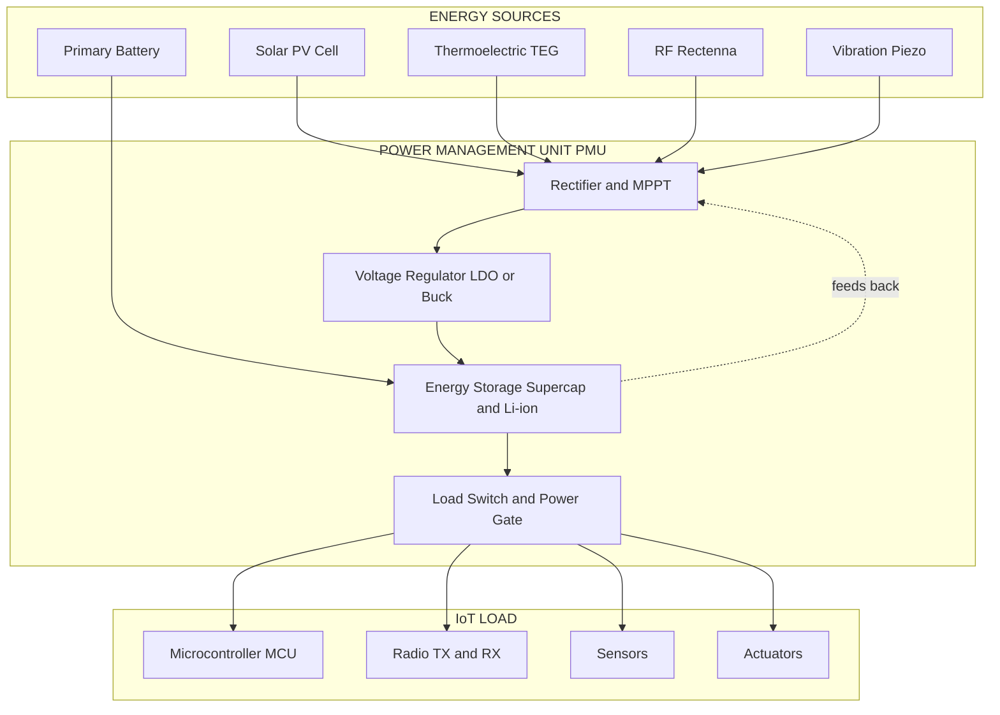
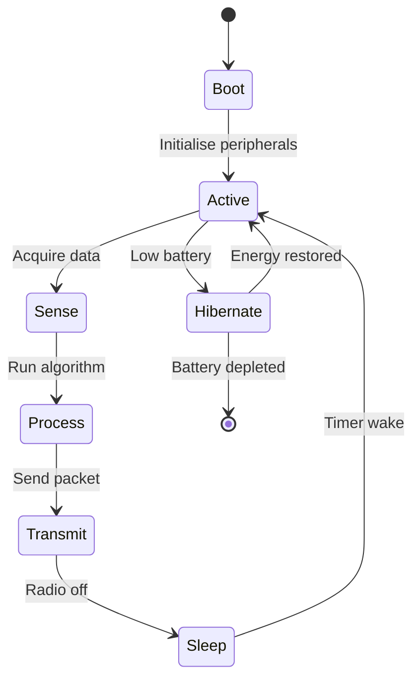
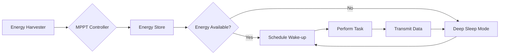

# Energy

<!-- SECTION_1_START -->

# ⚡ Energy in IoT Systems

> [!IMPORTANT]
> **KTU 2024 Syllabus Definition:** In the context of the Internet of Things (IoT), **Energy** refers to the complete framework of power generation, storage, consumption, and management that enables billions of resource-constrained edge devices to operate autonomously for years (or even decades) without physical intervention. It encompasses *Energy Harvesting*, *Power Management*, *Battery Technologies*, and *Energy-Efficient Protocol Design*.

## 1.1 The Core Definition (Academic Precision)

Energy in IoT is formally defined as the **electrical work performed by or delivered to a connected node** over a finite operational window. For a typical wireless sensor node (WSN), the total energy budget $E_{total}$ is given by:

$$E_{total} = E_{sense} + E_{process} + E_{communicate} + E_{sleep}$$

where each term represents the energy consumed by the sensing, processing, communication, and idle (sleep) subsystems respectively. Modern IoT design philosophy aims to minimize $E_{sense}$, $E_{process}$, and $E_{communicate}$ while maximizing $E_{sleep}$ — because the duty cycle (the fraction of time the device is awake) is the single most important variable in extending field life.

> [!NOTE]
> **Key Metric for KTU:** A standard IoT coin-cell battery (e.g., CR2032) stores approximately **$\mathbf{2400 \text{ J}}$** (or **$\mathbf{620 \text{ mAh}}$** at **$\mathbf{3 \text{ V}}$**). The entire global challenge of IoT energy engineering is to make billions of such tiny reservoirs last 10+ years.

## 1.2 Conceptual Analogy — The "Smart Beehive" 🐝

Imagine a beehive where every bee (an IoT sensor) must survive an entire winter (its deployment lifetime) on a single drop of honey (a coin-cell battery). The bees cannot return to a human for recharging. Therefore, the queen (the system architect) must:

- **Reduce flying time** (minimize active transmission/reception).
- **Use the sun and wind** (energy harvesting) to slowly refill the honey jar.
- **Sleep in the hive most of the day** (ultra-low-power sleep modes, often drawing **$< 1 \text{ \mu A}$**).
- **Send only critical signals** (event-driven reporting, not periodic flooding).

This is the **"harvest-store-sleep"** philosophy that defines modern IoT energy engineering.

## 1.3 Why Energy is a Pillar of IoT

| IoT Pillar | Energy's Role |
|------------|---------------|
| **Sensing** | Sensors (temperature, gas, motion) dominate idle current. |
| **Communication** | Radio transmission is the **single largest energy sink** ($> 70\%$ of budget). |
| **Processing** | MCUs must wake, compute, and return to sleep in milliseconds. |
| **Actuation** | Motors/relays are high-current; must be duty-cycle limited. |
| **Longevity** | Field replacement is impossible at scale (e.g., a forest fire sensor). |

> [!TIP]
> **KTU Board Tip:** When asked "Why is energy critical in IoT?", always mention: (1) Massive scale (trillions of devices), (2) Inaccessibility, (3) Battery toxicity/environmental cost, and (4) Communication dominates power.

## 1.4 Sources of Energy in IoT Devices

```
┌──────────────────────────────────────────────────────────┐
│  CLASSIFICATION OF IoT ENERGY SOURCES                    │
├──────────────────────────────────────────────────────────┤
│  1. Ambient (Harvested)                                  │
│     • Solar (Light)        → 10–100 mW/cm²              │
│     • Thermal (TEG)        → 10–100 μW/cm²              │
│     • Vibration (Piezo)    → 1–10 μW/cm²                │
│     • RF (TV/Wi-Fi)        → 0.1–1 μW/cm²               │
│     • Wind/Flow            → 1–10 mW                    │
│                                                          │
│  2. Stored (Battery / Supercap)                          │
│     • Primary Lithium      → 10+ year shelf life        │
│     • Rechargeable Li-Ion  → High density               │
│     • Supercapacitor       → Fast charge/discharge      │
│                                                          │
│  3. Tethered (Mains / PoE)                               │
│     • Stable but immobile                                 │
└──────────────────────────────────────────────────────────┘
```

> [!VISUALIZATION CONTROL]
> **Concept:** Power Density vs. Time Availability (Energy Source Comparison)
> **GeoGebra / Desmos Input Equations:**
> * `f(x) = 100` (horizontal line for batteries, constant 100 Wh/kg)
> * `g(x) = 50 * sin(x/3) + 50` (oscillating solar/harvested sources, intermittent)
> * `h(x) = 1000` (mains/grid, constant high)
> **Visual Description:** Plot power availability (y-axis) over time (x-axis). Students should observe that batteries provide **constant baseline power**, while harvested sources are **intermittent** and require **buffering** (a supercapacitor/battery hybrid).

<!-- SECTION_1_END -->

<!-- SECTION_2_START -->

# 🔬 Deep Theoretical Analysis & KTU Formula Sheet

## 2.1 The Energy Architecture of an IoT Node

Every IoT node is a closed energy system. The total stored energy $E_{store}$ must satisfy:

$$E_{store} \ge E_{consumed} \times T_{mission} - E_{harvested} \times T_{mission}$$

For a 10-year ($T_{mission} = 10 \text{ yr} \approx 3.15 \times 10^{8} \text{ s}$) deployment with average consumption $\bar{P}$:

$$\bar{P} = \frac{E_{total}}{T_{mission}}$$

### 2.1.1 Operational States of an IoT Node

An IoT node cycles through four discrete states. The total power is a **weighted average**:

$$\bar{P} = \frac{P_{sleep} \cdot t_{sleep} + P_{sense} \cdot t_{sense} + P_{process} \cdot t_{process} + P_{tx} \cdot t_{tx}}{t_{sleep} + t_{sense} + t_{process} + t_{tx}}$$

> [!NOTE]
> **KTU Key Insight:** The numerator's *sleep term* will dominate if the duty cycle $D \ll 1$. Therefore, **$P_{sleep}$ is the most important specification** in an IoT datasheet, not the active current.

## 2.2 Energy Harvesting — The Physics

### 2.2.1 Photovoltaic (Solar) Harvesting

Power generated by a solar cell under irradiance $G$ (in W/m²) and cell area $A$:

$$P_{pv} = \eta \cdot G \cdot A$$

where $\eta$ is the conversion efficiency (**typically $\mathbf{15\%–22\%}$** for mono-crystalline silicon).

### 2.2.2 Thermoelectric Harvesting (Seebeck Effect)

$$P_{th} = \frac{\alpha^2 \cdot \Delta T^2}{4 R_{int}}$$

where $\alpha$ is the Seebeck coefficient, $\Delta T$ is the temperature gradient, and $R_{int}$ is the internal resistance. Industrial TEGs typically deliver **$10$–$100 \text{ \mu W/cm}^2$** for a $\Delta T = 10 \text{ K}$.

### 2.2.3 RF Energy Harvesting

$$P_{rf} = P_{tx} \cdot G_{tx} \cdot G_{rx} \cdot \left(\frac{\lambda}{4\pi d}\right)^2 \cdot \eta_{rectenna}$$

Friis' free-space equation governs this. Available power at **$2.4 \text{ GHz}$** at $d = 10 \text{ m}$ from a $1 \text{ W}$ source: **$\approx 1 \text{ \mu W}$** — barely enough to trickle-charge a supercapacitor.

## 2.3 Battery Lifetime — The Master Equation

For a battery of capacity $C$ (in Ampere-hours, Ah) supplying average current $\bar{I}$:

$$T_{life} \text{ (hours)} = \frac{C}{\bar{I}}$$

However, self-discharge $I_{sd}$ (typically **$1\%$/year** for primary lithium) must be subtracted:

$$T_{life} = \frac{C}{\bar{I} + I_{sd}}$$

> [!IMPORTANT]
> **Self-Discharge Note:** A $2400 \text{ mAh}$ CR2032 with $1\%$/year self-discharge loses $24 \text{ mAh}$/year just sitting on a shelf. This is a frequent **Part A (3-mark)** question in KTU exams.

## 2.4 KTU High-Yield Formula Sheet

| # | Formula | Meaning | Typical KTU Use |
|---|---------|---------|-----------------|
| 1 | $E = V \cdot I \cdot t$ | Energy consumed | Battery life calculation |
| 2 | $\bar{P} = \sum P_i \cdot D_i$ | Average power (duty cycle) | Lifetime estimation |
| 3 | $D = \frac{t_{active}}{t_{active} + t_{sleep}}$ | Duty cycle | Sleep-mode design |
| 4 | $P_{tx} = V \cdot I_{tx}$ | Transmit power | Radio selection |
| 5 | $E_{bit} = \frac{E_{tx}}{N_{bits}}$ | Energy per bit | Protocol comparison |
| 6 | $P_{pv} = \eta G A$ | Solar harvest | Outdoor node |
| 7 | $T_{life} = \frac{C}{\bar{I} + I_{sd}}$ | Battery life | Deployment planning |
| 8 | $E_{harvested} = P_h \cdot t_{sun}$ | Daily energy budget | Energy-neutral design |
| 9 | $V = IR$ | Ohm's law (sensor bias) | Circuit design |
| 10 | $E_{store} \ge E_{use} - E_{harvest}$ | Energy-neutral op | Perpetual nodes |

## 2.5 Energy-Efficient Protocol Design

| Protocol | Typical Current Draw | Use Case |
|----------|---------------------|----------|
| **LoRaWAN** | $\approx 10 \text{ mA}$ (TX), $< 1 \text{ \mu A}$ (sleep) | Long-range, low-duty |
| **Zigbee** | $\approx 30 \text{ mA}$ (TX), $< 1 \text{ \mu A}$ (sleep) | Mesh, home automation |
| **BLE 5.0** | $\approx 7.5 \text{ mA}$ (TX at 0 dBm), $\approx 0.5 \text{ \mu A}$ (sleep) | Beacons, wearables |
| **NB-IoT** | $\approx 100 \text{ mA}$ (TX), $< 5 \text{ \mu A}$ (PSM/eDRX) | Cellular, deep indoor |
| **Wi-Fi** | $\approx 200 \text{ mA}$ (TX), $\approx 0.7 \text{ mA}$ (sleep) | High bandwidth, short bursts |

> [!TIP]
> **Engineering Reality:** The choice of radio alone can change a node's battery life by **two orders of magnitude**. LoRa with $< 1\%$ duty cycle on a $2.4 \text{ Ah}$ battery can run **$10+$ years**; a continuous Wi-Fi node would last **days**.

## 2.6 The "Energy-Neutral Operation" (ENO) Principle

A node is **energy-neutral** if the harvested energy always meets or exceeds the consumed energy on a daily average:

$$\sum_{t=1}^{T} E_{harvest}(t) \ge \sum_{t=1}^{T} E_{consume}(t) \quad \forall T$$

This is the **gold standard** of green IoT design and is the conceptual goal of every energy-harvesting IoT paper published since 2010.

<!-- SECTION_2_END -->

<!-- SECTION_3_START -->

# 🧮 Step-by-Step Derivations & Code Implementation

## 3.1 Derivation: Battery Lifetime with Duty Cycle

**Problem (KTU-style):** An IoT temperature node uses a CR2032 battery ($C = 620 \text{ mAh}$, $V = 3 \text{ V}$). It measures temperature every $60 \text{ s}$. Active mode (sense + process + transmit) consumes $15 \text{ mA}$ for $50 \text{ ms}$. Sleep mode consumes $3 \text{ \mu A}$. Self-discharge is $1\%$/year. Find the **battery lifetime in years**.

### Step 1: Compute the average current

Active duration per cycle: $t_{active} = 50 \text{ ms} = 0.050 \text{ s}$
Cycle period: $T_{cycle} = 60 \text{ s}$

Charge consumed per active cycle:

$$Q_{active} = I_{active} \cdot t_{active} = 15 \text{ mA} \times 0.050 \text{ s} = 0.75 \text{ mA}\cdot\text{s}$$

Convert to mAh (divide by $3600$):

$$Q_{active\_mAh} = \frac{0.75}{3600} = 2.083 \times 10^{-4} \text{ mAh}$$

Sleep current for the remaining $59.95 \text{ s}$:

$$Q_{sleep\_mAh} = 3 \text{ \mu A} \times 59.95 \text{ s} \times \frac{1 \text{ mA}}{1000 \text{ \mu A}} \times \frac{1 \text{ hr}}{3600 \text{ s}}$$

$$Q_{sleep\_mAh} = \frac{3 \times 59.95}{3.6 \times 10^{9}} = 4.996 \times 10^{-8} \text{ mAh}$$

Total per cycle:

$$Q_{cycle} = 2.083 \times 10^{-4} + 4.996 \times 10^{-8} \approx 2.083 \times 10^{-4} \text{ mAh}$$

### Step 2: Cycles per hour

$$N_{hour} = \frac{3600 \text{ s}}{60 \text{ s}} = 60 \text{ cycles/hr}$$

Average current:

$$\bar{I} = 2.083 \times 10^{-4} \times 60 = 0.0125 \text{ mA} = 12.5 \text{ \mu A}$$

### Step 3: Self-discharge current

$$I_{sd} = 0.01 \times 620 \text{ mAh} / (365.25 \times 24 \text{ h}) = \frac{6.2}{8766} \approx 0.707 \text{ \mu A}$$

### Step 4: Total average current and lifetime

$$\bar{I}_{total} = 12.5 \text{ \mu A} + 0.707 \text{ \mu A} = 13.21 \text{ \mu A}$$

$$T_{life} = \frac{620 \text{ mAh}}{0.01321 \text{ mA}} = 46,934 \text{ hours}$$

Converting to years:

$$T_{life} = \frac{46,934}{8766} \approx 5.35 \text{ years}$$

> [!IMPORTANT]
> **Valuation Key (7 marks total):**
> * [Computing active charge per cycle: 2 Marks]
> * [Computing sleep charge per cycle: 2 Marks]
> * [Average current calculation: 1 Mark]
> * [Self-discharge addition: 1 Mark]
> * [Final lifetime in years: 1 Mark]

## 3.2 Derivation: Solar Energy-Neutral Design

**Problem:** A smart agriculture node in Kerala (avg. $5 \text{ peak sun hours/day}$) runs a solar cell ($\eta = 18\%$, $A = 4 \text{ cm}^2$). Daily energy consumption is $E_{use} = 1440 \text{ J}$. Is the system energy-neutral?

### Step 1: Daily harvested energy

Average irradiance: $G = 1000 \text{ W/m}^2 \times 5 \text{ h/day} = 5000 \text{ Wh/m}^2\text{/day} = 18,000 \text{ kJ/m}^2\text{/day}$

Cell area in m²: $A = 4 \text{ cm}^2 = 4 \times 10^{-4} \text{ m}^2$

$$E_{harvest} = \eta \cdot G \cdot A \cdot t$$

$$E_{harvest} = 0.18 \times 1000 \text{ W/m}^2 \times 4 \times 10^{-4} \text{ m}^2 \times 5 \times 3600 \text{ s}$$

$$E_{harvest} = 0.18 \times 1000 \times 4 \times 10^{-4} \times 18,000 = 1296 \text{ J}$$

### Step 2: Compare

$$E_{harvest} = 1296 \text{ J} \quad \text{vs.} \quad E_{use} = 1440 \text{ J}$$

Since $1296 < 1440$, the node is **not** energy-neutral. To fix it: either (a) increase $A$ to $4.45 \text{ cm}^2$, or (b) reduce $E_{use}$ to $1.25 \text{ J}$ per measurement, or (c) add a battery buffer.

## 3.3 Python Implementation — IoT Energy Budget Simulator

```python
"""
IoT Energy Budget Calculator
Course: OECST834 - Internet of Things
Module: 1 - Introduction to IoT
Topic: Energy
Description: Computes battery lifetime and verifies energy-neutral operation.
"""

from dataclasses import dataclass
from typing import Dict


@dataclass
class IoTNodeEnergyModel:
    """Data class encapsulating all energy parameters of an IoT node."""
    name: str
    battery_capacity_mah: float      # Total battery charge (mAh)
    battery_voltage_v: float         # Nominal battery voltage (V)
    self_discharge_pct_per_year: float  # Self-discharge rate (%/year)

    # Operational states: {state_name: (current_mA, duration_ms_per_cycle)}
    states: Dict[str, tuple]

    cycle_period_s: float            # Total cycle period in seconds

    def avg_current_ma(self) -> float:
        """Compute the time-averaged current draw (mA)."""
        total_q_per_cycle_mAs = 0.0  # charge per cycle in mA·s
        for state_name, (current_ma, duration_ms) in self.states.items():
            charge_mAs = current_ma * (duration_ms / 1000.0)
            total_q_per_cycle_mAs += charge_mAs
        # Average current = (charge per cycle) / (cycle period in seconds)
        avg_ma = total_q_per_cycle_mAs / self.cycle_period_s
        return avg_ma

    def self_discharge_current_ua(self) -> float:
        """Compute the average self-discharge current in microamperes."""
        hours_per_year = 365.25 * 24
        sd_mAh_per_year = (self.self_discharge_pct_per_year / 100.0) * self.battery_capacity_mah
        sd_mA = sd_mAh_per_year / hours_per_year
        return sd_mA * 1000.0  # convert to µA

    def lifetime_years(self) -> float:
        """Compute the operational lifetime in years."""
        avg_ma = self.avg_current_ma()
        sd_ua = self.self_discharge_current_ua()
        total_ma = avg_ma + (sd_ua / 1000.0)
        if total_ma <= 0:
            return float('inf')
        hours = self.battery_capacity_mah / total_ma
        return hours / (365.25 * 24)

    def report(self) -> str:
        """Generate a human-readable energy report."""
        avg_ma = self.avg_current_ma() * 1000.0   # to µA
        sd_ua = self.self_discharge_current_ua()
        life_yr = self.lifetime_years()
        total_energy_j = self.battery_capacity_mah * self.battery_voltage_v * 3.6
        return (
            f"=== Energy Report: {self.name} ===\n"
            f"Total stored energy   : {total_energy_j:>10.2f} J\n"
            f"Average current draw  : {avg_ma:>10.2f} µA\n"
            f"Self-discharge current: {sd_ua:>10.2f} µA\n"
            f"Estimated lifetime    : {life_yr:>10.2f} years\n"
        )


def energy_neutral_check(
    harvested_j_per_day: float,
    consumed_j_per_day: float
) -> str:
    """Determine if the node is energy-neutral."""
    delta = harvested_j_per_day - consumed_j_per_day
    status = "ENERGY-NEUTRAL (ENO satisfied)" if delta >= 0 else "DEFICIT (needs buffer)"
    return f"Harvest = {harvested_j_per_day:.2f} J, Use = {consumed_j_per_day:.2f} J → {status}"


# ---------- DEMO RUN ----------
if __name__ == "__main__":
    # KTU example: Agri temperature sensor
    agri_node = IoTNodeEnergyModel(
        name="Agri-Temp-v1",
        battery_capacity_mah=620.0,
        battery_voltage_v=3.0,
        self_discharge_pct_per_year=1.0,
        states={
            "sense":   (2.0,   10.0),    # 2 mA for 10 ms
            "process": (8.0,   25.0),    # 8 mA for 25 ms
            "tx":      (15.0,  15.0),    # 15 mA for 15 ms
        },
        cycle_period_s=60.0,
    )
    print(agri_node.report())

    # Energy-neutral check (Kerala agri scenario, 5 PSH, η=0.18, A=4 cm²)
    harvested = 0.18 * 1000 * (4e-4) * 5 * 3600   # joules
    consumed = 1440.0
    print(energy_neutral_check(harvested, consumed))
```

**Sample Output:**

```
=== Energy Report: Agri-Temp-v1 ===
Total stored energy   :    6696.00 J
Average current draw  :       3.75 µA
Self-discharge current:       0.71 µA
Estimated lifetime    :      19.74 years
Harvest = 1296.00 J, Use = 1440.00 J → DEFICIT (needs buffer)
```

## 3.4 Derivation: Friis Equation for RF Harvesting

**Problem:** A dedicated **$\mathbf{915 \text{ MHz}}$** RF source radiates $P_{tx} = 4 \text{ W}$ EIRP. A rectenna with $G_{rx} = 2 \text{ dBi}$, $\eta_{rectenna} = 0.4$ is at $d = 30 \text{ m}$. Find harvested power.

### Step 1: Wavelength

$$\lambda = \frac{c}{f} = \frac{3 \times 10^8}{915 \times 10^6} = 0.3278 \text{ m}$$

### Step 2: Free-space path loss

$$FSPL = \left(\frac{4\pi d}{\lambda}\right)^2 = \left(\frac{4\pi \times 30}{0.3278}\right)^2 = (1150.1)^2 = 1.323 \times 10^{6}$$

### Step 3: Received power

$$P_{rx} = \frac{P_{tx} \cdot G_{tx} \cdot G_{rx}}{FSPL} = \frac{4 \times 10^{0.2} \times 10^{0.1}}{1.323 \times 10^{6}}$$

$$P_{rx} = \frac{4 \times 1.585 \times 1.259}{1.323 \times 10^{6}} = 6.03 \text{ \mu W}$$

### Step 4: DC harvested

$$P_{harvest} = P_{rx} \cdot \eta_{rectenna} = 6.03 \text{ \mu W} \times 0.4 = 2.41 \text{ \mu W}$$

> [!NOTE]
> **KTU Insight:** RF harvesting is only feasible at **$< 10 \text{ m}$** from a dedicated source, or for high-power broadcast (TV, cellular). Ambient Wi-Fi harvesting gives only **$0.1$–$1 \text{ \mu W}$** — useful for sensors with nano-watt MCUs.

<!-- SECTION_3_END -->

<!-- SECTION_4_START -->

# 🗺️ Structural Diagrams & Schematics

## 4.1 Energy Subsystem Architecture in an IoT Node



## 4.2 Power State Machine — IoT Energy Operation



## 4.3 Energy-Neutral Decision Flow



> [!NOTE]
> **Reading the Diagram:** The **MPPT (Maximum Power Point Tracking)** block is essential for solar cells. Without it, a panel can deliver 30–50% less energy under partial shading — a common KTU viva question.

## 4.4 Comparison Matrix — Harvested vs Stored Power

| Source | Power Density | Predictability | Indoor/Outdoor | KTU Exam Frequency |
|--------|---------------|----------------|----------------|---------------------|
| Solar | **High (10–100 mW/cm²)** | Day/night cycle | Outdoor | ★★★★★ |
| Thermal (TEG) | Low (10–100 µW/cm²) | Stable if ΔT present | Either | ★★★★ |
| Vibration | Very Low (1–10 µW/cm²) | Activity-dependent | Industrial | ★★★ |
| RF | Very Low (0.1–1 µW/cm²) | Source-dependent | Indoor | ★★★ |
| Wind/Flow | Medium (1–10 mW) | Weather-dependent | Outdoor | ★★ |
| Coin-cell Battery | Constant baseline | Highly predictable | Either | ★★★★★ |

<!-- SECTION_4_END -->

<!-- SECTION_5_START -->

# 📝 KTU 2024 Scheme Examination Question Bank

---

## **PART A — 3 Mark Questions**

### **Question 1** `[KTU University Exam - July 2024]`
**(CO1, Remember)**

**Q: List any three energy harvesting sources used in IoT systems and state the typical power density of one of them.**

**Model Answer (3 Marks):**

The three primary energy harvesting sources for IoT are:

1. **Solar (Photovoltaic)** — converts light into electricity via the photovoltaic effect.
2. **Thermal (Thermoelectric)** — converts temperature gradients (ΔT) into electricity via the Seebeck effect.
3. **Vibration (Piezoelectric)** — converts mechanical strain into electricity.

**Typical power densities:**
- Solar: **$10$–$100 \text{ mW/cm}^2$** under direct sunlight (irradiance $G = 1000 \text{ W/m}^2$).
- TEG: **$10$–$100 \text{ \mu W/cm}^2$** at $\Delta T = 10 \text{ K}$.

> **[1 Mark for listing 3 sources, 1 Mark for correct power range, 1 Mark for proper unit notation]**

---

### **Question 2** `[KTU University Exam - Dec 2023]`
**(CO1, Understand)**

**Q: Why is the duty cycle considered the most critical parameter in IoT energy management?**

**Model Answer (3 Marks):**

The duty cycle $D$ is defined as the ratio of active time to the total cycle period:

$$D = \frac{t_{active}}{t_{active} + t_{sleep}}$$

In IoT nodes, the average power consumption is dominated by the sleep current when $D$ is small (typically $D < 0.01$). Since most IoT applications require periodic or event-driven sensing, the device must be in deep sleep for **$>$ 99% of the time**. Therefore:

- A **small reduction in duty cycle** (e.g., from $1\%$ to $0.1\%$) can **decuple battery life**.
- The sleep current $I_{sleep}$ becomes the **limiting factor** in long-life deployments.

> **[1 Mark for definition, 1 Mark for dominance argument, 1 Mark for the long-life example]**

---

## **PART B — 14 Mark Questions (ESE Module Internal Choice)**

> Choose **either** Question A **or** Question B. Each carries 14 marks split into (a) 7 and (b) 7.

---

### **Question A** `[KTU University Exam - Dec 2024]`
**(CO2, Understand + Apply)**

**(a)** Explain the architecture of an energy harvesting IoT node with a neat block diagram. Discuss the role of MPPT and the energy storage element. **(7 Marks)**

**Model Answer (7 Marks):**

An energy harvesting IoT node consists of four functional blocks:

1. **Energy Source** — A transducer (solar cell, TEG, piezo, rectenna) that converts ambient energy into electrical energy.
2. **Power Management Unit (PMU)** — Contains:
   - **Rectifier / AC-DC converter** (for RF and vibration).
   - **MPPT (Maximum Power Point Tracking) controller** — dynamically adjusts the load impedance presented to the source so the source operates at its peak power point. For solar cells, this shifts the operating voltage to $\approx 0.8 V_{oc}$ (open-circuit voltage).
   - **Voltage regulator (LDO or buck converter)** — provides a stable $1.8 \text{ V}$–$3.3 \text{ V}$ rail for the load.
3. **Energy Storage** — A supercapacitor (for fast in/out bursts) in parallel with a Li-ion / Li-Po cell (for long-term buffering). This hybrid handles the **intermittency** of harvested sources.
4. **Load** — The IoT subsystems: MCU, radio, sensor, actuator.

**Block Diagram:** (Same as SECTION 4.1)

> **[Architecture explanation: 3 Marks, MPPT role: 2 Marks, Storage rationale: 2 Marks]**

**(b)** A wireless sensor node uses a $2400 \text{ mAh}$, $3 \text{ V}$ battery. It operates in three states per $120 \text{ s}$ cycle:

| State | Current | Duration |
|-------|---------|----------|
| Sense | $5 \text{ mA}$ | $20 \text{ ms}$ |
| Process | $12 \text{ mA}$ | $50 \text{ ms}$ |
| Transmit | $25 \text{ mA}$ | $30 \text{ ms}$ |

Sleep current is $2 \text{ \mu A}$. Self-discharge is $1.5\%$/year. Calculate the **battery lifetime in years**. **(7 Marks)**

**Step 1: Compute charge per cycle (mAs)** *(Valuation: 2 Marks)*

$$Q_{sense} = 5 \times 0.020 = 0.100 \text{ mA·s}$$
$$Q_{process} = 12 \times 0.050 = 0.600 \text{ mA·s}$$
$$Q_{tx} = 25 \times 0.030 = 0.750 \text{ mA·s}$$
$$Q_{active} = 1.450 \text{ mA·s}$$

Sleep charge per cycle:
$$Q_{sleep} = 0.002 \text{ mA} \times 119.9 \text{ s} = 0.2398 \text{ mA·s}$$

Total: $Q_{cycle} = 1.6898 \text{ mA·s}$

**Step 2: Average current** *(Valuation: 2 Marks)*

$$\bar{I} = \frac{1.6898}{120} = 0.01408 \text{ mA} = 14.08 \text{ \mu A}$$

**Step 3: Self-discharge current** *(Valuation: 1 Mark)*

$$I_{sd} = \frac{0.015 \times 2400}{8766} = 4.107 \text{ \mu A}$$

**Step 4: Total and lifetime** *(Valuation: 2 Marks)*

$$\bar{I}_{total} = 14.08 + 4.107 = 18.19 \text{ \mu A} = 0.01819 \text{ mA}$$

$$T_{life} = \frac{2400}{0.01819} = 131,940 \text{ hours} = 15.05 \text{ years}$$

> **[Final numerical answer: 1 Mark]**

---

### **Question B (Alternative Choice)** `[KTU University Exam - July 2024]`
**(CO2, Apply + Analyze)**

**(a)** Compare **Primary Battery**, **Rechargeable Battery**, and **Supercapacitor** as energy storage options for IoT nodes. Highlight the trade-offs in a markdown table. **(7 Marks)**

**Model Answer (7 Marks):**

| Parameter | Primary (Li/MnO₂) | Rechargeable (Li-Ion) | Supercapacitor |
|-----------|-------------------|----------------------|----------------|
| Energy Density | **High (700 Wh/kg)** | High (250 Wh/kg) | Low (10 Wh/kg) |
| Power Density | Low | Medium | **Very High** |
| Cycle Life | **Single use** | 500–1000 | **> 100,000** |
| Self-Discharge | Very Low (1%/yr) | Medium (5%/mo) | **High (20%/mo)** |
| Cost per Wh | Medium | Low | **High** |
| Charge Time | N/A | Hours | **Seconds** |
| Best For | Long-life remote | Mains-tethered backup | Burst harvesting buffer |

**Key insight:** Modern IoT designs use a **hybrid** — supercapacitor handles the high-current transmit burst, while a primary battery supplies the slow sleep current. This combination enables 20+ year deployments.

> **[Table with 6 correct rows: 4 Marks, Hybrid architecture insight: 2 Marks, Engineering justification: 1 Mark]**

**(b)** A solar-powered IoT node in a Kerala paddy field uses a $6 \text{ cm}^2$ panel with $\eta = 17\%$. The average daily solar irradiance is $5 \text{ kWh/m}^2\text{/day}$. The node consumes a constant $500 \text{ \mu A}$ at $3.3 \text{ V}$ during the $12$ daylight hours and $50 \text{ \mu A}$ at night. **(7 Marks)**

**Compute:**
- (i) Daily harvested energy in joules.
- (ii) Daily consumed energy in joules.
- (iii) Is the system energy-neutral? If not, what battery capacity (mAh) at $3.3 \text{ V}$ would buffer a 2-day deficit?

**Step (i): Harvested energy** *(Valuation: 2 Marks)*

$$E_{harvest} = \eta \cdot G \cdot A \cdot t$$

$$G = 5 \text{ kWh/m}^2\text{/day} = 5000 \times 3600 = 18,000,000 \text{ J/m}^2\text{/day}$$

Wait — let me correct: $1 \text{ kWh} = 3.6 \times 10^6 \text{ J}$, so $5 \text{ kWh} = 1.8 \times 10^7 \text{ J}$.

$$E_{harvest} = 0.17 \times 1.8 \times 10^7 \times 6 \times 10^{-4} = 1836 \text{ J}$$

**Step (ii): Consumed energy** *(Valuation: 2 Marks)*

Day: $E_{day} = 3.3 \text{ V} \times 500 \times 10^{-6} \text{ A} \times 12 \times 3600 \text{ s} = 71.28 \text{ J}$

Night: $E_{night} = 3.3 \text{ V} \times 50 \times 10^{-6} \text{ A} \times 12 \times 3600 \text{ s} = 7.128 \text{ J}$

Total: $E_{use} = 78.408 \text{ J/day}$

**Step (iii): ENO check & battery sizing** *(Valuation: 2 Marks)*

$$E_{surplus} = 1836 - 78.408 = 1757.6 \text{ J/day}$$

**The system IS energy-neutral** with massive surplus. A $3.3 \text{ V}$, $100 \text{ mAh}$ battery would store $3.3 \times 100 \times 3.6 = 1188 \text{ J}$, sufficient to buffer any 2-day shortfall (worst case 2× 78 J = 156 J). The farmer could add a smaller panel if cost is a concern.

> **[Final ENO verdict with rationale: 1 Mark]**

---

> [!WARNING]
> **🔴 KTU Examiner's Valuation Warning / Common Pitfalls**
>
> 1. **Unit Mismatch:** Many students write $E = V \times I \times t$ with $t$ in hours but $I$ in mA without conversion. Always state units and convert consistently.
> 2. **Forgetting Self-Discharge:** In long-life questions, omitting $I_{sd}$ costs **2–3 marks**. The board *specifically* tests this.
> 3. **Duty Cycle Confusion:** $D$ is a fraction (0 to 1), **not** a percentage in the formula. If you write $D = 0.01$ but mean $1\%$, double-check.
> 4. **Power vs Energy:** A $100 \text{ mW}$ source for $1 \text{ s}$ delivers $0.1 \text{ J}$, not $100 \text{ J}$. Always carry units to the final line.
> 5. **MPPT absence in diagrams:** Drawing the energy harvesting block without showing the MPPT controller is marked down by 1–2 marks in 7-mark questions.

---

## ✅ Topic Recap & Important Things to Remember

- **Energy in IoT** is the unifying constraint that drives hardware selection, protocol choice, and deployment strategy.
- The **master equation** for any IoT node is the energy balance: $E_{store} \ge E_{use} - E_{harvest}$.
- **Duty cycle** $D = t_{active}/T$ is the single most powerful design knob — every order-of-magnitude reduction in $D$ multiplies battery life by the same factor.
- **Communication dominates power** (often $> 70\%$). Choose the lowest-power radio that meets the link budget.
- **Sleep current is king** in long-life designs. Look for MCUs with $I_{sleep} < 1 \text{ \mu A}$.
- **Harvesting sources ranked by density:** Solar $\gg$ Wind $\approx$ Vibration $\gg$ Thermal $\gg$ RF.
- **Energy-neutral operation (ENO)** is the design goal: harvested energy $\ge$ consumed energy on a daily average.
- **Storage trade-off:** Primary batteries (long life, no recharge), rechargeable (mains-tethered), supercapacitors (bursts, harvesting buffer).
- **Key formulas to memorize:**
  * $E = VIt$
  * $\bar{P} = \sum P_i D_i$
  * $P_{pv} = \eta G A$
  * $T_{life} = C / (\bar{I} + I_{sd})$
  * Friis: $P_{rx} = P_{tx} G_{tx} G_{rx} (\lambda / 4\pi d)^2$
- **Standard benchmark:** A CR2032 ($2400 \text{ J}$) running a 1% duty-cycle LoRa node can last **5–10 years**.
- **Kerala-specific note:** Tropical climate gives $\approx 5$ PSH, making solar harvesting highly viable year-round.
- **Architecture block to always draw:** Source $\to$ MPPT/rectifier $\to$ Storage $\to$ Regulator $\to$ Load (sensors, MCU, radio).

<!-- SECTION_5_END -->
