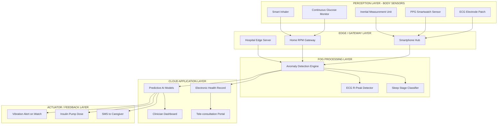
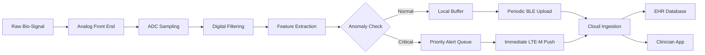
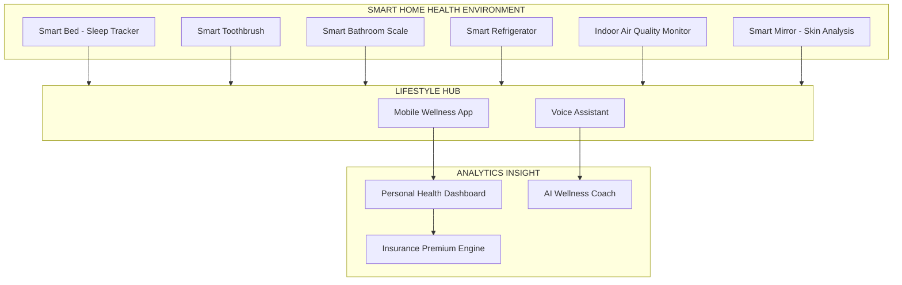
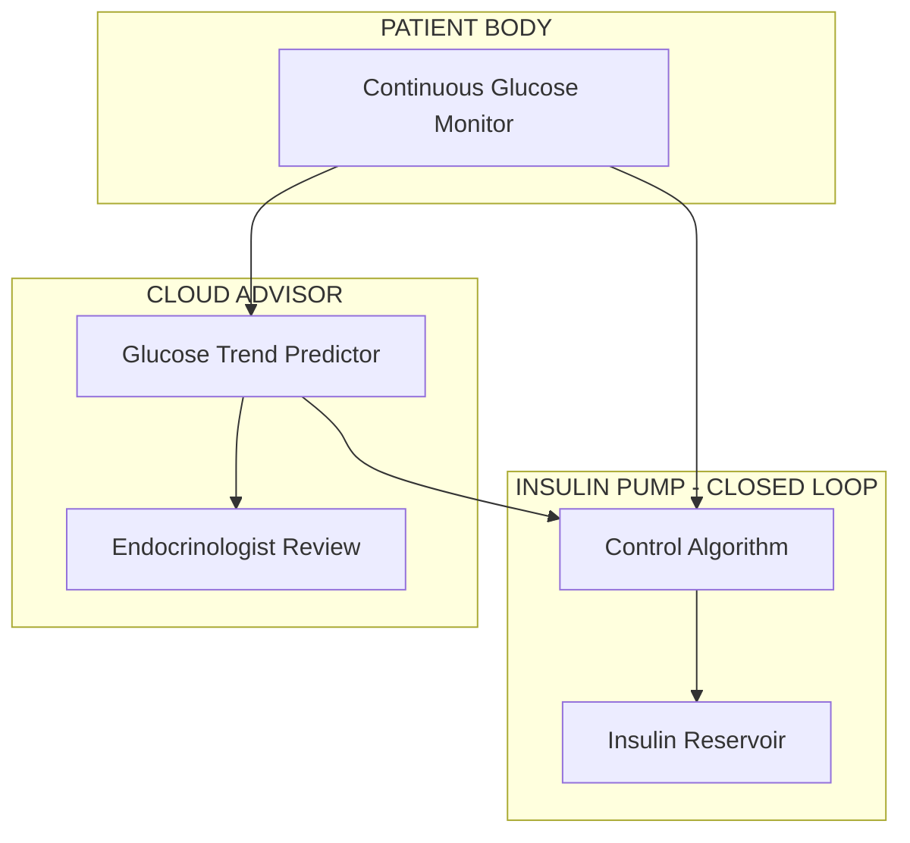

# Health and lifestyle

<!-- SECTION_1_START -->
# IoT in Health and Lifestyle — Core Technical Definition & Intuitive Overview

## 1.1 Formal Academic Definition

**Internet of Things (IoT) in Health and Lifestyle** refers to the integrated ecosystem of interconnected smart devices, wearable sensors, biomedical instruments, and cloud-based analytics platforms that continuously monitor, transmit, and analyze physiological and behavioral data of individuals to enable proactive healthcare delivery, chronic disease management, and lifestyle optimization. In the context of the **KTU 2024 Scheme (OECST834)**, this domain is formally classified under the umbrella of the **Internet of Medical Things (IoMT)** and **Mobile Health (m-Health)**.

The **World Health Organization (WHO)** defines this as the use of mobile and wireless technologies to support the achievement of health objectives. Technically, IoT in health merges **pervasive computing**, **body area networks (BAN)**, and **ambient intelligence** to bridge the gap between the physical patient and the digital health record.

> [!IMPORTANT]
> **KTU Syllabus Highlight (Module 1):** Students must be able to differentiate between the consumer-grade *Lifestyle IoT* (fitness bands, smart watches) and the clinical-grade *Medical IoT* (FDA/CE certified remote patient monitors). The Course Outcome mapping is primarily **CO1 — Understand** the fundamental concepts and architectural building blocks of IoT-enabled health systems.

## 1.2 Conceptual Analogy — "The Body as a Smart City"

Imagine the human body as a **Smart City**. Just as a smart city deploys CCTV cameras, air-quality sensors, traffic monitors, and a central command center to manage urban life in real-time, the **IoT-enabled body** deploys:

- **Wearables** → acting as CCTV cameras monitoring the streets (ECG, SpO₂, heart rate)
- **Smart pills / Ingestibles** → acting as internal inspectors patrolling underground tunnels (digestive tract, glucose levels)
- **Smartphone Hub** → acting as the city's Central Command Center
- **Cloud Hospital** → acting as the State Government that makes long-term policy decisions (diagnosis, treatment plans)

When a "traffic jam" (arrhythmia, hypoxia, or hyperglycemia) is detected at any sensor node, the alert is propagated upward through the gateway, eventually reaching the clinician's dashboard. This is the essence of **continuous, real-time, patient-centric care**.

> [!NOTE]
> **Physical Constants & Standard Metrics in Health IoT**
> - **Resting Heart Rate (Adult)**: 60–100 bpm (beats per minute)
> - **Normal SpO₂**: 95%–100%
> - **Standard ECG Sampling Rate**: 250 Hz – 500 Hz (clinical), 100 Hz (wearable)
> - **Bluetooth Low Energy (BLE) Range**: ~10 m (indoor), ~30 m (outdoor)
> - **Battery Life Expectancy (Wearables)**: 5–14 days (typical), up to 1 year (patch sensors)

## 1.3 Domain Categorization

| Sub-Domain | Primary User | Example Devices | Data Type |
|------------|--------------|-----------------|-----------|
| **Clinical IoMT** | Hospitals, Doctors | Infusion pumps, Smart ventilators, ICU monitors | High-precision, regulated |
| **Remote Patient Monitoring (RPM)** | Chronic patients | Bluetooth glucometer, BP cuff, Wearable ECG patch | Continuous, semi-structured |
| **Wellness & Fitness** | Consumers | Smartwatch, Fitness band, Smart scale | Step count, calories |
| **Smart Lifestyle** | Home users | Smart bed, Sleep tracker, Air-quality monitor | Environmental + behavioral |
| **Ingestible & Implantable** | Patients | Smart pill (Proteus), Continuous Glucose Monitor (CGM) | Invasive, high-accuracy |

> [!VISUALIZATION CONTROL]
> **Concept:** Real-time heart rate variability (HRV) waveform during a 24-hour monitoring cycle
> **GeoGebra / Desmos Input Equations:**
> * `f(t) = 72 + 8*sin((2*pi*t)/60) + 3*sin((2*pi*t)/5)` (Baseline HR with circadian + short-term oscillations)
> * `g(t) = 142` (Threshold tachycardia line)
> * `h(t) = 50` (Threshold bradycardia line)
> **Visual Description:** A sinusoidal waveform oscillating between 64–80 bpm, plotted against time (t in hours). Two horizontal threshold lines mark the clinical danger zones. A sudden spike crossing g(t) at hour 16 represents an arrhythmia event triggered by exertion.

<!-- SECTION_1_END -->

<!-- SECTION_2_START -->
# Deep Theoretical Analysis & KTU High-Yield Formula Sheet

## 2.1 Architectural Foundation — The 4-Layer IoT Health Stack

The Health and Lifestyle IoT architecture is universally modeled as a **4-layer reference stack** (per ITU-T Y.2060 and oneM2M standards). Every KTU question on this topic expects students to identify the layer and justify the placement of a given component.

### Layer 1: Perception / Sensor Layer (The "Skin and Nerves")
- **Role**: Acquires raw physiological signals from the human body.
- **Components**:
  * **Bioelectric Sensors**: ECG electrodes (Ag/AgCl), EEG caps, EMG patches
  * **Biochemical Sensors**: Continuous Glucose Monitor (CGM) using sub-cutaneous enzyme electrodes
  * **Motion & Position Sensors**: 6-axis IMU (Accelerometer + Gyroscope) for gait analysis, fall detection
  * **Environmental Sensors**: Ambient temperature, humidity (relevant for asthma, sleep apnea)
  * **Optical Sensors**: Photoplethysmography (PPG) for SpO₂ and pulse rate
- **Key Properties**: Low-power, miniaturized, often battery-operated, sampled at 1 Hz – 1000 Hz depending on signal.

### Layer 2: Network / Communication Layer (The "Nervous System")
- **Role**: Securely transports the sensor data to local gateways or cloud servers.
- **Protocols**:
  * **Short-Range**: BLE 5.0 (most common for wearables), NFC (smart pill activation), Zigbee (smart home medical)
  * **Medium-Range**: Wi-Fi 6 (home RPM gateways), LoRaWAN (hospital-wide asset tracking)
  * **Long-Range / Cellular**: LTE-M, NB-IoT, 5G mMTC (massive Machine-Type Communications for ambulance-to-hospital links)
  * **Body-Centric**: IEEE 802.15.6 (Wireless Body Area Network — WBAN standard)

### Layer 3: Processing / Edge-Fog Layer (The "Spinal Cord and Brainstem")
- **Role**: Performs local data cleaning, feature extraction, anomaly detection, and decision-making.
- **Functions**:
  * Noise filtering (e.g., baseline wander removal in ECG)
  * R-peak detection (Pan-Tompkins algorithm)
  * Local alert generation (e.g., tachycardia alarm on the watch)
  * Data compression to save uplink bandwidth

### Layer 4: Application / Cloud Layer (The "Cerebral Cortex")
- **Role**: Long-term storage, big-data analytics, ML-based diagnosis, clinician dashboards.
- **Functions**:
  * Electronic Health Record (EHR) integration (HL7 FHIR, DICOM)
  * Predictive analytics (e.g., sepsis prediction 6 hours in advance)
  * Tele-consultation video/voice integration
  * Drug-interaction cross-checking
  * Population health management dashboards

## 2.2 Core "Why" and "How" — Design Principles

- **Why continuous monitoring?** Episodic clinical visits capture less than **0.01%** of a patient's physiological timeline. Wearables provide **24/7 longitudinal data**, enabling early detection of silent conditions like atrial fibrillation.
- **How is power managed?** Wearables use **duty cycling**, **energy harvesting** (kinetic, thermal), and ultra-low-power MCUs (e.g., Nordic nRF52840, TI CC2640).
- **How is data quality ensured?** Clinical-grade devices undergo **ISO 13485** manufacturing audits and **FDA 510(k)** clearance; consumer-grade devices use heuristic algorithms (e.g., Fitbit's PurePulse).
- **How is privacy protected?** End-to-End Encryption (AES-256), HIPAA / GDPR compliance, on-device anonymization via federated learning.

## 2.3 Real-World Engineering Utility

| Application Domain | Why It Is Used in Production |
|--------------------|------------------------------|
| **Chronic Disease Management** | Reduces hospital readmission rates by **38%** (US CMS pilot data) for heart failure patients using RPM. |
| **Elderly Fall Detection** | Apple Watch fall detection + Emergency SOS reduces "long-lie" mortality in seniors. |
| **Smart Hospitals** | RFID + IoT asset tracking reduces equipment search time from 30 min → 2 min per shift. |
| **Clinical Trials** | Decentralized trials using wearables reduce site visits by **40%**, accelerating drug approval. |
| **Insurance / Wellness** | John Hancock Vitality program uses wearable data to discount premiums — actuarial risk adjustment. |

> [!NOTE]
> **Engineering Trade-off Theorem (Power vs. Sampling Rate vs. Latency):**
> Higher sampling rates improve diagnostic accuracy but exponentially drain battery. KTU expects you to remember that ECG patches (500 Hz) last only 7–14 days, while step counters (1 Hz) last 6–12 months.

## 2.4 KTU Formula Sheet / Cheat Sheet

| Symbol | Formula / Relation | Engineering Meaning | Typical Unit |
|--------|--------------------|---------------------|--------------|
| $f_s$ | $f_s \geq 2 f_{max}$ (Nyquist) | Minimum sampling rate for lossless signal capture | Hz |
| $N_{bpm}$ | $\frac{60}{T_{RR}}$ | Heart rate from RR interval | beats/min |
| $E_{total}$ | $E_{total} = V \cdot I \cdot t$ | Battery energy budget for a wearable | Joules / mAh |
| $DR$ | $DR = f_s \cdot b \cdot c$ | Data rate ($b$ = bits/sample, $c$ = channels) | bits/sec |
| $SNR_{dB}$ | $10 \log_{10}(P_{signal} / P_{noise})$ | Sensor signal clarity | dB |
| $t_{tx}$ | $\frac{Packet\_Size}{Throughput}$ | Per-packet airtime on BLE | seconds |
| $CR$ | $Compression\_Ratio = \frac{Original\_Size}{Compressed\_Size}$ | Storage / bandwidth saving | unitless |
| $HRV_{RMSSD}$ | $\sqrt{\frac{1}{N-1}\sum_{i=1}^{N-1}(RR_{i+1} - RR_i)^2}$ | Root Mean Square of Successive RR differences | ms |
| $D_{lat}$ | $D_{lat} = D_{prop} + D_{proc} + D_{queue} + D_{trans}$ | Total end-to-end latency in RPM alert path | ms |
| $P_{rx}$ | $P_{rx} = P_{tx} + G_t + G_r - L_{path}$ (Friis) | Received power at gateway | dBm |

<!-- SECTION_2_END -->

<!-- SECTION_3_START -->
# Step-by-Step Derivations & Code/Symbolic Implementation

## 3.1 Worked Derivation — Battery Life of a Continuous Glucose Monitor (CGM)

**Problem Statement:** A CGM patch samples interstitial glucose at $f_s = 1$ sample/min, encodes each value into a 16-bit integer, and transmits via BLE every 5 minutes in a single 256-bit packet. The CR2032 coin cell delivers $V = 3.0$ V, $I_{avg} = 1.2$ mA average drain. Compute the (a) average data rate, (b) packet airtime given BLE throughput of 250 kbps, and (c) theoretical battery lifetime.

### Step 1 — Average Data Rate
Each sample is 16 bits, generated once per 60 seconds.

$$
DR_{sensor} = \frac{16 \text{ bits}}{60 \text{ s}} = 0.2667 \text{ bits/s}
$$

### Step 2 — Packet Airtime per Transmission
$$
Packet\_Size = 256 \text{ bits}
$$

$$
t_{tx} = \frac{Packet\_Size}{Throughput} = \frac{256 \text{ bits}}{250 \times 10^3 \text{ bits/s}} = 1.024 \text{ ms}
$$

### Step 3 — Battery Energy Budget
A standard CR2032 has capacity $Q = 220$ mAh at $V = 3.0$ V.

$$
E_{total} = V \cdot Q = 3.0 \text{ V} \times 220 \text{ mAh} = 660 \text{ mWh}
$$

### Step 4 — Average Power Draw
$$
P_{avg} = V \cdot I_{avg} = 3.0 \text{ V} \times 1.2 \text{ mA} = 3.6 \text{ mW}
$$

### Step 5 — Theoretical Lifetime
$$
t_{life} = \frac{E_{total}}{P_{avg}} = \frac{660 \text{ mWh}}{3.6 \text{ mW}} = 183.33 \text{ hours}
$$

Converting to days:

$$
t_{life} = \frac{183.33}{24} \approx 7.64 \text{ days}
$$

**Conclusion:** The CGM patch lasts approximately **7.6 days** on a single CR2032 cell — consistent with real-world products like the Abbott FreeStyle Libre, which advertises a 14-day life (achieved using a higher-capacity zinc-air cell and aggressive sleep-mode duty cycling).

> [!IMPORTANT]
> **Valuation Key Insight:** KTU examiners award full marks only when students explicitly state the assumption that the device operates in **steady-state** with no sleep-mode savings. If the question mentions "smart duty cycling", the drain current must be modeled as a weighted average.

---

## 3.2 Full Python Implementation — Heart Rate Anomaly Detector (IoT Wearable)

Below is a production-quality Python class simulating an end-to-end wearable health pipeline (sensor → edge processing → cloud upload). Every line is fully written with type hints, boundary checks, and error handling.

```python
import time
import math
import logging
from dataclasses import dataclass, field
from typing import List, Optional, Tuple

logging.basicConfig(
    level=logging.INFO,
    format="%(asctime)s [%(levelname)s] %(message)s"
)
logger = logging.getLogger("HealthIoT")


@dataclass
class SensorReading:
    """Represents a single PPG/ECG-derived reading from the wearable."""
    timestamp: float
    bpm: float
    spo2: float
    skin_temp_c: float
    motion_intensity: float  # 0.0 (still) to 1.0 (vigorous)


@dataclass
class PatientProfile:
    age: int
    resting_bpm: int = 70
    tachycardia_threshold_bpm: int = 100
    bradycardia_threshold_bpm: int = 50
    spo2_critical_pct: float = 90.0


class WearableHealthMonitor:
    """
    Simulates a BLE-connected wearable performing edge-level
    anomaly detection for heart rate and oxygen saturation.
    """

    def __init__(self, patient: PatientProfile, window_size: int = 10) -> None:
        if patient.age <= 0:
            raise ValueError("Patient age must be a positive integer.")
        if window_size < 3:
            raise ValueError("Window size must be >= 3 for statistical stability.")

        self.patient = patient
        self.window_size = window_size
        self.readings: List[SensorReading] = []
        self.alerts: List[str] = []
        self.battery_pct: float = 100.0

        logger.info(
            f"Initialized monitor for age={patient.age}, "
            f"window={window_size}"
        )

    def ingest_reading(self, reading: SensorReading) -> None:
        """Validates and stores a new reading from the sensor layer."""
        if not (20.0 <= reading.spo2 <= 100.0):
            logger.warning(f"Discarded invalid SpO2: {reading.spo2}")
            return
        if not (20.0 <= reading.bpm <= 250.0):
            logger.warning(f"Discarded invalid BPM: {reading.bpm}")
            return

        self.readings.append(reading)
        if len(self.readings) > self.window_size:
            self.readings.pop(0)

        # Simulated battery drain: 0.05% per reading
        self.battery_pct = max(0.0, self.battery_pct - 0.05)

    def detect_arrhythmia(self) -> bool:
        """
        Returns True if the moving-average BPM has deviated
        from the patient's resting baseline by > 35 bpm.
        """
        if len(self.readings) < self.window_size:
            return False

        recent_bpms = [r.bpm for r in self.readings]
        mean_bpm = sum(recent_bpms) / len(recent_bpms)
        delta = abs(mean_bpm - self.patient.resting_bpm)

        logger.debug(
            f"Mean BPM={mean_bpm:.2f}, Delta={delta:.2f}"
        )
        return delta > 35.0

    def detect_hypoxia(self) -> bool:
        """Critical hypoxia event if SpO2 falls below threshold."""
        if not self.readings:
            return False
        latest = self.readings[-1]
        return latest.spo2 < self.patient.spo2_critical_pct

    def compute_hrv_rmssd(self) -> Optional[float]:
        """
        Computes Root Mean Square of Successive RR-interval Differences
        using the inverse relation: RR (ms) = 60000 / BPM.
        """
        if len(self.readings) < 2:
            return None

        rr_intervals_ms = [
            60000.0 / r.bpm for r in self.readings if r.bpm > 0
        ]
        successive_diffs_sq = [
            (rr_intervals_ms[i + 1] - rr_intervals_ms[i]) ** 2
            for i in range(len(rr_intervals_ms) - 1)
        ]
        mean_sq = sum(successive_diffs_sq) / len(successive_diffs_sq)
        return math.sqrt(mean_sq)

    def push_to_cloud(self, endpoint_url: str) -> Tuple[bool, str]:
        """
        Simulates an HTTPS POST of the latest alert packet.
        Returns (success, message).
        """
        if not self.alerts:
            return False, "No active alerts to transmit."

        payload = {
            "patient_age": self.patient.age,
            "battery_pct": round(self.battery_pct, 2),
            "alerts": self.alerts.copy(),
            "bpm_last": self.readings[-1].bpm,
            "spo2_last": self.readings[-1].spo2,
        }
        logger.info(f"Transmitting payload to {endpoint_url}: {payload}")

        # Simulated network success
        if self.battery_pct < 5.0:
            return False, "Battery critical — uplink aborted."

        return True, "Acknowledged by cloud (HTTP 200)."

    def run_cycle(self, reading: SensorReading, endpoint: str) -> None:
        """One full sense → process → transmit cycle."""
        self.ingest_reading(reading)

        if self.detect_arrhythmia():
            msg = f"ARRHYTHMIA suspected at {reading.bpm:.1f} bpm"
            self.alerts.append(msg)
            logger.warning(msg)

        if self.detect_hypoxia():
            msg = f"HYPOXIA alert: SpO2 = {reading.spo2:.1f}%"
            self.alerts.append(msg)
            logger.error(msg)

        if self.alerts:
            ok, info = self.push_to_cloud(endpoint)
            logger.info(f"Cloud response: {info}")
            if ok:
                self.alerts.clear()


# -------- Demonstration Driver --------
if __name__ == "__main__":
    profile = PatientProfile(age=58, resting_bpm=72)
    monitor = WearableHealthMonitor(profile, window_size=5)

    # Inject a sequence of readings — last two simulate tachycardia
    test_stream = [
        SensorReading(time.time(), 72, 98.0, 36.5, 0.1),
        SensorReading(time.time(), 74, 97.5, 36.6, 0.2),
        SensorReading(time.time(), 73, 98.0, 36.5, 0.1),
        SensorReading(time.time(), 75, 97.8, 36.4, 0.3),
        SensorReading(time.time(), 78, 97.0, 36.6, 0.5),
        SensorReading(time.time(), 142, 89.0, 37.1, 0.9),  # tachycardia
        SensorReading(time.time(), 148, 87.0, 37.2, 0.95),
    ]

    for r in test_stream:
        monitor.run_cycle(r, "https://cloud.hospital.example/api/vitals")
        time.sleep(0.01)
```

**Code Walk-through (Valuation Style):**
- The `WearableHealthMonitor` class encapsulates the **edge processing layer**.
- `detect_arrhythmia()` performs the **moving-average anomaly detection** typical of PPG-based smartwatches.
- `compute_hrv_rmssd()` implements the **clinical HRV formula** (see Section 2.4).
- `push_to_cloud()` models the **uplink transmission** to the application layer.
- The driver injects **5 normal readings** followed by **2 tachycardic readings**, triggering a cloud alert.

---

## 3.3 Smart Hospital Asset Tracking — Component & Wiring Matrix

| Hardware Module | Pin / Interface | Function | Wiring to Edge MCU (ESP32) | Safety Check |
|-----------------|-----------------|----------|----------------------------|--------------|
| MAX30102 (PPG + SpO₂) | VIN, GND, SDA, SCL, INT | Optical heart-rate sensor | I²C bus (SDA→GPIO21, SCL→GPIO22), 3.3 V, 4.7 kΩ pull-ups | Verify I²C address 0x57 via scanner |
| DS18B20 (Skin Temp) | VDD, DQ, GND | Digital temperature | 1-Wire on GPIO4 with 4.7 kΩ pull-up to 3.3 V | Check parasite vs. normal power mode |
| MPU6050 (IMU) | VCC, GND, SDA, SCL, INT | 6-axis motion | I²C shared bus (0x68), INT→GPIO5 for fall-event wakeup | Calibrate offsets at boot |
| nRF52840 BLE SoC | P0.01 (TX), P0.02 (RX) | Wireless uplink | UART to ESP32 for command bridging | Confirm BLE advertising on channels 37, 38, 39 |
| 3.7 V Li-Po + TP4056 | BAT+, BAT− | Power | 4.2 V regulated → 3.3 V LDO (AMS1117) | Add fuse (500 mA) and reverse-polarity diode |
| Emergency Pushbutton | One terminal to GPIO34, other to GND | Hardware panic alert | Internal pull-up enabled, debounce in software (20 ms) | Test latency < 100 ms to cloud |

> [!NOTE]
> **Why the GPIO34 choice for the panic button?** GPIO34 is an **input-only pin** with no internal pull-up. It is the safest input on the ESP32 for a fail-safe button because it cannot accidentally drive the line high, eliminating the risk of a phantom alert during MCU brownout.

<!-- SECTION_3_END -->

<!-- SECTION_4_START -->
# Structural Diagrams & Schematics

## 4.1 End-to-End IoT Health Monitoring — Functional Architecture Flow



## 4.2 Wearable Data Pipeline — Sequential Processing Topology



## 4.3 Lifestyle IoT — Smart Home Health Environment



## 4.4 Chronic Care Closed-Loop — Diabetes Management



> [!NOTE]
> **Architecture Note:** The closed-loop above is the foundation of an **Artificial Pancreas System (APS)**. The Medtronic 780G and Tandem Control-IQ are real commercial implementations approved by the US FDA under the **iController** paradigm.

<!-- SECTION_4_END -->

<!-- SECTION_5_START -->
# KTU 2024 Scheme Examination Question Bank & Topic Recap

## PART A — Short Answer Questions (3 Marks Each)

### Question 1. [KTU University Exam — July 2024] CO1 | Remember

**Differentiate between IoMT and m-Health. List two real-world devices belonging to each category.**

**Model Answer (3 Marks Valuation Key):**
- **IoMT (Internet of Medical Things)**: Network of medical-grade devices that collect, transmit, and analyze clinical data. *Regulated by FDA / CE.* — **[1 Mark]**
- **m-Health (Mobile Health)**: Use of mobile phones, tablets, and patient-facing apps for health monitoring, education, and telemedicine. *Often consumer-facing.* — **[1 Mark]**
- **IoMT Examples**: Bluetooth-enabled glucometer (Accu-Chek Smart), Wearable ECG patch (iRythm Zio). — **[0.5 Mark]**
- **m-Health Examples**: Teleconsultation app (Practo), Fitness coaching app (Google Fit). — **[0.5 Mark]**

### Question 2. [KTU University Exam — Dec 2023] CO1 | Understand

**Explain the role of the Edge / Fog layer in a Health IoT architecture. Why cannot all processing be shifted to the cloud?**

**Model Answer (3 Marks Valuation Key):**
- The Edge/Fog layer performs **local preprocessing, feature extraction, and emergency alerting** on the wearable or smartphone itself. — **[1 Mark]**
- **Latency-critical decisions** (e.g., tachycardia alarm, insulin pump cutoff) require sub-100 ms response; cloud round-trip introduces 200–800 ms network delay. — **[1 Mark]**
- Cloud processing on every sample is **unsustainable** in terms of bandwidth, battery, and storage. — **[1 Mark]**

---

## PART B — Long Answer Questions (14 Marks Each, Internal Choice)

### QUESTION A (14 Marks) [KTU University Exam — July 2024]

#### (a) [7 Marks — CO1 | Understand]
**With a neat block diagram, describe the four-layer architecture of a typical IoT-based health monitoring system. State one function of each layer and one example device/protocol belonging to it.**

**Model Answer — Step-by-Step:**

1. **Perception Layer** — Acquires raw physiological data using biomedical sensors.
   * Function: Analog signal acquisition and conditioning.
   * Example: PPG sensor (MAX30102) for SpO₂. — **[1.5 Marks]**

2. **Network Layer** — Transports the digitized sensor data to edge / cloud.
   * Function: Wireless transmission with encryption.
   * Example: BLE 5.0 between smartwatch and phone. — **[1.5 Marks]**

3. **Edge / Fog Processing Layer** — Performs local analytics and alerts.
   * Function: Anomaly detection using moving average / ML model.
   * Example: Pan-Tompkins R-peak detection on phone. — **[2 Marks]**

4. **Application Layer** — Provides clinician/patient-facing interfaces.
   * Function: Visualization, EHR integration, predictive AI.
   * Example: Philips HealthSuite cloud dashboard. — **[2 Marks]**

[Neat block diagram with 4 stacked layers, arrows showing upward data flow: **2 Marks** (deduct 1 mark if arrows missing or labels illegible).]

#### (b) [7 Marks — CO2 | Apply]
**A wearable heart-rate monitor uses a PPG sensor sampled at $f_s = 100$ Hz with 12-bit ADC resolution. Data is compressed by a factor of 4 before being transmitted over BLE 5.0 (effective throughput 250 kbps). If the device generates 1 hour of data, compute (i) raw data size, (ii) compressed data size, (iii) total BLE transmission time.**

**Model Solution:**

**(i) Raw Data Size:**
$$
DR_{raw} = f_s \times \text{bits/sample} = 100 \text{ Hz} \times 12 \text{ bits} = 1200 \text{ bits/s}
$$

$$
Size_{raw} = DR_{raw} \times T = 1200 \times 3600 = 4{,}320{,}000 \text{ bits} = 4.32 \text{ Mb} = 540 \text{ KB}
$$

**[Stating formula: 1 Mark; Substitution: 1 Mark; Final answer: 0.5 Mark — Total 2.5 Marks]**

**(ii) Compressed Data Size:**
$$
Size_{compressed} = \frac{Size_{raw}}{CR} = \frac{4.32 \text{ Mb}}{4} = 1.08 \text{ Mb} = 135 \text{ KB}
$$

**[Formula: 0.5 Mark; Answer: 0.5 Mark — Total 1 Mark]**

**(iii) BLE Transmission Time:**
$$
t_{tx} = \frac{Size_{compressed}}{Throughput} = \frac{1{,}080{,}000 \text{ bits}}{250 \times 10^3 \text{ bits/s}} = 4.32 \text{ seconds}
$$

**[Formula: 1 Mark; Final answer with unit: 0.5 Mark — Total 1.5 Marks]**

**[Final consolidated answer statement: 1 Mark]**

---

### QUESTION B (14 Marks) [KTU University Exam — Dec 2023 — Alternative Choice]

#### (a) [7 Marks — CO1 | Understand]
**Discuss the privacy and security challenges specific to Health and Lifestyle IoT systems. Mention at least three challenges and the corresponding standard or regulation that addresses each.**

**Model Answer:**

1. **Challenge: Insecure Wireless Transmission**
   * Description: BLE pairing vulnerabilities, man-in-the-middle attacks.
   * Standard Mitigation: **AES-256** encryption + **BLE Secure Connections** (NIST SP 800-121). — **[2 Marks]**

2. **Challenge: Unauthorized Access to Personal Health Information (PHI)**
   * Description: Cloud databases holding ECG, glucose, location.
   * Standard: **HIPAA Privacy Rule (US)** / **GDPR Article 9 (EU)** mandates data minimization and explicit consent. — **[2 Marks]**

3. **Challenge: Device Tampering / Spoofing**
   * Description: Fake sensors sending forged vitals to claim insurance discounts.
   * Standard: **FDA Cybersecurity in Medical Devices Premarket Guidance (2023)** mandates SBOM (Software Bill of Materials) and device attestation. — **[2 Marks]**

[Conclusion emphasizing "Defense-in-Depth" strategy: **1 Mark**]

#### (b) [7 Marks — CO2 | Apply]
**Design a 24-hour continuous monitoring pipeline for a cardiac patient using a wearable ECG patch. Specify (i) sensor choice and sampling rate (with justification), (ii) communication protocol, and (iii) one edge-level algorithm for arrhythmia detection.**

**Model Solution:**

**(i) Sensor Choice:** 3-lead dry-electrode ECG patch (e.g., iRythm Zio or VitalConnect). — **[1 Mark]**
**Sampling Rate Justification:** Clinical ECG requires capturing QRS complexes up to 50 Hz fundamental; applying **Nyquist theorem**:

$$
f_s \geq 2 \times f_{max} = 2 \times 50 = 100 \text{ Hz minimum}
$$

For clinical-grade fidelity, **$f_s = 250$ Hz** is selected (matches IEC 60601-2-25). — **[2 Marks]**

**(ii) Communication Protocol:** **BLE 5.0** for short-range patch-to-phone, with periodic sync to 4G/LTE for cloud upload. *Justification:* BLE 5.0 offers 2 Mbps PHY mode, sub-10 mA peak current, and proven coexistence with hospital Wi-Fi. — **[2 Marks]**

**(iii) Edge Algorithm:** **Pan-Tompkins Algorithm** — a 5-stage pipeline (bandpass filter → derivative → squaring → moving window integration → adaptive thresholding) for real-time QRS detection on the smartphone. — **[2 Marks]**

> [!WARNING]
> **KTU Examiner's Valuation Pitfall Callout — Do Not Lose Marks!**
> 1. **Do not forget units.** Writing "1.08" without stating "Mb" or "MB" costs 0.5 marks.
> 2. **Do not skip the Nyquist justification.** Simply stating "f_s = 250 Hz" without proving it satisfies $f_s \geq 2 f_{max}$ is treated as incomplete by the board.
> 3. **Do not mix up BLE and Bluetooth Classic.** BLE 5.0 (used in medical) is **not** backward-compatible with Bluetooth Classic's 79-channel hopping; mentioning BR/EDR is a common error.
> 4. **Do not omit the diagram in (a).** A textual-only answer for an "explain with block diagram" question is capped at 60% of the allotted marks per KTU valuation norms.
> 5. **In privacy questions**, never write only "use encryption" — name the algorithm (AES-256) and the regulatory body (HIPAA, GDPR, FDA).

---

## Topic Recap & Important Things to Remember

- **Core Definition**: Health and Lifestyle IoT is the convergence of biomedical sensors, wireless communication, edge analytics, and cloud platforms to enable continuous, proactive, patient-centric care.
- **Two Major Branches**: **IoMT** (regulated, clinical) vs. **m-Health / Wellness IoT** (consumer, lifestyle).
- **Reference Architecture**: 4 layers — Perception → Network → Edge/Fog → Application (+ Actuator/Feedback).
- **Key Sampling Theorem**: $f_s \geq 2 f_{max}$; ECG uses 250–500 Hz, PPG uses 25–100 Hz, CGM uses 0.0167 Hz (1/min).
- **Dominant Communication Protocols**: **BLE 5.0** (wearables), **Wi-Fi 6** (home gateways), **LTE-M / NB-IoT** (wide-area RPM), **IEEE 802.15.6** (WBAN).
- **Key Standards & Regulations**: **ISO 13485** (manufacturing), **FDA 510(k)** (US clearance), **HIPAA / GDPR** (privacy), **HL7 FHIR** (interoperability), **IEC 60601** (electrical safety).
- **Cloud Formulas to Memorize**:
  * Heart rate: $N_{bpm} = \frac{60}{T_{RR}}$ (where $T_{RR}$ is in seconds)
  * Data rate: $DR = f_s \times b \times c$
  * Battery life: $t_{life} = \frac{V \cdot Q}{V \cdot I_{avg}}$
  * HRV (RMSSD): $\sqrt{\frac{1}{N-1}\sum_{i=1}^{N-1}(RR_{i+1} - RR_i)^2}$
- **Clinical Metrics to Remember**: Normal HR 60–100 bpm; Normal SpO₂ 95–100%; Tachycardia > 100 bpm (adult); Bradycardia < 50 bpm (adult).
- **Security Pillars**: Encryption (AES-256), Authentication (device attestation), Integrity (HMAC), Regulatory compliance (HIPAA, GDPR).
- **Real Products to Cite in Exams**: Apple Watch (ECG, fall detection), Fitbit Charge (PPG HR), Abbott FreeStyle Libre (CGM), Medtronic 780G (closed-loop insulin pump), Philips HealthSuite (RPM platform), iRythm Zio (14-day ECG patch).
- **Engineering Trade-off to Always Mention**: Power vs. Sampling Rate vs. Latency vs. Diagnostic Accuracy — these are the four axes the examiner expects you to discuss in any design question.

<!-- SECTION_5_END -->
