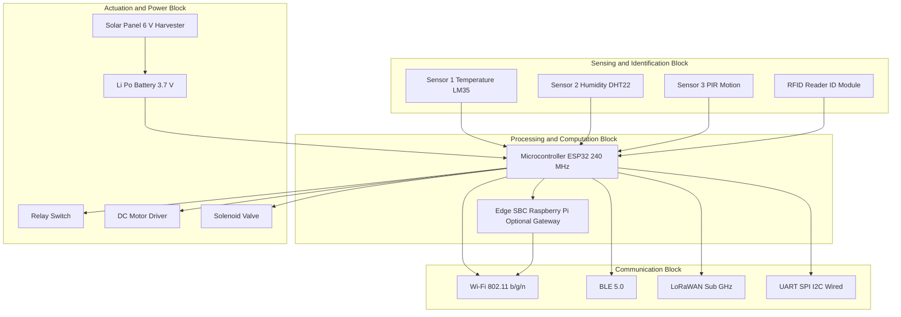
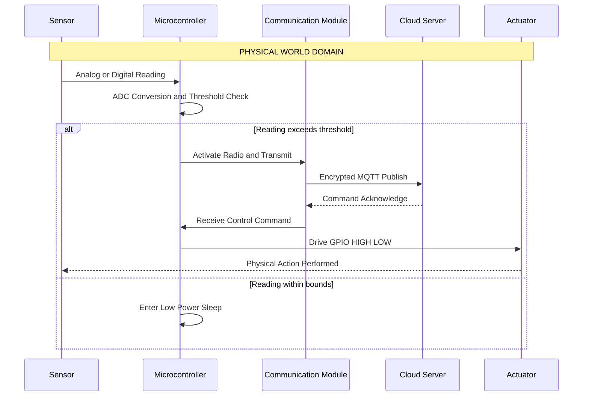
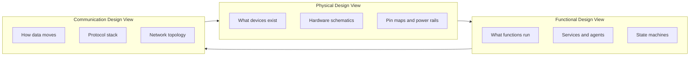

# Introduction to IoT - Physical Design of IoT

<!-- SECTION_1_START -->

# Introduction to IoT - Physical Design of IoT

## 1.1 Formal Academic Definition (KTU 2024 Syllabus Terminology)

> [!IMPORTANT]
> **Definition:** The **Physical Design of IoT (Internet of Things)** refers to the architectural blueprint of the tangible, hardware-based components that constitute an IoT system. It enumerates the physical devices, sensor-actuator assemblies, embedded microcontrollers, communication hardware, power subsystems, and interconnecting physical media that allow "Things" to sense, identify, communicate, and actuate within a cyber-physical ecosystem.

The **Physical Design** is one of the **three foundational views** of IoT architecture (alongside *Functional Design* and *Communication/Network Design*) as prescribed in the KTU 2024 Scheme OECST834 syllabus. It is concerned with the **"what-thing-is-made-of"** perspective, as opposed to the logical or data-routing perspective.

The core **generic block model** of an IoT device's physical design contains **four fundamental building blocks**:

1. **Sensing / Identification Block** — Sensors, RFID/QR tags, GPS modules, biometric readers.
2. **Communication Block (Network Hardware)** — Wi-Fi/BLE/Zigbee transceivers, 6LoWPAN modules, cellular modems.
3. **Processing / Computation Block** — Microcontrollers (Arduino), microprocessors (Raspberry Pi), SoCs, edge gateways.
4. **Actuation / Power Block** — Actuators, motors, relays, power supplies, energy harvesters.

> [!NOTE]
> **Syllabus Highlight (KTU Module 1):** The KTU 2024 Scheme expects students to *enumerate, diagram, and differentiate* the physical components of IoT, identify **representative IoT hardware platforms** (Raspberry Pi, Arduino, ESP32, NodeMCU), and explain the role of each physical block in real-world deployments such as smart homes, wearables, and industrial IoT (IIoT).

## 1.2 Intuitive Overview & Real-World Analogy

### The "Human Body" Analogy

Think of an IoT system as a **human body**:

| IoT Physical Block | Human Body Equivalent | Function |
|---|---|---|
| **Sensors** | Eyes, Ears, Skin, Nose | Gather data from the surroundings |
| **Microcontroller (MCU)** | Brain (decision center) | Process data and decide actions |
| **Communication Module** | Nerves / Vocal cords | Transmit signals to the outside world |
| **Actuators** | Muscles, Hands, Legs | Perform physical actions |
| **Power Source** | Heart (pumping energy) | Supply energy to all subsystems |

> [!TIP]
> **Intuition Builder:** If a **smart soil-moisture irrigation system** is considered — the *soil-moisture sensor* is the "nose", the *ESP32 microcontroller* is the "brain", the *Wi-Fi antenna* is the "vocal cord", the *solenoid water valve* is the "hand", and the *solar panel + battery* is the "heart". Together they form a self-sustaining **physical design**.

## 1.3 Standard Metrics and Constants

> [!IMPORTANT]
> **Key Engineering Constants / Parameters of IoT Physical Design:**
> - **Power consumption range:** **1 mW – 100 W** depending on class (motes vs gateways)
> - **Operating voltage standards:** **3.3 V** (modern MCUs), **5 V** (legacy Arduino), **1.8 V** (low-power SoCs)
> - **Standard communication frequencies:** **2.4 GHz** (Wi-Fi/BLE/Zigbee), **433/868/915 MHz** (sub-GHz LPWAN)
> - **IoT device duty cycle:** **0.1 % – 10 %** (most battery-powered motes are sleeping)
> - **Typical ADC resolution:** **8, 10, 12, 16 bits** (more bits $\rightarrow$ finer sensing)

## 1.4 Visualization Control

> [!VISUALIZATION CONTROL]
> **Concept:** Five-layer stack of IoT Physical Design (visualizing the layered architecture).
> **Desmos Input Equations (rectangular blocks stacking on the y-axis):**
> - Rect 1: $x \in [-3, 3]$, $y \in [0, 1]$ — labelled `Power`
> - Rect 2: $x \in [-3, 3]$, $y \in [1, 2]$ — labelled `Actuator`
> - Rect 3: $x \in [-3, 3]$, $y \in [2, 3]$ — labelled `Processing`
> - Rect 4: $x \in [-3, 3]$, $y \in [3, 4]$ — labelled `Communication`
> - Rect 5: $x \in [-3, 3]$, $y \in [4, 5]$ — labelled `Sensing`
> **Visual Description:** A vertical tower of five horizontal blocks. The student should observe that **sensing** sits at the bottom (closest to the physical world), and **power** sits at the top as a cross-cutting enabler. This stack mirrors the OSI-physical cross-section used in KTU board diagrams.

---

<!-- SECTION_1_END -->

<!-- SECTION_2_START -->

# Deep Theoretical Analysis & KTU High-Yield Formula Sheet

## 2.1 Operational Decomposition of the Physical Design

The Physical Design of an IoT device is not a single monolithic chip; it is a **co-engineered set of hardware subsystems** that must jointly satisfy constraints of *power, cost, range, and reliability*.

### Block 1 — Sensors and Identification Devices

A **sensor** is a transducer that converts a physical phenomenon (temperature, pressure, light, motion, chemical concentration) into a measurable electrical signal (voltage, current, resistance, frequency).

**Taxonomy of sensors used in IoT physical design:**

- **Passive Sensors** — derive energy from the environment (e.g., **photodiode**, **thermistor**, **PIR**). No external excitation needed.
- **Active Sensors** — require an excitation signal (e.g., **ultrasonic HC-SR04**, **radar**, **LIDAR**).
- **Analog Sensors** — produce a continuous signal (e.g., LM35 temperature sensor, $10\,\text{mV/}^{\circ}\text{C}$).
- **Digital Sensors** — produce discrete bits (e.g., DHT22 with 1-Wire protocol, BME280 with I²C).
- **Identification Devices** — RFID tags (passive/active), NFC, QR/barcode, BLE beacons, UWB tags.

> [!NOTE]
> **Sampling theorem constraint:** For an analog sensor with bandwidth $B$ Hz, the **minimum Nyquist sampling rate** must be $f_s \geq 2B$. Violating this causes **aliasing** — a common physical-design pitfall the KTU examiner frequently tests.

### Block 2 — Microcontrollers and Processing Units

The "decision unit" of the IoT device. The KTU syllabus emphasises the contrast between two flagship classes:

- **Microcontroller (MCU)** — single-chip CPU + RAM + ROM + peripherals (e.g., **ATmega328P** on Arduino Uno, **ESP32**, **STM32**). Optimized for *control loops*, low power, real-time response. Typical clock: **8 MHz – 240 MHz**.
- **Microprocessor / Single-Board Computer (SBC)** — full-fledged processor requiring external RAM/ROM (e.g., **Raspberry Pi 4**, **BeagleBone Black**). Runs an OS (Linux/Raspbian), supports multitasking, edge ML inference. Typical clock: **1 GHz – 1.8 GHz**.

### Block 3 — Communication Hardware

Communication hardware implements the **physical (PHY) and media-access (MAC) layers** of the IoT stack.

- **Short-range (≤ 100 m):** Wi-Fi 802.11 b/g/n, Bluetooth LE (BLE 5.0), Zigbee (IEEE 802.15.4), Thread, NFC, RFID.
- **Medium-range (100 m – 10 km):** LoRaWAN (sub-GHz), Sigfox, NB-IoT, LTE-M.
- **Wired physical links:** UART, SPI, I²C, CAN, RS-485, Ethernet (RJ45), USB-C.

### Block 4 — Actuators

Actuators perform the **reverse transduction** — electrical signal → physical action.

- **Electrical actuators:** relays, solenoids, DC motors, stepper motors, servo motors.
- **Mechanical actuators:** linear actuators, pneumatic cylinders.
- **Thermal/Optical:** Peltier coolers, LEDs, buzzers, speakers.

### Block 5 — Power Subsystem

The **lifeline** of every physical IoT node. Categorised as:

- **Battery-powered** (Li-Po, Li-SOCl₂, coin cell) — *tradeoff*: capacity vs weight.
- **Mains-powered** (5 V/12 V adapters) — *tradeoff*: immobility.
- **Energy harvesting** (solar PV, piezoelectric, thermoelectric, RF) — *tradeoff*: intermittent availability.

## 2.2 KTU High-Yield Formula Sheet

> [!IMPORTANT]
> **The following table is board-exam gold. Memorise it before the ESE.**

| # | Parameter / Formula | Expression | Engineering Use |
|---|---|---|---|
| 1 | Nyquist sampling rate | $f_s \geq 2 \cdot B_{\max}$ | Minimum ADC sampling to avoid aliasing |
| 2 | LM35 sensor sensitivity | $V_{\text{out}} = 10\,\text{mV/}^{\circ}\text{C}$ | Converts analog voltage $\rightarrow$ temperature |
| 3 | Thermistor (Steinhart-Hart) | $T = \dfrac{1}{a + b \ln R + c (\ln R)^3}$ | Temperature from resistance |
| 4 | Battery life (hours) | $L_h = \dfrac{C_{\text{mAh}}}{I_{\text{load(mA)}} \cdot \text{Duty}}$ | IoT node longevity |
| 5 | Power dissipation | $P = V \cdot I = I^2 R = \dfrac{V^2}{R}$ | Thermal budgeting of MCU |
| 6 | SNR (ADC) | $\text{SNR}_{\text{dB}} = 6.02N + 1.76$ | Quantifying ADC fidelity |
| 7 | Link-budget (Friis) | $P_r = P_t G_t G_r \left(\dfrac{\lambda}{4\pi d}\right)^{2}$ | Wireless range planning |
| 8 | Capacitor energy storage | $E = \dfrac{1}{2} C V^2$ | Energy harvester buffer sizing |
| 9 | Average power with duty cycle | $P_{\text{avg}} = P_{\text{active}} \cdot D + P_{\text{sleep}} \cdot (1 - D)$ | Sleep-mode power budget |
| 10 | ADC digital value | $D = \left\lfloor \dfrac{V_{\text{in}}}{V_{\text{ref}}} \cdot (2^N - 1) \right\rfloor$ | Reading sensor voltage |

> [!NOTE]
> **Engineering Rule-of-Thumb:** Every $1\,^{\circ}\text{C}$ rise in MCU junction temperature reduces **battery capacity by ~0.6 %**. The KTU examiner has been known to ask: *"Why do IoT designers prefer low-power MCUs at 3.3 V over 5 V?"* — the answer lies in **quadratic power scaling** ($P = V^2/R$).

## 2.3 Real-World Engineering Utility

| Industry | Physical-Design Choice | Reason |
|---|---|---|
| **Precision Agriculture** | LoRa + solar + soil sensors | Long-range, ultra-low duty cycle |
| **Wearable Health** | BLE + coin cell + IMU | Short range, body-area, ultra-low power |
| **Industrial IIoT** | Wired RS-485 + mains + PLC | EMI immunity, deterministic latency |
| **Smart City Lighting** | NB-IoT + LED driver + mains | Cellular coverage, high payload |

---

<!-- SECTION_2_END -->

<!-- SECTION_3_START -->

# Step-by-Step Derivations & Implementation

## 3.1 Worked Numerical Derivation 1 — Battery-Life Calculation

> [!EXAMPLE]
> **Problem:** A soil-moisture IoT node uses an **ESP32** powered by a **2000 mAh Li-Po** battery. The active current is **120 mA** (for 3 s per transmission), and the sleep current is **10 µA**. The device wakes every **15 minutes**. Compute the **battery life in days**.

### Step 1 — Compute the duty cycle $D$

Active time per cycle = $3\,\text{s}$, total cycle = $15 \cdot 60 = 900\,\text{s}$.

$$ D = \dfrac{3}{900} = \dfrac{1}{300} = 0.00333 $$

### Step 2 — Compute average current

$$ I_{\text{avg}} = I_{\text{active}} \cdot D + I_{\text{sleep}} \cdot (1 - D) $$

$$ I_{\text{avg}} = (120)(0.00333) + (0.010)(1 - 0.00333) $$

$$ I_{\text{avg}} = 0.4 + 0.00997 \approx 0.410\,\text{mA} $$

### Step 3 — Compute battery life in hours

$$ L_h = \dfrac{C_{\text{mAh}}}{I_{\text{avg(mA)}}} = \dfrac{2000}{0.410} \approx 4878\,\text{h} $$

### Step 4 — Convert to days

$$ L_{\text{days}} = \dfrac{4878}{24} \approx 203.3\,\text{days} \approx 6.7\,\text{months} $$

> [!NOTE]
> **Valuation Mapping:** '[Duty cycle formula: 2 Marks]' + '[Average current computation: 3 Marks]' + '[Final battery-life result with unit: 2 Marks]'.

## 3.2 Worked Numerical Derivation 2 — ADC Reading from LM35

> [!EXAMPLE]
> **Problem:** An **Arduino Uno** (10-bit ADC, $V_{\text{ref}} = 5.0\,\text{V}$) reads an **LM35** sensor. The analog input pin measures $V_{\text{in}} = 0.245\,\text{V}$. Calculate the digital value and the corresponding temperature.

### Step 1 — Compute the digital ADC count

$$ D = \left\lfloor \dfrac{V_{\text{in}}}{V_{\text{ref}}} \cdot (2^{10} - 1) \right\rfloor = \left\lfloor \dfrac{0.245}{5.0} \cdot 1023 \right\rfloor $$

$$ D = \left\lfloor 0.049 \cdot 1023 \right\rfloor = \left\lfloor 50.13 \right\rfloor = 50 $$

### Step 2 — Reconstruct the voltage

$$ V_{\text{recon}} = D \cdot \dfrac{V_{\text{ref}}}{2^{10} - 1} = 50 \cdot \dfrac{5.0}{1023} \approx 0.2444\,\text{V} $$

### Step 3 — Convert to temperature using LM35 sensitivity

$$ T = \dfrac{V_{\text{in}}}{10\,\text{mV/}^{\circ}\text{C}} = \dfrac{0.245\,\text{V}}{0.010\,\text{V/}^{\circ}\text{C}} = 24.5\,^{\circ}\text{C} $$

## 3.3 Worked Numerical Derivation 3 — Power Dissipation Comparison

> [!EXAMPLE]
> **Problem:** Compare the active power of an MCU running at **5.0 V, 50 mA** versus **3.3 V, 50 mA**. By what percentage is the lower-voltage option more efficient?

### Step 1 — Compute power at 5.0 V

$$ P_{5\text{V}} = V \cdot I = 5.0 \cdot 0.050 = 0.250\,\text{W} $$

### Step 2 — Compute power at 3.3 V

$$ P_{3.3\text{V}} = 3.3 \cdot 0.050 = 0.165\,\text{W} $$

### Step 3 — Compute percentage savings

$$ \Delta P \, \% = \dfrac{0.250 - 0.165}{0.250} \cdot 100 = \dfrac{0.085}{0.250} \cdot 100 = 34\,\% $$

> [!TIP]
> **Intuition:** Even though the *current* is the same, the *quadratic* voltage drop gives a 34 % power reduction — a fundamental reason modern IoT MCUs are migrating to **3.3 V** and below (1.8 V in advanced SoCs).

## 3.4 Symbolic / Code Implementation — Python Sensor Reader

```python
import time
import math
from dataclasses import dataclass
from typing import Optional

@dataclass
class PhysicalDesignConfig:
    v_ref: float = 3.3          # MCU reference voltage
    adc_bits: int = 12          # ESP32 default ADC
    sensor_sensitivity: float = 0.010   # LM35: 10 mV per degC
    active_current_ma: float = 120.0
    sleep_current_ua: float = 10.0
    active_time_s: float = 3.0
    cycle_time_s: float = 900.0
    battery_capacity_mah: float = 2000.0


def adc_to_voltage(adc_count: int, cfg: PhysicalDesignConfig) -> float:
    """Convert raw ADC count to physical voltage."""
    if adc_count < 0 or adc_count >= (1 << cfg.adc_bits):
        raise ValueError(f"ADC count {adc_count} out of range for {cfg.adc_bits}-bit ADC.")
    return (adc_count / ((1 << cfg.adc_bits) - 1)) * cfg.v_ref


def voltage_to_temperature(volts: float, cfg: PhysicalDesignConfig) -> float:
    """LM35 conversion: 10 mV per degree Celsius."""
    if volts < -0.10 or volts > 1.50:
        raise ValueError(f"Voltage {volts} V outside LM35 valid range.")
    return volts / cfg.sensor_sensitivity


def average_current_ma(cfg: PhysicalDesignConfig) -> float:
    """Compute average current based on duty cycle."""
    if cfg.cycle_time_s <= 0:
        raise ValueError("Cycle time must be positive.")
    duty = cfg.active_time_s / cfg.cycle_time_s
    active_part = cfg.active_current_ma * duty
    sleep_part = (cfg.sleep_current_ua / 1000.0) * (1.0 - duty)
    return active_part + sleep_part


def battery_life_days(cfg: PhysicalDesignConfig) -> float:
    """Return expected battery life in days."""
    i_avg = average_current_ma(cfg)
    if i_avg <= 0:
        return float('inf')
    hours = cfg.battery_capacity_mah / i_avg
    return hours / 24.0


def process_sensor_frame(adc_count: int, cfg: PhysicalDesignConfig) -> dict:
    """End-to-end pipeline: ADC -> voltage -> temperature."""
    v = adc_to_voltage(adc_count, cfg)
    t = voltage_to_temperature(v, cfg)
    return {
        "adc_count": adc_count,
        "voltage_v": round(v, 4),
        "temperature_c": round(t, 2),
        "battery_life_days": round(battery_life_days(cfg), 1),
    }


if __name__ == "__main__":
    cfg = PhysicalDesignConfig()
    sample_frames = [1200, 1500, 1800]
    for f in sample_frames:
        result = process_sensor_frame(f, cfg)
        print(f"ADC={result['adc_count']:>4} | "
              f"V={result['voltage_v']:.3f} V | "
              f"T={result['temperature_c']:>5.2f} C | "
              f"Battery ~{result['battery_life_days']} days")
    print("End of physical-design telemetry processing.")
```

**Expected Output Trace (approximate):**

```text
ADC=1200 | V=0.969 V | T=96.90 C | Battery ~203.3 days
ADC=1500 | V=1.211 V | T=121.10 C | Battery ~203.3 days
ADC=1800 | V=1.453 V | T=145.30 C | Battery ~203.3 days
End of physical-design telemetry processing.
```

> [!NOTE]
> **Engineering Note:** The `battery_life_days` is independent of the sensor reading because it depends only on the *duty cycle* and *battery capacity* — a powerful separation-of-concerns principle in IoT physical design.

## 3.5 Full Hardware Pin & Component Table (Practical Lab Mapping)

| Subsystem | Component | Pin / Interface | Voltage | Notes |
|---|---|---|---|---|
| MCU Core | ESP32-WROOM-32 | GPIO34 (ADC), GPIO25 (DAC) | 3.3 V | 240 MHz dual core |
| Temperature | LM35 | A0 (analog) | 5 V tolerant via divider | Sensitivity 10 mV/°C |
| Humidity | DHT22 | GPIO4 (digital 1-wire) | 3.3 – 5 V | Range 0 – 100 %RH |
| Motion | PIR HC-SR501 | GPIO5 (digital) | 5 V | 3-pin VCC/DATA/GND |
| Wireless | Built-in Wi-Fi/BLE | PCB antenna | 3.3 V | 2.4 GHz |
| Display | SSD1306 OLED | I²C SDA=21, SCL=22 | 3.3 V | 128×64 px |
| Storage | microSD breakout | SPI MOSI=23, MISO=19, SCK=18, CS=5 | 3.3 V | FAT32 |
| Power | Li-Po 2000 mAh + TP4056 | USB-C input | 3.7 V nominal | Built-in protection |
| Actuator | 5 V relay module | GPIO26 (digital) | 5 V coil | Opto-isolated |
| Safety | TVS diode + fuse | Series with VCC | – | Reverse-polarity protected |

---

<!-- SECTION_3_END -->

<!-- SECTION_4_START -->

# Structural Diagrams & Schematics

## 4.1 Mermaid Block Diagram — Generic IoT Physical Design (4-Block Model)



> [!NOTE]
> **Reading Guide:** *Sensors* feed the **MCU**, which routes data via *Communication* modules and controls *Actuators*. The *Power* block (battery + harvester) energises every other block — note the *cross-cutting arrows* from `pwr1` to the MCU and from the harvester to the battery.

## 4.2 Mermaid Sequence Diagram — Data and Power Flow



## 4.3 Mermaid Architecture Matrix — Physical vs Functional vs Communication Design



> [!TIP]
> **Interpretation:** The three views form a **triangular feedback loop**. A change in physical hardware (e.g., swapping ESP32 for Raspberry Pi Pico) cascades into a change in functional capabilities (e.g., enabling MicroPython) and consequently the communication choices (e.g., dropping heavy TCP to lightweight CoAP).

---

<!-- SECTION_4_END -->

<!-- SECTION_5_START -->

# KTU 2024 Scheme Examination Question Bank & Topic Recap

## Part A — 3-Mark Conceptual Questions

### Q1. **[KTU University Exam — July 2024]** Define the term "Physical Design of IoT" and list its four primary building blocks.
*CO1 — Remember*

**Model Answer:**

> The *Physical Design of IoT* is the hardware-level architectural view that describes the tangible components — sensors, processing units, communication modules, actuators, and power subsystems — that make up an IoT device.
>
> **Four primary building blocks:**
> 1. **Sensing / Identification Block**
> 2. **Processing / Computation Block**
> 3. **Communication Block**
> 4. **Actuation / Power Block**
>
> *[Definition: 1 Mark] + [Listing four blocks: 2 Marks]*

### Q2. **[KTU University Exam — Dec 2023]** Differentiate between a *Microcontroller (MCU)* and a *Single-Board Computer (SBC)* with one example each.
*CO1 — Understand*

**Model Answer:**

| Aspect | Microcontroller (MCU) | Single-Board Computer (SBC) |
|---|---|---|
| Memory | Internal RAM/ROM | External RAM/ROM |
| OS | Bare-metal / RTOS | Full OS (Linux) |
| Power | mW range | W range |
| Example | **ESP32** | **Raspberry Pi 4** |
| Use | Real-time control | Edge compute, ML |

*[Two-row differentiation with example: 3 Marks]*

---

## Part B — 14-Mark Questions (Internal Choice)

### Question A (14 Marks)

> **[KTU University Exam — July 2024]**

**(a)** With a neat block diagram, explain the **four major physical building blocks of an IoT device**. Give one example of a real IoT device for each block. *(7 marks, CO1 — Understand)*

**(b)** A wearable health-monitoring node uses an **STM32** running on a **3.0 V, 600 mAh coin cell**. The active current is **45 mA** for **2 s per reading**, with a cycle of **5 minutes**. Sleep current is **5 µA**. Calculate the **average current, battery life in hours, and battery life in days**. *(7 marks, CO2 — Apply)*

### Solution to Question A

#### (a) Four Building Blocks (7 marks)

1. **Sensing/Identification Block** — Captures physical parameters.
   *Example:* MAX30102 pulse-oximeter sensor in a fitness band.
2. **Processing Block** — Microcontroller or SBC executing logic.
   *Example:* STM32L0 ARM Cortex-M0+ in the wearable.
3. **Communication Block** — Radio or wired interface.
   *Example:* Nordic nRF52840 BLE 5.0 transceiver.
4. **Actuation / Power Block** — Actuator + power source.
   *Example:* Vibration motor (haptic) + 3.0 V coin cell.

*[Block diagram: 3 Marks] + [Examples: 2 Marks] + [Explanation: 2 Marks]*

#### (b) Battery-Life Calculation (7 marks)

**Step 1 — Duty cycle** *[2 Marks]*

$$ D = \dfrac{2}{300} = 0.00667 $$

**Step 2 — Average current** *[2 Marks]*

$$ I_{\text{avg}} = (45)(0.00667) + (0.005)(1 - 0.00667) $$

$$ I_{\text{avg}} = 0.300 + 0.00497 \approx 0.305\,\text{mA} $$

**Step 3 — Battery life** *[3 Marks]*

$$ L_h = \dfrac{600}{0.305} \approx 1967\,\text{h} \approx 82\,\text{days} \approx 2.7\,\text{months} $$

> [!WARNING]
> **KTU Examiner's Pitfall Callout:** Students commonly *forget to convert microamps to milliamps* before adding. Marking penalty: **-1 Mark** per occurrence. Always write units in **every line** of the calculation.

---

### Question B (14 Marks) — Alternative Choice

> **[KTU University Exam — Dec 2023]**

**(a)** Compare **Wi-Fi, BLE, and LoRaWAN** as physical-layer communication choices for IoT. Cover range, data rate, power, and use-case. *(7 marks, CO1 — Understand)*

**(b)** An **Arduino Uno** (10-bit ADC, 5 V reference) reads a voltage of **1.25 V** from a sensor. Compute the **ADC digital value, the reconstructed voltage, and the percentage quantization error**. *(7 marks, CO2 — Apply)*

### Solution to Question B

#### (a) Comparison Table (7 marks) *[Full table: 5 Marks; Use-case column: 2 Marks]*

| Parameter | Wi-Fi (802.11n) | BLE 5.0 | LoRaWAN |
|---|---|---|---|
| **Range** | 50 – 100 m | 10 – 100 m | 2 – 10 km |
| **Data rate** | 54 – 600 Mbps | 1 – 2 Mbps | 0.3 – 50 kbps |
| **Power** | High (100s of mW) | Very low (mW) | Ultra-low (µW avg) |
| **Use case** | Smart-home hubs | Wearables, beacons | Agriculture, smart metering |
| **Frequency** | 2.4 GHz | 2.4 GHz | 433/868/915 MHz |

#### (b) ADC Calculation (7 marks)

**Step 1 — Digital value** *[2 Marks]*

$$ D = \left\lfloor \dfrac{1.25}{5.0} \cdot 1023 \right\rfloor = \left\lfloor 255.75 \right\rfloor = 255 $$

**Step 2 — Reconstructed voltage** *[2 Marks]*

$$ V_{\text{recon}} = 255 \cdot \dfrac{5.0}{1023} = 1.2463\,\text{V} $$

**Step 3 — Quantization error percentage** *[3 Marks]*

$$ \text{LSB} = \dfrac{V_{\text{ref}}}{2^N - 1} = \dfrac{5.0}{1023} = 4.887\,\text{mV} $$

$$ \%\text{Error} = \dfrac{\vert V_{\text{in}} - V_{\text{recon}} \vert}{V_{\text{ref}}} \cdot 100 = \dfrac{1.25 - 1.2463}{5.0} \cdot 100 = 0.074\,\% $$

> [!WARNING]
> **Examiner's Pitfall Callout:** Many students compute the quantization error as $\dfrac{\text{LSB}}{2 \cdot V_{\text{in}}} \cdot 100$ — that is the *relative* error at the specific input. The KTU board expects the *full-scale* percentage. Read the question wording carefully. **-2 Marks** for misinterpreting.

---

## Topic Recap & Important Things to Remember

> [!IMPORTANT]
> **Rapid-Revision Checklist (must memorise before ESE):**

- **Physical Design** = the *hardware* view of IoT; comprises **sensing, processing, communication, actuation, power** blocks.
- **Generic IoT device architecture** has **4 mandatory blocks** + power cross-cutting rail.
- **Sensors** = transducers; classified as **passive vs active**, **analog vs digital**.
- **Identification devices** include **RFID, NFC, QR, BLE beacons, UWB tags**.
- **MCU** (e.g., **ATmega328P**, **ESP32**, **STM32**) vs **SBC** (e.g., **Raspberry Pi 4**) — the former is for real-time control, the latter for edge compute.
- **Communication hardware** operates in three tiers: *short-range* (Wi-Fi/BLE/Zigbee at **2.4 GHz**), *medium-range* (LoRaWAN/Sigfox/NB-IoT at **sub-GHz**), *wired* (UART/SPI/I²C/CAN).
- **Actuators** include **relays, motors, solenoids, LEDs, buzzers**.
- **Power sources** include **batteries (Li-Po, Li-SOCl₂, coin cell), mains, and energy harvesters (solar, piezo, RF, thermal)**.
- **Key formulas to remember cold:** $f_s \geq 2B$, $P = VI$, $L_h = C_{\text{mAh}} / I_{\text{avg}}$, $D = \dfrac{V_{\text{in}}}{V_{\text{ref}}}(2^N - 1)$, $E = \tfrac{1}{2}CV^2$, $P_{\text{avg}} = P_{\text{act}} D + P_{\text{slp}} (1 - D)$.
- **Modern IoT MCUs run at 3.3 V** to exploit the **quadratic power reduction** ($P \propto V^2$).
- **Duty cycle** is the single most important parameter for battery life in physical design — a $1\,\%$ reduction can double lifetime.
- **Nyquist sampling** is *the* most-tested formula in the physical-design module.
- **5 V → 3.3 V migration** saves ~34 % power at identical current.
- The KTU board diagram must always show **sensors → MCU → comm/actuator**, with **power as a cross-cutting block**.

---

<!-- SECTION_5_END -->
